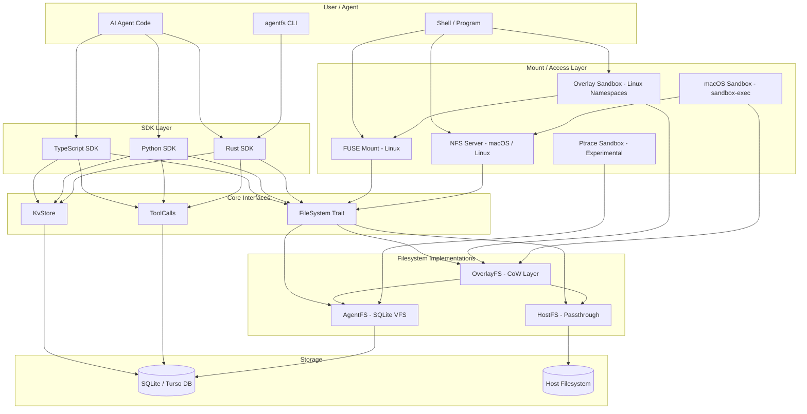
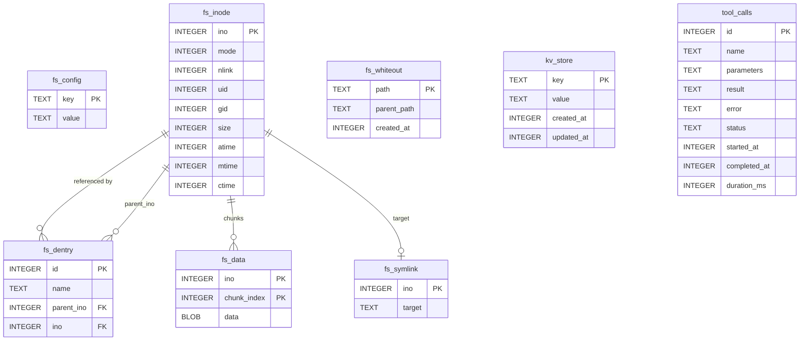
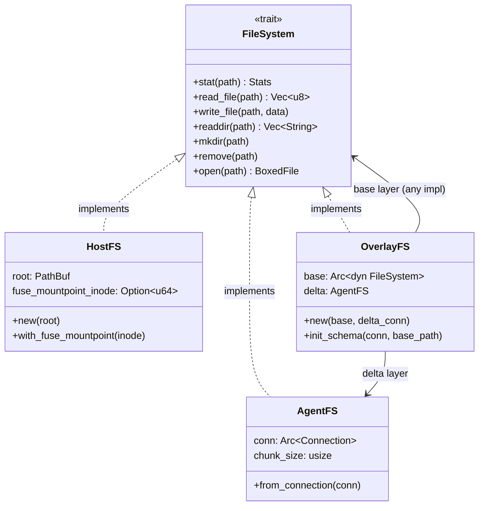
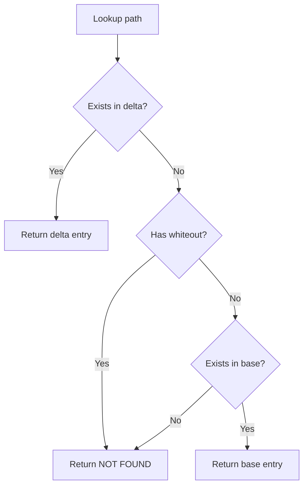
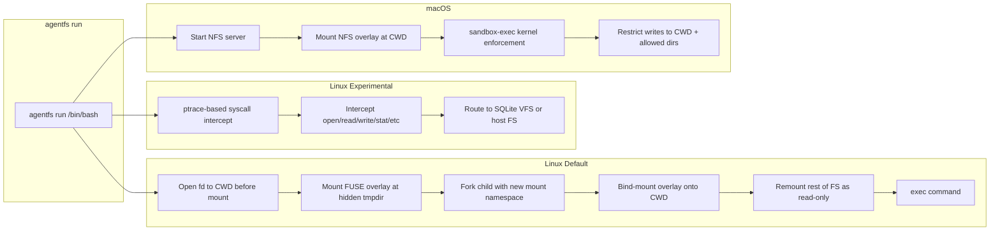
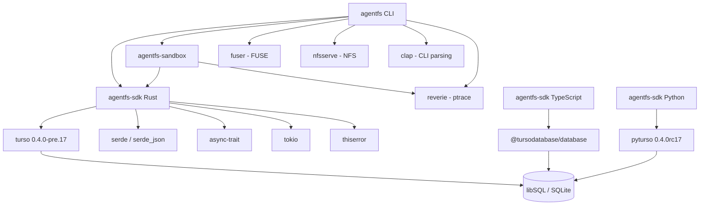
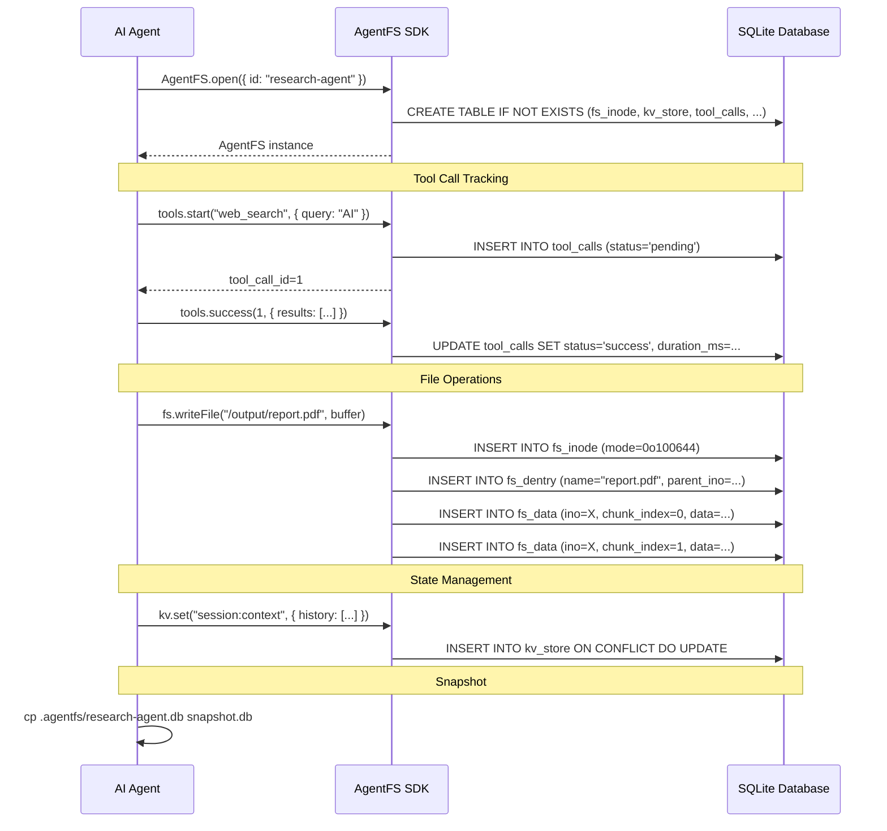

# AgentFS -- The Filesystem for AI Agents

## Project Overview

AgentFS is a purpose-built filesystem for AI agents, created by Turso (the company behind the libSQL/Turso database). It provides structured, auditable, and portable storage abstractions that AI agents need -- a virtual filesystem, key-value store, and tool call audit trail -- all backed by a single SQLite database file.

The project is currently in **alpha** status (v0.4.0) and is MIT-licensed.

### Core Value Proposition

1. **Auditability** -- Every file operation, tool call, and state change is recorded in SQLite. Query complete agent history with SQL.
2. **Reproducibility** -- Snapshot agent state with `cp agent.db snapshot.db`. Restore exact execution states.
3. **Portability** -- Entire agent runtime lives in a single SQLite file. Move between machines, check into VCS, deploy anywhere Turso runs.

### What It Ships

| Component | Description |
|---|---|
| **CLI** (`agentfs`) | Rust binary for init, mount (FUSE/NFS), sandboxed `run`, filesystem inspection |
| **Rust SDK** (`agentfs-sdk`) | Core library with `FileSystem` trait, KV store, tool call tracking |
| **TypeScript SDK** (`agentfs-sdk` on npm) | Node.js and browser support via `@tursodatabase/database` |
| **Python SDK** (`agentfs-sdk` on PyPI) | Python 3.10+ via `pyturso` |
| **Sandbox** (`agentfs-sandbox`) | Linux ptrace-based syscall interception for experimental sandboxing |
| **Specification** (`SPEC.md`) | Formal SQLite schema specification (v0.2) |

## Architecture



## Directory Structure

```
agentfs/
  cli/                          # Main CLI binary (Rust)
    src/
      main.rs                   # Entry point, command dispatch
      lib.rs                    # Module declarations
      parser.rs                 # Clap CLI argument definitions
      fuse.rs                   # FUSE filesystem adapter (Linux)
      nfs.rs                    # NFS server adapter (Unix)
      daemon.rs                 # Background daemon support (Linux)
      cmd/
        mod.rs                  # Command module routing
        init.rs                 # `agentfs init` handler
        fs.rs                   # `agentfs fs ls/cat/diff` handlers
        mount.rs                # `agentfs mount` handler (Linux FUSE)
        mount_stub.rs           # Mount stub for non-Linux
        run.rs                  # `agentfs run` dispatcher (Linux)
        run_nfs.rs              # NFS-based run for macOS
        run_stub.rs             # Run stub for unsupported platforms
        nfs.rs                  # `agentfs nfs` command
        completions.rs          # Shell completion management
      sandbox/
        mod.rs                  # Sandbox module declarations
        overlay.rs              # FUSE + Linux namespace sandbox
        ptrace.rs               # Experimental ptrace sandbox
        sandbox_macos.rs        # macOS sandbox-exec wrapper
    tests/                      # Shell-based integration tests + C syscall tests
    Cargo.toml                  # v0.4.0, depends on agentfs-sdk, turso 0.4.0-pre.17

  sdk/
    rust/                       # Core Rust SDK
      src/
        lib.rs                  # AgentFS struct, AgentFSOptions, open/resolve logic
        kvstore.rs              # KvStore implementation
        toolcalls.rs            # ToolCalls tracking implementation
        filesystem/
          mod.rs                # FileSystem trait, Stats, FsError, File trait
          agentfs.rs            # SQLite-backed filesystem implementation
          hostfs.rs             # Host filesystem passthrough (Unix)
          overlayfs.rs          # Copy-on-write overlay filesystem
      benches/overlayfs.rs      # OverlayFS benchmarks
      Cargo.toml                # v0.4.0, depends on turso, serde, async-trait

    typescript/                 # TypeScript SDK
      src/
        agentfs.ts              # AgentFSCore class
        kvstore.ts              # KV store
        toolcalls.ts            # Tool call tracking
        filesystem/             # FS operations
        integrations/just-bash/ # just-bash integration
      package.json              # v0.4.0, @tursodatabase/database

    python/                     # Python SDK
      agentfs_sdk/
        agentfs.py              # Main AgentFS class
        filesystem.py           # Filesystem operations
        kvstore.py              # KV store
        toolcalls.py            # Tool calls
        guards.py               # Input validation
      pyproject.toml            # v0.4.0, pyturso dependency

  sandbox/                      # Standalone sandbox crate
    src/
      lib.rs                    # Re-exports
      sandbox/mod.rs            # Sandbox initialization
      syscall/                  # Syscall interceptors (file, process, stat, xattr)
      vfs/                      # Virtual filesystem layer
        mod.rs                  # Vfs trait
        bind.rs                 # Bind/passthrough VFS
        fdtable.rs              # File descriptor table
        file.rs                 # File operations trait
        mount.rs                # Mount table / routing
        sqlite.rs               # SQLite-backed VFS via AgentFS SDK

  examples/
    ai-sdk-just-bash/           # Vercel AI SDK + just-bash
    claude-agent/               # Anthropic Claude Agent SDK
    mastra/                     # Mastra AI framework
    openai-agents/              # OpenAI Agents SDK
    firecracker/                # Firecracker VM example

  SPEC.md                       # Agent Filesystem Specification v0.2
  MANUAL.md                     # Complete user manual
  CHANGELOG.md                  # Version history
  dist-workspace.toml           # cargo-dist release config
```

## SQLite Schema Design (SPEC v0.2)

The entire agent state is captured in a single SQLite database with three subsystems. This is the heart of AgentFS.



### Key Schema Details

**Virtual Filesystem (Unix inode model):**
- `fs_config` -- Immutable config, stores `chunk_size` (default 4096 bytes)
- `fs_inode` -- File/directory metadata using Unix mode bits (S_IFREG=0o100000, S_IFDIR=0o040000, S_IFLNK=0o120000). Inode 1 is always root.
- `fs_dentry` -- Directory entries mapping names to inodes. `UNIQUE(parent_ino, name)` prevents duplicates. Multiple dentries to the same inode enable hard links.
- `fs_data` -- File content stored as fixed-size chunks (4KB default). `PRIMARY KEY (ino, chunk_index)` for efficient random access.
- `fs_symlink` -- Symbolic link targets stored separately.
- `fs_whiteout` -- Overlay filesystem deletion markers with `parent_path` index for O(1) child lookups.

**Key-Value Store:**
- `kv_store` -- Simple key-value with JSON-serialized values, automatic timestamps, upsert via `ON CONFLICT`.

**Tool Call Audit Trail:**
- `tool_calls` -- Insert-only audit log with `name`, `parameters` (JSON), `result` (JSON), `error`, timing data. Indexed on `name` and `started_at`.

## The FileSystem Trait

The Rust SDK defines a central `FileSystem` async trait that all filesystem implementations must satisfy:

```rust
#[async_trait]
pub trait FileSystem: Send + Sync {
    async fn stat(&self, path: &str) -> Result<Option<Stats>>;
    async fn lstat(&self, path: &str) -> Result<Option<Stats>>;
    async fn read_file(&self, path: &str) -> Result<Option<Vec<u8>>>;
    async fn write_file(&self, path: &str, data: &[u8]) -> Result<()>;
    async fn readdir(&self, path: &str) -> Result<Option<Vec<String>>>;
    async fn readdir_plus(&self, path: &str) -> Result<Option<Vec<DirEntry>>>;
    async fn mkdir(&self, path: &str) -> Result<()>;
    async fn remove(&self, path: &str) -> Result<()>;
    async fn chmod(&self, path: &str, mode: u32) -> Result<()>;
    async fn rename(&self, from: &str, to: &str) -> Result<()>;
    async fn symlink(&self, target: &str, linkpath: &str) -> Result<()>;
    async fn readlink(&self, path: &str) -> Result<Option<String>>;
    async fn statfs(&self) -> Result<FilesystemStats>;
    async fn open(&self, path: &str) -> Result<BoxedFile>;
}
```

There is also a `File` trait for open file handle operations (pread, pwrite, truncate, fsync, fstat), enabling efficient I/O without repeated path lookups.

### Three Implementations



1. **AgentFS** -- SQLite-backed. All data stored in `fs_inode`, `fs_dentry`, `fs_data` tables. Supports chunked reads/writes, sparse files, symlinks.
2. **HostFS** -- Passthrough to a host directory. Maps virtual paths to real paths. Includes FUSE mountpoint deadlock prevention (skips its own inode during readdir).
3. **OverlayFS** -- Copy-on-write combining a read-only base (any `FileSystem`) with a writable AgentFS delta. Whiteout table tracks deletions. Supports stacking (overlay of overlays).

### Overlay Lookup Semantics



When writing: if the file only exists in the base layer, copy-on-write copies it to delta first, ensuring parent directories exist. All modifications go to delta.

## CLI Commands

| Command | Description |
|---|---|
| `agentfs init [ID] [--force] [--base PATH]` | Create new SQLite-backed agent filesystem at `.agentfs/{ID}.db` |
| `agentfs mount <ID_OR_PATH> <MOUNTPOINT>` | Mount via FUSE (Linux) or NFS (macOS) |
| `agentfs run [COMMAND] [--session ID] [--allow PATH]` | Execute in sandboxed CoW environment |
| `agentfs fs ls <ID_OR_PATH> [PATH]` | List files in agent database |
| `agentfs fs cat <ID_OR_PATH> <FILE>` | Display file contents from database |
| `agentfs diff <ID_OR_PATH>` | Show changes in overlay delta |
| `agentfs nfs <ID_OR_PATH> [--bind IP] [--port PORT]` | Start standalone NFS server |
| `agentfs completions install/uninstall/show` | Shell completion management |

## Sandboxing Architecture

The `agentfs run` command provides filesystem isolation with copy-on-write semantics. The implementation varies by platform:



### Linux Overlay Sandbox (Default)

Uses FUSE + Linux user and mount namespaces:
1. Opens an fd to CWD before mounting (avoids circular reference)
2. Mounts FUSE filesystem at a hidden temp directory
3. Forks a child process with `CLONE_NEWUSER | CLONE_NEWNS`
4. Bind-mounts the FUSE overlay onto the working directory
5. Remounts everything else read-only (except `/proc`, `/sys`, `/dev`, `/tmp`, and `--allow` paths)
6. Execs the target command
7. All writes captured in AgentFS database; originals untouched

Key env vars set inside sandbox: `AGENTFS=1`, `AGENTFS_SANDBOX=linux-namespace`, `AGENTFS_SESSION={id}`

### Linux ptrace Sandbox (Experimental)

Uses Facebook's `reverie` framework for ptrace-based syscall interception:
- Intercepts filesystem syscalls (open, read, write, stat, lstat, fstat, getdents, etc.)
- Routes `/agent/*` paths to SQLite VFS
- All other paths pass through to host
- `--strace` flag enables syscall tracing output

### macOS Sandbox

Uses NFS + Apple's `sandbox-exec`:
- Starts an NFS server for the overlay filesystem
- Mounts via NFS (no FUSE needed on macOS)
- Uses kernel-enforced sandbox (`sandbox-exec`) to restrict writes
- Allows: CWD (overlay), `/tmp`, `~/.claude`, `~/.config`, `~/.cache`, `~/.local`, `~/.npm`

## FUSE Implementation

The FUSE adapter (`cli/src/fuse.rs`) bridges the `FileSystem` trait to Linux FUSE via the `fuser` crate:

- Maps FUSE operations (lookup, getattr, read, write, mkdir, unlink, etc.) to `FileSystem` trait calls
- Maintains an inode-to-path cache (`HashMap<u64, String>`) for path resolution
- Tracks open file handles (`HashMap<u64, OpenFile>`) with atomic file handle allocation
- Uses `TTL = Duration::MAX` for cache entries (explicitly invalidated on mutations)
- Enables FUSE optimizations: `FUSE_ASYNC_READ`, `FUSE_PARALLEL_DIROPS`, `FUSE_WRITEBACK_CACHE`, `FUSE_CACHE_SYMLINKS`
- Configurable UID/GID override for all files
- Deadlock prevention: HostFS skips its own mountpoint inode during readdir to avoid re-entering the FUSE handler

## NFS Implementation

The NFS adapter (`cli/src/nfs.rs`) wraps the `FileSystem` trait as an NFS server using the `nfsserve` crate:

- Implements `NFSFileSystem` trait from nfsserve
- Maintains bidirectional inode-to-path mapping (`InodeMap`) since NFS identifies files by inode
- Used on macOS (where FUSE is not available) and as a standalone server via `agentfs nfs`
- Binds to `127.0.0.1:11111` by default

## SDK API Surface

### Opening an AgentFS Instance

```rust
// Persistent with agent ID
let agent = AgentFS::open(AgentFSOptions::with_id("my-agent")).await?;
// Creates .agentfs/my-agent.db

// Ephemeral in-memory
let agent = AgentFS::open(AgentFSOptions::ephemeral()).await?;

// Custom path
let agent = AgentFS::open(AgentFSOptions::with_path("./data/agent.db")).await?;

// With overlay base directory
let agent = AgentFS::open(
    AgentFSOptions::with_id("workspace").with_base("/home/user/project")
).await?;

// Resolve from ID or path string (CLI uses this)
let opts = AgentFSOptions::resolve("my-agent")?; // Checks .agentfs/my-agent.db
let opts = AgentFSOptions::resolve("/path/to/agent.db")?; // Direct path
let opts = AgentFSOptions::resolve(":memory:")?; // In-memory
```

Agent ID validation: alphanumeric, hyphens, underscores only -- prevents path traversal.

### KvStore API

```rust
pub struct KvStore { conn: Arc<Connection> }

impl KvStore {
    async fn set<V: Serialize>(&self, key: &str, value: &V) -> Result<()>;
    async fn get<V: Deserialize>(&self, key: &str) -> Result<Option<V>>;
    async fn delete(&self, key: &str) -> Result<()>;
    async fn keys(&self) -> Result<Vec<String>>;
}
```

- Values auto-serialized/deserialized via serde_json
- Upsert semantics via `ON CONFLICT` clause
- Automatic `updated_at` timestamp management

### ToolCalls API

```rust
pub struct ToolCalls { conn: Arc<Connection> }

impl ToolCalls {
    // Start/complete workflow
    async fn start(&self, name: &str, params: Option<Value>) -> Result<i64>;
    async fn success(&self, id: i64, result: Option<Value>) -> Result<()>;
    async fn error(&self, id: i64, error: &str) -> Result<()>;

    // Spec-compliant single-insert
    async fn record(&self, name, started_at, completed_at, params, result, error) -> Result<i64>;

    // Querying
    async fn get(&self, id: i64) -> Result<Option<ToolCall>>;
    async fn recent(&self, limit: Option<i64>) -> Result<Vec<ToolCall>>;
    async fn stats_for(&self, name: &str) -> Result<Option<ToolCallStats>>;
    async fn stats(&self) -> Result<Vec<ToolCallStats>>;
}
```

Two recording patterns:
1. **Start/complete** -- Call `start()` to get ID, then `success()` or `error()` when done. Duration auto-calculated.
2. **Record** -- Single insert with all data provided. Spec-compliant insert-only approach.

### TypeScript SDK

Published as `agentfs-sdk` on npm. Dual entry points: Node.js (`index_node.js`) and browser (`index_browser.js`).

```typescript
import { AgentFS } from 'agentfs-sdk';

const agent = await AgentFS.open({ id: 'my-agent' });

// Filesystem
await agent.fs.writeFile('/path', 'content');
const data = await agent.fs.readFile('/path');
const files = await agent.fs.readdir('/dir');
const stats = await agent.fs.stat('/path');

// Key-value
await agent.kv.set('key', { any: 'value' });
const val = await agent.kv.get('key');

// Tool calls
await agent.tools.record('tool_name', startedAt, completedAt, params, result);
const stats = await agent.tools.getStats();
```

Includes a `just-bash` integration exported at `agentfs-sdk/just-bash` for the Vercel AI SDK.

### Python SDK

Published as `agentfs-sdk` on PyPI. Requires Python 3.10+, depends on `pyturso`.

## Dependency Graph



Key dependencies:
- **turso 0.4.0-pre.17** -- In-process SQL database (SQLite-compatible), the storage engine
- **fuser 0.15** -- FUSE filesystem in Rust (Linux only, ABI 7.29)
- **nfsserve 0.10** -- NFS server implementation (Linux + macOS)
- **reverie** (Facebook) -- ptrace-based syscall interception framework (Linux only, experimental)
- **clap 4** with `clap_complete` -- CLI argument parsing with dynamic completions
- **tokio** -- Async runtime (full features)
- **parking_lot** -- Mutex for FUSE path/file handle caches

## Platform Support

| Feature | Linux x86_64 | Linux ARM64 | macOS x86_64 | macOS ARM64 | Windows |
|---|---|---|---|---|---|
| CLI init/fs | Yes | Yes | Yes | Yes | Yes |
| FUSE mount | Yes | Yes | No | No | No |
| NFS mount | Yes | Yes | Yes | Yes | No |
| `agentfs run` (overlay) | Yes | Yes | Yes (NFS) | Yes (NFS) | No |
| `agentfs run` (ptrace) | Yes | No* | No | No | No |
| SDK (Rust) | Yes | Yes | Yes | Yes | Yes |
| SDK (TypeScript) | Yes | Yes | Yes | Yes | Yes |
| SDK (Python) | Yes | Yes | Yes | Yes | Yes |

*ARM support for ptrace sandbox requires libunwind-dev.

## Testing Strategy

- **Rust SDK**: Unit tests in each module (`#[tokio::test]`), property testing with `proptest` for overlay filesystem
- **Rust SDK Benchmarks**: Criterion benchmarks for OverlayFS performance
- **CLI Integration Tests**: Shell scripts (`tests/*.sh`) for init, mount, run, symlinks
- **CLI Syscall Tests**: C programs (`tests/syscall/*.c`) testing low-level syscall behavior (open, read, write, stat, dup, getdents64, etc.)
- **TypeScript**: Vitest with both Node.js and browser (Chromium + Firefox) configurations
- **Python**: pytest with pytest-asyncio

## Deployment and Distribution

- **cargo-dist** (`dist-workspace.toml`) handles releases
- Targets: `aarch64-apple-darwin`, `aarch64-unknown-linux-gnu`, `x86_64-apple-darwin`, `x86_64-unknown-linux-gnu`, `x86_64-pc-windows-msvc`
- Installers: shell script and PowerShell
- CI via GitHub Actions with separate workflows for Rust, TypeScript, Python, and releases
- Binary installed to `CARGO_HOME` with built-in updater

## How Agents Interact with AgentFS



### Example Integrations (from repo)

The repository ships working examples for:
- **Mastra** -- Research assistant with PDF ingestion, semantic search, and workflow orchestration
- **Claude Agent SDK** -- Research assistant using Anthropic's tool-use API
- **OpenAI Agents** -- Research assistant using OpenAI's agent framework
- **Firecracker** -- Minimal VM with AgentFS mounted via NFSv3
- **AI SDK + just-bash** -- Interactive agent using Vercel AI SDK with bash command execution

Each example uses AgentFS as the persistent storage layer for agent files, research outputs, and tool call audit trails.

## Key Design Decisions

1. **SQLite as the storage engine** -- Single-file portability, ACID guarantees, zero-config. Using Turso (libSQL fork) rather than raw SQLite for its embedded Rust API.

2. **Unix inode model for VFS** -- Separating namespace (dentries) from data (inodes/chunks) enables hard links, efficient metadata operations, and proper POSIX semantics.

3. **4KB chunked storage** -- Fixed-size chunks in `fs_data` enable efficient random-access reads without loading entire files. Chunk size is configurable but immutable after creation.

4. **Overlay filesystem with whiteouts** -- Copy-on-write semantics allow safe agent experimentation. The `parent_path` column on whiteouts enables O(1) directory listing without LIKE queries.

5. **Trait-based filesystem abstraction** -- The `FileSystem` trait allows swapping backends (SQLite, host passthrough, overlay) transparently. The FUSE and NFS adapters work with any `FileSystem` implementation.

6. **Platform-adaptive sandboxing** -- Linux uses FUSE + mount namespaces (zero dependencies beyond FUSE); macOS uses NFS + sandbox-exec (no FUSE needed); experimental ptrace for syscall-level interception.

7. **Multi-language SDK** -- Same schema accessed from Rust, TypeScript (Node + browser), and Python, all using Turso's database libraries.

8. **Session sharing** -- The `--session` flag allows multiple terminals or sequential runs to share the same delta layer, enabling collaborative or iterative agent workflows.

## Potential Concerns and Limitations

- **Alpha status** -- Not production-ready; schema and API may change.
- **Performance** -- SQLite is not optimized for high-throughput file I/O. The 4KB chunk size adds overhead for large files. The FUSE layer adds latency vs direct filesystem access.
- **No authentication/authorization** -- The SQLite database file is the only security boundary. No built-in multi-tenant isolation.
- **No remote Turso support in CLI** -- While the SDK theoretically supports remote Turso databases, the CLI and mount features only work with local SQLite files.
- **ptrace sandbox is experimental** -- Limited to Linux x86_64, uses Facebook's reverie which is also experimental.
- **macOS FUSE removed** -- macFUSE was replaced by NFS in v0.4.0, which has different performance characteristics.
