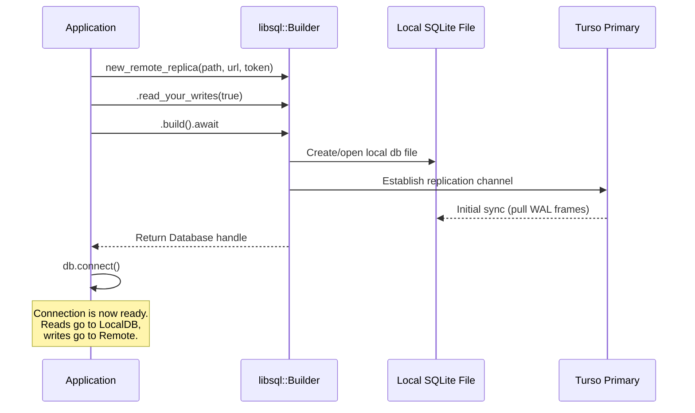
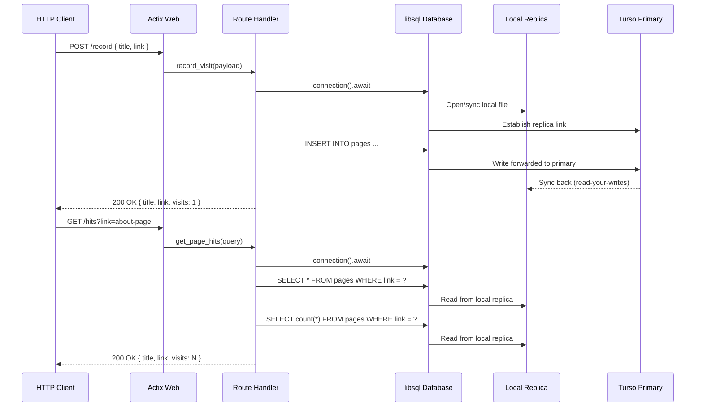

# Embedded Replicas with Rust -- Exploration

## Project Overview

This is a reference implementation from the Turso team demonstrating **embedded replicas** in Rust. It builds a minimal web traffic analytics API using Actix Web and the `libsql` crate, where the primary feature is that the application maintains a **local SQLite database file** that acts as a replica of a remote Turso (libSQL) database. Reads happen locally for speed, while writes propagate to the remote database, and the local replica stays in sync through background replication.

The project is authored by James Sinkala (xinnks) and serves as an official Turso example/tutorial companion.

## What Are Embedded Replicas?

Embedded replicas are a Turso feature that allows applications to keep a local copy of a remote database. This hybrid approach gives you:

1. **Local read latency** -- queries against the local SQLite file, no network round-trip
2. **Centralized writes** -- mutations go to the remote Turso primary, ensuring consistency
3. **Automatic sync** -- the local replica periodically pulls changes from the remote
4. **Offline resilience** -- reads still work when the network is unavailable
5. **Read-your-writes consistency** -- optionally sync immediately after a write so subsequent reads see fresh data

```mermaid
graph TB
    subgraph Application["Rust Application Process"]
        AW["Actix Web Server<br/>:8888"]
        LC["libsql Client"]
        LF["Local SQLite File<br/>(db/web-traffic.db)"]
    end

    subgraph Turso["Turso Cloud"]
        TP["Primary Database<br/>libsql://[db]-[user].turso.io"]
    end

    AW -->|"HTTP requests"| LC
    LC -->|"Reads (SELECT)"| LF
    LC -->|"Writes (INSERT/CREATE)"| TP
    TP -->|"Replication sync"| LF

    style LF fill:#2d5016,stroke:#4a8c2a
    style TP fill:#1a3a5c,stroke:#2a6a9c
    style AW fill:#5c3a1a,stroke:#9c6a2a
```



## Architecture

### File Structure

```
embedded-replicas-with-rust/
  .dockerignore          # Excludes /target from Docker context
  .env.example           # Template for environment variables
  .gitignore             # Ignores target/, .env, .http, *.db*
  Cargo.toml             # Package manifest (web_traffic_checker)
  Cargo.lock             # Pinned dependencies
  Dockerfile             # Container build for deployment
  LICENSE                # MIT
  README.md              # Setup and usage instructions
  src/
    main.rs              # Entire application -- single file
```

This is a deliberately minimal project. The entire application lives in a single `main.rs` file (~141 lines). There are no modules, no library crate, no tests, no middleware -- it is purely a demonstration of the embedded replica pattern.

### Dependency Graph

```mermaid
graph LR
    APP["web_traffic_checker"]
    APP --> ACTIX["actix-web 4"]
    APP --> LIBSQL["libsql 0.3.1"]
    APP --> SERDE["serde 1.0<br/>(derive)"]
    APP --> SJ["serde_json 1"]
    APP --> FUT["futures 0.3"]
    APP --> DOT["dotenvy 0.15.7"]

    LIBSQL --> SQLD["libsql-sys<br/>(embedded SQLite)"]
    LIBSQL --> HYPER["hyper/reqwest<br/>(HTTP replication)"]

    style LIBSQL fill:#1a3a5c,stroke:#2a6a9c
    style ACTIX fill:#5c3a1a,stroke:#9c6a2a
```



| Dependency | Version | Purpose |
|---|---|---|
| `actix-web` | 4 | HTTP server framework |
| `libsql` | 0.3.1 | Turso/libSQL client with embedded replica support |
| `serde` | 1.0 | Serialization/deserialization with derive macros |
| `serde_json` | 1 | JSON handling (used implicitly by Actix's `.json()`) |
| `futures` | 0.3 | Async utilities (declared but not directly used in main.rs) |
| `dotenvy` | 0.15.7 | Load `.env` files into environment variables |

## Connection Setup and Configuration

The core of the embedded replica pattern is in the `connection()` function. This is the most important piece of the project.

### Environment Variables

| Variable | Example | Purpose |
|---|---|---|
| `PORT` | `8888` | HTTP server listen port |
| `TURSO_DATABASE_URL` | `libsql://[db]-[user].turso.io` | Remote Turso database URL |
| `TURSO_AUTH_TOKEN` | JWT token | Authentication token for Turso |
| `LOCAL_DB` | `db/web-traffic.db` | Path to local SQLite replica file |

### The Builder Pattern

```rust
let db: Database = Builder::new_remote_replica(db_file, url, auth_token)
    .read_your_writes(true)
    .build()
    .await
    .unwrap();
```

This is the key API call. Let's break down what happens:

1. **`Builder::new_remote_replica(db_file, url, auth_token)`** -- Creates a builder configured for embedded replica mode. This is distinct from:
   - `Builder::new_local(path)` -- pure local SQLite, no replication
   - `Builder::new_remote(url, token)` -- pure remote, no local file
   - `Builder::new_remote_replica(path, url, token)` -- the hybrid mode used here

2. **`.read_your_writes(true)`** -- When enabled (and it is `true` by default), after every write operation, the client automatically syncs the local replica from the remote before returning. This ensures that a subsequent read will see the data you just wrote. Without this, there would be a window where reads from the local file return stale data.

3. **`.build().await`** -- Finalizes the builder, creates the local database file if it does not exist, and establishes the initial replication connection.

### URL Protocol Replacement

```rust
let url = env::var("TURSO_DATABASE_URL")
    .unwrap_or_else(|_| { ... "http://localhost:8080".to_string() })
    .replace("libsql", "https");
```

The `libsql://` protocol scheme that Turso uses in its dashboard/CLI output is replaced with `https://` because the underlying HTTP transport requires a standard URL scheme. This is a common pattern in Turso Rust examples.

### Connection Flow



## Data Model

The application tracks web page visits with a single table:

```sql
CREATE TABLE IF NOT EXISTS pages (
    title   VARCHAR,
    link    VARCHAR NOT NULL,
    visits  INTEGER
)
```

Corresponding Rust struct:

```rust
struct Page {
    title: String,
    link: String,
    visits: i32,
}
```

There is no primary key, no indexes, no unique constraints. Each visit is inserted as a new row with `visits = 1`, and the "total hits" for a page are calculated by counting rows with `SELECT count(*)`. This is an intentionally simple schema for demonstration purposes.

## API Endpoints and Query Patterns

### Route Table

| Method | Path | Handler | Purpose |
|---|---|---|---|
| GET | `/` | `index` | Welcome message |
| POST | `/record` | `record_visit` | Record a page visit |
| GET | `/hits` | `get_page_hits` | Get visit count for a page |

### Request/Response Flow



### Query Patterns Used

**Parameterized queries with positional binding:**

```rust
// Positional parameter ?1
conn.query(
    "SELECT * FROM pages WHERE link = (?1)",
    vec![Value::from(link)],
).await.unwrap();
```

The `libsql` crate uses `?1`, `?2`, etc. for positional parameters, consistent with SQLite's parameter binding syntax. Values are passed as `Vec<Value>` where `Value` is `libsql::Value` -- an enum that wraps SQLite types.

**Insert with multiple parameters:**

```rust
conn.query(
    "INSERT into pages (title, link, visits) values (?1, ?2, ?3)",
    vec![
        Value::from(hit.title.clone()),
        Value::from(hit.link.clone()),
        Value::from(hit.visits.clone()),
    ],
).await;
```

Note: The code uses `conn.query()` for INSERT rather than `conn.execute()`. Both work, but `execute()` is more semantically appropriate for statements that don't return rows. The `query()` call returns a `Rows` iterator that is discarded here with `let _ =`.

**Row extraction:**

```rust
let row = results.next().await.unwrap().unwrap();
let hit: Page = Page {
    title: row.get(0).unwrap(),   // Column by index
    link: row.get(1).unwrap(),
    visits: count.get(0).unwrap(),
};
```

Rows are consumed via an async iterator (`results.next().await`), and individual columns are accessed by zero-based index using `row.get(N)`. The `get` method performs automatic type conversion based on the target type.

## The Sync Protocol (How Replication Works)

While this project does not implement the sync protocol itself (that is internal to `libsql`), understanding it is essential to understanding embedded replicas:


### Key concepts:

1. **WAL Frames** -- The replication unit. Turso's primary database maintains a Write-Ahead Log (WAL). Changes are represented as frames within this log. The embedded replica tracks which frame it has replicated up to, and requests only newer frames during sync.

2. **Read-your-writes** -- When `read_your_writes(true)` is set, after every write the client does an immediate sync before returning control to the caller. This adds a network round-trip to every write but guarantees consistency for the calling code.

3. **Manual sync** -- Applications can also call `db.sync().await` explicitly to pull the latest state from the remote. This project does not use manual sync because `read_your_writes` handles it automatically.

4. **Conflict resolution** -- Since all writes go through the remote primary, there are no write-write conflicts at the replica level. The primary is the single source of truth for mutation ordering.

## Local Database File Management

The local replica file is configured via `LOCAL_DB=db/web-traffic.db`. Key aspects:

- The `db/` directory must exist before the application starts (the Dockerfile includes `RUN mkdir -p db`, and the README instructs `mkdir -p db && cargo run`)
- The local file is a standard SQLite database file -- it can be inspected with any SQLite tool
- The `.gitignore` excludes `*.db*` so neither the database nor its WAL/SHM journal files are committed
- On first run, the file is created and an initial sync pulls the remote state
- The file persists between restarts, so subsequent launches only need to sync delta frames

## Deployment (Docker)

```dockerfile
FROM rust:1.67
WORKDIR /usr/src/web_traffic_checker
COPY . .
RUN mkdir -p db
RUN cargo install --path .
CMD ["web_traffic_checker"]
```

The Dockerfile is straightforward: it uses the official Rust image, copies the source, creates the `db/` directory for the local replica, compiles the binary via `cargo install`, and runs it. Note that `rust:1.67` is quite old (Jan 2023); the project would likely need a newer Rust version for current `libsql` crate versions.

The `.dockerignore` excludes `/target` to avoid copying build artifacts into the container.

## Architectural Observations

### Strengths of this Pattern

1. **Extremely low read latency** -- all SELECT queries hit the local SQLite file with no network involved
2. **Simplicity** -- the `Builder::new_remote_replica` API abstracts away all replication complexity into a single builder call
3. **Consistency option** -- `read_your_writes(true)` provides a clear consistency guarantee without manual sync management
4. **Offline reads** -- if the network goes down, reads continue to work against the local file (writes will fail)

### Design Trade-offs in this Example

1. **Connection per request** -- The `connection()` function is called in every handler, creating a new `Database` instance each time. In production, the `Database` should be created once at startup and shared via Actix's `web::Data` (application state). Each call to `connection()` opens the local file and establishes a replication channel, which is wasteful.

2. **No connection pooling** -- `db.connect()` is called per-handler without pooling. While `libsql` connections are lightweight, sharing a connection pool through application state would be more efficient.

3. **No error handling** -- Every fallible operation uses `.unwrap()`. A production application should use proper error types and Actix's error response mechanism.

4. **Schema design** -- Recording visits as individual rows and counting them with `SELECT count(*)` is not scalable. A production system would use `INSERT ... ON CONFLICT DO UPDATE SET visits = visits + 1` with a unique constraint on `link`.

5. **No manual sync endpoint** -- The application does not expose a way to trigger `db.sync()` manually, which could be useful for administrative purposes.

### libsql Crate API Summary (as Demonstrated)

| API | Usage in Project | Purpose |
|---|---|---|
| `Builder::new_remote_replica()` | `connection()` | Create embedded replica database |
| `.read_your_writes(true)` | `connection()` | Enable immediate post-write sync |
| `.build().await` | `connection()` | Finalize and connect |
| `db.connect()` | `main()`, handlers | Get a connection handle |
| `conn.execute(sql, params)` | `main()` | Run DDL/DML without reading rows |
| `conn.query(sql, params)` | handlers | Run queries that return rows |
| `results.next().await` | `get_page_hits` | Iterate over result rows |
| `row.get(index)` | `get_page_hits` | Extract column value by index |
| `Value::from(v)` | handlers | Convert Rust values to libsql params |

## Summary

This project is a focused, minimal demonstration of Turso's embedded replica feature in Rust. The entire value proposition is captured in a single builder call (`Builder::new_remote_replica`) that creates a local SQLite file synced with a remote Turso database. Reads are local and fast, writes go to the remote primary, and `read_your_writes` ensures consistency. The web application wrapper (Actix + page visit tracking) exists only to provide a concrete context for demonstrating the pattern. For production use, the connection should be shared as application state rather than recreated per-request.
