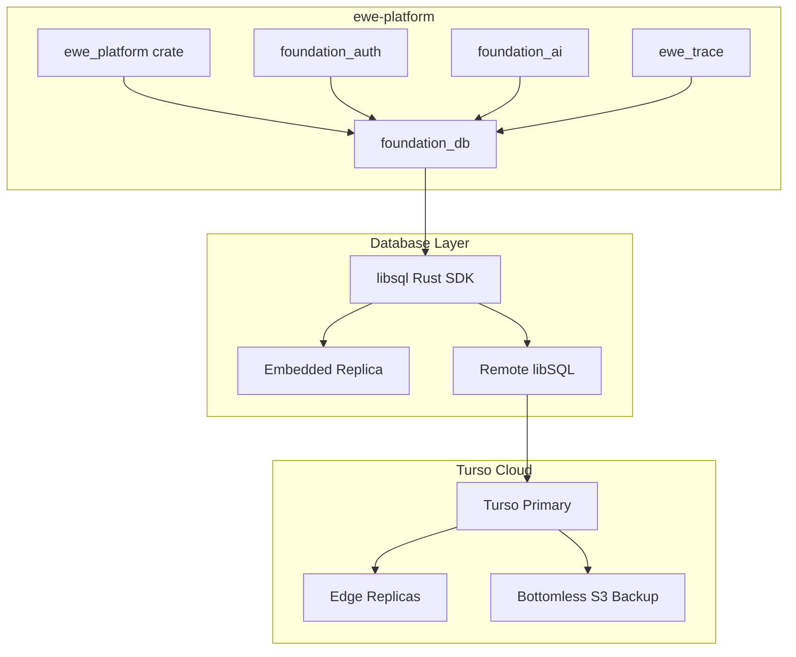

# Turso/libSQL Integration Guide for ewe-platform

## Overview

This guide provides a comprehensive integration path for adding Turso/libSQL as the primary database layer in the ewe-platform project. Turso offers several advantages for ewe-platform:

1. **SQLite compatibility** -- Minimal learning curve, simple deployment
2. **Embedded replicas** -- Local read latency with remote durability
3. **Edge-ready** -- Works on Cloudflare Workers, Fly.io, and other edge platforms
4. **Multi-language SDKs** -- Rust, TypeScript, Python, Go support
5. **Vector search** -- Built-in AI/ML vector similarity search
6. **Full-text search** -- Integrated FTS5 support
7. **Bottomless storage** -- S3-backed WAL for durability

## Integration Architecture



## Crate Structure

Add the following to your workspace:

```
crates/
  database/
    Cargo.toml
    src/
      lib.rs           # Module exports
      config.rs        # Database configuration
      connection.rs    # Connection management
      migrations/      # Schema migrations
      models/          # Data models
      repositories/    # Repository pattern implementations
      embedded/        # Embedded replica utilities
      remote/          # Remote database utilities
      sync/            # Sync coordination
```

### Cargo.toml

```toml
[package]
name = "ewe_database"
version = "0.1.0"
edition = "2021"

[dependencies]
# Core libSQL client
libsql = { version = "0.4", features = ["replication", "remote", "sync", "encryption"] }

# Async runtime
tokio = { version = "1.38", features = ["full"] }

# Serialization
serde = { version = "1.0", features = ["derive"] }
serde_json = "1.0"

# Error handling
thiserror = "2.0"
anyhow = "1.0"

# Tracing
tracing = "0.1"

# Time
chrono = { version = "0.4", features = ["serde"] }

# UUID
uuid = { version = "1.0", features = ["v4", "serde"] }

# async-trait for repository traits
async-trait = "0.1"

# URL parsing
url = "2.5"

# Environment variables
dotenvy = "0.15"

# For connection pooling (optional, libsql manages internally)
# mobc = "0.8"

# For migrations
sqlx = { version = "0.8", features = ["sqlite", "runtime-tokio"] }

# For vector embeddings (AI integration)
candle-core = "0.8"
candle-transformers = "0.8"

[dev-dependencies]
tokio-test = "0.4"
tempfile = "3.0"
```

## Database Configuration

```rust
// crates/database/src/config.rs

use libsql::Builder;
use serde::Deserialize;
use std::time::Duration;

#[derive(Debug, Clone, Deserialize)]
pub struct DatabaseConfig {
    /// libSQL connection URL
    /// - `file:///path/to/db` for local
    /// - `libsql://[host]` for remote
    /// - `wss://[host]` for WebSocket
    pub url: String,

    /// Authentication token for remote databases
    pub auth_token: Option<String>,

    /// Local replica path (for embedded replica mode)
    pub local_path: Option<String>,

    /// Encryption key (optional)
    pub encryption_key: Option<String>,

    /// Enable read-your-writes consistency
    pub read_your_writes: bool,

    /// Sync interval for embedded replicas
    pub sync_interval: Duration,

    /// Connection timeout
    pub connect_timeout: Duration,

    /// Query timeout
    pub query_timeout: Duration,
}

impl Default for DatabaseConfig {
    fn default() -> Self {
        Self {
            url: std::env::var("TURSO_DATABASE_URL")
                .unwrap_or_else(|_| "file::memory:".to_string()),
            auth_token: std::env::var("TURSO_AUTH_TOKEN").ok(),
            local_path: std::env::var("TURSO_LOCAL_PATH").ok(),
            encryption_key: std::env::var("TURSO_ENCRYPTION_KEY").ok(),
            read_your_writes: true,
            sync_interval: Duration::from_secs(30),
            connect_timeout: Duration::from_secs(10),
            query_timeout: Duration::from_secs(30),
        }
    }
}

impl DatabaseConfig {
    /// Build a libsql::Database from config
    pub async fn create_database(&self) -> Result<libsql::Database, DatabaseError> {
        let mut builder = if self.url.starts_with("file://") || self.url.starts_with("file:") {
            // Local database
            let path = self.url.strip_prefix("file://").unwrap_or(&self.url);
            Builder::new_local(path)
        } else if let Some(local_path) = &self.local_path {
            // Embedded replica
            let remote_url = self.url.replace("libsql://", "https://");
            Builder::new_remote_replica(
                local_path,
                remote_url,
                self.auth_token.clone().unwrap_or_default(),
            )
            .read_your_writes(self.read_your_writes)
        } else {
            // Remote-only database
            let remote_url = self.url.replace("libsql://", "https://");
            Builder::new_remote(
                remote_url,
                self.auth_token.clone().unwrap_or_default(),
            )
        };

        // Apply encryption if configured
        if let Some(key) = &self.encryption_key {
            builder = builder.encryption_key(key);
        }

        Ok(builder.build().await?)
    }
}

#[derive(Debug, thiserror::Error)]
pub enum DatabaseError {
    #[error("libsql error: {0}")]
    Libsql(#[from] libsql::Error),

    #[error("migration error: {0}")]
    Migration(#[from] sqlx::Error),

    #[error("configuration error: {0}")]
    Config(String),

    #[error("query error: {0}")]
    Query(String),
}

pub type Result<T> = std::result::Result<T, DatabaseError>;
```

## Connection Management

```rust
// crates/database/src/connection.rs

use crate::config::{DatabaseConfig, Result, DatabaseError};
use libsql::{Database, Connection};
use std::sync::Arc;
use tracing::{info, warn};

/// Database handle shared across the application
#[derive(Clone)]
pub struct DatabaseHandle {
    db: Arc<Database>,
    config: DatabaseConfig,
}

impl DatabaseHandle {
    pub async fn new(config: DatabaseConfig) -> Result<Self> {
        let db = Arc::new(config.create_database().await?);

        info!(
            url = %config.url,
            local_path = ?config.local_path,
            "Connected to Turso/libSQL database"
        );

        Ok(Self { db, config })
    }

    /// Get a new connection
    pub async fn connection(&self) -> Result<Connection> {
        Ok(self.db.connect()?)
    }

    /// Execute a query and return affected rows
    pub async fn execute(&self, sql: &str, params: Vec<libsql::Value>) -> Result<u64> {
        let conn = self.connection().await?;

        let mut stmt = conn.prepare(sql).await?;
        let rows_affected = stmt.execute(params).await?;

        Ok(rows_affected)
    }

    /// Execute a query and return single row
    pub async fn query_one<T: FromRow>(
        &self,
        sql: &str,
        params: Vec<libsql::Value>,
    ) -> Result<Option<T>> {
        let conn = self.connection().await?;

        let mut stmt = conn.prepare(sql).await?;
        let mut rows = stmt.query(params).await?;

        if let Some(row) = rows.next().await? {
            Ok(Some(T::from_row(&row)?))
        } else {
            Ok(None)
        }
    }

    /// Execute a query and return all rows
    pub async fn query_all<T: FromRow>(
        &self,
        sql: &str,
        params: Vec<libsql::Value>,
    ) -> Result<Vec<T>> {
        let conn = self.connection().await?;

        let mut stmt = conn.prepare(sql).await?;
        let mut rows = stmt.query(params).await?;

        let mut results = Vec::new();
        while let Some(row) = rows.next().await? {
            results.push(T::from_row(&row)?);
        }

        Ok(results)
    }

    /// Run a transaction
    pub async fn transaction<F, R>(&self, f: F) -> Result<R>
    where
        F: FnOnce(Transaction) -> futures_util::future::LocalBoxFuture<'static, Result<R>>
            + Send + 'static,
        R: Send + 'static,
    {
        let conn = self.connection().await?;
        let tx = conn.transaction().await?;

        let tx_wrapper = Transaction { inner: tx };
        let result = f(tx_wrapper).await?;

        Ok(result)
    }

    /// Trigger manual sync (for embedded replicas)
    pub async fn sync(&self) -> Result<()> {
        self.db.sync().await?;
        Ok(())
    }
}

/// Transaction wrapper
pub struct Transaction {
    inner: libsql::Transaction,
}

impl Transaction {
    pub async fn execute(&self, sql: &str, params: Vec<libsql::Value>) -> Result<u64> {
        let mut stmt = self.inner.prepare(sql).await?;
        Ok(stmt.execute(params).await?)
    }

    pub async fn query<T: FromRow>(
        &self,
        sql: &str,
        params: Vec<libsql::Value>,
    ) -> Result<Vec<T>> {
        let mut stmt = self.inner.prepare(sql).await?;
        let mut rows = stmt.query(params).await?;

        let mut results = Vec::new();
        while let Some(row) = rows.next().await? {
            results.push(T::from_row(&row)?);
        }

        Ok(results)
    }

    pub async fn commit(self) -> Result<()> {
        Ok(self.inner.commit().await?)
    }

    pub async fn rollback(self) -> Result<()> {
        Ok(self.inner.rollback().await?)
    }
}

/// Trait for converting rows to types
pub trait FromRow: Sized {
    fn from_row(row: &libsql::Row) -> Result<Self>;
}
```

## Schema Migrations

```rust
// crates/database/src/migrations/mod.rs

use crate::connection::DatabaseHandle;
use sqlx::{SqlitePool, migrate::MigrateDatabase};
use tracing::info;

/// Run all pending migrations
pub async fn run_migrations(db: &DatabaseHandle) -> Result<(), crate::config::DatabaseError> {
    info!("Running database migrations...");

    // Use sqlx for migration management
    let pool = SqlitePool::connect(&db.config.url)
        .await
        .map_err(crate::config::DatabaseError::Migration)?;

    sqlx::migrate!("crates/database/migrations")
        .run(&pool)
        .await
        .map_err(crate::config::DatabaseError::Migration)?;

    info!("Migrations completed successfully");
    Ok(())
}

/// Create a new migration file
pub fn create_migration(name: &str) -> Result<(), std::io::Error> {
    let timestamp = chrono::Utc::now().format("%Y%m%d%H%M%S");
    let filename = format!("{}_{}.sql", timestamp, name.replace(" ", "_"));

    let path = std::path::PathBuf::from("crates/database/migrations")
        .join(&filename);

    std::fs::create_dir_all(path.parent().unwrap())?;
    std::fs::write(&path, format!("-- Migration: {}\n\n-- Up\n\n-- Down\n", name))?;

    println!("Created migration: {}", path.display());
    Ok(())
}
```

### Migration Files

```sql
-- crates/database/migrations/20260322000001_initial_schema.sql

-- Up

-- Users table (for foundation_auth integration)
CREATE TABLE IF NOT EXISTS users (
    id TEXT PRIMARY KEY DEFAULT (lower(hex(randomblob(16)))),
    email TEXT NOT NULL UNIQUE,
    password_hash TEXT NOT NULL,
    created_at DATETIME DEFAULT CURRENT_TIMESTAMP,
    updated_at DATETIME DEFAULT CURRENT_TIMESTAMP
);

-- Sessions table
CREATE TABLE IF NOT EXISTS sessions (
    id TEXT PRIMARY KEY DEFAULT (lower(hex(randomblob(16)))),
    user_id TEXT NOT NULL REFERENCES users(id) ON DELETE CASCADE,
    token TEXT NOT NULL UNIQUE,
    expires_at DATETIME NOT NULL,
    created_at DATETIME DEFAULT CURRENT_TIMESTAMP
);

-- API keys table
CREATE TABLE IF NOT EXISTS api_keys (
    id TEXT PRIMARY KEY DEFAULT (lower(hex(randomblob(16)))),
    user_id TEXT NOT NULL REFERENCES users(id) ON DELETE CASCADE,
    key_hash TEXT NOT NULL UNIQUE,
    name TEXT,
    permissions TEXT,  -- JSON array of permissions
    created_at DATETIME DEFAULT CURRENT_TIMESTAMP,
    last_used_at DATETIME
);

-- Traces table (for ewe_trace integration)
CREATE TABLE IF NOT EXISTS traces (
    id TEXT PRIMARY KEY DEFAULT (lower(hex(randomblob(16)))),
    trace_id TEXT NOT NULL,
    span_id TEXT NOT NULL,
    parent_span_id TEXT,
    name TEXT NOT NULL,
    kind TEXT NOT NULL,  -- 'internal', 'server', 'client', 'producer', 'consumer'
    start_time DATETIME NOT NULL,
    end_time DATETIME,
    status TEXT,  -- 'ok', 'error', 'unset'
    attributes TEXT,  -- JSON
    events TEXT,      -- JSON array
    created_at DATETIME DEFAULT CURRENT_TIMESTAMP
);

-- Index for trace lookups
CREATE INDEX IF NOT EXISTS idx_traces_trace_id ON traces(trace_id);
CREATE INDEX IF NOT EXISTS idx_traces_parent ON traces(parent_span_id);
CREATE INDEX IF NOT EXISTS idx_traces_start_time ON traces(start_time);

-- AI embeddings table (for foundation_ai integration)
CREATE TABLE IF NOT EXISTS embeddings (
    id TEXT PRIMARY KEY DEFAULT (lower(hex(randomblob(16)))),
    entity_type TEXT NOT NULL,  -- 'document', 'query', 'image', etc.
    entity_id TEXT NOT NULL,
    model TEXT NOT NULL,  -- embedding model name
    dimensions INTEGER NOT NULL,
    vector BLOB NOT NULL,  -- Stored as blob for efficiency
    metadata TEXT,  -- JSON metadata
    created_at DATETIME DEFAULT CURRENT_TIMESTAMP
);

-- Vector index using libSQL's built-in vector search
CREATE INDEX IF NOT EXISTS idx_embeddings_vector
ON embeddings(vector)
TYPE DISTINCT
WITH (dimensions = 1536);

-- Create virtual table for full-text search
CREATE VIRTUAL TABLE IF NOT EXISTS documents_fts USING fts5(
    title,
    content,
    content='documents',
    content_rowid='rowid'
);

-- Documents table
CREATE TABLE IF NOT EXISTS documents (
    id INTEGER PRIMARY KEY AUTOINCREMENT,
    title TEXT NOT NULL,
    content TEXT NOT NULL,
    author_id TEXT REFERENCES users(id),
    created_at DATETIME DEFAULT CURRENT_TIMESTAMP,
    updated_at DATETIME DEFAULT CURRENT_TIMESTAMP
);

-- Triggers to keep FTS in sync
CREATE TRIGGER IF NOT EXISTS documents_ai AFTER INSERT ON documents BEGIN
    INSERT INTO documents_fts(rowid, title, content) VALUES (new.id, new.title, new.content);
END;

CREATE TRIGGER IF NOT EXISTS documents_ad AFTER DELETE ON documents BEGIN
    INSERT INTO documents_fts(documents_fts, rowid, title, content) VALUES('delete', old.id, old.title, old.content);
END;

CREATE TRIGGER IF NOT EXISTS documents_au AFTER UPDATE ON documents BEGIN
    INSERT INTO documents_fts(documents_fts, rowid, title, content) VALUES('delete', old.id, old.title, old.content);
    INSERT INTO documents_fts(rowid, title, content) VALUES (new.id, new.title, new.content);
END;

-- Down
-- Drop in reverse order
DROP TRIGGER IF EXISTS documents_au;
DROP TRIGGER IF EXISTS documents_ad;
DROP TRIGGER IF EXISTS documents_ai;
DROP TABLE IF EXISTS documents;
DROP TABLE IF EXISTS embeddings;
DROP TABLE IF EXISTS traces;
DROP TABLE IF EXISTS api_keys;
DROP TABLE IF EXISTS sessions;
DROP TABLE IF EXISTS users;
```

## Repository Pattern

```rust
// crates/database/src/repositories/user_repository.rs

use crate::connection::{DatabaseHandle, FromRow, Result};
use libsql::Row;

#[derive(Debug, Clone)]
pub struct User {
    pub id: String,
    pub email: String,
    pub password_hash: String,
    pub created_at: chrono::DateTime<chrono::Utc>,
    pub updated_at: chrono::DateTime<chrono::Utc>,
}

impl FromRow for User {
    fn from_row(row: &Row) -> Result<Self> {
        Ok(Self {
            id: row.get::<String>(0)?,
            email: row.get::<String>(1)?,
            password_hash: row.get::<String>(2)?,
            created_at: row.get::<String>(3)?.parse()
                .map_err(|e| crate::config::DatabaseError::Query(e.to_string()))?,
            updated_at: row.get::<String>(4)?.parse()
                .map_err(|e| crate::config::DatabaseError::Query(e.to_string()))?,
        })
    }
}

#[derive(Debug, Clone)]
pub struct UserRepository {
    db: DatabaseHandle,
}

impl UserRepository {
    pub fn new(db: DatabaseHandle) -> Self {
        Self { db }
    }

    pub async fn create(&self, email: &str, password_hash: &str) -> Result<User> {
        let user = self.db.query_one::<User>(
            "INSERT INTO users (email, password_hash) VALUES (?1, ?2) RETURNING *",
            vec![email.into(), password_hash.into()],
        ).await?
        .ok_or_else(|| crate::config::DatabaseError::Query("Failed to create user".into()))?;

        Ok(user)
    }

    pub async fn find_by_id(&self, id: &str) -> Result<Option<User>> {
        self.db.query_one::<User>(
            "SELECT * FROM users WHERE id = ?1",
            vec![id.into()],
        ).await
    }

    pub async fn find_by_email(&self, email: &str) -> Result<Option<User>> {
        self.db.query_one::<User>(
            "SELECT * FROM users WHERE email = ?1",
            vec![email.into()],
        ).await
    }

    pub async fn update_password(&self, user_id: &str, password_hash: &str) -> Result<()> {
        self.db.execute(
            "UPDATE users SET password_hash = ?2, updated_at = CURRENT_TIMESTAMP WHERE id = ?1",
            vec![user_id.into(), password_hash.into()],
        ).await?;
        Ok(())
    }

    pub async fn delete(&self, user_id: &str) -> Result<u64> {
        self.db.execute(
            "DELETE FROM users WHERE id = ?1",
            vec![user_id.into()],
        ).await
    }
}
```

## AI Integration (Vector Search)

```rust
// crates/database/src/repositories/embedding_repository.rs

use crate::connection::{DatabaseHandle, FromRow, Result};
use libsql::Row;

#[derive(Debug, Clone)]
pub struct Embedding {
    pub id: String,
    pub entity_type: String,
    pub entity_id: String,
    pub model: String,
    pub dimensions: i64,
    pub vector: Vec<f32>,
    pub metadata: Option<serde_json::Value>,
    pub created_at: chrono::DateTime<chrono::Utc>,
}

impl FromRow for Embedding {
    fn from_row(row: &Row) -> Result<Self> {
        let vector_blob: Vec<u8> = row.get::<Vec<u8>>(5)?;
        let vector = vec_from_blob(&vector_blob);

        Ok(Self {
            id: row.get::<String>(0)?,
            entity_type: row.get::<String>(1)?,
            entity_id: row.get::<String>(2)?,
            model: row.get::<String>(3)?,
            dimensions: row.get::<i64>(4)?,
            vector,
            metadata: row.get::<Option<String>>(6)?
                .and_then(|s| serde_json::from_str(&s).ok()),
            created_at: row.get::<String>(7)?.parse()
                .map_err(|e| crate::config::DatabaseError::Query(e.to_string()))?,
        })
    }
}

/// Convert blob back to f32 vector
fn vec_from_blob(blob: &[u8]) -> Vec<f32> {
    blob.chunks_exact(4)
        .map(|chunk| f32::from_le_bytes([chunk[0], chunk[1], chunk[2], chunk[3]]))
        .collect()
}

/// Convert f32 vector to blob
fn vec_to_blob(vec: &[f32]) -> Vec<u8> {
    vec.iter()
        .flat_map(|f| f.to_le_bytes().to_vec())
        .collect()
}

pub struct EmbeddingRepository {
    db: DatabaseHandle,
}

impl EmbeddingRepository {
    pub fn new(db: DatabaseHandle) -> Self {
        Self { db }
    }

    pub async fn insert(&self, embedding: &Embedding) -> Result<String> {
        let vector_blob = vec_to_blob(&embedding.vector);

        let id = self.db.query_one::<String>(
            "INSERT INTO embeddings (entity_type, entity_id, model, dimensions, vector, metadata)
             VALUES (?1, ?2, ?3, ?4, ?5, ?6) RETURNING id",
            vec![
                embedding.entity_type.clone().into(),
                embedding.entity_id.clone().into(),
                embedding.model.clone().into(),
                embedding.dimensions.into(),
                vector_blob.into(),
                embedding.metadata.as_ref().map(|m| m.to_string()).unwrap_or_default().into(),
            ],
        ).await?
        .ok_or_else(|| crate::config::DatabaseError::Query("Failed to insert embedding".into()))?;

        Ok(id)
    }

    /// Find similar embeddings using vector distance
    pub async fn find_similar(
        &self,
        query_vector: &[f32],
        entity_type: Option<&str>,
        limit: usize,
    ) -> Result<Vec<Embedding>> {
        let vector_blob = vec_to_blob(query_vector);

        // Use libSQL's vector search with cosine distance
        let where_clause = match entity_type {
            Some(et) => format!("WHERE entity_type = '{}' ", et),
            None => String::new(),
        };

        let sql = format!(
            "SELECT *, vector_distance_cos(vector, ?1) as distance
             FROM embeddings
             {}
             ORDER BY distance ASC
             LIMIT ?2",
            where_clause
        );

        // Note: libSQL vector search syntax may vary based on version
        // Adjust based on your libSQL version
        self.db.query_all::<Embedding>(&sql, vec![
            query_vector.len().into(),  // Placeholder
            (limit as i64).into(),
        ]).await
    }

    /// Full-text search combined with vector search
    pub async fn hybrid_search(
        &self,
        query_text: &str,
        query_vector: &[f32],
        limit: usize,
    ) -> Result<Vec<HybridSearchResult>> {
        // First, get FTS results
        let fts_results = self.db.query_all::<Document>(
            "SELECT d.* FROM documents d
             JOIN documents_fts ON documents_fts.rowid = d.id
             WHERE documents_fts MATCH ?1
             LIMIT ?2",
            vec![query_text.into(), (limit * 2).into()],
        ).await?;

        // Then, get vector similarity results
        let vector_results = self.find_similar(query_vector, Some("document"), limit * 2).await?;

        // Combine with Reciprocal Rank Fusion (RRF)
        let mut combined: std::collections::HashMap<String, (usize, usize, Embedding)> =
            std::collections::HashMap::new();

        for (rank, emb) in vector_results.iter().enumerate() {
            combined.entry(emb.entity_id.clone())
                .or_insert((rank, usize::MAX, emb.clone()));
        }

        for (rank, doc) in fts_results.iter().enumerate() {
            combined.entry(doc.id.to_string())
                .or_insert((usize::MAX, rank, Embedding {
                    id: doc.id.to_string(),
                    entity_type: "document".into(),
                    entity_id: doc.id.to_string(),
                    model: "fts".into(),
                    dimensions: 0,
                    vector: vec![],
                    metadata: None,
                    created_at: doc.created_at,
                }));
        }

        // Sort by RRF score and return top results
        let mut results: Vec<_> = combined.into_values().collect();
        results.sort_by_key(|(v_rank, f_rank, _)| v_rank + f_rank);

        Ok(results.into_iter()
            .take(limit)
            .map(|(_, _, emb)| HybridSearchResult {
                id: emb.id,
                entity_id: emb.entity_id,
                metadata: emb.metadata,
                score: 1.0,  // Calculate actual score if needed
            })
            .collect())
    }
}

#[derive(Debug, Clone)]
pub struct HybridSearchResult {
    pub id: String,
    pub entity_id: String,
    pub metadata: Option<serde_json::Value>,
    pub score: f32,
}

#[derive(Debug, Clone)]
pub struct Document {
    pub id: i64,
    pub title: String,
    pub content: String,
    pub author_id: Option<String>,
    pub created_at: chrono::DateTime<chrono::Utc>,
    pub updated_at: chrono::DateTime<chrono::Utc>,
}

impl FromRow for Document {
    fn from_row(row: &Row) -> Result<Self> {
        Ok(Self {
            id: row.get::<i64>(0)?,
            title: row.get::<String>(1)?,
            content: row.get::<String>(2)?,
            author_id: row.get::<Option<String>>(3)?,
            created_at: row.get::<String>(4)?.parse()
                .map_err(|e| crate::config::DatabaseError::Query(e.to_string()))?,
            updated_at: row.get::<String>(5)?.parse()
                .map_err(|e| crate::config::DatabaseError::Query(e.to_string()))?,
        })
    }
}
```

## Trace Integration (ewe_trace)

```rust
// crates/database/src/repositories/trace_repository.rs

use crate::connection::{DatabaseHandle, FromRow, Result};
use libsql::Row;
use serde::{Deserialize, Serialize};

#[derive(Debug, Clone, Serialize, Deserialize)]
pub struct Span {
    pub id: String,
    pub trace_id: String,
    pub span_id: String,
    pub parent_span_id: Option<String>,
    pub name: String,
    pub kind: SpanKind,
    pub start_time: chrono::DateTime<chrono::Utc>,
    pub end_time: Option<chrono::DateTime<chrono::Utc>>,
    pub status: SpanStatus,
    pub attributes: serde_json::Value,
    pub events: Vec<SpanEvent>,
}

#[derive(Debug, Clone, Serialize, Deserialize)]
pub enum SpanKind {
    Internal,
    Server,
    Client,
    Producer,
    Consumer,
}

#[derive(Debug, Clone, Serialize, Deserialize)]
pub enum SpanStatus {
    Ok,
    Error,
    Unset,
}

#[derive(Debug, Clone, Serialize, Deserialize)]
pub struct SpanEvent {
    pub timestamp: chrono::DateTime<chrono::Utc>,
    pub name: String,
    pub attributes: serde_json::Value,
}

pub struct TraceRepository {
    db: DatabaseHandle,
}

impl TraceRepository {
    pub fn new(db: DatabaseHandle) -> Self {
        Self { db }
    }

    pub async fn insert_span(&self, span: &Span) -> Result<()> {
        self.db.execute(
            "INSERT INTO traces (
                id, trace_id, span_id, parent_span_id, name, kind,
                start_time, end_time, status, attributes, events
             ) VALUES (?1, ?2, ?3, ?4, ?5, ?6, ?7, ?8, ?9, ?10, ?11)",
            vec![
                span.id.clone().into(),
                span.trace_id.clone().into(),
                span.span_id.clone().into(),
                span.parent_span_id.clone().map(|s| s.into()).unwrap_or(libsql::Value::Null),
                span.name.clone().into(),
                format!("{:?}", span.kind).into(),
                span.start_time.to_rfc3339().into(),
                span.end_time.map(|t| t.to_rfc3339()).unwrap_or_default().into(),
                format!("{:?}", span.status).into(),
                span.attributes.to_string().into(),
                serde_json::to_string(&span.events).unwrap_or_default().into(),
            ],
        ).await?;
        Ok(())
    }

    pub async fn find_by_trace_id(&self, trace_id: &str) -> Result<Vec<Span>> {
        let rows = self.db.query_all::<TraceRow>(
            "SELECT * FROM traces WHERE trace_id = ?1 ORDER BY start_time",
            vec![trace_id.into()],
        ).await?;

        Ok(rows.into_iter()
            .filter_map(|r| r.into_span().ok())
            .collect())
    }

    pub async fn find_recent_traces(&self, limit: usize) -> Result<Vec<SpanSummary>> {
        self.db.query_all::<SpanSummary>(
            "SELECT DISTINCT trace_id, name, start_time, status
             FROM traces
             ORDER BY start_time DESC
             LIMIT ?1",
            vec![(limit as i64).into()],
        ).await
    }
}

#[derive(Debug)]
struct TraceRow {
    id: String,
    trace_id: String,
    span_id: String,
    parent_span_id: Option<String>,
    name: String,
    kind: String,
    start_time: String,
    end_time: Option<String>,
    status: String,
    attributes: String,
    events: String,
}

impl FromRow for TraceRow {
    fn from_row(row: &Row) -> Result<Self> {
        Ok(Self {
            id: row.get::<String>(0)?,
            trace_id: row.get::<String>(1)?,
            span_id: row.get::<String>(2)?,
            parent_span_id: row.get::<Option<String>>(3)?,
            name: row.get::<String>(4)?,
            kind: row.get::<String>(5)?,
            start_time: row.get::<String>(6)?,
            end_time: row.get::<Option<String>>(7)?,
            status: row.get::<String>(8)?,
            attributes: row.get::<String>(9)?,
            events: row.get::<String>(10)?,
        })
    }
}

impl TraceRow {
    fn into_span(self) -> Result<Span> {
        Ok(Span {
            id: self.id,
            trace_id: self.trace_id,
            span_id: self.span_id,
            parent_span_id: self.parent_span_id,
            name: self.name,
            kind: match self.kind.as_str() {
                "Internal" => SpanKind::Internal,
                "Server" => SpanKind::Server,
                "Client" => SpanKind::Client,
                "Producer" => SpanKind::Producer,
                "Consumer" => SpanKind::Consumer,
                _ => SpanKind::Internal,
            },
            start_time: self.start_time.parse()
                .map_err(|e| crate::config::DatabaseError::Query(e.to_string()))?,
            end_time: self.end_time
                .map(|s| s.parse())
                .transpose()
                .map_err(|e| crate::config::DatabaseError::Query(e.to_string()))?,
            status: match self.status.as_str() {
                "Ok" => SpanStatus::Ok,
                "Error" => SpanStatus::Error,
                _ => SpanStatus::Unset,
            },
            attributes: serde_json::from_str(&self.attributes)
                .unwrap_or(serde_json::json!({})),
            events: serde_json::from_str(&self.events)
                .unwrap_or_default(),
        })
    }
}

#[derive(Debug, FromRow)]
struct SpanSummary {
    trace_id: String,
    name: String,
    start_time: String,
    status: String,
}
```

## Production Deployment

### Docker Configuration

```dockerfile
# Dockerfile for ewe-platform with Turso
FROM rust:1.87-slim as builder

WORKDIR /app

# Install dependencies
RUN apt-get update && apt-get install -y \
    pkg-config \
    libssl-dev \
    && rm -rf /var/lib/apt/lists/*

# Copy workspace
COPY Cargo.toml Cargo.lock ./
COPY crates/ ./crates/
COPY backends/ ./backends/
COPY infrastructure/ ./infrastructure/
COPY bin/ ./bin/

# Build with optimizations
RUN cargo build --release --bin ewe_platform

# Runtime image
FROM debian:bookworm-slim

RUN apt-get update && apt-get install -y \
    ca-certificates \
    && rm -rf /var/lib/apt/lists/*

WORKDIR /app

COPY --from=builder /app/target/release/ewe_platform /app/ewe_platform

ENV RUST_LOG=info
ENV TURSO_DATABASE_URL=libsql://your-db.turso.io
ENV TURSO_LOCAL_PATH=/data/ewe.db

# Create data directory for embedded replica
RUN mkdir -p /data && chmod 755 /data
VOLUME /data

EXPOSE 8080

CMD ["/app/ewe_platform"]
```

### Kubernetes Deployment

```yaml
# k8s/deployment.yaml
apiVersion: apps/v1
kind: Deployment
metadata:
  name: ewe-platform
spec:
  replicas: 3
  selector:
    matchLabels:
      app: ewe-platform
  template:
    metadata:
      labels:
        app: ewe-platform
    spec:
      containers:
      - name: ewe-platform
        image: ewestudios/ewe-platform:latest
        ports:
        - containerPort: 8080
        env:
        - name: TURSO_DATABASE_URL
          valueFrom:
            secretKeyRef:
              name: turso-secret
              key: database-url
        - name: TURSO_AUTH_TOKEN
          valueFrom:
            secretKeyRef:
              name: turso-secret
              key: auth-token
        - name: TURSO_LOCAL_PATH
          value: /data/ewe.db
        - name: RUST_LOG
          value: "info,ewe_database=debug"
        volumeMounts:
        - name: data
          mountPath: /data
        readinessProbe:
          httpGet:
            path: /health
            port: 8080
          initialDelaySeconds: 5
          periodSeconds: 10
        livenessProbe:
          httpGet:
            path: /health
            port: 8080
          initialDelaySeconds: 15
          periodSeconds: 20
        resources:
          requests:
            memory: "256Mi"
            cpu: "100m"
          limits:
            memory: "512Mi"
            cpu: "500m"
      volumes:
      - name: data
        emptyDir: {}
---
apiVersion: v1
kind: Secret
metadata:
  name: turso-secret
type: Opaque
stringData:
  database-url: "libsql://your-db.turso.io"
  auth-token: "your-auth-token"
---
apiVersion: v1
kind: Service
metadata:
  name: ewe-platform
spec:
  selector:
    app: ewe-platform
  ports:
  - port: 80
    targetPort: 8080
  type: LoadBalancer
```

## Performance Considerations

### Connection Pooling

libsql manages connections internally, but for high-throughput scenarios:

```rust
use std::sync::Arc;
use tokio::sync::Semaphore;

pub struct ConnectionPool {
    db: Arc<libsql::Database>,
    semaphore: Arc<Semaphore>,
    max_connections: usize,
}

impl ConnectionPool {
    pub fn new(db: libsql::Database, max_connections: usize) -> Self {
        Self {
            db: Arc::new(db),
            semaphore: Arc::new(Semaphore::new(max_connections)),
            max_connections,
        }
    }

    pub async fn acquire(&self) -> Result<PooledConnection> {
        let permit = self.semaphore.clone().acquire_owned().await
            .map_err(|e| crate::config::DatabaseError::Query(e.to_string()))?;

        let conn = self.db.connect()?;

        Ok(PooledConnection { conn, _permit: permit })
    }
}

pub struct PooledConnection {
    conn: libsql::Connection,
    _permit: tokio::sync::OwnedSemaphorePermit,
}

impl std::ops::Deref for PooledConnection {
    type Target = libsql::Connection;

    fn deref(&self) -> &Self::Target {
        &self.conn
    }
}
```

### Query Optimization

```rust
// Use EXPLAIN QUERY PLAN for query optimization
pub async fn analyze_query(db: &DatabaseHandle, query: &str) -> Result<Vec<QueryPlan>> {
    db.query_all::<QueryPlan>(&format!("EXPLAIN QUERY PLAN {}", query), vec![]).await
}

#[derive(Debug, FromRow)]
pub struct QueryPlan {
    pub id: i64,
    pub parent: i64,
    pub notused: i64,
    pub detail: String,
}

// Key optimization tips:
// 1. Use WHERE clauses with indexed columns
// 2. Avoid SELECT * - only fetch needed columns
// 3. Use LIMIT for large result sets
// 4. Use prepared statements for repeated queries
// 5. Enable WAL mode for better concurrent write performance
```

## Summary

Integrating Turso/libSQL into ewe-platform provides:

1. **SQLite simplicity** with **distributed capabilities**
2. **Embedded replicas** for low-latency reads at the edge
3. **Vector search** for AI/ML features in foundation_ai
4. **Full-text search** for document indexing
5. **Bottomless storage** for durability without managing backups
6. **Multi-language SDKs** for future polyglot development

The key integration points are:
- `foundation_db` -- Use libsql as the primary database driver
- `foundation_auth` -- Store users, sessions, API keys
- `ewe_trace` -- Store distributed traces
- `foundation_ai` -- Vector embeddings for similarity search

Start with embedded replica mode for development and testing, then deploy with Turso Cloud for production with automatic replication and Bottomless backup.
