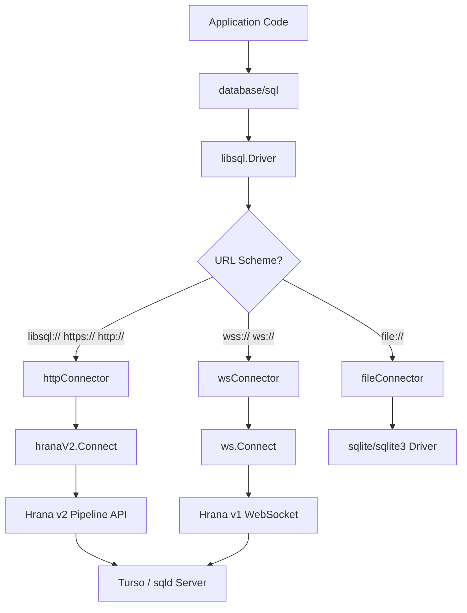
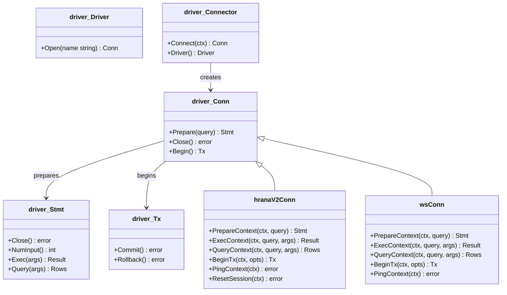
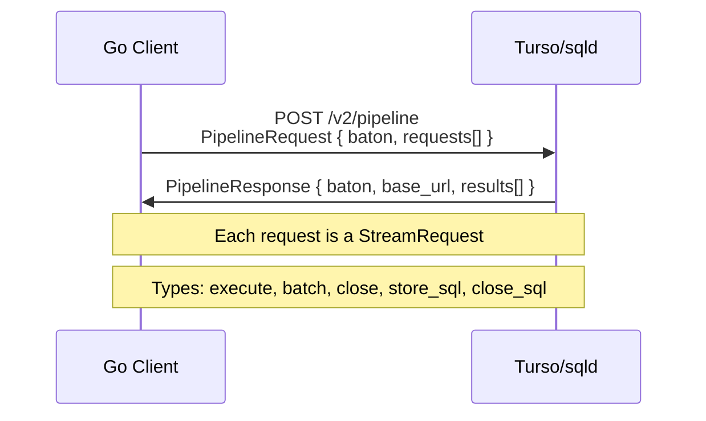
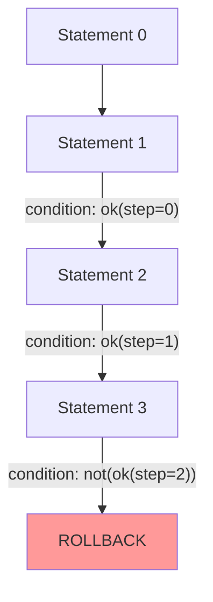
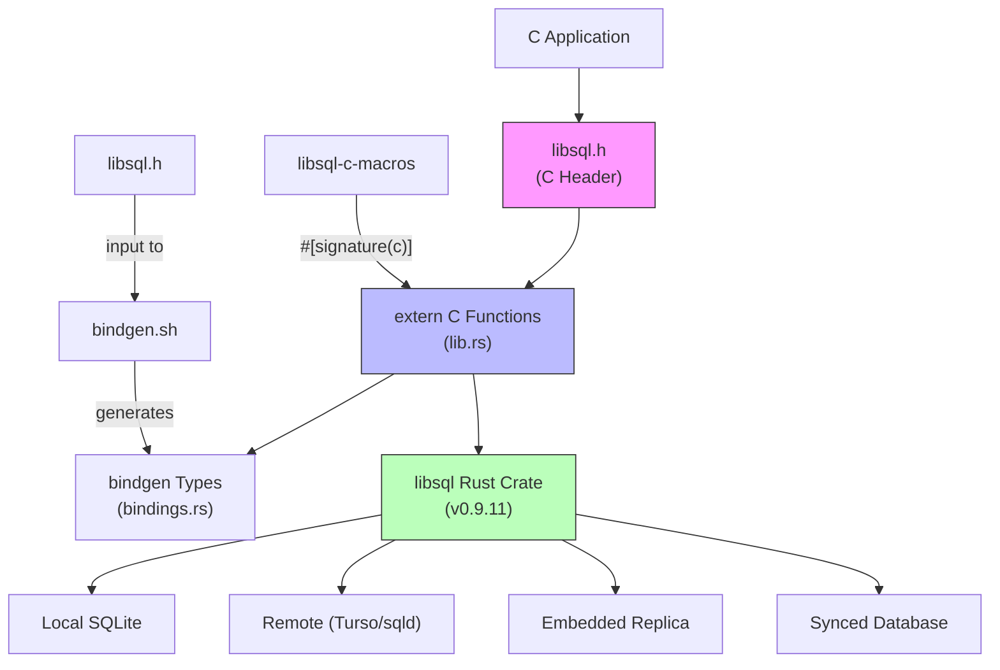
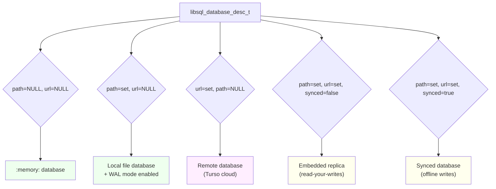
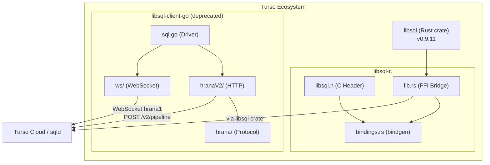

---
locations:
  - /home/darkvoid/Boxxed/@formulas/src.rust/src.turso/libsql-client-go
  - /home/darkvoid/Boxxed/@formulas/src.rust/src.turso/libsql-c
repositories:
  - git@github.com:tursodatabase/libsql-client-go
  - git@github.com:tursodatabase/libsql-c
explored_at: 2026-03-22
languages:
  - Go
  - C
  - Rust
---

# libsql-client-go & libsql-c Exploration

Two complementary projects from Turso: a pure Go client for connecting to libsql/Turso databases over HTTP and WebSocket protocols, and a C bindings crate that wraps the Rust `libsql` core into a C-compatible shared/static library.

**Status:** libsql-client-go is deprecated in favor of the newer `go-libsql` client that uses CGo with the native libsql library. libsql-c is actively maintained at v0.3.2.

---

## Table of Contents

1. [libsql-client-go](#libsql-client-go)
   - [Architecture Overview](#go-client-architecture)
   - [Connection Modes](#connection-modes)
   - [database/sql Driver Interface](#databasesql-driver-interface)
   - [Hrana Protocol Implementation](#hrana-protocol-implementation)
   - [Batch Operations and Transactions](#batch-operations-and-transactions)
   - [Type Mapping](#type-mapping)
   - [Statement Parsing](#statement-parsing)
2. [libsql-c](#libsql-c)
   - [Architecture Overview](#c-bindings-architecture)
   - [API Surface](#api-surface)
   - [FFI Boundary Design](#ffi-boundary-design)
   - [Memory Management](#memory-management)
   - [Database Modes](#database-modes-c)
   - [Type System](#type-system-c)
   - [Procedural Macro for Signature Verification](#procedural-macro-for-signature-verification)
3. [Cross-Project Relationships](#cross-project-relationships)

---

## libsql-client-go

### Go Client Architecture



The Go client registers itself as `"libsql"` via `sql.Register("libsql", Driver{})` in an `init()` function. It supports three connection modes through a unified `driver.Connector` interface, with URL scheme detection driving the routing.

### Project Structure

```
libsql-client-go/
  libsql/
    sql.go                          # Driver registration, connector factory, options
    internal/
      hrana/                        # Hrana protocol data types (shared)
        batch.go                    # Batch struct with steps and conditions
        batch_result.go             # BatchResult deserialization
        pipeline_request.go         # PipelineRequest (baton + stream requests)
        pipeline_response.go        # PipelineResponse (baton + base_url + results)
        stmt.go                     # Stmt with SQL, args, named_args
        stmt_result.go              # StmtResult with cols, rows, replication_index
        stream_request.go           # StreamRequest types (execute, batch, close, store_sql)
        stream_result.go            # StreamResult and StreamResponse
        value.go                    # Value type conversion (Go <-> Hrana JSON)
      http/
        driver.go                   # Thin wrapper delegating to hranaV2
        hranaV2/
          hranaV2.go                # Full HTTP pipeline implementation
        shared/
          result.go                 # Result wrapper (LastInsertId, RowsAffected)
          rows.go                   # Multi-result-set Rows implementation
          statement.go              # SQL parsing, parameter extraction via ANTLR
      ws/
        driver.go                   # WebSocket driver (conn, stmt, tx, rows)
        websockets.go               # Raw WebSocket connection, Hrana v1 messages
  sqliteparser/                     # ANTLR-generated SQLite lexer/parser
  sqliteparserutils/                # Statement splitting, iteration
  tests/
    http/driver_test.go
    ws/driver_test.go
```

### Connection Modes

#### 1. HTTP Mode (Hrana v2 Pipeline)

The primary mode for connecting to Turso cloud databases. Uses the Hrana v2 pipeline HTTP API at `/v2/pipeline`.

```
URL schemes: https://, http://, libsql:// (maps to https by default)
```

Key characteristics:
- Stateless HTTP POST requests to `/v2/pipeline`
- Session continuity via **baton** tokens (returned in responses, sent back in requests)
- Supports `base_url` redirection from the server
- Tracks `replication_index` for read-your-writes consistency
- Connection closing sends a `close` stream request asynchronously via goroutine
- Implements `driver.SessionResetter` (ResetSession closes the stream)
- Large queries (>20MB) are automatically chunked into batches of 4096 statements
- Sends `x-libsql-client-version` header with commit hash for diagnostics
- Supports `x-turso-encryption-key` header for remote encrypted databases
- Schema database mode via `schemaDb` flag

#### 2. WebSocket Mode (Hrana v1)

Uses persistent WebSocket connections with the Hrana v1 protocol.

```
URL schemes: wss://, ws://
```

Key characteristics:
- Subprotocol: `hrana1`
- Opens with `hello` message (JWT auth) followed by `open_stream` request
- Each SQL execution sends a `request` message with `request_id` and `stream_id: 0`
- Uses an ID pool for concurrent request tracking (borrowed from Vitess)
- 16MB read limit on WebSocket messages
- 120-second default connection timeout
- Single stream per connection (stream_id always 0)
- Does not support proxy, schemaDb, or remote encryption features

#### 3. File Mode (Local SQLite)

Delegates to an existing sqlite/sqlite3 driver registered in the Go `database/sql` registry.

```
URL schemes: file://
```

Key characteristics:
- Requires a separate sqlite or sqlite3 driver to be imported
- Pure passthrough -- creates a `fileConnector` that wraps the detected driver
- No custom logic, just scheme detection

### Connection Options

The `NewConnector` function accepts functional options:

| Option | Purpose |
|--------|---------|
| `WithAuthToken(token)` | JWT bearer token for authentication |
| `WithTls(bool)` | TLS on/off (only for `libsql://` scheme) |
| `WithProxy(url)` | HTTP proxy URL (not supported for ws://) |
| `WithSchemaDb(bool)` | Schema database mode flag |
| `WithRemoteEncryptionKey(key)` | Encryption key sent via header |

### database/sql Driver Interface

Both HTTP and WebSocket modes implement the standard Go `database/sql/driver` interfaces:



Both implement the context-aware variants (`driver.ConnPrepareContext`, `driver.StmtExecContext`, `driver.StmtQueryContext`, `driver.ConnBeginTx`). The HTTP connection additionally implements `driver.SessionResetter`.

Transactions are implemented by sending `BEGIN`/`COMMIT`/`ROLLBACK` SQL statements, not through a dedicated Hrana transaction mechanism.

### Hrana Protocol Implementation

The Hrana protocol types are defined in `libsql/internal/hrana/` and shared between HTTP and WebSocket modes.

#### Pipeline Request/Response (HTTP mode)



A `PipelineRequest` contains:
- `baton` (string): Session continuity token, empty on first request
- `requests` ([]StreamRequest): Array of stream operations

A `StreamRequest` can be:
- `execute` -- single statement execution with optional args
- `batch` -- multiple statements with conditional execution
- `close` -- close the stream
- `store_sql` / `close_sql` -- server-side SQL caching (by sql_id)

A `PipelineResponse` returns:
- `baton` (string): Updated session token
- `base_url` (string): Optional URL redirect
- `results` ([]StreamResult): Per-request results containing `StreamResponse` or `Error`

#### WebSocket Messages (WS mode)

The WS mode uses Hrana v1 with raw JSON messages:
1. `hello` with JWT
2. `open_stream` with stream_id
3. `request` with `execute` containing stmt object
4. Response with `result` containing cols, rows, affected_row_count, last_insert_rowid

#### Replication Index Tracking

Both `StmtResult` and `BatchResult` carry a `replication_index` field. The HTTP connection tracks the highest replication index seen and attaches it to subsequent requests, enabling read-your-writes consistency when connecting to distributed replicas.

The replication index can be a JSON number or string, handled by custom `UnmarshalJSON` implementations.

### Batch Operations and Transactions

Batch operations send multiple statements in a single request. The Hrana protocol supports conditional execution via `BatchCondition`:



Condition types:
- `ok` -- previous step succeeded
- `not` -- negation of another condition
- `conds` -- conjunction/disjunction of multiple conditions

When `transactional=true`, the `BatchStream` function appends a `ROLLBACK` step conditioned on `not(ok(last_step))`, providing automatic rollback on failure.

#### Chunked Execution

For very large queries (>20MB without arguments), the HTTP client splits statements into chunks of 4096 using `sqliteparserutils.CreateStatementIterator`. Each chunk runs as a batch within a wrapping `BEGIN`/`COMMIT` transaction. Transaction-control statements (`BEGIN`, `COMMIT`, `END`, `ROLLBACK`) within the original SQL are stripped since chunks already run in a transaction.

### Type Mapping

The Hrana protocol uses JSON-serialized typed values:

| Hrana Type | JSON Representation | Go Type |
|-----------|-------------------|---------|
| `null` | `{"type":"null"}` | `nil` |
| `integer` | `{"type":"integer","value":"123"}` | `int64` |
| `text` | `{"type":"text","value":"hello"}` | `string` |
| `float` | `{"type":"float","value":1.5}` | `float64` |
| `blob` | `{"type":"blob","base64":"AAEC"}` | `[]byte` |

Additional Go-to-Hrana conversions:
- `bool` maps to integer (`true`=1, `false`=0)
- `time.Time` maps to text (formatted as `2006-01-02 15:04:05.999999999-07:00`)
- `int` maps to integer

When reading values back, the client checks the column's declared type (`decltype`). If it is `TIMESTAMP` or `DATETIME` and the value is text, it attempts to parse the string as a time using multiple format patterns.

### Statement Parsing

The client includes a full ANTLR4-generated SQLite lexer/parser (`sqliteparser/`) for:
1. **Statement splitting** -- breaking multi-statement SQL strings into individual statements
2. **Parameter extraction** -- detecting `?`, `?N`, `:name`, `@name`, `$name` bind parameters
3. **Parameter routing** -- distributing a single args slice across multiple statements by counting each statement's parameter count

The ANTLR grammar files are in `sqliteparser/grammar/` (SQLiteLexer.g4, SQLiteParser.g4).

---

## libsql-c

### C Bindings Architecture



The libsql-c crate is a thin FFI wrapper around the Rust `libsql` crate (v0.9.11). It compiles as both `cdylib` (shared) and `staticlib` (static) library. The header file `libsql.h` is hand-maintained, while `src/bindings.rs` is generated from it via `bindgen`.

### Project Structure

```
libsql-c/
  libsql.h              # Public C header (hand-written)
  Cargo.toml             # Crate config, depends on libsql 0.9.11
  src/
    lib.rs               # All FFI function implementations (~1370 lines)
    bindings.rs           # bindgen-generated Rust types from libsql.h
  macros/
    Cargo.toml
    src/lib.rs            # #[signature] proc macro for type checking
  bindgen.sh             # Script to regenerate bindings.rs
  build.sh               # Build script
  package.sh             # Packaging script
  examples/
    batch/example.c
    encryption/example.c
    local/example.c
    memory/example.c
    remote/example.c
    sync/example.c
    transactions/example.c
    vector/example.c
```

### API Surface

The C API exposes the following function groups:

#### Global Setup

```c
const libsql_error_t *libsql_setup(libsql_config_t config);
const char *libsql_error_message(libsql_error_t *self);
```

`libsql_setup` initializes the tracing subscriber (once) and optionally registers a logging callback and client version string.

#### Database Lifecycle

```c
libsql_database_t  libsql_database_init(libsql_database_desc_t desc);
libsql_sync_t      libsql_database_sync(libsql_database_t self);
libsql_connection_t libsql_database_connect(libsql_database_t self);
void               libsql_database_deinit(libsql_database_t self);
```

#### Connection Operations

```c
libsql_transaction_t    libsql_connection_transaction(libsql_connection_t self);
libsql_batch_t          libsql_connection_batch(libsql_connection_t self, const char *sql);
libsql_connection_info_t libsql_connection_info(libsql_connection_t self);
libsql_statement_t      libsql_connection_prepare(libsql_connection_t self, const char *sql);
void                    libsql_connection_deinit(libsql_connection_t self);
```

#### Transaction Operations

```c
libsql_batch_t     libsql_transaction_batch(libsql_transaction_t self, const char *sql);
libsql_statement_t libsql_transaction_prepare(libsql_transaction_t self, const char *sql);
void               libsql_transaction_commit(libsql_transaction_t self);
void               libsql_transaction_rollback(libsql_transaction_t self);
```

#### Statement Operations

```c
libsql_execute_t  libsql_statement_execute(libsql_statement_t self);
libsql_rows_t     libsql_statement_query(libsql_statement_t self);
void              libsql_statement_reset(libsql_statement_t self);
size_t            libsql_statement_column_count(libsql_statement_t self);
libsql_bind_t     libsql_statement_bind_named(libsql_statement_t, const char *name, libsql_value_t);
libsql_bind_t     libsql_statement_bind_value(libsql_statement_t, libsql_value_t);
void              libsql_statement_deinit(libsql_statement_t self);
```

#### Row/Rows Operations

```c
libsql_row_t          libsql_rows_next(libsql_rows_t self);
libsql_slice_t        libsql_rows_column_name(libsql_rows_t self, int32_t index);
int32_t               libsql_rows_column_count(libsql_rows_t self);
void                  libsql_rows_deinit(libsql_rows_t self);

libsql_result_value_t libsql_row_value(libsql_row_t self, int32_t index);
libsql_slice_t        libsql_row_name(libsql_row_t self, int32_t index);
int32_t               libsql_row_length(libsql_row_t self);
bool                  libsql_row_empty(libsql_row_t self);
void                  libsql_row_deinit(libsql_row_t self);
```

#### Value Constructors

```c
libsql_value_t libsql_integer(int64_t integer);
libsql_value_t libsql_real(double real);
libsql_value_t libsql_text(const char *ptr, size_t len);
libsql_value_t libsql_blob(const uint8_t *ptr, size_t len);
libsql_value_t libsql_null();
```

### FFI Boundary Design

#### Result Pattern

Every fallible operation returns a struct containing both an error pointer and the success value:

```c
typedef struct {
    libsql_error_t *err;   // NULL on success, pointer to error message on failure
    void *inner;           // Opaque pointer to Rust heap object
} libsql_database_t;
```

This pattern is consistent across all types: `libsql_database_t`, `libsql_connection_t`, `libsql_statement_t`, `libsql_transaction_t`, `libsql_rows_t`, `libsql_row_t`. The caller checks `err` before using `inner`.

On the Rust side, errors are `CString`-allocated error messages cast to `*mut libsql_error_t`. The `libsql_error_message` function simply casts the error pointer back to `*const c_char` -- the error IS the message string, using pointer aliasing:

```rust
pub extern "C" fn libsql_error_message(err: *mut c::libsql_error_t) -> *const c_char {
    err as *mut c_char
}
```

#### Opaque Pointer Wrapping

Rust objects cross the FFI as `Box::into_raw(Box::new(obj)) as *mut c_void`. On the other side, they are recovered with `ManuallyDrop::new(unsafe { Box::from_raw(ptr as *mut T) })` to prevent premature deallocation while the function uses the object.

```mermaid
graph LR
    A["Rust Object"] -->|"Box::new"| B["Box&lt;T&gt;"]
    B -->|"Box::into_raw"| C["*mut T"]
    C -->|"as *mut c_void"| D["void* in C struct"]
    D -->|"as *mut T"| E["*mut T"]
    E -->|"Box::from_raw"| F["Box&lt;T&gt;"]
    F -->|"ManuallyDrop::new"| G["ManuallyDrop&lt;Box&lt;T&gt;&gt;"]
    G -->|"use &/&mut"| H["Access Object"]
```



#### Tokio Runtime Bridge

The crate creates a single global Tokio multi-threaded runtime via `lazy_static!`:

```rust
lazy_static! {
    static ref RT: Runtime = Runtime::new().unwrap();
}
```

All async operations from the `libsql` crate are bridged to synchronous C calls via `RT.block_on(...)`. This means every C function call that touches the database blocks the calling thread until the async operation completes.

### Memory Management

The API follows an explicit `_deinit` pattern for resource cleanup:

| Function | What it frees |
|----------|--------------|
| `libsql_error_deinit` | CString error message |
| `libsql_database_deinit` | Box\<Database\> |
| `libsql_connection_deinit` | Box\<Connection\> |
| `libsql_statement_deinit` | Box\<Statement\> |
| `libsql_transaction_commit` | Box\<Transaction\> (commits first) |
| `libsql_transaction_rollback` | Box\<Transaction\> (rolls back first) |
| `libsql_rows_deinit` | Box\<Rows\> |
| `libsql_row_deinit` | Box\<Row\> |
| `libsql_slice_deinit` | Heap-allocated slice data |

Text and blob values returned from queries use `ManuallyDrop` to prevent the Rust allocator from freeing them while they are exposed to C. The `libsql_slice_deinit` function must be called to reclaim this memory.

Ownership rules:
- `_deinit` functions take ownership and destroy the resource
- Transaction commit/rollback consume the transaction (it becomes invalid)
- Statement reset clears bound parameters but keeps the statement alive
- `ManuallyDrop` prevents double-free when functions borrow objects temporarily

### Database Modes (C)

The `libsql_database_desc_t` descriptor struct controls which database mode is used, determined by which fields are populated:



Descriptor fields:

| Field | Type | Purpose |
|-------|------|---------|
| `url` | `const char*` | Primary database URL |
| `path` | `const char*` | Local file path or `:memory:` |
| `auth_token` | `const char*` | Authentication token |
| `encryption_key` | `const char*` | AES-256-CBC encryption key |
| `sync_interval` | `uint64_t` | Auto-sync interval in milliseconds |
| `cypher` | `libsql_cypher_t` | Cipher selection (DEFAULT or AES256) |
| `disable_read_your_writes` | `bool` | Disable consistency guarantee |
| `webpki` | `bool` | Use WebPKI TLS roots |
| `synced` | `bool` | Use synced database mode (offline writes) |
| `disable_safety_assert` | `bool` | Skip safety assertions |
| `namespace` | `const char*` | Multi-tenant namespace header |

### Type System (C)

```c
typedef enum {
    LIBSQL_TYPE_INTEGER = 1,  // int64_t
    LIBSQL_TYPE_REAL = 2,     // double
    LIBSQL_TYPE_TEXT = 3,     // libsql_slice_t (ptr + len)
    LIBSQL_TYPE_BLOB = 4,     // libsql_slice_t (ptr + len)
    LIBSQL_TYPE_NULL = 5,     // no value
} libsql_type_t;
```

The `libsql_value_t` struct uses a tagged union:

```c
typedef union {
    int64_t integer;
    double real;
    libsql_slice_t text;
    libsql_slice_t blob;
} libsql_value_union_t;

typedef struct {
    libsql_value_union_t value;
    libsql_type_t type;
} libsql_value_t;
```

The Rust side provides bidirectional conversion between `libsql::Value` and `libsql_value_t`:
- `From<libsql::Value> for libsql_value_t` -- Rust to C (text uses `CString` with `ManuallyDrop`)
- `TryFrom<libsql_value_t> for libsql::Value` -- C to Rust (text parsed via `CStr::from_ptr`)

Text values with embedded NULs are truncated at the first NUL byte when converting from Rust to C.

### Procedural Macro for Signature Verification

The `libsql-c-macros` crate provides a `#[signature(c)]` attribute macro that verifies at compile time that each `extern "C"` function matches the signature declared in the generated bindings module:

```rust
#[no_mangle]
#[signature(c)]
pub extern "C" fn libsql_database_init(desc: c::libsql_database_desc_t) -> c::libsql_database_t {
    // ...
}
```

The macro expands to a compile-time assertion that both the implementation and the bindgen declaration have the same function pointer type:

```rust
const _: () = {
    let _: [unsafe extern "C" fn(_) -> _; 2] = [
        c::libsql_database_init,  // from bindings
        libsql_database_init,     // this impl
    ];
};
```

If the signatures diverge, compilation fails with a type mismatch error. This prevents FFI signature drift between the header and the implementation.

### Tracing and Logging

The C API supports structured logging via a callback:

```c
typedef struct {
    const char *message;
    const char *target;
    const char *file;
    uint64_t timestamp;
    size_t line;
    libsql_tracing_level_t level;
} libsql_log_t;

typedef struct {
    void (*logger)(libsql_log_t log);
    const char *version;
} libsql_config_t;
```

Internally, this is implemented as a custom `tracing_subscriber::Layer` (`CallbackLayer`) that converts Rust `tracing::Event` objects into `libsql_log_t` structs and invokes the user-provided C callback. The logger callback is stored in a global `RwLock<Option<...>>` and the tracing subscriber is initialized exactly once via `std::sync::Once`.

---

## Cross-Project Relationships



Key differences between the two projects:

| Aspect | libsql-client-go | libsql-c |
|--------|-----------------|----------|
| Language | Pure Go | Rust compiled to C |
| Protocol | Hrana v1/v2 over HTTP/WS | Native libsql crate (SQLite wire) |
| Local DB | Delegates to sqlite3 driver | Direct via libsql::Builder |
| Embedded replicas | Not supported | Full support |
| Encryption | Remote only (via header) | Local file encryption (AES-256-CBC) |
| Sync | Not applicable | Manual + interval-based sync |
| Status | Deprecated | Active |
| Concurrency | Go goroutines | Tokio runtime bridged to blocking |

The Go client is a network-only client that speaks Hrana protocol over HTTP or WebSocket. It cannot operate on local databases directly (it delegates to sqlite3 drivers). The C bindings expose the full power of the Rust `libsql` crate including local databases, embedded replicas, encryption, and sync -- features unavailable through the Go client's protocol-level approach.

---

## Dependencies

### libsql-client-go

| Dependency | Version | Purpose |
|-----------|---------|---------|
| `antlr4-go/antlr/v4` | v4.13.0 | SQL parsing for parameter extraction |
| `coder/websocket` | v1.8.12 | WebSocket client (replaces nhooyr.io) |
| `golang.org/x/sync` | v0.3.0 | Synchronization primitives |
| `golang.org/x/exp` | indirect | Experimental Go libraries |

### libsql-c

| Dependency | Version | Purpose |
|-----------|---------|---------|
| `libsql` | 0.9.11 | Core database engine |
| `tokio` | 1.29.1 | Async runtime (multi-thread) |
| `lazy_static` | 1.5.0 | Global runtime singleton |
| `hyper-rustls` | 0.25 | WebPKI TLS connector |
| `anyhow` | 1.0.86 | Error handling |
| `tracing` | 0.1.40 | Structured logging |
| `tracing-subscriber` | 0.3.18 | Log formatting and filtering |
| `bindgen` | 0.69.5 | C header to Rust types (build dep) |
