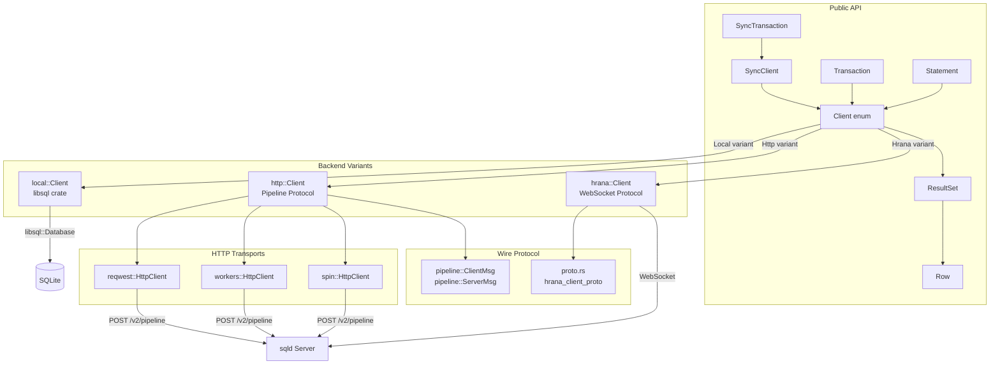
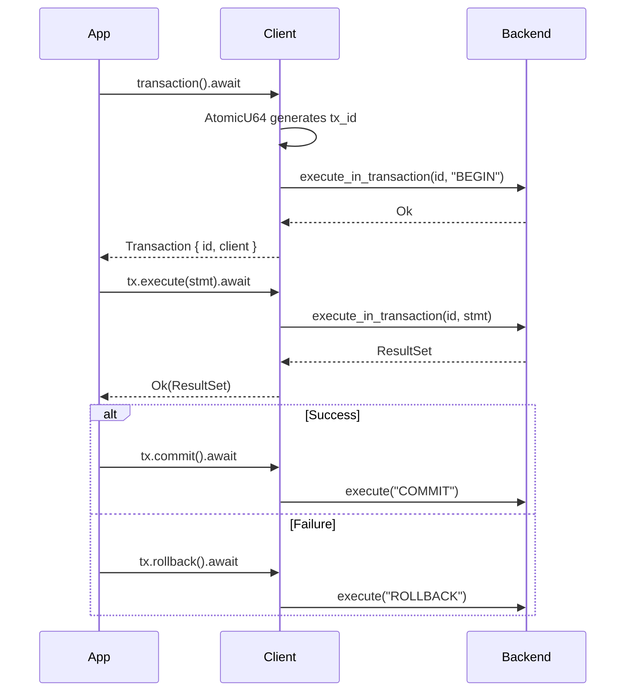
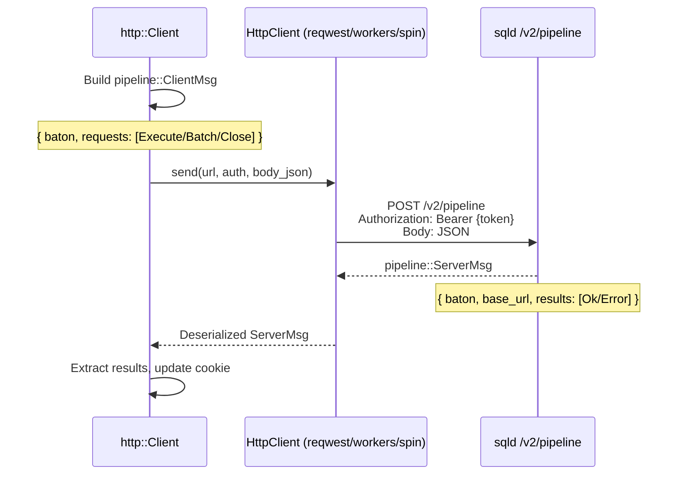
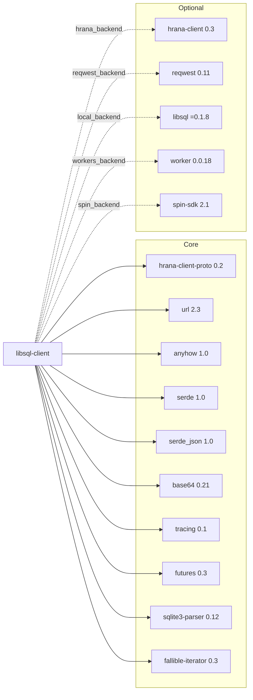

# libsql-client-rs Exploration

> **DEPRECATED:** As of v0.33.0, this crate has been deprecated in favor of the [`libsql`](https://github.com/tursodatabase/libsql) crate. However, the architecture and patterns remain instructive for understanding how Turso's client ecosystem evolved.

## Project Overview

`libsql-client-rs` is a lightweight Rust client library for communicating with libSQL/sqld databases. It provides a unified API surface across multiple transport backends: local SQLite-compatible access, HTTP-based remote access (via the Hrana pipeline protocol), and WebSocket-based access (via the Hrana streaming protocol). The library notably compiles to `wasm32-unknown-unknown`, making it viable for Cloudflare Workers, Fermyon Spin, and other WebAssembly environments.

**Version:** 0.34.0
**License:** Apache-2.0
**Edition:** Rust 2021

## Directory Structure

```
libsql-client-rs/
  Cargo.toml              # Workspace root, single crate
  README.md               # Usage documentation
  src/
    lib.rs                 # Crate root: Row, ResultSet, args! macro, module exports
    client.rs              # Client enum, SyncClient wrapper, Config, connection factories
    statement.rs           # Statement struct with SQL + bound parameters
    transaction.rs         # Transaction / SyncTransaction interactive transaction types
    proto.rs               # Re-exports from hrana_client_proto / hrana_client
    http.rs                # Generic HTTP pipeline client (Cookie/baton session management)
    reqwest.rs             # reqwest-based HTTP transport
    workers.rs             # Cloudflare Workers HTTP transport
    spin.rs                # Fermyon Spin HTTP transport
    hrana.rs               # WebSocket-based Hrana streaming client
    local.rs               # Local libsql (SQLite) backend
    de.rs                  # serde Deserializer for Row -> struct mapping
    utils.rs               # URL query parameter utilities
  examples/
    select.rs              # Deserialization example with de::from_row
    connect_from_config.rs # Config-based connection example
    connect_from_env.rs    # Environment variable connection with transactions
```

## Architecture



## Client Connection Modes

The `Client` enum is the central abstraction, dispatching all operations to the appropriate backend:

```rust
pub enum Client {
    Local(crate::local::Client),    // feature = "local_backend"
    Http(crate::http::Client),      // features: reqwest/workers/spin
    Hrana(crate::hrana::Client),     // feature = "hrana_backend"
    Default,                        // panic sentinel
}
```

### Connection Resolution

URL scheme determines which backend is selected in `Client::from_config()`:

| URL Scheme | Backend | Feature Flag | Transport |
|---|---|---|---|
| `file:///` | `Local` | `local_backend` | Direct libsql/SQLite access |
| `http://`, `https://` | `Http` (reqwest) | `reqwest_backend` | HTTP POST to `/v2/pipeline` |
| `ws://`, `wss://` | `Hrana` | `hrana_backend` | WebSocket streaming |
| `libsql://` | Rewritten to `https://` | `reqwest_backend` | HTTP POST to `/v2/pipeline` |
| `workers`, `http`, `https` | `Http` (workers) | `workers_backend` | CF Workers fetch API |
| `spin`, `http`, `https` | `Http` (spin) | `spin_backend` | Spin SDK outbound HTTP |

The `libsql://` scheme is rewritten to `https://` at connection time -- the library uses string replacement (`libsql://` -> `https://`) because `url::Url::set_scheme()` blocks cross-category scheme changes.

### Environment-Based Configuration

```rust
// Reads LIBSQL_CLIENT_URL and optionally LIBSQL_CLIENT_TOKEN
let db = Client::from_env().await?;

// Or explicit config
let db = Client::from_config(Config {
    url: url::Url::parse("https://my-db.turso.io")?,
    auth_token: Some("jwt-token".into()),
}).await?;
```

## Feature Flags

```toml
[features]
default = [
    "local_backend",                    # libsql (SQLite) local access
    "hrana_backend",                    # WebSocket Hrana client
    "reqwest_backend",                 # reqwest HTTP client
    "mapping_names_to_values_in_rows", # Column name -> value HashMap in Row
]
workers_backend = ["worker", "futures-util"]   # Cloudflare Workers
spin_backend = ["spin-sdk", "http", "bytes"]   # Fermyon Spin
separate_url_for_queries = []                   # Unused/placeholder
```

The default features enable three backends simultaneously. For WASM targets (Workers, Spin), default features must be disabled since `libsql` and `reqwest` do not compile to `wasm32-unknown-unknown`.

## Statement Building and Execution

### Statement Construction

`Statement` holds a SQL string and a `Vec<Value>` of positional parameters:

```rust
// Simple statement
Statement::new("SELECT * FROM users")

// With typed parameters (homogeneous)
Statement::with_args("SELECT * FROM users WHERE id = ?", &[42])

// With mixed-type parameters via args! macro
Statement::with_args(
    "INSERT INTO t VALUES (?, ?, ?)",
    args!(42, "hello", 3.14)
)

// Implicit conversion from &str / String
let stmt: Statement = "SELECT 1".into();
```

The `args!` macro expands to `&[$($param.into()),+] as &[libsql_client::Value]`, leveraging `Into<Value>` implementations from the hrana protocol types.

### Value Type System

The `Value` enum (from `hrana_client_proto`) maps SQLite types to Rust:

| SQLite Type | Value Variant | Rust Type |
|---|---|---|
| NULL | `Value::Null` | `()` |
| INTEGER | `Value::Integer { value: i64 }` | `i64` |
| REAL | `Value::Float { value: f64 }` | `f64` |
| TEXT | `Value::Text { value: String }` | `String` |
| BLOB | `Value::Blob { value: Vec<u8> }` | `Vec<u8>` |

The local backend uses a `ValueWrapper` newtype to convert between `hrana_client_proto::Value` and `libsql::Value`:

```rust
// hrana Value -> libsql Value
Value::Integer { value: n } => libsql::Value::Integer(n)
Value::Text { value: s }    => libsql::Value::Text(s)
Value::Float { value: d }   => libsql::Value::Real(d)
Value::Blob { value: b }    => libsql::Value::Blob(b)
Value::Null                  => libsql::Value::Null
```

### Result Types

```rust
pub struct ResultSet {
    pub columns: Vec<String>,       // Column names
    pub rows: Vec<Row>,             // Result rows
    pub rows_affected: u64,         // For INSERT/UPDATE/DELETE
    pub last_insert_rowid: Option<i64>,  // For INSERT only
}

pub struct Row {
    pub values: Vec<Value>,         // Positional access
    pub value_map: HashMap<String, Value>,  // Named access (feature-gated)
}
```

Row provides typed access via `try_get(index)` and `try_column(name)`:

```rust
let num: usize = row.try_get(0)?;
let text: &str = row.try_column("name")?;
```

## Serde Deserialization (de module)

The `de` module implements a custom `serde::Deserializer` for `Row`, enabling direct deserialization into Rust structs. This requires the `mapping_names_to_values_in_rows` feature (enabled by default).

```rust
#[derive(serde::Deserialize)]
struct User {
    name: String,
    email: String,
    age: i64,
}

let users: Vec<User> = db.execute("SELECT * FROM users").await?
    .rows.iter()
    .map(de::from_row)
    .collect::<Result<Vec<_>, _>>()?;
```

Supported deserialization targets: `String`, `Vec<u8>`, `i64`, `f64`, `Option<T>`, and `()`. The deserializer maps column names to struct field names via the `value_map` HashMap.

## Batch Operations

Two batch modes exist:

### raw_batch -- Independent Execution

Each statement executes independently. If one fails, subsequent statements may still execute (backend-dependent). Returns `BatchResult` with per-step results and errors:

```rust
pub struct BatchResult {
    pub step_results: Vec<Option<StmtResult>>,
    pub step_errors: Vec<Option<Error>>,
}
```

### batch -- Transactional Execution

Wraps statements in `BEGIN`/`END`, providing atomicity. Internally calls `raw_batch` with the transaction wrapper prepended/appended:

```rust
pub async fn batch(&self, stmts: I) -> Result<Vec<ResultSet>> {
    let batch_results = self.raw_batch(
        std::iter::once(Statement::new("BEGIN"))
            .chain(stmts.into_iter().map(|s| s.into()))
            .chain(std::iter::once(Statement::new("END"))),
    ).await?;
    // Strip BEGIN/END from results, check for step errors
}
```

## Transaction Support

### Interactive Transactions

The `Transaction` type enables multi-step interactive transactions with explicit commit/rollback:



Transaction IDs are generated via a global `AtomicU64` counter, ensuring uniqueness across concurrent transactions.

### Backend-Specific Transaction Mechanics

**HTTP Backend:** Uses a cookie/baton system for session affinity. The server returns a `baton` token and optionally a `base_url` after each request within a transaction. Subsequent requests in the same transaction must include the baton. The `Cookie` struct tracks this per transaction ID:

```rust
struct Cookie {
    baton: Option<String>,   // Server session token
    base_url: Option<String>, // Redirected URL for session affinity
}
```

**Hrana Backend:** Opens a dedicated WebSocket stream per transaction, stored in `streams_for_transactions: RwLock<HashMap<u64, Arc<hrana_client::Stream>>>`. The stream is dropped on commit/rollback.

**Local Backend:** Transaction IDs are effectively ignored -- the local backend executes `BEGIN`/`COMMIT`/`ROLLBACK` as regular SQL statements through the single `libsql::Connection`.

### Sync Transactions

`SyncTransaction` mirrors `Transaction` but wraps all async calls in `futures::executor::block_on()`.

## The Hrana Protocol Implementation

The library communicates with sqld using two variants of the Hrana protocol:

### Pipeline Protocol (HTTP backends)

Used by `http::Client` via `reqwest`, `workers`, and `spin` transports. Messages are sent as JSON POST requests to the `/v2/pipeline` endpoint.



The pipeline protocol is stateless per-request. For transactions, the `baton` field maintains session state across requests. Non-transactional requests include a `Close` request to immediately release server resources.

```rust
// Non-transactional: execute + close
requests: vec![
    StreamRequest::Execute(StreamExecuteReq { stmt }),
    StreamRequest::Close,
]

// Transactional: execute only, keep stream open
requests: vec![
    StreamRequest::Execute(StreamExecuteReq { stmt }),
]
```

### Streaming Protocol (Hrana/WebSocket backend)

Used by `hrana::Client` via the `hrana-client` crate. Maintains a persistent WebSocket connection. Streams are multiplexed over the connection -- each transaction gets its own stream, and standalone queries open ephemeral streams.

```rust
// Standalone query: open stream, execute, discard stream
let stream = self.client.open_stream().await?;
stream.execute(stmt).await

// Transaction: reuse stream across multiple executions
let stream = self.stream_for_transaction(tx_id).await?;
stream.execute(stmt).await
```

### Proto Module

The `proto.rs` module conditionally re-exports types from either `hrana_client::proto` (when `hrana_backend` is enabled) or `hrana_client_proto` (standalone protocol definitions). Key types: `Stmt`, `Batch`, `BatchResult`, `StmtResult`, `Col`, `Value`, `pipeline::ClientMsg`, `pipeline::ServerMsg`.

## Sync vs Async API Surface

The library provides dual APIs:

| Async (`Client`) | Sync (`SyncClient`) |
|---|---|
| `Client::from_env().await` | `SyncClient::from_env()` |
| `Client::from_config(cfg).await` | `SyncClient::from_config(cfg)` |
| `client.execute(stmt).await` | `client.execute(stmt)` |
| `client.batch(stmts).await` | `client.batch(stmts)` |
| `client.raw_batch(stmts).await` | `client.raw_batch(stmts)` |
| `client.transaction().await` | `client.transaction()` |
| `tx.execute(stmt).await` | `tx.execute(stmt)` |
| `tx.commit().await` | `tx.commit()` |

`SyncClient` wraps `Client` and delegates all calls through `futures::executor::block_on()`. This is a simple but coarse approach -- it blocks the current thread and cannot be used within an async runtime (would panic on nested `block_on`).

The local backend is inherently synchronous -- `local::Client` methods are not async. The `Client` enum dispatches to them without `.await`.

## Local Backend Deep Dive

The local backend (`local.rs`) uses the `libsql` crate (pinned to `=0.1.8`) for direct SQLite access:

```rust
pub struct Client {
    db: libsql::Database,
    conn: libsql::Connection,
}
```

Key implementation details:

1. **Single connection model** -- one `libsql::Connection` per client. No connection pooling.

2. **SQL parsing for metadata** -- uses `sqlite3_parser` to determine statement type (INSERT/UPDATE/DELETE) and conditionally report `last_insert_rowid` and `affected_row_count`. This is necessary because SQLite's C API provides these as connection-level state, not per-statement.

3. **Execute via raw_batch** -- `execute()` is implemented as `raw_batch(std::iter::once(stmt))`, meaning even single statements go through the batch pipeline.

4. **Sync method** -- exposes `db.sync().await` for embedded replica synchronization, forwarding to `libsql::Database::sync()`.

5. **Transaction simplification** -- `execute_in_transaction` ignores the `tx_id` and just forwards to `execute()`. Transaction isolation relies on SQLite's single-writer model and the `BEGIN`/`COMMIT` statements.

## HTTP Transport Implementations

All three HTTP transports implement the same interface:

```rust
pub async fn send(
    &self,
    url: String,
    auth: String,
    body: String,
) -> Result<pipeline::ServerMsg>
```

### reqwest Backend
- Uses `reqwest::Client` with `rustls-tls` (no native TLS dependency)
- Full error reporting with status code and response body text
- Suitable for native Rust applications

### Workers Backend
- Uses Cloudflare Workers `Fetch` API via `worker` crate
- Constructs `RequestInit` with `wasm_bindgen::JsValue` body
- Follows redirects by default

### Spin Backend
- Uses `spin_sdk::http::send` for outbound HTTP
- Constructs `http::Request` with `bytes::Bytes` body
- Minimal error handling (no status code check visible)

## Connection Pooling

There is no connection pooling in this library. Each backend manages connections differently:

- **Local:** Single `libsql::Connection` per `Client` instance
- **HTTP:** Stateless HTTP requests; `reqwest::Client` handles its own internal connection pooling at the TCP level
- **Hrana:** Single persistent WebSocket connection per `Client`, with multiplexed streams

For the Hrana backend, the stream-per-transaction model (`RwLock<HashMap<u64, Arc<hrana_client::Stream>>>`) acts as a lightweight multiplexing layer over the single WebSocket connection. This uses `RwLock` (not async mutex) with a comment explaining the deliberate choice to avoid runtime-specific dependencies.

## Error Handling

The library uses `anyhow::Result` throughout, with no custom error types. All errors are converted to `anyhow::Error` via:

- `anyhow::bail!()` for protocol-level errors
- `anyhow::anyhow!()` for wrapping underlying errors
- `.map_err(|e| anyhow::anyhow!("{}", e))` for type erasure from backend-specific errors

The `BatchResult` carries per-step errors as `Vec<Option<proto::Error>>` where `proto::Error` contains just a `message: String`.

This approach is simple but loses error type information -- callers cannot match on specific error variants.

## Thread Safety

The `Client` enum has a manual `unsafe impl Send for Client {}` declaration. This is required because some backend types (notably the Hrana client) may not automatically implement `Send`. The `SyncClient` wrapper does not have `Send`/`Sync` bounds.

The Hrana backend's `streams_for_transactions` uses `std::sync::RwLock` (blocking) rather than `tokio::sync::RwLock` to remain runtime-agnostic. The lock is held briefly during HashMap lookups/insertions.

## Dependency Graph



## Design Patterns and Observations

### 1. Enum-Based Backend Dispatch
The `Client` enum with feature-gated variants is the central architectural pattern. Each method on `Client` contains a `match self` block dispatching to the appropriate backend. This is effective but creates code duplication and makes adding new backends require touching every method.

### 2. No Trait Abstraction
There is no `DatabaseClient` trait. The backends share an implicit interface but it is not formalized. This means users cannot write generic code over different backends without going through the `Client` enum.

### 3. Protocol Layering
The separation between `http::Client` (protocol logic, session management) and the transport layer (`reqwest::HttpClient`, `workers::HttpClient`, `spin::HttpClient`) is clean. The `InnerClient` enum dispatches transport while `http::Client` handles the pipeline protocol.

### 4. Deprecation Context
The crate was deprecated because the `libsql` crate (used here only for the local backend) evolved to support all connection modes natively. The newer `libsql` crate provides a more unified experience with proper embedded replica support, eliminating the need for this multi-backend client.

### 5. Missing Features
- No connection pooling beyond what HTTP clients provide internally
- No retry logic or circuit breaker patterns
- No streaming result sets (all results loaded into memory)
- No prepared statement caching
- No embedded replica support at the client level (only `sync()` passthrough)
- `anyhow` error handling prevents typed error matching

## Recent Git History

```
d7e8d91 Merge pull request #71 - deprecate crate
c76aabd remove deny warnings
ae438af fix deprecated notice
a31182c deprecate crate in-favor of libsql
25aa29c Merge pull request #69
f7e24f2 Update README.md
57a81f3 0.33.4: spin-sdk::json
c7ef52d 0.33.3: make spin dependency crates-based
7c8ef8f Cargo.toml: use main spin-sdk branch
a432666 Merge pull request #58 - fix windows build
f5a4750 Merge pull request #62 - add option support
13a9727 feat: add option support
553476d 0.33.2
85522e7 Merge pull request #60
cc38f0b fix http client execute multiple server responses error
```

The final meaningful commits add Option<T> support to the deserializer, fix a Windows build issue, and then deprecate the entire crate.
