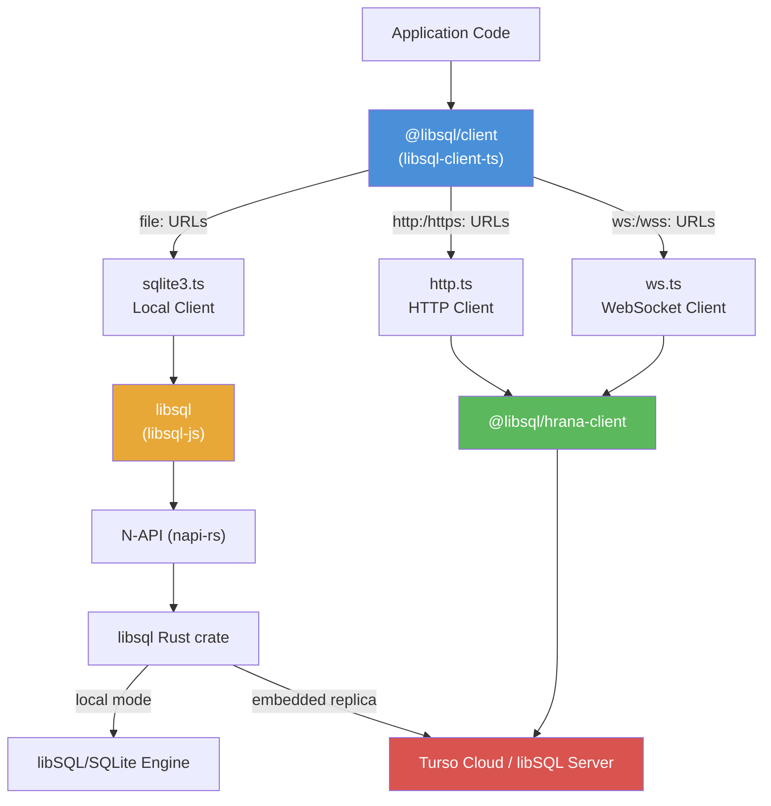
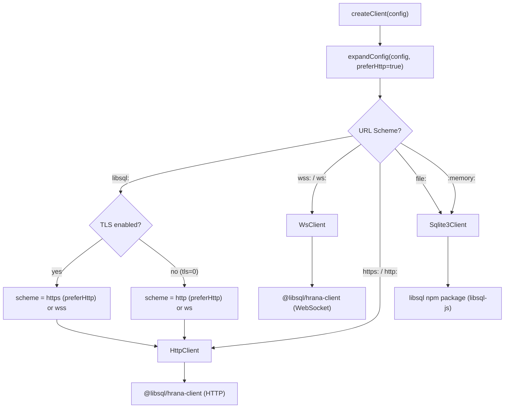
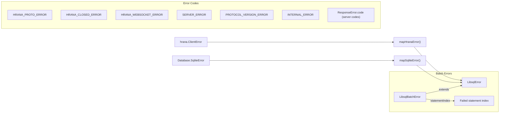
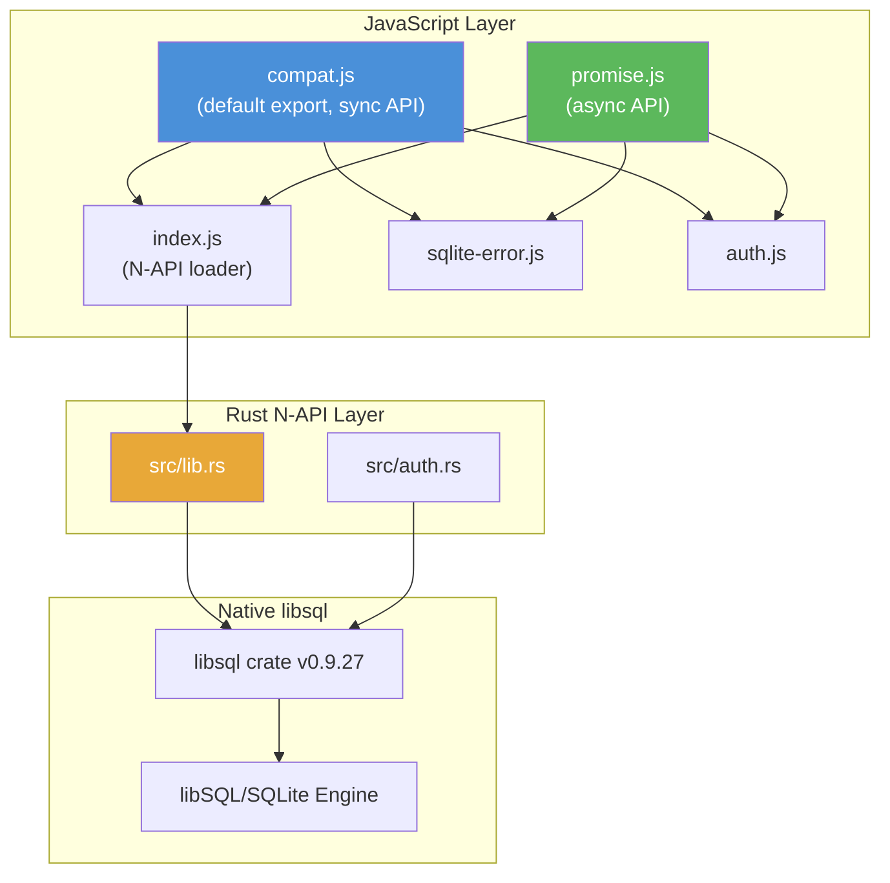
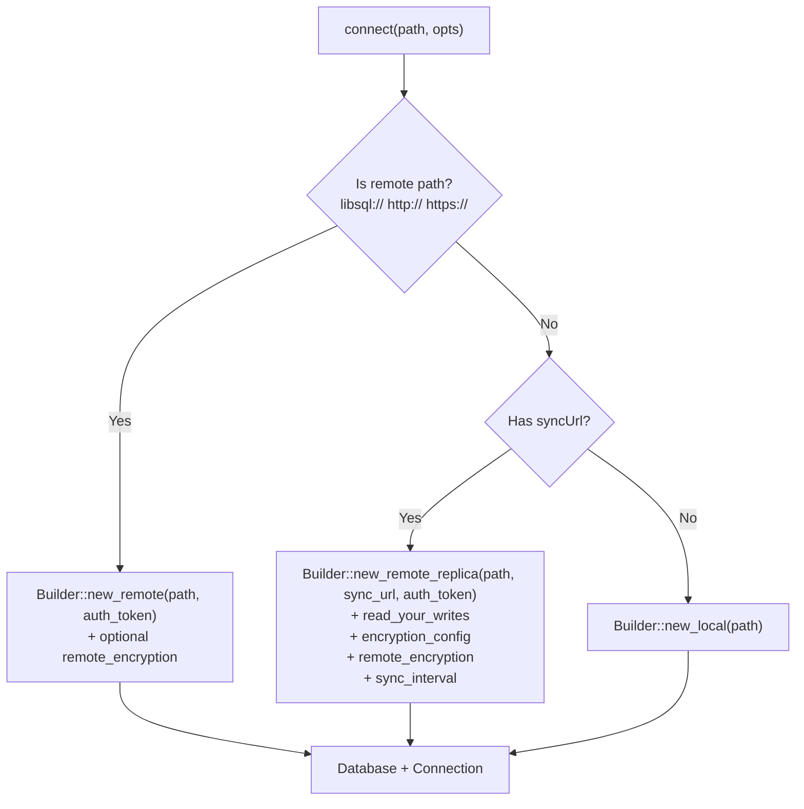
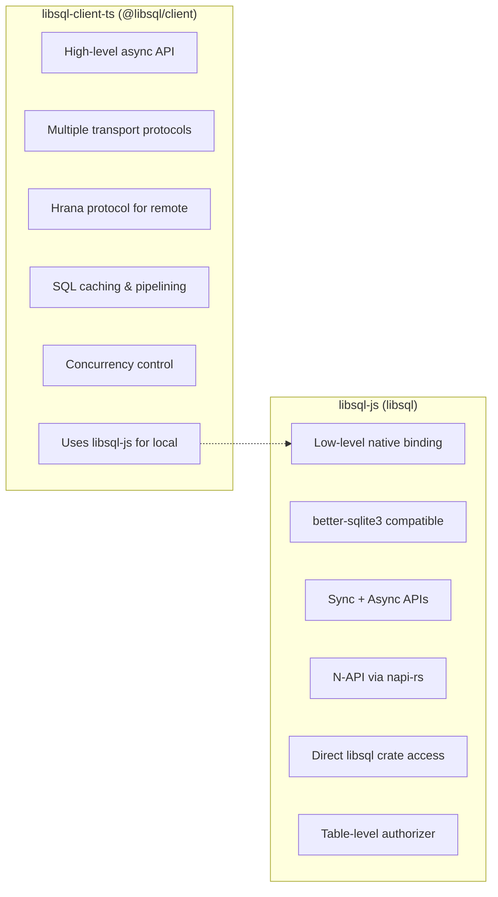
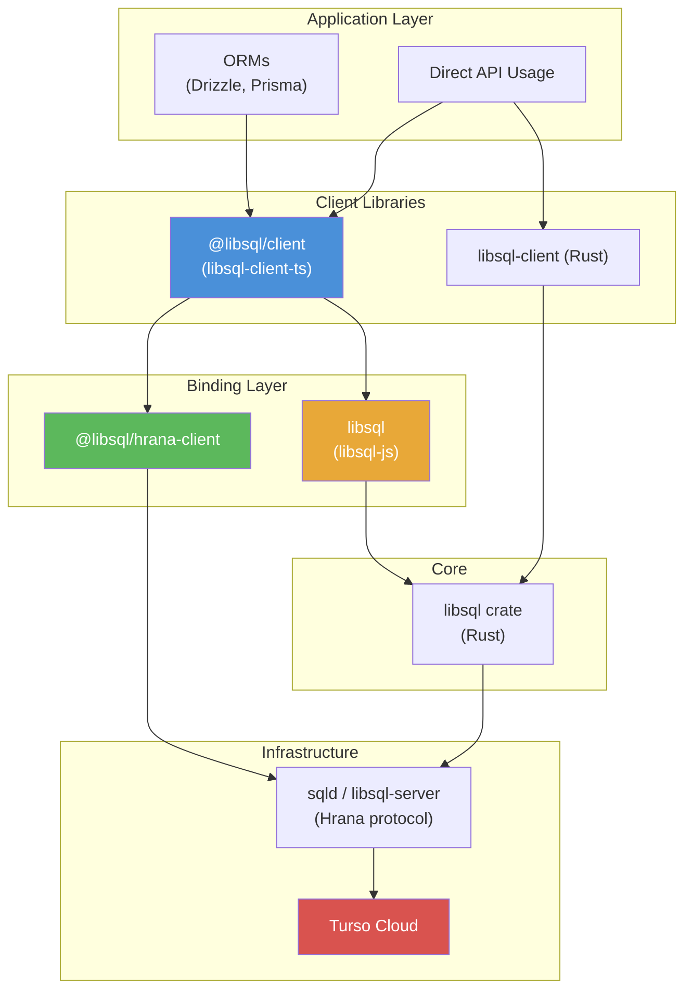

# libSQL TypeScript Client & JavaScript Bindings Exploration

## Overview

This document explores two related but distinct projects in the Turso/libSQL JavaScript ecosystem:

1. **`libsql-client-ts`** (`@libsql/client`) - A high-level TypeScript client library providing a unified async API for connecting to libSQL databases via HTTP, WebSockets, or local file access. It is the primary SDK for TypeScript/JavaScript developers using Turso.

2. **`libsql-js`** (`libsql`) - A low-level N-API native binding that wraps the Rust `libsql` crate, exposing a `better-sqlite3`-compatible synchronous API (with an async variant). It serves as the local database engine used by `libsql-client-ts` when operating in `file:` mode.

These two projects form a layered architecture: `libsql-client-ts` depends on `libsql-js` for local/embedded replica operations, while using `@libsql/hrana-client` for remote HTTP/WebSocket operations.

## Relationship Between the Two Projects



---

## Part 1: libsql-client-ts (`@libsql/client`)

### Project Structure

The repository is a monorepo with three packages:

```
libsql-client-ts/
  packages/
    libsql-core/         # Shared types, config parsing, URI parsing, utilities
      src/
        api.ts           # Core interfaces: Client, Transaction, ResultSet, Row, Value
        config.ts        # Config expansion and URL scheme resolution
        uri.ts           # Custom RFC 3986 URI parser
        util.ts          # ResultSetImpl, transactionModeToBegin, JSON serialization
    libsql-client/       # Main client package (@libsql/client)
      src/
        node.ts          # Node.js entry point - dispatches to sqlite3/http/ws
        web.ts           # Web/Workers entry point - dispatches to http/ws only
        http.ts          # HTTP client using @libsql/hrana-client
        ws.ts            # WebSocket client using @libsql/hrana-client
        sqlite3.ts       # Local SQLite client using libsql (libsql-js)
        hrana.ts         # Shared Hrana protocol helpers
        sql_cache.ts     # LRU cache for server-side SQL text storage
    libsql-client-wasm/  # Wasm-based local client for browsers
      src/
        wasm.ts          # Uses @libsql/libsql-wasm-experimental
  examples/              # Usage examples for each mode
  testing/
    hrana-test-server/   # Python-based test server for Hrana protocol
```

### Package Details

| Package | npm Name | Version | Purpose |
|---------|----------|---------|---------|
| libsql-core | `@libsql/core` | 0.16.0 | Shared types and configuration |
| libsql-client | `@libsql/client` | 0.16.0 | Main client library |
| libsql-client-wasm | `@libsql/client-wasm` | - | Wasm variant for browsers |

### Core API (`@libsql/core`)

#### Config Interface

The `Config` interface is the entry point for creating a client:

```typescript
interface Config {
    url: string;                    // Required: libsql:, http:, https:, ws:, wss:, file:
    authToken?: string;             // JWT for remote authentication
    encryptionKey?: string;         // Local encryption at rest
    remoteEncryptionKey?: string;   // Turso Cloud encryption
    syncUrl?: string;               // Remote URL for embedded replicas
    syncInterval?: number;          // Auto-sync interval in seconds
    readYourWrites?: boolean;       // Read-your-writes consistency
    offline?: boolean;              // Enable offline writes
    tls?: boolean;                  // TLS toggle for libsql: URLs
    intMode?: IntMode;              // "number" | "bigint" | "string"
    fetch?: Function;               // Custom fetch implementation
    concurrency?: number;           // Max concurrent requests (default: 20)
}
```

#### Client Interface

```typescript
interface Client {
    execute(stmt: InStatement): Promise<ResultSet>;
    execute(sql: string, args?: InArgs): Promise<ResultSet>;
    batch(stmts: Array<InStatement>, mode?: TransactionMode): Promise<Array<ResultSet>>;
    migrate(stmts: Array<InStatement>): Promise<Array<ResultSet>>;
    transaction(mode?: TransactionMode): Promise<Transaction>;
    executeMultiple(sql: string): Promise<void>;
    sync(): Promise<Replicated>;
    close(): void;
    reconnect(): void;
    closed: boolean;
    protocol: string;   // "http" | "ws" | "file"
}
```

#### Value Type System

```
SQLite type    ->  JavaScript type
-----------        ---------------
NULL           ->  null
TEXT           ->  string
REAL           ->  number
INTEGER        ->  number | bigint | string  (controlled by intMode)
BLOB           ->  ArrayBuffer

Input types (InValue) also accept:
  boolean  ->  converted to 0/1 (or 0n/1n or "0"/"1" per intMode)
  Uint8Array -> converted to Buffer/ArrayBuffer
  Date     ->  converted to numeric timestamp via .valueOf()
```

#### Transaction Modes

- **`"write"`** - `BEGIN IMMEDIATE` - read-write, queues behind other writes
- **`"read"`** - `BEGIN TRANSACTION READONLY` - read-only, no blocking (libSQL extension)
- **`"deferred"`** - `BEGIN DEFERRED` - starts as read, upgrades on first write (may fail)

### Client Creation & Routing

The `createClient()` function in `node.ts` expands the config and routes based on URL scheme:



The `web.ts` entry point (for Workers/Deno/browser) only supports HTTP and WebSocket -- no `file:` scheme.

### Platform Support via Conditional Exports

The `package.json` exports field uses conditional exports to serve different entry points:

| Condition | Entry Point | Supports |
|-----------|-------------|----------|
| `node` | `node.ts` | file:, http:, https:, ws:, wss: |
| `workerd` (CF Workers) | `web.ts` | http:, https:, ws:, wss: |
| `deno` | `node.ts` | file:, http:, https:, ws:, wss: |
| `edge-light` | `web.ts` | http:, https: |
| `netlify` | `web.ts` | http:, https: |
| `browser` | `web.ts` | http:, https:, ws:, wss: |

Direct imports are also available: `@libsql/client/http`, `@libsql/client/ws`, `@libsql/client/sqlite3`, `@libsql/client/web`.

### HTTP Client (`http.ts`)

The HTTP client wraps `@libsql/hrana-client` in HTTP mode. Key characteristics:

- **Stateless**: Each operation opens a stream, executes, and closes in a single HTTP request via pipelining
- **Concurrency control**: Uses `promise-limit` to cap concurrent requests (default: 20)
- **No sync support**: `sync()` throws `SYNC_NOT_SUPPORTED`
- **Reconnectable**: `reconnect()` closes and recreates the underlying hrana client

The execute flow pipelines operations so that opening a stream, running a query, and closing the stream happen in a single HTTP roundtrip.

### WebSocket Client (`ws.ts`)

The WebSocket client maintains persistent connections with connection pooling:

- **Connection recycling**: Connections older than 60 seconds are replaced
- **Seamless reconnection**: New connections are opened in the background; the old connection continues serving until the new one is ready
- **SQL caching**: Capacity of 100 SQL texts cached server-side (requires Hrana v2+)
- **Stream management**: Tracks active streams per connection; old connections are closed only when all their streams finish
- **Version-aware batching**: Uses `isAutocommit` conditions for Hrana v3+ to safely detect transaction state

### SQLite3 Local Client (`sqlite3.ts`)

The local client uses `libsql` (libsql-js) directly:

- **Synchronous execution**: All database operations are synchronous under the hood, wrapped in `async` for API compatibility
- **Embedded replica support**: Passes `syncUrl`, `syncPeriod`, `readYourWrites`, `offline` options to the libsql `Database` constructor
- **Connection management**: Lazily creates new `Database` instances when needed (e.g., after a transaction takes ownership)
- **Direct sync()**: Calls `db.sync()` on the underlying libsql database and returns frame counts
- **Encryption**: Supports `encryptionKey` and `remoteEncryptionKey`

### Hrana Protocol Layer (`hrana.ts`)

The Hrana (HTTP Range API) protocol is the wire protocol for communicating with libSQL/Turso servers. The `hrana.ts` module provides shared helpers:

#### HranaTransaction

An abstract base class for HTTP and WebSocket transactions:

- **Lazy BEGIN**: The `BEGIN` statement is batched with the first actual statement, saving a roundtrip
- **Batch conditions**: Uses `BatchCond.ok()` to chain statements and `BatchCond.isAutocommit()` (Hrana v3+) to detect if the transaction was rolled back
- **Error mapping**: Converts `hrana.ClientError` subtypes to `LibsqlError` with appropriate codes

#### executeHranaBatch

Executes a non-interactive batch:
1. Optionally disables foreign keys (for migrations)
2. Sends BEGIN
3. Chains each statement with `BatchCond.ok(previousStep)`
4. Sends COMMIT (conditioned on all statements succeeding)
5. Sends ROLLBACK (conditioned on COMMIT failing)
6. Optionally re-enables foreign keys

#### Statement Conversion

`stmtToHrana()` converts `InStatement` (string or `{sql, args}`) to `hrana.Stmt`, supporting both positional (`bindIndexes`) and named (`bindName`) parameters.

### SQL Cache (`sql_cache.ts`)

An LRU cache that stores SQL text references on the server to avoid resending large SQL strings:

- Server-side storage via `hrana.SqlOwner.storeSql()`
- LRU eviction with protection against evicting SQL objects in the current batch
- Max SQL text size: 5000 characters (server limitation)
- Capacity: 30 for HTTP (per-request), 100 for WebSocket (per-connection)

### Batch Operations

Two types of batch execution exist:

1. **Non-interactive batch** (`client.batch()`): All statements are sent at once. Uses `executeHranaBatch` which wraps them in BEGIN/COMMIT/ROLLBACK with conditional execution.

2. **Interactive transaction** (`client.transaction()`): Returns a `Transaction` object. Statements are sent one at a time (or in sub-batches). The BEGIN is lazily sent with the first statement.

The `migrate()` method is a special batch that wraps statements with `PRAGMA foreign_keys=off/on`.

### Error Handling



### Wasm Client (`libsql-client-wasm`)

A browser-compatible local client using `@libsql/libsql-wasm-experimental`:

- Uses `sqlite3.oo1.DB` (SQLite compiled to Wasm)
- Only supports `file:` URLs (in-browser virtual filesystem)
- No encryption, no sync, no embedded replicas
- Statement execution via manual `prepare()` / `bind()` / `step()` cycle

---

## Part 2: libsql-js (`libsql`)

### Project Overview

libsql-js is a native Node.js addon built with Rust and N-API (via `napi-rs`). It provides a `better-sqlite3`-compatible API that wraps the `libsql` Rust crate.

**Version**: 0.6.0-pre.26
**Crate type**: `cdylib` (shared library loaded by Node.js)

### Architecture



### Dual API Design

The package exposes two entry points:

| Export | File | API Style | Usage |
|--------|------|-----------|-------|
| `libsql` (default) | `compat.js` | **Synchronous** (better-sqlite3 compatible) | `const Database = require('libsql')` |
| `libsql/promise` | `promise.js` | **Asynchronous** (Promise-based) | `const { Database } = require('libsql/promise')` |

#### Synchronous API (`compat.js`)

Uses `*Sync` functions exported from the N-API layer that block the event loop via `runtime.block_on()`:

```javascript
// Sync API - blocks event loop
const db = new Database("test.db");
const stmt = db.prepare("SELECT * FROM users WHERE id = ?");
const row = stmt.get(1);
const rows = stmt.all();
for (const row of stmt.iterate()) { /* ... */ }
stmt.run({ name: "Alice" });
```

Key sync bridge functions in Rust:
- `databasePrepareSync(db, sql)` -> calls `rt.block_on(db.prepare(sql))`
- `databaseSyncSync(db)` -> calls `rt.block_on(db.sync())`
- `databaseExecSync(db, sql)` -> calls `rt.block_on(db.exec(sql))`
- `statementRunSync(stmt, params)` -> calls `rt.block_on(stmt.run(params))`
- `statementGetSync(stmt, params)` -> calls `rt.block_on(stmt.get(params))`
- `statementIterateSync(stmt, params)` -> blocking iterator via `iteratorNextSync`

#### Asynchronous API (`promise.js`)

Uses the native async N-API functions that return Promises via `env.execute_tokio_future()`:

```javascript
// Async API - non-blocking
const { Database, connect } = require('libsql/promise');
const db = await connect("test.db");
const stmt = await db.prepare("SELECT * FROM users WHERE id = ?");
const row = await stmt.get(1);
const rows = await stmt.all();
for await (const row of await stmt.iterate()) { /* ... */ }
await stmt.run({ name: "Alice" });
```

### Rust Core (`src/lib.rs`)

#### Database Struct

```rust
struct Database {
    db: libsql::Database,                // The libSQL database instance
    conn: Option<Arc<libsql::Connection>>, // Active connection (None when closed)
    default_safe_integers: AtomicBool,   // BigInt mode toggle
    memory: bool,                        // In-memory flag
}
```

#### Connection Modes

The `connect()` function in Rust determines the connection type:



Remote path detection: checks if path starts with `libsql://`, `http://`, or `https://`.

#### Statement Struct

```rust
struct Statement {
    conn: Arc<libsql::Connection>,    // Shared connection reference
    stmt: Arc<libsql::Statement>,     // Prepared statement
    column_names: Vec<CString>,       // Pre-computed column names
    mode: AccessMode,                 // Result format configuration
}
```

#### AccessMode (better-sqlite3 Compatibility)

```rust
struct AccessMode {
    raw: AtomicBool,        // Return arrays instead of objects
    pluck: AtomicBool,      // Return only the first column value
    safe_ints: AtomicBool,  // Return BigInt for integers
    timing: AtomicBool,     // Include query duration in results
}
```

These flags mirror `better-sqlite3`'s chainable API:
```javascript
stmt.raw(true).pluck(true).safeIntegers(true).timing(true);
```

### Error Handling

Errors from Rust are serialized as JSON and deserialized in JavaScript:

```rust
// Rust side
let err_json = serde_json::json!({
    "message": "some error",
    "libsqlError": true,
    "code": "SQLITE_CONSTRAINT",
    "rawCode": 19
});
napi::Error::from_reason(err_json.to_string())
```

```javascript
// JavaScript side (convertError)
const data = JSON.parse(err.message);
if (data.libsqlError) {
    return new SqliteError(data.message, data.code, data.rawCode);
}
```

The `SqliteError` class extends `Error` with `code` and `rawCode` properties, matching `better-sqlite3`'s error format.

### SQLite Error Code Mapping

The Rust layer maps all SQLite error codes (including extended codes) to string names:

```
SQLITE_OK, SQLITE_ERROR, SQLITE_INTERNAL, SQLITE_PERM, SQLITE_ABORT,
SQLITE_BUSY, SQLITE_LOCKED, SQLITE_NOMEM, SQLITE_READONLY, SQLITE_INTERRUPT,
SQLITE_IOERR, SQLITE_CORRUPT, SQLITE_CONSTRAINT, SQLITE_MISUSE, SQLITE_AUTH,
... plus ~40 extended error codes (SQLITE_IOERR_READ, SQLITE_CONSTRAINT_UNIQUE, etc.)
```

### Authorization System

The `auth.rs` module implements a table-level authorizer:

```javascript
const { Authorization } = require('libsql');
db.authorizer({
    "users": Authorization.ALLOW,     // 0
    "secrets": Authorization.DENY,    // 1
});
```

The authorizer is an allow/deny list that covers all SQLite auth actions (CREATE, READ, INSERT, UPDATE, DELETE, etc.) at the table granularity. Unrecognized tables default to DENY.

### Platform Support (Native Binaries)

Pre-built binaries via the `npm/` directory:

| Platform | Architecture | Package |
|----------|-------------|---------|
| macOS | arm64 | `libsql-darwin-arm64` |
| macOS | x64 | `libsql-darwin-x64` |
| Linux | x64 (glibc) | `libsql-linux-x64-gnu` |
| Linux | x64 (musl) | `libsql-linux-x64-musl` |
| Linux | arm64 (glibc) | `libsql-linux-arm64-gnu` |
| Linux | arm64 (musl) | `libsql-linux-arm64-musl` |
| Windows | x64 | `libsql-win32-x64-msvc` |

The `index.js` loader detects the platform, checks for a local `.node` file first, then falls back to the platform-specific npm package.

### Transaction API

The `compat.js` (sync) transaction API wraps a function:

```javascript
const transfer = db.transaction((from, to, amount) => {
    db.prepare("UPDATE accounts SET balance = balance - ? WHERE id = ?").run(amount, from);
    db.prepare("UPDATE accounts SET balance = balance + ? WHERE id = ?").run(amount, to);
});

transfer(1, 2, 100);                    // Uses BEGIN (default)
transfer.immediate(1, 2, 100);          // Uses BEGIN IMMEDIATE
transfer.deferred(1, 2, 100);           // Uses BEGIN DEFERRED
transfer.exclusive(1, 2, 100);          // Uses BEGIN EXCLUSIVE
```

The `promise.js` (async) variant is identical but all operations are async.

### Tokio Runtime

The Rust layer uses a global singleton Tokio runtime:

```rust
static RUNTIME: OnceCell<Runtime> = OnceCell::new();

fn runtime() -> Result<&'static Runtime> {
    RUNTIME.get_or_try_init(|| {
        Runtime::new().map_err(|e| napi::Error::from_reason(e.to_string()))
    })
}
```

Synchronous functions block on this runtime via `rt.block_on()`, while async functions use `env.execute_tokio_future()` to schedule work on the Tokio runtime without blocking.

---

## Comparison: libsql-client-ts vs libsql-js



| Feature | libsql-client-ts | libsql-js |
|---------|-----------------|-----------|
| **npm package** | `@libsql/client` | `libsql` |
| **API style** | Async only | Sync (default) + Async |
| **Remote access** | HTTP, WebSocket (Hrana) | Remote via libsql crate |
| **Local access** | Via libsql-js dependency | Direct native binding |
| **Embedded replicas** | Via sqlite3.ts -> libsql-js | Via `syncUrl` option |
| **Encryption** | Passes through to libsql-js | Native libsql support |
| **SQL caching** | LRU on server (Hrana) | N/A (local) |
| **Concurrency** | promise-limit (default 20) | Single connection |
| **better-sqlite3 compat** | No | Yes (drop-in) |
| **Wasm support** | Yes (separate package) | No (native only) |
| **Platform targets** | Cross-platform via transports | Platform-specific binaries |
| **Transaction model** | Interactive + batch | Function wrapper |
| **Authorizer** | No | Yes (table-level) |
| **Extensions** | No | `loadExtension()` |

## Turso Ecosystem Integration



## Key Dependencies

### libsql-client-ts

| Dependency | Purpose |
|-----------|---------|
| `@libsql/core` | Shared types, config, URI parsing |
| `@libsql/hrana-client` | Hrana protocol implementation (HTTP + WS) |
| `libsql` (libsql-js) | Local SQLite access for `file:` mode |
| `js-base64` | Base64 encoding for blob values in JSON |
| `promise-limit` | Concurrency control for HTTP/WS clients |

### libsql-js

| Dependency | Purpose |
|-----------|---------|
| `libsql` (Rust crate) v0.9.27 | Core database engine with encryption support |
| `napi` / `napi-derive` | N-API binding generation |
| `tokio` | Async runtime (multi-threaded) |
| `once_cell` | Singleton runtime initialization |
| `serde_json` | Error serialization between Rust and JS |
| `tracing` / `tracing-subscriber` | Logging infrastructure |

## Notable Design Decisions

1. **Custom URI parser**: libsql-client-ts implements its own RFC 3986 parser rather than using the built-in `URL` class, because it needs to support relative `file:` URLs like `file:relative/path.db`.

2. **Lazy BEGIN in transactions**: Interactive transactions defer the `BEGIN` statement until the first actual operation, batching it with the first statement to save a network roundtrip.

3. **JSON-encoded errors across FFI**: libsql-js serializes Rust errors as JSON strings and parses them back in JavaScript, because N-API's error type only supports a string reason field.

4. **Dual sync/async in libsql-js**: The sync API blocks the Tokio runtime via `block_on()`, which is necessary for `better-sqlite3` API compatibility but means the event loop is blocked during database operations. The async API avoids this by using `execute_tokio_future`.

5. **Connection ownership in transactions**: When `Sqlite3Client.transaction()` is called, it sets `this.#db = null`, forcing the client to lazily create a new connection for subsequent operations. The transaction takes exclusive ownership of the original connection.

6. **SQL cache with LRU eviction**: The WebSocket client caches up to 100 SQL texts on the server. The eviction strategy protects SQL objects that are in use in the current batch from being evicted, even if they are the least recently used.
