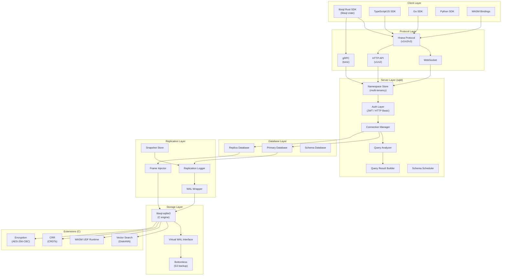
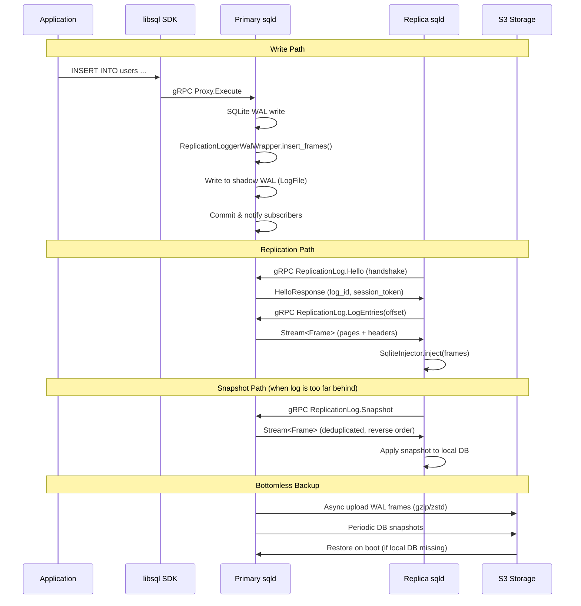
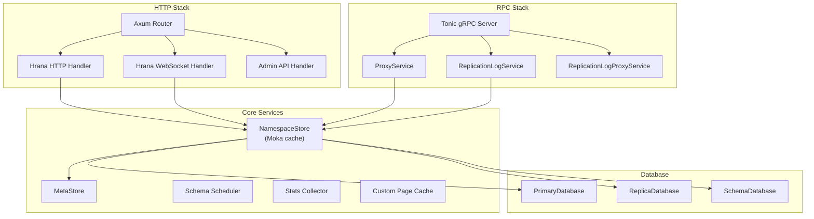
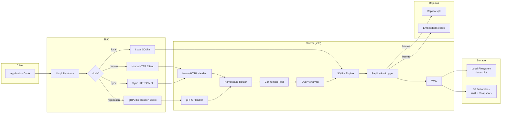

# libSQL - Turso's Fork of SQLite

## Overview

libSQL is an open-source, open-contribution fork of SQLite created and maintained by Turso. It extends SQLite with features that the upstream project cannot accept due to its closed-contribution model: embedded replicas, a server mode (sqld), vector search, WebAssembly UDFs, encryption, and more. The project maintains full backward compatibility with the SQLite file format and C API while adding a Rust-native SDK and network-accessible database server.

**Version:** 0.9.29 (workspace), sqld v0.24.33
**License:** MIT

## Architecture Overview



## Workspace Crates

The Cargo workspace contains 13 crates (plus 3 excluded):

| Crate | Path | Purpose |
|-------|------|---------|
| `libsql` | `libsql/` | Main Rust SDK - batteries-included client library |
| `libsql-server` | `libsql-server/` | sqld server binary (the "SQL daemon") |
| `libsql-sys` | `libsql-sys/` | Low-level FFI bindings and virtual WAL trait |
| `libsql-ffi` | `libsql-ffi/` | Raw C FFI bindings to libsql-sqlite3 |
| `libsql_replication` | `libsql-replication/` | Replication protocol, frames, injector |
| `libsql-hrana` | `libsql-hrana/` | Hrana protocol types (shared protobuf/JSON) |
| `bottomless` | `bottomless/` | S3-compatible backup WAL implementation |
| `bottomless-cli` | `bottomless-cli/` | CLI tool for managing bottomless snapshots |
| `libsql-rusqlite` (vendored) | `vendored/rusqlite/` | Vendored fork of rusqlite with libsql extensions |
| `libsql-sqlite3-parser` (vendored) | `vendored/sqlite3-parser/` | Vendored SQL parser |
| `libsql-wasm` | `bindings/wasm/` | WASM bindings via wasm-bindgen |
| `libsql-c` | `bindings/c/` | C bindings via cbindgen |
| `xtask` | `xtask/` | Build automation tasks |

**Excluded:** `libsql-shell`, `tools/fuzz`, `tools/rebuild-log`, `libsql-sqlite3/ext/crr`, `libsql-sqlite3/ext/libsql-wasi`

## Directory Structure

```
libsql/
  bindings/
    c/                    # C language bindings (cbindgen)
    wasm/                 # WASM bindings (wasm-bindgen)
  bottomless/             # S3-backed virtual WAL for durable storage
  bottomless-cli/         # CLI for managing bottomless generations/snapshots
  docs/                   # Protocol specs, design docs, admin API
  libsql/                 # Main Rust SDK crate
    src/
      database/           # Builder pattern for database construction
      hrana/              # Hrana HTTP client implementation
      local/              # Local (embedded) database operations
      replication/        # Embedded replica client & replicator
      sync/               # Sync protocol (push/pull frames over HTTP)
      wasm/               # WASM-compatible remote-only client
  libsql-ffi/             # Raw FFI to libsql-sqlite3 C code
    bundled/
      SQLite3MultipleCiphers/  # Encryption support (AES, ChaCha20, etc.)
      sqlean/             # SQLean extension bundles (uuid, crypto, math...)
      src/                # Bundled libsql-sqlite3 amalgamation
  libsql-hrana/           # Hrana protocol shared types
  libsql-replication/     # Core replication protocol
    proto/                # Protobuf definitions for replication RPC
    src/
      frame.rs            # Frame type (4KB page + header)
      injector/           # Applies frames to a local SQLite database
      replicator.rs       # ReplicatorClient trait and Replicator state machine
      snapshot.rs         # Snapshot file format
      rpc.rs              # Generated gRPC service traits
  libsql-server/          # sqld - the database server
    src/
      auth/               # JWT and HTTP Basic authentication
      connection/         # Connection management, write proxying
      database/           # Primary/Replica/Schema database types
      hrana/              # Hrana WS and HTTP server implementation
      http/               # Admin and user HTTP APIs
      namespace/          # Multi-tenancy namespace isolation
      replication/        # Primary replication logger, snapshot management
      rpc/                # gRPC services (proxy, replication log)
      schema/             # Multi-database schema migrations
  libsql-shell/           # Interactive SQL shell
  libsql-sqlite3/         # The forked SQLite C engine
    ext/
      crr/                # CRDT-based conflict resolution (cr-sqlite)
      vwal/               # Virtual WAL C interface
      udf/                # WASM UDF bindings (wasmtime/wasmedge)
      wasm/               # WASM runtime integration
    src/
      vector.c            # Vector type system
      vectorIndex.c       # Vector index management
      vectordiskann.c     # DiskANN index implementation
      vectorfloat*.c      # Vector type implementations (f32, f64, f16, f8, 1bit)
  libsql-sys/             # Rust-safe WAL abstractions over FFI
    src/
      wal/                # Virtual WAL trait system
        mod.rs            # WalManager + Wal traits
        ffi.rs            # FFI bridge for WAL
        wrapper.rs        # WrapWal composability
        sqlite3_wal.rs    # Default SQLite WAL implementation
  vendored/
    rusqlite/             # Forked rusqlite with libsql-experimental features
    sqlite3-parser/       # SQL parser for query analysis
```

## Core Subsystems

### 1. libsql-sqlite3: The Modified SQLite Engine

The heart of libSQL is a fork of SQLite 3.43.0 written in C. Key modifications:

**ALTER TABLE ALTER COLUMN:** Unlike upstream SQLite, libSQL allows altering column types, constraints, CHECK expressions, DEFAULT values, and foreign keys in-place:

```sql
ALTER TABLE t ALTER COLUMN v TO v NOT NULL CHECK(v < 42);
ALTER TABLE emails ALTER COLUMN user_id TO user_id INT REFERENCES users(id);
```

**RANDOM ROWID:** Tables can be created with `RANDOM ROWID` to generate pseudorandom rowid values instead of sequential ones:

```sql
CREATE TABLE items(name TEXT) RANDOM ROWID;
```

**Virtual WAL Interface (`ext/vwal`):** A pluggable WAL layer allowing alternative WAL implementations to be injected at the C level. This is the foundation for the replication logger and bottomless storage.

**Vector Search:** Native vector similarity search using a DiskANN-based index, implemented entirely in C within the SQLite engine. Supports multiple vector types:
- `VECTOR_TYPE_FLOAT32` (f32) - default, 4 bytes per dimension
- `VECTOR_TYPE_FLOAT64` (f64) - 8 bytes per dimension
- `VECTOR_TYPE_FLOAT16` (f16) - 2 bytes per dimension
- `VECTOR_TYPE_FLOAT8` (f8) - quantized, 1 byte per dimension
- `VECTOR_TYPE_FLOAT1BIT` (1-bit) - binary vectors
- `VECTOR_TYPE_FLOATB16` (bfloat16)

Max vector dimensions: 65,536. The DiskANN index stores nodes in shadow tables using a graph-based structure with configurable pruning alpha, insert/search L parameters.

**WebAssembly UDFs:** User-defined functions written in WebAssembly, registered via SQL:

```sql
CREATE FUNCTION fib LANGUAGE wasm AS '(module ...)';
```

Supports Wasmtime (static/dynamic linking) and WasmEdge backends. Functions are stored in `libsql_wasm_func_table(name TEXT, body TEXT)`.

**CRR (Conflict-free Replicated Relations):** An extension (`ext/crr`) implementing CRDTs for multi-writer conflict resolution, built in Rust.

### 2. libsql-sys: The Virtual WAL Trait System

`libsql-sys` provides the critical Rust abstraction over SQLite's WAL mechanism. It defines two core traits:

**`WalManager`** - Factory for WAL instances:
```rust
pub trait WalManager {
    type Wal: Wal;
    fn use_shared_memory(&self) -> bool;
    fn open(&self, vfs: &mut Vfs, file: &mut Sqlite3File, ...) -> Result<Self::Wal>;
    fn close(&self, wal: &mut Self::Wal, db: &mut Sqlite3Db, ...) -> Result<()>;
    fn destroy_log(&self, vfs: &mut Vfs, db_path: &CStr) -> Result<()>;
    fn wrap<U>(self, wrapper: U) -> WalWrapper<U, Self> where U: WrapWal<Self::Wal>;
}
```

**`Wal`** - Per-connection WAL operations:
```rust
pub trait Wal {
    fn begin_read_txn(&mut self) -> Result<bool>;
    fn end_read_txn(&mut self);
    fn find_frame(&mut self, page_no: NonZeroU32) -> Result<Option<NonZeroU32>>;
    fn read_frame(&mut self, frame_no: NonZeroU32, buffer: &mut [u8]) -> Result<()>;
    fn begin_write_txn(&mut self) -> Result<()>;
    fn insert_frames(&mut self, ...) -> Result<usize>;
    fn checkpoint(&mut self, db: &mut Sqlite3Db, mode: CheckpointMode, ...) -> Result<()>;
}
```

The `WrapWal` trait enables composable WAL wrappers - this is how the replication logger intercepts writes without modifying the core WAL:

```rust
WalManager::wrap(replication_logger_wrapper)
    // Wraps the default Sqlite3WalManager
    // Intercepts insert_frames() to capture pages for replication
```

Features:
- `wal` - enables the virtual WAL trait system
- `encryption` - AES-256-CBC via SQLite3MultipleCiphers
- `wasmtime-bindings` - WASM UDF support
- `sqlean-extensions` - bundled SQL extensions (uuid, crypto, fuzzy, math, stats, text, regexp)

### 3. libsql-replication: The Replication Protocol

This crate defines the frame-based replication protocol.

**Frame Format:**

```
FrameHeader (24 bytes):
  frame_no:   u64 (LE) - monotonically increasing frame number
  checksum:   u64 (LE) - rolling CRC-64 checksum
  page_no:    u32 (LE) - SQLite page number
  size_after:  u32 (LE) - DB size in pages after commit (0 = not a commit boundary)

FrameBorrowed (4120 bytes):
  header:  FrameHeader (24 bytes)
  page:    [u8; 4096]  - the actual page data
```

Frames are the atomic unit of replication. A transaction is a sequence of frames where the last frame has `size_after != 0` (the commit marker). The rolling checksum provides integrity verification across the entire log.

**Frame Encryption:**

When encryption is enabled, frames are encrypted with AES-256-CBC before transmission:

```rust
pub struct FrameEncryptor {
    enc: cbc::Encryptor<aes::Aes256>,
    dec: cbc::Decryptor<aes::Aes256>,
}
```

Key derivation uses the user-provided encryption key to generate a 256-bit AES key and a fixed IV (seeded with constant 911). NoPadding mode is used since frames are always 4096 bytes (aligned to AES block size).

**ReplicatorClient Trait:**

```rust
#[async_trait]
pub trait ReplicatorClient {
    type FrameStream: Stream<Item = Result<RpcFrame, Error>> + Unpin + Send;
    async fn handshake(&mut self) -> Result<(), Error>;
    async fn next_frames(&mut self) -> Result<Self::FrameStream, Error>;
    async fn snapshot(&mut self) -> Result<Self::FrameStream, Error>;
    async fn commit_frame_no(&mut self, frame_no: FrameNo) -> Result<(), Error>;
    fn committed_frame_no(&self) -> Option<FrameNo>;
    fn rollback(&mut self);
}
```

**gRPC Services (proto/):**

Three protobuf definitions power the RPC layer:

1. `replication_log.proto` - `ReplicationLog` service:
   - `Hello` - handshake with version negotiation
   - `LogEntries` - streaming frame subscription
   - `BatchLogEntries` - batch frame fetch
   - `Snapshot` - full database snapshot stream

2. `proxy.proto` - `Proxy` service for write forwarding:
   - `Execute` - execute a program (sequence of SQL steps)
   - `Describe` - describe a statement

3. `metadata.proto` - metadata exchange

**Injector:** The `SqliteInjector` applies received frames to a local SQLite database by directly writing pages through the WAL interface.

### 4. Replication Flow



### 5. The Replication Logger (Primary Side)

Located in `libsql-server/src/replication/primary/logger.rs`, the `ReplicationLogger` maintains a shadow WAL file alongside SQLite's native WAL.

**LogFile Structure:**

```
LogFileHeader:
  version:        [u16; 4] - format version
  start_frame_no: u64      - first frame number in this log
  frame_count:    u64      - number of committed frames
  page_size:      u32      - always 4096
  magic:          u64      - "SQLDWAL\0"
  db_id:          u128     - unique database identifier
  start_checksum: u64      - checksum before first frame
  log_id:         u128     - log instance identifier

[Frame 0] [Frame 1] ... [Frame N]
```

**Write Interception:**

The `ReplicationLoggerWalWrapper` implements `WrapWal` and intercepts `insert_frames`:

1. Pages are buffered in memory
2. On flush, pages are written to the shadow WAL file (appended after `header.frame_count + uncommitted_frame_count`)
3. On commit, the header's `frame_count` is atomically updated and subscribers are notified via `watch::Sender`
4. On rollback, `uncommitted_frame_count` resets to 0

**Log Compaction:**

When the log exceeds `max_log_frame_count` or `max_log_duration`, a `LogCompactor` creates a snapshot (a deduplicated set of pages representing the full database state), then truncates the log.

### 6. sqld: The Database Server

`libsql-server` is the `sqld` binary - a network-accessible SQLite server.

**Server Configuration (CLI flags):**

| Flag | Default | Purpose |
|------|---------|---------|
| `--db-path` | `data.sqld` | Database storage directory |
| `--http-listen-addr` | `127.0.0.1:8080` | User HTTP API address |
| `--admin-listen-addr` | none | Admin API address |
| `--grpc-listen-addr` | none | Primary inter-node RPC |
| `--primary-grpc-url` | none | Replica: URL of primary |
| `--encryption-key` | none | Database encryption key |
| `--enable-namespaces` | false | Multi-tenancy mode |

**Service Architecture (Tower-based):**



**Database Types:**

The server supports three database modes, represented as an enum:

```rust
pub enum Database {
    Primary(PrimaryDatabase),   // Accepts reads + writes, runs replication logger
    Replica(ReplicaDatabase),   // Read-only locally, forwards writes via gRPC proxy
    Schema(SchemaDatabase),     // Primary with schema migration coordination
}
```

Each database type has a corresponding `Connection` type and `MakeConnection` factory.

**Connection Management:**

- `ConnectionManager` pools connections per namespace
- Write proxying: `ReplicaConnection` delegates writes to the primary via gRPC `Proxy.Execute`
- Throttling via `MakeThrottledConnection` with configurable `max_concurrent_requests`
- Transaction timeout: 5 seconds (100ms in tests)
- Programs: queries are compiled into `Program` objects (sequence of `Step`s with conditions)

### 7. Hrana Protocol

Hrana (Czech for "edge") is the HTTP/WebSocket protocol for client-server communication.

**Versions:**
- **Hrana 1:** JSON over WebSocket
- **Hrana 2:** JSON over WebSocket + HTTP
- **Hrana 3:** JSON or Protobuf over WebSocket + HTTP

**Encodings:**
| Subprotocol | Version | Encoding |
|-------------|---------|----------|
| `hrana1` | 1 | JSON |
| `hrana2` | 2 | JSON |
| `hrana3` | 3 | JSON |
| `hrana3-protobuf` | 3 | Protobuf |

**Concepts:**
- **Streams:** Map to SQLite connections. Multiple streams can be multiplexed over one WebSocket.
- **Batches:** Atomic execution of multiple SQL statements with conditional logic (execute step N only if step M succeeded/failed).
- **Cursors:** Server-side cursors for incremental result streaming.
- **SQL text storage:** Clients can store SQL text on the server and reference it by ID to reduce message sizes.
- **Batons:** Session continuity tokens for HTTP (since HTTP is stateless, batons route requests to the same server-side stream).

**Error Handling:**
The protocol distinguishes between recoverable errors (SQL errors, auth failures) and unrecoverable `ProtocolError`s (malformed messages, state violations) that terminate the connection.

### 8. Namespace System (Multi-Tenancy)

Located in `libsql-server/src/namespace/`, the namespace system provides database isolation within a single sqld instance.

```rust
pub struct Namespace {
    pub db: Database,
    name: NamespaceName,
    tasks: JoinSet<anyhow::Result<()>>,
    stats: Arc<Stats>,
    db_config_store: MetaStoreHandle,
    path: Arc<Path>,
}
```

**NamespaceStore:**

Uses a `moka::future::Cache` for LRU eviction of namespaces:

```rust
pub struct NamespaceStoreInner {
    store: Cache<NamespaceName, NamespaceEntry>,
    metadata: MetaStore,
    allow_lazy_creation: bool,
    schema_locks: SchemaLocksRegistry,
    broadcasters: BroadcasterRegistry,
    configurators: NamespaceConfigurators,
    db_kind: DatabaseKind,
}
```

- Namespaces are lazily loaded on first access
- When evicted from cache, namespaces are gracefully shut down (optional checkpoint)
- `MetaStore` persists namespace configuration in a separate SQLite database
- `NamespaceConfigurators` contain strategies for creating Primary, Replica, and Schema namespaces

**Admin API:**

```
POST   /v1/namespaces/:namespace/create     # Create namespace
DELETE /v1/namespaces/:namespace             # Delete namespace
POST   /v1/namespaces/:namespace/fork/:to    # Fork namespace
```

Each namespace can have its own:
- JWT authentication key
- Bottomless DB ID
- Database configuration

### 9. Bottomless Storage

The `bottomless` crate implements an S3-compatible backup layer that continuously replicates WAL frames to object storage.

**Replicator Architecture:**

```rust
pub struct Replicator {
    client: aws_sdk_s3::Client,
    next_frame_no: Arc<AtomicU32>,
    last_sent_frame_no: Arc<AtomicU32>,
    last_committed_frame_no: Receiver<Result<u32>>,
    generation: Arc<ArcSwapOption<Uuid>>,
    bucket: String,
    db_path: String,
    use_compression: CompressionKind,  // Gzip or Zstd
    encryption_config: Option<EncryptionConfig>,
}
```

**Generation Model:**

Each "generation" represents a continuous sequence of WAL frames from a single database lifecycle:
- A new generation starts when the database is opened fresh or after a restore
- Each generation is identified by a UUID v7 (time-ordered)
- Max 100 generations can participate in a restore (at least one must include a full snapshot)

**S3 Object Layout:**

```
{db_name}/
  {generation_uuid}/
    .meta                    # Generation metadata
    .snapshot.{compression}  # Full database snapshot
    {frame_no_start}-{frame_no_end}.{compression}  # WAL frame batches
```

**Restore Process:**

1. List all generations for the database
2. Build a stack of generations from newest to oldest (max depth 100)
3. Find the most recent generation with a snapshot
4. Restore snapshot, then apply WAL frames forward through each generation
5. Support point-in-time recovery by stopping at a specific timestamp

**Configuration (environment variables):**

| Variable | Purpose |
|----------|---------|
| `LIBSQL_BOTTOMLESS_ENDPOINT` | S3-compatible endpoint URL |
| `LIBSQL_BOTTOMLESS_BUCKET` | Bucket name |
| `AWS_ACCESS_KEY_ID` | S3 credentials |
| `AWS_SECRET_ACCESS_KEY` | S3 credentials |
| `AWS_DEFAULT_REGION` | S3 region |

### 10. Embedded Replicas (Client SDK)

The `libsql` crate (Rust SDK) supports four database modes:

```rust
enum DbType {
    Memory { db: local::Database },
    File { path, flags, encryption_config },
    Sync { db: local::Database, encryption_config },   // Embedded replica (gRPC)
    Offline { db, remote_writes, read_your_writes, ... }, // Sync protocol (HTTP)
    Remote { url, auth_token, connector, ... },         // Pure remote
}
```

**Builder Pattern:**

```rust
// Local in-memory
let db = Builder::new_local(":memory:").build().await?;

// Local file
let db = Builder::new_local("path/to/db").build().await?;

// Embedded replica (gRPC replication)
let db = Builder::new_local_replica("/tmp/replica.db").build().await?;

// Remote only (Hrana HTTP)
let db = Builder::new_remote("libsql://host".into(), "token".into()).build().await?;
```

**Sync Protocol (v1/v2):**

The `Offline` mode uses an HTTP-based sync protocol:

```rust
pub struct SyncContext {
    db_path: String,
    client: hyper::Client<ConnectorService, Body>,
    sync_url: String,
    auth_token: Option<HeaderValue>,
    durable_generation: u32,
    durable_frame_num: u32,
}
```

Operations:
- **Pull frames:** `GET /sync/{generation}/{start_frame}/{end_frame}` - fetches frame batches
- **Push frames:** `POST /sync/push` - sends local WAL frames to the server
- **Metadata:** Persisted locally to track sync state (generation, frame number, checksum)

**Read-your-writes guarantee:** After pushing frames, the SDK waits for the server to confirm the frame number before allowing local reads that depend on those writes.

**Feature Flags:**

| Feature | Purpose |
|---------|---------|
| `core` | Local SQLite engine (C code) |
| `replication` | gRPC-based embedded replica |
| `remote` | HTTP-only remote access |
| `sync` | HTTP-based push/pull sync |
| `hrana` | Hrana protocol client |
| `wasm` | WASM-compatible remote client |
| `cloudflare` | Cloudflare Workers support |
| `encryption` | AES-256-CBC encryption |
| `tls` | TLS via hyper-rustls |

### 11. Encryption

Encryption is implemented at multiple layers:

**Database Encryption (SQLite3MultipleCiphers):**

The `libsql-ffi` crate bundles SQLite3MultipleCiphers, providing transparent database encryption with multiple cipher options:
- AES-256-CBC (default)
- ChaCha20-Poly1305
- Ascon
- RC4 (SQLCipher compatible)
- wxAES128/wxAES256

Configuration:
```rust
pub struct EncryptionConfig {
    pub cipher: Cipher,
    pub encryption_key: String,
}
```

**Frame Encryption (Replication):**

WAL frames are encrypted before transmission between primary and replicas using AES-256-CBC. The `FrameEncryptor` in `libsql-replication` handles this:

```rust
impl FrameEncryptor {
    pub fn encrypt(&self, data: &mut [u8]) -> Result<()>;
    pub fn decrypt(&self, data: &mut [u8]) -> Result<()>;
}
```

Key derivation: `generate_aes256_key(encryption_key) -> [u8; 32]`
IV generation: `generate_initial_vector(seed=911) -> [u8; 16]`

### 12. Authentication

The `auth` module in `libsql-server` supports:

**JWT Authentication:**
- Ed25519 public key verification
- Multiple keys can be loaded from a single file
- Per-namespace JWT keys via the admin API

**HTTP Basic Auth:**
- Base64-encoded `username:password`
- Configured via `--http-auth "basic:$BASE64"`

**Permission Model:**
The `Authenticated` struct carries auth context through the request lifecycle, attached to `RequestContext` alongside the target namespace.

### 13. Schema System

The `schema` module provides coordinated schema migrations across related databases:

```
libsql-server/src/schema/
  scheduler.rs   # Migration job scheduling
  db.rs          # Schema database state
  migration.rs   # Migration execution
  status.rs      # Migration status tracking
  handle.rs      # Async handle for scheduler
  message.rs     # Inter-component messages
```

`SchemaDatabase` wraps a `PrimaryDatabase` with additional schema migration coordination, ensuring that DDL changes are applied consistently across all databases that share a schema.

### 14. Consistency Model

**Primary:** Strictly serializable. All operations are linearizable.

**Replicas:** Causal consistency per-process:
- A process always sees its own writes (read-your-writes)
- Reads are monotonic (once a value is witnessed, only equally or more recent values appear)
- No global ordering guarantees between distinct replica instances
- Two processes on the same replica may observe different points in time

**Transactions:** Serializable isolation (inherited from SQLite). Opening a transaction freezes the view at that point in time.

### 15. Observability & Metrics

The server collects extensive metrics via the `metrics` crate (v0.21), exported via Prometheus:

- `CONCURRENT_CONNECTIONS_COUNT` - active connections gauge
- `CONNECTION_ALIVE_DURATION` - connection lifetime histogram
- `CONNECTION_CREATE_TIME` - connection creation latency
- `TOTAL_RESPONSE_SIZE_HIST` - response size distribution
- `NAMESPACE_LOAD_LATENCY` - namespace loading time
- `REPLICATION_LATENCY_CACHE_SIZE` - configurable via `SQLD_REPLICATION_LATENCY_CACHE_SIZE`

Custom memory allocator: `mimalloc` for the server process, with `rheaper` for heap profiling support.

Custom page cache: `pager.rs` implements a custom `SQLITE_CONFIG_PCACHE2` with configurable `PAGER_CACHE_SIZE`.

### 16. WASM Support

Two forms of WASM support:

**1. WASM UDFs (Server-side):**
User-defined functions compiled to WebAssembly, executed inside the SQLite engine via Wasmtime or WasmEdge. Enabled with `--enable-wasm-runtime` at build time and the `wasm-udfs` feature flag.

**2. WASM Client Bindings (`bindings/wasm`):**
A `wasm-bindgen` crate that compiles the local SQLite engine to WebAssembly, enabling in-browser database usage. Only supports `core` features (no replication).

**3. SDK WASM Mode (`libsql/src/wasm/`):**
A `!Send` compatible module for running in WASM environments (Cloudflare Workers). Uses Hrana HTTP protocol only since there's no local SQLite in this mode.

### 17. Testing Infrastructure

The project uses multiple testing strategies:

- **Unit tests:** Standard Rust `#[test]` and `#[tokio::test]`
- **Integration tests:** Located in `libsql-server/tests/` covering:
  - `auth/` - authentication scenarios
  - `cluster/` - multi-node cluster tests
  - `embedded_replica/` - embedded replica scenarios
  - `hrana/` - Hrana protocol compliance
  - `namespaces/` - multi-tenancy tests
  - `standalone/` - single-node tests
- **Turmoil:** Network simulation testing via `turmoil = "0.6.0"` for testing replication under adverse network conditions
- **Fuzzing:** `tools/fuzz/` contains fuzz targets
- **Benchmarks:** `libsql/benches/` with criterion + pprof flamegraph support
- **Property testing:** proptest for invariant verification

### 18. Build & Deployment

**Build:**
```sh
cargo xtask build          # Build SQLite C library + tools
cargo build -p libsql-server  # Build sqld
```

**Docker:**
Three Dockerfiles:
- `Dockerfile` - production multi-stage build
- `Dockerfile.dev` - development build
- `Dockerfile.musl` - musl-based static binary

**cargo-dist:** Pre-configured in `dist-workspace.toml` for automated release builds with `lto = "thin"`.

**Rust toolchain:** Pinned via `rust-toolchain.toml`.

**Fly.io:** `fly.toml` present for Fly deployment.

### 19. Key Dependencies

| Dependency | Version | Purpose |
|------------|---------|---------|
| `tokio` | 1.38 | Async runtime |
| `tonic` | 0.11 | gRPC framework |
| `axum` | 0.6 | HTTP framework |
| `hyper` | 0.14 | HTTP client/server |
| `rusqlite` | vendored | SQLite Rust bindings |
| `moka` | 0.12 | Concurrent cache (namespace LRU) |
| `aws-sdk-s3` | 1.x | S3 client for bottomless |
| `zerocopy` | 0.7 | Zero-copy serialization for frames |
| `prost` | 0.12 | Protobuf serialization |
| `jsonwebtoken` | 9 | JWT auth |
| `aes`/`cbc` | 0.8/0.1 | Frame encryption |
| `mimalloc` | 0.1 | Memory allocator |
| `turmoil` | 0.6 | Network simulation testing |

### 20. Data Flow: Client to Storage



## Summary

libSQL is a substantial engineering effort that transforms SQLite from a purely embedded database into a distributed database system while maintaining full backward compatibility. The key architectural insight is the virtual WAL layer -- by intercepting writes at the WAL level, libSQL can capture every page mutation, replicate it across nodes, back it up to S3, and encrypt it, all without modifying the core SQLite B-tree and pager code. The namespace system enables multi-tenancy, the Hrana protocol provides edge-optimized access, and the vector search extension positions libSQL as a viable option for AI/ML workloads. The codebase is well-structured with clear separation between the C engine, Rust FFI layer, replication protocol, and server infrastructure.
