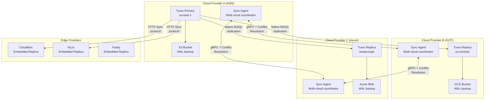
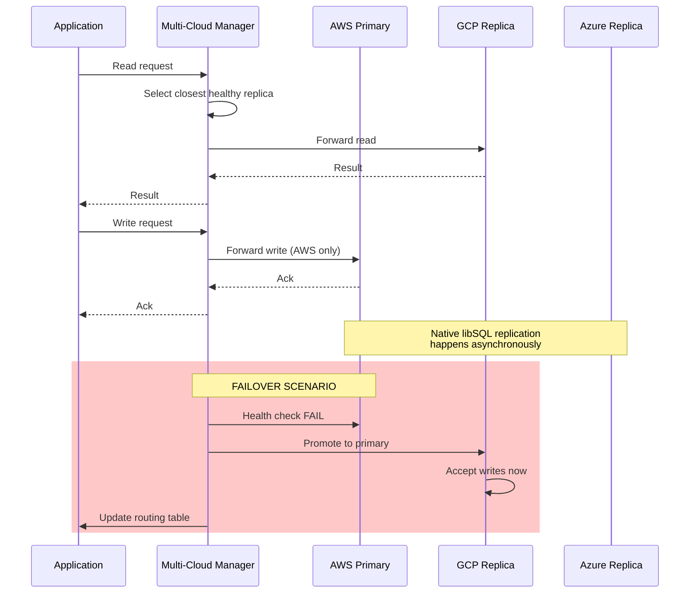
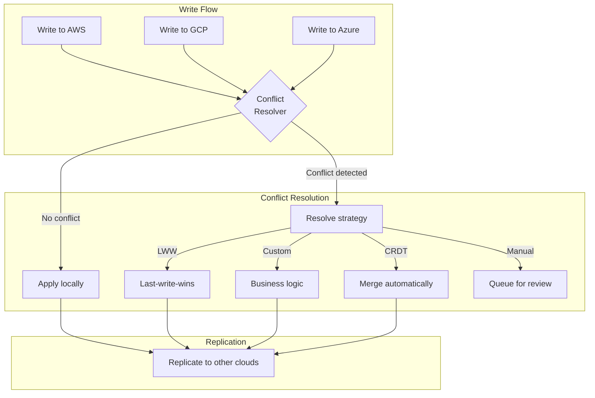
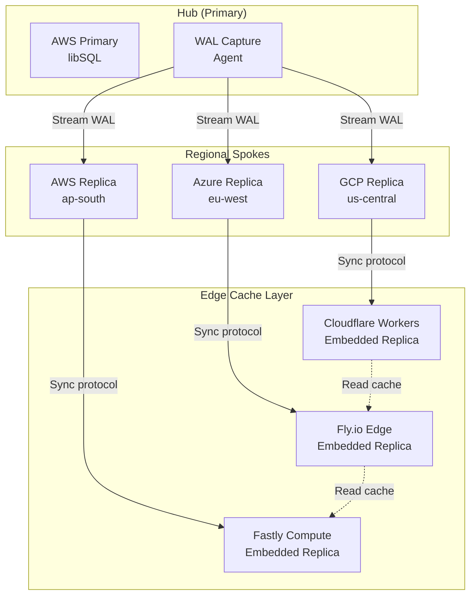
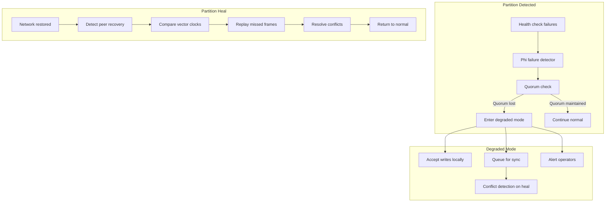

# Multi-Cloud Sync on Top of Turso with Rust

## Overview

This document explores building a **multi-cloud synchronization layer** on top of Turso/libSQL. While Turso provides excellent single-provider replication (primary → replicas), many enterprises need data synchronized across multiple cloud providers (AWS, GCP, Azure, edge providers) for:

1. **Resilience** -- Single-provider outages don't take down the entire system
2. **Latency** -- Data lives closer to users across different geographic regions
3. **Compliance** -- Data residency requirements mandate data stay in specific jurisdictions
4. **Vendor diversification** -- Avoid lock-in and negotiate better pricing



## Architecture Patterns

### Pattern 1: Active-Passive Multi-Cloud

**Description:** One cloud provider hosts the writable primary, others host read-only replicas with automatic failover.



**Rust Implementation Structure:**

```rust
// Multi-cloud manager with health monitoring
pub struct MultiCloudManager {
    primary: CloudEndpoint,
    replicas: Vec<CloudEndpoint>,
    health_checker: HealthMonitor,
    conflict_resolver: Arc<dyn ConflictResolver>,
    routing_policy: RoutingPolicy,
}

pub struct CloudEndpoint {
    provider: CloudProvider,
    region: String,
    turso_url: String,
    auth_token: String,
    s3_config: S3Config,
    health_status: AtomicBool,
    last_sync_lsn: AtomicU64,
}

pub enum CloudProvider {
    Aws { region: String, s3_bucket: String },
    Gcp { region: String, gcs_bucket: String },
    Azure { region: String, blob_container: String },
    Edge { provider: EdgeProvider },
}
```

**Key Components:**

1. **Health Monitor** -- Continuous health checks (heartbeat every 1-5 seconds)
2. **Failover Coordinator** -- Automatic promotion of replicas when primary fails
3. **WAL Forwarder** -- Captures WAL frames and forwards to backup clouds
4. **Conflict Resolver** -- Handles write-write conflicts during failover scenarios

### Pattern 2: Active-Active with Conflict Resolution

**Description:** Multiple cloud providers accept writes simultaneously, with conflict resolution for concurrent modifications.



**Conflict Resolution Strategies:**

| Strategy | Description | Use Case |
|----------|-------------|----------|
| **Last-Write-Wins (LWW)** | Use timestamp or LSN to pick winner | Simple counters, status flags |
| **First-Write-Wins** | First write wins, subsequent ignored | Registration systems, reservations |
| **CRDT Merge** | Mathematical merge for commutative operations | Counters, sets, maps |
| **Custom Business Logic** | Application-specific resolution | Financial transactions, inventory |
| **Manual Resolution** | Queue conflicts for human review | Critical data, legal requirements |

**Rust CRDT Implementation:**

```rust
use crdts::{GCounter, MVRegister, OrSwot, CmRDT, Dot};

pub struct MultiCloudConflictResolver {
    strategy: ConflictStrategy,
    vector_clock: Arc<DashMap<String, VectorClock>>,
    crdt_state: Arc<DashMap<String, CrdtValue>>,
}

pub enum ConflictStrategy {
    LastWriteWins,
    FirstWriteWins,
    CrdtMerge(CrdtType),
    Custom(Arc<dyn ConflictHandler>),
    Manual,
}

pub enum CrdtType {
    GCounter,      // Grow-only counter
    PNCounter,     // Positive-negative counter
    GSet,          // Grow-only set
    TwoPhaseSet,   // Add/remove set
    LWWRegister,   // Last-write-wins register
    MVRegister,    // Multi-value register
    OrSwot,        // Observed-remove set
}

impl ConflictResolver for MultiCloudConflictResolver {
    async fn resolve(&self, conflict: Conflict) -> Result<ResolvedValue> {
        match self.strategy {
            ConflictStrategy::LastWriteWins => {
                Ok(conflict.values.into_iter()
                    .max_by_key(|v| v.timestamp)
                    .unwrap())
            }
            ConflictStrategy::CrdtMerge(CrdtType::GCounter) => {
                let mut counter = GCounter::default();
                for value in conflict.values {
                    counter.merge(value.crdt_payload);
                }
                Ok(ResolvedValue::Counter(counter.read()))
            }
            ConflictStrategy::Custom(handler) => {
                handler.resolve(conflict).await
            }
            ConflictStrategy::Manual => {
                self.manual_queue.push(conflict).await;
                Err(Error::ManualResolutionRequired)
            }
        }
    }
}
```

### Pattern 3: Hub-and-Spoke with Edge Caching

**Description:** Central hub (primary) with multiple cloud spokes, edge providers cache frequently accessed data.



## Core Components

### 1. WAL Capture and Forwarding

The foundation of multi-cloud sync is capturing every write at the WAL level and forwarding to all cloud providers.

```rust
/// Captures WAL frames from libSQL and forwards to multiple destinations
pub struct WalCaptureAgent {
    db_path: PathBuf,
    wal_observer: WalObserver,
    forwarders: Vec<Arc<dyn WalForwarder>>,
    checkpoint_manager: CheckpointManager,
}

pub trait WalObserver: Send + Sync {
    /// Watch for new WAL frames
    async fn watch(&self) -> Result<WalFrameStream>;

    /// Get current WAL position
    fn current_lsn(&self) -> Lsn;

    /// Checkpoint WAL to free space
    async fn checkpoint(&self, mode: CheckpointMode) -> Result<()>;
}

pub trait WalForwarder: Send + Sync {
    /// Forward WAL frames to remote destination
    async fn forward(&self, frames: Vec<WalFrame>) -> Result<()>;

    /// Get acknowledgment of frames received
    async fn get_ack(&self) -> Result<Lsn>;

    /// Health check
    async fn health(&self) -> HealthStatus;
}

/// S3-based WAL forwarder implementation
pub struct S3WalForwarder {
    client: aws_sdk_s3::Client,
    bucket: String,
    prefix: String,
    encryption: EncryptionConfig,
    compression: CompressionConfig,
}

impl WalForwarder for S3WalForwarder {
    async fn forward(&self, frames: Vec<WalFrame>) -> Result<()> {
        // Batch frames into objects (e.g., 1000 frames per object)
        let batch = WalBatch {
            frames,
            start_lsn: self.current_lsn,
            end_lsn: self.current_lsn + frames.len() as u64,
            timestamp: Utc::now(),
        };

        // Compress if enabled
        let data = match self.compression {
            CompressionConfig::Zstd => compress_zstd(&batch.serialize()?),
            CompressionConfig::Gzip => compress_gzip(&batch.serialize()?),
            CompressionConfig::None => batch.serialize()?,
        };

        // Encrypt if enabled
        let encrypted_data = match &self.encryption {
            Some(config) => encrypt_aes256(&data, config)?,
            None => data,
        };

        // Upload to S3
        let key = format!("{}/{:020}.wal", self.prefix, batch.start_lsn);
        self.client.put_object()
            .bucket(&self.bucket)
            .key(&key)
            .body(encrypted_data.into())
            .send()
            .await?;

        Ok(())
    }
}
```

### 2. Sync Agent (Per-Cloud Coordinator)

Each cloud provider runs a sync agent that:
1. Receives WAL frames from other clouds
2. Applies them to the local Turso instance
3. Monitors health and reports status
4. Handles failover when needed

```rust
pub struct CloudSyncAgent {
    config: AgentConfig,
    local_db: Arc<libsql::Database>,
    wal_applier: WalApplier,
    health_reporter: HealthReporter,
    peer_connections: DashMap<CloudId, PeerConnection>,
    state_machine: Arc<SyncStateMachine>,
}

pub struct AgentConfig {
    cloud_id: CloudId,
    provider: CloudProvider,
    region: String,
    local_turso_url: String,
    peer_endpoints: Vec<PeerEndpoint>,
    s3_bucket: String,
    sync_interval: Duration,
    health_check_interval: Duration,
}

pub struct PeerConnection {
    peer_id: CloudId,
    endpoint: String,
    auth_token: String,
    grpc_channel: tonic::Channel,
    last_heartbeat: Instant,
    replication_lag: Duration,
}

/// State machine for sync coordination
pub struct SyncStateMachine {
    state: AtomicU8,  // SyncState enum
    current_lsn: AtomicU64,
    pending_frames: Arc<SegQueue<WalFrame>>,
    conflict_queue: Arc<DashMap<ConflictId, Conflict>>,
}

#[repr(u8)]
pub enum SyncState {
    Initializing = 0,
    CatchingUp = 1,      // Downloading historical WAL
    Streaming = 2,       // Real-time replication
    Degraded = 3,        // Some peers unreachable
    FailedOver = 4,      // Acting as primary after failover
    SplitBrain = 5,      // Conflict detected, needs resolution
}
```

### 3. Conflict Detection and Resolution

```rust
pub struct ConflictDetector {
    vector_clocks: Arc<DashMap<CloudId, VectorClock>>,
    transaction_log: Arc<TransactionLog>,
    conflict_handlers: Arc<ConflictHandlers>,
}

/// Vector clock for tracking causality across clouds
pub struct VectorClock {
    clocks: DashMap<CloudId, u64>,
}

impl VectorClock {
    pub fn increment(&self, cloud_id: CloudId) -> u64 {
        let current = self.clocks.get(&cloud_id).map(|c| *c).unwrap_or(0);
        let new_value = current + 1;
        self.clocks.insert(cloud_id, new_value);
        new_value
    }

    /// Returns true if self happens-before other
    pub fn happens_before(&self, other: &VectorClock) -> bool {
        let self_entries: Vec<_> = self.clocks.iter().collect();
        let other_entries: Vec<_> = other.clocks.iter().collect();

        // self < other iff all self entries <= other entries
        // and at least one is strictly less
        let mut all_leq = true;
        let mut one_less = false;

        for (cloud_id, self_val) in &self_entries {
            let other_val = other_entries.iter()
                .find(|(id, _)| *id == cloud_id)
                .map(|(_, v)| *v)
                .unwrap_or(0);

            if self_val > &other_val {
                all_leq = false;
                break;
            }
            if self_val < &other_val {
                one_less = true;
            }
        }

        all_leq && one_less
    }

    /// Returns true if concurrent (neither happens-before the other)
    pub fn concurrent(&self, other: &VectorClock) -> bool {
        !self.happens_before(other) && !other.happens_before(self)
    }
}

/// Conflict resolution with business logic
pub trait ConflictHandler: Send + Sync {
    async fn resolve(&self, ctx: ConflictContext) -> Result<ConflictResolution>;
}

pub struct ConflictContext {
    table: String,
    row_id: RowId,
    values: Vec<RowValue>,
    timestamps: Vec<SystemTime>,
    cloud_origins: Vec<CloudId>,
    vector_clocks: Vec<VectorClock>,
}

pub enum ConflictResolution {
    Accepted(RowValue),
    Merged(RowValue),
    Rejected(Vec<RowValue>),
    RequiresManualReview,
}
```

### 4. Health Monitoring and Failover

```rust
pub struct HealthMonitor {
    peers: Arc<DashMap<CloudId, PeerHealth>>,
    failure_detector: Arc<PhiAccrualFailureDetector>,
    failover_coordinator: Arc<FailoverCoordinator>,
}

pub struct PeerHealth {
    cloud_id: CloudId,
    last_heartbeat: Instant,
    response_time_p50: Duration,
    response_time_p99: Duration,
    replication_lag: Duration,
    error_rate: f64,
    status: PeerStatus,
}

pub enum PeerStatus {
    Healthy,
    Degraded,
    Unhealthy,
    Unreachable,
}

/// Phi Accrual Failure Detector for accurate failure detection
pub struct PhiAccrualFailureDetector {
    sample_size: usize,
    max_sample_size: usize,
    min_std_dev: Duration,
    threshold: f64,
    samples: SegQueue<Duration>,
}

impl PhiAccrualFailureDetector {
    pub fn phi(&self, time_since_last_heartbeat: Duration) -> f64 {
        // Calculate phi value based on historical response times
        // Higher phi = more likely the peer has failed
        let mean = self.mean();
        let std_dev = self.std_dev().max(self.min_std_dev);

        let y = (time_since_last_heartbeat.as_secs_f64() - mean) / std_dev;
        let e = std::f64::consts::E;

        1.0 / (1.0 + e.powf(-y))
    }

    pub fn is_available(&self, time_since_last_heartbeat: Duration) -> bool {
        self.phi(time_since_last_heartbeat) < self.threshold
    }
}

/// Failover coordinator with distributed consensus
pub struct FailoverCoordinator {
    consensus: Arc<dyn ConsensusProtocol>,
    state: Arc<FailoverState>,
}

pub trait ConsensusProtocol: Send + Sync {
    async fn propose(&self, proposal: FailoverProposal) -> Result<bool>;
    async fn vote(&self, proposal_id: ProposalId, vote: bool) -> Result<()>;
    async fn get_quorum(&self) -> Result<QuorumResult>;
}

/// Raft-based consensus for failover decisions
pub struct RaftConsensus {
    node_id: CloudId,
    peers: Vec<CloudId>,
    state: Arc<RaftState>,
    log: Arc<ReplicatedLog>,
}
```

### 5. Global Query Router

```rust
/// Routes queries to appropriate cloud based on policy
pub struct GlobalQueryRouter {
    topology: Arc<CloudTopology>,
    routing_policy: RoutingPolicy,
    consistency_config: ConsistencyConfig,
}

pub enum RoutingPolicy {
    /// Route to closest cloud by latency
    LatencyBased,
    /// Route reads to replicas, writes to primary
    ReadWriteSplit { primary: CloudId },
    /// Route based on data partitioning key
    KeyBased { hash_function: HashFn },
    /// Weighted round-robin across clouds
    WeightedRoundRobin { weights: Vec<u32> },
    /// Route based on cloud cost
    CostOptimized,
    /// Route based on carbon footprint
    CarbonOptimized,
}

pub enum ConsistencyConfig {
    /// Strong consistency - all reads from primary
    Strong,
    /// Eventual consistency - reads from any replica
    Eventual,
    /// Read-your-writes - track session affinity
    ReadYourWrites { session_store: SessionStore },
    /// Bounded staleness - reads within N seconds of primary
    BoundedStaleness { max_lag: Duration },
}

impl GlobalQueryRouter {
    pub async fn route_read(&self, query: &Query, session: &Session) -> Result<CloudId> {
        match &self.routing_policy {
            RoutingPolicy::LatencyBased => {
                let latencies = self.topology.measure_latencies().await?;
                Ok(latencies.iter().min_by_key(|(_, lat)| *lat).unwrap().0)
            }
            RoutingPolicy::ReadWriteSplit { primary } => {
                // For reads, prefer local replica if available
                if let Some(local) = self.topology.local_cloud() {
                    Ok(local)
                } else {
                    // Pick replica with lowest replication lag
                    self.topology.lowest_lag_replica().await
                }
            }
            RoutingPolicy::KeyBased { hash_function } => {
                let hash = hash_function(&query.partition_key()?);
                let cloud_index = hash % self.topology.cloud_count() as u64;
                Ok(self.topology.cloud_by_index(cloud_index as usize))
            }
            _ => self.topology.primary(),
        }
    }

    pub async fn route_write(&self, query: &Query) -> Result<CloudId> {
        match &self.routing_policy {
            RoutingPolicy::ReadWriteSplit { primary } => Ok(*primary),
            _ => Ok(self.topology.primary()),
        }
    }
}
```

## Multi-Cloud Deployment Architecture

### Recommended Topology

```
┌─────────────────────────────────────────────────────────────────────┐
│                         GLOBAL LOAD BALANCER                         │
│                    (Cloudflare DNS / AWS Global)                     │
└─────────────────────────────────────────────────────────────────────┘
                                    │
                    ┌───────────────┼───────────────┐
                    │               │               │
                    ▼               ▼               ▼
        ┌───────────────┐ ┌───────────────┐ ┌───────────────┐
        │   AWS us-east-1   │   GCP us-central  │  Azure westeurope │
        │   (Primary)       │   (Replica)       │  (Replica)        │
        ├───────────────┤ ├───────────────┤ ├───────────────┤
        │ Turso Primary │ │ Turso Replica │ │ Turso Replica │
        │ Sync Agent    │ │ Sync Agent    │ │ Sync Agent    │
        │ S3 WAL Backup │ │ GCS WAL Backup│ │ Blob Backup   │
        │               │ │               │ │               │
        │ ┌───────────┐ │ │ ┌───────────┐ │ │ ┌───────────┐ │
        │ │Health Mon │ │ │ │Health Mon │ │ │ │Health Mon │ │
        │ │Failover   │ │ │ │Failover   │ │ │ │Failover   │ │
        │ └───────────┘ │ │ └───────────┘ │ │ └───────────┘ │
        └───────────────┘ └───────────────┘ └───────────────┘
                    │               │               │
                    └───────────────┼───────────────┘
                                    │
                    ┌───────────────┼───────────────┐
                    │               │               │
                    ▼               ▼               ▼
        ┌───────────────┐ ┌───────────────┐ ┌───────────────┐
        │ Cloudflare    │ │   Fly.io      │ │   Fastly      │
        │ Workers       │ │   Edge        │ │   Compute     │
        │ Embedded DB   │ │   Embedded DB │ │   Embedded DB │
        └───────────────┘ └───────────────┘ └───────────────┘
```

### Infrastructure Requirements

| Component | AWS | GCP | Azure |
|-----------|-----|-----|-------|
| **Compute** | EC2 (c6i.xlarge) | GCE (n2-standard-4) | VM (Standard_D4s_v3) |
| **Object Storage** | S3 Standard | GCS Standard | Blob LRS |
| **Load Balancer** | ALB + Global Accelerator | Global LB | Front Door |
| **Monitoring** | CloudWatch | Cloud Monitoring | Monitor |
| **Secrets** | Secrets Manager | Secret Manager | Key Vault |

### Network Configuration

```terraform
# AWS VPC Configuration
resource "aws_vpc" "turso_multicloud" {
  cidr_block = "10.0.0.0/16"

  tags = {
    Name = "turso-multicloud-primary"
  }
}

resource "aws_security_group" "turso_sync" {
  name = "turso-sync-agent"

  # Allow gRPC from other clouds
  ingress {
    from_port   = 50051
    to_port     = 50051
    protocol    = "tcp"
    cidr_blocks = ["10.1.0.0/16", "10.2.0.0/16"]  # GCP and Azure ranges
  }

  # Allow libSQL replication
  ingress {
    from_port   = 8080
    to_port     = 8080
    protocol    = "tcp"
    cidr_blocks = ["10.1.0.0/16", "10.2.0.0/16"]
  }

  egress {
    from_port   = 0
    to_port     = 0
    protocol    = "-1"
    cidr_blocks = ["0.0.0.0/0"]
  }
}
```

## Rust Crates for Multi-Cloud Sync

### Core Dependencies

```toml
[dependencies]
# Async runtime
tokio = { version = "1.38", features = ["full"] }
tokio-util = "0.7"

# gRPC for sync communication
tonic = "0.11"
prost = "0.12"
tonic-reflection = "0.11"

# libSQL client
libsql = "0.4"

# Cloud SDKs
aws-sdk-s3 = "1.0"
aws-sdk-ec2 = "1.0"
google-cloud-storage = "0.15"
azure-storage-blobs = "0.19"

# CRDTs for conflict resolution
crdts = "7.3"
antisleep = "0.1"

# Vector clocks
vector-clock = "0.1"

# Distributed consensus
raft = "0.7"
openraft = "0.9"

# Observability
tracing = "0.1"
tracing-subscriber = "0.3"
metrics = "0.21"
metrics-exporter-prometheus = "0.13"

# Serialization
serde = { version = "1.0", features = ["derive"] }
serde_json = "1.0"
bincode = "1.3"

# Compression
zstd = "0.13"
flate2 = "1.0"

# Encryption
aes-gcm = "0.10"
chacha20poly1305 = "0.10"

# Time and scheduling
chrono = { version = "0.4", features = ["serde"] }
tokio-cron-scheduler = "0.11"

# Caching
moka = "0.12"
redis = "0.25"

# Error handling
thiserror = "1.0"
anyhow = "1.0"
```

### Sync Protocol Definition (Protobuf)

```protobuf
syntax = "proto3";

package multicloud_sync;

service SyncAgent {
    // Stream WAL frames from peer
    rpc StreamWAL(stream WalFrame) returns (WALAck);

    // Request historical WAL replay
    rpc ReplayWAL(ReplayRequest) returns (stream WalFrame);

    // Heartbeat and health status
    rpc Heartbeat(HeartbeatRequest) returns (HeartbeatResponse);

    // Failover coordination
    rpc FailoverProposal(FailoverRequest) returns (FailoverResponse);

    // Conflict resolution
    rpc ResolveConflict(ConflictRequest) returns (ConflictResponse);
}

message WalFrame {
    uint64 frame_number = 1;
    uint32 page_number = 2;
    bytes page_data = 3;
    uint64 checksum = 4;
    uint64 timestamp = 5;
    string cloud_origin = 6;
    uint64 vector_clock = 7;
}

message WALAck {
    uint64 acknowledged_up_to = 1;
    string cloud_id = 2;
    uint64 timestamp = 3;
}

message ReplayRequest {
    uint64 from_frame = 1;
    uint64 to_frame = 2;
    string cloud_id = 3;
}

message HeartbeatRequest {
    string cloud_id = 1;
    uint64 current_lsn = 2;
    uint64 replication_lag_ms = 3;
    CloudStatus status = 4;
}

message HeartbeatResponse {
    bool accepted = 1;
    uint64 term = 2;
    string leader_cloud_id = 3;
}

enum CloudStatus {
    HEALTHY = 0;
    DEGRADED = 1;
    UNHEALTHY = 2;
    OFFLINE = 3;
}

message FailoverRequest {
    string proposing_cloud = 1;
    string target_cloud = 2;
    uint64 term = 3;
    FailoverReason reason = 4;
}

enum FailoverReason {
    PRIMARY_FAILURE = 0;
    NETWORK_PARTITION = 1;
    MANUAL_FAILOVER = 2;
    HEALTH_CHECK_FAILURE = 3;
}

message FailoverResponse {
    bool vote_granted = 1;
    uint64 term = 2;
    string vote_reason = 3;
}

message ConflictRequest {
    string table = 1;
    string row_id = 2;
    repeated RowValue values = 3;
    repeated uint64 timestamps = 4;
    repeated string cloud_origins = 5;
}

message RowValue {
    string column = 1;
    bytes value = 2;
    string value_type = 3;
}

message ConflictResponse {
    ConflictResolution resolution = 1;
    RowValue resolved_value = 2;
}

enum ConflictResolution {
    LWW = 0;
    MERGED = 1;
    MANUAL = 2;
}
```

## Production Considerations

### 1. Replication Lag Monitoring

```rust
pub struct ReplicationLagMonitor {
    metrics: Arc<MetricsRegistry>,
    alerting: Arc<AlertingService>,
}

impl ReplicationLagMonitor {
    pub async fn monitor(&self, peers: &DashMap<CloudId, PeerState>) {
        for (cloud_id, state) in peers.iter() {
            let lag = state.current_lsn() - state.replicated_lsn();
            let lag_duration = state.lag_duration();

            self.metrics
                .gauge("replication_lag_frames")
                .set(cloud_id.as_str(), lag as f64);

            self.metrics
                .gauge("replication_lag_seconds")
                .set(cloud_id.as_str(), lag_duration.as_secs_f64());

            // Alert if lag exceeds thresholds
            if lag_duration > Duration::from_secs(30) {
                self.alerting
                    .send(Alert::ReplicationLag {
                        cloud: cloud_id.clone(),
                        lag: lag_duration,
                    })
                    .await;
            }
        }
    }
}
```

### 2. Network Partition Handling



### 3. Data Consistency Guarantees

| Consistency Level | Description | Latency Impact |
|-------------------|-------------|----------------|
| **Strong** | All reads see latest write | Highest (wait for all clouds) |
| **Quorum** | Reads/writes need N/2+1 clouds | Medium |
| **Eventual** | Writes propagate asynchronously | Lowest |
| **Read-your-writes** | Session affinity to write cloud | Low-Medium |
| **Bounded Staleness** | Reads within N seconds of primary | Configurable |

### 4. Backup and Disaster Recovery

```rust
/// Multi-cloud backup coordinator
pub struct BackupCoordinator {
    s3_client: aws_sdk_s3::Client,
    gcs_client: google_cloud_storage::Client,
    azure_client: azure_storage_blobs::BlobServiceClient,
    retention_policy: RetentionPolicy,
    encryption_config: EncryptionConfig,
}

pub struct RetentionPolicy {
    daily_retention_days: u32,
    weekly_retention_weeks: u32,
    monthly_retention_months: u32,
    yearly_retention_years: u32,
}

impl BackupCoordinator {
    /// Create point-in-time snapshot across all clouds
    pub async fn create_snapshot(&self, snapshot_id: &str) -> Result<()> {
        // 1. Pause writes briefly (or use consistent LSN)
        let lsn_snapshot = self.capture_global_lsn().await?;

        // 2. Trigger checkpoint on all clouds
        self.checkpoint_all_clouds().await?;

        // 3. Download database files from each cloud
        for cloud in self.clouds.iter() {
            let db_file = cloud.download_database_file().await?;
            let wal_file = cloud.download_wal_file().await?;

            // 4. Upload to backup storage (different provider)
            self.upload_to_backup(&db_file, &wal_file, snapshot_id, cloud.id())
                .await?;
        }

        Ok(())
    }

    /// Restore from snapshot
    pub async fn restore(&self, snapshot_id: &str, target_cloud: CloudId) -> Result<()> {
        // 1. Download snapshot from backup storage
        let (db_file, wal_file) = self.download_from_backup(snapshot_id).await?;

        // 2. Stop local Turso instance
        self.stop_turso(target_cloud).await?;

        // 3. Replace database files
        self.replace_database_files(target_cloud, db_file, wal_file).await?;

        // 4. Restart Turso instance
        self.start_turso(target_cloud).await?;

        // 5. Verify integrity
        self.verify_integrity(target_cloud).await?;

        Ok(())
    }
}
```

## Performance Optimization

### 1. WAL Batching and Compression

```rust
pub struct WalBatcher {
    batch_size: usize,
    batch_timeout: Duration,
    compression: CompressionAlgorithm,
    pending_frames: SegQueue<WalFrame>,
}

impl WalBatcher {
    pub async fn batch_and_send(&self, forwarder: &dyn WalForwarder) -> Result<()> {
        let mut batch = Vec::with_capacity(self.batch_size);
        let start = Instant::now();

        // Collect frames until batch is full or timeout
        while batch.len() < self.batch_size && start.elapsed() < self.batch_timeout {
            if let Some(frame) = self.pending_frames.pop() {
                batch.push(frame);
            } else {
                tokio::time::sleep(Duration::from_millis(10)).await;
            }
        }

        if batch.is_empty() {
            return Ok(());
        }

        // Compress batch
        let serialized = bincode::serialize(&batch)?;
        let compressed = match self.compression {
            CompressionAlgorithm::Zstd => zstd::compress(&serialized, 3)?,
            CompressionAlgorithm::Gzip => {
                let mut encoder = GzEncoder::new(Vec::new(), Compression::fast());
                encoder.write_all(&serialized)?;
                encoder.finish()?
            }
            CompressionAlgorithm::None => serialized,
        };

        // Send batch
        forwarder.forward_raw(&compressed).await?;

        Ok(())
    }
}
```

### 2. Parallel WAL Replay

```rust
pub struct ParallelWalReplayer {
    num_workers: usize,
    workers: Vec<ReplayWorker>,
}

pub struct ReplayWorker {
    id: usize,
    frame_queue: Arc<SegQueue<WalFrame>>,
    db_connection: libsql::Connection,
}

impl ParallelWalReplayer {
    pub async fn replay(&self, frames: Vec<WalFrame>) -> Result<()> {
        // Distribute frames across workers
        for (i, frame) in frames.into_iter().enumerate() {
            let worker_idx = i % self.num_workers;
            self.workers[worker_idx].frame_queue.push(frame);
        }

        // Wait for all workers to complete
        join_all(self.workers.iter().map(|w| w.process_queue())).await;

        Ok(())
    }
}
```

## Summary

Multi-cloud synchronization on top of Turso requires:

1. **WAL Capture** -- Intercept and forward every page mutation
2. **Sync Agents** -- Per-cloud coordinators for replication
3. **Conflict Resolution** -- CRDTs, LWW, or custom business logic
4. **Health Monitoring** -- Failure detection and automatic failover
5. **Global Routing** -- Intelligent query routing across clouds
6. **Backup/DR** -- Cross-cloud snapshots and point-in-time recovery

The key insight is that Turso's virtual WAL architecture makes this feasible -- by capturing writes at the WAL level, we can replicate to any number of cloud providers while maintaining SQLite compatibility at the application layer.
