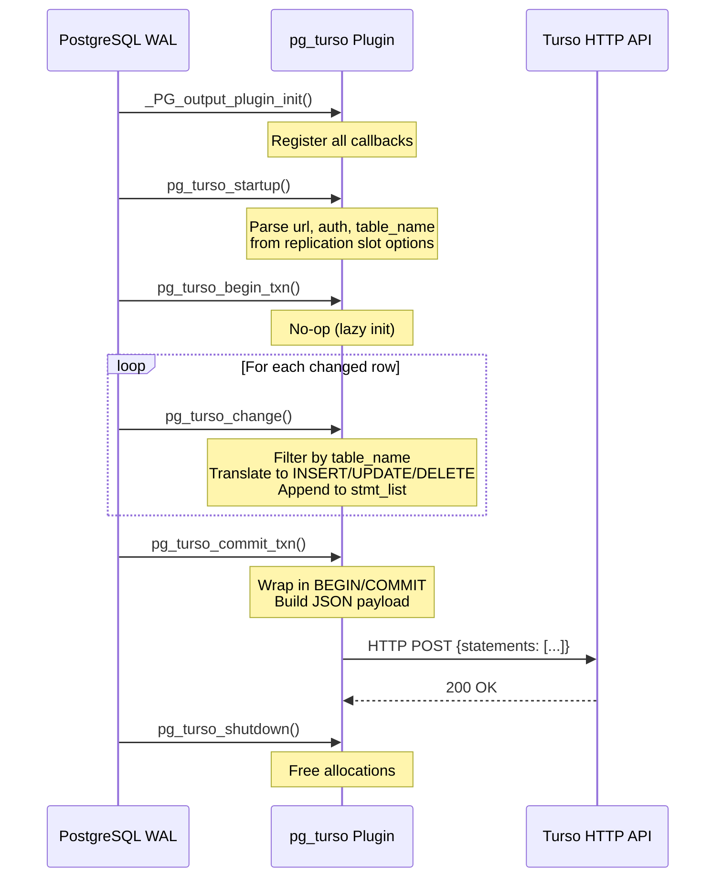
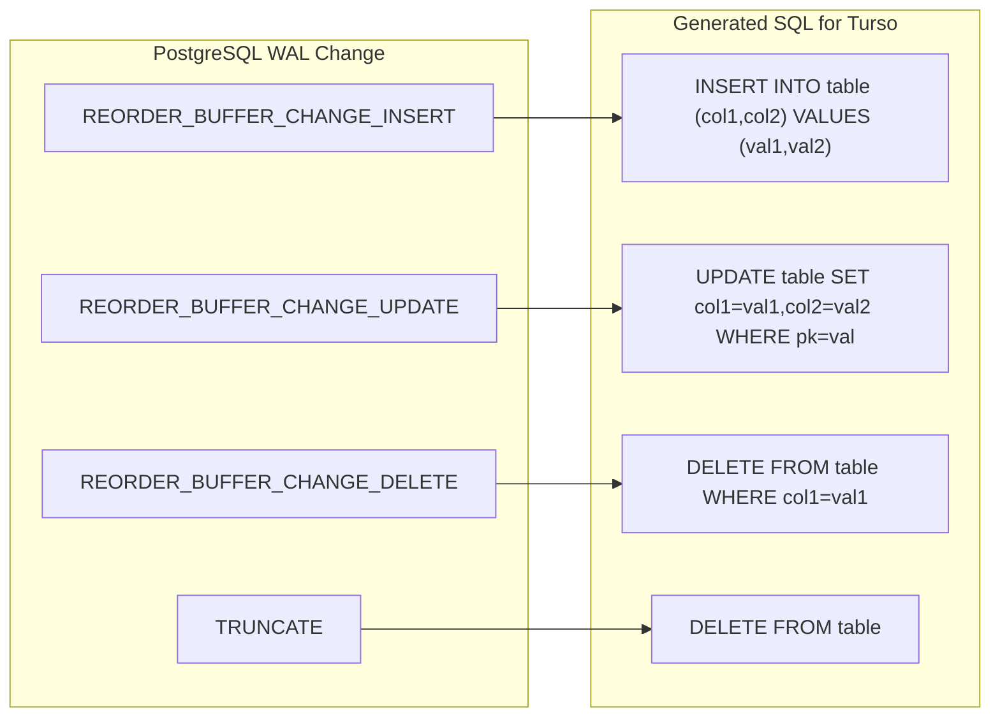
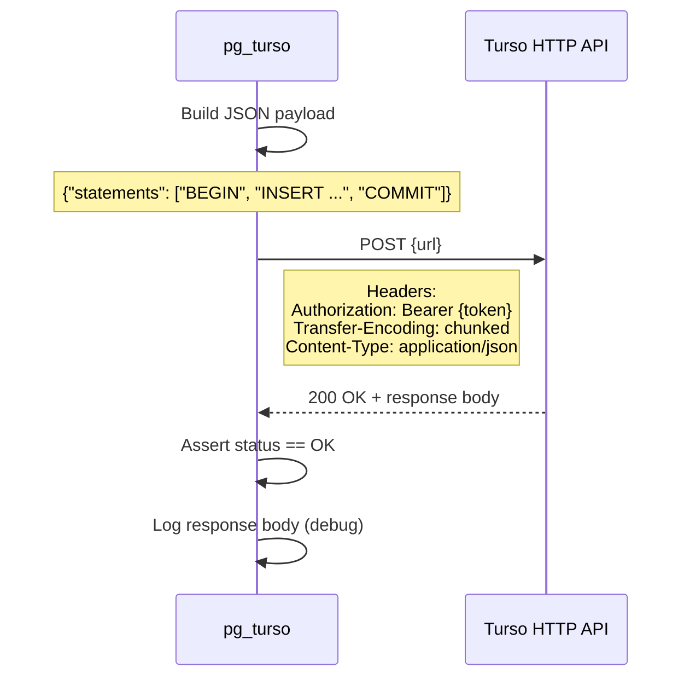
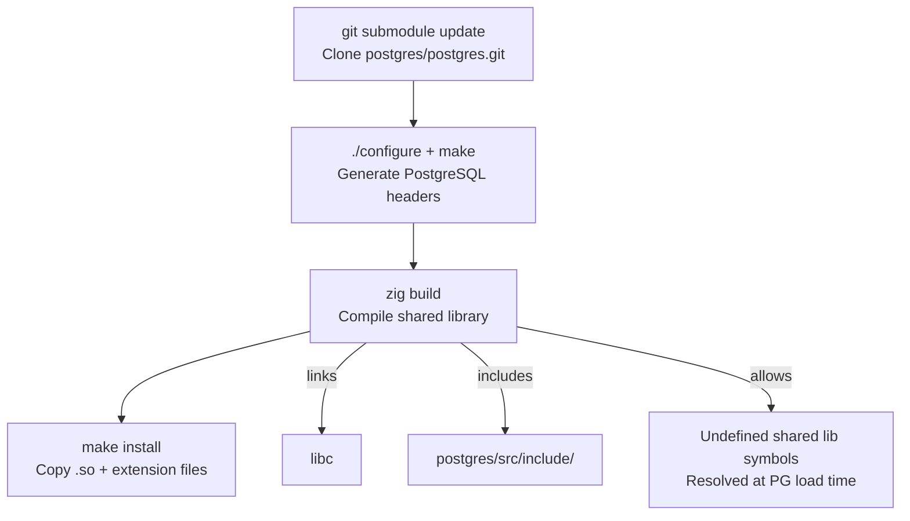
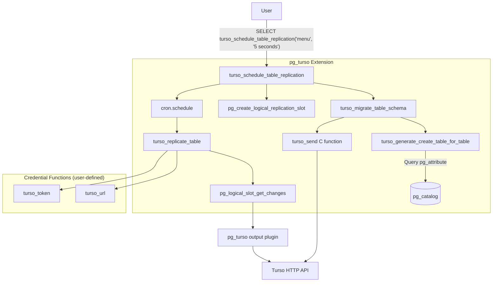

# pg_turso Exploration

## Project Overview

pg_turso is a **PostgreSQL logical replication output plugin** written in Zig that replicates data from PostgreSQL to [Turso](https://turso.tech) (libSQL) databases. It intercepts WAL (Write-Ahead Log) changes -- inserts, updates, deletes, and truncates -- translates them into SQL statements compatible with SQLite/libSQL, and sends them to a Turso database via its HTTP API.

**Status:** The project is **deprecated** and no longer supported. Turso now recommends using their CLI and Platform API directly to manage databases.

**License:** MIT (Copyright 2023 ChiselStrike, Inc.)

**Notable:** Despite being filed under `src.rust/src.turso/`, this is a **Zig** project, not Rust. It uses Zig's `@cImport` to interface directly with PostgreSQL's C headers and builds as a shared library (`.so`) that PostgreSQL loads as a plugin.

## Architecture

```mermaid
graph TD
    subgraph PostgreSQL
        WAL[Write-Ahead Log<br/>wal_level = logical]
        SLOT[Logical Replication Slot<br/>pg_turso_slot_*]
        EXT[pg_turso Extension<br/>SQL helper functions]
        CRON[pg_cron<br/>scheduled replication]
    end

    subgraph "pg_turso Plugin (Zig shared library)"
        INIT[_PG_output_plugin_init<br/>Register callbacks]
        START[pg_turso_startup<br/>Parse options: url, auth, table_name]
        CHANGE[pg_turso_change<br/>Translate row changes to SQL]
        COMMIT[pg_turso_commit_txn<br/>Send batch to Turso]
        TRUNC[pg_turso_truncate<br/>Translate TRUNCATE to DELETE]
        SEND[send()<br/>HTTP POST with JSON]
    end

    subgraph "Turso / libSQL"
        API[Turso HTTP API<br/>POST /]
        DB[(libSQL Database)]
    end

    WAL --> SLOT
    SLOT --> INIT
    INIT --> START
    START --> CHANGE
    CHANGE --> COMMIT
    CHANGE --> TRUNC
    COMMIT --> SEND
    SEND -->|JSON: statements array| API
    API --> DB
    EXT --> SLOT
    CRON --> EXT
```

## How It Works

### Logical Replication Pipeline

PostgreSQL's logical decoding framework allows plugins to consume WAL entries as structured, logical row-level changes. pg_turso hooks into this framework via `_PG_output_plugin_init`, registering callbacks for each phase of the replication lifecycle:



### Callback Registration

The `_PG_output_plugin_init` function populates the `OutputPluginCallbacks` struct with seven active callbacks:

| Callback | Function | Purpose |
|----------|----------|---------|
| `startup_cb` | `pg_turso_startup` | Parse connection options (url, auth, table_name) |
| `shutdown_cb` | `pg_turso_shutdown` | Free allocated memory |
| `begin_cb` | `pg_turso_begin_txn` | No-op; transaction data is lazily allocated |
| `change_cb` | `pg_turso_change` | Core logic: translate row changes to SQL |
| `commit_cb` | `pg_turso_commit_txn` | Send accumulated statements to Turso |
| `truncate_cb` | `pg_turso_truncate` | Convert TRUNCATE to `DELETE FROM <table>` |
| `filter_by_origin_cb` | `pg_turso_filter` | Always returns false (no filtering) |

Several optional callbacks are noted but not implemented: `message_cb`, `filter_prepare_cb`, prepared transaction callbacks, and streaming callbacks.

### Plugin Context Structures

Two structs hold runtime state:

**`PgTursoData`** -- Plugin-wide context, allocated via PostgreSQL's `palloc0`:
- `context`: A PostgreSQL `MemoryContext` for temporary allocations during change processing
- `url`: Turso database URL
- `auth`: Bearer token for authentication
- `table_name`: Name of the table to replicate (only one table per slot)

**`PgTursoTxnData`** -- Per-transaction context, lazily allocated on first change:
- `stmt_list`: A `std.json.Array` accumulating SQL statement strings ("BEGIN", individual DML statements, "COMMIT")

## File Structure

```
pg_turso/
  src/
    main.zig                      # Core plugin: callbacks, PG magic, turso_send UDF
    util.zig                      # SQL generation (INSERT/UPDATE/DELETE), HTTP send, type mapping
  extension/
    pg_turso--1.0.sql             # SQL extension: helper functions and procedures
    pg_turso.control              # PostgreSQL extension metadata
  build.zig                       # Zig build configuration
  Makefile                        # Build orchestration (git submodules, PG headers, zig build)
  translated.zig                  # Reference: test_decoding.c translated to Zig via translate-c (~1MB)
  translated-func-example.zig    # Reference: another translate-c output (~720KB)
  .github/workflows/zig.yml      # CI: build + lint with Zig 0.11
  .gitmodules                     # Git submodule: postgres/postgres.git for headers
  LICENSE                         # MIT
```

### Key Files in Detail

**`src/main.zig`** (368 lines) -- The entry point. Contains:
- PostgreSQL magic function (`Pg_magic_func`) for module validation
- Plugin initialization (`_PG_output_plugin_init`)
- All lifecycle callbacks
- The `turso_send` user-defined function (callable from SQL as `turso_send(url, token, data)`)
- Option parsing from replication slot parameters

**`src/util.zig`** (382 lines) -- Utility functions:
- `print_insert` / `print_update` / `print_delete` -- Generate SQL strings from PostgreSQL tuple data
- `print_literal` -- Type-aware value serialization
- `send` -- HTTP POST to Turso's API using `std.http.Client`
- `span_text` -- Deserializes PostgreSQL `text` datum to Zig slice
- Various translated PostgreSQL macros for TOAST/varlena handling

**`extension/pg_turso--1.0.sql`** (113 lines) -- SQL helper layer providing:
- `turso_replicate_table(table_name)` -- Procedure to trigger table replication
- `turso_replicate_mv(mv_name)` -- Procedure to refresh + replicate a materialized view
- `turso_schedule_table_replication(table_name, interval)` -- Set up pg_cron scheduled replication
- `turso_schedule_mv_replication(view_name, interval)` -- Same for materialized views
- `turso_generate_create_table_for_table/mv` -- Generate CREATE TABLE DDL for Turso
- `turso_migrate_table_schema/mv_schema` -- Send CREATE TABLE to Turso
- `turso_send(url, token, data)` -- SQL wrapper for the C function

## SQL Translation: PostgreSQL to SQLite/libSQL

### Statement Generation

The plugin translates PostgreSQL WAL changes into SQL statements that are compatible with SQLite/libSQL:



**INSERT translation** (`print_insert`):
1. Iterates tuple descriptor attributes, skipping dropped and system columns
2. Builds column list: `(col1, col2, ...)`
3. Builds value list by calling `print_literal` for each non-null value
4. Result: `INSERT INTO table (col1, col2) VALUES (val1, val2)`

**UPDATE translation** (`print_update`):
1. Generates SET clause from new tuple values, skipping unchanged null-to-null transitions
2. Generates WHERE clause using **primary key** attributes only (via `RelationGetIndexAttrBitmap`)
3. If a previous tuple exists, uses old key values for the WHERE clause; otherwise uses new tuple
4. Result: `UPDATE table SET col1=val1 WHERE pk=pkval`

**DELETE translation** (`print_delete`):
1. Generates WHERE clause from old tuple values (all non-null columns)
2. Result: `DELETE FROM table WHERE col1=val1`

**TRUNCATE translation** (`pg_turso_truncate`):
- PostgreSQL TRUNCATE has no SQLite equivalent, so it maps to `DELETE FROM table` (deletes all rows without the TRUNCATE optimization)

### Type Mapping

The `print_literal` function handles PostgreSQL OID-based type mapping:

| PostgreSQL Type | OID(s) | SQLite/libSQL Output | Format |
|----------------|--------|---------------------|--------|
| smallint (int2) | 21 | Bare number | `42` |
| integer (int4) | 23 | Bare number | `42` |
| bigint (int8) | 20 | Bare number | `42` |
| oid | 26 | Bare number | `42` |
| real (float4) | 700 | Bare number | `3.14` |
| double precision (float8) | 701 | Bare number | `3.14` |
| numeric | 1700 | Bare number | `3.14` |
| boolean | 16 | `true` / `false` | Literal |
| text | 25 | Single-quoted string | `'hello'` |
| varchar | 1043 | Single-quoted string | `'hello'` |
| uuid | 2950 | Single-quoted string | `'uuid-value'` |
| json | 114 | Single-quoted string | `'{"key":"val"}'` |
| jsonb | 3802 | Single-quoted string | `'{"key":"val"}'` |
| timestamp | 1114 | Single-quoted string | `'2023-01-01'` |
| timestamptz | 1184 | Single-quoted string | `'2023-01-01+00'` |
| bit | 1560 | Bit string literal | `B'1010'` |
| varbit | 1562 | Bit string literal | `B'1010'` |
| All others | * | Escaped single-quoted string | `'value'` |

**Important limitation:** The README notes that only basic types (integers and text) were tested. The fallback handler for unknown types does basic quote-escaping but is flagged as potentially producing garbage output (see FIXME comment in code).

## Connection to Turso

### HTTP API Communication

The `send` function in `util.zig` communicates with Turso using the **Hrana over HTTP** protocol:



The JSON payload structure sent to Turso:
```json
{
  "statements": [
    "BEGIN",
    "INSERT INTO menu (dish_id, name, price) VALUES (1, 'salami', 2.49)",
    "COMMIT"
  ]
}
```

Every logical transaction from PostgreSQL is wrapped in a single HTTP request containing `BEGIN`, all DML statements, and `COMMIT`. This ensures atomicity on the Turso side.

### Authentication

Authentication is handled via:
1. **Direct slot parameters:** `url` and `auth`/`token` passed via `pg_logical_slot_get_changes`
2. **Helper functions:** `turso_url()` and `turso_token()` SQL functions that the user defines, returning the URL and token respectively

The token is prepended with `"Bearer "` during startup and sent as the `Authorization` header.

## Build System

### Build Pipeline



The build process:

1. **`git submodule update`** -- Clones the full PostgreSQL source tree as a submodule (for headers only)
2. **`cd postgres && ./configure`** -- Runs PostgreSQL's configure script
3. **`make -C postgres/src/backend generated-headers`** -- Generates required PostgreSQL internal headers
4. **`zig build`** -- Compiles `src/main.zig` as a shared library (`libpg_turso.so`) version 0.1.0

The `build.zig` configuration:
- Adds `postgres/src/include` as an include path for `@cImport`
- Links libc (required for PostgreSQL C interop)
- Sets `linker_allow_shlib_undefined = true` -- allows undefined symbols that will be resolved when PostgreSQL loads the plugin

### Installation

`make install` copies three files using `pg_config` to determine paths:
- `zig-out/lib/libpg_turso.so` to `$(PKGLIBDIR)/pg_turso.so`
- `extension/pg_turso--1.0.sql` to PostgreSQL's extension directory
- `extension/pg_turso.control` to PostgreSQL's extension directory

### CI

GitHub Actions runs on pushes to `main` and PRs:
- **Build job:** Checks out with submodules, installs Zig 0.11, runs `make`
- **Lint job:** Runs `zig fmt --check src/*.zig`

## PostgreSQL Extension Layer

The SQL extension (`pg_turso--1.0.sql`) provides a high-level interface built on top of the output plugin:



Key extension features:

- **Schema migration:** Automatically generates a `CREATE TABLE IF NOT EXISTS` statement for the Turso-side table by querying `pg_attribute`, then sends it via `turso_send`
- **Scheduled replication:** Uses `pg_cron` to periodically call `turso_replicate_table` or `turso_replicate_mv`
- **Materialized view support:** `turso_replicate_mv` first refreshes the materialized view, then replicates it as a table
- **Replication slot management:** Creates unique slots per table using `pg_turso_slot_` + MD5 hash of table name

The extension declares a dependency on `pg_cron` in its `.control` file.

## Zig-PostgreSQL Interop

### @cImport Integration

The project uses Zig's `@cImport` to directly import PostgreSQL C headers:

```zig
const pg = @cImport({
    @cInclude("postgres.h");
    @cInclude("replication/logical.h");
    @cInclude("utils/memutils.h");
    @cInclude("utils/builtins.h");
    @cInclude("utils/lsyscache.h");
});
```

This gives Zig code direct access to PostgreSQL types (`LogicalDecodingContext`, `ReorderBufferTXN`, `HeapTuple`, `TupleDesc`, etc.) and functions (`palloc0`, `heap_getattr`, `OidOutputFunctionCall`, etc.) without any manual FFI binding.

### PostgreSQL Magic Function

Every PostgreSQL loadable module must export a `Pg_magic_func` symbol. The Zig implementation manually constructs the `Pg_magic_struct` with constants matching PostgreSQL 15 (`version = 150000 / 100 = 1500`):

```zig
pub export fn Pg_magic_func() [*c]const Pg_magic_struct {
    // Returns static struct with PG15 ABI compatibility info
}
```

### Memory Management

The plugin uses a dual memory management strategy:
- **PostgreSQL allocator (`palloc0`, `MemoryContextAllocZero`)** for data that lives within PostgreSQL's lifecycle (plugin data, transaction data)
- **Zig's `GeneralPurposeAllocator`** for data managed independently (formatted SQL strings, HTTP client resources)

A dedicated `MemoryContext` named "text conversion context" (8KB initial, 8MB max) is created for temporary allocations during change processing, reset after each change via `MemoryContextReset`.

### TOAST Handling

The code includes extensive handling for PostgreSQL TOAST (The Oversized-Attribute Storage Technique) values. Variable-length attributes may be stored out-of-line or compressed; the plugin checks for:
- `VARTAG_ONDISK` -- External TOAST data (logged as "unchanged-toast-datum" and skipped)
- Variable-length vs. fixed-length attributes via `typisvarlena`
- De-TOASTing via `pg_detoast_datum` for inline compressed values

Several PostgreSQL C macros that `zig translate-c` failed to translate correctly are manually reimplemented at the bottom of `util.zig` (`VARSIZE_ANY_EXHDR`, `VARDATA_ANY`, etc.).

### Reference Translation Files

Two large files (`translated.zig` at ~1MB, `translated-func-example.zig` at ~720KB) contain the output of `zig translate-c` applied to PostgreSQL's `test_decoding.c`. These serve as reference material for understanding how to implement PostgreSQL plugin callbacks in Zig, not as runtime code.

## Performance Considerations

### Bottlenecks

1. **HTTP per transaction:** Every PostgreSQL transaction triggers a synchronous HTTP POST to Turso. For high-throughput workloads, this is the primary bottleneck.

2. **Statement buffer limit:** A fixed 64KB buffer (`stmt_buf: [65536]u8`) is used for each SQL statement. Rows with very large text columns could exceed this and cause an `unreachable` panic.

3. **Single-table filtering:** Each replication slot can only track one table (`table_name`). Every WAL change is checked against this filter, meaning unrelated changes are decoded and discarded.

4. **No streaming support:** The plugin explicitly disables `ctx.*.streaming = false`. Large transactions must be fully buffered in memory before sending.

5. **Synchronous replication:** The `send` function blocks until Turso responds. There is no batching across transactions or async I/O.

6. **TRUNCATE as DELETE:** PostgreSQL TRUNCATE is translated to `DELETE FROM table` without a WHERE clause, which is much slower on the Turso side than a native TRUNCATE would be.

### Missing Features

- No connection pooling or retry logic for Turso HTTP calls
- No support for schema changes (ALTER TABLE, ADD COLUMN, etc.)
- No conflict resolution strategy beyond Turso's native behavior
- No filtering of specific columns or value ranges (noted as TODO)
- No support for multiple tables per replication slot (noted as TODO)
- Materialized view replication requires full refresh each cycle, which PostgreSQL docs note is expensive

## Configuration and Setup

### Prerequisites

1. PostgreSQL installation with `wal_level = logical`
2. Zig compiler (development version 2023-06-20+ or Zig 0.11)
3. A Turso database with URL and auth token
4. (Optional) pg_cron for scheduled replication

### Setup Steps

```sql
-- 1. Enable logical WAL level (requires restart)
ALTER SYSTEM SET wal_level = logical;
-- Restart PostgreSQL

-- 2. Manual replication
SELECT pg_create_logical_replication_slot('pg_turso_slot', 'pg_turso');
SELECT * FROM pg_logical_slot_get_changes('pg_turso_slot', NULL, NULL,
    'url', 'https://your-db.turso.io/',
    'auth', 'your-token');

-- 3. Automated replication via extension
CREATE OR REPLACE FUNCTION turso_url() RETURNS text LANGUAGE SQL
    AS $$ SELECT 'https://your-db.turso.io/'; $$;
CREATE OR REPLACE FUNCTION turso_token() RETURNS text LANGUAGE SQL
    AS $$ SELECT 'your-token'; $$;

CREATE EXTENSION pg_turso;
SELECT turso_schedule_table_replication('my_table', '5 seconds');
```

## Dependencies

| Dependency | Purpose | Type |
|-----------|---------|------|
| Zig 0.11+ | Build toolchain and runtime | Build |
| PostgreSQL source (submodule) | C headers for @cImport | Build |
| libc | C standard library for PG interop | Link |
| pg_cron | Scheduled replication (extension layer) | Runtime (optional) |
| Turso HTTP API | Replication target | Runtime |

## Summary

pg_turso is a clever but limited proof-of-concept that bridges PostgreSQL and Turso/libSQL using PostgreSQL's logical decoding framework. Written in Zig for its seamless C interop (via `@cImport`), it translates WAL changes into SQLite-compatible SQL statements and sends them over HTTP. The project is now deprecated, but its architecture demonstrates an interesting pattern for cross-database replication plugins. Its primary limitations are single-table-per-slot filtering, synchronous HTTP communication, limited type support, and no schema evolution handling.
