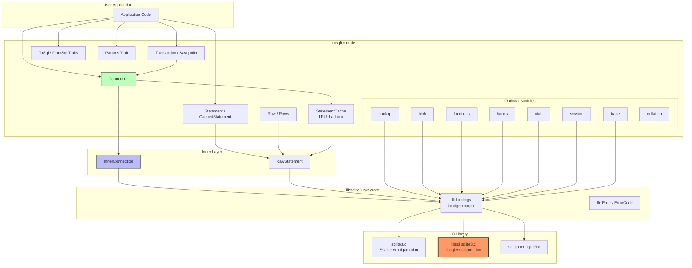
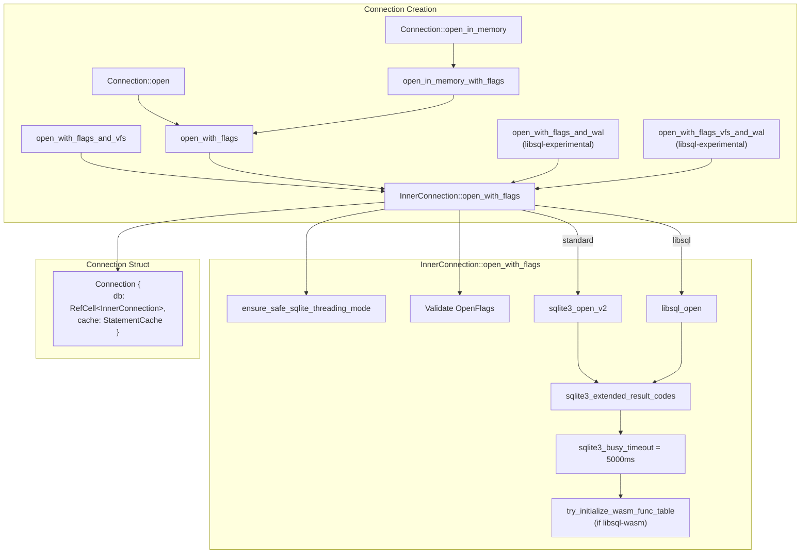
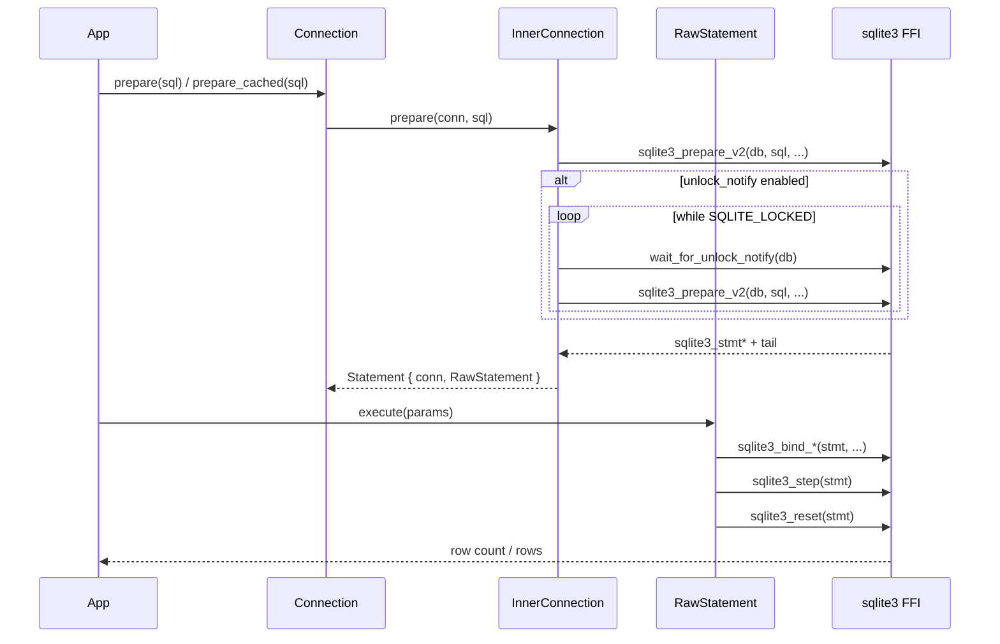
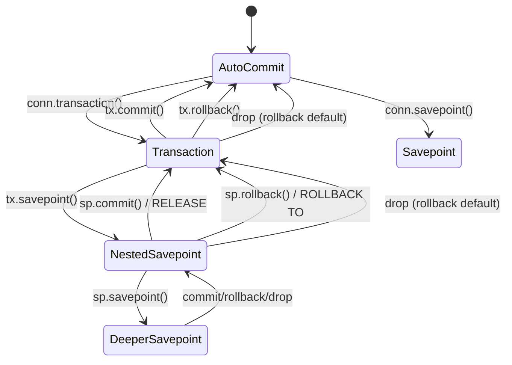
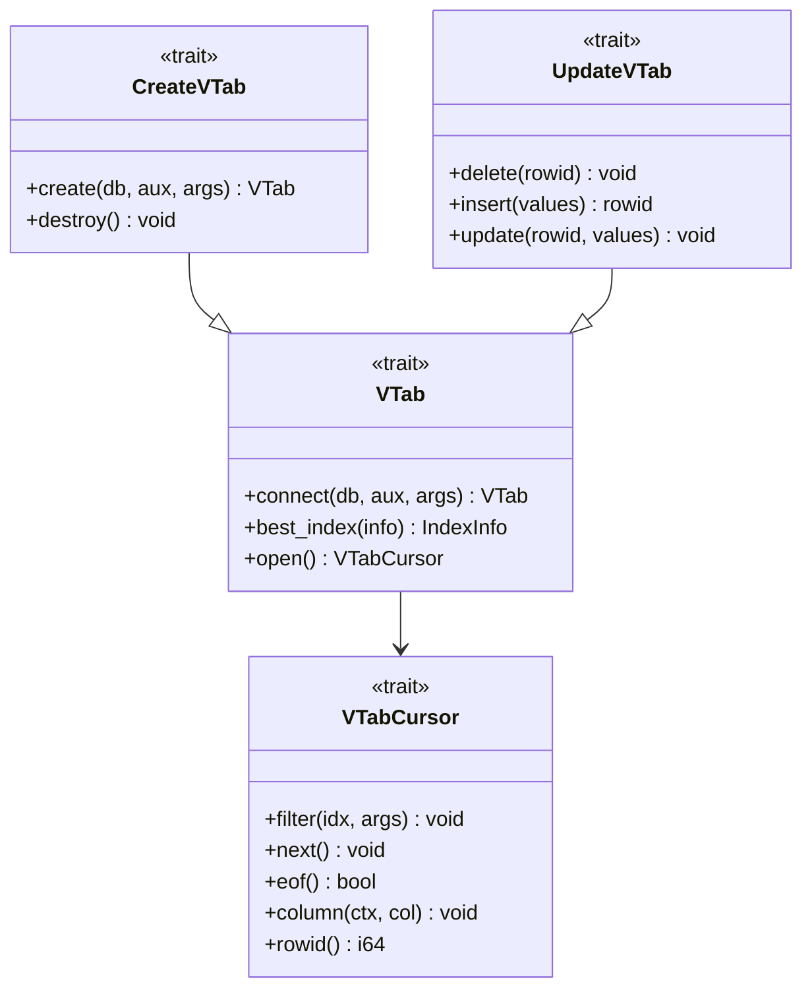

# Turso's rusqlite Fork -- Comprehensive Exploration

## 1. Overview and Purpose

This repository is Turso's fork of the [rusqlite](https://github.com/rusqlite/rusqlite) crate (v0.29.0), the de facto ergonomic Rust wrapper around SQLite. Turso maintains this fork to add first-class support for **libsql**, their open-source fork of SQLite. The key modifications enable:

- Opening connections via `libsql_open` instead of `sqlite3_open_v2`
- Custom WAL (Write-Ahead Logging) method injection at connection time
- WebAssembly User-Defined Function (UDF) support via `libsql-wasmtime-bindings`
- Additional statement-level metrics (`ROWS_READ`, `ROWS_WRITTEN`)
- Bundled compilation against libsql's C amalgamation instead of upstream SQLite

The fork is a conservative patch on top of upstream rusqlite. The API surface remains nearly identical -- existing rusqlite users can switch by toggling feature flags. The upstream version at the fork point is rusqlite 0.29.0 / libsqlite3-sys 0.26.0, based on SQLite 3.41.2. The libsql version bundled is 0.2.1.

## 2. Repository Structure

```
rusqlite/
├── Cargo.toml                      # Workspace root, rusqlite crate manifest
├── README.md                       # Upstream README (mostly unmodified)
├── LICENSE                         # MIT
├── clippy.toml
├── appveyor.yml / codecov.yml      # CI configs
│
├── src/                            # Main rusqlite crate source
│   ├── lib.rs                      # Public API, Connection struct, macros
│   ├── inner_connection.rs         # Low-level FFI connection management
│   ├── statement.rs                # Statement preparation and execution
│   ├── raw_statement.rs            # Raw sqlite3_stmt wrapper
│   ├── transaction.rs              # Transaction/Savepoint handling
│   ├── error.rs                    # Error types
│   ├── cache.rs                    # Prepared statement LRU cache
│   ├── row.rs                      # Row and Rows iterators
│   ├── column.rs                   # Column metadata
│   ├── params.rs                   # Parameter binding trait system
│   ├── pragma.rs                   # PRAGMA helpers
│   ├── config.rs                   # sqlite3_db_config wrapper
│   ├── busy.rs                     # Busy handler
│   ├── version.rs                  # Version queries
│   ├── context.rs                  # UDF context (functions + vtab)
│   │
│   ├── types/                      # Type conversion system
│   │   ├── mod.rs                  # Type enum, Null struct
│   │   ├── from_sql.rs             # FromSql trait + impls
│   │   ├── to_sql.rs               # ToSql trait + impls
│   │   ├── value.rs                # Owned Value enum
│   │   ├── value_ref.rs            # Borrowed ValueRef enum
│   │   ├── chrono.rs               # chrono crate integration
│   │   ├── time.rs                 # time crate integration
│   │   ├── serde_json.rs           # serde_json Value support
│   │   └── url.rs                  # url crate integration
│   │
│   ├── blob/                       # Incremental blob I/O
│   │   ├── mod.rs                  # Blob struct with Read/Write/Seek
│   │   └── pos_io.rs               # Positional I/O operations
│   │
│   ├── vtab/                       # Virtual table support
│   │   ├── mod.rs                  # VTab/VTabCursor traits, Module struct
│   │   ├── array.rs                # rarray() table-valued function
│   │   ├── csvtab.rs               # CSV virtual table
│   │   ├── series.rs               # generate_series() TVF
│   │   └── vtablog.rs              # Logging virtual table
│   │
│   ├── util/                       # Internal utilities
│   │   ├── mod.rs
│   │   ├── param_cache.rs          # Named parameter index cache
│   │   ├── small_cstr.rs           # Stack-allocated CString
│   │   └── sqlite_string.rs        # sqlite3_malloc'd string wrapper
│   │
│   ├── backup.rs                   # Online backup API
│   ├── collation.rs                # Custom collation sequences
│   ├── functions.rs                # Scalar/aggregate/window UDFs
│   ├── hooks.rs                    # Commit/rollback/update hooks, authorizer
│   ├── limits.rs                   # Connection limits
│   ├── load_extension_guard.rs     # Extension loading RAII guard
│   ├── session.rs                  # Session extension (changesets)
│   ├── trace.rs                    # Tracing/profiling callbacks
│   └── unlock_notify.rs            # Unlock notification (shared cache)
│
├── libsqlite3-sys/                 # Low-level C bindings crate
│   ├── Cargo.toml                  # libsqlite3-sys manifest
│   ├── build.rs                    # Build script (bundled/linked/bindgen)
│   ├── wrapper.h                   # Header for system-linked builds
│   ├── src/
│   │   ├── lib.rs                  # FFI re-exports, SQLITE_STATIC/TRANSIENT
│   │   └── error.rs                # ffi::Error and ErrorCode types
│   │
│   ├── sqlite3/                    # Upstream SQLite amalgamation
│   │   ├── sqlite3.c / sqlite3.h / sqlite3ext.h
│   │   ├── bindgen_bundled_version.rs
│   │   └── wasm32-wasi-vfs.c
│   │
│   ├── libsql/                     # *** TURSO ADDITION ***
│   │   ├── sqlite3.c / sqlite3.h / sqlite3ext.h   # libsql amalgamation
│   │   ├── bindgen_bundled_version.rs              # libsql bindgen output
│   │   └── wasm32-wasi-vfs.c                       # Wasm32 WASI VFS
│   │
│   ├── sqlcipher/                  # SQLCipher amalgamation
│   │   ├── sqlite3.c / sqlite3.h / sqlite3ext.h
│   │   └── bindgen_bundled_version.rs
│   │
│   ├── bindgen-bindings/           # Pre-generated bindgen output
│   │   └── bindgen_3.14.0.rs
│   │
│   ├── upgrade.sh                  # Script to update upstream SQLite
│   ├── upgrade_libsql.sh           # Script to update libsql
│   └── upgrade_sqlcipher.sh        # Script to update SQLCipher
│
├── benches/                        # Benchmarks
│   ├── cache.rs
│   └── exec.rs
│
└── tests/                          # Integration tests
    ├── config_log.rs
    ├── deny_single_threaded_sqlite_config.rs
    └── vtab.rs
```

## 3. Architecture



## 4. How This Fork Differs from Upstream rusqlite

The fork introduces a focused set of changes to support libsql. These can be categorized into three areas:

### 4.1 Feature Flags (Cargo.toml)

Three new feature flags are added at the rusqlite level:

| Feature Flag | Purpose |
|---|---|
| `libsql-experimental` | Enables libsql-specific APIs (custom WAL, `libsql_open`, statement metrics) |
| `bundled-libsql-experimental` | Bundles the libsql C amalgamation and implies `libsql-experimental` + `bundled` |
| `bundled-libsql-wasm-experimental` | Adds WebAssembly UDF support via `libsql-wasmtime-bindings` |
| `libsql-wasm-experimental` | Enables Wasm runtime flags in the C compilation |

At the `libsqlite3-sys` level:
- `bundled-libsql-experimental` triggers `build_bundled::main()` to compile `libsql/sqlite3.c` instead of `sqlite3/sqlite3.c`
- `libsql-wasm-experimental` adds the optional `libsql-wasmtime-bindings` dependency (v0.2.1)
- The `lib_name()` function returns `"libsql"` instead of `"sqlite3"` when the feature is active

### 4.2 Connection Opening (libsql_open)

The most critical code change is in `InnerConnection::open_with_flags`:

```rust
// Standard SQLite path:
#[cfg(not(feature = "libsql-experimental"))]
let r = ffi::sqlite3_open_v2(c_path.as_ptr(), &mut db, flags.bits(), z_vfs);

// libsql path -- adds WAL parameter:
#[cfg(feature = "libsql-experimental")]
let r = ffi::libsql_open(c_path.as_ptr(), &mut db, flags.bits(), z_vfs, z_wal);
```

This enables three new `Connection` constructors:
- `Connection::open_with_flags_and_wal(path, flags, wal)` -- open with custom WAL methods
- `Connection::open_with_flags_vfs_and_wal(path, flags, vfs, wal)` -- open with both custom VFS and WAL

### 4.3 Additional Statement Metrics

Two new `StatementStatus` variants are added behind `#[cfg(feature = "libsql-experimental")]`:

```rust
RowsRead = 1024 + 1,     // LIBSQL_STMTSTATUS_ROWS_READ
RowsWritten = 1024 + 2,  // LIBSQL_STMTSTATUS_ROWS_WRITTEN
```

These are libsql extensions (version 0.2.1+) that enable tracking how many rows a statement reads from or writes to the database, which is useful for billing, quota enforcement, and performance analysis.

### 4.4 WebAssembly UDF Table Initialization

When `libsql-wasm-experimental` is enabled:
- On connection open, `libsql_try_initialize_wasm_func_table(db)` is called automatically
- `Connection::try_initialize_wasm_func_table()` is exposed as a public API
- The C build sets `-DLIBSQL_ENABLE_WASM_RUNTIME=1`

### 4.5 libsql Bindings Layer

The `libsqlite3-sys/libsql/bindgen_bundled_version.rs` (3,918 lines) contains bindgen output that includes all standard SQLite symbols plus these libsql-specific additions:

**Constants:**
- `LIBSQL_VERSION` = "0.2.1"
- `LIBSQL_STMTSTATUS_BASE` = 1024
- `LIBSQL_STMTSTATUS_ROWS_READ` = 1025
- `LIBSQL_STMTSTATUS_ROWS_WRITTEN` = 1026

**Functions:**
- `libsql_libversion()` -- returns the libsql version string
- `libsql_open()` / `libsql_open_v2()` -- open with WAL method parameter
- `libsql_try_initialize_wasm_func_table()` -- initialize Wasm UDF table
- `libsql_wal_methods_find()` -- look up WAL methods by name
- `libsql_wal_methods_register()` / `libsql_wal_methods_unregister()` -- register/unregister WAL methods
- `libsql_wal_methods_next()` / `libsql_wal_methods_name()` -- iterate WAL methods

**Struct:**
- `libsql_wal_methods` -- a large struct with function pointers for custom WAL implementations (open, close, read, write, checkpoint, etc.)

## 5. Connection Management



### Connection Structure

The `Connection` struct is intentionally simple:

```rust
pub struct Connection {
    db: RefCell<InnerConnection>,      // Interior mutability for the raw handle
    cache: StatementCache,             // LRU cache of prepared statements
}
```

Key design decisions:
- `RefCell<InnerConnection>` provides interior mutability so queries can be executed through `&Connection` (not `&mut Connection`)
- `unsafe impl Send for Connection` -- safe because SQLite in serialized/multi-thread mode handles concurrent access
- NOT `Sync` -- a `Connection` cannot be shared between threads without external synchronization
- Default cache capacity: 16 prepared statements
- Default busy timeout: 5000ms
- Default flags: `READ_WRITE | CREATE | URI | NO_MUTEX`

### InnerConnection

The raw FFI wrapper manages:
- `db: *mut ffi::sqlite3` -- the raw database handle
- `interrupt_lock: Arc<Mutex<*mut ffi::sqlite3>>` -- thread-safe interrupt support
- Hook storage (commit, rollback, update, progress, authorizer) behind `#[cfg(feature = "hooks")]`
- `owned: bool` -- whether to call `sqlite3_close` on drop

### InterruptHandle

A thread-safe handle (`Send + Sync`) that can call `sqlite3_interrupt()` from another thread. Uses the `interrupt_lock` mutex to synchronize with connection close.

### OpenFlags

Bitflags wrapping `SQLITE_OPEN_*` constants:

| Flag | Purpose |
|---|---|
| `SQLITE_OPEN_READ_ONLY` | Read-only access |
| `SQLITE_OPEN_READ_WRITE` | Read-write access |
| `SQLITE_OPEN_CREATE` | Create if not exists |
| `SQLITE_OPEN_URI` | Interpret filename as URI |
| `SQLITE_OPEN_MEMORY` | In-memory database |
| `SQLITE_OPEN_NO_MUTEX` | No per-connection mutex (default) |
| `SQLITE_OPEN_FULL_MUTEX` | Serialized mode |
| `SQLITE_OPEN_SHARED_CACHE` | Shared cache mode |
| `SQLITE_OPEN_PRIVATE_CACHE` | Private cache mode |
| `SQLITE_OPEN_NOFOLLOW` | Do not follow symlinks |

## 6. Statement Preparation and Execution



### Statement Types

- **`Statement<'conn>`** -- a prepared statement tied to a connection lifetime. Contains a reference to `Connection` and a `RawStatement`.
- **`CachedStatement<'conn>`** -- wraps `Statement` and returns it to the `StatementCache` on drop rather than finalizing it. Created via `conn.prepare_cached(sql)`.
- **`RawStatement`** -- low-level wrapper around `*mut ffi::sqlite3_stmt`. Handles finalization on drop, caches named parameter indices.

### StatementCache

An LRU cache backed by `hashlink::LruCache<Arc<str>, RawStatement>`:
- Default capacity: 16 entries
- Key: the SQL string (as `Arc<str>`)
- On `prepare_cached`: checks cache first, creates new statement if miss
- On `CachedStatement` drop: returns `RawStatement` to cache (with `sqlite3_reset` + `sqlite3_clear_bindings`)
- `flush_prepared_statement_cache()` finalizes all cached statements (also called on `Connection::drop`)

### StatementStatus

Status counters available via `stmt.get_status(status, reset)`:

| Status | Value | Description |
|---|---|---|
| `FullscanStep` | 1 | Full table scan steps |
| `Sort` | 2 | Sort operations |
| `AutoIndex` | 3 | Automatic index creations |
| `VmStep` | 4 | Virtual machine steps |
| `RePrepare` | 5 | Statement re-preparations |
| `Run` | 6 | Times statement has been run |
| `FilterMiss` | 7 | Bloom filter misses |
| `FilterHit` | 8 | Bloom filter hits |
| `MemUsed` | 99 | Memory used by statement |
| `RowsRead` | 1025 | Rows read (libsql only) |
| `RowsWritten` | 1026 | Rows written (libsql only) |

## 7. Type Conversion System

```mermaid
graph LR
    subgraph "Rust Types"
        RUST_INT[i8/i16/i32/i64/u8/u16/u32/u64/usize/isize]
        RUST_FLOAT[f32/f64]
        RUST_STR[String/&str/Box&lt;str&gt;/Arc&lt;str&gt;/Rc&lt;str&gt;]
        RUST_BLOB["Vec&lt;u8&gt;/&[u8]/[u8; N]"]
        RUST_BOOL[bool]
        RUST_OPT["Option&lt;T&gt;"]
        RUST_NULL[Null]
    end

    subgraph "Optional Types"
        CHRONO["chrono::NaiveDate<br/>chrono::NaiveTime<br/>chrono::NaiveDateTime<br/>chrono::DateTime"]
        TIME["time::OffsetDateTime"]
        JSON["serde_json::Value"]
        URL_T["url::Url"]
        UUID_T["uuid::Uuid"]
        I128["i128 (as 16-byte blob)"]
    end

    subgraph "SQLite Types"
        SQL_NULL[NULL]
        SQL_INT[INTEGER<br/>i64]
        SQL_REAL[REAL<br/>f64]
        SQL_TEXT[TEXT<br/>&str]
        SQL_BLOB[BLOB<br/>&[u8]]
    end

    RUST_INT -->|ToSql| SQL_INT
    RUST_FLOAT -->|ToSql| SQL_REAL
    RUST_STR -->|ToSql| SQL_TEXT
    RUST_BLOB -->|ToSql| SQL_BLOB
    RUST_BOOL -->|ToSql| SQL_INT
    RUST_OPT -->|"None->NULL<br/>Some(T)->T"| SQL_NULL
    RUST_NULL -->|ToSql| SQL_NULL

    SQL_INT -->|FromSql| RUST_INT
    SQL_REAL -->|FromSql| RUST_FLOAT
    SQL_TEXT -->|FromSql| RUST_STR
    SQL_BLOB -->|FromSql| RUST_BLOB
    SQL_INT -->|FromSql| RUST_BOOL
    SQL_NULL -->|FromSql| RUST_OPT

    CHRONO -.->|"feature=chrono"| SQL_TEXT
    TIME -.->|"feature=time"| SQL_TEXT
    JSON -.->|"feature=serde_json"| SQL_TEXT
    URL_T -.->|"feature=url"| SQL_TEXT
    UUID_T -.->|"feature=uuid"| SQL_BLOB
    I128 -.->|"feature=i128_blob"| SQL_BLOB
```

### The ToSql Trait

```rust
pub trait ToSql {
    fn to_sql(&self) -> Result<ToSqlOutput<'_>>;
}
```

`ToSqlOutput` is an enum with variants:
- `Borrowed(ValueRef<'a>)` -- zero-copy reference to existing data
- `Owned(Value)` -- heap-allocated owned value
- `ZeroBlob(i32)` -- blob filled with zeroes (feature: `blob`)
- `Array(Array)` -- pointer-passing for virtual table arrays (feature: `array`)

Key implementation details:
- `u64` and `usize` use fallible conversion to `i64`, returning `Error::ToSqlConversionFailure` if out of range
- All primitive number types except `u64`/`usize` use infallible conversions
- `String`/`&str` produce `Borrowed(ValueRef::Text(...))`
- `Vec<u8>`/`&[u8]` produce `Borrowed(ValueRef::Blob(...))`
- `Option<T>` maps `None` to `Null`, `Some(t)` delegates to `T::to_sql()`
- Smart pointers (`Box<T>`, `Rc<T>`, `Arc<T>`, `Cow<T>`) delegate to inner type

### The FromSql Trait

```rust
pub trait FromSql: Sized {
    fn column_result(value: ValueRef<'_>) -> FromSqlResult<Self>;
}
```

Conversion rules:
- INTEGER to integer types: range-checked via `TryInto`, returns `FromSqlError::OutOfRange` on failure
- REAL to integer types: always returns `FromSqlError::InvalidType`
- INTEGER to float types: cast via `as` (always succeeds, may lose precision)
- REAL to float types: direct (f64) or narrowing cast (f32)
- `bool`: any non-zero integer is `true`
- `i128` (feature `i128_blob`): stored as 16-byte big-endian blob with MSB flipped for correct ordering
- `uuid::Uuid` (feature `uuid`): stored as 16-byte big-endian blob

### ValueRef and Value

`ValueRef<'a>` is a borrowed reference to a SQLite value (zero-copy for blobs and text):

```rust
pub enum ValueRef<'a> {
    Null,
    Integer(i64),
    Real(f64),
    Text(&'a [u8]),
    Blob(&'a [u8]),
}
```

`Value` is the owned equivalent:

```rust
pub enum Value {
    Null,
    Integer(i64),
    Real(f64),
    Text(String),
    Blob(Vec<u8>),
}
```

## 8. Transaction Handling



### Transaction

```rust
pub struct Transaction<'conn> {
    conn: &'conn Connection,
    drop_behavior: DropBehavior,
}
```

- Created via `conn.transaction()` (takes `&mut Connection` to prevent nesting at compile time)
- Or via `conn.unchecked_transaction()` (takes `&Connection`, nesting checked at runtime)
- Defaults to `DropBehavior::Rollback`
- Implements `Deref<Target = Connection>` so all Connection methods are available
- Supports three behaviors: `Deferred`, `Immediate`, `Exclusive`

### Savepoint

```rust
pub struct Savepoint<'conn> {
    conn: &'conn Connection,
    name: String,
    depth: u32,
    drop_behavior: DropBehavior,
    committed: bool,
}
```

- Supports arbitrary nesting with depth tracking
- Named savepoints via `savepoint_with_name`
- Unlike transactions, savepoints remain active after rollback and can be rolled back again or committed
- Auto-named as `_rusqlite_sp_{depth}`

### DropBehavior

| Behavior | Effect |
|---|---|
| `Rollback` | Roll back on drop (default) |
| `Commit` | Commit on drop, fallback to rollback on failure |
| `Ignore` | Leave the transaction/savepoint open |
| `Panic` | Panic if dropped without explicit commit/rollback |

### TransactionState (modern_sqlite)

Queryable via `conn.transaction_state(db_name)`:
- `TransactionState::None` -- no active transaction
- `TransactionState::Read` -- read transaction active
- `TransactionState::Write` -- write transaction active

## 9. Virtual Table Support

The `vtab` module provides a Rust-idiomatic framework for implementing SQLite virtual tables:

### Core Traits



### Module Registration

```rust
conn.create_module("module_name", &MODULE, optional_aux)?;
```

### Built-in Virtual Tables

1. **array** (`rarray()`) -- pass Rust `Vec<Value>` as a table-valued function parameter via pointer passing
2. **csvtab** -- read CSV files as virtual tables
3. **series** (`generate_series()`) -- generate integer sequences
4. **vtablog** -- debugging virtual table that logs all method calls

### VTabKind

- `Default` -- standard virtual table (separate create/connect)
- `Eponymous` -- create == connect (usable without CREATE VIRTUAL TABLE)
- `EponymousOnly` -- no create/destroy, always available

## 10. Backup API

The `backup` module wraps SQLite's online backup API (`sqlite3_backup_*`):

```rust
pub struct Backup<'a, 'b> {
    backup: *mut ffi::sqlite3_backup,
    _from: &'a Connection,   // Source (can be used during backup)
    _to: &'b Connection,     // Destination (locked during backup)
}
```

Key methods:
- `Backup::new(from, to)` -- create backup from `main` to `main`
- `backup.step(num_pages)` -- copy up to N pages, returns `StepResult`
- `backup.progress()` -- returns `Progress { pagecount, remaining }`
- `backup.run_to_completion(pages_per_step, pause, callback)` -- convenience method

`StepResult` variants: `More`, `Done`, `Busy`, `Locked`

Convenience method on Connection:
```rust
conn.backup(DatabaseName::Main, "backup.db", Some(progress_fn))?;
```

## 11. Feature Flags and Conditional Compilation

```mermaid
graph TD
    subgraph "Build Modes"
        BUNDLED[bundled] -->|implies| MODERN[modern_sqlite]
        BUNDLED_SC[bundled-sqlcipher] -->|implies| BUNDLED
        BUNDLED_LIBSQL[bundled-libsql-experimental] -->|implies| BUNDLED
        BUNDLED_LIBSQL -->|implies| LIBSQL_EXP[libsql-experimental]
        BUNDLED_WASM[bundled-libsql-wasm-experimental] -->|implies| BUNDLED_LIBSQL
        BUNDLED_WASM -->|implies| LIBSQL_WASM[libsql-wasm-experimental]
        LIBSQL_WASM -->|implies| LIBSQL_EXP
    end

    subgraph "API Features"
        BACKUP_F[backup]
        BLOB_F[blob]
        FUNCS_F[functions]
        HOOKS_F[hooks]
        VTAB_F[vtab]
        TRACE_F[trace]
        LIMITS_F[limits]
        COLLATION_F[collation]
        LOADEXT_F[load_extension]
        SESSION_F[session] -->|implies| HOOKS_F
        WINDOW_F[window] -->|implies| FUNCS_F
        CSVTAB_F[csvtab] -->|implies| VTAB_F
        ARRAY_F[array] -->|implies| VTAB_F
        SERIES_F[series] -->|implies| VTAB_F
    end

    subgraph "Type Integration"
        CHRONO_F[chrono]
        TIME_F[time]
        SERDE_F[serde_json]
        URL_F[url]
        UUID_F[uuid]
        I128_F[i128_blob]
    end

    subgraph "Aggregate Features"
        MODERN_FULL[modern-full] -.-> BACKUP_F
        MODERN_FULL -.-> BLOB_F
        MODERN_FULL -.-> FUNCS_F
        MODERN_FULL -.-> HOOKS_F
        MODERN_FULL -.-> VTAB_F
        MODERN_FULL -.-> TRACE_F
        MODERN_FULL -.-> LIMITS_F
        MODERN_FULL -.-> CHRONO_F
        BUNDLED_FULL[bundled-full] -->|implies| MODERN_FULL
        BUNDLED_FULL -->|implies| BUNDLED
    end

    style BUNDLED_LIBSQL fill:#f96,stroke:#333,stroke-width:2px
    style BUNDLED_WASM fill:#f96,stroke:#333,stroke-width:2px
    style LIBSQL_EXP fill:#f96,stroke:#333,stroke-width:2px
    style LIBSQL_WASM fill:#f96,stroke:#333,stroke-width:2px
```



### C Compilation Flags (bundled builds)

When using bundled mode, the build script passes these flags to `cc`:
- `SQLITE_CORE`, `SQLITE_THREADSAFE=1`
- `SQLITE_ENABLE_FTS3`, `SQLITE_ENABLE_FTS3_PARENTHESIS`, `SQLITE_ENABLE_FTS5`
- `SQLITE_ENABLE_JSON1`, `SQLITE_ENABLE_RTREE`
- `SQLITE_ENABLE_COLUMN_METADATA`, `SQLITE_ENABLE_DBSTAT_VTAB`
- `SQLITE_ENABLE_STAT2`, `SQLITE_ENABLE_STAT4`
- `SQLITE_ENABLE_API_ARMOR`, `SQLITE_ENABLE_MEMORY_MANAGEMENT`
- `SQLITE_ENABLE_LOAD_EXTENSION=1`
- `SQLITE_DEFAULT_FOREIGN_KEYS=1`, `SQLITE_SOUNDEX`, `SQLITE_USE_URI`
- `HAVE_USLEEP=1`, `HAVE_ISNAN` (non-MSVC), `HAVE_LOCALTIME_R` (non-Windows)

libsql-wasm adds: `LIBSQL_ENABLE_WASM_RUNTIME=1`

Environment-configurable: `SQLITE_MAX_VARIABLE_NUMBER`, `SQLITE_MAX_EXPR_DEPTH`, `SQLITE_MAX_COLUMN`, `LIBSQLITE3_FLAGS`

## 12. Error Handling

The `Error` enum is comprehensive with ~20 variants:

```mermaid
graph TD
    ERROR[Error]
    ERROR --> SF[SqliteFailure<br/>ffi::Error + Option&lt;String&gt;]
    ERROR --> STM[SqliteSingleThreadedMode]
    ERROR --> FSC[FromSqlConversionFailure<br/>col, Type, Box&lt;Error&gt;]
    ERROR --> IVR[IntegralValueOutOfRange<br/>col, i64]
    ERROR --> UTF8[Utf8Error]
    ERROR --> NUL[NulError]
    ERROR --> IPN[InvalidParameterName]
    ERROR --> IP[InvalidPath]
    ERROR --> ERR2[ExecuteReturnedResults]
    ERROR --> QRN[QueryReturnedNoRows]
    ERROR --> ICI[InvalidColumnIndex]
    ERROR --> ICN[InvalidColumnName]
    ERROR --> ICT[InvalidColumnType<br/>idx, name, Type]
    ERROR --> SCR[StatementChangedRows]
    ERROR --> TSC[ToSqlConversionFailure]
    ERROR --> IQ[InvalidQuery]
    ERROR --> MS[MultipleStatement]
    ERROR --> IPC[InvalidParameterCount]
    ERROR --> SIE["SqlInputError (modern_sqlite)<br/>error, msg, sql, offset"]
```



`ffi::Error` wraps the SQLite error code with both `code: ErrorCode` (enum) and `extended_code: c_int`.

The `OptionalExtension` trait converts `Result<T>` to `Result<Option<T>>`, mapping `QueryReturnedNoRows` to `Ok(None)`:

```rust
let name: Option<String> = conn.query_row(
    "SELECT name FROM users WHERE id = ?1", [42], |row| row.get(0)
).optional()?;
```

## 13. libsqlite3-sys Build System

```mermaid
flowchart TD
    START[build.rs main] --> GECKO{in_gecko?}
    GECKO -->|yes| COPY_SQLITE[Copy sqlite3 bindings]
    GECKO -->|no| PKG{PKG_CONFIG<br/>override?}
    PKG -->|yes| LINKED[build_linked::main]
    PKG -->|no| SQLCIPHER{sqlcipher &&<br/>!bundled-sqlcipher?}
    SQLCIPHER -->|yes| LINKED
    SQLCIPHER -->|no| BUNDLED{bundled ||<br/>bundled-windows ||<br/>bundled-sqlcipher ||<br/>bundled-libsql?}
    BUNDLED -->|yes| BUILD_BUNDLED[build_bundled::main]
    BUNDLED -->|no| LINKED

    BUILD_BUNDLED --> LIB_NAME{lib_name}
    LIB_NAME -->|sqlcipher| SC_DIR[sqlcipher/sqlite3.c]
    LIB_NAME -->|libsql| LS_DIR[libsql/sqlite3.c]
    LIB_NAME -->|sqlite3| SQ_DIR[sqlite3/sqlite3.c]

    BUILD_BUNDLED --> BINDGEN{buildtime_bindgen?}
    BINDGEN -->|yes| RUN_BINDGEN[Run bindgen on header]
    BINDGEN -->|no| COPY_PRE[Copy pre-generated bindings]

    BUILD_BUNDLED --> CC[cc::Build::new<br/>Compile C amalgamation]
    CC --> FLAGS[Apply SQLITE_ENABLE_* flags]
    FLAGS --> WASM{libsql-wasm?}
    WASM -->|yes| WASM_FLAG[LIBSQL_ENABLE_WASM_RUNTIME=1]

    LINKED --> FIND_LIB[Find library via<br/>env vars / pkg-config / vcpkg]
```

### lib_name() Resolution

| Feature Active | Library Name |
|---|---|
| `sqlcipher` or `bundled-sqlcipher` | `"sqlcipher"` |
| `libsql-experimental` or `bundled-libsql-experimental` | `"libsql"` |
| Windows + `winsqlite3` | `"winsqlite3"` |
| Default | `"sqlite3"` |

## 14. Other Subsystems

### Hooks Module

Provides callbacks for database events:
- `conn.commit_hook(callback)` -- called before COMMIT
- `conn.rollback_hook(callback)` -- called on ROLLBACK
- `conn.update_hook(callback)` -- called on INSERT/UPDATE/DELETE with action, table, rowid
- `conn.progress_handler(n, callback)` -- called every N VM instructions
- `conn.authorizer(callback)` -- called during statement preparation with detailed `AuthAction` enum

### Functions Module

Register Rust closures as SQL functions:
- `conn.create_scalar_function(name, nargs, flags, func)` -- scalar UDF
- `conn.create_aggregate_function(name, nargs, flags, init, step, finalize)` -- aggregate UDF
- Window functions (feature `window`) -- with `step`, `finalize`, `value`, `inverse`
- Supports auxiliary data caching via `Context::get_or_create_aux()`

### Blob I/O

Incremental blob I/O with `std::io::{Read, Write, Seek}`:
```rust
let blob = conn.blob_open(DatabaseName::Main, "table", "column", rowid, readonly)?;
blob.read_at_exact(&mut buf, offset)?;
blob.write_at(&data, offset)?;
```

### Session Extension

Change tracking and conflict resolution:
```rust
let mut session = Session::new(&conn)?;
session.attach(None)?;  // Track all tables
// ... make changes ...
let changeset = session.changeset()?;
// Apply changeset to another database
changeset.apply(&other_conn, |_| ConflictAction::OMIT)?;
```

### Collation

Custom string comparison:
```rust
conn.create_collation("NOCASE_CUSTOM", |a, b| {
    a.to_lowercase().cmp(&b.to_lowercase())
})?;
```

## 15. Concurrency and Thread Safety

- `Connection` is `Send` but NOT `Sync` -- a connection can be moved between threads but not shared
- `InnerConnection` is `Send` -- the raw handle can cross thread boundaries
- `InterruptHandle` is `Send + Sync` -- can be shared to cancel queries from any thread
- The library ensures SQLite is in multi-thread or serialized mode at startup via `ensure_safe_sqlite_threading_mode()`
- `unlock_notify` feature enables blocking waits when a shared-cache database is locked by another connection
- `BYPASS_SQLITE_INIT` static allows skipping SQLite initialization when the caller has already configured threading

## 16. Parameter Binding

The `Params` trait is implemented for multiple types:

```rust
// Empty params
conn.execute("DELETE FROM foo", [])?;

// Array of same-type params
conn.execute("INSERT INTO foo VALUES (?1)", [42i32])?;

// Tuple params (heterogeneous, up to 16 elements)
stmt.execute((path, hash, data))?;

// Dynamic params via macro
conn.execute("INSERT INTO foo VALUES (?1, ?2)", params![name, age])?;

// Named params
conn.execute("INSERT INTO foo VALUES (:name)", named_params!{":name": "Alice"})?;

// Named params as slice of tuples
conn.execute("INSERT INTO foo VALUES (:name)", &[(":name", &"Alice" as &dyn ToSql)])?;

// Iterator-based
conn.execute("...", params_from_iter(values.iter()))?;
```

## 17. Dependencies

### Runtime Dependencies

| Crate | Version | Purpose |
|---|---|---|
| `libsqlite3-sys` | 0.26.0 (path) | SQLite/libsql C bindings |
| `bitflags` | 2.0 | OpenFlags, FunctionFlags |
| `hashlink` | 0.8 | LRU cache for prepared statements |
| `fallible-iterator` | 0.2 | Iterator trait with Result |
| `fallible-streaming-iterator` | 0.1 | Streaming iterator for rows |
| `smallvec` | 1.6.1 | Small inline storage |

### Optional Runtime Dependencies

| Crate | Feature | Purpose |
|---|---|---|
| `chrono` | `chrono` | Date/time type conversions |
| `time` | `time` | time crate type conversions |
| `serde_json` | `serde_json` | JSON value type conversions |
| `csv` | `csvtab` | CSV virtual table parsing |
| `url` | `url` | URL type conversion |
| `uuid` | `uuid` | UUID type conversion |
| `libsql-wasmtime-bindings` | `libsql-wasm-experimental` | WebAssembly UDF support |

### Build Dependencies (libsqlite3-sys)

| Crate | Feature | Purpose |
|---|---|---|
| `cc` | `bundled` | C compiler for amalgamation |
| `bindgen` | `buildtime_bindgen` | Generate Rust bindings from headers |
| `pkg-config` | linking | Find system SQLite |
| `vcpkg` | linking (MSVC) | Find SQLite via vcpkg |
| `openssl-sys` | `bundled-sqlcipher-vendored-openssl` | OpenSSL for SQLCipher |

## 18. Key Insights and Design Patterns

### Minimal Fork Approach

Turso's fork is remarkably disciplined. Instead of deeply modifying rusqlite's internals, changes are isolated behind `#[cfg(feature = "libsql-experimental")]` guards. This means:
- Upstream merges remain tractable
- Users who don't enable libsql features get identical behavior to upstream
- The fork's diff is small (~20 lines of Rust code changes)

### Three-Backend Architecture

The `lib_name()` function in `build.rs` acts as a compile-time router, selecting between three C amalgamation backends (sqlite3, libsql, sqlcipher) based on feature flags. Each backend lives in its own directory with pre-generated bindgen output.

### WAL Method Injection

The `libsql_wal_methods` struct is a vtable of function pointers for custom WAL implementations. This is the mechanism that enables Turso's replication: a custom WAL that forwards writes to a remote server can be plugged in at connection open time. The `Connection::open_with_flags_and_wal` method is the entry point for this.

### Interior Mutability Pattern

Using `RefCell<InnerConnection>` allows the `Connection` API to take `&self` for most operations while maintaining mutation safety. This is critical for ergonomics -- users can hold multiple `Statement`s from the same `Connection` simultaneously. The tradeoff is runtime borrow checking (panics on concurrent borrow), but this is safe because rusqlite is single-threaded per connection.

### RAII Safety

Resources are carefully managed:
- `RawStatement` finalizes the sqlite3_stmt on drop
- `InnerConnection` closes the database on drop
- `Connection` flushes the statement cache before dropping
- `Transaction` rolls back on drop (by default)
- `Savepoint` rolls back on drop (by default)
- `LoadExtensionGuard` re-disables extension loading on drop

## 19. Upgrade Process

The `upgrade_libsql.sh` script documents the process for updating the libsql C source:

1. Copy the new `.c`, `.h`, and `_ext.h` files into `libsqlite3-sys/libsql/`
2. Run `cargo clean`
3. Build with all libsql features + `buildtime_bindgen` + `session`
4. The build output (`bindgen.rs`) is copied to `libsql/bindgen_bundled_version.rs`
5. Run sanity tests with multiple feature combinations

The `LIBSQLITE3_SYS_BUNDLING=1` environment variable tells the bindgen callback to generate "portable" bindings (blocking `va_list` and cross-compilation-sensitive types).

## 20. Commit History Summary

The repository has 2,141 total commits (mostly from upstream rusqlite). The Turso-specific commits are layered on top and include:

- Adding the libsql C source backend and bindgen bindings
- Adding `libsql_open` connection path with WAL parameter
- WebAssembly UDF table initialization
- Statement status metrics for rows read/written
- Bug fixes for row counting metrics (ephemeral vs. non-ephemeral databases, virtual table reads)
- Re-exporting `TransactionState`
- Upgrade scripts for the libsql amalgamation

The most recent commit merges a PR to expose `TransactionState` publicly. The fork is based on rusqlite 0.29.0 and libsqlite3-sys 0.26.0, tracking the upstream `master` branch at commit `65e4be3` ("Merge pull request #1324 from nopjia/master").
