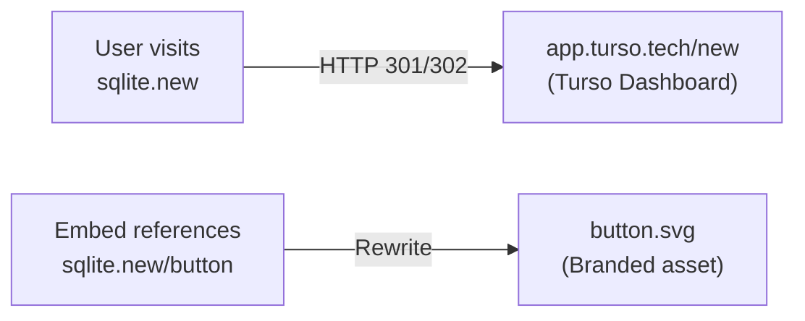
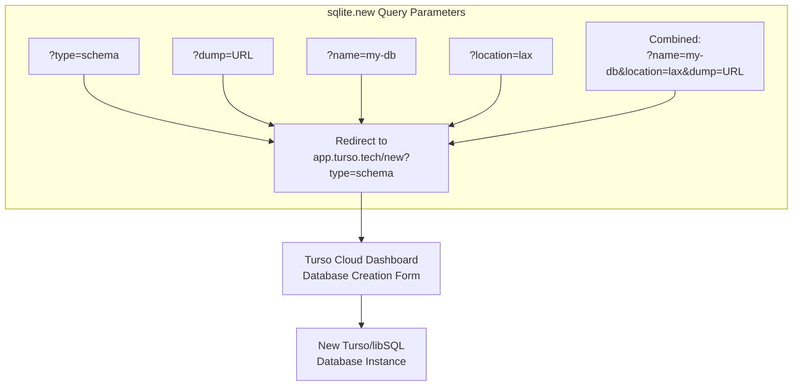
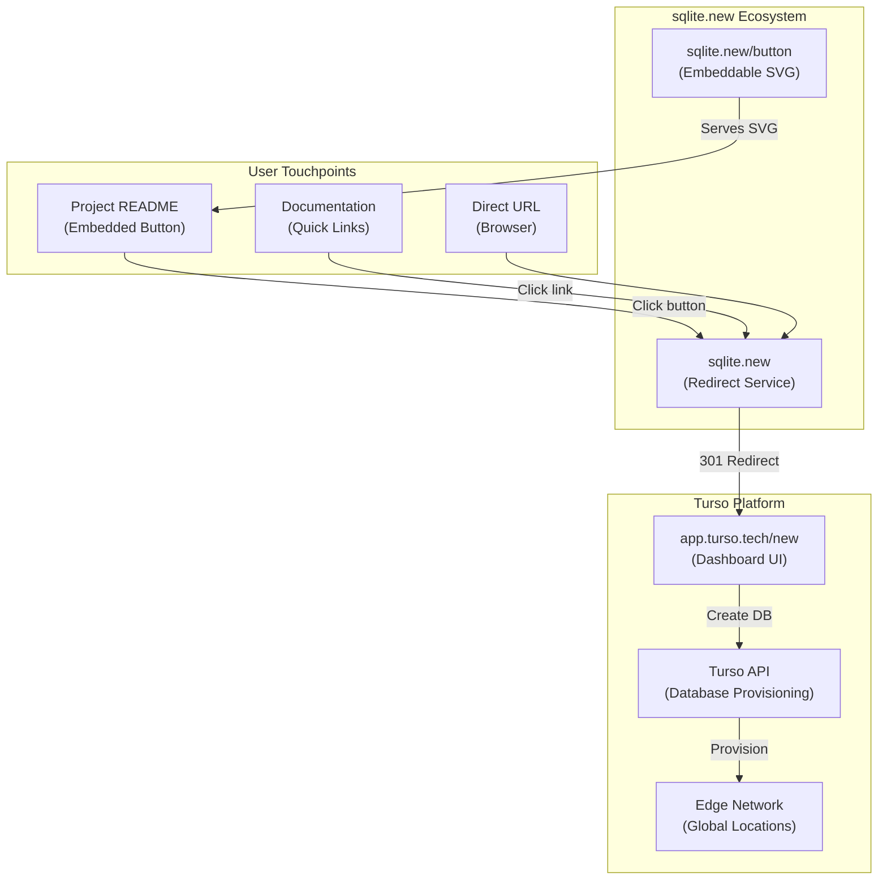
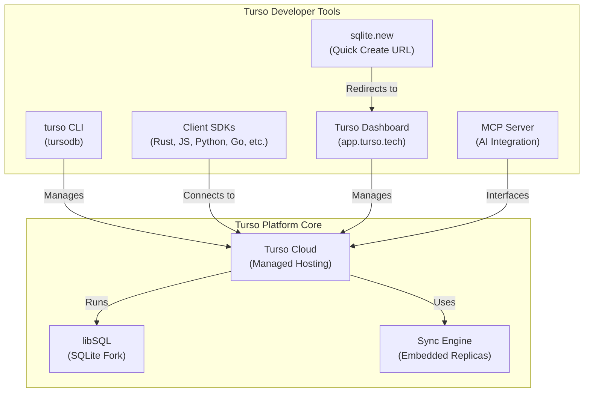

# sqlite.new -- Comprehensive Exploration

## Project Overview

`sqlite.new` is **not** a web-based SQLite playground or editor. It is a **lightweight redirect service** hosted on Vercel that provides a memorable, branded URL (`https://sqlite.new`) for creating new databases on the Turso platform. The entire repository consists of a Vercel configuration that redirects visitors to `https://app.turso.tech/new` and serves a branded SVG button asset for embedding in documentation and README files.

The project is intentionally minimal -- 6 commits, 3 functional files (plus `.gitignore`), and zero application code. Its value lies in the `.new` TLD branding convention (similar to `repo.new` for GitHub, `docs.new` for Google Docs) applied to Turso's database creation flow.

**Repository stats:** 7 stars, 2 forks, 6 commits total.

---

## How It Works

The entire service is defined in a single `vercel.json` configuration:

```json
{
  "redirects": [
    {
      "source": "/",
      "destination": "https://app.turso.tech/new"
    }
  ],
  "rewrites": [
    {
      "source": "/button",
      "destination": "/button.svg"
    }
  ]
}
```

Two routes are defined:

1. **`/` (root)** -- Redirects to `https://app.turso.tech/new`, the Turso Cloud dashboard's database creation page.
2. **`/button`** -- Rewrites to serve `button.svg`, a branded "Create Database" button graphic.



---

## Repository Structure

```
sqlite.new/
  .git/              # Git metadata
  .gitignore         # Ignores .vercel/
  public/
    button.svg       # Branded "Create Database" SVG button
  README.md          # Documentation with embed snippets
  vercel.json        # Redirect and rewrite rules
```

There is no `package.json`, no `node_modules`, no build step. This is a static Vercel deployment with configuration-only routing.

---

## Query Parameter Pass-Through

When users visit `sqlite.new` with query parameters, these are passed through the redirect to `app.turso.tech/new`. The README documents four supported parameters:

| Parameter  | Purpose | Example |
|------------|---------|---------|
| `type`     | Set database type (e.g., `schema` for multi-db schema support) | `?type=schema` |
| `dump`     | URL-encoded path to an existing SQLite dump file to seed the database | `?dump=https%3A%2F%2Fmysite.com%2Ffile.db` |
| `name`     | Pre-fill the database name | `?name=my-new-database` |
| `location` | Select primary geographic location (e.g., `lax`, `iad`, `fra`) | `?location=lax` |



---

## Turso Cloud Database Creation (Destination)

When a user lands on `app.turso.tech/new` (the redirect target), they encounter a full database creation interface:

- **Database name input** -- auto-generated or user-specified
- **Location selector** -- choose from Turso's global edge network of locations
- **Schema upload** -- optional schema file for pre-configuring the database structure
- **Authentication** -- requires sign-in/sign-up to create a database
- **Dark/light mode** -- theme toggle support

The database created is a **Turso-hosted libSQL instance** -- a fork of SQLite with added features like embedded replicas, vector search, and multi-tenancy schemas.



---

## The Button Asset

The `public/button.svg` is a 149x31 pixel SVG graphic with:
- A rounded rectangle (6px border radius) with a green-to-dark-teal linear gradient (`#4b997f` to `#183840`)
- White text reading "Create Database" in a custom path-based font rendering
- The Turso skull/logo icon on the left side

This button is designed for embedding in GitHub READMEs, documentation sites, and blog posts using standard Markdown or HTML image syntax:

```markdown
[](https://sqlite.new)
```

---

## Git History

The repository has exactly 6 commits, reflecting its minimal and stable nature:

| Commit | Description |
|--------|-------------|
| `6673219` | Initial commit: add redirect |
| `a1a326b` | Update vercel.json |
| `27ab349` | Update vercel.json |
| `a969d96` | Update README.md |
| `e5f97c1` | Update README.md |
| `d670eec` | Update button.svg |

---

## Integration with Turso Ecosystem

`sqlite.new` fits into the broader Turso ecosystem as a **developer experience convenience layer**:



Key ecosystem relationships:
- **turso CLI** (`tursodb`) -- full-featured CLI for database management, queries, and interactive SQL shell
- **libSQL** -- the underlying SQLite-compatible database engine
- **Turso Cloud** -- managed hosting platform that `sqlite.new` redirects into
- **Client SDKs** -- language-specific libraries for connecting to Turso databases
- **Embedded replicas** -- local SQLite replicas that sync with Turso Cloud

---

## Technical Decisions and Design Philosophy

1. **Zero application code** -- The entire project is a Vercel config file. No JavaScript, no framework, no build step. This is the most minimal possible implementation of a redirect service.

2. **`.new` TLD convention** -- Google operates the `.new` TLD and allows services to register domains for "creation" actions. `sqlite.new` follows this pattern alongside `repo.new` (GitHub), `gist.new`, `docs.new`, etc.

3. **SVG button as rewrite, not redirect** -- The `/button` path uses a Vercel rewrite (not redirect) so that `https://sqlite.new/button` serves the SVG directly. This is important for Markdown image embeds, which need the image content at the URL, not a redirect.

4. **Query parameter forwarding** -- Vercel's redirect behavior preserves query strings, enabling the `type`, `dump`, `name`, and `location` parameters documented in the README to pass through to the Turso dashboard.

5. **No SQLite in the browser** -- Despite what the name might suggest, `sqlite.new` does not run SQLite in WebAssembly or provide a browser-based SQL editor. It is purely a redirect to Turso's cloud database creation flow.

---

## Summary

`sqlite.new` is a minimal redirect service that maps the memorable URL `https://sqlite.new` to Turso's database creation page at `https://app.turso.tech/new`. It also provides an embeddable SVG button for documentation and README files. The project contains no application logic -- just a `vercel.json` with one redirect rule and one rewrite rule, plus a branded SVG asset. Its purpose is developer experience: making it trivial to create a new Turso/libSQL database via a short, memorable URL that can be shared, embedded, and parameterized.
