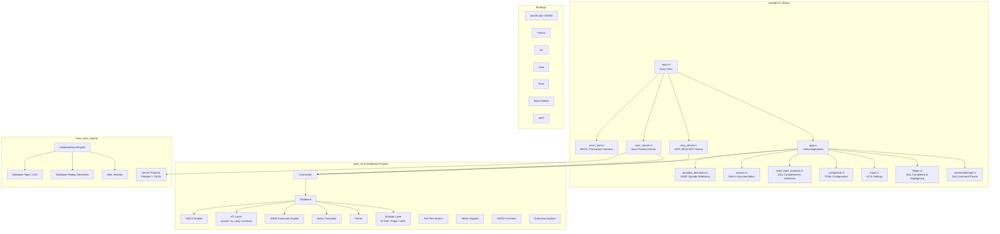
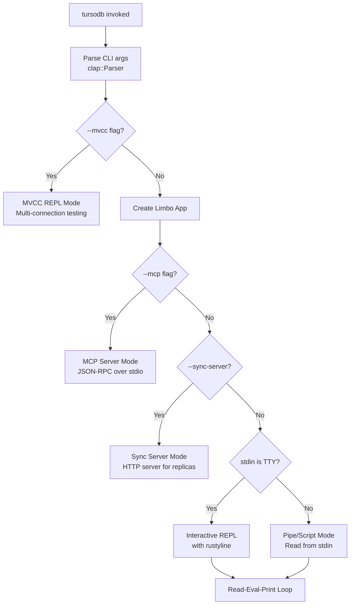
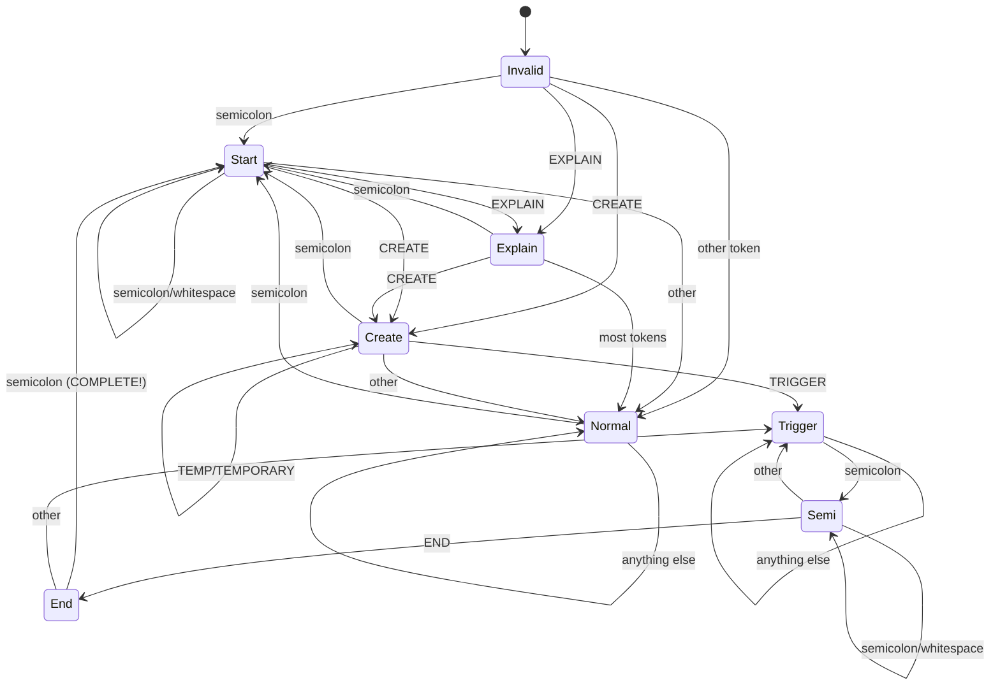
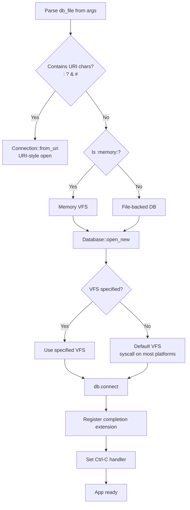
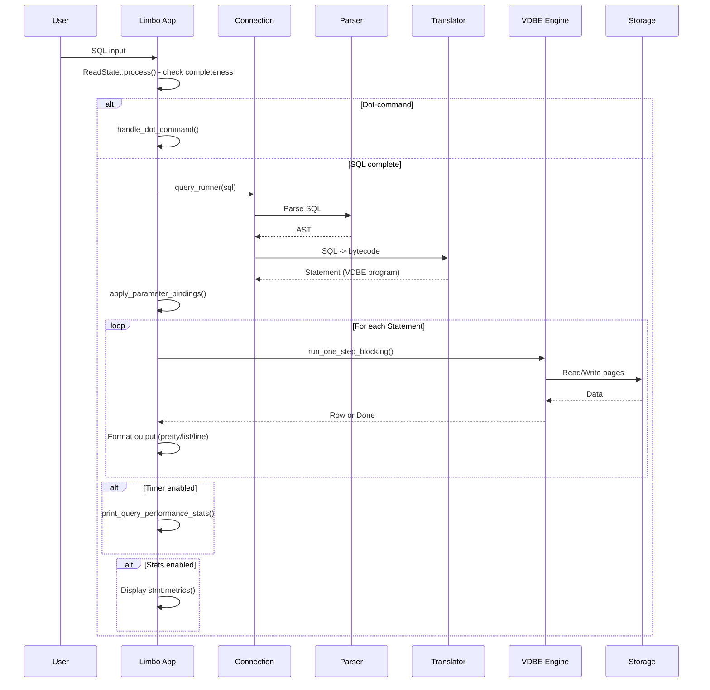
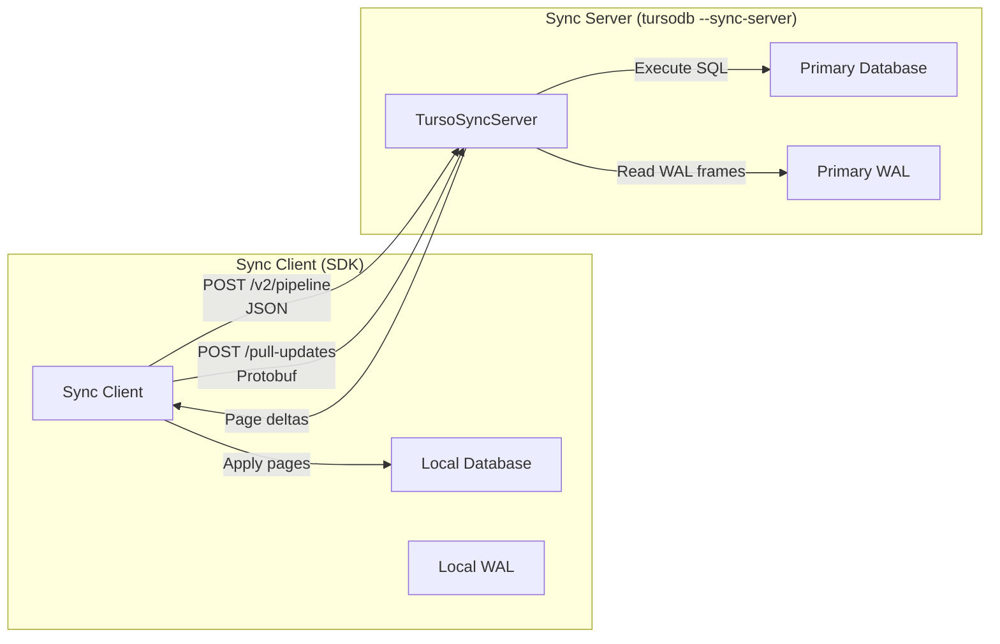
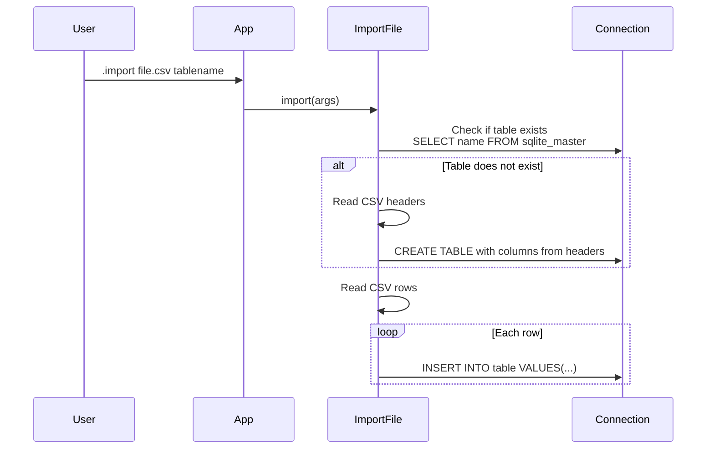

# Turso Database CLI (tursodb) -- Comprehensive Exploration

## Project Overview

Turso Database (formerly Limbo) is an **in-process SQL database engine** written in Rust, designed as a SQLite-compatible replacement. The `tursodb` CLI is the interactive SQL shell that ships with the project -- analogous to `sqlite3` for SQLite. The project is far more than just a CLI; it is a full database engine with its own storage layer, query planner, VDBE (Virtual Database Engine), parser, sync engine, and multi-language bindings (Go, JavaScript/WASM, Python, Java, .NET, React Native, Rust, Tcl).

**Current version:** `0.6.0-pre.5` (beta)

**Key distinguishing features:**
- SQLite file format and SQL dialect compatibility
- Written entirely in Rust with async I/O support (`io_uring` on Linux)
- Built-in sync engine for embedded replicas (Turso Cloud protocol compatible)
- MCP (Model Context Protocol) server mode for AI tool integration
- MVCC with `BEGIN CONCURRENT` for improved write throughput
- Change Data Capture (CDC)
- Encryption at rest
- Full-text search (via tantivy)
- Vector support
- Materialized views (experimental)
- Custom types (experimental)

---

## Architecture



---

## Directory Structure

```
turso/
+-- cli/                          # The tursodb CLI application
|   +-- main.rs                   # Entry point - mode selection (interactive/MCP/sync)
|   +-- app.rs                    # Core application struct (Limbo) and command dispatch
|   +-- commands/
|   |   +-- mod.rs                # Dot-command enum (clap-derived)
|   |   +-- args.rs               # Argument definitions for dot-commands
|   |   +-- import.rs             # CSV import implementation
|   +-- config/
|   |   +-- mod.rs                # TOML config parsing (table colors, highlighting)
|   |   +-- palette.rs            # Color parsing (hex, ANSI 256, named colors)
|   |   +-- terminal.rs           # Terminal theme detection (light/dark)
|   +-- helper.rs                 # Rustyline helper: SQL completion + syntax highlighting
|   +-- input.rs                  # I/O backends, output modes, settings struct
|   +-- manual.rs                 # Built-in manual viewer (termimad pager)
|   +-- mcp_server.rs             # MCP (Model Context Protocol) JSON-RPC server
|   +-- sync_server.rs            # Turso sync protocol HTTP server
|   +-- mvcc_repl.rs              # Multi-connection MVCC transaction testing REPL
|   +-- read_state_machine.rs     # SQL statement completeness detection (trigger-aware)
|   +-- opcodes_dictionary.rs     # 189 VDBE opcode descriptions
|   +-- build.rs                  # Syntect SQL syntax set generation
|   +-- manuals/                  # Embedded markdown documentation
|   |   +-- cdc.md, encryption.md, vector.md, mcp.md, etc.
|   +-- docs/config.md            # Configuration documentation
+-- core/                         # turso_core: the database engine
|   +-- connection.rs, lib.rs     # Connection and Database types
|   +-- storage/                  # B-Tree, buffer pool, pager, WAL
|   +-- translate/                # SQL -> VDBE bytecode translation
|   +-- vdbe/                     # Virtual Database Engine (bytecode VM)
|   +-- io/                       # I/O layer (syscall, io_uring, memory, VFS)
|   +-- mvcc/                     # Multi-Version Concurrency Control
|   +-- json/                     # JSON functions (jsonb format)
|   +-- functions/                # Built-in SQL functions
|   +-- index_method/             # Index implementations (B-Tree, FTS, vector)
|   +-- incremental/              # DBSP incremental computation / materialized views
|   +-- ext/                      # Extension loading (dynamic .so/.dylib)
+-- parser/                       # SQL parser (turso_parser)
+-- sync/
|   +-- engine/                   # turso_sync_engine: sync protocol implementation
|   |   +-- database_sync_engine.rs     # Main sync engine
|   |   +-- server_proto.rs             # Protobuf + JSON protocol definitions
|   |   +-- wal_session.rs              # WAL-based sync session
|   |   +-- database_tape.rs            # CDC tape for change tracking
|   +-- sdk-kit/                  # Sync SDK kit for bindings
+-- bindings/                     # Language bindings
|   +-- rust/, go/, javascript/, python/, java/, dotnet/, react-native/, tcl/
+-- extensions/                   # Loadable extensions
|   +-- completion/, core/, crypto/, csv/, fuzzy/, ipaddr/, percentile/, regexp/
+-- testing/                      # Test infrastructure
|   +-- simulator/, stress/, sqltests/, differential-oracle/
+-- Cargo.toml                    # Workspace root (44 workspace members)
```

---

## CLI Modes of Operation

The `tursodb` binary operates in four distinct modes, selected at startup:



### 1. Interactive REPL (Default)

The primary mode. Uses `rustyline` for line editing with:
- SQL syntax highlighting (via `syntect` with a custom SQL Sublime syntax definition)
- Tab completion for SQL keywords, table names, column names, and dot-commands
- History persistence at `~/.limbo_history`
- Multi-line input detection via a state machine that understands SQL statement boundaries including trigger bodies
- Configurable colors via `~/.config/limbo/limbo.toml`
- Terminal theme auto-detection (light/dark)

### 2. MCP Server Mode (`--mcp`)

Implements the Model Context Protocol (MCP) specification version `2024-11-05` over stdio JSON-RPC. Exposes 9 tools to AI assistants:

| Tool | Description |
|------|-------------|
| `open_database` | Open or create a database file |
| `current_database` | Get path of currently open database |
| `list_tables` | List all tables in the database |
| `describe_table` | Get table schema via PRAGMA table_info |
| `execute_query` | Execute read-only SELECT queries |
| `insert_data` | Execute INSERT statements |
| `update_data` | Execute UPDATE statements |
| `delete_data` | Execute DELETE statements |
| `schema_change` | Execute CREATE/ALTER/DROP statements |

Each tool validates the SQL statement type before execution (e.g., `execute_query` only allows SELECT).

### 3. Sync Server Mode (`--sync-server <address>`)

Runs an HTTP server implementing the Turso sync protocol with two endpoints:

- **`POST /v2/pipeline`** -- Executes SQL statements via the Hrana-like pipeline protocol (JSON request/response). Supports both single `Execute` and `Batch` requests with conditional execution via `BatchCond`.
- **`POST /pull-updates`** -- Serves WAL frame updates to sync clients via Protobuf. Clients send their current revision and receive only the delta of WAL frames since that revision. Supports page selectors via RoaringBitmap for partial sync.

The server disables WAL auto-checkpoint on startup and handles connections sequentially (single-threaded with non-blocking accept).

### 4. MVCC REPL (`--mvcc`, requires `mvcc_repl` feature)

A specialized REPL for testing concurrent MVCC transactions. Syntax: `connN SQL` where N is a connection identifier. Connections are lazily created. Used for testing `BEGIN CONCURRENT` semantics and write-write conflict detection.

---

## Dot-Commands

All interactive dot-commands are defined via a `clap`-derived enum (`Command`), parsed as multicall subcommands. This gives them argument validation, help text, and tab completion for free.

| Command | Aliases | Description |
|---------|---------|-------------|
| `.exit [CODE]` | `.ex`, `.exi` | Exit with return code |
| `.quit` | `.q`, `.qu`, `.qui` | Quit the shell |
| `.open PATH [VFS]` | -- | Open a database file |
| `.schema [TABLE]` | -- | Display schema for table(s) |
| `.output [FILE]` | -- | Redirect output to file or stdout |
| `.mode MODE` | -- | Set output mode: `list`, `pretty`, `line` |
| `.opcodes [NAME]` | -- | Show VDBE opcode descriptions (189 opcodes) |
| `.cd DIR` | -- | Change working directory |
| `.show` | -- | Display current settings |
| `.nullvalue STRING` | -- | Set NULL display value for list mode |
| `.echo on\|off` | -- | Toggle command echo before execution |
| `.tables [PATTERN]` | -- | List tables (optional pattern filter) |
| `.databases` | -- | List attached databases |
| `.import FILE TABLE` | -- | Import CSV data into a table |
| `.load PATH` | -- | Load extension library (.so/.dylib) |
| `.dump` | -- | Dump database as SQL statements |
| `.dbconfig [KEY] [on\|off]` | -- | Print/set database configuration (currently ignored) |
| `.stats [on\|off] [-r]` | -- | Display/toggle database statistics |
| `.vfslist` | -- | List available VFS modules |
| `.indexes [TABLE]` | -- | Show indexes |
| `.timer on\|off` | -- | Toggle query timing display |
| `.headers on\|off` | -- | Toggle column headers in list mode |
| `.clone FILE` | -- | Clone current database to file |
| `.manual [PAGE]` | `.man` | View built-in documentation |
| `.read FILE` | -- | Execute SQL from a file |
| `.parameter set\|list\|clear` | `.param` | Manage SQL parameter bindings |
| `.dbtotxt [--page N]` | -- | Dump database pages as text |

---

## CLI Arguments

```
tursodb [OPTIONS] [DATABASE] [SQL]
```

| Flag | Description |
|------|-------------|
| `DATABASE` | SQLite database file path (default: `:memory:`) |
| `SQL` | Optional SQL command to execute then exit |
| `-m, --output-mode` | Output mode: `list`, `pretty` (default), `line` |
| `-o, --output` | Output file (empty = stdout) |
| `-q, --quiet` | Suppress startup messages |
| `-e, --echo` | Print commands before execution |
| `-v, --vfs` | VFS selection: `io_uring`, `memory`, `syscall`, `experimental_win_iocp` |
| `--readonly` | Open database in read-only mode |
| `--mcp` | Start MCP server instead of interactive shell |
| `--sync-server ADDR` | Start sync server at given address |
| `-t, --tracing-output` | Output file for log traces |
| `--experimental-views` | Enable materialized views |
| `--experimental-custom-types` | Enable CREATE TYPE / DROP TYPE |
| `--experimental-encryption` | Enable encryption at rest |
| `--experimental-index-method` | Enable experimental index methods |
| `--experimental-autovacuum` | Enable autovacuum |
| `--experimental-attach` | Enable ATTACH |
| `--unsafe-testing` | Enable unsafe testing features |

---

## SQL Statement Completeness Detection

The `ReadState` state machine (`read_state_machine.rs`) determines when user input constitutes a complete SQL statement. This is critical for the multi-line REPL experience. The state machine is modeled after SQLite's `sqlite3_complete()` from `src/complete.c`.



The key insight is that `CREATE TRIGGER` bodies contain semicolons that do NOT terminate the statement. Only the pattern `;END;` ends a trigger definition. The tokenizer also correctly handles string literals, quoted identifiers, and comments (both `--` line comments and `/* */` block comments).

---

## Configuration System

Configuration is loaded from `~/.config/limbo/limbo.toml` (TOML format) and validated with the `validator` crate. The config schema is also exported via `schemars` for JSON Schema generation.

```toml
[table]
column_colors = ["cyan", "black", "#010101"]
header_color = "red"

[highlight]
enable = true
prompt = "bright-blue"
theme = "base16-ocean.light"
hint = "123"         # ANSI 256 color code
candidate = "dark-yellow"
```

**Color formats supported:** `#rrggbb`, `#rgb`, ANSI 256 codes (`"100"`), named colors (`"red"`, `"bright-blue"`, `"dark-cyan"`, etc.)

**Theme system:** Four built-in themes (`base16-ocean.dark`, `base16-eighties.dark`, `base16-mocha.dark`, `base16-ocean.light`). Custom `.tmTheme` files can be placed in `~/.config/limbo/themes/`.

**Terminal theme detection:** The CLI auto-detects whether the terminal has a light or dark background and selects appropriate default colors. On unsupported platforms (e.g., Windows), colors are disabled.

---

## Database Engine Integration

The CLI creates a `turso_core::Database` and obtains a `turso_core::Connection`. The connection is wrapped in `Arc` for sharing with interrupt handlers and the helper thread.

### Database Opening Flow



### DatabaseOpts

The `DatabaseOpts` struct controls which experimental features are enabled per-database:

- `with_views()` -- Materialized views
- `with_custom_types()` -- CREATE TYPE / DROP TYPE
- `with_encryption()` -- Encryption at rest
- `with_index_method()` -- Experimental index methods (vector, FTS)
- `with_autovacuum()` -- Auto-vacuum
- `with_attach()` -- ATTACH database support
- `with_unsafe_testing()` -- Unsafe testing features

---

## Query Execution Pipeline



### Output Modes

- **Pretty** (default): Table format with colored headers and columns using `comfy-table`. Only available when writing to a TTY.
- **List**: Pipe-delimited values, suitable for scripting.
- **Line**: One value per line with column name prefix.

Special rendering for `EXPLAIN` (formatted VDBE bytecode with indentation tracking for subroutines) and `EXPLAIN QUERY PLAN` (tree-structured output with `|--` and `` `-- `` prefixes).

---

## Sync Protocol

The sync engine (`turso_sync_engine`) implements the Turso Cloud replication protocol, enabling embedded replicas to sync with a primary database.

### Protocol Components



### Pipeline Protocol (`/v2/pipeline`)

The pipeline protocol uses JSON and supports:
- **Execute requests**: Single SQL statement execution with positional and named args
- **Batch requests**: Multiple statements with conditional execution using `BatchCond`:
  - `Ok { step }` -- Execute if step N succeeded
  - `Error { step }` -- Execute if step N failed
  - `Not { cond }` -- Negate a condition
  - `And` / `Or` -- Combine conditions
  - `IsAutocommit` -- Check if in autocommit mode

### Pull Updates Protocol (`/pull-updates`)

Uses Protobuf (via `prost`) for efficient binary transfer:
1. Client sends `PullUpdatesReqProtoBody` with its current revision and optional page selector (RoaringBitmap)
2. Server reads WAL frames from `client_revision + 1` to `server_revision` in reverse order (latest first)
3. De-duplicates pages (keeps only the latest version of each page)
4. Returns `PullUpdatesRespProtoBody` header + length-delimited `PageData` messages
5. Each page is 4096 bytes, identified by 0-based page ID

---

## Extension System

The CLI supports loadable extensions via `.load PATH`. Extensions are dynamic libraries (`.so` on Linux, `.dylib` on macOS) loaded at runtime.

Built-in extensions compiled as workspace members:
- **completion** -- SQL auto-completion (registered statically at startup)
- **crypto** -- Cryptographic functions
- **csv** -- CSV virtual table
- **fuzzy** -- Fuzzy string matching
- **ipaddr** -- IP address functions
- **percentile** -- Percentile aggregate functions
- **regexp** -- Regular expression support

---

## Built-in Manual System

The `.manual` command provides an in-shell documentation viewer. Manual pages are markdown files embedded at compile time via `include_dir!`. They render in an alternate screen buffer using `termimad` with keyboard navigation (scroll, page up/down, quit).

Available manual pages:
- `cdc` -- Change Data Capture
- `custom-types` -- Custom type system
- `encryption` -- Encryption at rest
- `index` -- Index of all manual pages
- `materialized-views` -- Materialized/incremental views
- `mcp` -- Model Context Protocol server
- `vector` -- Vector operations and search

On startup, the CLI displays a random "Did you know?" hint referencing one of these manual pages.

---

## Parameter Bindings

The `.parameter` system allows setting named and positional parameter values that are automatically bound to subsequent queries:

```sql
turso> .parameter set :name 'Alice'
turso> .parameter set ?1 42
turso> SELECT * FROM users WHERE name = :name AND id = ?1;
```

Parameter names are validated to match SQLite's parameter syntax: `:name`, `@name`, `$name`, or `?N` (positional). Values are parsed as NULL, integer, float, or text.

Bindings persist for the session and are applied to every `Statement` before execution via `stmt.bind_at()`.

---

## Performance Instrumentation

Two levels of performance tracking:

### Query Timer (`.timer on`)
Tracks per-query wall time, split into:
- **Execution time**: Time spent in VDBE bytecode execution
- **I/O time**: Time spent in I/O operations

Uses callback-based sampling during `run_one_step_blocking()` to separate execution from I/O.

### Database Statistics (`.stats on`)
Displays `stmt.metrics()` after each query, showing engine-level statistics. The `.stats` command also supports `--reset` to clear accumulated counters.

---

## I/O Layer

The CLI supports multiple I/O backends selected via `--vfs`:

| Backend | Platform | Description |
|---------|----------|-------------|
| `syscall` | All | Standard blocking I/O (default) |
| `io_uring` | Linux | Async I/O via io_uring (feature-gated) |
| `memory` | All | In-memory database |
| `experimental_win_iocp` | Windows | Windows I/O Completion Ports (feature-gated) |

The I/O layer is abstracted via the `turso_core::IO` trait, allowing the database engine to be completely agnostic about the underlying I/O mechanism.

---

## Build System

The workspace has 44 members managed by a single `Cargo.toml`. The CLI specifically:

1. **Build script** (`build.rs`): Pre-compiles the SQL syntax definition (`SQL.sublime-syntax`) into a binary `syntect` syntax set at build time for fast startup.
2. **Feature flags**:
   - `io_uring` (default on Linux) -- io_uring I/O backend
   - `mimalloc` (default) -- Use mimalloc allocator
   - `fts` -- Full-text search support
   - `mvcc_repl` -- Enable MVCC testing REPL
   - `tracing_release` -- Tracing in release builds
   - `experimental_win_iocp` -- Windows IOCP support
3. **Release profiles**: `release-official` uses LTO + single codegen unit for maximum optimization; `lib-release` optimizes for binary size for SDK bindings.

---

## Testing

The CLI has integration tests in `cli/tests/`:
- `non_interactive_exit_code.rs` -- Verifies exit codes for pipe mode
- `parameter_bindings.rs` -- Tests parameter binding functionality

The broader project has extensive testing infrastructure:
- **Simulator** (`testing/simulator/`) -- Deterministic simulation testing
- **Stress tests** (`testing/stress/`) -- Concurrent stress testing
- **Differential oracle** (`testing/differential-oracle/`) -- Fuzz testing against SQLite
- **SQL conformance** (`testing/sqltests/`) -- SQL test suite
- **Antithesis** -- Chaos engineering integration

---

## Key Dependencies

| Crate | Purpose |
|-------|---------|
| `clap` 4.5 | CLI argument parsing with derive macros |
| `clap_complete` | Dynamic tab completion |
| `rustyline` 15.0 | Line editing with history |
| `syntect` | SQL syntax highlighting |
| `comfy-table` | Pretty table output |
| `nu-ansi-term` | Terminal color formatting |
| `miette` | Fancy error reporting with source spans |
| `termimad` | Markdown rendering in terminal |
| `toml` / `toml_edit` | Configuration file parsing |
| `schemars` | JSON Schema generation for config |
| `serde` / `serde_json` | Serialization (MCP, sync protocol) |
| `prost` | Protobuf encoding/decoding (sync protocol) |
| `roaring` | RoaringBitmap for page selectors |
| `mimalloc` | Memory allocator |
| `ctrlc` | Ctrl-C signal handling |
| `csv` | CSV import parsing |
| `tracing` / `tracing-subscriber` | Structured logging |

---

## Data Flow: CSV Import



---

## Data Flow: Database Clone

The `.clone` command creates a backup copy of the current database by:
1. Reading database metadata via PRAGMAs (`page_size`, `page_count`, `database_list`)
2. Iterating all pages via `sqlite_dbpage` virtual table
3. Writing raw page data to the output file

---

## Notable Design Decisions

1. **Unsafe string buffer management**: The `consume()` method uses unsafe pointer arithmetic to avoid allocation when splitting the input buffer between the reusable and consumed portions. The `input_buff` is wrapped in `ManuallyDrop` to control its lifecycle.

2. **Interrupt handling**: A shared `AtomicUsize` counter is incremented on each Ctrl-C. The first interrupt resets the prompt, the second exits. The interrupt count is also checked by the MCP and sync servers for graceful shutdown.

3. **Naming legacy**: Internal code still uses "Limbo" names (`LimboHelper`, `Limbo` struct, `limbo_history`, `limbo.toml`) -- reflecting the project's recent rename from Limbo to Turso Database.

4. **MCP over stdio**: The MCP server uses blocking stdin reads on a separate thread with a channel, checking for interrupt every 100ms. This avoids blocking the main thread while still supporting graceful shutdown.

5. **Sync server is single-threaded**: The sync server accepts connections one at a time with non-blocking accept + 10ms sleep polling. This is intentional for a development/testing server rather than production use.
