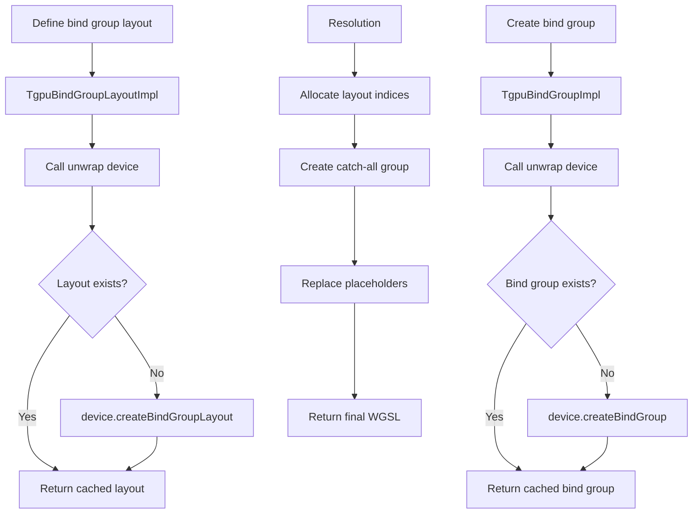

# Bind Groups System - Component Breakdown

## Overview

TypeGPU's bind group system manages WebGPU resource bindings, providing:
- Type-safe bind group layout definitions
- Automatic binding index assignment
- Lazy bind group creation
- Catch-all bind group for fixed resources

## Core Files

```
src/
├── tgpuBindGroupLayout.ts    # Main bind group layout system
└── core/bindGroup/           # Additional bind group utilities
```

## Bind Group Layout Definition

### Layout Entry Types

**File**: `src/tgpuBindGroupLayout.ts`

```typescript
// Base layout entry types
export type TgpuLayoutEntry =
  | TgpuLayoutUniform
  | TgpuLayoutStorage
  | TgpuLayoutSampler
  | TgpuLayoutTexture
  | TgpuLayoutStorageTexture
  | TgpuLayoutExternalTexture;

// Uniform buffer binding
export interface TgpuLayoutUniform {
  buffer: {
    type: 'uniform';
  };
}

// Storage buffer binding
export interface TgpuLayoutStorage {
  buffer: {
    type: 'storage';
    access?: 'read-only' | 'read-write';
  };
}

// Sampler binding
export interface TgpuLayoutSampler {
  sampler: {
    type?: 'filtering' | 'non-filtering' | 'comparison';
  };
}

// Texture binding
export interface TgpuLayoutTexture {
  texture: {
    sampleType?: TextureSampleType;
    viewDimension?: GPUTextureViewDimension;
    multisampled?: boolean;
  };
}

// Storage texture binding
export interface TgpuLayoutStorageTexture {
  storageTexture: {
    format: GPUTextureFormat;
    access?: 'read-only' | 'read-write' | 'write-only';
    viewDimension?: GPUTextureViewDimension;
  };
}
```

### Bind Group Layout Creation

```typescript
// src/tgpuBindGroupLayout.ts
export function bindGroupLayout<
  TEntries extends Record<string, TgpuLayoutEntry>
>(entries: TEntries): TgpuBindGroupLayout<TEntries> {
  return new TgpuBindGroupLayoutImpl(entries);
}

// Implementation class
class TgpuBindGroupLayoutImpl<
  TEntries extends Record<string, TgpuLayoutEntry>
> implements TgpuBindGroupLayout<TEntries> {
  private _layout: GPUBindGroupLayout | undefined;
  private _entries: TEntries;
  private _index?: number;
  private _label?: string;

  constructor(entries: TEntries) {
    this._entries = entries;
  }

  // Lazy WebGPU layout creation
  unwrap(device: GPUDevice): GPUBindGroupLayout {
    if (!this._layout) {
      this._layout = device.createBindGroupLayout({
        label: this._label,
        entries: Object.entries(this._entries).map(([binding, entry]) => ({
          binding: parseInt(binding),
          visibility: this._getVisibility(entry),
          ...this._getBindingType(entry),
        })),
      });
    }
    return this._layout;
  }

  private _getVisibility(entry: TgpuLayoutEntry): GPUShaderStageFlags {
    // Uniform buffers visible in all stages
    if ('buffer' in entry && entry.buffer.type === 'uniform') {
      return GPUShaderStage.VERTEX |
             GPUShaderStage.FRAGMENT |
             GPUShaderStage.COMPUTE;
    }

    // Storage buffers visible in all stages
    if ('buffer' in entry && entry.buffer.type === 'storage') {
      return GPUShaderStage.VERTEX |
             GPUShaderStage.FRAGMENT |
             GPUShaderStage.COMPUTE;
    }

    // Samplers typically only in vertex/fragment
    if ('sampler' in entry) {
      return GPUShaderStage.VERTEX | GPUShaderStage.FRAGMENT;
    }

    // Textures depend on sample type
    if ('texture' in entry) {
      return entry.texture.sampleType === 'storage'
        ? GPUShaderStage.COMPUTE
        : GPUShaderStage.VERTEX | GPUShaderStage.FRAGMENT;
    }

    // Default to all stages
    return GPUShaderStage.VERTEX |
           GPUShaderStage.FRAGMENT |
           GPUShaderStage.COMPUTE;
  }

  private _getBindingType(entry: TgpuLayoutEntry) {
    if ('buffer' in entry) {
      return { buffer: entry.buffer };
    }
    if ('sampler' in entry) {
      return { sampler: entry.sampler };
    }
    if ('texture' in entry) {
      return { texture: entry.texture };
    }
    if ('storageTexture' in entry) {
      return { storageTexture: entry.storageTexture };
    }
    if ('externalTexture' in entry) {
      return { externalTexture: entry.externalTexture };
    }
    throw new Error('Unknown entry type');
  }
}
```

## Bind Group Creation

### Bind Group Implementation

```typescript
// src/tgpuBindGroupLayout.ts
class TgpuBindGroupImpl<
  TEntries extends Record<string, TgpuLayoutEntry>
> implements TgpuBindGroup<TEntries> {
  private _bindGroup: GPUBindGroup | undefined;
  private _layout: TgpuBindGroupLayout<TEntries>;
  private _entries: Record<string, unknown>;
  private _label?: string;

  constructor(
    layout: TgpuBindGroupLayout<TEntries>,
    entries: Record<string, unknown>
  ) {
    this._layout = layout;
    this._entries = entries;
  }

  // Lazy WebGPU bind group creation
  unwrap(device: GPUDevice): GPUBindGroup {
    if (!this._bindGroup) {
      this._bindGroup = device.createBindGroup({
        label: this._label,
        layout: this._layout.unwrap(device),
        entries: Object.entries(this._entries).map(([binding, resource]) => ({
          binding: parseInt(binding),
          resource: this._unwrapResource(resource, device),
        })),
      });
    }
    return this._bindGroup;
  }

  private _unwrapResource(resource: unknown, device: GPUDevice): GPUBindingResource {
    // Buffer bindings
    if (isBuffer(resource)) {
      return resource.unwrap(device);
    }

    // Texture bindings
    if (isTexture(resource)) {
      return resource.unwrap(device).createView();
    }

    // Sampler bindings
    if (isSampler(resource)) {
      return resource.unwrap(device);
    }

    // External texture
    if (isExternalTexture(resource)) {
      return resource.unwrap(device);
    }

    throw new Error(`Unknown resource type: ${resource}`);
  }
}
```

### Creating Bind Groups

```typescript
// Type-safe bind group creation
export function createBindGroup<
  TLayout extends TgpuBindGroupLayout
>(
  layout: TLayout,
  entries: {
    [K in keyof TLayout['entries']]: BindingResourceFor<TLayout['entries'][K]>;
  }
): TgpuBindGroup<TLayout> {
  return new TgpuBindGroupImpl(layout, entries);
}

// Resource type mapping
type BindingResourceFor<TEntry extends TgpuLayoutEntry> =
  TEntry extends TgpuLayoutUniform ? TgpuBufferUniform<AnyData> :
  TEntry extends TgpuLayoutStorage ? TgpuBufferReadonly<AnyData> | TgpuBufferMutable<AnyData> :
  TEntry extends TgpuLayoutSampler ? TgpuSampler :
  TEntry extends TgpuLayoutTexture ? TgpuTexture :
  TEntry extends TgpuLayoutStorageTexture ? TgpuTexture :
  never;
```

## Automatic Index Assignment

### Catch-All Bind Group

**Problem**: Not all resources need explicit bind group layouts. TypeGPU creates a catch-all bind group for fixed resources.

```typescript
// src/resolutionCtx.ts
const CATCHALL_BIND_GROUP_IDX_MARKER = '#CATCHALL#';

class ResolutionCtxImpl {
  readonly fixedBindings: FixedBindingConfig[] = [];

  allocateFixedEntry(
    layoutEntry: TgpuLayoutEntry,
    resource: object
  ): { group: string; binding: number } {
    const binding = this.fixedBindings.length;
    this.fixedBindings.push({ layoutEntry, resource });

    return {
      group: CATCHALL_BIND_GROUP_IDX_MARKER,  // Placeholder
      binding,
    };
  }
}

// After resolution, create catch-all group
function createCatchallGroup(
  ctx: ResolutionCtxImpl,
  automaticIds: Iterator<number>
): [number, TgpuBindGroup] {
  const catchallIdx = automaticIds.next().value;

  const layoutEntries = ctx.fixedBindings.map(
    (binding, idx) => [String(idx), binding.layoutEntry] as [string, TgpuLayoutEntry]
  );

  const catchallLayout = bindGroupLayout(Object.fromEntries(layoutEntries));

  const catchallBindGroup = new TgpuBindGroupImpl(
    catchallLayout,
    Object.fromEntries(
      ctx.fixedBindings.map(
        (binding, idx) => [String(idx), binding.resource] as [string, any]
      )
    )
  );

  return [catchallIdx, catchallBindGroup];
}
```

### Layout Index Management

```typescript
// src/resolutionCtx.ts
function resolve(item: Wgsl): ResolutionResult {
  const ctx = new ResolutionCtxImpl(options);
  let code = ctx.resolve(item);

  const memoMap = ctx.bindGroupLayoutsToPlaceholderMap;
  const bindGroupLayouts: TgpuBindGroupLayout[] = [];

  // Collect explicitly indexed layouts
  const takenIndices = new Set<number>(
    [...memoMap.keys()]
      .map(layout => layout.index)
      .filter((v): v is number => v !== undefined)
  );

  // Generate automatic indices for remaining layouts
  const automaticIds = naturalsExcept(takenIndices);

  // Create catch-all group first (least likely to be swapped)
  const catchall = ctx.fixedBindings.length > 0
    ? createCatchallGroup(ctx, automaticIds)
    : null;

  // Assign indices to explicit layouts
  for (const [layout, placeholder] of memoMap.entries()) {
    const idx = layout.index ?? automaticIds.next().value;
    bindGroupLayouts[idx] = layout;
    code = code.replaceAll(placeholder, String(idx));
  }

  return {
    code,
    bindGroupLayouts,
    catchall,
  };
}
```

## Usage Examples

### Uniform Buffer Binding

```typescript
// Define layout
const configLayout = bindGroupLayout({
  config: {
    buffer: {
      type: 'uniform',
    },
  },
});

// Create buffer
const configBuffer = tgpu
  .buffer({
    time: f32,
    resolution: vec2f,
  })
  .$usage('uniform');

// Create bind group
const configBindGroup = configLayout.populate({
  config: configBuffer,
});

// WGSL binding
// @group(0) @binding(0)
// var<uniform> config: Config;
```

### Storage Buffer Binding

```typescript
// Define layout
const particleLayout = bindGroupLayout({
  particles: {
    buffer: {
      type: 'storage',
      access: 'read-write',
    },
  },
});

// Create buffer
const particleBuffer = tgpu
  .buffer(arrayOf(particleStruct, 1000))
  .$usage('storage');

// Create bind group
const particleBindGroup = particleLayout.populate({
  particles: particleBuffer,
});

// WGSL binding
// @group(1) @binding(0)
// var<storage, read_write> particles: array<Particle>;
```

### Texture and Sampler Binding

```typescript
// Define layout
const textureLayout = bindGroupLayout({
  colorTexture: {
    texture: {
      sampleType: 'float',
      viewDimension: '2d',
    },
  },
  textureSampler: {
    sampler: {
      type: 'filtering',
    },
  },
});

// Create resources
const colorTexture = tgpu.texture({
  size: [512, 512],
  format: 'rgba8unorm',
  usage: GPUTextureUsage.TEXTURE_BINDING | GPUTextureUsage.RENDER_ATTACHMENT,
});

const sampler = tgpu.sampler({
  magFilter: 'linear',
  minFilter: 'linear',
});

// Create bind group
const textureBindGroup = textureLayout.populate({
  colorTexture,
  textureSampler: sampler,
});

// WGSL binding
// @group(0) @binding(0)
// var colorTexture: texture_2d<f32>;
// @group(0) @binding(1)
// var textureSampler: sampler;
```

## Execution Flow



## Type Safety

### Entry Type Validation

```typescript
// Ensure bind group entries match layout
type ValidateEntries<
  TLayout extends TgpuBindGroupLayout,
  TEntries
> = {
  [K in keyof TEntries]:
    K extends keyof TLayout['entries']
      ? BindingResourceFor<TLayout['entries'][K]>
      : never;
};

// Compile-time validation
function createBindGroup<
  TLayout extends TgpuBindGroupLayout
>(
  layout: TLayout,
  entries: ValidateEntries<TLayout, TEntries>
): TgpuBindGroup<TLayout> {
  // Implementation
}
```

### Buffer Usage Validation

```typescript
// Ensure buffer usage matches binding type
type CompatibleBufferUsage<TEntry extends TgpuLayoutEntry> =
  TEntry extends TgpuLayoutUniform ? 'uniform' :
  TEntry extends TgpuLayoutStorage ? 'storage' :
  never;

// Usage validation
function bindBuffer<
  TBuffer extends TgpuBuffer<AnyData>,
  TEntry extends TgpuLayoutEntry
>(
  buffer: TBuffer,
  entry: TEntry
): void where TBuffer['usage'] extends CompatibleBufferUsage<TEntry> {
  // Only compiles if usage is compatible
}
```

## WebGPU API Mapping

### Exact WebGPU Calls

```typescript
// Create bind group layout
const layout = device.createBindGroupLayout({
  label: 'MyLayout',
  entries: [
    {
      binding: 0,
      visibility: GPUShaderStage.VERTEX | GPUShaderStage.FRAGMENT,
      buffer: {
        type: 'uniform',
      },
    },
  ],
});

// Create bind group
const bindGroup = device.createBindGroup({
  label: 'MyBindGroup',
  layout: layout,
  entries: [
    {
      binding: 0,
      resource: buffer.unwrap(device),
    },
  ],
});
```

### Visibility Flags

```typescript
// WebGPU shader stage flags
GPUShaderStage = {
  NONE: 0,
  VERTEX: 0x1,
  FRAGMENT: 0x2,
  COMPUTE: 0x4,
}

// TypeGPU visibility calculation
const visibility =
  GPUShaderStage.VERTEX |
  GPUShaderStage.FRAGMENT |
  GPUShaderStage.COMPUTE;  // All stages
```

## Performance Considerations

### Bind Group Caching

```typescript
// Cache bind groups to avoid recreation
class BindGroupCache {
  private _cache = new Map<string, GPUBindGroup>();

  getOrCreate(
    layout: GPUBindGroupLayout,
    entries: GPUBindingResource[]
  ): GPUBindGroup {
    const key = this._generateKey(layout, entries);

    if (!this._cache.has(key)) {
      this._cache.set(key, device.createBindGroup({
        layout,
        entries: entries.map((resource, i) => ({
          binding: i,
          resource,
        })),
      }));
    }

    return this._cache.get(key)!;
  }
}
```

### Bind Group Swapping

```typescript
// Minimize bind group changes during rendering
function optimizeBindGroupOrder(
  pipelines: TgpuComputePipeline[]
): TgpuBindGroupLayout[] {
  // Group pipelines by shared bind groups
  // Minimize bind group set calls
}
```

## Connections to Other Systems

### Resolution System
- Bind group layouts resolved during shader resolution
- Catch-all bind group created automatically

### Pipeline System
- Bind group layouts used in pipeline layout creation
- Bind groups bound during pass execution

### Buffer System
- Buffers bound to bind groups based on usage
- Usage flags determine compatible binding types
