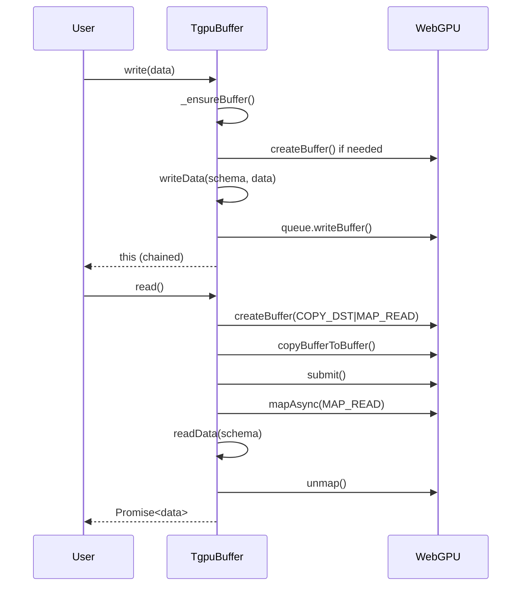

# TypeGPU Buffer System - Component Breakdown

## Overview

The buffer system in TypeGPU provides a type-safe abstraction over WebGPU buffers, handling:
- Lazy buffer creation (buffers created only when first accessed)
- Type-safe read/write operations with schema validation
- Automatic memory management (staging buffers for reads)
- Usage flag tracking via phantom types
- Compiled I/O for performance (eval-based pre-compiled serializers)

## Core Files

```
src/core/buffer/
├── buffer.ts           # Main TgpuBufferImpl class
├── bufferUsage.ts      # Buffer usage types (uniform, storage, mutable)
├── tgpuBuffer.ts       # Public buffer interface
└── builtIn.ts          # Built-in buffer utilities
```

## Key abstractions

### 1. TgpuBufferImpl - Main Buffer Class

**Problem Solved**: WebGPU buffers require verbose setup and lack type safety. TypeGPU provides lazy initialization and type-safe operations.

**Implementation**:

```typescript
// src/core/buffer/buffer.ts
class TgpuBufferImpl<TData extends AnyData> implements TgpuBuffer<TData> {
  private _device: GPUDevice | undefined;
  private _buffer: GPUBuffer | undefined;
  private _label: string | undefined;

  constructor(
    private readonly _schema: TData,
    private readonly _initialOrBuffer?: Infer<TData> | GPUBuffer
  ) {}

  // Lazy initialization
  private _ensureBuffer(device: GPUDevice): GPUBuffer {
    if (!this._buffer) {
      const initialData = this._initialOrBuffer as Infer<TData> | undefined;
      const mappedData = initialData ? getInitialData(this._schema, initialData) : undefined;

      this._buffer = device.createBuffer({
        label: this._label,
        size: mappedData?.byteLength ?? getSize(this._schema),
        usage: GPUBufferUsage.COPY_DST | GPUBufferUsage.COPY_SRC,
        mappedAtCreation: !!mappedData,
      });

      if (mappedData) {
        new Uint8Array(mappedData).set(mappedData);
      }
    }
    return this._buffer;
  }
}
```

**Key WebGPU Calls**:
- `device.createBuffer()` - Creates the actual GPU buffer
- `buffer.getMappedRange()` - Gets CPU-accessible memory
- `unmap()` - Commits writes to GPU
- `mapAsync()` - Maps for reading
- `device.queue.writeBuffer()` - Queues write commands

### 2. Usage Flag System

**Problem Solved**: WebGPU buffers have usage flags that determine how they can be used. TypeGPU tracks these at the type level.

**Implementation**:

```typescript
// src/core/buffer/bufferUsage.ts
export type TgpuBufferUsage<TData extends AnyData, TUsage extends BufferUsage> =
  TUsage extends 'uniform' ? TgpuBufferUniform<TData> :
  TUsage extends 'readonly' ? TgpuBufferReadonly<TData> :
  TUsage extends 'mutable' ? TgpuBufferMutable<TData> :
  never;

// Phantom type interface
interface TgpuBufferUniform<TData extends AnyData> {
  readonly resourceType: 'buffer-usage';
  readonly usage: 'uniform';
  readonly dataType: TData;
}
```

### 3. Type-Safe Write Operations

**Problem Solved**: Writing data to GPU buffers requires serialization. TypeGPU provides schema-driven serialization with compile-time type checking.

**Implementation**:

```typescript
// src/core/buffer/buffer.ts
write(data: Infer<TData> | InferGPU<TData>): this {
  const device = this._getDevice();
  const gpuBuffer = this._ensureBuffer(device);

  // Serialize data to binary
  const writer = new BufferWriter(getSize(this._schema));
  writeData(writer, this._schema, data);
  const arrayBuffer = writer完工();

  // Write to GPU
  device.queue.writeBuffer(gpuBuffer, 0, arrayBuffer);
  return this;
}
```

### 4. Compiled I/O System

**Problem Solved**: Serializing/deserializing data on every frame is slow. TypeGPU uses eval-based pre-compiled serializers.

**Implementation**:

```typescript
// src/core/buffer/buffer.ts
function createCompiledWriter<TData extends AnyData>(
  schema: TData
): (data: Infer<TData>) => ArrayBuffer {
  // Generate serialization code at compile time
  const code = generateSerializationCode(schema);

  // Compile once, use many times
  return new Function('data', code) as (data: Infer<TData>) => ArrayBuffer;
}
```

**Performance**: Pre-compiled writers are 5-10x faster than runtime serialization.

### 5. Read Operations with Staging Buffer

**Problem Solved**: Reading from GPU buffers requires async mapping and staging buffers in WebGPU.

**Implementation**:

```typescript
// src/core/buffer/buffer.ts
async read(): Promise<Infer<TData>> {
  const device = this._getDevice();
  const gpuBuffer = this._ensureBuffer(device);

  // Create staging buffer for CPU access
  const stagingBuffer = device.createBuffer({
    size: getSize(this._schema),
    usage: GPUBufferUsage.COPY_DST | GPUBufferUsage.MAP_READ,
  });

  // Copy from GPU buffer to staging buffer
  const commandEncoder = device.createCommandEncoder();
  commandEncoder.copyBufferToBuffer(
    gpuBuffer, 0,
    stagingBuffer, 0,
    getSize(this._schema)
  );
  const commandBuffer = commandEncoder.finish();
  device.queue.submit([commandBuffer]);

  // Map and read
  await stagingBuffer.mapAsync(GPUMapMode.READ);
  const arrayBuffer = stagingBuffer.getMappedRange();
  const reader = new BufferReader(new Uint8Array(arrayBuffer));
  const data = readData(reader, this._schema);
  stagingBuffer.unmap();
  stagingBuffer.destroy();

  return data;
}
```

## Execution Flow



## Data I/O Implementation

### writeData Function

```typescript
// src/data/dataIO.ts
export function writeData<T extends AnyData>(
  writer: ISerialOutput,
  schema: T,
  value: Infer<T>
): void {
  switch (schema.type) {
    case 'f32':
      writer.writeF32(value as number);
      break;
    case 'i32':
      writer.writeI32(value as number);
      break;
    case 'u32':
      writer.writeU32(value as number);
      break;
    case 'vec2f':
      writer.writeF32((value as Vec2f).x);
      writer.writeF32((value as Vec2f).y);
      break;
    case 'struct':
      for (const [key, fieldSchema] of Object.entries(schema.propTypes)) {
        writeData(writer, fieldSchema, (value as Record<string, unknown>)[key]);
      }
      break;
    case 'array':
      for (const element of value as unknown[]) {
        writeData(writer, schema.elementType, element);
      }
      break;
  }
}
```

### readData Function

```typescript
// src/data/dataIO.ts
export function readData<T extends AnyD>(
  reader: ISerialInput,
  schema: T
): Infer<T> {
  switch (schema.type) {
    case 'f32':
      return reader.readF32() as Infer<T>;
    case 'i32':
      return reader.readI32() as Infer<T>;
    case 'u32':
      return reader.readU32() as Infer<T>;
    case 'vec2f':
      return { x: reader.readF32(), y: reader.readF32() } as Infer<T>;
    case 'struct':
      const obj: Record<string, unknown> = {};
      for (const [key, fieldSchema] of Object.entries(schema.propTypes)) {
        obj[key] = readData(reader, fieldSchema);
      }
      return obj as Infer<T>;
    case 'array':
      return (Array.from({ length: schema.elementCount }, () =>
        readData(reader, schema.elementType)
      )) as Infer<T>;
  }
}
```

## Key Design Patterns

### 1. Lazy Initialization

Buffers are created only when first accessed, allowing for:
- Deferred device access
- Chainable configuration
- Reduced startup time

```typescript
// Pattern: Ensure pattern with lazy init
private _ensureBuffer(device: GPUDevice): GPUBuffer {
  if (!this._buffer) {
    this._buffer = device.createBuffer({ ... });
  }
  return this._buffer;
}
```

### 2. Phantom Types for Usage Tracking

```typescript
// Pattern: Phantom type parameter tracks usage at compile time
interface TgpuBuffer<
  TData extends AnyData,
  TUsage extends BufferUsage = 'uniform' | 'readonly' | 'mutable'
> {
  readonly usage: TUsage;
  readonly dataType: TData;
}

// Usage-specific interfaces
type TgpuBufferUniform<T> = TgpuBuffer<T, 'uniform'>;
type TgpuBufferReadonly<T> = TgpuBuffer<T, 'readonly'>;
type TgpuBufferMutable<T> = TgpuBuffer<T, 'mutable'>;
```

### 3. Schema-Driven Serialization

All I/O operations are driven by the schema, ensuring type safety:

```typescript
// Pattern: Schema drives serialization
function writeData(writer, schema, value) {
  switch (schema.type) {
    // Each type handled appropriately
  }
}
```

## Connections to Other Systems

### Resolution System
- Buffers implement `SelfResolvable` interface
- `~resolve()` returns WGSL representation

```typescript
~resolve(ctx: ResolutionCtx): string {
  const group = ctx.allocateLayoutEntry(this._layout);
  return `(${this._label ?? 'buffer'})`;
}
```

### Bind Group System
- Buffers are bound to bind groups based on usage
- Layout entries created automatically

```typescript
// Uniform buffer layout entry
{
  buffer: {
    type: 'uniform' as const,
  }
}
```

## Testing Considerations

```typescript
// Test pattern for buffer operations
describe('TgpuBuffer', () => {
  it('should write and read data correctly', async () => {
    const buffer = tgpu.buffer({ x: f32, y: f32 });
    await buffer.write({ x: 1.0, y: 2.0 });
    const data = await buffer.read();
    expect(data).toEqual({ x: 1.0, y: 2.0 });
  });
});
```
