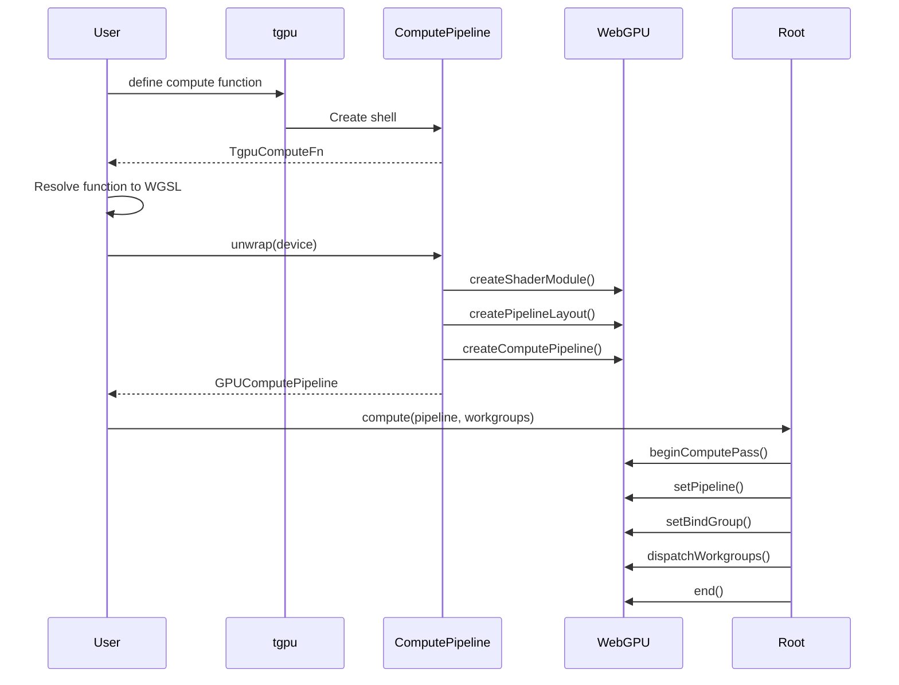
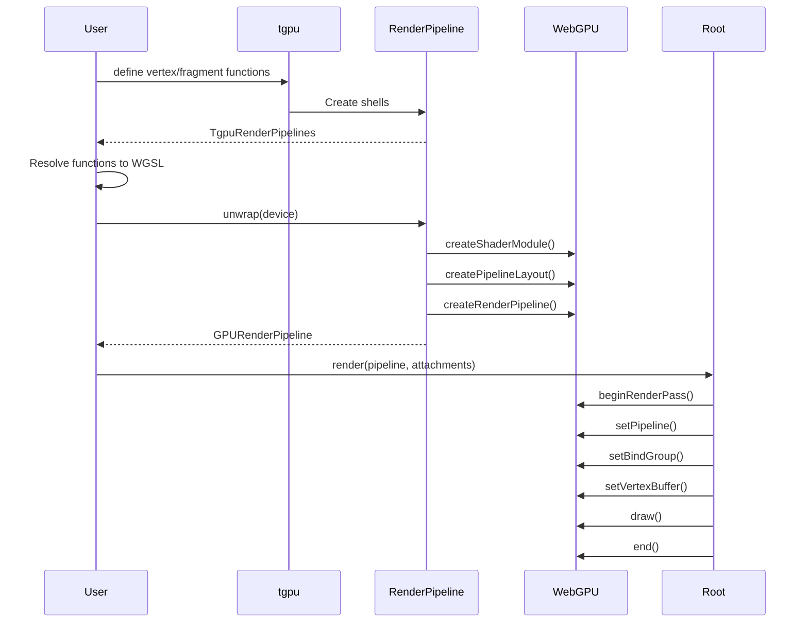

# Pipeline System - Component Breakdown

## Overview

TypeGPU's pipeline system manages compute and render pipelines, handling:
- Shader module creation from WGSL
- Pipeline layout creation from bind group layouts
- Pipeline creation with proper type safety
- Lazy pipeline instantiation

## Core Files

```
src/core/pipeline/
├── computePipeline.ts    # Compute pipeline creation
├── renderPipeline.ts     # Render pipeline creation
└── pipelineUtils.ts      # Shared pipeline utilities
```

## Compute Pipeline

### TgpuComputeFn Implementation

**File**: `src/core/pipeline/computePipeline.ts`

```typescript
// Compute function shell
export interface TgpuComputeFnShell {
  readonly workgroupSize: [number, number?, number?];
  readonly entryPoint: string;
}

// Internal compute pipeline core
class ComputePipelineCore {
  private _pipeline: GPUComputePipeline | undefined;
  private _shaderCode: string;
  private _bindGroupLayouts: TgpuBindGroupLayout[];
  private _entryPoint: string;
  private _label?: string;

  constructor(options: {
    shaderCode: string;
    bindGroupLayouts: TgpuBindGroupLayout[];
    entryPoint: string;
    label?: string;
  }) {
    this._shaderCode = options.shaderCode;
    this._bindGroupLayouts = options.bindGroupLayouts;
    this._entryPoint = options.entryPoint;
    this._label = options.label;
  }

  // Lazy pipeline creation
  unwrap(device: GPUDevice): GPUComputePipeline {
    if (!this._pipeline) {
      // Step 1: Create shader module
      const shaderModule = device.createShaderModule({
        label: this._label,
        code: this._shaderCode,
      });

      // Step 2: Create pipeline layout
      const layout = device.createPipelineLayout({
        bindGroupLayouts: this._bindGroupLayouts.map(layout =>
          layout.unwrap(device)
        ),
      });

      // Step 3: Create compute pipeline
      this._pipeline = device.createComputePipeline({
        layout,
        compute: {
          module: shaderModule,
          entryPoint: this._entryPoint,
        },
      });
    }
    return this._pipeline;
  }
}
```

### Compute Dispatch

```typescript
// src/core/root/init.ts
interface TgpuRoot {
  compute(
    pipeline: TgpuComputePipeline,
    workgroups: [number, number?, number?],
    bindGroups?: TgpuBindGroup[]
  ): void;
}

class TgpuRootImpl {
  compute(
    pipeline: TgpuComputePipeline,
    workgroups: [number, number?, number?],
    bindGroups: TgpuBindGroup[] = []
  ): void {
    const computePipeline = pipeline.unwrap(this.device);

    // Begin compute pass
    const passEncoder = this.commandEncoder.beginComputePass();

    // Set pipeline
    passEncoder.setPipeline(computePipeline);

    // Set bind groups
    bindGroups.forEach((bindGroup, index) => {
      passEncoder.setBindGroup(index, bindGroup.unwrap(this.device));
    });

    // Dispatch workgroups
    passEncoder.dispatchWorkgroups(...workgroups);

    // End pass
    passEncoder.end();
  }
}
```

## Render Pipeline

### Render Pipeline Core

**File**: `src/core/pipeline/renderPipeline.ts`

```typescript
class RenderPipelineCore {
  private _pipeline: GPURenderPipeline | undefined;

  unwrap(device: GPUDevice): GPURenderPipeline {
    if (!this._pipeline) {
      const shaderModule = device.createShaderModule({
        code: this._shaderCode,
      });

      this._pipeline = device.createRenderPipeline({
        layout: device.createPipelineLayout({
          bindGroupLayouts: this._bindGroupLayouts.map(l => l.unwrap(device)),
        }),

        // Vertex state
        vertex: {
          module: shaderModule,
          entryPoint: this._vertexEntryPoint,
          buffers: this._vertexBuffers.map(vb => ({
            arrayStride: vb.arrayStride,
            stepMode: vb.stepMode ?? 'vertex',
            attributes: vb.attributes.map(attr => ({
              shaderLocation: attr.shaderLocation,
              offset: attr.offset,
              format: attr.format,
            })),
          })),
        },

        // Fragment state
        fragment: {
          module: shaderModule,
          entryPoint: this._fragmentEntryPoint,
          targets: this._colorTargets.map(target => ({
            format: target.format,
            blend: target.blend && {
              color: {
                srcFactor: target.blend.colorSrc,
                dstFactor: target.blend.colorDst,
                operation: target.blend.colorOp,
              },
              alpha: {
                srcFactor: target.blend.alphaSrc,
                dstFactor: target.blend.alphaDst,
                operation: target.blend.alphaOp,
              },
            },
          })),
        },

        // Primitive state
        primitive: {
          topology: this._topology,
          stripIndexFormat: this._stripIndexFormat,
          frontFace: this._frontFace,
          cullMode: this._cullMode,
        },

        // Depth/stencil
        depthStencil: this._depthStencil,

        // Multisample
        multisample: {
          count: this._sampleCount,
          mask: this._sampleMask,
        },
      });
    }
    return this._pipeline;
  }
}
```

### Render Pass

```typescript
// src/core/root/init.ts
interface TgpuRoot {
  render(
    pipeline: TgpuRenderPipeline,
    options: {
      colorAttachments: ColorAttachment[];
      depthStencilAttachment?: DepthStencilAttachment;
    },
    bindGroups?: TgpuBindGroup[],
    vertexBuffers?: TgpuBuffer<AnyData>[]
  ): void;
}

class TgpuRootImpl {
  render(
    pipeline: TgpuRenderPipeline,
    { colorAttachments, depthStencilAttachment },
    bindGroups: TgpuBindGroup[] = [],
    vertexBuffers: TgpuBuffer<AnyData>[] = []
  ): void {
    const renderPipeline = pipeline.unwrap(this.device);

    // Begin render pass
    const passEncoder = this.commandEncoder.beginRenderPass({
      colorAttachments: colorAttachments.map(attachment => ({
        view: attachment.texture.unwrap(this.device).createView(),
        clearValue: attachment.clearValue,
        loadOp: attachment.loadOp,
        storeOp: attachment.storeOp,
      })),
      depthStencilAttachment: depthStencilAttachment && {
        view: depthStencilAttachment.texture.unwrap(this.device).createView(),
        depthClearValue: depthStencilAttachment.depthClearValue,
        depthLoadOp: depthStencilAttachment.depthLoadOp,
        depthStoreOp: depthStencilAttachment.depthStoreOp,
        stencilClearValue: depthStencilAttachment.stencilClearValue,
        stencilLoadOp: depthStencilAttachment.stencilLoadOp,
        stencilStoreOp: depthStencilAttachment.stencilStoreOp,
      },
    });

    // Set pipeline
    passEncoder.setPipeline(renderPipeline);

    // Set bind groups
    bindGroups.forEach((bindGroup, index) => {
      passEncoder.setBindGroup(index, bindGroup.unwrap(this.device));
    });

    // Set vertex buffers
    vertexBuffers.forEach((buffer, index) => {
      passEncoder.setVertexBuffer(index, buffer.unwrap(this.device));
    });

    // Draw
    passEncoder.draw(
      this._vertexCount,
      this._instanceCount,
      this._firstVertex,
      this._firstInstance
    );

    // End pass
    passEncoder.end();
  }
}
```

## Vertex Layout System

### Vertex Attribute Definition

```typescript
// src/core/vertexLayout/vertexLayout.ts
export interface VertexAttribute {
  format: GPUVertexFormat;
  offset: number;
  shaderLocation: number;
}

export interface VertexBufferLayout {
  arrayStride: number;
  stepMode?: 'vertex' | 'instance';
  attributes: VertexAttribute[];
}

// Vertex layout creation
export function vertexLayout<T extends Record<string, AnyData>>(
  attributes: T,
  options?: {
    stepMode?: 'vertex' | 'instance';
  }
): VertexLayout<T> {
  const attributeNames = Object.keys(attributes);
  const attributesArray: VertexAttribute[] = [];

  let offset = 0;
  attributeNames.forEach((name, shaderLocation) => {
    const attribute = attributes[name];
    const format = getVertexFormat(attribute.type);
    const size = getAttributeSize(attribute.type);

    attributesArray.push({
      format,
      offset,
      shaderLocation,
    });

    offset += size;
  });

  return {
    arrayStride: offset,
    stepMode: options?.stepMode ?? 'vertex',
    attributes: attributesArray,
    attributeTypes: attributes,
  };
}
```

### Vertex Format Mapping

```typescript
// src/core/vertexLayout/vertexLayout.ts
function getVertexFormat(type: string): GPUVertexFormat {
  const formatMap: Record<string, GPUVertexFormat> = {
    f32: 'float32',
    'vec2f': 'float32x2',
    'vec3f': 'float32x3',
    'vec4f': 'float32x4',
    'vec2i': 'sint32x2',
    'vec3i': 'sint32x3',
    'vec4i': 'sint32x4',
    'vec2u': 'uint32x2',
    'vec3u': 'uint32x3',
    'vec4u': 'uint32x4',
    'mat2x2f': 'float32x4',  // 2x2 matrix = 4 floats
    'mat3x3f': 'float32x12', // 3x3 matrix = 12 floats
    'mat4x4f': 'float32x16', // 4x4 matrix = 16 floats
  };

  return formatMap[type] ?? 'float32';
}

function getAttributeSize(type: string): number {
  const sizeMap: Record<string, number> = {
    f32: 4,
    'vec2f': 8,
    'vec3f': 12,
    'vec4f': 16,
    'vec2i': 8,
    'vec3i': 12,
    'vec4i': 16,
    'vec2u': 8,
    'vec3u': 12,
    'vec4u': 16,
  };

  return sizeMap[type] ?? 4;
}
```

## Pipeline Layout

### Automatic Layout Generation

```typescript
// src/core/pipeline/pipelineUtils.ts
function createPipelineLayout(
  device: GPUDevice,
  bindGroupLayouts: TgpuBindGroupLayout[]
): GPUPipelineLayout {
  return device.createPipelineLayout({
    bindGroupLayouts: bindGroupLayouts.map(layout => layout.unwrap(device)),
  });
}
```

### Layout Entry Resolution

```typescript
// src/tgpuBindGroupLayout.ts
function getVisibility(entry: TgpuLayoutEntry): GPUShaderStageFlags {
  // Determine which shader stages can access this binding
  if (entry.buffer?.type === 'uniform') {
    return GPUShaderStage.VERTEX |
           GPUShaderStage.FRAGMENT |
           GPUShaderStage.COMPUTE;
  }

  if (entry.buffer?.type === 'storage') {
    // Storage buffers can be read in all stages
    // Write access depends on usage
    return GPUShaderStage.VERTEX |
           GPUShaderStage.FRAGMENT |
           GPUShaderStage.COMPUTE;
  }

  if (entry.texture) {
    return entry.texture.sampleType === 'storage'
      ? GPUShaderStage.COMPUTE
      : GPUShaderStage.VERTEX | GPUShaderStage.FRAGMENT;
  }

  if (entry.sampler) {
    return GPUShaderStage.VERTEX | GPUShaderStage.FRAGMENT;
  }

  // Default to all stages
  return GPUShaderStage.VERTEX |
         GPUShaderStage.FRAGMENT |
         GPUShaderStage.COMPUTE;
}
```

## Execution Flow

### Compute Pipeline Flow



### Render Pipeline Flow



## Pipeline Configuration

### Compute Pipeline Options

```typescript
interface ComputePipelineOptions {
  shaderCode: string;
  entryPoint: string;
  bindGroupLayouts: TgpuBindGroupLayout[];
  label?: string;
  constants?: Record<string, number>;  // Shader constants
}
```

### Render Pipeline Options

```typescript
interface RenderPipelineOptions {
  shaderCode: string;
  vertexEntryPoint: string;
  fragmentEntryPoint: string;
  bindGroupLayouts: TgpuBindGroupLayout[];
  vertexBuffers: VertexBufferLayout[];
  colorTargets: ColorTargetState[];
  depthStencil?: DepthStencilState;
  primitive?: PrimitiveState;
  multisample?: MultisampleState;
  label?: string;
}
```

## Type Safety

### Pipeline Creation Validation

```typescript
// Validate vertex attribute compatibility
function validateVertexAttributes(
  vertexBuffers: VertexBufferLayout[],
  vertexEntryPoint: string
): void {
  for (const buffer of vertexBuffers) {
    for (const attr of buffer.attributes) {
      if (attr.shaderLocation > 15) {
        throw new Error(
          `Shader location ${attr.shaderLocation} exceeds maximum (15)`
        );
      }

      if (attr.offset + getAttributeSize(attr.format) > buffer.arrayStride) {
        throw new Error(
          `Attribute offset ${attr.offset} exceeds buffer stride ${buffer.arrayStride}`
        );
      }
    }
  }
}
```

### Bind Group Compatibility

```typescript
// Validate bind group compatibility with pipeline
function validateBindGroups(
  pipelineLayout: GPUPipelineLayout,
  bindGroups: TgpuBindGroup[]
): void {
  for (let i = 0; i < bindGroups.length; i++) {
    const expectedLayout = pipelineLayout.getBindGroupLayout(i);
    const actualLayout = bindGroups[i].layout.unwrap(device);

    if (expectedLayout !== actualLayout) {
      throw new Error(
        `Bind group ${i} layout does not match pipeline layout`
      );
    }
  }
}
```

## Performance Considerations

### Pipeline Caching

```typescript
// Cache pipelines to avoid recreation
class PipelineCache {
  private _cache = new Map<string, GPUPipeline>();

  getOrCreate(
    key: string,
    createFn: () => GPUPipeline
  ): GPUPipeline {
    if (!this._cache.has(key)) {
      this._cache.set(key, createFn());
    }
    return this._cache.get(key)!;
  }

  clear(): void {
    this._cache.clear();
  }
}
```

### Multi-Pipeline Rendering

```typescript
// Batch multiple render calls
interface RenderBatch {
  pipeline: TgpuRenderPipeline;
  bindGroups: TgpuBindGroup[];
  vertexBuffers: TgpuBuffer<AnyData>[];
  vertexCount: number;
  instanceCount: number;
}

function renderBatch(
  encoder: GPUCommandEncoder,
  batches: RenderBatch[]
): void {
  let currentPipeline: GPURenderPipeline | null = null;
  let currentBindGroups: GPUBindGroup[] | null = null;

  for (const batch of batches) {
    const pipeline = batch.pipeline.unwrap(device);
    const bindGroups = batch.bindGroups.map(bg => bg.unwrap(device));

    // Only set pipeline if changed
    if (pipeline !== currentPipeline) {
      passEncoder.setPipeline(pipeline);
      currentPipeline = pipeline;
    }

    // Only set bind groups if changed
    if (bindGroups !== currentBindGroups) {
      bindGroups.forEach((bg, i) => {
        passEncoder.setBindGroup(i, bg);
      });
      currentBindGroups = bindGroups;
    }

    passEncoder.draw(batch.vertexCount, batch.instanceCount);
  }
}
```

## Connections to Other Systems

### Resolution System
- Shader code resolved before pipeline creation
- Bind group layouts resolved during pipeline layout

### Buffer System
- Vertex buffers bound during render pass
- Storage buffers accessed through bind groups

### Shader Generation
- Generated WGSL used in shader modules
- Function entry points from tgpu.fn definitions
