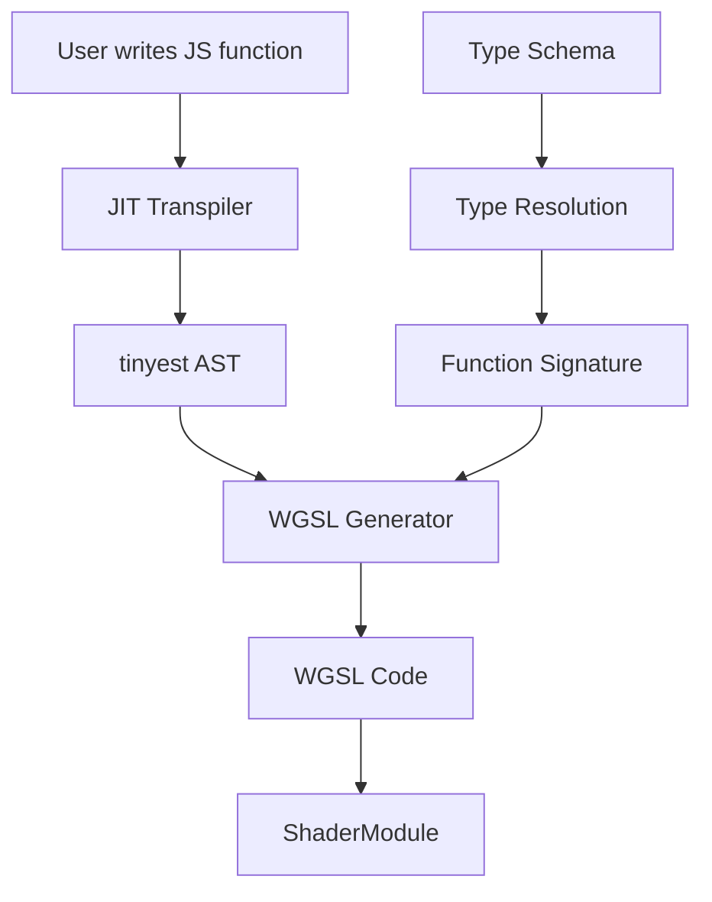
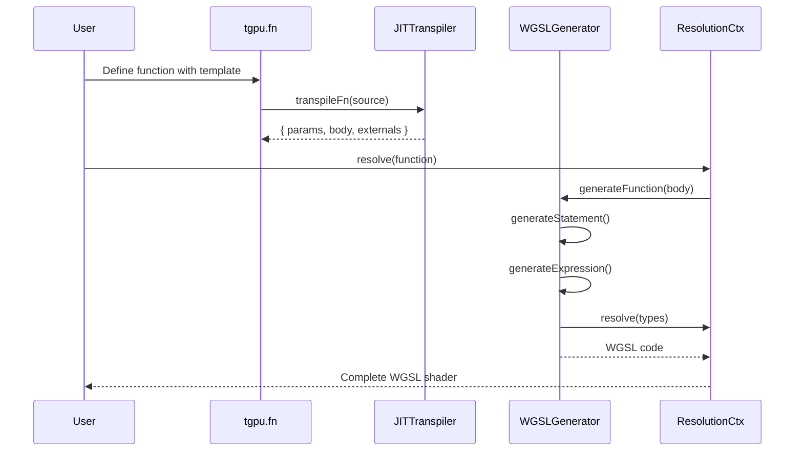

# Shader Generation System - Component Breakdown

## Overview

TypeGPU's shader generation system transpiles JavaScript/TypeScript functions to WGSL shader code. This is done through:
- JIT (Just-In-Time) transpilation using babel/swc
- AST transformation from JS to tinyest (custom AST format)
- WGSL code generation from tinyest AST
- Type-driven code generation

## Core Files

```
src/tgsl/
├── wgslGenerator.ts       # Main WGSL code generation
├── generationHelpers.ts   # Type conversion helpers
└── builtins/             # Built-in WGSL functions

src/core/function/
├── tgpuFn.ts             # Base function system
├── tgpuComputeFn.ts      # Compute function specifically
├── tgpuFragmentFn.ts     # Fragment function specifically
└── tgpuVertexFn.ts       # Vertex function specifically

src/jitTranspiler.ts      # JIT transpilation interface
```

## Architecture



## JIT Transpilation

### Transpiler Interface

**File**: `src/jitTranspiler.ts`

```typescript
export interface JitTranspiler {
  transpileFn(fn: string): {
    params: FuncParameter[];      // Function parameters
    body: Block;                   // Function body AST
    externalNames: string[];       // Variables from outer scope
  };
}
```

### Function Transpilation Flow

```typescript
// User writes:
const fn = tgpu.fn([f32, f32], f32)`
  (a, b) => {
    return a + b;
  }
`;

// 1. Function string extracted from template literal
const fnString = `(a, b) => { return a + b; }`;

// 2. JIT transpiler parses to AST
const { params, body, externalNames } = transpiler.transpileFn(fnString);

// params = [
//   { name: 'a', dataType: f32 },
//   { name: 'b', dataType: f32 }
// ]

// body = {
//   type: 'Block',
//   statements: [{
//     type: 'ReturnStatement',
//     argument: {
//       type: 'BinaryExpression',
//       operator: '+',
//       left: { type: 'Identifier', name: 'a' },
//       right: { type: 'Identifier', name: 'b' }
//     }
//   }]
// }
```

## WGSL Code Generation

### Main Generation Function

**File**: `src/tgsl/wgslGenerator.ts`

```typescript
export function generateFunction(
  ctx: ResolutionCtx,
  body: Block
): Wgsl {
  return generateBlock(ctx, body);
}

function generateBlock(ctx: ResolutionCtx, block: Block): string {
  const lines: string[] = [];

  for (const stmt of block.statements) {
    lines.push(generateStatement(ctx, stmt));
  }

  return lines.join('\n');
}
```

### Statement Generation

```typescript
// src/tgsl/wgslGenerator.ts
function generateStatement(ctx: ResolutionCtx, stmt: Statement): string {
  switch (stmt.type) {
    case 'ReturnStatement':
      return `return ${generateExpression(ctx, stmt.argument)};`;

    case 'VariableDeclaration':
      return `var ${stmt.name} = ${generateExpression(ctx, stmt.init)};`;

    case 'ExpressionStatement':
      return `${generateExpression(ctx, stmt.expression)};`;

    case 'BlockStatement':
      return generateBlock(ctx, stmt);

    case 'IfStatement':
      return `if (${generateExpression(ctx, stmt.test)}) {
        ${generateBlock(ctx, stmt.consequent)}
      }`;

    case 'ForStatement':
      return `for (${generateExpression(ctx, stmt.init)}; ${generateExpression(ctx, stmt.test)}; ${generateExpression(ctx, stmt.update)}) {
        ${generateBlock(ctx, stmt.body)}
      }`;
  }
}
```

### Expression Generation

```typescript
// src/tgsl/wgslGenerator.ts
function generateExpression(ctx: ResolutionCtx, expr: Expression): string {
  switch (expr.type) {
    case 'Identifier':
      return resolveIdentifier(ctx, expr.name);

    case 'Literal':
      return generateLiteral(expr.value);

    case 'BinaryExpression':
      return generateBinaryExpression(ctx, expr);

    case 'UnaryExpression':
      return generateUnaryExpression(ctx, expr);

    case 'CallExpression':
      return generateCallExpression(ctx, expr);

    case 'MemberExpression':
      return generateMemberExpression(ctx, expr);

    case 'ObjectExpression':
      return generateStructLiteral(ctx, expr);

    case 'ArrayExpression':
      return generateArrayLiteral(ctx, expr);
  }
}
```

### Binary Expression Generation

```typescript
// src/tgsl/wgslGenerator.ts
function generateBinaryExpression(
  ctx: ResolutionCtx,
  expr: BinaryExpression
): string {
  const left = generateExpression(ctx, expr.left);
  const right = generateExpression(ctx, expr.right);

  // Map JS operators to WGSL operators
  const operatorMap: Record<string, string> = {
    '+': '+',
    '-': '-',
    '*': '*',
    '/': '/',
    '%': '%',
    '==': '==',
    '!=': '!=',
    '<': '<',
    '<=': '<=',
    '>': '>',
    '>=': '>=',
    '&&': '&',  // WGSL uses single & for logical AND
    '||': '|',  // WGSL uses single | for logical OR
  };

  return `${left} ${operatorMap[expr.operator] ?? expr.operator} ${right}`;
}
```

### Function Call Generation

```typescript
// src/tgsl/wgslGenerator.ts
function generateCallExpression(
  ctx: ResolutionCtx,
  expr: CallExpression
): string {
  const callee = generateExpression(ctx, expr.callee);
  const args = expr.arguments.map(arg => generateExpression(ctx, arg));

  // Built-in WGSL functions
  if (isBuiltinFunction(callee)) {
    return `${callee}(${args.join(', ')})`;
  }

  // User-defined functions
  if (isUserFunction(callee)) {
    return `${callee}(${args.join(', ')})`;
  }

  // Method calls (swizzle, etc.)
  if (isMethodCall(callee)) {
    return generateMethodCall(ctx, callee, args);
  }
}
```

### Struct Literal Generation

```typescript
// src/tgsl/wgslGenerator.ts
function generateStructLiteral(
  ctx: ResolutionCtx,
  expr: ObjectExpression
): string {
  const properties = expr.properties.map(prop => {
    const value = generateExpression(ctx, prop.value);
    return value;  // WGSL struct literals are positional
  });

  const structType = ctx.resolve(expr.structSchema);
  return `${structType}(${properties.join(', ')})`;
}
```

## Type Conversion

### Coercion System

**File**: `src/tgsl/generationHelpers.ts`

```typescript
// Convert JavaScript values to WGSL snippets
export function coerceToSnippet(value: unknown): Snippet {
  if (isWgsl(value)) {
    return snip(resolve(value), getType(value));
  }

  if (typeof value === 'number') {
    return snip(String(value), f32);
  }

  if (typeof value === 'boolean') {
    return snip(String(value), bool);
  }

  if (Array.isArray(value)) {
    return snip(`vec${value.length}f(${value.join(', ')})`, getVecType(value.length));
  }

  if (value && typeof value === 'object') {
    return snip(generateObjectLiteral(value), getStructType(value));
  }

  throw new Error(`Cannot coerce ${value} to snippet`);
}
```

### Type Conversion Ranking

```typescript
// src/tgsl/generationHelpers.ts
// Conversion ranking for implicit conversions
const CONVERSION_RANK = {
  exact: 0,      // No conversion needed
  promote: 1,    // f32 -> f64 (not in WGSL)
  demote: 2,     // f64 -> f32 (not in WGSL)
  intToFloat: 3, // i32 -> f32
  uintToFloat: 4,// u32 -> f32
  floatToInt: 5, // f32 -> i32
  floatToUint: 6,// f32 -> u32
  incompatible: Infinity,
};

function getConversionRank(fromType: AnyData, toType: AnyData): number {
  if (fromType.type === toType.type) {
    return CONVERSION_RANK.exact;
  }

  // Integer to float
  if ((fromType.type === 'i32' || fromType.type === 'u32') && fromType.type === 'f32') {
    return CONVERSION_RANK.intToFloat;
  }

  return CONVERSION_RANK.incompatible;
}
```

### Struct Value Conversion

```typescript
// src/tgsl/generationHelpers.ts
function convertStructValues(
  ctx: ResolutionCtx,
  structType: WgslStruct,
  values: Record<string, unknown>
): Snippet[] {
  return Object.entries(structType.propTypes).map(([key, fieldType]) => {
    const value = values[key];
    return coerceToSnippet(value).convertTo(fieldType);
  });
}
```

## Built-in Functions

### WGSL Built-ins Mapping

```typescript
// src/tgsl/builtins.ts
export const wgslBuiltins = {
  // Math functions
  sin: 'sin',
  cos: 'cos',
  tan: 'tan',
  asin: 'asin',
  acos: 'acos',
  atan: 'atan',
  atan2: 'atan2',
  pow: 'pow',
  exp: 'exp',
  exp2: 'exp2',
  log: 'log',
  log2: 'log2',
  sqrt: 'sqrt',
  inversesqrt: 'inverseSqrt',

  // Vector functions
  dot: 'dot',
  cross: 'cross',
  normalize: 'normalize',
  length: 'length',
  distance: 'distance',

  // Matrix functions
  transpose: 'transpose',
  determinant: 'determinant',
  inverse: 'inverse',

  // Geometry
  reflect: 'reflect',
  refract: 'refract',

  // Clamping
  clamp: 'clamp',
  min: 'min',
  max: 'max',
  step: 'step',
  smoothstep: 'smoothstep',

  // Derivatives (fragment shader)
  dpdx: 'dpdx',
  dpdy: 'dpdy',
  fwidth: 'fwidth',

  // Bit operations
  countTrailingZeros: 'countTrailingZeros',
  countLeadingZeros: 'countLeadingZeros',
  countSetBits: 'countSetBits',
  reverseBits: 'reverseBits',

  // Atomics
  atomicLoad: 'atomicLoad',
  atomicStore: 'atomicStore',
  atomicAdd: 'atomicAdd',
  atomicSub: 'atomicSub',
  atomicMax: 'atomicMax',
  atomicMin: 'atomicMin',
};
```

## Function Generation

### Function Header Generation

**File**: `src/resolutionCtx.ts`

```typescript
export function resolveFunctionHeader(
  ctx: ResolutionCtx,
  args: Snippet[],
  returnType: AnyData
): string {
  const argList = args
    .map(arg => `${arg.value}: ${ctx.resolve(arg.dataType as AnyData)}`)
    .join(', ');

  return returnType.type !== 'void'
    ? `(${argList}) -> ${getAttributesString(returnType)} ${ctx.resolve(returnType)}`
    : `(${argList})`;
}
```

### Complete Function Generation

```typescript
// src/core/function/tgpuFn.ts
function generateCompleteFunction(
  ctx: ResolutionCtx,
  fn: TgpuFn
): string {
  const { params, body, externalNames } = ctx.transpileFn(fn.source);

  const header = resolveFunctionHeader(ctx, params, fn.returnType);
  const wgslBody = generateFunction(ctx, body);

  return `${header} {
${ctx.indent()}${wgslBody}${ctx.dedent()}
}`;
}
```

## Execution Flow



## Example: Complete Transpilation

### Input JavaScript

```typescript
const computeSum = tgpu.fn([vec3f, vec3f], f32)`
  (a, b) => {
    const diff = a - b;
    return dot(diff, diff);
  }
`;
```

### Transpiled AST (tinyest)

```typescript
{
  params: [
    { name: 'a', dataType: vec3f },
    { name: 'b', dataType: vec3f }
  ],
  body: {
    type: 'Block',
    statements: [
      {
        type: 'VariableDeclaration',
        name: 'diff',
        init: {
          type: 'BinaryExpression',
          operator: '-',
          left: { type: 'Identifier', name: 'a' },
          right: { type: 'Identifier', name: 'b' }
        }
      },
      {
        type: 'ReturnStatement',
        argument: {
          type: 'CallExpression',
          callee: { type: 'Identifier', name: 'dot' },
          arguments: [
            { type: 'Identifier', name: 'diff' },
            { type: 'Identifier', name: 'diff' }
          ]
        }
      }
    ]
  }
}
```

### Generated WGSL

```wgsl
fn computeSum(a: vec3f, b: vec3f) -> f32 {
  var diff = a - b;
  return dot(diff, diff);
}
```

## Type-Driven Generation

### Vector Operations

```typescript
// Vector subtraction generates WGSL vector operation
function generateVectorBinary(
  ctx: ResolutionCtx,
  left: Snippet,
  right: Snippet,
  operator: string
): string {
  // Both operands must be same vector type
  if (left.dataType.type !== right.dataType.type) {
    throw new Error('Vector type mismatch');
  }

  return `${left.value} ${operator} ${right.value}`;
}
```

### Swizzle Operations

```typescript
// src/data/vectorImpl.ts
// Swizzle getters defined on vector classes
class Vec4Impl {
  get xy(): { x: number; y: number } {
    return { x: this.x, y: this.y };
  }

  get xyz(): { x: number; y: number; z: number } {
    return { x: this.x, y: this.y, z: this.z };
  }

  // ... 100+ swizzle combinations
}

// Generated WGSL
// vec4Value.xy -> vec4Value.xy (WGSL native)
```

## Error Handling

### Type Mismatch Errors

```typescript
function validateTypes(
  expected: AnyData,
  actual: AnyData,
  context: string
): void {
  const rank = getConversionRank(actual, expected);

  if (rank === CONVERSION_RANK.incompatible) {
    throw new Error(
      `Type mismatch in ${context}: ` +
      `expected ${expected.type}, got ${actual.type}`
    );
  }
}
```

### Missing External Errors

```typescript
function resolveIdentifier(ctx: ResolutionCtx, name: string): string {
  const snippet = ctx.getById(name);

  if (!snippet) {
    throw new Error(
      `Identifier '${name}' not found. ` +
      `Is it defined in an outer scope or imported?`
    );
  }

  return snippet.value;
}
```

## Performance Optimizations

### Memoization

```typescript
// src/resolutionCtx.ts
private readonly _memoizedResolves = new WeakMap<
  object,
  { slotToValueMap: SlotToValueMap; result: string }[]
>();

function _getOrInstantiate(item: object): string {
  const cached = this._memoizedResolves.get(item);
  if (cached && matchesContext(cached)) {
    return cached.result;
  }

  const result = this._instantiate(item);
  this._memoizedResolves.set(item, [...cached, { slotToValueMap, result }]);
  return result;
}
```

### Pre-compiled Functions

```typescript
// Functions can be pre-compiled at build time
// avoiding JIT overhead
const precompiledFn = {
  wgsl: `fn compute(a: f32, b: f32) -> f32 { return a + b; }`,
  params: ['a', 'b'],
  returnType: f32,
};
```

## Connections to Other Systems

### Resolution System
- Functions are resolved to WGSL strings
- External dependencies tracked during resolution

### Bind Group System
- Function uniforms bound via bind groups
- Storage buffers accessed through bindings

### Pipeline System
- Generated WGSL used in shader modules
- Function entry points specified in pipelines
