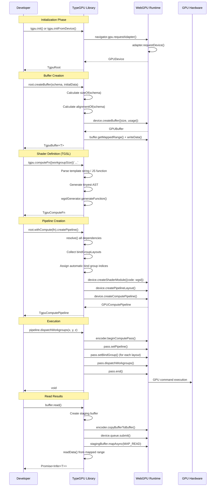

# TypeGPU Comprehensive Exploration

**Source Repository:** `/home/darkvoid/Boxxed/@formulas/src.rust/src.webgpu/TypeGPU`
**GitHub:** https://github.com/software-mansion/TypeGPU
**Language:** TypeScript, WGSL
**Version Explored:** 0.5.8

---

## Table of Contents

1. [Overview](#overview)
2. [Project Structure](#project-structure)
3. [Architecture Deep Dive](#architecture-deep-dive)
4. [WebGPU Integration](#webgpu-integration)
5. [Type System Deep Dive](#type-system-deep-dive)
6. [Component Breakdown](#component-breakdown)
7. [Rust Revision Plan](#rust-revision-plan)
8. [Key Design Patterns](#key-design-patterns)

---

## Overview

TypeGPU is a sophisticated TypeScript library that provides a type-safe abstraction layer over the WebGPU API. Unlike traditional WebGPU development where shader-resource bindings, buffer layouts, and pipeline configurations are error-prone runtime operations, TypeGPU shifts these validations to compile-time using TypeScript's advanced type system.

### Core Value Propositions

1. **Type Safety Without Lock-in**: Every GPU resource is statically typed, but developers can drop down to raw WebGPU at any point
2. **WGSL-Native Design**: The TypeScript API mirrors WGSL syntax, meaning learning TypeGPU inherently teaches WebGPU concepts
3. **Zero-Cost Abstractions**: Type information is erased at runtime; there's no performance overhead for the type safety
4. **Dual-Mode Execution**: Functions can have both CPU (JavaScript) and GPU (WGSL) implementations that share the same interface
5. **Library Interoperability**: Designed as a layer between libraries, enabling typed buffer exchange without copying

### Key Problems Solved

| Problem | TypeGPU Solution |
|---------|------------------|
| Runtime shader compilation errors | Compile-time type validation |
| Manual buffer offset/alignment calculations | Automatic via schema system |
| Bind group index management | Automatic placeholder resolution |
| Vertex attribute format matching | Type-level enforcement |
| Buffer usage flag errors | Phantom type accumulation |
| Shader-resource binding mismatches | Typed bind group layouts |

---

## Project Structure

```
TypeGPU/
├── packages/
│   ├── typegpu/                    # Core library (the main package)
│   │   ├── src/
│   │   │   ├── core/               # Core resource abstractions
│   │   │   │   ├── buffer/
│   │   │   │   │   ├── buffer.ts         # TgpuBuffer implementation
│   │   │   │   │   └── bufferUsage.ts    # Usage views (uniform/mutable/readonly)
│   │   │   │   ├── function/
│   │   │   │   │   ├── astUtils.ts       # AST manipulation for TGSL
│   │   │   │   │   ├── fnCore.ts         # Core function logic
│   │   │   │   │   ├── fnTypes.ts        # Function type definitions
│   │   │   │   │   ├── ioOutputType.ts   # I/O schema inference
│   │   │   │   │   ├── tgpuFn.ts         # General function shell
│   │   │   │   │   ├── tgpuComputeFn.ts  # Compute entry function
│   │   │   │   │   ├── tgpuFragmentFn.ts # Fragment entry function
│   │   │   │   │   └── tgpuVertexFn.ts   # Vertex entry function
│   │   │   │   ├── pipeline/
│   │   │   │   │   ├── computePipeline.ts  # Compute pipeline wrapper
│   │   │   │   │   ├── renderPipeline.ts   # Render pipeline wrapper
│   │   │   │   │   └── connectTargetsToShader.ts
│   │   │   │   ├── root/
│   │   │   │   │   ├── init.ts           # Root initialization (init, initFromDevice)
│   │   │   │   │   └── rootTypes.ts      # TgpuRoot type definitions
│   │   │   │   ├── slot/
│   │   │   │   │   ├── slot.ts           # Slot creation
│   │   │   │   │   ├── derived.ts        # Derived/computed values
│   │   │   │   │   ├── accessor.ts       # Accessor for external values
│   │   │   │   │   └── slotTypes.ts      # Slot type definitions
│   │   │   │   ├── texture/
│   │   │   │   │   ├── texture.ts        # Texture wrapper
│   │   │   │   │   ├── textureFormats.ts # Format type mappings
│   │   │   │   │   ├── textureProps.ts   # Texture property types
│   │   │   │   │   └── usageExtension.ts # Usage flags (Sampled/Storage/Render)
│   │   │   │   ├── vertexLayout/
│   │   │   │   │   ├── vertexLayout.ts   # Vertex buffer layout
│   │   │   │   │   └── vertexAttribute.ts # Attribute connections
│   │   │   │   ├── resolve/
│   │   │   │   │   ├── tgpuResolve.ts    # Template resolution
│   │   │   │   │   ├── externals.ts      # External dependency resolution
│   │   │   │   │   └── resolveData.ts    # Data schema resolution
│   │   │   │   ├── constant/
│   │   │   │   │   └── tgpuConstant.ts   # WGSL const declarations
│   │   │   │   ├── declare/
│   │   │   │   │   └── tgpuDeclare.ts    # WGSL declare statements
│   │   │   │   ├── variable/
│   │   │   │   │   └── tgpuVariable.ts   # Private/workgroup variables
│   │   │   │   └── sampler/
│   │   │   │       └── sampler.ts        # Sampler creation
│   │   │   ├── data/                     # Data type schemas (THE TYPE SYSTEM)
│   │   │   │   ├── wgslTypes.ts          # ALL WGSL type definitions (1500+ lines)
│   │   │   │   ├── dataTypes.ts          # AnyData, Snippet, loose types
│   │   │   │   ├── struct.ts             # d.struct() implementation
│   │   │   │   ├── array.ts              # d.arrayOf() implementation
│   │   │   │   ├── vector.ts             # Vector constructors (vec2f, vec3f, etc.)
│   │   │   │   ├── vectorImpl.ts         # Vector class implementations with swizzle
│   │   │   │   ├── matrix.ts             # Matrix constructors
│   │   │   │   ├── numeric.ts            # f32, i32, u32, f16 schemas
│   │   │   │   ├── attributes.ts         # @align, @size, @location, @interpolate
│   │   │   │   ├── ptr.ts                # Pointer types (ptr<uniform>, ptr<storage>)
│   │   │   │   ├── atomic.ts             # atomic<u32>, atomic<i32>
│   │   │   │   ├── disarray.ts           # Unaligned arrays (vertex buffers)
│   │   │   │   ├── unstruct.ts           # Unaligned structs (vertex buffers)
│   │   │   │   ├── vertexFormatData.ts   # Packed vertex formats (unorm8x4, etc.)
│   │   │   │   ├── dataIO.ts             # Binary read/write operations
│   │   │   │   ├── alignIO.ts            # Alignment padding helpers
│   │   │   │   ├── sizeOf.ts             # Size calculations
│   │   │   │   ├── alignmentOf.ts        # Alignment calculations
│   │   │   │   ├── offsets.ts            # Member offset calculations
│   │   │   │   ├── compiledIO.ts         # Pre-compiled writers/readers (eval-based)
│   │   │   │   └── partialIO.ts          # Partial write instructions
│   │   │   ├── std/                      # Standard library functions
│   │   │   │   ├── index.ts              # Exports all std functions
│   │   │   │   ├── numeric.ts            # add, sub, mul, div, sin, cos, etc.
│   │   │   │   ├── boolean.ts            # all, any, select, step, etc.
│   │   │   │   ├── atomic.ts             # atomicAdd, atomicLoad, etc.
│   │   │   │   ├── array.ts              # Array operations
│   │   │   │   ├── matrix.ts             # Matrix operations
│   │   │   │   ├── packing.ts            # Pack/unpack functions
│   │   │   │   └── texture.ts            # Texture sampling functions
│   │   │   ├── tgsl/                     # TGSL (TypeGPU Shader Language)
│   │   │   │   ├── wgslGenerator.ts      # Main AST-to-WGSL generator
│   │   │   │   ├── generationHelpers.ts  # Type conversion, coercion logic
│   │   │   │   └── index.ts              # TGSL exports
│   │   │   ├── shared/                   # Shared utilities
│   │   │   │   ├── repr.ts               # $repr, Infer<T>, InferGPU<T> types
│   │   │   │   ├── symbols.ts            # $internal, $wgslDataType symbols
│   │   │   │   ├── meta.ts               # $name(), naming utilities
│   │   │   │   ├── vertexFormat.ts       # Vertex format definitions
│   │   │   │   ├── utilityTypes.ts       # Prettify, Default, etc.
│   │   │   │   └── generators.ts         # Code generation utilities
│   │   │   ├── builtin.ts                # Built-in variables (@builtin)
│   │   │   ├── extension.ts              # Extension mechanism (Storage, etc.)
│   │   │   ├── errors.ts                 # Custom error classes
│   │   │   ├── resolutionCtx.ts          # Resolution context (THE RESOLVER)
│   │   │   ├── tgpuBindGroupLayout.ts    # Bind group layout system (770+ lines)
│   │   │   ├── types.ts                  # Core type definitions (ResolutionCtx, etc.)
│   │   │   ├── unwrapper.ts              # Unwrapper interface
│   │   │   ├── gpuMode.ts                # CPU vs GPU execution mode tracking
│   │   │   ├── memo.ts                   # WeakMemo caching utility
│   │   │   ├── nameRegistry.ts           # Name generation for WGSL identifiers
│   │   │   ├── taskQueue.ts              # Task queue for deferred operations
│   │   │   ├── mathUtils.ts              # Math utilities
│   │   │   ├── extractGpuValueGetter.ts  # Extract GPU values from schemas
│   │   │   └── index.ts                  # Main entry point
│   │   └── tests/
│   ├── typegpu-color/              # Color library (RGB, HSV, Oklab, sRGB)
│   ├── typegpu-noise/              # Noise functions (Perlin, simplex, random)
│   ├── tgpu-jit/                   # Just-In-Time transpiler
│   ├── tgpu-wgsl-parser/           # WGSL parser (nearley-based)
│   ├── tgpu-gen/                   # CLI code generator from WGSL files
│   ├── tinyest/                    # Minimal AST type definitions
│   ├── tinyest-for-wgsl/           # JavaScript to tinyest transformer
│   └── unplugin-typegpu/           # Build plugin (Vite, Webpack, Rollup)
├── apps/
│   ├── typegpu-docs/               # Documentation site with examples
│   │   └── src/content/examples/
│   │       ├── simple/             # Basic examples (triangle, increment)
│   │       ├── simulation/         # Complex simulations (boids, fluid, particles)
│   │       ├── rendering/          # 3D rendering (cubemap, raytracing)
│   │       ├── image-processing/   # Shaders for image effects
│   │       └── algorithms/         # Compute examples (matrix mult, MNIST)
│   └── infra-benchmarks/           # Performance benchmarks
└── tools/
    └── tgpu-gen/                   # WGSL to TypeGPU code generator
```

---

## Architecture Deep Dive

### System Architecture Diagram

```mermaid
graph TB
    subgraph "User Application"
        App[Application Code]
        Examples[Example Projects]
    end

    subgraph "Build Time (unplugin-typegpu)"
        Babel[Babel/AST Parser]
        Transform[JavaScript to tinyest]
        Embed[Embed WGSL metadata]
    end

    subgraph "TypeGPU Core - Runtime"
        tgpu[TypeGPU API Layer]

        subgraph "Type System"
            Schemas[Data Schemas d.*]
            PhantomTypes[Usage Flags/Phantom Types]
            TypeInference[Infer<T>, InferGPU<T>]
        end

        subgraph "Resource Management"
            Buffers[TgpuBuffer]
            Textures[TgpuTexture]
            Pipelines[TgpuPipeline]
            BindGroups[TgpuBindGroup]
        end

        subgraph "Shader Generation (TGSL)"
            AST[JavaScript/tinyest AST]
            Generator[WGSL Generator]
            Resolver[Resolution Context]
        end

        subgraph "WebGPU Integration"
            Root[TgpuRoot/Device]
            Init[init(), initFromDevice()]
        end
    end

    subgraph "Native WebGPU"
        GPUDevice[GPUDevice]
        GPUBuffer[GPUBuffer]
        GPUPipeline[GPUComputePipeline/GPURenderPipeline]
        GPUShader[GPUShaderModule]
        GPUBindGroup[GPUBindGroup/ GPUBindGroupLayout]
    end

    App --> tgpu
    Examples --> tgpu
    Babel --> Transform
    Transform --> Embed
    Embed --> tgpu

    tgpu --> Schemas
    tgpu --> PhantomTypes
    tgpu --> TypeInference

    tgpu --> Buffers
    tgpu --> Textures
    tgpu --> Pipelines
    tgpu --> BindGroups

    tgpu --> AST
    AST --> Generator
    Generator --> Resolver

    tgpu --> Root
    Root --> Init

    Buffers --> GPUDevice
    Buffers --> GPUBuffer
    Pipelines --> GPUPipeline
    Generator --> GPUShader
    BindGroups --> GPUBindGroup
```

### Execution Flow Diagram



### Resolution System Architecture

The resolution system is the heart of TypeGPU - it traverses the dependency tree and generates WGSL code:

```mermaid
graph TD
    Resolve[resolve() entry point] --> Ctx[Create ResolutionCtxImpl]
    Ctx --> Push[pushMode(GPU)]
    Push --> GetOrInstantiate[_getOrInstantiate(item)]

    GetOrInstantiate --> CheckMemo{In memo cache?}
    CheckMemo -->|Yes, hit| ReturnMemo[Return cached result]
    CheckMemo -->|No, miss| DetermineType{What type?}

    DetermineType -->|isData| ResolveData[resolveData(ctx, item)]
    DetermineType -->|isDerived| UnwrapSlot[resolve(unwrap(item))]
    DetermineType -->|isSlot| UnwrapSlot
    DetermineType -->|SelfResolvable| CallResolve[item['~resolve'](ctx)]
    DetermineType -->|Plain Value| ResolveValue[resolveValue(value)]

    ResolveData --> GenDeclarations[Generate WGSL struct declarations]
    ResolveData --> ReturnCode[Return WGSL code string]

    CallResolve --> Externals{Has externals?}
    Externals -->|Yes| ResolveExternals[Resolve each external recursively]
    Externals -->|No| GenerateBody[Generate function body]

    ResolveExternals --> CollectLayouts[Collect bindGroupLayouts]
    CollectLayouts --> AssignIndices[Assign automatic indices]
    AssignIndices --> ReplacePlaceholders[Replace #BIND_GROUP_LAYOUT_X# placeholders]

    ReplacePlaceholders --> CreateCatchall{Has fixed bindings?}
    CreateCatchall -->|Yes| CreateGroup[Create catch-all bind group]
    CreateCatchall -->|No| FinalCode[Final WGSL code]

    CreateGroup --> FinalCode

    FinalCode --> PopMode[popMode(GPU)]
    PopMode --> ReturnResult[{code, bindGroupLayouts, catchall}]
```

---

## WebGPU Integration

This section explains exactly how TypeGPU interfaces with native WebGPU, showing the exact API calls being made.

### Device Initialization Flow

```typescript
// File: packages/typegpu/src/core/root/init.ts

// User calls:
const root = await tgpu.init({
  adapter: { powerPreference: 'high-performance' },
  device: { requiredFeatures: ['shader-f16'] },
});

// What happens internally:
async function init(options?: InitOptions): Promise<TgpuRoot> {
  // 1. Request GPU adapter (browser API)
  if (!navigator.gpu) {
    throw new Error('WebGPU is not supported by this browser.');
  }
  const adapter = await navigator.gpu.requestAdapter(adapterOpt);

  // 2. Request GPU device (browser API)
  const device = await adapter.requestDevice(deviceOpt);

  // 3. Create root with device
  return new TgpuRootImpl(
    device,
    names === 'random' ? new RandomNameRegistry() : new StrictNameRegistry(),
    jitTranspiler,
    true, // ownDevice = true, so root.destroy() will destroy device
  );
}
```

### Buffer Creation - Exact WebGPU Calls

```typescript
// File: packages/typegpu/src/core/buffer/buffer.ts

// User code:
const buffer = root.createBuffer(
  d.struct({ position: d.vec3f, health: d.f32 }),
  { position: d.vec3f(1, 2, 3), health: 100 }
).$usage('storage', 'uniform');

// Internal implementation - TgpuBufferImpl constructor:
constructor(
  private readonly _group: ExperimentalTgpuRoot,  // TgpuRootImpl
  public readonly dataType: TData,                 // The struct schema
  public readonly initialOrBuffer?: Infer<TData> | GPUBuffer,
) {
  this.flags = GPUBufferUsage.COPY_DST | GPUBufferUsage.COPY_SRC;
  // $usage() adds more flags
}

// When buffer.buffer getter is accessed (lazy initialization):
get buffer() {
  const device = this._group.device;

  if (!this._buffer) {
    // EXACT WebGPU call #1: Create GPUBuffer
    this._buffer = device.createBuffer({
      size: sizeOf(this.dataType),     // Calculated from schema
      usage: this.flags,                // COPY_DST | COPY_SRC | STORAGE | UNIFORM
      mappedAtCreation: !!this.initial, // true if initial data provided
      label: getName(this) ?? '<unnamed>',
    });

    // If initial data provided, write it while mapped
    if (this.initial) {
      // Get mapped memory pointer
      const writer = new BufferWriter(this._buffer.getMappedRange());
      // Serialize JavaScript data to binary
      writeData(writer, this.dataType, this.initial);
      // Make buffer available for GPU
      this._buffer.unmap();
    }
  }

  return this._buffer;
}
```

### Buffer Write Operations - WebGPU Details

```typescript
// File: packages/typegpu/src/core/buffer/buffer.ts

// Direct write to existing buffer
write(data: Infer<TData>): void {
  const gpuBuffer = this.buffer;  // Ensures buffer is created
  const device = this._group.device;

  // Case 1: Buffer is already mapped (just after creation)
  if (gpuBuffer.mapState === 'mapped') {
    const mapped = gpuBuffer.getMappedRange();
    if (EVAL_ALLOWED_IN_ENV) {
      // Fast path: pre-compiled writer function
      const writer = getCompiledWriterForSchema(this.dataType);
      writer(new DataView(mapped), 0, data, endianness === 'little');
      return;
    }
    // Generic path: walk the schema tree
    writeData(new BufferWriter(mapped), this.dataType, data);
    return;
  }

  // Case 2: Buffer is not mapped (normal case after GPU usage)
  const size = sizeOf(this.dataType);

  // Ensure host-side ArrayBuffer exists
  if (!this._hostBuffer) {
    this._hostBuffer = new ArrayBuffer(size);
  }

  // Flush any pending command encoder operations
  this._group.flush();

  // Write to host buffer
  if (EVAL_ALLOWED_IN_ENV) {
    const writer = getCompiledWriterForSchema(this.dataType);
    writer(new DataView(this._hostBuffer), 0, data, endianness === 'little');
  } else {
    writeData(new BufferWriter(this._hostBuffer), this.dataType, data);
  }

  // EXACT WebGPU call: Queue write to GPU buffer
  device.queue.writeBuffer(gpuBuffer, 0, this._hostBuffer, 0, size);
}
```

### Buffer Read Operations - WebGPU Details

```typescript
// File: packages/typegpu/src/core/buffer/buffer.ts

async read(): Promise<Infer<TData>> {
  const gpuBuffer = this.buffer;
  const device = this._group.device;

  // Case 1: Already mapped
  if (gpuBuffer.mapState === 'mapped') {
    const mapped = gpuBuffer.getMappedRange();
    return readData(new BufferReader(mapped), this.dataType);
  }

  // Case 2: Buffer has MAP_READ usage (debug/dev mode)
  if (gpuBuffer.usage & GPUBufferUsage.MAP_READ) {
    // EXACT WebGPU call #1: Map for reading
    await gpuBuffer.mapAsync(GPUMapMode.READ);
    const mapped = gpuBuffer.getMappedRange();
    const res = readData(new BufferReader(mapped), this.dataType);
    // EXACT WebGPU call #2: Unmap after reading
    gpuBuffer.unmap();
    return res;
  }

  // Case 3: Normal case - need staging buffer
  // EXACT WebGPU call #3: Create staging buffer
  const stagingBuffer = device.createBuffer({
    size: sizeOf(this.dataType),
    usage: GPUBufferUsage.COPY_DST | GPUBufferUsage.MAP_READ,
  });

  // EXACT WebGPU call #4: Create command encoder
  const commandEncoder = device.createCommandEncoder();

  // EXACT WebGPU call #5: Copy GPU buffer to staging
  commandEncoder.copyBufferToBuffer(
    gpuBuffer,    // source
    0,            // source offset
    stagingBuffer, // destination
    0,            // destination offset
    sizeOf(this.dataType),
  );

  // EXACT WebGPU call #6: Submit copy command
  device.queue.submit([commandEncoder.finish()]);

  // Wait for GPU work to complete
  await device.queue.onSubmittedWorkDone();

  // EXACT WebGPU call #7: Map staging buffer
  await stagingBuffer.mapAsync(GPUMapMode.READ, 0, sizeOf(this.dataType));

  // Read from staging buffer
  const res = readData(
    new BufferReader(stagingBuffer.getMappedRange()),
    this.dataType,
  );

  // Cleanup
  stagingBuffer.unmap();
  stagingBuffer.destroy();  // EXACT WebGPU call #8: Destroy staging buffer

  return res;
}
```

### Pipeline Creation - WebGPU Details

```typescript
// File: packages/typegpu/src/core/pipeline/computePipeline.ts

class ComputePipelineCore {
  unwrap(): Memo {
    if (this._memo === undefined) {
      const device = this.branch.device;

      // Step 1: Resolve all shader code and collect dependencies
      const { code, bindGroupLayouts, catchall } = resolve(
        {
          '~resolve': (ctx) => {
            ctx.withSlots(this._slotBindings, () => {
              ctx.resolve(this._entryFn);  // Resolve compute function
            });
            return '';
          },
        },
        {
          names: this.branch.nameRegistry,
          jitTranspiler: this.branch.jitTranspiler,
        },
      );

      // Step 2: EXACT WebGPU call - Create shader module
      const shaderModule = device.createShaderModule({
        label: getName(this) ?? '<unnamed>',
        code: code,  // Generated WGSL string
      });

      // Step 3: EXACT WebGPU call - Create pipeline layout
      const pipelineLayout = device.createPipelineLayout({
        label: `${getName(this) ?? '<unnamed>'} - Pipeline Layout`,
        bindGroupLayouts: bindGroupLayouts.map((l) =>
          this.branch.unwrap(l)  // Convert TgpuBindGroupLayout to GPUBindGroupLayout
        ),
      });

      // Step 4: EXACT WebGPU call - Create compute pipeline
      this._memo = {
        pipeline: device.createComputePipeline({
          label: getName(this) ?? '<unnamed>',
          layout: pipelineLayout,
          compute: {
            module: shaderModule,
          },
        }),
        bindGroupLayouts,
        catchall,
      };
    }
    return this._memo;
  }
}
```

### Compute Dispatch - WebGPU Details

```typescript
// File: packages/typegpu/src/core/pipeline/computePipeline.ts

dispatchWorkgroups(x: number, y?: number, z?: number): void {
  const memo = this._core.unwrap();  // Ensures pipeline is created
  const { branch } = this._core;

  // EXACT WebGPU call #1: Begin compute pass
  const pass = branch.commandEncoder.beginComputePass({
    label: getName(this._core) ?? '<unnamed>',
  });

  // EXACT WebGPU call #2: Set pipeline
  pass.setPipeline(memo.pipeline);

  // Set bind groups for each layout
  memo.bindGroupLayouts.forEach((layout, idx) => {
    if (memo.catchall && idx === memo.catchall[0]) {
      // Catch-all bind group (for fixed resources)
      pass.setBindGroup(idx, branch.unwrap(memo.catchall[1]));
    } else {
      const bindGroup = this._priors.bindGroupLayoutMap?.get(layout);
      if (bindGroup !== undefined) {
        // EXACT WebGPU call #3: Set bind group (multiple calls possible)
        pass.setBindGroup(idx, branch.unwrap(bindGroup));
      }
    }
  });

  // EXACT WebGPU call #4: Dispatch compute workgroups
  pass.dispatchWorkgroups(x, y, z);

  // EXACT WebGPU call #5: End compute pass
  pass.end();
}
```

### Bind Group Layout Creation - WebGPU Details

```typescript
// File: packages/typegpu/src/tgpuBindGroupLayout.ts

unwrap(unwrapper: Unwrapper): GPUBindGroupLayout {
  // EXACT WebGPU call: Create GPUBindGroupLayout
  const unwrapped = unwrapper.device.createBindGroupLayout({
    label: getName(this) ?? '<unnamed>',
    entries: Object.values(this.entries)
      .map((entry, idx) => {
        if (entry === null) return null;

        let visibility = entry.visibility;
        const binding: GPUBindGroupLayoutEntry = {
          binding: idx,
          visibility: 0,
        };

        // Map TypeGPU entry to WebGPU entry
        if ('uniform' in entry) {
          visibility = visibility ?? DEFAULT_READONLY_VISIBILITY;
          binding.buffer = { type: 'uniform' };
        } else if ('storage' in entry) {
          visibility = visibility ??
            (entry.access === 'mutable'
              ? DEFAULT_MUTABLE_VISIBILITY
              : DEFAULT_READONLY_VISIBILITY);
          binding.buffer = {
            type: entry.access === 'mutable' ? 'storage' : 'read-only-storage',
          };
        } else if ('sampler' in entry) {
          visibility = visibility ?? DEFAULT_READONLY_VISIBILITY;
          binding.sampler = { type: entry.sampler };
        } else if ('texture' in entry) {
          visibility = visibility ?? DEFAULT_READONLY_VISIBILITY;
          binding.texture = {
            sampleType: entry.texture,
            viewDimension: entry.viewDimension ?? '2d',
            multisampled: entry.multisampled ?? false,
          };
        } else if ('storageTexture' in entry) {
          const access = entry.access ?? 'writeonly';
          visibility = visibility ??
            (access === 'readonly' ? DEFAULT_READONLY_VISIBILITY : DEFAULT_MUTABLE_VISIBILITY);
          binding.storageTexture = {
            format: entry.storageTexture,
            access: {
              mutable: 'read-write',
              readonly: 'read-only',
              writeonly: 'write-only',
            }[access],
            viewDimension: entry.viewDimension ?? '2d',
          };
        } else if ('externalTexture' in entry) {
          visibility = visibility ?? DEFAULT_READONLY_VISIBILITY;
          binding.externalTexture = {};
        }

        // Combine visibility flags for shader stages
        if (visibility?.includes('compute')) {
          binding.visibility |= GPUShaderStage.COMPUTE;
        }
        if (visibility?.includes('vertex')) {
          binding.visibility |= GPUShaderStage.VERTEX;
        }
        if (visibility?.includes('fragment')) {
          binding.visibility |= GPUShaderStage.FRAGMENT;
        }

        return binding;
      })
      .filter((v): v is Exclude<typeof v, null> => v !== null),
  });

  return unwrapped;
}
```

### GPU Memory Management

TypeGPU manages GPU memory through several mechanisms:

1. **Lazy Allocation**: GPU buffers are not created until first accessed via `.buffer` getter
2. **Automatic Cleanup**: `root.destroy()` destroys all tracked resources
3. **Staging Buffer Reuse**: Host buffers are cached for repeated writes
4. **Mapped Memory Handling**: Proper map/unmap sequences for buffer access

```typescript
// Lazy buffer creation pattern
get buffer() {
  if (!this._buffer) {
    this._buffer = device.createBuffer({...});  // Created on first access
  }
  return this._buffer;
}

// Automatic cleanup
destroy() {
  if (this._destroyed) return;
  this._destroyed = true;
  if (this._ownBuffer) {
    this._buffer?.destroy();  // Explicit GPU memory release
  }
}
```

---

## Type System Deep Dive

This section explains how TypeGPU builds TypeScript types that enforce correctness at compile time.

### The $repr Symbol - Core Type Inference

```typescript
// File: packages/typegpu/src/shared/repr.ts

// The $repr symbol is the foundation of TypeGPU's type inference
export const $repr = Symbol(
  'Type token for the inferred (CPU & GPU) representation of a resource'
);

// Every schema defines what JavaScript type it represents
export interface F32 {
  readonly [$internal]: true;
  readonly type: 'f32';
  readonly [$repr]: number;  // <- This tells Infer<F32> to resolve to 'number'
  (v: number | boolean): number;
}

export interface Vec3f {
  readonly [$internal]: true;
  readonly type: 'vec3f';
  readonly [$repr]: v3f;  // <- v3f is the JS interface for vec3 values
}

// Infer<T> extracts the [$repr] type
export type Infer<T> = T extends { readonly [$repr]: infer TRepr } ? TRepr : T;

// Usage example:
type A = Infer<F32>;   // => number
type B = Infer<Vec3f>; // => v3f (which is {x:number, y:number, z:number})
```

### InferGPU<T> - GPU-Side Representation

```typescript
// File: packages/typegpu/src/shared/repr.ts

// Some types have different representations on GPU vs CPU
// For example, atomic<u32> is 'number' on CPU but 'atomicU32' type on GPU

export type InferGPU<T> = T extends { readonly '~gpuRepr': infer TRepr }
  ? TRepr  // Use GPU-specific representation
  : Infer<T>;  // Fall back to regular Infer

// Example: Atomic types
export interface Atomic<TInner extends U32 | I32 = U32 | I32> {
  readonly [$internal]: true;
  readonly type: 'atomic';
  readonly inner: TInner;
  readonly [$repr]: Infer<TInner>;  // CPU: number
  readonly '~gpuRepr': TInner extends U32 ? atomicU32 : atomicI32;  // GPU: atomic type
}

type AtomicCPU = Infer<Atomic<U32>>;   // => number
type AtomicGPU = InferGPU<Atomic<U32>>; // => atomicU32 (WGSL type token)
```

### Phantom Types for Usage Flags

```typescript
// File: packages/typegpu/src/core/buffer/buffer.ts

// Phantom types encode buffer capabilities without runtime representation
export interface UniformFlag {
  usableAsUniform: true;  // <- This property never exists at runtime
}

export interface StorageFlag {
  usableAsStorage: true;
}

export interface VertexFlag {
  usableAsVertex: true;
}

// Buffer accumulates flags via $usage()
export interface TgpuBuffer<TData extends BaseData> {
  $usage<T extends ('uniform' | 'storage' | 'vertex')[]>(
    ...usages: T
  ): this & IntersectionOf<LiteralToUsageType<T[number]>>;
}

// Type-level accumulation of flags
type LiteralToUsageType<'uniform'> = UniformFlag;
type LiteralToUsageType<'storage'> = StorageFlag;
type LiteralToUsageType<'vertex'> = VertexFlag;

// Usage example:
const buffer = root.createBuffer(d.vec3f);
// Type: TgpuBuffer<Vec3f> (no usage flags)

const storageBuffer = buffer.$usage('storage');
// Type: TgpuBuffer<Vec3f> & StorageFlag

const multiBuffer = buffer.$usage('storage', 'uniform');
// Type: TgpuBuffer<Vec3f> & StorageFlag & UniformFlag

// Type-level validation - can only use as() if flag present
as<T extends ViewUsages<this>>(usage: T): UsageTypeToBufferUsage<TData>[T];

// ViewUsages extracts allowed usages from flags
type ViewUsages<T> =
  boolean extends T['usableAsUniform'] ? never : 'uniform'  // If flag missing, never
  | boolean extends T['usableAsStorage'] ? never : 'readonly' | 'mutable';
```

### Struct Schema Type Inference

```typescript
// File: packages/typegpu/src/data/wgslTypes.ts

export interface WgslStruct<
  TProps extends Record<string, BaseData> = Record<string, BaseData>,
> {
  (props: Prettify<InferRecord<TProps>>): Prettify<InferRecord<TProps>>;
  readonly [$internal]: true;
  readonly type: 'struct';
  readonly propTypes: TProps;  // <- Stored for type inference

  // CPU representation
  readonly [$repr]: Prettify<InferRecord<TProps>>;

  // GPU representation (potentially different for atomics, etc.)
  readonly '~gpuRepr': Prettify<InferGPURecord<TProps>>;

  // Memory-identical representation (for buffer.copyFrom)
  readonly '~memIdent': WgslStruct<Prettify<MemIdentityRecord<TProps>>>;

  // Partial representation (for writePartial)
  readonly '~reprPartial': Prettify<Partial<InferPartialRecord<TProps>>>;
}

// Record-level type inference
export type InferRecord<T extends Record<string | number | symbol, unknown>> = {
  [Key in keyof T]: Infer<T[Key]>;
};

// Example usage:
const Player = d.struct({
  position: d.vec3f,  // Infer<Vec3f> = v3f
  health: d.f32,      // Infer<F32> = number
  id: d.u32,          // Infer<U32> = number
});

type PlayerType = Infer<typeof Player>;
// => { position: v3f; health: number; id: number }
```

### Vector Type System with Swizzle

```typescript
// File: packages/typegpu/src/data/wgslTypes.ts

// Vector types implement both array-like indexing and swizzle access
export interface v3f extends Tuple3<number>, Swizzle3<v2f, v3f, v4f> {
  readonly [$internal]: true;
  readonly kind: 'vec3f';
  x: number;
  y: number;
  z: number;
}

// Swizzle types provide all combinations of component access
interface Swizzle3<T2, T3, T4> {
  // 2-component swizzles
  readonly xx: T2;
  readonly xy: T2;
  readonly xz: T2;
  readonly yx: T2;
  readonly yy: T2;
  readonly yz: T2;
  readonly zx: T2;
  readonly zy: T2;
  readonly zz: T2;

  // 3-component swizzles
  readonly xxx: T3;
  readonly xxy: T3;
  // ... 27 combinations

  // 4-component swizzles (with repeated components)
  readonly xxxx: T4;
  readonly xxxy: T4;
  // ... 81 combinations
}

// Runtime implementation uses getter properties
abstract class Vec3<S> extends VecBase<S> {
  get x() { return this[0]; }
  get y() { return this[1]; }
  get z() { return this[2]; }

  // Swizzle getters
  get xx() { return new this._Vec2(this[0], this[0]); }
  get xy() { return new this._Vec2(this[0], this[1]); }
  get xyz() { return new this._Vec3(this[0], this[1], this[2]); }
  // ... all 100+ swizzle combinations
}
```

### WGSL Type Literals System

```typescript
// File: packages/typegpu/src/data/wgslTypes.ts

// All WGSL types are represented as literal strings at runtime
export const wgslTypeLiterals = [
  'bool', 'f32', 'f16', 'i32', 'u32',
  'vec2f', 'vec2h', 'vec2i', 'vec2u', 'vec2<bool>',
  'vec3f', 'vec3h', 'vec3i', 'vec3u', 'vec3<bool>',
  'vec4f', 'vec4h', 'vec4i', 'vec4u', 'vec4<bool>',
  'mat2x2f', 'mat3x3f', 'mat4x4f',
  'struct', 'array', 'ptr', 'atomic', 'decorated',
  'abstractInt', 'abstractFloat', 'void',
] as const;

export type WgslTypeLiteral = (typeof wgslTypeLiterals)[number];

// Base data interface all schemas implement
export interface BaseData {
  readonly [$internal]: true;
  readonly type: string;  // Will be one of WgslTypeLiteral
  readonly [$repr]: unknown;
}

// Type guard for runtime validation
export function isWgslData(value: unknown): value is AnyWgslData {
  return (
    (value as AnyWgslData)?.[$internal] &&
    wgslTypeLiterals.includes((value as AnyWgslData)?.type)
  );
}
```

### Compile-Time Validation Mechanisms

```typescript
// File: packages/typegpu/src/core/buffer/buffer.ts

// 1. Restrict vertex usages based on data type
type RestrictVertexUsages<TData extends BaseData> =
  TData extends { readonly type: WgslTypeLiteral }
    ? ('uniform' | 'storage' | 'vertex')[]  // WGSL data can use all
    : 'vertex'[];  // Non-WGSL data can only be vertex

// This prevents:
const looseBuffer = root.createBuffer(d.unstruct({...}));
looseBuffer.$usage('uniform');  // Type error! unstruct is not WGSL-compatible

// 2. View usage extraction
type ViewUsages<TBuffer extends TgpuBuffer<BaseData>> =
  | (boolean extends TBuffer['usableAsUniform'] ? never : 'uniform')
  | (boolean extends TBuffer['usableAsStorage'] ? never : 'readonly' | 'mutable');

// This prevents:
const storageOnlyBuffer = buffer.$usage('storage');
storageOnlyBuffer.as('uniform');  // Type error! uniform not in ViewUsages

// 3. Function argument type conversion
type FnArgsConversionHint =
  | AnyData[]  // Explicit types for each argument
  | ((...args: Snippet[]) => AnyWgslData[])  // Dynamic type computation
  | 'keep' | 'coerce'  // Built-in strategies
  | undefined;

// This ensures:
const fn = tgpu['~unstable'].fn([d.f32], d.vec3f)`...`;
fn(1);  // OK - 1 coerces to f32
fn(d.vec3f(1,2,3));  // Type error - vec3f not convertible to f32
```

---

## Component Breakdown

See the following detailed documents in `component-breakdown/`:

- [buffer-system.md](./component-breakdown/buffer-system.md) - Buffer creation, management, and WebGPU integration
- [shader-generation.md](./component-breakdown/shader-generation.md) - TGSL and WGSL code generation
- [pipeline-system.md](./component-breakdown/pipeline-system.md) - Compute and render pipelines
- [bind-groups.md](./component-breakdown/bind-groups.md) - Bind group layouts and resource binding

---

## Rust Revision Plan

A complete re-implementation of TypeGPU in Rust would require careful consideration of Rust's type system, ownership model, and the wgpu ecosystem.

See the detailed plan: [rust-revision-plan.md](./rust-revision-plan.md)

---

## Key Design Patterns

### 1. Dual Implementation Pattern

Functions that work on both CPU and GPU:

```typescript
function createDualImpl(cpuImpl, gpuImpl, name) {
  return function(...args) {
    if (gpuMode === 'GPU') {
      return gpuImpl(...args);  // Return WGSL snippet
    } else {
      return cpuImpl(...args);  // Execute JavaScript
    }
  };
}
```

### 2. Schema-Based Serialization

Data schemas drive binary read/write:

```typescript
function writeData(output, schema, value) {
  switch (schema.type) {
    case 'f32': output.writeFloat32(value); break;
    case 'vec3f':
      output.writeFloat32(value.x);
      output.writeFloat32(value.y);
      output.writeFloat32(value.z);
      break;
    case 'struct':
      for (const [key, prop] of Object.entries(schema.propTypes)) {
        writeData(output, prop, value[key]);
      }
      break;
  }
}
```

### 3. Lazy Resource Creation

GPU resources created only when needed:

```typescript
get buffer() {
  if (!this._buffer) {
    this._buffer = device.createBuffer({...});
  }
  return this._buffer;
}
```

### 4. Resolution Context Pattern

Centralized code generation with dependency tracking:

```typescript
class ResolutionCtxImpl {
  resolve(item) {
    if (memo.has(item)) return memo.get(item);
    const code = item['~resolve'](this);
    memo.set(item, code);
    return code;
  }
}
```

---

## Conclusion

TypeGPU represents a sophisticated approach to WebGPU development that:

1. Shifts runtime errors to compile-time through advanced TypeScript patterns
2. Maintains zero runtime overhead for type safety
3. Provides seamless interoperation with raw WebGPU
4. Enables library authors to build type-safe GPU libraries

The key insight is that WGSL's type system can be mirrored in TypeScript's type system, enabling compile-time validation of shader-resource bindings, buffer layouts, and pipeline configurations.
