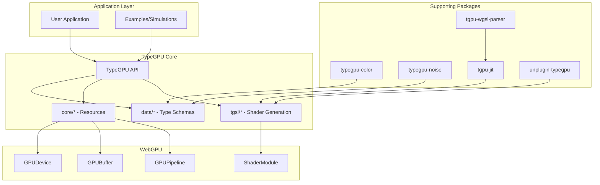

# Project Exploration: TypeGPU - Type-Safe WebGPU

## Overview

TypeGPU is a TypeScript library that enhances the WebGPU API by providing type-safe resource management and shader development. Created by Software Mansion, it acts as a thin abstraction layer between JavaScript and WebGPU/WGSL that improves developer experience while maintaining full GPU capability.

The library's core value proposition is **type safety without lock-in**: developers can granularly eject into vanilla WebGPU at any point, and the mirroring of WGSL syntax in TypeScript means learning TypeGPU helps learn WebGPU itself.

## Directory Structure

```
TypeGPU/
├── packages/
│   ├── typegpu/              # Core library
│   │   ├── src/
│   │   │   ├── core/         # Core abstractions
│   │   │   │   ├── buffer/   # Buffer management (buffer.ts, bufferUsage.ts)
│   │   │   │   ├── function/ # Function shells (tgpuFn.ts, tgpuComputeFn.ts, etc.)
│   │   │   │   ├── pipeline/ # Compute/Render pipelines
│   │   │   │   ├── root/     # Root initialization (init.ts)
│   │   │   │   ├── slot/     # Slot/accessor system for dynamic values
│   │   │   │   ├── texture/  # Texture handling
│   │   │   │   └── vertexLayout/ # Vertex attribute layouts
│   │   │   ├── data/         # Data type schemas (wgslTypes.ts, struct.ts, vector.ts)
│   │   │   ├── std/          # Standard library functions (atomic, boolean, numeric, etc.)
│   │   │   ├── tgsl/         # TGSL (TypeGPU Shader Language) generation
│   │   │   │   ├── wgslGenerator.ts  # JS AST to WGSL code generation
│   │   │   │   └── generationHelpers.ts
│   │   │   └── tgpuBindGroupLayout.ts # Bind group layout definitions
│   │   └── tests/
│   ├── typegpu-color/        # Color helper functions (RGB, HSV, Oklab, sRGB)
│   ├── typegpu-noise/        # Noise/pseudo-random functions (Perlin, random generators)
│   ├── tgpu-jit/             # Just-In-Time transpiler for TypeGPU
│   ├── tgpu-wgsl-parser/     # WGSL code parser
│   ├── tinyest/              # Minimal JS syntax tree type definitions
│   ├── tinyest-for-wgsl/     # Transforms JS into tinyest form for WGSL generation
│   └── unplugin-typegpu/     # Build plugin (Vite, Webpack, Rollup, etc.)
├── apps/
│   ├── typegpu-docs/         # Documentation and example applications
│   │   └── src/content/examples/
│   │       ├── simple/       # Basic examples (triangle, gradient, increment)
│   │       ├── simulation/   # Complex simulations (boids, fluid, game-of-life)
│   │       ├── rendering/    # 3D rendering examples
│   │       └── image-processing/
│   └── infra-benchmarks/     # Performance benchmarks
└── tools/
    └── tgpu-gen/             # CLI tool for automatic TypeGPU code generation
```

## Architecture

### High-Level Diagram



### Type System Architecture

TypeGPU's type system is built on several key concepts:

#### 1. **WGSL Data Schemas** (`packages/typegpu/src/data/wgslTypes.ts`)

TypeGPU defines schemas that mirror WGSL types exactly. Each schema has:
- A type-level representation (the schema itself)
- A runtime representation (JavaScript value)
- A GPU representation (binary layout)

```typescript
// Schema definition pattern
export interface F32 {
  readonly [$internal]: true;
  readonly type: 'f32';
  readonly [$repr]: number;  // TypeScript type maps to number
  (v: number | boolean): number;  // Callable as constructor/cast
}

// Vector schemas with swizzle support
export interface v2f extends Tuple2<number>, Swizzle2<v2f, v3f, v4f> {
  readonly [$internal]: true;
  readonly kind: 'vec2f';
  x: number;
  y: number;
}
```

#### 2. **Type Inference System** (`packages/typegpu/src/shared/repr.ts`)

The library uses sophisticated type inference to map between representations:

```typescript
// Infer<T> - Get JS representation type from schema
type Infer<T extends BaseData> = T[$repr];

// InferGPU<T> - Get GPU buffer representation
type InferGPU<T extends BaseData> = T['~gpuRepr'];

// MemIdentity<T> - Memory-identical type for buffer copies
type MemIdentity<T extends BaseData> = T['~memIdent'];
```

#### 3. **Struct and Array Schemas**

```typescript
// Struct schema with automatic alignment/padding
const Player = d.struct({
  position: d.vec3f,
  health: d.f32,
  id: d.u32,
});

// Array schema with element count
const ParticleArray = d.arrayOf(ParticleStruct, 1000);
```

## Shader Integration

### TGSL (TypeGPU Shader Language)

TypeGPU supports two shader authoring approaches:

#### 1. **Raw WGSL Strings**

```typescript
const gradientFn = tgpu['~unstable'].fn([d.f32], d.vec4f)(
  /* wgsl */ `(ratio: f32) -> vec4f {
    return mix(purple, blue, ratio);
  }`,
).$uses({ purple, blue });
```

#### 2. **JavaScript with Build Plugin** (via `unplugin-typegpu`)

The unplugin transforms JavaScript functions into WGSL at build time:

```typescript
// 'use typegpu' directive triggers transformation
const computeFn = tgpu['~unstable'].computeFn({
  workgroupSize: [64],
})`kernel & js`;  // Directive keeps both implementations

// The plugin:
// 1. Parses JS AST using acorn
// 2. Transforms to tinyest format via tinyest-for-wgsl
// 3. Embeds metadata on globalThis.__TYPEGPU_META__
// 4. Replaces JS impl with error-throwing stub (if kernel-only)
```

### WGSL Code Generation (`packages/typegpu/src/tgsl/wgslGenerator.ts`)

The generator converts JavaScript AST (tinyest format) to WGSL:

```typescript
// Expression generation handles:
- Binary/logical operations (with type coercion)
- Member access (vec2.xy, struct.field)
- Index access (array[i])
- Function calls (with argument type conversion)
- Object/array literals (as WGSL struct/array constructors)

// Key conversion:
function generateExpression(ctx, expression): Snippet {
  // Returns { value: string, dataType: WgslType }
  // Handles type coercion between compatible types
}
```

### External Dependencies Resolution

```typescript
const resolved = tgpu.resolve({
  template: `
    fn getGradientAngle(gradient: Gradient) -> f32 { ... }
  `,
  externals: {
    Gradient,  // Struct schema auto-generates WGSL definition
    someFunction,  // Function auto-generates WGSL function
  },
});
// Outputs complete WGSL with all dependencies included
```

## Buffer and Resource Management

### Typed Buffer Creation

```typescript
// Create typed buffer with schema
const paramsBuffer = root
  .createBuffer(Params, presets.default)  // Params = d.struct({...})
  .$usage('storage');

// Buffer usage types (enforced at type level)
type TgpuBufferUniform<T>   // Uniform buffer
type TgpuBufferMutable<T>   // Storage buffer (read-write)
type TgpuBufferReadonly<T>  // Storage buffer (read-only)

// Type-safe buffer views
const uniformView = buffer.as('uniform');
const mutableView = buffer.as('mutable');
```

### Buffer Operations

```typescript
// Write data (CPU -> GPU)
buffer.write({ position: d.vec3f(1, 2, 3), health: 100 });

// Partial write (only specified fields)
buffer.writePartial({ health: 75 });

// Read data (GPU -> CPU, async)
const data = await buffer.read();

// Copy between buffers (GPU -> GPU)
destBuffer.copyFrom(srcBuffer);
```

### Bind Group Layouts

```typescript
// Type-safe bind group layout definition
const computeBindGroupLayout = tgpu.bindGroupLayout({
  currentTrianglePos: {
    uniform: d.arrayOf(TriangleInfoStruct, triangleAmount),
  },
  nextTrianglePos: {
    storage: d.arrayOf(TriangleInfoStruct, triangleAmount),
    access: 'mutable',
  },
  params: { storage: Params },
});

// Access typed bindings
const { currentTrianglePos, nextTrianglePos, params } = computeBindGroupLayout.bound;

// Create bind group with type checking
const bindGroup = root.createBindGroup(computeBindGroupLayout, {
  currentTrianglePos: buffer1,
  nextTrianglePos: buffer2,
  params: paramsBuffer,
});
```

## Compute and Render Pipelines

### Compute Pipeline

```typescript
// Define compute function with typed inputs
const computeFn = tgpu['~unstable'].computeFn({
  in: { globalInvocationId: d.builtin.globalInvocationId },
  workgroupSize: [64, 1, 1],
})`...WGSL...`;

// Create pipeline
const pipeline = root['~unstable']
  .withCompute(computeFn)
  .createPipeline();

// Dispatch
pipeline.dispatchWorkgroups(workgroupCountX, workgroupCountY, workgroupCountZ);
```

### Render Pipeline

```typescript
// Vertex function with typed I/O
const vertexFn = tgpu['~unstable'].vertexFn({
  in: { vertexIndex: d.builtin.vertexIndex },
  out: { outPos: d.builtin.position, uv: d.vec2f },
})`...WGSL...`;

// Fragment function
const fragmentFn = tgpu['~unstable'].fragmentFn({
  in: { uv: d.vec2f },
  out: d.vec4f,
})`...WGSL...`;

// Create pipeline with fluent API
const pipeline = root['~unstable']
  .withVertex(vertexFn, {})
  .withFragment(fragmentFn, { format: presentationFormat })
  .withPrimitive(primitiveState)
  .withDepthStencil(depthStencilState)
  .createPipeline();
```

### Double Buffering Pattern (from Boids example)

```typescript
// Create two buffers for ping-pong rendering
const trianglePosBuffers = [
  root.createBuffer(...).$usage('storage', 'uniform'),
  root.createBuffer(...).$usage('storage', 'uniform'),
];

// Compute reads from buffer A, writes to buffer B
const computeBindGroups = [0, 1].map((idx) =>
  root.createBindGroup(computeBindGroupLayout, {
    currentTrianglePos: trianglePosBuffers[idx],
    nextTrianglePos: trianglePosBuffers[1 - idx],  // Ping-pong
    params: paramsBuffer,
  })
);

// Render reads from buffer B (the newly computed state)
const renderBindGroups = [0, 1].map((idx) =>
  root.createBindGroup(renderBindGroupLayout, {
    trianglePos: trianglePosBuffers[1 - idx],  // Opposite of compute
    colorPalette: colorPaletteBuffer,
  })
);
```

## Type-Driven API Design

### 1. **Shader Stage Visibility**

Visibility is encoded in the type system:

```typescript
type TgpuShaderStage = 'compute' | 'vertex' | 'fragment';

// Default visibility based on mutability
const DEFAULT_MUTABLE_VISIBILITY: TgpuShaderStage[] = ['compute'];
const DEFAULT_READONLY_VISIBILITY: TgpuShaderStage[] = [
  'compute', 'vertex', 'fragment'
];
```

### 2. **Usage Flags as Phantom Types**

```typescript
interface UniformFlag { usableAsUniform: true; }
interface StorageFlag { usableAsStorage: true; }
interface VertexFlag { usableAsVertex: true; }

// Usage flags are accumulated via $usage()
buffer.$usage('uniform', 'storage')
  // Type now includes both UniformFlag and StorageFlag
```

### 3. **Built-in Type Inference**

```typescript
// Builtins are typed and tracked
const builtin = {
  vertexIndex: d.builtin.vertexIndex,
  position: d.builtin.position,
  globalInvocationId: d.builtin.globalInvocationId,
  // ... etc
};

// Function shells infer I/O types
type InferIO<T extends IORecord> = {
  [K in keyof T]: T[K] extends BaseData ? Infer<T[K]> : never;
};
```

### 4. **Compile-Time Validation**

```typescript
// Type-level enforcement of buffer usage compatibility
type RestrictVertexUsages<TData extends BaseData> = TData extends {
  readonly type: WgslTypeLiteral;
} ? ('uniform' | 'storage' | 'vertex')[]
  : 'vertex'[];  // Only vertex usage for non-WGSL data

// Error at compile time if incompatible usage
const buffer = root.createBuffer(NonWgslData);
buffer.$usage('uniform');  // Type error!
```

## Key Insights

### 1. **Dual-Mode Execution**

TypeGPU functions can have both CPU (JavaScript) and GPU (WGSL) implementations:

```typescript
// createDualImpl creates functions that work in both modes
const f32Cast = createDualImpl(
  // CPU implementation
  (v: number) => { /* JS code */ },
  // GPU implementation
  (v) => snip(`f32(${v.value})`, f32),  // Returns WGSL snippet
  'f32Cast',
);
```

### 2. **Slot/Accessor System for Dynamic Values**

TypeGPU provides a reactive-like system for dynamic shader values:

```typescript
// Slot - a placeholder for a value
const brightnessSlot = tgpu['~unstable'].slot(d.f32);

// Accessor - derived/computed values
const adjustedBrightness = tgpu['~unstable']
  .derived([brightnessSlot], (b) => b * 1.5);

// Bind to pipeline with .with()
pipeline.with(brightnessSlot, 0.8);
```

### 3. **Compiled I/O for Performance**

For hot paths, TypeGPU can pre-compile binary writers/readers:

```typescript
// Generate optimized writer at init time
buffer.compileWriter();  // Uses eval() in supported environments

// Compiled writers bypass generic serialization
const writer = getCompiledWriterForSchema(schema);
writer(dataView, offset, data, littleEndian);
```

### 4. **Interoperability Focus**

The library is designed for library authors to build on:

```typescript
// Libraries can exchange typed buffers without copying
const terrainBuffer = await gen.generateHeightMap(root, opts);
// Type: TgpuBuffer<WgslArray<WgslArray<F32>>> & StorageFlag

// Type mismatch caught at compile time
plot.array1d(root, terrainBuffer);  // Error: 2D vs 1D

plot.array2d(root, terrainBuffer);  // OK!
```

### 5. **Zero-Cost Abstraction Philosophy**

- No runtime overhead for type checking (all at compile time)
- Direct GPU buffer access (no intermediate copies unless needed)
- Optional features (can use raw WebGPU alongside TypeGPU)
- Lazy resource creation (GPU buffers created on first access)

## Ecosystem Packages

| Package | Purpose |
|---------|---------|
| `typegpu` | Core library |
| `typegpu-color` | Color space conversions (RGB, HSV, Oklab, sRGB) |
| `typegpu-noise` | Perlin noise, random number generators |
| `unplugin-typegpu` | Build-time JS-to-WGSL transformation |
| `tgpu-jit` | Runtime JIT transpilation |
| `tgpu-wgsl-parser` | WGSL parsing |
| `tinyest` | Minimal AST format |
| `tinyest-for-wgsl` | JS to tinyest transformation |

## Conclusion

TypeGPU represents a sophisticated approach to WebGPU development that prioritizes:

1. **Type Safety First** - Every resource, buffer, and shader parameter is statically typed
2. **Developer Experience** - TypeScript-native API with automatic WGSL generation
3. **Interoperability** - Designed as a layer between libraries, not a walled garden
4. **Performance** - Zero-cost abstractions with optional compiled I/O paths
5. **Flexibility** - Can eject to raw WebGPU at any point

The type system's complexity (phantom types for usage flags, schema-based inference, dual-mode execution) enables a development experience where most WebGPU errors become compile-time TypeScript errors instead of runtime GPU validation errors.
