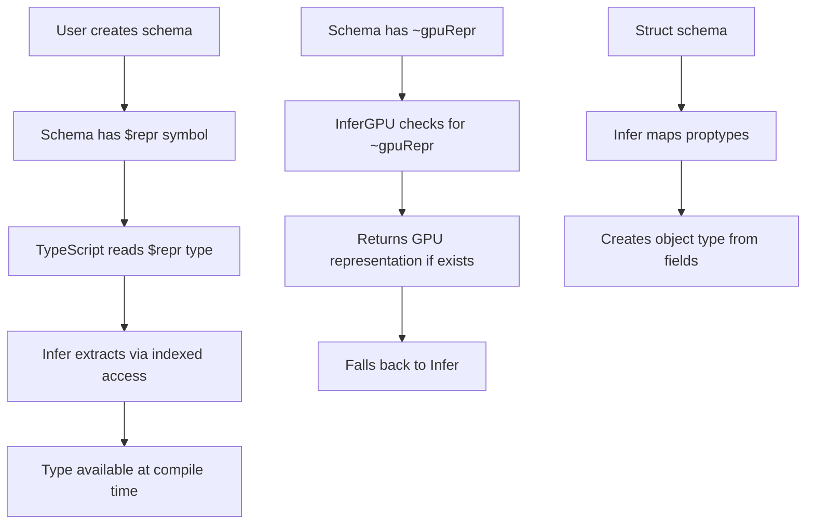

# TypeScript Type System Deep Dive

## Overview

TypeGPU's type system is its core innovation, providing:
- Compile-time type inference from runtime schemas
- Dual CPU/GPU type representations
- Phantom types for usage tracking
- Compile-time validation of WGSL correctness

## Core Type Patterns

### 1. $repr Symbol - Type Inference Foundation

**Problem**: TypeScript cannot infer types from runtime values. TypeGPU uses a symbol property to bridge runtime schemas and compile-time types.

**Implementation**:

```typescript
// src/shared/repr.ts
export const $repr = Symbol('repr');
export const $internal = Symbol('internal');

// Schema with type information
export interface F32 {
  type: 'f32';
  [$repr]: number;  // TypeScript reads this for Infer<F32>
}

// Type extraction pattern
export type Infer<T extends { [$repr]: unknown }> = T[typeof $repr];

// Usage
type FloatType = Infer<F32>;  // number
```

**How It Works**:
1. Schema objects have a `[$repr]` property with a type annotation
2. `Infer<T>` extracts the type via indexed access
3. TypeScript resolves this at compile time

### 2. InferGPU - GPU-Specific Representations

**Problem**: Some types have different representations on CPU vs GPU (e.g., vectors, matrices).

**Implementation**:

```typescript
// src/shared/repr.ts
export type InferGPU<T extends { [$repr]: unknown; ['~gpuRepr']?: unknown }> =
  T extends { ['~gpuRepr']: infer U } ? U : Infer<T>;

// Vector example - different CPU/GPU representations
export interface Vec3f {
  type: 'vec3f';
  [$repr]: { x: number; y: number; z: number };  // CPU representation
  ['~gpuRepr']: { x: number; y: number; z: number; w: number };  // GPU (padded)
}

type CPUVec3 = Infer<Vec3f>;    // { x: number; y: number; z: number }
type GPUVec3 = InferGPU<Vec3f>; // { x: number; y: number; z: number; w: number }
```

### 3. InferPartial - Partial Data Inference

**Problem**: Some operations work with partial data (e.g., vertex attributes).

**Implementation**:

```typescript
// src/shared/repr.ts
export type InferPartial<T extends { [$repr]: unknown; ['~reprPartial']?: unknown }> =
  T extends { ['~reprPartial']: infer U } ? U : Infer<T>;

// Vertex attribute - may only use some components
export interface Vec4f {
  type: 'vec4f';
  [$repr]: { x: number; y: number; z: number; w: number };
  ['~reprPartial']: { x: number; y: number };  // Can use just xy
}
```

### 4. Phantom Types for Usage Flags

**Problem**: WebGPU usage flags must be tracked but don't affect runtime representation.

**Implementation**:

```typescript
// src/core/buffer/bufferUsage.ts
export type BufferUsage = 'uniform' | 'readonly' | 'mutable' | 'vertex';

// Phantom type interface
export interface TgpuBufferUniform<TData extends AnyData> {
  readonly resourceType: 'buffer-usage';
  readonly usage: 'uniform';  // Phantom - only exists at type level
  readonly dataType: TData;
}

export interface TgpuBufferReadonly<TData extends AnyData> {
  readonly resourceType: 'buffer-usage';
  readonly usage: 'readonly';  // Phantom
  readonly dataType: TData;
}

// Usage determines available methods
function writeUniform<T extends TgpuBufferUniform<AnyData>>(
  buffer: T,
  data: Infer<T['dataType']>
): void {
  // Only uniform buffers can be written
}
```

### 5. WGSL Type Literals

**Problem**: WGSL types need to be represented in TypeScript for compile-time validation.

**Implementation**:

```typescript
// src/data/wgslTypes.ts
export interface WgslStruct<TPropTypes extends Record<string, AnyData>> {
  type: 'struct';
  proptypes: TPropTypes;
  [$repr]: { [K in keyof TPropTypes]: Infer<TPropTypes[K]> };
  ['~gpuRepr']?: { [K in keyof TPropTypes]: InferGPU<TPropTypes[K]> };
}

// Struct creation with inferred type
function struct<TPropTypes extends Record<string, AnyData>>(
  propTypes: TPropTypes
): WgslStruct<TPropTypes> {
  return {
    type: 'struct',
    propTypes,
    [$repr]: {} as any,
  };
}

// Usage - type inferred from schema
const Particle = struct({
  position: vec3f,
  velocity: vec3f,
  mass: f32,
});

type ParticleType = Infer<typeof Particle>;
// Resolves to: { position: { x: number; y: number; z: number }; ... }
```

### 6. Conditional Types for Type Extraction

**Problem**: Extract specific properties from complex types.

**Implementation**:

```typescript
// src/data/wgslTypes.ts
export type AnyWgslData =
  | AnyVecInstance
  | AnyMatInstance
  | WgslStruct<any>
  | WgslArray<any>
  | Atomic<any>
  | Decorated<any, any>
  | LooseDecorated<any, any>
  | ptr
  | alias
  | abstractInt
  | abstractFloat
  | F32
  | I32
  | U32
  | Bool
  | Snippet;

// Type guards
export function isWgslData(value: unknown): value is AnyWgslData {
  return (
    !!value &&
    typeof value === 'object' &&
    'type' in value
  );
}

// Conditional type for array element extraction
export type ElementOf<T> = T extends WgslArray<infer U> ? U : never;
```

### 7. Branded Types for Type Safety

**Problem**: Prevent mixing incompatible types (e.g., different bind group layouts).

**Implementation**:

```typescript
// src/tgpuBindGroupLayout.ts
declare const brand: unique symbol;

export interface TgpuBindGroupLayout<
  TEntries extends Record<string, TgpuLayoutEntry> = Record<string, TgpuLayoutEntry>
> {
  readonly [brand]: 'TgpuBindGroupLayout';
  readonly entries: TEntries;
  readonly index?: number;
}

// Prevents assignment of wrong layout type
function createBindGroup<T extends TgpuBindGroupLayout>(
  layout: T,
  entries: { [K in keyof T['entries']]: ... }
): TgpuBindGroup<T> {
  // Type-safe entry creation
}
```

### 8. Template Literal Types for Swizzle

**Problem**: Vector swizzle (e.g., `vec.xyz`, `vec.yx`) needs type-safe access.

**Implementation**:

```typescript
// src/data/wgslTypes.ts
type Swizzle2 = 'xy' | 'xz' | 'xw' | 'yx' | 'yz' | 'yw' | 'zw' | 'wx' | ...;
type Swizzle3 = 'xyz' | 'xyw' | 'xzy' | 'xzw' | 'xwz' | ...;
type Swizzle4 = 'xyzw' | 'xywz' | 'xzyw' | ...;

// Swizzle result types
export interface Swizzle2<T1, T2> {
  readonly x: T1;
  readonly y: T2;
}

export interface Swizzle3<T1, T2, T3> {
  readonly x: T1;
  readonly y: T2;
  readonly z: T3;
}

// Vector with swizzle getters
export interface Vec4f {
  readonly x: number;
  readonly y: number;
  readonly z: number;
  readonly w: number;
  readonly xy: { x: number; y: number };
  readonly xz: { x: number; z: number };
  // ... 100+ swizzle combinations
}
```

## Type Inference Flow



## Compile-Time Validation

### 1. Function Parameter Validation

```typescript
// src/core/function/tgpuFn.ts
interface TgpuFn<
  TArgs extends AnyWgslData[] | Record<string, AnyWgslData>,
  TReturn extends AnyWgslData
> {
  // Enforces argument types at call site
  (...args: TArgs extends AnyWgslData[]
    ? { [K in keyof TArgs]: Infer<TArgs[K]> }
    : Infer<TArgs>
  ): Infer<TReturn>;
}

// Usage - type error if wrong arguments
const add = tgpu.fn([f32, f32], f32)`
  (a, b) => a + b
`;

add(1.0, 2.0);      // OK
add(1, 2);          // Error: number not assignable to f32
add(1.0);           // Error: expected 2 arguments
```

### 2. Struct Field Validation

```typescript
// src/data/struct.ts
function struct<T extends Record<string, AnyData>>(
  propTypes: T
): WgslStruct<T> {
  return {
    type: 'struct',
    propTypes,
    [$repr]: {} as Infer<WgslStruct<T>>,
  };
}

// Usage - type inference from schema
const Point = struct({
  x: f32,
  y: f32,
});

const p: Infer<typeof Point> = { x: 1.0, y: 2.0 };  // OK
const p2: Infer<typeof Point> = { x: 1 };          // Error: number not f32
const p3: Infer<typeof Point> = { x: 1.0 };        // Error: missing y
```

### 3. Buffer Usage Validation

```typescript
// src/core/buffer/bufferUsage.ts
type TgpuBufferUsage<
  TData extends AnyData,
  TUsage extends BufferUsage
> = TUsage extends 'uniform' ? TgpuBufferUniform<TData> :
   TUsage extends 'readonly' ? TgpuBufferReadonly<TData> :
   TUsage extends 'mutable' ? TgpuBufferMutable<TData> :
   TgpuBuffer<TData>;

// Only mutable buffers can be written to
function writePartial<T extends TgpuBufferMutable<AnyData>>(
  buffer: T,
  data: Partial<Infer<T['dataType']>>
): void;

// Only uniform buffers can be bound as uniform
function bindUniform<T extends TgpuBufferUniform<AnyData>>(
  buffer: T
): void;
```

## Advanced Type Patterns

### 1. Mapped Types for Schema Transformation

```typescript
// Transform schema fields to CPU types
export type Infer<T extends { [$repr]: unknown }> = T[typeof $repr];

// Transform schema fields to GPU types
export type InferGPU<T extends { [$repr]: unknown }> =
  T extends { ['~gpuRepr']: infer U } ? U : T[typeof $repr];

// Transform to partial types
export type InferPartial<T extends { [$repr]: unknown }> =
  Partial<T[typeof $repr]>;
```

### 2. Recursive Type Definitions

```typescript
// Nested struct support
export interface WgslStruct<TPropTypes extends Record<string, AnyData>> {
  type: 'struct';
  propTypes: TPropTypes;
  [$repr]: {
    [K in keyof TPropTypes]: Infer<TPropTypes[K]>;
  };
}

// Recursive inference handles nested structures
type NestedType = Infer<WgslStruct<{
  outer: WgslStruct<{ inner: F32 }>;
}>>;
// Resolves to: { outer: { inner: number } }
```

### 3. Type-Level Computations

```typescript
// Calculate array size at type level
type ArraySize<T extends WgslArray<any>> = T['elementCount'];

// Extract struct field type
type FieldType<
  T extends WgslStruct<any>,
  K extends keyof T['propTypes']
> = Infer<T['propTypes'][K]>;
```

## Connections to Other Systems

### Resolution System
- Types are resolved to WGSL strings
- Type information drives code generation

```typescript
// src/types.ts
export interface ResolutionCtx {
  resolveValue<T extends BaseData>(
    value: Infer<T>,
    schema: T
  ): string;
}
```

### Shader Generation
- Type information used for WGSL output
- Type-driven function signatures

```typescript
// src/tgsl/wgslGenerator.ts
function generateFunction(ctx, returnType) {
  const wgslType = ctx.resolve(returnType);
  return `-> ${wgslType}`;
}
```

## Type System Limitations

1. **Runtime Overhead**: `$repr` values exist only at compile time but schemas are runtime objects
2. **Complexity**: Type definitions are complex and can be hard to debug
3. **TypeScript Version**: Requires TypeScript 5.x for advanced features
4. **Inference Depth**: Deep nesting can cause TypeScript to hit recursion limits

## Best Practices

1. **Always use `Infer<T>`** - Never manually specify types that can be inferred
2. **Use branded types** - For type-level isolation of incompatible types
3. **Leverage conditional types** - For extracting nested type information
4. **Document type patterns** - Complex types need clear documentation
