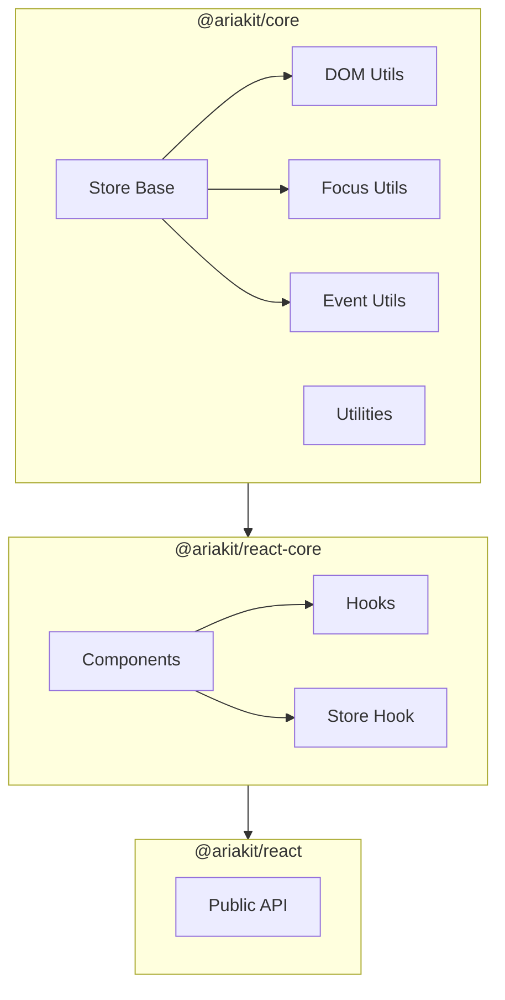
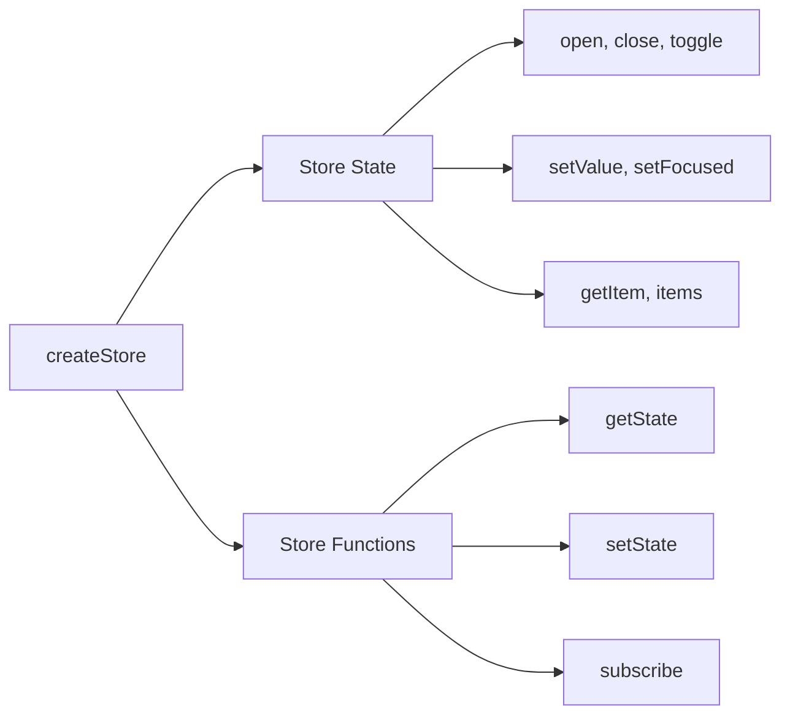
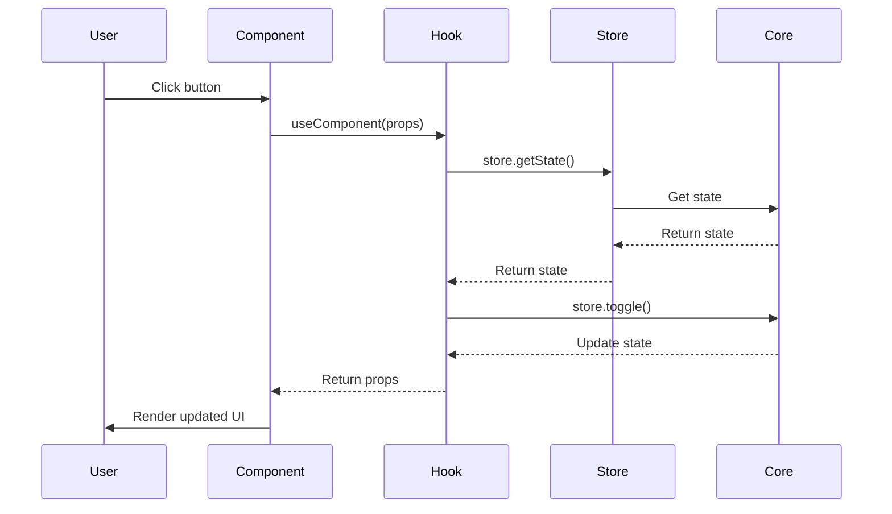

# Project Exploration: Ariakit (UIKits)

## Overview

Ariakit is a toolkit for building accessible web apps with React. It provides low-level, unstyled components that follow WAI-ARIA design patterns, giving developers complete control over styling while ensuring accessibility out of the box.

**Key Characteristics:**
- **Accessible by Default** - Follows WAI-ARIA design patterns
- **Unstyled** - Complete design freedom, no opinionated styles
- **Composable** - Build complex components from primitives
- **Type Safe** - Full TypeScript support
- **Framework Focused** - React-first with Solid.js support
- **Headless** - Separation of behavior and presentation

## Repository Structure

```
ariakit/
├── packages/
│   ├── @ariakit/react/           # Main React package
│   │   ├── src/
│   │   │   ├── index.ts          # Main exports
│   │   │   ├── button.ts         # Button component
│   │   │   ├── checkbox.ts       # Checkbox component
│   │   │   ├── collection.ts     # Collection component
│   │   │   ├── combobox.ts       # Combobox component
│   │   │   ├── command.ts        # Command component
│   │   │   ├── composite.ts      # Composite component
│   │   │   ├── dialog.ts         # Dialog component
│   │   │   ├── disclosure.ts     # Disclosure component
│   │   │   ├── focus-trap.ts     # Focus trap
│   │   │   ├── focusable.ts      # Focusable component
│   │   │   ├── form.ts           # Form components
│   │   │   ├── group.ts          # Group component
│   │   │   ├── heading.ts        # Heading component
│   │   │   ├── hovercard.ts      # Hovercard component
│   │   │   ├── menu.ts           # Menu components
│   │   │   ├── menubar.ts        # Menubar component
│   │   │   ├── popover.ts        # Popover component
│   │   │   ├── portal.ts         # Portal component
│   │   │   ├── radio.ts          # Radio component
│   │   │   ├── role.ts           # Role component
│   │   │   ├── select.ts         # Select component
│   │   │   ├── separator.ts      # Separator component
│   │   │   ├── store.ts          # Store exports
│   │   │   ├── tab.ts            # Tab components
│   │   │   ├── toolbar.ts        # Toolbar component
│   │   │   ├── tooltip.ts        # Tooltip component
│   │   │   └── visually-hidden.ts # Visually hidden
│   │   └── package.json
│   │
│   ├── @ariakit/react-core/      # Core React implementation
│   │   ├── src/
│   │   │   ├── index.ts          # Core exports
│   │   │   ├── button/
│   │   │   │   └── button.tsx    # Button implementation
│   │   │   ├── checkbox/
│   │   │   │   ├── checkbox.tsx
│   │   │   │   └── checkbox-store.ts
│   │   │   ├── collection/
│   │   │   │   ├── collection.tsx
│   │   │   │   └── collection-store.ts
│   │   │   ├── combobox/
│   │   │   │   ├── combobox.tsx
│   │   │   │   └── combobox-store.ts
│   │   │   ├── command/
│   │   │   │   └── command.tsx
│   │   │   ├── composite/
│   │   │   │   ├── composite.tsx
│   │   │   │   ├── composite-store.ts
│   │   │   │   └── composite-overflow-store.ts
│   │   │   ├── dialog/
│   │   │   │   ├── dialog.tsx    # Dialog implementation
│   │   │   │   ├── dialog-store.ts
│   │   │   │   ├── dialog-context.tsx
│   │   │   │   ├── dialog-backdrop.tsx
│   │   │   │   └── utils/
│   │   │   │       ├── disable-tree.ts
│   │   │   │       ├── mark-tree-outside.ts
│   │   │   │       ├── use-prevent-body-scroll.ts
│   │   │   │       ├── use-hide-on-interact-outside.ts
│   │   │   │       ├── use-nested-dialogs.tsx
│   │   │   │       ├── supports-inert.ts
│   │   │   │       └── walk-tree-outside.ts
│   │   │   ├── disclosure/
│   │   │   │   ├── disclosure.tsx
│   │   │   │   └── disclosure-store.ts
│   │   │   ├── focusable/
│   │   │   │   ├── focusable.tsx
│   │   │   │   └── focusable-store.ts
│   │   │   ├── form/
│   │   │   │   ├── form.tsx
│   │   │   │   └── form-store.ts
│   │   │   ├── hovercard/
│   │   │   │   ├── hovercard.tsx
│   │   │   │   ├── hovercard-store.ts
│   │   │   │   └── utils/polygon.ts
│   │   │   ├── menu/
│   │   │   │   ├── menu.tsx
│   │   │   │   ├── menu-store.ts
│   │   │   │   ├── menu-bar-store.ts
│   │   │   │   └── menubar-store.ts
│   │   │   ├── popover/
│   │   │   │   ├── popover.tsx
│   │   │   │   ├── popover-store.ts
│   │   │   │   └── popover-arrow-path.ts
│   │   │   ├── portal/
│   │   │   │   └── portal.tsx
│   │   │   ├── radio/
│   │   │   │   ├── radio.tsx
│   │   │   │   └── radio-store.ts
│   │   │   ├── select/
│   │   │   │   ├── select.tsx
│   │   │   │   └── select-store.ts
│   │   │   ├── tab/
│   │   │   │   ├── tab.tsx
│   │   │   │   └── tab-store.ts
│   │   │   ├── toolbar/
│   │   │   │   ├── toolbar.tsx
│   │   │   │   └── toolbar-store.ts
│   │   │   ├── tooltip/
│   │   │   │   ├── tooltip.tsx
│   │   │   │   └── tooltip-store.ts
│   │   │   └── utils/
│   │   │       ├── hooks.ts      # Custom hooks
│   │   │       ├── system.tsx    # createHook, forwardRef
│   │   │       ├── types.ts      # TypeScript types
│   │   │       ├── store.tsx     # Store utilities
│   │   │       └── misc.ts       # Miscellaneous
│   │   └── package.json
│   │
│   └── @ariakit/core/            # Core logic (framework-agnostic)
│       ├── src/
│       │   ├── index.ts          # Core exports
│       │   ├── checkbox/
│       │   │   └── checkbox-store.ts
│       │   ├── collection/
│       │   │   └── collection-store.ts
│       │   ├── combobox/
│       │   │   └── combobox-store.ts
│       │   ├── composite/
│       │   │   ├── composite-store.ts
│       │   │   └── composite-overflow-store.ts
│       │   ├── dialog/
│       │   │   └── dialog-store.ts
│       │   ├── disclosure/
│       │   │   └── disclosure-store.ts
│       │   ├── form/
│       │   │   ├── form-store.ts
│       │   │   └── types.ts
│       │   ├── hovercard/
│       │   │   └── hovercard-store.ts
│       │   ├── menu/
│       │   │   ├── menu-store.ts
│       │   │   └── menu-bar-store.ts
│       │   ├── popover/
│       │   │   └── popover-store.ts
│       │   ├── radio/
│       │   │   └── radio-store.ts
│       │   ├── select/
│       │   │   └── select-store.ts
│       │   ├── tab/
│       │   │   └── tab-store.ts
│       │   ├── toolbar/
│       │   │   └── toolbar-store.ts
│       │   ├── tooltip/
│       │   │   └── tooltip-store.ts
│       │   └── utils/
│       │       ├── array.ts      # Array utilities
│       │       ├── dom.ts        # DOM utilities
│       │       ├── events.ts     # Event utilities
│       │       ├── focus.ts      # Focus management
│       │       ├── misc.ts       # Miscellaneous
│       │       ├── platform.ts   # Platform detection
│       │       ├── store.ts      # Store base class
│       │       ├── types.ts      # Shared types
│       │       └── undo.ts       # Undo utilities
│       └── package.json
│
├── examples/                     # Usage examples
│   ├── button/
│   │   ├── index.react.tsx
│   │   └── style.css
│   ├── checkbox-custom/
│   │   ├── index.react.tsx
│   │   ├── checkbox.tsx
│   │   └── style.css
│   ├── dialog/
│   │   └── index.react.tsx
│   ├── combobox/
│   │   └── index.react.tsx
│   ├── menu/
│   │   └── index.react.tsx
│   └── ...
│
├── website/                      # Documentation website
├── scripts/                      # Build scripts
├── package.json                  # Root package.json
└── tsconfig.json
```

## Architecture

### Core Architecture



### Store Pattern



### Component Pattern



## Components

### Form Components

| Component | Description |
|-----------|-------------|
| Button | Accessible button with role management |
| Checkbox | Checkbox with label and group support |
| Radio | Radio buttons with group management |
| Select | Custom select dropdown |
| Combobox | Searchable select with autocomplete |
| Form | Form with validation and field management |
| Separator | Visual separator (hr/divider) |

### Overlay Components

| Component | Description |
|-----------|-------------|
| Dialog | Modal dialog with focus trap |
| Disclosure | Collapsible content (show/hide) |
| Popover | Floating popover with arrow |
| Hovercard | Hover-activated popover |
| Menu | Dropdown menu with items |
| MenuBar | Horizontal menu bar |
| Tooltip | Hover tooltip |
| Portal | Render children in portal |

### Navigation Components

| Component | Description |
|-----------|-------------|
| Tab | Tab navigation with panels |
| Composite | Grid/keyboard navigable container |
| Toolbar | Toolbar with grouped controls |
| Collection | Virtualizable collection |

### Utility Components

| Component | Description |
|-----------|-------------|
| Focusable | Makes any element focusable |
| FocusTrap | Trap focus within container |
| Group | Group related elements |
| Heading | Accessible heading with level |
| Portal | Teleport to different DOM node |
| VisuallyHidden | Screen-reader only content |

## Core API

### Store Creation

```typescript
import { useDialogStore } from '@ariakit/react';

function DialogExample() {
  const dialog = useDialogStore({
    open: false,
    setOpen: (open) => console.log(open),
  });

  return (
    <>
      <button onClick={dialog.toggle}>Open</button>
      <Dialog store={dialog}>Content</Dialog>
    </>
  );
}
```

### Button Component

```typescript
import { Button } from '@ariakit/react';

// Native button
<Button>Click me</Button>

// Custom element with button role
<Button render={<div />}>Accessible div button</Button>

// With command
<Button onClick={() => console.log('clicked')}>
  With onClick
</Button>
```

### Dialog Component

```typescript
import { useDialogStore, Dialog, DialogBackdrop, DialogDismiss } from '@ariakit/react';

function MyDialog() {
  const dialog = useDialogStore();

  return (
    <>
      <button onClick={dialog.toggle}>Open Dialog</button>

      <Dialog store={dialog} modal backdrop>
        <DialogDismiss>Close</DialogDismiss>
        <p>Dialog content</p>
      </Dialog>
    </>
  );
}
```

### Combobox Component

```typescript
import { useComboboxStore, Combobox, ComboboxItem } from '@ariakit/react';

function SearchableSelect() {
  const items = ['Apple', 'Banana', 'Cherry', 'Date'];

  const combobox = useComboboxStore({
    items,
    setValue: (value) => console.log(value),
  });

  return (
    <>
      <Combobox store={combobox} placeholder="Search..." />
      {combobox.items.map((item) => (
        <ComboboxItem key={item} store={combobox} value={item} />
      ))}
    </>
  );
}
```

### Menu Component

```typescript
import { useMenuStore, Menu, MenuButton, MenuItem } from '@ariakit/react';

function DropdownMenu() {
  const menu = useMenuStore();

  return (
    <>
      <MenuButton store={menu}>Options</MenuButton>
      <Menu store={menu}>
        <MenuItem>Edit</MenuItem>
        <MenuItem>Share</MenuItem>
        <MenuItem>Delete</MenuItem>
      </Menu>
    </>
  );
}
```

### Tab Component

```typescript
import { useTabStore, Tab, TabList, TabPanel } from '@ariakit/react';

function Tabs() {
  const tab = useTabStore({
    selectedId: 'tab1',
  });

  return (
    <>
      <TabList store={tab}>
        <Tab id="tab1">Tab 1</Tab>
        <Tab id="tab2">Tab 2</Tab>
        <Tab id="tab3">Tab 3</Tab>
      </TabList>
      <TabPanel store={tab} tabId="tab1">Panel 1</TabPanel>
      <TabPanel store={tab} tabId="tab2">Panel 2</TabPanel>
      <TabPanel store={tab} tabId="tab3">Panel 3</TabPanel>
    </>
  );
}
```

## Store System

### Dialog Store

```typescript
// @ariakit/core/dialog/dialog-store.ts
export function createDialogStore(props: DialogStoreProps = {}) {
  const store = createStore({
    open: false,
    mounted: false,
    contentElement: null,
    disclosureElement: null,
    ...props,
  });

  return {
    ...store,
    open: () => store.setState('open', true),
    close: () => store.setState('open', false),
    toggle: () => store.setState('open', (open) => !open),
    hide: () => store.setState('open', false),
  };
}
```

### Store Base

```typescript
// @ariakit/core/utils/store.ts
export function createStore<T extends State>(initialState: T) {
  const state = { ...initialState };
  const listeners = new Set<Listener>();

  return {
    getState: () => state,
    setState: (key: keyof T, value: any) => {
      state[key] = value;
      listeners.forEach((fn) => fn());
    },
    subscribe: (fn: Listener) => {
      listeners.add(fn);
      return () => listeners.delete(fn);
    },
  };
}
```

## Accessibility Features

### Focus Management

- Automatic focus trapping in modals
- Focus restoration on close
- Keyboard navigation (arrow keys, Tab, Escape)
- Roving tabindex for composite widgets

### ARIA Attributes

```typescript
// Dialog renders:
<div
  role="dialog"
  aria-modal="true"
  aria-labelledby={headingId}
  aria-describedby={descriptionId}
  data-dialog=""
/>

// Menu renders:
<div
  role="menu"
  aria-orientation="vertical"
  data-menu=""
/>
```

### Keyboard Navigation

| Key | Action |
|-----|--------|
| Tab | Move between focusable elements |
| Escape | Close dialog/menu/hovercard |
| Arrow keys | Navigate composite widgets |
| Enter/Space | Activate buttons/menu items |
| Home | Go to first item |
| End | Go to last item |

## Styling

### Unstyled by Default

```css
/* All components are unstyled - you control everything */
<button data-button="" class="my-custom-button">
  Click me
</button>
```

### CSS Custom Properties

```css
:root {
  --dialog-backdrop: rgba(0, 0, 0, 0.5);
  --dialog-bg: white;
  --dialog-border-radius: 8px;
}
```

### Component Selectors

```css
/* Data attributes for styling */
[data-dialog] { }
[data-menu] { }
[data-button] { }
[data-menu-item] { }
[data-selected] { }
[data-focus-visible] { }
[data-disabled] { }
[data-presentation] { }
```

## Dependencies

### Core Dependencies

| Package | Purpose |
|---------|---------|
| `react` | UI framework (peer) |
| `react-dom` | DOM rendering (peer) |
| `typescript` | Type system |

### Dev Dependencies

| Package | Purpose |
|---------|---------|
| `vitest` | Testing |
| `playwright` | E2E testing |
| `biome` | Linting/formatting |
| `tsup` | Building |
| `lerna` | Monorepo management |

## Examples

### Custom Checkbox

```tsx
import { useCheckboxStore, Checkbox, CheckboxCheck } from '@ariakit/react';

function CustomCheckbox() {
  const checkbox = useCheckboxStore({ value: true });

  return (
    <label style={{ display: 'flex', alignItems: 'center', gap: 8 }}>
      <Checkbox
        store={checkbox}
        style={{
          width: 20,
          height: 20,
          border: '1px solid gray',
          display: 'flex',
          alignItems: 'center',
          justifyContent: 'center',
        }}
      >
        <CheckboxCheck>✓</CheckboxCheck>
      </Checkbox>
      <span>Accept terms</span>
    </label>
  );
}
```

### Nested Dialogs

```tsx
import { useDialogStore, Dialog, Button } from '@ariakit/react';

function NestedDialogs() {
  const dialog1 = useDialogStore();
  const dialog2 = useDialogStore();

  return (
    <>
      <Button onClick={dialog1.toggle}>Open First Dialog</Button>

      <Dialog store={dialog1}>
        <p>First dialog content</p>
        <Button onClick={dialog2.toggle}>Open Second Dialog</Button>
      </Dialog>

      <Dialog store={dialog2}>
        <p>Second (nested) dialog</p>
      </Dialog>
    </>
  );
}
```

### Combobox with Groups

```tsx
import { useComboboxStore, Combobox, ComboboxItem, ComboboxGroup } from '@ariakit/react';

function GroupedCombobox() {
  const combobox = useComboboxStore({
    items: [
      { value: 'Apple', category: 'Fruit' },
      { value: 'Banana', category: 'Fruit' },
      { value: 'Carrot', category: 'Vegetable' },
      { value: 'Broccoli', category: 'Vegetable' },
    ],
  });

  return (
    <>
      <Combobox store={combobox} />
      <ComboboxGroup label="Fruits">
        <ComboboxItem value="Apple" />
        <ComboboxItem value="Banana" />
      </ComboboxGroup>
      <ComboboxGroup label="Vegetables">
        <ComboboxItem value="Carrot" />
        <ComboboxItem value="Broccoli" />
      </ComboboxGroup>
    </>
  );
}
```

## Key Insights

1. **Store-Based State** - Centralized store pattern for complex state management.

2. **Framework Agnostic Core** - Core logic is separate from React, enabling Solid.js port.

3. **Compound Components** - Components work together through context and store.

4. **Render Props Alternative** - Uses `render` prop for custom element rendering.

5. **Type-Safe by Design** - Full TypeScript inference from props to state.

6. **Accessibility First** - Every component follows WAI-ARIA patterns.

7. **Unstyled Flexibility** - No CSS opinions, complete design control.

8. **Focus Management** - Sophisticated focus handling for modals and menus.

## Open Considerations

1. **Vue Support** - Is there a Vue version planned?

2. **Angular Support** - Any plans for Angular components?

3. **Animation Support** - How to integrate with animation libraries?

4. **Mobile Touch** - Touch gesture support for mobile menus?

5. **Virtual Scrolling** - Built-in virtualization for large lists?

6. **Theming** - Recommended approach for consistent theming?

7. **SSR Compatibility** - Full Next.js SSR support details?

8. **Testing Utilities** - Testing helpers for Ariakit components?
