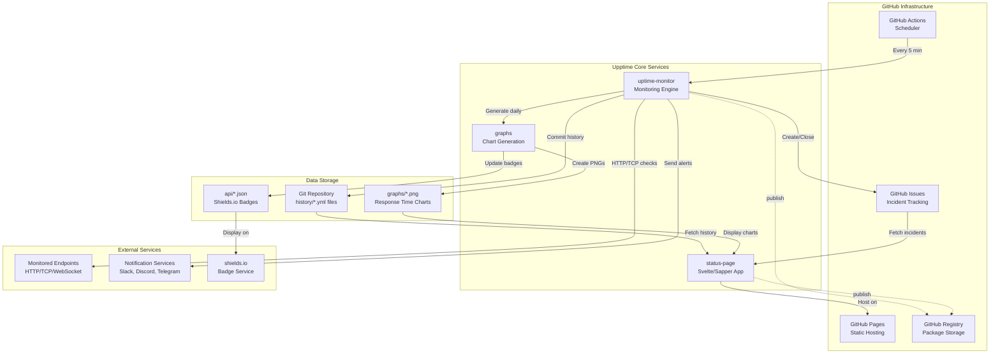
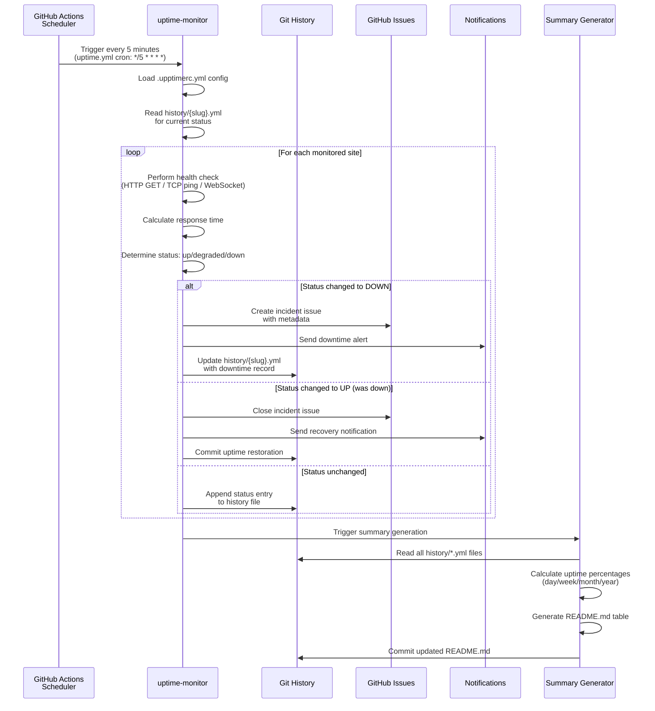

# Project Exploration: Upptime Ecosystem

## Overview

**Upptime** is a free, open-source uptime monitoring and status page system that operates entirely on GitHub infrastructure without requiring dedicated servers. It represents a novel approach to infrastructure monitoring by leveraging GitHub Actions as the monitoring engine, GitHub Issues for incident tracking, and GitHub Pages for status page hosting.

The ecosystem consists of 7 interconnected projects:

1. **upptime/** - The main template repository that users fork to set up their monitoring
2. **upptime-core/** - Core monitoring logic and shared libraries
3. **upptime.js.org/** - Documentation website built with Docusaurus
4. **status-page/** - Svelte-based status page application
5. **graphs/** - Graph generation service for response time visualization
6. **uptime-monitor/** - The primary monitoring service that runs in GitHub Actions
7. **uptime-kuma/** - A self-hosted alternative with real-time WebSocket-based monitoring

The key innovation is the **serverless-by-design** architecture: monitoring runs on GitHub Actions schedulers (every 5 minutes), data is stored as YAML files committed to git history, incidents are tracked via GitHub Issues, and the status page is a statically-generated site that fetches data from the GitHub API at runtime.

## Repository

- **Location:** /home/darkvoid/Boxxed/@formulas/Others/src.upptime
- **Remote:** N/A (local mirror, not a git repository)
- **Primary Language:** TypeScript, JavaScript, Svelte
- **License:** MIT (code), Open Database License (history data)

## Directory Structure

```
/home/darkvoid/Boxxed/@formulas/Others/src.upptime/
├── upptime/                          # Main template repository
│   ├── .github/
│   │   ├── ISSUE_TEMPLATE/          # Bug report & maintenance event templates
│   │   └── workflows/               # GitHub Actions workflows (auto-generated)
│   │       ├── uptime.yml           # Runs every 5 minutes - checks site status
│   │       ├── response-time.yml    # Runs 4x daily - records response times
│   │       ├── graphs.yml           # Runs daily - generates PNG graphs
│   │       ├── summary.yml          # Runs daily - updates README with status
│   │       ├── site.yml             # Builds and deploys status website
│   │       ├── updates.yml          # Checks for Upptime updates
│   │       └── update-template.yml  # Updates workflow templates
│   ├── api/                         # JSON badges for shields.io integration
│   │   ├── google/                  # Per-site API endpoints
│   │   │   ├── uptime.json          # Shields.io badge data
│   │   │   └── response-time.json
│   │   └── ... (wikipedia, hacker-news, etc.)
│   ├── assets/
│   │   └── upptime-icon.svg
│   ├── graphs/                      # Generated response time graphs
│   │   ├── google/
│   │   │   ├── response-time-day.png
│   │   │   ├── response-time-week.png
│   │   │   └── response-time-month.png
│   │   └── ...
│   ├── history/                     # YAML files with uptime history per site
│   │   ├── google.yml               # Commit history = uptime timeline
│   │   ├── wikipedia.yml
│   │   └── summary.json             # Aggregated status data
│   ├── .upptimerc.yml               # Configuration file (sites to monitor)
│   └── README.md                    # Auto-generated status summary
│
├── upptime-core/                     # Core shared logic
│   ├── src/
│   │   └── index.ts                 # Placeholder entry point
│   ├── actions.yml                  # GitHub Actions composite action
│   └── package.json
│
├── uptime-monitor/                  # Main monitoring engine (NPM package)
│   ├── src/
│   │   ├── index.ts                 # Command router (update, graphs, summary)
│   │   ├── update.ts                # Core uptime checking logic
│   │   ├── summary.ts               # README/summary generation
│   │   ├── graphs.ts                # Graph generation
│   │   ├── site.ts                  # Site building
│   │   ├── update-template.ts       # Template update logic
│   │   ├── dependencies.ts          # Dependency update checks
│   │   ├── interfaces.ts            # TypeScript interfaces
│   │   └── helpers/
│   │       ├── calculate-uptime.ts  # Uptime percentage calculations
│   │       ├── calculate-response-time.ts
│   │       ├── config.ts            # .upptimerc.yml parsing
│   │       ├── git.ts               # Git commit/push utilities
│   │       ├── github.ts            # Octokit setup
│   │       ├── notifme.ts           # Notification sending
│   │       ├── ping.ts              # TCP ping implementation
│   │       ├── request.ts           # HTTP request wrapper
│   │       └── workflows.ts         # Workflow file templates
│   ├── dist/                        # Compiled JavaScript (bundled)
│   └── package.json
│
├── status-page/                     # Status page web application
│   ├── src/
│   │   ├── server.js                # Express/Sapper SSR server
│   │   ├── client.js                # Client-side Sapper entry
│   │   ├── service-worker.js        # PWA support
│   │   ├── template.html            # Base HTML template
│   │   ├── components/              # Svelte components
│   │   │   ├── LiveStatus.svelte    # Real-time status grid
│   │   │   ├── History.svelte       # Uptime history view
│   │   │   ├── Graph.svelte         # Response time charts
│   │   │   ├── Incidents.svelte     # Incident list
│   │   │   ├── ActiveIncidents.svelte
│   │   │   ├── ActiveScheduled.svelte
│   │   │   └── Nav.svelte
│   │   ├── routes/
│   │   │   ├── index.svelte         # Homepage
│   │   │   ├── _layout.svelte       # Shared layout
│   │   │   ├── history/[number].svelte
│   │   │   └── incident/[number].svelte
│   │   └── utils/
│   │       └── createOctokit.js     # GitHub API client
│   ├── static/
│   │   ├── themes/                  # CSS themes (light, dark, night)
│   │   └── manifest.json            # PWA manifest
│   ├── .upptimerc.yml               # Status page configuration
│   └── package.json                 # Sapper, Svelte, Rollup
│
├── graphs/                          # Standalone graph generation
│   ├── src/
│   │   ├── index.ts                 # Chart generation logic
│   │   ├── cli.ts                   # CLI entry point
│   │   └── index.spec.ts            # Jest tests
│   ├── .licenses/npm/               # License compliance files
│   └── package.json                 # chartjs-node-canvas, Octokit
│
├── upptime.js.org/                   # Documentation website
│   ├── docs/                        # Docusaurus documentation
│   │   ├── how-it-works.md
│   │   ├── get-started.md
│   │   ├── configuration.md
│   │   ├── notifications.md
│   │   └── ...
│   ├── src/
│   │   ├── pages/index.js           # Homepage
│   │   └── css/custom.css
│   ├── static/img/                  # Screenshots and assets
│   ├── docusaurus.config.js
│   └── package.json
│
└── uptime-kuma/                     # Alternative self-hosted monitor
    ├── server/                      # Node.js backend
    │   ├── server.js                # Express server entry
    │   ├── uptime-kuma-server.js    # Main server class
    │   ├── model/                   # Database models
    │   ├── routers/                 # API routes
    │   ├── socket-handlers/         # WebSocket handlers
    │   ├── notification-providers/  # 90+ notification services
    │   └── monitor-types/           # HTTP, TCP, Ping, Docker, etc.
    ├── src/                         # Vue 3 frontend
    │   ├── pages/
    │   ├── components/
    │   ├── lang/                    # i18n translations
    │   └── modules/
    ├── db/                          # SQLite database
    │   ├── kuma.db
    │   ├── knex_migrations/
    │   └── old_migrations/
    ├── docker/                      # Docker configurations
    ├── config/
    │   ├── vite.config.js           # Frontend build config
    │   └── playwright.config.js     # E2E testing
    └── package.json                 # Vue 3, Socket.IO, SQLite
```

## Architecture

### High-Level System Architecture



### Monitoring Workflow Pipeline



### Status Page Data Flow

```mermaid
graph LR
    subgraph "Client-Side (Browser)"
        USR[User Browser]
        SVC[Svelte Components]
        OCT[Octokit Client]
    end

    subgraph "GitHub API"
        GAPI[GitHub REST API]
        RAW[raw.githubusercontent.com]
    end

    subgraph "Status Page"
        CONFIG[config.json]
        SUMM[summary.json]
        HIST[history/*.yml]
        ISSUES[Issues API]
    end

    USR -->|1. Load page| SVC
    SVC -->|2. Fetch| CONFIG
    SVC -->|3. Fetch| RAW
    RAW -->|Returns| SUMM
    SUMM -->|Contains| HIST
    SVC -->|4. Fetch incidents| GAPI
    GAPI -->|Returns| ISSUES
    SVC -->|5. Render| USR

    note right of SVC: Components:<br/>- LiveStatus.svelte<br/>- History.svelte<br/>- Graph.svelte<br/>- Incidents.svelte
```

### Graph Generation Pipeline

```mermaid
graph TB
    HIST[history/{slug}.yml<br/>Git Commit History] -->|Fetch all commits| OCT[Octokit API]
    OCT -->|Parse commit messages| PARSE[Message Parser]
    PARSE -->|Extract response times| RT["321ms in commit<br/>message"]
    RT -->|Filter by period| FILTER[Time Filters]
    FILTER --> DAY[24h data]
    FILTER --> WEEK[7d data]
    FILTER --> MONTH[30d data]
    FILTER --> YEAR[1y data]

    DAY --> CHARTD[Chart.js Canvas]
    WEEK --> CHARTW[Chart.js Canvas]
    MONTH --> CHARTM[Chart.js Canvas]
    YEAR --> CHARTY[Chart.js Canvas]

    CHARTD -->|Render PNG| PNGD[graphs/{slug}/<br/>response-time-day.png]
    CHARTW -->|Render PNG| PNGW[graphs/{slug}/<br/>response-time-week.png]
    CHARTM -->|Render PNG| PNGM[graphs/{slug}/<br/>response-time-month.png]
    CHARTY -->|Render PNG| PNGY[graphs/{slug}/<br/>response-time-year.png]

    RT --> BADGE[Calculate average]
    BADGE --> JSON[api/{slug}/<br/>response-time.json]
    JSON --> SHIELDS[shields.io badge]
```

## Component Breakdown

### uptime-monitor (Core Engine)

- **Location:** `/home/darkvoid/Boxxed/@formulas/Others/src.upptime/uptime-monitor/`
- **Purpose:** The primary monitoring service that executes health checks, manages incidents, and updates history
- **Dependencies:** @actions/core, js-yaml, slugify, Octokit, chartjs-node-canvas, ws (WebSocket), fs-extra
- **Dependents:** upptime template, status-page (indirectly via generated data)

**Key Modules:**

| Module | Purpose |
|--------|---------|
| `update.ts` | Main monitoring loop - checks sites, creates/closes incidents, commits history |
| `summary.ts` | Generates README.md with uptime table and shields.io badges |
| `graphs.ts` | Creates response time charts using Chart.js on canvas |
| `site.ts` | Triggers status page build and deployment |
| `update-template.ts` | Self-updates workflow files when new versions release |
| `helpers/calculate-uptime.ts` | Computes uptime percentages for various time windows |
| `helpers/notifme.ts` | Sends notifications to Slack, Discord, Telegram, etc. |
| `helpers/ping.ts` | TCP ping implementation for port-based monitoring |
| `helpers/request.ts` | HTTP/HTTPS request wrapper with timeout handling |

### status-page (Svelte Application)

- **Location:** `/home/darkvoid/Boxxed/@formulas/Others/src.upptime/status-page/`
- **Purpose:** Server-rendered status page application with PWA support
- **Dependencies:** Sapper, Svelte, Octokit, js-yaml, polka, compression, sirv
- **Dependents:** End users viewing status pages

**Key Components:**

| Component | Purpose |
|-----------|---------|
| `LiveStatus.svelte` | Real-time status grid with selectable time ranges |
| `History.svelte` | Detailed uptime history per endpoint |
| `Graph.svelte` | Embedded response time chart visualizations |
| `Incidents.svelte` | List of past incidents with durations |
| `ActiveIncidents.svelte` | Currently ongoing incidents |
| `Nav.svelte` | Navigation with configurable links |
| `_layout.svelte` | Shared layout wrapper |

### graphs (Chart Generation)

- **Location:** `/home/darkvoid/Boxxed/@formulas/Others/src.upptime/graphs/`
- **Purpose:** Standalone graph generation library using Chart.js on Node.js canvas
- **Dependencies:** chartjs-node-canvas, Octokit, js-yaml, dayjs, fs-extra
- **Dependents:** uptime-monitor, status-page (displays generated PNGs)

### uptime-kuma (Alternative Implementation)

- **Location:** `/home/darkvoid/Boxxed/@formulas/Others/src.upptime/uptime-kuma/`
- **Purpose:** Self-hosted monitoring solution with real-time WebSocket updates
- **Dependencies:** Express, Socket.IO, SQLite (redbean-node), Vue 3, dayjs
- **Key Difference:** Unlike upptime, this runs as a persistent server with real-time monitoring

### upptime.js.org (Documentation)

- **Location:** `/home/darkvoid/Boxxed/@formulas/Others/src.upptime/upptime.js.org/`
- **Purpose:** Documentation website built with Docusaurus
- **Content:** Getting started, configuration reference, notification setup, FAQs

## Entry Points

### uptime-monitor Entry Points

**File:** `uptime-monitor/src/index.ts`

```typescript
// Command router based on GitHub Actions input
switch (getInput("command")) {
  case "summary":   // Generate README with status table
  case "readme":    // Same as summary
  case "site":      // Build and deploy status website
  case "graphs":    // Generate response time charts
  case "response-time": // Record response time data
  case "update":    // Main monitoring (check sites, update incidents)
}
```

**Execution Flow for `update` command:**

1. Load `.upptimerc.yml` configuration
2. Fetch all sites to monitor
3. For each site:
   - Read current status from `history/{slug}.yml`
   - Perform health check (HTTP GET, TCP ping, or WebSocket)
   - Compare with previous status
   - If status changed:
     - DOWN: Create GitHub Issue, send notifications
     - UP: Close GitHub Issue, send recovery notification
   - Commit status entry to history file
4. Push commits to repository

### Status Page Entry Points

**File:** `status-page/src/server.js`

```javascript
// Express server with Sapper SSR
polka()
  .use(baseUrl, compression(), sirv("static"), sapper.middleware())
  .listen(PORT);
```

**File:** `status-page/src/client.js`

```javascript
// Client-side hydration
if (document.readyState !== 'loading') {
  sapper.start({ target: document.querySelector('#sapper') });
} else {
  document.addEventListener('DOMContentLoaded', () => {
    sapper.start({ target: document.querySelector('#sapper') });
  });
}
```

### GitHub Actions Workflow Entry Points

**File:** `upptime/.github/workflows/uptime.yml`

```yaml
name: Uptime CI
on:
  schedule:
    - cron: "*/5 * * * *"  # Every 5 minutes
  repository_dispatch:
    types: [uptime]
  workflow_dispatch:  # Manual trigger
jobs:
  release:
    runs-on: ubuntu-latest
    steps:
      - uses: actions/checkout@v4
      - uses: upptime/uptime-monitor@v1.38.0
        with:
          command: "update"
```

## External Dependencies

### Core Runtime Dependencies

| Dependency | Version | Purpose |
|------------|---------|---------|
| @actions/core | Latest | GitHub Actions API integration |
| @octokit/rest | ^18.x | GitHub REST API client |
| @sindresorhus/slugify | Latest | URL-friendly slug generation |
| js-yaml | ^4.x | YAML parsing for config and history |
| dayjs | Latest | Date/time manipulation |
| fs-extra | ^10.x | Enhanced filesystem operations |
| chartjs-node-canvas | Latest | Server-side chart generation |
| ws | Latest | WebSocket support for ping checks |
| prettier | Latest | Code formatting for generated files |

### Status Page Dependencies

| Dependency | Version | Purpose |
|------------|---------|---------|
| sapper | ^0.29.0 | Svelte application framework |
| svelte | ^3.x | Component framework |
| polka | next | Lightweight HTTP server |
| compression | ^1.7.4 | Response compression |
| sirv | ^1.0.x | Static file serving |
| snarkdown | ^2.0.0 | Markdown parsing for incidents |
| svelte-chartjs | ^1.1.4 | Chart.js integration |

### uptime-kuma Dependencies

| Dependency | Version | Purpose |
|------------|---------|---------|
| express | ~4.21.0 | Web framework |
| socket.io | ~4.8.0 | Real-time WebSocket communication |
| redbean-node | ~0.3.0 | SQLite ORM wrapper |
| vue | ~3.4.2 | Frontend framework |
| dayjs | ~1.11.5 | Date/time handling |
| axios | ~0.28.1 | HTTP client |
| jsonwebtoken | ~9.0.0 | JWT authentication |
| nodemailer | ~6.9.x | Email notifications |

## Configuration

### .upptimerc.yml

The primary configuration file for upptime monitoring:

```yaml
# Required: GitHub repository info
owner: upptime
repo: upptime

# Sites to monitor
sites:
  - name: Google
    url: https://www.google.com
  - name: Wikipedia
    url: https://en.wikipedia.org
  - name: TCP Service
    url: example.com
    port: 443
    check: "tcp-ping"
    ipv6: true

# Status website configuration
status-website:
  cname: demo.upptime.js.org  # Custom domain (optional)
  baseUrl: /upptime            # For non-custom domains
  logoUrl: https://.../logo.svg
  name: Upptime Status
  introTitle: "**Upptime** is the open-source uptime monitor..."
  introMessage: "This is a sample status page..."
  navbar:
    - title: Status
      href: /
    - title: GitHub
      href: https://github.com/$OWNER/$REPO

# Notification settings (optional)
notifications:
  - type: slack
    webhook: ${{ secrets.SLACK_WEBHOOK }}
  - type: telegram
    botToken: ${{ secrets.TELEGRAM_BOT_TOKEN }}
    chatId: ${{ secrets.TELEGRAM_CHAT_ID }}
```

### GitHub Actions Workflow Configuration

Workflows are auto-generated and should not be edited manually. Key workflows:

| Workflow | Schedule | Purpose |
|----------|----------|---------|
| `uptime.yml` | `*/5 * * * *` | Check site status every 5 minutes |
| `response-time.yml` | `0 */6 * * *` | Record response time every 6 hours |
| `graphs.yml` | `0 0 * * *` | Generate charts daily at midnight |
| `summary.yml` | `0 0 * * *` | Update README daily |
| `site.yml` | On push to master | Deploy status website |
| `updates.yml` | Weekly | Check for upptime updates |
| `update-template.yml` | Weekly | Update workflow templates |

### Secrets Configuration

Required GitHub Secrets:

| Secret | Required | Purpose |
|--------|----------|---------|
| `GH_PAT` | Optional | Personal Access Token for higher rate limits |
| `GITHUB_TOKEN` | Auto-provided | Default GitHub Actions token |
| `SLACK_WEBHOOK` | Optional | Slack notification webhook |
| `TELEGRAM_BOT_TOKEN` | Optional | Telegram bot authentication |
| `TELEGRAM_CHAT_ID` | Optional | Telegram chat identifier |
| `DISCORD_WEBHOOK` | Optional | Discord notification webhook |

## Testing

### uptime-monitor Testing

- **Framework:** Jest (configured in `jest.config.js`)
- **Test Files:** `*.spec.ts` alongside source files
- **Coverage Areas:**
  - Uptime calculation logic
  - Response time parsing
  - YAML generation
  - Git operations

### status-page Testing

- **Framework:** Cypress (E2E), Jest (unit)
- **Configuration:** `cypress.json`, `jest.config.js`
- **Test Files:**
  - `cypress/integration/incident.spec.js` - Incident page navigation
  - `cypress/integration/live-status.spec.js` - Live status functionality
- **Running Tests:**
  ```bash
  npm run test          # Run full test suite
  npm run cy:open       # Open Cypress UI
  npm run cy:run        # Run Cypress headlessly
  ```

### uptime-kuma Testing

- **Backend Tests:** Node.js native test runner
- **E2E Tests:** Playwright
- **Configuration:**
  - `config/jest-backend.config.js` - Backend unit tests
  - `config/playwright.config.js` - E2E browser tests
- **Running Tests:**
  ```bash
  npm run test-backend  # Backend unit tests
  npm run test-e2e      # Playwright E2E tests
  npm run test          # Full test suite
  ```

## Key Insights

1. **Git as Database:** Upptime's most innovative aspect is using git commit history as the data storage mechanism. Each status check result is committed as a YAML file change, creating an immutable, auditable history that can be queried via the GitHub API.

2. **Serverless Monitoring:** By leveraging GitHub Actions' cron scheduler, upptime eliminates the need for dedicated monitoring infrastructure. The 5-minute minimum interval matches industry standards for uptime monitoring.

3. **Status Page Architecture:** The status page is a static site that dynamically fetches data from GitHub's APIs at runtime, ensuring real-time accuracy without server-side rendering requirements.

4. **Badge-Based API:** Response time and uptime data are exposed as JSON files conforming to shields.io's endpoint format, enabling easy embedding of status badges anywhere.

5. **Self-Updating Template:** The `update-template.yml` workflow automatically updates the monitoring templates weekly, ensuring users always have the latest security patches and features.

6. **Two Monitoring Paradigms:** The ecosystem includes both the GitHub-native upptime (serverless, git-based) and uptime-kuma (self-hosted, real-time WebSocket), serving different use cases.

7. **Notification Flexibility:** Support for 90+ notification providers through the notifme-sdk abstraction layer.

8. **IPv6 and TCP Support:** Beyond HTTP checks, upptime supports TCP ping checks and IPv6-specific monitoring for comprehensive infrastructure coverage.

## Open Questions

1. **Rate Limiting:** How does upptime handle GitHub API rate limits for large installations with many monitored sites? The documentation mentions using `GH_PAT` for higher limits, but what are the practical thresholds?

2. **Data Retention:** Git history grows indefinitely. Are there recommended strategies for pruning old history data while maintaining meaningful uptime statistics?

3. **False Positives:** The documentation mentions incidents are auto-closed if downtime is under 15 minutes. How is this threshold configured, and what other false-positive mitigation strategies exist?

4. **Multi-Region Monitoring:** GitHub Actions runs from specific geographic locations. Is there support for multi-region monitoring to detect location-specific outages?

5. **Custom Check Scripts:** Can users implement custom health check logic beyond HTTP/TCP/WebSocket? The codebase suggests extensibility but documentation is unclear.

6. **Incident Management Integration:** Beyond GitHub Issues, are there integrations with incident management platforms like PagerDuty or Opsgenie?

7. **Performance at Scale:** What is the recommended maximum number of sites to monitor in a single repository before performance degrades?

8. **Database Migration Strategy:** uptime-kuma uses Knex.js for migrations. How are database schema changes handled during upgrades, and what is the rollback strategy?
