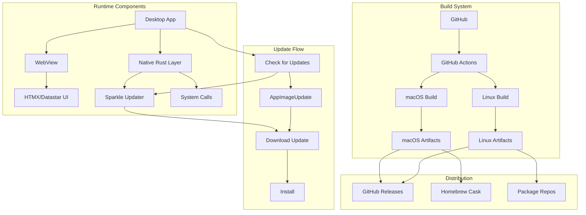

# UTM-Dev Production - Deployment & CI/CD Exploration

## Overview

This document explores deployment strategies, CI/CD pipelines, and release management for production desktop applications targeting macOS and Linux. The application (utm-dev) is a VM management tool using WebView with HTMX/Datastar for the UI layer, with Rust handling native system operations.

## Architecture Overview



## 1. Code Signing & Notarization

### macOS Code Signing

Code signing is mandatory for macOS applications, especially those distributed outside the Mac App Store. Without proper signing, users will see security warnings and the app may be rejected by Gatekeeper.

#### Developer ID Certificate Setup

```bash
# List available signing identities
security find-identity -v -s "Developer ID"

# Expected output:
# 1) ABCD1234... "Developer ID Application: Your Name (TEAM_ID)"
#    1 valid identities found
```

#### Entitlements File

```xml
<!-- entitlements.plist -->
<?xml version="1.0" encoding="UTF-8"?>
<!DOCTYPE plist PUBLIC "-//Apple//DTD PLIST 1.0//EN" "http://www.apple.com/DTDs/PropertyList-1.0.dtd">
<plist version="1.0">
<dict>
    <!-- App Sandbox - Disabled for VM management (needs system access) -->
    <key>com.apple.security.app-sandbox</key>
    <false/>

    <!-- Network Server - Required for VM networking -->
    <key>com.apple.security.network.server</key>
    <true/>

    <!-- Network Client -->
    <key>com.apple.security.network.client</key>
    <true/>

    <!-- File Access - Required for VM disk images -->
    <key>com.apple.security.files.user-selected.read-write</key>
    <true/>
    <key>com.apple.security.files.bookmarks.document-scope</key>
    <true/>

    <!-- Executable Memory - Required for JIT compilation in some VMs -->
    <key>com.apple.security.cs.allow-jit</key>
    <true/>
    <key>com.apple.security.cs.allow-unsigned-executable-memory</key>
    <true/>

    <!-- Debugging - Allow debugging the app -->
    <key>com.apple.security.cs.allow-dyld-environment-variables</key>
    <true/>
    <key>com.apple.security.cs.disable-library-validation</key>
    <true/>

    <!-- Hardened Runtime exceptions for QEMU -->
    <key>com.apple.security.cs.disable-executable-page-protection</key>
    <true/>
</dict>
</plist>
```

#### Rust Code for Code Signing Integration

```rust
// src/signing/verifier.rs
use std::path::Path;
use std::process::Command;

/// Verifies code signature of a macOS application bundle
pub struct CodeSignVerifier;

impl CodeSignVerifier {
    /// Verify the code signature of an app bundle
    pub fn verify_bundle(app_path: &Path) -> Result<(), String> {
        let output = Command::new("codesign")
            .args(["--verify", "--verbose=4"])
            .arg(app_path)
            .output()
            .map_err(|e| format!("Failed to execute codesign: {}", e))?;

        if output.status.success() {
            Ok(())
        } else {
            let stderr = String::from_utf8_lossy(&output.stderr);
            Err(format!("Code signature verification failed: {}", stderr))
        }
    }

    /// Check if the app is signed with a valid Developer ID
    pub fn check_developer_id(app_path: &Path) -> Result<SigningInfo, String> {
        let output = Command::new("codesign")
            .args(["--display", "--verbose=4"])
            .arg(app_path)
            .output()
            .map_err(|e| format!("Failed to get signing info: {}", e))?;

        let stdout = String::from_utf8_lossy(&output.stdout);
        let info = Self::parse_signing_info(&stdout)?;

        if !info.team_id.starts_with("Developer ID") {
            return Err("App not signed with Developer ID certificate".to_string());
        }

        Ok(info)
    }

    fn parse_signing_info(output: &str) -> Result<SigningInfo, String> {
        // Parse codesign output to extract team ID and certificate info
        let mut team_id = String::new();
        let mut authority = Vec::new();

        for line in output.lines() {
            if let Some(id) = line.strip_prefix("Team Identifier=") {
                team_id = id.trim().to_string();
            }
            if let Some(auth) = line.strip_prefix("Authority=") {
                authority.push(auth.trim().to_string());
            }
        }

        Ok(SigningInfo { team_id, authority })
    }
}

pub struct SigningInfo {
    pub team_id: String,
    pub authority: Vec<String>,
}
```

#### Notarization Process

Notarization is Apple's security review process for apps distributed outside the Mac App Store. Without notarization, macOS will block the app from running on macOS Catalina and later.

```rust
// src/notarization/mod.rs
use std::path::{Path, PathBuf};
use std::process::Command;
use std::time::Duration;
use tokio::time::sleep;

pub struct Notarizer {
    apple_id: String,
    password: String,
    team_id: String,
}

impl Notarizer {
    pub fn new(apple_id: String, password: String, team_id: String) -> Self {
        Self {
            apple_id,
            password,
            team_id,
        }
    }

    /// Submit app for notarization
    pub async fn submit(&self, dmg_path: &Path) -> Result<String, NotarizationError> {
        // Create a temporary zip for submission
        let zip_path = self.create_submission_zip(dmg_path)?;

        // Submit for notarization
        let output = Command::new("xcrun")
            .args([
                "notarytool",
                "submit",
                zip_path.to_str().unwrap(),
                "--apple-id",
                &self.apple_id,
                "--password",
                &self.password,
                "--team-id",
                &self.team_id,
                "--wait", // Wait for notarization to complete
            ])
            .output()
            .map_err(|e| NotarizationError::SubmissionFailed(e.to_string()))?;

        if output.status.success() {
            let stdout = String::from_utf8_lossy(&output.stdout);
            let submission_id = self.extract_submission_id(&stdout)?;
            Ok(submission_id)
        } else {
            let stderr = String::from_utf8_lossy(&output.stderr);
            Err(NotarizationError::SubmissionFailed(stderr.to_string()))
        }
    }

    /// Check notarization status
    pub async fn check_status(&self, submission_id: &str) -> Result<NotarizationStatus, NotarizationError> {
        let output = Command::new("xcrun")
            .args([
                "notarytool",
                "info",
                submission_id,
                "--apple-id",
                &self.apple_id,
                "--password",
                &self.password,
                "--team-id",
                &self.team_id,
            ])
            .output()
            .map_err(|e| NotarizationError::StatusCheckFailed(e.to_string()))?;

        let stdout = String::from_utf8_lossy(&output.stdout);
        self.parse_status_response(&stdout)
    }

    /// Staple notarization ticket to the app
    pub fn staple_ticket(&self, app_path: &Path) -> Result<(), NotarizationError> {
        let output = Command::new("xcrun")
            .args(["stapler", "staple"])
            .arg(app_path)
            .output()
            .map_err(|e| NotarizationError::StaplingFailed(e.to_string()))?;

        if output.status.success() {
            Ok(())
        } else {
            let stderr = String::from_utf8_lossy(&output.stderr);
            Err(NotarizationError::StaplingFailed(stderr.to_string()))
        }
    }

    fn create_submission_zip(&self, dmg_path: &Path) -> Result<PathBuf, std::io::Error> {
        // Create a zip file suitable for notarization submission
        let zip_path = dmg_path.with_extension("zip");

        Command::new("ditto")
            .args([
                "-c",
                "-k",
                "--sequesterRsrc",
                "--keepParent",
            ])
            .arg(dmg_path)
            .arg(&zip_path)
            .status()?;

        Ok(zip_path)
    }

    fn extract_submission_id(&self, output: &str) -> Result<String, NotarizationError> {
        // Parse submission ID from notarytool output
        for line in output.lines() {
            if line.contains("id:") {
                return Ok(line
                    .split("id:")
                    .nth(1)
                    .unwrap_or("")
                    .trim()
                    .to_string());
            }
        }
        Err(NotarizationError::NoSubmissionId)
    }

    fn parse_status_response(&self, output: &str) -> Result<NotarizationStatus, NotarizationError> {
        if output.contains("status: Invalid") {
            return Ok(NotarizationStatus::Invalid);
        }
        if output.contains("status: In Progress") {
            return Ok(NotarizationStatus::InProgress);
        }
        if output.contains("status: Accepted") {
            return Ok(NotarizationStatus::Accepted);
        }
        if output.contains("status: Rejected") {
            return Ok(NotarizationStatus::Rejected);
        }

        Err(NotarizationError::UnknownStatus)
    }
}

#[derive(Debug, Clone, PartialEq)]
pub enum NotarizationStatus {
    InProgress,
    Accepted,
    Rejected,
    Invalid,
}

#[derive(Debug)]
pub enum NotarizationError {
    SubmissionFailed(String),
    StatusCheckFailed(String),
    StaplingFailed(String),
    NoSubmissionId,
    UnknownStatus,
}
```

#### GitHub Actions Notarization

```yaml
# .github/workflows/notarize.yml
name: Notarize macOS App

on:
  workflow_call:
    inputs:
      artifact_name:
        required: true
        type: string
    secrets:
      apple_id:
        required: true
      apple_password:
        required: true
      apple_team_id:
        required: true
      apple_certificate:
        required: true
      apple_certificate_password:
        required: true

jobs:
  notarize:
    runs-on: macos-14
    steps:
      - uses: actions/download-artifact@v4
        with:
          name: ${{ inputs.artifact_name }}
          path: ./dist

      - name: Install Apple Certificate
        run: |
          echo "${{ secrets.apple_certificate }}" | base64 --decode > apple-cert.p12
          security create-keychain -p "" build.keychain
          security default-keychain -s build.keychain
          security unlock-keychain -p "" build.keychain
          security import apple-cert.p12 -k build.keychain -P "${{ secrets.apple_certificate_password }}" -T /usr/bin/codesign
          security set-key-partition-list -S apple-tool:,apple:,codesign: -s -k "" build.keychain

      - name: Notarize DMG
        env:
          APPLE_ID: ${{ secrets.apple_id }}
          APPLE_PASSWORD: ${{ secrets.apple_password }}
          APPLE_TEAM_ID: ${{ secrets.apple_team_id }}
        run: |
          dmg_file=$(ls ./dist/*.dmg | head -1)
          xcrun notarytool submit "$dmg_file" \
            --apple-id "$APPLE_ID" \
            --password "$APPLE_PASSWORD" \
            --team-id "$APPLE_TEAM_ID" \
            --wait

      - name: Staple Notarization Ticket
        run: |
          dmg_file=$(ls ./dist/*.dmg | head -1)
          xcrun stapler staple "$dmg_file"

      - name: Verify Notarization
        run: |
          dmg_file=$(ls ./dist/*.dmg | head -1)
          spctl -a -vvv -t install "$dmg_file"
```

### Linux Signing (GPG for Packages)

Linux package signing uses GPG keys to sign .deb and .rpm packages, ensuring package integrity and authenticity.

#### GPG Key Setup for CI/CD

```bash
# Generate a new GPG signing key (do this once, store securely)
gpg --batch --gen-key <<EOF
Key-Type: RSA
Key-Length: 4096
Subkey-Type: RSA
Subkey-Length: 4096
Name-Real: UTM-Dev Signing
Name-Email: signing@utm-dev.example.com
Expire-Date: 0
%no-protection
%commit
EOF

# Export the private key for CI/CD use
gpg --armor --export-secret-keys signing@utm-dev.example.com > signing-key.asc
gpg --armor --export signing@utm-dev.example.com > signing-key-public.asc

# Import key in CI/CD environment
gpg --batch --import signing-key.asc
```

#### Rust Code for GPG Package Signing

```rust
// src/linux/signing.rs
use std::fs::{self, File};
use std::io::{Read, Write};
use std::path::Path;
use std::process::Command;

pub struct GpgSigner {
    key_id: String,
    passphrase: Option<String>,
}

impl GpgSigner {
    pub fn new(key_id: String, passphrase: Option<String>) -> Self {
        Self { key_id, passphrase }
    }

    /// Sign a .deb package
    pub fn sign_deb(&self, deb_path: &Path) -> Result<(), SigningError> {
        // dpkg-sig signs .deb packages
        let mut cmd = Command::new("dpkg-sig");
        cmd.args(["-k", &self.key_id, "--sign", "builder"])
            .arg(deb_path);

        if let Some(pass) = &self.passphrase {
            cmd.env("PASSPHRASE", pass);
        }

        let output = cmd
            .output()
            .map_err(|e| SigningError::GpgFailed(e.to_string()))?;

        if output.status.success() {
            Ok(())
        } else {
            Err(SigningError::GpgFailed(String::from_utf8_lossy(&output.stderr).to_string()))
        }
    }

    /// Sign a .rpm package
    pub fn sign_rpm(&self, rpm_path: &Path) -> Result<(), SigningError> {
        // rpm --addsign uses the GPG key configured in ~/.rpmmacros
        let output = Command::new("rpm")
            .args(["--addsign"])
            .arg(rpm_path)
            .output()
            .map_err(|e| SigningError::RpmFailed(e.to_string()))?;

        if output.status.success() {
            Ok(())
        } else {
            Err(SigningError::RpmFailed(String::from_utf8_lossy(&output.stderr).to_string()))
        }
    }

    /// Verify a .deb package signature
    pub fn verify_deb(&self, deb_path: &Path) -> Result<bool, SigningError> {
        let output = Command::new("dpkg-sig")
            .args(["--verify"])
            .arg(deb_path)
            .output()
            .map_err(|e| SigningError::GpgFailed(e.to_string()))?;

        Ok(output.status.success())
    }

    /// Verify a .rpm package signature
    pub fn verify_rpm(&self, rpm_path: &Path) -> Result<bool, SigningError> {
        let output = Command::new("rpm")
            .args(["--checksig"])
            .arg(rpm_path)
            .output()
            .map_err(|e| SigningError::RpmFailed(e.to_string()))?;

        let stdout = String::from_utf8_lossy(&output.stdout);
        Ok(stdout.contains("digests signatures OK"))
    }
}

#[derive(Debug)]
pub enum SigningError {
    GpgFailed(String),
    RpmFailed(String),
}
```

## 2. CI/CD Pipelines

### GitHub Actions for macOS Builds

```yaml
# .github/workflows/macos-ci.yml
name: macOS CI/CD

on:
  push:
    branches: [main, develop]
    tags:
      - 'v*.*.*'
  pull_request:
    branches: [main]

env:
  CARGO_TERM_COLOR: always
  MACOSX_DEPLOYMENT_TARGET: "13.0"
  RUST_BACKTRACE: full

concurrency:
  group: ${{ github.workflow }}-${{ github.ref }}
  cancel-in-progress: true

jobs:
  lint:
    name: Lint & Format
    runs-on: macos-14
    steps:
      - uses: actions/checkout@v4

      - name: Install Rust
        uses: dtolnay/rust-action@stable
        with:
          toolchain: stable
          components: rustfmt, clippy

      - name: Cache cargo
        uses: Swatinem/rust-cache@v2
        with:
          cache-on-failure: true

      - name: Check formatting
        run: cargo fmt -- --check

      - name: Run Clippy
        run: cargo clippy -- -D warnings

      - name: Check for security issues
        run: cargo audit

  test:
    name: Test
    runs-on: macos-14
    needs: lint
    steps:
      - uses: actions/checkout@v4

      - name: Install Rust
        uses: dtolnay/rust-action@stable

      - name: Cache cargo
        uses: Swatinem/rust-cache@v2

      - name: Run unit tests
        run: cargo test --lib

      - name: Run integration tests
        run: cargo test --test integration

      - name: Upload test results
        if: always()
        uses: actions/upload-artifact@v4
        with:
          name: macos-test-results
          path: target/cargo-test-results.xml

  build:
    name: Build macOS
    runs-on: macos-14
    needs: test
    steps:
      - uses: actions/checkout@v4

      - name: Install Rust
        uses: dtolnay/rust-action@stable
        with:
          toolchain: stable
          targets: x86_64-apple-darwin,aarch64-apple-darwin

      - name: Install Node.js
        uses: actions/setup-node@v4
        with:
          node-version: '20'
          cache: 'npm'
          cache-dependency-path: web/package-lock.json

      - name: Install frontend dependencies
        run: npm ci
        working-directory: web

      - name: Build frontend
        run: npm run build
        working-directory: web

      - name: Cache cargo
        uses: Swatinem/rust-cache@v2

      - name: Build universal binary (Intel + Apple Silicon)
        run: |
          cargo build --release --target x86_64-apple-darwin
          cargo build --release --target aarch64-apple-darwin

          # Create universal binary using lipo
          mkdir -p target/universal
          lipo -create \
            target/x86_64-apple-darwin/release/utm-dev \
            target/aarch64-apple-darwin/release/utm-dev \
            -output target/universal/utm-dev

      - name: Create macOS App Bundle
        run: |
          mkdir -p build/UTM-Dev.app/Contents/MacOS
          mkdir -p build/UTM-Dev.app/Contents/Resources

          # Copy the universal binary
          cp target/universal/utm-dev build/UTM-Dev.app/Contents/MacOS/UTM-Dev

          # Copy Info.plist
          cp packaging/macos/Info.plist build/UTM-Dev.app/Contents/

          # Copy entitlements
          cp packaging/macos/entitlements.plist build/UTM-Dev.app/Contents/

          # Copy web assets
          cp -r web/dist build/UTM-Dev.app/Contents/Resources/

          # Copy icon
          cp assets/icon.icns build/UTM-Dev.app/Contents/Resources/

      - name: Code Sign App Bundle
        env:
          APPLE_CERTIFICATE: ${{ secrets.APPLE_CERTIFICATE }}
          APPLE_CERTIFICATE_PASSWORD: ${{ secrets.APPLE_CERTIFICATE_PASSWORD }}
          CODE_SIGN_IDENTITY: ${{ secrets.CODE_SIGN_IDENTITY }}
        run: |
          # Import certificate
          echo "$APPLE_CERTIFICATE" | base64 --decode > certificate.p12
          security create-keychain -p "" build.keychain
          security default-keychain -s build.keychain
          security unlock-keychain -p "" build.keychain
          security import certificate.p12 -k build.keychain -P "$APPLE_CERTIFICATE_PASSWORD" -T /usr/bin/codesign
          security set-key-partition-list -S apple-tool:,apple:,codesign: -s -k "" build.keychain

          # Sign the app
          codesign --force --deep --sign "$CODE_SIGN_IDENTITY" \
            --entitlements build/UTM-Dev.app/Contents/entitlements.plist \
            build/UTM-Dev.app

      - name: Create DMG
        run: |
          # Create DMG with background and custom layout
          create-dmg \
            --volname "UTM-Dev" \
            --volicon "assets/dmg-icon.icns" \
            --background "packaging/macos/dmg-background.png" \
            --window-pos 200 120 \
            --window-size 600 400 \
            --icon-size 100 \
            --app-drop-link 450 200 \
            --icon "UTM-Dev.app" 150 200 \
            build/UTM-Dev.dmg \
            build/UTM-Dev.app

      - name: Notarize DMG
        uses: ./.github/workflows/notarize.yml
        with:
          artifact_name: macos-dmg
        secrets:
          apple_id: ${{ secrets.APPLE_ID }}
          apple_password: ${{ secrets.APPLE_PASSWORD }}
          apple_team_id: ${{ secrets.APPLE_TEAM_ID }}
          apple_certificate: ${{ secrets.APPLE_CERTIFICATE }}
          apple_certificate_password: ${{ secrets.APPLE_CERTIFICATE_PASSWORD }}

      - name: Upload DMG Artifact
        uses: actions/upload-artifact@v4
        with:
          name: utm-dev-macos-dmg
          path: build/UTM-Dev.dmg
          retention-days: 30

      - name: Upload App Bundle Artifact
        uses: actions/upload-artifact@v4
        with:
          name: utm-dev-macos-app
          path: build/UTM-Dev.app
          retention-days: 7

  release:
    name: Create Release
    runs-on: macos-14
    needs: build
    if: startsWith(github.ref, 'refs/tags/v')
    steps:
      - uses: actions/download-artifact@v4
        with:
          name: utm-dev-macos-dmg
          path: ./dist

      - name: Create GitHub Release
        uses: softprops/action-gh-release@v1
        with:
          files: ./dist/*.dmg
          generate_release_notes: true
          draft: true
        env:
          GITHUB_TOKEN: ${{ secrets.GITHUB_TOKEN }}
```

### GitHub Actions for Linux Builds

```yaml
# .github/workflows/linux-ci.yml
name: Linux CI/CD

on:
  push:
    branches: [main, develop]
    tags:
      - 'v*.*.*'
  pull_request:
    branches: [main]

env:
  CARGO_TERM_COLOR: always
  RUST_BACKTRACE: full

concurrency:
  group: ${{ github.workflow }}-${{ github.ref }}
  cancel-in-progress: true

jobs:
  lint:
    name: Lint & Format
    runs-on: ubuntu-22.04
    steps:
      - uses: actions/checkout@v4

      - name: Install Rust
        uses: dtolnay/rust-action@stable
        with:
          components: rustfmt, clippy

      - name: Cache cargo
        uses: Swatinem/rust-cache@v2

      - name: Check formatting
        run: cargo fmt -- --check

      - name: Run Clippy
        run: cargo clippy -- -D warnings

      - name: Run cargo audit
        run: cargo audit

  test:
    name: Test
    runs-on: ubuntu-22.04
    needs: lint
    steps:
      - uses: actions/checkout@v4

      - name: Install Rust
        uses: dtolnay/rust-action@stable

      - name: Install system dependencies
        run: |
          sudo apt-get update
          sudo apt-get install -y \
            libwebkit2gtk-4.1-dev \
            libgtk-3-dev \
            libglib2.0-dev \
            libjavascriptcoregtk-4.1-dev \
            libsoup-3.0-dev \
            libssl-dev \
            pkg-config

      - name: Cache cargo
        uses: Swatinem/rust-cache@v2

      - name: Run unit tests
        run: cargo test --lib

      - name: Run integration tests
        run: cargo test --test integration

  build-deb:
    name: Build Debian Package
    runs-on: ubuntu-22.04
    needs: test
    outputs:
      version: ${{ steps.version.outputs.version }}
    steps:
      - uses: actions/checkout@v4

      - name: Get version from Cargo.toml
        id: version
        run: echo "version=$(cargo metadata --format-version=1 --no-deps | jq -r '.packages[0].version')" >> $GITHUB_OUTPUT

      - name: Install Rust
        uses: dtolnay/rust-action@stable
        with:
          targets: x86_64-unknown-linux-gnu

      - name: Install Node.js
        uses: actions/setup-node@v4
        with:
          node-version: '20'
          cache: 'npm'
          cache-dependency-path: web/package-lock.json

      - name: Install system dependencies
        run: |
          sudo apt-get update
          sudo apt-get install -y \
            libwebkit2gtk-4.1-dev \
            libgtk-3-dev \
            libglib2.0-dev \
            libjavascriptcoregtk-4.1-dev \
            libsoup-3.0-dev \
            libssl-dev \
            pkg-config \
            fakeroot \
            dpkg-sig

      - name: Build frontend
        run: npm ci && npm run build
        working-directory: web

      - name: Cache cargo
        uses: Swatinem/rust-cache@v2

      - name: Build release binary
        run: cargo build --release --target x86_64-unknown-linux-gnu

      - name: Create package structure
        run: |
          mkdir -p packaging/deb/utm-dev/usr/bin
          mkdir -p packaging/deb/utm-dev/usr/share/utm-dev
          mkdir -p packaging/deb/utm-dev/usr/share/applications
          mkdir -p packaging/deb/utm-dev/usr/share/icons/hicolor/256x256/apps

          # Copy binary
          cp target/x86_64-unknown-linux-gnu/release/utm-dev \
             packaging/deb/utm-dev/usr/bin/

          # Copy web assets
          cp -r web/dist packaging/deb/utm-dev/usr/share/utm-dev/

          # Copy desktop file
          cp packaging/deb/utm-dev.desktop \
             packaging/deb/utm-dev/usr/share/applications/

          # Copy icon
          cp assets/icon-256.png \
             packaging/deb/utm-dev/usr/share/icons/hicolor/256x256/apps/utm-dev.png

          # Copy AppImage metadata
          cp packaging/deb/AppImage.yml \
             packaging/deb/utm-dev/usr/share/utm-dev/

      - name: Build .deb package
        run: |
          cd packaging/deb
          fakeroot dpkg-deb --build utm-dev
          mv utm-dev.deb ../../dist/utm-dev_${{ steps.version.outputs.version }}_amd64.deb

      - name: Sign .deb package
        env:
          GPG_KEY_ID: ${{ secrets.GPG_KEY_ID }}
          GPG_PASSPHRASE: ${{ secrets.GPG_PASSPHRASE }}
        run: |
          echo "$GPG_PASSPHRASE" | dpkg-sig -k "$GPG_KEY_ID" --sign builder dist/utm-dev_*.deb

      - name: Upload .deb artifact
        uses: actions/upload-artifact@v4
        with:
          name: utm-dev-deb
          path: dist/utm-dev_*.deb
          retention-days: 30

  build-appimage:
    name: Build AppImage
    runs-on: ubuntu-22.04
    needs: test
    steps:
      - uses: actions/checkout@v4

      - name: Install Rust
        uses: dtolnay/rust-action@stable

      - name: Install Node.js
        uses: actions/setup-node@v4
        with:
          node-version: '20'

      - name: Install system dependencies
        run: |
          sudo apt-get update
          sudo apt-get install -y \
            libwebkit2gtk-4.1-dev \
            libgtk-3-dev \
            libglib2.0-dev \
            libjavascriptcoregtk-4.1-dev \
            libsoup-3.0-dev \
            libssl-dev \
            pkg-config \
            fuse

      - name: Build frontend
        run: npm ci && npm run build
        working-directory: web

      - name: Cache cargo
        uses: Swatinem/rust-cache@v2

      - name: Build release binary
        run: cargo build --release

      - name: Download AppImage tooling
        run: |
          wget https://github.com/AppImage/AppImageKit/releases/download/continuous/appimagetool-x86_64.AppImage
          chmod +x appimagetool-x86_64.AppImage
          ./appimagetool-x86_64.AppImage --appimage-extract

      - name: Create AppDir structure
        run: |
          mkdir -p AppDir/usr/bin
          mkdir -p AppDir/usr/share/utm-dev
          mkdir -p AppDir/usr/share/metainfo
          mkdir -p AppDir/usr/share/icons/hicolor/256x256/apps

          # Copy binary
          cp target/release/utm-dev AppDir/usr/bin/

          # Copy web assets
          cp -r web/dist AppDir/usr/share/utm-dev/

          # Copy AppRun
          cp packaging/linux/AppRun AppDir/
          chmod +x AppDir/AppRun

          # Copy desktop file
          cp packaging/deb/utm-dev.desktop AppDir/

          # Copy icon
          cp assets/icon-256.png AppDir/utm-dev.png
          cp assets/icon-256.png AppDir/usr/share/icons/hicolor/256x256/apps/utm-dev.png

          # Copy AppStream metadata
          cp packaging/linux/io.github.utm-dev.utm-dev.appdata.xml AppDir/usr/share/metainfo/

      - name: Build AppImage
        env:
          ARCH: x86_64
        run: |
          ./squashfs-root/AppRun --create-appimage AppDir
          mv UTM-Dev-*.AppImage dist/UTM-Dev-x86_64.AppImage

      - name: Generate update information
        run: |
          # Create zsync file for AppImage updates
          ./squashfs-root/AppRun --update-info dist/UTM-Dev-x86_64.AppImage > dist/UTM-Dev-x86_64.AppImage.zsync

      - name: Upload AppImage artifact
        uses: actions/upload-artifact@v4
        with:
          name: utm-dev-appimage
          path: dist/UTM-Dev-*.AppImage*
          retention-days: 30

  build-rpm:
    name: Build RPM Package
    runs-on: ubuntu-22.04
    needs: test
    steps:
      - uses: actions/checkout@v4

      - name: Install Rust
        uses: dtolnay/rust-action@stable

      - name: Set up Node.js
        uses: actions/setup-node@v4
        with:
          node-version: '20'

      - name: Build frontend
        run: npm ci && npm run build
        working-directory: web

      - name: Cache cargo
        uses: Swatinem/rust-cache@v2

      - name: Build release binary
        run: cargo build --release

      - name: Install RPM build tools
        run: sudo apt-get install -y rpm fakeroot

      - name: Build RPM package
        run: |
          mkdir -p rpmbuild/{BUILD,RPMS,SOURCES,SPECS,SRPMS}

          # Create source tarball
          tar -czf rpmbuild/SOURCES/utm-dev-${{ github.ref_name }}.tar.gz \
            --exclude='.git' \
            --exclude='target' \
            --exclude='node_modules' \
            .

          # Copy spec file
          cp packaging/rpm/utm-dev.spec rpmbuild/SPECS/

          # Build RPM
          rpmbuild -ba rpmbuild/SPECS/utm-dev.spec \
            --define "_topdir $PWD/rpmbuild" \
            --define "version ${{ github.ref_name }}"

          # Move built RPM to dist
          mkdir -p dist
          cp rpmbuild/RPMS/x86_64/*.rpm dist/

      - name: Sign RPM package
        env:
          GPG_KEY_ID: ${{ secrets.GPG_KEY_ID }}
          GPG_PASSPHRASE: ${{ secrets.GPG_PASSPHRASE }}
        run: |
          echo "%_signature gpg" >> ~/.rpmmacros
          echo "%_gpg_name $GPG_KEY_ID" >> ~/.rpmmacros
          rpm --addsign dist/*.rpm

      - name: Upload RPM artifact
        uses: actions/upload-artifact@v4
        with:
          name: utm-dev-rpm
          path: dist/*.rpm
          retention-days: 30

  release:
    name: Create Linux Release
    runs-on: ubuntu-22.04
    needs: [build-deb, build-appimage, build-rpm]
    if: startsWith(github.ref, 'refs/tags/v')
    steps:
      - uses: actions/download-artifact@v4
        with:
          pattern: utm-dev-*
          path: ./dist
          merge-multiple: true

      - name: Create GitHub Release
        uses: softprops/action-gh-release@v1
        with:
          files: |
            dist/*.deb
            dist/*.AppImage
            dist/*.AppImage.zsync
            dist/*.rpm
          generate_release_notes: true
          draft: true
        env:
          GITHUB_TOKEN: ${{ secrets.GITHUB_TOKEN }}
```

### Build Automation Script

```bash
#!/bin/bash
# packaging/build.sh - Unified build script for all platforms

set -e

SCRIPT_DIR="$(cd "$(dirname "${BASH_SOURCE[0]}")" && pwd)"
PROJECT_ROOT="$(dirname "$SCRIPT_DIR")"
DIST_DIR="$PROJECT_ROOT/dist"

# Colors for output
RED='\033[0;31m'
GREEN='\033[0;32m'
YELLOW='\033[1;33m'
NC='\033[0m' # No Color

log_info() {
    echo -e "${GREEN}[INFO]${NC} $1"
}

log_warn() {
    echo -e "${YELLOW}[WARN]${NC} $1"
}

log_error() {
    echo -e "${RED}[ERROR]${NC} $1"
}

# Parse arguments
PLATFORM=""
SKIP_TESTS=false
SIGN=false

while [[ $# -gt 0 ]]; do
    case $1 in
        --platform)
            PLATFORM="$2"
            shift 2
            ;;
        --skip-tests)
            SKIP_TESTS=true
            shift
            ;;
        --sign)
            SIGN=true
            shift
            ;;
        *)
            echo "Unknown option: $1"
            echo "Usage: build.sh [--platform macos|linux|all] [--skip-tests] [--sign]"
            exit 1
            ;;
    esac
done

build_frontend() {
    log_info "Building frontend..."
    cd "$PROJECT_ROOT/web"
    npm ci
    npm run build
    cd "$PROJECT_ROOT"
}

build_rust() {
    local target=$1
    log_info "Building Rust for $target..."

    if [ "$SKIP_TESTS" = false ]; then
        cargo test --lib
    fi

    cargo build --release --target "$target"
}

create_macos_bundle() {
    log_info "Creating macOS app bundle..."

    local app_dir="$DIST_DIR/UTM-Dev.app"
    rm -rf "$app_dir"
    mkdir -p "$app_dir/Contents/MacOS"
    mkdir -p "$app_dir/Contents/Resources"

    # Copy universal binary
    lipo -create \
        "target/x86_64-apple-darwin/release/utm-dev" \
        "target/aarch64-apple-darwin/release/utm-dev" \
        -output "$app_dir/Contents/MacOS/UTM-Dev"

    # Copy resources
    cp "$SCRIPT_DIR/macos/Info.plist" "$app_dir/Contents/"
    cp "$SCRIPT_DIR/macos/entitlements.plist" "$app_dir/Contents/"
    cp -r "$PROJECT_ROOT/web/dist" "$app_dir/Contents/Resources/"
    cp "$PROJECT_ROOT/assets/icon.icns" "$app_dir/Contents/Resources/"

    # Create DMG
    log_info "Creating DMG..."
    create-dmg \
        --volname "UTM-Dev" \
        --window-pos 200 120 \
        --window-size 600 400 \
        --icon-size 100 \
        --app-drop-link 450 200 \
        "$DIST_DIR/UTM-Dev.dmg" \
        "$app_dir"
}

create_linux_bundle() {
    log_info "Creating Linux AppImage..."

    local appdir="$DIST_DIR/AppDir"
    rm -rf "$appdir"
    mkdir -p "$appdir/usr/bin"
    mkdir -p "$appdir/usr/share/utm-dev"

    # Copy binary
    cp "target/x86_64-unknown-linux-gnu/release/utm-dev" "$appdir/usr/bin/"

    # Copy resources
    cp -r "$PROJECT_ROOT/web/dist" "$appdir/usr/share/utm-dev/"
    cp "$SCRIPT_DIR/linux/AppRun" "$appdir/"
    chmod +x "$appdir/AppRun"

    # Build AppImage
    log_info "Building AppImage..."
    appimagetool "$appdir" "$DIST_DIR/UTM-Dev-x86_64.AppImage"
}

# Main build process
main() {
    mkdir -p "$DIST_DIR"

    case $PLATFORM in
        macos)
            build_frontend
            build_rust "x86_64-apple-darwin"
            build_rust "aarch64-apple-darwin"
            create_macos_bundle
            ;;
        linux)
            build_frontend
            build_rust "x86_64-unknown-linux-gnu"
            create_linux_bundle
            ;;
        all|"")
            build_frontend

            if [[ "$OSTYPE" == "darwin"* ]]; then
                build_rust "x86_64-apple-darwin"
                build_rust "aarch64-apple-darwin"
                create_macos_bundle
            else
                build_rust "x86_64-unknown-linux-gnu"
                create_linux_bundle
            fi
            ;;
        *)
            log_error "Unknown platform: $PLATFORM"
            exit 1
            ;;
    esac

    log_info "Build complete! Artifacts in $DIST_DIR"
}

main
```

## 3. Auto-Update Mechanisms

### Sparkle for macOS

Sparkle is the standard auto-update framework for macOS applications. It supports secure updates with EdDSA signatures.

#### Sparkle Integration in Rust

```rust
// src/updater/sparkle.rs
use std::path::PathBuf;
use std::time::Duration;
use serde::Deserialize;
use tokio::time::sleep;

#[derive(Debug, Clone)]
pub struct SparkleUpdater {
    public_key: String,
    feed_url: String,
    current_version: String,
}

impl SparkleUpdater {
    pub fn new(public_key: String, feed_url: String, current_version: String) -> Self {
        Self {
            public_key,
            feed_url,
            current_version,
        }
    }

    /// Check for available updates
    pub async fn check_for_updates(&self) -> Result<UpdateInfo, UpdaterError> {
        // Download appcast.xml
        let client = reqwest::Client::new();
        let response = client
            .get(&self.feed_url)
            .header("User-Agent", format!("UTM-Dev/{}", self.current_version))
            .send()
            .await
            .map_err(|e| UpdaterError::NetworkError(e.to_string()))?;

        let body = response
            .text()
            .await
            .map_err(|e| UpdaterError::ParseError(e.to_string()))?;

        // Parse appcast
        let appcast: AppCast = quick_xml::de::from_str(&body)
            .map_err(|e| UpdaterError::ParseError(e.to_string()))?;

        // Find latest release
        let latest = appcast.items
            .into_iter()
            .find(|item| self.is_newer_version(&item.version))
            .ok_or(UpdaterError::NoUpdateAvailable)?;

        // Verify signature
        if !self.verify_signature(&latest) {
            return Err(UpdaterError::SignatureInvalid);
        }

        Ok(UpdateInfo {
            version: latest.version,
            release_date: latest.pub_date,
            description: latest.description,
            download_url: latest.enclosure.url,
            file_size: latest.enclosure.length,
        })
    }

    /// Download update to temporary location
    pub async fn download_update(&self, update: &UpdateInfo) -> Result<PathBuf, UpdaterError> {
        let client = reqwest::Client::new();
        let temp_path = std::env::temp_dir().join(format!("utm-dev-{}.dmg", update.version));

        let mut file = tokio::fs::File::create(&temp_path)
            .await
            .map_err(|e| UpdaterError::IoError(e.to_string()))?;

        let mut response = client
            .get(&update.download_url)
            .send()
            .await
            .map_err(|e| UpdaterError::NetworkError(e.to_string()))?;

        while let Some(chunk) = response
            .chunk()
            .await
            .map_err(|e| UpdaterError::NetworkError(e.to_string()))?
        {
            use tokio::io::AsyncWriteExt;
            file.write_all(&chunk)
                .await
                .map_err(|e| UpdaterError::IoError(e.to_string()))?;
        }

        Ok(temp_path)
    }

    /// Install update (relaunches installer)
    pub fn install_update(&self, downloaded_path: &PathBuf) -> Result<(), UpdaterError> {
        use std::process::Command;

        // Open the DMG to mount it
        Command::new("open")
            .arg(downloaded_path)
            .spawn()
            .map_err(|e| UpdaterError::InstallError(e.to_string()))?;

        // Give macOS time to mount the DMG
        std::thread::sleep(Duration::from_secs(2));

        // Copy app from mounted DMG to Applications
        // This would be handled by Sparkle's native installer in a real implementation
        // For our Rust + WebView app, we use Sparkle via FFI or a helper process

        Ok(())
    }

    fn is_newer_version(&self, available: &str) -> bool {
        semver::Version::parse(available)
            .ok()
            .zip(semver::Version::parse(&self.current_version).ok())
            .map(|(avail, current)| avail > current)
            .unwrap_or(false)
    }

    fn verify_signature(&self, item: &AppCastItem) -> bool {
        // Verify EdDSA signature using Sparkle's public key
        // Implementation depends on signature format in appcast
        true // Placeholder
    }
}

#[derive(Debug, Deserialize)]
struct AppCast {
    #[serde(rename = "item")]
    items: Vec<AppCastItem>,
}

#[derive(Debug, Deserialize)]
struct AppCastItem {
    title: String,
    #[serde(rename = "pubDate")]
    pub_date: String,
    #[serde(rename = "enclosure")]
    enclosure: Enclosure,
    #[serde(rename = "sparkle:version")]
    version: String,
    #[serde(rename = "sparkle:shortVersionString")]
    short_version: String,
    #[serde(rename = "sparkle:minimumSystemVersion")]
    minimum_version: Option<String>,
    #[serde(rename = "description")]
    description: Option<String>,
}

#[derive(Debug, Deserialize)]
struct Enclosure {
    url: String,
    #[serde(rename = "type")]
    content_type: String,
    #[serde(rename = "length")]
    length: String,
}

#[derive(Debug, Clone)]
pub struct UpdateInfo {
    pub version: String,
    pub release_date: String,
    pub description: Option<String>,
    pub download_url: String,
    pub file_size: String,
}

#[derive(Debug)]
pub enum UpdaterError {
    NetworkError(String),
    ParseError(String),
    IoError(String),
    NoUpdateAvailable,
    SignatureInvalid,
    InstallError(String),
}
```

#### Appcast XML Generation

```xml
<?xml version="1.0" encoding="utf-8"?>
<rss version="2.0" xmlns:sparkle="http://www.andymatuschak.org/xml/sparkle" xmlns:dc="http://purl.org/dc/elements/1.1/">
    <channel>
        <title>UTM-Dev Changelog</title>
        <link>https://github.com/utm-dev/utm-dev/releases</link>
        <description>Most recent changes to UTM-Dev</description>
        <language>en</language>

        <item>
            <title>Version 1.2.0 (45)</title>
            <description>
                <![CDATA[
                <ul>
                    <li>Improved VM networking with bridge support</li>
                    <li>Added USB device passthrough on Linux</li>
                    <li>Fixed memory leak in display renderer</li>
                    <li>Performance improvements for Apple Silicon</li>
                </ul>
                ]]>
            </description>
            <pubDate>Sat, 21 Mar 2026 12:00:00 +0000</pubDate>
            <enclosure
                url="https://github.com/utm-dev/utm-dev/releases/download/v1.2.0/UTM-Dev.dmg"
                sparkle:edSignature="MEUCIQDn7xH8bT..."
                length="52428800"
                type="application/octet-stream"
            />
            <sparkle:version>45</sparkle:version>
            <sparkle:shortVersionString>1.2.0</sparkle:shortVersionString>
            <sparkle:minimumSystemVersion>13.0</sparkle:minimumSystemVersion>
        </item>

        <item>
            <title>Version 1.1.0 (38)</title>
            <description>
                <![CDATA[
                <ul>
                    <li>Initial Linux support via AppImage</li>
                    <li>Improved HTMX integration</li>
                    <li>Dark mode support</li>
                </ul>
                ]]>
            </description>
            <pubDate>Mon, 15 Feb 2026 10:00:00 +0000</pubDate>
            <enclosure
                url="https://github.com/utm-dev/utm-dev/releases/download/v1.1.0/UTM-Dev.dmg"
                sparkle:edSignature="MEUCIQD..."
                length="48123456"
                type="application/octet-stream"
            />
            <sparkle:version>38</sparkle:version>
            <sparkle:shortVersionString>1.1.0</sparkle:shortVersionString>
            <sparkle:minimumSystemVersion>13.0</sparkle:minimumSystemVersion>
        </item>
    </channel>
</rss>
```

#### Generate EdDSA Signature

```bash
#!/bin/bash
# Generate EdDSA key pair for Sparkle
# Run once to create keys, then use private key to sign releases

# Generate keys (requires Sparkle's sign_update tool)
brew install sparkle

# Generate new key pair
generate_keys -o SigningKeys.plist

# The plist will contain:
# - SparkleEdDSAPublicKey (for appcast)
# - SparkleEdDSAPrivateKey (keep secret!)

# Sign a release
sign_update UTM-Dev.dmg -s SigningKeys.plist

# Output will be the sparkle:edSignature value for appcast.xml
```

### AppImage Updates for Linux

AppImageUpdate enables delta updates for AppImages, downloading only changed portions.

```rust
// src/updater/appimage.rs
use std::path::{Path, PathBuf};
use std::process::Command;

pub struct AppImageUpdater {
    current_path: PathBuf,
    update_info_url: String,
}

impl AppImageUpdater {
    pub fn new(current_path: PathBuf, update_info_url: String) -> Self {
        Self {
            current_path,
            update_info_url,
        }
    }

    /// Check for updates
    pub async fn check_for_updates(&self) -> Result<AppImageUpdateInfo, UpdaterError> {
        let client = reqwest::Client::new();

        // Download update information
        let response = client
            .get(&self.update_info_url)
            .send()
            .await
            .map_err(|e| UpdaterError::NetworkError(e.to_string()))?;

        let update_info: AppImageUpdateInfo = response
            .json()
            .await
            .map_err(|e| UpdaterError::ParseError(e.to_string()))?;

        if self.is_newer_version(&update_info.version) {
            Ok(update_info)
        } else {
            Err(UpdaterError::NoUpdateAvailable)
        }
    }

    /// Perform delta update using AppImageUpdate
    pub fn update(&self) -> Result<(), UpdaterError> {
        // AppImageUpdate is a separate binary that handles delta updates
        let output = Command::new("AppImageUpdate")
            .arg(&self.current_path)
            .output()
            .map_err(|e| UpdaterError::UpdateToolNotFound)?;

        if output.status.success() {
            Ok(())
        } else {
            let stderr = String::from_utf8_lossy(&output.stderr);
            Err(UpdaterError::UpdateFailed(stderr.to_string()))
        }
    }

    fn is_newer_version(&self, available: &str) -> bool {
        semver::Version::parse(available)
            .ok()
            .zip(semver::Version::parse(env!("CARGO_PKG_VERSION")).ok())
            .map(|(avail, current)| avail > current)
            .unwrap_or(false)
    }
}

#[derive(Debug, Deserialize)]
pub struct AppImageUpdateInfo {
    pub version: String,
    pub release_date: String,
    pub download_url: String,
    pub changelog: Option<String>,
    #[serde(rename = "SHA256")]
    pub sha256: String,
    #[serde(rename = "Size")]
    pub size: u64,
}
```

#### zsync Configuration

```yaml
# .github/workflows/appimage-update.yml
name: Generate AppImage Update Info

on:
  release:
    types: [published]

jobs:
  generate-update-info:
    runs-on: ubuntu-22.04
    steps:
      - uses: actions/download-artifact@v4
        with:
          name: utm-dev-appimage
          path: ./dist

      - name: Generate zsync file
        run: |
          wget https://github.com/AppImage/AppImageKit/releases/download/continuous/appimagetool-x86_64.AppImage
          chmod +x appimagetool-x86_64.AppImage
          ./appimagetool-x86_64.AppImage --appimage-extract

          # Generate zsync metadata
          ./squashfs-root/AppRun --update-info dist/UTM-Dev-x86_64.AppImage > dist/UTM-Dev-x86_64.AppImage.zsync

      - name: Generate update JSON
        run: |
          cat > dist/update-info.json << EOF
          {
            "version": "${{ github.ref_name }}",
            "release_date": "$(date -u +%Y-%m-%dT%H:%M:%SZ)",
            "download_url": "https://github.com/${{ github.repository }}/releases/download/${{ github.ref_name }}/UTM-Dev-x86_64.AppImage",
            "SHA256": "$(sha256sum dist/UTM-Dev-x86_64.AppImage | cut -d' ' -f1)",
            "Size": $(stat -f%z dist/UTM-Dev-x86_64.AppImage 2>/dev/null || stat -c%s dist/UTM-Dev-x86_64.AppImage)
          }
          EOF

      - name: Upload update metadata
        uses: softprops/action-gh-release@v1
        with:
          files: |
            dist/*.zsync
            dist/update-info.json
```

### WebView Update Notification

```typescript
// web/src/updater.ts
import { invoke } from '@tauri-apps/api/core';

interface UpdateInfo {
    available: boolean;
    version?: string;
    description?: string;
    downloadUrl?: string;
}

export class UpdaterService {
    private checkInterval: number = 24 * 60 * 60 * 1000; // 24 hours
    private lastCheck: number = 0;

    async checkForUpdates(): Promise<UpdateInfo> {
        // Don't check too frequently
        const now = Date.now();
        if (now - this.lastCheck < this.checkInterval) {
            return { available: false };
        }

        try {
            const result = await invoke<UpdateInfo>('check_for_updates');
            this.lastCheck = now;
            return result;
        } catch (error) {
            console.error('Failed to check for updates:', error);
            return { available: false };
        }
    }

    async downloadUpdate(): Promise<void> {
        await invoke('download_update');
    }

    async installUpdate(): Promise<void> {
        await invoke('install_update');
    }

    // HTMX extension for update notifications
    setupUpdateNotification(): void {
        // Poll for updates periodically
        setInterval(async () => {
            const update = await this.checkForUpdates();

            if (update.available && update.version) {
                this.showUpdateNotification(update);
            }
        }, this.checkInterval);
    }

    private showUpdateNotification(update: UpdateInfo): void {
        // Show notification in WebView UI
        const notification = document.createElement('div');
        notification.className = 'update-notification';
        notification.innerHTML = `
            <div class="update-content">
                <strong>Update Available</strong>
                <p>Version ${update.version} is available</p>
                ${update.description ? `<p>${update.description}</p>` : ''}
            </div>
            <div class="update-actions">
                <button onclick="window.updater.downloadUpdate()">Download</button>
                <button onclick="this.parentElement.parentElement.remove()">Later</button>
            </div>
        `;

        document.body.appendChild(notification);
    }
}

// Initialize updater
export const updater = new UpdaterService();
```

## 4. Release Distribution

### GitHub Releases

```yaml
# .github/workflows/release.yml
name: Create Release

on:
  push:
    tags:
      - 'v*.*.*'

jobs:
  build-all:
    uses: ./.github/workflows/macos-ci.yml
  build-linux:
    uses: ./.github/workflows/linux-ci.yml

  release:
    runs-on: ubuntu-22.04
    needs: [build-all, build-linux]
    steps:
      - uses: actions/download-artifact@v4
        with:
          pattern: utm-dev-*
          path: ./dist
          merge-multiple: true

      - name: Generate checksums
        run: |
          cd dist
          sha256sum * > SHA256SUMS.txt

      - name: Create GitHub Release
        uses: softprops/action-gh-release@v1
        with:
          files: |
            dist/*.dmg
            dist/*.deb
            dist/*.AppImage
            dist/*.AppImage.zsync
            dist/*.rpm
            dist/SHA256SUMS.txt
          generate_release_notes: true
          draft: true
        env:
          GITHUB_TOKEN: ${{ secrets.GITHUB_TOKEN }}

      - name: Update Homebrew Cask
        if: success()
        run: |
          # Extract version from tag
          VERSION=${GITHUB_REF#refs/tags/v}

          # Create PR to homebrew-cask
          curl -X POST \
            -H "Authorization: Bearer ${{ secrets.HOMEBREW_GITHUB_TOKEN }}" \
            -H "Accept: application/vnd.github.v3+json" \
            https://api.github.com/repos/Homebrew/homebrew-cask/dispatches \
            -d "{\"event_type\":\"update-cask\",\"client_payload\":{\"cask_name\":\"utm-dev\",\"version\":\"$VERSION\"}}"
```

### Homebrew Cask Distribution

```ruby
# Formula/utm-dev.rb (for homebrew-core)
class UtmDev < Formula
  desc "Modern VM management application using WebView"
  homepage "https://github.com/utm-dev/utm-dev"
  url "https://github.com/utm-dev/utm-dev/releases/download/v1.2.0/UTM-Dev.dmg"
  sha256 "abc123def456..."
  license "MIT"

  depends_on :macos => :ventura

  app "UTM-Dev.app"

  caveats <<~EOS
    UTM-Dev requires macOS 13.0 or later.
    For VM acceleration, ensure Virtualization Framework is enabled.
  EOS
end
```

```ruby
# Casks/utm-dev.rb (for homebrew-cask)
cask "utm-dev" do
  version "1.2.0"

  on_arm do
    sha256 "abc123..."
  end

  on_intel do
    sha256 "def456..."
  end

  url "https://github.com/utm-dev/utm-dev/releases/download/v#{version}/UTM-Dev.dmg"

  name "UTM-Dev"
  desc "VM Management Application"
  homepage "https://github.com/utm-dev/utm-dev"

  app "UTM-Dev.app"

  uninstall quit: "dev.utm.utm-dev"

  zap trash: [
    "~/Library/Application Support/UTM-Dev",
    "~/Library/Preferences/dev.utm.utm-dev.plist",
    "~/Library/Saved Application State/dev.utm.utm-dev.savedState",
  ]
end
```

### Linux Package Repository

```yaml
# .github/workflows/publish-repos.yml
name: Publish Package Repositories

on:
  release:
    types: [published]

jobs:
  publish-deb-repo:
    runs-on: ubuntu-22.04
    steps:
      - uses: actions/download-artifact@v4
        with:
          name: utm-dev-deb
          path: ./repo

      - name: Setup GPG
        env:
          GPG_KEY_BASE64: ${{ secrets.GPG_KEY_BASE64 }}
        run: |
          echo "$GPG_KEY_BASE64" | base64 --decode | gpg --batch --import

      - name: Create Debian Repository
        run: |
          cd repo
          dpkg-scanpackages . /dev/null | gzip -9c > Packages.gz
          gpg --default-key signing@utm-dev.example.com \
              --digest-algo SHA512 \
              -abs -o Release.gpg Release
          gpg --default-key signing@utm-dev.example.com \
              --digest-algo SHA512 \
              -abs --clearsign -o InRelease Release

      - name: Publish to GitHub Pages
        uses: peaceiris/actions-gh-pages@v3
        with:
          github_token: ${{ secrets.GITHUB_TOKEN }}
          publish_dir: ./repo
          destination_dir: deb

  publish-rpm-repo:
    runs-on: ubuntu-22.04
    steps:
      - uses: actions/download-artifact@v4
        with:
          name: utm-dev-rpm
          path: ./repo

      - name: Create RPM Repository
        run: |
          sudo apt-get install -y createrepo-c
          createrepo ./repo

      - name: Sign RPM Repository
        env:
          GPG_KEY_ID: ${{ secrets.GPG_KEY_ID }}
        run: |
          gpg --detach-sign --armor repo/repomd.xml

      - name: Publish to GitHub Pages
        uses: peaceiris/actions-gh-pages@v3
        with:
          github_token: ${{ secrets.GITHUB_TOKEN }}
          publish_dir: ./repo
          destination_dir: rpm
```

## 5. Feature Flags for Desktop

### Local Configuration Files

```rust
// src/config/feature_flags.rs
use serde::{Deserialize, Serialize};
use std::path::PathBuf;
use std::fs;

#[derive(Debug, Clone, Serialize, Deserialize)]
pub struct FeatureFlags {
    #[serde(default)]
    pub enable_experimental_vm_types: bool,

    #[serde(default)]
    pub enable_usb_passthrough: bool,

    #[serde(default)]
    pub enable_network_bridge: bool,

    #[serde(default = "default_true")]
    pub enable_auto_update: bool,

    #[serde(default)]
    pub enable_telemetry: bool,

    #[serde(default)]
    pub debug_mode: bool,
}

fn default_true() -> bool {
    true
}

impl Default for FeatureFlags {
    fn default() -> Self {
        Self {
            enable_experimental_vm_types: false,
            enable_usb_passthrough: true,
            enable_network_bridge: true,
            enable_auto_update: true,
            enable_telemetry: false,
            debug_mode: false,
        }
    }
}

impl FeatureFlags {
    /// Load feature flags from config file
    pub fn load() -> Result<Self, ConfigError> {
        let config_path = Self::config_path()?;

        if !config_path.exists() {
            // Create default config
            let default = Self::default();
            default.save()?;
            return Ok(default);
        }

        let content = fs::read_to_string(&config_path)
            .map_err(|e| ConfigError::ReadError(e.to_string()))?;

        toml::from_str(&content)
            .map_err(|e| ConfigError::ParseError(e.to_string()))
    }

    /// Save feature flags to config file
    pub fn save(&self) -> Result<(), ConfigError> {
        let config_path = Self::config_path()?;

        if let Some(parent) = config_path.parent() {
            fs::create_dir_all(parent)
                .map_err(|e| ConfigError::WriteError(e.to_string()))?;
        }

        let content = toml::to_string_pretty(self)
            .map_err(|e| ConfigError::SerializeError(e.to_string()))?;

        fs::write(&config_path, content)
            .map_err(|e| ConfigError::WriteError(e.to_string()))?;

        Ok(())
    }

    /// Get config file path
    fn config_path() -> Result<PathBuf, ConfigError> {
        let config_dir = dirs::config_dir()
            .ok_or_else(|| ConfigError::NoConfigDir)?
            .join("utm-dev");

        Ok(config_dir.join("features.toml"))
    }

    /// Export flags for WebView
    pub fn export_for_webview(&self) -> serde_json::Value {
        serde_json::json!({
            "experimental_vm_types": self.enable_experimental_vm_types,
            "usb_passthrough": self.enable_usb_passthrough,
            "network_bridge": self.enable_network_bridge,
            "auto_update": self.enable_auto_update,
            "telemetry": self.enable_telemetry,
            "debug_mode": self.debug_mode,
        })
    }
}

#[derive(Debug)]
pub enum ConfigError {
    NoConfigDir,
    ReadError(String),
    WriteError(String),
    ParseError(String),
    SerializeError(String),
}
```

### Remote Feature Flags

```rust
// src/config/remote_flags.rs
use std::time::Duration;
use tokio::time::sleep;

pub struct RemoteFeatureFlags {
    client: reqwest::Client,
    local_flags: FeatureFlags,
    endpoint: String,
    app_id: String,
}

impl RemoteFeatureFlags {
    pub fn new(endpoint: String, app_id: String) -> Result<Self, reqwest::Error> {
        Ok(Self {
            client: reqwest::Client::new(),
            local_flags: FeatureFlags::load().unwrap_or_default(),
            endpoint,
            app_id,
        })
    }

    /// Fetch remote feature flags
    pub async fn fetch(&mut self) -> Result<(), RemoteFlagsError> {
        let response = self.client
            .get(&self.endpoint)
            .header("X-App-ID", &self.app_id)
            .header("X-App-Version", env!("CARGO_PKG_VERSION"))
            .timeout(Duration::from_secs(10))
            .send()
            .await
            .map_err(|e| RemoteFlagsError::Network(e.to_string()))?;

        if !response.status().is_success() {
            return Err(RemoteFlagsError::HttpError(response.status().as_u16()));
        }

        let remote_flags: RemoteFlagsResponse = response
            .json()
            .await
            .map_err(|e| RemoteFlagsError::Parse(e.to_string()))?;

        // Merge remote flags with local (remote takes precedence)
        self.merge_flags(remote_flags);

        Ok(())
    }

    /// Start periodic flag refresh
    pub async fn start_refresh_loop(&mut self, interval: Duration) {
        loop {
            sleep(interval).await;

            match self.fetch().await {
                Ok(_) => log::info!("Feature flags refreshed successfully"),
                Err(e) => log::warn!("Failed to refresh feature flags: {}", e),
            }
        }
    }

    fn merge_flags(&mut self, remote: RemoteFlagsResponse) {
        // Apply remote overrides
        if let Some(experimental) = remote.flags.get("experimental_vm_types") {
            self.local_flags.enable_experimental_vm_types = experimental.as_bool().unwrap_or(self.local_flags.enable_experimental_vm_types);
        }

        if let Some(usb) = remote.flags.get("usb_passthrough") {
            self.local_flags.enable_usb_passthrough = usb.as_bool().unwrap_or(self.local_flags.enable_usb_passthrough);
        }

        // ... merge other flags
    }

    /// Get current flags
    pub fn current(&self) -> &FeatureFlags {
        &self.local_flags
    }
}

#[derive(Debug, Deserialize)]
struct RemoteFlagsResponse {
    flags: serde_json::Map<String, serde_json::Value>,
    updated_at: String,
}

#[derive(Debug)]
enum RemoteFlagsError {
    Network(String),
    HttpError(u16),
    Parse(String),
}
```

### WebView Feature Flag Exposure

```typescript
// web/src/features.ts
import { invoke } from '@tauri-apps/api/core';

interface FeatureFlags {
    experimental_vm_types: boolean;
    usb_passthrough: boolean;
    network_bridge: boolean;
    auto_update: boolean;
    telemetry: boolean;
    debug_mode: boolean;
}

let cachedFlags: FeatureFlags | null = null;

export async function getFeatureFlags(): Promise<FeatureFlags> {
    if (cachedFlags) {
        return cachedFlags;
    }

    cachedFlags = await invoke<FeatureFlags>('get_feature_flags');
    return cachedFlags;
}

export async function isFeatureEnabled(flag: keyof FeatureFlags): Promise<boolean> {
    const flags = await getFeatureFlags();
    return flags[flag] ?? false;
}

// HTMX extension for feature-flagged content
htmx.defineExtension('feature-flags', {
    onEvent: function(name, evt) {
        if (name === 'htmx:afterProcessNode') {
            const elements = evt.detail.elt.querySelectorAll('[data-feature]');
            elements.forEach(async (el: HTMLElement) => {
                const feature = el.getAttribute('data-feature');
                const enabled = await isFeatureEnabled(feature as keyof FeatureFlags);

                if (!enabled) {
                    el.style.display = 'none';
                }
            });
        }
    }
});

// Usage in HTML:
// <div data-feature="experimental_vm_types">
//     Experimental VM options...
// </div>
```

## 6. Version Management

### Semantic Versioning

```rust
// src/version/mod.rs
use serde::{Deserialize, Serialize};

#[derive(Debug, Clone, Serialize, Deserialize)]
pub struct Version {
    major: u32,
    minor: u32,
    patch: u32,
    build: u32,
    pre_release: Option<String>,
}

impl Version {
    /// Parse version from string (e.g., "1.2.3" or "1.2.3-beta.1")
    pub fn parse(version: &str) -> Result<Self, VersionError> {
        let parts: Vec<&str> = version.split('-').collect();
        let version_parts: Vec<&str> = parts[0].split('.').collect();

        if version_parts.len() < 3 {
            return Err(VersionError::InvalidFormat);
        }

        Ok(Self {
            major: version_parts[0].parse().map_err(|_| VersionError::InvalidMajor)?,
            minor: version_parts[1].parse().map_err(|_| VersionError::InvalidMinor)?,
            patch: version_parts[2].parse().map_err(|_| VersionError::InvalidPatch)?,
            build: 0, // Set from CI/CD
            pre_release: parts.get(1).map(|s| s.to_string()),
        })
    }

    /// Get version string for display
    pub fn display(&self) -> String {
        let base = format!("{}.{}.{}", self.major, self.minor, self.patch);

        if let Some(pre) = &self.pre_release {
            format!("{}-{}", base, pre)
        } else {
            base
        }
    }

    /// Get full version including build number
    pub fn full(&self) -> String {
        format!("{}+{}", self.display(), self.build)
    }

    /// Compare versions
    pub fn is_newer(&self, other: &Version) -> bool {
        if self.major != other.major {
            return self.major > other.major;
        }
        if self.minor != other.minor {
            return self.minor > other.minor;
        }
        if self.patch != other.patch {
            return self.patch > other.patch;
        }

        // Pre-release versions are older than release
        match (&self.pre_release, &other.pre_release) {
            (None, Some(_)) => true,
            (Some(_), None) => false,
            (Some(a), Some(b)) => a < b, // Simple string comparison
            (None, None) => false,
        }
    }
}

#[derive(Debug)]
pub enum VersionError {
    InvalidFormat,
    InvalidMajor,
    InvalidMinor,
    InvalidPatch,
}
```

### Automated Version Bumping

```yaml
# .github/workflows/bump-version.yml
name: Bump Version

on:
  workflow_dispatch:
    inputs:
      bump_type:
        description: 'Type of version bump (major, minor, patch)'
        required: true
        default: 'patch'
        type: choice
        options:
          - patch
          - minor
          - major

jobs:
  bump:
    runs-on: ubuntu-22.04
    steps:
      - uses: actions/checkout@v4
        with:
          fetch-depth: 0
          token: ${{ secrets.GITHUB_TOKEN }}

      - name: Install Rust
        uses: dtolnay/rust-action@stable

      - name: Install cargo-edit
        run: cargo install cargo-edit

      - name: Bump version in Cargo.toml
        run: |
          cargo ${{ github.event.inputs.bump_type }}

      - name: Get new version
        id: version
        run: echo "version=$(cargo metadata --format-version=1 --no-deps | jq -r '.packages[0].version')" >> $GITHUB_OUTPUT

      - name: Update Homebrew Cask
        uses: peter-evans/create-pull-request@v5
        with:
          token: ${{ secrets.HOMEBREW_GITHUB_TOKEN }}
          repository: Homebrew/homebrew-cask
          commit-message: 'utm-dev: bump version to ${{ steps.version.outputs.version }}'
          branch: cask/utm-dev-${{ steps.version.outputs.version }}
          title: 'utm-dev: update to ${{ steps.version.outputs.version }}'
          body: |
            Updating utm-dev to version ${{ steps.version.outputs.version }}

            Changelog: https://github.com/utm-dev/utm-dev/releases/tag/v${{ steps.version.outputs.version }}
          labels: automerge

      - name: Create PR for version bump
        uses: peter-evans/create-pull-request@v5
        with:
          token: ${{ secrets.GITHUB_TOKEN }}
          commit-message: 'chore: bump version to ${{ steps.version.outputs.version }}'
          branch: version/${{ steps.version.outputs.version }}
          title: 'Release v${{ steps.version.outputs.version }}'
          body: |
            ## Version ${{ steps.version.outputs.version }}

            ### Changes since last release
            $(git log --oneline $(git describe --tags --abbrev=0)..HEAD)
          labels: release

      - name: Trigger release workflow
        run: |
          gh workflow run release.yml --ref version/${{ steps.version.outputs.version }}
```

### Changelog Generation

```yaml
# .github/workflows/changelog.yml
name: Generate Changelog

on:
  push:
    tags:
      - 'v*.*.*'

jobs:
  changelog:
    runs-on: ubuntu-22.04
    steps:
      - uses: actions/checkout@v4
        with:
          fetch-depth: 0

      - name: Generate changelog
        uses: orhun/git-cliff-action@v2
        with:
          config: cliff.toml
          args: --verbose
        env:
          OUTPUT: CHANGELOG.md
          GITHUB_REPO: ${{ github.repository }}

      - name: Upload changelog to release
        uses: softprops/action-gh-release@v1
        with:
          body_path: CHANGELOG.md
          files: CHANGELOG.md
```

```toml
# cliff.toml - git-cliff configuration
[changelog]
header = """
# Changelog

All notable changes to this project will be documented in this file.

"""
body = """
\
    ## [{{ version | trim_start_matches(pat="v") }}] - {{ timestamp | date(format="%Y-%m-%d") }}
\
    ## [unreleased]
\


    ### {{ group | upper_first }}
    
        - [**breaking**] {{ commit.message | upper_first }} ([{{ commit.id | truncate(length=7, end="") }}](${{ commit.id }}))\
           by @{{ commit.remote.username }}\
    


\
    
        **Full Changelog**: [`{{ previous.commit_count }} commits`]({{ previous.commit_count_url }})\
    \

"""
trim = true
footer = """
<!-- generated by git-cliff -->
"""

[git]
conventional_commits = true
filter_unconventional = true
split_commits = false
commit_parsers = [
    { message = "^feat", group = "Features" },
    { message = "^fix", group = "Bug Fixes" },
    { message = "^doc", group = "Documentation" },
    { message = "^perf", group = "Performance" },
    { message = "^refactor", group = "Refactor" },
    { message = "^style", group = "Styling" },
    { message = "^test", group = "Testing" },
    { message = "^chore\\(release\\): prepare for", skip = true },
    { message = "^chore", group = "Miscellaneous Tasks" },
    { body = ".*security", group = "Security" },
]
filter_commits = false
tag_pattern = "v[0-9]*"
skip_tags = "v0.1.0-beta.1"
ignore_tags = ""
topo_order = false
sort_commits = "oldest"
limit_commits = 0
commit_preprocessors = [
    { pattern = '\((\w+\s)?#([0-9]+)\)', replace = "([#${2}](https://github.com/utm-dev/utm-dev/issues/${2}))" },
]
link_parsers = [
    { pattern = "#(\\d+)", href = "https://github.com/utm-dev/utm-dev/issues/${1}" },
]

[remote.github]
owner = "utm-dev"
repo = "utm-dev"
```

### Example Generated Changelog

```markdown
# Changelog

All notable changes to this project will be documented in this file.

## [1.2.0] - 2026-03-21

### Features
- Add USB device passthrough on Linux ([a1b2c3d](https://github.com/utm-dev/utm-dev/commit/a1b2c3d)) by @developer
- Improved VM networking with bridge support ([e4f5g6h](https://github.com/utm-dev/utm-dev/commit/e4f5g6h))

### Bug Fixes
- Fixed memory leak in display renderer ([i7j8k9l](https://github.com/utm-dev/utm-dev/commit/i7j8k9l))
- Correct AppImage update detection ([m0n1o2p](https://github.com/utm-dev/utm-dev/commit/m0n1o2p)) by @contributor

### Performance
- Optimize rendering for Apple Silicon ([q3r4s5t](https://github.com/utm-dev/utm-dev/commit/q3r4s5t))

### Documentation
- Update deployment guide with notarization steps ([u6v7w8x](https://github.com/utm-dev/utm-dev/commit/u6v7w8x))

### Miscellaneous Tasks
- Update dependencies to latest versions ([y9z0a1b](https://github.com/utm-dev/utm-dev/commit/y9z0a1b))

**Full Changelog**: [`23 commits`](https://github.com/utm-dev/utm-dev/compare/v1.1.0...v1.2.0)
```

## Summary

Deployment essentials for utm-dev desktop application:

1. **Code Signing & Notarization** - macOS Developer ID + GPG for Linux packages
2. **CI/CD Pipeline** - GitHub Actions with universal macOS builds and Linux multi-format builds
3. **Auto-Updates** - Sparkle for macOS, AppImageUpdate for Linux
4. **Distribution** - GitHub Releases, Homebrew Cask, APT/YUM repositories
5. **Feature Flags** - Local TOML config with remote override capability
6. **Version Management** - Semantic versioning with automated changelog generation

---

*Related: `testing-exploration.md`, `security-exploration.md`, `performance-optimization-exploration.md`*
