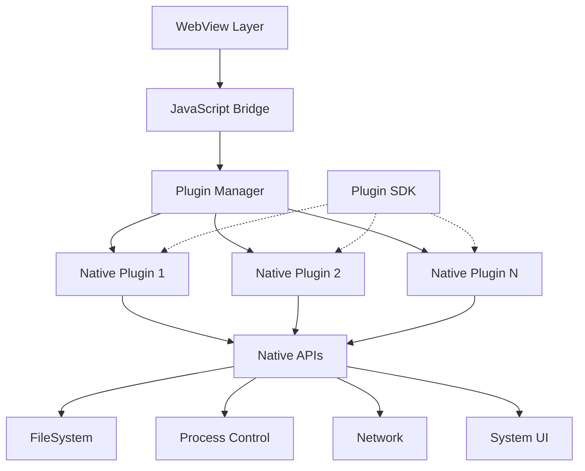

# Hybrid App Architecture Exploration

---
location: utm-dev-production
explored_at: 2026-03-21
tags: [hybrid-app, native-plugins, javascript-bridge, ipc, state-sync]
---

## Overview

This exploration covers hybrid application architecture for utm-dev, enabling native functionality through plugin architecture, JavaScript bridges, native module loading, IPC mechanisms, and state synchronization between native and web layers.

## Table of Contents

1. [Native Plugin Architecture](#native-plugin-architecture)
2. [JavaScript Bridge](#javascript-bridge)
3. [Native Module Loading](#native-module-loading)
4. [Plugin Marketplace](#plugin-marketplace)
5. [IPC Mechanisms](#ipc-mechanisms)
6. [State Synchronization](#state-synchronization)

---

## Native Plugin Architecture

### Architecture Overview



### Plugin System Core

```rust
// src/plugins/native/core.rs
use std::collections::HashMap;
use std::path::{Path, PathBuf};
use std::sync::Arc;
use anyhow::{Result, Context};

/// Native plugin trait
pub trait NativePlugin: Send + Sync {
    /// Plugin identifier
    fn id(&self) -> &str;

    /// Plugin version
    fn version(&self) -> &str;

    /// Plugin name (human-readable)
    fn name(&self) -> &str;

    /// Plugin description
    fn description(&self) -> &str;

    /// Initialize plugin
    fn initialize(&mut self, ctx: &PluginContext) -> Result<()>;

    /// Shutdown plugin
    fn shutdown(&mut self);

    /// Handle method call from JavaScript
    fn call_method(&self, method: &str, args: serde_json::Value) -> Result<serde_json::Value>;

    /// Get plugin capabilities
    fn capabilities(&self) -> &[PluginCapability];

    /// Check if plugin is enabled
    fn is_enabled(&self) -> bool;
}

/// Plugin context provided by host
pub struct PluginContext {
    /// Application data directory
    pub app_data_dir: PathBuf,

    /// Plugin-specific data directory
    pub plugin_data_dir: PathBuf,

    /// Configuration access
    pub config: Arc<PluginConfig>,

    /// Logger for this plugin
    pub logger: PluginLogger,

    /// Host API access
    pub host_api: Arc<dyn HostApi>,
}

pub struct PluginLogger {
    plugin_id: String,
}

impl PluginLogger {
    pub fn debug(&self, message: &str) {
        tracing::debug!("[{}] {}", self.plugin_id, message);
    }

    pub fn info(&self, message: &str) {
        tracing::info!("[{}] {}", self.plugin_id, message);
    }

    pub fn warn(&self, message: &str) {
        tracing::warn!("[{}] {}", self.plugin_id, message);
    }

    pub fn error(&self, message: &str) {
        tracing::error!("[{}] {}", self.plugin_id, message);
    }
}

/// Plugin capabilities
#[derive(Debug, Clone, Copy, PartialEq)]
pub enum PluginCapability {
    FileSystemRead,
    FileSystemWrite,
    ProcessExecution,
    NetworkAccess,
    SystemTray,
    Notifications,
    Clipboard,
    GlobalShortcut,
    NativeMenu,
    WindowControl,
}

/// Host API that plugins can access
pub trait HostApi: Send + Sync {
    /// File system operations
    fn fs(&self) -> &dyn FileSystemApi;

    /// Process operations
    fn process(&self) -> &dyn ProcessApi;

    /// Network operations
    fn network(&self) -> Option<&dyn NetworkApi>;

    /// UI operations
    fn ui(&self) -> &dyn UiApi;

    /// Settings access
    fn settings(&self) -> &dyn SettingsApi;
}

/// Plugin registry
pub struct PluginRegistry {
    plugins: HashMap<String, Box<dyn NativePlugin>>,
    plugin_dirs: Vec<PathBuf>,
    config: PluginRegistryConfig,
}

#[derive(Debug, Clone)]
pub struct PluginRegistryConfig {
    /// Enable plugin sandboxing
    pub sandbox_enabled: bool,

    /// Maximum plugin memory usage (MB)
    pub max_memory_mb: u32,

    /// Plugin timeout (ms)
    pub timeout_ms: u64,

    /// Auto-load plugins
    pub auto_load: bool,
}

impl PluginRegistry {
    pub fn new(config: PluginRegistryConfig) -> Self {
        Self {
            plugins: HashMap::new(),
            plugin_dirs: vec![],
            config,
        }
    }

    /// Register plugin directory
    pub fn add_plugin_dir(&mut self, path: PathBuf) {
        self.plugin_dirs.push(path);
    }

    /// Discover and load all plugins
    pub fn discover_plugins(&mut self) -> Result<Vec<PluginInfo>> {
        let mut discovered = Vec::new();

        for plugin_dir in &self.plugin_dirs {
            if !plugin_dir.exists() {
                continue;
            }

            // Look for plugin manifests
            for entry in std::fs::read_dir(plugin_dir)? {
                let entry = entry?;
                let manifest_path = entry.path().join("plugin.json");

                if manifest_path.exists() {
                    let info = self.load_plugin(&manifest_path)?;
                    discovered.push(info);
                }
            }
        }

        Ok(discovered)
    }

    /// Load a single plugin
    pub fn load_plugin(&mut self, manifest_path: &Path) -> Result<PluginInfo> {
        let manifest_content = std::fs::read_to_string(manifest_path)?;
        let manifest: PluginManifest = serde_json::from_str(&manifest_content)?;

        // Validate manifest
        manifest.validate()?;

        // Determine plugin type and load
        let plugin_path = manifest_path.parent().unwrap().join(&manifest.entry_point);

        let plugin: Box<dyn NativePlugin> = match manifest.plugin_type.as_str() {
            "native" => self.load_native_plugin(&plugin_path, &manifest)?,
            "wasm" => self.load_wasm_plugin(&plugin_path, &manifest)?,
            _ => anyhow::bail!("Unknown plugin type: {}", manifest.plugin_type),
        };

        let info = PluginInfo {
            id: manifest.id.clone(),
            name: manifest.name.clone(),
            version: manifest.version.clone(),
            enabled: manifest.enabled,
            path: manifest_path.parent().unwrap().to_path_buf(),
        };

        self.plugins.insert(manifest.id, plugin);

        Ok(info)
    }

    fn load_native_plugin(
        &self,
        path: &Path,
        manifest: &PluginManifest,
    ) -> Result<Box<dyn NativePlugin>> {
        // Load dynamic library
        let lib = libloading::Library::new(path)?;

        // Get plugin factory function
        unsafe {
            let factory: libloading::Symbol<fn() -> *mut dyn NativePlugin> =
                lib.get(b"_create_plugin")?;
            let plugin_ptr = factory();
            let plugin = Box::from_raw(plugin_ptr);
            Ok(plugin)
        }
    }

    fn load_wasm_plugin(
        &self,
        path: &Path,
        manifest: &PluginManifest,
    ) -> Result<Box<dyn NativePlugin>> {
        // Load WASM plugin using wasmtime
        crate::plugins::wasm::load_wasm_plugin(path, manifest)
    }

    /// Get plugin by ID
    pub fn get_plugin(&self, id: &str) -> Option<&dyn NativePlugin> {
        self.plugins.get(id).map(|p| p.as_ref())
    }

    /// Get mutable plugin reference
    pub fn get_plugin_mut(&mut self, id: &str) -> Option<&mut dyn NativePlugin> {
        self.plugins.get_mut(id).map(|p| p.as_mut())
    }

    /// Call plugin method
    pub fn call_plugin(
        &self,
        plugin_id: &str,
        method: &str,
        args: serde_json::Value,
    ) -> Result<serde_json::Value> {
        let plugin = self
            .plugins
            .get(plugin_id)
            .ok_or_else(|| anyhow::anyhow!("Plugin not found: {}", plugin_id))?;

        plugin.call_method(method, args)
    }

    /// Initialize all plugins
    pub fn initialize_all(&mut self, ctx: &PluginContext) -> Result<()> {
        for plugin in self.plugins.values_mut() {
            if plugin.is_enabled() {
                plugin.initialize(ctx)?;
            }
        }
        Ok(())
    }

    /// Shutdown all plugins
    pub fn shutdown_all(&mut self) {
        for plugin in self.plugins.values_mut() {
            plugin.shutdown();
        }
    }
}

/// Plugin manifest structure
#[derive(Debug, Clone, serde::Deserialize, serde::Serialize)]
pub struct PluginManifest {
    /// Unique plugin ID
    pub id: String,

    /// Plugin version
    pub version: String,

    /// Human-readable name
    pub name: String,

    /// Description
    pub description: Option<String>,

    /// Author information
    pub author: Option<String>,

    /// Plugin type: native, wasm
    #[serde(rename = "type")]
    pub plugin_type: String,

    /// Entry point (library path for native, WASM file for wasm)
    #[serde(rename = "entry_point")]
    pub entry_point: String,

    /// Plugin is enabled by default
    #[serde(default = "default_true")]
    pub enabled: bool,

    /// Required capabilities
    pub capabilities: Vec<String>,

    /// Minimum host version
    pub min_host_version: Option<String>,

    /// Plugin dependencies
    pub dependencies: Vec<PluginDependency>,

    /// Configuration schema (JSON Schema)
    pub config_schema: Option<serde_json::Value>,
}

fn default_true() -> bool {
    true
}

impl PluginManifest {
    fn validate(&self) -> Result<()> {
        // Validate ID format
        if !self.id.chars().all(|c| c.is_alphanumeric() || c == '-' || c == '_') {
            anyhow::bail!("Invalid plugin ID: {}", self.id);
        }

        // Validate version
        semver::Version::parse(&self.version)
            .context("Invalid plugin version")?;

        Ok(())
    }
}

#[derive(Debug, Clone, serde::Deserialize, serde::Serialize)]
pub struct PluginDependency {
    pub id: String,
    pub version: String,
    pub optional: bool,
}

#[derive(Debug, Clone, serde::Deserialize, serde::Serialize)]
pub struct PluginInfo {
    pub id: String,
    pub name: String,
    pub version: String,
    pub enabled: bool,
    pub path: PathBuf,
}
```

### Plugin SDK

```rust
// Plugin SDK for creating native plugins
// utm-plugin-sdk/src/lib.rs

pub use utm_plugin_macros::*;
use std::ffi::c_void;

/// Plugin SDK version
pub const SDK_VERSION: u32 = 1;

/// Plugin registration macro helper
#[macro_export]
macro_rules! register_plugin {
    ($plugin_type:ty) => {
        #[no_mangle]
        pub extern "C" fn _create_plugin() -> *mut dyn $crate::NativePlugin {
            Box::into_raw(Box::new(<$plugin_type>::new()))
        }

        #[no_mangle]
        pub extern "C" fn _sdk_version() -> u32 {
            $crate::SDK_VERSION
        }
    };
}

/// Base plugin struct with common functionality
pub struct BasePlugin {
    id: String,
    version: String,
    name: String,
    enabled: bool,
}

impl BasePlugin {
    pub fn new(id: &str, version: &str, name: &str) -> Self {
        Self {
            id: id.to_string(),
            version: version.to_string(),
            name: name.to_string(),
            enabled: true,
        }
    }
}

/// Example: File System Plugin
pub struct FileSystemPlugin {
    base: BasePlugin,
}

impl FileSystemPlugin {
    pub fn new() -> Self {
        Self {
            base: BasePlugin::new("filesystem", "1.0.0", "File System"),
        }
    }
}

register_plugin!(FileSystemPlugin);

impl NativePlugin for FileSystemPlugin {
    fn id(&self) -> &str {
        &self.base.id
    }

    fn version(&self) -> &str {
        &self.base.version
    }

    fn name(&self) -> &str {
        &self.base.name
    }

    fn description(&self) -> &str {
        "Access to file system operations"
    }

    fn initialize(&mut self, ctx: &PluginContext) -> Result<()> {
        ctx.logger.info("FileSystemPlugin initialized");
        Ok(())
    }

    fn shutdown(&mut self) {}

    fn call_method(&self, method: &str, args: serde_json::Value) -> Result<serde_json::Value> {
        match method {
            "read" => self.read(args),
            "write" => self.write(args),
            "list" => self.list(args),
            "exists" => self.exists(args),
            "remove" => self.remove(args),
            _ => Err(anyhow::anyhow!("Unknown method: {}", method)),
        }
    }

    fn capabilities(&self) -> &[PluginCapability] {
        &[
            PluginCapability::FileSystemRead,
            PluginCapability::FileSystemWrite,
        ]
    }

    fn is_enabled(&self) -> bool {
        self.base.enabled
    }
}

impl FileSystemPlugin {
    fn read(&self, args: serde_json::Value) -> Result<serde_json::Value> {
        #[derive(serde::Deserialize)]
        struct ReadArgs {
            path: String,
            encoding: Option<String>,
        }

        let args: ReadArgs = serde_json::from_value(args)?;
        let content = std::fs::read_to_string(&args.path)?;

        Ok(serde_json::json!({
            "content": content,
            "path": args.path,
        }))
    }

    fn write(&self, args: serde_json::Value) -> Result<serde_json::Value> {
        #[derive(serde::Deserialize)]
        struct WriteArgs {
            path: String,
            content: String,
            append: Option<bool>,
        }

        let args: WriteArgs = serde_json::from_value(args)?;

        if args.append.unwrap_or(false) {
            use std::io::Write;
            let mut file = std::fs::OpenOptions::new()
                .create(true)
                .append(true)
                .open(&args.path)?;
            file.write_all(args.content.as_bytes())?;
        } else {
            std::fs::write(&args.path, args.content)?;
        }

        Ok(serde_json::json!({ "success": true, "path": args.path }))
    }

    fn list(&self, args: serde_json::Value) -> Result<serde_json::Value> {
        #[derive(serde::Deserialize)]
        struct ListArgs {
            path: String,
            recursive: Option<bool>,
        }

        let args: ListArgs = serde_json::from_value(args)?;

        let mut entries = Vec::new();

        if args.recursive.unwrap_or(false) {
            for entry in walkdir::WalkDir::new(&args.path) {
                let entry = entry?;
                entries.push(serde_json::json!({
                    "path": entry.path().to_string_lossy(),
                    "is_dir": entry.file_type().is_dir(),
                    "name": entry.file_name().to_string_lossy(),
                }));
            }
        } else {
            for entry in std::fs::read_dir(&args.path)? {
                let entry = entry?;
                entries.push(serde_json::json!({
                    "path": entry.path().to_string_lossy(),
                    "is_dir": entry.file_type().is_dir(),
                    "name": entry.file_name().to_string_lossy(),
                }));
            }
        }

        Ok(serde_json::json!({ "entries": entries, "path": args.path }))
    }

    fn exists(&self, args: serde_json::Value) -> Result<serde_json::Value> {
        #[derive(serde::Deserialize)]
        struct ExistsArgs {
            path: String,
        }

        let args: ExistsArgs = serde_json::from_value(args)?;

        Ok(serde_json::json!({
            "exists": std::path::Path::new(&args.path).exists(),
            "path": args.path,
        }))
    }

    fn remove(&self, args: serde_json::Value) -> Result<serde_json::Value> {
        #[derive(serde::Deserialize)]
        struct RemoveArgs {
            path: String,
            recursive: Option<bool>,
        }

        let args: RemoveArgs = serde_json::from_value(args)?;

        if args.recursive.unwrap_or(false) {
            std::fs::remove_dir_all(&args.path)?;
        } else {
            std::fs::remove_file(&args.path)?;
        }

        Ok(serde_json::json!({ "success": true, "path": args.path }))
    }
}
```

---

## JavaScript Bridge

### Bridge Core Implementation

```rust
// src/bridge/javascript.rs
use serde::{Deserialize, Serialize};
use serde_json::Value;
use std::collections::HashMap;

/// JavaScript bridge for native <> web communication
pub struct JavaScriptBridge {
    methods: HashMap<String, BridgeMethod>,
    event_handlers: HashMap<String, Vec<BridgeEventHandler>>,
    webview: Arc<dyn WebView>,
    plugin_registry: Arc<RwLock<PluginRegistry>>,
}

#[derive(Clone)]
struct BridgeMethod {
    name: String,
    handler: Arc<dyn Fn(Value) -> Result<Value> + Send + Sync>,
    requires_permission: Option<Permission>,
}

type BridgeEventHandler = Arc<dyn Fn(Value) + Send + Sync>;

#[derive(Debug, Clone, PartialEq)]
pub enum Permission {
    FileSystem,
    Process,
    Network,
    Clipboard,
    Notifications,
}

impl JavaScriptBridge {
    pub fn new(
        webview: Arc<dyn WebView>,
        plugin_registry: Arc<RwLock<PluginRegistry>>,
    ) -> Self {
        let mut bridge = Self {
            methods: HashMap::new(),
            event_handlers: HashMap::new(),
            webview,
            plugin_registry,
        };

        // Register built-in methods
        bridge.register_builtins();

        bridge
    }

    /// Register built-in bridge methods
    fn register_builtins(&mut self) {
        // Plugin method invocation
        self.register_method(
            "invoke",
            Arc::new(|args| self.handle_invoke(args)),
            None,
        );

        // Event subscription
        self.register_method(
            "subscribe",
            Arc::new(|args| self.handle_subscribe(args)),
            None,
        );

        // Event unsubscription
        self.register_method(
            "unsubscribe",
            Arc::new(|args| self.handle_unsubscribe(args)),
            None,
        );

        // Permission request
        self.register_method(
            "requestPermission",
            Arc::new(|args| self.handle_permission_request(args)),
            None,
        );

        // Get bridge info
        self.register_method(
            "getInfo",
            Arc::new(|_| self.get_bridge_info()),
            None,
        );
    }

    /// Register a bridge method
    pub fn register_method(
        &mut self,
        name: &str,
        handler: Arc<dyn Fn(Value) -> Result<Value> + Send + Sync>,
        permission: Option<Permission>,
    ) {
        self.methods.insert(
            name.to_string(),
            BridgeMethod {
                name: name.to_string(),
                handler,
                requires_permission: permission,
            },
        );
    }

    /// Handle method call from JavaScript
    pub async fn handle_call(&self, method: &str, args: Value, callback_id: &str) {
        let result = if let Some(bridge_method) = self.methods.get(method) {
            // Check permission if required
            if bridge_method.requires_permission.is_some() {
                // Check if caller has permission
                // This would check against the current context's permissions
            }

            // Execute handler
            match (bridge_method.handler)(args) {
                Ok(value) => Ok(value),
                Err(e) => Err(BridgeError::MethodError(e.to_string())),
            }
        } else {
            Err(BridgeError::MethodNotFound(method.to_string()))
        };

        // Send result back to JavaScript
        self.send_callback(callback_id, result).await;
    }

    /// Emit event to JavaScript
    pub async fn emit_event(&self, event_name: &str, data: Value) {
        let js_code = format!(
            "window.nativeAPI.emitEvent('{}', {})",
            event_name,
            serde_json::to_string(&data).unwrap_or("{}".to_string())
        );

        let _ = self.webview.eval(&js_code);
    }

    async fn send_callback(&self, callback_id: &str, result: Result<Value, BridgeError>) {
        let (success, value, error) = match result {
            Ok(v) => (true, Some(v), None),
            Err(e) => (false, None, Some(e.to_string())),
        };

        let js_code = format!(
            "window.nativeAPI.handleCallback('{}', {}, {}, {})",
            callback_id,
            success,
            serde_json::to_string(&value).unwrap_or("null".to_string()),
            serde_json::to_string(&error).unwrap_or("null".to_string())
        );

        let _ = self.webview.eval(&js_code);
    }

    fn handle_invoke(&self, args: Value) -> Result<Value> {
        #[derive(Deserialize)]
        struct InvokeArgs {
            plugin: String,
            method: String,
            args: Value,
        }

        let invoke_args: InvokeArgs = serde_json::from_value(args)?;

        let registry = self.plugin_registry.blocking_read();
        registry
            .call_plugin(&invoke_args.plugin, &invoke_args.method, invoke_args.args)
    }

    fn handle_subscribe(&self, args: Value) -> Result<Value> {
        #[derive(Deserialize)]
        struct SubscribeArgs {
            event: String,
            callback: String,
        }

        let subscribe_args: SubscribeArgs = serde_json::from_value(args)?;

        // Store callback for this event
        // In practice, this would store a JS reference to call back

        Ok(serde_json::json!({
            "subscribed": true,
            "event": subscribe_args.event,
        }))
    }

    fn handle_unsubscribe(&self, args: Value) -> Result<Value> {
        Ok(serde_json::json!({ "unsubscribed": true }))
    }

    fn handle_permission_request(&self, args: Value) -> Result<Value> {
        #[derive(Deserialize)]
        struct PermissionArgs {
            permission: String,
        }

        let perm_args: PermissionArgs = serde_json::from_value(args)?;

        // Show permission dialog and get result
        // For now, just grant all
        Ok(serde_json::json!({
            "granted": true,
            "permission": perm_args.permission,
        }))
    }

    fn get_bridge_info(&self) -> Result<Value> {
        Ok(serde_json::json!({
            "version": "1.0.0",
            "methods": self.methods.keys().collect::<Vec<_>>(),
            "platform": std::env::consts::OS,
            "arch": std::env::consts::ARCH,
        }))
    }
}

#[derive(Debug)]
pub enum BridgeError {
    MethodNotFound(String),
    MethodError(String),
    PermissionDenied(String),
    SerializationError(String),
}

impl std::fmt::Display for BridgeError {
    fn fmt(&self, f: &mut std::fmt::Formatter<'_>) -> std::fmt::Result {
        match self {
            BridgeError::MethodNotFound(m) => write!(f, "Method not found: {}", m),
            BridgeError::MethodError(e) => write!(f, "Method error: {}", e),
            BridgeError::PermissionDenied(p) => write!(f, "Permission denied: {}", p),
            BridgeError::SerializationError(e) => write!(f, "Serialization error: {}", e),
        }
    }
}

impl std::error::Error for BridgeError {}
```

### JavaScript Client Library

```typescript
// src/webview/native-api.ts

/**
 * Native API for WebView to communicate with native layer
 */
interface NativeAPI {
  /**
   * Invoke a native plugin method
   */
  invoke<T = any>(plugin: string, method: string, args?: any): Promise<T>;

  /**
   * Subscribe to native events
   */
  on(event: string, callback: (data: any) => void): () => void;

  /**
   * Emit event to native layer
   */
  emit(event: string, data?: any): void;

  /**
   * Get bridge information
   */
  getInfo(): Promise<BridgeInfo>;

  /**
   * Request permission
   */
  requestPermission(permission: string): Promise<PermissionResult>;
}

interface BridgeInfo {
  version: string;
  methods: string[];
  platform: string;
  arch: string;
}

interface PermissionResult {
  granted: boolean;
  permission: string;
}

/**
 * Implementation of Native API using Tauri/Wry bridge
 */
export function createNativeAPI(): NativeAPI {
  let callbackId = 0;
  const pendingCallbacks = new Map<number, {
    resolve: (value: any) => void;
    reject: (error: Error) => void;
  }>();

  // Set up global callback handler
  (window as any).nativeAPI = {
    handleCallback,
    emitEvent,
  };

  function handleCallback(id: number, success: boolean, value: any, error: string | null) {
    const callback = pendingCallbacks.get(id);
    if (!callback) return;

    pendingCallbacks.delete(id);

    if (success) {
      callback.resolve(value);
    } else {
      callback.reject(new Error(error || 'Unknown error'));
    }
  }

  function emitEvent(eventName: string, data: any) {
    window.dispatchEvent(new CustomEvent(`native:${eventName}`, { detail: data }));
  }

  async function invoke<T>(plugin: string, method: string, args?: any): Promise<T> {
    return new Promise((resolve, reject) => {
      const id = ++callbackId;
      pendingCallbacks.set(id, { resolve, reject });

      // Call native method
      const invokeArgs = {
        plugin,
        method,
        args: args || {},
      };

      // Use window.__TAURI__ or window.external.invoke depending on WebView
      if ((window as any).__TAURI__) {
        (window as any).__TAURI__.invoke('plugin:invoke', { args: invokeArgs, callbackId: id });
      } else if (window.external?.invoke) {
        window.external.invoke(JSON.stringify({
          type: 'invoke',
          payload: invokeArgs,
          callbackId: id,
        }));
      } else {
        reject(new Error('Native bridge not available'));
      }
    });
  }

  function on(event: string, callback: (data: any) => void): () => void {
    const handler = (e: Event) => {
      const custom = e as CustomEvent;
      callback(custom.detail);
    };

    window.addEventListener(`native:${event}`, handler);

    return () => {
      window.removeEventListener(`native:${event}`, handler);
    };
  }

  function emit(event: string, data?: any) {
    if ((window as any).__TAURI__) {
      (window as any).__TAURI__.event.emit(event, data);
    } else if (window.external?.invoke) {
      window.external.invoke(JSON.stringify({
        type: 'emit',
        payload: { event, data },
      }));
    }
  }

  async function getInfo(): Promise<BridgeInfo> {
    return invoke('bridge', 'getInfo');
  }

  async function requestPermission(permission: string): Promise<PermissionResult> {
    return invoke('bridge', 'requestPermission', { permission });
  }

  return {
    invoke,
    on,
    emit,
    getInfo,
    requestPermission,
  };
}

// Export singleton instance
export const nativeAPI = createNativeAPI();

/**
 * Plugin-specific API wrappers
 */
export const plugins = {
  // File system plugin
  fs: {
    read: (path: string) => nativeAPI.invoke('filesystem', 'read', { path }),
    write: (path: string, content: string, append?: boolean) =>
      nativeAPI.invoke('filesystem', 'write', { path, content, append }),
    list: (path: string, recursive?: boolean) =>
      nativeAPI.invoke('filesystem', 'list', { path, recursive }),
    exists: (path: string) =>
      nativeAPI.invoke('filesystem', 'exists', { path }),
    remove: (path: string, recursive?: boolean) =>
      nativeAPI.invoke('filesystem', 'remove', { path, recursive }),
  },

  // Build plugin
  build: {
    start: (options: BuildOptions) => nativeAPI.invoke('build', 'start', options),
    cancel: (buildId: string) => nativeAPI.invoke('build', 'cancel', { buildId }),
    status: (buildId: string) => nativeAPI.invoke('build', 'status', { buildId }),
    logs: (buildId: string) => nativeAPI.invoke('build', 'logs', { buildId }),
  },

  // Settings plugin
  settings: {
    get: (key: string) => nativeAPI.invoke('settings', 'get', { key }),
    set: (key: string, value: any) => nativeAPI.invoke('settings', 'set', { key, value }),
    all: () => nativeAPI.invoke('settings', 'all'),
  },

  // Process plugin
  process: {
    run: (command: string, args: string[], options?: ProcessOptions) =>
      nativeAPI.invoke('process', 'run', { command, args, options }),
    kill: (pid: number) => nativeAPI.invoke('process', 'kill', { pid }),
    list: () => nativeAPI.invoke('process', 'list'),
  },
};

interface BuildOptions {
  target?: string;
  profile?: 'debug' | 'release';
  features?: string[];
}

interface ProcessOptions {
  cwd?: string;
  env?: Record<string, string>;
  stdin?: string;
}
```

### TypeScript Type Definitions

```typescript
// src/webview/types/native.d.ts

declare global {
  interface Window {
    nativeAPI: {
      invoke<T>(plugin: string, method: string, args?: any): Promise<T>;
      on(event: string, callback: (data: any) => void): () => void;
      emit(event: string, data?: any): void;
      getInfo(): Promise<BridgeInfo>;
      handleCallback(id: number, success: boolean, value: any, error: string | null): void;
      emitEvent(eventName: string, data: any): void;
    };
    __TAURI__?: {
      invoke: (cmd: string, args?: any) => Promise<any>;
      event: {
        emit: (event: string, data?: any) => void;
        listen: (event: string, handler: (e: any) => void) => Promise<() => void>;
      };
    };
    external?: {
      invoke: (message: string) => void;
    };
  }
}

export {};
```

---

## Native Module Loading

### Dynamic Library Loading

```rust
// src/plugins/loader.rs
use std::path::{Path, PathBuf};
use libloading::Library;
use anyhow::{Result, Context};

/// Native module loader
pub struct NativeModuleLoader {
    search_paths: Vec<PathBuf>,
    loaded_modules: HashMap<String, LoadedModule>,
}

struct LoadedModule {
    _library: Library,
    entry_point: *mut libc::c_void,
    plugin: *mut dyn crate::plugins::NativePlugin,
}

// SAFETY: We ensure the library outlives any use of the plugin
unsafe impl Send for LoadedModule {}
unsafe impl Sync for LoadedModule {}

impl NativeModuleLoader {
    pub fn new() -> Self {
        Self {
            search_paths: Self::default_search_paths(),
            loaded_modules: HashMap::new(),
        }
    }

    /// Add search path for modules
    pub fn add_search_path(&mut self, path: PathBuf) {
        self.search_paths.push(path);
    }

    /// Load a native module
    pub fn load_module(&mut self, module_name: &str) -> Result<&dyn crate::plugins::NativePlugin> {
        // Check if already loaded
        if let Some(loaded) = self.loaded_modules.get(module_name) {
            unsafe {
                return Ok(&*loaded.plugin);
            }
        }

        // Find module file
        let module_path = self.find_module(module_name)?;

        // Load library
        unsafe {
            let library = Library::new(&module_path)
                .with_context(|| format!("Failed to load module: {}", module_path.display()))?;

            // Get factory function
            let factory: libloading::Symbol<fn() -> *mut dyn crate::plugins::NativePlugin> =
                library.get(b"_create_plugin")
                    .with_context(|| format!("Module {} missing _create_plugin symbol", module_name))?;

            let plugin_ptr = factory();

            // Get SDK version check
            let sdk_version: libloading::Symbol<fn() -> u32> =
                library.get(b"_sdk_version").ok();

            if let Some(version_fn) = sdk_version {
                let version = version_fn();
                if version != crate::plugins::SDK_VERSION {
                    anyhow::bail!(
                        "Module {} SDK version mismatch: expected {}, got {}",
                        module_name,
                        crate::plugins::SDK_VERSION,
                        version
                    );
                }
            }

            let loaded = LoadedModule {
                _library: library,
                entry_point: plugin_ptr as *mut libc::c_void,
                plugin: plugin_ptr,
            };

            let plugin_ref = &*loaded.plugin;

            self.loaded_modules.insert(module_name.to_string(), loaded);

            Ok(plugin_ref)
        }
    }

    fn find_module(&self, module_name: &str) -> Result<PathBuf> {
        #[cfg(target_os = "windows")]
        let (prefix, suffix) = ("", ".dll");

        #[cfg(target_os = "macos")]
        let (prefix, suffix) = ("lib", ".dylib");

        #[cfg(target_os = "linux")]
        let (prefix, suffix) = ("lib", ".so");

        let filename = format!("{}{}{}", prefix, module_name, suffix);

        for search_path in &self.search_paths {
            let candidate = search_path.join(&filename);
            if candidate.exists() {
                return Ok(candidate);
            }

            // Also check without prefix
            let candidate_no_prefix = search_path.join(format!("{}{}", module_name, suffix));
            if candidate_no_prefix.exists() {
                return Ok(candidate_no_prefix);
            }
        }

        anyhow::bail!("Module not found: {}", module_name);
    }

    fn default_search_paths() -> Vec<PathBuf> {
        let mut paths = Vec::new();

        // Current directory plugins folder
        if let Ok(exe) = std::env::current_exe() {
            if let Some(parent) = exe.parent() {
                paths.push(parent.join("plugins"));
            }
        }

        // User plugins directory
        if let Some(home) = dirs::home_dir() {
            paths.push(home.join(".utm").join("plugins"));
        }

        // System plugins directory
        #[cfg(target_os = "linux")]
        paths.push(PathBuf::from("/usr/lib/utm/plugins"));

        #[cfg(target_os = "macos")]
        paths.push(PathBuf::from("/Library/Application Support/utm/plugins"));

        #[cfg(target_os = "windows")]
        if let Some(program_files) = std::env::var_os("ProgramFiles") {
            paths.push(PathBuf::from(program_files).join("utm").join("plugins"));
        }

        paths
    }

    /// Unload a module
    pub fn unload_module(&mut self, module_name: &str) -> Result<()> {
        self.loaded_modules.remove(module_name);
        Ok(())
    }

    /// Get loaded module names
    pub fn loaded_modules(&self) -> Vec<&str> {
        self.loaded_modules.keys().map(|s| s.as_str()).collect()
    }
}

impl Drop for NativeModuleLoader {
    fn drop(&mut self) {
        // Clean up all loaded plugins
        for (_, mut loaded) in self.loaded_modules.drain() {
            unsafe {
                // Call plugin destructor if available
                // This is handled by the Box dropping
                drop(Box::from_raw(loaded.plugin));
                // Library is dropped here, unloading the module
                drop(loaded._library);
            }
        }
    }
}
```

### WASM Module Loading

```rust
// src/plugins/wasm/loader.rs
use wasmtime::{Engine, Module, Store, Instance, Func, Val, ValType};
use std::path::Path;
use anyhow::{Result, Context};

/// WASM plugin loader
pub struct WasmPluginLoader {
    engine: Engine,
    linker: wasmtime::Linker<WasmPluginState>,
}

struct WasmPluginState {
    memory: Option<wasmtime::Memory>,
    plugin_id: String,
    logger: crate::plugins::PluginLogger,
    host_api: Arc<dyn crate::plugins::HostApi>,
}

impl WasmPluginLoader {
    pub fn new() -> Result<Self> {
        let engine = Engine::default();

        let mut linker = wasmtime::Linker::new(&engine);

        // Register host functions
        linker.func_wrap("env", "log", |caller: wasmtime::Caller<'_, WasmPluginState>, level: i32, ptr: i32, len: i32| {
            let state = caller.data();
            if let Some(memory) = &state.memory {
                let mut buf = vec![0u8; len as usize];
                memory.read(caller, ptr as usize, &mut buf).ok();
                if let Ok(msg) = String::from_utf8(buf) {
                    match level {
                        0 => state.logger.debug(&msg),
                        1 => state.logger.info(&msg),
                        2 => state.logger.warn(&msg),
                        3 => state.logger.error(&msg),
                        _ => {}
                    }
                }
            }
        });

        linker.func_wrap("env", "fs_read", |caller: wasmtime::Caller<'_, WasmPluginState>, path_ptr: i32, path_len: i32| -> i64 {
            // Implement file read
            -1 // Error for now
        });

        Ok(Self { engine, linker })
    }

    pub fn load_plugin(
        &self,
        wasm_path: &Path,
        manifest: &crate::plugins::PluginManifest,
    ) -> Result<Box<dyn crate::plugins::NativePlugin>> {
        let wasm_bytes = std::fs::read(wasm_path)
            .with_context(|| format!("Failed to read WASM file: {}", wasm_path.display()))?;

        let module = Module::from_binary(&self.engine, &wasm_bytes)?;

        let state = WasmPluginState {
            memory: None,
            plugin_id: manifest.id.clone(),
            logger: crate::plugins::PluginLogger {
                plugin_id: format!("wasm:{}", manifest.id),
            },
            host_api: Arc::new(DummyHostApi), // Would be real implementation
        };

        let mut store = Store::new(&self.engine, state);

        // Find memory export
        for export in module.exports() {
            if export.name() == "memory" {
                if let wasmtime::ExternType::Memory(_) = export.ty() {
                    // Memory will be created during instantiation
                }
            }
        }

        let instance = self.linker.instantiate(&mut store, &module)?;

        // Get exported memory
        if let Some(memory) = instance.get_memory(&mut store, "memory") {
            store.data_mut().memory = Some(memory.clone());
        }

        // Create WASM plugin wrapper
        let plugin = WasmPlugin {
            instance,
            store,
            manifest: manifest.clone(),
        };

        Ok(Box::new(plugin))
    }
}

struct WasmPlugin {
    instance: wasmtime::Instance,
    store: Store<WasmPluginState>,
    manifest: crate::plugins::PluginManifest,
}

impl crate::plugins::NativePlugin for WasmPlugin {
    fn id(&self) -> &str {
        &self.manifest.id
    }

    fn version(&self) -> &str {
        &self.manifest.version
    }

    fn name(&self) -> &str {
        &self.manifest.name
    }

    fn description(&self) -> &str {
        self.manifest.description.as_deref().unwrap_or("")
    }

    fn initialize(&mut self, ctx: &crate::plugins::PluginContext) -> Result<()> {
        // Call WASM initialize function
        if let Some(init_func) = self.instance.get_typed_func::<(), ()>(&mut self.store, "init") {
            init_func.call(&mut self.store, ())?;
        }
        Ok(())
    }

    fn shutdown(&mut self) {
        // Call WASM shutdown function
        if let Some(shutdown_func) = self.instance.get_typed_func::<(), ()>(&mut self.store, "shutdown") {
            let _ = shutdown_func.call(&mut self.store, ());
        }
    }

    fn call_method(&self, method: &str, args: serde_json::Value) -> Result<serde_json::Value> {
        // Serialize args to bytes
        let args_bytes = serde_json::to_vec(&args)?;

        // Allocate memory in WASM
        let args_ptr = self.allocate_in_wasm(&args_bytes)?;
        let args_len = args_bytes.len() as i32;

        // Call the method
        let method_func = self.instance
            .get_typed_func::<(i32, i32), i32>(&mut self.store, method)
            .ok_or_else(|| anyhow::anyhow!("Method not found: {}", method))?;

        let result_ptr = method_func.call(&mut self.store, (args_ptr, args_len))?;

        // Read result from WASM memory
        let result = self.read_from_wasm(result_ptr)?;

        Ok(result)
    }

    fn capabilities(&self) -> &[crate::plugins::PluginCapability] {
        // Parse from manifest or WASM exports
        &[]
    }

    fn is_enabled(&self) -> bool {
        self.manifest.enabled
    }
}

impl WasmPlugin {
    fn allocate_in_wasm(&mut self, data: &[u8]) -> Result<i32> {
        // Use WASM export to allocate memory
        let malloc = self.instance
            .get_typed_func::<i32, i32>(&mut self.store, "malloc")
            .ok_or_else(|| anyhow::anyhow!("WASM module missing malloc"))?;

        let ptr = malloc.call(&mut self.store, data.len() as i32)?;

        // Write data to WASM memory
        if let Some(memory) = self.instance.get_memory(&mut self.store, "memory") {
            memory.write(&mut self.store, ptr as usize, data)?;
        }

        Ok(ptr)
    }

    fn read_from_wasm(&self, ptr: i32) -> Result<serde_json::Value> {
        // Read length from first 4 bytes
        if let Some(memory) = self.instance.get_memory(&self.store, "memory") {
            let mut len_buf = [0u8; 4];
            memory.read(&self.store, ptr as usize, &mut len_buf)?;
            let len = u32::from_le_bytes(len_buf) as usize;

            // Read data
            let mut data = vec![0u8; len];
            memory.read(&self.store, (ptr + 4) as usize, &mut data)?;

            Ok(serde_json::from_slice(&data)?)
        } else {
            anyhow::bail!("No memory exported")
        }
    }
}

struct DummyHostApi;

impl crate::plugins::HostApi for DummyHostApi {
    fn fs(&self) -> &dyn crate::plugins::FileSystemApi {
        &DummyFsApi
    }

    fn process(&self) -> &dyn crate::plugins::ProcessApi {
        &DummyProcessApi
    }

    fn network(&self) -> Option<&dyn crate::plugins::NetworkApi> {
        None
    }

    fn ui(&self) -> &dyn crate::plugins::UiApi {
        &DummyUiApi
    }

    fn settings(&self) -> &dyn crate::plugins::SettingsApi {
        &DummySettingsApi
    }
}

struct DummyFsApi;
impl crate::plugins::FileSystemApi for DummyFsApi {}

struct DummyProcessApi;
impl crate::plugins::ProcessApi for DummyProcessApi {}

struct DummyUiApi;
impl crate::plugins::UiApi for DummyUiApi {}

struct DummySettingsApi;
impl crate::plugins::SettingsApi for DummySettingsApi {}
```

---

## Plugin Marketplace

### Marketplace Client

```rust
// src/plugins/marketplace/client.rs
use reqwest::Client;
use serde::{Deserialize, Serialize};

/// Plugin marketplace API client
pub struct MarketplaceClient {
    base_url: String,
    client: Client,
    auth_token: Option<String>,
}

#[derive(Debug, Clone, Serialize, Deserialize)]
pub struct MarketplacePlugin {
    pub id: String,
    pub name: String,
    pub description: String,
    pub version: String,
    pub author: AuthorInfo,
    pub category: String,
    pub tags: Vec<String>,
    pub downloads: u64,
    pub rating: Option<f32>,
    pub reviews_count: u64,
    pub created_at: String,
    pub updated_at: String,
    pub versions: Vec<PluginVersion>,
    pub verified: bool,
}

#[derive(Debug, Clone, Serialize, Deserialize)]
pub struct AuthorInfo {
    pub name: String,
    pub url: Option<String>,
    pub verified: bool,
}

#[derive(Debug, Clone, Serialize, Deserialize)]
pub struct PluginVersion {
    pub version: String,
    pub download_url: String,
    pub checksum: String,
    pub min_host_version: String,
    pub release_notes: Option<String>,
    pub published_at: String,
    pub downloads: u64,
}

#[derive(Debug, Clone, Serialize, Deserialize)]
pub struct PluginSearchResult {
    pub total: u64,
    pub page: u32,
    pub per_page: u32,
    pub plugins: Vec<MarketplacePlugin>,
}

#[derive(Debug, Clone, Serialize, Deserialize)]
pub struct PluginCategory {
    pub id: String,
    pub name: String,
    pub description: String,
    pub plugin_count: u64,
}

impl MarketplaceClient {
    pub fn new(base_url: &str) -> Self {
        Self {
            base_url: base_url.to_string(),
            client: Client::new(),
            auth_token: None,
        }
    }

    pub fn with_auth(mut self, token: &str) -> Self {
        self.auth_token = Some(token.to_string());
        self
    }

    /// Search plugins
    pub async fn search(&self, query: &str, filters: &SearchFilters) -> Result<PluginSearchResult, MarketplaceError> {
        let mut req = self.client.get(&format!("{}/plugins/search", self.base_url))
            .query(&[("q", query)]);

        if let Some(category) = &filters.category {
            req = req.query(&[("category", category)]);
        }

        if filters.verified_only {
            req = req.query(&[("verified", "true")]);
        }

        if let Some(min_rating) = filters.min_rating {
            req = req.query(&[("min_rating", &min_rating.to_string())]);
        }

        req = req.query(&[("page", &filters.page.to_string())]);
        req = req.query(&[("per_page", &filters.per_page.to_string())]);

        if let Some(token) = &self.auth_token {
            req = req.header("Authorization", format!("Bearer {}", token));
        }

        let response = req.send().await?;

        if response.status().is_success() {
            Ok(response.json().await?)
        } else {
            Err(MarketplaceError::ApiError(response.status()))
        }
    }

    /// Get plugin details
    pub async fn get_plugin(&self, plugin_id: &str) -> Result<MarketplacePlugin, MarketplaceError> {
        let response = self.client.get(&format!("{}/plugins/{}", self.base_url, plugin_id))
            .send()
            .await?;

        if response.status().is_success() {
            Ok(response.json().await?)
        } else {
            Err(MarketplaceError::NotFound(plugin_id.to_string()))
        }
    }

    /// Download plugin
    pub async fn download_plugin(&self, plugin_id: &str, version: &str) -> Result<Vec<u8>, MarketplaceError> {
        let response = self.client.get(&format!("{}/plugins/{}/download", self.base_url, plugin_id))
            .query(&[("version", version)])
            .send()
            .await?;

        if response.status().is_success() {
            Ok(response.bytes().await?.to_vec())
        } else {
            Err(MarketplaceError::DownloadFailed(plugin_id.to_string()))
        }
    }

    /// Get trending plugins
    pub async fn trending(&self, period: &str) -> Result<Vec<MarketplacePlugin>, MarketplaceError> {
        let response = self.client.get(&format!("{}/plugins/trending", self.base_url))
            .query(&[("period", period)])
            .send()
            .await?;

        if response.status().is_success() {
            Ok(response.json().await?)
        } else {
            Err(MarketplaceError::ApiError(response.status()))
        }
    }

    /// Get categories
    pub async fn categories(&self) -> Result<Vec<PluginCategory>, MarketplaceError> {
        let response = self.client.get(&format!("{}/categories", self.base_url))
            .send()
            .await?;

        if response.status().is_success() {
            Ok(response.json().await?)
        } else {
            Err(MarketplaceError::ApiError(response.status()))
        }
    }
}

#[derive(Debug, Clone, Default)]
pub struct SearchFilters {
    pub category: Option<String>,
    pub verified_only: bool,
    pub min_rating: Option<f32>,
    pub page: u32,
    pub per_page: u32,
}

#[derive(Debug)]
pub enum MarketplaceError {
    NetworkError(reqwest::Error),
    ApiError(reqwest::StatusCode),
    NotFound(String),
    DownloadFailed(String),
    ParseError(serde_json::Error),
}

impl From<reqwest::Error> for MarketplaceError {
    fn from(err: reqwest::Error) -> Self {
        MarketplaceError::NetworkError(err)
    }
}

impl From<serde_json::Error> for MarketplaceError {
    fn from(err: serde_json::Error) -> Self {
        MarketplaceError::ParseError(err)
    }
}
```

---

## IPC Mechanisms

### Message Channel Implementation

```rust
// src/ipc/channel.rs
use std::sync::{Arc, Mutex};
use tokio::sync::{mpsc, broadcast};
use serde::{Deserialize, Serialize};

/// Inter-process communication channel
pub struct IpcChannel {
    id: String,
    sender: mpsc::Sender<IpcMessage>,
    receiver: Arc<Mutex<mpsc::Receiver<IpcMessage>>>,
    broadcast_tx: broadcast::Sender<IpcEvent>,
}

#[derive(Debug, Clone, Serialize, Deserialize)]
pub struct IpcMessage {
    pub id: String,
    pub from: String,
    pub to: String,
    pub message_type: String,
    pub payload: serde_json::Value,
    pub reply_to: Option<String>,
}

#[derive(Debug, Clone, Serialize, Deserialize)]
pub struct IpcEvent {
    pub event_type: String,
    pub source: String,
    pub data: serde_json::Value,
}

impl IpcChannel {
    pub fn new(id: &str) -> Self {
        let (sender, receiver) = mpsc::channel(100);
        let (broadcast_tx, _) = broadcast::channel(100);

        Self {
            id: id.to_string(),
            sender,
            receiver: Arc::new(Mutex::new(receiver)),
            broadcast_tx,
        }
    }

    /// Send message to specific target
    pub async fn send(&self, to: &str, message_type: &str, payload: serde_json::Value) -> Result<(), IpcError> {
        let message = IpcMessage {
            id: uuid::Uuid::new_v4().to_string(),
            from: self.id.clone(),
            to: to.to_string(),
            message_type: message_type.to_string(),
            payload,
            reply_to: None,
        };

        self.sender.send(message).await?;
        Ok(())
    }

    /// Send request and wait for response
    pub async fn request(&self, to: &str, message_type: &str, payload: serde_json::Value, timeout_ms: u64) -> Result<serde_json::Value, IpcError> {
        let request_id = uuid::Uuid::new_v4().to_string();

        // Create one-shot receiver for response
        let (response_tx, mut response_rx) = mpsc::channel(1);

        let message = IpcMessage {
            id: request_id.clone(),
            from: self.id.clone(),
            to: to.to_string(),
            message_type: message_type.to_string(),
            payload,
            reply_to: Some(request_id.clone()),
        };

        self.sender.send(message).await?;

        // Wait for response with timeout
        tokio::select! {
            response = response_rx.recv() => {
                if let Some(msg) = response {
                    Ok(msg.payload)
                } else {
                    Err(IpcError::ChannelClosed)
                }
            }
            _ = tokio::time::sleep(tokio::time::Duration::from_millis(timeout_ms)) => {
                Err(IpcError::Timeout)
            }
        }
    }

    /// Subscribe to events
    pub fn subscribe(&self) -> broadcast::Receiver<IpcEvent> {
        self.broadcast_tx.subscribe()
    }

    /// Broadcast event
    pub fn broadcast(&self, event_type: &str, source: &str, data: serde_json::Value) -> Result<(), IpcError> {
        let event = IpcEvent {
            event_type: event_type.to_string(),
            source: source.to_string(),
            data,
        };

        self.broadcast_tx.send(event)?;
        Ok(())
    }

    /// Receive next message
    pub async fn receive(&self) -> Option<IpcMessage> {
        let mut receiver = self.receiver.lock().unwrap();
        receiver.recv().await
    }
}

#[derive(Debug)]
pub enum IpcError {
    SendError(mpsc::error::SendError<IpcMessage>),
    BroadcastError(broadcast::error::SendError<IpcEvent>),
    Timeout,
    ChannelClosed,
}

impl From<mpsc::error::SendError<IpcMessage>> for IpcError {
    fn from(err: mpsc::error::SendError<IpcMessage>) -> Self {
        IpcError::SendError(err)
    }
}

impl From<broadcast::error::SendError<IpcEvent>> for IpcError {
    fn from(err: broadcast::error::SendError<IpcEvent>) -> Self {
        IpcError::BroadcastError(err)
    }
}
```

### WebView IPC

```rust
// src/ipc/webview.rs
use serde::{Deserialize, Serialize};

/// IPC protocol for WebView communication
pub struct WebViewIpc {
    channel: IpcChannel,
    pending_requests: Arc<Mutex<HashMap<String, tokio::sync::oneshot::Sender<serde_json::Value>>>>,
}

#[derive(Debug, Clone, Serialize, Deserialize)]
#[serde(tag = "type")]
pub enum WebViewMessage {
    Invoke { plugin: String, method: String, args: serde_json::Value },
    Subscribe { event: String },
    Unsubscribe { event: String },
    Emit { event: String, data: serde_json::Value },
    Response { id: String, success: bool, result: Option<serde_json::Value>, error: Option<String> },
}

impl WebViewIpc {
    pub fn new(channel: IpcChannel) -> Self {
        Self {
            channel,
            pending_requests: Arc::new(Mutex::new(HashMap::new())),
        }
    }

    /// Handle message from WebView
    pub async fn handle_message(&self, message: WebViewMessage) -> Result<(), IpcError> {
        match message {
            WebViewMessage::Invoke { plugin, method, args } => {
                // Forward to plugin system
                let result = self.invoke_plugin(&plugin, &method, args).await;

                // Send response back
                // This would use the webview's JS evaluation
            }

            WebViewMessage::Subscribe { event } => {
                // Register event subscription
            }

            WebViewMessage::Unsubscribe { event } => {
                // Remove subscription
            }

            WebViewMessage::Emit { event, data } => {
                // Handle event from WebView
                self.channel.broadcast(&event, "webview", data)?;
            }

            WebViewMessage::Response { id, success, result, error } => {
                // Complete pending request
                let mut pending = self.pending_requests.lock().unwrap();
                if let Some(tx) = pending.remove(&id) {
                    let _ = tx.send(result.unwrap_or(serde_json::Value::Null));
                }
            }
        }

        Ok(())
    }

    /// Invoke plugin from WebView
    pub async fn invoke_plugin(&self, plugin: &str, method: &str, args: serde_json::Value) -> Result<serde_json::Value, IpcError> {
        // This would use the plugin registry
        // For now, return a placeholder
        Ok(serde_json::json!({ "result": "ok" }))
    }

    /// Send event to WebView
    pub fn send_to_webview(&self, event: &str, data: serde_json::Value) {
        let message = WebViewMessage::Emit {
            event: event.to_string(),
            data,
        };

        // Serialize and send via postMessage or equivalent
    }
}
```

---

## State Synchronization

### Sync State Manager

```rust
// src/state/sync.rs
use std::collections::HashMap;
use std::sync::{Arc, RwLock};
use serde::{Deserialize, Serialize};
use tokio::sync::broadcast;

/// State synchronization between native and web layers
pub struct StateSync {
    state: Arc<RwLock<AppState>>,
    history: Arc<RwLock<StateHistory>>,
    tx: broadcast::Sender<StateUpdate>,
    rx: broadcast::Receiver<StateUpdate>,
}

#[derive(Debug, Clone, Serialize, Deserialize)]
pub struct AppState {
    /// Build state
    pub build: BuildState,

    /// Project state
    pub project: ProjectState,

    /// Settings
    pub settings: SettingsState,

    /// UI state
    pub ui: UiState,
}

#[derive(Debug, Clone, Serialize, Deserialize, Default)]
pub struct BuildState {
    pub status: BuildStatus,
    pub current_build_id: Option<String>,
    pub progress: u8,
    pub logs: Vec<String>,
    pub last_duration_ms: Option<u64>,
}

#[derive(Debug, Clone, Serialize, Deserialize, PartialEq)]
pub enum BuildStatus {
    Idle,
    Running,
    Success,
    Failed,
}

impl Default for BuildStatus {
    fn default() -> Self {
        BuildStatus::Idle
    }
}

#[derive(Debug, Clone, Serialize, Deserialize, Default)]
pub struct ProjectState {
    pub current_project: Option<String>,
    pub recent_projects: Vec<String>,
    pub unsaved_changes: bool,
}

#[derive(Debug, Clone, Serialize, Deserialize, Default)]
pub struct SettingsState {
    pub theme: String,
    pub build_target: String,
    pub build_profile: String,
    pub features: Vec<String>,
}

#[derive(Debug, Clone, Serialize, Deserialize, Default)]
pub struct UiState {
    pub sidebar_open: bool,
    pub active_panel: String,
    pub notifications: Vec<Notification>,
}

#[derive(Debug, Clone, Serialize, Deserialize)]
pub struct Notification {
    pub id: String,
    pub message: String,
    pub level: NotificationLevel,
    pub timestamp: u64,
}

#[derive(Debug, Clone, Serialize, Deserialize, PartialEq)]
pub enum NotificationLevel {
    Info,
    Success,
    Warning,
    Error,
}

#[derive(Debug, Clone, Serialize, Deserialize)]
pub struct StateUpdate {
    pub path: String,
    pub value: serde_json::Value,
    pub source: UpdateSource,
    pub timestamp: u64,
}

#[derive(Debug, Clone, Serialize, Deserialize, PartialEq)]
pub enum UpdateSource {
    Native,
    WebView,
    Sync,
}

struct StateHistory {
    snapshots: Vec<(u64, AppState)>,
    max_history: usize,
}

impl StateSync {
    pub fn new(initial_state: AppState) -> Self {
        let (tx, _rx) = broadcast::channel(100);

        Self {
            state: Arc::new(RwLock::new(initial_state)),
            history: Arc::new(RwLock::new(StateHistory {
                snapshots: Vec::new(),
                max_history: 100,
            })),
            tx,
            rx: tx.subscribe(),
        }
    }

    /// Get current state
    pub fn get_state(&self) -> AppState {
        self.state.read().unwrap().clone()
    }

    /// Get specific state section
    pub fn get_section<T: Clone>(&self, section: &str) -> Option<T> {
        let state = self.state.read().unwrap();
        match section {
            "build" => serde_json::to_value(&state.build).ok()?.as_object().cloned(),
            "project" => serde_json::to_value(&state.project).ok()?.as_object().cloned(),
            "settings" => serde_json::to_value(&state.settings).ok()?.as_object().cloned(),
            "ui" => serde_json::to_value(&state.ui).ok()?.as_object().cloned(),
            _ => None,
        }.and_then(|v| serde_json::from_value(serde_json::Value::Object(v)).ok())
    }

    /// Update state at path
    pub fn update(&self, path: &str, value: serde_json::Value, source: UpdateSource) -> Result<(), StateError> {
        let mut state = self.state.write().unwrap();

        // Update state at path
        self.set_value_at_path(&mut state, path, value.clone());

        // Save to history
        {
            let mut history = self.history.write().unwrap();
            history.snapshots.push((
                std::time::SystemTime::now()
                    .duration_since(std::time::UNIX_EPOCH)
                    .unwrap()
                    .as_millis() as u64,
                state.clone(),
            ));

            // Trim history
            if history.snapshots.len() > history.max_history {
                history.snapshots.remove(0);
            }
        }

        // Broadcast update
        let update = StateUpdate {
            path: path.to_string(),
            value,
            source,
            timestamp: std::time::SystemTime::now()
                .duration_since(std::time::UNIX_EPOCH)
                .unwrap()
                .as_millis() as u64,
        };

        self.tx.send(update).map_err(|_| StateError::BroadcastFailed)?;

        Ok(())
    }

    /// Subscribe to state updates
    pub fn subscribe(&self) -> broadcast::Receiver<StateUpdate> {
        self.tx.subscribe()
    }

    /// Sync state from remote (for multi-window or distributed scenarios)
    pub fn sync_from_remote(&self, remote_state: AppState) -> Result<(), StateError> {
        let mut local_state = self.state.write().unwrap();

        // Merge strategies:
        // 1. Last-write-wins for simple values
        // 2. Merge for collections
        // 3. Custom logic for conflicting states

        // For now, simple last-write-wins
        *local_state = remote_state;

        Ok(())
    }

    /// Undo last state change
    pub fn undo(&self) -> Result<(), StateError> {
        let mut history = self.history.write().unwrap();

        if history.snapshots.len() < 2 {
            return Err(StateError::NoHistory);
        }

        // Remove current state
        history.snapshots.pop();

        // Get previous state
        let (_, previous) = history.snapshots.last().unwrap().clone();

        let mut state = self.state.write().unwrap();
        *state = previous;

        Ok(())
    }

    fn set_value_at_path(&self, state: &mut AppState, path: &str, value: serde_json::Value) {
        // Simple path parser for nested state updates
        // e.g., "build.status", "ui.sidebar_open"

        let parts: Vec<&str> = path.split('.').collect();

        match parts.as_slice() {
            ["build", rest @ ..] => {
                // Update build state
                self.set_nested_value(&mut state.build, rest, value);
            }
            ["project", rest @ ..] => {
                self.set_nested_value(&mut state.project, rest, value);
            }
            ["settings", rest @ ..] => {
                self.set_nested_value(&mut state.settings, rest, value);
            }
            ["ui", rest @ ..] => {
                self.set_nested_value(&mut state.ui, rest, value);
            }
            _ => {}
        }
    }

    fn set_nested_value<T: Serialize + for<'de> Deserialize<'de>>(
        &self,
        state: &mut T,
        path: &[&str],
        value: serde_json::Value,
    ) {
        if path.is_empty() {
            if let Ok(new_state) = serde_json::from_value(value) {
                *state = new_state;
            }
            return;
        }

        // For nested paths, would need to handle each field type
        // This is a simplified version
    }
}

#[derive(Debug)]
pub enum StateError {
    InvalidPath(String),
    BroadcastFailed,
    NoHistory,
    SerializationError(serde_json::Error),
}

impl From<serde_json::Error> for StateError {
    fn from(err: serde_json::Error) -> Self {
        StateError::SerializationError(err)
    }
}
```

### JavaScript State Hook

```typescript
// src/webview/state/useSync.ts

import { $signal, $effect } from 'datastar';

/**
 * Synchronize state with native layer
 */
export function useSync<T>(path: string, initialValue: T) {
  const signal = $signal<T>(initialValue);
  let unsubscribe: (() => void) | null = null;

  // Subscribe to native updates
  $effect(() => {
    const handler = (event: CustomEvent) => {
      if (event.detail.path === path) {
        signal(event.detail.value);
      }
    };

    window.addEventListener('state:update', handler);

    // Request initial value
    nativeAPI.invoke('state', 'get', { path }).then((value) => {
      signal(value);
    });

    return () => {
      window.removeEventListener('state:update', handler);
      unsubscribe?.();
    };
  });

  // Sync changes back to native
  $effect(() => {
    const value = signal();
    nativeAPI.invoke('state', 'set', { path, value });
  });

  return signal;
}

// Example usage in Datastar component
export function BuildStatus() {
  const buildStatus = useSync('build.status', 'idle');
  const buildProgress = useSync('build.progress', 0);
  const buildLogs = useSync('build.logs', []);

  return `
    <div data-on-utm--build-started="$buildStatus('running'); $buildProgress(0)">
      <div class="status" data-text="$buildStatus"></div>
      <progress value="$buildProgress" max="100"></progress>
      <div class="logs" data-html="$buildLogs.join('\n')"></div>
    </div>
  `;
}
```

---

## Summary & Recommendations

### Architecture Benefits

1. **Modularity**: Native plugins enable extending functionality without core changes
2. **Security**: Sandboxed WASM plugins for untrusted code
3. **Performance**: Native code for CPU-intensive operations
4. **Flexibility**: JavaScript bridge for rapid UI development

### Implementation Priority

| Priority | Component | Effort | Impact |
|----------|-----------|--------|--------|
| 1 | JavaScript Bridge | Medium | High |
| 2 | Native Plugin Core | High | High |
| 3 | IPC Mechanisms | Medium | Medium |
| 4 | State Synchronization | Medium | High |
| 5 | WASM Module Loading | High | Medium |
| 6 | Plugin Marketplace | Very High | Low |

### Security Considerations

1. **Capability-based access**: Plugins request specific permissions
2. **Code signing**: Verify plugin signatures before loading
3. **Sandboxing**: Run untrusted plugins in WASM or sandboxed process
4. **IPC validation**: Validate all messages across boundaries

### Next Steps

1. Implement core JavaScript bridge with basic methods
2. Create native plugin SDK and example plugins
3. Set up state synchronization for build status
4. Add WASM plugin support for community plugins
5. Design and implement plugin marketplace infrastructure
