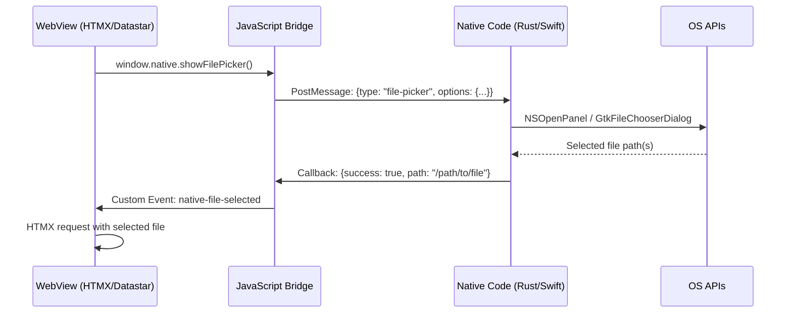

# UTM-dev Production - Native UI Components Exploration

## Overview

This document explores native UI components for a desktop VM management application (utm-dev) using WebView with HTMX/Datastar on macOS/Linux. Unlike mobile platforms, desktop applications have unique UI paradigms that leverage system conventions while maintaining a hybrid WebView architecture.

## Architecture

### Component Layers

```
┌─────────────────────────────────────────────────────────────────────────────┐
│                         Native UI Layer (macOS/Linux)                       │
│  ┌─────────────────────────────────────────────────────────────────────┐   │
│  │                      Menu Bar (macOS) / Global Menu (Linux)         │   │
│  │   [File] [Edit] [View] [Machine] [Window] [Help]                    │   │
│  └─────────────────────────────────────────────────────────────────────┘   │
│  ┌─────────────────────────────────────────────────────────────────────┐   │
│  │                      System Tray / Status Icon                      │   │
│  │   [VM Status] [Quick Actions] [Preferences] [Quit]                  │   │
│  └─────────────────────────────────────────────────────────────────────┘   │
│  ┌─────────────────────────────────────────────────────────────────────┐   │
│  │                      Native Dialogs & Overlays                      │
│  │   [File Picker] [Save Dialog] [Confirm] [Alert] [Progress]          │   │
│  └─────────────────────────────────────────────────────────────────────┘   │
│  ┌─────────────────────────────────────────────────────────────────────┐   │
│  │                      Notifications                                  │   │
│  │   [Build Complete] [VM Started] [Errors] [Warnings]                 │   │
│  └─────────────────────────────────────────────────────────────────────┘   │
└─────────────────────────────────────────────────────────────────────────────┘
                                    ▲
                                    │ Bridge Protocol (JSON-RPC/Custom Scheme)
                                    │
┌─────────────────────────────────────────────────────────────────────────────┐
│                         WebView Layer (HTMX/Datastar)                       │
│  - Web content rendering                                                    │
│  - HTMX for server-driven updates                                           │
│  - Datastar for reactive state management                                   │
│  - Bridge JavaScript for native communication                               │
└─────────────────────────────────────────────────────────────────────────────┘
```

### Bridge Communication Flow



## 1. Native Menus (macOS Menu Bar / Linux Global Menu)

### Application Menu Structure

#### macOS Menu Bar Architecture

```
┌────────────────────────────────────────────────────────────────────────────┐
│  [UTM-dev] [File] [Edit] [View] [Machine] [Window] [Help]                │
└────────────────────────────────────────────────────────────────────────────┘
```

#### Swift - macOS Menu Bar Setup

```swift
import Cocoa
import SwiftUI

class MenuBarManager {
    static let shared = MenuBarManager()

    private var appMenu: NSMenu?
    private var fileMenu: NSMenu?
    private var editMenu: NSMenu?
    private var viewMenu: NSMenu?
    private var machineMenu: NSMenu?
    private var windowMenu: NSMenu?
    private var helpMenu: NSMenu?

    func setupMenus() {
        setupAppMenu()
        setupFileMenu()
        setupEditMenu()
        setupViewMenu()
        setupMachineMenu()
        setupWindowMenu()
        setupHelpMenu()
    }

    private func setupAppMenu() {
        let appMenu = NSMenu()

        // About
        appMenu.addItem(withTitle: "About UTM-dev",
                        action: #selector(showAbout),
                        keyEquivalent: "")

        appMenu.addItem(NSMenuItem.separator())

        // Preferences
        appMenu.addItem(withTitle: "Settings...",
                        action: #selector(openPreferences),
                        keyEquivalent: ",")

        appMenu.addItem(NSMenuItem.separator())

        // Services
        appMenu.addItem(withTitle: "Services",
                        action: nil,
                        keyEquivalent: "")

        appMenu.addItem(NSMenuItem.separator())

        // Hide/Quit
        appMenu.addItem(withTitle: "Hide UTM-dev",
                        action: #selector(hideApp),
                        keyEquivalent: "h")
        appMenu.addItem(withTitle: "Hide Others",
                        action: #selector(hideOthers),
                        keyEquivalent: "h",
                        keyEquivalentModifierMask: [.command, .option])
        appMenu.addItem(withTitle: "Show All",
                        action: #selector(unhideAll),
                        keyEquivalent: "")

        appMenu.addItem(NSMenuItem.separator())
        appMenu.addItem(withTitle: "Quit UTM-dev",
                        action: #selector(quitApp),
                        keyEquivalent: "q")

        NSApp.mainMenu?.insertItem(appMenu, at: 0)
        self.appMenu = appMenu
    }

    private func setupFileMenu() {
        let fileMenu = NSMenu(title: "File")

        // New VM
        fileMenu.addItem(withTitle: "New Virtual Machine...",
                        action: #selector(newVM),
                        keyEquivalent: "n")

        // Open VM
        fileMenu.addItem(withTitle: "Open Virtual Machine...",
                        action: #selector(openVM),
                        keyEquivalent: "o")

        // Open Recent
        let recentItem = NSMenuItem(title: "Open Recent",
                                   action: nil,
                                   keyEquivalent: "")
        let recentMenu = NSMenu()
        recentItem.submenu = recentMenu
        populateRecentMachinesMenu(recentMenu)
        fileMenu.addItem(recentItem)

        fileMenu.addItem(NSMenuItem.separator())

        // Close
        fileMenu.addItem(withTitle: "Close Window",
                        action: #selector(closeWindow),
                        keyEquivalent: "w")

        NSApp.mainMenu?.addItem(fileMenu)
        self.fileMenu = fileMenu
    }

    private func setupEditMenu() {
        let editMenu = NSMenu(title: "Edit")

        // Standard editing items
        editMenu.addItem(withTitle: "Undo",
                        action: #selector(undo(_:)),
                        keyEquivalent: "z")
        editMenu.addItem(withTitle: "Redo",
                        action: #selector(redo(_:)),
                        keyEquivalent: "Z",
                        keyEquivalentModifierMask: [.command, .shift])

        editMenu.addItem(NSMenuItem.separator())

        editMenu.addItem(withTitle: "Cut",
                        action: #selector(cut(_:)),
                        keyEquivalent: "x")
        editMenu.addItem(withTitle: "Copy",
                        action: #selector(copy(_:)),
                        keyEquivalent: "c")
        editMenu.addItem(withTitle: "Paste",
                        action: #selector(paste(_:)),
                        keyEquivalent: "v")
        editMenu.addItem(withTitle: "Select All",
                        action: #selector(selectAll(_:)),
                        keyEquivalent: "a")

        NSApp.mainMenu?.addItem(editMenu)
        self.editMenu = editMenu
    }

    private func setupViewMenu() {
        let viewMenu = NSMenu(title: "View")

        // Sidebar toggle
        viewMenu.addItem(withTitle: "Show Sidebar",
                        action: #selector(toggleSidebar),
                        keyEquivalent: "s")

        // Fullscreen
        viewMenu.addItem(withTitle: "Enter Full Screen",
                        action: #selector(toggleFullscreen),
                        keyEquivalent: "f")

        viewMenu.addItem(NSMenuItem.separator())

        // Zoom level
        viewMenu.addItem(withTitle: "Actual Size",
                        action: #selector(actualSize),
                        keyEquivalent: "0")
        viewMenu.addItem(withTitle: "Zoom In",
                        action: #selector(zoomIn),
                        keyEquivalent: "+")
        viewMenu.addItem(withTitle: "Zoom Out",
                        action: #selector(zoomOut),
                        keyEquivalent: "-")

        NSApp.mainMenu?.addItem(viewMenu)
        self.viewMenu = viewMenu
    }

    private func setupMachineMenu() {
        let machineMenu = NSMenu(title: "Machine")

        // Start/Stop
        let startItem = NSMenuItem(title: "Start",
                                   action: #selector(startVM),
                                   keyEquivalent: "")
        startItem.tag = 1
        machineMenu.addItem(startItem)

        machineMenu.addItem(withTitle: "Stop",
                           action: #selector(stopVM),
                           keyEquivalent: "")
        machineMenu.addItem(withTitle: "Pause",
                           action: #selector(pauseVM),
                           keyEquivalent: "")
        machineMenu.addItem(withTitle: "Restart",
                           action: #selector(restartVM),
                           keyEquivalent: "")

        machineMenu.addItem(NSMenuItem.separator())

        // Settings
        machineMenu.addItem(withTitle: "Settings...",
                           action: #selector(vmSettings),
                           keyEquivalent: "")

        // Take Screenshot
        machineMenu.addItem(withTitle: "Take Screenshot",
                           action: #selector(takeScreenshot),
                           keyEquivalent: "3")

        NSApp.mainMenu?.addItem(machineMenu)
        self.machineMenu = machineMenu
    }

    private func setupWindowMenu() {
        let windowMenu = NSMenu(title: "Window")

        // Minimize
        windowMenu.addItem(withTitle: "Minimize",
                          action: #selector(minimizeWindow),
                          keyEquivalent: "m")

        // Zoom
        windowMenu.addItem(withTitle: "Zoom",
                          action: #selector(zoomWindow),
                          keyEquivalent: "")

        windowMenu.addItem(NSMenuItem.separator())

        // Cycle windows
        windowMenu.addItem(withTitle: "Select Next Window",
                          action: #selector(selectNextWindow),
                          keyEquivalent: "`")
        windowMenu.addItem(withTitle: "Select Previous Window",
                          action: #selector(selectPreviousWindow),
                          keyEquivalent: "`",
                          keyEquivalentModifierMask: [.command, .shift])

        windowMenu.addItem(NSMenuItem.separator())

        // Bring all to front
        windowMenu.addItem(withTitle: "Bring All to Front",
                          action: #selector(bringAllToFront),
                          keyEquivalent: "")

        NSApp.windowsMenu = windowMenu
        NSApp.mainMenu?.addItem(windowMenu)
        self.windowMenu = windowMenu
    }

    private func setupHelpMenu() {
        let helpMenu = NSMenu(title: "Help")

        helpMenu.addItem(withTitle: "UTM-dev Documentation",
                        action: #selector(openDocumentation),
                        keyEquivalent: "")

        helpMenu.addItem(withTitle: "Keyboard Shortcuts",
                        action: #selector(showKeyboardShortcuts),
                        keyEquivalent: "?")

        helpMenu.addItem(withTitle: "Report Issue...",
                        action: #selector(reportIssue),
                        keyEquivalent: "")

        helpMenu.addItem(NSMenuItem.separator())
        helpMenu.addItem(withTitle: "Check for Updates...",
                        action: #selector(checkForUpdates),
                        keyEquivalent: "")

        helpMenu.addItem(withTitle: "About UTM-dev",
                        action: #selector(showAbout),
                        keyEquivalent: "")

        NSApp.mainMenu?.addItem(helpMenu)
        self.helpMenu = helpMenu
    }

    // MARK: - Recent Machines Menu

    private func populateRecentMachinesMenu(_ menu: NSMenu) {
        let recentMachines = UserDefaults.standard.array(forKey: "recentMachines") as? [String] ?? []

        if recentMachines.isEmpty {
            menu.addItem(withTitle: "No Recent Machines",
                        action: nil,
                        keyEquivalent: "")
            return
        }

        for (index, machine) in recentMachines.prefix(10).enumerated() {
            let keyEquivalent = index < 9 ? "\(index + 1)" : ""
            menu.addItem(withTitle: machine,
                        action: #selector(openRecentMachine(_:)),
                        keyEquivalent: keyEquivalent)
        }

        menu.addItem(NSMenuItem.separator())
        menu.addItem(withTitle: "Clear Menu",
                    action: #selector(clearRecentMachines),
                    keyEquivalent: "")
    }

    // MARK: - Actions

    @objc private func showAbout() {
        NSApp.orderFrontStandardAboutPanel(nil)
    }

    @objc private func openPreferences() {
        NotificationCenter.default.post(name: .openPreferences, object: nil)
    }

    @objc private func newVM() {
        NotificationCenter.default.post(name: .newVMWizard, object: nil)
    }

    @objc private func openVM() {
        showNativeFilePicker(extensions: ["utm", "qcow2", "img"], onComplete: { path in
            if let path = path {
                NotificationCenter.default.post(name: .openVM, object: path)
            }
        })
    }

    @objc private func toggleSidebar() {
        NotificationCenter.default.post(name: .toggleSidebar, object: nil)
    }

    @objc private func startVM() {
        NotificationCenter.default.post(name: .startVM, object: nil)
    }

    @objc private func stopVM() {
        NotificationCenter.default.post(name: .stopVM, object: nil)
    }
}

// MARK: - Notification Names

extension Notification.Name {
    static let openPreferences = Notification.Name("openPreferences")
    static let newVMWizard = Notification.Name("newVMWizard")
    static let openVM = Notification.Name("openVM")
    static let toggleSidebar = Notification.Name("toggleSidebar")
    static let startVM = Notification.Name("startVM")
    static let stopVM = Notification.Name("stopVM")
}
```

#### Rust (Tauri) - Cross-Platform Menu

```rust
// src/menu.rs
use tauri::{
    AppHandle, CustomMenuItem, Manager, Menu, MenuItem, Submenu, WindowMenuEvent,
    MenuEvent, SystemTray, SystemTrayMenu, SystemTrayMenuItem,
};

pub fn create_app_menu() -> Menu {
    // File Menu
    let file_menu = Submenu::new(
        "File",
        Menu::new()
            .add_item(CustomMenuItem::new("new_vm", "New Virtual Machine...").accelerator("CmdOrCtrl+N"))
            .add_item(CustomMenuItem::new("open_vm", "Open Virtual Machine...").accelerator("CmdOrCtrl+O"))
            .add_native_item(MenuItem::Separator)
            .add_item(CustomMenuItem::new("open_recent", "Open Recent"))
            .add_native_item(MenuItem::Separator)
            .add_item(CustomMenuItem::new("close_window", "Close Window").accelerator("CmdOrCtrl+W")),
    );

    // Edit Menu
    let edit_menu = Submenu::new(
        "Edit",
        Menu::new()
            .add_item(CustomMenuItem::new("undo", "Undo").accelerator("CmdOrCtrl+Z"))
            .add_item(CustomMenuItem::new("redo", "Redo").accelerator("CmdOrCtrl+Shift+Z"))
            .add_native_item(MenuItem::Separator)
            .add_item(CustomMenuItem::new("cut", "Cut").accelerator("CmdOrCtrl+X"))
            .add_item(CustomMenuItem::new("copy", "Copy").accelerator("CmdOrCtrl+C"))
            .add_item(CustomMenuItem::new("paste", "Paste").accelerator("CmdOrCtrl+V"))
            .add_item(CustomMenuItem::new("select_all", "Select All").accelerator("CmdOrCtrl+A")),
    );

    // View Menu
    let view_menu = Submenu::new(
        "View",
        Menu::new()
            .add_item(CustomMenuItem::new("toggle_sidebar", "Show Sidebar").accelerator("CmdOrCtrl+S"))
            .add_item(CustomMenuItem::new("toggle_fullscreen", "Enter Full Screen").accelerator("F11"))
            .add_native_item(MenuItem::Separator)
            .add_item(CustomMenuItem::new("zoom_reset", "Actual Size").accelerator("CmdOrCtrl+0"))
            .add_item(CustomMenuItem::new("zoom_in", "Zoom In").accelerator("CmdOrCtrl+Plus"))
            .add_item(CustomMenuItem::new("zoom_out", "Zoom Out").accelerator("CmdOrCtrl+-")),
    );

    // Machine Menu
    let machine_menu = Submenu::new(
        "Machine",
        Menu::new()
            .add_item(CustomMenuItem::new("vm_start", "Start").accelerator("CmdOrCtrl+Return"))
            .add_item(CustomMenuItem::new("vm_stop", "Stop").accelerator("CmdOrCtrl+Shift+Return"))
            .add_item(CustomMenuItem::new("vm_pause", "Pause").accelerator("CmdOrCtrl+P"))
            .add_item(CustomMenuItem::new("vm_restart", "Restart").accelerator("CmdOrCtrl+R"))
            .add_native_item(MenuItem::Separator)
            .add_item(CustomMenuItem::new("vm_settings", "Settings...").accelerator("CmdOrCtrl+I"))
            .add_item(CustomMenuItem::new("vm_screenshot", "Take Screenshot").accelerator("CmdOrCtrl+3")),
    );

    // Window Menu
    let window_menu = Submenu::new(
        "Window",
        Menu::new()
            .add_item(CustomMenuItem::new("minimize", "Minimize").accelerator("CmdOrCtrl+M"))
            .add_native_item(MenuItem::Separator)
            .add_item(CustomMenuItem::new("select_next", "Select Next Window").accelerator("CmdOrCtrl+`"))
            .add_native_item(MenuItem::Separator)
            .add_item(CustomMenuItem::new("bring_all_front", "Bring All to Front")),
    );

    // Help Menu
    let help_menu = Submenu::new(
        "Help",
        Menu::new()
            .add_item(CustomMenuItem::new("documentation", "UTM-dev Documentation"))
            .add_item(CustomMenuItem::new("keyboard_shortcuts", "Keyboard Shortcuts").accelerator("F1"))
            .add_item(CustomMenuItem::new("report_issue", "Report Issue..."))
            .add_native_item(MenuItem::Separator)
            .add_item(CustomMenuItem::new("check_updates", "Check for Updates..."))
            .add_item(CustomMenuItem::new("about", "About UTM-dev")),
    );

    Menu::new()
        .add_submenu(file_menu)
        .add_submenu(edit_menu)
        .add_submenu(view_menu)
        .add_submenu(machine_menu)
        .add_submenu(window_menu)
        .add_submenu(help_menu)
}

pub fn setup_menu_handlers(app: &AppHandle) {
    let window = app.get_window("main").unwrap();

    // Listen for menu events
    app.on_menu_event(move |event| {
        match event.menu_item_id() {
            "new_vm" => {
                window.emit("menu-new-vm", ()).unwrap();
            }
            "open_vm" => {
                window.emit("menu-open-vm", ()).unwrap();
            }
            "vm_start" => {
                window.emit("menu-vm-start", ()).unwrap();
            }
            "vm_stop" => {
                window.emit("menu-vm-stop", ()).unwrap();
            }
            "toggle_sidebar" => {
                window.emit("menu-toggle-sidebar", ()).unwrap();
            }
            "toggle_fullscreen" => {
                window.emit("menu-toggle-fullscreen", ()).unwrap();
            }
            _ => {}
        }
    });
}
```

#### JavaScript Bridge for Menu State Sync

```javascript
// src/bridge/menu-bridge.js

/**
 * MenuBridge - Synchronizes menu state between native and web
 */
class MenuBridge {
    constructor() {
        this.menuState = {
            canUndo: false,
            canRedo: false,
            vmRunning: false,
            vmPaused: false,
            sidebarVisible: true,
            recentMachines: []
        };
        this.listeners = new Map();
        this.init();
    }

    init() {
        // Listen for native menu events via Tauri
        if (window.__TAURI__) {
            const { listen } = window.__TAURI__.event;

            listen('menu-new-vm', () => this.emit('new-vm'));
            listen('menu-open-vm', () => this.emit('open-vm'));
            listen('menu-vm-start', () => this.emit('vm-start'));
            listen('menu-vm-stop', () => this.emit('vm-stop'));
            listen('menu-toggle-sidebar', () => this.emit('toggle-sidebar'));
            listen('menu-toggle-fullscreen', () => this.emit('toggle-fullscreen'));

            // Update menu items enabled state
            listen('update-menu-state', (event) => {
                this.updateMenuState(event.payload);
            });
        }

        // Listen for HTMX events that affect menu state
        document.addEventListener('htmx:afterRequest', (e) => {
            this.syncMenuStateFromResponse(e.detail.xhr);
        });
    }

    updateMenuState(newState) {
        this.menuState = { ...this.menuState, ...newState };

        // Notify native of state change for menu item enabling
        if (window.__TAURI__) {
            window.__TAURI__.invoke('update_menu_items', {
                state: this.menuState
            });
        }
    }

    setRecentMachines(machines) {
        this.menuState.recentMachines = machines;

        if (window.__TAURI__) {
            window.__TAURI__.invoke('update_recent_machines', {
                machines: machines
            });
        }
    }

    // Send menu action to web layer
    emit(action, data = {}) {
        // Dispatch custom event for HTMX/Datastar to handle
        const event = new CustomEvent(`menu:${action}`, {
            detail: { action, data, timestamp: Date.now() }
        });
        document.dispatchEvent(event);

        // Also trigger HTMX request if needed
        this.triggerHtmxRequest(action, data);
    }

    triggerHtmxRequest(action, data) {
        // Use HTMX to send menu action to backend
        const body = document.createElement('form');
        body.style.display = 'none';
        body.innerHTML = `
            <input type="hidden" name="menu_action" value="${action}">
            <input type="hidden" name="menu_data" value='${JSON.stringify(data)}'>
        `;
        document.body.appendChild(body);

        // Trigger HTMX request
        body.setAttribute('hx-post', '/api/menu-action');
        body.setAttribute('hx-trigger', 'submit');
        body.setAttribute('hx-swap', 'none');
        body.submit();

        document.body.removeChild(body);
    }

    syncMenuStateFromResponse(xhr) {
        const menuStateHeader = xhr.getResponseHeader('X-Menu-State');
        if (menuStateHeader) {
            try {
                const state = JSON.parse(menuStateHeader);
                this.updateMenuState(state);
            } catch (e) {
                console.error('Failed to parse menu state header:', e);
            }
        }
    }
}

// Initialize bridge
window.menuBridge = new MenuBridge();
```

### Context Menus

#### macOS - NSMenu Context Menu

```swift
// src/native/context_menu.rs (via Tauri Swift plugin)

import Cocoa

class ContextMenuManager {
    static let shared = ContextMenuManager()

    func showVMListContextMenu(vm: VMInfo, at point: NSPoint, in view: NSView) {
        let menu = NSMenu()

        // Status-based items
        if vm.isRunning {
            menu.addItem(withTitle: "Pause",
                        action: #selector(pauseVM),
                        keyEquivalent: "")
            menu.addItem(withTitle: "Stop",
                        action: #selector(stopVM),
                        keyEquivalent: "")
        } else {
            menu.addItem(withTitle: "Start",
                        action: #selector(startVM),
                        keyEquivalent: "")
        }

        menu.addItem(NSMenuItem.separator())

        menu.addItem(withTitle: "Settings...",
                    action: #selector(openSettings),
                    keyEquivalent: "")
        menu.addItem(withTitle: "Duplicate...",
                    action: #selector(duplicateVM),
                    keyEquivalent: "")
    }

    func showSidebarContextMenu(for item: SidebarItem, at point: NSPoint) {
        let menu = NSMenu()

        switch item {
        case .vmGroup(let group):
            menu.addItem(withTitle: "New Group",
                        action: #selector(newGroup),
                        keyEquivalent: "")
            menu.addItem(withTitle: "Rename Group",
                        action: #selector(renameGroup),
                        keyEquivalent: "")
            menu.addItem(NSMenuItem.separator())
            menu.addItem(withTitle: "Delete Group",
                        action: #selector(deleteGroup),
                        keyEquivalent: "")

        case .vm(let vm):
            showVMListContextMenu(vm: vm, at: point, in: sidebarView)
        }

        menu.popUp(positioning: nil, at: point, in: view)
    }
}
```

#### Tauri Rust Context Menu

```rust
// src/commands/context_menu.rs
use tauri::{AppHandle, Manager, Window};
use serde::{Deserialize, Serialize};

#[derive(Debug, Clone, Serialize, Deserialize)]
pub struct ContextMenuItem {
    pub id: String,
    pub label: String,
    pub icon: Option<String>,
    pub enabled: bool,
    pub submenu: Option<Vec<ContextMenuItem>>,
}

#[derive(Debug, Clone, Serialize, Deserialize)]
pub struct ContextMenuRequest {
    pub context: String,  // "vm_list", "sidebar", "file_browser"
    pub item_id: Option<String>,
    pub position: Option<(i32, i32)>,
}

#[tauri::command]
pub async fn show_context_menu(
    window: Window,
    request: ContextMenuRequest,
) -> Result<ContextMenuResponse, String> {
    let items = build_context_menu_items(&request.context, &request.item_id);

    // Show context menu and wait for selection
    let selected = show_native_context_menu(window.clone(), items).await?;

    Ok(ContextMenuResponse {
        selected_item: selected,
    })
}

async fn show_native_context_menu(
    window: Window,
    items: Vec<ContextMenuItem>,
) -> Result<Option<String>, String> {
    // Use Tauri's dialog or custom webview implementation
    // This is a placeholder - actual implementation depends on platform

    #[cfg(target_os = "macos")]
    {
        use cocoa::appkit::{NSMenu, NSMenuItem, NSPoint};
        // Native macOS context menu implementation
    }

    #[cfg(target_os = "linux")]
    {
        // Use GTK menu or custom rendering
    }

    // For now, emit event to webview to show custom context menu
    window.emit("show-context-menu", items)?;

    // Wait for selection via channel
    let (tx, rx) = tokio::sync::oneshot::channel();

    // Listen for selection
    let window_clone = window.clone();
    window_clone.on_menu_event(move |event| {
        let _ = tx.send(event.menu_item_id().to_string());
    });

    match rx.await {
        Ok(id) => Ok(Some(id)),
        Err(_) => Ok(None),
    }
}

fn build_context_menu_items(context: &str, item_id: &Option<String>) -> Vec<ContextMenuItem> {
    match context {
        "vm_list" => vec![
            ContextMenuItem {
                id: "vm_start".to_string(),
                label: "Start".to_string(),
                icon: Some("play".to_string()),
                enabled: true,
                submenu: None,
            },
            ContextMenuItem {
                id: "vm_stop".to_string(),
                label: "Stop".to_string(),
                icon: Some("stop".to_string()),
                enabled: true,
                submenu: None,
            },
            ContextMenuItem {
                id: "vm_pause".to_string(),
                label: "Pause".to_string(),
                icon: Some("pause".to_string()),
                enabled: true,
                submenu: None,
            },
            ContextMenuItem {
                id: "separator".to_string(),
                label: "".to_string(),
                icon: None,
                enabled: true,
                submenu: None,
            },
            ContextMenuItem {
                id: "vm_settings".to_string(),
                label: "Settings...".to_string(),
                icon: Some("gear".to_string()),
                enabled: true,
                submenu: None,
            },
        ],
        "sidebar" => vec![
            ContextMenuItem {
                id: "new_group".to_string(),
                label: "New Group".to_string(),
                icon: Some("folder-plus".to_string()),
                enabled: true,
                submenu: None,
            },
            ContextMenuItem {
                id: "rename".to_string(),
                label: "Rename".to_string(),
                icon: None,
                enabled: true,
                submenu: None,
            },
            ContextMenuItem {
                id: "delete".to_string(),
                label: "Delete".to_string(),
                icon: None,
                enabled: true,
                submenu: None,
            },
        ],
        _ => vec![],
    }
}
```

#### JavaScript Context Menu Handler

```javascript
// src/bridge/context-menu.js

class ContextMenuBridge {
    constructor() {
        this.pendingResolve = null;
        this.init();
    }

    init() {
        if (window.__TAURI__) {
            const { listen } = window.__TAURI__.event;

            // Listen for context menu show event from native
            listen('show-context-menu', async (event) => {
                const items = event.payload;
                const selected = await this.showCustomContextMenu(items);
                // Send selection back to native
                window.__TAURI__.invoke('context_menu_selected', { id: selected });
            });
        }

        // Handle right-click on VM list items
        document.addEventListener('contextmenu', (e) => {
            const vmItem = e.target.closest('[data-vm-id]');
            if (vmItem) {
                e.preventDefault();
                this.showContextMenuForVM(vmItem.dataset.vmId, e.clientX, e.clientY);
            }
        });
    }

    async showContextMenuForVM(vmId, x, y) {
        const response = await window.__TAURI__.invoke('show_context_menu', {
            request: {
                context: 'vm_list',
                item_id: vmId,
                position: [x, y]
            }
        });

        if (response.selected_item) {
            this.handleContextMenuAction(response.selected_item, vmId);
        }
    }

    async showCustomContextMenu(items) {
        return new Promise((resolve) => {
            this.pendingResolve = resolve;

            // Create custom context menu element
            const menu = document.createElement('div');
            menu.className = 'context-menu';
            menu.innerHTML = this.renderMenuItems(items);

            // Position menu
            menu.style.position = 'fixed';
            menu.style.zIndex = '9999';

            document.body.appendChild(menu);

            // Position and show
            const rect = menu.getBoundingClientRect();
            menu.style.left = `${Math.min(event.clientX, window.innerWidth - rect.width)}px`;
            menu.style.top = `${Math.min(event.clientY, window.innerHeight - rect.height)}px`;

            // Handle click outside
            const hideMenu = () => {
                menu.remove();
                document.removeEventListener('click', hideMenu);
                if (this.pendingResolve) {
                    this.pendingResolve(null);
                    this.pendingResolve = null;
                }
            };

            setTimeout(() => {
                document.addEventListener('click', hideMenu);
            }, 100);
        });
    }

    renderMenuItems(items) {
        return items.map(item => {
            if (item.label === '') {
                return '<div class="context-menu-separator"></div>';
            }

            const disabled = !item.enabled ? 'disabled' : '';
            const icon = item.icon ? `<span class="context-menu-icon ${item.icon}"></span>` : '';

            return `
                <div class="context-menu-item ${disabled}" data-item-id="${item.id}">
                    ${icon}
                    <span class="context-menu-label">${item.label}</span>
                </div>
            `;
        }).join('');
    }

    handleContextMenuAction(action, vmId) {
        // Dispatch event for HTMX to handle
        document.dispatchEvent(new CustomEvent('vm-context-action', {
            detail: { action, vmId }
        }));

        // Or trigger HTMX directly
        htmx.ajax('POST', `/api/vm/${vmId}/action`, {
            values: { action }
        });
    }
}

window.contextMenuBridge = new ContextMenuBridge();
```

## 2. System Tray Integration

### macOS Menu Bar Extras

```swift
// src/native/tray_manager.swift

import Cocoa

class TrayManager: NSObject {
    static let shared = TrayManager()

    private var statusItem: NSStatusItem?
    private var trayWindow: NSWindow?
    private var vmStatusObserver: NSKeyValueObservation?

    override init() {
        super.init()
        setupStatusItem()
        setupObservers()
    }

    private func setupStatusItem() {
        statusItem = NSStatusBar.system.statusItem(withLength: NSStatusItem.variableLength)

        if let button = statusItem?.button {
            button.image = NSImage(systemSymbolName: "cpu", accessibilityDescription: "UTM-dev")
            button.action = #selector(toggleTrayPopover)
            button.target = self
            button.sendAction(on: [.leftMouseUp, .rightMouseUp])
        }

        setupTrayMenu()
    }

    private func setupTrayMenu() {
        let menu = NSMenu()

        // Current VM status
        let statusItem = NSMenuItem(title: "No VM Running", action: nil, keyEquivalent: "")
        statusItem.isEnabled = false
        menu.addItem(statusItem)

        menu.addItem(NSMenuItem.separator())

        // Quick actions
        menu.addItem(withTitle: "Start Last VM",
                    action: #selector(startLastVM),
                    keyEquivalent: "")

        menu.addItem(withTitle: "Pause All",
                    action: #selector(pauseAllVMs),
                    keyEquivalent: "")

        menu.addItem(NSMenuItem.separator())

        // Settings
        menu.addItem(withTitle: "Settings...",
                    action: #selector(openPreferences),
                    keyEquivalent: "")

        menu.addItem(NSMenuItem.separator())

        // Quit
        menu.addItem(withTitle: "Quit UTM-dev",
                    action: #selector(quitApp),
                    keyEquivalent: "q")

        statusItem?.menu = menu
    }

    private func setupObservers() {
        vmStatusObserver = VMManager.shared.$status.observe(\.self) { [weak self] status in
            self?.updateStatusDisplay(status: status)
        }
    }

    private func updateStatusDisplay(status: VMStatus) {
        guard let button = statusItem?.button else { return }

        switch status {
        case .running(let count):
            button.image = NSImage(systemSymbolName: "cpu.fill", accessibilityDescription: "Running")
            button.toolTip = "\(count) VM(s) running"
            updateMenuStatus("Running: \(count)")

        case .paused(let count):
            button.image = NSImage(systemSymbolName: "pause.fill", accessibilityDescription: "Paused")
            button.toolTip = "\(count) VM(s) paused"
            updateMenuStatus("Paused: \(count)")

        case .stopped:
            button.image = NSImage(systemSymbolName: "cpu", accessibilityDescription: "Stopped")
            button.toolTip = "No VMs running"
            updateMenuStatus("No VM Running")
        }
    }

    private func updateMenuStatus(_ status: String) {
        if let menu = statusItem?.menu,
           let firstItem = menu.items.first {
            firstItem.title = status
        }
    }

    @objc private func toggleTrayPopover() {
        // Show popover or menu
    }

    @objc private func startLastVM() {
        NotificationCenter.default.post(name: .startLastVM, object: nil)
    }

    @objc private func pauseAllVMs() {
        NotificationCenter.default.post(name: .pauseAllVMs, object: nil)
    }

    @objc private func openPreferences() {
        NSApp.activate(ignoringOtherApps: true)
        NotificationCenter.default.post(name: .openPreferences, object: nil)
    }

    @objc private func quitApp() {
        NSApp.terminate(nil)
    }
}
```

### Linux System Tray (AppIndicator)

```rust
// src/tray/linux_tray.rs
use tauri::{
    CustomMenuItem, Manager, SystemTray, SystemTrayEvent, SystemTrayMenu,
    SystemTrayMenuItem, SystemTraySubmenu,
};
use std::sync::atomic::{AtomicU32, Ordering};

static RUNNING_COUNT: AtomicU32 = AtomicU32::new(0);
static PAUSED_COUNT: AtomicU32 = AtomicU32::new(0);

pub fn create_system_tray() -> SystemTray {
    let tray_menu = SystemTrayMenu::new()
        .add_item(CustomMenuItem::new("status", "No VM Running").disabled())
        .add_native_item(SystemTrayMenuItem::Separator)
        .add_item(CustomMenuItem::new("start_last", "Start Last VM"))
        .add_item(CustomMenuItem::new("pause_all", "Pause All"))
        .add_native_item(SystemTrayMenuItem::Separator)
        .add_submenu(SystemTraySubmenu::new(
            "Virtual Machines",
            build_vm_submenu(),
        ))
        .add_native_item(SystemTrayMenuItem::Separator)
        .add_item(CustomMenuItem::new("settings", "Settings..."))
        .add_item(CustomMenuItem::new("quit", "Quit UTM-dev"));

    SystemTray::new().with_menu(tray_menu)
}

fn build_vm_submenu() -> SystemTrayMenu {
    // Build submenu with current VMs
    let vms = get_vm_list();

    let mut menu = SystemTrayMenu::new();
    for vm in vms {
        let status_icon = match vm.status.as_str() {
            "running" => "● ",
            "paused" => "⏸ ",
            _ => "○ ",
        };

        menu = menu.add_item(CustomMenuItem::new(
            format!("vm_{}", vm.id),
            format!("{}{}", status_icon, vm.name),
        ));
    }

    menu
}

pub fn setup_tray_handlers(app: &AppHandle) {
    let handle = app.handle();

    app.on_system_tray_event(move |app, event| {
        match event {
            SystemTrayEvent::MenuItemClick { id, .. } => {
                handle_tray_menu_click(app, &id);
            }
            SystemTrayEvent::LeftClick { .. } => {
                // Show main window
                if let Some(window) = app.get_window("main") {
                    window.show().unwrap();
                    window.set_focus().unwrap();
                }
            }
            SystemTrayEvent::RightClick { position, .. } => {
                // Could show custom menu at position
            }
            _ => {}
        }
    });
}

fn handle_tray_menu_click(app: &AppHandle, id: &str) {
    let window = app.get_window("main").unwrap();

    match id {
        "start_last" => {
            window.emit("tray-start-last-vm", ()).unwrap();
        }
        "pause_all" => {
            window.emit("tray-pause-all-vm", ()).unwrap();
        }
        "settings" => {
            window.emit("tray-open-settings", ()).unwrap();
        }
        "quit" => {
            std::process::exit(0);
        }
        id if id.starts_with("vm_") => {
            let vm_id = id.strip_prefix("vm_").unwrap();
            window.emit("tray-vm-selected", vm_id).unwrap();
        }
        _ => {}
    }
}

pub fn update_tray_status(running: u32, paused: u32) {
    RUNNING_COUNT.store(running, Ordering::SeqCst);
    PAUSED_COUNT.store(paused, Ordering::SeqCst);

    // Update tray icon based on status
    let icon_name = if running > 0 {
        "tray-running"
    } else if paused > 0 {
        "tray-paused"
    } else {
        "tray-stopped"
    };

    // Update tray menu status text
    let status_text = if running > 0 {
        format!("Running: {}", running)
    } else if paused > 0 {
        format!("Paused: {}", paused)
    } else {
        "No VM Running".to_string()
    };

    // This would use tauri::Manager::tray() to update
    // Implementation depends on Tauri version
}
```

### JavaScript Tray Bridge

```javascript
// src/bridge/tray-bridge.js

class TrayBridge {
    constructor() {
        this.status = {
            running: 0,
            paused: 0,
            vms: []
        };
        this.init();
    }

    init() {
        if (window.__TAURI__) {
            const { listen } = window.__TAURI__.event;

            // Listen for tray-initiated actions
            listen('tray-start-last-vm', () => {
                this.handleTrayAction('start-last-vm');
            });

            listen('tray-pause-all-vm', () => {
                this.handleTrayAction('pause-all');
            });

            listen('tray-vm-selected', (event) => {
                this.handleTrayAction('vm-selected', { vmId: event.payload });
            });

            listen('tray-open-settings', () => {
                this.handleTrayAction('open-settings');
            });

            // Receive VM status updates
            listen('vm-status-update', (event) => {
                this.updateStatus(event.payload);
            });
        }
    }

    updateStatus(status) {
        this.status = { ...this.status, ...status };

        // Update UI based on status
        this.updateStatusIndicators();
    }

    updateStatusIndicators() {
        // Update status bar in webview
        const statusEl = document.querySelector('[data-status-bar]');
        if (statusEl) {
            statusEl.innerHTML = `
                <span class="status-item ${this.status.running > 0 ? 'running' : ''}">
                    <svg class="icon"><use href="#icon-cpu"></use></svg>
                    ${this.status.running} Running
                </span>
                <span class="status-item ${this.status.paused > 0 ? 'paused' : ''}">
                    <svg class="icon"><use href="#icon-pause"></use></svg>
                    ${this.status.paused} Paused
                </span>
            `;
        }

        // Update document title for quick access
        document.title = this.status.running > 0
            ? `[${this.status.running}] UTM-dev`
            : 'UTM-dev';
    }

    handleTrayAction(action, data = {}) {
        // Dispatch event for HTMX/Datastar
        document.dispatchEvent(new CustomEvent('tray-action', {
            detail: { action, data }
        }));

        // Trigger HTMX request
        htmx.ajax('POST', '/api/tray-action', {
            values: {
                action,
                data: JSON.stringify(data)
            },
            headers: {
                'X-Tray-Action': action
            }
        });
    }
}

window.trayBridge = new TrayBridge();
```

## 3. Native Notifications

### macOS Notification Center

```swift
// src/native/notifications.swift

import UserNotifications

class NotificationManager: NSObject {
    static let shared = NotificationManager()

    private var notificationCenter: UNUserNotificationCenter {
        return UNUserNotificationCenter.current()
    }

    func requestAuthorization() {
        notificationCenter.requestAuthorization(options: [.alert, .sound, .badge]) { granted, error in
            if granted {
                print("Notification permission granted")
            } else if let error = error {
                print("Notification permission error: \(error)")
            }
        }
    }

    func sendBuildCompleteNotification(vmName: String, buildTime: TimeInterval) {
        let content = UNMutableNotificationContent()
        content.title = "Build Complete"
        content.subtitle = vmName
        content.body = String(format: "Build completed in %.1f seconds", buildTime)
        content.sound = .default
        content.categoryIdentifier = "build-complete"

        // Add action buttons
        content.addAction(
            identifier: "show-vm",
            title: "Show VM",
            options: .foreground
        )
        content.addAction(
            identifier: "dismiss",
            title: "Dismiss",
            options: []
        )

        sendNotification(identifier: UUID().uuidString, content: content)
    }

    func sendVMStartedNotification(vmName: String) {
        let content = UNMutableNotificationContent()
        content.title = "VM Started"
        content.body = "\(vmName) is now running"
        content.sound = .default
        content.categoryIdentifier = "vm-started"

        content.addAction(
            identifier: "open-vm",
            title: "Open",
            options: .foreground
        )
        content.addAction(
            identifier: "pause-vm",
            title: "Pause",
            options: []
        )

        sendNotification(identifier: UUID().uuidString, content: content)
    }

    func sendErrorNotification(title: String, message: String, errorCode: String? = nil) {
        let content = UNMutableNotificationContent()
        content.title = title
        content.body = message
        content.sound = .default
        content.interruptionLevel = .active

        content.categoryIdentifier = "error"

        content.addAction(
            identifier: "show-details",
            title: "Show Details",
            options: .foreground
        )

        if let errorCode = errorCode {
            content.userInfo = ["errorCode": errorCode]
        }

        sendNotification(identifier: UUID().uuidString, content: content)
    }

    func sendWarningNotification(title: String, message: String) {
        let content = UNMutableNotificationContent()
        content.title = title
        content.body = message
        content.sound = .default
        content.interruptionLevel = .active

        content.categoryIdentifier = "warning"

        sendNotification(identifier: UUID().uuidString, content: content)
    }

    private func sendNotification(identifier: String, content: UNNotificationContent) {
        let request = UNNotificationRequest(
            identifier: identifier,
            content: content,
            trigger: nil // Immediate
        )

        notificationCenter.add(request) { error in
            if let error = error {
                print("Failed to send notification: \(error)")
            }
        }
    }

    func setupNotificationHandlers() {
        notificationCenter.delegate = self
    }
}

extension NotificationManager: UNUserNotificationCenterDelegate {
    func userNotificationCenter(
        _ center: UNUserNotificationCenter,
        didReceive response: UNNotificationResponse,
        withCompletionHandler completionHandler: @escaping () -> Void
    ) {
        switch response.actionIdentifier {
        case "show-vm":
            NotificationCenter.default.post(name: .showVMFromNotification, object: nil)
        case "open-vm":
            NotificationCenter.default.post(name: .openVMFromNotification, object: nil)
        case "pause-vm":
            NotificationCenter.default.post(name: .pauseVMFromNotification, object: nil)
        case "show-details":
            let errorCode = response.notification.request.content.userInfo["errorCode"] as? String
            NotificationCenter.default.post(name: .showErrorDetails, object: errorCode)
        default:
            break
        }

        completionHandler()
    }
}

extension UNMutableNotificationContent {
    func addAction(identifier: String, title: String, options: UNNotificationActionOptions) {
        let action = UNNotificationAction(
            identifier: identifier,
            title: title,
            options: options
        )

        let category = UNNotificationCategory(
            identifier: self.categoryIdentifier,
            actions: [action],
            intentIdentifiers: [],
            options: []
        )

        UNUserNotificationCenter.current().setNotificationCategories([category])
    }
}
```

### Linux Desktop Notifications

```rust
// src/notifications/linux_notifications.rs
use notify_rust::{Notification, NotificationHandle, Action};
use std::error::Error;

pub struct LinuxNotificationManager;

impl LinuxNotificationManager {
    pub fn send_build_complete(vm_name: &str, build_time: f64) -> Result<NotificationHandle, Box<dyn Error>> {
        let notification = Notification::new()
            .summary("Build Complete")
            .body(&format!("{} - Build completed in {:.1} seconds", vm_name, build_time))
            .icon("dialog-information")
            .action(Action::new("show", "Show VM"))
            .action(Action::new("dismiss", "Dismiss"))
            .urgency(notify_rust::Urgency::Normal)
            .show()?;

        Ok(notification)
    }

    pub fn send_vm_started(vm_name: &str) -> Result<NotificationHandle, Box<dyn Error>> {
        let notification = Notification::new()
            .summary("VM Started")
            .body(&format!("{} is now running", vm_name))
            .icon("system-run")
            .action(Action::new("open", "Open"))
            .action(Action::new("pause", "Pause"))
            .urgency(notify_rust::Urgency::Normal)
            .show()?;

        Ok(notification)
    }

    pub fn send_error(title: &str, message: &str) -> Result<NotificationHandle, Box<dyn Error>> {
        let notification = Notification::new()
            .summary(title)
            .body(message)
            .icon("dialog-error")
            .action(Action::new("details", "Show Details"))
            .urgency(notify_rust::Urgency::Critical)
            .show()?;

        Ok(notification)
    }

    pub fn send_warning(title: &str, message: &str) -> Result<NotificationHandle, Box<dyn Error>> {
        let notification = Notification::new()
            .summary(title)
            .body(message)
            .icon("dialog-warning")
            .urgency(notify_rust::Urgency::Normal)
            .show()?;

        Ok(notification)
    }
}

// Handle notification actions via callback
pub fn setup_notification_handler<F>(callback: F)
where
    F: Fn(&str) + Send + 'static,
{
    notify_rust::add_action_handler(move |action| {
        callback(action);
    });
}
```

### JavaScript Notification Bridge

```javascript
// src/bridge/notification-bridge.js

class NotificationBridge {
    constructor() {
        this.pendingNotifications = new Map();
        this.init();
    }

    init() {
        // Request notification permission if on web
        if ('Notification' in window && Notification.permission === 'default') {
            Notification.requestPermission();
        }

        if (window.__TAURI__) {
            const { listen } = window.__TAURI__.event;

            // Listen for notification action callbacks from native
            listen('notification-action', (event) => {
                const { action, notificationId } = event.payload;
                this.handleNotificationAction(notificationId, action);
            });
        }
    }

    async show(options) {
        const notificationId = this.generateId();

        if (window.__TAURI__) {
            // Use native notifications
            await window.__TAURI__.invoke('send_notification', {
                options: {
                    ...options,
                    id: notificationId
                }
            });
        } else if ('Notification' in window) {
            // Use web notifications as fallback
            const notif = new Notification(options.title, {
                body: options.body,
                icon: options.icon,
                tag: notificationId,
                requireInteraction: options.requireInteraction || false
            });

            notif.onclick = () => this.handleNotificationAction(notificationId, 'click');
        }

        this.pendingNotifications.set(notificationId, {
            options,
            createdAt: Date.now()
        });

        return notificationId;
    }

    showBuildComplete(vmName, buildTime) {
        return this.show({
            title: 'Build Complete',
            body: `${vmName} - Build completed in ${buildTime.toFixed(1)}s`,
            icon: 'build-success',
            actions: [
                { id: 'show-vm', label: 'Show VM' },
                { id: 'dismiss', label: 'Dismiss' }
            ],
            requireInteraction: false
        });
    }

    showVMStarted(vmName) {
        return this.show({
            title: 'VM Started',
            body: `${vmName} is now running`,
            icon: 'vm-running',
            actions: [
                { id: 'open', label: 'Open' },
                { id: 'pause', label: 'Pause' }
            ],
            requireInteraction: false
        });
    }

    showError(title, message, errorCode = null) {
        return this.show({
            title,
            body: message,
            icon: 'error',
            actions: [
                { id: 'details', label: 'Show Details' }
            ],
            requireInteraction: true,
            urgency: 'critical',
            errorCode
        });
    }

    showWarning(title, message) {
        return this.show({
            title,
            body: message,
            icon: 'warning',
            requireInteraction: false
        });
    }

    handleNotificationAction(notificationId, action) {
        const notif = this.pendingNotifications.get(notificationId);
        if (!notif) return;

        // Dispatch event for web layer to handle
        document.dispatchEvent(new CustomEvent('notification-action', {
            detail: {
                notificationId,
                action,
                originalOptions: notif.options
            }
        }));

        // Handle standard actions
        switch (action) {
            case 'show-vm':
                htmx.ajax('GET', '/api/vm/show', { values: { name: notif.options.vmName } });
                break;
            case 'open':
                window.location.href = `/vm/${notif.options.vmId}`;
                break;
            case 'pause':
                htmx.ajax('POST', '/api/vm/pause', { values: { id: notif.options.vmId } });
                break;
            case 'details':
                window.location.href = `/error/${notif.options.errorCode}`;
                break;
        }

        // Clean up
        this.pendingNotifications.delete(notificationId);
    }

    generateId() {
        return `notif_${Date.now()}_${Math.random().toString(36).substr(2, 9)}`;
    }
}

window.notificationBridge = new NotificationBridge();
```

## 4. Native Dialogs

### File Picker Dialogs

#### Tauri Cross-Platform File Picker

```rust
// src/commands/file_picker.rs
use tauri::{api::dialog::FileDialogBuilder, Window};
use serde::{Deserialize, Serialize};

#[derive(Debug, Clone, Serialize, Deserialize)]
pub struct FilePickerOptions {
    pub title: Option<String>,
    pub default_path: Option<String>,
    pub filters: Vec<FileFilter>,
    pub multiple: bool,
    pub select_directories: bool,
}

#[derive(Debug, Clone, Serialize, Deserialize)]
pub struct FileFilter {
    pub name: String,
    pub extensions: Vec<String>,
}

#[derive(Debug, Clone, Serialize, Deserialize)]
pub struct FilePickerResponse {
    pub paths: Option<Vec<String>>,
    pub cancelled: bool,
}

#[tauri::command]
pub async fn show_open_file_picker(
    window: Window,
    options: FilePickerOptions,
) -> Result<FilePickerResponse, String> {
    let (tx, rx) = tokio::sync::oneshot::channel();

    let mut builder = FileDialogBuilder::new();

    if let Some(title) = &options.title {
        builder = builder.title(title);
    }

    if let Some(default_path) = &options.default_path {
        builder = builder.set_starting_dir(default_path);
    }

    // Add filters
    for filter in &options.filters {
        builder = builder.add_filter(&filter.name, &filter.extensions);
    }

    // Handle multiple selection
    if options.multiple {
        builder.pick_files(move |paths| {
            let _ = tx.send(FilePickerResponse {
                paths: paths.map(|p| p.iter().map(|pb| pb.to_string_lossy().to_string()).collect()),
                cancelled: paths.is_none(),
            });
        });
    } else if options.select_directories {
        builder.pick_folder(move |path| {
            let _ = tx.send(FilePickerResponse {
                paths: path.map(|p| vec![p.to_string_lossy().to_string()]),
                cancelled: path.is_none(),
            });
        });
    } else {
        builder.pick_file(move |path| {
            let _ = tx.send(FilePickerResponse {
                paths: path.map(|p| vec![p.to_string_lossy().to_string()]),
                cancelled: path.is_none(),
            });
        });
    }

    rx.await.map_err(|e| e.to_string())
}

// Pre-configured pickers for common UTM-dev scenarios
#[tauri::command]
pub async fn pick_vm_image(window: Window) -> Result<FilePickerResponse, String> {
    show_open_file_picker(
        window,
        FilePickerOptions {
            title: Some("Select VM Disk Image".to_string()),
            default_path: None,
            filters: vec![
                FileFilter {
                    name: "Disk Images".to_string(),
                    extensions: vec!["qcow2", "img", "vmdk", "vdi", "iso"],
                },
                FileFilter {
                    name: "All Files".to_string(),
                    extensions: vec!["*"],
                },
            ],
            multiple: false,
            select_directories: false,
        },
    )
    .await
}

#[tauri::command]
pub async fn pick_vm_bundle(window: Window) -> Result<FilePickerResponse, String> {
    show_open_file_picker(
        window,
        FilePickerOptions {
            title: Some("Open Virtual Machine".to_string()),
            default_path: None,
            filters: vec![
                FileFilter {
                    name: "UTM Virtual Machines".to_string(),
                    extensions: vec!["utm"],
                },
                FileFilter {
                    name: "QEMU Configs".to_string(),
                    extensions: vec!["qemu", "json"],
                },
            ],
            multiple: false,
            select_directories: true,
        },
    )
    .await
}
```

#### macOS Native File Dialogs (Swift)

```swift
// src/native/file_dialogs.swift

import Cocoa

class FileDialogManager {
    static let shared = FileDialogManager()

    // MARK: - Open File

    func showOpenFilePanel(
        title: String = "Open",
        allowedFileTypes: [String] = [],
        allowsMultipleSelection: Bool = false,
        canChooseDirectories: Bool = false,
        completionHandler: @escaping ([URL]?) -> Void
    ) {
        let panel = NSOpenPanel()
        panel.title = title
        panel.canChooseFiles = true
        panel.canChooseDirectories = canChooseDirectories
        panel.allowsMultipleSelection = allowsMultipleSelection

        if !allowedFileTypes.isEmpty {
            panel.allowedContentTypes = allowedFileTypes.map { UTType(filenameExtension: $0) ?? .data }
        }

        panel.begin { response in
            if response == .OK {
                completionHandler(panel.urls)
            } else {
                completionHandler(nil)
            }
        }
    }

    // MARK: - Save File

    func showSaveFilePanel(
        title: String = "Save",
        nameFieldStringValue: String = "",
        allowedFileTypes: [String] = [],
        completionHandler: @escaping (URL?) -> Void
    ) {
        let panel = NSSavePanel()
        panel.title = title
        panel.nameFieldStringValue = nameFieldStringValue

        if !allowedFileTypes.isEmpty {
            panel.allowedContentTypes = allowedFileTypes.map { UTType(filenameExtension: $0) ?? .data }
        }

        panel.begin { response in
            if response == .OK {
                completionHandler(panel.url)
            } else {
                completionHandler(nil)
            }
        }
    }

    // MARK: - VM-Specific Dialogs

    func showNewVMLocationPanel(defaultName: String) -> URL? {
        let panel = NSSavePanel()
        panel.title = "Save Virtual Machine"
        panel.nameFieldStringValue = defaultName
        panel.allowedContentTypes = [.data] // Folder
        panel.canCreateDirectories = true
        panel.isExtensionHidden = true

        var selectedURL: URL?
        panel.begin { response in
            if response == .OK {
                selectedURL = panel.url
            }
        }

        // Block modal - not recommended for production
        return selectedURL
    }

    func showExportVMPanel(vmName: String) -> URL? {
        let panel = NSSavePanel()
        panel.title = "Export Virtual Machine"
        panel.nameFieldStringValue = "\(vmName).utm"
        panel.allowedContentTypes = [UTType(filenameExtension: "utm") ?? .data]
        panel.canCreateDirectories = true

        var selectedURL: URL?
        panel.begin { response in
            if response == .OK {
                selectedURL = panel.url
            }
        }

        return selectedURL
    }

    func showImportPanel() -> URL? {
        let panel = NSOpenPanel()
        panel.title = "Import Virtual Machine"
        panel.canChooseFiles = true
        panel.canChooseDirectories = true
        panel.allowedContentTypes = [
            UTType(filenameExtension: "utm") ?? .data,
            UTType(filenameExtension: "qcow2") ?? .data,
            UTType(filenameExtension: "img") ?? .data,
        ]
        panel.allowsMultipleSelection = false

        var selectedURL: URL?
        panel.begin { response in
            if response == .OK {
                selectedURL = panel.url
            }
        }

        return selectedURL
    }
}
```

#### Linux GTK File Dialogs

```rust
// src/dialogs/gtk_dialogs.rs
use gtk::prelude::*;
use gtk::{FileChooserAction, FileChooserNative, Window};

pub struct GtkFileDialogs;

impl GtkFileDialogs {
    pub fn show_open_file(
        parent: Option<&Window>,
        title: &str,
        filters: &[(&str, &[&str])],
    ) -> Option<std::path::PathBuf> {
        let dialog = FileChooserNative::new(
            Some(title),
            parent,
            FileChooserAction::Open,
            Some("_Open"),
            Some("_Cancel"),
        );

        // Add filters
        for (name, patterns) in filters {
            let filter = gtk::FileFilter::new();
            filter.set_name(Some(name));
            for pattern in *patterns {
                filter.add_pattern(&format!("*.{}", pattern));
            }
            dialog.add_filter(&filter);
        }

        match dialog.run() {
            gtk::ResponseType::Accept => dialog.file().map(|f| f.path().unwrap()),
            _ => None,
        }
    }

    pub fn show_save_file(
        parent: Option<&Window>,
        title: &str,
        filename: Option<&str>,
        filters: &[(&str, &[&str])],
    ) -> Option<std::path::PathBuf> {
        let dialog = FileChooserNative::new(
            Some(title),
            parent,
            FileChooserAction::Save,
            Some("_Save"),
            Some("_Cancel"),
        );

        if let Some(name) = filename {
            dialog.set_current_name(name);
        }

        for (name, patterns) in filters {
            let filter = gtk::FileFilter::new();
            filter.set_name(Some(name));
            for pattern in *patterns {
                filter.add_pattern(&format!("*.{}", pattern));
            }
            dialog.add_filter(&filter);
        }

        match dialog.run() {
            gtk::ResponseType::Accept => dialog.file().map(|f| f.path().unwrap()),
            _ => None,
        }
    }

    pub fn show_select_folder(
        parent: Option<&Window>,
        title: &str,
    ) -> Option<std::path::PathBuf> {
        let dialog = FileChooserNative::new(
            Some(title),
            parent,
            FileChooserAction::SelectFolder,
            Some("_Select"),
            Some("_Cancel"),
        );

        match dialog.run() {
            gtk::ResponseType::Accept => dialog.file().map(|f| f.path().unwrap()),
            _ => None,
        }
    }
}
```

#### JavaScript Dialog Bridge

```javascript
// src/bridge/dialog-bridge.js

class DialogBridge {
    constructor() {
        this.pendingDialogs = new Map();
        this.init();
    }

    init() {
        // No special initialization needed for Tauri
    }

    /**
     * Show file open dialog
     * @param {Object} options
     * @returns {Promise<string[]|null>}
     */
    async openFile(options = {}) {
        const defaults = {
            title: 'Open File',
            multiple: false,
            filters: []
        };

        const merged = { ...defaults, ...options };

        if (window.__TAURI__) {
            const response = await window.__TAURI__.invoke('show_open_file_picker', {
                options: {
                    title: merged.title,
                    multiple: merged.multiple,
                    filters: merged.filters
                }
            });

            return response.cancelled ? null : response.paths;
        }

        // Fallback to web file input
        return this.fallbackOpenFile(merged);
    }

    /**
     * Show folder selection dialog
     */
    async selectFolder(options = {}) {
        const defaults = {
            title: 'Select Folder'
        };

        const merged = { ...defaults, ...options };

        if (window.__TAURI__) {
            const response = await window.__TAURI__.invoke('show_open_file_picker', {
                options: {
                    title: merged.title,
                    select_directories: true,
                    multiple: false
                }
            });

            return response.cancelled ? null : response.paths?.[0];
        }

        // No web fallback for folder selection
        return null;
    }

    /**
     * Show save file dialog
     */
    async saveFile(options = {}) {
        const defaults = {
            title: 'Save File',
            defaultPath: '',
            filters: []
        };

        const merged = { ...defaults, ...options };

        if (window.__TAURI__) {
            const response = await window.__TAURI__.invoke('show_save_file_picker', {
                options: {
                    title: merged.title,
                    default_path: merged.defaultPath,
                    filters: merged.filters
                }
            });

            return response.cancelled ? null : response.path;
        }

        // No web fallback for save dialog
        return null;
    }

    /**
     * VM-specific dialogs
     */
    async pickVMImage() {
        return this.openFile({
            title: 'Select VM Disk Image',
            filters: [
                { name: 'Disk Images', extensions: ['qcow2', 'img', 'vmdk', 'vdi', 'iso'] }
            ]
        });
    }

    async pickVMBundle() {
        const result = await window.__TAURI__.invoke('pick_vm_bundle');
        return result.cancelled ? null : result.paths?.[0];
    }

    async selectVMLocation(defaultName) {
        return this.selectFolder({
            title: 'Save Virtual Machine'
        });
    }

    async exportVM(vmName) {
        return this.saveFile({
            title: 'Export Virtual Machine',
            defaultPath: `${vmName}.utm`,
            filters: [
                { name: 'UTM Virtual Machine', extensions: ['utm'] }
            ]
        });
    }

    /**
     * Web fallback for file open
     */
    fallbackOpenFile(options) {
        return new Promise((resolve) => {
            const input = document.createElement('input');
            input.type = 'file';
            input.multiple = options.multiple;

            if (options.accept) {
                input.accept = options.accept;
            }

            input.onchange = () => {
                const files = Array.from(input.files || []);
                resolve(files.length > 0 ? files : null);
            };

            input.oncancel = () => resolve(null);

            input.click();
        });
    }
}

window.dialogBridge = new DialogBridge();
```

### Confirm and Alert Dialogs

#### Tauri Message Dialogs

```rust
// src/commands/dialogs.rs
use tauri::{api::dialog::{MessageDialogBuilder, AskDialogBuilder}, Window};
use serde::{Deserialize, Serialize};

#[derive(Debug, Clone, Serialize, Deserialize)]
pub enum DialogLevel {
    Info,
    Warning,
    Error,
}

#[derive(Debug, Clone, Serialize, Deserialize)]
pub struct ConfirmDialogOptions {
    pub title: String,
    pub message: String,
    pub detail: Option<String>,
    pub level: DialogLevel,
    pub ok_label: Option<String>,
    pub cancel_label: Option<String>,
}

#[tauri::command]
pub async fn show_confirm_dialog(
    window: Window,
    options: ConfirmDialogOptions,
) -> Result<bool, String> {
    let (tx, rx) = tokio::sync::oneshot::channel();

    let mut builder = AskDialogBuilder::new()
        .title(&options.title)
        .message(&options.message);

    if let Some(detail) = &options.detail {
        builder = builder.detail(detail);
    }

    if let Some(ok_label) = &options.ok_label {
        builder = builder.ok(ok_label);
    }

    if let Some(cancel_label) = &options.cancel_label {
        builder = builder.cancel(cancel_label);
    }

    builder.show(move |confirmed| {
        let _ = tx.send(confirmed);
    });

    rx.await.map_err(|e| e.to_string())
}

#[tauri::command]
pub async fn show_message_dialog(
    window: Window,
    title: String,
    message: String,
    level: DialogLevel,
) {
    let mut builder = MessageDialogBuilder::new()
        .title(&title)
        .message(&message);

    match level {
        DialogLevel::Info => {}
        DialogLevel::Warning => {
            // builder = builder.kind(MessageDialogKind::Warning);
        }
        DialogLevel::Error => {
            // builder = builder.kind(MessageDialogKind::Error);
        }
    }

    builder.show(|_| {});
}

// Common UTM-dev confirm dialogs
#[tauri::command]
pub async fn confirm_delete_vm(window: Window, vm_name: String) -> Result<bool, String> {
    show_confirm_dialog(
        window,
        ConfirmDialogOptions {
            title: "Delete Virtual Machine".to_string(),
            message: format!("Are you sure you want to delete \"{}\"?", vm_name),
            detail: Some("This action cannot be undone. The VM configuration and all disk images will be permanently deleted.".to_string()),
            level: DialogLevel::Warning,
            ok_label: Some("Delete".to_string()),
            cancel_label: Some("Cancel".to_string()),
        },
    )
    .await
}

#[tauri::command]
pub async fn confirm_stop_vm(window: Window, vm_name: String) -> Result<bool, String> {
    show_confirm_dialog(
        window,
        ConfirmDialogOptions {
            title: "Stop Virtual Machine".to_string(),
            message: format!("Stop \"{}\"?", vm_name),
            detail: Some("Any unsaved work in the VM will be lost. Use Pause if you want to resume later.".to_string()),
            level: DialogLevel::Warning,
            ok_label: Some("Stop".to_string()),
            cancel_label: Some("Cancel".to_string()),
        },
    )
    .await
}

#[tauri::command]
pub async fn confirm_discard_changes(window: Window, vm_name: String) -> Result<bool, String> {
    show_confirm_dialog(
        window,
        ConfirmDialogOptions {
            title: "Discard Changes".to_string(),
            message: "You have unsaved changes.".to_string(),
            detail: Some(format!("Changes to \"{}\" will be lost if you don't save them.", vm_name)),
            level: DialogLevel::Warning,
            ok_label: Some("Discard".to_string()),
            cancel_label: Some("Cancel".to_string()),
        },
    )
    .await
}
```

#### JavaScript Confirm Bridge

```javascript
// src/bridge/confirm-bridge.js

class ConfirmBridge {
    constructor() {
        this.init();
    }

    init() {
        // Listen for HTMX confirm attributes
        document.addEventListener('htmx:confirm', (e) => {
            const confirmMsg = e.detail.node.getAttribute('data-confirm');
            if (confirmMsg) {
                e.preventDefault();
                this.show({
                    title: 'Confirm',
                    message: confirmMsg
                }).then(confirmed => {
                    if (confirmed) {
                        e.detail.issueRequest();
                    }
                });
            }
        });
    }

    async show(options) {
        const defaults = {
            title: 'Confirm',
            message: 'Are you sure?',
            okLabel: 'Confirm',
            cancelLabel: 'Cancel',
            level: 'info'
        };

        const merged = { ...defaults, ...options };

        if (window.__TAURI__) {
            return await window.__TAURI__.invoke('show_confirm_dialog', {
                options: {
                    title: merged.title,
                    message: merged.message,
                    level: merged.level,
                    ok_label: merged.okLabel,
                    cancel_label: merged.cancelLabel
                }
            });
        }

        // Web fallback
        return confirm(merged.message);
    }

    async deleteVM(vmName) {
        return this.show({
            title: 'Delete Virtual Machine',
            message: `Are you sure you want to delete "${vmName}"?`,
            okLabel: 'Delete',
            level: 'warning'
        });
    }

    async stopVM(vmName) {
        return this.show({
            title: 'Stop Virtual Machine',
            message: `Stop "${vmName}"?`,
            detail: 'Any unsaved work will be lost.',
            okLabel: 'Stop',
            level: 'warning'
        });
    }

    async discardChanges() {
        return this.show({
            title: 'Discard Changes',
            message: 'You have unsaved changes. Discard them?',
            okLabel: 'Discard',
            level: 'warning'
        });
    }
}

window.confirmBridge = new ConfirmBridge();
```

## 5. Progress Indicators

### Dock Progress (macOS)

```swift
// src/native/dock_progress.swift

import Cocoa

class DockProgressManager {
    static let shared = DockProgressManager()

    private var progressObserver: NSKeyValueObservation?
    private var currentProgress: Double = 0.0

    func setProgress(_ progress: Double, for task: String) {
        currentProgress = max(0, min(1, progress))
        NSApplication.shared.dockTile.progressIndicatorStyle = .bar
        NSApplication.shared.dockTile.progress = currentProgress
    }

    func startIndeterminateProgress(for task: String) {
        NSApplication.shared.dockTile.progressIndicatorStyle = .spinning
    }

    func completeProgress(for task: String) {
        NSApplication.shared.dockTile.progressIndicatorStyle = .none
        NSApplication.shared.dockTile.progress = 0.0
        currentProgress = 0.0
    }

    func updateBuildProgress(current: Int, total: Int, step: String) {
        let progress = Double(current) / Double(total)
        setProgress(progress, for: "Building \(step)")
    }

    func updateDownloadProgress(bytesDownloaded: Int64, totalBytes: Int64) {
        let progress = Double(bytesDownloaded) / Double(totalBytes)
        setProgress(progress, for: "Downloading")
    }

    func updateVMProgress(vmName: String, progress: Double, status: String) {
        setProgress(progress, for: "\(vmName): \(status)")
    }
}

// Extension for showing progress in status bar
class StatusBarProgressManager {
    private var statusItem: NSStatusItem?
    private var progressView: NSProgressIndicator?

    func setupStatusBarProgress() {
        statusItem = NSStatusBar.system.statusItem(withLength: NSStatusItem.variableLength)

        if let button = statusItem?.button {
            let progress = NSProgressIndicator()
            progress.style = .spinning
            progress.isDisplayedWhenStopped = false
            progress.frame = NSRect(x: 0, y: 0, width: 16, height: 16)

            button.addSubview(progress)

            // Center progress in button
            progress.centerYAnchor.constraint(equalTo: button.centerYAnchor).isActive = true
            progress.trailingAnchor.constraint(equalTo: button.trailingAnchor, constant: -8).isActive = true

            progressView = progress
        }
    }

    func startProgress() {
        progressView?.startAnimation(nil)
        progressView?.isHidden = false
    }

    func stopProgress() {
        progressView?.stopAnimation(nil)
        progressView?.isHidden = true
    }
}
```

### Linux Taskbar Progress

```rust
// src/progress/linux_progress.rs
use gtk::prelude::*;
use gtk::{ProgressBar, StatusIcon};

pub struct LinuxProgressManager {
    progress_bar: Option<gtk::ProgressBar>,
    status_icon: Option<StatusIcon>,
}

impl LinuxProgressManager {
    pub fn new() -> Self {
        LinuxProgressManager {
            progress_bar: None,
            status_icon: None,
        }
    }

    pub fn setup_status_bar_progress(&mut self) {
        let status_icon = StatusIcon::new();
        status_icon.set_visible(true);
        status_icon.set_title(Some("UTM-dev Progress"));
        self.status_icon = Some(status_icon);
    }

    pub fn set_progress(&self, progress: f64) {
        if let Some(pb) = &self.progress_bar {
            pb.set_fraction(progress);
        }

        // Update status icon tooltip
        if let Some(icon) = &self.status_icon {
            icon.set_tooltip_text(&format!("Progress: {:.0}%", progress * 100.0));
        }
    }

    pub fn start_indeterminate(&self) {
        if let Some(pb) = &self.progress_bar {
            pb.set_pulse_step(0.1);
            // Would need a timer to pulse
        }
    }

    pub fn complete(&self) {
        self.set_progress(1.0);
        // Reset after delay
    }
}

// For Unity/DE-specific taskbar progress
pub fn set_unity_progress(progress: f64) {
    // Use dbus to communicate with Unity/GNOME
    // This is DE-specific and may not work everywhere
}
```

### WebView Progress Integration

```javascript
// src/bridge/progress-bridge.js

class ProgressBridge {
    constructor() {
        this.activeProgress = new Map();
        this.init();
    }

    init() {
        if (window.__TAURI__) {
            const { listen } = window.__TAURI__.event;

            // Listen for progress updates from native
            listen('progress-update', (event) => {
                const { taskId, progress, status } = event.payload;
                this.updateProgress(taskId, progress, status);
            });

            listen('progress-complete', (event) => {
                const { taskId } = event.payload;
                this.completeProgress(taskId);
            });
        }

        // Listen for HTMX events that indicate progress
        document.addEventListener('htmx:beforeRequest', (e) => {
            const showProgress = e.detail.elt.getAttribute('data-show-progress');
            if (showProgress) {
                this.startProgress(showProgress);
            }
        });

        document.addEventListener('htmx:afterRequest', (e) => {
            const progressId = e.detail.elt.getAttribute('data-show-progress');
            if (progressId) {
                this.completeProgress(progressId);
            }
        });
    }

    startProgress(taskId, options = {}) {
        const defaults = {
            title: 'Progress',
            indeterminate: true,
            cancellable: false
        };

        const merged = { ...defaults, ...options };

        this.activeProgress.set(taskId, {
            ...merged,
            startedAt: Date.now(),
            progress: 0
        });

        this.renderProgress(taskId);
    }

    updateProgress(taskId, progress, status = '') {
        const entry = this.activeProgress.get(taskId);
        if (!entry) return;

        entry.progress = progress;
        entry.status = status;
        entry.indeterminate = false;

        this.renderProgress(taskId);

        // Update native dock/taskbar
        if (window.__TAURI__) {
            window.__TAURI__.invoke('set_dock_progress', { progress });
        }
    }

    completeProgress(taskId) {
        const entry = this.activeProgress.get(taskId);
        if (!entry) return;

        // Animate to complete
        this.updateProgress(taskId, 1.0, 'Complete');

        // Remove after delay
        setTimeout(() => {
            this.activeProgress.delete(taskId);
            this.removeProgressRender(taskId);

            // Reset native progress
            if (window.__TAURI__) {
                window.__TAURI__.invoke('set_dock_progress', { progress: 0 });
            }
        }, 500);
    }

    cancelProgress(taskId) {
        if (window.__TAURI__) {
            window.__TAURI__.invoke('cancel_task', { taskId });
        }
    }

    renderProgress(taskId) {
        const entry = this.activeProgress.get(taskId);
        if (!entry) return;

        let container = document.getElementById(`progress-${taskId}`);
        if (!container) {
            container = document.createElement('div');
            container.id = `progress-${taskId}`;
            container.className = 'progress-container';
            document.body.appendChild(container);
        }

        const percent = Math.round(entry.progress * 100);

        container.innerHTML = `
            <div class="progress-card">
                <div class="progress-header">
                    <span class="progress-title">${entry.title}</span>
                    ${entry.cancellable ? `
                        <button class="progress-cancel" onclick="progressBridge.cancelProgress('${taskId}')">
                            Cancel
                        </button>
                    ` : ''}
                </div>
                <div class="progress-bar">
                    ${entry.indeterminate ? `
                        <div class="progress-indeterminate"></div>
                    ` : `
                        <div class="progress-fill" style="width: ${percent}%"></div>
                    `}
                </div>
                <div class="progress-status">
                    ${entry.status} ${!entry.indeterminate ? `${percent}%` : ''}
                </div>
            </div>
        `;
    }

    removeProgressRender(taskId) {
        const container = document.getElementById(`progress-${taskId}`);
        if (container) {
            container.remove();
        }
    }
}

window.progressBridge = new ProgressBridge();
```

#### CSS for Progress Components

```css
/* src/styles/progress.css */

.progress-container {
    position: fixed;
    top: 16px;
    right: 16px;
    z-index: 9999;
}

.progress-card {
    background: var(--surface);
    border: 1px solid var(--border);
    border-radius: 8px;
    padding: 16px;
    width: 320px;
    box-shadow: 0 4px 12px rgba(0, 0, 0, 0.15);
    animation: slideIn 0.3s ease;
}

@keyframes slideIn {
    from {
        transform: translateX(100%);
        opacity: 0;
    }
    to {
        transform: translateX(0);
        opacity: 1;
    }
}

.progress-header {
    display: flex;
    justify-content: space-between;
    align-items: center;
    margin-bottom: 12px;
}

.progress-title {
    font-weight: 600;
    color: var(--text);
}

.progress-cancel {
    background: transparent;
    border: 1px solid var(--border);
    border-radius: 4px;
    padding: 4px 8px;
    cursor: pointer;
    font-size: 12px;
}

.progress-cancel:hover {
    background: var(--hover);
}

.progress-bar {
    height: 8px;
    background: var(--bg);
    border-radius: 4px;
    overflow: hidden;
    margin-bottom: 8px;
}

.progress-fill {
    height: 100%;
    background: linear-gradient(90deg, var(--primary), var(--primary-light));
    border-radius: 4px;
    transition: width 0.3s ease;
}

.progress-indeterminate {
    height: 100%;
    background: linear-gradient(90deg, var(--primary), var(--primary-light), var(--primary));
    background-size: 200% 100%;
    animation: indeterminate 1.5s infinite;
}

@keyframes indeterminate {
    0% {
        background-position: 100% 0;
    }
    100% {
        background-position: -100% 0;
    }
}

.progress-status {
    font-size: 12px;
    color: var(--text-muted);
    display: flex;
    justify-content: space-between;
}
```

## 6. Native Overlays & Modals

### Native Window Overlays

#### macOS Sheet Dialogs

```swift
// src/native/sheet_dialogs.swift

import Cocoa
import SwiftUI

class SheetManager {
    static let shared = SheetManager()

    func showSettingsSheet(for vm: VMInfo, in window: NSWindow) {
        let hostingController = NSHostingController(
            rootView: VMSettingsView(vm: vm)
        )

        let sheet = NSWindow(
            contentRect: NSRect(x: 0, y: 0, width: 600, height: 500),
            styleMask: [.titled, .closable],
            backing: .buffered,
            defer: false
        )
        sheet.contentViewController = hostingController
        sheet.isMovableByWindowBackground = true

        window.beginSheet(sheet) { response in
            // Handle sheet close
        }
    }

    func showQuickSettingsSheet(in window: NSWindow, onSave: @escaping (Settings) -> Void) {
        let hostingController = NSHostingController(
            rootView: QuickSettingsView(onSave: onSave)
        )

        let sheet = NSWindow(
            contentRect: NSRect(x: 0, y: 0, width: 400, height: 300),
            styleMask: [.titled, .closable],
            backing: .buffered,
            defer: false
        )
        sheet.contentViewController = hostingController

        window.beginSheet(sheet) { response in
            // Sheet dismissed
        }
    }

    func showAboutSheet(in window: NSWindow) {
        let hostingController = NSHostingController(
            rootView: AboutView()
        )

        let sheet = NSWindow(
            contentRect: NSRect(x: 0, y: 0, width: 350, height: 250),
            styleMask: [.titled, .closable],
            backing: .buffered,
            defer: false
        )
        sheet.contentViewController = hostingController
        sheet.title = "About UTM-dev"

        window.beginSheet(sheet)
    }

    func closeCurrentSheet(in window: NSWindow) {
        if let sheet = window.attachedSheet {
            window.endSheet(sheet)
        }
    }
}

// SwiftUI Views

struct VMSettingsView: View {
    let vm: VMInfo

    @State private var selectedTab = 0

    var body: some View {
        VStack(spacing: 0) {
            // Tab bar
            Picker("", selection: $selectedTab) {
                Text("General").tag(0)
                Text("System").tag(1)
                Text("Drives").tag(2)
                Text("Network").tag(3)
                Text("Display").tag(4)
                Text("Sharing").tag(5)
            }
            .pickerStyle(.segmented)
            .padding()

            Divider()

            // Content
            TabView(selection: $selectedTab) {
                GeneralSettingsView(vm: vm).tag(0)
                SystemSettingsView(vm: vm).tag(1)
                DrivesSettingsView(vm: vm).tag(2)
                NetworkSettingsView(vm: vm).tag(3)
                DisplaySettingsView(vm: vm).tag(4)
                SharingSettingsView(vm: vm).tag(5)
            }
            .tabViewStyle(.sidebarAdaptable)

            Divider()

            // Action buttons
            HStack {
                Button("Cancel") {
                    NSApp.keyWindow?.endSheet(NSApp.keyWindow!.attachedSheet!)
                }
                .keyboardShortcut(.cancel)

                Spacer()

                Button("Save") {
                    // Save settings
                    NSApp.keyWindow?.endSheet(NSApp.keyWindow!.attachedSheet!)
                }
                .keyboardShortcut(.defaultAction)
            }
            .padding()
        }
        .frame(width: 600, height: 500)
    }
}

struct QuickSettingsView: View {
    @State private var cpuCount: Int = 4
    @State private var memorySize: Int = 8192
    @State private var diskSize: Int = 64

    let onSave: (Settings) -> Void

    var body: some View {
        VStack(alignment: .leading, spacing: 16) {
            Text("Quick Settings")
                .font(.headline)

            Group {
                HStack {
                    Text("CPU Cores:")
                    Stepper("\(cpuCount)", value: $cpuCount, in: 1...16)
                }

                HStack {
                    Text("Memory:")
                    Stepper("\(memorySize / 1024) GB", value: $memorySize, in: 1024...32768, step: 1024)
                }

                HStack {
                    Text("Disk Size:")
                    Stepper("\(diskSize) GB", value: $diskSize, in: 8...512, step: 8)
                }
            }

            Spacer()

            HStack {
                Spacer()
                Button("Save") {
                    onSave(Settings(cpuCount: cpuCount, memorySize: memorySize, diskSize: diskSize))
                }
                .keyboardShortcut(.defaultAction)
            }
        }
        .padding()
    }
}
```

### Tauri Modal Implementation

```rust
// src/commands/modals.rs
use tauri::{Window, WindowBuilder, WindowUrl};
use serde::{Deserialize, Serialize};

#[derive(Debug, Clone, Serialize, Deserialize)]
pub struct ModalOptions {
    pub id: String,
    pub title: String,
    pub width: f64,
    pub height: f64,
    pub resizable: bool,
    pub fullscreen: bool,
    pub modal: bool,
    pub url: String,
}

#[tauri::command]
pub async fn show_modal(
    window: Window,
    options: ModalOptions,
) -> Result<String, String> {
    let modal_window = WindowBuilder::new(
        &window,
        options.id.clone(),
        WindowUrl::App(options.url.into()),
    )
    .title(&options.title)
    .inner_size(options.width, options.height)
    .resizable(options.resizable)
    .fullscreen(options.fullscreen)
    .always_on_top(options.modal)
    .build()?;

    // If modal, disable parent interaction
    if options.modal {
        window.set_focus()?;
    }

    // Show and wait for close
    modal_window.show()?;

    Ok(options.id)
}

#[tauri::command]
pub async fn close_modal(window: Window, modal_id: String) -> Result<(), String> {
    if let Some(modal) = window.get_window(&modal_id) {
        modal.close()?;
    }
    Ok(())
}

// Pre-built modal types
#[tauri::command]
pub async fn show_vm_settings_modal(window: Window, vm_id: String) -> Result<(), String> {
    show_modal(
        window,
        ModalOptions {
            id: format!("vm-settings-{}", vm_id),
            title: "VM Settings".to_string(),
            width: 700.0,
            height: 550.0,
            resizable: true,
            fullscreen: false,
            modal: true,
            url: format!("/modal/vm-settings/{}", vm_id),
        },
    )
    .await?;

    Ok(())
}

#[tauri::command]
pub async fn show_new_vm_wizard(window: Window) -> Result<(), String> {
    show_modal(
        window,
        ModalOptions {
            id: "new-vm-wizard".to_string(),
            title: "New Virtual Machine Wizard".to_string(),
            width: 800.0,
            height: 600.0,
            resizable: true,
            fullscreen: false,
            modal: true,
            url: "/modal/new-vm-wizard".to_string(),
        },
    )
    .await?;

    Ok(())
}
```

### JavaScript Modal Bridge

```javascript
// src/bridge/modal-bridge.js

class ModalBridge {
    constructor() {
        this.activeModals = new Map();
        this.init();
    }

    init() {
        if (window.__TAURI__) {
            const { listen } = window.__TAURI__.event;

            // Listen for modal close events
            listen('modal-close', (event) => {
                const { modalId, result } = event.payload;
                this.handleModalClose(modalId, result);
            });
        }

        // Handle HTMX modal triggers
        document.addEventListener('click', (e) => {
            const modalTrigger = e.target.closest('[data-modal]');
            if (modalTrigger) {
                e.preventDefault();
                this.openModal(modalTrigger.dataset.modal, {
                    url: modalTrigger.href || modalTrigger.dataset.modalUrl
                });
            }
        });
    }

    async openModal(id, options = {}) {
        const defaults = {
            title: '',
            width: 600,
            height: 400,
            resizable: true,
            modal: true,
            url: `/modal/${id}`
        };

        const merged = { ...defaults, ...options };

        if (window.__TAURI__) {
            await window.__TAURI__.invoke('show_modal', {
                options: {
                    id,
                    ...merged
                }
            });
        } else {
            // Web fallback - show as overlay
            this.showWebModal(id, merged);
        }

        return new Promise((resolve) => {
            this.activeModals.set(id, { resolve, ...merged });
        });
    }

    async close(id, result = null) {
        if (window.__TAURI__) {
            await window.__TAURI__.invoke('close_modal', { modalId: id });
        }

        const modal = this.activeModals.get(id);
        if (modal?.resolve) {
            modal.resolve(result);
        }

        this.activeModals.delete(id);
    }

    handleModalClose(id, result) {
        this.close(id, result);
    }

    // Web-based modal fallback
    showWebModal(id, options) {
        const overlay = document.createElement('div');
        overlay.className = 'modal-overlay';
        overlay.innerHTML = `
            <div class="modal-content" style="width: ${options.width}px">
                <div class="modal-header">
                    <h2>${options.title || id}</h2>
                    <button class="modal-close" onclick="modalBridge.close('${id}')">&times;</button>
                </div>
                <div class="modal-body">
                    <iframe src="${options.url}" frameborder="0"></iframe>
                </div>
            </div>
        `;

        overlay.onclick = (e) => {
            if (e.target === overlay) {
                this.close(id);
            }
        };

        document.body.appendChild(overlay);
        this.activeModals.set(id, { overlay });
    }
}

window.modalBridge = new ModalBridge();
```

#### Modal CSS

```css
/* src/styles/modals.css */

.modal-overlay {
    position: fixed;
    top: 0;
    left: 0;
    right: 0;
    bottom: 0;
    background: rgba(0, 0, 0, 0.5);
    display: flex;
    align-items: center;
    justify-content: center;
    z-index: 9999;
    animation: fadeIn 0.2s ease;
}

@keyframes fadeIn {
    from { opacity: 0; }
    to { opacity: 1; }
}

.modal-content {
    background: var(--surface);
    border-radius: 12px;
    box-shadow: 0 8px 32px rgba(0, 0, 0, 0.2);
    overflow: hidden;
    max-height: 90vh;
    display: flex;
    flex-direction: column;
    animation: slideUp 0.3s ease;
}

@keyframes slideUp {
    from {
        transform: translateY(20px);
        opacity: 0;
    }
    to {
        transform: translateY(0);
        opacity: 1;
    }
}

.modal-header {
    display: flex;
    justify-content: space-between;
    align-items: center;
    padding: 16px 20px;
    border-bottom: 1px solid var(--border);
}

.modal-header h2 {
    margin: 0;
    font-size: 18px;
    font-weight: 600;
}

.modal-close {
    background: transparent;
    border: none;
    font-size: 24px;
    cursor: pointer;
    color: var(--text-muted);
    line-height: 1;
}

.modal-close:hover {
    color: var(--text);
}

.modal-body {
    flex: 1;
    overflow: auto;
    padding: 20px;
}

.modal-body iframe {
    width: 100%;
    height: 100%;
    border: none;
}

/* macOS-style sheet appearance */
.sheet-overlay {
    position: absolute;
    top: 0;
    left: 0;
    right: 0;
    bottom: 0;
    background: rgba(0, 0, 0, 0.3);
    display: flex;
    justify-content: center;
    z-index: 100;
}

.sheet-content {
    background: var(--surface);
    border-radius: 10px;
    box-shadow: 0 4px 24px rgba(0, 0, 0, 0.15);
    margin-top: 40px;
    animation: sheetSlide 0.3s ease;
}

@keyframes sheetSlide {
    from {
        transform: translateY(-100%);
        opacity: 0;
    }
    to {
        transform: translateY(0);
        opacity: 1;
    }
}
```

### Tooltips and Popovers

#### Native Tooltip Integration

```javascript
// src/bridge/tooltip-bridge.js

class TooltipBridge {
    constructor() {
        this.init();
    }

    init() {
        // Add native tooltips to elements with data-native-tooltip
        document.querySelectorAll('[data-native-tooltip]').forEach(el => {
            this.attachTooltip(el);
        });

        // Watch for dynamically added elements
        const observer = new MutationObserver((mutations) => {
            mutations.forEach(mutation => {
                mutation.addedNodes.forEach(node => {
                    if (node.nodeType === 1) {
                        const tooltips = node.querySelectorAll('[data-native-tooltip]');
                        tooltips.forEach(el => this.attachTooltip(el));
                        if (node.hasAttribute?.('data-native-tooltip')) {
                            this.attachTooltip(node);
                        }
                    }
                });
            });
        });

        observer.observe(document.body, {
            childList: true,
            subtree: true
        });
    }

    attachTooltip(el) {
        const tooltipContent = el.getAttribute('data-native-tooltip');
        const tooltipTitle = el.getAttribute('data-native-tooltip-title') || '';

        el.addEventListener('mouseenter', (e) => {
            this.showTooltip(el, tooltipTitle, tooltipContent);
        });

        el.addEventListener('mouseleave', () => {
            this.hideTooltip();
        });
    }

    showTooltip(target, title, content) {
        // Create or reuse tooltip
        let tooltip = document.getElementById('native-tooltip');
        if (!tooltip) {
            tooltip = document.createElement('div');
            tooltip.id = 'native-tooltip';
            tooltip.className = 'native-tooltip';
            document.body.appendChild(tooltip);
        }

        tooltip.innerHTML = `
            ${title ? `<div class="tooltip-title">${title}</div>` : ''}
            <div class="tooltip-content">${content}</div>
        `;

        // Position tooltip
        const rect = target.getBoundingClientRect();
        tooltip.style.left = `${rect.left + rect.width / 2}px`;
        tooltip.style.top = `${rect.bottom + 8}px`;
        tooltip.style.transform = 'translateX(-50%)';
        tooltip.setAttribute('data-visible', 'true');
    }

    hideTooltip() {
        const tooltip = document.getElementById('native-tooltip');
        if (tooltip) {
            tooltip.setAttribute('data-visible', 'false');
        }
    }
}

window.tooltipBridge = new TooltipBridge();
```

#### Tooltip CSS

```css
/* src/styles/tooltips.css */

.native-tooltip {
    position: fixed;
    z-index: 10000;
    background: rgba(0, 0, 0, 0.9);
    color: white;
    padding: 8px 12px;
    border-radius: 6px;
    font-size: 13px;
    pointer-events: none;
    max-width: 300px;
    transition: opacity 0.15s ease, transform 0.15s ease;
    opacity: 0;
    transform: translateX(-50%) translateY(-4px);
}

.native-tooltip[data-visible="true"] {
    opacity: 1;
    transform: translateX(-50%) translateY(0);
}

.tooltip-title {
    font-weight: 600;
    margin-bottom: 4px;
    color: rgba(255, 255, 255, 0.9);
}

.tooltip-content {
    color: rgba(255, 255, 255, 0.7);
}

/* Popover style */
.native-popover {
    position: fixed;
    z-index: 10000;
    background: var(--surface);
    border: 1px solid var(--border);
    border-radius: 8px;
    padding: 12px;
    box-shadow: 0 4px 16px rgba(0, 0, 0, 0.15);
    min-width: 200px;
    max-width: 400px;
}
```

## Summary

Desktop hybrid applications have unique native UI requirements:

1. **Native Menus** - Full application menu bar with keyboard shortcuts and context menus
2. **System Tray** - Status indicators and quick actions in menu bar / system tray
3. **Native Notifications** - System notification center integration with action buttons
4. **Native Dialogs** - File pickers, save dialogs, confirm dialogs using OS-native controls
5. **Progress Indicators** - Dock/taskbar progress and status bar integration
6. **Native Overlays** - Sheet dialogs (macOS), modal windows, tooltips, and popovers

All components communicate with the WebView layer via a bridge protocol, enabling HTMX/Datastar web content to trigger native UI while maintaining platform conventions.

---

*Related: `webview-production-exploration.md`, `hybrid-app-architecture-exploration.md`*
