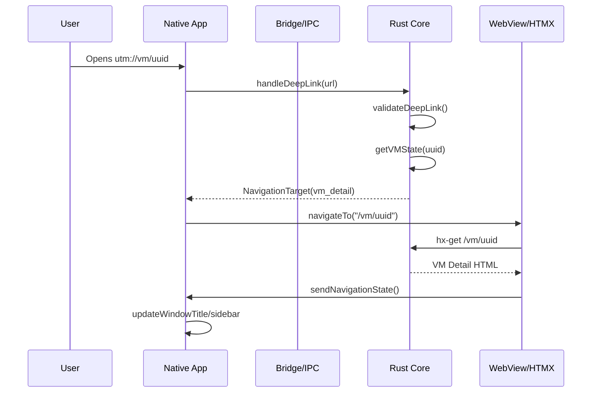
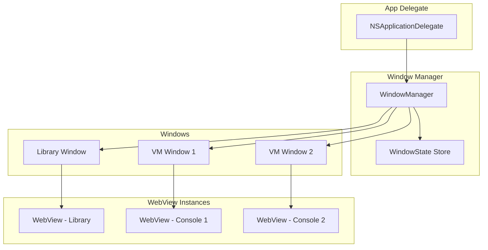

# UTM Production - Navigation & Routing Exploration

## Overview

This document explores navigation and routing patterns for production desktop VM management applications (UTM) using WebView with HTMX/Datastar. UTM is a full-featured virtual machine manager that runs on macOS, iOS, and Windows, providing a native-like experience through a hybrid WebView + Rust architecture.

The navigation system must handle:
- **Deep linking** to VMs, settings, and shared resources
- **Multi-window support** for running multiple VMs simultaneously
- **Tab management** for organizing VM instances
- **Browser integration** for documentation, help, and external resources
- **History management** for navigation state preservation
- **Route protection** based on VM state and user permissions

---

## Table of Contents

1. [Architecture Overview](#architecture-overview)
2. [Deep Linking & URL Schemes](#deep-linking--url-schemes)
3. [Window & Tab Management](#window--tab-management)
4. [Browser Integration](#browser-integration)
5. [History Management](#history-management)
6. [In-App Navigation](#in-app-navigation)
7. [Route Protection](#route-protection)
8. [Implementation Reference](#implementation-reference)

---

## 1. Architecture Overview

### Navigation Layers

```
┌─────────────────────────────────────────────────────────────────┐
│                    Native Navigation Layer                      │
│  - NSSplitViewController (macOS sidebar/main content)          │
│  - NSWindowController (multi-window management)                │
│  - NSTabViewController (tabbed VM instances)                   │
│  - URL Event Handlers (deep link registration)                 │
└─────────────────────────────────────────────────────────────────┘
                              │
                              │ coordinates via
                              │ FFI / IPC
                              ▼
┌─────────────────────────────────────────────────────────────────┐
│                    Rust Core Layer                              │
│  - NavigationManager (state, history, routes)                  │
│  - WindowManager (window/tab state persistence)                │
│  - DeepLinkHandler (URL parsing, validation)                   │
│  - VMStateValidator (route protection)                         │
└─────────────────────────────────────────────────────────────────┘
                              │
                              │ communicates via
                              │ Strada-like bridge
                              ▼
┌─────────────────────────────────────────────────────────────────┐
│                    WebView Navigation Layer                     │
│  - HTMX navigation (hx-get, hx-push-url)                       │
│  - History API (pushState, popState)                           │
│  - Datastar state management                                   │
│  - Message passing to native                                   │
└─────────────────────────────────────────────────────────────────┘
```

### Navigation Flow



### URL Scheme Architecture

```
utm://                        # Base scheme
utm://vm                      # VM operations
utm://vm/:id                  # Specific VM detail
utm://vm/:id/console          # VM console view
utm://vm/:id/settings         # VM settings
utm://library                 # Library management
utm://library/:id             # Specific library
utm://settings                # App settings
utm://settings/:section       # Specific settings section
utm://share/:id               # Shared resources
utm://action/:name            # Quick actions
```

---

## 2. Deep Linking & URL Schemes

### 2.1 Custom URL Scheme Registration

#### macOS - Info.plist Configuration

```xml
<!-- Info.plist -->
<key>CFBundleURLTypes</key>
<array>
    <dict>
        <key>CFBundleURLName</key>
        <string>com.utmapp.UTM</string>
        <key>CFBundleURLSchemes</key>
        <array>
            <string>utm</string>
        </array>
        <key>CFBundleURLIconFile</key>
        <string>Icon.icns</string>
        <key>CFBundleTypeRole</key>
        <string>Viewer</string>
    </dict>
</array>
```

#### Windows - Registry Registration

```rust
// src/platform/windows/url_scheme.rs
use winreg::RegKey;
use std::path::PathBuf;

pub fn register_url_scheme() -> Result<(), String> {
    let hkcu = RegKey::predef(winreg::enums::HKEY_CURRENT_USER);
    let base_path = r"Software\Classes\utm";

    // Create base key
    let (utm_key, _) = hkcu.create_subkey(base_path)
        .map_err(|e| format!("Failed to create UT M registry key: {}", e))?;

    utm_key.set_value("", &"URL:UTM Protocol")
        .map_err(|e| e.to_string())?;
    utm_key.set_value("URL Protocol", &"")
        .map_err(|e| e.to_string())?;

    // Set icon
    let (default_icon, _) = utm_key.create_subkey("DefaultIcon")
        .map_err(|e| e.to_string())?;
    let exe_path = std::env::current_exe()
        .map_err(|e| e.to_string())?;
    default_icon.set_value("", &format!("\"{}\",0", exe_path.display()))
        .map_err(|e| e.to_string())?;

    // Set command
    let (command, _) = utm_key.create_subkey(r"shell\open\command")
        .map_err(|e| e.to_string())?;
    command.set_value("", &format!("\"{}\" \"%1\"", exe_path.display()))
        .map_err(|e| e.to_string())?;

    Ok(())
}

pub fn unregister_url_scheme() -> Result<(), String> {
    let hkcu = RegKey::predef(winreg::enums::HKEY_CURRENT_USER);
    hkcu.delete_subkey_all(r"Software\Classes\utm")
        .map_err(|e| format!("Failed to delete UT M registry key: {}", e))?;
    Ok(())
}
```

#### Linux - Desktop Entry

```desktop
# utm.desktop
[Desktop Entry]
Version=1.0
Type=Application
Name=UTM
GenericName=Virtual Machine Manager
Exec=utm %u
TryExec=utm
Icon=utm
Categories=System;Virtualization;
MimeType=x-scheme-handler/utm;
Keywords=virtual machine;VM;QEMU;
```

### 2.2 Universal Links / App Links

#### macOS Associated Domains

```json
// apple-app-site-association
{
  "applinks": {
    "apps": [],
    "details": [
      {
        "appID": "TEAMID.com.utmapp.UTM",
        "paths": [
          "/vm/*",
          "/library/*",
          "/share/*",
          "/settings*"
        ]
      }
    ]
  },
  "webcredentials": {
    "apps": ["TEAMID.com.utmapp.UTM"]
  }
}
```

#### Server Configuration

```nginx
# nginx configuration for universal links
server {
    listen 443 ssl;
    server_name utm.app;

    # Serve apple-app-site-association
    location /.well-known/apple-app-site-association {
        alias /var/www/utm/.well-known/apple-app-site-association;
        default_type application/json;
        add_header Cache-Control "no-cache";
    }

    # Deep link routes
    location /vm/ {
        # Return JSON with app installation check
        if ($http_user_agent ~* "UTM") {
            return 301 utm://vm/$request_uri;
        }
        # Otherwise serve web fallback
        proxy_pass http://localhost:3000;
    }
}
```

### 2.3 Link Handling from Other Apps

#### Rust Core - Deep Link Handler

```rust
// utm-core/src/navigation/deep_link.rs
use serde::{Deserialize, Serialize};
use thiserror::Error;
use url::Url;
use std::collections::HashMap;

#[derive(Debug, Clone, Serialize, Deserialize, PartialEq)]
pub enum DeepLinkTarget {
    /// Navigate to VM list
    Library,
    /// Navigate to specific VM
    VM {
        id: String,
        view: VMView,
    },
    /// Navigate to settings
    Settings {
        section: Option<String>,
    },
    /// Navigate to shared resource
    Share {
        id: String,
    },
    /// Execute an action
    Action {
        name: String,
        params: HashMap<String, String>,
    },
}

#[derive(Debug, Clone, Serialize, Deserialize, PartialEq)]
pub enum VMView {
    Detail,
    Console,
    Settings,
    Snapshots,
    Network,
    Storage,
}

impl VMView {
    pub fn from_str(s: &str) -> Self {
        match s {
            "console" => VMView::Console,
            "settings" => VMView::Settings,
            "snapshots" => VMView::Snapshots,
            "network" => VMView::Network,
            "storage" => VMView::Storage,
            _ => VMView::Detail,
        }
    }

    pub fn path_segment(&self) -> &'static str {
        match self {
            VMView::Detail => "",
            VMView::Console => "/console",
            VMView::Settings => "/settings",
            VMView::Snapshots => "/snapshots",
            VMView::Network => "/network",
            VMView::Storage => "/storage",
        }
    }
}

#[derive(Debug, Error)]
pub enum DeepLinkError {
    #[error("Invalid URL format: {0}")]
    InvalidUrl(#[from] url::ParseError),

    #[error("Unknown scheme: {0}")]
    UnknownScheme(String),

    #[error("Invalid path: {0}")]
    InvalidPath(String),

    #[error("VM not found: {0}")]
    VMNotFound(String),

    #[error("Permission denied: {0}")]
    PermissionDenied(String),

    #[error("Invalid action: {0}")]
    InvalidAction(String),
}

pub struct DeepLinkHandler {
    base_url: Url,
}

impl DeepLinkHandler {
    pub fn new() -> Self {
        Self {
            base_url: Url::parse("utm://").unwrap(),
        }
    }

    /// Parse a deep link URL into a target
    pub fn parse(&self, url_str: &str) -> Result<DeepLinkTarget, DeepLinkError> {
        let url = Url::parse(url_str)?;

        // Validate scheme
        if url.scheme() != "utm" {
            return Err(DeepLinkError::UnknownScheme(url.scheme().to_string()));
        }

        let path = url.path();
        let segments: Vec<&str> = path.split('/').filter(|s| !s.is_empty()).collect();

        if segments.is_empty() {
            return Ok(DeepLinkTarget::Library);
        }

        match segments[0] {
            "vm" => self.parse_vm_target(&segments),
            "library" => Ok(DeepLinkTarget::Library),
            "settings" => self.parse_settings_target(&segments),
            "share" => self.parse_share_target(&segments),
            "action" => self.parse_action_target(&segments, url.query_pairs()),
            _ => Err(DeepLinkError::InvalidPath(path.to_string())),
        }
    }

    fn parse_vm_target(&self, segments: &[&str]) -> Result<DeepLinkTarget, DeepLinkError> {
        if segments.len() < 2 {
            return Ok(DeepLinkTarget::Library);
        }

        let vm_id = segments[1].to_string();

        // Parse optional view
        let view = if segments.len() >= 3 {
            VMView::from_str(segments[2])
        } else {
            VMView::Detail
        };

        Ok(DeepLinkTarget::VM { id: vm_id, view })
    }

    fn parse_settings_target(&self, segments: &[&str]) -> Result<DeepLinkTarget, DeepLinkError> {
        let section = segments.get(1).map(|s| s.to_string());
        Ok(DeepLinkTarget::Settings { section })
    }

    fn parse_share_target(&self, segments: &[&str]) -> Result<DeepLinkTarget, DeepLinkError> {
        if segments.len() < 2 {
            return Err(DeepLinkError::InvalidPath("Share ID required".to_string()));
        }
        Ok(DeepLinkTarget::Share {
            id: segments[1].to_string(),
        })
    }

    fn parse_action_target(
        &self,
        segments: &[&str],
        query_params: url::form_pairs::PairIterator,
    ) -> Result<DeepLinkTarget, DeepLinkError> {
        if segments.len() < 2 {
            return Err(DeepLinkError::InvalidAction("Action name required".to_string()));
        }

        let action_name = segments[1].to_string();
        let params: HashMap<String, String> = query_params
            .map(|(k, v)| (k.to_string(), v.to_string()))
            .collect();

        Ok(DeepLinkTarget::Action {
            name: action_name,
            params,
        })
    }

    /// Build a deep link URL from a target
    pub fn build(&self, target: &DeepLinkTarget) -> String {
        match target {
            DeepLinkTarget::Library => "utm://library".to_string(),
            DeepLinkTarget::VM { id, view } => {
                format!("utm://vm/{}{}", id, view.path_segment())
            }
            DeepLinkTarget::Settings { section } => {
                match section {
                    Some(s) => format!("utm://settings/{}", s),
                    None => "utm://settings".to_string(),
                }
            }
            DeepLinkTarget::Share { id } => {
                format!("utm://share/{}", id)
            }
            DeepLinkTarget::Action { name, params } => {
                let mut url = format!("utm://action/{}", name);
                if !params.is_empty() {
                    let query: Vec<String> = params
                        .iter()
                        .map(|(k, v)| format!("{}={}", k, v))
                        .collect();
                    url.push('?');
                    url.push_str(&query.join("&"));
                }
                url
            }
        }
    }
}

impl Default for DeepLinkHandler {
    fn default() -> Self {
        Self::new()
    }
}

#[cfg(test)]
mod tests {
    use super::*;

    #[test]
    fn test_parse_vm_detail() {
        let handler = DeepLinkHandler::new();
        let target = handler.parse("utm://vm/abc-123").unwrap();
        assert!(matches!(target, DeepLinkTarget::VM { id, view: VMView::Detail } if id == "abc-123"));
    }

    #[test]
    fn test_parse_vm_console() {
        let handler = DeepLinkHandler::new();
        let target = handler.parse("utm://vm/abc-123/console").unwrap();
        assert!(matches!(target, DeepLinkTarget::VM { id, view: VMView::Console } if id == "abc-123"));
    }

    #[test]
    fn test_parse_settings() {
        let handler = DeepLinkHandler::new();
        let target = handler.parse("utm://settings/network").unwrap();
        assert!(matches!(target, DeepLinkTarget::Settings { section: Some(s) } if s == "network"));
    }

    #[test]
    fn test_build_vm_url() {
        let handler = DeepLinkHandler::new();
        let target = DeepLinkTarget::VM {
            id: "test-vm".to_string(),
            view: VMView::Console,
        };
        assert_eq!(handler.build(&target), "utm://vm/test-vm/console");
    }
}
```

### 2.4 Swift - Native Deep Link Handler

```swift
// UTM/DeepLinkHandler.swift
import Foundation
import UniformTypeIdentifiers

enum DeepLinkTarget: Equatable {
    case library
    case vm(id: String, view: VMView)
    case settings(section: String?)
    case share(id: String)
    case action(name: String, params: [String: String])
}

enum VMView: String {
    case detail = ""
    case console
    case settings
    case snapshots
    case network
    case storage

    var pathSegment: String {
        switch self {
        case .detail: return ""
        case .console: return "/console"
        case .settings: return "/settings"
        case .snapshots: return "/snapshots"
        case .network: return "/network"
        case .storage: return "/storage"
        }
    }

    init?(from path: String) {
        switch path {
        case "console": self = .console
        case "settings": self = .settings
        case "snapshots": self = .snapshots
        case "network": self = .network
        case "storage": self = .storage
        default: return nil
        }
    }
}

struct DeepLinkResult {
    let target: DeepLinkTarget
    let originalURL: URL
    let timestamp: Date
}

class DeepLinkHandler {
    static let shared = DeepLinkHandler()

    private let rustHandler: RustDeepLinkHandler

    init() {
        self.rustHandler = RustDeepLinkHandler()
    }

    /// Handle a URL from any source (SceneDelegate, NSAppleEvent, etc.)
    func handleURL(_ url: URL) -> Result<DeepLinkResult, DeepLinkError> {
        guard let scheme = url.scheme?.lowercased(),
              scheme == "utm" else {
            return .failure(.unknownScheme(url.scheme ?? "unknown"))
        }

        // Parse via Rust core
        let result = rustHandler.parse(url.absoluteString)

        switch result {
        case .success(let target):
            return .success(DeepLinkResult(
                target: target,
                originalURL: url,
                timestamp: Date()
            ))
        case .failure(let error):
            return .failure(error)
        }
    }

    /// Build a URL from a target
    func buildURL(target: DeepLinkTarget) -> String {
        return rustHandler.build(target: target)
    }

    /// Open a deep link from within the app
    func openDeepLink(target: DeepLinkTarget) {
        guard let url = URL(string: buildURL(target: target)) else { return }
        openURL(url)
    }

    /// Open external URL (for browser integration)
    func openExternalURL(_ url: URL) {
        openURL(url)
    }

    private func openURL(_ url: URL) {
        #if os(macOS)
        NSWorkspace.shared.open(url)
        #else
        UIApplication.shared.open(url)
        #endif
    }
}

// MARK: - SceneDelegate Integration (macOS)

@available(macOS 10.15, *)
extension AppDelegate {
    func application(_ application: NSApplication,
                     open urls: [URL]) {
        for url in urls {
            handleIncomingURL(url)
        }
    }

    private func handleIncomingURL(_ url: URL) {
        switch DeepLinkHandler.shared.handleURL(url) {
        case .success(let result):
            navigateTo(target: result.target)
        case .failure(let error):
            logger.error("Failed to handle deep link: \(error)")
            showDeepLinkError(error)
        }
    }

    private func navigateTo(target: DeepLinkTarget) {
        switch target {
        case .library:
            windowController?.navigateToLibrary()
        case .vm(let id, let view):
            windowController?.navigateToVM(id: id, view: view)
        case .settings(let section):
            windowController?.navigateToSettings(section: section)
        case .share(let id):
            windowController?.navigateToShare(id: id)
        case .action(let name, let params):
            windowController?.executeAction(name: name, params: params)
        }
    }
}
```

### 2.5 Command-Line Argument Handling

```rust
// utm-cli/src/main.rs
use std::env;
use std::process::Command;

#[derive(Debug)]
enum CliCommand {
    /// Open a specific VM
    Open { vm_id: String },
    /// Start a VM
    Start { vm_id: String },
    /// Stop a VM
    Stop { vm_id: String },
    /// Show VM settings
    Settings { vm_id: String },
    /// Open console
    Console { vm_id: String },
    /// Show help
    Help,
    /// Show version
    Version,
}

fn parse_args() -> Result<CliCommand, String> {
    let args: Vec<String> = env::args().collect();

    if args.len() < 2 {
        return Ok(CliCommand::Help);
    }

    match args[1].as_str() {
        "open" => {
            let vm_id = args.get(2)
                .ok_or("VM ID required")?
                .to_string();
            Ok(CliCommand::Open { vm_id })
        }
        "start" => {
            let vm_id = args.get(2)
                .ok_or("VM ID required")?
                .to_string();
            Ok(CliCommand::Start { vm_id })
        }
        "stop" => {
            let vm_id = args.get(2)
                .ok_or("VM ID required")?
                .to_string();
            Ok(CliCommand::Stop { vm_id })
        }
        "settings" => {
            let vm_id = args.get(2)
                .ok_or("VM ID required")?
                .to_string();
            Ok(CliCommand::Settings { vm_id })
        }
        "console" => {
            let vm_id = args.get(2)
                .ok_or("VM ID required")?
                .to_string();
            Ok(CliCommand::Console { vm_id })
        }
        "--help" | "-h" => Ok(CliCommand::Help),
        "--version" | "-v" => Ok(CliCommand::Version),
        cmd if cmd.starts_with("utm://") => {
            // Handle deep link passed as argument
            Ok(CliCommand::Open { vm_id: cmd })
        }
        _ => Err(format!("Unknown command: {}", args[1])),
    }
}

fn execute_command(cmd: CliCommand) -> Result<(), String> {
    match cmd {
        CliCommand::Open { vm_id } => {
            // If vm_id is already a deep link, use it directly
            let url = if vm_id.starts_with("utm://") {
                vm_id
            } else {
                format!("utm://vm/{}", vm_id)
            };

            // On macOS, use 'open' command
            #[cfg(target_os = "macos")]
            {
                Command::new("open")
                    .arg(&url)
                    .spawn()
                    .map_err(|e| e.to_string())?;
            }

            // On Windows, use 'start' command
            #[cfg(target_os = "windows")]
            {
                Command::new("cmd")
                    .args(&["/c", "start", &url])
                    .spawn()
                    .map_err(|e| e.to_string())?;
            }

            Ok(())
        }
        CliCommand::Start { vm_id } => {
            // Use AppleScript on macOS
            #[cfg(target_os = "macos")]
            {
                let script = format!(
                    r#"tell application "UTM" to start VM "{}""#,
                    vm_id
                );
                Command::new("osascript")
                    .args(&["-e", &script])
                    .spawn()
                    .map_err(|e| e.to_string())?;
            }
            Ok(())
        }
        CliCommand::Help => {
            println!("UTM CLI - Virtual Machine Manager");
            println!();
            println!("Usage: utm <command> [arguments]");
            println!();
            println!("Commands:");
            println!("  open <vm_id>      Open a VM window");
            println!("  start <vm_id>     Start a VM");
            println!("  stop <vm_id>      Stop a VM");
            println!("  settings <vm_id>  Show VM settings");
            println!("  console <vm_id>   Open VM console");
            println!("  --help, -h        Show this help");
            println!("  --version, -v     Show version");
            Ok(())
        }
        CliCommand::Version => {
            println!("UTM {}", env!("CARGO_PKG_VERSION"));
            Ok(())
        }
        _ => Ok(()),
    }
}

fn main() {
    match parse_args() {
        Ok(cmd) => {
            if let Err(e) = execute_command(cmd) {
                eprintln!("Error: {}", e);
                std::process::exit(1);
            }
        }
        Err(e) => {
            eprintln!("Error parsing arguments: {}", e);
            std::process::exit(1);
        }
    }
}
```

---

## 3. Window & Tab Management

### 3.1 Multi-Window Architecture



### 3.2 Swift - Window Manager

```swift
// UTM/WindowManager.swift
import Cocoa
import WebKit
import Combine

/// Manages all application windows
class WindowManager: ObservableObject {
    static let shared = WindowManager()

    /// All managed windows
    @Published private(set) var windows: [WindowIdentifier: UT MWindow] = [:]

    /// Currently active window
    @Published var activeWindow: WindowIdentifier?

    /// Window state for persistence
    @Published var windowStates: [WindowIdentifier: PersistedWindowState] = [:]

    /// Maximum concurrent VM windows
    let maxVMWindows = 8

    private var cancellables = Set<AnyCancellable>()

    init() {
        setupNotificationObservers()
    }

    // MARK: - Window Creation

    /// Create or reuse the main library window
    func showLibraryWindow() -> UT MWindow {
        if let existing = windows[.library] {
            existing.window.makeKeyAndOrderFront(nil)
            return existing
        }

        let window = UT MWindow(
            identifier: .library,
            contentVC: LibraryViewController()
        )
        window.title = "UTM - Library"
        window.setFrameAutosaveName("LibraryWindow")

        windows[.library] = window
        activeWindow = .library

        return window
    }

    /// Create a new VM window or reuse existing
    func showVMWindow(vmID: String, view: VMView) -> UT MWindow {
        let identifier = WindowIdentifier.vm(id: vmID)

        // Check if window already exists
        if let existing = windows[identifier] {
            existing.window.makeKeyAndOrderFront(nil)
            // Navigate to requested view
            existing.contentVC?.navigateTo(view: view)
            return existing
        }

        // Check if we've hit the limit
        let vmWindowCount = windows.values.filter { $0.identifier.isVM }.count
        if vmWindowCount >= maxVMWindows {
            // Reuse the least recently used window
            if let lruWindow = findLeastRecentlyUsedVMWindow() {
                closeWindow(identifier: lruWindow.identifier)
            }
        }

        // Create new window
        let contentVC = VMViewController(vmID: vmID, initialView: view)
        let window = UT MWindow(
            identifier: identifier,
            contentVC: contentVC
        )

        let vmName = VMStore.shared.getVM(id: vmID)?.name ?? vmID
        window.title = "UTM - \(vmName)"
        window.setFrameAutosaveName("VMWindow_\(vmID)")

        windows[identifier] = window
        activeWindow = identifier

        return window
    }

    /// Create a settings window
    func showSettingsWindow(section: String? = nil) -> UT MWindow {
        if let existing = windows[.settings] {
            existing.window.makeKeyAndOrderFront(nil)
            if let section = section {
                (existing.contentVC as? SettingsViewController)?.navigateTo(section: section)
            }
            return existing
        }

        let contentVC = SettingsViewController(initialSection: section)
        let window = UT MWindow(
            identifier: .settings,
            contentVC: contentVC
        )
        window.title = "UTM - Settings"
        window.setFrameAutosaveName("SettingsWindow")

        windows[.settings] = window
        activeWindow = .settings

        return window
    }

    // MARK: - Window Closing

    func closeWindow(identifier: WindowIdentifier) {
        guard let window = windows[identifier] else { return }

        // Save state before closing
        persistWindowState(window)

        window.window.close()
        windows.removeValue(forKey: identifier)

        if activeWindow == identifier {
            activeWindow = windows.keys.first
        }
    }

    func closeAllVMWindows() {
        let vmIdentifiers = windows.keys.filter { $0.isVM }
        for identifier in vmIdentifiers {
            closeWindow(identifier: identifier)
        }
    }

    // MARK: - Window State Persistence

    private func persistWindowState(_ window: UT MWindow) {
        let state = PersistedWindowState(
            identifier: window.identifier,
            frame: window.window.frame,
            isZoomed: window.window.isZoomed,
            sidebarWidth: (window.contentVC as? SidebarSupporting)?.sidebarWidth ?? 200,
            lastView: (window.contentVC as? ViewNavigating)?.currentView ?? "",
            timestamp: Date()
        )
        windowStates[window.identifier] = state

        // Persist to disk
        WindowStateStore.shared.save(state)
    }

    func restoreWindowState(_ window: UT MWindow) {
        guard let state = windowStates[window.identifier] else { return }

        window.window.setFrame(state.frame, display: true)
        if state.isZoomed {
            window.window.zoom(nil)
        }

        if let sidebarWidth = state.sidebarWidth {
            (window.contentVC as? SidebarSupporting)?.sidebarWidth = sidebarWidth
        }

        if let lastView = state.lastView {
            (window.contentVC as? ViewNavigating)?.navigateTo(view: VMView(rawValue: lastView) ?? .detail)
        }
    }

    // MARK: - Helpers

    private func findLeastRecentlyUsedVMWindow() -> UT MWindow? {
        let vmWindows = windows.values.filter { $0.identifier.isVM }
        return vmWindows.min(by: {
            $0.lastActivatedAt < $1.lastActivatedAt
        })
    }

    private func setupNotificationObservers() {
        NotificationCenter.default.publisher(for: NSWindow.willCloseNotification)
            .compactMap { $0.object as? NSWindow }
            .sink { [weak self] window in
                if let identifier = self?.windows.first(where: { $1.window == window })?.key {
                    self?.closeWindow(identifier: identifier)
                }
            }
            .store(in: &cancellables)

        NotificationCenter.default.publisher(for: NSWindow.didBecomeKeyNotification)
            .compactMap { $0.object as? NSWindow }
            .sink { [weak self] window in
                if let identifier = self?.windows.first(where: { $1.window == window })?.key {
                    self?.activeWindow = identifier
                }
            }
            .store(in: &cancellables)
    }
}

// MARK: - Window Types

enum WindowIdentifier: Hashable, Codable {
    case library
    case settings
    case vm(id: String)
    case share(id: String)

    var isVM: Bool {
        if case .vm = self { return true }
        return false
    }

    var vmID: String? {
        if case .vm(let id) = self { return id }
        return nil
    }
}

class PersistedWindowState: Codable {
    let identifier: WindowIdentifier
    let frame: CGRect
    let isZoomed: Bool
    let sidebarWidth: CGFloat?
    let lastView: String
    let timestamp: Date

    init(
        identifier: WindowIdentifier,
        frame: CGRect,
        isZoomed: Bool,
        sidebarWidth: CGFloat?,
        lastView: String,
        timestamp: Date
    ) {
        self.identifier = identifier
        self.frame = frame
        self.isZoomed = isZoomed
        self.sidebarWidth = sidebarWidth
        self.lastView = lastView
        self.timestamp = timestamp
    }
}

// MARK: - Window Subclass

class UT MWindow {
    let identifier: WindowIdentifier
    let window: NSWindow
    var contentVC: (NSViewController & ViewNavigating)?
    var lastActivatedAt: Date = Date()

    init(identifier: WindowIdentifier, contentVC: NSViewController & ViewNavigating) {
        self.identifier = identifier
        self.contentVC = contentVC

        self.window = NSWindow(
            contentRect: NSRect(x: 0, y: 0, width: 1024, height: 768),
            styleMask: [.titled, .closable, .miniaturizable, .resizable, .fullSizeContentView],
            backing: .buffered,
            defer: false
        )
        self.window.contentViewController = contentVC
        self.window.titleVisibility = .hidden
        self.window.titlebarAppearsTransparent = true
        self.window.isMovableByWindowBackground = true
    }
}
```

### 3.3 Tab Management (Alternative to Windows)

```swift
// UTM/TabbedVMManager.swift
import Cocoa

class TabbedVMManager: NSTabViewController {
    private var vmTabs: [String: VMViewController] = [:]

    override func viewDidLoad() {
        super.viewDidLoad()
        self.tabStyle = .unspecified
    }

    func openVM(vmID: String, view: VMView) {
        // Check if already open
        if let existingVC = vmTabs[vmID] {
            // Select existing tab
            let tabIndex = viewControllers.firstIndex(where: { $0 === existingVC }) ?? 0
            self.selectedTabViewItemIndex = tabIndex
            existingVC.navigateTo(view: view)
            return
        }

        // Create new tab
        let vc = VMViewController(vmID: vmID, initialView: view)
        let tabItem = NSTabViewItem(viewController: vc)
        tabItem.label = VMStore.shared.getVM(id: vmID)?.name ?? vmID
        tabItem.image = NSImage(systemSymbolName: "display", accessibilityDescription: "VM")

        self.addTabViewItem(tabItem)
        self.selectedTabViewItem = tabItem

        vmTabs[vmID] = vc
    }

    func closeVM(vmID: String) {
        guard let vc = vmTabs[vmID] else { return }

        if let tabItem = viewControllers.first(where: { $0 === vc }).flatMap({ getTabViewItem(for: $0) }) {
            self.removeTabViewItem(tabItem)
        }

        vmTabs.removeValue(forKey: vmID)
    }

    // Persist tab state
    func encodeRestorableState(with coder: NSCoder) {
        let vmIDs = vmTabs.keys.map { $0 }
        coder.encode(vmIDs, forKey: "vmIDs")
        coder.encode(selectedTabViewItemIndex, forKey: "selectedTab")
    }

    func decodeRestorableState(with coder: NSCoder) {
        if let vmIDs = coder.decodeObject(of: [NSArray.self, NSString.self], forKey: "vmIDs") as? [String] {
            for vmID in vmIDs {
                openVM(vmID: vmID, view: .detail)
            }
        }
        selectedTabViewItemIndex = coder.decodeInteger(forKey: "selectedTab")
    }
}
```

### 3.4 Workspace Management

```rust
// utm-core/src/workspace/mod.rs
use serde::{Deserialize, Serialize};
use std::collections::HashMap;
use uuid::Uuid;

/// A workspace is a saved arrangement of open windows/tabs
#[derive(Debug, Clone, Serialize, Deserialize)]
pub struct Workspace {
    pub id: String,
    pub name: String,
    pub windows: Vec<WindowState>,
    pub created_at: i64,
    pub updated_at: i64,
}

#[derive(Debug, Clone, Serialize, Deserialize)]
pub struct WindowState {
    pub vm_id: String,
    pub view: String,
    pub frame: WindowFrame,
    pub is_maximized: bool,
}

#[derive(Debug, Clone, Serialize, Deserialize)]
pub struct WindowFrame {
    pub x: i32,
    pub y: i32,
    pub width: i32,
    pub height: i32,
}

pub struct WorkspaceManager {
    workspaces: HashMap<String, Workspace>,
    current_workspace: Option<String>,
}

impl WorkspaceManager {
    pub fn new() -> Self {
        Self {
            workspaces: HashMap::new(),
            current_workspace: None,
        }
    }

    /// Create a new workspace from current window state
    pub fn create_workspace(&mut self, name: String, windows: Vec<WindowState>) -> String {
        let id = Uuid::new_v4().to_string();
        let now = chrono::Utc::now().timestamp();

        let workspace = Workspace {
            id: id.clone(),
            name,
            windows,
            created_at: now,
            updated_at: now,
        };

        self.workspaces.insert(id.clone(), workspace);
        self.current_workspace = Some(id.clone());

        id
    }

    /// Save current state to workspace
    pub fn save_workspace(&mut self, id: &str, windows: Vec<WindowState>) -> Result<(), String> {
        if let Some(workspace) = self.workspaces.get_mut(id) {
            workspace.windows = windows;
            workspace.updated_at = chrono::Utc::now().timestamp();
            Ok(())
        } else {
            Err(format!("Workspace not found: {}", id))
        }
    }

    /// Load a workspace
    pub fn load_workspace(&self, id: &str) -> Option<&Workspace> {
        self.workspaces.get(id)
    }

    /// List all workspaces
    pub fn list_workspaces(&self) -> Vec<&Workspace> {
        self.workspaces.values().collect()
    }

    /// Delete a workspace
    pub fn delete_workspace(&mut self, id: &str) -> Result<(), String> {
        self.workspaces.remove(id)
            .ok_or_else(|| format!("Workspace not found: {}", id))?;

        if self.current_workspace.as_deref() == Some(id) {
            self.current_workspace = None;
        }

        Ok(())
    }

    /// Get current workspace
    pub fn current_workspace(&self) -> Option<&Workspace> {
        self.current_workspace
            .as_ref()
            .and_then(|id| self.workspaces.get(id))
    }
}

impl Default for WorkspaceManager {
    fn default() -> Self {
        Self::new()
    }
}
```

---

## 4. Browser Integration

### 4.1 Opening External Links

```rust
// utm-core/src/browser/mod.rs
use std::process::Command;

/// Handle opening external URLs
pub fn open_external_url(url: &str) -> Result<(), String> {
    #[cfg(target_os = "macos")]
    {
        Command::new("open")
            .arg(url)
            .spawn()
            .map_err(|e| e.to_string())?;
    }

    #[cfg(target_os = "windows")]
    {
        Command::new("cmd")
            .args(&["/c", "start", url])
            .spawn()
            .map_err(|e| e.to_string())?;
    }

    #[cfg(target_os = "linux")]
    {
        Command::new("xdg-open")
            .arg(url)
            .spawn()
            .map_err(|e| e.to_string())?;
    }

    Ok(())
}

/// Determine if a URL should be opened externally or internally
pub fn should_open_externally(url: &str) -> bool {
    // External domains
    let external_domains = [
        "github.com",
        "apple.com",
        "microsoft.com",
        "qemu.org",
        "debian.org",
        "ubuntu.com",
        "archlinux.org",
    ];

    // Internal paths that should stay internal
    let internal_prefixes = [
        "/vm/",
        "/library/",
        "/settings/",
        "/share/",
    ];

    // Parse URL
    let parsed = match url::Url::parse(url) {
        Ok(u) => u,
        Err(_) => return false, // Invalid URLs handled internally
    };

    // Check if it's an external domain
    if let Some(domain) = parsed.domain() {
        if external_domains.contains(&domain) {
            return true;
        }
    }

    // Check if it starts with internal prefix
    let path = parsed.path();
    if internal_prefixes.iter().any(|p| path.starts_with(p)) {
        return false;
    }

    // Check protocol
    match parsed.scheme() {
        "http" | "https" => {
            // External HTTP(S) links - check if same origin
            parsed.domain() != Some("utm.app")
        }
        "mailto" | "tel" => true,
        _ => false, // Unknown protocols handled internally
    }
}
```

### 4.2 Swift - Default Browser Handling

```swift
// UTM/BrowserIntegration.swift
import Foundation
import WebKit

class BrowserIntegration {
    static let shared = BrowserIntegration()

    /// Decide policy for navigation action
    func decidePolicyFor(
        navigationAction: WKNavigationAction,
        decisionHandler: @escaping (WKNavigationActionPolicy) -> Void
    ) {
        guard let url = navigationAction.request.url else {
            decisionHandler(.cancel)
            return
        }

        // Allow internal navigation
        if isInternalURL(url) {
            decisionHandler(.allow)
            return
        }

        // Handle external links
        if shouldOpenExternally(url) {
            openInDefaultBrowser(url)
            decisionHandler(.cancel)
            return
        }

        // Check for special protocols
        switch url.scheme?.lowercased() {
        case "mailto", "tel", "sms":
            openInDefaultBrowser(url)
            decisionHandler(.cancel)

        case "utm":
            // Internal deep link - allow
            decisionHandler(.allow)

        case "http", "https":
            // External link - open in browser
            openInDefaultBrowser(url)
            decisionHandler(.cancel)

        default:
            // Unknown - try to handle, but cancel if fails
            decisionHandler(.allow)
        }
    }

    /// Check if URL is internal
    private func isInternalURL(_ url: URL) -> Bool {
        // Check for utm:// scheme
        if url.scheme?.lowercased() == "utm" {
            return true
        }

        // Check for localhost (development)
        if let host = url.host {
            if host == "localhost" || host == "127.0.0.1" {
                return true
            }

            // Check for app-specific domain
            if host.hasSuffix(".utm.app") || host == "utm.app" {
                return true
            }
        }

        return false
    }

    /// Determine if URL should open externally
    private func shouldOpenExternally(_ url: URL) -> Bool {
        guard let host = url.host else { return false }

        // List of known external domains
        let externalDomains = [
            "github.com",
            "apple.com",
            "microsoft.com",
            "qemu.org",
        ]

        // If it's a known external domain, open externally
        if externalDomains.contains(host) {
            return true
        }

        // If it's not utm.app domain, open externally
        if !host.hasSuffix(".utm.app") && host != "utm.app" {
            return true
        }

        return false
    }

    /// Open URL in default browser
    func openInDefaultBrowser(_ url: URL) {
        #if os(macOS)
        NSWorkspace.shared.open(url)
        #else
        UIApplication.shared.open(url)
        #endif
    }
}

// MARK: - WKNavigationDelegate Extension

extension BrowserIntegration: WKNavigationDelegate {
    func webView(
        _ webView: WKWebView,
        decidePolicyFor navigationAction: WKNavigationAction,
        decisionHandler: @escaping (WKNavigationActionPolicy) -> Void
    ) {
        decidePolicyFor(
            navigationAction: navigationAction,
            decisionHandler: decisionHandler
        )
    }
}
```

### 4.3 HTMX - Internal vs External Link Decisions

```html
<!-- templates/partials/navigation.html -->

<!-- Internal navigation - uses HTMX -->
<a href="/vm/{{ vm.id }}"
   hx-get="/vm/{{ vm.id }}"
   hx-target="#main-content"
   hx-push-url="true"
   data-navigate="internal">
    {{ vm.name }}
</a>

<!-- External link - opens in browser -->
<a href="https://github.com/utmapp/UTM"
   target="_blank"
   rel="noopener noreferrer"
   data-navigate="external">
    View on GitHub
</a>

<!-- Help documentation - opens in browser -->
<a href="/docs/getting-started"
   hx-get="/vm/docs/getting-started"
   hx-target="#docs-panel"
   data-navigate="internal-docs">
    Documentation
</a>

<script>
// Handle link clicks based on data-navigate attribute
document.addEventListener('click', function(e) {
    const link = e.target.closest('a[data-navigate]');
    if (!link) return;

    const navigateType = link.dataset.navigate;

    if (navigateType === 'external') {
        // Let browser handle - don't prevent default
        return;
    }

    if (navigateType === 'internal-docs') {
        // Internal docs - use HTMX but in side panel
        // HTMX handles this via hx-target
        return;
    }

    if (navigateType === 'internal') {
        // Standard internal navigation
        // HTMX handles this
        return;
    }

    // Default: check if external
    const href = link.href;
    if (isExternalURL(href)) {
        window.open(href, '_blank', 'noopener,noreferrer');
        e.preventDefault();
    }
});

function isExternalURL(url) {
    const internalPrefixes = ['/vm/', '/library/', '/settings/', '/share/'];
    return !internalPrefixes.some(prefix => url.startsWith(prefix));
}
</script>
```

---

## 5. History Management

### 5.1 Navigation History Stack

```rust
// utm-core/src/navigation/history.rs
use serde::{Deserialize, Serialize};
use std::collections::VecDeque;
use chrono::{DateTime, Utc};

/// Entry in the navigation history
#[derive(Debug, Clone, Serialize, Deserialize)]
pub struct HistoryEntry {
    /// The URL/path visited
    pub path: String,
    /// Page title
    pub title: Option<String>,
    /// VM context (if viewing a VM)
    pub vm_id: Option<String>,
    /// Timestamp of visit
    pub timestamp: DateTime<Utc>,
    /// Scroll position for restoration
    pub scroll_y: u32,
}

/// Navigation history with undo/redo support
#[derive(Debug, Clone, Serialize, Deserialize)]
pub struct NavigationHistory {
    /// Back stack (entries we can go back to)
    back_stack: VecDeque<HistoryEntry>,
    /// Forward stack (entries we can go forward to)
    forward_stack: VecDeque<HistoryEntry>,
    /// Current entry (optional - might be at root)
    current: Option<HistoryEntry>,
    /// Maximum entries to keep
    max_size: usize,
}

impl NavigationHistory {
    pub fn new(max_size: usize) -> Self {
        Self {
            back_stack: VecDeque::with_capacity(max_size),
            forward_stack: VecDeque::new(),
            current: None,
            max_size,
        }
    }

    /// Push a new entry onto the history
    pub fn push(&mut self, entry: HistoryEntry) {
        // Move current to back stack
        if let Some(current) = self.current.take() {
            self.back_stack.push_back(current);
        }

        // Enforce max size
        while self.back_stack.len() >= self.max_size {
            self.back_stack.pop_front();
        }

        // Set new current
        self.current = Some(entry);

        // Clear forward stack (new branch)
        self.forward_stack.clear();
    }

    /// Replace current entry (for in-place updates)
    pub fn replace(&mut self, entry: HistoryEntry) {
        self.current = Some(entry);
        // Don't clear forward stack - allows returning to previous state
    }

    /// Go back in history
    pub fn go_back(&mut self) -> Option<HistoryEntry> {
        // Move current to forward stack
        if let Some(current) = self.current.take() {
            self.forward_stack.push_front(current);
        }

        // Pop from back stack and make current
        self.back_stack.pop_back().map(|entry| {
            self.current = Some(entry.clone());
            entry
        })
    }

    /// Go forward in history
    pub fn go_forward(&mut self) -> Option<HistoryEntry> {
        // Move current to back stack
        if let Some(current) = self.current.take() {
            self.back_stack.push_back(current);
        }

        // Pop from forward stack and make current
        self.forward_stack.pop_front().map(|entry| {
            self.current = Some(entry.clone());
            entry
        })
    }

    /// Check if back navigation is possible
    pub fn can_go_back(&self) -> bool {
        !self.back_stack.is_empty()
    }

    /// Check if forward navigation is possible
    pub fn can_go_forward(&self) -> bool {
        !self.forward_stack.is_empty()
    }

    /// Get current entry
    pub fn current(&self) -> Option<&HistoryEntry> {
        self.current.as_ref()
    }

    /// Clear all history and set new root
    pub fn clear_and_set_root(&mut self, entry: HistoryEntry) {
        self.back_stack.clear();
        self.forward_stack.clear();
        self.current = Some(entry);
    }

    /// Get recent history for UI display
    pub fn get_recent(&self, limit: usize) -> Vec<&HistoryEntry> {
        let mut entries: Vec<&HistoryEntry> = Vec::new();

        // Add back stack (most recent first)
        for entry in self.back_stack.iter().rev().take(limit) {
            entries.push(entry);
        }

        // Add current if exists
        if let Some(current) = &self.current {
            if entries.len() < limit {
                entries.push(current);
            }
        }

        entries
    }

    /// Persist history to JSON
    pub fn to_json(&self) -> Result<String, serde_json::Error> {
        serde_json::to_string(self)
    }

    /// Restore history from JSON
    pub fn from_json(json: &str) -> Result<Self, serde_json::Error> {
        serde_json::from_str(json)
    }
}

impl Default for NavigationHistory {
    fn default() -> Self {
        Self::new(100)
    }
}
```

### 5.2 System Back Button Handling (macOS)

```swift
// UTM/Navigation/BackNavigationHandler.swift
import Cocoa

protocol BackNavigationSupporting: AnyObject {
    func canGoBack() -> Bool
    func goBack() -> Bool
    func canGoForward() -> Bool
    func goForward() -> Bool
}

class BackNavigationHandler {
    static let shared = BackNavigationHandler()

    /// Register global keyboard shortcut for back/forward
    func registerKeyboardShortcuts() {
        // Cmd+[ for back
        NSEvent.addLocalMonitorForEvents(matching: .keyDown) { [weak self] event in
            if event.modifierFlags.contains(.command) {
                switch event.keyCode {
                case 33: // [ key
                    self?.handleBackAction()
                    return nil
                case 34: // ] key
                    self?.handleForwardAction()
                    return nil
                default:
                    break
                }
            }
            return event
        }
    }

    /// Handle back navigation
    func handleBackAction() {
        // First check if active WebView can go back
        if let webView = WebViewManager.shared.activeWebView {
            if webView.canGoBack {
                webView.goBack()
                return
            }
        }

        // Check if current view controller supports back
        if let currentVC = WindowManager.shared.activeWindow?.contentVC {
            if currentVC.canGoBack() && currentVC.goBack() {
                return
            }
        }

        // Fall back to window-level navigation
        if let historyEntry = NavigationHistory.shared.goBack() {
            navigateTo(historyEntry: historyEntry)
        }
    }

    /// Handle forward navigation
    func handleForwardAction() {
        if let webView = WebViewManager.shared.activeWebView {
            if webView.canGoForward {
                webView.goForward()
                return
            }
        }

        if let historyEntry = NavigationHistory.shared.goForward() {
            navigateTo(historyEntry: historyEntry)
        }
    }

    private func navigateTo(historyEntry: HistoryEntry) {
        // Determine target based on entry
        if let vmID = historyEntry.vmId {
            WindowManager.shared.showVMWindow(vmID: vmID, view: .detail)
        } else {
            WindowManager.shared.showLibraryWindow()
        }
    }
}

// MARK: - Gesture Recognition

extension BackNavigationHandler {
    /// Enable trackpad swipe gestures
    func setupSwipeGestures(in view: NSView) {
        // Swipe left for back
        let swipeBack = NSSwipeGestureRecognizer(
            target: self,
            action: #selector(handleSwipeBack)
        )
        swipeBack.direction = .left
        view.addGestureRecognizer(swipeBack)

        // Swipe right for forward
        let swipeForward = NSSwipeGestureRecognizer(
            target: self,
            action: #selector(handleSwipeForward)
        )
        swipeForward.direction = .right
        view.addGestureRecognizer(swipeForward)
    }

    @objc private func handleSwipeBack(_ gesture: NSSwipeGestureRecognizer) {
        if gesture.state == .ended {
            handleBackAction()
        }
    }

    @objc private func handleSwipeForward(_ gesture: NSSwipeGestureRecognizer) {
        if gesture.state == .ended {
            handleForwardAction()
        }
    }
}
```

### 5.3 State Preservation

```rust
// utm-core/src/navigation/state_preservation.rs
use serde::{Deserialize, Serialize};
use std::path::PathBuf;
use tokio::fs;

/// Complete application navigation state
#[derive(Debug, Clone, Serialize, Deserialize)]
pub struct AppState {
    /// Active window/tab identifier
    pub active_window: Option<String>,
    /// Open windows
    pub windows: Vec<WindowState>,
    /// Navigation history per window
    pub histories: Vec<WindowHistory>,
    /// Timestamp of last save
    pub saved_at: i64,
}

#[derive(Debug, Clone, Serialize, Deserialize)]
pub struct WindowState {
    pub identifier: String,
    pub title: String,
    pub frame: WindowFrame,
    pub is_maximized: bool,
    pub current_path: String,
}

#[derive(Debug, Clone, Serialize, Deserialize)]
pub struct WindowHistory {
    pub window_identifier: String,
    pub back_stack: Vec<HistoryEntry>,
    pub forward_stack: Vec<HistoryEntry>,
}

pub struct StatePersistenceManager {
    save_path: PathBuf,
    auto_save_interval: std::time::Duration,
}

impl StatePersistenceManager {
    pub fn new(save_path: PathBuf) -> Self {
        Self {
            save_path,
            auto_save_interval: std::time::Duration::from_secs(30),
        }
    }

    /// Save current application state
    pub async fn save_state(&self, state: &AppState) -> Result<(), std::io::Error> {
        let json = serde_json::to_string_pretty(state)
            .map_err(|e| std::io::Error::new(std::io::ErrorKind::Other, e))?;

        // Write to temp file first
        let temp_path = self.save_path.with_extension("tmp");
        fs::write(&temp_path, json).await?;

        // Atomic rename
        fs::rename(&temp_path, &self.save_path).await?;

        Ok(())
    }

    /// Load saved application state
    pub async fn load_state(&self) -> Result<Option<AppState>, std::io::Error> {
        if !self.save_path.exists() {
            return Ok(None);
        }

        let json = fs::read_to_string(&self.save_path).await?;
        let state: AppState = serde_json::from_str(&json)
            .map_err(|e| std::io::Error::new(std::io::ErrorKind::InvalidData, e))?;

        Ok(Some(state))
    }

    /// Delete saved state
    pub async fn clear_state(&self) -> Result<(), std::io::Error> {
        if self.save_path.exists() {
            fs::remove_file(&self.save_path).await?;
        }
        Ok(())
    }

    /// Start auto-save loop
    pub async fn start_auto_save(
        &self,
        state_provider: impl Fn() -> AppState + Send + Sync + 'static,
    ) {
        let save_path = self.save_path.clone();
        let interval = self.auto_save_interval;

        tokio::spawn(async move {
            let mut interval_timer = tokio::time::interval(interval);

            loop {
                interval_timer.tick().await;

                let state = state_provider();
                let json = match serde_json::to_string_pretty(&state) {
                    Ok(j) => j,
                    Err(e) => {
                        eprintln!("Failed to serialize state: {}", e);
                        continue;
                    }
                };

                let temp_path = save_path.with_extension("tmp");
                if let Err(e) = fs::write(&temp_path, &json).await {
                    eprintln!("Failed to write state: {}", e);
                    continue;
                }

                if let Err(e) = fs::rename(&temp_path, &save_path).await {
                    eprintln!("Failed to save state: {}", e);
                }
            }
        });
    }
}
```

---

## 6. In-App Navigation

### 6.1 HTMX Navigation Patterns

```html
<!-- templates/layouts/main.html -->
<!DOCTYPE html>
<html lang="en">
<head>
    <meta charset="UTF-8">
    <meta name="viewport" content="width=device-width, initial-scale=1.0">
    <title>UTM</title>
    <script src="/static/htmx.min.js"></script>
    <script src="/static/navigation.js"></script>
    <style>
        /* Loading indicator styles */
        .htmx-indicator {
            display: none;
            opacity: 0;
            transition: opacity 200ms ease-in;
        }
        .htmx-request .htmx-indicator {
            display: inline-block;
            opacity: 1;
        }
        .htmx-request.htmx-indicator {
            display: inline-block;
            opacity: 1;
        }
        /* View transition styles */
        .view-transition {
            animation: fadeIn 200ms ease-out;
        }
        @keyframes fadeIn {
            from { opacity: 0; transform: translateY(5px); }
            to { opacity: 1; transform: translateY(0); }
        }
    </style>
</head>
<body>
    <div id="app-container">
        <!-- Sidebar navigation -->
        <aside id="sidebar" class="sidebar">
            
        </aside>

        <!-- Main content area -->
        <main id="main-content"
              class="main-content"
              hx-ext="loading-states"
              hx-indicator="#global-loading">
            
        </main>

        <!-- Global loading indicator -->
        <div id="global-loading" class="htmx-indicator">
            <div class="spinner"></div>
            <span>Loading...</span>
        </div>

        <!-- Error toast container -->
        <div id="error-toast-container" class="toast-container"></div>
    </div>

    <script>
        // Global HTMX configuration
        document.body.addEventListener('htmx:configRequest', function(event) {
            // Add current navigation context to requests
            event.detail.headers['X-Nav-Context'] = JSON.stringify({
                path: window.location.pathname,
                viewport: getViewportSize()
            });
        });

        document.body.addEventListener('htmx:beforeRequest', function(event) {
            // Update loading states
            showLoadingState(event.detail.elt);
        });

        document.body.addEventListener('htmx:afterRequest', function(event) {
            // Hide loading states
            hideLoadingState(event.detail.elt);

            // Handle errors
            if (event.detail.xhr.status >= 400) {
                showErrorToast(
                    event.detail.xhr.status + ': ' +
                    event.detail.xhr.statusText
                );
            }
        });

        document.body.addEventListener('htmx:pushedIntoHistory', function(event) {
            // Update native navigation state
            window.nativeBridge?.updateNavigationState({
                path: event.detail.pathInfo.path,
                canGoBack: history.length > 1,
                title: document.title
            });
        });

        document.body.addEventListener('htmx:historyCacheError', function(event) {
            console.error('History cache error:', event.detail);
        });
    </script>
</body>
</html>
```

### 6.2 HTMX Navigation Component

```html
<!-- templates/partials/sidebar.html -->
<nav class="sidebar-nav">
    <!-- Library navigation -->
    <a href="/library"
       hx-get="/library"
       hx-target="#main-content"
       hx-push-url="true"
       hx-swap="innerHTML transition:true"
       class="nav-item active">
        <span class="nav-icon">📚</span>
        <span class="nav-label">Library</span>
    </a>

    <!-- VM Quick Access -->
    <div class="nav-section">
        <h3 class="nav-section-title">Virtual Machines</h3>
        <ul class="nav-list">
            
            <li>
                <a href="/vm/{{ vm.id }}"
                   hx-get="/vm/{{ vm.id }}"
                   hx-target="#main-content"
                   hx-push-url="true"
                   hx-swap="innerHTML transition:true"
                   class="nav-item vm-item active"
                   data-vm-id="{{ vm.id }}"
                   data-vm-state="{{ vm.state }}">
                    <span class="vm-status-indicator status-{{ vm.state }}"></span>
                    <span class="vm-name">{{ vm.name }}</span>
                    
                    <span class="nav-favorite">★</span>
                    
                </a>
            </li>
            
        </ul>
        <a href="/vm/new"
           hx-get="/vm/new"
           hx-target="#main-content"
           hx-push-url="true"
           class="nav-item nav-action">
            <span class="nav-icon">+</span>
            <span class="nav-label">New VM</span>
        </a>
    </div>

    <!-- Settings -->
    <div class="nav-section nav-footer">
        <a href="/settings"
           hx-get="/settings"
           hx-target="#main-content"
           hx-push-url="true"
           class="nav-item active">
            <span class="nav-icon">⚙️</span>
            <span class="nav-label">Settings</span>
        </a>
    </div>
</nav>
```

### 6.3 View Transitions with HTMX

```javascript
// static/navigation.js

// Custom HTMX extension for view transitions
htmx.defineExtension('view-transitions', {
    onEvent: function(name, evt) {
        if (name === 'htmx:beforeSwap') {
            const target = evt.detail.target;
            if (target) {
                // Add transition class
                target.classList.add('view-transitioning');
            }
        }
        if (name === 'htmx:afterSwap') {
            const target = evt.detail.target;
            if (target) {
                // Remove transition class after animation
                target.classList.remove('view-transitioning');
                target.classList.add('view-transition');

                // Remove transition class after animation completes
                setTimeout(() => {
                    target.classList.remove('view-transition');
                }, 200);
            }
        }
    }
});

// Loading state management
function showLoadingState(element) {
    // Add loading class to trigger indicator
    element.closest('[hx-indicator]')
        ?.querySelector('.htmx-indicator')
        ?.classList.add('htmx-request');

    // Add loading state to sidebar items
    if (element.matches('a.nav-item')) {
        element.classList.add('loading');
    }
}

function hideLoadingState(element) {
    // Remove loading class
    document.querySelectorAll('.htmx-request')
        .forEach(el => el.classList.remove('htmx-request'));

    // Remove loading state from sidebar items
    document.querySelectorAll('a.nav-item.loading')
        .forEach(el => el.classList.remove('loading'));
}

// Error toast notifications
function showErrorToast(message) {
    const container = document.getElementById('error-toast-container');
    const toast = document.createElement('div');
    toast.className = 'error-toast';
    toast.innerHTML = `
        <span class="error-icon">⚠️</span>
        <span class="error-message">${escapeHtml(message)}</span>
        <button class="error-dismiss" onclick="this.parentElement.remove()">×</button>
    `;

    container.appendChild(toast);

    // Auto-dismiss after 5 seconds
    setTimeout(() => {
        toast.style.opacity = '0';
        setTimeout(() => toast.remove(), 300);
    }, 5000);
}

function escapeHtml(text) {
    const div = document.createElement('div');
    div.textContent = text;
    return div.innerHTML;
}

// Get viewport size for responsive loading states
function getViewportSize() {
    return {
        width: window.innerWidth,
        height: window.innerHeight
    };
}
```

### 6.4 Loading States

```html
<!-- templates/partials/loading-states.html -->

<!-- Skeleton loader for VM list -->
<template id="vm-list-skeleton">
    <div class="vm-list">
        
        <div class="vm-card skeleton">
            <div class="vm-card-icon skeleton-block"></div>
            <div class="vm-card-content">
                <div class="vm-card-name skeleton-block"></div>
                <div class="vm-card-status skeleton-block"></div>
            </div>
            <div class="vm-card-actions skeleton-block"></div>
        </div>
        
    </div>
</template>

<!-- Progress bar for long operations -->
<div id="operation-progress" class="progress-bar" style="display: none;">
    <div class="progress-track">
        <div class="progress-fill" style="width: 0%"></div>
    </div>
    <span class="progress-label">Starting VM...</span>
    <button class="progress-cancel">Cancel</button>
</div>

<script>
// Show progress bar for long-running operations
function showProgressBar(options = {}) {
    const progress = document.getElementById('operation-progress');
    progress.style.display = 'flex';

    if (options.label) {
        progress.querySelector('.progress-label').textContent = options.label;
    }

    // Listen for HTMX events to update progress
    document.body.addEventListener('htmx:xhr:progress', function(evt) {
        const percent = evt.detail.loaded / evt.detail.total * 100;
        progress.querySelector('.progress-fill').style.width = percent + '%';
    });
}

function hideProgressBar() {
    document.getElementById('operation-progress').style.display = 'none';
}

// HTMX timeout handling
document.body.addEventListener('htmx:timeout', function(evt) {
    showErrorToast('Request timed out. Please try again.');
    hideProgressBar();
});
</script>
```

### 6.5 Error States

```html
<!-- templates/partials/error-states.html -->

<!-- Error state display -->
<div id="error-state" class="error-state" style="display: none;">
    <div class="error-icon">⚠️</div>
    <h2 class="error-title">Something went wrong</h2>
    <p class="error-message" id="error-detail"></p>
    <div class="error-actions">
        <button onclick="retryLastRequest()" class="btn btn-primary">Retry</button>
        <button onclick="navigateTo('/library')" class="btn btn-secondary">Go to Library</button>
    </div>
</div>

<!-- VM-specific error states -->
<div id="vm-not-found" class="error-state" style="display: none;">
    <div class="error-icon">🖥️</div>
    <h2 class="error-title">VM Not Found</h2>
    <p class="error-message">The requested virtual machine could not be found.</p>
    <div class="error-actions">
        <button onclick="navigateTo('/library')" class="btn btn-primary">View Library</button>
        <button onclick="navigateTo('/vm/new')" class="btn btn-secondary">Create New VM</button>
    </div>
</div>

<!-- Permission denied state -->
<div id="permission-denied" class="error-state" style="display: none;">
    <div class="error-icon">🔒</div>
    <h2 class="error-title">Access Denied</h2>
    <p class="error-message">You don't have permission to access this resource.</p>
    <div class="error-actions">
        <button onclick="navigateTo('/library')" class="btn btn-primary">Go to Library</button>
    </div>
</div>

<script>
// Store last request for retry functionality
let lastHtmxRequest = null;

document.body.addEventListener('htmx:beforeRequest', function(evt) {
    lastHtmxRequest = {
        path: evt.detail.pathInfo.path,
        method: evt.detail.verb,
        target: evt.detail.target
    };
});

document.body.addEventListener('htmx:responseError', function(evt) {
    const status = evt.detail.xhr.status;
    const message = evt.detail.xhr.responseText || 'Unknown error';

    // Hide main content
    document.getElementById('main-content').style.display = 'none';

    // Show appropriate error state
    if (status === 404) {
        document.getElementById('vm-not-found').style.display = 'block';
    } else if (status === 403) {
        document.getElementById('permission-denied').style.display = 'block';
    } else {
        document.getElementById('error-detail').textContent = message;
        document.getElementById('error-state').style.display = 'block';
    }
});

function retryLastRequest() {
    if (lastHtmxRequest) {
        // Hide error states
        document.querySelectorAll('.error-state').forEach(el => {
            el.style.display = 'none';
        });
        document.getElementById('main-content').style.display = 'block';

        // Retry the request
        htmx.ajax(lastHtmxRequest.method, lastHtmxRequest.path, {
            target: lastHtmxRequest.target
        });
    }
}

function navigateTo(path) {
    // Hide error states
    document.querySelectorAll('.error-state').forEach(el => {
        el.style.display = 'none';
    });
    document.getElementById('main-content').style.display = 'block';

    // Navigate using HTMX
    htmx.ajax('GET', path, {
        target: '#main-content',
        push: true
    });
}
</script>
```

---

## 7. Route Protection

### 7.1 Authentication State Checking

```rust
// utm-core/src/auth/route_protection.rs
use serde::{Deserialize, Serialize};
use thiserror::Error;

/// User authentication state
#[derive(Debug, Clone, Serialize, Deserialize)]
pub struct AuthState {
    pub is_authenticated: bool,
    pub user_id: Option<String>,
    pub permissions: Vec<Permission>,
    pub session_expires_at: i64,
}

/// Permission levels for route protection
#[derive(Debug, Clone, Copy, PartialEq, Eq, Serialize, Deserialize)]
pub enum Permission {
    /// Can view library and VM list
    ViewLibrary,
    /// Can view VM details
    ViewVM,
    /// Can start/stop VMs
    ControlVM,
    /// Can modify VM settings
    EditVM,
    /// Can delete VMs
    DeleteVM,
    /// Can access settings
    AccessSettings,
    /// Can modify app settings
    EditSettings,
    /// Can share resources
    ShareResource,
}

/// Route protection requirements
#[derive(Debug, Clone)]
pub struct RouteProtection {
    /// Required authentication
    pub requires_auth: bool,
    /// Required permissions
    pub required_permissions: Vec<Permission>,
    /// VM state requirements (if applicable)
    pub vm_state_requirement: Option<VMStateRequirement>,
}

#[derive(Debug, Clone)]
pub enum VMStateRequirement {
    /// VM must exist
    Exists,
    /// VM must be running
    Running,
    /// VM must be stopped
    Stopped,
    /// VM must be paused
    Paused,
    /// VM can be any state
    Any,
}

#[derive(Debug, Error)]
pub enum RouteProtectionError {
    #[error("Authentication required")]
    AuthenticationRequired,

    #[error("Session expired")]
    SessionExpired,

    #[error("Permission denied: {0:?}")]
    PermissionDenied(Permission),

    #[error("VM not found: {0}")]
    VMNotFound(String),

    #[error("VM must be {0:?} for this action")]
    InvalidVMState(VMStateRequirement),
}

impl RouteProtection {
    /// Create protection for public routes
    pub fn public() -> Self {
        Self {
            requires_auth: false,
            required_permissions: Vec::new(),
            vm_state_requirement: None,
        }
    }

    /// Create protection for authenticated routes
    pub fn authenticated(permissions: Vec<Permission>) -> Self {
        Self {
            requires_auth: true,
            required_permissions: permissions,
            vm_state_requirement: None,
        }
    }

    /// Create protection with VM state requirement
    pub fn with_vm_state(
        permissions: Vec<Permission>,
        vm_requirement: VMStateRequirement,
    ) -> Self {
        Self {
            requires_auth: true,
            required_permissions: permissions,
            vm_state_requirement: Some(vm_requirement),
        }
    }

    /// Check if access is allowed
    pub fn check_access(
        &self,
        auth: &AuthState,
        vm_state: Option<&crate::vm::VMState>,
    ) -> Result<(), RouteProtectionError> {
        // Check authentication
        if self.requires_auth && !auth.is_authenticated {
            return Err(RouteProtectionError::AuthenticationRequired);
        }

        // Check session expiry
        if auth.is_authenticated {
            let now = chrono::Utc::now().timestamp();
            if now > auth.session_expires_at {
                return Err(RouteProtectionError::SessionExpired);
            }
        }

        // Check permissions
        for required in &self.required_permissions {
            if !auth.permissions.contains(required) {
                return Err(RouteProtectionError::PermissionDenied(*required));
            }
        }

        // Check VM state requirement
        if let Some(ref vm_requirement) = self.vm_state_requirement {
            let vm = vm_state.ok_or(RouteProtectionError::VMNotFound(
                "VM ID not provided".to_string()
            ))?;

            match vm_requirement {
                VMStateRequirement::Exists => {
                    // VM exists (we have a state), so OK
                }
                VMStateRequirement::Running => {
                    if !vm.is_running() {
                        return Err(RouteProtectionError::InvalidVMState(
                            VMStateRequirement::Running
                        ));
                    }
                }
                VMStateRequirement::Stopped => {
                    if vm.is_running() {
                        return Err(RouteProtectionError::InvalidVMState(
                            VMStateRequirement::Stopped
                        ));
                    }
                }
                VMStateRequirement::Paused => {
                    if !vm.is_paused() {
                        return Err(RouteProtectionError::InvalidVMState(
                            VMStateRequirement::Paused
                        ));
                    }
                }
                VMStateRequirement::Any => {
                    // Any state is OK
                }
            }
        }

        Ok(())
    }
}

/// Route protection middleware
pub struct ProtectionMiddleware {
    auth_state: AuthState,
}

impl ProtectionMiddleware {
    pub fn new(auth_state: AuthState) -> Self {
        Self { auth_state }
    }

    pub fn protect(
        &self,
        route: &str,
        vm_id: Option<&str>,
    ) -> Result<(), RouteProtectionError> {
        // Get protection requirements for route
        let protection = self.get_route_protection(route);

        // Get VM state if needed
        let vm_state = vm_id.and_then(|id| {
            crate::vm::VMStore::shared().get_vm_state(id)
        });

        // Check access
        protection.check_access(&self.auth_state, vm_state.as_ref())
    }

    fn get_route_protection(&self, route: &str) -> RouteProtection {
        // Route pattern matching
        if route.starts_with("/vm/") {
            if route.contains("/console") || route.contains("/control") {
                // Console access requires VM to be running
                RouteProtection::with_vm_state(
                    vec![Permission::ViewVM, Permission::ControlVM],
                    VMStateRequirement::Running,
                )
            } else if route.contains("/settings") {
                // Settings requires edit permission
                RouteProtection::with_vm_state(
                    vec![Permission::ViewVM, Permission::EditVM],
                    VMStateRequirement::Exists,
                )
            } else {
                // Detail view just requires view permission
                RouteProtection::with_vm_state(
                    vec![Permission::ViewVM],
                    VMStateRequirement::Any,
                )
            }
        } else if route.starts_with("/settings") {
            RouteProtection::authenticated(vec![Permission::AccessSettings])
        } else if route.starts_with("/share") {
            RouteProtection::authenticated(vec![
                Permission::ViewLibrary,
                Permission::ShareResource,
            ])
        } else {
            // Library and other public routes
            RouteProtection::public()
        }
    }
}
```

### 7.2 Swift - Native Route Protection

```swift
// UTM/Navigation/RouteProtection.swift
import Foundation

enum RouteProtectionError: LocalizedError {
    case authenticationRequired
    case sessionExpired
    case permissionDenied(permission: Permission)
    case vmNotFound(vmID: String)
    case invalidVMState(required: VMStateRequirement)

    var errorDescription: String? {
        switch self {
        case .authenticationRequired:
            return "Please sign in to continue"
        case .sessionExpired:
            return "Your session has expired. Please sign in again."
        case .permissionDenied(let permission):
            return "You don't have permission to \(permission.description)"
        case .vmNotFound(let vmID):
            return "Virtual machine '\(vmID)' was not found"
        case .invalidVMState(let required):
            return "This action requires the VM to be \(required.description)"
        }
    }
}

enum Permission: String {
    case viewLibrary
    case viewVM
    case controlVM
    case editVM
    case deleteVM
    case accessSettings
    case editSettings
    case shareResource

    var description: String {
        switch self {
        case .viewLibrary: return "view the library"
        case .viewVM: return "view VM details"
        case .controlVM: return "control VMs"
        case .editVM: return "edit VM settings"
        case .deleteVM: return "delete VMs"
        case .accessSettings: return "access settings"
        case .editSettings: return "modify settings"
        case .shareResource: return "share resources"
        }
    }
}

enum VMStateRequirement {
    case exists
    case running
    case stopped
    case paused
    case any

    var description: String {
        switch self {
        case .exists: return "available"
        case .running: return "running"
        case .stopped: return "stopped"
        case .paused: return "paused"
        case .any: return "in any state"
        }
    }
}

struct RouteProtection {
    let requiresAuth: Bool
    let requiredPermissions: [Permission]
    let vmStateRequirement: VMStateRequirement?

    static func `public`() -> RouteProtection {
        RouteProtection(
            requiresAuth: false,
            requiredPermissions: [],
            vmStateRequirement: nil
        )
    }

    static func authenticated(_ permissions: [Permission]) -> RouteProtection {
        RouteProtection(
            requiresAuth: true,
            requiredPermissions: permissions,
            vmStateRequirement: nil
        )
    }

    static func withVMState(
        _ permissions: [Permission],
        _ vmRequirement: VMStateRequirement
    ) -> RouteProtection {
        RouteProtection(
            requiresAuth: true,
            requiredPermissions: permissions,
            vmStateRequirement: vmRequirement
        )
    }

    func checkAccess(
        auth: AuthState,
        vmState: VMState?
    ) -> Result<Void, RouteProtectionError> {
        // Check authentication
        if requiresAuth && !auth.isAuthenticated {
            return .failure(.authenticationRequired)
        }

        // Check session expiry
        if auth.isAuthenticated && auth.sessionExpiresAt < Date() {
            return .failure(.sessionExpired)
        }

        // Check permissions
        for permission in requiredPermissions {
            if !auth.permissions.contains(permission) {
                return .failure(.permissionDenied(permission: permission))
            }
        }

        // Check VM state
        if let vmRequirement = vmStateRequirement {
            guard let vm = vmState else {
                return .failure(.vmNotFound(vmID: "unknown"))
            }

            switch vmRequirement {
            case .exists:
                break
            case .running:
                if !vm.isRunning {
                    return .failure(.invalidVMState(required: vmRequirement))
                }
            case .stopped:
                if vm.isRunning {
                    return .failure(.invalidVMState(required: vmRequirement))
                }
            case .paused:
                if !vm.isPaused {
                    return .failure(.invalidVMState(required: vmRequirement))
                }
            case .any:
                break
            }
        }

        return .success(())
    }
}

// MARK: - Route Protection Registry

class RouteProtectionRegistry {
    static let shared = RouteProtectionRegistry()

    private var protections: [String: RouteProtection] = [:]

    init() {
        registerDefaultRoutes()
    }

    private func registerDefaultRoutes() {
        // Library routes
        register("/library", protection: .public())
        register("/vm/new", protection: .authenticated([.viewVM, .editVM]))

        // VM routes
        register("/vm/:id", protection: .withVMState([.viewVM], .exists))
        register("/vm/:id/console", protection: .withVMState([.viewVM, .controlVM], .running))
        register("/vm/:id/settings", protection: .withVMState([.viewVM, .editVM], .exists))
        register("/vm/:id/control", protection: .withVMState([.controlVM], .any))

        // Settings routes
        register("/settings", protection: .authenticated([.accessSettings]))
        register("/settings/:section", protection: .authenticated([.accessSettings]))

        // Share routes
        register("/share/:id", protection: .authenticated([.viewLibrary, .shareResource]))
    }

    func register(_ pattern: String, protection: RouteProtection) {
        protections[pattern] = protection
    }

    func getProtection(for path: String) -> RouteProtection {
        // Simple pattern matching
        for (pattern, protection) in protections {
            if matchPattern(pattern, against: path) {
                return protection
            }
        }
        return .public()
    }

    private func matchPattern(_ pattern: String, against path: String) -> Bool {
        let patternSegments = pattern.split(separator: "/")
        let pathSegments = path.split(separator: "/")

        if patternSegments.count != pathSegments.count {
            return false
        }

        for (patternSeg, pathSeg) in zip(patternSegments, pathSegments) {
            if patternSeg.starts(with: ":") {
                // Wildcard segment - matches anything
                continue
            }
            if patternSeg != pathSeg {
                return false
            }
        }

        return true
    }
}
```

### 7.3 HTMX - Protected Route Handling

```javascript
// static/protected-routes.js

// HTMX extension for route protection
htmx.defineExtension('protected-routes', {
    onEvent: function(name, evt) {
        if (name === 'htmx:beforeRequest') {
            const path = evt.detail.pathInfo.path;

            // Check if route is protected
            return checkRouteProtection(path).then(allowed => {
                if (!allowed) {
                    // Prevent request
                    evt.preventDefault();
                    evt.detail.shouldCancel = true;

                    // Redirect to login or show error
                    handleProtectionFailure(path);
                }
            });
        }
    }
});

// Check route protection
async function checkRouteProtection(path) {
    try {
        const response = await fetch('/api/check-protection', {
            method: 'POST',
            headers: {
                'Content-Type': 'application/json',
            },
            body: JSON.stringify({ path })
        });

        const result = await response.json();
        return result.allowed;
    } catch (error) {
        console.error('Protection check failed:', error);
        return false;
    }
}

// Handle protection failure
function handleProtectionFailure(path) {
    // Check error type from response
    fetch('/api/check-protection', {
        method: 'POST',
        headers: { 'Content-Type': 'application/json' },
        body: JSON.stringify({ path })
    })
    .then(r => r.json())
    .then(result => {
        if (result.error === 'authentication_required') {
            showLoginModal({ redirect: path });
        } else if (result.error === 'permission_denied') {
            showPermissionDeniedModal();
        } else if (result.error === 'invalid_vm_state') {
            showInvalidVMStateModal({
                requiredState: result.required_state,
                vmId: result.vm_id
            });
        } else {
            showErrorToast('Access denied');
        }
    });
}

// VM state validation before actions
async function validateVMState(vmId, requiredState) {
    try {
        const response = await fetch(`/api/vm/${vmId}/state`);
        const vm = await response.json();

        const stateMap = {
            'running': vm.isRunning,
            'stopped': !vm.isRunning && !vm.isPaused,
            'paused': vm.isPaused,
            'any': true
        };

        return stateMap[requiredState] || false;
    } catch (error) {
        console.error('VM state check failed:', error);
        return false;
    }
}

// Attach to VM control buttons
document.addEventListener('click', function(e) {
    const button = e.target.closest('[data-vm-action]');
    if (!button) return;

    const vmId = button.dataset.vmId;
    const action = button.dataset.vmAction;
    const requiredState = button.dataset.requiredState || 'any';

    // Validate VM state before action
    validateVMState(vmId, requiredState).then(valid => {
        if (!valid) {
            e.preventDefault();
            showInvalidVMStateModal({
                requiredState,
                vmId,
                action
            });
        }
    });
});
```

### 7.4 VM State Validation (Rust Core)

```rust
// utm-core/src/vm/state_validation.rs
use crate::vm::{VMState, VMStatus};
use thiserror::Error;

#[derive(Debug, Error)]
pub enum VMValidationError {
    #[error("VM not found: {0}")]
    NotFound(String),

    #[error("VM is not running (required for {action})")]
    NotRunning { action: String },

    #[error("VM is running (must be stopped for {action})")]
    Running { action: String },

    #[error("VM is in invalid state: {current:?} (expected {expected:?})")]
    InvalidState {
        current: VMStatus,
        expected: VMStatus,
    },

    #[error("VM has unsaved changes")]
    UnsavedChanges,

    #[error("VM is in use by another process")]
    InUse,
}

/// Validate VM state for specific operations
pub struct VMStateValidator;

impl VMStateValidator {
    /// Validate VM can be started
    pub fn validate_start(vm: &VMState) -> Result<(), VMValidationError> {
        if vm.status == VMStatus::Running {
            return Err(VMValidationError::Running {
                action: "start".to_string(),
            });
        }

        if vm.status == VMStatus::Paused {
            // Paused VMs can be resumed (which is a form of start)
            return Ok(());
        }

        Ok(())
    }

    /// Validate VM can be stopped
    pub fn validate_stop(vm: &VMState) -> Result<(), VMValidationError> {
        if vm.status != VMStatus::Running {
            return Err(VMValidationError::NotRunning {
                action: "stop".to_string(),
            });
        }

        Ok(())
    }

    /// Validate VM can be paused
    pub fn validate_pause(vm: &VMState) -> Result<(), VMValidationError> {
        if vm.status != VMStatus::Running {
            return Err(VMValidationError::NotRunning {
                action: "pause".to_string(),
            });
        }

        // Check if VM supports pause (some configurations don't)
        if !vm.supports_pause() {
            return Err(VMValidationError::InvalidState {
                current: vm.status.clone(),
                expected: VMStatus::Running, // Generic error
            });
        }

        Ok(())
    }

    /// Validate VM can have console opened
    pub fn validate_console(vm: &VMState) -> Result<(), VMValidationError> {
        if vm.status != VMStatus::Running {
            return Err(VMValidationError::NotRunning {
                action: "open console".to_string(),
            });
        }

        Ok(())
    }

    /// Validate VM can have settings edited
    pub fn validate_edit_settings(vm: &VMState) -> Result<(), VMValidationError> {
        // Can edit settings when stopped or paused
        match vm.status {
            VMStatus::Running => {
                // Some settings can be edited while running
                // This validation would check which specific settings
                Ok(())
            }
            VMStatus::Stopped | VMStatus::Paused => Ok(()),
        }
    }

    /// Validate VM can be deleted
    pub fn validate_delete(vm: &VMState) -> Result<(), VMValidationError> {
        if vm.status == VMStatus::Running {
            return Err(VMValidationError::Running {
                action: "delete".to_string(),
            });
        }

        Ok(())
    }

    /// Validate VM can be snapshotted
    pub fn validate_snapshot(vm: &VMState) -> Result<(), VMValidationError> {
        // Snapshots work best when VM is stopped or paused
        // but can be done while running (with potential inconsistency)
        Ok(())
    }

    /// Validate VM state for navigation to specific view
    pub fn validate_navigation(
        vm: &VMState,
        view: &str,
    ) -> Result<(), VMValidationError> {
        match view {
            "console" => Self::validate_console(vm),
            "settings" => Self::validate_edit_settings(vm),
            "snapshots" => Ok(()),
            "network" => Ok(()),
            "storage" => Self::validate_edit_settings(vm),
            _ => Ok(()),
        }
    }
}

/// Middleware for protecting routes based on VM state
pub fn protect_vm_route(
    vm_id: &str,
    required_action: &str,
) -> Result<VMState, VMValidationError> {
    let vm = crate::vm::VMStore::shared()
        .get_vm_state(vm_id)
        .ok_or(VMValidationError::NotFound(vm_id.to_string()))?;

    match required_action {
        "start" => VMStateValidator::validate_start(&vm)?,
        "stop" => VMStateValidator::validate_stop(&vm)?,
        "pause" => VMStateValidator::validate_pause(&vm)?,
        "console" => VMStateValidator::validate_console(&vm)?,
        "edit" => VMStateValidator::validate_edit_settings(&vm)?,
        "delete" => VMStateValidator::validate_delete(&vm)?,
        _ => {} // Unknown actions pass through
    }

    Ok(vm)
}
```

---

## 8. Implementation Reference

### 8.1 Complete Navigation Flow Example

```
User Action: Click "Open Console" on a VM
─────────────────────────────────────────────────────────────────

1. [Web] Click triggers HTMX request
   ──> hx-post="/vm/abc-123/console"

2. [Rust] Route protection middleware checks:
   - Is user authenticated? ✓
   - Does user have controlVM permission? ✓
   - Does VM exist? ✓
   - Is VM running? ✓ (required for console)

3. [Rust] If protection passes:
   - Get VM console URL/iframe source
   - Return HTML fragment with console

4. [Rust] If protection fails:
   - Return 403 with error HTML fragment
   - Or return redirect to VM detail with error message

5. [Web] HTMX receives response:
   - If success: swap in console HTML
   - If error: show error toast/modal

6. [Web] Update native navigation state:
   ──> bridge.updateNavigationState({
         path: "/vm/abc-123/console",
         title: "Console - VM Name",
         canGoBack: true
       })

7. [Native] Update window title, sidebar selection

8. [Native] Push to navigation history
```

### 8.2 Key File Locations

```
utm-dev/
├── utm-core/
│   ├── src/
│   │   ├── navigation/
│   │   │   ├── mod.rs           # Navigation module
│   │   │   ├── deep_link.rs     # Deep link parsing
│   │   │   ├── history.rs       # Navigation history
│   │   │   ├── state.rs         # Navigation state
│   │   │   └── protection.rs    # Route protection
│   │   ├── auth/
│   │   │   └── mod.rs           # Authentication state
│   │   ├── vm/
│   │   │   ├── mod.rs           # VM types
│   │   │   ├── state.rs         # VM state
│   │   │   └── validation.rs    # VM state validation
│   │   └── workspace/
│   │       └── mod.rs           # Workspace management
│   └── Cargo.toml
│
├── UTM/                         # macOS native app
│   ├── Navigation/
│   │   ├── DeepLinkHandler.swift
│   │   ├── WindowManager.swift
│   │   ├── BackNavigationHandler.swift
│   │   └── RouteProtection.swift
│   ├── Views/
│   │   ├── LibraryViewController.swift
│   │   ├── VMViewController.swift
│   │   └── SettingsViewController.swift
│   └── AppDelegate.swift
│
├── templates/                   # HTMX templates
│   ├── layouts/
│   │   └── main.html
│   ├── pages/
│   │   ├── library.html
│   │   ├── vm_detail.html
│   │   └── vm_console.html
│   └── partials/
│       ├── sidebar.html
│       ├── loading-states.html
│       └── error-states.html
│
└── static/
    ├── navigation.js            # Navigation helpers
    └── protected-routes.js      # Route protection
```

---

## Summary

Navigation in UTM requires coordination between:

1. **Deep link handling** - Custom URL scheme (utm://) for VM access, Universal Links for web integration
2. **Multi-window management** - Separate windows for library, VMs, and settings with state persistence
3. **Browser integration** - Smart routing between internal WebView and external browser
4. **History management** - Stack-based navigation with system back button support
5. **HTMX navigation patterns** - Push-based navigation with loading/error states
6. **Route protection** - Auth state and VM state validation before navigation

The architecture prioritizes:
- **Type safety** in Rust core for navigation state
- **Native feel** through Swift integration
- **Progressive enhancement** via HTMX
- **Offline support** through local state persistence

---

*Related documents: `security-exploration.md`, `offline-connectivity-exploration.md`, `native-ui-components-exploration.md`*
