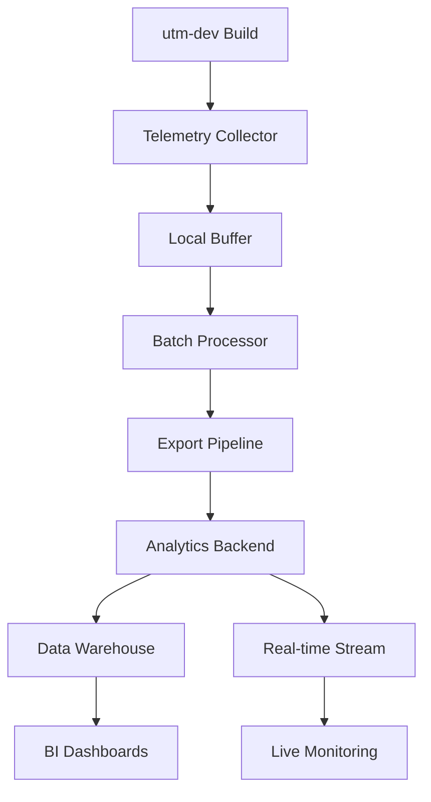

# Observability & Telemetry Exploration

---
location: utm-dev-production
explored_at: 2026-03-21
tags: [observability, telemetry, monitoring, analytics, alerting]
---

## Overview

This exploration covers comprehensive observability and telemetry systems for utm-dev, enabling build analytics, performance monitoring, error reporting, usage metrics, and production alerting.

## Table of Contents

1. [Build Analytics](#build-analytics)
2. [Performance Telemetry](#performance-telemetry)
3. [Error Reporting](#error-reporting)
4. [Usage Metrics](#usage-metrics)
5. [Dashboard Design](#dashboard-design)
6. [Alerting Strategies](#alerting-strategies)

---

## Build Analytics

### Analytics Architecture



### Telemetry Data Model

```rust
// src/telemetry/events.rs
use std::collections::HashMap;
use std::time::{Duration, SystemTime};
use serde::{Deserialize, Serialize};
use uuid::Uuid;

/// Base telemetry event
#[derive(Debug, Clone, Serialize, Deserialize)]
pub struct TelemetryEvent {
    /// Unique event ID
    pub event_id: Uuid,

    /// Event type/name
    pub event_type: EventType,

    /// Event timestamp
    pub timestamp: SystemTime,

    /// Session ID (groups related events)
    pub session_id: String,

    /// User/organization ID (anonymized)
    pub user_id: Option<String>,

    /// Project identifier (anonymized)
    pub project_id: Option<String>,

    /// Event properties
    pub properties: HashMap<String, PropertyValue>,

    /// Context information
    pub context: EventContext,
}

#[derive(Debug, Clone, Serialize, Deserialize)]
pub enum EventType {
    // Build lifecycle events
    BuildStarted,
    BuildCompleted,
    BuildFailed,
    BuildCancelled,

    // Phase events
    PhaseStarted,
    PhaseCompleted,
    PhaseFailed,

    // Performance events
    CacheHit,
    CacheMiss,
    SlowOperation,

    // Error events
    ErrorOccurred,
    WarningOccurred,

    // Usage events
    CommandExecuted,
    PluginLoaded,
    FeatureUsed,
}

#[derive(Debug, Clone, Serialize, Deserialize)]
#[serde(untagged)]
pub enum PropertyValue {
    String(String),
    Number(f64),
    Boolean(bool),
    Array(Vec<PropertyValue>),
    Object(HashMap<String, PropertyValue>),
}

#[derive(Debug, Clone, Serialize, Deserialize)]
pub struct EventContext {
    /// utm-dev version
    pub utm_version: String,

    /// Operating system
    pub os: OsInfo,

    /// Hardware info
    pub hardware: HardwareInfo,

    /// Build configuration
    pub build_config: BuildConfigContext,

    /// Environment variables (opt-in)
    pub environment: HashMap<String, String>,
}

#[derive(Debug, Clone, Serialize, Deserialize)]
pub struct OsInfo {
    pub name: String,
    pub version: String,
    pub arch: String,
    pub kernel: Option<String>,
}

#[derive(Debug, Clone, Serialize, Deserialize)]
pub struct HardwareInfo {
    pub cpu_cores: u32,
    pub memory_gb: u32,
    pub disk_type: Option<DiskType>,
}

#[derive(Debug, Clone, Serialize, Deserialize)]
pub enum DiskType {
    HDD,
    SSD,
    NVMe,
}

#[derive(Debug, Clone, Serialize, Deserialize)]
pub struct BuildConfigContext {
    pub target: Option<String>,
    pub profile: String, // debug/release
    pub features: Vec<String>,
    pub incremental: bool,
    pub parallel_jobs: u32,
}

/// Build-specific event data
#[derive(Debug, Clone, Serialize, Deserialize)]
pub struct BuildEventData {
    /// Build duration
    pub duration_ms: u64,

    /// Total crates compiled
    pub crates_compiled: u32,

    /// Total lines of code
    pub total_loc: u32,

    /// Cache statistics
    pub cache_stats: CacheStats,

    /// Resource utilization
    pub resource_usage: ResourceUsage,

    /// Artifacts produced
    pub artifacts: Vec<ArtifactInfo>,

    /// Errors/warnings count
    pub errors: u32,
    pub warnings: u32,
}

#[derive(Debug, Clone, Serialize, Deserialize)]
pub struct CacheStats {
    pub hits: u32,
    pub misses: u32,
    pub hit_rate: f64,
    pub size_mb: f64,
}

#[derive(Debug, Clone, Serialize, Deserialize)]
pub struct ResourceUsage {
    pub cpu_max_percent: f64,
    pub cpu_avg_percent: f64,
    pub memory_max_mb: u64,
    pub memory_avg_mb: u64,
    pub io_read_mb: f64,
    pub io_write_mb: f64,
}

#[derive(Debug, Clone, Serialize, Deserialize)]
pub struct ArtifactInfo {
    pub name: String,
    pub size_bytes: u64,
    pub artifact_type: String,
}
```

### Telemetry Collector

```rust
// src/telemetry/collector.rs
use std::sync::Arc;
use tokio::sync::mpsc;
use std::time::Duration;

pub struct TelemetryCollector {
    config: TelemetryConfig,
    event_tx: mpsc::Sender<TelemetryEvent>,
    buffer: Arc<tokio::sync::RwLock<Vec<TelemetryEvent>>>,
    shutdown: tokio::sync::Notify,
}

#[derive(Debug, Clone)]
pub struct TelemetryConfig {
    /// Enable/disable telemetry
    pub enabled: bool,

    /// Sample rate (0.0 - 1.0)
    pub sample_rate: f64,

    /// Batch size for exports
    pub batch_size: usize,

    /// Export interval
    pub export_interval: Duration,

    /// Export endpoint
    pub endpoint: Option<String>,

    /// API key for export
    pub api_key: Option<String>,

    /// Anonymize user data
    pub anonymize: bool,

    /// Opt-in for error reporting
    pub error_reporting: bool,
}

impl Default for TelemetryConfig {
    fn default() -> Self {
        Self {
            enabled: true,
            sample_rate: 1.0,
            batch_size: 100,
            export_interval: Duration::from_secs(30),
            endpoint: None,
            api_key: None,
            anonymize: true,
            error_reporting: true,
        }
    }
}

impl TelemetryCollector {
    pub fn new(config: TelemetryConfig) -> Self {
        let (event_tx, mut event_rx) = mpsc::channel(1000);
        let buffer = Arc::new(tokio::sync::RwLock::new(Vec::with_capacity(config.batch_size)));
        let shutdown = Arc::new(tokio::sync::Notify::new());

        // Spawn batch processor
        let processor_buffer = Arc::clone(&buffer);
        let processor_config = config.clone();
        let processor_shutdown = Arc::clone(&shutdown);

        tokio::spawn(async move {
            let mut interval = tokio::time::interval(processor_config.export_interval);

            loop {
                tokio::select! {
                    _ = interval.tick() => {
                        // Flush buffer on interval
                        let events = {
                            let mut buf = processor_buffer.write().await;
                            std::mem::take(&mut *buf)
                        };

                        if !events.is_empty() {
                            export_events(&processor_config, &events).await;
                        }
                    }
                    _ = processor_shutdown.notified() => {
                        // Flush remaining events on shutdown
                        let events = {
                            let mut buf = processor_buffer.write().await;
                            std::mem::take(&mut *buf)
                        };

                        if !events.is_empty() {
                            export_events(&processor_config, &events).await;
                        }
                        break;
                    }
                }
            }
        });

        Self {
            config,
            event_tx,
            buffer,
            shutdown,
        }
    }

    pub fn record_event(&self, event: TelemetryEvent) -> Result<(), TelemetryError> {
        if !self.config.enabled {
            return Ok(());
        }

        // Apply sampling
        if self.config.sample_rate < 1.0 {
            let rand_value = rand::random::<f64>();
            if rand_value > self.config.sample_rate {
                return Ok(());
            }
        }

        self.event_tx
            .try_send(event)
            .map_err(|_| TelemetryError::ChannelFull)?;

        Ok(())
    }

    pub fn record_build_started(&self, build_id: &str, config: &BuildConfig) {
        let event = TelemetryEvent {
            event_id: Uuid::new_v4(),
            event_type: EventType::BuildStarted,
            timestamp: SystemTime::now(),
            session_id: generate_session_id(),
            user_id: self.get_anonymized_user_id(),
            project_id: Some(generate_project_id()),
            properties: HashMap::from([
                ("build_id".to_string(), PropertyValue::String(build_id.to_string())),
                ("target".to_string(), PropertyValue::String(config.target.clone())),
                ("profile".to_string(), PropertyValue::String(config.profile.clone())),
                ("features".to_string(), PropertyValue::Array(
                    config.features.iter()
                        .map(|f| PropertyValue::String(f.clone()))
                        .collect()
                )),
            ]),
            context: self.build_context(config),
        };

        let _ = self.record_event(event);
    }

    pub fn record_build_completed(&self, build_id: &str, data: &BuildEventData) {
        let event = TelemetryEvent {
            event_id: Uuid::new_v4(),
            event_type: EventType::BuildCompleted,
            timestamp: SystemTime::now(),
            session_id: generate_session_id(),
            user_id: self.get_anonymized_user_id(),
            project_id: Some(generate_project_id()),
            properties: HashMap::from([
                ("build_id".to_string(), PropertyValue::String(build_id.to_string())),
                ("duration_ms".to_string(), PropertyValue::Number(data.duration_ms as f64)),
                ("crates_compiled".to_string(), PropertyValue::Number(data.crates_compiled as f64)),
                ("cache_hit_rate".to_string(), PropertyValue::Number(data.cache_stats.hit_rate)),
                ("cpu_max".to_string(), PropertyValue::Number(data.resource_usage.cpu_max_percent)),
                ("memory_max_mb".to_string(), PropertyValue::Number(data.resource_usage.memory_max_mb as f64)),
            ]),
            context: self.build_context(&BuildConfig::default()),
        };

        let _ = self.record_event(event);
    }

    pub fn record_build_failed(&self, build_id: &str, error: &BuildError) {
        if !self.config.error_reporting {
            return;
        }

        let event = TelemetryEvent {
            event_id: Uuid::new_v4(),
            event_type: EventType::BuildFailed,
            timestamp: SystemTime::now(),
            session_id: generate_session_id(),
            user_id: self.get_anonymized_user_id(),
            project_id: Some(generate_project_id()),
            properties: HashMap::from([
                ("build_id".to_string(), PropertyValue::String(build_id.to_string())),
                ("error_type".to_string(), PropertyValue::String(error.type_name())),
                ("error_message".to_string(), PropertyValue::String(error.message.clone())),
            ]),
            context: self.build_context(&BuildConfig::default()),
        };

        let _ = self.record_event(event);
    }

    fn build_context(&self, config: &BuildConfig) -> EventContext {
        EventContext {
            utm_version: env!("CARGO_PKG_VERSION").to_string(),
            os: self.get_os_info(),
            hardware: self.get_hardware_info(),
            build_config: BuildConfigContext {
                target: config.target.clone(),
                profile: config.profile.clone(),
                features: config.features.clone(),
                incremental: config.incremental,
                parallel_jobs: config.parallel_jobs,
            },
            environment: HashMap::new(),
        }
    }

    fn get_anonymized_user_id(&self) -> Option<String> {
        if self.config.anonymize {
            // Generate from machine fingerprint
            None
        } else {
            None
        }
    }

    pub async fn shutdown(self) {
        self.shutdown.notify_one();
    }
}

async fn export_events(config: &TelemetryConfig, events: &[TelemetryEvent]) {
    if let Some(endpoint) = &config.endpoint {
        let client = reqwest::Client::new();

        let payload = serde_json::json!({
            "events": events,
            "api_version": "1.0",
        });

        let mut request = client.post(endpoint)
            .json(&payload);

        if let Some(api_key) = &config.api_key {
            request = request.header("Authorization", format!("Bearer {}", api_key));
        }

        match request.send().await {
            Ok(response) => {
                if response.status().is_success() {
                    tracing::debug!("Exported {} telemetry events", events.len());
                } else {
                    tracing::warn!("Telemetry export failed: {}", response.status());
                }
            }
            Err(e) => {
                tracing::warn!("Telemetry export error: {}", e);
            }
        }
    }
}
```

### Build Analytics Dashboard Data

```rust
// src/analytics/build_metrics.rs
use std::collections::HashMap;

/// Aggregated build metrics for dashboards
pub struct BuildMetrics {
    pub time_series: TimeSeriesMetrics,
    pub breakdowns: MetricBreakdowns,
    pub trends: TrendAnalysis,
    pub anomalies: Vec<Anomaly>,
}

pub struct TimeSeriesMetrics {
    /// Build duration over time
    pub build_duration: Vec<DataPoint>,

    /// Cache hit rate over time
    pub cache_hit_rate: Vec<DataPoint>,

    /// Success rate over time
    pub success_rate: Vec<DataPoint>,

    /// Resource utilization over time
    pub resource_usage: ResourceTimeSeries,
}

pub struct DataPoint {
    pub timestamp: SystemTime,
    pub value: f64,
    pub metadata: HashMap<String, String>,
}

pub struct MetricBreakdowns {
    /// Build duration by target platform
    pub duration_by_target: HashMap<String, DurationStats>,

    /// Build duration by profile
    pub duration_by_profile: HashMap<String, DurationStats>,

    /// Cache performance by module
    pub cache_by_module: HashMap<String, CacheStats>,

    /// Failure reasons distribution
    pub failure_reasons: HashMap<String, u64>,
}

#[derive(Debug, Clone)]
pub struct DurationStats {
    pub count: u64,
    pub min_ms: u64,
    pub max_ms: u64,
    pub avg_ms: f64,
    pub p50_ms: f64,
    pub p95_ms: f64,
    pub p99_ms: f64,
}

pub struct TrendAnalysis {
    /// Build duration trend (improving/degrading/stable)
    pub duration_trend: Trend,

    /// Success rate trend
    pub success_trend: Trend,

    /// Week-over-week change
    pub wow_change: f64,

    /// Month-over-month change
    pub mom_change: f64,
}

pub enum Trend {
    Improving { slope: f64 },
    Degrading { slope: f64 },
    Stable,
}

pub struct Anomaly {
    pub metric: String,
    pub value: f64,
    pub expected: f64,
    pub severity: AnomalySeverity,
    pub detected_at: SystemTime,
}

pub enum AnomalySeverity {
    Low,
    Medium,
    High,
    Critical,
}

/// Metrics aggregator
pub struct MetricsAggregator {
    retention_days: u32,
    data: Arc<RwLock<MetricsData>>,
}

struct MetricsData {
    events: Vec<TelemetryEvent>,
    precomputed: Option<BuildMetrics>,
    last_computed: Option<SystemTime>,
}

impl MetricsAggregator {
    pub fn new(retention_days: u32) -> Self {
        Self {
            retention_days,
            data: Arc::new(RwLock::new(MetricsData {
                events: Vec::new(),
                precomputed: None,
                last_computed: None,
            })),
        }
    }

    pub fn add_event(&self, event: TelemetryEvent) {
        // Add event and trigger recomputation if needed
    }

    pub async fn get_metrics(&self, range: TimeRange) -> BuildMetrics {
        let data = self.data.read().await;

        // Return cached metrics if fresh enough
        if let Some(metrics) = &data.precomputed {
            if let Some(last) = data.last_computed {
                if last.elapsed().unwrap() < Duration::from_secs(60) {
                    return metrics.clone();
                }
            }
        }

        drop(data);

        // Compute fresh metrics
        self.compute_metrics(range).await
    }

    async fn compute_metrics(&self, range: TimeRange) -> BuildMetrics {
        let data = self.data.read().await;

        // Filter events by time range
        let filtered: Vec<_> = data.events.iter()
            .filter(|e| range.contains(e.timestamp))
            .cloned()
            .collect();

        // Aggregate metrics
        BuildMetrics {
            time_series: self.compute_time_series(&filtered),
            breakdowns: self.compute_breakdowns(&filtered),
            trends: self.compute_trends(&filtered),
            anomalies: self.detect_anomalies(&filtered),
        }
    }

    fn compute_time_series(&self, events: &[TelemetryEvent]) -> TimeSeriesMetrics {
        // Group events by time bucket and compute aggregates
        TimeSeriesMetrics {
            build_duration: self.bucket_duration(events),
            cache_hit_rate: self.bucket_cache_hits(events),
            success_rate: self.bucket_success_rate(events),
            resource_usage: ResourceTimeSeries::default(),
        }
    }

    fn detect_anomalies(&self, events: &[TelemetryEvent]) -> Vec<Anomaly> {
        let mut anomalies = Vec::new();

        // Simple z-score based anomaly detection
        let durations: Vec<_> = events.iter()
            .filter_map(|e| match e.event_type {
                EventType::BuildCompleted => {
                    e.properties.get("duration_ms")
                        .and_then(|v| v.as_number())
                }
                _ => None,
            })
            .collect();

        if durations.len() > 10 {
            let mean = durations.iter().sum::<f64>() / durations.len() as f64;
            let std_dev = (durations.iter()
                .map(|v| (v - mean).powi(2))
                .sum::<f64>() / durations.len() as f64).sqrt();

            for (i, &duration) in durations.iter().enumerate() {
                let z_score = (duration - mean) / std_dev;
                if z_score > 3.0 {
                    anomalies.push(Anomaly {
                        metric: "build_duration".to_string(),
                        value: duration,
                        expected: mean,
                        severity: if z_score > 5.0 {
                            AnomalySeverity::Critical
                        } else {
                            AnomalySeverity::High
                        },
                        detected_at: events[i].timestamp,
                    });
                }
            }
        }

        anomalies
    }
}
```

---

## Performance Telemetry

### System Profiler

```rust
// src/telemetry/profiler.rs
use std::time::{Duration, Instant};
use std::sync::Arc;

/// High-resolution system profiler
pub struct SystemProfiler {
    sampling_interval: Duration,
    metrics: Arc<RwLock<ProfilerMetrics>>,
    running: Arc<AtomicBool>,
}

pub struct ProfilerMetrics {
    /// CPU samples
    pub cpu_samples: Vec<CpuSample>,

    /// Memory samples
    pub memory_samples: Vec<MemorySample>,

    /// I/O samples
    pub io_samples: Vec<IoSample>,

    /// Thread samples
    pub thread_samples: Vec<ThreadSample>,

    /// File system samples
    pub fs_samples: Vec<FsSample>,
}

pub struct CpuSample {
    pub timestamp: Instant,
    pub usage_percent: f64,
    pub per_core: Vec<f64>,
    pub load_avg_1m: f64,
    pub load_avg_5m: f64,
    pub load_avg_15m: f64,
}

pub struct MemorySample {
    pub timestamp: Instant,
    pub total_mb: u64,
    pub used_mb: u64,
    pub available_mb: u64,
    pub cached_mb: u64,
    pub utm_process_mb: u64,
}

pub struct IoSample {
    pub timestamp: Instant,
    pub read_bytes_sec: u64,
    pub write_bytes_sec: u64,
    pub read_ops_sec: u64,
    pub write_ops_sec: u64,
    pub io_wait_percent: f64,
}

impl SystemProfiler {
    pub fn new(sampling_interval: Duration) -> Self {
        Self {
            sampling_interval,
            metrics: Arc::new(RwLock::new(ProfilerMetrics {
                cpu_samples: Vec::new(),
                memory_samples: Vec::new(),
                io_samples: Vec::new(),
                thread_samples: Vec::new(),
                fs_samples: Vec::new(),
            })),
            running: Arc::new(AtomicBool::new(false)),
        }
    }

    pub fn start(&self) {
        self.running.store(true, Ordering::SeqCst);

        let metrics = Arc::clone(&self.metrics);
        let running = Arc::clone(&self.running);
        let interval = self.sampling_interval;

        tokio::spawn(async move {
            let mut ticker = tokio::time::interval(interval);

            while running.load(Ordering::SeqCst) {
                ticker.tick().await;

                let sample_time = Instant::now();

                // Collect CPU metrics
                let cpu_sample = CpuSample {
                    timestamp: sample_time,
                    usage_percent: get_cpu_usage(),
                    per_core: get_per_core_usage(),
                    load_avg_1m: get_load_avg_1m(),
                    load_avg_5m: get_load_avg_5m(),
                    load_avg_15m: get_load_avg_15m(),
                };

                // Collect memory metrics
                let mem_info = get_memory_info();
                let memory_sample = MemorySample {
                    timestamp: sample_time,
                    total_mb: mem_info.total / 1024 / 1024,
                    used_mb: mem_info.used / 1024 / 1024,
                    available_mb: mem_info.available / 1024 / 1024,
                    cached_mb: mem_info.cached / 1024 / 1024,
                    utm_process_mb: get_process_memory(),
                };

                // Collect I/O metrics
                let io_sample = collect_io_stats();

                // Store samples
                let mut metrics = metrics.write().await;
                metrics.cpu_samples.push(cpu_sample);
                metrics.memory_samples.push(memory_sample);
                metrics.io_samples.push(io_sample);

                // Trim old samples (keep last 5 minutes)
                let cutoff = sample_time - Duration::from_secs(300);
                metrics.cpu_samples.retain(|s| s.timestamp > cutoff);
                metrics.memory_samples.retain(|s| s.timestamp > cutoff);
                metrics.io_samples.retain(|s| s.timestamp > cutoff);
            }
        });
    }

    pub fn stop(&self) {
        self.running.store(false, Ordering::SeqCst);
    }

    pub async fn get_current_metrics(&self) -> ProfilerMetrics {
        self.metrics.read().await.clone()
    }

    pub async fn get_peak_memory(&self) -> u64 {
        self.metrics.read().await.memory_samples.iter()
            .map(|s| s.utm_process_mb)
            .max()
            .unwrap_or(0)
    }

    pub async fn get_avg_cpu(&self) -> f64 {
        let metrics = self.metrics.read().await;
        if metrics.cpu_samples.is_empty() {
            return 0.0;
        }

        metrics.cpu_samples.iter()
            .map(|s| s.usage_percent)
            .sum::<f64>() / metrics.cpu_samples.len() as f64
    }
}

/// Build phase profiler
pub struct BuildPhaseProfiler {
    phases: HashMap<String, PhaseMetrics>,
    current_phase: Option<(String, Instant)>,
}

pub struct PhaseMetrics {
    pub name: String,
    pub samples: Vec<PhaseSample>,
}

pub struct PhaseSample {
    pub duration: Duration,
    pub cpu_percent: f64,
    pub memory_mb: u64,
    pub io_read_mb: f64,
    pub io_write_mb: f64,
}

impl BuildPhaseProfiler {
    pub fn new() -> Self {
        Self {
            phases: HashMap::new(),
            current_phase: None,
        }
    }

    pub fn start_phase(&mut self, name: &str, profiler: &SystemProfiler) {
        self.current_phase = Some((name.to_string(), Instant::now()));

        // Record starting metrics
        let start_metrics = tokio::runtime::Handle::current()
            .block_on(profiler.get_current_metrics());

        // Store for later comparison
    }

    pub fn end_phase(&mut self, profiler: &SystemProfiler) -> PhaseMetrics {
        if let Some((name, start_time)) = self.current_phase.take() {
            let duration = start_time.elapsed();

            // Get ending metrics
            let end_metrics = tokio::runtime::Handle::current()
                .block_on(profiler.get_current_metrics());

            // Calculate phase averages
            let phase_metrics = PhaseMetrics {
                name: name.clone(),
                samples: vec![PhaseSample {
                    duration,
                    cpu_percent: end_metrics.cpu_samples.last()
                        .map(|s| s.usage_percent)
                        .unwrap_or(0.0),
                    memory_mb: end_metrics.memory_samples.last()
                        .map(|s| s.utm_process_mb)
                        .unwrap_or(0),
                    io_read_mb: end_metrics.io_samples.last()
                        .map(|s| s.read_bytes_sec as f64 / 1024.0 / 1024.0)
                        .unwrap_or(0.0),
                    io_write_mb: end_metrics.io_samples.last()
                        .map(|s| s.write_bytes_sec as f64 / 1024.0 / 1024.0)
                        .unwrap_or(0.0),
                }],
            };

            self.phases.insert(name, phase_metrics.clone());
            phase_metrics
        } else {
            PhaseMetrics {
                name: String::new(),
                samples: Vec::new(),
            }
        }
    }

    pub fn get_phase_summary(&self) -> Vec<PhaseMetrics> {
        self.phases.values().cloned().collect()
    }
}
```

### Flame Graph Integration

```rust
// src/telemetry/flamegraph.rs
use std::collections::HashMap;
use std::fs::File;
use std::io::Write;

/// Stack sample for flame graph generation
pub struct StackSample {
    pub timestamp: Instant,
    pub stack: Vec<StackFrame>,
    pub thread_id: u64,
    pub cpu_time_ns: u64,
}

pub struct StackFrame {
    pub function: String,
    pub file: Option<String>,
    pub line: Option<u32>,
    pub module: Option<String>,
}

/// Flame graph generator
pub struct FlameGraphGenerator {
    samples: Vec<StackSample>,
    root: FrameNode,
}

struct FrameNode {
    name: String,
    self_time: u64,
    total_time: u64,
    children: HashMap<String, FrameNode>,
}

impl FlameGraphGenerator {
    pub fn new() -> Self {
        Self {
            samples: Vec::new(),
            root: FrameNode {
                name: "root".to_string(),
                self_time: 0,
                total_time: 0,
                children: HashMap::new(),
            },
        }
    }

    pub fn add_sample(&mut self, sample: StackSample) {
        self.samples.push(sample);
        self.process_sample(sample);
    }

    fn process_sample(&mut self, sample: StackSample) {
        let mut current = &mut self.root;
        current.total_time += sample.cpu_time_ns;

        for frame in &sample.stack {
            current = current.children
                .entry(frame.function.clone())
                .or_insert_with(|| FrameNode {
                    name: frame.function.clone(),
                    self_time: 0,
                    total_time: 0,
                    children: HashMap::new(),
                });

            current.total_time += sample.cpu_time_ns;
        }

        // Add to self time of leaf
        if let Some(leaf) = sample.stack.last() {
            let leaf_node = self.root.children.get_mut(&leaf.function).unwrap();
            leaf_node.self_time += sample.cpu_time_ns;
        }
    }

    pub fn generate_svg(&self, output: &Path) -> Result<(), std::io::Error> {
        // Generate SVG flame graph using inferno or custom implementation
        use inferno::flamegraph;

        let mut frames = Vec::new();
        self.collect_frames(&self.root, &mut Vec::new(), &mut frames);

        let mut file = File::create(output)?;
        let mut options = flamegraph::Options::default();
        options.title = "utm-dev Build Profile".to_string();
        options.count_name = "CPU Time (ns)".to_string();

        flamegraph::from_lines(&mut options, frames.iter().map(|s| s.as_str()), &mut file)
            .map_err(|e| std::io::Error::new(std::io::ErrorKind::Other, e))?;

        Ok(())
    }

    fn collect_frames(&self, node: &FrameNode, stack: &mut Vec<String>, frames: &mut Vec<String>) {
        if node.name != "root" {
            let stack_str = stack.join(";");
            frames.push(format!("{} {}", stack_str, node.self_time));
        }

        stack.push(node.name.clone());

        for child in node.children.values() {
            self.collect_frames(child, stack, frames);
        }

        stack.pop();
    }
}

/// Sampling profiler wrapper (uses perfcnt on Linux, Instruments on macOS)
pub struct SamplingProfiler {
    sample_rate_hz: u32,
    running: Arc<AtomicBool>,
}

impl SamplingProfiler {
    pub fn new(sample_rate_hz: u32) -> Self {
        Self {
            sample_rate_hz,
            running: Arc::new(AtomicBool::new(false)),
        }
    }

    pub fn start(&self, output: &Path) -> Result<(), ProfilerError> {
        #[cfg(target_os = "linux")]
        {
            // Use perf on Linux
            let interval_us = 1_000_000 / self.sample_rate_hz;
            std::process::Command::new("perf")
                .args(&[
                    "record",
                    "-F",
                    &self.sample_rate_hz.to_string(),
                    "-a",
                    "-g",
                    "--",
                ])
                .spawn()?;
        }

        #[cfg(target_os = "macos")]
        {
            // Use Instruments on macOS
            std::process::Command::new("instruments")
                .args(&[
                    "-t",
                    "Time Profiler",
                    "-o",
                    output.to_str().unwrap(),
                ])
                .spawn()?;
        }

        self.running.store(true, Ordering::SeqCst);
        Ok(())
    }

    pub fn stop(&self) {
        self.running.store(false, Ordering::SeqCst);

        #[cfg(target_os = "linux")]
        {
            std::process::Command::new("perf").arg("stop").spawn().ok();
        }
    }
}
```

---

## Error Reporting

### Error Tracking System

```rust
// src/telemetry/errors.rs
use backtrace::Backtrace;
use std::collections::HashMap;

/// Error report for tracking
#[derive(Debug, Clone)]
pub struct ErrorReport {
    pub error_id: Uuid,
    pub error_type: String,
    pub message: String,
    pub backtrace: String,
    pub timestamp: SystemTime,
    pub context: ErrorContext,
    pub fingerprint: String,
    pub severity: ErrorSeverity,
}

#[derive(Debug, Clone)]
pub struct ErrorContext {
    pub build_id: Option<String>,
    pub command: Option<String>,
    pub arguments: Vec<String>,
    pub environment: HashMap<String, String>,
    pub recent_operations: Vec<OperationInfo>,
}

pub struct OperationInfo {
    pub operation: String,
    pub duration_ms: Option<u64>,
    pub success: bool,
}

#[derive(Debug, Clone, Copy, PartialEq)]
pub enum ErrorSeverity {
    Debug,
    Info,
    Warning,
    Error,
    Fatal,
}

/// Error tracker
pub struct ErrorTracker {
    config: ErrorTrackerConfig,
    pending_reports: Arc<RwLock<Vec<ErrorReport>>>,
    rate_limiter: RateLimiter,
}

#[derive(Debug, Clone)]
pub struct ErrorTrackerConfig {
    pub enabled: bool,
    pub dsn: Option<String>,
    pub environment: String,
    pub release: String,
    pub sample_rate: f64,
    pub max_pending: usize,
    pub include_backtrace: bool,
}

impl ErrorTracker {
    pub fn new(config: ErrorTrackerConfig) -> Self {
        Self {
            config,
            pending_reports: Arc::new(RwLock::new(Vec::new())),
            rate_limiter: RateLimiter::new(10, Duration::from_secs(60)), // 10 errors per minute
        }
    }

    pub fn capture_error(
        &self,
        error: &dyn std::error::Error,
        context: ErrorContext,
        severity: ErrorSeverity,
    ) -> Option<Uuid> {
        if !self.config.enabled {
            return None;
        }

        // Rate limiting
        if !self.rate_limiter.allow() {
            return None;
        }

        // Sampling
        if self.config.sample_rate < 1.0 && rand::random::<f64>() > self.config.sample_rate {
            return None;
        }

        let backtrace = if self.config.include_backtrace {
            format!("{:?}", Backtrace::new())
        } else {
            String::new()
        };

        let fingerprint = self.generate_fingerprint(error, &context);

        let report = ErrorReport {
            error_id: Uuid::new_v4(),
            error_type: std::any::type_name_of_val(error).to_string(),
            message: error.to_string(),
            backtrace,
            timestamp: SystemTime::now(),
            fingerprint,
            severity,
            context,
        };

        let report_id = report.error_id;

        // Store pending report
        let mut pending = self.pending_reports.blocking_write();
        pending.push(report);

        if pending.len() >= self.config.max_pending {
            // Flush oldest reports
            self.flush_reports();
        }

        Some(report_id)
    }

    pub fn capture_build_error(
        &self,
        error: &BuildError,
        build_id: &str,
        severity: ErrorSeverity,
    ) -> Option<Uuid> {
        self.capture_error(
            error,
            ErrorContext {
                build_id: Some(build_id.to_string()),
                command: None,
                arguments: Vec::new(),
                environment: std::env::vars().collect(),
                recent_operations: Vec::new(),
            },
            severity,
        )
    }

    fn generate_fingerprint(&self, error: &dyn std::error::Error, context: &ErrorContext) -> String {
        use sha2::{Sha256, Digest};

        let mut hasher = Sha256::new();
        hasher.update(std::any::type_name_of_val(error).as_bytes());
        hasher.update(error.to_string().as_bytes());

        // Group by error type and location, not by unique data
        if let Some(build_id) = &context.build_id {
            // Don't include build_id in fingerprint to allow grouping
        }

        format!("{:x}", hasher.finalize())
    }

    async fn flush_reports(&self) {
        let reports = {
            let mut pending = self.pending_reports.write().await;
            std::mem::take(&mut *pending)
        };

        if let Some(dsn) = &self.config.dsn {
            let client = reqwest::Client::new();

            for report in reports {
                let payload = serde_json::json!({
                    "event_id": report.error_id.to_string(),
                    "level": match report.severity {
                        ErrorSeverity::Debug => "debug",
                        ErrorSeverity::Info => "info",
                        ErrorSeverity::Warning => "warning",
                        ErrorSeverity::Error => "error",
                        ErrorSeverity::Fatal => "fatal",
                    },
                    "exception": {
                        "type": report.error_type,
                        "value": report.message,
                        "stacktrace": report.backtrace,
                    },
                    "fingerprint": [report.fingerprint],
                    "timestamp": format!("{:?}", report.timestamp),
                    "environment": self.config.environment,
                    "release": self.config.release,
                    "contexts": {
                        "build": {
                            "build_id": report.context.build_id,
                        }
                    },
                });

                let _ = client.post(dsn).json(&payload).send().await;
            }
        }
    }
}

/// Rate limiter for error reporting
struct RateLimiter {
    max_events: u32,
    window: Duration,
    events: Arc<Mutex<Vec<Instant>>>,
}

impl RateLimiter {
    fn new(max_events: u32, window: Duration) -> Self {
        Self {
            max_events,
            window,
            events: Arc::new(Mutex::new(Vec::new())),
        }
    }

    fn allow(&self) -> bool {
        let now = Instant::now();
        let cutoff = now - self.window;

        let mut events = self.events.lock().unwrap();
        events.retain(|&t| t > cutoff);

        if events.len() < self.max_events as usize {
            events.push(now);
            true
        } else {
            false
        }
    }
}
```

### Panic Hook Integration

```rust
// src/telemetry/panic.rs
use std::panic;
use std::sync::Once;

static PANIC_HOOK_INIT: Once = Once::new();

pub fn setup_panic_hook(error_tracker: Arc<ErrorTracker>) {
    PANIC_HOOK_INIT.call_once(|| {
        let default_hook = panic::take_hook();

        panic::set_hook(Box::new(move |panic_info| {
            // Call default hook first (prints to stderr)
            default_hook(panic_info);

            // Capture panic in error tracker
            let message = if let Some(s) = panic_info.payload().downcast_ref::<&str>() {
                s.to_string()
            } else if let Some(s) = panic_info.payload().downcast_ref::<String>() {
                s.clone()
            } else {
                "Unknown panic".to_string()
            };

            let location = panic_info.location()
                .map(|l| format!("{}:{}:{}", l.file(), l.line(), l.column()))
                .unwrap_or_else(|| "unknown".to_string());

            let context = ErrorContext {
                build_id: None,
                command: std::env::args().next(),
                arguments: std::env::args().skip(1).collect(),
                environment: std::env::vars().collect(),
                recent_operations: Vec::new(),
            };

            error_tracker.capture_error(
                &PanicError { message, location },
                context,
                ErrorSeverity::Fatal,
            );
        }));
    });
}

#[derive(Debug)]
struct PanicError {
    message: String,
    location: String,
}

impl std::fmt::Display for PanicError {
    fn fmt(&self, f: &mut std::fmt::Formatter<'_>) -> std::fmt::Result {
        write!(f, "Panic at {}: {}", self.location, self.message)
    }
}

impl std::error::Error for PanicError {}
```

---

## Usage Metrics

### Command Tracking

```rust
// src/telemetry/usage.rs
use std::collections::HashMap;

/// Usage event types
#[derive(Debug, Clone, Serialize, Deserialize)]
pub enum UsageEventType {
    CommandInvoked,
    FeatureUsed,
    PluginLoaded,
    ConfigurationChanged,
    ProjectCreated,
    BuildTargetChanged,
}

/// Usage event
#[derive(Debug, Clone, Serialize, Deserialize)]
pub struct UsageEvent {
    pub event_type: UsageEventType,
    pub event_name: String,
    pub timestamp: SystemTime,
    pub session_id: String,
    pub properties: HashMap<String, PropertyValue>,
    pub user_tier: UserTier,
}

#[derive(Debug, Clone, Serialize, Deserialize)]
pub enum UserTier {
    Free,
    Pro,
    Enterprise,
}

/// Usage aggregator for analytics
pub struct UsageAggregator {
    events: Vec<UsageEvent>,
    daily_stats: HashMap<String, DailyStats>,
}

#[derive(Debug, Clone, Default)]
pub struct DailyStats {
    pub date: String,
    pub total_commands: u64,
    pub unique_users: u64,
    pub commands_by_type: HashMap<String, u64>,
    pub features_used: HashMap<String, u64>,
    pub avg_session_duration: Duration,
}

impl UsageAggregator {
    pub fn new() -> Self {
        Self {
            events: Vec::new(),
            daily_stats: HashMap::new(),
        }
    }

    pub fn record_command(&mut self, command: &str, args: &[String], duration: Duration) {
        let event = UsageEvent {
            event_type: UsageEventType::CommandInvoked,
            event_name: command.to_string(),
            timestamp: SystemTime::now(),
            session_id: generate_session_id(),
            properties: HashMap::from([
                ("arguments_count".to_string(), PropertyValue::Number(args.len() as f64)),
                ("duration_ms".to_string(), PropertyValue::Number(duration.as_millis() as f64)),
            ]),
            user_tier: self.detect_user_tier(),
        };

        self.events.push(event);
        self.update_daily_stats(command, duration);
    }

    pub fn record_feature_used(&mut self, feature: &str) {
        let event = UsageEvent {
            event_type: UsageEventType::FeatureUsed,
            event_name: feature.to_string(),
            timestamp: SystemTime::now(),
            session_id: generate_session_id(),
            properties: HashMap::new(),
            user_tier: self.detect_user_tier(),
        };

        self.events.push(event);
    }

    fn update_daily_stats(&mut self, command: &str, duration: Duration) {
        let today = chrono::Utc::now().format("%Y-%m-%d").to_string();

        let stats = self.daily_stats.entry(today.clone()).or_default();
        stats.date = today;
        stats.total_commands += 1;

        *stats.commands_by_type.entry(command.to_string()).or_insert(0) += 1;
    }

    pub fn get_usage_summary(&self, days: u32) -> UsageSummary {
        let cutoff = chrono::Utc::now() - chrono::Duration::days(days as i64);

        let filtered: Vec<_> = self.events.iter()
            .filter(|e| e.timestamp > cutoff.into())
            .collect();

        UsageSummary {
            total_events: filtered.len() as u64,
            commands_by_type: self.aggregate_commands(&filtered),
            features_used: self.aggregate_features(&filtered),
            daily_active_users: self.calculate_dau(&filtered),
        }
    }
}

#[derive(Debug, Default)]
pub struct UsageSummary {
    pub total_events: u64,
    pub commands_by_type: HashMap<String, u64>,
    pub features_used: HashMap<String, u64>,
    pub daily_active_users: Vec<(String, u64)>,
}
```

### Privacy Controls

```rust
// src/telemetry/privacy.rs
use sha2::{Sha256, Digest};

/// Privacy configuration
#[derive(Debug, Clone)]
pub struct PrivacyConfig {
    /// Completely disable telemetry
    pub disabled: bool,

    /// Anonymize user identifiers
    pub anonymize_user: bool,

    /// Anonymize project paths
    pub anonymize_paths: bool,

    /// Exclude sensitive environment variables
    pub filter_env: bool,

    /// Exclude command arguments
    pub exclude_args: bool,

    /// Hash values instead of plaintext
    pub hash_values: bool,

    /// Salt for hashing
    pub salt: String,
}

impl Default for PrivacyConfig {
    fn default() -> Self {
        Self {
            disabled: false,
            anonymize_user: true,
            anonymize_paths: true,
            filter_env: true,
            exclude_args: false,
            hash_values: false,
            salt: "utm-default-salt".to_string(),
        }
    }
}

/// Data anonymizer
pub struct DataAnonymizer {
    config: PrivacyConfig,
}

impl DataAnonymizer {
    pub fn new(config: PrivacyConfig) -> Self {
        Self { config }
    }

    pub fn anonymize_user_id(&self, user_id: &str) -> String {
        if self.config.anonymize_user {
            self.hash_value(user_id)
        } else {
            user_id.to_string()
        }
    }

    pub fn anonymize_path(&self, path: &Path) -> String {
        if self.config.anonymize_paths {
            let path_str = path.to_string_lossy();
            let hash = self.hash_value(&path_str);

            // Keep file extension
            if let Some(ext) = path.extension() {
                format!("{}.{ext}", hash)
            } else {
                hash
            }
        } else {
            path.to_string_lossy().to_string()
        }
    }

    pub fn filter_env_vars(&self, vars: HashMap<String, String>) -> HashMap<String, String> {
        if !self.config.filter_env {
            return vars;
        }

        let sensitive_patterns = [
            "PASSWORD", "SECRET", "TOKEN", "KEY", "CREDENTIAL",
            "PRIVATE", "API_KEY", "AUTH", "BEARER",
        ];

        vars.into_iter()
            .filter(|(k, _)| {
                !sensitive_patterns.iter().any(|p| k.to_uppercase().contains(p))
            })
            .collect()
    }

    pub fn anonymize_event(&self, mut event: TelemetryEvent) -> TelemetryEvent {
        if self.config.anonymize_user {
            if let Some(user_id) = &event.user_id {
                event.user_id = Some(self.hash_value(user_id));
            }
        }

        if self.config.anonymize_paths {
            for prop in event.properties.values_mut() {
                if let PropertyValue::String(s) = prop {
                    if s.starts_with('/') || s.contains('\\') {
                        *prop = PropertyValue::String(self.anonymize_path(Path::new(s)));
                    }
                }
            }
        }

        if self.config.filter_env {
            if let Some(env) = event.context.environment.get_mut() {
                let filtered = self.filter_env_vars(std::mem::take(env));
                *env = filtered;
            }
        }

        event
    }

    fn hash_value(&self, value: &str) -> String {
        if self.config.hash_values {
            let mut hasher = Sha256::new();
            hasher.update(&self.config.salt);
            hasher.update(value);
            format!("{:x}", hasher.finalize())[..16].to_string()
        } else {
            value.to_string()
        }
    }
}

/// Telemetry consent management
pub struct ConsentManager {
    config_path: PathBuf,
}

impl ConsentManager {
    pub fn new(config_path: PathBuf) -> Self {
        Self { config_path }
    }

    pub fn get_consent(&self) -> Result<ConsentStatus, ConsentError> {
        if !self.config_path.exists() {
            return Ok(ConsentStatus::NotAsked);
        }

        let content = std::fs::read_to_string(&self.config_path)?;
        let consent: ConsentData = serde_json::from_str(&content)?;

        if consent.withdrawn {
            Ok(ConsentStatus::Withdrawn)
        } else if consent.granted {
            Ok(ConsentStatus::Granted)
        } else {
            Ok(ConsentStatus::Denied)
        }
    }

    pub fn set_consent(&self, granted: bool) -> Result<(), ConsentError> {
        let consent = ConsentData {
            granted,
            withdrawn: !granted,
            granted_at: Some(SystemTime::now()),
            version: "1.0".to_string(),
        };

        std::fs::create_dir_all(self.config_path.parent().unwrap())?;
        std::fs::write(&self.config_path, serde_json::to_string_pretty(&consent)?)?;

        Ok(())
    }

    pub fn withdraw_consent(&self) -> Result<(), ConsentError> {
        self.set_consent(false)
    }
}

#[derive(Debug, Clone, Serialize, Deserialize)]
struct ConsentData {
    granted: bool,
    withdrawn: bool,
    granted_at: Option<SystemTime>,
    version: String,
}

#[derive(Debug, Clone, PartialEq)]
pub enum ConsentStatus {
    NotAsked,
    Granted,
    Denied,
    Withdrawn,
}
```

---

## Dashboard Design

### Dashboard Components

```typescript
// Dashboard specification for web-based analytics

// Build Overview Dashboard
const buildOverviewDashboard = {
  title: "Build Overview",
  refresh_interval: 30000, // 30 seconds

  panels: [
    {
      id: "build-status",
      type: "status-card",
      title: "Current Build Status",
      position: { x: 0, y: 0, w: 3, h: 2 },
      query: "latest_build_status",
      thresholds: {
        success: "#22c55e",
        warning: "#f59e0b",
        error: "#ef4444",
      },
    },
    {
      id: "build-duration",
      type: "time-series",
      title: "Build Duration (24h)",
      position: { x: 3, y: 0, w: 6, h: 4 },
      query: `
        SELECT timestamp, duration_ms
        FROM builds
        WHERE timestamp > now() - INTERVAL '24 hours'
        ORDER BY timestamp
      `,
      options: {
        show_legend: true,
        show_points: false,
        fill_opacity: 0.1,
        line_width: 2,
      },
    },
    {
      id: "success-rate",
      type: "gauge",
      title: "Success Rate (7d)",
      position: { x: 9, y: 0, w: 3, h: 4 },
      query: `
        SELECT
          (COUNT(CASE WHEN status = 'success' THEN 1 END) * 100.0 / COUNT(*)) AS rate
        FROM builds
        WHERE timestamp > now() - INTERVAL '7 days'
      `,
      thresholds: [
        { value: 0, color: "#ef4444" },
        { value: 80, color: "#f59e0b" },
        { value: 95, color: "#22c55e" },
      ],
    },
    {
      id: "cache-hit-rate",
      type: "stat",
      title: "Cache Hit Rate",
      position: { x: 0, y: 2, w: 2, h: 2 },
      query: `
        SELECT AVG(cache_hit_rate) FROM builds
        WHERE timestamp > now() - INTERVAL '24 hours'
      `,
      format: "percent",
      decimals: 1,
    },
    {
      id: "avg-build-time",
      type: "stat",
      title: "Avg Build Time",
      position: { x: 2, y: 2, w: 2, h: 2 },
      query: `
        SELECT AVG(duration_ms) FROM builds
        WHERE timestamp > now() - INTERVAL '24 hours'
      `,
      format: "duration",
    },
    {
      id: "builds-today",
      type: "stat",
      title: "Builds Today",
      position: { x: 4, y: 4, w: 2, h: 2 },
      query: `
        SELECT COUNT(*) FROM builds
        WHERE DATE(timestamp) = CURRENT_DATE
      `,
    },
  ],
};

// Performance Analysis Dashboard
const performanceDashboard = {
  title: "Performance Analysis",
  panels: [
    {
      id: "phase-breakdown",
      type: "pie-chart",
      title: "Build Phase Duration",
      query: `
        SELECT phase_name, SUM(duration_ms) as total
        FROM build_phases
        WHERE timestamp > now() - INTERVAL '7 days'
        GROUP BY phase_name
      `,
    },
    {
      id: "slowest-crates",
      type: "table",
      title: "Slowest Compiling Crates",
      query: `
        SELECT crate_name, AVG(duration_ms) as avg_time, COUNT(*) as builds
        FROM crate_compilations
        WHERE timestamp > now() - INTERVAL '7 days'
        GROUP BY crate_name
        ORDER BY avg_time DESC
        LIMIT 20
      `,
      columns: [
        { field: "crate_name", header: "Crate" },
        { field: "avg_time", header: "Avg Time", format: "duration" },
        { field: "builds", header: "Build Count" },
      ],
    },
    {
      id: "resource-usage",
      type: "time-series",
      title: "Resource Utilization",
      queries: [
        { name: "CPU %", query: "SELECT AVG(cpu_percent) FROM resource_samples GROUP BY time_bucket" },
        { name: "Memory MB", query: "SELECT AVG(memory_mb) FROM resource_samples GROUP BY time_bucket" },
      ],
      y_axes: [
        { id: "cpu", label: "CPU %", min: 0, max: 100 },
        { id: "memory", label: "Memory (MB)", min: 0 },
      ],
    },
  ],
};
```

### SQL Schema for Analytics

```sql
-- Analytics database schema

-- Builds table
CREATE TABLE builds (
    id UUID PRIMARY KEY,
    session_id VARCHAR(64),
    user_id VARCHAR(64),
    project_id VARCHAR(64),
    status VARCHAR(16),
    target VARCHAR(64),
    profile VARCHAR(32),
    features JSONB,
    started_at TIMESTAMPTZ,
    completed_at TIMESTAMPTZ,
    duration_ms BIGINT,
    cache_hits INTEGER,
    cache_misses INTEGER,
    cache_hit_rate DOUBLE PRECISION,
    total_crates INTEGER,
    total_loc INTEGER,
    errors_count INTEGER,
    warnings_count INTEGER,
    cpu_max_percent DOUBLE PRECISION,
    memory_max_mb BIGINT,
    io_read_mb DOUBLE PRECISION,
    io_write_mb DOUBLE PRECISION,
    created_at TIMESTAMPTZ DEFAULT NOW()
);

-- Build phases
CREATE TABLE build_phases (
    id UUID PRIMARY KEY,
    build_id UUID REFERENCES builds(id),
    phase_name VARCHAR(64),
    duration_ms BIGINT,
    cpu_percent DOUBLE PRECISION,
    memory_mb BIGINT,
    started_at TIMESTAMPTZ,
    completed_at TIMESTAMPTZ
);

-- Crate compilations
CREATE TABLE crate_compilations (
    id UUID PRIMARY KEY,
    build_id UUID REFERENCES builds(id),
    crate_name VARCHAR(256),
    duration_ms BIGINT,
    cache_hit BOOLEAN,
    optimization_level INTEGER,
    codegen_units INTEGER
);

-- Errors
CREATE TABLE build_errors (
    id UUID PRIMARY KEY,
    build_id UUID REFERENCES builds(id),
    error_type VARCHAR(128),
    error_message TEXT,
    error_fingerprint VARCHAR(64),
    file_path TEXT,
    line_number INTEGER,
    column_number INTEGER,
    severity VARCHAR(16),
    backtrace TEXT,
    created_at TIMESTAMPTZ DEFAULT NOW()
);

-- Resource samples (time series)
CREATE TABLE resource_samples (
    build_id UUID REFERENCES builds(id),
    timestamp TIMESTAMPTZ,
    cpu_percent DOUBLE PRECISION,
    memory_mb BIGINT,
    io_read_bytes_sec BIGINT,
    io_write_bytes_sec BIGINT,
    thread_count INTEGER
);

-- Usage events
CREATE TABLE usage_events (
    id UUID PRIMARY KEY,
    event_type VARCHAR(64),
    event_name VARCHAR(256),
    session_id VARCHAR(64),
    user_id VARCHAR(64),
    properties JSONB,
    created_at TIMESTAMPTZ DEFAULT NOW()
);

-- Indexes for common queries
CREATE INDEX idx_builds_status ON builds(status);
CREATE INDEX idx_builds_started_at ON builds(started_at);
CREATE INDEX idx_builds_user_id ON builds(user_id);
CREATE INDEX idx_errors_fingerprint ON build_errors(error_fingerprint);
CREATE INDEX idx_resource_samples_timestamp ON resource_samples(timestamp);
CREATE INDEX idx_usage_events_type ON usage_events(event_type);
CREATE INDEX idx_usage_events_created ON usage_events(created_at);

-- Continuous aggregates (TimescaleDB)
SELECT create_hypertable('resource_samples', 'timestamp');
SELECT create_hypertable('builds', 'started_at');

CREATE MATERIALIZED VIEW build_stats_daily
WITH (timescaledb.continuous) AS
SELECT
    time_bucket('1 day', started_at) AS day,
    COUNT(*) AS total_builds,
    AVG(duration_ms) AS avg_duration,
    AVG(cache_hit_rate) AS avg_cache_rate,
    (COUNT(CASE WHEN status = 'success' THEN 1 END) * 100.0 / COUNT(*)) AS success_rate
FROM builds
GROUP BY day;
```

---

## Alerting Strategies

### Alert Configuration

```rust
// src/telemetry/alerts.rs
use std::time::Duration;

/// Alert rule definition
#[derive(Debug, Clone)]
pub struct AlertRule {
    pub id: String,
    pub name: String,
    pub description: String,
    pub condition: AlertCondition,
    pub severity: AlertSeverity,
    pub cooldown: Duration,
    pub notification_channels: Vec<NotificationChannel>,
}

#[derive(Debug, Clone)]
pub enum AlertCondition {
    /// Threshold-based alert
    Threshold {
        metric: String,
        operator: ThresholdOperator,
        value: f64,
        for_duration: Duration,
    },

    /// Rate of change alert
    RateOfChange {
        metric: String,
        increase_percent: f64,
        window: Duration,
    },

    /// Anomaly detection alert
    Anomaly {
        metric: String,
        sensitivity: f64,
        baseline_window: Duration,
    },

    /// Absence detection (no data)
    Absence {
        metric: String,
        timeout: Duration,
    },
}

#[derive(Debug, Clone)]
pub enum ThresholdOperator {
    GreaterThan,
    GreaterThanOrEqual,
    LessThan,
    LessThanOrEqual,
    Equal,
}

#[derive(Debug, Clone, Copy, PartialEq)]
pub enum AlertSeverity {
    Critical,
    High,
    Medium,
    Low,
    Info,
}

#[derive(Debug, Clone)]
pub enum NotificationChannel {
    Slack { webhook_url: String, channel: String },
    Email { recipients: Vec<String> },
    PagerDuty { routing_key: String },
    Webhook { url: String, headers: HashMap<String, String> },
}

/// Alert evaluator
pub struct AlertEvaluator {
    rules: Vec<AlertRule>,
    alert_state: HashMap<String, AlertState>,
}

struct AlertState {
    last_triggered: Option<Instant>,
    is_firing: bool,
    current_value: Option<f64>,
    for_start: Option<Instant>,
}

impl AlertEvaluator {
    pub fn new(rules: Vec<AlertRule>) -> Self {
        Self {
            rules,
            alert_state: HashMap::new(),
        }
    }

    pub async fn evaluate(&mut self, metrics: &MetricsStore) -> Vec<Alert> {
        let mut alerts = Vec::new();

        for rule in &self.rules {
            match self.evaluate_rule(rule, metrics).await {
                Some(alert) => alerts.push(alert),
                None => {}
            }
        }

        alerts
    }

    async fn evaluate_rule(&mut self, rule: &AlertRule, metrics: &MetricsStore) -> Option<Alert> {
        let state = self.alert_state.entry(rule.id.clone()).or_insert(AlertState {
            last_triggered: None,
            is_firing: false,
            current_value: None,
            for_start: None,
        });

        // Check cooldown
        if let Some(last) = state.last_triggered {
            if last.elapsed() < rule.cooldown {
                return None;
            }
        }

        // Get metric value
        let value = self.get_metric_value(&rule.condition, metrics).await?;
        state.current_value = Some(value);

        // Evaluate condition
        let should_fire = match &rule.condition {
            AlertCondition::Threshold { operator, value: threshold, for_duration, .. } => {
                let passes = match operator {
                    ThresholdOperator::GreaterThan => value > *threshold,
                    ThresholdOperator::GreaterThanOrEqual => value >= *threshold,
                    ThresholdOperator::LessThan => value < *threshold,
                    ThresholdOperator::LessThanOrEqual => value <= *threshold,
                    ThresholdOperator::Equal => (value - threshold).abs() < 0.001,
                };

                if passes {
                    if for_duration.is_zero() {
                        true
                    } else if state.for_start.is_none() {
                        state.for_start = Some(Instant::now());
                        false
                    } else {
                        state.for_start.unwrap().elapsed() >= *for_duration
                    }
                } else {
                    state.for_start = None;
                    false
                }
            }

            AlertCondition::RateOfChange { increase_percent, window } => {
                // Compare current value to value window ago
                let previous = metrics.get_historical(&rule.condition.metric(), *window).await?;
                let change = ((value - previous) / previous) * 100.0;
                change > *increase_percent
            }

            AlertCondition::Anomaly { sensitivity, baseline_window } => {
                // Statistical anomaly detection
                let (mean, std_dev) = metrics.get_stats(&rule.condition.metric(), *baseline_window).await?;
                let z_score = (value - mean) / std_dev;
                z_score > *sensitivity
            }

            AlertCondition::Absence { timeout } => {
                // Check if metric is missing
                metrics.is_missing(&rule.condition.metric(), *timeout).await
            }
        };

        if should_fire && !state.is_firing {
            state.is_firing = true;
            state.last_triggered = Some(Instant::now());

            Some(Alert {
                rule_id: rule.id.clone(),
                rule_name: rule.name.clone(),
                severity: rule.severity,
                value,
                triggered_at: SystemTime::now(),
                notification_channels: rule.notification_channels.clone(),
            })
        } else if !should_fire && state.is_firing {
            // Alert recovered
            state.is_firing = false;
            None
        } else {
            None
        }
    }

    async fn get_metric_value(&self, condition: &AlertCondition, metrics: &MetricsStore) -> Option<f64> {
        metrics.get_current(condition.metric()).await
    }
}

/// Built-in alert rules
pub mod builtins {
    use super::*;

    /// Build failure rate alert
    pub fn build_failure_rate() -> AlertRule {
        AlertRule {
            id: "build-failure-rate".to_string(),
            name: "High Build Failure Rate".to_string(),
            description: "More than 20% of builds are failing".to_string(),
            condition: AlertCondition::Threshold {
                metric: "build_failure_rate".to_string(),
                operator: ThresholdOperator::GreaterThan,
                value: 20.0,
                for_duration: Duration::from_secs(300), // 5 minutes
            },
            severity: AlertSeverity::High,
            cooldown: Duration::from_secs(600),
            notification_channels: vec![],
        }
    }

    /// Slow build alert
    pub fn slow_build() -> AlertRule {
        AlertRule {
            id: "slow-build".to_string(),
            name: "Build Duration Exceeded".to_string(),
            description: "Build taking longer than expected".to_string(),
            condition: AlertCondition::Threshold {
                metric: "build_duration_p95".to_string(),
                operator: ThresholdOperator::GreaterThan,
                value: 600000.0, // 10 minutes
                for_duration: Duration::from_secs(0),
            },
            severity: AlertSeverity::Medium,
            cooldown: Duration::from_secs(1800),
            notification_channels: vec![],
        }
    }

    /// Cache degradation alert
    pub fn cache_degradation() -> AlertRule {
        AlertRule {
            id: "cache-degradation".to_string(),
            name: "Cache Hit Rate Degraded".to_string(),
            description: "Cache hit rate has dropped significantly".to_string(),
            condition: AlertCondition::RateOfChange {
                metric: "cache_hit_rate".to_string(),
                increase_percent: -30.0, // 30% decrease
                window: Duration::from_secs(3600),
            },
            severity: AlertSeverity::Medium,
            cooldown: Duration::from_secs(3600),
            notification_channels: vec![],
        }
    }

    /// Disk space alert
    pub fn low_disk_space() -> AlertRule {
        AlertRule {
            id: "low-disk-space".to_string(),
            name: "Low Disk Space".to_string(),
            description: "Build cache directory running low on disk space".to_string(),
            condition: AlertCondition::Threshold {
                metric: "disk_available_percent".to_string(),
                operator: ThresholdOperator::LessThan,
                value: 10.0,
                for_duration: Duration::from_secs(60),
            },
            severity: AlertSeverity::Critical,
            cooldown: Duration::from_secs(300),
            notification_channels: vec![],
        }
    }
}
```

### Alert Notification

```rust
// src/telemetry/notifications.rs

/// Alert notification sender
pub struct NotificationSender {
    channels: Vec<NotificationChannel>,
    client: reqwest::Client,
}

impl NotificationSender {
    pub fn new(channels: Vec<NotificationChannel>) -> Self {
        Self {
            channels,
            client: reqwest::Client::new(),
        }
    }

    pub async fn send(&self, alert: &Alert) -> Result<(), NotificationError> {
        let mut results = Vec::new();

        for channel in &self.channels {
            match channel {
                NotificationChannel::Slack { webhook_url, channel } => {
                    self.send_slack(webhook_url, channel, alert).await?;
                }
                NotificationChannel::Email { recipients } => {
                    self.send_email(recipients, alert).await?;
                }
                NotificationChannel::PagerDuty { routing_key } => {
                    self.send_pagerduty(routing_key, alert).await?;
                }
                NotificationChannel::Webhook { url, headers } => {
                    self.send_webhook(url, headers, alert).await?;
                }
            }
        }

        Ok(())
    }

    async fn send_slack(&self, webhook_url: &str, channel: &str, alert: &Alert) -> Result<(), NotificationError> {
        let color = match alert.severity {
            AlertSeverity::Critical => "#ef4444",
            AlertSeverity::High => "#f97316",
            AlertSeverity::Medium => "#f59e0b",
            AlertSeverity::Low => "#3b82f6",
            AlertSeverity::Info => "#22c55e",
        };

        let payload = serde_json::json!({
            "channel": channel,
            "attachments": [{
                "color": color,
                "title": alert.rule_name,
                "text": format!("Current value: {:.2}", alert.value),
                "footer": "utm-dev Alerting",
                "ts": alert.triggered_at.duration_since(SystemTime::UNIX_EPOCH).unwrap().as_secs(),
            }]
        });

        self.client.post(webhook_url).json(&payload).send().await?;
        Ok(())
    }

    async fn send_pagerduty(&self, routing_key: &str, alert: &Alert) -> Result<(), NotificationError> {
        let severity = match alert.severity {
            AlertSeverity::Critical => "critical",
            AlertSeverity::High => "error",
            AlertSeverity::Medium => "warning",
            AlertSeverity::Low => "info",
            AlertSeverity::Info => "info",
        };

        let payload = serde_json::json!({
            "routing_key": routing_key,
            "event_action": "trigger",
            "dedup_key": alert.rule_id,
            "payload": {
                "summary": alert.rule_name,
                "severity": severity,
                "source": "utm-dev",
                "custom_details": {
                    "value": alert.value,
                    "triggered_at": format!("{:?}", alert.triggered_at),
                }
            }
        });

        self.client.post("https://events.pagerduty.com/v2/enqueue")
            .json(&payload)
            .send()
            .await?;

        Ok(())
    }
}
```

---

## Summary & Recommendations

### Implementation Roadmap

#### Phase 1: Foundation
1. Implement telemetry collector with local buffering
2. Add build event tracking
3. Create basic metrics aggregation
4. Set up privacy controls

#### Phase 2: Observability
1. Implement system profiler
2. Add error tracking with backtraces
3. Create usage metrics collection
4. Build CLI commands for viewing metrics

#### Phase 3: Dashboards
1. Set up analytics database (TimescaleDB)
2. Create Grafana dashboards
3. Implement real-time build monitoring
4. Add historical trend analysis

#### Phase 4: Alerting
1. Implement alert rule engine
2. Add notification channels (Slack, Email, PagerDuty)
3. Create built-in alert rules
4. Set up on-call rotation integration

### Key Metrics to Track

| Metric | Category | Target |
|--------|----------|--------|
| Build Duration | Performance | < 5 min |
| Cache Hit Rate | Efficiency | > 80% |
| Success Rate | Reliability | > 95% |
| P95 Build Time | Performance | < 10 min |
| Memory Peak | Resource | < 4 GB |

### Privacy Best Practices

1. **Opt-in by default** for cloud telemetry
2. **Anonymize** all user and project identifiers
3. **Filter** sensitive environment variables
4. **Provide** local-only mode
5. **Document** data collection transparently
