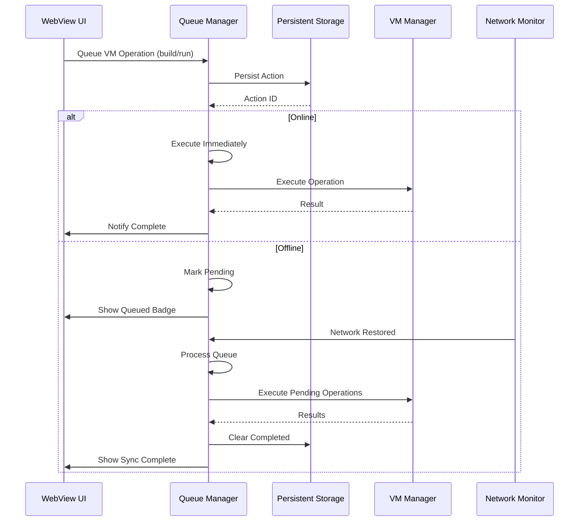
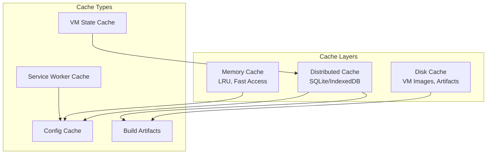
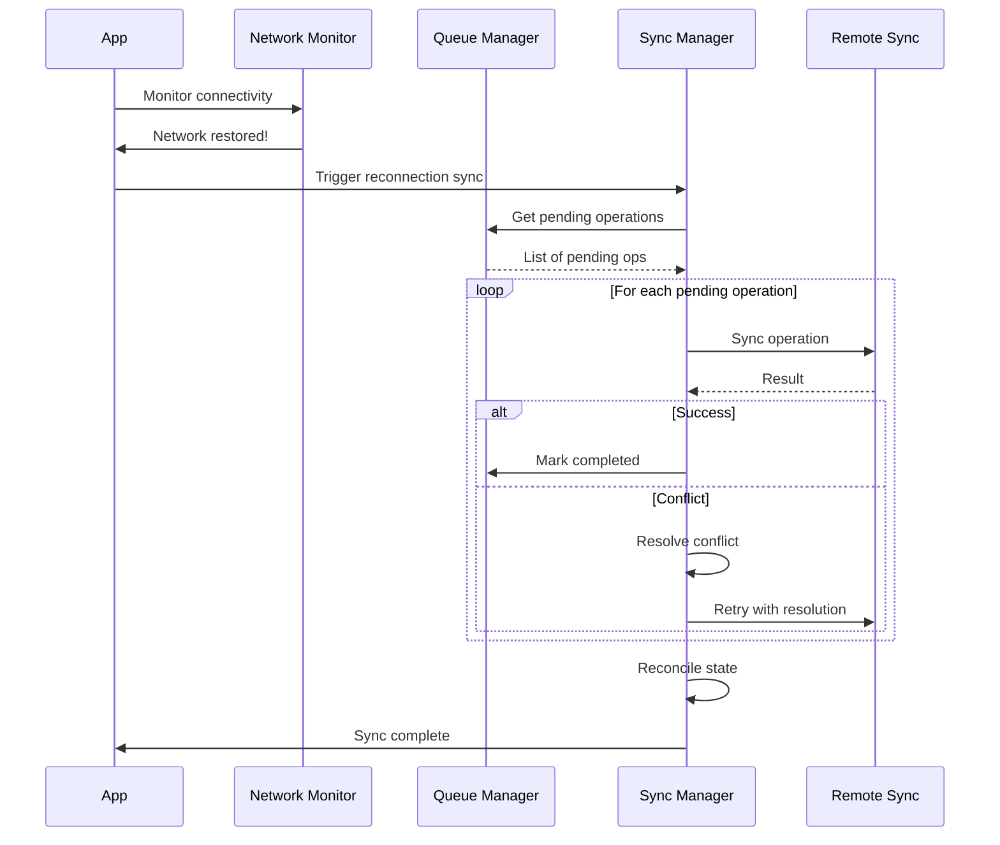

# UTM Dev Production - Offline & Connectivity Exploration

## Overview

This document explores offline-first strategies and connectivity handling for the UTM Dev desktop VM management application. UTM Dev is a cross-platform VM manager built with a Rust backend and WebView frontend using HTMX/Datastar for reactive UI patterns.

**Key Differences from Mobile WebView Apps:**

- Desktop-first with persistent storage expectations
- Local VM management continues offline by default
- Network primarily needed for remote VM access and updates
- File system access for VM disk images and configurations
- Longer-running operations (builds, VM operations) need robust queuing
- System tray integration for background operations

---

## Table of Contents

1. [Network Status Detection](#1-network-status-detection)
2. [Offline Queue for Operations](#2-offline-queue-for-operations)
3. [Local Cache Management](#3-local-cache-management)
4. [Sync Strategies](#4-sync-strategies)
5. [Offline UI Patterns](#5-offline-ui-patterns)
6. [Local-First Architecture](#6-local-first-architecture)

---

## 1. Network Status Detection

### 1.1 Rust Backend - Network Monitor

```rust
// utm-core/src/network/monitor.rs

use std::sync::Arc;
use std::time::Duration;
use tokio::sync::RwLock;
use tokio::time::interval;
use tracing::{debug, error, info, warn};
use serde::{Deserialize, Serialize};

/// Network connectivity status
#[derive(Debug, Clone, Copy, PartialEq, Eq, Serialize, Deserialize)]
pub enum NetworkStatus {
    /// No network connectivity
    Offline,
    /// Connected via WiFi
    WiFi,
    /// Connected via Ethernet
    Ethernet,
    /// Connected via cellular/mobile
    Cellular,
    /// Unknown connection type
    Unknown,
}

/// Detailed network information
#[derive(Debug, Clone, Serialize, Deserialize)]
pub struct NetworkInfo {
    /// Current connectivity status
    pub status: NetworkStatus,
    /// Whether internet is reachable
    pub is_internet_reachable: bool,
    /// Whether local network is reachable
    pub is_local_reachable: bool,
    /// List of reachable remote hosts
    pub reachable_hosts: Vec<String>,
    /// Last time connectivity was checked
    pub last_checked: chrono::DateTime<chrono::Utc>,
    /// Connection quality score (0-100)
    pub quality_score: Option<u8>,
}

impl Default for NetworkInfo {
    fn default() -> Self {
        Self {
            status: NetworkStatus::Unknown,
            is_internet_reachable: false,
            is_local_reachable: false,
            reachable_hosts: Vec::new(),
            last_checked: chrono::Utc::now(),
            quality_score: None,
        }
    }
}

/// Network event for subscribers
#[derive(Debug, Clone)]
pub enum NetworkEvent {
    StatusChanged(NetworkStatus),
    InternetReachable(bool),
    LocalNetworkReachable(bool),
    HostReachable { host: String, reachable: bool },
    QualityChanged { old_score: Option<u8>, new_score: Option<u8> },
}

/// Network monitor service
pub struct NetworkMonitor {
    /// Current network state
    state: Arc<RwLock<NetworkInfo>>,
    /// Event subscribers
    subscribers: Arc<RwLock<Vec<tokio::sync::mpsc::UnboundedSender<NetworkEvent>>>>,
    /// Hosts to monitor
    monitored_hosts: Arc<RwLock<Vec<String>>>,
    /// Check interval in seconds
    check_interval: Duration,
    /// Shutdown signal
    shutdown: Arc<RwLock<bool>>,
}

impl NetworkMonitor {
    pub fn new(check_interval_secs: u64) -> Self {
        Self {
            state: Arc::new(RwLock::new(NetworkInfo::default())),
            subscribers: Arc::new(RwLock::new(Vec::new())),
            monitored_hosts: Arc::new(RwLock::new(vec![
                "8.8.8.8".to_string(),      // Google DNS
                "1.1.1.1".to_string(),      // Cloudflare DNS
                "github.com".to_string(),   // GitHub API
            ])),
            check_interval: Duration::from_secs(check_interval_secs),
            shutdown: Arc::new(RwLock::new(false)),
        }
    }

    /// Subscribe to network events
    pub async fn subscribe(&self) -> tokio::sync::mpsc::UnboundedReceiver<NetworkEvent> {
        let (tx, rx) = tokio::sync::mpsc::unbounded_channel();
        let mut subscribers = self.subscribers.write().await;
        subscribers.push(tx);
        rx
    }

    /// Add a host to monitor
    pub async fn add_monitored_host(&self, host: String) {
        let mut hosts = self.monitored_hosts.write().await;
        if !hosts.contains(&host) {
            hosts.push(host);
        }
    }

    /// Get current network status
    pub async fn get_status(&self) -> NetworkStatus {
        self.state.read().await.status
    }

    /// Get full network info
    pub async fn get_info(&self) -> NetworkInfo {
        self.state.read().await.clone()
    }

    /// Check if online
    pub async fn is_online(&self) -> bool {
        self.state.read().await.is_internet_reachable
    }

    /// Start the network monitoring loop
    pub async fn start(&self) {
        info!("Starting network monitor with {:?} interval", self.check_interval);

        let mut interval_timer = interval(self.check_interval);

        // Initial check
        self.perform_network_check().await;

        loop {
            interval_timer.tick().await;

            // Check shutdown
            {
                let shutdown = *self.shutdown.read().await;
                if shutdown {
                    info!("Network monitor shutting down");
                    break;
                }
            }

            self.perform_network_check().await;
        }
    }

    /// Stop the network monitor
    pub async fn stop(&self) {
        let mut shutdown = self.shutdown.write().await;
        *shutdown = true;
    }

    /// Perform a comprehensive network check
    async fn perform_network_check(&self) {
        let mut info = self.state.write().await;
        let old_status = info.status;
        let old_quality = info.quality_score;

        // Detect connection type using system APIs
        info.status = self.detect_connection_type().await;

        // Check internet reachability
        info.is_internet_reachable = self.check_internet_reachability().await;

        // Check local network
        info.is_local_reachable = self.check_local_network().await;

        // Check monitored hosts
        info.reachable_hosts.clear();
        let hosts = self.monitored_hosts.read().await;
        for host in hosts.iter() {
            if self.check_host_reachable(host).await {
                info.reachable_hosts.push(host.clone());
            }
        }

        // Calculate quality score
        info.quality_score = self.calculate_quality_score(&info).await;

        info.last_checked = chrono::Utc::now();

        // Emit events for changes
        self.emit_events(old_status, old_quality, &info).await;
    }

    /// Detect the type of network connection
    async fn detect_connection_type(&self) -> NetworkStatus {
        #[cfg(target_os = "macos")]
        {
            use system_configuration::core_foundation::base::TCFType;
            use system_configuration::core_foundation::dictionary::CFDictionary;
            use system_configuration::core_foundation::string::CFString;
            use system_configuration::dynamic_store::DynamicStore;

            // macOS specific implementation
            if let Ok(store) = DynamicStore::new() {
                if let Some(dict) = store.get("/State/Network/Global/IPv4") {
                    if let Some(type_str) = dict.get(&CFString::new("Type")) {
                        let type_str = type_str.downcast::<CFString>();
                        let type_string = type_str.to_string();
                        if type_string.contains("AirPort") || type_string.contains("WiFi") {
                            return NetworkStatus::WiFi;
                        } else if type_string.contains("Ethernet") {
                            return NetworkStatus::Ethernet;
                        }
                    }
                }
            }
        }

        #[cfg(target_os = "windows")]
        {
            // Windows implementation using GetAdaptersAddresses
            use winapi::um::iphlpapi::GetAdaptersAddresses;
            use winapi::um::winsock2::AF_INET;

            // Check adapter types
            // Implementation omitted for brevity
        }

        #[cfg(target_os = "linux")]
        {
            // Linux implementation - check /sys/class/net or use rtnetlink
            use std::fs;

            if let Ok(entries) = fs::read_dir("/sys/class/net") {
                for entry in entries.flatten() {
                    let name = entry.file_name().to_string_lossy().to_string();
                    if name.starts_with("wlan") || name.starts_with("wl") {
                        if fs::read(format!("/sys/class/net/{}/operstate", name))
                            .map(|s| String::from_utf8_lossy(&s).trim() == "up")
                            .unwrap_or(false)
                        {
                            return NetworkStatus::WiFi;
                        }
                    }
                }
            }
        }

        // Fallback: try to determine from available interfaces
        NetworkStatus::Unknown
    }

    /// Check if internet is reachable
    async fn check_internet_reachability(&self) -> bool {
        // Try multiple DNS servers and well-known hosts
        let test_hosts = [
            ("8.8.8.8", 53),      // Google DNS
            ("1.1.1.1", 53),      // Cloudflare DNS
            ("1.0.0.1", 53),      // Cloudflare secondary
        ];

        for (host, port) in test_hosts.iter() {
            if self.try_tcp_connect(host, *port).await {
                return true;
            }
        }

        false
    }

    /// Check local network reachability
    async fn check_local_network(&self) -> bool {
        // Check if we can reach local gateway or common local addresses
        let local_tests = [
            ("192.168.1.1", 80),  // Common router
            ("192.168.0.1", 80),
            ("10.0.0.1", 80),
        ];

        for (host, port) in local_tests.iter() {
            if self.try_tcp_connect(host, *port).await {
                return true;
            }
        }

        // Also check if we have a local IP assigned
        self.has_local_ip_address().await
    }

    /// Check if a specific host is reachable
    async fn check_host_reachable(&self, host: &str) -> bool {
        // Try DNS resolution first
        let addr = tokio::net::lookup_host((host, 443))
            .await
            .ok()?;

        // Try to connect
        for socket_addr in addr {
            if tokio::time::timeout(
                Duration::from_secs(3),
                tokio::net::TcpStream::connect(socket_addr)
            ).await
                .ok()?
                .is_ok()
            {
                return true;
            }
        }

        false
    }

    /// Try TCP connection with timeout
    async fn try_tcp_connect(&self, host: &str, port: u16) -> bool {
        tokio::time::timeout(
            Duration::from_secs(2),
            tokio::net::TcpStream::connect((host, port))
        ).await
            .map(|r| r.is_ok())
            .unwrap_or(false)
    }

    /// Check if we have a local IP address
    async fn has_local_ip_address(&self) -> bool {
        #[cfg(target_os = "macos")]
        {
            // macOS implementation
            use std::process::Command;
            if let Ok(output) = Command::new("ifconfig").output() {
                let stdout = String::from_utf8_lossy(&output.stdout);
                return stdout.contains("inet ") && !stdout.contains("inet 127.0.0.1");
            }
        }

        #[cfg(target_os = "linux")]
        {
            // Linux implementation
            use std::process::Command;
            if let Ok(output) = Command::new("ip").arg("addr").output() {
                let stdout = String::from_utf8_lossy(&output.stdout);
                return stdout.contains("inet ") && !stdout.contains("inet 127.0.0.1");
            }
        }

        #[cfg(target_os = "windows")]
        {
            use std::process::Command;
            if let Ok(output) = Command::new("ipconfig").output() {
                let stdout = String::from_utf8_lossy(&output.stdout);
                return stdout.contains("IPv4");
            }
        }

        false
    }

    /// Calculate network quality score
    async fn calculate_quality_score(&self, info: &NetworkInfo) -> Option<u8> {
        if !info.is_internet_reachable {
            return Some(0);
        }

        let mut score: u8 = 50; // Base score for internet

        // Bonus for known connection type
        match info.status {
            NetworkStatus::Ethernet => score += 30,
            NetworkStatus::WiFi => score += 20,
            NetworkStatus::Cellular => score += 10,
            _ => {}
        }

        // Bonus for reachable hosts
        let host_bonus = (info.reachable_hosts.len() as u8).min(20);
        score += host_bonus;

        Some(score.min(100))
    }

    /// Emit network events to subscribers
    async fn emit_events(&self, old_status: NetworkStatus, old_quality: Option<u8>, info: &NetworkInfo) {
        let subscribers = self.subscribers.read().await;

        if old_status != info.status {
            debug!("Network status changed: {:?} -> {:?}", old_status, info.status);
            for sub in subscribers.iter() {
                let _ = sub.send(NetworkEvent::StatusChanged(info.status));
            }
        }

        if old_quality != info.quality_score {
            for sub in subscribers.iter() {
                let _ = sub.send(NetworkEvent::QualityChanged {
                    old_score: old_quality,
                    new_score: info.quality_score,
                });
            }
        }

        // Also notify WebView of changes via IPC
        self.notify_webview(info).await;
    }

    /// Notify WebView of network changes
    async fn notify_webview(&self, info: &NetworkInfo) {
        // This would integrate with the WebView bridge
        // to send network status updates to the frontend
        let message = serde_json::json!({
            "type": "network-status",
            "data": info
        });

        // Send to WebView (implementation depends on bridge)
        // utm_bridge::send_to_webview(&message).await;
    }
}
```

### 1.2 WebView - Network Status Handler

```typescript
// frontend/src/network/network-monitor.ts

import { htmx } from 'htmx.org'
import { datastar } from 'datastarjs'

interface NetworkStatus {
    status: 'offline' | 'wifi' | 'ethernet' | 'cellular' | 'unknown'
    isInternetReachable: boolean
    isLocalReachable: boolean
    reachableHosts: string[]
    lastChecked: string
    qualityScore: number | null
}

class NetworkMonitor {
    private status: NetworkStatus | null = null
    private listeners: Set<(status: NetworkStatus) => void> = new Set()
    private ws: WebSocket | null = null
    private reconnectAttempts = 0
    private readonly maxReconnectAttempts = 5

    constructor() {}

    /**
     * Initialize network monitoring
     */
    async initialize(): Promise<void> {
        // Start with browser's online/offline detection
        this.setupBrowserListeners()

        // Get initial status from backend
        await this.fetchStatus()

        // Set up WebSocket for real-time updates
        this.connectWebSocket()

        // Periodic status check
        this.startPeriodicCheck()
    }

    private setupBrowserListeners(): void {
        window.addEventListener('online', () => {
            this.handleBrowserOnline()
        })

        window.addEventListener('offline', () => {
            this.handleBrowserOffline()
        })
    }

    private handleBrowserOnline(): void {
        console.log('Browser went online')
        this.updateStatusUI(true)
        this.fetchStatus()
    }

    private handleBrowserOffline(): void {
        console.log('Browser went offline')
        this.updateStatusUI(false)

        // Notify backend
        this.notifyBackendOffline()
    }

    private async fetchStatus(): Promise<void> {
        try {
            const response = await fetch('/api/network/status')
            if (!response.ok) throw new Error('Failed to fetch status')

            this.status = await response.json()
            this.notifyListeners()
        } catch (error) {
            console.error('Failed to fetch network status:', error)
        }
    }

    private connectWebSocket(): void {
        const protocol = window.location.protocol === 'https:' ? 'wss:' : 'ws:'
        const wsUrl = `${protocol}//${window.location.host}/ws/network`

        this.ws = new WebSocket(wsUrl)

        this.ws.onopen = () => {
            console.log('Network WebSocket connected')
            this.reconnectAttempts = 0
        }

        this.ws.onmessage = (event) => {
            try {
                const message = JSON.parse(event.data)
                if (message.type === 'network-status') {
                    this.status = message.data
                    this.notifyListeners()
                    this.updateStatusUI(this.status.isInternetReachable)
                }
            } catch (error) {
                console.error('Failed to parse WebSocket message:', error)
            }
        }

        this.ws.onclose = () => {
            console.log('Network WebSocket closed')
            this.scheduleReconnect()
        }

        this.ws.onerror = (error) => {
            console.error('Network WebSocket error:', error)
        }
    }

    private scheduleReconnect(): void {
        if (this.reconnectAttempts >= this.maxReconnectAttempts) {
            console.log('Max WebSocket reconnect attempts reached')
            return
        }

        this.reconnectAttempts++
        const delay = Math.min(1000 * Math.pow(2, this.reconnectAttempts), 30000)

        console.log(`Reconnecting in ${delay}ms (attempt ${this.reconnectAttempts})`)
        setTimeout(() => this.connectWebSocket(), delay)
    }

    private startPeriodicCheck(): void {
        // Check status every 30 seconds
        setInterval(() => this.fetchStatus(), 30000)
    }

    private notifyBackendOffline(): void {
        fetch('/api/network/offline-detected', {
            method: 'POST',
            headers: { 'Content-Type': 'application/json' },
            body: JSON.stringify({
                timestamp: new Date().toISOString(),
                userAgent: navigator.userAgent
            })
        }).catch(console.error)
    }

    /**
     * Subscribe to status changes
     */
    subscribe(listener: (status: NetworkStatus) => void): () => void {
        this.listeners.add(listener)
        if (this.status) {
            listener(this.status)
        }
        return () => this.listeners.delete(listener)
    }

    private notifyListeners(): void {
        if (!this.status) return
        this.listeners.forEach(listener => listener(this.status))
    }

    /**
     * Get current status
     */
    getStatus(): NetworkStatus | null {
        return this.status
    }

    /**
     * Check if online
     */
    isOnline(): boolean {
        return this.status?.isInternetReachable ?? navigator.onLine
    }

    /**
     * Update UI based on status
     */
    private updateStatusUI(online: boolean): void {
        const indicator = document.getElementById('network-status-indicator')
        if (!indicator) return

        indicator.classList.toggle('online', online)
        indicator.classList.toggle('offline', !online)

        // Update ARIA label for accessibility
        indicator.setAttribute('aria-label', online ? 'Connected' : 'Offline')

        // Show/hide offline banner
        const banner = document.getElementById('offline-banner')
        if (banner) {
            banner.classList.toggle('hidden', online)
            banner.classList.toggle('visible', !online)
        }

        // Update HTMX indicators
        if (!online) {
            document.body.classList.add('offline')
            // Queue any pending HTMX requests
            htmx.trigger(document.body, 'offline')
        } else {
            document.body.classList.remove('offline')
            htmx.trigger(document.body, 'online')
        }
    }
}

// Export singleton instance
export const networkMonitor = new NetworkMonitor()

// Auto-initialize on DOMContentLoaded
if (document.readyState === 'loading') {
    document.addEventListener('DOMContentLoaded', () => networkMonitor.initialize())
} else {
    networkMonitor.initialize()
}
```

### 1.3 Network Status Component (HTMX)

```html
<!-- frontend/templates/components/network-status.html -->

<!-- Network status indicator in header -->
<div id="network-status-indicator"
     class="network-status"
     _="on online from body add .connected
        on offline from body add .disconnected">
    <svg class="icon wifi-icon" aria-hidden="true">
        <use href="#icon-wifi" />
    </svg>
    <span class="status-text" data-signal="networkStatus">Connected</span>
    <span class="quality-indicator" data-signal="qualityScore"></span>
</div>

<!-- Offline banner -->
<div id="offline-banner"
     class="offline-banner hidden"
     role="alert"
     aria-live="polite"
     _="on online from body
            add .fade-out
            wait 3s
            add .hidden
            remove .fade-out
        on offline from body
            remove .hidden
            add .fade-in">
    <div class="banner-content">
        <svg class="icon warning-icon" aria-hidden="true">
            <use href="#icon-warning" />
        </svg>
        <span class="banner-text">
            You're offline. VM operations will continue locally.
            Remote features will be unavailable until reconnected.
        </span>
        <button class="retry-button"
                _="on click
                   fetch /api/network/check-connectivity
                   then trigger online">
            Retry Connection
        </button>
    </div>
</div>

<!-- Connection quality tooltip -->
<div class="network-tooltip"
     data-signal="networkTooltip"
     _="on mouseenter from #network-status-indicator
            show me
        on mouseleave from #network-status-indicator
            hide me">
    <div class="tooltip-header">Network Status</div>
    <div class="tooltip-body">
        <div class="status-row">
            <span class="label">Connection:</span>
            <span class="value" data-signal="connectionType">-</span>
        </div>
        <div class="status-row">
            <span class="label">Internet:</span>
            <span class="value" data-signal="internetStatus">-</span>
        </div>
        <div class="status-row">
            <span class="label">Local Network:</span>
            <span class="value" data-signal="localStatus">-</span>
        </div>
        <div class="status-row">
            <span class="label">Quality:</span>
            <span class="value" data-signal="qualityValue">-</span>
        </div>
        <div class="status-row">
            <span class="label">Reachable Hosts:</span>
            <ul class="hosts-list" data-signal="reachableHosts"></ul>
        </div>
        <div class="status-row">
            <span class="label">Last Check:</span>
            <span class="value" data-signal="lastCheck">-</span>
        </div>
    </div>
</div>
```

### 1.4 Rust - Network Status API Endpoint

```rust
// utm-server/src/routes/network.rs

use axum::{
    extract::State,
    http::StatusCode,
    response::IntoResponse,
    routing::{get, post},
    Json, Router,
};
use serde::{Deserialize, Serialize};
use std::sync::Arc;

use crate::app_state::AppState;
use utm_core::network::monitor::{NetworkInfo, NetworkMonitor};

pub fn router(state: AppState) -> Router {
    Router::new()
        .route("/status", get(get_network_status))
        .route("/check-connectivity", post(check_connectivity))
        .route("/offline-detected", post(offline_detected))
        .with_state(state)
}

#[derive(Serialize)]
struct NetworkStatusResponse {
    status: String,
    is_internet_reachable: bool,
    is_local_reachable: bool,
    reachable_hosts: Vec<String>,
    quality_score: Option<u8>,
    last_checked: String,
}

async fn get_network_status(
    State(state): State<Arc<AppState>>,
) -> impl IntoResponse {
    let monitor = state.network_monitor.read().await;
    let info = monitor.get_info().await;

    let response = NetworkStatusResponse {
        status: format!("{:?}", info.status).to_lowercase(),
        is_internet_reachable: info.is_internet_reachable,
        is_local_reachable: info.is_local_reachable,
        reachable_hosts: info.reachable_hosts,
        quality_score: info.quality_score,
        last_checked: info.last_checked.to_rfc3339(),
    };

    Json(response)
}

async fn check_connectivity(
    State(state): State<Arc<AppState>>,
) -> impl IntoResponse {
    let monitor = state.network_monitor.read().await;

    // Force immediate connectivity check
    // This is called when user clicks "Retry"
    let info = monitor.get_info().await;

    if info.is_internet_reachable {
        (StatusCode::OK, Json(serde_json::json!({
            "connected": true,
            "message": "Internet connection restored"
        })))
    } else {
        (StatusCode::SERVICE_UNAVAILABLE, Json(serde_json::json!({
            "connected": false,
            "message": "Still offline. Please check your network connection."
        })))
    }
}

async fn offline_detected(
    State(state): State<Arc<AppState>>,
    Json(payload): Json<OfflineDetectedPayload>,
) -> impl IntoResponse {
    tracing::warn!(
        "Offline detected from client: {} at {}",
        payload.user_agent,
        payload.timestamp
    );

    // Log the offline event for analytics
    state
        .analytics
        .track("offline_detected", &payload)
        .await;

    StatusCode::OK
}

#[derive(Deserialize)]
struct OfflineDetectedPayload {
    timestamp: String,
    user_agent: String,
}
```

---

## 2. Offline Queue for Operations

### 2.1 Queue Architecture Overview



### 2.2 Rust - Operation Queue Core

```rust
// utm-core/src/queue/operation_queue.rs

use std::collections::HashMap;
use std::sync::Arc;
use chrono::{DateTime, Utc};
use serde::{Deserialize, Serialize};
use tokio::sync::{RwLock, mpsc};
use tracing::{debug, error, info, warn};
use uuid::Uuid;

/// Priority levels for VM operations
#[derive(Debug, Clone, Copy, PartialEq, Eq, PartialOrd, Ord, Serialize, Deserialize)]
#[serde(rename_all = "snake_case")]
pub enum OperationPriority {
    Low = 0,      // Background tasks, logs collection
    Normal = 1,   // Standard operations
    High = 2,     // User-initiated builds
    Critical = 3, // Emergency stops, critical saves
}

impl Default for OperationPriority {
    fn default() -> Self {
        OperationPriority::Normal
    }
}

/// Types of operations that can be queued
#[derive(Debug, Clone, Serialize, Deserialize)]
#[serde(tag = "type", rename_all = "snake_case")]
pub enum OperationType {
    /// Build a VM configuration
    Build {
        config_path: String,
        options: BuildOptions,
    },
    /// Run/start a VM
    Run {
        vm_id: String,
        options: RunOptions,
    },
    /// Stop a running VM
    Stop {
        vm_id: String,
        force: bool,
    },
    /// Snapshot a VM state
    Snapshot {
        vm_id: String,
        snapshot_name: String,
        description: Option<String>,
    },
    /// Sync with remote repository
    Sync {
        remote_url: String,
        direction: SyncDirection,
    },
    /// Download/update a base image
    DownloadImage {
        image_url: String,
        destination: String,
    },
    /// Upload VM to remote
    UploadVM {
        vm_id: String,
        destination: String,
    },
    /// Custom command
    Custom {
        command: String,
        args: Vec<String>,
        working_dir: Option<String>,
    },
}

#[derive(Debug, Clone, Default, Serialize, Deserialize)]
pub struct BuildOptions {
    pub clean: bool,
    pub parallel: bool,
    pub verbose: bool,
    pub targets: Vec<String>,
}

#[derive(Debug, Clone, Default, Serialize, Deserialize)]
pub struct RunOptions {
    pub headless: bool,
    pub display: Option<String>,
    pub extra_args: Vec<String>,
}

#[derive(Debug, Clone, Serialize, Deserialize)]
#[serde(rename_all = "snake_case")]
pub enum SyncDirection {
    Push,
    Pull,
    Bidirectional,
}

/// A queued operation
#[derive(Debug, Clone, Serialize, Deserialize)]
pub struct QueuedOperation {
    /// Unique operation ID
    pub id: String,
    /// Operation type and parameters
    pub operation: OperationType,
    /// Priority level
    pub priority: OperationPriority,
    /// When the operation was queued
    pub queued_at: DateTime<Utc>,
    /// When execution was last attempted
    pub last_attempt: Option<DateTime<Utc>>,
    /// Number of retry attempts
    pub retry_count: u32,
    /// Next scheduled attempt (for backoff)
    pub next_attempt_at: Option<DateTime<Utc>>,
    /// Operation status
    pub status: OperationStatus,
    /// Result of execution (if completed)
    pub result: Option<OperationResult>,
    /// Error message (if failed)
    pub error: Option<String>,
    /// Metadata for UI display
    pub metadata: OperationMetadata,
    /// Deduplication key (optional)
    pub dedup_key: Option<String>,
}

#[derive(Debug, Clone, Copy, PartialEq, Eq, Serialize, Deserialize)]
#[serde(rename_all = "snake_case")]
pub enum OperationStatus {
    Pending,
    Running,
    Completed,
    Failed,
    Cancelled,
}

#[derive(Debug, Clone, Serialize, Deserialize)]
pub struct OperationResult {
    pub success: bool,
    pub output: Option<String>,
    pub exit_code: Option<i32>,
    pub duration_ms: u64,
}

#[derive(Debug, Clone, Default, Serialize, Deserialize)]
pub struct OperationMetadata {
    /// Human-readable title
    pub title: Option<String>,
    /// Progress percentage (0-100)
    pub progress: Option<u8>,
    /// Associated VM ID
    pub vm_id: Option<String>,
    /// Estimated duration in seconds
    pub estimated_duration: Option<u64>,
    /// Tags for categorization
    pub tags: Vec<String>,
}

impl QueuedOperation {
    /// Create a new queued operation
    pub fn new(operation: OperationType, priority: OperationPriority) -> Self {
        let title = Self::generate_title(&operation);

        Self {
            id: Uuid::new_v4().to_string(),
            operation,
            priority,
            queued_at: Utc::now(),
            last_attempt: None,
            retry_count: 0,
            next_attempt_at: None,
            status: OperationStatus::Pending,
            result: None,
            error: None,
            metadata: OperationMetadata {
                title: Some(title),
                ..Default::default()
            },
            dedup_key: None,
        }
    }

    fn generate_title(operation: &OperationType) -> String {
        match operation {
            OperationType::Build { config_path, .. } => {
                format!("Build: {}", config_path)
            }
            OperationType::Run { vm_id, .. } => {
                format!("Run VM: {}", vm_id)
            }
            OperationType::Stop { vm_id, force } => {
                if *force {
                    format!("Force Stop VM: {}", vm_id)
                } else {
                    format!("Stop VM: {}", vm_id)
                }
            }
            OperationType::Snapshot { snapshot_name, .. } => {
                format!("Create Snapshot: {}", snapshot_name)
            }
            OperationType::Sync { remote_url, direction } => {
                let dir = match direction {
                    SyncDirection::Push => "Push",
                    SyncDirection::Pull => "Pull",
                    SyncDirection::Bidirectional => "Sync",
                };
                format!("{} from/to {}", dir, remote_url)
            }
            OperationType::DownloadImage { image_url, .. } => {
                format!("Download Image: {}", image_url)
            }
            OperationType::UploadVM { vm_id, destination } => {
                format!("Upload VM {} to {}", vm_id, destination)
            }
            OperationType::Custom { command, .. } => {
                format!("Command: {}", command)
            }
        }
    }

    /// Calculate backoff duration
    pub fn calculate_backoff(&self, base_ms: u64, max_ms: u64, multiplier: f64) -> u64 {
        if self.retry_count == 0 {
            return base_ms;
        }

        let exponential = base_ms as f64 * multiplier.powi(self.retry_count as i32);
        let with_jitter = exponential * (1.0 + 0.2 * rand::random::<f64>());

        (with_jitter.min(max_ms as f64) as u64).max(base_ms)
    }

    /// Check if ready to execute
    pub fn is_ready(&self) -> bool {
        self.status == OperationStatus::Pending
            && match self.next_attempt_at {
                Some(next) => Utc::now() >= next,
                None => true,
            }
    }

    /// Sort key for priority ordering
    pub fn sort_key(&self) -> (i32, DateTime<Utc>) {
        (-(self.priority as i32), self.queued_at)
    }
}

/// Queue configuration
#[derive(Debug, Clone)]
pub struct QueueConfig {
    pub max_retries: u32,
    pub base_backoff_ms: u64,
    pub max_backoff_ms: u64,
    pub backoff_multiplier: f64,
    pub max_queue_size: usize,
    pub max_concurrent: usize,
    pub deduplication_enabled: bool,
    pub auto_retry_offline_failures: bool,
}

impl Default for QueueConfig {
    fn default() -> Self {
        Self {
            max_retries: 3,
            base_backoff_ms: 2000,
            max_backoff_ms: 60000, // 1 minute
            backoff_multiplier: 2.0,
            max_queue_size: 100,
            max_concurrent: 3,
            deduplication_enabled: true,
            auto_retry_offline_failures: true,
        }
    }
}

/// Queue event for subscribers
#[derive(Debug, Clone)]
pub enum QueueEvent {
    OperationEnqueued { operation: QueuedOperation },
    OperationStarted { id: String },
    OperationCompleted { id: String, result: OperationResult },
    OperationFailed { id: String, error: String },
    OperationCancelled { id: String },
    QueueStatusChanged { stats: QueueStats },
    ProcessingStarted,
    ProcessingCompleted { succeeded: usize, failed: usize },
}

#[derive(Debug, Clone, Default)]
pub struct QueueStats {
    pub total: usize,
    pub pending: usize,
    pub running: usize,
    pub completed: usize,
    pub failed: usize,
    pub by_priority: HashMap<OperationPriority, usize>,
    pub by_type: HashMap<String, usize>,
}

/// Main operation queue manager
pub struct OperationQueue {
    operations: Arc<RwLock<Vec<QueuedOperation>>>,
    config: QueueConfig,
    dedup_index: Arc<RwLock<HashMap<String, String>>>,
    event_tx: mpsc::UnboundedSender<QueueEvent>,
    event_rx: Arc<RwLock<mpsc::UnboundedReceiver<QueueEvent>>>,
    is_processing: Arc<RwLock<bool>>,
}

impl OperationQueue {
    pub fn new(config: QueueConfig) -> Self {
        let (tx, rx) = mpsc::unbounded_channel();

        Self {
            operations: Arc::new(RwLock::new(Vec::new())),
            config,
            dedup_index: Arc::new(RwLock::new(HashMap::new())),
            event_tx: tx,
            event_rx: Arc::new(RwLock::new(rx)),
            is_processing: Arc::new(RwLock::new(false)),
        }
    }

    /// Subscribe to queue events
    pub fn subscribe(&self) -> mpsc::UnboundedReceiver<QueueEvent> {
        // Create new channel for this subscriber
        let (tx, rx) = mpsc::unbounded_channel();

        // Spawn task to forward events
        let mut event_rx = self.event_rx.clone();
        tokio::spawn(async move {
            let mut rx = event_rx.write().await;
            while let Some(event) = rx.recv().await {
                if tx.send(event.clone()).is_err() {
                    break;
                }
            }
        });

        rx
    }

    /// Enqueue an operation
    pub async fn enqueue(&self, mut operation: QueuedOperation) -> Result<String, QueueError> {
        // Check deduplication
        if self.config.deduplication_enabled {
            if let Some(key) = &operation.dedup_key {
                let dedup_index = self.dedup_index.read().await;
                if let Some(existing_id) = dedup_index.get(key) {
                    warn!("Duplicate operation detected: {}", existing_id);
                    return Ok(existing_id.clone());
                }
            }
        }

        // Check queue size
        let ops = self.operations.read().await;
        if ops.len() >= self.config.max_queue_size {
            return Err(QueueError::QueueFull(self.config.max_queue_size));
        }
        drop(ops);

        let id = operation.id.clone();
        let dedup_key = operation.dedup_key.clone();

        // Add to queue
        {
            let mut ops = self.operations.write().await;
            ops.push(operation.clone());
            ops.sort_by(|a, b| a.sort_key().cmp(&b.sort_key()));

            // Persist to disk (implementation depends on storage backend)
            self.persist_queue(&ops).await?;
        }

        // Update dedup index
        if let Some(key) = dedup_key {
            let mut dedup_index = self.dedup_index.write().await;
            dedup_index.insert(key, id.clone());
        }

        info!("Operation enqueued: {} - {:?}", id, operation.operation);
        self.emit_event(QueueEvent::OperationEnqueued { operation }).await;
        self.emit_status_change().await;

        // Try to process if online
        self.try_process_queue().await;

        Ok(id)
    }

    /// Cancel an operation
    pub async fn cancel(&self, operation_id: &str) -> Result<(), QueueError> {
        let mut ops = self.operations.write().await;

        if let Some(op) = ops.iter_mut().find(|o| o.id == operation_id) {
            if op.status == OperationStatus::Running {
                return Err(QueueError::CannotCancelRunning);
            }
            op.status = OperationStatus::Cancelled;
            self.persist_queue(&ops).await?;

            info!("Operation cancelled: {}", operation_id);
            self.emit_event(QueueEvent::OperationCancelled {
                id: operation_id.to_string(),
            }).await;
            self.emit_status_change().await;
        }

        Ok(())
    }

    /// Get operation by ID
    pub async fn get(&self, id: &str) -> Option<QueuedOperation> {
        let ops = self.operations.read().await;
        ops.iter().find(|o| o.id == id).cloned()
    }

    /// Get all pending operations
    pub async fn get_pending(&self) -> Vec<QueuedOperation> {
        let ops = self.operations.read().await;
        ops.iter()
            .filter(|o| o.status == OperationStatus::Pending)
            .cloned()
            .collect()
    }

    /// Get queue statistics
    pub async fn get_stats(&self) -> QueueStats {
        let ops = self.operations.read().await;
        let mut stats = QueueStats::default();

        stats.total = ops.len();

        for op in ops.iter() {
            match op.status {
                OperationStatus::Pending => stats.pending += 1,
                OperationStatus::Running => stats.running += 1,
                OperationStatus::Completed => stats.completed += 1,
                OperationStatus::Failed => stats.failed += 1,
                OperationStatus::Cancelled => {}
            }

            *stats.by_priority.entry(op.priority).or_insert(0) += 1;

            let type_name = match &op.operation {
                OperationType::Build { .. } => "build",
                OperationType::Run { .. } => "run",
                OperationType::Stop { .. } => "stop",
                OperationType::Snapshot { .. } => "snapshot",
                OperationType::Sync { .. } => "sync",
                OperationType::DownloadImage { .. } => "download_image",
                OperationType::UploadVM { .. } => "upload_vm",
                OperationType::Custom { .. } => "custom",
            };
            *stats.by_type.entry(type_name.to_string()).or_insert(0) += 1;
        }

        stats
    }

    /// Try to process the queue
    async fn try_process_queue(&self) {
        let is_processing = *self.is_processing.read().await;
        if is_processing {
            return;
        }

        // Check if we have any ready operations
        let ready_ops = {
            let ops = self.operations.read().await;
            ops.iter()
                .filter(|o| o.is_ready())
                .take(self.config.max_concurrent)
                .cloned()
                .collect::<Vec<_>>()
        };

        if ready_ops.is_empty() {
            return;
        }

        // Start processing
        {
            let mut processing = self.is_processing.write().await;
            *processing = true;
        }

        self.emit_event(QueueEvent::ProcessingStarted).await;

        // Process operations in parallel
        let mut handles = Vec::new();
        for op in ready_ops {
            let op_id = op.id.clone();
            let ops_clone = Arc::clone(&self.operations);
            let event_tx = self.event_tx.clone();
            let config = self.config.clone();

            let handle = tokio::spawn(async move {
                // Update status to running
                {
                    let mut ops = ops_clone.write().await;
                    if let Some(operation) = ops.iter_mut().find(|o| o.id == op_id) {
                        operation.status = OperationStatus::Running;
                        operation.last_attempt = Some(Utc::now());
                    }
                }

                // Execute the operation (this would call the VM manager)
                // For now, we'll just simulate
                let result = Self::execute_operation(&op).await;

                // Update status based on result
                {
                    let mut ops = ops_clone.write().await;
                    if let Some(operation) = ops.iter_mut().find(|o| o.id == op_id) {
                        match result {
                            Ok(output) => {
                                operation.status = OperationStatus::Completed;
                                operation.result = Some(OperationResult {
                                    success: true,
                                    output: Some(output),
                                    exit_code: Some(0),
                                    duration_ms: 0,
                                });
                            }
                            Err(e) => {
                                operation.retry_count += 1;
                                if operation.retry_count >= config.max_retries {
                                    operation.status = OperationStatus::Failed;
                                    operation.error = Some(e.clone());
                                } else {
                                    // Schedule retry
                                    operation.status = OperationStatus::Pending;
                                    let backoff = operation.calculate_backoff(
                                        config.base_backoff_ms,
                                        config.max_backoff_ms,
                                        config.backoff_multiplier,
                                    );
                                    operation.next_attempt_at = Some(
                                        Utc::now() + chrono::Duration::milliseconds(backoff as i64)
                                    );
                                }
                            }
                        }
                    }
                }

                // Persist updated queue
                let ops = ops_clone.read().await;
                Self::persist_queue_static(&ops).await.ok();
            });

            handles.push(handle);
        }

        // Wait for all operations to complete
        for handle in handles {
            let _ = handle.await;
        }

        // Mark processing complete
        {
            let mut processing = self.is_processing.write().await;
            *processing = false;
        }

        self.emit_status_change().await;
    }

    async fn execute_operation(_op: &QueuedOperation) -> Result<String, String> {
        // This would delegate to the VM manager
        // For now, just simulate success
        tokio::time::sleep(tokio::time::Duration::from_millis(100)).await;
        Ok("Operation completed successfully".to_string())
    }

    async fn persist_queue(&self, ops: &[QueuedOperation]) -> Result<(), QueueError> {
        // Implementation depends on storage backend
        // Could use SQLite, file-based storage, etc.
        Ok(())
    }

    async fn persist_queue_static(_ops: &[QueuedOperation]) -> Result<(), QueueError> {
        Ok(())
    }

    async fn emit_event(&self, event: QueueEvent) {
        let _ = self.event_tx.send(event);
    }

    async fn emit_status_change(&self) {
        let stats = self.get_stats().await;
        self.emit_event(QueueEvent::QueueStatusChanged { stats }).await;
    }

    /// Load queue from persistent storage
    pub async fn load(&mut self) -> Result<(), QueueError> {
        // Implementation depends on storage backend
        Ok(())
    }
}

#[derive(Debug, thiserror::Error)]
pub enum QueueError {
    #[error("Queue is full (max size: {0})")]
    QueueFull(usize),
    #[error("Cannot cancel running operation")]
    CannotCancelRunning,
    #[error("Storage error: {0}")]
    Storage(String),
    #[error("Serialization error: {0}")]
    Serialization(String),
}
```

### 2.3 WebView - Queue Management with HTMX

```typescript
// frontend/src/queue/operation-queue.ts

import { htmx } from 'htmx.org'

interface QueuedOperation {
    id: string
    operation: {
        type: string
        [key: string]: any
    }
    priority: 'low' | 'normal' | 'high' | 'critical'
    status: 'pending' | 'running' | 'completed' | 'failed' | 'cancelled'
    queuedAt: string
    lastAttempt?: string
    retryCount: number
    result?: {
        success: boolean
        output?: string
        exitCode?: number
        durationMs: number
    }
    error?: string
    metadata: {
        title?: string
        progress?: number
        vmId?: string
        estimatedDuration?: number
        tags: string[]
    }
}

interface QueueStats {
    total: number
    pending: number
    running: number
    completed: number
    failed: number
    byPriority: Record<string, number>
    byType: Record<string, number>
}

class OperationQueue {
    private ws: WebSocket | null = null
    private stats: QueueStats | null = null
    private operations: Map<string, QueuedOperation> = new Map()
    private listeners: Set<() => void> = new Set()

    async initialize(): Promise<void> {
        // Load initial state
        await this.fetchStats()
        await this.fetchOperations()

        // Connect to WebSocket for real-time updates
        this.connectWebSocket()

        // Set up HTMX event handlers
        this.setupHtmxHandlers()
    }

    private setupHtmxHandlers(): void {
        document.body.addEventListener('htmx:afterRequest', (event: any) => {
            const path = event.detail.pathInfo.path

            // Check if this was a queue-related request
            if (path.includes('/api/queue/') || path.includes('/operations/')) {
                // Refresh queue display
                this.refreshDisplay()
            }
        })
    }

    private connectWebSocket(): void {
        const protocol = window.location.protocol === 'https:' ? 'wss:' : 'ws:'
        const wsUrl = `${protocol}//${window.location.host}/ws/queue`

        this.ws = new WebSocket(wsUrl)

        this.ws.onopen = () => {
            console.log('Queue WebSocket connected')
        }

        this.ws.onmessage = (event) => {
            try {
                const message = JSON.parse(event.data)
                this.handleQueueEvent(message)
            } catch (error) {
                console.error('Failed to parse queue event:', error)
            }
        }

        this.ws.onclose = () => {
            console.log('Queue WebSocket closed, reconnecting...')
            setTimeout(() => this.connectWebSocket(), 5000)
        }
    }

    private handleQueueEvent(event: any): void {
        switch (event.type) {
            case 'operation_enqueued':
                this.operations.set(event.operation.id, event.operation)
                this.showNotification('Operation queued', event.operation.metadata.title)
                break

            case 'operation_started':
                const started = this.operations.get(event.id)
                if (started) {
                    started.status = 'running'
                    this.updateOperationBadge(event.id, 'running')
                }
                break

            case 'operation_completed':
                const completed = this.operations.get(event.id)
                if (completed) {
                    completed.status = 'completed'
                    completed.result = event.result
                    this.showNotification('Operation complete', completed.metadata.title)
                }
                break

            case 'operation_failed':
                const failed = this.operations.get(event.id)
                if (failed) {
                    failed.status = 'failed'
                    failed.error = event.error
                    this.showNotification('Operation failed', failed.metadata.title, 'error')
                }
                break

            case 'queue_status_changed':
                this.stats = event.stats
                this.updateQueueBadge()
                break
        }

        this.notifyListeners()
    }

    /**
     * Queue a new operation
     */
    async enqueue(operation: {
        type: string
        priority?: string
        data?: Record<string, any>
    }): Promise<string> {
        const response = await fetch('/api/queue/operations', {
            method: 'POST',
            headers: { 'Content-Type': 'application/json' },
            body: JSON.stringify({
                operation: {
                    type: operation.type,
                    ...operation.data
                },
                priority: operation.priority || 'normal'
            })
        })

        if (!response.ok) {
            throw new Error('Failed to enqueue operation')
        }

        const result = await response.json()
        return result.id
    }

    /**
     * Cancel an operation
     */
    async cancel(operationId: string): Promise<void> {
        const response = await fetch(`/api/queue/operations/${operationId}/cancel`, {
            method: 'POST'
        })

        if (!response.ok) {
            throw new Error('Failed to cancel operation')
        }
    }

    /**
     * Retry a failed operation
     */
    async retry(operationId: string): Promise<void> {
        const response = await fetch(`/api/queue/operations/${operationId}/retry`, {
            method: 'POST'
        })

        if (!response.ok) {
            throw new Error('Failed to retry operation')
        }
    }

    /**
     * Clear completed operations
     */
    async clearCompleted(): Promise<void> {
        await fetch('/api/queue/clear-completed', {
            method: 'POST'
        })
        await this.fetchOperations()
    }

    private async fetchStats(): Promise<void> {
        try {
            const response = await fetch('/api/queue/stats')
            this.stats = await response.json()
            this.updateQueueBadge()
        } catch (error) {
            console.error('Failed to fetch queue stats:', error)
        }
    }

    private async fetchOperations(): Promise<void> {
        try {
            const response = await fetch('/api/queue/operations')
            const operations = await response.json()
            this.operations = new Map(operations.map((op: any) => [op.id, op]))
        } catch (error) {
            console.error('Failed to fetch operations:', error)
        }
    }

    private updateQueueBadge(): void {
        const badge = document.getElementById('queue-badge')
        if (!badge || !this.stats) return

        const pending = this.stats.pending + this.stats.running
        if (pending > 0) {
            badge.textContent = pending.toString()
            badge.classList.remove('hidden')
        } else {
            badge.classList.add('hidden')
        }
    }

    private updateOperationBadge(operationId: string, status: string): void {
        const element = document.getElementById(`operation-${operationId}`)
        if (!element) return

        element.classList.remove('status-pending', 'status-running', 'status-completed', 'status-failed')
        element.classList.add(`status-${status}`)

        const statusIndicator = element.querySelector('.operation-status')
        if (statusIndicator) {
            statusIndicator.textContent = status
        }
    }

    private showNotification(title: string, message?: string, type: 'info' | 'error' | 'success' = 'info'): void {
        // Use HTMX to trigger notification display
        htmx.trigger(document.body, 'show-notification', {
            detail: { title, message, type }
        })
    }

    private notifyListeners(): void {
        this.listeners.forEach(listener => listener())
    }

    subscribe(listener: () => void): () => void {
        this.listeners.add(listener)
        return () => this.listeners.delete(listener)
    }

    private async refreshDisplay(): Promise<void> {
        await this.fetchStats()
        await this.fetchOperations()
        this.notifyListeners()
    }

    getStats(): QueueStats | null {
        return this.stats
    }

    getOperation(id: string): QueuedOperation | undefined {
        return this.operations.get(id)
    }
}

// Export singleton
export const operationQueue = new OperationQueue()

// Auto-initialize
if (document.readyState === 'loading') {
    document.addEventListener('DOMContentLoaded', () => operationQueue.initialize())
} else {
    operationQueue.initialize()
}
```

### 2.4 Queue UI Component

```html
<!-- frontend/templates/components/operation-queue.html -->

<!-- Queue status badge in navigation -->
<a href="/queue" class="queue-link" aria-label="View operation queue">
    <svg class="icon" aria-hidden="true">
        <use href="#icon-queue" />
    </svg>
    <span id="queue-badge" class="queue-badge hidden"
          data-signal="queueCount">0</span>
</a>

<!-- Queue panel (shown on queue page or as drawer) -->
<div id="queue-panel" class="queue-panel"
     _="on open-queue from body
            add .open
            fetch /api/queue/operations
            then show .queue-list">

    <div class="queue-header">
        <h2>Operation Queue</h2>
        <div class="queue-actions">
            <button class="btn btn-sm"
                    hx-post="/api/queue/clear-completed"
                    hx-target="#queue-list"
                    hx-swap="innerHTML">
                Clear Completed
            </button>
            <button class="btn btn-sm btn-icon"
                    _="on click send close-queue to body">
                <svg class="icon"><use href="#icon-close" /></svg>
            </button>
        </div>
    </div>

    <div class="queue-stats">
        <div class="stat">
            <span class="stat-value" data-signal="pendingCount">0</span>
            <span class="stat-label">Pending</span>
        </div>
        <div class="stat">
            <span class="stat-value" data-signal="runningCount">0</span>
            <span class="stat-label">Running</span>
        </div>
        <div class="stat">
            <span class="stat-value" data-signal="completedCount">0</span>
            <span class="stat-label">Completed</span>
        </div>
        <div class="stat">
            <span class="stat-value" data-signal="failedCount">0</span>
            <span class="stat-label">Failed</span>
        </div>
    </div>

    <div id="queue-list" class="queue-list"
         hx-get="/api/queue/operations"
         hx-trigger="load, every 5s, refresh-queue from body"
         hx-swap="innerHTML">
        <!-- Operations rendered here -->
    </div>
</div>

<!-- Individual operation item template -->
<div class="operation-item status-{operation.status}"
     id="operation-{operation.id}"
     _="on retry-click from me
            fetch /api/queue/operations/{operation.id}/retry
            then trigger refresh-queue to body">

    <div class="operation-header">
        <span class="operation-title">{operation.metadata.title}</span>
        <span class="operation-priority priority-{operation.priority}">
            {operation.priority}
        </span>
    </div>

    <div class="operation-details">
        <span class="operation-type">{operation.operation.type}</span>
        <span class="operation-time"
              title="Queued at {operation.queuedAt}">
            {formatRelativeTime(operation.queuedAt)}
        </span>
    </div>

    <div class="operation-progress"
         style="display: {operation.metadata.progress ? 'block' : 'none'}">
        <div class="progress-bar">
            <div class="progress-fill"
                 style="width: {operation.metadata.progress}%"></div>
        </div>
        <span class="progress-text">{operation.metadata.progress}%</span>
    </div>

    <div class="operation-status-badge status-{operation.status}">
        {operation.status}
    </div>

    <div class="operation-error"
         style="display: {operation.error ? 'block' : 'none'}">
        {operation.error}
    </div>

    <div class="operation-actions">
        {if operation.status === 'failed'}
            <button class="btn btn-xs"
                    _="on click send retry-click to me">
                Retry
            </button>
        {/if}
        {if operation.status === 'pending'}
            <button class="btn btn-xs btn-danger"
                    hx-post="/api/queue/operations/{operation.id}/cancel"
                    hx-target="closest .operation-item"
                    hx-swap="outerHTML">
                Cancel
            </button>
        {/if}
    </div>
</div>

<!-- Offline queue indicator -->
<div id="offline-queue-indicator"
     class="offline-queue-indicator hidden"
     role="status"
     aria-live="polite"
     _="on offline from body
            remove .hidden
        on online from body
            if #queue-badge.classList.contains('hidden')
                add .hidden">
    <svg class="icon spin-icon" aria-hidden="true">
        <use href="#icon-sync" />
    </svg>
    <span class="indicator-text">
        {queueCount} operation(s) queued. Will sync when online.
    </span>
</div>
```

---

## 3. Local Cache Management

### 3.1 Cache Architecture



### 3.2 Rust - Multi-Layer Cache System

```rust
// utm-core/src/cache/mod.rs

use std::collections::{HashMap, HashSet};
use std::path::{Path, PathBuf};
use std::sync::Arc;
use std::time::Duration;
use chrono::{DateTime, Utc};
use serde::{Deserialize, Serialize};
use tokio::sync::{RwLock, Mutex};
use tokio::fs;
use tracing::{debug, error, info, warn};
use sha2::{Sha256, Digest};

/// Cache entry with metadata
#[derive(Debug, Clone, Serialize, Deserialize)]
pub struct CacheEntry<T> {
    pub key: String,
    pub value: T,
    pub created_at: DateTime<Utc>,
    pub last_accessed: DateTime<Utc>,
    pub expires_at: Option<DateTime<Utc>>,
    pub access_count: u64,
    pub size_bytes: u64,
    pub tags: HashSet<String>,
}

impl<T: Clone> CacheEntry<T> {
    pub fn new(key: String, value: T, ttl: Option<Duration>) -> Self {
        let now = Utc::now();
        Self {
            key,
            value,
            created_at: now,
            last_accessed: now,
            expires_at: ttl.map(|d| now + d),
            access_count: 0,
            size_bytes: estimate_size(&value),
            tags: HashSet::new(),
        }
    }

    pub fn is_expired(&self) -> bool {
        self.expires_at
            .map(|exp| Utc::now() > exp)
            .unwrap_or(false)
    }

    pub fn touch(&mut self) {
        self.last_accessed = Utc::now();
        self.access_count += 1;
    }

    pub fn with_tags(mut self, tags: Vec<String>) -> Self {
        self.tags.extend(tags);
        self
    }
}

fn estimate_size<T>(value: &T) -> u64 {
    // Rough size estimation
    serde_json::to_vec(value).map(|v| v.len() as u64).unwrap_or(0)
}

/// Cache configuration
#[derive(Debug, Clone)]
pub struct CacheConfig {
    pub memory_capacity_bytes: u64,
    pub disk_capacity_bytes: u64,
    pub default_ttl: Option<Duration>,
    pub cleanup_interval: Duration,
    pub max_memory_entries: usize,
}

impl Default for CacheConfig {
    fn default() -> Self {
        Self {
            memory_capacity_bytes: 256 * 1024 * 1024, // 256 MB
            disk_capacity_bytes: 10 * 1024 * 1024 * 1024, // 10 GB
            default_ttl: Some(Duration::from_secs(3600)), // 1 hour
            cleanup_interval: Duration::from_secs(300), // 5 minutes
            max_memory_entries: 1000,
        }
    }
}

/// LRU Cache statistics
#[derive(Debug, Clone, Default)]
pub struct CacheStats {
    pub hits: u64,
    pub misses: u64,
    pub evictions: u64,
    pub writes: u64,
    pub deletes: u64,
    pub size_bytes: u64,
    pub entry_count: usize,
}

impl CacheStats {
    pub fn hit_rate(&self) -> f64 {
        let total = self.hits + self.misses;
        if total == 0 {
            0.0
        } else {
            self.hits as f64 / total as f64
        }
    }
}

/// Memory cache layer using LRU eviction
pub struct MemoryCache<T> {
    entries: Arc<RwLock<HashMap<String, CacheEntry<T>>>>,
    config: CacheConfig,
    current_size: Arc<RwLock<u64>>,
    stats: Arc<RwLock<CacheStats>>,
}

impl<T: Clone + Send + Sync + 'static> MemoryCache<T> {
    pub fn new(config: CacheConfig) -> Self {
        Self {
            entries: Arc::new(RwLock::new(HashMap::new())),
            config,
            current_size: Arc::new(RwLock::new(0)),
            stats: Arc::new(RwLock::new(CacheStats::default())),
        }
    }

    pub async fn get(&self, key: &str) -> Option<T> {
        let mut entries = self.entries.write().await;

        if let Some(entry) = entries.get_mut(key) {
            if entry.is_expired() {
                // Remove expired entry
                drop(entries);
                self.remove(key).await.ok();
                return None;
            }

            entry.touch();

            let mut stats = self.stats.write().await;
            stats.hits += 1;

            Some(entry.value.clone())
        } else {
            let mut stats = self.stats.write().await;
            stats.misses += 1;
            None
        }
    }

    pub async fn insert(&self, key: String, value: T, ttl: Option<Duration>) {
        let ttl = ttl.or(self.config.default_ttl);
        let entry = CacheEntry::new(key.clone(), value, ttl);
        let entry_size = entry.size_bytes;

        let mut entries = self.entries.write().await;
        let mut current_size = self.current_size.write().await;

        // Evict if necessary
        while *current_size + entry_size > self.config.memory_capacity_bytes
            || entries.len() >= self.config.max_memory_entries
        {
            if let Some(evicted_key) = self.find_lru_key(&entries).await {
                if let Some(evicted) = entries.remove(&evicted_key) {
                    *current_size -= evicted.size_bytes;
                }

                let mut stats = self.stats.write().await;
                stats.evictions += 1;
            } else {
                break;
            }
        }

        *current_size += entry_size;
        entries.insert(key, entry);

        let mut stats = self.stats.write().await;
        stats.writes += 1;
        stats.size_bytes = *current_size;
        stats.entry_count = entries.len();
    }

    pub async fn remove(&self, key: &str) -> Result<(), String> {
        let mut entries = self.entries.write().await;
        let mut current_size = self.current_size.write().await;

        if let Some(entry) = entries.remove(key) {
            *current_size -= entry.size_bytes;

            let mut stats = self.stats.write().await;
            stats.deletes += 1;
            stats.size_bytes = *current_size;
            stats.entry_count = entries.len();

            Ok(())
        } else {
            Err(format!("Key '{}' not found", key))
        }
    }

    pub async fn clear(&self) {
        let mut entries = self.entries.write().await;
        let mut current_size = self.current_size.write().await;
        entries.clear();
        *current_size = 0;

        let mut stats = self.stats.write().await;
        stats.deletes += stats.entry_count as u64;
        stats.size_bytes = 0;
        stats.entry_count = 0;
    }

    pub async fn get_stats(&self) -> CacheStats {
        self.stats.read().await.clone()
    }

    async fn find_lru_key(&self, entries: &HashMap<String, CacheEntry<T>>) -> Option<String> {
        entries
            .iter()
            .min_by_key(|(_, entry)| entry.last_accessed)
            .map(|(key, _)| key.clone())
    }

    pub async fn cleanup_expired(&self) -> usize {
        let mut entries = self.entries.write().await;
        let mut current_size = self.current_size.write().await;
        let mut stats = self.stats.write().await;

        let expired_keys: Vec<String> = entries
            .iter()
            .filter(|(_, entry)| entry.is_expired())
            .map(|(key, _)| key.clone())
            .collect();

        let count = expired_keys.len();

        for key in expired_keys {
            if let Some(entry) = entries.remove(&key) {
                *current_size -= entry.size_bytes;
            }
            stats.evictions += 1;
        }

        stats.size_bytes = *current_size;
        stats.entry_count = entries.len();

        count
    }
}

/// Disk cache for large artifacts
pub struct DiskCache {
    base_path: PathBuf,
    index: Arc<RwLock<HashMap<String, DiskCacheEntry>>>,
    config: CacheConfig,
    current_size: Arc<RwLock<u64>>,
    stats: Arc<RwLock<CacheStats>>,
}

#[derive(Debug, Clone, Serialize, Deserialize)]
struct DiskCacheEntry {
    key: String,
    file_path: PathBuf,
    size_bytes: u64,
    created_at: DateTime<Utc>,
    last_accessed: DateTime<Utc>,
    access_count: u64,
    checksum: String,
}

impl DiskCache {
    pub async fn new(base_path: PathBuf, config: CacheConfig) -> Result<Self, String> {
        // Create base directory if needed
        fs::create_dir_all(&base_path)
            .await
            .map_err(|e| format!("Failed to create cache directory: {}", e))?;

        let mut cache = Self {
            base_path,
            index: Arc::new(RwLock::new(HashMap::new())),
            config,
            current_size: Arc::new(RwLock::new(0)),
            stats: Arc::new(RwLock::new(CacheStats::default())),
        };

        // Load existing index
        cache.load_index().await?;

        Ok(cache)
    }

    pub async fn get(&self, key: &str) -> Option<Vec<u8>> {
        let mut index = self.index.write().await;

        if let Some(entry) = index.get_mut(key) {
            // Check if file exists
            if !entry.file_path.exists() {
                return None;
            }

            entry.last_accessed = Utc::now();
            entry.access_count += 1;

            let mut stats = self.stats.write().await;
            stats.hits += 1;

            // Read file contents
            fs::read(&entry.file_path).await.ok()
        } else {
            let mut stats = self.stats.write().await;
            stats.misses += 1;
            None
        }
    }

    pub async fn insert(&self, key: String, data: Vec<u8>) -> Result<(), String> {
        let file_path = self.get_file_path(&key);
        let size_bytes = data.len() as u64;

        // Calculate checksum
        let mut hasher = Sha256::new();
        hasher.update(&data);
        let checksum = format!("{:x}", hasher.finalize());

        // Write to disk
        if let Some(parent) = file_path.parent() {
            fs::create_dir_all(parent).await?;
        }
        fs::write(&file_path, &data).await?;

        let entry = DiskCacheEntry {
            key: key.clone(),
            file_path: file_path.clone(),
            size_bytes,
            created_at: Utc::now(),
            last_accessed: Utc::now(),
            access_count: 0,
            checksum,
        };

        let mut index = self.index.write().await;
        let mut current_size = self.current_size.write().await;

        // Evict if necessary
        while *current_size + size_bytes > self.config.disk_capacity_bytes {
            if let Some(evicted_key) = self.find_lru_key(&index) {
                if let Some(evicted) = index.remove(&evicted_key) {
                    *current_size -= evicted.size_bytes;
                    let _ = fs::remove_file(&evicted.file_path).await;
                }

                let mut stats = self.stats.write().await;
                stats.evictions += 1;
            } else {
                break;
            }
        }

        *current_size += size_bytes;
        index.insert(key, entry);

        let mut stats = self.stats.write().await;
        stats.writes += 1;
        stats.size_bytes = *current_size;

        // Save index
        self.save_index().await?;

        Ok(())
    }

    pub async fn remove(&self, key: &str) -> Result<(), String> {
        let mut index = self.index.write().await;
        let mut current_size = self.current_size.write().await;

        if let Some(entry) = index.remove(key) {
            *current_size -= entry.size_bytes;
            fs::remove_file(&entry.file_path).await.ok();

            let mut stats = self.stats.write().await;
            stats.deletes += 1;
            stats.size_bytes = *current_size;

            self.save_index().await?;
            Ok(())
        } else {
            Err(format!("Key '{}' not found", key))
        }
    }

    fn get_file_path(&self, key: &str) -> PathBuf {
        // Use first 2 chars of key as subdirectory for better distribution
        let prefix = if key.len() >= 2 { &key[..2] } else { "xx" };
        self.base_path.join(prefix).join(key)
    }

    async fn find_lru_key(&self, index: &HashMap<String, DiskCacheEntry>) -> Option<String> {
        index
            .iter()
            .min_by_key(|(_, entry)| entry.last_accessed)
            .map(|(key, _)| key.clone())
    }

    async fn load_index(&mut self) -> Result<(), String> {
        let index_path = self.base_path.join("index.json");

        if index_path.exists() {
            let data = fs::read(&index_path).await?;
            let index: HashMap<String, DiskCacheEntry> = serde_json::from_slice(&data)?;

            // Verify files exist and recalculate size
            let mut total_size = 0u64;
            let mut valid_index = HashMap::new();

            for (key, entry) in index {
                if entry.file_path.exists() {
                    total_size += entry.size_bytes;
                    valid_index.insert(key, entry);
                }
            }

            *self.index.write().await = valid_index;
            *self.current_size.write().await = total_size;
        }

        Ok(())
    }

    async fn save_index(&self) -> Result<(), String> {
        let index_path = self.base_path.join("index.json");
        let index = self.index.read().await;
        let data = serde_json::to_vec_pretty(&*index)?;
        fs::write(&index_path, &data).await?;
        Ok(())
    }

    pub async fn get_stats(&self) -> CacheStats {
        let mut stats = self.stats.read().await.clone();
        stats.size_bytes = *self.current_size.read().await;
        stats.entry_count = self.index.read().await.len();
        stats
    }

    pub async fn cleanup(&self) -> Result<usize, String> {
        let mut index = self.index.write().await;
        let mut current_size = self.current_size.write().await;
        let mut stats = self.stats.write().await;

        let mut removed = 0;
        let mut keys_to_remove = Vec::new();

        for (key, entry) in index.iter() {
            if !entry.file_path.exists() {
                keys_to_remove.push(key.clone());
            }
        }

        for key in keys_to_remove {
            index.remove(&key);
            removed += 1;
        }

        stats.size_bytes = *current_size;
        stats.entry_count = index.len();

        self.save_index().await?;
        Ok(removed)
    }
}
```

### 3.3 WebView - Service Worker Cache

```javascript
// frontend/src/cache/service-worker.js

const CACHE_VERSION = 'v1'
const STATIC_CACHE = `utm-static-${CACHE_VERSION}`
const DYNAMIC_CACHE = `utm-dynamic-${CACHE_VERSION}`
const ASSETS_CACHE = `utm-assets-${CACHE_VERSION}`

// Static assets to cache immediately
const STATIC_ASSETS = [
  '/',
  '/offline.html',
  '/styles/main.css',
  '/scripts/app.js',
  '/scripts/htmx.min.js',
  '/scripts/datastar.js',
  '/icons/icon-192.png',
  '/icons/icon-512.png'
]

// API routes that should use network-first strategy
const API_ROUTES = [
  '/api/',
  '/ws/'
]

// Asset routes that should use cache-first strategy
const ASSET_ROUTES = [
  '/static/',
  '/assets/',
  '/fonts/',
  '/images/'
]

// Install event - cache static assets
self.addEventListener('install', (event) => {
  console.log('[ServiceWorker] Install')
  event.waitUntil(
    caches.open(STATIC_CACHE)
      .then((cache) => {
        console.log('[ServiceWorker] Caching static assets')
        return cache.addAll(STATIC_ASSETS)
      })
      .then(() => {
        console.log('[ServiceWorker] Skip waiting')
        return self.skipWaiting()
      })
  )
})

// Activate event - clean old caches
self.addEventListener('activate', (event) => {
  console.log('[ServiceWorker] Activate')
  event.waitUntil(
    caches.keys()
      .then((cacheNames) => {
        return Promise.all(
          cacheNames
            .filter((name) => {
              return name.startsWith('utm-') &&
                     name !== STATIC_CACHE &&
                     name !== DYNAMIC_CACHE &&
                     name !== ASSETS_CACHE
            })
            .map((name) => {
              console.log('[ServiceWorker] Deleting old cache:', name)
              return caches.delete(name)
            })
        )
      })
      .then(() => {
        console.log('[ServiceWorker] Claiming clients')
        return self.clients.claim()
      })
  )
})

// Fetch event - serve from cache with fallback strategies
self.addEventListener('fetch', (event) => {
  const { request } = event
  const url = new URL(request.url)

  // Skip non-GET requests
  if (request.method !== 'GET') {
    return
  }

  // Skip chrome-extension and other non-http(s) requests
  if (!url.protocol.startsWith('http')) {
    return
  }

  // Determine strategy based on request type
  if (API_ROUTES.some(route => url.pathname.startsWith(route))) {
    // Network-first for API
    event.respondWith(networkFirst(request))
  } else if (ASSET_ROUTES.some(route => url.pathname.startsWith(route))) {
    // Cache-first for assets
    event.respondWith(cacheFirst(request, ASSETS_CACHE))
  } else if (request.destination === 'image') {
    // Cache-first for images
    event.respondWith(cacheFirst(request, ASSETS_CACHE))
  } else {
    // Stale-while-revalidate for HTML pages
    event.respondWith(staleWhileRevalidate(request))
  }
})

/**
 * Network-first strategy for API requests
 */
async function networkFirst(request) {
  try {
    const response = await fetch(request)

    // Clone successful responses for cache
    if (response.ok) {
      const cache = await caches.open(DYNAMIC_CACHE)
      cache.put(request, response.clone())
    }

    return response
  } catch (error) {
    console.log('[ServiceWorker] Network failed, trying cache')

    const cached = await caches.match(request)
    if (cached) {
      return cached
    }

    // Return offline fallback for API requests
    if (request.headers.get('Accept')?.includes('application/json')) {
      return new Response(
        JSON.stringify({
          error: 'offline',
          message: 'You are offline. Some features are unavailable.'
        }),
        {
          status: 503,
          headers: { 'Content-Type': 'application/json' }
        }
      )
    }

    return caches.match('/offline.html')
  }
}

/**
 * Cache-first strategy for static assets
 */
async function cacheFirst(request, cacheName) {
  const cache = await caches.open(cacheName)
  const cached = await cache.match(request)

  if (cached) {
    return cached
  }

  try {
    const response = await fetch(request)
    if (response.ok) {
      cache.put(request, response.clone())
    }
    return response
  } catch (error) {
    console.log('[ServiceWorker] Asset fetch failed:', error)
    return new Response('Asset not available offline', {
      status: 503
    })
  }
}

/**
 * Stale-while-revalidate for HTML pages
 */
async function staleWhileRevalidate(request) {
  const cache = await caches.open(DYNAMIC_CACHE)
  const cached = await cache.match(request)

  // Fetch in background to update cache
  const fetchPromise = fetch(request)
    .then((response) => {
      if (response.ok) {
        cache.put(request, response.clone())
      }
      return response
    })
    .catch(() => null)

  // Return cached version immediately, update in background
  return cached || await fetchPromise || caches.match('/offline.html')
}

// Background sync for queued operations
self.addEventListener('sync', (event) => {
  console.log('[ServiceWorker] Sync event:', event.tag)

  if (event.tag === 'sync-operations') {
    event.waitUntil(syncQueuedOperations())
  }
})

async function syncQueuedOperations() {
  console.log('[ServiceWorker] Syncing queued operations')

  // Get pending operations from IndexedDB
  const db = await openDatabase()
  const pending = await getPendingOperations(db)

  const results = []

  for (const operation of pending) {
    try {
      const response = await fetch('/api/queue/sync', {
        method: 'POST',
        headers: { 'Content-Type': 'application/json' },
        body: JSON.stringify(operation)
      })

      if (response.ok) {
        await markOperationSynced(db, operation.id)
        results.push({ id: operation.id, success: true })
      } else {
        results.push({ id: operation.id, success: false })
      }
    } catch (error) {
      console.log('[ServiceWorker] Sync failed for operation:', operation.id, error)
      results.push({ id: operation.id, success: false, error: error.message })
    }
  }

  // Notify clients of sync results
  const clients = await self.clients.matchAll()
  clients.forEach((client) => {
    client.postMessage({
      type: 'SYNC_COMPLETE',
      results: results
    })
  })
}

// Message handler for cache management
self.addEventListener('message', (event) => {
  console.log('[ServiceWorker] Message received:', event.data)

  switch (event.data.type) {
    case 'CACHE_ASSETS':
      event.waitUntil(cacheAssets(event.data.urls))
      break

    case 'CLEAR_CACHE':
      event.waitUntil(clearCache(event.data.cacheName))
      break

    case 'GET_CACHE_STATS':
      event.waitUntil(getCacheStats().then((stats) => {
        event.ports[0].postMessage(stats)
      }))
      break

    case 'SKIP_WAITING':
      self.skipWaiting()
      break
  }
})

async function cacheAssets(urls) {
  const cache = await caches.open(ASSETS_CACHE)
  await cache.addAll(urls)
  console.log('[ServiceWorker] Cached', urls.length, 'assets')
}

async function clearCache(cacheName) {
  if (cacheName) {
    await caches.delete(cacheName)
  } else {
    await caches.keys().then((names) => {
      return Promise.all(names.map((name) => caches.delete(name)))
    })
  }
  console.log('[ServiceWorker] Cache cleared')
}

async function getCacheStats() {
  const cacheNames = await caches.keys()
  const stats = {}

  for (const name of cacheNames) {
    const cache = await caches.open(name)
    const keys = await cache.keys()
    stats[name] = {
      entryCount: keys.length,
      estimatedSize: keys.length * 1024 // Rough estimate
    }
  }

  return stats
}

// IndexedDB helper functions
function openDatabase() {
  return new Promise((resolve, reject) => {
    const request = indexedDB.open('utm-queue', 1)

    request.onerror = () => reject(request.error)
    request.onsuccess = () => resolve(request.result)

    request.onupgradeneeded = (event) => {
      const db = event.target.result
      if (!db.objectStoreNames.contains('operations')) {
        db.createObjectStore('operations', { keyPath: 'id' })
      }
    }
  })
}

function getPendingOperations(db) {
  return new Promise((resolve, reject) => {
    const tx = db.transaction('operations', 'readonly')
    const store = tx.objectStore('operations')
    const request = store.getAll()

    request.onerror = () => reject(request.error)
    request.onsuccess = () => {
      const all = request.result || []
      resolve(all.filter(op => op.status === 'pending'))
    }
  })
}

function markOperationSynced(db, id) {
  return new Promise((resolve, reject) => {
    const tx = db.transaction('operations', 'readwrite')
    const store = tx.objectStore('operations')
    const request = store.get(id)

    request.onsuccess = () => {
      const operation = request.result
      if (operation) {
        operation.status = 'synced'
        store.put(operation)
      }
      resolve()
    }
    request.onerror = () => reject(request.error)
  })
}
```

### 3.4 Cache Invalidation Strategies

```typescript
// frontend/src/cache/cache-manager.ts

interface CacheConfig {
    version: string
    invalidationRules: InvalidationRule[]
}

interface InvalidationRule {
    pattern: RegExp
    strategy: 'version-based' | 'time-based' | 'manual'
    maxAge?: number
    version?: string
}

class CacheManager {
    private config: CacheConfig
    private version: string = '1.0.0'

    constructor(config: CacheConfig) {
        this.config = config
    }

    /**
     * Check if cached response is still valid
     */
    isValid(cacheEntry: CacheEntry, url: string): boolean {
        const rule = this.config.invalidationRules.find(r =>
            r.pattern.test(url)
        )

        if (!rule) {
            return true // No rule, assume valid
        }

        switch (rule.strategy) {
            case 'version-based':
                return cacheEntry.version === rule.version

            case 'time-based':
                const age = Date.now() - cacheEntry.cachedAt
                return age < (rule.maxAge || 3600000)

            case 'manual':
                return !cacheEntry.invalidated

            default:
                return true
        }
    }

    /**
     * Invalidate cache entries matching pattern
     */
    async invalidate(pattern: string): Promise<number> {
        const cacheNames = await caches.keys()
        let invalidated = 0

        for (const cacheName of cacheNames) {
            const cache = await caches.open(cacheName)
            const keys = await cache.keys()

            for (const request of keys) {
                if (new RegExp(pattern).test(request.url)) {
                    await cache.delete(request)
                    invalidated++
                }
            }
        }

        console.log(`Invalidated ${invalidated} cache entries`)
        return invalidated
    }

    /**
     * Version-based invalidation - bump version to invalidate all
     */
    bumpVersion(resourceType: string): void {
        const versionKey = `cache-version-${resourceType}`
        const currentVersion = localStorage.getItem(versionKey) || '0'
        const newVersion = (parseInt(currentVersion) + 1).toString()
        localStorage.setItem(versionKey, newVersion)

        console.log(`Bumped ${resourceType} cache version to ${newVersion}`)
    }

    /**
     * Clear all caches and re-register service worker
     */
    async clearAll(): Promise<void> {
        // Clear all caches
        const cacheNames = await caches.keys()
        await Promise.all(cacheNames.map(name => caches.delete(name)))

        // Clear IndexedDB
        const databases = await indexedDB.databases()
        await Promise.all(
            databases.map(db => indexedDB.deleteDatabase(db.name!))
        )

        // Clear localStorage (except essential data)
        const essentialKeys = ['user-preferences', 'auth-token']
        const keysToRemove = Object.keys(localStorage).filter(
            key => !essentialKeys.includes(key)
        )
        keysToRemove.forEach(key => localStorage.removeItem(key))

        console.log('All caches cleared')

        // Notify service worker
        if (navigator.serviceWorker.controller) {
            navigator.serviceWorker.controller.postMessage({
                type: 'CLEAR_CACHE'
            })
        }
    }
}

// Export configured instance
export const cacheManager = new CacheManager({
    version: '1.0.0',
    invalidationRules: [
        {
            pattern: /\/api\/config/,
            strategy: 'time-based',
            maxAge: 300000 // 5 minutes
        },
        {
            pattern: /\/static\/js\//,
            strategy: 'version-based',
            version: '1.0.0'
        },
        {
            pattern: /\/static\/css\//,
            strategy: 'version-based',
            version: '1.0.0'
        },
        {
            pattern: /\/assets\/images\//,
            strategy: 'time-based',
            maxAge: 86400000 // 24 hours
        }
    ]
})
```

---

## 4. Sync Strategies

### 4.1 Reconnection Sync Flow



### 4.2 Conflict Resolution

```rust
// utm-core/src/sync/conflict.rs

use chrono::{DateTime, Utc};
use serde::{Deserialize, Serialize};
use std::collections::HashMap;

/// Conflict types that can occur during sync
#[derive(Debug, Clone, Serialize, Deserialize)]
#[serde(tag = "type", rename_all = "snake_case")]
pub enum ConflictType {
    /// Same resource modified on both sides
    ModifiedBoth {
        local_version: ResourceVersion,
        remote_version: ResourceVersion,
    },
    /// Resource deleted remotely but modified locally
    DeletedRemoteModifiedLocal {
        local_version: ResourceVersion,
    },
    /// Resource deleted locally but modified remotely
    DeletedLocalModifiedRemote {
        remote_version: ResourceVersion,
    },
    /// Both sides created different resources with same ID
    CreatedBoth {
        local_data: serde_json::Value,
        remote_data: serde_json::Value,
    },
}

#[derive(Debug, Clone, Serialize, Deserialize)]
pub struct ResourceVersion {
    pub id: String,
    pub content_hash: String,
    pub modified_at: DateTime<Utc>,
    pub modified_by: String,
    pub data: serde_json::Value,
}

/// Conflict resolution strategies
#[derive(Debug, Clone, Copy, Serialize, Deserialize)]
#[serde(rename_all = "snake_case")]
pub enum ResolutionStrategy {
    /// Always use the latest version (by timestamp)
    LastWriteWins,
    /// Always prefer local version
    LocalWins,
    /// Always prefer remote version
    RemoteWins,
    /// Merge changes if possible
    Merge,
    /// Prompt user for decision
    Manual,
    /// Keep both, create copy
    KeepBoth,
}

/// Conflict resolution result
#[derive(Debug, Clone, Serialize, Deserialize)]
pub struct ConflictResolution {
    pub conflict_id: String,
    pub conflict_type: ConflictType,
    pub strategy_used: ResolutionStrategy,
    pub resolution: Resolution,
    pub merged_data: Option<serde_json::Value>,
}

#[derive(Debug, Clone, Serialize, Deserialize)]
#[serde(tag = "outcome", rename_all = "snake_case")]
pub enum Resolution {
    Local,
    Remote,
    Merged,
    KeptBoth { local_id: String, remote_id: String },
    Deferred,
}

/// Conflict resolver
pub struct ConflictResolver {
    default_strategy: ResolutionStrategy,
    type_specific_strategies: HashMap<String, ResolutionStrategy>,
}

impl ConflictResolver {
    pub fn new(default_strategy: ResolutionStrategy) -> Self {
        Self {
            default_strategy,
            type_specific_strategies: HashMap::new(),
        }
    }

    pub fn with_type_strategy(mut self, resource_type: &str, strategy: ResolutionStrategy) -> Self {
        self.type_specific_strategies
            .insert(resource_type.to_string(), strategy);
        self
    }

    /// Resolve a conflict automatically
    pub fn resolve(&self, conflict: ConflictType, resource_type: &str) -> ConflictResolution {
        let strategy = self.type_specific_strategies
            .get(resource_type)
            .unwrap_or(&self.default_strategy);

        let resolution = match strategy {
            ResolutionStrategy::LastWriteWins => {
                self.resolve_last_write_wins(&conflict)
            }
            ResolutionStrategy::LocalWins => {
                Resolution::Local
            }
            ResolutionStrategy::RemoteWins => {
                Resolution::Remote
            }
            ResolutionStrategy::Merge => {
                self.try_merge(&conflict)
            }
            ResolutionStrategy::Manual => {
                Resolution::Deferred
            }
            ResolutionStrategy::KeepBoth => {
                self.keep_both(&conflict)
            }
        };

        ConflictResolution {
            conflict_id: uuid::Uuid::new_v4().to_string(),
            conflict_type: conflict,
            strategy_used: *strategy,
            resolution,
            merged_data: None,
        }
    }

    fn resolve_last_write_wins(&self, conflict: &ConflictType) -> Resolution {
        match conflict {
            ConflictType::ModifiedBoth { local_version, remote_version } => {
                if local_version.modified_at >= remote_version.modified_at {
                    Resolution::Local
                } else {
                    Resolution::Remote
                }
            }
            ConflictType::DeletedRemoteModifiedLocal { .. } => {
                Resolution::Local
            }
            ConflictType::DeletedLocalModifiedRemote { .. } => {
                Resolution::Remote
            }
            ConflictType::CreatedBoth { .. } => {
                Resolution::Deferred // Need user input
            }
        }
    }

    fn try_merge(&self, conflict: &ConflictType) -> Resolution {
        // For VM configurations, we can attempt field-level merge
        match conflict {
            ConflictType::ModifiedBoth { local_version, remote_version } => {
                // Try to merge JSON objects
                if let (Some(local_obj), Some(remote_obj)) = (
                    local_version.data.as_object(),
                    remote_version.data.as_object()
                ) {
                    let mut merged = local_obj.clone();

                    for (key, remote_value) in remote_obj {
                        if !local_obj.contains_key(key) {
                            // New field on remote, add it
                            merged.insert(key.clone(), remote_value.clone());
                        } else if local_obj.get(key) != Some(remote_value) {
                            // Conflict on this field - use newer
                            if remote_version.modified_at >= local_version.modified_at {
                                merged.insert(key.clone(), remote_value.clone());
                            }
                        }
                    }

                    return Resolution::Merged
                }

                // Can't merge, fall back to last-write-wins
                self.resolve_last_write_wins(conflict)
            }
            _ => self.resolve_last_write_wins(conflict)
        }
    }

    fn keep_both(&self, conflict: &ConflictType) -> Resolution {
        match conflict {
            ConflictType::CreatedBoth { .. } => {
                Resolution::KeptBoth {
                    local_id: uuid::Uuid::new_v4().to_string(),
                    remote_id: uuid::Uuid::new_v4().to_string(),
                }
            }
            _ => Resolution::Deferred
        }
    }
}
```

### 4.3 State Reconciliation

```rust
// utm-core/src/sync/reconciler.rs

use crate::vm::config::VMConfig;
use std::collections::HashSet;

/// State reconciler for ensuring local and remote state consistency
pub struct StateReconciler {
    local_configs: Vec<VMConfig>,
    remote_configs: Vec<VMConfig>,
}

impl StateReconciler {
    pub fn new(local: Vec<VMConfig>, remote: Vec<VMConfig>) -> Self {
        Self {
            local_configs: local,
            remote_configs: remote,
        }
    }

    /// Reconcile local and remote state
    pub fn reconcile(&self) -> ReconciliationResult {
        let mut result = ReconciliationResult::default();

        let local_ids: HashSet<_> = self.local_configs.iter()
            .map(|c| &c.id)
            .collect();
        let remote_ids: HashSet<_> = self.remote_configs.iter()
            .map(|c| &c.id)
            .collect();

        // Find configs to add (remote only)
        for remote in &self.remote_configs {
            if !local_ids.contains(&remote.id) {
                result.to_add.push(remote.clone());
            }
        }

        // Find configs to remove (local only)
        for local in &self.local_configs {
            if !remote_ids.contains(&local.id) {
                result.to_remove.push(local.clone());
            }
        }

        // Find configs to update (both, but different)
        for local in &self.local_configs {
            if let Some(remote) = self.remote_configs.iter()
                .find(|r| r.id == local.id)
            {
                if local.content_hash != remote.content_hash {
                    result.to_update.push(UpdatePair {
                        local: local.clone(),
                        remote: remote.clone(),
                    });
                }
            }
        }

        result
    }
}

#[derive(Debug, Clone, Default)]
pub struct ReconciliationResult {
    pub to_add: Vec<VMConfig>,
    pub to_remove: Vec<VMConfig>,
    pub to_update: Vec<UpdatePair>,
}

#[derive(Debug, Clone)]
pub struct UpdatePair {
    pub local: VMConfig,
    pub remote: VMConfig,
}
```

---

## 5. Offline UI Patterns

### 5.1 Offline Indicators

```html
<!-- frontend/templates/components/offline-ui.html -->

<!-- Top banner for offline state -->
<div id="offline-banner"
     class="offline-banner hidden"
     role="alert"
     aria-live="assertive"
     data-signal="offlineBanner"
     _="on offline from body
            remove .hidden
            add .slide-in
            wait 5s
            remove .slide-in
        on online from body
            add .slide-out
            wait 0.5s
            add .hidden
            remove .slide-out">

    <div class="banner-content">
        <svg class="icon offline-icon" aria-hidden="true">
            <use href="#icon-wifi-off" />
        </svg>
        <div class="banner-text">
            <strong>You're offline</strong>
            <span class="banner-subtext">
                VM operations continue locally. Remote sync will resume when connected.
            </span>
        </div>
        <button class="btn btn-sm"
                _="on click
                    fetch /api/network/check-connectivity
                    then trigger online from body">
            Retry Connection
        </button>
    </div>
</div>

<!-- Status bar indicator -->
<div class="status-bar">
    <div class="status-item network-status"
         id="network-status-indicator"
         _="on online from body add .online
            on offline from body add .offline">
        <svg class="icon wifi-icon" aria-hidden="true">
            <use href="#icon-wifi" />
        </svg>
        <span class="status-label">Connected</span>
    </div>

    <div class="status-item queue-status"
         id="queue-status-indicator"
         _="on queue-changed from body
            fetch /api/queue/stats
            then update .queue-count">
        <svg class="icon queue-icon" aria-hidden="true">
            <use href="#icon-queue" />
        </svg>
        <span class="queue-count" data-signal="pendingCount">0</span>
    </div>

    <div class="status-item sync-status"
         id="sync-status-indicator"
         data-signal="syncStatus">
        <svg class="icon sync-icon" aria-hidden="true">
            <use href="#icon-sync" />
        </svg>
        <span class="sync-label">Synced</span>
    </div>
</div>

<!-- Connection quality indicator -->
<div class="connection-quality"
     data-signal="qualityIndicator"
     _="on network-status from body
            update .quality-bars
            update .quality-tooltip">

    <div class="quality-bars">
        <div class="bar bar-1" data-level="1"></div>
        <div class="bar bar-2" data-level="2"></div>
        <div class="bar bar-3" data-level="3"></div>
        <div class="bar bar-4" data-level="4"></div>
    </div>

    <div class="quality-tooltip hidden">
        <div class="tooltip-title">Connection Quality</div>
        <div class="tooltip-detail">
            <span>Score: <strong data-signal="qualityScore">-</strong>/100</span>
        </div>
        <div class="tooltip-detail">
            <span>Type: <strong data-signal="connectionType">-</strong></span>
        </div>
    </div>
</div>

<!-- Queued action badge -->
<span class="queued-badge {if pendingCount > 0}visible{/if}"
      data-signal="queuedBadge"
      title="{pendingCount} operation(s) pending sync">
    {pendingCount}
</span>

<!-- Sync status display -->
<div id="sync-status-display"
     class="sync-status-display"
     role="status"
     aria-live="polite">

    <div class="sync-indicator syncing hidden" data-signal="syncing">
        <svg class="icon spin-icon"><use href="#icon-sync" /></svg>
        <span>Syncing...</span>
    </div>

    <div class="sync-indicator synced hidden" data-signal="synced">
        <svg class="icon check-icon"><use href="#icon-check" /></svg>
        <span>All changes synced</span>
    </div>

    <div class="sync-indicator error hidden" data-signal="syncError">
        <svg class="icon error-icon"><use href="#icon-error" /></svg>
        <span>Sync failed</span>
        <button class="btn btn-xs"
                _="on click send retry-sync from me">
            Retry
        </button>
    </div>
</div>

<!-- Error recovery UI -->
<div id="error-recovery-modal"
     class="modal hidden"
     role="dialog"
     aria-modal="true"
     aria-labelledby="error-recovery-title"
     _="on show-error-recovery from body
            remove .hidden
        on close-error-recovery from body
            add .hidden">

    <div class="modal-backdrop"
         _="on click send close-error-recovery to body"></div>

    <div class="modal-content">
        <div class="modal-header">
            <h2 id="error-recovery-title">Recovery Options</h2>
            <button class="btn btn-icon"
                    _="on click send close-error-recovery to body">
                <svg class="icon"><use href="#icon-close" /></svg>
            </button>
        </div>

        <div class="modal-body">
            <div class="error-summary">
                <svg class="icon error-icon"><use href="#icon-error" /></svg>
                <div class="error-details">
                    <strong data-signal="errorTitle">Operation Failed</strong>
                    <p data-signal="errorMessage">The operation could not be completed.</p>
                </div>
            </div>

            <div class="recovery-options">
                <button class="recovery-option"
                        _="on click
                            fetch /api/queue/retry
                            then send close-error-recovery to body">
                    <svg class="icon"><use href="#icon-retry" /></svg>
                    <div class="option-text">
                        <strong>Retry</strong>
                        <span>Try the operation again</span>
                    </div>
                </button>

                <button class="recovery-option"
                        _="on click
                            fetch /api/queue/cancel
                            then send close-error-recovery to body">
                    <svg class="icon"><use href="#icon-cancel" /></svg>
                    <div class="option-text">
                        <strong>Cancel</strong>
                        <span>Remove from queue</span>
                    </div>
                </button>

                <button class="recovery-option"
                        _="on click
                            fetch /api/queue/save-local
                            then send close-error-recovery to body">
                    <svg class="icon"><use href="#icon-save" /></svg>
                    <div class="option-text">
                        <strong>Save Locally</strong>
                        <span>Keep changes for later sync</span>
                    </div>
                </button>
            </div>
        </div>
    </div>
</div>

<style>
/* Offline banner animation */
.offline-banner {
    position: fixed;
    top: 0;
    left: 0;
    right: 0;
    background: linear-gradient(135deg, #f59e0b, #d97706);
    color: white;
    padding: 1rem;
    z-index: 1000;
    transform: translateY(-100%);
    transition: transform 0.3s ease;
}

.offline-banner:not(.hidden) {
    transform: translateY(0);
}

.offline-banner.slide-in {
    animation: slideIn 0.3s ease forwards;
}

.offline-banner.slide-out {
    animation: slideOut 0.3s ease forwards;
}

@keyframes slideIn {
    from { transform: translateY(-100%); }
    to { transform: translateY(0); }
}

@keyframes slideOut {
    from { transform: translateY(0); }
    to { transform: translateY(-100%); }
}

/* Connection quality bars */
.connection-quality .quality-bars {
    display: flex;
    gap: 2px;
    align-items: flex-end;
    height: 16px;
}

.connection-quality .bar {
    width: 4px;
    background: #9ca3af;
    border-radius: 1px;
}

.connection-quality .bar-1 { height: 25%; }
.connection-quality .bar-2 { height: 50%; }
.connection-quality .bar-3 { height: 75%; }
.connection-quality .bar-4 { height: 100%; }

/* Quality-based coloring */
.connection-quality[data-quality="excellent"] .bar {
    background: #10b981;
}

.connection-quality[data-quality="good"] .bar {
    background: #84cc16;
}

.connection-quality[data-quality="fair"] .bar {
    background: #f59e0b;
}

.connection-quality[data-quality="poor"] .bar {
    background: #ef4444;
}

/* Queued badge */
.queued-badge {
    display: none;
    background: #f59e0b;
    color: white;
    font-size: 0.75rem;
    padding: 0.125rem 0.5rem;
    border-radius: 9999px;
}

.queued-badge.visible {
    display: inline-flex;
    animation: pulse 2s infinite;
}

@keyframes pulse {
    0%, 100% { opacity: 1; }
    50% { opacity: 0.7; }
}

/* Sync status animations */
.sync-indicator {
    display: flex;
    align-items: center;
    gap: 0.5rem;
}

.sync-indicator .spin-icon {
    animation: spin 1s linear infinite;
}

@keyframes spin {
    from { transform: rotate(0deg); }
    to { transform: rotate(360deg); }
}
</style>
```

---

## 6. Local-First Architecture

### 6.1 SQLite for Local State

```rust
// utm-core/src/storage/local_db.rs

use rusqlite::{Connection, params};
use std::path::Path;
use tracing::{info, debug, error};

/// Local SQLite database for VM state
pub struct LocalDatabase {
    conn: Connection,
}

impl LocalDatabase {
    pub fn open(path: &Path) -> Result<Self, rusqlite::Error> {
        let conn = Connection::open(path)?;

        // Initialize schema
        let mut db = Self { conn };
        db.initialize_schema()?;

        Ok(db)
    }

    fn initialize_schema(&mut self) -> Result<(), rusqlite::Error> {
        self.conn.execute_batch(
            "
            -- VM configurations table
            CREATE TABLE IF NOT EXISTS vm_configs (
                id TEXT PRIMARY KEY,
                name TEXT NOT NULL,
                config_json TEXT NOT NULL,
                content_hash TEXT,
                created_at TEXT NOT NULL,
                modified_at TEXT NOT NULL,
                synced_at TEXT,
                sync_status TEXT DEFAULT 'pending'
            );

            -- VM runtime state
            CREATE TABLE IF NOT EXISTS vm_state (
                vm_id TEXT PRIMARY KEY,
                status TEXT NOT NULL,
                pid INTEGER,
                started_at TEXT,
                last_activity TEXT,
                FOREIGN KEY (vm_id) REFERENCES vm_configs(id)
            );

            -- Operation queue
            CREATE TABLE IF NOT EXISTS operations (
                id TEXT PRIMARY KEY,
                operation_type TEXT NOT NULL,
                operation_json TEXT NOT NULL,
                priority INTEGER NOT NULL,
                status TEXT NOT NULL DEFAULT 'pending',
                queued_at TEXT NOT NULL,
                last_attempt TEXT,
                retry_count INTEGER DEFAULT 0,
                next_attempt_at TEXT,
                result_json TEXT,
                error TEXT
            );

            -- Build artifacts cache
            CREATE TABLE IF NOT EXISTS build_cache (
                id TEXT PRIMARY KEY,
                build_key TEXT NOT NULL,
                artifact_path TEXT NOT NULL,
                size_bytes INTEGER,
                created_at TEXT NOT NULL,
                last_accessed TEXT NOT NULL,
                checksum TEXT
            );

            -- Sync metadata
            CREATE TABLE IF NOT EXISTS sync_metadata (
                key TEXT PRIMARY KEY,
                value TEXT NOT NULL,
                updated_at TEXT NOT NULL
            );

            -- Create indexes
            CREATE INDEX IF NOT EXISTS idx_vm_configs_sync_status
                ON vm_configs(sync_status);

            CREATE INDEX IF NOT EXISTS idx_operations_status
                ON operations(status);

            CREATE INDEX IF NOT EXISTS idx_operations_priority
                ON operations(priority);

            CREATE INDEX IF NOT EXISTS idx_build_cache_build_key
                ON build_cache(build_key);
            "
        )?;

        info!("Database schema initialized");
        Ok(())
    }

    // VM Config operations
    pub fn save_vm_config(&self, config: &VMConfig) -> Result<(), rusqlite::Error> {
        self.conn.execute(
            "INSERT OR REPLACE INTO vm_configs
             (id, name, config_json, content_hash, created_at, modified_at, synced_at, sync_status)
             VALUES (?1, ?2, ?3, ?4, ?5, ?6, ?7, ?8)",
            params![
                config.id,
                config.name,
                serde_json::to_string(&config)?,
                config.content_hash,
                config.created_at.to_rfc3339(),
                config.modified_at.to_rfc3339(),
                config.synced_at.map(|t| t.to_rfc3339()),
                format!("{:?}", config.sync_status)
            ],
        )?;
        Ok(())
    }

    pub fn get_vm_config(&self, id: &str) -> Result<Option<VMConfig>, rusqlite::Error> {
        let mut stmt = self.conn.prepare(
            "SELECT config_json FROM vm_configs WHERE id = ?1"
        )?;

        let config_json: String = stmt.query_row(params![id], |row| {
            row.get(0)
        })?;

        let config: VMConfig = serde_json::from_str(&config_json)?;
        Ok(Some(config))
    }

    pub fn get_all_vm_configs(&self) -> Result<Vec<VMConfig>, rusqlite::Error> {
        let mut stmt = self.conn.prepare(
            "SELECT config_json FROM vm_configs ORDER BY modified_at DESC"
        )?;

        let configs = stmt.query_map([], |row| {
            let json: String = row.get(0)?;
            Ok(serde_json::from_str(&json)?)
        })?;

        let mut result = Vec::new();
        for config_result in configs {
            if let Ok(config) = config_result {
                result.push(config);
            }
        }

        Ok(result)
    }

    pub fn get_pending_sync_configs(&self) -> Result<Vec<VMConfig>, rusqlite::Error> {
        let mut stmt = self.conn.prepare(
            "SELECT config_json FROM vm_configs
             WHERE sync_status = 'pending' OR sync_status = 'modified'"
        )?;

        // Similar query pattern as above...
        Ok(Vec::new())
    }

    // Operation queue operations
    pub fn enqueue_operation(&self, op: &QueuedOperation) -> Result<(), rusqlite::Error> {
        self.conn.execute(
            "INSERT INTO operations
             (id, operation_type, operation_json, priority, status, queued_at)
             VALUES (?1, ?2, ?3, ?4, ?5, ?6)",
            params![
                op.id,
                format!("{:?}", op.operation_type),
                serde_json::to_string(&op)?,
                op.priority as i32,
                format!("{:?}", op.status),
                op.queued_at.to_rfc3339()
            ],
        )?;
        Ok(())
    }

    pub fn get_pending_operations(&self) -> Result<Vec<QueuedOperation>, rusqlite::Error> {
        let mut stmt = self.conn.prepare(
            "SELECT operation_json FROM operations
             WHERE status = 'pending'
             ORDER BY priority DESC, queued_at ASC"
        )?;

        // Similar query pattern...
        Ok(Vec::new())
    }

    pub fn update_operation_status(
        &self,
        id: &str,
        status: OperationStatus,
        result: Option<&str>,
        error: Option<&str>,
    ) -> Result<(), rusqlite::Error> {
        self.conn.execute(
            "UPDATE operations
             SET status = ?1, result_json = ?2, error = ?3, last_attempt = datetime('now')
             WHERE id = ?4",
            params![format!("{:?}", status), result, error, id],
        )?;
        Ok(())
    }

    // Sync metadata operations
    pub fn get_sync_metadata(&self, key: &str) -> Result<Option<String>, rusqlite::Error> {
        let mut stmt = self.conn.prepare(
            "SELECT value FROM sync_metadata WHERE key = ?1"
        )?;

        stmt.query_row(params![key], |row| row.get(0))
            .optional()
    }

    pub fn set_sync_metadata(
        &self,
        key: &str,
        value: &str,
    ) -> Result<(), rusqlite::Error> {
        self.conn.execute(
            "INSERT OR REPLACE INTO sync_metadata (key, value, updated_at)
             VALUES (?1, ?2, datetime('now'))",
            params![key, value],
        )?;
        Ok(())
    }

    // Cleanup operations
    pub fn cleanup_completed_operations(&self, older_than_days: i64) -> Result<usize, rusqlite::Error> {
        let result = self.conn.execute(
            "DELETE FROM operations
             WHERE status IN ('completed', 'cancelled')
             AND datetime(queued_at) < datetime('now', ?1 days)",
            params![format!("-{}", older_than_days)],
        )?;

        info!("Cleaned up {} completed operations", result);
        Ok(result)
    }
}
```

### 6.2 IndexedDB for WebView State

```typescript
// frontend/src/storage/indexed-db.ts

interface DBSchema {
    'vm-state': {
        key: string
        value: VMState
        indexes: {
            'by-status': string
            'by-modified': number
        }
    }
    'ui-state': {
        key: string
        value: UIState
    }
    'pending-requests': {
        key: string
        value: PendingRequest
        indexes: {
            'by-priority': number
            'by-created': number
        }
    }
}

class IndexedDBManager {
    private readonly DB_NAME = 'utm-dev-db'
    private readonly DB_VERSION = 1
    private db: IDBDatabase | null = null

    async initialize(): Promise<void> {
        return new Promise((resolve, reject) => {
            const request = indexedDB.open(this.DB_NAME, this.DB_VERSION)

            request.onerror = () => reject(request.error)
            request.onsuccess = () => {
                this.db = request.result
                resolve()
            }

            request.onupgradeneeded = (event) => {
                const db = (event.target as IDBOpenDBRequest).result

                // VM State store
                if (!db.objectStoreNames.contains('vm-state')) {
                    const vmStore = db.createObjectStore('vm-state', { keyPath: 'id' })
                    vmStore.createIndex('by-status', 'status')
                    vmStore.createIndex('by-modified', 'modifiedAt')
                }

                // UI State store
                if (!db.objectStoreNames.contains('ui-state')) {
                    db.createObjectStore('ui-state', { keyPath: 'key' })
                }

                // Pending requests store
                if (!db.objectStoreNames.contains('pending-requests')) {
                    const pendingStore = db.createObjectStore('pending-requests', { keyPath: 'id' })
                    pendingStore.createIndex('by-priority', 'priority')
                    pendingStore.createIndex('by-created', 'createdAt')
                }
            }
        })
    }

    // VM State operations
    async saveVMState(state: VMState): Promise<void> {
        const tx = this.db!.transaction('vm-state', 'readwrite')
        const store = tx.objectStore('vm-state')
        await this.put(store, state)
        await this.complete(tx)
    }

    async getVMState(id: string): Promise<VMState | null> {
        const tx = this.db!.transaction('vm-state', 'readonly')
        const store = tx.objectStore('vm-state')
        return this.get(store, id)
    }

    async getAllVMStates(): Promise<VMState[]> {
        const tx = this.db!.transaction('vm-state', 'readonly')
        const store = tx.objectStore('vm-state')
        return this.getAll(store)
    }

    async getVMStatesByStatus(status: string): Promise<VMState[]> {
        const tx = this.db!.transaction('vm-state', 'readonly')
        const store = tx.objectStore('vm-state')
        const index = store.index('by-status')
        return this.getAllByIndex(index, status)
    }

    // UI State operations
    async saveUIState(key: string, state: UIState): Promise<void> {
        const tx = this.db!.transaction('ui-state', 'readwrite')
        const store = tx.objectStore('ui-state')
        await this.put(store, { key, ...state })
        await this.complete(tx)
    }

    async getUIState(key: string): Promise<UIState | null> {
        const tx = this.db!.transaction('ui-state', 'readonly')
        const store = tx.objectStore('ui-state')
        return this.get(store, key)
    }

    // Pending requests operations
    async addPendingRequest(request: PendingRequest): Promise<void> {
        const tx = this.db!.transaction('pending-requests', 'readwrite')
        const store = tx.objectStore('pending-requests')
        await this.put(store, request)
        await this.complete(tx)
    }

    async getPendingRequests(): Promise<PendingRequest[]> {
        const tx = this.db!.transaction('pending-requests', 'readonly')
        const store = tx.objectStore('pending-requests')
        return this.getAll(store)
    }

    async removePendingRequest(id: string): Promise<void> {
        const tx = this.db!.transaction('pending-requests', 'readwrite')
        const store = tx.objectStore('pending-requests')
        await this.delete(store, id)
        await this.complete(tx)
    }

    // Helper methods
    private put<T>(store: IDBObjectStore, value: T): Promise<IDBValidKey> {
        return new Promise((resolve, reject) => {
            const request = store.put(value)
            request.onsuccess = () => resolve(request.result!)
            request.onerror = () => reject(request.error)
        })
    }

    private get<T>(store: IDBObjectStore, key: IDBValidKey): Promise<T | null> {
        return new Promise((resolve, reject) => {
            const request = store.get(key)
            request.onsuccess = () => resolve(request.result || null)
            request.onerror = () => reject(request.error)
        })
    }

    private getAll<T>(store: IDBObjectStore): Promise<T[]> {
        return new Promise((resolve, reject) => {
            const request = store.getAll()
            request.onsuccess = () => resolve(request.result)
            request.onerror = () => reject(request.error)
        })
    }

    private getAllByIndex<T>(index: IDBIndex, key: IDBValidKey): Promise<T[]> {
        return new Promise((resolve, reject) => {
            const request = index.getAll(key)
            request.onsuccess = () => resolve(request.result)
            request.onerror = () => reject(request.error)
        })
    }

    private delete(store: IDBObjectStore, key: IDBValidKey): Promise<void> {
        return new Promise((resolve, reject) => {
            const request = store.delete(key)
            request.onsuccess = () => resolve()
            request.onerror = () => reject(request.error)
        })
    }

    private complete(tx: IDBTransaction): Promise<void> {
        return new Promise((resolve, reject) => {
            tx.oncomplete = () => resolve()
            tx.onerror = () => reject(tx.error)
        })
    }
}

// Export singleton
export const dbManager = new IndexedDBManager()
```

### 6.3 File System Access

```rust
// utm-core/src/fs/file_manager.rs

use std::path::{Path, PathBuf};
use tokio::fs;
use tracing::{info, debug, error};

/// File manager for VM disk images and configurations
pub struct FileManager {
    base_dir: PathBuf,
}

impl FileManager {
    pub fn new(base_dir: PathBuf) -> Self {
        Self { base_dir }
    }

    /// Get the directory structure set up
    pub async fn initialize(&self) -> Result<(), std::io::Error> {
        let dirs = [
            self.vms_dir(),
            self.configs_dir(),
            self.images_dir(),
            self.snapshots_dir(),
            self.cache_dir(),
        ];

        for dir in dirs {
            fs::create_dir_all(&dir).await?;
        }

        info!("File manager initialized at {:?}", self.base_dir);
        Ok(())
    }

    // Directory accessors
    pub fn vms_dir(&self) -> PathBuf {
        self.base_dir.join("vms")
    }

    pub fn configs_dir(&self) -> PathBuf {
        self.base_dir.join("configs")
    }

    pub fn images_dir(&self) -> PathBuf {
        self.base_dir.join("images")
    }

    pub fn snapshots_dir(&self) -> PathBuf {
        self.base_dir.join("snapshots")
    }

    pub fn cache_dir(&self) -> PathBuf {
        self.base_dir.join("cache")
    }

    // VM directory operations
    pub fn vm_dir(&self, vm_id: &str) -> PathBuf {
        self.vms_dir().join(vm_id)
    }

    pub fn vm_config_path(&self, vm_id: &str) -> PathBuf {
        self.vm_dir(vm_id).join("config.json")
    }

    pub fn vm_disk_path(&self, vm_id: &str, disk_name: &str) -> PathBuf {
        self.vm_dir(vm_id).join("disks").join(disk_name)
    }

    /// Save VM configuration
    pub async fn save_vm_config(
        &self,
        vm_id: &str,
        config: &serde_json::Value,
    ) -> Result<(), std::io::Error> {
        let vm_dir = self.vm_dir(vm_id);
        fs::create_dir_all(&vm_dir).await?;

        let config_path = self.vm_config_path(vm_id);
        let config_json = serde_json::to_string_pretty(config)?;

        fs::write(&config_path, config_json).await?;
        info!("Saved VM config to {:?}", config_path);
        Ok(())
    }

    /// Load VM configuration
    pub async fn load_vm_config(
        &self,
        vm_id: &str,
    ) -> Result<Option<serde_json::Value>, std::io::Error> {
        let config_path = self.vm_config_path(vm_id);

        if !config_path.exists() {
            return Ok(None);
        }

        let config_json = fs::read_to_string(&config_path).await?;
        let config: serde_json::Value = serde_json::from_str(&config_json)?;

        Ok(Some(config))
    }

    /// List all VM IDs
    pub async fn list_vms(&self) -> Result<Vec<String>, std::io::Error> {
        let vms_dir = self.vms_dir();

        if !vms_dir.exists() {
            return Ok(Vec::new());
        }

        let mut vm_ids = Vec::new();
        let mut entries = fs::read_dir(&vms_dir).await?;

        while let Some(entry) = entries.next_entry().await? {
            let path = entry.path();
            if path.is_dir() {
                if let Some(vm_id) = path.file_name().and_then(|n| n.to_str()) {
                    vm_ids.push(vm_id.to_string());
                }
            }
        }

        Ok(vm_ids)
    }

    /// Calculate disk usage for a VM
    pub async fn calculate_vm_disk_usage(
        &self,
        vm_id: &str,
    ) -> Result<u64, std::io::Error> {
        let vm_dir = self.vm_dir(vm_id);
        self.calculate_dir_size(&vm_dir).await
    }

    async fn calculate_dir_size(&self, dir: &Path) -> Result<u64, std::io::Error> {
        let mut total = 0u64;
        let mut entries = fs::read_dir(dir).await?;

        while let Some(entry) = entries.next_entry().await? {
            let metadata = entry.metadata().await?;
            if metadata.is_file() {
                total += metadata.len();
            } else if metadata.is_dir() {
                total += self.calculate_dir_size(&entry.path()).await?;
            }
        }

        Ok(total)
    }

    /// Delete VM directory
    pub async fn delete_vm(&self, vm_id: &str) -> Result<(), std::io::Error> {
        let vm_dir = self.vm_dir(vm_id);

        if vm_dir.exists() {
            fs::remove_dir_all(&vm_dir).await?;
            info!("Deleted VM directory: {:?}", vm_dir);
        }

        Ok(())
    }

    /// Export VM to archive
    pub async fn export_vm(
        &self,
        vm_id: &str,
        output_path: &Path,
    ) -> Result<(), Box<dyn std::error::Error>> {
        // Create tar archive of VM directory
        let vm_dir = self.vm_dir(vm_id);

        let tar_file = fs::File::create(output_path).await?;
        let enc = tokio_tar::WriteBuilder::new(tokio::io::BufWriter::new(tar_file));

        let mut archive = enc.build()?;
        archive.append_dir_all("", &vm_dir).await?;
        archive.finish().await?;

        info!("Exported VM {} to {:?}", vm_id, output_path);
        Ok(())
    }

    /// Import VM from archive
    pub async fn import_vm(
        &self,
        archive_path: &Path,
        vm_id: &str,
    ) -> Result<(), Box<dyn std::error::Error>> {
        let vm_dir = self.vm_dir(vm_id);
        fs::create_dir_all(&vm_dir).await?;

        let tar_file = fs::File::open(archive_path).await?;
        let dec = tokio_tar::ReadBuilder::new(tokio::io::BufReader::new(tar_file));

        let mut archive = dec.build()?;
        archive.unpack(&vm_dir).await?;

        info!("Imported VM {} from {:?}", vm_id, archive_path);
        Ok(())
    }
}
```

---

## Summary

Offline-first essentials for UTM Dev:

1. **Network Detection** - Rust backend monitoring with WebView notifications
2. **Operation Queue** - Priority-based queue with retry logic and persistence
3. **Multi-Layer Cache** - Memory + SQLite + disk caching with invalidation
4. **Sync Strategies** - Conflict resolution, state reconciliation on reconnect
5. **Offline UI** - Indicators, badges, error recovery patterns
6. **Local Storage** - SQLite for configs, IndexedDB for UI state, file system for VMs

Key differences from mobile:
- Desktop has persistent storage expectations
- Local VM operations work offline by default
- Network primarily for remote features and updates
- More disk space available for caching
- System tray for background operations

---

*Related documents: `performance-optimization-exploration.md`, `testing-exploration.md`, `native-ui-components-exploration.md`*
