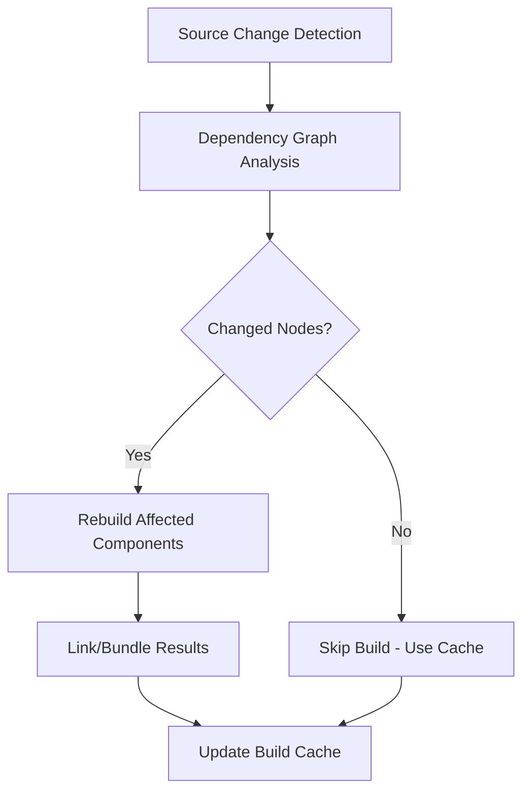
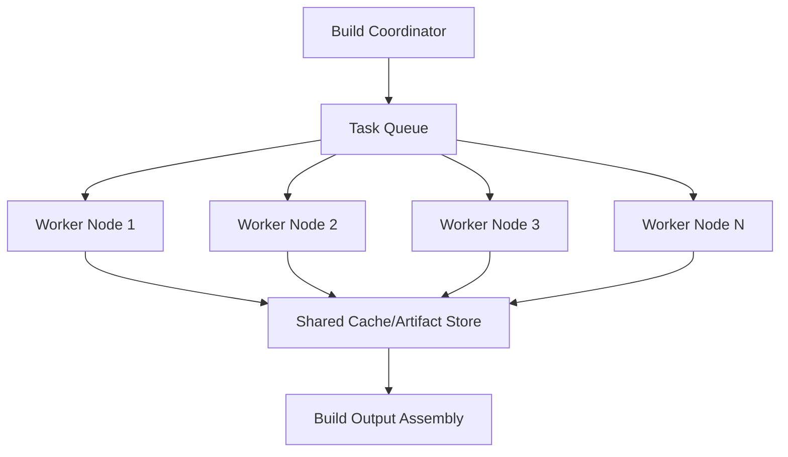
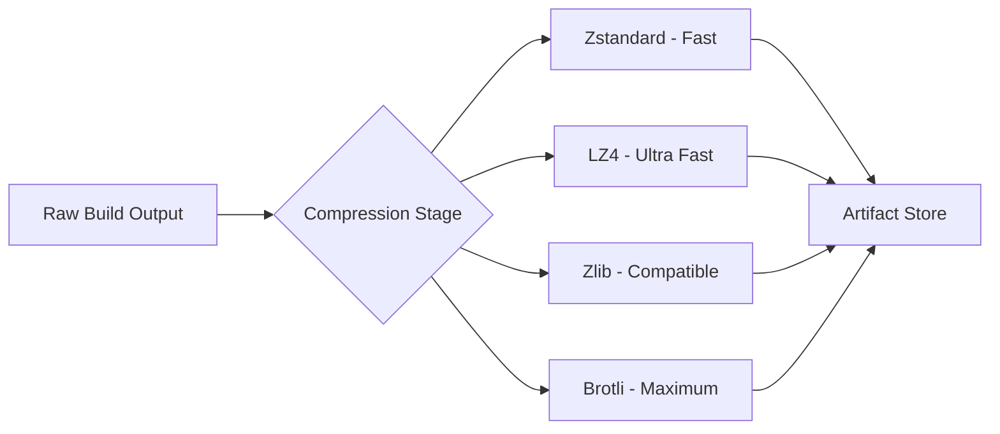
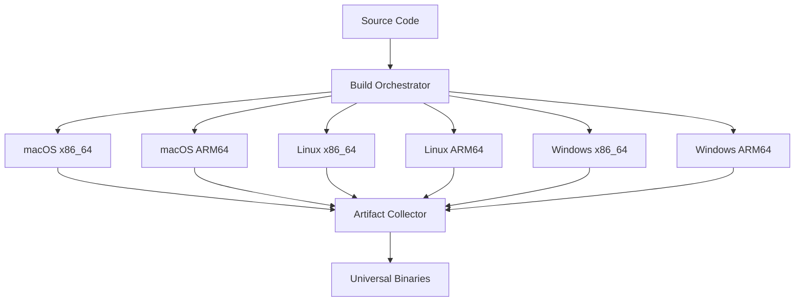
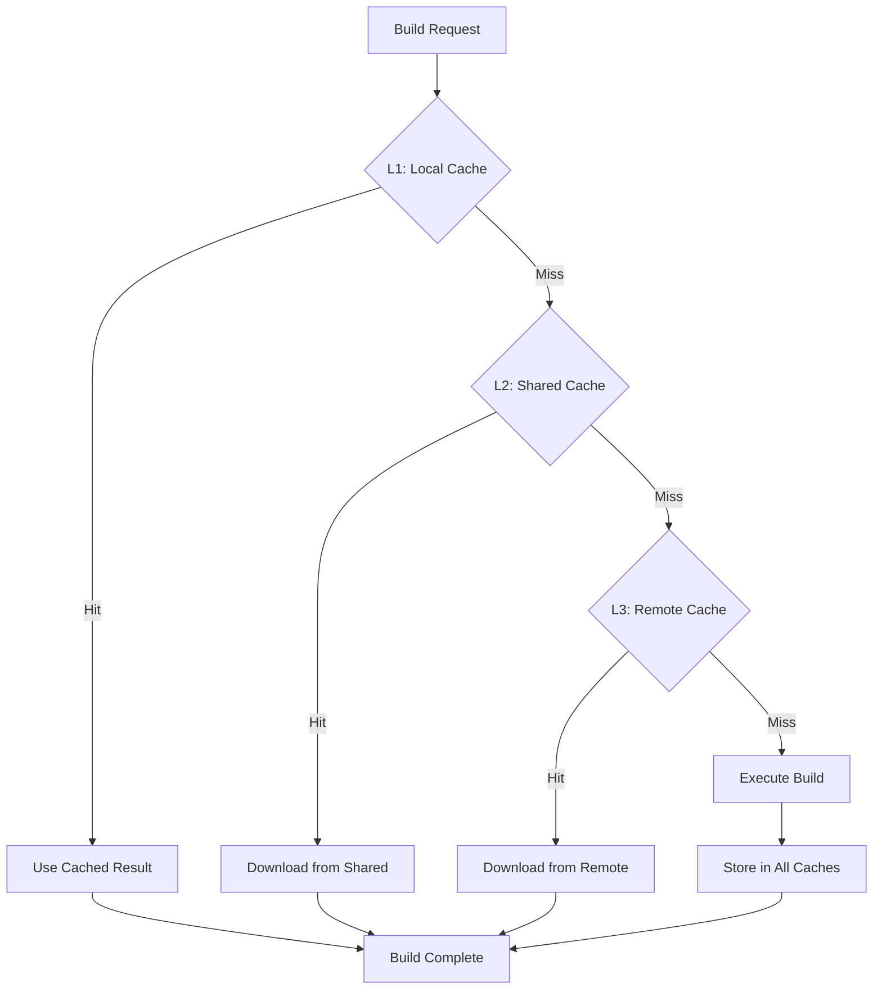

# Performance & Build Optimization Exploration

---
location: utm-dev-production
explored_at: 2026-03-21
tags: [performance, build-optimization, ci-cd, caching, distributed-builds]
---

## Overview

This exploration covers production-grade build optimization strategies for utm-dev, focusing on reducing build times, optimizing resource utilization, and implementing scalable build infrastructure.

## Table of Contents

1. [Incremental/Delta Builds](#incrementaldelta-builds)
2. [Distributed Builds (Build Farm)](#distributed-builds-build-farm)
3. [Build Artifact Compression](#build-artifact-compression)
4. [Parallel Platform Builds](#parallel-platform-builds)
5. [Build Time Profiling](#build-time-profiling)
6. [Cache Optimization Strategies](#cache-optimization-strategies)

---

## Incremental/Delta Builds

### Concept

Incremental builds only rebuild components that have changed since the last successful build, dramatically reducing build times for large projects.

### Architecture



### Implementation Strategies

#### 1. Filesystem Watcher with Change Tracking

```rust
// src/build/incremental/watcher.rs
use notify::{Event, RecommendedWatcher, RecursiveMode, Watcher};
use std::collections::{HashMap, HashSet};
use std::path::{Path, PathBuf};
use std::sync::{Arc, Mutex};
use std::time::SystemTime;

pub struct IncrementalBuildWatcher {
    watcher: RecommendedWatcher,
    file_hashes: Arc<Mutex<HashMap<PathBuf, String>>>,
    dirty_paths: Arc<Mutex<HashSet<PathBuf>>>,
    dependency_graph: DependencyGraph,
}

pub struct DependencyGraph {
    // Maps source files to their dependents
    edges: HashMap<PathBuf, HashSet<PathBuf>>,
    // Maps modules to their source files
    module_sources: HashMap<String, HashSet<PathBuf>>,
}

impl IncrementalBuildWatcher {
    pub fn new(root_path: &Path) -> Result<Self, Box<dyn std::error::Error>> {
        let file_hashes = Arc::new(Mutex::new(HashMap::new()));
        let dirty_paths = Arc::new(Mutex::new(HashSet::new()));

        let hashes_clone = Arc::clone(&file_hashes);
        let dirty_clone = Arc::clone(&dirty_paths);

        let mut watcher = RecommendedWatcher::new(move |res: Result<Event, _>| {
            if let Ok(event) = res {
                for path in event.paths {
                    // Hash the changed file
                    if let Some(hash) = compute_file_hash(&path) {
                        hashes_clone.lock().unwrap().insert(path.clone(), hash);
                        dirty_clone.lock().unwrap().insert(path);
                    }
                }
            }
        })?;

        watcher.watch(root_path, RecursiveMode::Recursive)?;

        Ok(Self {
            watcher,
            file_hashes,
            dirty_paths,
            dependency_graph: DependencyGraph::new(),
        })
    }

    pub fn get_affected_modules(&self) -> HashSet<String> {
        let dirty = self.dirty_paths.lock().unwrap();
        let mut affected = HashSet::new();

        for path in dirty.iter() {
            // Find all modules that depend on this file
            if let Some(dependents) = self.dependency_graph.get_dependents(path) {
                for dependent in dependents {
                    affected.insert(dependent.clone());
                }
            }
        }

        affected
    }

    pub fn mark_clean(&self, paths: &[PathBuf]) {
        let mut dirty = self.dirty_paths.lock().unwrap();
        for path in paths {
            dirty.remove(path);
        }
    }
}

fn compute_file_hash(path: &Path) -> Option<String> {
    use sha2::{Sha256, Digest};
    std::fs::read(path)
        .ok()
        .map(|content| {
            let mut hasher = Sha256::new();
            hasher.update(&content);
            format!("{:x}", hasher.finalize())
        })
}
```

#### 2. Build Manifest with Content Hashing

```toml
# .build-manifest.toml
[build]
version = "1.0.0"
incremental = true
cache_dir = ".build-cache"

[modules]
[modules.core]
path = "src/core"
hash = "a1b2c3d4e5f6..."
dependencies = []
artifacts = ["core.o", "core.d"]

[modules.renderer]
path = "src/renderer"
hash = "f6e5d4c3b2a1..."
dependencies = ["core"]
artifacts = ["renderer.o", "renderer.d"]

[modules.bridge]
path = "src/bridge"
hash = "1a2b3c4d5e6f..."
dependencies = ["core", "renderer"]
artifacts = ["bridge.o", "bridge.d"]
```

```rust
// src/build/incremental/manifest.rs
use serde::{Deserialize, Serialize};
use std::collections::HashMap;
use std::path::PathBuf;

#[derive(Debug, Serialize, Deserialize)]
pub struct BuildManifest {
    pub version: String,
    pub incremental: bool,
    pub cache_dir: PathBuf,
    pub modules: HashMap<String, ModuleInfo>,
}

#[derive(Debug, Serialize, Deserialize)]
pub struct ModuleInfo {
    pub path: PathBuf,
    pub hash: String,
    pub dependencies: Vec<String>,
    pub artifacts: Vec<String>,
    pub last_built: Option<u64>,
}

impl BuildManifest {
    pub fn load(path: &PathBuf) -> Result<Self, Box<dyn std::error::Error>> {
        let content = std::fs::read_to_string(path)?;
        Ok(toml::from_str(&content)?)
    }

    pub fn get_rebuild_order(&self, changed_modules: &[String]) -> Vec<String> {
        // Topological sort of affected modules
        let mut rebuild_order = Vec::new();
        let mut visited = HashSet::new();

        for module in changed_modules {
            self.visit_module(module, &mut rebuild_order, &mut visited);
        }

        rebuild_order
    }

    fn visit_module(
        &self,
        module: &str,
        order: &mut Vec<String>,
        visited: &mut HashSet<String>,
    ) {
        if visited.contains(module) {
            return;
        }

        if let Some(info) = self.modules.get(module) {
            for dep in &info.dependencies {
                self.visit_module(dep, order, visited);
            }
            order.push(module.to_string());
            visited.insert(module.to_string());
        }
    }
}
```

#### 3. Rust Cargo Incremental Integration

```toml
# .cargo/config.toml
[build]
# Enable incremental compilation
incremental = true

# Cache directory
target-dir = "./target"

[profile.dev]
# Optimize incremental builds
incremental = true
debug = "line-tables-only"

[profile.release]
# Fine-tune release builds
incremental = true
lto = "thin"  # Or "fat" for maximum optimization
codegen-units = 16  # Parallel code generation
```

```bash
# Build scripts for incremental builds
#!/bin/bash
# scripts/incremental-build.sh

set -e

CACHEDIR=".build-cache"
MANIFEST="$CACHEDIR/manifest.json"

# Initialize cache directory
mkdir -p "$CACHEDIR"

# Get changed files since last build
if [ -f "$MANIFEST" ]; then
    LAST_BUILD=$(jq -r '.last_build' "$MANIFEST")
    CHANGED_FILES=$(git diff --name-only "$LAST_BUILD" 2>/dev/null || echo "")
else
    CHANGED_FILES="all"
fi

# Determine what needs rebuilding
if [ "$CHANGED_FILES" = "all" ] || [ -z "$CHANGED_FILES" ]; then
    echo "Full build required"
    cargo build --release
else
    # Check which modules are affected
    AFFECTED_MODULES=()
    for file in $CHANGED_FILES; do
        if [[ $file == src/core/* ]]; then
            AFFECTED_MODULES+=("core")
        elif [[ $file == src/renderer/* ]]; then
            AFFECTED_MODULES+=("renderer")
        elif [[ $file == src/bridge/* ]]; then
            AFFECTED_MODULES+=("bridge")
        fi
    done

    if [ ${#AFFECTED_MODULES[@]} -eq 0 ]; then
        echo "No changes detected, skipping build"
        exit 0
    fi

    echo "Building affected modules: ${AFFECTED_MODULES[*]}"
    cargo build --release
fi

# Update manifest
cat > "$MANIFEST" <<EOF
{
    "last_build": "$(git rev-parse HEAD)",
    "timestamp": $(date +%s)
}
EOF
```

---

## Distributed Builds (Build Farm)

### Concept

Distribute build tasks across multiple machines to parallelize compilation and reduce total build time.

### Architecture



### Implementation with Mozilla sccache

```toml
# .sccache-config.toml
# Server configuration
[cache]
# Redis-backed distributed cache
type = "redis"
url = "redis://build-cluster:6379"

# S3-compatible artifact storage
[storage]
type = "s3"
bucket = "utm-build-cache"
region = "us-east-1"
endpoint = "https://minio.build-cluster:9000"
access_key = "${SCCACHE_ACCESS_KEY}"
secret_key = "${SCCACHE_SECRET_KEY}"

# Compression for artifacts
compression = "zstd"
compression_level = 3

[server]
# Port for build requests
port = 31337
# Max concurrent compilations per worker
max_jobs = 8
# Request timeout
timeout = 300
```

```bash
#!/bin/bash
# scripts/setup-distributed-build.sh

# Install sccache
cargo install sccache

# Configure for distributed builds
export SCCACHE_START_SERVER=true
export SCCACHE_CONF="$PWD/.sccache-config.toml"
export RUSTC_WRAPPER=sccache

# Start the scheduler (coordinator)
sccache --start-server

# For worker nodes, configure as compilation targets
# /etc/sccache/worker-config.toml
cat > /etc/sccache/worker-config.toml << 'EOF'
[worker]
scheduler_endpoint = "build-scheduler.utm-dev:31337"
worker_endpoint = "0.0.0.0:31338"
max_job_count = $(nproc)
cache_dir = "/mnt/ssd/sccache"
EOF

# Start worker daemon
sccache-dist scheduler --config /etc/sccache/scheduler.toml &
sccache-dist server --config /etc/sccache/worker-config.toml &
```

### Custom Build Farm with Tokio

```rust
// src/build/farm/coordinator.rs
use tokio::sync::{broadcast, mpsc};
use std::collections::HashMap;
use std::net::SocketAddr;
use serde::{Deserialize, Serialize};

#[derive(Debug, Clone, Serialize, Deserialize)]
pub struct BuildTask {
    pub id: String,
    pub module: String,
    pub source_hash: String,
    pub dependencies: Vec<String>,
    pub priority: u8,
}

#[derive(Debug, Clone, Serialize, Deserialize)]
pub struct BuildResult {
    pub task_id: String,
    pub success: bool,
    pub artifact_path: Option<String>,
    pub duration_ms: u64,
    pub worker_id: String,
    pub error: Option<String>,
}

pub struct BuildCoordinator {
    task_queue: mpsc::Sender<BuildTask>,
    result_rx: mpsc::Receiver<BuildResult>,
    workers: HashMap<String, WorkerInfo>,
    pending_tasks: HashMap<String, BuildTask>,
    completed_tasks: HashMap<String, BuildResult>,
}

struct WorkerInfo {
    addr: SocketAddr,
    capacity: u32,
    current_load: u32,
    last_heartbeat: std::time::Instant,
}

impl BuildCoordinator {
    pub async fn new() -> Self {
        let (task_tx, mut task_rx) = mpsc::channel::<BuildTask>(1000);
        let (result_tx, result_rx) = mpsc::channel::<BuildResult>(1000);

        // Spawn worker manager
        let result_tx_clone = result_tx.clone();
        tokio::spawn(async move {
            while let Some(task) = task_rx.recv().await {
                // Dispatch task to least-loaded worker
                // This is simplified - real implementation would have worker pool
            }
        });

        Self {
            task_queue: task_tx,
            result_rx,
            workers: HashMap::new(),
            pending_tasks: HashMap::new(),
            completed_tasks: HashMap::new(),
        }
    }

    pub async fn submit_build(&self, task: BuildTask) -> Result<String, Box<dyn std::error::Error>> {
        self.task_queue.send(task.clone()).await?;
        Ok(task.id)
    }

    pub async fn wait_for_completion(&mut self, task_id: &str) -> BuildResult {
        while let Some(result) = self.result_rx.recv().await {
            if result.task_id == task_id {
                return result;
            }
            self.completed_tasks.insert(result.task_id.clone(), result);
        }
        unreachable!()
    }
}

// Worker node implementation
// src/build/farm/worker.rs
pub struct BuildWorker {
    coordinator_addr: String,
    worker_id: String,
    max_concurrent: usize,
}

impl BuildWorker {
    pub async fn connect(&self) -> Result<(), Box<dyn std::error::Error>> {
        // Connect to coordinator
        // Register worker capabilities
        // Start receiving tasks
        Ok(())
    }

    async fn execute_task(&self, task: BuildTask) -> BuildResult {
        let start = std::time::Instant::now();

        let result = tokio::task::spawn_blocking(move || {
            // Execute the actual build command
            std::process::Command::new("cargo")
                .arg("build")
                .arg("--release")
                .output()
        }).await;

        BuildResult {
            task_id: task.id,
            success: result.is_ok(),
            artifact_path: None,
            duration_ms: start.elapsed().as_millis() as u64,
            worker_id: self.worker_id.clone(),
            error: result.err().map(|e| e.to_string()),
        }
    }
}
```

### GitHub Actions Self-Hosted Runners

```yaml
# .github/workflows/distributed-build.yml
name: Distributed Build

on: [push, pull_request]

jobs:
  coordinate:
    runs-on: self-hosted-coordinator
    outputs:
      build-matrix: ${{ steps.matrix.outputs.matrix }}
    steps:
      - uses: actions/checkout@v4

      - id: matrix
        run: |
          # Analyze project structure and create build matrix
          MODULES=$(find src -name "Cargo.toml" -exec dirname {} \; | jq -R -s -c 'split("\n")[:-1]')
          echo "matrix=$MODULES" >> $GITHUB_OUTPUT

  build-modules:
    needs: coordinate
    runs-on: self-hosted-linux
    strategy:
      matrix:
        module: ${{ fromJson(needs.coordinate.outputs.build-matrix) }}
      fail-fast: false
    steps:
      - uses: actions/checkout@v4

      - name: Cache build artifacts
        uses: actions/cache@v4
        with:
          path: |
            ~/.cargo/registry
            ~/.cargo/git
            target
          key: ${{ runner.os }}-cargo-${{ matrix.module }}-${{ hashFiles('**/Cargo.lock') }}
          restore-keys: |
            ${{ runner.os }}-cargo-${{ matrix.module }}-
            ${{ runner.os }}-cargo-

      - name: Build module
        run: |
          cd ${{ matrix.module }}
          cargo build --release

      - name: Upload artifacts
        uses: actions/upload-artifact@v4
        with:
          name: ${{ matrix.module }}-artifacts
          path: ${{ matrix.module }}/target/release/

  assemble:
    needs: build-modules
    runs-on: self-hosted-linux
    steps:
      - uses: actions/checkout@v4

      - name: Download all artifacts
        uses: actions/download-artifact@v4

      - name: Assemble final build
        run: ./scripts/assemble-build.sh
```

---

## Build Artifact Compression

### Compression Strategies



### Implementation

```rust
// src/build/compression.rs
use std::io::{Read, Write};
use std::path::{Path, PathBuf};

pub enum CompressionAlgorithm {
    Zstd { level: i32 },
    Lz4,
    Gzip { level: u32 },
    Brotli { quality: u32 },
}

pub struct ArtifactCompressor {
    algorithm: CompressionAlgorithm,
    chunk_size: usize,
}

impl ArtifactCompressor {
    pub fn new(algorithm: CompressionAlgorithm) -> Self {
        Self {
            algorithm,
            chunk_size: 64 * 1024, // 64KB chunks
        }
    }

    pub fn compress_file(
        &self,
        input: &Path,
        output: &Path,
    ) -> Result<CompressionStats, Box<dyn std::error::Error>> {
        let input_data = std::fs::read(input)?;
        let original_size = input_data.len();

        let compressed = match &self.algorithm {
            CompressionAlgorithm::Zstd { level } => {
                zstd::encode_all(input_data.as_slice(), *level)?
            }
            CompressionAlgorithm::Lz4 => {
                let mut encoder = lz4::EncoderBuilder::new()
                    .level(4)
                    .build(Vec::new())?;
                encoder.write_all(&input_data)?;
                encoder.finish().0
            }
            CompressionAlgorithm::Gzip { level } => {
                use flate2::write::GzEncoder;
                use flate2::Compression;
                let mut encoder = GzEncoder::new(Vec::new(), Compression::new(*level));
                encoder.write_all(&input_data)?;
                encoder.finish()?
            }
            CompressionAlgorithm::Brotli { quality } => {
                use brotli::CompressorReader;
                let mut reader = CompressorReader::new(&input_data[..], 0, *quality, 0);
                let mut compressed = Vec::new();
                reader.read_to_end(&mut compressed)?;
                compressed
            }
        };

        std::fs::write(output, &compressed)?;

        Ok(CompressionStats {
            original_size,
            compressed_size: compressed.len(),
            ratio: original_size as f64 / compressed.len() as f64,
        })
    }

    pub fn decompress_file(
        &self,
        input: &Path,
        output: &Path,
    ) -> Result<(), Box<dyn std::error::Error>> {
        let compressed = std::fs::read(input)?;

        let decompressed = match &self.algorithm {
            CompressionAlgorithm::Zstd { .. } => {
                zstd::decode_all(compressed.as_slice())?
            }
            CompressionAlgorithm::Lz4 => {
                lz4::decode_block(&compressed)
                    .ok_or("LZ4 decompression failed")?
            }
            CompressionAlgorithm::Gzip { .. } => {
                use flate2::read::GzDecoder;
                let mut decoder = GzDecoder::new(&compressed[..]);
                let mut decompressed = Vec::new();
                decoder.read_to_end(&mut decompressed)?;
                decompressed
            }
            CompressionAlgorithm::Brotli { .. } => {
                use brotli::Decompressor;
                let mut decoder = Decompressor::new(&compressed[..], 0);
                let mut decompressed = Vec::new();
                decoder.read_to_end(&mut decompressed)?;
                decompressed
            }
        };

        std::fs::write(output, decompressed)?;
        Ok(())
    }
}

#[derive(Debug)]
pub struct CompressionStats {
    pub original_size: usize,
    pub compressed_size: usize,
    pub ratio: f64,
}

// Tar archive creation with compression
pub fn create_compressed_archive(
    source_dir: &Path,
    output_path: &Path,
    algorithm: CompressionAlgorithm,
) -> Result<CompressionStats, Box<dyn std::error::Error>> {
    use tar::Builder;
    use std::fs::File;

    // Create tar archive in memory
    let mut tar_data = Vec::new();
    {
        let mut builder = Builder::new(&mut tar_data);
        builder.append_dir_all(".", source_dir)?;
        builder.finish()?;
    }

    // Compress the tar
    let compressor = ArtifactCompressor::new(algorithm);
    let temp_tar = tempfile::NamedTempFile::new()?;
    let temp_compressed = tempfile::NamedTempFile::new()?;

    std::fs::write(temp_tar.path(), &tar_data)?;

    let stats = compressor.compress_file(temp_tar.path(), temp_compressed.path())?;

    std::fs::copy(temp_compressed.path(), output_path)?;

    Ok(stats)
}
```

### Build Artifact Configuration

```yaml
# .build-artifacts.yml
compression:
  # Primary compression algorithm
  default: zstd
  zstd_level: 3

  # Per-artifact-type overrides
  overrides:
    # Debug symbols - maximum compression (rarely accessed)
    "*.debug":
      algorithm: brotli
      quality: 9

    # Shared libraries - fast decompression
    "*.so" | "*.dylib" | "*.dll":
      algorithm: lz4
      level: 1

    # Web assets - balanced
    "*.js" | "*.css" | "*.wasm":
      algorithm: zstd
      level: 5

storage:
  # Local cache
  local:
    path: .build-cache/artifacts
    max_size: 10GB
    eviction: lru

  # Remote storage
  remote:
    type: s3
    bucket: utm-build-artifacts
    prefix: ${CI_PROJECT_NAME}/${CI_COMMIT_REF_NAME}
    lifecycle_days: 30

retention:
  # Keep last N successful builds
  keep_count: 10

  # Keep builds newer than
  keep_days: 7

  # Always keep tags
  keep_tags: true
```

---

## Parallel Platform Builds

### Cross-Compilation Architecture



### Rust Cross-Compilation Setup

```toml
# .cargo/config.toml
[build]
# Default target
target = "x86_64-unknown-linux-gnu"

# Alternative targets for parallel builds
targets = [
    "x86_64-unknown-linux-gnu",
    "aarch64-unknown-linux-gnu",
    "x86_64-apple-darwin",
    "aarch64-apple-darwin",
    "x86_64-pc-windows-gnu",
]

[target.x86_64-unknown-linux-gnu]
linker = "gcc"

[target.aarch64-unknown-linux-gnu]
linker = "aarch64-linux-gnu-gcc"

[target.x86_64-apple-darwin]
linker = "clang"
rustflags = ["-C", "link-args=-framework Foundation"]

[target.aarch64-apple-darwin]
linker = "clang"
rustflags = ["-C", "link-args=-framework Foundation"]

[target.x86_64-pc-windows-gnu]
linker = "x86_64-w64-mingw32-gcc"
```

### Parallel Build Script

```bash
#!/bin/bash
# scripts/parallel-platform-build.sh

set -e

PROJECT_NAME="utm-dev"
VERSION="${VERSION:-$(git describe --tags --always)}"
BUILD_DIR="dist"
MAX_JOBS=${MAX_JOBS:-$(nproc)}

# Define targets
declare -a TARGETS=(
    "x86_64-unknown-linux-gnu"
    "aarch64-unknown-linux-gnu"
    "x86_64-apple-darwin"
    "aarch64-apple-darwin"
    "x86_64-pc-windows-gnu"
)

# Colors for output
RED='\033[0;31m'
GREEN='\033[0;32m'
YELLOW='\033[1;33m'
NC='\033[0m'

log() {
    echo -e "${GREEN}[$(date '+%Y-%m-%d %H:%M:%S')]${NC} $1"
}

error() {
    echo -e "${RED}[ERROR]${NC} $1" >&2
}

# Create build directory
mkdir -p "$BUILD_DIR"

# Install cross-compilation targets
log "Installing cross-compilation targets..."
rustup target add "${TARGETS[@]}"

# Build all platforms in parallel
declare -A PIDS
declare -A LOGS

for target in "${TARGETS[@]}"; do
    log "Starting build for $target"
    LOG_FILE="$BUILD_DIR/build-${target}.log"

    (
        echo "Building $target at $(date)"
        cargo build --release --target "$target" 2>&1 | tee "$LOG_FILE"
        echo "Completed $target at $(date)"
    ) &

    PIDS[$target]=$!
    LOGS[$target]=$LOG_FILE
done

# Wait for all builds and collect results
FAILED=0
SUCCESSFUL=()

for target in "${TARGETS[@]}"; do
    wait ${PIDS[$target]}
    if [ $? -eq 0 ]; then
        log "Successfully built $target"
        SUCCESSFUL+=("$target")
    else
        error "Failed to build $target"
        FAILED=1
    fi
done

if [ $FAILED -eq 1 ]; then
    error "Some builds failed. Check logs in $BUILD_DIR"
    exit 1
fi

# Package artifacts
log "Packaging artifacts..."
for target in "${SUCCESSFUL[@]}"; do
    PLATFORM=$(echo "$target" | cut -d'-' -f3-)
    ARCH=$(echo "$target" | cut -d'-' -f1)

    mkdir -p "$BUILD_DIR/$PLATFORM-$ARCH"
    cp "target/$target/release/$PROJECT_NAME" "$BUILD_DIR/$PLATFORM-$ARCH/"

    # Create compressed archive
    tar -czf "$BUILD_DIR/${PROJECT_NAME}-${VERSION}-${target}.tar.gz" \
        -C "$BUILD_DIR/$PLATFORM-$ARCH" "$PROJECT_NAME"
done

log "All builds completed successfully!"
```

### GitHub Actions Matrix Build

```yaml
# .github/workflows/parallel-build.yml
name: Parallel Platform Builds

on:
  push:
    branches: [main]
  pull_request:

jobs:
  build:
    runs-on: ${{ matrix.runner }}
    strategy:
      fail-fast: false
      matrix:
        include:
          - os: linux
            runner: ubuntu-22.04
            target: x86_64-unknown-linux-gnu
            cross: false

          - os: linux-arm64
            runner: ubuntu-22.04
            target: aarch64-unknown-linux-gnu
            cross: true

          - os: macos-intel
            runner: macos-14
            target: x86_64-apple-darwin
            cross: false

          - os: macos-arm64
            runner: macos-14
            target: aarch64-apple-darwin
            cross: false

          - os: windows
            runner: windows-2022
            target: x86_64-pc-windows-msvc
            cross: false

    steps:
      - uses: actions/checkout@v4

      - name: Install Rust
        uses: dtolnay/rust-action@stable
        with:
          targets: ${{ matrix.target }}

      - name: Install cross (if needed)
        if: matrix.cross
        uses: taiki-e/install-action@cross

      - name: Setup cache
        uses: actions/cache@v4
        with:
          path: |
            ~/.cargo/registry
            ~/.cargo/git
            target
          key: ${{ matrix.os }}-${{ matrix.target }}-${{ hashFiles('**/Cargo.lock') }}

      - name: Build
        run: |
          if [ "${{ matrix.cross }}" = "true" ]; then
            cross build --release --target ${{ matrix.target }}
          else
            cargo build --release --target ${{ matrix.target }}
          fi

      - name: Upload artifact
        uses: actions/upload-artifact@v4
        with:
          name: utm-dev-${{ matrix.target }}
          path: target/${{ matrix.target }}/release/utm-dev*

  universal-binary:
    needs: build
    runs-on: macos-14
    steps:
      - uses: actions/checkout@v4

      - name: Download macOS artifacts
        uses: actions/download-artifact@v4
        with:
          pattern: utm-dev-*darwin*
          merge-multiple: true

      - name: Create universal binary
        run: |
          lipo -create \
            utm-dev-x86_64-apple-darwin/utm-dev \
            utm-dev-aarch64-apple-darwin/utm-dev \
            -output utm-dev-universal

      - name: Upload universal binary
        uses: actions/upload-artifact@v4
        with:
          name: utm-dev-macos-universal
          path: utm-dev-universal
```

---

## Build Time Profiling

### Profiling Tools Setup

```toml
# Cargo.toml - Dev dependencies
[dev-dependencies]
# Build time analysis
cargo-audit = "0.18"
cargo-bloat = "0.12"
cargo-flamegraph = "0.6"
cargo-timing = "0.1"

# Build timing visualization
[build-dependencies]
cc = { version = "1.0", features = ["parallel"] }
```

```bash
#!/bin/bash
# scripts/profile-build.sh

set -e

PROFILE_DIR="build-profiles"
mkdir -p "$PROFILE_DIR"

echo "=== Build Time Profiling ==="
echo ""

# 1. Cargo Build Timings
echo "1. Generating cargo build timings..."
cargo build --release --timings
mv target/cargo-timings/cargo-timing.html "$PROFILE_DIR/build-timings.html"

# 2. Binary Bloat Analysis
echo "2. Analyzing binary bloat..."
cargo bloat --release --crates > "$PROFILE_DIR/binary-bloat.txt"
cargo bloat --release --top 20 >> "$PROFILE_DIR/binary-bloat.txt"

# 3. Dependency Tree with Build Times
echo "3. Generating dependency analysis..."
cargo tree --depth 1 > "$PROFILE_DIR/dependency-tree.txt"

# 4. Compile Time per Crate
echo "4. Profiling crate compile times..."
RUSTFLAGS="-Z self-profile" cargo +nightly build --release
# Use measureme tools to analyze
# summarize target/cargo-timings/ > "$PROFILE_DIR/crate-times.txt"

echo ""
echo "Profile results saved to $PROFILE_DIR/"
```

### Build Time Dashboard

```rust
// src/build/profiling/dashboard.rs
use std::collections::HashMap;
use std::time::{Duration, Instant};
use serde::{Deserialize, Serialize};

#[derive(Debug, Serialize, Deserialize)]
pub struct BuildProfile {
    pub total_duration: Duration,
    pub phases: Vec<PhaseProfile>,
    pub crate_times: HashMap<String, Duration>,
    pub dependency_graph: DependencyGraphProfile,
}

#[derive(Debug, Serialize, Deserialize)]
pub struct PhaseProfile {
    pub name: String,
    pub duration: Duration,
    pub start_time: Instant,
    pub sub_phases: Vec<PhaseProfile>,
}

#[derive(Debug, Serialize, Deserialize)]
pub struct DependencyGraphProfile {
    pub nodes: Vec<CrateNode>,
    pub edges: Vec<DependencyEdge>,
    pub critical_path: Vec<String>,
    pub parallel_efficiency: f64,
}

#[derive(Debug, Serialize, Deserialize)]
pub struct CrateNode {
    pub name: String,
    pub compile_time: Duration,
    pub codegen_time: Duration,
    pub opt_level: u32,
    pub lines_of_code: usize,
}

#[derive(Debug, Serialize, Deserialize)]
pub struct DependencyEdge {
    pub from: String,
    pub to: String,
    pub edge_type: String, // "build", "normal", "dev"
}

pub struct BuildProfiler {
    phases: Vec<PhaseProfile>,
    current_phase: Option<(String, Instant)>,
    crate_times: HashMap<String, Duration>,
}

impl BuildProfiler {
    pub fn new() -> Self {
        Self {
            phases: Vec::new(),
            current_phase: None,
            crate_times: HashMap::new(),
        }
    }

    pub fn start_phase(&mut self, name: &str) {
        self.current_phase = Some((name.to_string(), Instant::now()));
    }

    pub fn end_phase(&mut self) {
        if let Some((name, start)) = self.current_phase.take() {
            self.phases.push(PhaseProfile {
                name,
                duration: start.elapsed(),
                start_time: start,
                sub_phases: Vec::new(),
            });
        }
    }

    pub fn record_crate_time(&mut self, crate_name: &str, duration: Duration) {
        self.crate_times.insert(crate_name.to_string(), duration);
    }

    pub fn generate_report(&self) -> BuildProfile {
        let total_duration = self.phases.iter()
            .map(|p| p.duration)
            .sum();

        // Find critical path through dependency graph
        let critical_path = self.find_critical_path();

        // Calculate parallelization efficiency
        let sequential_time = self.crate_times.values()
            .map(|d| d.as_secs_f64())
            .sum::<f64>();
        let parallel_time = total_duration.as_secs_f64();
        let parallel_efficiency = sequential_time / parallel_time;

        BuildProfile {
            total_duration,
            phases: self.phases.clone(),
            crate_times: self.crate_times.clone(),
            dependency_graph: DependencyGraphProfile {
                nodes: Vec::new(),
                edges: Vec::new(),
                critical_path,
                parallel_efficiency,
            },
        }
    }

    fn find_critical_path(&self) -> Vec<String> {
        // Implement critical path analysis
        // This finds the longest path through the dependency graph
        // which determines the minimum possible build time
        Vec::new()
    }

    pub fn save_report(&self, path: &str) -> std::io::Result<()> {
        let report = self.generate_report();
        let json = serde_json::to_string_pretty(&report)?;
        std::fs::write(path, json)?;
        Ok(())
    }
}

// RUSTC wrapper for profiling
// scripts/rustc-profile-wrapper.sh
#!/bin/bash

PROFILE_LOG="build-profiles/rustc-timings.jsonl"

# Extract crate name from arguments
CRATE_NAME=""
for arg in "$@"; do
    if [[ $arg == --crate-name=* ]]; then
        CRATE_NAME="${arg#--crate-name=}"
    fi
done

START_TIME=$(date +%s.%N)

# Execute actual rustc
/usr/bin/rustc "$@"
EXIT_CODE=$?

END_TIME=$(date +%s.%N)
DURATION=$(echo "$END_TIME - $START_TIME" | bc)

# Log timing
if [ -n "$CRATE_NAME" ]; then
    echo "{\"crate\":\"$CRATE_NAME\",\"duration\":$DURATION,\"timestamp\":$(date -Iseconds)}" >> "$PROFILE_LOG"
fi

exit $EXIT_CODE
```

### CI Build Time Tracking

```yaml
# .github/workflows/build-analytics.yml
name: Build Analytics

on:
  push:
  pull_request:

permissions:
  contents: read

jobs:
  profile-build:
    runs-on: ubuntu-22.04
    steps:
      - uses: actions/checkout@v4

      - name: Install Rust
        uses: dtolnay/rust-action@stable

      - name: Enable build timings
        run: |
          echo '[build]' >> .cargo/config.toml
          echo 'incremental = true' >> .cargo/config.toml

      - name: Build with profiling
        run: |
          cargo build --release --timings
          cargo install cargo-bloat
          cargo bloat --release --crates > bloat-report.txt

      - name: Upload timings
        uses: actions/upload-artifact@v4
        with:
          name: build-profile
          path: |
            target/cargo-timings/
            bloat-report.txt

      - name: Post to Slack (on main)
        if: github.ref == 'refs/heads/main'
        uses: slackapi/slack-github-action@v1
        with:
          payload: |
            {
              "text": "Build completed in ${{ job.status }}\nTimings: ${{ github.server_url }}/${{ github.repository }}/actions/runs/${{ github.run_id }}"
            }
        env:
          SLACK_WEBHOOK_URL: ${{ secrets.SLACK_WEBHOOK }}
```

---

## Cache Optimization Strategies

### Multi-Level Cache Architecture



### Cache Implementation

```rust
// src/build/cache/manager.rs
use std::collections::{HashMap, HashSet};
use std::path::{Path, PathBuf};
use std::time::{Duration, Instant};
use sha2::{Sha256, Digest};
use tokio::sync::RwLock;

pub struct CacheManager {
    config: CacheConfig,
    l1_cache: LocalCache,
    l2_cache: Option<SharedCache>,
    l3_cache: Option<RemoteCache>,
    stats: RwLock<CacheStats>,
}

#[derive(Debug, Clone)]
pub struct CacheConfig {
    pub l1_max_size: u64,
    pub l1_eviction_policy: EvictionPolicy,
    pub l2_endpoint: Option<String>,
    pub l3_endpoint: Option<String>,
    pub compression: CompressionAlgorithm,
}

#[derive(Debug, Clone)]
pub enum EvictionPolicy {
    Lru,
    Lfu,
    Fifo,
    TimeBased(Duration),
}

#[derive(Debug, Default)]
pub struct CacheStats {
    pub l1_hits: u64,
    pub l1_misses: u64,
    pub l2_hits: u64,
    pub l2_misses: u64,
    pub l3_hits: u64,
    pub l3_misses: u64,
    pub total_size: u64,
    pub items_count: u64,
}

impl CacheManager {
    pub async fn new(config: CacheConfig) -> Result<Self, Box<dyn std::error::Error>> {
        Ok(Self {
            l1_cache: LocalCache::new(&config)?,
            l2_cache: config.l2_endpoint.as_ref().map(SharedCache::new),
            l3_cache: config.l3_endpoint.as_ref().map(RemoteCache::new),
            config,
            stats: RwLock::new(CacheStats::default()),
        })
    }

    pub async fn get(&self, key: &CacheKey) -> Option<CacheEntry> {
        // Try L1 first
        if let Some(entry) = self.l1_cache.get(key).await {
            self.stats.write().await.l1_hits += 1;
            return Some(entry);
        }
        self.stats.write().await.l1_misses += 1;

        // Try L2
        if let Some(l2) = &self.l2_cache {
            if let Some(entry) = l2.get(key).await {
                self.stats.write().await.l2_hits += 1;
                // Promote to L1
                self.l1_cache.put(key.clone(), entry.clone()).await;
                return Some(entry);
            }
            self.stats.write().await.l2_misses += 1;
        }

        // Try L3
        if let Some(l3) = &self.l3_cache {
            if let Some(entry) = l3.get(key).await {
                self.stats.write().await.l3_hits += 1;
                // Promote to L1 and L2
                self.l1_cache.put(key.clone(), entry.clone()).await;
                if let Some(l2) = &self.l2_cache {
                    l2.put(key.clone(), entry.clone()).await;
                }
                return Some(entry);
            }
            self.stats.write().await.l3_misses += 1;
        }

        None
    }

    pub async fn put(&self, key: CacheKey, entry: CacheEntry) {
        // Store in all cache levels
        self.l1_cache.put(key.clone(), entry.clone()).await;

        if let Some(l2) = &self.l2_cache {
            l2.put(key.clone(), entry.clone()).await;
        }

        if let Some(l3) = &self.l3_cache {
            l3.put(key, entry).await;
        }
    }

    pub async fn get_stats(&self) -> CacheStats {
        self.stats.read().await.clone()
    }
}

#[derive(Debug, Clone, Hash, PartialEq, Eq)]
pub struct CacheKey {
    pub module: String,
    pub source_hash: String,
    pub config_hash: String,
    pub target: String,
}

impl CacheKey {
    pub fn new(
        module: &str,
        source_files: &[PathBuf],
        config: &BuildConfig,
        target: &str,
    ) -> Self {
        let mut hasher = Sha256::new();

        // Hash all source files
        for file in source_files {
            if let Ok(content) = std::fs::read(file) {
                hasher.update(&content);
            }
        }
        let source_hash = format!("{:x}", hasher.finalize());

        // Hash configuration
        hasher.reset();
        hasher.update(serde_json::to_string(config).unwrap().as_bytes());
        let config_hash = format!("{:x}", hasher.finalize());

        Self {
            module: module.to_string(),
            source_hash,
            config_hash,
            target: target.to_string(),
        }
    }
}

#[derive(Debug, Clone)]
pub struct CacheEntry {
    pub artifacts: Vec<PathBuf>,
    pub metadata: CacheMetadata,
    pub created_at: Instant,
    pub accessed_at: Instant,
    pub access_count: u64,
}

#[derive(Debug, Clone)]
pub struct CacheMetadata {
    pub build_duration: Duration,
    pub compiler_version: String,
    pub rustc_hash: String,
    pub features: Vec<String>,
}

// Local cache with LRU eviction
struct LocalCache {
    cache_dir: PathBuf,
    index: RwLock<HashMap<CacheKey, CacheEntry>>,
    access_order: RwLock<Vec<CacheKey>>,
    max_size: u64,
}

impl LocalCache {
    fn new(config: &CacheConfig) -> Result<Self, Box<dyn std::error::Error>> {
        let cache_dir = PathBuf::from(".build-cache/l1");
        std::fs::create_dir_all(&cache_dir)?;

        Ok(Self {
            cache_dir,
            index: RwLock::new(HashMap::new()),
            access_order: RwLock::new(Vec::new()),
            max_size: config.l1_max_size,
        })
    }

    async fn get(&self, key: &CacheKey) -> Option<CacheEntry> {
        let mut index = self.index.write().await;
        if let Some(entry) = index.get(key) {
            // Update access order for LRU
            let mut order = self.access_order.write().await;
            if let Some(pos) = order.iter().position(|k| k == key) {
                order.remove(pos);
            }
            order.push(key.clone());

            let mut entry = entry.clone();
            entry.access_count += 1;
            entry.accessed_at = Instant::now();

            return Some(entry);
        }
        None
    }

    async fn put(&self, key: CacheKey, entry: CacheEntry) {
        let mut index = self.index.write().await;
        let mut order = self.access_order.write().await;

        // Evict if necessary
        while self.current_size() + self.estimate_entry_size(&entry) > self.max_size {
            if let Some(evict_key) = order.first().cloned() {
                index.remove(&evict_key);
                order.remove(0);
                self.delete_entry(&evict_key).await;
            } else {
                break;
            }
        }

        // Store entry
        order.push(key.clone());
        index.insert(key, entry.clone());

        // Write to disk
        self.write_entry(&key, &entry).await;
    }

    fn current_size(&self) -> u64 {
        // Calculate current cache size on disk
        std::fs::read_dir(&self.cache_dir)
            .map(|entries| {
                entries.filter_map(|e| e.ok())
                    .filter_map(|e| e.metadata().ok())
                    .map(|m| m.len())
                    .sum()
            })
            .unwrap_or(0)
    }

    fn estimate_entry_size(&self, entry: &CacheEntry) -> u64 {
        entry.artifacts.iter()
            .filter_map(|p| std::fs::metadata(p).ok())
            .map(|m| m.len())
            .sum()
    }

    async fn write_entry(&self, key: &CacheKey, entry: &CacheEntry) {
        let key_hash = format!("{:x}", Sha256::digest(key.module.as_bytes()));
        let entry_path = self.cache_dir.join(&key_hash);

        // Serialize and write entry
        if let Ok(serialized) = serde_json::to_string(&entry) {
            let _ = std::fs::write(entry_path, serialized);
        }
    }

    async fn delete_entry(&self, key: &CacheKey) {
        let key_hash = format!("{:x}", Sha256::digest(key.module.as_bytes()));
        let entry_path = self.cache_dir.join(&key_hash);
        let _ = std::fs::remove_file(entry_path);
    }
}

// Shared cache (Redis-backed)
struct SharedCache {
    redis: redis::Client,
}

impl SharedCache {
    fn new(endpoint: &str) -> Self {
        Self {
            redis: redis::Client::open(endpoint).unwrap(),
        }
    }

    async fn get(&self, key: &CacheKey) -> Option<CacheEntry> {
        let mut conn = self.redis.get_async_connection().await.ok()?;
        let key_str = serde_json::to_string(key).ok()?;

        let data: String = redis::cmd("GET")
            .arg(&key_str)
            .query_async(&mut conn)
            .await
            .ok()?;

        serde_json::from_str(&data).ok()
    }

    async fn put(&self, key: CacheKey, entry: CacheEntry) {
        if let Ok(mut conn) = self.redis.get_async_connection().await {
            let key_str = serde_json::to_string(&key).ok()?;
            let value = serde_json::to_string(&entry).ok()?;

            let _: () = redis::cmd("SET")
                .arg(&key_str)
                .arg(&value)
                .arg("EX")
                .arg(86400) // 24 hour TTL
                .query_async(&mut conn)
                .await
                .ok();
        }
    }
}

// Remote cache (S3-backed)
struct RemoteCache {
    s3_client: aws_sdk_s3::Client,
    bucket: String,
}

impl RemoteCache {
    fn new(endpoint: &str) -> Self {
        // Initialize S3 client
        Self {
            s3_client: aws_sdk_s3::Client::new(),
            bucket: "utm-build-cache".to_string(),
        }
    }

    async fn get(&self, key: &CacheKey) -> Option<CacheEntry> {
        let key_str = format!("{}/{}", key.module, key.source_hash);

        let response = self.s3_client
            .get_object()
            .bucket(&self.bucket)
            .key(&key_str)
            .send()
            .await
            .ok()?;

        let body = response.body.collect().await.ok()?;
        serde_json::from_slice(&body.into_bytes()).ok()
    }

    async fn put(&self, key: CacheKey, entry: CacheEntry) {
        let key_str = format!("{}/{}", key.module, key.source_hash);

        if let Ok(body) = serde_json::to_vec(&entry) {
            let _ = self.s3_client
                .put_object()
                .bucket(&self.bucket)
                .key(&key_str)
                .body(body.into())
                .send()
                .await;
        }
    }
}
```

### Cache Warming Strategies

```bash
#!/bin/bash
# scripts/cache-warm.sh

set -e

# Pre-populate cache with common builds
# Run this during off-peak hours or as part of CI setup

CACHE_STRATEGIES=(
    "debug"      # Debug builds
    "release"    # Release builds
    "test"       # Test binaries
    "bench"      # Benchmark binaries
)

TARGETS=(
    "x86_64-unknown-linux-gnu"
    "aarch64-unknown-linux-gnu"
    "x86_64-apple-darwin"
    "aarch64-apple-darwin"
)

FEATURES=(
    ""
    "--features full"
    "--features telemetry"
    "--features plugin-support"
)

echo "Starting cache warmup..."

for strategy in "${CACHE_STRATEGIES[@]}"; do
    for target in "${TARGETS[@]}"; do
        for feature in "${FEATURES[@]}"; do
            echo "Warming cache: $strategy $target $feature"

            # Check if this combination is already cached
            if ! cache-exists "$strategy" "$target" "$feature"; then
                # Build and cache
                cargo build --$strategy --target "$target" $feature

                # Store in cache
                cache-store "$strategy" "$target" "$feature"
            fi
        done
    done
done

echo "Cache warmup complete!"
```

### Cache Analytics

```rust
// src/build/cache/analytics.rs
use std::collections::HashMap;

pub struct CacheAnalytics {
    hit_rates: HashMap<String, Vec<f64>>,
    size_over_time: Vec<(u64, u64)>,
    eviction_stats: EvictionStats,
}

#[derive(Debug, Default)]
pub struct EvictionStats {
    pub total_evictions: u64,
    pub evicted_by_policy: HashMap<String, u64>,
    pub avg_age_at_eviction: f64,
}

impl CacheAnalytics {
    pub fn new() -> Self {
        Self {
            hit_rates: HashMap::new(),
            size_over_time: Vec::new(),
            eviction_stats: EvictionStats::default(),
        }
    }

    pub fn record_hit_rate(&mut self, cache_level: &str, rate: f64) {
        self.hit_rates
            .entry(cache_level.to_string())
            .or_insert_with(Vec::new)
            .push(rate);
    }

    pub fn record_size(&mut self, timestamp: u64, size: u64) {
        self.size_over_time.push((timestamp, size));
    }

    pub fn generate_report(&self) -> CacheReport {
        let mut report = CacheReport::new();

        for (level, rates) in &self.hit_rates {
            let avg_rate = rates.iter().sum::<f64>() / rates.len() as f64;
            report.hit_rates.insert(level.clone(), avg_rate);
        }

        report.recommendations = self.generate_recommendations();
        report
    }

    fn generate_recommendations(&self) -> Vec<String> {
        let mut recommendations = Vec::new();

        if let Some(l1_rates) = self.hit_rates.get("l1") {
            let avg = l1_rates.iter().sum::<f64>() / l1_rates.len() as f64;
            if avg < 0.5 {
                recommendations.push(
                    "L1 cache hit rate is below 50%. Consider increasing cache size."
                );
            }
        }

        if self.eviction_stats.total_evictions > 1000 {
            recommendations.push(
                "High eviction rate detected. Review cache capacity or eviction policy."
            );
        }

        recommendations
    }
}

#[derive(Debug)]
pub struct CacheReport {
    pub hit_rates: HashMap<String, f64>,
    pub recommendations: Vec<String>,
    pub size_trend: Vec<(u64, u64)>,
}

impl CacheReport {
    pub fn new() -> Self {
        Self {
            hit_rates: HashMap::new(),
            recommendations: Vec::new(),
            size_trend: Vec::new(),
        }
    }

    pub fn print(&self) {
        println!("=== Cache Performance Report ===\n");

        println!("Hit Rates:");
        for (level, rate) in &self.hit_rates {
            println!("  {}: {:.2}%", level, rate * 100.0);
        }

        println!("\nRecommendations:");
        for rec in &self.recommendations {
            println!("  - {}", rec);
        }
    }
}
```

---

## Summary & Recommendations

### Key Takeaways

1. **Incremental Builds**: Implement content-based hashing with dependency tracking to rebuild only what's necessary.

2. **Distributed Builds**: Use sccache or custom build farm for parallel compilation across multiple machines.

3. **Artifact Compression**: Use Zstandard for general artifacts, LZ4 for frequently accessed files, Brotli for archival.

4. **Parallel Platform Builds**: Matrix builds in CI with proper cross-compilation toolchains and universal binary creation.

5. **Build Profiling**: Always measure before optimizing. Use cargo-timings, cargo-bloat, and custom profilers.

6. **Cache Strategy**: Multi-level caching (L1 local, L2 shared, L3 remote) with intelligent eviction policies.

### Implementation Priority

| Priority | Feature | Estimated Impact | Effort |
|----------|---------|-----------------|--------|
| 1 | Incremental builds | High | Medium |
| 2 | Build caching | High | Low |
| 3 | Build profiling | Medium | Low |
| 4 | Artifact compression | Medium | Low |
| 5 | Parallel platform builds | High | High |
| 6 | Distributed build farm | Very High | Very High |

### Next Steps

1. Start with basic caching using sccache
2. Implement build timing instrumentation
3. Set up incremental build detection
4. Configure parallel CI builds
5. Evaluate distributed build infrastructure needs
