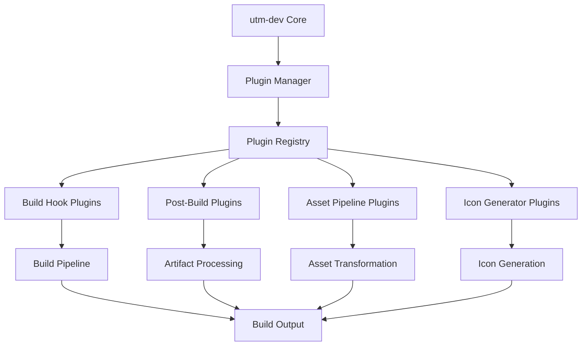
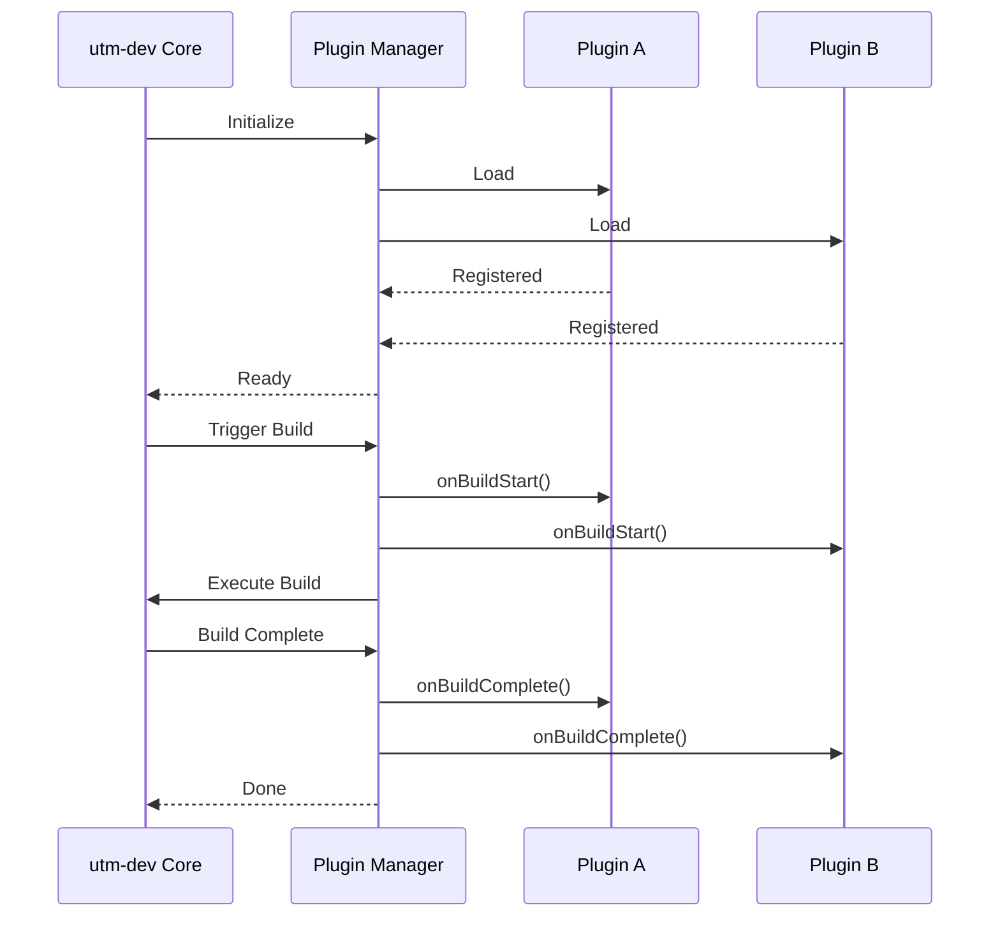
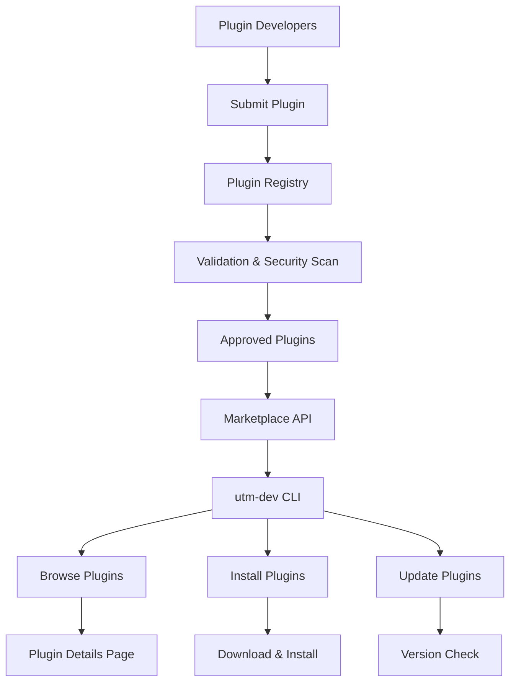

# Plugin System Exploration

---
location: utm-dev-production
explored_at: 2026-03-21
tags: [plugins, extensibility, architecture, api-design, marketplace]
---

## Overview

This exploration covers a comprehensive plugin system for utm-dev, enabling extensibility through custom build hooks, post-build processors, asset pipeline plugins, and a potential plugin marketplace.

## Table of Contents

1. [Plugin Architecture Overview](#plugin-architecture-overview)
2. [Custom Build Hooks](#custom-build-hooks)
3. [Post-Build Processors](#post-build-processors)
4. [Asset Pipeline Plugins](#asset-pipeline-plugins)
5. [Custom Icon Generators](#custom-icon-generators)
6. [Plugin API Design](#plugin-api-design)
7. [Plugin Marketplace Concept](#plugin-marketplace-concept)

---

## Plugin Architecture Overview

### System Architecture



### Plugin Lifecycle



### Plugin Structure

```rust
// src/plugins/core.rs
use std::path::{Path, PathBuf};
use std::sync::Arc;
use serde::{Deserialize, Serialize};

/// Unique identifier for a plugin
#[derive(Debug, Clone, Hash, PartialEq, Eq)]
pub struct PluginId(String);

impl PluginId {
    pub fn new(id: &str) -> Self {
        // Validate plugin ID format: lowercase, hyphens allowed
        assert!(id.chars().all(|c| c.is_ascii_lowercase() || c == '-' || c.is_ascii_digit()));
        Self(id.to_string())
    }
}

/// Plugin metadata from manifest
#[derive(Debug, Clone, Serialize, Deserialize)]
pub struct PluginManifest {
    /// Unique plugin identifier
    pub id: String,

    /// Human-readable name
    pub name: String,

    /// Plugin version (semver)
    pub version: String,

    /// Plugin description
    pub description: Option<String>,

    /// Author information
    pub author: Option<PluginAuthor>,

    /// Plugin type/category
    pub plugin_type: PluginType,

    /// Minimum utm-dev version required
    pub min_utm_version: Option<String>,

    /// Plugin dependencies
    pub dependencies: Vec<PluginDependency>,

    /// Configuration schema
    pub config_schema: Option<serde_json::Value>,

    /// Entry point for WASM plugins
    pub entry_point: Option<String>,

    /// Required capabilities
    pub capabilities: Vec<PluginCapability>,
}

#[derive(Debug, Clone, Serialize, Deserialize)]
pub struct PluginAuthor {
    pub name: String,
    pub email: Option<String>,
    pub url: Option<String>,
}

#[derive(Debug, Clone, Serialize, Deserialize, PartialEq)]
#[serde(rename_all = "snake_case")]
pub enum PluginType {
    BuildHook,
    PostBuild,
    AssetPipeline,
    IconGenerator,
    PlatformExtension,
}

#[derive(Debug, Clone, Serialize, Deserialize, PartialEq, Eq, Hash)]
#[serde(rename_all = "snake_case")]
pub enum PluginCapability {
    FileSystemRead,
    FileSystemWrite,
    NetworkAccess,
    ProcessExecution,
    EnvironmentVariables,
}

#[derive(Debug, Clone, Serialize, Deserialize)]
pub struct PluginDependency {
    pub id: String,
    pub version: String,
    pub optional: bool,
}

/// Plugin instance (loaded and ready)
pub struct PluginInstance {
    pub manifest: PluginManifest,
    pub path: PathBuf,
    pub state: PluginState,
    pub config: serde_json::Value,
    inner: PluginInner,
}

enum PluginInner {
    Wasm(WasmPlugin),
    Native(NativePlugin),
    Script(ScriptPlugin),
}

#[derive(Debug, Clone, PartialEq)]
pub enum PluginState {
    Loaded,
    Initialized,
    Running,
    Stopped,
    Error(String),
}

/// Plugin execution context
pub struct PluginContext {
    pub project_root: PathBuf,
    pub build_dir: PathBuf,
    pub output_dir: PathBuf,
    pub config: BuildConfig,
    pub environment: HashMap<String, String>,
    pub logger: PluginLogger,
}

pub struct PluginLogger {
    plugin_id: String,
}

impl PluginLogger {
    pub fn info(&self, message: &str) {
        println!("[{}] INFO: {}", self.plugin_id, message);
    }

    pub fn warn(&self, message: &str) {
        println!("[{}] WARN: {}", self.plugin_id, message);
    }

    pub fn error(&self, message: &str) {
        eprintln!("[{}] ERROR: {}", self.plugin_id, message);
    }

    pub fn debug(&self, message: &str) {
        println!("[{}] DEBUG: {}", self.plugin_id, message);
    }
}
```

### Plugin Manager

```rust
// src/plugins/manager.rs
use std::collections::HashMap;
use std::path::{Path, PathBuf};
use std::sync::Arc;
use tokio::sync::RwLock;
use anyhow::{Result, Context};

pub struct PluginManager {
    config: PluginManagerConfig,
    plugins: RwLock<HashMap<PluginId, PluginInstance>>,
    registry: RwLock<PluginRegistry>,
    hooks: RwLock<HookRegistry>,
}

#[derive(Debug, Clone)]
pub struct PluginManagerConfig {
    pub plugin_dirs: Vec<PathBuf>,
    pub enabled_plugins: Vec<PluginId>,
    pub disabled_plugins: Vec<PluginId>,
    pub sandbox_enabled: bool,
    pub max_memory_mb: u32,
    pub timeout_ms: u64,
}

impl Default for PluginManagerConfig {
    fn default() -> Self {
        Self {
            plugin_dirs: vec![
                PathBuf::from("./plugins"),
                PathBuf::from("./.utm/plugins"),
            ],
            enabled_plugins: vec![],
            disabled_plugins: vec![],
            sandbox_enabled: true,
            max_memory_mb: 256,
            timeout_ms: 30000,
        }
    }
}

impl PluginManager {
    pub async fn new(config: PluginManagerConfig) -> Result<Self> {
        let manager = Self {
            config,
            plugins: RwLock::new(HashMap::new()),
            registry: RwLock::new(PluginRegistry::new()),
            hooks: RwLock::new(HookRegistry::new()),
        };

        manager.discover_plugins().await?;
        manager.load_enabled_plugins().await?;

        Ok(manager)
    }

    /// Discover all available plugins in configured directories
    pub async fn discover_plugins(&self) -> Result<()> {
        let mut registry = self.registry.write().await;

        for plugin_dir in &self.config.plugin_dirs {
            if !plugin_dir.exists() {
                continue;
            }

            // Look for plugin manifests
            let manifest_paths = find_manifests(plugin_dir).await?;

            for manifest_path in manifest_paths {
                let manifest = PluginManifest::load(&manifest_path).await?;
                registry.register(manifest, manifest_path.parent().unwrap().to_path_buf());
            }
        }

        Ok(())
    }

    /// Load all enabled plugins
    pub async fn load_enabled_plugins(&self) -> Result<()> {
        let registry = self.registry.read().await;
        let mut plugins = self.plugins.write().await;
        let mut hooks = self.hooks.write().await;

        for plugin_info in registry.all() {
            if self.is_plugin_enabled(&plugin_info.manifest.id) {
                let instance = plugin_info.load().await?;

                // Register hooks
                hooks.register_hooks(&instance);

                plugins.insert(PluginId::new(&plugin_info.manifest.id), instance);
            }
        }

        Ok(())
    }

    fn is_plugin_enabled(&self, plugin_id: &str) -> bool {
        let id = PluginId::new(plugin_id);

        // Explicitly disabled takes precedence
        if self.config.disabled_plugins.contains(&id) {
            return false;
        }

        // If enabled list is empty, all non-disabled are enabled
        if self.config.enabled_plugins.is_empty() {
            return true;
        }

        self.config.enabled_plugins.contains(&id)
    }

    /// Execute build start hooks
    pub async fn on_build_start(&self, ctx: &PluginContext) -> Result<()> {
        let hooks = self.hooks.read().await;
        let plugins = self.plugins.read().await;

        for hook in hooks.build_start() {
            if let Some(plugin) = plugins.get(&hook.plugin_id) {
                plugin.execute_build_start(ctx).await?;
            }
        }

        Ok(())
    }

    /// Execute build complete hooks
    pub async fn on_build_complete(&self, ctx: &PluginContext) -> Result<()> {
        let hooks = self.hooks.read().await;
        let plugins = self.plugins.read().await;

        for hook in hooks.build_complete() {
            if let Some(plugin) = plugins.get(&hook.plugin_id) {
                plugin.execute_build_complete(ctx).await?;
            }
        }

        Ok(())
    }

    /// Get plugin by ID
    pub async fn get_plugin(&self, id: &str) -> Option<PluginInstance> {
        let plugins = self.plugins.read().await;
        plugins.get(&PluginId::new(id)).cloned()
    }

    /// List all loaded plugins
    pub async fn list_plugins(&self) -> Vec<PluginInfo> {
        let plugins = self.plugins.read().await;
        plugins.values().map(|p| p.info()).collect()
    }
}

struct HookRegistry {
    build_start: Vec<HookRegistration>,
    build_complete: Vec<HookRegistration>,
    pre_asset_process: Vec<HookRegistration>,
    post_asset_process: Vec<HookRegistration>,
}

struct HookRegistration {
    plugin_id: PluginId,
    priority: i32,
}

impl HookRegistry {
    fn new() -> Self {
        Self {
            build_start: Vec::new(),
            build_complete: Vec::new(),
            pre_asset_process: Vec::new(),
            post_asset_process: Vec::new(),
        }
    }

    fn register_hooks(&mut self, plugin: &PluginInstance) {
        // Parse hooks from plugin manifest or code
        // Priority determines execution order (higher = earlier)
        self.build_start.push(HookRegistration {
            plugin_id: PluginId::new(&plugin.manifest.id),
            priority: 0,
        });
    }

    fn build_start(&self) -> &[HookRegistration] {
        &self.build_start
    }

    fn build_complete(&self) -> &[HookRegistration] {
        &self.build_complete
    }
}
```

---

## Custom Build Hooks

### Hook Types and Execution

```rust
// src/plugins/hooks/build_hooks.rs
use std::path::{Path, PathBuf};
use serde::{Deserialize, Serialize};

/// Build hook execution context
#[derive(Debug, Clone)]
pub struct BuildHookContext {
    pub project_root: PathBuf,
    pub source_files: Vec<PathBuf>,
    pub build_config: BuildConfig,
    pub environment: HashMap<String, String>,
    pub previous_state: Option<BuildState>,
}

/// Build state that can be modified by hooks
#[derive(Debug, Clone, Serialize, Deserialize)]
pub struct BuildState {
    pub preprocessed_files: Vec<PathBuf>,
    pub defines: HashMap<String, String>,
    pub flags: Vec<String>,
    pub artifacts: Vec<PathBuf>,
    pub metadata: BuildMetadata,
}

#[derive(Debug, Clone, Default)]
pub struct BuildMetadata {
    pub custom: HashMap<String, serde_json::Value>,
}

/// Trait for build hook plugins
#[async_trait::async_trait]
pub trait BuildHook {
    /// Called before the build starts
    /// Can modify source files, add defines, set flags
    async fn on_build_start(&self, ctx: &mut BuildHookContext) -> Result<BuildState, PluginError>;

    /// Called after a file is compiled
    async fn on_file_compiled(
        &self,
        ctx: &BuildHookContext,
        file: &Path,
        output: &Path,
    ) -> Result<(), PluginError>;

    /// Called after the build completes
    async fn on_build_complete(
        &self,
        ctx: &BuildHookContext,
        state: &BuildState,
    ) -> Result<(), PluginError>;

    /// Called on build failure
    async fn on_build_failure(
        &self,
        ctx: &BuildHookContext,
        error: &BuildError,
    ) -> Result<(), PluginError>;
}

/// Example: Version Injection Hook
pub struct VersionInjectionHook {
    version: String,
    git_hash: String,
    build_time: String,
}

impl VersionInjectionHook {
    pub fn new() -> Result<Self, Box<dyn std::error::Error>> {
        let version = std::env::var("PROJECT_VERSION")
            .unwrap_or_else(|_| "0.0.0-dev".to_string());

        let git_hash = std::process::Command::new("git")
            .args(["rev-parse", "--short", "HEAD"])
            .output()
            .ok()
            .and_then(|o| String::from_utf8(o.stdout).ok())
            .unwrap_or_else(|| "unknown".to_string());

        let build_time = chrono::Utc::now().format("%Y-%m-%d %H:%M:%S UTC").to_string();

        Ok(Self { version, git_hash, build_time })
    }
}

#[async_trait::async_trait]
impl BuildHook for VersionInjectionHook {
    async fn on_build_start(&self, ctx: &mut BuildHookContext) -> Result<BuildState, PluginError> {
        // Inject version defines
        let mut state = BuildState::default();

        state.defines.insert("VERSION".to_string(), self.version.clone());
        state.defines.insert("GIT_HASH".to_string(), self.git_hash.clone());
        state.defines.insert("BUILD_TIME".to_string(), self.build_time.clone());

        // Generate version header file
        let version_header = ctx.build_dir.join("generated").join("version.h");
        std::fs::create_dir_all(version_header.parent().unwrap())?;

        let content = format!(
            r#"#ifndef GENERATED_VERSION_H
#define GENERATED_VERSION_H

#define VERSION "{}"
#define GIT_HASH "{}"
#define BUILD_TIME "{}"

#endif
"#,
            self.version, self.git_hash, self.build_time
        );

        std::fs::write(&version_header, content)?;
        state.preprocessed_files.push(version_header);

        Ok(state)
    }

    async fn on_file_compiled(
        &self,
        ctx: &BuildHookContext,
        file: &Path,
        output: &Path,
    ) -> Result<(), PluginError> {
        // Optional: Add compilation metadata
        Ok(())
    }

    async fn on_build_complete(
        &self,
        ctx: &BuildHookContext,
        state: &BuildState,
    ) -> Result<(), PluginError> {
        // Create version.txt in output
        let version_file = ctx.output_dir.join("version.txt");
        let content = format!(
            "Version: {}\nGit: {}\nBuilt: {}\n",
            self.version, self.git_hash, self.build_time
        );
        std::fs::write(version_file, content)?;

        Ok(())
    }

    async fn on_build_failure(
        &self,
        ctx: &BuildHookContext,
        error: &BuildError,
    ) -> Result<(), PluginError> {
        // Log failure with version info
        eprintln!("Build failed (version {}): {}", self.version, error);
        Ok(())
    }
}

/// Example: Environment Configuration Hook
pub struct EnvConfigHook {
    config_path: PathBuf,
}

impl EnvConfigHook {
    pub fn new(config_path: PathBuf) -> Self {
        Self { config_path }
    }
}

#[async_trait::async_trait]
impl BuildHook for EnvConfigHook {
    async fn on_build_start(&self, ctx: &mut BuildHookContext) -> Result<BuildState, PluginError> {
        let mut state = BuildState::default();

        // Load environment-specific configuration
        if let Ok(config) = std::fs::read_to_string(&self.config_path) {
            let env_config: serde_json::Value = serde_json::from_str(&config)?;

            // Extract defines from config
            if let Some(defines) = env_config.get("defines").and_then(|v| v.as_object()) {
                for (key, value) in defines {
                    state.defines.insert(key.clone(), value.as_str().unwrap_or("").to_string());
                }
            }

            // Extract compiler flags
            if let Some(flags) = env_config.get("flags").and_then(|v| v.as_array()) {
                for flag in flags {
                    if let Some(flag_str) = flag.as_str() {
                        state.flags.push(flag_str.to_string());
                    }
                }
            }
        }

        Ok(state)
    }

    async fn on_file_compiled(
        &self,
        ctx: &BuildHookContext,
        file: &Path,
        output: &Path,
    ) -> Result<(), PluginError> {
        Ok(())
    }

    async fn on_build_complete(
        &self,
        ctx: &BuildHookContext,
        state: &BuildState,
    ) -> Result<(), PluginError> {
        Ok(())
    }

    async fn on_build_failure(
        &self,
        ctx: &BuildHookContext,
        error: &BuildError,
    ) -> Result<(), PluginError> {
        Ok(())
    }
}
```

### WASM-Based Build Hooks

```rust
// src/plugins/wasm_hook.rs
use wasmtime::{Engine, Module, Store, Instance, Func, TypedFunc};
use anyhow::Result;

pub struct WasmBuildHook {
    engine: Engine,
    module: Module,
}

impl WasmBuildHook {
    pub fn new(wasm_path: &Path) -> Result<Self> {
        let engine = Engine::default();
        let module = Module::from_file(&engine, wasm_path)?;

        Ok(Self { engine, module })
    }

    pub async fn execute_build_start(
        &self,
        ctx: &BuildHookContext,
    ) -> Result<BuildState, PluginError> {
        let mut store = Store::new(&self.engine, WasmState::new(ctx));

        // Create host functions
        let log_func = Func::wrap(&mut store, |level: i32, ptr: i32, len: i32| {
            // Implementation of log function for WASM
        });

        let read_file_func = Func::wrap(&mut store, |ptr: i32, len: i32| {
            // File read from host
        });

        let write_file_func = Func::wrap(&mut store, |ptr: i32, len: i32, data_ptr: i32, data_len: i32| {
            // File write to host
        });

        // Instantiate module
        let instance = Instance::new(&mut store, &self.module, &[
            log_func.into(),
            read_file_func.into(),
            write_file_func.into(),
        ])?;

        // Get exported function
        let build_start: TypedFunc<(i32, i32), i32> = instance
            .get_typed_func(&mut store, "on_build_start")
            .ok_or_else(|| PluginError::MissingExport("on_build_start".to_string()))?;

        // Serialize context and pass to WASM
        let ctx_data = serde_json::to_vec(&ctx)?;
        let ctx_ptr = store.data_mut().allocate_memory(&ctx_data)?;

        // Execute hook
        let result_ptr = build_start.call(&mut store, ctx_ptr, ctx_data.len())?;

        // Deserialize result
        let result_data = store.data().read_memory(result_ptr)?;
        let state: BuildState = serde_json::from_slice(&result_data)?;

        Ok(state)
    }
}

struct WasmState {
    memory: Vec<u8>,
    allocations: Vec<(usize, usize)>,
}

impl WasmState {
    fn new(ctx: &BuildHookContext) -> Self {
        Self {
            memory: Vec::with_capacity(1024 * 1024), // 1MB
            allocations: Vec::new(),
        }
    }

    fn allocate_memory(&mut self, data: &[u8]) -> i32 {
        let offset = self.memory.len();
        self.memory.extend_from_slice(data);
        self.allocations.push((offset, data.len()));
        offset as i32
    }

    fn read_memory(&self, ptr: i32) -> &[u8] {
        let offset = ptr as usize;
        // Find allocation and return slice
        &self.memory[offset..]
    }
}
```

### Build Hook Configuration

```yaml
# .utm/build-hooks.yaml
hooks:
  # Built-in hooks
  - name: version-injection
    enabled: true
    config:
      version_source: git
      include_build_time: true

  - name: environment-config
    enabled: true
    config:
      config_path: "./config/build.env.json"

  # Custom WASM plugins
  - name: custom-preprocessor
    enabled: true
    type: wasm
    path: "./plugins/preprocessor.wasm"
    config:
      optimize: true

  # Script-based hooks
  - name: license-header
    enabled: true
    type: script
    language: lua
    path: "./plugins/license-header.lua"
    config:
      header_template: "./templates/license.txt"

# Hook execution order
execution_order:
  - version-injection
  - environment-config
  - custom-preprocessor
  - license-header

# Global settings
settings:
  timeout_ms: 30000
  sandbox_enabled: true
  allow_network: false
```

---

## Post-Build Processors

### Processor Architecture

```rust
// src/plugins/processors/mod.rs
use std::path::{Path, PathBuf};
use std::future::Future;

/// Post-build processor trait
#[async_trait::async_trait]
pub trait PostBuildProcessor: Send + Sync {
    /// Returns the processor name
    fn name(&self) -> &str;

    /// Returns processor priority (higher = runs first)
    fn priority(&self) -> i32 {
        0
    }

    /// Process build artifacts after build completion
    async fn process(&self, ctx: &ProcessorContext) -> Result<ProcessorResult, ProcessorError>;

    /// Validate that processor can run
    fn validate(&self, ctx: &ProcessorContext) -> Result<(), ProcessorError> {
        Ok(())
    }
}

/// Processor execution context
pub struct ProcessorContext {
    pub build_dir: PathBuf,
    pub output_dir: PathBuf,
    pub artifacts: Vec<ArtifactInfo>,
    pub config: ProcessorConfig,
    pub logger: ProcessorLogger,
}

pub struct ArtifactInfo {
    pub path: PathBuf,
    pub artifact_type: ArtifactType,
    pub size: u64,
    pub hash: String,
    pub metadata: ArtifactMetadata,
}

#[derive(Debug, Clone, PartialEq)]
pub enum ArtifactType {
    Executable,
    Library,
    StaticLibrary,
    ObjectFile,
    DebugSymbols,
    ResourceFile,
    WebAsset,
    Other,
}

pub struct ArtifactMetadata {
    pub target: Option<String>,
    pub platform: Option<String>,
    pub architecture: Option<String>,
    pub custom: HashMap<String, serde_json::Value>,
}

#[derive(Debug, Clone)]
pub struct ProcessorConfig {
    pub output_formats: Vec<OutputFormat>,
    pub strip_symbols: bool,
    pub compress: bool,
    pub generate_checksums: bool,
    pub custom: HashMap<String, serde_json::Value>,
}

#[derive(Debug, Clone)]
pub enum OutputFormat {
    TarGz,
    TarXz,
    TarZst,
    Zip,
    Raw,
}

pub struct ProcessorResult {
    pub processed_artifacts: Vec<PathBuf>,
    pub removed_artifacts: Vec<PathBuf>,
    pub generated_files: Vec<PathBuf>,
    pub messages: Vec<ProcessorMessage>,
}

pub struct ProcessorMessage {
    pub level: MessageLevel,
    pub message: String,
}

#[derive(Debug, Clone)]
pub enum MessageLevel {
    Info,
    Warning,
    Error,
}

/// Processor registry and executor
pub struct ProcessorExecutor {
    processors: Vec<Box<dyn PostBuildProcessor>>,
}

impl ProcessorExecutor {
    pub fn new() -> Self {
        Self {
            processors: Vec::new(),
        }
    }

    pub fn register(&mut self, processor: Box<dyn PostBuildProcessor>) {
        self.processors.push(processor);
        // Sort by priority
        self.processors.sort_by(|a, b| b.priority().cmp(&a.priority()));
    }

    pub async fn execute_all(&self, ctx: &ProcessorContext) -> Result<ProcessorResult, ProcessorError> {
        let mut final_result = ProcessorResult {
            processed_artifacts: Vec::new(),
            removed_artifacts: Vec::new(),
            generated_files: Vec::new(),
            messages: Vec::new(),
        };

        for processor in &self.processors {
            // Validate processor can run
            if let Err(e) = processor.validate(ctx) {
                final_result.messages.push(ProcessorMessage {
                    level: MessageLevel::Warning,
                    message: format!("Processor {} skipped: {}", processor.name(), e),
                });
                continue;
            }

            // Execute processor
            match processor.process(ctx).await {
                Ok(result) => {
                    final_result.processed_artifacts.extend(result.processed_artifacts);
                    final_result.removed_artifacts.extend(result.removed_artifacts);
                    final_result.generated_files.extend(result.generated_files);
                    final_result.messages.extend(result.messages);
                }
                Err(e) => {
                    final_result.messages.push(ProcessorMessage {
                        level: MessageLevel::Error,
                        message: format!("Processor {} failed: {}", processor.name(), e),
                    });
                }
            }
        }

        Ok(final_result)
    }
}
```

### Built-in Processors

```rust
// src/plugins/processors/builtin.rs

/// Strip debug symbols processor
pub struct StripProcessor {
    strip_tool: Option<String>,
}

impl StripProcessor {
    pub fn new() -> Self {
        Self { strip_tool: None }
    }

    pub fn with_tool(mut self, tool: &str) -> Self {
        self.strip_tool = Some(tool.to_string());
        self
    }
}

#[async_trait::async_trait]
impl PostBuildProcessor for StripProcessor {
    fn name(&self) -> &str {
        "strip"
    }

    fn priority(&self) -> i32 {
        100 // High priority - run early
    }

    async fn process(&self, ctx: &ProcessorContext) -> Result<ProcessorResult, ProcessorError> {
        if !ctx.config.strip_symbols {
            return Ok(ProcessorResult::default());
        }

        let mut result = ProcessorResult::default();
        let strip_cmd = self.strip_tool.as_deref().unwrap_or("strip");

        for artifact in &ctx.artifacts {
            if matches!(artifact.artifact_type, ArtifactType::Executable | ArtifactType::Library) {
                let stripped_path = ctx.output_dir.join(artifact.path.file_name().unwrap());

                let status = std::process::Command::new(strip_cmd)
                    .arg("-o")
                    .arg(&stripped_path)
                    .arg(&artifact.path)
                    .status()
                    .map_err(|e| ProcessorError::ExecutionError(e.to_string()))?;

                if status.success() {
                    result.processed_artifacts.push(stripped_path);
                    result.messages.push(ProcessorMessage {
                        level: MessageLevel::Info,
                        message: format!("Stripped: {}", artifact.path.display()),
                    });
                }
            }
        }

        Ok(result)
    }
}

/// Compression processor
pub struct CompressProcessor {
    algorithm: CompressionAlgorithm,
}

impl CompressProcessor {
    pub fn new(algorithm: CompressionAlgorithm) -> Self {
        Self { algorithm }
    }
}

#[async_trait::async_trait]
impl PostBuildProcessor for CompressProcessor {
    fn name(&self) -> &str {
        "compress"
    }

    async fn process(&self, ctx: &ProcessorContext) -> Result<ProcessorResult, ProcessorError> {
        if !ctx.config.compress {
            return Ok(ProcessorResult::default());
        }

        let mut result = ProcessorResult::default();

        for output_format in &ctx.config.output_formats {
            let archive_path = match output_format {
                OutputFormat::TarGz => ctx.output_dir.join("build.tar.gz"),
                OutputFormat::TarXz => ctx0.output_dir.join("build.tar.xz"),
                OutputFormat::TarZst => ctx.output_dir.join("build.tar.zst"),
                OutputFormat::Zip => ctx.output_dir.join("build.zip"),
                OutputFormat::Raw => continue,
            };

            create_archive(&ctx.artifacts, &archive_path, output_format)?;

            result.generated_files.push(archive_path);
            result.messages.push(ProcessorMessage {
                level: MessageLevel::Info,
                message: format!("Created archive: {:?}", output_format),
            });
        }

        Ok(result)
    }
}

/// Checksum generator processor
pub struct ChecksumProcessor;

#[async_trait::async_trait]
impl PostBuildProcessor for ChecksumProcessor {
    fn name(&self) -> &str {
        "checksum"
    }

    async fn process(&self, ctx: &ProcessorContext) -> Result<ProcessorResult, ProcessorError> {
        if !ctx.config.generate_checksums {
            return Ok(ProcessorResult::default());
        }

        let mut result = ProcessorResult::default();
        let checksum_file = ctx.output_dir.join("SHA256SUMS");
        let mut checksums = String::new();

        for artifact in &ctx.artifacts {
            let hash = compute_sha256(&artifact.path)?;
            let filename = artifact.path.file_name().unwrap().to_string_lossy();
            checksums.push_str(&format!("{}  {}\n", hash, filename));
        }

        std::fs::write(&checksum_file, checksums)?;

        result.generated_files.push(checksum_file);
        result.messages.push(ProcessorMessage {
            level: MessageLevel::Info,
            message: "Generated SHA256SUMS".to_string(),
        });

        Ok(result)
    }
}

/// Code signing processor (macOS/Windows)
pub struct CodeSignProcessor {
    identity: Option<String>,
    entitlements: Option<PathBuf>,
}

impl CodeSignProcessor {
    pub fn new() -> Self {
        Self {
            identity: None,
            entitlements: None,
        }
    }

    pub fn with_identity(mut self, identity: &str) -> Self {
        self.identity = Some(identity.to_string());
        self
    }

    pub fn with_entitlements(mut self, path: PathBuf) -> Self {
        self.entitlements = Some(path);
        self
    }
}

#[async_trait::async_trait]
impl PostBuildProcessor for CodeSignProcessor {
    fn name(&self) -> &str {
        "codesign"
    }

    fn validate(&self, ctx: &ProcessorContext) -> Result<(), ProcessorError> {
        // Check if we're on macOS and have executables
        let has_executables = ctx.artifacts.iter()
            .any(|a| matches!(a.artifact_type, ArtifactType::Executable));

        if !has_executables {
            return Err(ProcessorError::ValidationFailed(
                "No executables to sign".to_string()
            ));
        }

        Ok(())
    }

    async fn process(&self, ctx: &ProcessorContext) -> Result<ProcessorResult, ProcessorError> {
        let mut result = ProcessorResult::default();

        for artifact in &ctx.artifacts {
            if matches!(artifact.artifact_type, ArtifactType::Executable) {
                let mut cmd = std::process::Command::new("codesign");
                cmd.arg("--sign");

                if let Some(identity) = &self.identity {
                    cmd.arg(identity);
                } else {
                    cmd.arg("-"); // Ad-hoc sign
                }

                if let Some(entitlements) = &self.entitlements {
                    cmd.arg("--entitlements").arg(entitlements);
                }

                cmd.arg(&artifact.path);

                let status = cmd.status()
                    .map_err(|e| ProcessorError::ExecutionError(e.to_string()))?;

                if status.success() {
                    result.processed_artifacts.push(artifact.path.clone());
                    result.messages.push(ProcessorMessage {
                        level: MessageLevel::Info,
                        message: format!("Signed: {}", artifact.path.display()),
                    });
                }
            }
        }

        Ok(result)
    }
}
```

### Post-Build Configuration

```yaml
# .utm/post-build.yaml
processors:
  # Built-in processors
  strip:
    enabled: true
    tool: strip  # Auto-detected if not specified

  compress:
    enabled: true
    algorithm: zstd
    formats:
      - tar.gz
      - tar.zst
      - zip

  checksum:
    enabled: true
    algorithms:
      - sha256
      - sha512

  codesign:
    enabled: false  # Enable for production builds
    identity: "Developer ID"
    entitlements: "./entitlements.xml"
    timestamp_server: "http://timestamp.apple.com"

  # Custom processors
  custom:
    - name: notarize
      type: wasm
      path: "./plugins/notarize.wasm"
      config:
        apple_id: "${APPLE_ID}"
        team_id: "${TEAM_ID}"

    - name: publish-s3
      type: script
      language: lua
      path: "./plugins/publish-s3.lua"
      config:
        bucket: "releases"
        prefix: "${VERSION}/"

# Execution order (if not specified, uses processor priorities)
execution_order:
  - strip
  - codesign
  - compress
  - checksum
  - custom

# Output configuration
output:
  directory: "./dist"
  naming_pattern: "{name}-{version}-{platform}-{arch}.{ext}"
  keep_intermediates: false
```

---

## Asset Pipeline Plugins

### Pipeline Architecture

```rust
// src/plugins/assets/pipeline.rs
use std::path::{Path, PathBuf};
use std::sync::Arc;

/// Asset pipeline processor
pub struct AssetPipeline {
    stages: Vec<PipelineStage>,
    plugins: Vec<Box<dyn AssetPlugin>>,
}

pub struct PipelineStage {
    pub name: String,
    pub plugins: Vec<PluginId>,
    pub condition: Option<StageCondition>,
}

pub struct StageCondition {
    pub file_patterns: Vec<String>,
    pub source_dirs: Vec<PathBuf>,
}

/// Asset plugin trait
#[async_trait::async_trait]
pub trait AssetPlugin: Send + Sync {
    fn name(&self) -> &str;

    fn supported_extensions(&self) -> &[&str];

    async fn process(&self, ctx: &AssetContext) -> Result<AssetResult, AssetError>;

    async fn transform(&self, asset: &Asset) -> Result<Asset, AssetError>;
}

pub struct AssetContext {
    pub source_path: PathBuf,
    pub output_path: PathBuf,
    pub asset_type: AssetType,
    pub config: AssetConfig,
    pub metadata: AssetMetadata,
}

pub struct Asset {
    pub path: PathBuf,
    pub data: Vec<u8>,
    pub metadata: AssetMetadata,
}

#[derive(Debug, Clone)]
pub enum AssetType {
    Image,
    Font,
    Audio,
    Video,
    Data,
    Web,
    Other,
}

pub struct AssetResult {
    pub output_path: PathBuf,
    pub optimized: bool,
    pub size_before: u64,
    pub size_after: u64,
    pub transformations: Vec<String>,
}

/// Built-in asset plugins
pub mod builtin {
    use super::*;

    /// Image optimization plugin
    pub struct ImageOptimizePlugin {
        quality: u8,
        max_width: Option<u32>,
        max_height: Option<u32>,
        formats: Vec<ImageFormat>,
    }

    #[derive(Debug, Clone)]
    pub enum ImageFormat {
        Webp,
        Avif,
        Png,
        Jpeg,
    }

    impl ImageOptimizePlugin {
        pub fn new() -> Self {
            Self {
                quality: 85,
                max_width: None,
                max_height: None,
                formats: vec![ImageFormat::Webp],
            }
        }

        pub fn with_quality(mut self, quality: u8) -> Self {
            self.quality = quality;
            self
        }

        pub fn with_max_size(mut self, width: u32, height: u32) -> Self {
            self.max_width = Some(width);
            self.max_height = Some(height);
            self
        }
    }

    #[async_trait::async_trait]
    impl AssetPlugin for ImageOptimizePlugin {
        fn name(&self) -> &str {
            "image-optimize"
        }

        fn supported_extensions(&self) -> &[&str] {
            &["png", "jpg", "jpeg", "gif", "bmp", "tiff"]
        }

        async fn process(&self, ctx: &AssetContext) -> Result<AssetResult, AssetError> {
            let image = image::open(&ctx.source_path)
                .map_err(|e| AssetError::ProcessingFailed(e.to_string()))?;

            let mut outputs = Vec::new();
            let size_before = std::fs::metadata(&ctx.source_path)?.len();

            for format in &self.formats {
                let mut output = image.clone();

                // Resize if needed
                if let (Some(max_w), Some(max_h)) = (self.max_width, self.max_height) {
                    output = output.resize(max_w, max_h, image::imageops::FilterType::Lanczos3);
                }

                // Determine output path
                let ext = match format {
                    ImageFormat::Webp => "webp",
                    ImageFormat::Avif => "avif",
                    ImageFormat::Png => "png",
                    ImageFormat::Jpeg => "jpg",
                };

                let output_path = ctx.output_path
                    .with_extension(ext);

                // Encode
                match format {
                    ImageFormat::Webp => {
                        output.write_with_encoder(
                            image::WebPEncoder::new_with_quality(
                                std::fs::File::create(&output_path)?,
                                self.quality,
                            )
                        )?;
                    }
                    ImageFormat::Jpeg => {
                        output.to_rgb8().save_with_format(
                            &output_path,
                            image::ImageFormat::Jpeg,
                        )?;
                    }
                    _ => {
                        output.save(&output_path)?;
                    }
                }

                let size_after = std::fs::metadata(&output_path)?.len();

                outputs.push(AssetResult {
                    output_path,
                    optimized: true,
                    size_before,
                    size_after,
                    transformations: vec![format!("{:?}", format)],
                });
            }

            // Return first/best output
            Ok(outputs.remove(0))
        }

        async fn transform(&self, asset: &Asset) -> Result<Asset, AssetError> {
            // In-memory transformation
            Ok(asset.clone())
        }
    }

    /// Font subsetting plugin
    pub struct FontSubsetPlugin {
        characters: String,
        unicode_ranges: Vec<String>,
    }

    impl FontSubsetPlugin {
        pub fn new(characters: &str) -> Self {
            Self {
                characters: characters.to_string(),
                unicode_ranges: Vec::new(),
            }
        }

        pub fn with_unicode_range(mut self, range: &str) -> Self {
            self.unicode_ranges.push(range.to_string());
            self
        }
    }

    #[async_trait::async_trait]
    impl AssetPlugin for FontSubsetPlugin {
        fn name(&self) -> &str {
            "font-subset"
        }

        fn supported_extensions(&self) -> &[&str] {
            &["ttf", "otf", "woff", "woff2"]
        }

        async fn process(&self, ctx: &AssetContext) -> Result<AssetResult, AssetError> {
            use ttf_parser::Face;

            let font_data = std::fs::read(&ctx.source_path)?;
            let face = Face::parse(&font_data, 0)
                .map_err(|e| AssetError::ProcessingFailed(format!("Invalid font: {:?}", e)))?;

            // Create subset with only needed glyphs
            let subset_data = create_font_subset(&face, &self.characters)?;

            let output_path = ctx.output_path.with_extension("woff2");
            std::fs::write(&output_path, &subset_data)?;

            Ok(AssetResult {
                output_path,
                optimized: true,
                size_before: font_data.len() as u64,
                size_after: subset_data.len() as u64,
                transformations: vec!["subset".to_string()],
            })
        }

        async fn transform(&self, asset: &Asset) -> Result<Asset, AssetError> {
            Ok(asset.clone())
        }
    }

    /// SVG optimization plugin
    pub struct SvgOptimizePlugin {
        precision: u8,
        remove_metadata: bool,
        minify: bool,
    }

    impl SvgOptimizePlugin {
        pub fn new() -> Self {
            Self {
                precision: 3,
                remove_metadata: true,
                minify: true,
            }
        }
    }

    #[async_trait::async_trait]
    impl AssetPlugin for SvgOptimizePlugin {
        fn name(&self) -> &str {
            "svg-optimize"
        }

        fn supported_extensions(&self) -> &[&str] {
            &["svg"]
        }

        async fn process(&self, ctx: &AssetContext) -> Result<AssetResult, AssetError> {
            let svg_content = std::fs::read_to_string(&ctx.source_path)?;
            let size_before = svg_content.len() as u64;

            // Parse and optimize
            let mut doc = usvg::Tree::from_str(&svg_content, &usvg::Options::default())
                .map_err(|e| AssetError::ProcessingFailed(e.to_string()))?;

            // Convert back to string
            let optimized = doc.to_string(&usvg::XmlOptions::default());

            // Minify
            let final_content = if self.minify {
                minify_svg(&optimized)
            } else {
                optimized
            };

            std::fs::write(&ctx.output_path, &final_content)?;

            Ok(AssetResult {
                output_path: ctx.output_path.clone(),
                optimized: true,
                size_before,
                size_after: final_content.len() as u64,
                transformations: vec!["optimize".to_string()],
            })
        }

        async fn transform(&self, asset: &Asset) -> Result<Asset, AssetError> {
            Ok(Asset {
                data: String::from_utf8_lossy(&asset.data).to_string().into_bytes(),
                ..asset.clone()
            })
        }
    }
}
```

### Asset Pipeline Configuration

```yaml
# .utm/assets.yaml
pipeline:
  # Asset source directories
  sources:
    - "./assets"
    - "./src/resources"

  # Output directory
  output: "./dist/assets"

  # Default processing stages
  stages:
    - name: preprocess
      plugins:
        - svg-sanitize

    - name: optimize
      plugins:
        - image-optimize
        - font-subset
        - css-minify
        - js-bundle

    - name: fingerprint
      plugins:
        - content-hash

# Plugin configurations
plugins:
  image-optimize:
    quality: 85
    max_width: 1920
    max_height: 1080
    formats:
      - webp
      - avif
    thumbnails:
      enabled: true
      sizes:
        - 320
        - 640
        - 960

  font-subset:
    # Common character sets
    characters: " !\"#$%&'()*+,-./0123456789:;<=>?@ABCDEFGHIJKLMNOPQRSTUVWXYZ[\\]^_`abcdefghijklmnopqrstuvwxyz{|}~"
    unicode_ranges:
      - "U+0000-00FF"  # Latin-1
      - "U+0100-017F"  # Latin Extended-A

  svg-optimize:
    precision: 3
    remove_metadata: true
    minify: true
    convert_shapes: true

  css-minify:
    level: 2  # 1 = basic, 2 = advanced
    source_maps: false

  js-bundle:
    minify: true
    sourcemaps: false
    target: "es2020"

# Content hashing for cache busting
fingerprint:
  enabled: true
  pattern: "{name}.{hash}.{ext}"
  hash_length: 8
  manifest_output: "./dist/assets.json"

# Asset references handling
references:
  # Update CSS/JS references to fingerprinted assets
  update_css: true
  update_js: true
  update_html: true
```

---

## Custom Icon Generators

### Icon Generation Architecture

```rust
// src/plugins/icons/generator.rs
use image::{DynamicImage, ImageFormat};
use std::path::{Path, PathBuf};

/// Icon generator trait
#[async_trait::async_trait]
pub trait IconGenerator: Send + Sync {
    fn name(&self) -> &str;

    fn supported_formats(&self) -> &[IconFormat];

    async fn generate(&self, ctx: &IconContext) -> Result<IconResult, IconError>;
}

pub struct IconContext {
    pub source_image: PathBuf,
    pub output_dir: PathBuf,
    pub formats: Vec<IconFormat>,
    pub sizes: Vec<u32>,
    pub config: IconConfig,
}

#[derive(Debug, Clone)]
pub enum IconFormat {
    Png,
    Ico,
    Icns,
    Svg,
    Webp,
}

pub struct IconConfig {
    pub background_color: Option<[u8; 4]>,
    pub padding_percent: f32,
    pub corner_radius: Option<f32>,
    pub adaptive_foreground: bool,
    pub monochrome_variant: bool,
}

pub struct IconResult {
    pub icons: Vec<GeneratedIcon>,
    pub manifest: IconManifest,
}

pub struct GeneratedIcon {
    pub path: PathBuf,
    pub format: IconFormat,
    pub size: u32,
    pub scale: Option<f32>,
}

pub struct IconManifest {
    pub icons: Vec<ManifestIcon>,
    pub shortcuts: Vec<ShortcutInfo>,
}

#[derive(Debug, Clone, serde::Serialize)]
pub struct ManifestIcon {
    pub src: String,
    pub sizes: String,
    pub format: String,
    pub purpose: String,
}

/// Main icon generator
pub struct IconGeneratorService {
    generators: Vec<Box<dyn IconGenerator>>,
}

impl IconGeneratorService {
    pub fn new() -> Self {
        Self {
            generators: Vec::new(),
        }
    }

    pub fn register(&mut self, generator: Box<dyn IconGenerator>) {
        self.generators.push(generator);
    }

    pub async fn generate_all(&self, ctx: &IconContext) -> Result<IconResult, IconError> {
        let mut result = IconResult {
            icons: Vec::new(),
            manifest: IconManifest {
                icons: Vec::new(),
                shortcuts: Vec::new(),
            },
        };

        // Load and preprocess source image
        let source = image::open(&ctx.source_image)
            .map_err(|e| IconError::SourceLoadFailed(e.to_string()))?;

        let preprocessed = self.preprocess(&source, &ctx.config)?;

        // Generate icons for each format/size combination
        for format in &ctx.formats {
            for &size in &ctx.sizes {
                let icon = self.generate_icon(&preprocessed, format, size, ctx)?;
                result.icons.push(icon);
            }
        }

        // Generate platform-specific bundles
        result.icons.extend(self.generate_ico_bundle(&result.icons, ctx)?);
        result.icons.extend(self.generate_icns_bundle(&result.icons, ctx)?);

        // Generate manifests
        result.manifest = self.generate_manifest(&result.icons, ctx)?;

        Ok(result)
    }

    fn preprocess(&self, image: &DynamicImage, config: &IconConfig) -> Result<DynamicImage, IconError> {
        let mut result = image.clone();

        // Apply background if needed (for transparent images)
        if let Some(bg) = config.background_color {
            result = apply_background(result, bg);
        }

        // Apply padding
        if config.padding_percent > 0.0 {
            result = apply_padding(result, config.padding_percent);
        }

        // Apply corner radius
        if let Some(radius) = config.corner_radius {
            result = apply_corner_radius(result, radius);
        }

        Ok(result)
    }

    fn generate_icon(
        &self,
        source: &DynamicImage,
        format: &IconFormat,
        size: u32,
        ctx: &IconContext,
    ) -> Result<GeneratedIcon, IconError> {
        // Resize to target size
        let resized = source.resize_exact(size, size, image::FilterType::Lanczos3);

        // Determine output path
        let ext = match format {
            IconFormat::Png => "png",
            IconFormat::Ico => "ico",
            IconFormat::Icns => "icns",
            IconFormat::Svg => "svg",
            IconFormat::Webp => "webp",
        };

        let filename = format!("icon-{}x{}.{}", size, size, ext);
        let output_path = ctx.output_dir.join(&filename);

        // Save in target format
        match format {
            IconFormat::Png => {
                resized.save_with_format(&output_path, ImageFormat::Png)?;
            }
            IconFormat::Webp => {
                resized.save_with_format(&output_path, ImageFormat::WebP)?;
            }
            _ => {
                resized.save(&output_path)?;
            }
        }

        Ok(GeneratedIcon {
            path: output_path,
            format: format.clone(),
            size,
            scale: None,
        })
    }
}

/// Windows ICO generator
pub struct IcoGenerator;

impl IcoGenerator {
    pub fn generate_bundle(icons: &[GeneratedIcon], ctx: &IconContext) -> Result<GeneratedIcon, IconError> {
        use ico::{IconDir, IconDirEntry, Resource};

        let png_icons: Vec<_> = icons.iter()
            .filter(|i| matches!(i.format, IconFormat::Png))
            .collect();

        let mut icon_dir = IconDir::new(ico::ResourceType::Icon);

        for png_icon in png_icons {
            let data = std::fs::read(&png_icon.path)?;
            let entry = IconDirEntry::from_png(&data)?;
            icon_dir.add_entry(entry);
        }

        let output_path = ctx.output_dir.join("icon.ico");
        icon_dir.save(&output_path)?;

        Ok(GeneratedIcon {
            path: output_path,
            format: IconFormat::Ico,
            size: 0, // Multi-size
            scale: None,
        })
    }
}

/// macOS ICNS generator
pub struct IcnsGenerator;

impl IcnsGenerator {
    pub fn generate_bundle(icons: &[GeneratedIcon], ctx: &IconContext) -> Result<GeneratedIcon, IconError> {
        use icns::{IconFamily, IconType};

        let mut family = IconFamily::new();

        // Map sizes to ICNS icon types
        let size_mappings = [
            (16, IconType::Rgba32_16x16),
            (32, IconType::Rgba32_32x32),
            (64, IconType::Rgba32_64x64),
            (128, IconType::Rgba32_128x128),
            (256, IconType::Rgba32_256x256),
            (512, IconType::Rgba32_512x512),
        ];

        for (size, icon_type) in size_mappings {
            if let Some(icon) = icons.iter().find(|i| i.size == size) {
                let image = image::open(&icon.path)?;
                let rgba = image.to_rgba8();
                family.set_icon(
                    icon_type,
                    icns::Image::new(
                        size,
                        size,
                        rgba.to_vec(),
                    )
                )?;
            }
        }

        let output_path = ctx.output_dir.join("icon.icns");
        family.write(&std::fs::File::create(&output_path)?)?;

        Ok(GeneratedIcon {
            path: output_path,
            format: IconFormat::Icns,
            size: 0,
            scale: None,
        })
    }
}
```

### Icon Configuration

```yaml
# .utm/icons.yaml
# Source image for icon generation
source: "./assets/app-icon.png"

# Output directory
output: "./dist/icons"

# Formats to generate
formats:
  - png
  - ico
  - icns
  - webp

# Sizes for each format
sizes:
  png: [16, 32, 48, 64, 128, 256, 512, 1024]
  webp: [192, 512]

# Icon processing options
options:
  # Background color for transparent images
  background_color: "#FFFFFF"

  # Padding around the icon (percentage)
  padding: 10

  # Corner radius for rounded icons
  corner_radius: 0.15

  # Generate adaptive icon foreground (Android)
  adaptive_foreground: true

  # Generate monochrome variant
  monochrome: true

# Platform-specific bundles
bundles:
  windows:
    enabled: true
    output: "./dist/icons/icon.ico"

  macos:
    enabled: true
    output: "./dist/icons/icon.icns"

  android:
    enabled: true
    output: "./dist/icons/android/"
    adaptive: true
    round: true

  web:
    enabled: true
    output: "./dist/icons/web/"
    maskable: true

# PWA manifest generation
manifest:
  enabled: true
  output: "./dist/icons/manifest.json"
  include_shortcuts: true
```

---

## Plugin API Design

### Core API Specification

```rust
// src/plugins/api/mod.rs
use std::future::Future;
use serde::{Deserialize, Serialize};

/// Plugin API version
pub const PLUGIN_API_VERSION: u32 = 1;

/// Plugin API trait - implemented by utm-dev for plugins
pub trait UtmDevApi: Send + Sync {
    /// Get the API version
    fn version(&self) -> u32 {
        PLUGIN_API_VERSION
    }

    /// File system operations
    fn fs(&self) -> &dyn FileSystemApi;

    /// Build system operations
    fn build(&self) -> &dyn BuildApi;

    /// Logging
    fn log(&self) -> &dyn LogApi;

    /// Configuration access
    fn config(&self) -> &dyn ConfigApi;

    /// Network access (if permitted)
    fn network(&self) -> Option<&dyn NetworkApi>;
}

/// File system API
pub trait FileSystemApi: Send + Sync {
    fn read(&self, path: &Path) -> Result<Vec<u8>, FsError>;
    fn write(&self, path: &Path, data: &[u8]) -> Result<(), FsError>;
    fn exists(&self, path: &Path) -> bool;
    fn create_dir_all(&self, path: &Path) -> Result<(), FsError>;
    fn read_dir(&self, path: &Path) -> Result<Vec<PathBuf>, FsError>;
    fn remove(&self, path: &Path) -> Result<(), FsError>;
    fn copy(&self, from: &Path, to: &Path) -> Result<(), FsError>;
}

/// Build system API
pub trait BuildApi: Send + Sync {
    fn get_config(&self) -> BuildConfig;
    fn get_source_files(&self) -> Vec<PathBuf>;
    fn get_artifacts(&self) -> Vec<PathBuf>;
    fn add_define(&self, key: &str, value: &str);
    fn add_flag(&self, flag: &str);
    fn add_artifact(&self, path: PathBuf);
    fn emit_error(&self, error: BuildError);
    fn emit_warning(&self, warning: String);
}

/// Logging API
pub trait LogApi: Send + Sync {
    fn debug(&self, message: &str);
    fn info(&self, message: &str);
    fn warn(&self, message: &str);
    fn error(&self, message: &str);
}

/// Configuration API
pub trait ConfigApi: Send + Sync {
    fn get(&self, key: &str) -> Option<serde_json::Value>;
    fn get_string(&self, key: &str) -> Option<String>;
    fn get_number(&self, key: &str) -> Option<f64>;
    fn get_bool(&self, key: &str) -> Option<bool>;
    fn get_object(&self, key: &str) -> Option<serde_json::Map<String, serde_json::Value>>;
}

/// Network API (optional)
pub trait NetworkApi: Send + Sync {
    fn get(&self, url: &str) -> Result<Vec<u8>, NetworkError>;
    fn post(&self, url: &str, data: &[u8]) -> Result<Vec<u8>, NetworkError>;
}
```

### Plugin SDK

```rust
// Plugin SDK for building plugins
// plugins/sdk/src/lib.rs

pub use utm_dev_plugin::*;

/// Macro for registering a plugin
#[macro_export]
macro_rules! register_plugin {
    ($plugin_type:ty) => {
        #[no_mangle]
        pub extern "C" fn _plugin_register() -> *mut PluginRegistration {
            Box::into_raw(Box::new(PluginRegistration {
                plugin_type: std::any::TypeId::of::<$plugin_type>(),
                create: |api| Box::new(<$plugin_type>::new(api)),
            }))
        }
    };
}

/// Base plugin struct
pub struct Plugin {
    api: Box<dyn UtmDevApi>,
}

impl Plugin {
    pub fn new(api: Box<dyn UtmDevApi>) -> Self {
        Self { api }
    }

    pub fn api(&self) -> &dyn UtmDevApi {
        &*self.api
    }
}

/// Build hook plugin base
pub trait BuildHookPlugin: Send + Sync {
    fn on_build_start(&mut self, ctx: &BuildHookContext) -> Result<BuildState, PluginError>;
    fn on_build_complete(&mut self, ctx: &BuildHookContext) -> Result<(), PluginError>;
}

/// Post-build processor plugin base
pub trait PostBuildPlugin: Send + Sync {
    fn process(&mut self, ctx: &ProcessorContext) -> Result<ProcessorResult, PluginError>;
}

/// Asset pipeline plugin base
pub trait AssetPlugin: Send + Sync {
    fn supported_extensions(&self) -> &[&str];
    fn process(&self, ctx: &AssetContext) -> Result<AssetResult, PluginError>;
}

/// Icon generator plugin base
pub trait IconGeneratorPlugin: Send + Sync {
    fn generate(&self, ctx: &IconContext) -> Result<IconResult, PluginError>;
}
```

### Example Plugin Implementation

```rust
// Example plugin: License Header Injector
// plugins/license-header/src/lib.rs

use utm_dev_plugin::*;

pub struct LicenseHeaderPlugin {
    api: Box<dyn UtmDevApi>,
    header_template: String,
}

impl LicenseHeaderPlugin {
    pub fn new(api: Box<dyn UtmDevApi>) -> Self {
        let header = api.config().get_string("header_template")
            .and_then(|path| api.fs().read(path.as_ref()).ok())
            .and_then(|data| String::from_utf8(data).ok())
            .unwrap_or_else(|| DEFAULT_HEADER.to_string());

        Self { api, header_template: header }
    }
}

register_plugin!(LicenseHeaderPlugin);

impl BuildHookPlugin for LicenseHeaderPlugin {
    fn on_build_start(&mut self, ctx: &BuildHookContext) -> Result<BuildState, PluginError> {
        self.api.log().info("License Header Plugin starting...");

        // Find all source files
        let source_files = ctx.source_files.iter()
            .filter(|f| matches!(f.extension().and_then(|e| e.to_str()), Some("rs" | "c" | "cpp" | "h")))
            .collect::<Vec<_>>();

        self.api.log().info(&format!("Found {} source files", source_files.len()));

        let mut state = BuildState::default();

        // Inject headers
        for file in source_files {
            self.inject_header(file)?;
        }

        Ok(state)
    }

    fn on_build_complete(&mut self, ctx: &BuildHookContext) -> Result<(), PluginError> {
        self.api.log().info("License Header Plugin completed");
        Ok(())
    }
}

impl LicenseHeaderPlugin {
    fn inject_header(&self, file: &Path) -> Result<(), PluginError> {
        let content = self.api.fs().read(file)
            .map_err(|e| PluginError::FsError(e.to_string()))?;

        let content_str = String::from_utf8_lossy(&content);

        // Check if header already exists
        if content_str.contains(&self.header_template[..100.min(self.header_template.len())]) {
            return Ok(());
        }

        // Determine comment style based on file extension
        let commented_header = match file.extension().and_then(|e| e.to_str()) {
            Some("rs") => self.header_template.lines()
                .map(|l| format!("// {}", l))
                .collect::<Vec<_>>()
                .join("\n"),
            Some("c" | "cpp" | "h") => format!("/*\n{}\n*/", self.header_template),
            _ => return Ok(()),
        };

        // Prepend header
        let new_content = format!("{}\n\n{}", commented_header, content_str);

        self.api.fs().write(file, new_content.as_bytes())
            .map_err(|e| PluginError::FsError(e.to_string()))?;

        self.api.log().info(&format!("Injected header: {}", file.display()));

        Ok(())
    }
}

const DEFAULT_HEADER: &str = "Copyright (c) 2026 Example Corp
Licensed under the MIT License.
See LICENSE file for details.";
```

---

## Plugin Marketplace Concept

### Marketplace Architecture



### Plugin Registry Schema

```rust
// src/plugins/marketplace/registry.rs
use serde::{Deserialize, Serialize};

/// Plugin entry in the marketplace
#[derive(Debug, Clone, Serialize, Deserialize)]
pub struct MarketplacePlugin {
    pub id: String,
    pub name: String,
    pub description: String,
    pub version: String,
    pub author: AuthorInfo,
    pub category: PluginCategory,
    pub tags: Vec<String>,
    pub downloads: u64,
    pub rating: Option<f32>,
    pub reviews_count: u64,
    pub created_at: String,
    pub updated_at: String,
    pub versions: Vec<PluginVersion>,
    pub manifest: PluginManifest,
    pub verification_status: VerificationStatus,
}

#[derive(Debug, Clone, Serialize, Deserialize)]
pub struct PluginVersion {
    pub version: String,
    pub download_url: String,
    pub checksum: String,
    pub min_utm_version: String,
    pub release_notes: Option<String>,
    pub published_at: String,
    pub downloads: u64,
}

#[derive(Debug, Clone, Serialize, Deserialize)]
pub enum PluginCategory {
    BuildHook,
    PostBuild,
    AssetPipeline,
    IconGenerator,
    PlatformExtension,
    Utility,
    Other,
}

#[derive(Debug, Clone, Serialize, Deserialize)]
pub enum VerificationStatus {
    Unverified,
    CommunityVerified,
    OfficiallyVerified,
}

/// Plugin search and filtering
pub struct PluginQuery {
    pub category: Option<PluginCategory>,
    pub tags: Vec<String>,
    pub author: Option<String>,
    pub min_rating: Option<f32>,
    pub verified_only: bool,
    pub sort: PluginSort,
    pub page: u32,
    pub per_page: u32,
}

pub enum PluginSort {
    Relevance,
    Downloads,
    Rating,
    Newest,
    Updated,
}
```

### CLI Plugin Commands

```rust
// src/cli/plugins.rs
use clap::{Parser, Subcommand};

#[derive(Parser)]
pub struct PluginCommand {
    #[command(subcommand)]
    command: PluginSubcommand,
}

#[derive(Subcommand)]
pub enum PluginSubcommand {
    /// List installed plugins
    List {
        #[arg(short, long)]
        all: bool,
    },

    /// Search marketplace for plugins
    Search {
        /// Search query
        query: String,

        /// Filter by category
        #[arg(short, long)]
        category: Option<String>,

        /// Only show verified plugins
        #[arg(long)]
        verified: bool,
    },

    /// Show plugin details
    Info {
        /// Plugin ID
        plugin_id: String,
    },

    /// Install a plugin
    Install {
        /// Plugin ID or path to plugin file
        plugin: String,

        /// Specific version to install
        #[arg(short, long)]
        version: Option<String>,

        /// Don't validate plugin signature
        #[arg(long)]
        no_validate: bool,
    },

    /// Update plugins
    Update {
        /// Specific plugin to update
        plugin_id: Option<String>,

        /// List available updates without installing
        #[arg(short, long)]
        dry_run: bool,
    },

    /// Uninstall a plugin
    Uninstall {
        /// Plugin ID
        plugin_id: String,

        /// Remove plugin configuration
        #[arg(long)]
        purge: bool,
    },

    /// Publish a plugin to marketplace
    Publish {
        /// Path to plugin manifest
        manifest: String,

        /// Plugin package file
        package: Option<String>,
    },
}

impl PluginCommand {
    pub async fn execute(self) -> Result<(), Error> {
        match self.command {
            PluginSubcommand::List { all } => {
                let manager = PluginManager::load().await?;
                let plugins = if all {
                    manager.list_all_plugins().await?
                } else {
                    manager.list_enabled_plugins().await?
                };

                for plugin in plugins {
                    println!("{} v{} - {}", plugin.id, plugin.version, plugin.name);
                }
            }

            PluginSubcommand::Search { query, category, verified } => {
                let marketplace = MarketplaceClient::new()?;
                let results = marketplace.search(&query, category, verified).await?;

                for plugin in results {
                    println!(
                        "{} v{} - {} ({:.1}★, {} downloads)",
                        plugin.name,
                        plugin.version,
                        plugin.description,
                        plugin.rating.unwrap_or(0.0),
                        plugin.downloads
                    );
                }
            }

            PluginSubcommand::Install { plugin, version, no_validate } => {
                let manager = PluginManager::load().await?;

                if plugin.starts_with(".") || plugin.starts_with("/") {
                    // Local installation
                    manager.install_local(plugin.as_ref()).await?;
                } else {
                    // Marketplace installation
                    let marketplace = MarketplaceClient::new()?;
                    let plugin_data = marketplace.download(&plugin, version.as_deref()).await?;

                    if !no_validate {
                        plugin_data.validate_signature()?;
                    }

                    manager.install_plugin(plugin_data).await?;
                }

                println!("Plugin installed successfully!");
            }

            PluginSubcommand::Update { plugin_id, dry_run } => {
                let manager = PluginManager::load().await?;
                let marketplace = MarketplaceClient::new()?;

                let updates = if let Some(id) = plugin_id {
                    manager.check_plugin_update(&id).await?
                } else {
                    manager.check_all_updates().await?
                };

                if updates.is_empty() {
                    println!("All plugins are up to date!");
                } else {
                    if dry_run {
                        println!("Available updates:");
                        for update in updates {
                            println!("  {} -> {}", update.current, update.latest);
                        }
                    } else {
                        for update in updates {
                            println!("Updating {}...", update.plugin_id);
                            marketplace.install_update(&update).await?;
                        }
                    }
                }
            }

            _ => {}
        }

        Ok(())
    }
}
```

### Marketplace API

```yaml
# Marketplace API Specification

openapi: 3.0.0
info:
  title: utm-dev Plugin Marketplace API
  version: 1.0.0

paths:
  /plugins:
    get:
      summary: Search plugins
      parameters:
        - name: q
          in: query
          schema:
            type: string
        - name: category
          in: query
          schema:
            type: string
        - name: sort
          in: query
          schema:
            type: string
            enum: [relevance, downloads, rating, newest]
        - name: page
          in: query
          schema:
            type: integer
        - name: per_page
          in: query
          schema:
            type: integer

  /plugins/{id}:
    get:
      summary: Get plugin details
      parameters:
        - name: id
          in: path
          required: true
          schema:
            type: string

  /plugins/{id}/download:
    get:
      summary: Download plugin
      parameters:
        - name: id
          in: path
          required: true
        - name: version
          in: query
          schema:
            type: string

  /plugins/{id}/versions:
    get:
      summary: List plugin versions

  /categories:
    get:
      summary: List plugin categories

  /trending:
    get:
      summary: Get trending plugins
      parameters:
        - name: period
          in: query
          schema:
            type: string
            enum: [day, week, month]

  /submit:
    post:
      summary: Submit plugin for review
      security:
        - BearerAuth: []
```

---

## Summary & Recommendations

### Plugin System Benefits

1. **Extensibility**: Users can extend utm-dev without modifying core code
2. **Ecosystem**: Plugin marketplace creates community around the tool
3. **Modularity**: Features can be developed and maintained independently
4. **Customization**: Teams can build plugins specific to their workflows

### Implementation Priority

| Priority | Component | Effort | Impact |
|----------|-----------|--------|--------|
| 1 | Core Plugin Manager | High | High |
| 2 | Build Hook API | Medium | High |
| 3 | Asset Pipeline Plugins | Medium | Medium |
| 4 | WASM Runtime | High | High |
| 5 | Marketplace | Very High | Medium |

### Security Considerations

1. **Sandboxing**: All plugins should run in sandboxed environments
2. **Code Signing**: Plugins should be signed by authors
3. **Permission System**: Plugins request specific capabilities
4. **Review Process**: Marketplace plugins should be reviewed

### Next Steps

1. Implement core plugin manager with basic hook system
2. Create plugin SDK and documentation
3. Build reference plugins for each category
4. Design and implement marketplace infrastructure
