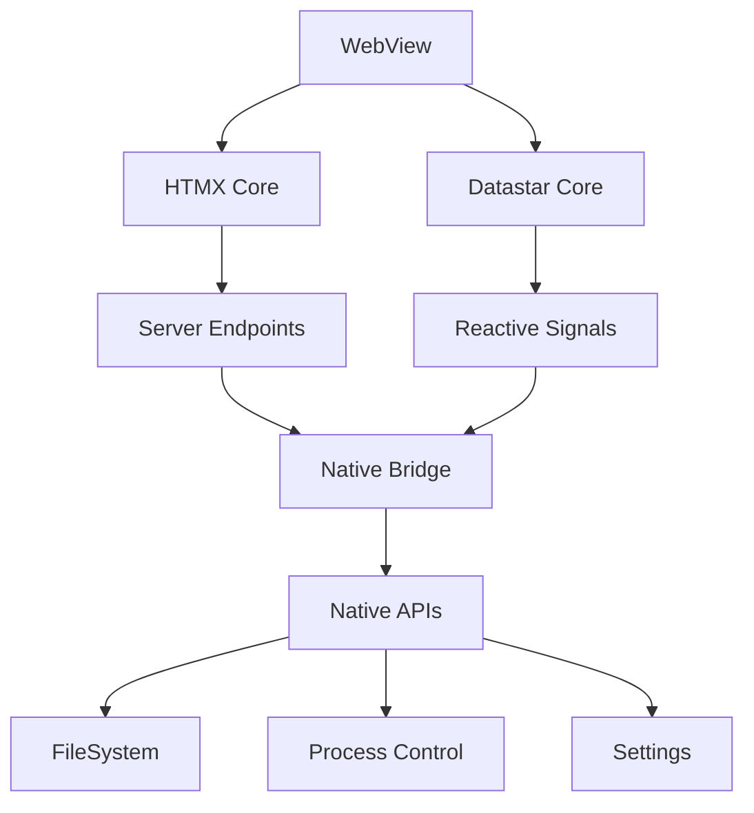

# WebView Production Exploration

---
location: utm-dev-production
explored_at: 2026-03-21
tags: [webview, htmx, datastar, service-worker, pwa, offline]
---

## Overview

This exploration covers production-ready WebView implementations for utm-dev, focusing on HTMX/Datastar optimization, service worker bundling, asset management, deep linking, PWA features, and offline-first patterns.

## Table of Contents

1. [HTMX/Datastar Optimization](#htmxdatastar-optimization)
2. [Service Worker Bundling](#service-worker-bundling)
3. [Asset Manifest Generation](#asset-manifest-generation)
4. [Deep Link Configuration](#deep-link-configuration)
5. [PWA Features](#pwa-features)
6. [Offline-First Patterns](#offline-first-patterns)

---

## HTMX/Datastar Optimization

### Architecture Overview



### HTMX Configuration for Production

```typescript
// src/webview/htmx/config.ts

import { htmx } from 'htmx.org';

/**
 * Production HTMX configuration optimized for WebView
 */
export function configureHTMX() {
  // Core configuration
  htmx.config = {
    // Use history for SPA-like navigation
    historyEnabled: true,
    historyCacheSize: 10,

    // Optimize for WebView
    refreshOnHistoryMiss: false,
    defaultSwapStyle: 'outerHTML',
    defaultSwapDelay: 0,
    settlingDelay: 20,

    // Timeout for requests (important for long builds)
    timeout: 300000, // 5 minutes for build operations

    // Allow cross-origin requests if needed
    allowCrossOrigin: true,

    // Focus handling
    scrollIntoViewOnBoost: true,
    triggerSpecsCache: null,

    // Response handling
    withCredentials: false,

    // WebSocket configuration
    wsReconnectDelay: 'full-jitter',

    // SSE configuration
   sseTimeout: 30000,
  };

  // Add custom headers for native bridge
  htmx.on('htmx:configRequest', (event: any) => {
    const detail = event.detail;

    // Add native platform headers
    detail.headers['X-UTM-WebView'] = 'true';
    detail.headers['X-UTM-Platform'] = getNativePlatform();
    detail.headers['X-UTM-Version'] = getNativeVersion();

    // Add request ID for tracing
    detail.headers['X-Request-ID'] = generateRequestId();
  });

  // Handle loading states
  htmx.on('htmx:beforeRequest', (event: any) => {
    const detail = event.detail;

    // Show loading indicator for long operations
    if (detail.elt.dataset.loadingClass) {
      detail.elt.classList.add(detail.elt.dataset.loadingClass);
    }

    // Log for debugging
    console.log('[HTMX] Request:', detail.path, detail.verb);
  });

  htmx.on('htmx:afterRequest', (event: any) => {
    const detail = event.detail;

    // Hide loading indicator
    if (detail.elt.dataset.loadingClass) {
      detail.elt.classList.remove(detail.elt.dataset.loadingClass);
    }

    // Handle error responses
    if (detail.xhr.status >= 400) {
      handleHtmxError(detail);
    }
  });

  // Handle build events
  htmx.on('utm:build-started', (event: any) => {
    const detail = event.detail;
    startBuildPolling(detail.buildId);
  });

  htmx.on('utm:build-completed', (event: any) => {
    stopBuildPolling();
    showBuildNotification('Build completed successfully');
  });

  return htmx;
}

function handleHtmxError(detail: any) {
  const response = detail.xhr.responseText;

  // Try to parse error JSON
  try {
    const error = JSON.parse(response);
    showErrorModal(error.message || 'An error occurred');
  } catch {
    showErrorModal(`HTTP ${detail.xhr.status}: ${response}`);
  }
}

function generateRequestId(): string {
  return `req_${Date.now()}_${Math.random().toString(36).substr(2, 9)}`;
}
```

### Datastar Implementation

```typescript
// src/webview/datastar/store.ts

import { Datastar } from 'datastar';

/**
 * Application state store using Datastar signals
 */
export class AppStore {
  // Build state
  buildStatus = $signal<'idle' | 'running' | 'success' | 'error'>('idle');
  buildProgress = $signal<number>(0);
  currentBuildId = $signal<string | null>(null);
  buildLogs = $signal<string[]>([]);

  // Project state
  projectPath = $signal<string>('');
  projectName = $signal<string>('');
  isDirty = $signal<boolean>(false);

  // Settings state
  targetPlatform = $signal<string>('current');
  buildProfile = $signal<'debug' | 'release'>('debug');
  enabledFeatures = $signal<string[]>([]);

  // UI state
  sidebarOpen = $signal<boolean>(true);
  activePanel = $signal<string>('build');
  notifications = $signal<Notification[]>([]);

  // Performance metrics
  lastBuildDuration = $signal<number>(0);
  cacheHitRate = $signal<number>(0);

  constructor() {
    // Auto-save dirty state
    $effect(() => {
      if (this.isDirty()) {
        const timer = setTimeout(() => {
          this.saveProjectState();
        }, 1000);
        return () => clearTimeout(timer);
      }
    });

    // Sync build logs with native
    $effect(() => {
      const logs = this.buildLogs();
      if (logs.length > 0) {
        const latest = logs[logs.length - 1];
        nativeBridge.sendLog(latest);
      }
    });
  }

  // Build actions
  async startBuild() {
    this.buildStatus('running');
    this.buildProgress(0);
    this.buildLogs([]);

    try {
      const response = await fetch('/api/build/start', {
        method: 'POST',
        headers: { 'Content-Type': 'application/json' },
        body: JSON.stringify({
          target: this.targetPlatform(),
          profile: this.buildProfile(),
          features: this.enabledFeatures(),
        }),
      });

      const data = await response.json();
      this.currentBuildId(data.buildId);

      // Start polling for updates
      this.pollBuildStatus(data.buildId);

    } catch (error) {
      this.buildStatus('error');
      this.addNotification({
        type: 'error',
        message: error.message,
      });
    }
  }

  async pollBuildStatus(buildId: string) {
    const pollInterval = setInterval(async () => {
      try {
        const response = await fetch(`/api/build/${buildId}/status`);
        const status = await response.json();

        this.buildProgress(status.progress);
        this.buildLogs(status.logs);

        if (status.completed) {
          clearInterval(pollInterval);
          this.buildStatus(status.success ? 'success' : 'error');
          this.lastBuildDuration(status.duration);
        }
      } catch (error) {
        console.error('Build polling error:', error);
      }
    }, 1000);
  }

  // Notification actions
  addNotification(notification: Notification) {
    const id = Date.now().toString();
    this.notifications.update(n => [...n, { ...notification, id }]);

    // Auto-dismiss after 5 seconds
    setTimeout(() => {
      this.removeNotification(id);
    }, 5000);
  }

  removeNotification(id: string) {
    this.notifications.update(n => n.filter(notif => notif.id !== id));
  }

  // Persistence
  private async saveProjectState() {
    await nativeBridge.saveProject({
      path: this.projectPath(),
      name: this.projectName(),
      settings: {
        target: this.targetPlatform(),
        profile: this.buildProfile(),
        features: this.enabledFeatures(),
      },
    });
    this.isDirty(false);
  }

  private async loadProjectState() {
    const state = await nativeBridge.loadProject();
    if (state) {
      this.projectPath(state.path);
      this.projectName(state.name);
      this.targetPlatform(state.settings.target);
      this.buildProfile(state.settings.profile);
      this.enabledFeatures(state.settings.features);
    }
  }
}

// Computed signals
export const hasBuildErrors = $derived(
  appStore.buildStatus() === 'error'
);

export const canCancelBuild = $derived(
  appStore.buildStatus() === 'running' && appStore.buildProgress() < 100
);

export const unreadNotifications = $derived(
  appStore.notifications().filter(n => !n.read).length
);

interface Notification {
  id?: string;
  type: 'info' | 'success' | 'warning' | 'error';
  message: string;
  read?: boolean;
  timestamp?: number;
}
```

### HTMX Extensions

```typescript
// src/webview/htmx/extensions/build-polling.ts

/**
 * Custom HTMX extension for build polling
 */
htmx.defineExtension('build-polling', {
  onEvent: function(name, evt) {
    if (name === 'utm:build-started') {
      const detail = evt.detail;
      startPolling(detail.buildId, detail.pollUrl);
    }

    if (name === 'utm:build-completed' || name === 'utm:build-failed') {
      stopPolling();
    }
  },

  transformResponse: function(text, xhr, elt) {
    // Check for build events in response
    const buildId = xhr.getResponseHeader('X-UTM-Build-ID');
    if (buildId) {
      htmx.trigger(document.body, 'utm:build-started', {
        buildId: buildId,
        pollUrl: `/api/build/${buildId}/status`
      });
    }

    return text;
  }
});

let pollingInterval: number | null = null;

function startPolling(buildId: string, pollUrl: string) {
  if (pollingInterval) {
    clearInterval(pollingInterval);
  }

  pollingInterval = window.setInterval(async () => {
    try {
      const response = await fetch(pollUrl);
      const status = await response.json();

      // Update UI elements
      const progressEl = document.querySelector('[data-build-progress]');
      if (progressEl) {
        progressEl.textContent = `${status.progress}%`;
      }

      // Append logs
      const logsEl = document.querySelector('[data-build-logs]');
      if (logsEl && status.newLogs) {
        status.newLogs.forEach((log: string) => {
          logsEl.innerHTML += `<div class="log-line">${log}</div>`;
        });
        logsEl.scrollTop = logsEl.scrollHeight;
      }

      // Check completion
      if (status.completed) {
        stopPolling();
        htmx.trigger(document.body, status.success ? 'utm:build-completed' : 'utm:build-failed', {
          buildId,
          ...status
        });
      }
    } catch (error) {
      console.error('Build polling error:', error);
    }
  }, 1000);
}

function stopPolling() {
  if (pollingInterval) {
    clearInterval(pollingInterval);
    pollingInterval = null;
  }
}
```

### Native Bridge for HTMX

```typescript
// src/webview/bridge/htmx-bridge.ts

/**
 * Native API bridge for HTMX requests
 */
export const nativeBridge = {
  // File operations
  async readFile(path: string): Promise<string> {
    return window.nativeAPI.invoke('fs.read', { path });
  },

  async writeFile(path: string, content: string): Promise<void> {
    return window.nativeAPI.invoke('fs.write', { path, content });
  },

  async listDirectory(path: string): Promise<string[]> {
    return window.nativeAPI.invoke('fs.list', { path });
  },

  // Build operations
  async startBuild(options: BuildOptions): Promise<BuildResult> {
    return window.nativeAPI.invoke('build.start', options);
  },

  async cancelBuild(buildId: string): Promise<void> {
    return window.nativeAPI.invoke('build.cancel', { buildId });
  },

  async getBuildStatus(buildId: string): Promise<BuildStatus> {
    return window.nativeAPI.invoke('build.status', { buildId });
  },

  // Settings
  async getSettings(): Promise<Settings> {
    return window.nativeAPI.invoke('settings.get', {});
  },

  async saveSettings(settings: Settings): Promise<void> {
    return window.nativeAPI.invoke('settings.save', settings);
  },

  // Project management
  async openProject(path: string): Promise<Project> {
    return window.nativeAPI.invoke('project.open', { path });
  },

  async saveProject(project: Project): Promise<void> {
    return window.nativeAPI.invoke('project.save', project);
  },

  async createProject(path: string, template: string): Promise<Project> {
    return window.nativeAPI.invoke('project.create', { path, template });
  },

  // Native UI
  async showToast(message: string, type: string): Promise<void> {
    return window.nativeAPI.invoke('ui.toast', { message, type });
  },

  async showDialog(options: DialogOptions): Promise<DialogResult> {
    return window.nativeAPI.invoke('ui.dialog', options);
  },

  async openExternal(url: string): Promise<void> {
    return window.nativeAPI.invoke('system.openUrl', { url });
  },

  // Logging
  sendLog(message: string): void {
    window.nativeAPI.invoke('log.send', { message });
  },
};

// Install as HTMX header provider
document.addEventListener('htmx:configRequest', (event: any) => {
  event.detail.headers['X-Native-API-Version'] = '1.0';
});

// Handle native callbacks
window.nativeAPI.onCallback('build:update', (data: BuildStatus) => {
  htmx.trigger(document.body, 'utm:build-update', data);
});

window.nativeAPI.onCallback('build:complete', (data: BuildResult) => {
  htmx.trigger(document.body, 'utm:build-completed', data);
});

window.nativeAPI.onCallback('file:changed', (data: { path: string }) => {
  htmx.trigger(document.body, 'utm:file-changed', data);
  htmx.ajax('GET', `/api/files/${encodeURIComponent(data.path)}/refresh`);
});
```

---

## Service Worker Bundling

### Production Service Worker

```typescript
// src/webview/sw/service-worker.ts

const CACHE_VERSION = 'v1.0.0';
const STATIC_CACHE = `utm-static-${CACHE_VERSION}`;
const DYNAMIC_CACHE = `utm-dynamic-${CACHE_VERSION}`;
const BUILD_CACHE = `utm-build-${CACHE_VERSION}`;

// Assets to cache immediately
const STATIC_ASSETS = [
  '/',
  '/index.html',
  '/assets/app.css',
  '/assets/app.js',
  '/assets/htmx.min.js',
  '/assets/datastar.bundle.js',
  '/assets/icons/icon-192.png',
  '/assets/icons/icon-512.png',
];

// Build output patterns to cache aggressively
const BUILD_PATTERNS = [
  /\/api\/build\/.*\/logs/,
  /\/api\/build\/.*\/status/,
  /\.rs$/,
  /\.toml$/,
];

// Network strategies per path
const STRATEGIES: Record<string, 'cache-first' | 'network-first' | 'stale-while-revalidate' | 'network-only' | 'cache-only'> = {
  '/assets/': 'cache-first',
  '/api/build/': 'network-first',
  '/api/files/': 'stale-while-revalidate',
  '/index.html': 'network-first',
};

self.addEventListener('install', (event: ExtendableEvent) => {
  event.waitUntil(
    caches.open(STATIC_CACHE).then((cache) => {
      return cache.addAll(STATIC_ASSETS);
    })
  );
  self.skipWaiting();
});

self.addEventListener('activate', (event: ExtendableEvent) => {
  event.waitUntil(
    caches.keys().then((keys) => {
      return Promise.all(
        keys
          .filter((key) => !key.includes(CACHE_VERSION))
          .map((key) => caches.delete(key))
      );
    })
  );
  self.clients.claim();
});

self.addEventListener('fetch', (event: FetchEvent) => {
  const { request } = event;
  const url = new URL(request.url);

  // Only handle same-origin requests
  if (url.origin !== location.origin) {
    return;
  }

  // Determine strategy
  const strategy = getStrategy(url.pathname);

  switch (strategy) {
    case 'cache-first':
      event.respondWith(cacheFirst(request));
      break;
    case 'network-first':
      event.respondWith(networkFirst(request));
      break;
    case 'stale-while-revalidate':
      event.respondWith(staleWhileRevalidate(request));
      break;
    case 'network-only':
      event.respondWith(fetch(request));
      break;
    case 'cache-only':
      event.respondWith(cacheOnly(request));
      break;
  }
});

async function cacheFirst(request: Request): Promise<Response> {
  const cached = await caches.match(request);
  if (cached) {
    return cached;
  }

  try {
    const response = await fetch(request);

    // Cache successful responses
    if (response.ok) {
      const cache = await caches.open(STATIC_CACHE);
      cache.put(request, response.clone());
    }

    return response;
  } catch (error) {
    // Return offline placeholder
    return createOfflineResponse();
  }
}

async function networkFirst(request: Request): Promise<Response> {
  try {
    const response = await fetch(request);

    // Cache successful responses
    if (response.ok) {
      const cache = await caches.open(DYNAMIC_CACHE);
      cache.put(request, response.clone());
    }

    return response;
  } catch (error) {
    const cached = await caches.match(request);
    if (cached) {
      return cached;
    }

    return createOfflineResponse();
  }
}

async function staleWhileRevalidate(request: Request): Promise<Response> {
  const cache = await caches.open(DYNAMIC_CACHE);
  const cached = await cache.match(request);

  const fetchPromise = fetch(request).then((response) => {
    if (response.ok) {
      cache.put(request, response.clone());
    }
    return response;
  }).catch(() => null);

  return cached || fetchPromise || createOfflineResponse();
}

async function cacheOnly(request: Request): Promise<Response> {
  const cached = await caches.match(request);
  if (cached) {
    return cached;
  }
  throw new Error('Not found in cache');
}

function getStrategy(pathname: string): string {
  // Check explicit mappings first
  for (const [prefix, strategy] of Object.entries(STRATEGIES)) {
    if (pathname.startsWith(prefix)) {
      return strategy;
    }
  }

  // Check build patterns
  for (const pattern of BUILD_PATTERNS) {
    if (pattern.test(pathname)) {
      return 'cache-first';
    }
  }

  // Default to network-first for HTML, cache-first for assets
  if (pathname.endsWith('.html') || pathname.endsWith('/')) {
    return 'network-first';
  }

  return 'cache-first';
}

function createOfflineResponse(): Response {
  return new Response(`
    <!DOCTYPE html>
    <html>
      <head><title>Offline - utm-dev</title></head>
      <body>
        <div class="offline-page">
          <h1>You're Offline</h1>
          <p>Some features may be unavailable until you're back online.</p>
          <button onclick="location.reload()">Retry</button>
        </div>
      </body>
    </html>
  `, {
    headers: { 'Content-Type': 'text/html' },
    status: 503,
  });
}

// Handle messages from main thread
self.addEventListener('message', (event: ExtendableMessageEvent) => {
  const { type, payload } = event.data;

  switch (type) {
    case 'SKIP_WAITING':
      self.skipWaiting();
      break;

    case 'CLEAR_BUILD_CACHE':
      event.waitUntil(
        caches.delete(BUILD_CACHE).then(() => {
          event.ports[0]?.postMessage({ success: true });
        })
      );
      break;

    case 'CACHE_BUILD_ARTIFACTS':
      event.waitUntil(cacheBuildArtifacts(payload));
      break;

    case 'GET_CACHE_STATUS':
      event.waitUntil(getCacheStatus().then(status => {
        event.ports[0]?.postMessage(status);
      }));
      break;
  }
});

async function cacheBuildArtifacts(artifacts: { path: string; content: string }[]) {
  const cache = await caches.open(BUILD_CACHE);

  for (const artifact of artifacts) {
    const response = new Response(artifact.content, {
      headers: { 'Content-Type': 'application/octet-stream' },
    });
    await cache.put(artifact.path, response);
  }
}

async function getCacheStatus() {
  const keys = await caches.keys();
  const status: Record<string, number> = {};

  for (const key of keys) {
    const cache = await caches.open(key);
    const requests = await cache.keys();
    status[key] = requests.length;
  }

  return status;
}
```

### Service Worker Registration

```typescript
// src/webview/sw/register.ts

export async function registerServiceWorker(): Promise<ServiceWorkerRegistration | null> {
  if (!('serviceWorker' in navigator)) {
    console.warn('Service Worker not supported');
    return null;
  }

  try {
    const registration = await navigator.serviceWorker.register('/sw.js', {
      scope: '/',
      type: 'classic',
    });

    // Handle updates
    registration.addEventListener('updatefound', () => {
      const newWorker = registration.installing;

      if (newWorker) {
        newWorker.addEventListener('statechange', () => {
          if (newWorker.state === 'installed') {
            if (navigator.serviceWorker.controller) {
              // New version available
              showUpdateNotification(registration);
            } else {
              // First install
              console.log('Service Worker installed and active');
            }
          }
        });
      }
    });

    // Handle controller changes
    navigator.serviceWorker.addEventListener('controllerchange', () => {
      console.log('Service Worker controller changed - reloading');
      // Optionally reload page
      // window.location.reload();
    });

    return registration;
  } catch (error) {
    console.error('Service Worker registration failed:', error);
    return null;
  }
}

function showUpdateNotification(registration: ServiceWorkerRegistration) {
  const event = new CustomEvent('sw:update', {
    detail: {
      registration,
      acceptUpdate: () => {
        if (registration.waiting) {
          registration.waiting.postMessage({ type: 'SKIP_WAITING' });
        }
      },
    },
  });

  document.dispatchEvent(event);
}

// Send build artifacts to SW for caching
export async function cacheBuildArtifacts(
  registration: ServiceWorkerRegistration,
  artifacts: { path: string; content: string }[]
) {
  if (!registration.active) return;

  return new Promise((resolve) => {
    const messageChannel = new MessageChannel();

    messageChannel.port1.onmessage = (event) => {
      if (event.data.success) {
        resolve(true);
      }
    };

    registration.active.postMessage(
      { type: 'CACHE_BUILD_ARTIFACTS', payload: artifacts },
      [messageChannel.port2]
    );
  });
}

// Get cache status
export async function getCacheStatus(registration: ServiceWorkerRegistration) {
  if (!registration.active) return null;

  return new Promise((resolve) => {
    const messageChannel = new MessageChannel();

    messageChannel.port1.onmessage = (event) => {
      resolve(event.data);
    };

    registration.active.postMessage(
      { type: 'GET_CACHE_STATUS' },
      [messageChannel.port2]
    );
  });
}

// Clear build cache
export async function clearBuildCache(registration: ServiceWorkerRegistration) {
  if (!registration.active) return null;

  return new Promise((resolve) => {
    const messageChannel = new MessageChannel();

    messageChannel.port1.onmessage = (event) => {
      resolve(event.data.success);
    };

    registration.active.postMessage(
      { type: 'CLEAR_BUILD_CACHE' },
      [messageChannel.port2]
    );
  });
}
```

### Build-time SW Bundling

```rust
// src/build/sw_bundler.rs
use std::path::{Path, PathBuf};
use esbuild_rust::{build, BuildOptions};

pub struct ServiceWorkerBundler {
    entry_point: PathBuf,
    output_dir: PathBuf,
    minify: bool,
    sourcemap: bool,
}

impl ServiceWorkerBundler {
    pub fn new(entry_point: PathBuf, output_dir: PathBuf) -> Self {
        Self {
            entry_point,
            output_dir,
            minify: true,
            sourcemap: false,
        }
    }

    pub fn with_options(mut self, minify: bool, sourcemap: bool) -> Self {
        self.minify = minify;
        self.sourcemap = sourcemap;
        self
    }

    pub fn bundle(&self) -> Result<PathBuf, BundleError> {
        let result = build(BuildOptions {
            entry_points: vec![self.entry_point.to_string_lossy().to_string()],
            outdir: self.output_dir.to_string_lossy().to_string(),
            bundle: true,
            minify: self.minify,
            sourcemap: if self.sourcemap { "inline" } else { "" },
            target: "es2020",
            format: "iife",
            // Don't use eval for CSP compliance
            avoid_eval: true,
            // Tree shaking
            tree_shaking: true,
            // Define version
            define: vec![
                ("__SW_VERSION__".to_string(), "\"1.0.0\"".to_string()),
            ],
            ..Default::default()
        })?;

        Ok(self.output_dir.join("sw.js"))
    }

    /// Generate service worker with precache manifest
    pub fn bundle_with_precache(
        &self,
        assets: &[PathBuf],
    ) -> Result<PathBuf, BundleError> {
        // Generate precache manifest
        let mut precache_list = String::from("[\n");

        for asset in assets {
            if let Ok(content) = std::fs::read(asset) {
                let hash = compute_hash(&content);
                let url = asset.strip_prefix(&self.output_dir)
                    .unwrap_or(asset)
                    .to_string_lossy();

                precache_list.push_str(&format!(
                    "  {{ url: '{}', revision: '{}' }},\n",
                    url, hash
                ));
            }
        }

        precache_list.push_str("]");

        // Inject into service worker
        let sw_template = std::fs::read_to_string(&self.entry_point)?;
        let sw_content = sw_template.replace(
            "// PRECACHE_MANIFEST",
            &format!("const PRECACHE_MANIFEST = {};", precache_list)
        );

        // Write bundled version
        let output_path = self.output_dir.join("sw.js");
        std::fs::write(&output_path, sw_content)?;

        Ok(output_path)
    }
}

fn compute_hash(content: &[u8]) -> String {
    use sha2::{Sha256, Digest};
    let hash = Sha256::digest(content);
    format!("{:x}", hash)[..8].to_string()
}
```

---

## Asset Manifest Generation

### Manifest Schema

```rust
// src/build/manifest.rs
use serde::{Deserialize, Serialize};
use std::collections::HashMap;
use std::path::{Path, PathBuf};

/// Asset manifest for production builds
#[derive(Debug, Clone, Serialize, Deserialize)]
pub struct AssetManifest {
    /// Manifest version
    pub version: String,

    /// Generation timestamp
    pub generated_at: String,

    /// Build hash
    pub build_hash: String,

    /// All assets with their hashed versions
    pub assets: HashMap<String, AssetEntry>,

    /// Entry points for the application
    pub entry_points: HashMap<String, EntryPoint>,

    /// Dependency graph for tree shaking
    pub dependency_graph: HashMap<String, Vec<String>>,

    /// Source map locations
    pub source_maps: HashMap<String, String>,
}

#[derive(Debug, Clone, Serialize, Deserialize)]
pub struct AssetEntry {
    /// Original file path
    pub original: String,

    /// Hashed output path
    pub output: String,

    /// Content hash (for cache busting)
    pub hash: String,

    /// File size in bytes
    pub size: u64,

    /// Gzipped size
    pub gzip_size: Option<u64>,

    /// Asset type
    pub asset_type: AssetType,

    /// Integrity hash for SRI
    pub integrity: String,

    /// Dependencies
    pub dependencies: Vec<String>,
}

#[derive(Debug, Clone, Serialize, Deserialize, PartialEq)]
#[serde(rename_all = "snake_case")]
pub enum AssetType {
    JavaScript,
    StyleSheet,
    Image,
    Font,
    Html,
    Json,
    WebAssembly,
    Other,
}

#[derive(Debug, Clone, Serialize, Deserialize)]
pub struct EntryPoint {
    /// Main file
    pub file: String,

    /// Chunk files
    pub chunks: Vec<String>,

    /// CSS files
    pub css: Vec<String>,

    /// Async chunks
    pub async_chunks: Vec<String>,
}

impl AssetManifest {
    pub fn new(version: &str) -> Self {
        Self {
            version: version.to_string(),
            generated_at: chrono::Utc::now().to_rfc3339(),
            build_hash: String::new(),
            assets: HashMap::new(),
            entry_points: HashMap::new(),
            dependency_graph: HashMap::new(),
            source_maps: HashMap::new(),
        }
    }

    pub fn add_asset(&mut self, entry: AssetEntry) {
        self.assets.insert(entry.original.clone(), entry);
    }

    pub fn get_hashed_path(&self, original: &str) -> Option<&str> {
        self.assets.get(original).map(|e| e.output.as_str())
    }

    pub fn get_integrity(&self, original: &str) -> Option<&str> {
        self.assets.get(original).map(|e| e.integrity.as_str())
    }

    /// Generate HTML tags for entry point
    pub fn generate_html(&self, entry_name: &str) -> String {
        let mut html = String::new();

        if let Some(entry) = self.entry_points.get(entry_name) {
            // CSS
            for css in &entry.css {
                if let Some(asset) = self.assets.get(css) {
                    html.push_str(&format!(
                        "<link rel=\"stylesheet\" href=\"{}\" integrity=\"{}\" crossorigin=\"anonymous\">\n",
                        asset.output, asset.integrity
                    ));
                }
            }

            // JavaScript
            html.push_str(&format!(
                "<script src=\"{}\" integrity=\"{}\" crossorigin=\"anonymous\" defer></script>\n",
                self.assets.get(&entry.file).map(|a| a.output.as_str()).unwrap_or(""),
                self.assets.get(&entry.file).map(|a| a.integrity.as_str()).unwrap_or("")
            ));

            // Async chunks for preloading
            for chunk in &entry.async_chunks {
                if let Some(asset) = self.assets.get(chunk) {
                    html.push_str(&format!(
                        "<link rel=\"preload\" href=\"{}\" as=\"script\" integrity=\"{}\">\n",
                        asset.output, asset.integrity
                    ));
                }
            }
        }

        html
    }

    /// Save manifest to file
    pub fn save(&self, path: &Path) -> Result<(), std::io::Error> {
        let json = serde_json::to_string_pretty(self)?;
        std::fs::write(path, json)?;

        // Also save as JSONP for older browsers
        let jsonp = format!("window.ASSET_MANIFEST = {};", json);
        std::fs::write(path.with_extension("jsonp"), jsonp)?;

        Ok(())
    }

    /// Load manifest from file
    pub fn load(path: &Path) -> Result<Self, Box<dyn std::error::Error>> {
        let content = std::fs::read_to_string(path)?;
        Ok(serde_json::from_str(&content)?)
    }
}

/// Asset manifest generator
pub struct ManifestGenerator {
    output_dir: PathBuf,
    public_path: String,
}

impl ManifestGenerator {
    pub fn new(output_dir: PathBuf, public_path: &str) -> Self {
        Self {
            output_dir,
            public_path: public_path.to_string(),
        }
    }

    pub fn generate(&self) -> Result<AssetManifest, ManifestError> {
        let mut manifest = AssetManifest::new(env!("CARGO_PKG_VERSION"));

        // Find all assets in output directory
        self.collect_assets(&mut manifest)?;

        // Generate build hash
        manifest.build_hash = self.compute_build_hash(&manifest)?;

        Ok(manifest)
    }

    fn collect_assets(&self, manifest: &mut AssetManifest) -> Result<(), ManifestError> {
        for entry in walkdir::WalkDir::new(&self.output_dir) {
            let entry = entry?;

            if entry.file_type().is_file() {
                let path = entry.path();
                let relative = path.strip_prefix(&self.output_dir)?;
                let url_path = format!("{}/{}", self.public_path.trim_end_matches('/'), relative.display());

                // Determine asset type
                let asset_type = match path.extension().and_then(|e| e.to_str()) {
                    Some("js") => AssetType::JavaScript,
                    Some("css") => AssetType::StyleSheet,
                    Some("html") => AssetType::Html,
                    Some("json") => AssetType::Json,
                    Some("wasm") => AssetType::WebAssembly,
                    Some("png" | "jpg" | "svg" | "gif" | "webp" | "ico") => AssetType::Image,
                    Some("woff" | "woff2" | "ttf" | "eot") => AssetType::Font,
                    _ => AssetType::Other,
                };

                // Compute hashes
                let content = std::fs::read(path)?;
                let hash = self.compute_content_hash(&content);
                let integrity = self.compute_integrity(&content);

                // Generate hashed filename
                let hashed_name = self.generate_hashed_name(path, &hash);

                let entry = AssetEntry {
                    original: relative.to_string_lossy().to_string(),
                    output: format!("{}/{}", self.public_path.trim_end_matches('/'), hashed_name),
                    hash,
                    size: content.len() as u64,
                    gzip_size: None, // Could compute with flate2
                    asset_type,
                    integrity,
                    dependencies: Vec::new(),
                };

                manifest.add_asset(entry);
            }
        }

        Ok(())
    }

    fn compute_content_hash(&self, content: &[u8]) -> String {
        use sha2::{Sha256, Digest};
        let hash = Sha256::digest(content);
        format!("{:x}", hash)[..8].to_string()
    }

    fn compute_integrity(&self, content: &[u8]) -> String {
        use sha2::{Sha256, Digest};
        let hash = Sha256::digest(content);
        let encoded = base64::encode(hash);
        format!("sha256-{}", encoded)
    }

    fn generate_hashed_name(&self, path: &Path, hash: &str) -> String {
        let stem = path.file_stem().unwrap().to_string_lossy();
        let ext = path.extension().unwrap().to_string_lossy();
        format!("{}.{}.{}", stem, hash, ext)
    }

    fn compute_build_hash(&self, manifest: &AssetManifest) -> Result<String, ManifestError> {
        use sha2::{Sha256, Digest};

        let mut hasher = Sha256::new();

        // Hash all asset hashes in sorted order
        let mut hashes: Vec<_> = manifest.assets.values()
            .map(|e| &e.hash)
            .collect();
        hashes.sort();

        for hash in hashes {
            hasher.update(hash.as_bytes());
        }

        Ok(format!("{:x}", hasher.finalize())[..16].to_string())
    }
}
```

### HTML Template Integration

```html
<!-- templates/base.html -->
<!DOCTYPE html>
<html lang="en">
<head>
  <meta charset="UTF-8">
  <meta name="viewport" content="width=device-width, initial-scale=1.0">
  <meta http-equiv="Content-Security-Policy" content="
    default-src 'self';
    script-src 'self' 'strict-dynamic' {{ csp_nonce }};
    style-src 'self' 'nonce-{{ csp_nonce }}';
    worker-src 'self' blob:;
    connect-src 'self' ws: wss:;
    img-src 'self' data: blob:;
    font-src 'self';
    object-src 'none';
    base-uri 'self';
    form-action 'self';
  ">

  <!-- Preload critical assets -->
  <link rel="preload" href="{{ manifest.get_hashed_path('app.js') }}" as="script">
  <link rel="preload" href="{{ manifest.get_hashed_path('app.css') }}" as="style">

  <!-- DNS prefetch for API -->
  <link rel="dns-prefetch" href="https://api.utm.dev">

  <!-- Favicon -->
  <link rel="icon" type="image/png" href="{{ manifest.get_hashed_path('icons/icon-192.png') }}">

  <!-- PWA manifest -->
  <link rel="manifest" href="/manifest.webmanifest">

  <!-- Theme color -->
  <meta name="theme-color" content="#1a1a2e">

  <!-- Generated CSS -->
  
  <link rel="stylesheet"
        href="{{ manifest.get_hashed_path(css_path) }}"
        integrity="{{ manifest.get_integrity(css_path) }}"
        crossorigin="anonymous">
  
</head>
<body>
  <div id="app" data-store="app">
    <!-- Initial SSR content -->
    {{ initial_content | safe }}
  </div>

  <!-- Generated JS -->
  
  <script src="{{ manifest.get_hashed_path(js_path) }}"
          integrity="{{ manifest.get_integrity(js_path) }}"
          crossorigin="anonymous"
          defer></script>
  

  <script src="{{ manifest.get_hashed_path('app.js') }}"
          integrity="{{ manifest.get_integrity('app.js') }}"
          crossorigin="anonymous"
          defer></script>

  <!-- Initial state for hydration -->
  <script type="application/json" id="initial-state">
    {{ initial_state | json | safe }}
  </script>

  <!-- CSP nonce for inline scripts -->
  <script nonce="{{ csp_nonce }}">
    // Small inline script for critical functionality
    window.__CSP_NONCE__ = '{{ csp_nonce }}';
  </script>
</body>
</html>
```

---

## Deep Link Configuration

### Universal Links / App Links

```rust
// src/native/deeplink.rs

/// Deep link configuration
pub struct DeepLinkConfig {
    /// Custom URL scheme
    pub scheme: String,

    /// Associated domains (for Universal Links / App Links)
    pub associated_domains: Vec<String>,

    /// Link routes
    pub routes: Vec<DeepLinkRoute>,
}

#[derive(Debug, Clone)]
pub struct DeepLinkRoute {
    /// Path pattern
    pub pattern: String,

    /// Handler name
    pub handler: String,

    /// Parameters to extract
    pub params: Vec<String>,
}

/// Deep link handler
pub struct DeepLinkHandler {
    config: DeepLinkConfig,
    pending_links: Vec<PendingDeepLink>,
}

struct PendingDeepLink {
    url: String,
    timestamp: Instant,
    handled: bool,
}

impl DeepLinkHandler {
    pub fn new(config: DeepLinkConfig) -> Self {
        Self {
            config,
            pending_links: Vec::new(),
        }
    }

    /// Register deep link handler with platform
    pub fn register(&self) -> Result<(), DeepLinkError> {
        #[cfg(target_os = "macos")]
        {
            self.register_macos()?;
        }

        #[cfg(target_os = "windows")]
        {
            self.register_windows()?;
        }

        #[cfg(target_os = "linux")]
        {
            self.register_linux()?;
        }

        Ok(())
    }

    /// Handle incoming deep link
    pub fn handle_url(&mut self, url: &str) -> Result<(), DeepLinkError> {
        let parsed = url::Url::parse(url)?;

        // Verify scheme
        if parsed.scheme() != self.config.scheme {
            return Err(DeepLinkError::InvalidScheme);
        }

        // Match route
        let route = self.match_route(parsed.path())?;

        // Extract parameters
        let params = self.extract_params(&route, parsed.path())?;

        // Dispatch to handler
        self.dispatch_handler(&route.handler, params)?;

        Ok(())
    }

    fn match_route(&self, path: &str) -> Result<&DeepLinkRoute, DeepLinkError> {
        for route in &self.config.routes {
            // Simple pattern matching (could use regex for complex patterns)
            if self.pattern_matches(&route.pattern, path) {
                return Ok(route);
            }
        }
        Err(DeepLinkError::NoMatchingRoute)
    }

    fn pattern_matches(&self, pattern: &str, path: &str) -> bool {
        // Convert pattern to regex
        let regex_pattern = pattern
            .replace(":", "(?P<")
            .replace("/", "\\/")
            .replace("}", ">[^/]+)");

        let re = regex::Regex::new(&format!("^{}$", regex_pattern)).unwrap();
        re.is_match(path)
    }

    fn extract_params(&self, route: &DeepLinkRoute, path: &str) -> Result<HashMap<String, String>, DeepLinkError> {
        let mut params = HashMap::new();

        // Extract query parameters
        if let Some(url) = url::Url::parse(&format!("{}{}", self.config.scheme, path)).ok() {
            for (key, value) in url.query_pairs() {
                params.insert(key.to_string(), value.to_string());
            }
        }

        Ok(params)
    }

    fn dispatch_handler(&self, handler: &str, params: HashMap<String, String>) -> Result<(), DeepLinkError> {
        // Send to WebView
        let js = format!(
            "window.dispatchEvent(new CustomEvent('deeplink', {{ detail: {{ handler: '{}', params: {} }} }}))",
            handler,
            serde_json::to_string(&params)?
        );

        // Evaluate in WebView
        // self.webview.eval(&js)?;

        Ok(())
    }
}

#[derive(Debug)]
pub enum DeepLinkError {
    InvalidScheme,
    NoMatchingRoute,
    ParseError(url::ParseError),
    SerdeError(serde_json::Error),
    PlatformError(String),
}

impl From<url::ParseError> for DeepLinkError {
    fn from(err: url::ParseError) -> Self {
        DeepLinkError::ParseError(err)
    }
}

impl From<serde_json::Error> for DeepLinkError {
    fn from(err: serde_json::Error) -> Self {
        DeepLinkError::SerdeError(err)
    }
}
```

### Apple App Site Association

```json
// .well-known/apple-app-site-association
{
  "applinks": {
    "apps": [],
    "details": [
      {
        "appID": "TEAM_ID.com.utmdev.app",
        "paths": [
          "/project/*",
          "/build/*",
          "/settings/*",
          "/open*"
        ]
      }
    ]
  },
  "webcredentials": {
    "apps": ["TEAM_ID.com.utmdev.app"]
  },
  "appclips": {
    "apps": ["TEAM_ID.com.utmdev.app.clip"]
  }
}
```

### Android Asset Links

```json
// .well-known/assetlinks.json
[
  {
    "relation": ["delegate_permission/common.handle_all_urls"],
    "target": {
      "namespace": "android_app",
      "package_name": "com.utmdev.app",
      "sha256_cert_fingerprints": [
        "AA:BB:CC:DD:EE:FF:00:11:22:33:44:55:66:77:88:99:AA:BB:CC:DD:EE:FF:00:11:22:33:44:55:66:77:88:99"
      ]
    }
  }
]
```

### WebView Deep Link Handling

```typescript
// src/webview/deeplink.ts

interface DeepLinkEvent extends CustomEvent {
  detail: {
    handler: string;
    params: Record<string, string>;
  };
}

/**
 * Deep link router for WebView
 */
export class DeepLinkRouter {
  private routes: Map<string, DeepLinkHandler> = new Map();

  constructor() {
    this.setupListeners();
  }

  private setupListeners() {
    // Listen for native deep link events
    window.addEventListener('deeplink', (event: DeepLinkEvent) => {
      this.handleDeepLink(event.detail.handler, event.detail.params);
    });

    // Handle browser back/forward
    window.addEventListener('popstate', () => {
      this.handleNavigation(window.location.pathname);
    });
  }

  /**
   * Register a route handler
   */
  public register(pattern: string, handler: DeepLinkHandler) {
    this.routes.set(pattern, handler);
  }

  private handleDeepLink(handler: string, params: Record<string, string>) {
    const routeHandler = this.routes.get(handler);

    if (routeHandler) {
      routeHandler(params);
      this.pushState(handler, params);
    } else {
      console.warn(`No handler registered for: ${handler}`);
    }
  }

  private handleNavigation(path: string) {
    // Parse path and trigger appropriate handler
    for (const [pattern, handler] of this.routes.entries()) {
      const match = this.matchPattern(pattern, path);

      if (match) {
        handler(match.params);
        return;
      }
    }
  }

  private matchPattern(pattern: string, path: string) {
    const regex = new RegExp(`^${pattern.replace(/:\w+/g, '(?P<\\w+>[^/]+)')}$`);
    const match = path.match(regex);

    if (match) {
      return { params: match.groups || {} };
    }

    return null;
  }

  private pushState(handler: string, params: Record<string, string>) {
    const path = this.buildPath(handler, params);
    history.pushState({ handler, params }, '', path);
  }

  private buildPath(handler: string, params: Record<string, string>): string {
    // Build URL from handler and params
    const queryString = Object.entries(params)
      .map(([k, v]) => `${encodeURIComponent(k)}=${encodeURIComponent(v)}`)
      .join('&');

    return `/${handler}${queryString ? `?${queryString}` : ''}`;
  }
}

// Handler type
type DeepLinkHandler = (params: Record<string, string>) => void | Promise<void>;

// Example usage
const router = new DeepLinkRouter();

router.register('project', async (params) => {
  if (params.id) {
    await loadProject(params.id);
  }
});

router.register('build', async (params) => {
  if (params.target) {
    await startBuild(params.target, params.profile);
  }
});

router.register('settings', async (params) => {
  await openSettings(params.section);
});

// Handle initial navigation
window.addEventListener('DOMContentLoaded', () => {
  router.handleNavigation(window.location.pathname);
});
```

---

## PWA Features

### Web App Manifest

```json
{
  "name": "utm-dev",
  "short_name": "utm-dev",
  "description": "Universal Toolchain Manager - Build and manage your projects",
  "start_url": "/",
  "scope": "/",
  "display": "standalone",
  "display_override": ["window-controls-overlay", "minimal-ui"],
  "orientation": "any",
  "background_color": "#1a1a2e",
  "theme_color": "#1a1a2e",
  "icons": [
    {
      "src": "/assets/icons/icon-192.png",
      "sizes": "192x192",
      "type": "image/png",
      "purpose": "any maskable"
    },
    {
      "src": "/assets/icons/icon-512.png",
      "sizes": "512x512",
      "type": "image/png",
      "purpose": "any maskable"
    },
    {
      "src": "/assets/icons/icon-svg.svg",
      "sizes": "any",
      "type": "image/svg+xml",
      "purpose": "any maskable"
    }
  ],
  "categories": ["developer tools", "productivity"],
  "shortcuts": [
    {
      "name": "New Project",
      "short_name": "New",
      "description": "Create a new project",
      "url": "/project/new",
      "icons": [{ "src": "/assets/icons/new-project.png", "sizes": "96x96" }]
    },
    {
      "name": "Build",
      "short_name": "Build",
      "description": "Start a new build",
      "url": "/build/start",
      "icons": [{ "src": "/assets/icons/build.png", "sizes": "96x96" }]
    }
  ],
  "share_target": {
    "action": "/share",
    "method": "POST",
    "enctype": "multipart/form-data",
    "params": {
      "title": "title",
      "text": "text",
      "url": "url",
      "files": [
        {
          "name": "project",
          "accept": ["application/zip", ".rs", ".toml"]
        }
      ]
    }
  },
  "protocol_handlers": [
    {
      "protocol": "web+utm",
      "url": "/open?url=%s"
    }
  ],
  "file_handlers": [
    {
      "action": "/open-file",
      "accept": {
        "application/zip": [".zip"],
        "text/plain": [".rs", ".toml"]
      },
      "icons": [
        {
          "src": "/assets/icons/file-icon.png",
          "sizes": "128x128"
        }
      ]
    }
  ],
  "launch_handler": {
    "client_mode": "navigate-existing"
  },
  "handle_links": "preferred"
}
```

### PWA Installation Handler

```typescript
// src/webview/pwa/install.ts

interface BeforeInstallPromptEvent extends Event {
  prompt: () => Promise<void>;
  userChoice: Promise<{ outcome: 'accepted' | 'dismissed' }>;
}

interface AppInstalledEvent extends Event {
  // PWA installed
}

/**
 * PWA Installation manager
 */
export class PWAInstaller {
  private deferredPrompt: BeforeInstallPromptEvent | null = null;
  private isInstalled = false;

  constructor() {
    this.setupListeners();
    this.checkInstalled();
  }

  private setupListeners() {
    // Chrome/Edge
    window.addEventListener('beforeinstallprompt', (e: Event) => {
      e.preventDefault();
      this.deferredPrompt = e as BeforeInstallPromptEvent;
      this.emit('installable');
    });

    // Safari
    window.addEventListener('appinstalled', () => {
      this.isInstalled = true;
      this.deferredPrompt = null;
      this.emit('installed');
    });
  }

  /**
   * Check if app is already installed
   */
  private checkInstalled() {
    if (window.matchMedia('(display-mode: standalone)').matches) {
      this.isInstalled = true;
    }

    if ((navigator as any).standalone === true) {
      this.isInstalled = true;
    }
  }

  /**
   * Check if install prompt can be shown
   */
  public canInstall(): boolean {
    return this.deferredPrompt !== null && !this.isInstalled;
  }

  /**
   * Show install prompt
   */
  public async install(): Promise<boolean> {
    if (!this.deferredPrompt) {
      return false;
    }

    this.deferredPrompt.prompt();
    const { outcome } = await this.deferredPrompt.userChoice;

    this.deferredPrompt = null;

    return outcome === 'accepted';
  }

  /**
   * Get installation state
   */
  public getState(): PWAState {
    return {
      installed: this.isInstalled,
      installable: this.canInstall(),
      platform: this.getPlatform(),
    };
  }

  private getPlatform(): 'ios' | 'android' | 'desktop' {
    const ua = navigator.userAgent;

    if (/iPad|iPhone|iPod/.test(ua)) return 'ios';
    if (/Android/.test(ua)) return 'android';
    return 'desktop';
  }

  private emit(event: string) {
    window.dispatchEvent(new CustomEvent(`pwa:${event}`));
  }
}

interface PWAState {
  installed: boolean;
  installable: boolean;
  platform: 'ios' | 'android' | 'desktop';
}

// iOS-specific install instructions
export function showIOSInstallInstructions() {
  return `
    <div class="ios-install-modal">
      <h3>Install utm-dev</h3>
      <ol>
        <li>Tap the <strong>Share</strong> button</li>
        <li>Scroll down and tap <strong>Add to Home Screen</strong></li>
        <li>Tap <strong>Add</strong> in the top right corner</li>
      </ol>
    </div>
  `;
}
```

### Window Controls Overlay

```typescript
// src/webview/pwa/overlay.ts

/**
 * Window Controls Overlay API for desktop PWA
 */
export class WindowControlsOverlay {
  private overlayVisible = false;
  private height = 0;

  constructor() {
    this.setupOverlay();
  }

  private setupOverlay() {
    if ('windowControlsOverlay' in navigator) {
      const wco = (navigator as any).windowControlsOverlay;

      wco.addEventListener('geometrychange', (event: any) => {
        this.overlayVisible = event.visible;
        this.height = event.height;
        this.updateLayout();
      });

      // Initial state
      this.overlayVisible = wco.visible;
    }
  }

  private updateLayout() {
    const root = document.documentElement;

    if (this.overlayVisible) {
      root.style.setProperty('--wco-height', `${this.height}px`);
      root.style.setProperty('--wco-area-top', `${this.height}px`);
    } else {
      root.style.setProperty('--wco-height', '0px');
      root.style.setProperty('--wco-area-top', '0px');
    }
  }

  /**
   * Check if overlay is supported
   */
  public isSupported(): boolean {
    return 'windowControlsOverlay' in navigator;
  }

  /**
   * Get overlay height
   */
  public getHeight(): number {
    return this.height;
  }
}

// CSS for handling overlay
const overlayStyles = `
:root {
  --wco-height: 0px;
  --wco-area-top: 0px;
}

@media (display-mode: standalone) and (window-controls-overlay) {
  header {
    padding-top: var(--wco-height);
  }

  .titlebar-drag-region {
    position: fixed;
    top: 0;
    left: 0;
    right: 0;
    height: var(--wco-height);
    -webkit-app-region: drag;
    app-region: drag;
    z-index: 1000;
  }
}
`;
```

---

## Offline-First Patterns

### Offline State Management

```typescript
// src/webview/offline/state.ts

import { $signal, $derived, $effect } from 'datastar';

/**
 * Offline-first state management
 */
export class OfflineState {
  // Connection status
  isOnline = $signal<boolean>(navigator.onLine);
  isSyncing = $signal<boolean>(false);
  lastSyncTime = $signal<Date | null>(null);

  // Offline queue
  pendingActions = $signal<PendingAction[]>([]);
  syncProgress = $signal<number>(0);

  // Cached data availability
  availableOffline = $signal<boolean>(true);
  cacheVersion = $signal<string>('');

  constructor() {
    this.setupListeners();
    this.initializeCache();
  }

  private setupListeners() {
    // Online/offline events
    window.addEventListener('online', () => {
      this.isOnline(true);
      this.startSync();
    });

    window.addEventListener('offline', () => {
      this.isOnline(false);
      this.showOfflineNotification();
    });

    // Service worker updates
    navigator.serviceWorker.addEventListener('message', (event) => {
      if (event.data.type === 'SYNC_COMPLETE') {
        this.isSyncing(false);
        this.lastSyncTime(new Date());
        this.pendingActions([]);
      }
    });
  }

  private async initializeCache() {
    // Check what's available offline
    if ('caches' in window) {
      const cacheNames = await caches.keys();
      this.cacheVersion(cacheNames[0] || '');

      // Pre-fetch critical data
      await this.precacheCriticalData();
    }
  }

  /**
   * Queue an action for background sync
   */
  public async queueAction(action: PendingAction) {
    this.pendingActions.update(actions => [...actions, action]);

    // Save to IndexedDB for persistence
    await this.saveToIndexedDB(action);

    // Try to sync immediately if online
    if (this.isOnline()) {
      this.startSync();
    }
  }

  /**
   * Start background sync
   */
  public async startSync() {
    if (!this.isOnline() || this.isSyncing()) {
      return;
    }

    this.isSyncing(true);
    this.syncProgress(0);

    const registration = await navigator.serviceWorker.ready;

    if ('sync' in registration) {
      // Background Sync API
      await (registration.sync as any).register('sync-actions');
    } else {
      // Fallback to manual sync
      await this.manualSync();
    }
  }

  private async manualSync() {
    const actions = this.pendingActions();
    const total = actions.length;

    for (let i = 0; i < actions.length; i++) {
      try {
        await this.executeAction(actions[i]);
        this.syncProgress(((i + 1) / total) * 100);

        // Remove from queue
        this.pendingActions.update(a => a.filter((_, idx) => idx !== i));
      } catch (error) {
        console.error('Sync failed for action:', actions[i], error);
        // Keep in queue for retry
      }
    }

    this.isSyncing(false);
    this.syncProgress(100);
  }

  private async executeAction(action: PendingAction) {
    const response = await fetch(action.url, {
      method: action.method,
      headers: action.headers,
      body: action.body,
    });

    if (!response.ok) {
      throw new Error(`Sync failed: ${response.status}`);
    }

    return response.json();
  }

  private async saveToIndexedDB(action: PendingAction) {
    return new Promise((resolve, reject) => {
      const request = indexedDB.open('utm-offline', 1);

      request.onupgradeneeded = (event: any) => {
        const db = event.target.result;
        if (!db.objectStoreNames.contains('pendingActions')) {
          db.createObjectStore('pendingActions', { keyPath: 'id', autoIncrement: true });
        }
      };

      request.onsuccess = (event: any) => {
        const db = event.target.result;
        const tx = db.transaction('pendingActions', 'readwrite');
        tx.objectStore('pendingActions').add(action);
        tx.oncomplete = resolve;
        tx.onerror = reject;
      };
    });
  }

  private async precacheCriticalData() {
    // Pre-fetch project list, settings, etc.
    const criticalUrls = [
      '/api/projects',
      '/api/settings',
      '/api/templates',
    ];

    const cache = await caches.open('utm-critical');

    for (const url of criticalUrls) {
      try {
        await cache.add(url);
      } catch (error) {
        console.warn('Failed to precache:', url, error);
      }
    }

    this.availableOffline(true);
  }

  private showOfflineNotification() {
    // Show notification using native API or custom toast
    const notification = {
      type: 'warning' as const,
      message: 'You are offline. Changes will sync when reconnected.',
      duration: 5000,
    };

    window.dispatchEvent(new CustomEvent('notification', { detail: notification }));
  }
}

interface PendingAction {
  id?: number;
  url: string;
  method: string;
  headers?: Record<string, string>;
  body?: any;
  createdAt: Date;
  retryCount: number;
}
```

### IndexedDB Data Store

```typescript
// src/webview/offline/store.ts

import { openDB, DBSchema, IDBPDatabase } from 'idb';

interface UtmDBSchema extends DBSchema {
  projects: {
    key: string;
    value: ProjectData;
    indexes: { 'by-path': string; 'by-updated': Date };
  };
  builds: {
    key: string;
    value: BuildData;
    indexes: { 'by-project': string; 'by-status': string; 'by-date': Date };
  };
  settings: {
    key: string;
    value: SettingsData;
  };
  cache: {
    key: string;
    value: CacheEntry;
    indexes: { 'by-expiry': Date };
  };
}

interface ProjectData {
  id: string;
  path: string;
  name: string;
  settings: any;
  updatedAt: Date;
  synced: boolean;
}

interface BuildData {
  id: string;
  projectId: string;
  status: string;
  startedAt: Date;
  completedAt?: Date;
  logs: string[];
  artifacts: string[];
  synced: boolean;
}

interface SettingsData {
  key: string;
  value: any;
  updatedAt: Date;
}

interface CacheEntry {
  key: string;
  data: any;
  expires: Date;
}

/**
 * IndexedDB wrapper for offline storage
 */
export class UtmDatabase {
  private db: IDBPDatabase<UtmDBSchema> | null = null;

  async connect() {
    if (this.db) return this.db;

    this.db = await openDB<UtmDBSchema>('utm-db', 1, {
      upgrade(db) {
        // Projects store
        const projectStore = db.createObjectStore('projects', { keyPath: 'id' });
        projectStore.createIndex('by-path', 'path');
        projectStore.createIndex('by-updated', 'updatedAt');

        // Builds store
        const buildsStore = db.createObjectStore('builds', { keyPath: 'id' });
        buildsStore.createIndex('by-project', 'projectId');
        buildsStore.createIndex('by-status', 'status');
        buildsStore.createIndex('by-date', 'completedAt');

        // Settings store
        db.createObjectStore('settings', { keyPath: 'key' });

        // Cache store
        const cacheStore = db.createObjectStore('cache', { keyPath: 'key' });
        cacheStore.createIndex('by-expiry', 'expires');
      },
    });

    return this.db;
  }

  // Project operations
  async saveProject(project: ProjectData) {
    const db = await this.connect();
    project.updatedAt = new Date();
    await db.put('projects', project);
  }

  async getProject(id: string): Promise<ProjectData | undefined> {
    const db = await this.connect();
    return db.get('projects', id);
  }

  async getAllProjects(): Promise<ProjectData[]> {
    const db = await this.connect();
    return db.getAll('projects');
  }

  async deleteProject(id: string) {
    const db = await this.connect();
    await db.delete('projects', id);
  }

  // Build operations
  async saveBuild(build: BuildData) {
    const db = await this.connect();
    await db.put('builds', build);
  }

  async getBuilds(projectId: string): Promise<BuildData[]> {
    const db = await this.connect();
    return db.getAllFromIndex('builds', 'by-project', projectId);
  }

  async getBuildLogs(buildId: string): Promise<string[]> {
    const db = await this.connect();
    const build = await db.get('builds', buildId);
    return build?.logs || [];
  }

  // Settings operations
  async getSetting(key: string): Promise<any> {
    const db = await this.connect();
    const setting = await db.get('settings', key);
    return setting?.value;
  }

  async setSetting(key: string, value: any) {
    const db = await this.connect();
    await db.put('settings', { key, value, updatedAt: new Date() });
  }

  // Cache operations
  async getCached(key: string): Promise<any> {
    const db = await this.connect();
    const entry = await db.get('cache', key);

    if (entry && entry.expires > new Date()) {
      return entry.data;
    }

    return null;
  }

  async setCache(key: string, data: any, ttlMs: number = 3600000) {
    const db = await this.connect();
    await db.put('cache', {
      key,
      data,
      expires: new Date(Date.now() + ttlMs),
    });
  }

  // Cleanup expired cache
  async cleanupExpired() {
    const db = await this.connect();
    const tx = db.transaction('cache', 'readwrite');

    const index = tx.store.index('by-expiry');
    let cursor = await index.openCursor();

    while (cursor) {
      if (cursor.value.expires < new Date()) {
        await cursor.delete();
      }
      cursor = await cursor.continue();
    }
  }
}

// Singleton instance
export const utmDB = new UtmDatabase();
```

### Sync Strategies

```typescript
// src/webview/offline/sync.ts

/**
 * Background sync strategies
 */
export enum SyncStrategy {
  /** Sync immediately when online */
  Immediate = 'immediate',

  /** Batch and sync periodically */
  Batched = 'batched',

  /** Sync only on WiFi */
  WiFiOnly = 'wifi',

  /** Manual sync only */
  Manual = 'manual',
}

export class SyncManager {
  private strategy: SyncStrategy = SyncStrategy.Immediate;
  private batchInterval: number = 300000; // 5 minutes
  private batchTimer: ReturnType<typeof setTimeout> | null = null;
  private pendingSyncs: Set<string> = new Set();

  constructor() {
    this.loadStrategy();
  }

  private loadStrategy() {
    // Load from settings
    const saved = localStorage.getItem('sync-strategy');
    if (saved) {
      this.strategy = saved as SyncStrategy;
    }
  }

  public setStrategy(strategy: SyncStrategy) {
    this.strategy = strategy;
    localStorage.setItem('sync-strategy', strategy);
  }

  /**
   * Request sync for a resource
   */
  public requestSync(resourceType: string, resourceId: string) {
    const key = `${resourceType}:${resourceId}`;

    if (this.strategy === SyncStrategy.Immediate && navigator.onLine) {
      this.executeSync(resourceType, resourceId);
    } else if (this.strategy === SyncStrategy.Batched) {
      this.pendingSyncs.add(key);
      this.scheduleBatchSync();
    }
  }

  private scheduleBatchSync() {
    if (this.batchTimer) {
      clearTimeout(this.batchTimer);
    }

    this.batchTimer = setTimeout(() => {
      this.executeBatchSync();
    }, this.batchInterval);
  }

  private async executeBatchSync() {
    const syncs = Array.from(this.pendingSyncs);
    this.pendingSyncs.clear();

    for (const key of syncs) {
      const [resourceType, resourceId] = key.split(':');
      await this.executeSync(resourceType, resourceId);
    }
  }

  private async executeSync(resourceType: string, resourceId: string) {
    const registration = await navigator.serviceWorker.ready;

    // Send sync request through service worker
    registration.active?.postMessage({
      type: 'SYNC_REQUEST',
      resourceType,
      resourceId,
    });
  }

  /**
   * Force sync all pending items
   */
  public async forceSync() {
    if (!navigator.onLine) {
      throw new Error('Cannot sync while offline');
    }

    // Clear batch timer
    if (this.batchTimer) {
      clearTimeout(this.batchTimer);
      this.batchTimer = null;
    }

    // Execute all pending syncs
    await this.executeBatchSync();
  }

  /**
   * Get sync status
   */
  public getStatus(): SyncStatus {
    return {
      strategy: this.strategy,
      pendingCount: this.pendingSyncs.size,
      isOnline: navigator.onLine,
      lastSync: this.getLastSyncTime(),
    };
  }

  private getLastSyncTime(): Date | null {
    const saved = localStorage.getItem('last-sync-time');
    return saved ? new Date(saved) : null;
  }
}

interface SyncStatus {
  strategy: SyncStrategy;
  pendingCount: number;
  isOnline: boolean;
  lastSync: Date | null;
}
```

---

## Summary & Recommendations

### Implementation Priority

| Priority | Feature | Impact | Effort |
|----------|---------|--------|--------|
| 1 | HTMX/Datastar integration | High | Medium |
| 2 | Service Worker | High | High |
| 3 | Asset Manifest | Medium | Low |
| 4 | PWA Features | Medium | Medium |
| 5 | Offline-First | High | High |
| 6 | Deep Links | Low | Medium |

### Best Practices

1. **Cache Strategy**: Use different strategies for different asset types
2. **Offline Queue**: Persist actions in IndexedDB for reliability
3. **Background Sync**: Leverage Background Sync API where available
4. **Graceful Degradation**: Always provide offline fallback UI
5. **Security**: Use CSP, SRI, and secure headers

### Next Steps

1. Implement core service worker with basic caching
2. Set up HTMX extensions for build polling
3. Create asset bundling pipeline with manifest generation
4. Add PWA manifest and icons
5. Implement offline queue with IndexedDB
6. Configure deep links for each platform
