# Project Exploration: utm-dev v2

## Overview

**utm-dev v2** is a mise-native development toolchain for building cross-platform desktop and mobile applications using **Tauri** as the primary app framework. It replaces the original Go-based CLI (v1) with a lightweight, distributed task system built entirely on **bash scripts** and **mise TOML configuration**.

The core value proposition: a macOS developer can build, test, and package applications for **macOS, Windows, and Linux** from a single machine, using UTM virtual machines for non-native platforms and SSH-based remote execution for automated cross-compilation.

### Evolution Path

| Generation | Architecture | Distribution | App Framework | Size |
|-----------|-------------|-------------|--------------|------|
| **v1** (Go CLI) | Cobra commands, Go packages | `go install` binary | Gio UI | ~50MB |
| **v1.5** (mise migration) | bash scripts, mise tasks | `git::` remote includes | Tauri (initial) | ~50KB |
| **v2** (current) | bash scripts, mise tasks, Vagrant integration | `git::` remote includes | Tauri 2.x | ~50KB |

### What v2 Adds Over the Mise Migration

1. **Vagrant-UTM integration** for reproducible VM provisioning
2. **SSH-based build automation** replacing manual RDP workflows
3. **Multi-VM support** with named configurations
4. **Health monitoring** for running VMs
5. **Structured logging** with JSON output
6. **Per-project configuration** via `.utm-dev.toml`
7. **Snapshot management** for VM state checkpointing
8. **Tauri 2.x** as the mature, stable app framework

## Repository

- **Remote:** `git@github.com:joeblew999/utm-dev.git`
- **Primary Languages:** Bash (tasks), TOML (configuration)
- **Distribution:** mise remote task includes via `git::` protocol
- **License:** MIT

## Architecture

### High-Level System Architecture

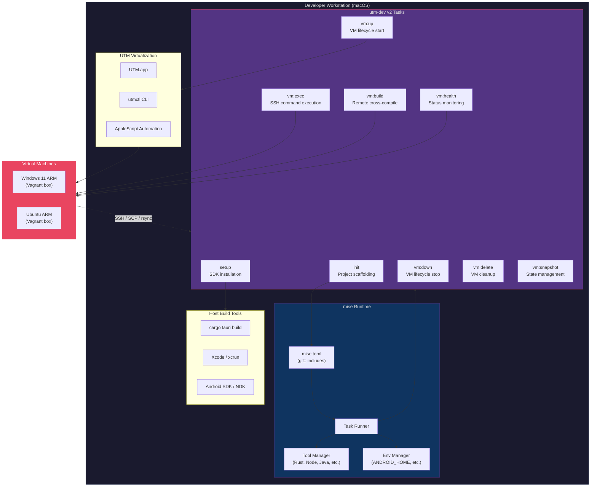
```mermaid
flowchart TB
    subgraph USER["Developer Workstation (macOS)"]
        direction TB
        subgraph MISE["mise Runtime"]
            direction LR
            toml["mise.toml<br/>(git:: includes)"]
            tasks["Task Runner"]
            tools["Tool Manager<br/>(Rust, Node, Java, etc.)"]
            env["Env Manager<br/>(ANDROID_HOME, etc.)"]
        end

        subgraph TASKS["utm-dev v2 Tasks"]
            direction TB
            init["init<br/>Project scaffolding"]
            setup["setup<br/>SDK installation"]
            vm_up["vm:up<br/>VM lifecycle start"]
            vm_down["vm:down<br/>VM lifecycle stop"]
            vm_exec["vm:exec<br/>SSH command execution"]
            vm_delete["vm:delete<br/>VM cleanup"]
            vm_build["vm:build<br/>Remote cross-compile"]
            vm_health["vm:health<br/>Status monitoring"]
            vm_snapshot["vm:snapshot<br/>State management"]
        end

        subgraph HOST_BUILD["Host Build Tools"]
            cargo_tauri["cargo tauri build"]
            xcode["Xcode / xcrun"]
            android_sdk["Android SDK / NDK"]
        end

        subgraph VM_LAYER["UTM Virtualization"]
            utm_app["UTM.app"]
            utmctl["utmctl CLI"]
            applescript["AppleScript Automation"]
        end
    end

    subgraph VMS["Virtual Machines"]
        direction LR
        win_vm["Windows 11 ARM<br/>(Vagrant box)"]
        linux_vm["Ubuntu ARM<br/>(Vagrant box)"]
    end

    toml --> tasks
    tasks --> TASKS
    tasks --> tools
    tasks --> env

    init --> toml
    setup --> HOST_BUILD
    vm_up --> VM_LAYER
    vm_exec --> VMS
    vm_build --> VMS
    vm_health --> VMS

    VM_LAYER --> VMS
    VMS -.->|SSH / SCP / rsync| TASKS

    style USER fill:#1a1a2e,stroke:#16213e,color:#e0e0e0
    style MISE fill:#0f3460,stroke:#533483,color:#e0e0e0
    style TASKS fill:#533483,stroke:#e94560,color:#e0e0e0
    style VMS fill:#e94560,stroke:#e94560,color:#ffffff
```

### Task Dependency Graph

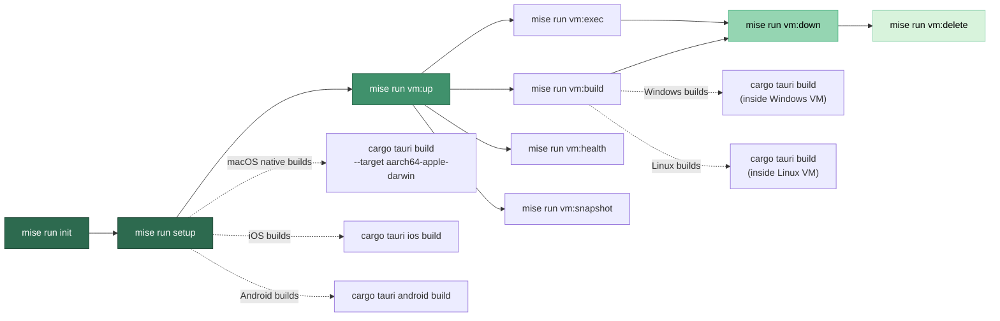
```mermaid
flowchart LR
    init["mise run init"] --> setup["mise run setup"]
    setup --> vm_up["mise run vm:up"]
    vm_up --> vm_exec["mise run vm:exec"]
    vm_up --> vm_build["mise run vm:build"]
    vm_up --> vm_health["mise run vm:health"]
    vm_up --> vm_snapshot["mise run vm:snapshot"]

    vm_exec --> vm_down["mise run vm:down"]
    vm_build --> vm_down
    vm_down --> vm_delete["mise run vm:delete"]

    setup -.->|"macOS native builds"| cargo_macos["cargo tauri build<br/>--target aarch64-apple-darwin"]
    setup -.->|"iOS builds"| cargo_ios["cargo tauri ios build"]
    setup -.->|"Android builds"| cargo_android["cargo tauri android build"]

    vm_build -.->|"Windows builds"| cargo_win["cargo tauri build<br/>(inside Windows VM)"]
    vm_build -.->|"Linux builds"| cargo_linux["cargo tauri build<br/>(inside Linux VM)"]

    style init fill:#2d6a4f,stroke:#1b4332,color:#fff
    style setup fill:#2d6a4f,stroke:#1b4332,color:#fff
    style vm_up fill:#40916c,stroke:#2d6a4f,color:#fff
    style vm_down fill:#95d5b2,stroke:#52b788,color:#000
    style vm_delete fill:#d8f3dc,stroke:#95d5b2,color:#000
```

### Distribution Model

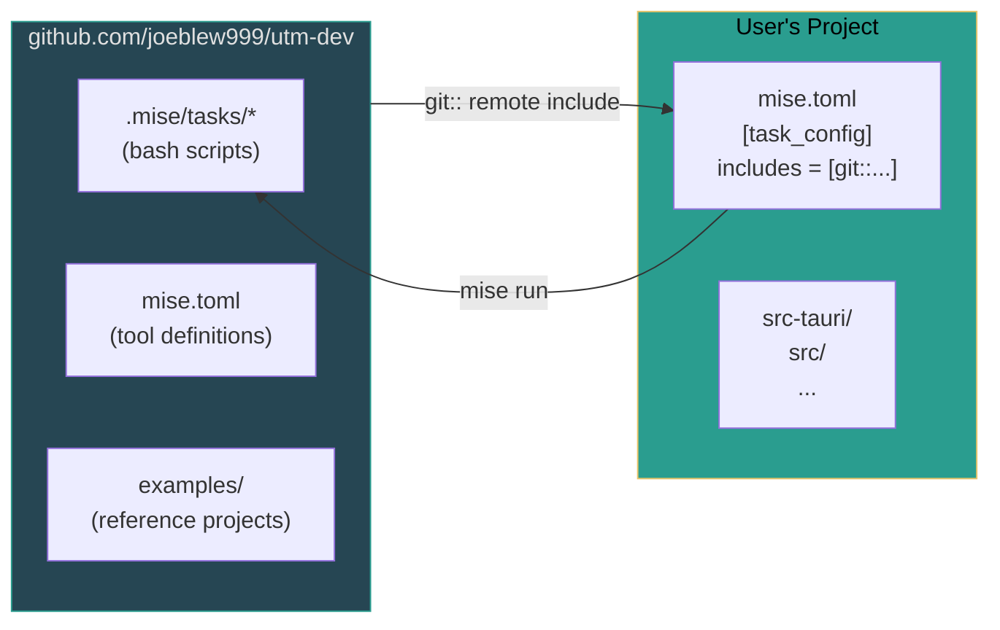
```mermaid
flowchart LR
    subgraph REPO["github.com/joeblew999/utm-dev"]
        direction TB
        mise_tasks[".mise/tasks/*<br/>(bash scripts)"]
        mise_toml["mise.toml<br/>(tool definitions)"]
        examples["examples/<br/>(reference projects)"]
    end

    subgraph PROJECT["User's Project"]
        direction TB
        user_toml["mise.toml<br/>[task_config]<br/>includes = [git::...]"]
        user_src["src-tauri/<br/>src/<br/>..."]
    end

    REPO -->|"git:: remote include"| user_toml
    user_toml -->|"mise run <task>"| mise_tasks

    style REPO fill:#264653,stroke:#2a9d8f,color:#e0e0e0
    style PROJECT fill:#2a9d8f,stroke:#e9c46a,color:#000
```

## Directory Structure

```
utm-dev/
├── .mise/
│   └── tasks/
│       ├── init                    # Project initialization task
│       ├── setup                   # SDK and toolchain installation
│       └── vm/
│           ├── up                  # Install UTM + import VM + configure + start
│           ├── down                # Graceful VM shutdown
│           ├── delete              # VM cleanup (vm | utm | all)
│           ├── exec                # SSH command execution in VM
│           ├── build               # Remote cross-compilation via SSH
│           ├── health              # VM health checks (SSH, RDP, WinRM)
│           └── snapshot/
│               ├── create          # Save VM state checkpoint
│               ├── restore         # Restore VM to checkpoint
│               └── list            # List available snapshots
├── mise.toml                       # Root mise config (tool versions, env)
├── .utm-dev.toml                   # Default utm-dev configuration
├── CLAUDE.md                       # Development context for AI assistants
├── README.md                       # User-facing documentation
└── examples/
    └── tauri-basic/
        ├── mise.toml               # Example: git:: include + tool versions
        ├── .utm-dev.toml           # Example: per-project VM config
        └── src-tauri/
            ├── Cargo.toml
            └── src/
```

## Component Breakdown

### 1. `init` -- Project Initialization

**Purpose:** Bootstrap a new project with utm-dev task includes and default configuration.

**What it does:**
- Adds `[task_config]` with `git::` include to the user's `mise.toml`
- Creates a default `.utm-dev.toml` with sensible defaults
- Registers required mise tool versions (Rust, Node, Java)
- Sets environment variables (`ANDROID_HOME`, `NDK_HOME`, etc.)

**Idempotent:** Yes. Detects existing configuration and skips.

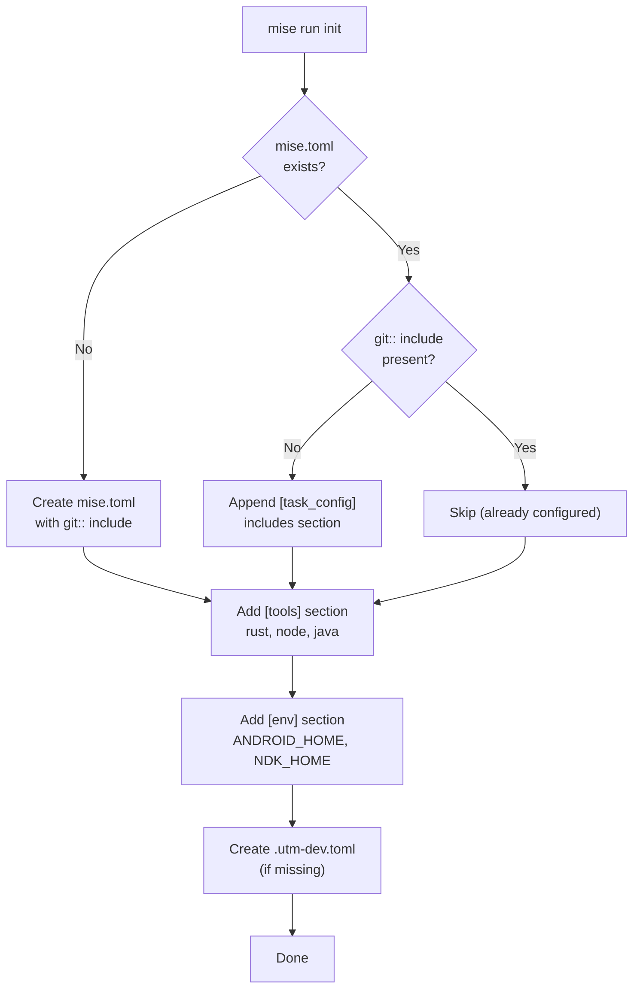
```mermaid
flowchart TD
    start["mise run init"] --> check_toml{"mise.toml<br/>exists?"}
    check_toml -->|No| create_toml["Create mise.toml<br/>with git:: include"]
    check_toml -->|Yes| check_include{"git:: include<br/>present?"}
    check_include -->|No| add_include["Append [task_config]<br/>includes section"]
    check_include -->|Yes| skip_include["Skip (already configured)"]

    create_toml --> add_tools["Add [tools] section<br/>rust, node, java"]
    add_include --> add_tools
    skip_include --> add_tools

    add_tools --> add_env["Add [env] section<br/>ANDROID_HOME, NDK_HOME"]
    add_env --> create_utm_config["Create .utm-dev.toml<br/>(if missing)"]
    create_utm_config --> done["Done"]
```

### 2. `setup` -- SDK and Toolchain Installation

**Purpose:** Install all prerequisites for Tauri cross-platform development.

**Stages:**

| Stage | Tools Installed | Platform |
|-------|----------------|----------|
| 1. Host tools | Rust toolchain, `cargo-tauri`, Xcode CLI tools | macOS |
| 2. Mobile SDKs | Android SDK (cmdline-tools, platforms, build-tools, NDK) | macOS |
| 3. Rust targets | `aarch64-linux-android`, `armv7-linux-androideabi`, `i686-linux-android`, `x86_64-linux-android` | macOS |
| 4. iOS deps | CocoaPods via Ruby gem | macOS |

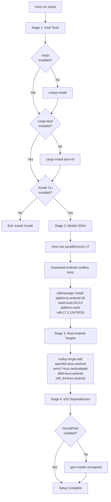
```mermaid
flowchart TD
    setup["mise run setup"] --> stage1["Stage 1: Host Tools"]
    stage1 --> check_rust{"cargo<br/>installed?"}
    check_rust -->|No| install_rust["rustup install"]
    check_rust -->|Yes| check_tauri{"cargo-tauri<br/>installed?"}
    install_rust --> check_tauri
    check_tauri -->|No| install_tauri["cargo install tauri-cli"]
    check_tauri -->|Yes| check_xcode{"Xcode CLI<br/>installed?"}
    install_tauri --> check_xcode
    check_xcode -->|No| fail_xcode["Exit: Install Xcode"]
    check_xcode -->|Yes| stage2["Stage 2: Mobile SDKs"]

    stage2 --> install_java["mise use java@temurin-17"]
    install_java --> install_android["Download Android cmdline-tools"]
    install_android --> sdkmanager["sdkmanager install:<br/>platforms;android-35<br/>build-tools;35.0.0<br/>platform-tools<br/>ndk;27.2.12479018"]

    sdkmanager --> stage3["Stage 3: Rust Android Targets"]
    stage3 --> rustup_targets["rustup target add<br/>aarch64-linux-android<br/>armv7-linux-androideabi<br/>i686-linux-android<br/>x86_64-linux-android"]

    rustup_targets --> stage4["Stage 4: iOS Dependencies"]
    stage4 --> check_pod{"CocoaPods<br/>installed?"}
    check_pod -->|No| install_pod["gem install cocoapods"]
    check_pod -->|Yes| done["Setup Complete"]
    install_pod --> done
```

### 3. `vm:up` -- VM Lifecycle Start

**Purpose:** Install UTM, download/import a Vagrant box, configure networking, and start the VM.

This is the most complex task, handling the full VM provisioning pipeline.

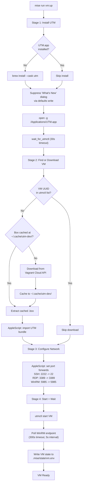
```mermaid
flowchart TD
    up["mise run vm:up"] --> stage1["Stage 1: Install UTM"]
    stage1 --> check_utm{"UTM.app<br/>installed?"}
    check_utm -->|No| brew_utm["brew install --cask utm"]
    check_utm -->|Yes| skip_utm["Skip install"]
    brew_utm --> suppress_dialog["Suppress 'What's New' dialog<br/>via defaults write"]
    skip_utm --> suppress_dialog
    suppress_dialog --> launch_utm["open -g /Applications/UTM.app"]
    launch_utm --> wait_utmctl["wait_for_utmctl (30s timeout)"]

    wait_utmctl --> stage2["Stage 2: Find or Download VM"]
    stage2 --> check_vm{"VM UUID<br/>in utmctl list?"}
    check_vm -->|Yes| skip_download["Skip download"]
    check_vm -->|No| check_cache{"Box cached at<br/>~/.cache/utm-dev/?"}
    check_cache -->|Yes| extract_box["Extract cached .box"]
    check_cache -->|No| download_box["Download from<br/>Vagrant Cloud API"]
    download_box --> cache_box["Cache to ~/.cache/utm-dev/"]
    cache_box --> extract_box
    extract_box --> import_vm["AppleScript: import UTM bundle"]

    import_vm --> stage3["Stage 3: Configure Network"]
    skip_download --> stage3
    stage3 --> applescript_config["AppleScript: set port forwards<br/>SSH: 2222 -> 22<br/>RDP: 3389 -> 3389<br/>WinRM: 5985 -> 5985"]

    applescript_config --> stage4["Stage 4: Start + Wait"]
    stage4 --> utmctl_start["utmctl start VM"]
    utmctl_start --> wait_boot["Poll WinRM endpoint<br/>(300s timeout, 5s interval)"]
    wait_boot --> persist_state["Write VM state to<br/>.mise/state/vm.env"]
    persist_state --> done["VM Ready"]
```

### 4. `vm:exec` -- SSH Command Execution

**Purpose:** Execute arbitrary commands inside a running VM via SSH.

**Execution flow:**
1. Load VM connection details from `.mise/state/vm.env` or `.utm-dev.toml`
2. Establish SSH connection to `localhost:<ssh_port>`
3. Execute the provided command
4. Stream stdout/stderr back to the host
5. Return the remote exit code

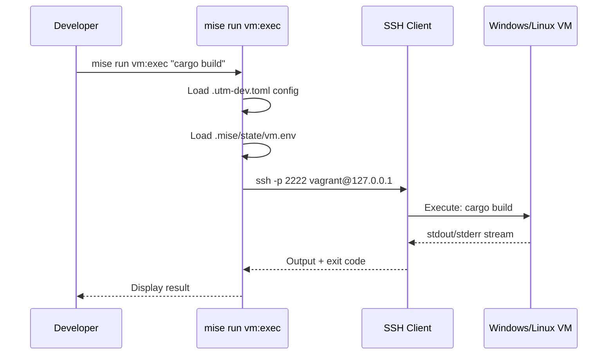
```mermaid
sequenceDiagram
    participant Dev as Developer
    participant Mise as mise run vm:exec
    participant SSH as SSH Client
    participant VM as Windows/Linux VM

    Dev->>Mise: mise run vm:exec "cargo build"
    Mise->>Mise: Load .utm-dev.toml config
    Mise->>Mise: Load .mise/state/vm.env
    Mise->>SSH: ssh -p 2222 vagrant@127.0.0.1
    SSH->>VM: Execute: cargo build
    VM-->>SSH: stdout/stderr stream
    SSH-->>Mise: Output + exit code
    Mise-->>Dev: Display result
```

### 5. `vm:build` -- Remote Cross-Compilation

**Purpose:** Sync project source to a VM, trigger a build, and retrieve artifacts.

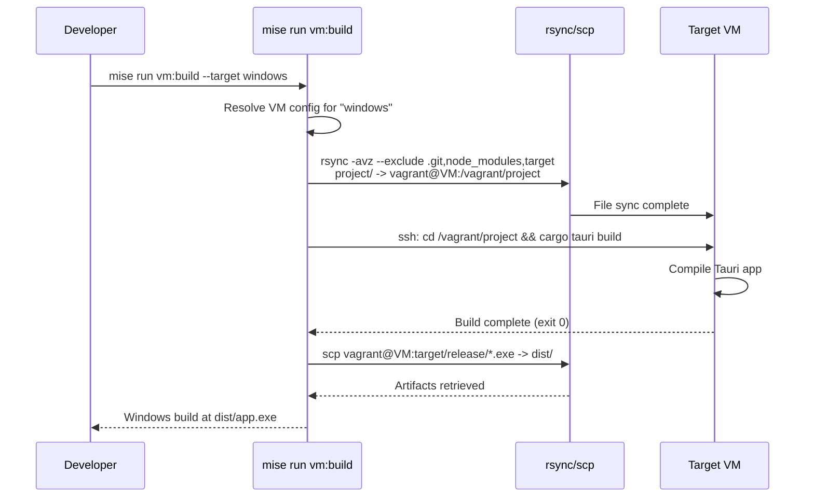
```mermaid
sequenceDiagram
    participant Dev as Developer
    participant Build as mise run vm:build
    participant Rsync as rsync/scp
    participant VM as Target VM

    Dev->>Build: mise run vm:build --target windows
    Build->>Build: Resolve VM config for "windows"
    Build->>Rsync: rsync -avz --exclude .git,node_modules,target<br/>project/ -> vagrant@VM:/vagrant/project
    Rsync->>VM: File sync complete
    Build->>VM: ssh: cd /vagrant/project && cargo tauri build
    VM->>VM: Compile Tauri app
    VM-->>Build: Build complete (exit 0)
    Build->>Rsync: scp vagrant@VM:target/release/*.exe -> dist/
    Rsync-->>Build: Artifacts retrieved
    Build-->>Dev: Windows build at dist/app.exe
```

### 6. `vm:down` / `vm:delete` -- VM Lifecycle Management

**Purpose:** Graceful shutdown and cleanup of VMs.

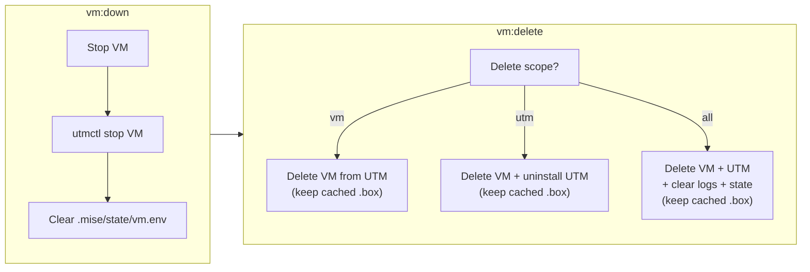
```mermaid
flowchart LR
    subgraph DOWN["vm:down"]
        down_start["Stop VM"] --> utmctl_stop["utmctl stop VM"]
        utmctl_stop --> clear_state["Clear .mise/state/vm.env"]
    end

    subgraph DELETE["vm:delete"]
        delete_start["Delete scope?"]
        delete_start -->|vm| del_vm["Delete VM from UTM<br/>(keep cached .box)"]
        delete_start -->|utm| del_utm["Delete VM + uninstall UTM<br/>(keep cached .box)"]
        delete_start -->|all| del_all["Delete VM + UTM<br/>+ clear logs + state<br/>(keep cached .box)"]
    end

    DOWN --> DELETE
```

### 7. `vm:health` -- Status Monitoring

**Purpose:** Check VM health across SSH, RDP, and WinRM endpoints.

| Check | Method | Port | Timeout |
|-------|--------|------|---------|
| SSH | TCP connect | 2222 | 2s |
| RDP | TCP connect | 3389 | 2s |
| WinRM | HTTP GET `/wsman` | 5985 | 2s |

### 8. `vm:snapshot` -- State Management

**Purpose:** Create, restore, and list VM state snapshots via AppleScript automation.

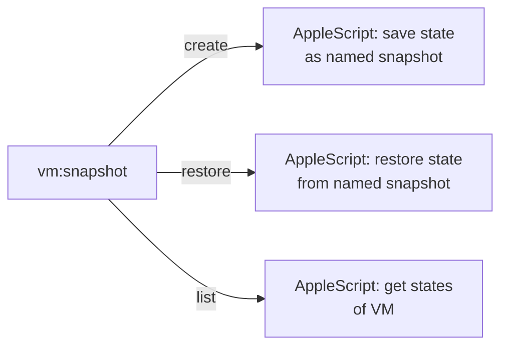
```mermaid
flowchart LR
    snapshot["vm:snapshot"]
    snapshot -->|create| save["AppleScript: save state<br/>as named snapshot"]
    snapshot -->|restore| restore["AppleScript: restore state<br/>from named snapshot"]
    snapshot -->|list| list["AppleScript: get states<br/>of VM"]
```

## Entry Points and Execution Flow

### Primary Entry Point: User's `mise.toml`

```toml
# User adds this to their project's mise.toml
[task_config]
includes = ["git::https://github.com/joeblew999/utm-dev.git//.mise/tasks?ref=main"]

[tools]
"cargo:tauri-cli" = {version = "2", os = ["macos", "windows"]}
java = "temurin-17.0.18+8"
ruby = {version = "3.3", os = ["macos"]}

[env]
ANDROID_HOME = "{{env.HOME}}/.android-sdk"
NDK_HOME = "{{env.HOME}}/.android-sdk/ndk/27.2.12479018"
```

### Complete Developer Workflow

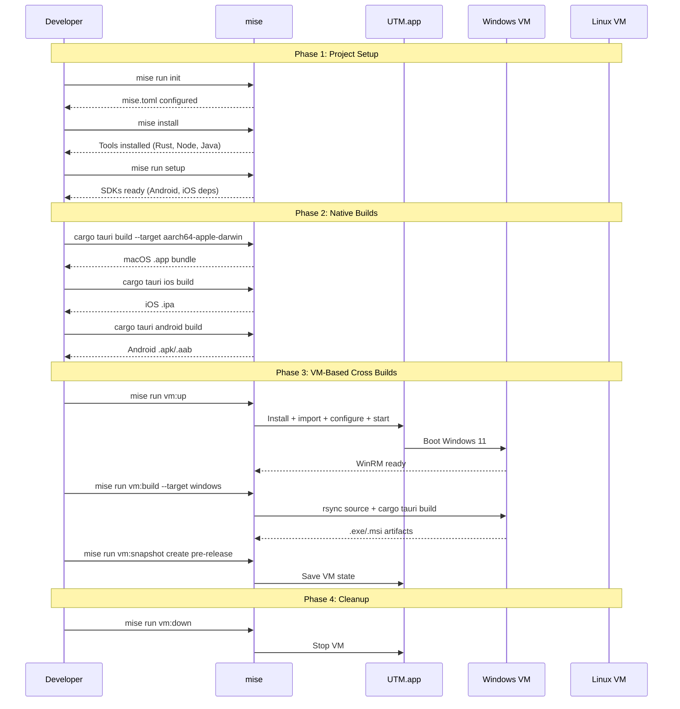
```mermaid
sequenceDiagram
    participant Dev as Developer
    participant Mise as mise
    participant UTM as UTM.app
    participant WinVM as Windows VM
    participant LinVM as Linux VM

    Note over Dev,LinVM: Phase 1: Project Setup
    Dev->>Mise: mise run init
    Mise-->>Dev: mise.toml configured

    Dev->>Mise: mise install
    Mise-->>Dev: Tools installed (Rust, Node, Java)

    Dev->>Mise: mise run setup
    Mise-->>Dev: SDKs ready (Android, iOS deps)

    Note over Dev,LinVM: Phase 2: Native Builds
    Dev->>Mise: cargo tauri build --target aarch64-apple-darwin
    Mise-->>Dev: macOS .app bundle

    Dev->>Mise: cargo tauri ios build
    Mise-->>Dev: iOS .ipa

    Dev->>Mise: cargo tauri android build
    Mise-->>Dev: Android .apk/.aab

    Note over Dev,LinVM: Phase 3: VM-Based Cross Builds
    Dev->>Mise: mise run vm:up
    Mise->>UTM: Install + import + configure + start
    UTM->>WinVM: Boot Windows 11
    WinVM-->>Mise: WinRM ready

    Dev->>Mise: mise run vm:build --target windows
    Mise->>WinVM: rsync source + cargo tauri build
    WinVM-->>Mise: .exe/.msi artifacts

    Dev->>Mise: mise run vm:snapshot create pre-release
    Mise->>UTM: Save VM state

    Note over Dev,LinVM: Phase 4: Cleanup
    Dev->>Mise: mise run vm:down
    Mise->>UTM: Stop VM
```

## Data Flow

### File and Artifact Flow

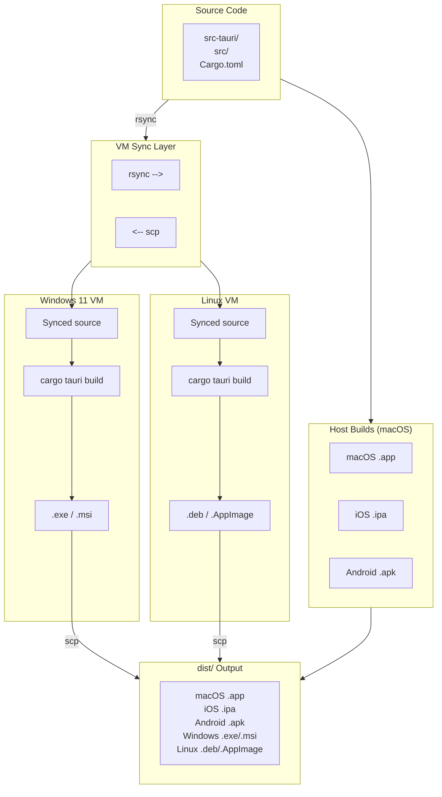
```mermaid
flowchart TB
    subgraph SOURCE["Source Code"]
        src["src-tauri/<br/>src/<br/>Cargo.toml"]
    end

    subgraph HOST_BUILDS["Host Builds (macOS)"]
        macos_build["macOS .app"]
        ios_build["iOS .ipa"]
        android_build["Android .apk"]
    end

    subgraph VM_SYNC["VM Sync Layer"]
        rsync_out["rsync -->"]
        scp_back["<-- scp"]
    end

    subgraph WINDOWS_VM["Windows 11 VM"]
        win_source["Synced source"]
        win_build["cargo tauri build"]
        win_artifact[".exe / .msi"]
    end

    subgraph LINUX_VM["Linux VM"]
        lin_source["Synced source"]
        lin_build["cargo tauri build"]
        lin_artifact[".deb / .AppImage"]
    end

    subgraph DIST["dist/ Output"]
        all_artifacts["macOS .app<br/>iOS .ipa<br/>Android .apk<br/>Windows .exe/.msi<br/>Linux .deb/.AppImage"]
    end

    SOURCE --> HOST_BUILDS
    SOURCE -->|rsync| VM_SYNC
    VM_SYNC --> win_source
    VM_SYNC --> lin_source
    win_source --> win_build --> win_artifact
    lin_source --> lin_build --> lin_artifact
    win_artifact -->|scp| DIST
    lin_artifact -->|scp| DIST
    HOST_BUILDS --> DIST
```

### State Management Flow

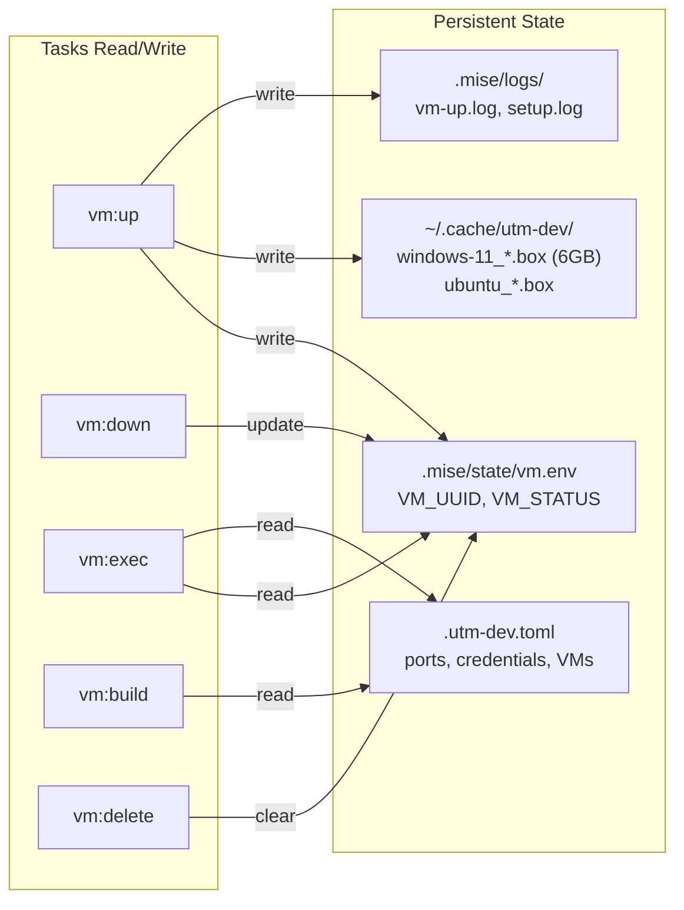
```mermaid
flowchart LR
    subgraph PERSIST["Persistent State"]
        cache["~/.cache/utm-dev/<br/>windows-11_*.box (6GB)<br/>ubuntu_*.box"]
        vm_state[".mise/state/vm.env<br/>VM_UUID, VM_STATUS"]
        logs[".mise/logs/<br/>vm-up.log, setup.log"]
        config[".utm-dev.toml<br/>ports, credentials, VMs"]
    end

    subgraph TASKS["Tasks Read/Write"]
        vm_up["vm:up"] -->|write| vm_state
        vm_up -->|write| cache
        vm_up -->|write| logs
        vm_down["vm:down"] -->|update| vm_state
        vm_exec["vm:exec"] -->|read| vm_state
        vm_exec -->|read| config
        vm_build["vm:build"] -->|read| config
        vm_delete["vm:delete"] -->|clear| vm_state
    end
```

## External Dependencies

| Dependency | Type | Version | Purpose |
|-----------|------|---------|---------|
| **mise** | Runtime | 2024.12+ | Task runner, tool manager, env manager |
| **UTM.app** | Application | 4.6+ | macOS virtualization (QEMU-based) |
| **utmctl** | CLI | (bundled with UTM) | VM control from command line |
| **Homebrew** | Package manager | latest | Installs UTM, sshpass, other tools |
| **AppleScript** | Automation | (macOS built-in) | VM configuration, import, snapshots |
| **Rust** | Toolchain | stable | Tauri backend compilation |
| **cargo-tauri** | CLI | 2.x | Tauri build orchestration |
| **Node.js** | Runtime | 20+ | Tauri frontend bundling |
| **Java** | SDK | temurin-17 | Android SDK tools |
| **Android SDK** | SDK | API 35 | Android build targets |
| **Android NDK** | SDK | 27.2.12479018 | Native Android compilation |
| **Xcode** | IDE/CLI | 15+ | macOS/iOS builds |
| **CocoaPods** | Package manager | latest | iOS dependency management |
| **rsync** | File sync | (macOS built-in) | Source sync to VMs |
| **sshpass** | CLI | latest | Non-interactive SSH auth |
| **Vagrant Cloud** | Service | API v2 | VM box downloads |
| **PlistBuddy** | CLI | (macOS built-in) | Read UTM version from plist |

## Configuration

### `.utm-dev.toml` -- Per-Project Configuration

```toml
[vm.windows]
name = "Windows 11"
box = "utm/windows-11"
ssh_port = 2222
rdp_port = 3389
winrm_port = 5985
user = "vagrant"
# password managed via mise secrets

[vm.linux]
name = "Ubuntu 24.04"
box = "utm/ubuntu-24.04"
ssh_port = 2223
user = "vagrant"

[build]
exclude = [".git", "node_modules", "target", "dist"]
remote_dir = "/vagrant/project"
artifact_dir = "dist"

[logging]
level = "info"          # debug | info | warn | error
format = "json"         # json | text
dir = ".mise/logs"
```

### `mise.toml` -- Tool and Environment Configuration

```toml
[task_config]
includes = ["git::https://github.com/joeblew999/utm-dev.git//.mise/tasks?ref=main"]

[tools]
rust = "stable"
node = "20"
"cargo:tauri-cli" = {version = "2", os = ["macos", "windows"]}
xcodegen = {version = "latest", os = ["macos"]}
ruby = {version = "3.3", os = ["macos"]}
java = "temurin-17.0.18+8"

[env]
ANDROID_HOME = "{{env.HOME}}/.android-sdk"
NDK_HOME = "{{env.HOME}}/.android-sdk/ndk/27.2.12479018"
```

### Environment Variables

| Variable | Default | Purpose |
|----------|---------|---------|
| `ANDROID_HOME` | `~/.android-sdk` | Android SDK root |
| `NDK_HOME` | `~/.android-sdk/ndk/27.2.12479018` | Android NDK root |
| `JAVA_HOME` | (set by mise) | Java installation |
| `LOG_LEVEL` | `info` | Logging verbosity |
| `UTM_DEV_CACHE` | `~/.cache/utm-dev` | Box download cache |
| `UTM_DEV_VM_USER` | `vagrant` | Default VM SSH user |

### Port Forwarding Map

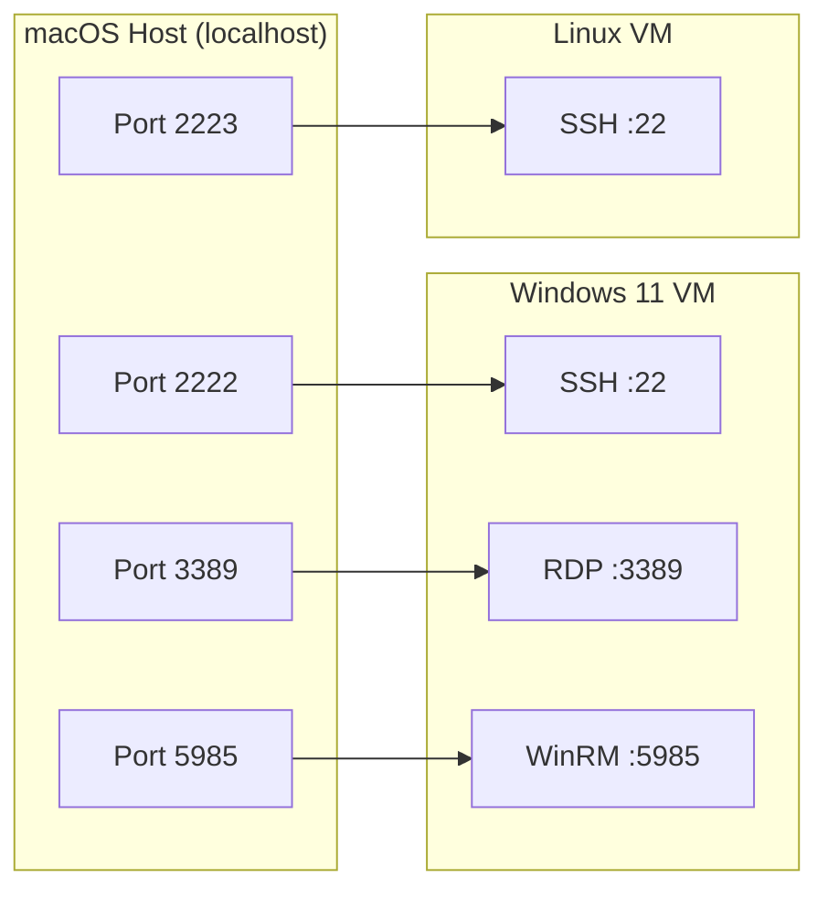
```mermaid
flowchart LR
    subgraph HOST["macOS Host (localhost)"]
        p2222["Port 2222"]
        p3389["Port 3389"]
        p5985["Port 5985"]
        p2223["Port 2223"]
    end

    subgraph WIN_VM["Windows 11 VM"]
        ssh22["SSH :22"]
        rdp3389["RDP :3389"]
        winrm5985["WinRM :5985"]
    end

    subgraph LIN_VM["Linux VM"]
        lin_ssh22["SSH :22"]
    end

    p2222 --> ssh22
    p3389 --> rdp3389
    p5985 --> winrm5985
    p2223 --> lin_ssh22
```

## Caching Strategy

The caching design is critical because VM box files are large (6GB+):

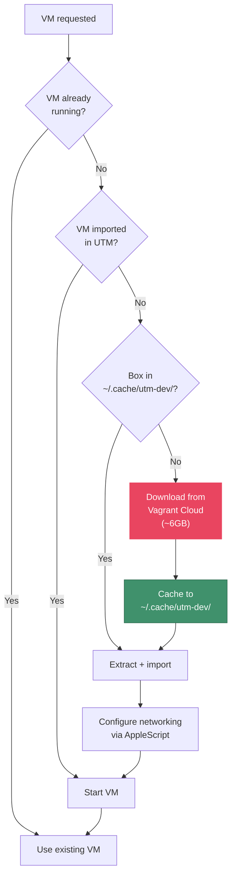
```mermaid
flowchart TD
    request["VM requested"] --> check_running{"VM already<br/>running?"}
    check_running -->|Yes| done["Use existing VM"]
    check_running -->|No| check_imported{"VM imported<br/>in UTM?"}
    check_imported -->|Yes| start["Start VM"]
    check_imported -->|No| check_cache{"Box in<br/>~/.cache/utm-dev/?"}
    check_cache -->|Yes| extract["Extract + import"]
    check_cache -->|No| download["Download from<br/>Vagrant Cloud<br/>(~6GB)"]
    download --> cache["Cache to<br/>~/.cache/utm-dev/"]
    cache --> extract
    extract --> configure["Configure networking<br/>via AppleScript"]
    configure --> start
    start --> done

    style download fill:#e94560,stroke:#e94560,color:#fff
    style cache fill:#40916c,stroke:#2d6a4f,color:#fff
```

**Cache locations:**
- `~/.cache/utm-dev/windows-11_<version>_arm64.box` -- Windows box (~6GB)
- `~/.cache/utm-dev/ubuntu-24.04_<version>_arm64.box` -- Linux box (~2GB)

**Important:** `vm:delete` never removes cached boxes. Only manual cleanup removes them. This prevents re-downloading 6GB files on VM recreation.

## Multi-Platform Build Matrix

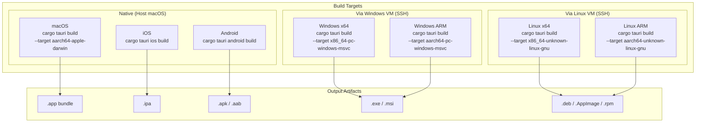
```mermaid
flowchart TB
    subgraph TARGETS["Build Targets"]
        direction TB

        subgraph NATIVE["Native (Host macOS)"]
            macos["macOS<br/>cargo tauri build<br/>--target aarch64-apple-darwin"]
            ios["iOS<br/>cargo tauri ios build"]
            android["Android<br/>cargo tauri android build"]
        end

        subgraph VM_WIN["Via Windows VM (SSH)"]
            windows_x64["Windows x64<br/>cargo tauri build<br/>--target x86_64-pc-windows-msvc"]
            windows_arm["Windows ARM<br/>cargo tauri build<br/>--target aarch64-pc-windows-msvc"]
        end

        subgraph VM_LIN["Via Linux VM (SSH)"]
            linux_x64["Linux x64<br/>cargo tauri build<br/>--target x86_64-unknown-linux-gnu"]
            linux_arm["Linux ARM<br/>cargo tauri build<br/>--target aarch64-unknown-linux-gnu"]
        end
    end

    subgraph ARTIFACTS["Output Artifacts"]
        app[".app bundle"]
        ipa[".ipa"]
        apk[".apk / .aab"]
        exe[".exe / .msi"]
        deb[".deb / .AppImage / .rpm"]
    end

    macos --> app
    ios --> ipa
    android --> apk
    windows_x64 --> exe
    windows_arm --> exe
    linux_x64 --> deb
    linux_arm --> deb
```

## Task Script Anatomy

All tasks follow a consistent bash script pattern:

```bash
#!/usr/bin/env bash
set -euo pipefail

#MISE description="Task description shown in mise run --list"
#MISE alias="short-name"
#MISE depends=["other:task"]

# ── Constants ──────────────────────────────────────────────
PROJECT_DIR="$(pwd)"
SCRIPT_DIR="$(cd "$(dirname "${BASH_SOURCE[0]}")" && pwd)"
LOG_DIR="${PROJECT_DIR}/.mise/logs"
STATE_DIR="${PROJECT_DIR}/.mise/state"

# ── Logging ────────────────────────────────────────────────
log_json() {
  local level="$1" msg="$2"
  printf '{"timestamp":"%s","level":"%s","task":"%s","message":"%s"}\n' \
    "$(date -u +%Y-%m-%dT%H:%M:%SZ)" "${level}" "${TASK_NAME}" "${msg}"
}

ok()   { log_json "info"  "$1"; }
warn() { log_json "warn"  "$1"; }
die()  { log_json "error" "$1" >&2; exit 1; }

# ── Config Loading ─────────────────────────────────────────
if [ -f "${PROJECT_DIR}/.utm-dev.toml" ]; then
  # Parse TOML config
fi

# ── Idempotency Check ─────────────────────────────────────
# Check if work already done, skip if so

# ── Main Logic ─────────────────────────────────────────────
# Task implementation

# ── State Persistence ──────────────────────────────────────
# Write state to .mise/state/
```

Key conventions:
- `set -euo pipefail` for strict error handling
- `#MISE` comments for mise metadata
- JSON structured logging
- Idempotent by default (check-before-act)
- State persisted to `.mise/state/`
- Logs written to `.mise/logs/`
- Trap handlers for cleanup on failure

## Mise Deep Integration

mise is not just a task runner for utm-dev-v2 -- it is the **single orchestration layer** that unifies tool installation, environment configuration, task execution, and cross-VM reproducibility. Understanding how mise is woven through every layer is critical to understanding the system.

### Mise as Tool Version Manager

mise replaces `nvm`, `rustup` (for version selection), `sdkman`, `rbenv`, and `asdf` with a single tool. The `[tools]` block in `mise.toml` is the source of truth for every dependency version:

```toml
[tools]
# Core toolchains - pinned for reproducibility
rust = "1.82.0"                                    # Exact version, not "stable"
node = "20.18.1"                                   # LTS, exact patch
"cargo:tauri-cli" = {version = "2.1.0", os = ["macos", "windows", "linux"]}

# Platform-conditional tools (only installed where needed)
xcodegen = {version = "2.42.0", os = ["macos"]}
ruby = {version = "3.3.6", os = ["macos"]}         # For CocoaPods on macOS
java = "temurin-17.0.13+11"                        # Android SDK requires JDK 17

# Build tools installed via cargo backend
"cargo:cargo-nextest" = "0.9"                      # Faster test runner
"cargo:cargo-auditable" = "0.6"                    # Embed dependency info in binaries
```

#### How `mise install` Works Under the Hood

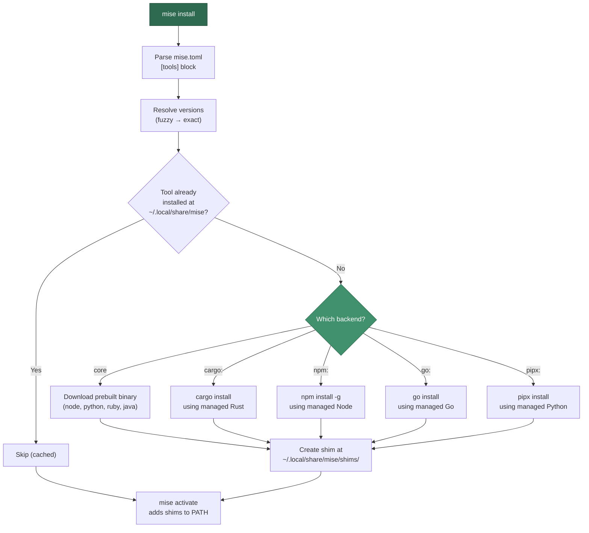
```mermaid
flowchart TD
    install["mise install"] --> parse["Parse mise.toml<br/>[tools] block"]
    parse --> resolve["Resolve versions<br/>(fuzzy → exact)"]
    resolve --> check{"Tool already<br/>installed at<br/>~/.local/share/mise?"}
    check -->|Yes| skip["Skip (cached)"]
    check -->|No| backend{"Which backend?"}

    backend -->|"core"| core["Download prebuilt binary<br/>(node, python, ruby, java)"]
    backend -->|"cargo:"| cargo["cargo install <crate><br/>using managed Rust"]
    backend -->|"npm:"| npm["npm install -g <pkg><br/>using managed Node"]
    backend -->|"go:"| go_install["go install <pkg><br/>using managed Go"]
    backend -->|"pipx:"| pipx["pipx install <pkg><br/>using managed Python"]

    core --> shim["Create shim at<br/>~/.local/share/mise/shims/"]
    cargo --> shim
    npm --> shim
    go_install --> shim
    pipx --> shim
    skip --> activate["mise activate <shell><br/>adds shims to PATH"]
    shim --> activate

    style install fill:#2d6a4f,stroke:#1b4332,color:#fff
    style backend fill:#40916c,stroke:#2d6a4f,color:#fff
```

#### Mise Backend System

The `cargo:` prefix in `"cargo:tauri-cli"` tells mise to use its **cargo backend** -- one of several backends that extend mise beyond prebuilt binaries:

| Backend | Prefix | How It Installs | Example |
|---------|--------|-----------------|---------|
| Core | (none) | Downloads prebuilt from mise registry | `rust = "1.82.0"` |
| Cargo | `cargo:` | `cargo install` using mise-managed Rust | `"cargo:tauri-cli" = "2.1.0"` |
| npm | `npm:` | `npm install -g` using mise-managed Node | `"npm:prettier" = "3"` |
| Go | `go:` | `go install` using mise-managed Go | `"go:github.com/..." = "latest"` |
| pipx | `pipx:` | `pipx install` using mise-managed Python | `"pipx:black" = "24"` |
| asdf | `asdf:` | Uses asdf plugin registry | Legacy fallback |

This means utm-dev-v2 can declare `"cargo:tauri-cli" = "2.1.0"` and mise will:
1. Ensure Rust `1.82.0` is installed (it's a dependency)
2. Run `cargo install tauri-cli@2.1.0` using that Rust
3. Create a shim so `cargo-tauri` is on PATH

### Mise Trust Model and Security

Remote task includes (`git::`) execute arbitrary bash scripts. mise has a **trust model** to prevent supply-chain attacks:

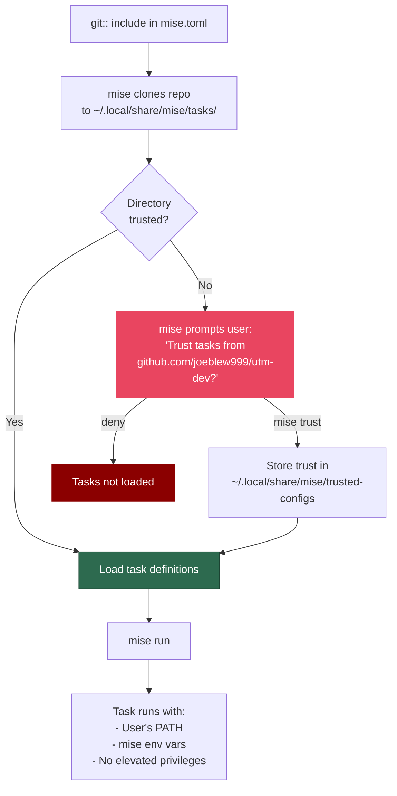
```mermaid
flowchart TD
    include["git:: include in mise.toml"] --> clone["mise clones repo<br/>to ~/.local/share/mise/tasks/"]
    clone --> trusted{"Directory<br/>trusted?"}
    trusted -->|No| prompt["mise prompts user:<br/>'Trust tasks from<br/>github.com/joeblew999/utm-dev?'"]
    prompt -->|"mise trust"| store["Store trust in<br/>~/.local/share/mise/trusted-configs"]
    prompt -->|"deny"| refuse["Tasks not loaded"]
    trusted -->|Yes| load["Load task definitions"]
    store --> load

    load --> execute["mise run <task>"]
    execute --> sandbox["Task runs with:<br/>- User's PATH<br/>- mise env vars<br/>- No elevated privileges"]

    style prompt fill:#e94560,stroke:#e94560,color:#fff
    style refuse fill:#8b0000,stroke:#8b0000,color:#fff
    style load fill:#2d6a4f,stroke:#1b4332,color:#fff
```

**Trust is per-directory and per-config.** If a user clones a project and runs `mise install`, they will be prompted to trust the `mise.toml` before any remote tasks are fetched. This is analogous to VS Code's workspace trust model.

```bash
# First time using utm-dev tasks in a project:
$ mise run vm:up
# Error: /path/to/project/mise.toml is not trusted.
# Run `mise trust` to trust this config file.

$ mise trust
# Trusted /path/to/project/mise.toml
$ mise run vm:up
# Now works
```

### Mise Environment Management

The `[env]` block is more than simple `export` statements. mise supports **templating**, **file loading**, **path manipulation**, and **secrets integration**:

```toml
[env]
# Simple values
TAURI_SIGNING_PRIVATE_KEY_PASSWORD = ""     # Overridden in mise.local.toml

# Template interpolation (uses tera templates)
ANDROID_HOME = "{{env.HOME}}/.android-sdk"
NDK_HOME = "{{env.ANDROID_HOME}}/ndk/27.2.12479018"

# Conditional per-platform
_.macos.DYLD_LIBRARY_PATH = "/opt/homebrew/lib"
_.linux.LD_LIBRARY_PATH = "/usr/local/lib"

# Path manipulation (prepend to PATH)
_.path = [
  "{{env.ANDROID_HOME}}/cmdline-tools/latest/bin",
  "{{env.ANDROID_HOME}}/platform-tools",
  "./node_modules/.bin",
]

# Load from .env file (secrets, gitignored)
_.file = [".env", ".env.local"]

# Source a script to set env vars dynamically
_.source = "./scripts/env-setup.sh"
```

#### `mise.toml` vs `mise.local.toml`


```mermaid
flowchart LR
    subgraph COMMITTED["Committed (mise.toml)"]
        tools["[tools]<br/>rust, node, java"]
        env["[env]<br/>ANDROID_HOME, NDK_HOME"]
        tasks["[task_config]<br/>git:: includes"]
    end

    subgraph LOCAL["Gitignored (mise.local.toml)"]
        secrets["[env]<br/>TAURI_SIGNING_PRIVATE_KEY<br/>APPLE_ID, APPLE_PASSWORD<br/>WINDOWS_CERT_PASSWORD"]
        overrides["[tools]<br/>rust = 'nightly'<br/>(developer experiments)"]
        local_tasks["[tasks.custom]<br/>run = 'my-custom-script.sh'"]
    end

    subgraph GLOBAL["Global (~/.config/mise/config.toml)"]
        global_tools["[tools]<br/>gh = 'latest'<br/>jq = 'latest'"]
        global_env["[env]<br/>GITHUB_TOKEN = '...'"]
    end

    GLOBAL -->|"lowest priority"| COMMITTED
    COMMITTED -->|"higher priority"| LOCAL
    LOCAL -->|"highest priority, secrets here"| env_final["Final Environment"]

    style LOCAL fill:#e94560,stroke:#e94560,color:#fff
    style COMMITTED fill:#2d6a4f,stroke:#1b4332,color:#fff
```

Key rules:
- `mise.toml` is **committed** -- shared across the team, reproducible
- `mise.local.toml` is **gitignored** -- per-developer secrets and overrides
- Global config is **user-wide** -- personal tools and tokens
- Later files override earlier ones (local > project > global)

### Mise Inside VMs: Identical Environment Bootstrapping

When a VM is provisioned (via UTM or Vagrant), mise is installed inside the VM to create an **identical toolchain environment**:

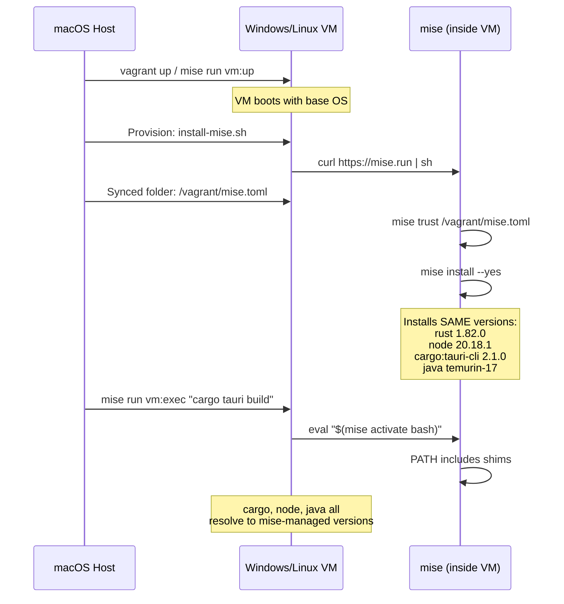
```mermaid
sequenceDiagram
    participant Host as macOS Host
    participant VM as Windows/Linux VM
    participant Mise_VM as mise (inside VM)

    Host->>VM: vagrant up / mise run vm:up
    Note over VM: VM boots with base OS

    Host->>VM: Provision: install-mise.sh
    VM->>Mise_VM: curl https://mise.run | sh

    Host->>VM: Synced folder: /vagrant/mise.toml
    Mise_VM->>Mise_VM: mise trust /vagrant/mise.toml
    Mise_VM->>Mise_VM: mise install --yes

    Note over Mise_VM: Installs SAME versions:<br/>rust 1.82.0<br/>node 20.18.1<br/>cargo:tauri-cli 2.1.0<br/>java temurin-17

    Host->>VM: mise run vm:exec "cargo tauri build"
    VM->>Mise_VM: eval "$(mise activate bash)"
    Mise_VM->>Mise_VM: PATH includes shims
    Note over VM: cargo, node, java all<br/>resolve to mise-managed versions
```

This means:
- **Host macOS** runs `cargo-tauri 2.1.0` via mise
- **Windows VM** runs `cargo-tauri 2.1.0` via mise (installed during provisioning)
- **Linux VM** runs `cargo-tauri 2.1.0` via mise (installed during provisioning)
- **CI runner** runs `cargo-tauri 2.1.0` via mise (installed in CI setup step)

The `mise.toml` is the **single source of truth** for tool versions across all environments. No drift, no "works on my machine."

### Mise Task Metadata System

Tasks use `#MISE` comments for rich metadata that goes beyond simple descriptions:

```bash
#!/usr/bin/env bash
#MISE description="Build Tauri app for target platform via VM"
#MISE alias="vbuild"
#MISE depends=["vagrant:up"]
#MISE sources=["src/**/*", "src-tauri/**/*"]
#MISE outputs=["dist/**/*"]
#MISE [env]
#MISE RUST_LOG = "info"
#MISE
#MISE [args]
#MISE target = { description = "Platform: windows, linux, macos", required = true }
#MISE release = { description = "Build in release mode", type = "flag", alias = "r" }
#MISE sign = { description = "Sign the build artifacts", type = "flag", alias = "s" }
set -euo pipefail
```

| Metadata | Purpose |
|----------|---------|
| `description` | Shown in `mise run --list` and `mise run --help` |
| `alias` | Short name (`mise run vbuild` instead of `mise run vagrant:build`) |
| `depends` | Tasks that must run first (mise resolves DAG automatically) |
| `sources` | File globs -- task only re-runs if sources changed (like make) |
| `outputs` | Expected output files -- used for cache invalidation |
| `[env]` | Task-specific environment variables |
| `[args]` | CLI arguments with types, defaults, descriptions |
| `wait_for` | Tasks that must complete (weaker than depends -- no auto-trigger) |
| `dir` | Working directory override for the task |

The `sources`/`outputs` feature is especially powerful: `mise run vm:build --target windows` can skip entirely if no source files changed since the last Windows build. This is **make-like incremental building** without a Makefile.

### Mise Watch Mode for Development

During development, mise can watch source files and re-run tasks automatically:

```bash
# Watch source files and rebuild on change
mise watch -t build:dev --glob "src/**/*.rs" --glob "src/**/*.ts"

# Watch and re-run tests on change
mise watch -t test:unit --glob "src/**/*.rs"
```

This integrates with the VM workflow:
```bash
# In one terminal: watch for changes, sync to VM, rebuild
mise watch -t vm:build --glob "src/**/*" -- --target linux

# In another terminal: watch for changes, run tests in VM
mise watch -t test:linux --glob "src/**/*.rs"
```

## Production Readiness

### Code Signing and Notarization

Cross-platform distribution requires platform-specific signing. utm-dev-v2 integrates signing into the build pipeline via mise tasks and environment variables:

```mermaid
flowchart TB
    subgraph SIGN_MAC["macOS Signing"]
        direction TB
        mac_build["cargo tauri build"] --> mac_sign["codesign --deep --force<br/>--sign 'Developer ID'<br/>app.app"]
        mac_sign --> mac_notarize["xcrun notarytool submit<br/>--apple-id $APPLE_ID<br/>--password $APPLE_APP_PASSWORD<br/>--team-id $APPLE_TEAM_ID"]
        mac_notarize --> mac_staple["xcrun stapler staple<br/>app.app"]
        mac_staple --> mac_dmg["create-dmg / hdiutil<br/>→ app.dmg"]
    end

    subgraph SIGN_WIN["Windows Signing"]
        direction TB
        win_build["cargo tauri build"] --> win_sign["signtool sign<br/>/f cert.pfx<br/>/p $WINDOWS_CERT_PASSWORD<br/>/tr timestamp.digicert.com<br/>app.exe"]
        win_sign --> win_msi["WiX / cargo-wix<br/>→ app.msi"]
        win_msi --> win_sign_msi["signtool sign<br/>/f cert.pfx<br/>app.msi"]
    end

    subgraph SIGN_LINUX["Linux Signing"]
        direction TB
        lin_build["cargo tauri build"] --> lin_appimage["AppImage bundle"]
        lin_build --> lin_deb["dpkg-deb → .deb"]
        lin_deb --> lin_gpg["gpg --sign<br/>--detach-sig<br/>app.deb"]
        lin_appimage --> lin_gpg_app["gpg --sign<br/>--detach-sig<br/>app.AppImage"]
    end

    style SIGN_MAC fill:#1a1a2e,stroke:#533483,color:#e0e0e0
    style SIGN_WIN fill:#1a1a2e,stroke:#533483,color:#e0e0e0
    style SIGN_LINUX fill:#1a1a2e,stroke:#533483,color:#e0e0e0
```

#### Secrets Configuration for Signing

All signing credentials live in `mise.local.toml` (gitignored) or CI secrets:

```toml
# mise.local.toml (NEVER committed)
[env]
# macOS signing
APPLE_CERTIFICATE = "base64-encoded-p12"
APPLE_CERTIFICATE_PASSWORD = "..."
APPLE_ID = "dev@company.com"
APPLE_APP_PASSWORD = "xxxx-xxxx-xxxx-xxxx"     # App-specific password
APPLE_TEAM_ID = "XXXXXXXXXX"
APPLE_SIGNING_IDENTITY = "Developer ID Application: Company (XXXXXXXXXX)"

# Windows signing
TAURI_SIGNING_PRIVATE_KEY = "base64-encoded-pfx"
TAURI_SIGNING_PRIVATE_KEY_PASSWORD = "..."
WINDOWS_CERTIFICATE_THUMBPRINT = "..."

# Linux signing
GPG_PRIVATE_KEY = "base64-encoded-gpg-key"
GPG_PASSPHRASE = "..."

# Tauri updater (auto-update signing)
TAURI_PRIVATE_KEY = "..."
TAURI_KEY_PASSWORD = "..."
```

### Tauri Updater Integration

Tauri 2.x has a built-in updater that checks for new versions and applies updates. The signing keys configured above are used to sign update bundles:

```mermaid
sequenceDiagram
    participant App as Tauri App (User)
    participant Server as Update Server
    participant CI as CI/CD

    Note over CI: On release tag
    CI->>CI: cargo tauri build --release
    CI->>CI: Sign with TAURI_PRIVATE_KEY
    CI->>Server: Upload: app-v1.2.0.tar.gz + signature
    CI->>Server: Upload: update manifest (latest.json)

    Note over App: User runs app
    App->>Server: GET /latest.json
    Server-->>App: {version: "1.2.0", url: "...", signature: "..."}
    App->>App: Compare current version
    App->>Server: Download update bundle
    App->>App: Verify signature with public key
    App->>App: Apply update + restart
```

### Release Pipeline

A complete release from tag to distribution:

```bash
# 1. Prepare release
git tag -s v1.2.0 -m "Release v1.2.0: feature X, fix Y"
git push origin v1.2.0

# 2. CI triggers release workflow:
#    mise install                              # Exact tool versions
#    mise run test:all --parallel              # Full cross-platform test suite
#    mise run build:cross -- --release         # Build on all platforms
#    mise run build:sign                       # Sign all artifacts
#    gh release create v1.2.0 dist/*           # Upload to GitHub Releases

# 3. Post-release:
#    mise run update-server:publish            # Push update manifest
#    mise run changelog:generate               # Auto-generate changelog
```

### Error Recovery and Observability

#### Structured Logging

All tasks emit JSON logs to `.mise/logs/`:

```json
{"timestamp":"2026-03-24T10:30:00Z","level":"info","task":"vm:up","message":"UTM installed via brew","duration_ms":45000}
{"timestamp":"2026-03-24T10:30:45Z","level":"info","task":"vm:up","message":"Windows box cached","size_bytes":6442450944}
{"timestamp":"2026-03-24T10:31:00Z","level":"error","task":"vm:up","message":"WinRM timeout after 300s","vm":"windows-11","port":5985}
```

Query logs with standard tools:
```bash
# Show all errors across all tasks
jq 'select(.level == "error")' .mise/logs/*.log

# Show vm:up timeline with durations
jq 'select(.task == "vm:up") | "\(.timestamp) \(.message) (\(.duration_ms // "")ms)"' .mise/logs/vm-up.log

# Aggregate task durations for performance tracking
jq -s 'group_by(.task) | map({task: .[0].task, total_ms: map(.duration_ms // 0) | add})' .mise/logs/*.log
```

#### Failure Recovery Patterns

```mermaid
flowchart TD
    fail["Task fails"] --> check_state{"Check<br/>.mise/state/"}
    check_state --> partial{"Partial<br/>state?"}
    partial -->|"VM imported but<br/>not configured"| resume["Re-run task<br/>(idempotent, skips<br/>completed steps)"]
    partial -->|"Download interrupted"| cache_check{"Partial file in<br/>~/.cache/utm-dev/?"}
    cache_check -->|Yes| delete_partial["Delete partial file"]
    delete_partial --> retry["Re-run task"]
    cache_check -->|No| retry
    partial -->|"Unknown state"| snapshot{"Have<br/>snapshot?"}
    snapshot -->|Yes| restore["mise run vm:snapshot restore<br/>'last-known-good'"]
    snapshot -->|No| nuke["mise run vm:delete -- --scope all<br/>Start fresh"]

    resume --> done["Task succeeds"]
    retry --> done
    restore --> resume
    nuke --> resume

    style fail fill:#e94560,stroke:#e94560,color:#fff
    style done fill:#2d6a4f,stroke:#1b4332,color:#fff
```

### Security Hardening

| Layer | Measure | Implementation |
|-------|---------|---------------|
| **mise trust** | Prevent untrusted task execution | `mise trust` required per-directory before remote tasks run |
| **SSH keys** | No password auth in production | `PasswordAuthentication no` in VM sshd_config, key-only access |
| **Secrets isolation** | Credentials never in git | `mise.local.toml` (gitignored) + `_.file = [".env.local"]` |
| **VM isolation** | VMs are disposable | Snapshot before risky operations, destroy and recreate on compromise |
| **Signing key rotation** | Limit blast radius | Separate signing keys per platform, rotate on CI secret rotation schedule |
| **Dependency audit** | Supply chain safety | `"cargo:cargo-auditable" = "0.6"` embeds dep info; `cargo audit` in CI |
| **Network segmentation** | VMs on private network | `192.168.56.0/24` private network, no public-facing ports on VMs |
| **Box verification** | Tamper detection | Vagrant Cloud boxes are checksummed; verify SHA256 on download |

## Key Insights

1. **1000x Size Reduction.** The migration from Go binary (~50MB) to bash scripts (~50KB) is not just a size win -- it eliminates the Go runtime dependency entirely. Users only need mise and bash, both of which are already present in most developer environments.

2. **git:: Distribution is Elegant.** mise's remote task include system (`git::https://...`) means utm-dev tasks update automatically on `mise install`. No separate package manager, no version pinning hassles, no binary compatibility issues. The `?ref=main` parameter locks to a branch; tags can be used for stability.

3. **AppleScript is the UTM API.** UTM has no public REST or CLI API for configuration. All VM configuration (networking, port forwarding, display settings) goes through AppleScript, which is fragile but the only option. The Vagrant-UTM project pioneered this approach, and utm-dev adopts it.

4. **Vagrant Cloud as VM Registry.** Pre-built VM images are distributed via HashiCorp's Vagrant Cloud as `.box` files. This provides versioned, checksummed VM images without hosting infrastructure. The `utm/windows-11` and similar boxes are maintained by the UTM community.

5. **SSH as the Universal Execution Layer.** Rather than using UTM's QEMU guest agent (which requires in-VM agent setup), utm-dev v2 uses SSH for all remote operations. SSH is universally available, well-understood, and works identically across Windows (OpenSSH), Linux, and macOS VMs.

6. **Idempotency is Non-Negotiable.** Every task is designed to be run multiple times safely. This matters because developers will inevitably run `mise run vm:up` when a VM is already running, or `mise run setup` after a partial failure. Each task checks current state before acting.

7. **Cache Separation from State.** The 6GB box cache (`~/.cache/utm-dev/`) is kept separate from VM state (`.mise/state/`). Deleting a VM never removes the cached box, so recreation is fast. This is a deliberate UX decision given the download size.

8. **Tauri 2.x Replaces Gio UI.** The original utm-dev was built around Gio UI (pure Go rendering). Tauri 2.x provides a more mature ecosystem: web frontend (any framework), Rust backend, native webview rendering, and mobile support (iOS/Android). This aligns with the broader industry shift toward web-based desktop apps.

9. **mise as the Integration Point.** By building on mise rather than a custom CLI, utm-dev inherits tool versioning, environment management, task dependencies, and shell integration for free. A user who already uses mise for their project gains utm-dev capabilities with a single line in `mise.toml`.

10. **macOS-First, Cross-Platform via VMs.** The architecture assumes macOS as the primary development host. Windows and Linux support come via UTM VMs, not native tooling. This is pragmatic for Apple Silicon developers who need cross-platform builds but work primarily on macOS.

## Open Questions

1. **Linux Host Support.** UTM is macOS-only. For Linux developers, an equivalent VM layer (QEMU direct, libvirt, or Vagrant with libvirt provider) would be needed. How much of the task logic is portable?

2. **Windows Host Support.** Similarly, Windows developers would need Hyper-V or WSL2 integration. The bash scripts would need to run under Git Bash or WSL.

3. **CI/CD Integration.** Can `mise run vm:up` work in GitHub Actions macOS runners? UTM requires a GUI session for AppleScript, which CI environments may not provide.

4. **VM Image Freshness.** Vagrant Cloud boxes may lag behind OS releases. How are custom/updated boxes built and published?

5. **Credential Management.** The `vagrant/vagrant` default credentials work for local dev but are inappropriate for shared environments. How does mise secrets integration work in practice?

6. **Build Reproducibility.** Source sync via rsync is non-deterministic (timing, file order). Should the VM-based build use a mounted volume or content-addressed sync instead?

7. **Parallel Builds.** Can multiple VMs run simultaneously for parallel Windows + Linux builds? Port conflicts would need resolution.

8. **ARM vs x86 Targeting.** UTM on Apple Silicon runs ARM VMs natively. Building x86 Windows/Linux binaries inside ARM VMs requires cross-compilation or emulation. How is this handled?

9. **Tauri Mobile on VMs.** iOS builds require Xcode (macOS only). Android builds can theoretically run in a Linux VM. Is this a supported path?

10. **Vagrant-UTM Provider Stability.** The Vagrant UTM provider is a community project. What is the maintenance status and how tightly coupled is utm-dev to its internals?

## Related Deep-Dives

- **[utm-dev-v2-vagrant-primer.md](./utm-dev-v2-vagrant-primer.md)** -- Vagrant fundamentals primer: teaches Vagrant from scratch, full integration guide from zero to production, and mental models for how Vagrant + mise + utm-dev-v2 fit together. **Read this first.**
- **[utm-dev-v2-vagrant.md](./utm-dev-v2-vagrant.md)** -- Vagrant-based cross-platform testing: production Vagrantfile, provisioning scripts, CI/CD pipelines, testing matrix, security hardening, and performance optimization.

## References

- [utm-dev v1 Exploration](../utm-dev/exploration.md) -- Original Go CLI architecture
- [utm-dev Mise Remote Plugin Exploration](../utm-dev/mise-remote-plugin-exploration.md) -- Migration analysis
- [mise Documentation](https://mise.jdx.dev/) -- Task system, remote includes, tool management
- [UTM](https://mac.getutm.app/) -- macOS virtualization
- [Tauri](https://tauri.app/) -- Cross-platform app framework
- [Vagrant UTM Provider](https://github.com/naveenrajm7/vagrant_utm) -- Vagrant integration for UTM
- [Vagrant Cloud](https://app.vagrantup.com/) -- VM box registry
