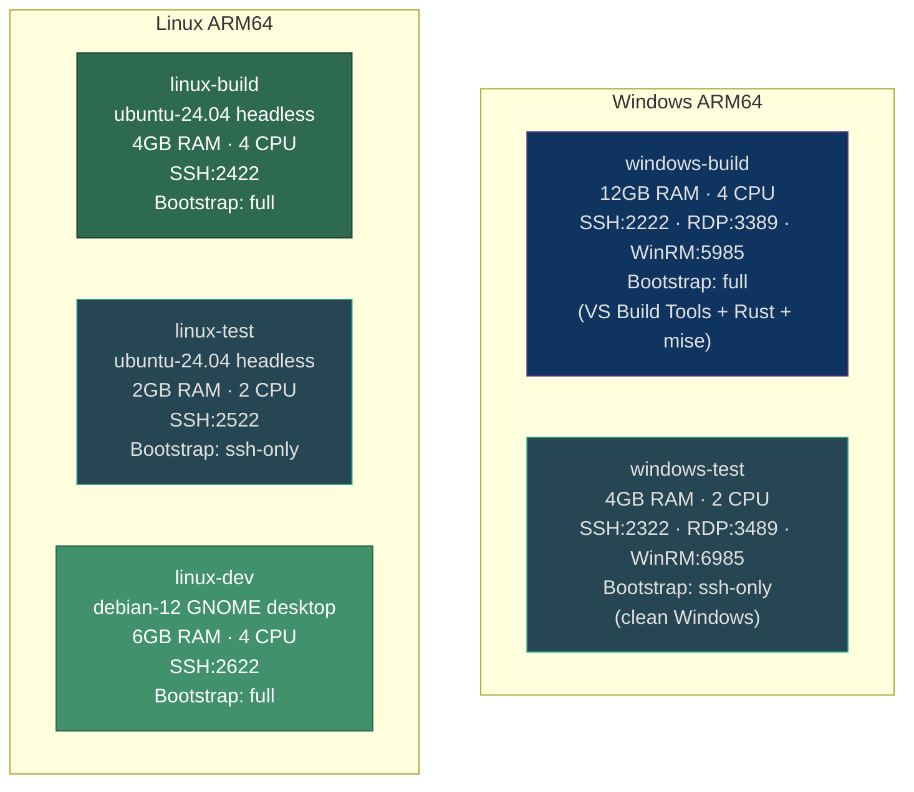
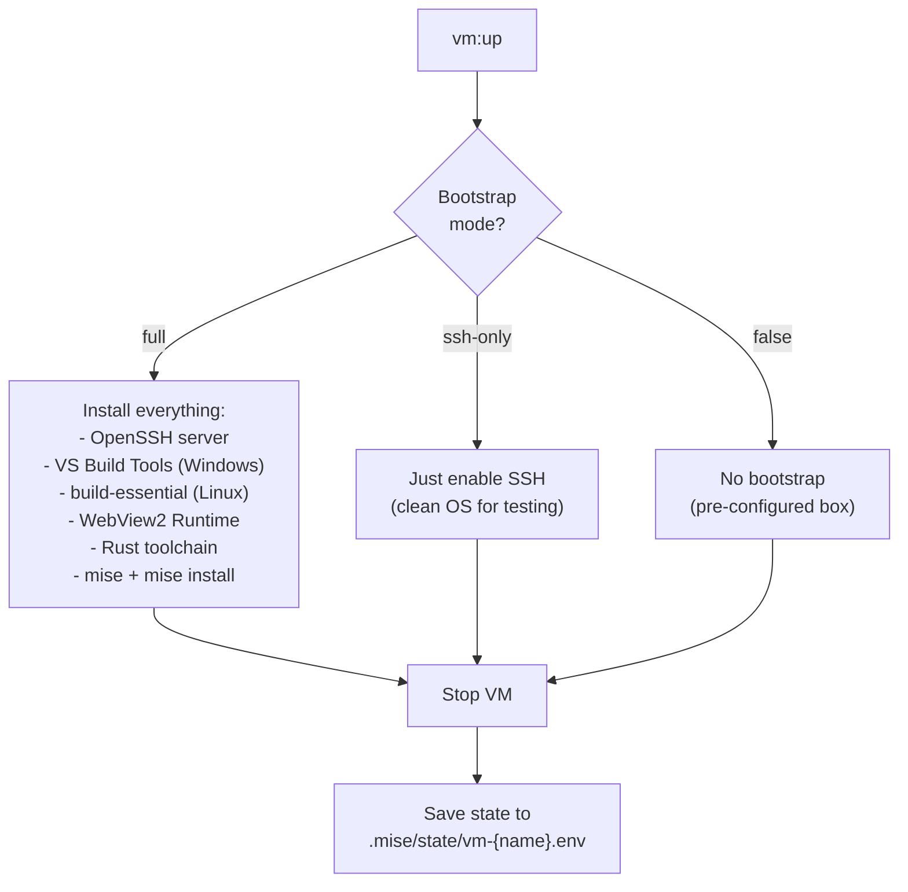
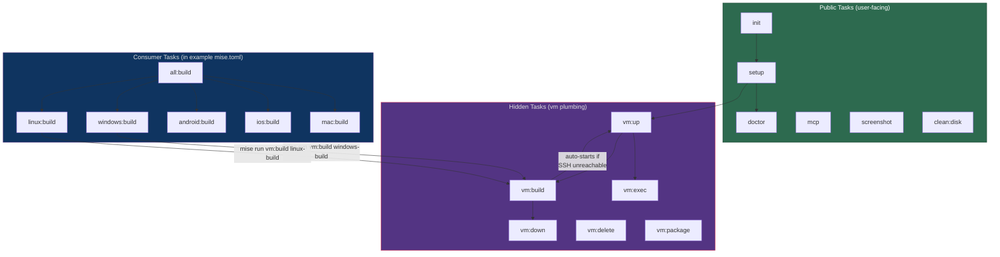
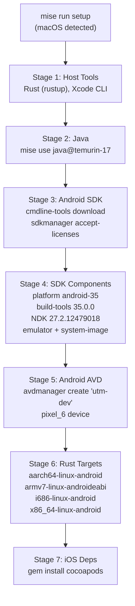
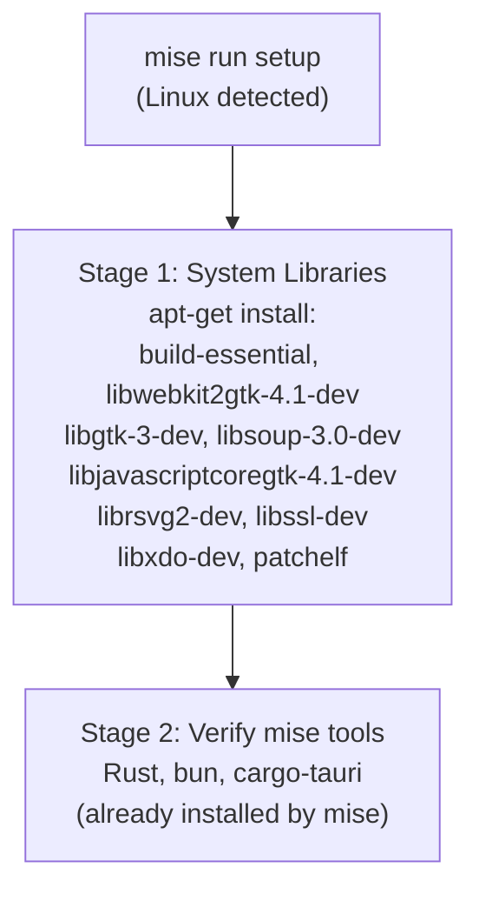
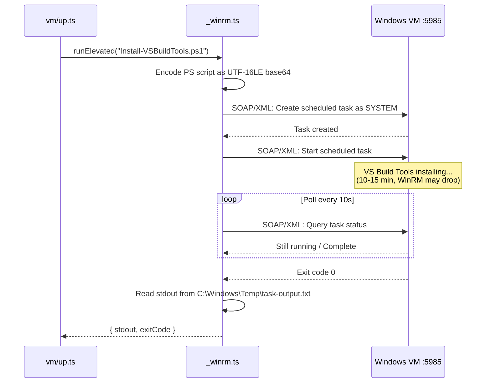
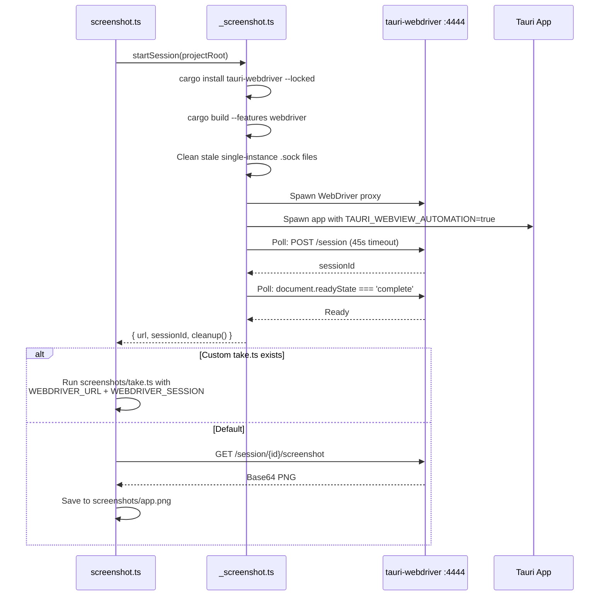
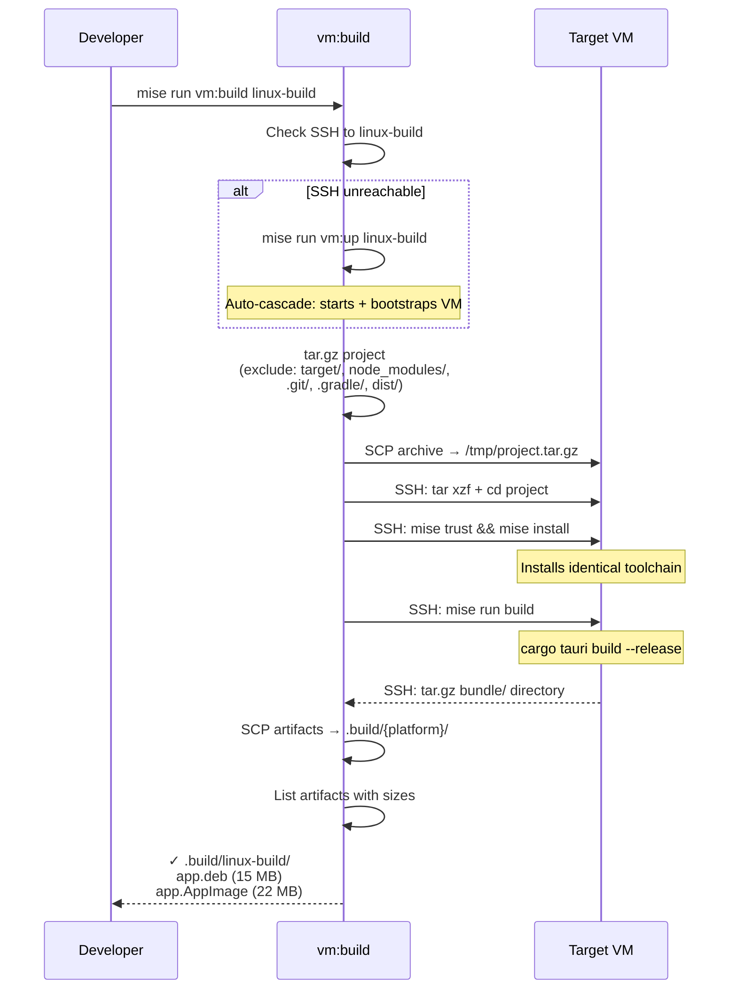
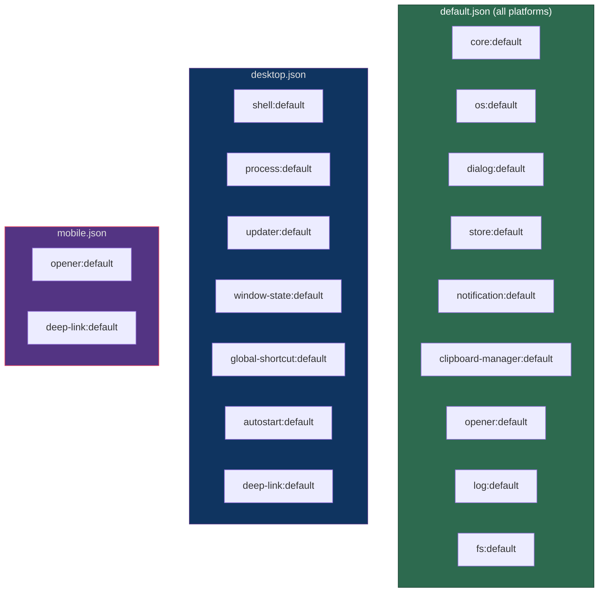

# utm-dev-v2: Latest Update — What Changed and What to Keep in Mind

> **This document supersedes assumptions in `exploration.md` about bash-based tasks.**
> utm-dev has undergone a complete task rewrite from bash scripts to TypeScript/Bun.

---

## TL;DR — The Big Shifts

| What We Assumed (exploration.md) | What Actually Happened |
|---|---|
| Tasks are **bash scripts** with `#MISE` comments | Tasks are **TypeScript files** running on **Bun** with `//MISE` comments |
| 3 tasks under `vm/` (up, down, exec) | 6 tasks under `vm/` + 5 public tasks + 1 under `clean/` |
| Single Windows VM | **5 VM profiles**: windows-build, windows-test, linux-build, linux-test, linux-dev |
| Manual bootstrap | **Auto-bootstrap** with two modes: `full` (build tools) vs `ssh-only` (clean testing) |
| No MCP integration | **MCP servers** configured (context7 + mise) |
| No screenshot tooling | **WebDriver-based screenshot automation** |
| Bash logging helpers | **Structured TypeScript logging** via `_lib.ts` |
| `sshpass` + raw SSH | **Pure TypeScript WinRM SOAP client** + SSH helpers |
| Platform-agnostic setup | **Platform-aware setup** (macOS: SDKs, Linux: apt libs) |

---

## 1. The TypeScript/Bun Migration

### Why This Matters

The single most important change: **every task is now TypeScript running on Bun**. This is not a cosmetic rename — it fundamentally changes how the system works.

```
Before (exploration.md assumed):
  .mise/tasks/vm/up        ← bash script, #MISE metadata
  .mise/tasks/vm/down       ← bash script
  .mise/tasks/setup         ← bash script

After (actual current state):
  .mise/tasks/vm/up.ts      ← TypeScript, //MISE metadata
  .mise/tasks/vm/down.ts    ← TypeScript
  .mise/tasks/setup.ts      ← TypeScript
  .mise/tasks/_lib.ts       ← shared library (NOT a task)
  .mise/tasks/_utm.ts       ← shared library (NOT a task)
  .mise/tasks/_winrm.ts     ← shared library (NOT a task)
```

### What Bun Gives Them

- **Native `fetch()`** — WinRM SOAP client uses fetch, no curl/python
- **Native `Bun.spawn()`** — subprocess management with streaming stdout/stderr
- **TypeScript without transpilation** — Bun runs `.ts` directly
- **Top-level `await`** — async tasks without wrapping in main()
- **Fast startup** — ~10ms vs ~200ms for Node.js

### mise Task Metadata Syntax Change

```typescript
// TypeScript files use //MISE (double-slash) not #MISE (hash)
//MISE description="Start a VM — import + bootstrap on first run"
//MISE alias="vup"
//MISE depends=["setup"]
//MISE hide=true
//MISE
//MISE [args]
//MISE name = { description = "VM profile name", required = true }
```

> **Keep in mind:** The `#MISE` syntax from bash DOES NOT WORK in TypeScript files.
> This was a bug that was caught and fixed (commit `2734b9e`).

### File Naming Convention

Files starting with `_` are **internal libraries**, not tasks:

| File | Type | Purpose |
|---|---|---|
| `_lib.ts` | Library | VM profiles, SSH/SCP helpers, state management, logging |
| `_utm.ts` | Library | UTM operations (install, import box, configure network, start/stop) |
| `_winrm.ts` | Library | Pure SOAP WinRM client over HTTP (no Python dependency) |
| `_bootstrap.ts` | Library | Windows VM provisioning (OpenSSH, VS Build Tools, WebView2, mise) |
| `_bootstrapLinux.ts` | Library | Linux VM provisioning (build-essential, Rust, mise, Tauri deps) |
| `_screenshot.ts` | Library | WebDriver session management for automated screenshots |

mise ignores `_`-prefixed files as tasks — they're only imported by other tasks.

---

## 2. The Five VM Profiles

The system now manages **five distinct VMs**, not one. Each has a specific purpose, resource allocation, and bootstrap mode.

### Profile Table



### Bootstrap Modes



> **Keep in mind:**
> - `windows-build` needs **12GB RAM** — VS Build Tools crashes at 8GB on ARM64
> - Linux VMs take **5–10 minutes** to boot (cloud-init + SSH key generation)
> - Boot timeout is **600s for Linux**, **300s for Windows** — a hard-learned bug fix
> - All VMs use `vagrant:vagrant` credentials from Vagrant Cloud boxes

---

## 3. The Complete Task Map

### Current Directory Structure

```
.mise/tasks/
├── _lib.ts                 # VM profiles, SSH/SCP, state, logging
├── _winrm.ts               # Pure WinRM SOAP client (fetch-based)
├── _utm.ts                 # UTM install, import, network, start/stop
├── _bootstrap.ts           # Windows VM provisioning
├── _bootstrapLinux.ts      # Linux VM provisioning
├── _screenshot.ts          # WebDriver session management
│
├── init.ts                 # Add utm-dev [tools]+[env] to project's mise.toml
├── setup.ts                # Platform-aware: macOS SDKs / Linux apt libs
├── doctor.ts               # Health check: what's installed/missing
├── mcp.ts                  # Configure MCP servers (.mcp.json)
├── screenshot.ts           # WebDriver screenshot automation
├── clean/
│   └── disk.ts             # System-wide disk cleanup (safe + --deep)
│
└── vm/                     # ALL HIDDEN (hide=true) — internal plumbing
    ├── up.ts               # Import + bootstrap + start (idempotent)
    ├── down.ts             # Stop VM
    ├── exec.ts             # SSH command in VM
    ├── build.ts            # Sync → install → build → pull artifacts
    ├── delete.ts           # Delete VM/UTM (preserves box cache)
    └── package.ts          # Export as Vagrant .box
```

### Task Dependency Flow



> **Keep in mind:** Users never run `vm:*` tasks directly. They use consumer-level tasks like `windows:build` or `linux:build` which delegate to `vm:build` internally.

---

## 4. Platform-Aware Setup

`setup.ts` now detects the host OS and runs completely different installation paths.

### macOS Path (7 stages)



### Linux Path (2 stages)



> **Keep in mind:** mise handles Rust, Bun, Java, Ruby, cargo-tauri (things it CAN install). `setup.ts` only handles what mise CANNOT: OS-level C libraries (apt), Apple SDKs, CocoaPods. This split is intentional and important.

---

## 5. The WinRM SOAP Client

One of the most notable pieces of engineering: a **pure TypeScript WinRM client** using only `fetch()`. No Python, no external dependencies.

### How It Works



### API Surface

```typescript
class WinRMClient {
  async runCmd(command: string)           // cmd.exe /c
  async runPS(script: string)             // PowerShell -EncodedCommand (UTF-16LE)
  async runElevated(psCode, timeout?)     // Scheduled task as SYSTEM (bypasses UAC)
  async ping(timeoutMs?)                  // HTTP probe to /wsman
}
```

> **Keep in mind:**
> - `runElevated()` is the **only reliable method** for installing software on Windows ARM64
> - WinRM connections **drop during heavy I/O** (VS Build Tools install) — keep polling
> - PowerShell's `-EncodedCommand` requires **UTF-16LE base64**, not UTF-8 — `atob()` corrupts multi-byte characters, use `Buffer`
> - Scheduled tasks run as SYSTEM, bypassing UAC entirely

---

## 6. MCP Integration

New `mcp.ts` task configures AI-assisted development:

### Servers Configured

| Server | Command | Purpose |
|---|---|---|
| **context7** | `bunx @upstash/context7-mcp@latest` | Live documentation retrieval for any library |
| **mise** | `mise mcp` | Exposes tools, tasks, env, config as MCP resources |

### What mise MCP Exposes

| Resource | URI | Content |
|---|---|---|
| Tools | `mise://tools` | All installed tools with versions |
| Tasks | `mise://tasks` | Available tasks with descriptions |
| Environment | `mise://env` | Current env vars set by mise |
| Config | `mise://config` | mise.toml parsed as structured data |

| Tool | Description |
|---|---|
| `run_task` | Execute any mise task programmatically |
| `install_tool` | Install a tool via mise |

### Auto-Permissions

`mcp.ts` writes `.claude/settings.json` with `permissions.allow = ["mcp__*__*"]` — all MCP tools auto-allowed, no prompting.

---

## 7. Screenshot Automation

New WebDriver-based screenshot system:



> **Keep in mind:**
> - WebDriver is **feature-gated** (`--features webdriver`) — not in production builds
> - The `tauri-plugin-single-instance` leaves stale `.sock` files that block WebDriver sessions — `_screenshot.ts` cleans them
> - Custom `screenshots/take.ts` scripts get `WEBDRIVER_URL` and `WEBDRIVER_SESSION` as env vars

---

## 8. Disk Cleanup

New `clean:disk` task with intelligent safe cleanup:

### Protected Directories (NEVER touched)

| Path | Why |
|---|---|
| `~/.cache/utm-dev/` | Box cache (6GB+ downloads) |
| `~/Library/Containers/com.utmapp.UTM` | Live VMs |
| `~/.rustup/toolchains` | Rust installations |
| `~/.android-sdk` | Android SDK |

### Standard Cleanup (50+ MB threshold)

| Target | Typical Size |
|---|---|
| `target/` directories (Rust builds) | 1–30 GB |
| Unavailable iOS simulators | 1–5 GB |
| CoreSimulator caches/logs | 500 MB–2 GB |
| Xcode DerivedData | 1–10 GB |
| Cargo registry cache | 200 MB–1 GB |
| Gradle caches | 500 MB–3 GB |
| Bun install cache | 100 MB–1 GB |
| npm cache | 100 MB–500 MB |
| CocoaPods cache | 200 MB–1 GB |

### `--deep` Mode (additional)

| Target | Typical Size |
|---|---|
| Homebrew cache | 500 MB–3 GB |
| Xcode Archives | 1–20 GB |
| Xcode iOS DeviceSupport | 2–10 GB |
| Docker images/build cache | 5–50 GB |
| System logs (`/private/var/log`) | 100 MB–1 GB |

> **Keep in mind:** Always use `--dry-run` first. The standard mode is safe for daily use; `--deep` should be reserved for disk pressure situations.

---

## 9. The vm:build Pipeline

The most complex hidden task — handles the full sync → build → retrieve cycle:



> **Keep in mind:**
> - `vm:build` **auto-starts the VM** if SSH is unreachable — fully self-healing
> - Source sync uses tar+scp, not rsync — simpler, works on all platforms
> - Inside the VM, `mise trust && mise install` ensures identical toolchain
> - Artifacts land in `.build/{profile-name}/` on the host

---

## 10. The Consumer Example Pattern

### How Projects Consume utm-dev

The `examples/tauri-basic/mise.toml` shows the recommended consumption pattern:

```toml
# Local development (symlink to utm-dev tasks)
[task_config]
includes = ["../../.mise/tasks"]

# Production (remote git include)
# [task_config]
# includes = ["git::https://github.com/joeblew999/utm-dev.git//.mise/tasks?ref=main"]
```

### Consumer-Level Tasks (what devs actually run)

```toml
# These are in the CONSUMER'S mise.toml, NOT in utm-dev
[tasks.mac:build]
run = "cargo tauri build"

[tasks.ios:build]
run = "cargo tauri ios build"

[tasks.android:build]
run = "cargo tauri android build"

[tasks.windows:build]
run = "mise run vm:build windows-build"

[tasks.linux:build]
run = "mise run vm:build linux-build"

[tasks.all:build]
depends = ["mac:build", "ios:build", "android:build", "windows:build", "linux:build"]
```

> **Keep in mind:** The `vm:*` tasks are **hidden** (`hide=true`). Users never see them in `mise tasks`. They use platform-level aliases. This is intentional UX design.

---

## 11. Tauri 2.x Capabilities System

The example app demonstrates Tauri's **fine-grained permission model** with capabilities split by platform:

### Capability Files

```
src-tauri/capabilities/
├── default.json     # Shared across ALL platforms
├── desktop.json     # Desktop-only permissions
└── mobile.json      # Mobile-only permissions
```

### Permission Split



### Plugins in Use (16 total)

| Plugin | Purpose | Platform |
|---|---|---|
| Shell | Execute system commands | Desktop |
| OS | System info (arch, OS, locale) | All |
| Dialog | File open/save, message boxes | All |
| Store | Persistent key-value storage | All |
| Notification | System notifications | All |
| Clipboard | Copy/paste | All |
| Opener | Open URLs/files in default app | All |
| Process | Manage app lifecycle, exit, restart | Desktop |
| Log | Structured logging to file | All |
| Filesystem | File read/write (scoped) | All |
| Updater | Auto-update with signing | Desktop |
| Window State | Remember window position/size | Desktop |
| Single Instance | Prevent multiple app instances | Desktop |
| Global Shortcut | System-wide keyboard shortcuts | Desktop |
| Autostart | Launch on login | Desktop |
| Deep Link | Handle `tauri-basic://` URLs | All |

> **Keep in mind:**
> - **Single Instance** must register FIRST in the plugin chain (before anything that spawns windows)
> - **WebDriver** is feature-gated: `cargo build --features webdriver` — NEVER in production builds
> - Updater uses Tauri's built-in signing keys (`.tauri-key` file)
> - Capabilities are **additive** — you can't deny a permission, only grant

---

## 12. Bug Fixes and Hard-Learned Lessons

These are the things that will bite you if you don't know about them:

### VM Import UUID Bug (commit `8994abf`)

**Problem:** `importBox()` used `getFirstVm()` to find the newly imported VM. With multiple VMs, this always returned the Windows VM — even when importing Linux.

**Fix:** Snapshot all UUIDs before import, snapshot after, diff to find the new one.

**Lesson:** Never assume ordering in `utmctl list`. Always diff state.

### SSH Host Key Rejection (commit `8994abf`)

**Problem:** Reimporting a VM (after delete + recreate) produces a new SSH host key. The old key in `~/.ssh/known_hosts` causes SSH to refuse connection.

**Fix:** All SSH/SCP calls now use:
```
-o StrictHostKeyChecking=no -o UserKnownHostsFile=/dev/null
```

**Lesson:** For disposable VMs, never trust host key verification. It's a development tool, not production SSH.

### Linux Boot Timeout (commit `8994abf`)

**Problem:** Boot timeout was 300s (5 min) for all VMs. Linux cloud-init + SSH key generation takes 5–10 minutes.

**Fix:** 600s timeout for Linux, 300s for Windows.

**Lesson:** Don't assume boot times are uniform across OS types.

### VS Build Tools on ARM64 (commit `de1f9c4`)

**Problem:** `winget install` with `--override` flags doesn't work for VS Build Tools on ARM64.

**Fix:** Direct bootstrapper download + `--wait` flag:
```
vs_BuildTools.exe --wait --add Microsoft.VisualStudio.Workload.VCTools
```

**Lesson:** winget is not reliable for complex installers on ARM64. Use direct installers.

### WinRM Drops During Heavy I/O (commit `97dd189`)

**Problem:** Installing VS Build Tools causes WinRM to become unresponsive. Task appears to hang.

**Fix:** Keep polling even after connection drops. The installation continues inside the VM regardless of WinRM state.

**Lesson:** WinRM is fragile under load. Design for disconnection resilience.

### mise Task Syntax (commit `2734b9e`)

**Problem:** TypeScript files used `#MISE` (bash syntax). mise silently ignored all metadata.

**Fix:** Use `//MISE` for TypeScript/JavaScript files.

**Lesson:** mise task metadata syntax varies by file extension: `#MISE` for bash/shell, `//MISE` for TypeScript/JavaScript.

### 12GB RAM for Windows Build (commit `37a3e1f`)

**Problem:** VS Build Tools crashes or hangs during compilation with 8GB RAM on ARM64.

**Fix:** Bumped `windows-build` profile to 12GB RAM.

**Lesson:** ARM64 Windows emulation of x86 build tools has significantly higher memory overhead than native.

---

## 13. Architecture Comparison: Then vs Now

```mermaid
flowchart LR
    subgraph THEN["exploration.md Assumed"]
        direction TB
        bash["Bash scripts<br/>(~50KB)"]
        hash_mise["#MISE metadata"]
        three_tasks["3 vm tasks<br/>(up, down, exec)"]
        one_vm["1 VM<br/>(Windows)"]
        manual_boot["Manual bootstrap"]
        no_mcp["No MCP"]
        no_screenshot["No screenshots"]
    end

    subgraph NOW["Actual Current State"]
        direction TB
        ts["TypeScript/Bun<br/>(~30 files)"]
        slash_mise["//MISE metadata"]
        twelve_tasks["12 tasks<br/>(6 vm + 6 public)"]
        five_vm["5 VM profiles<br/>(2 Win + 3 Linux)"]
        auto_boot["Auto-bootstrap<br/>(full / ssh-only)"]
        mcp["MCP integration<br/>(context7 + mise)"]
        screenshot["WebDriver screenshots"]
    end

    THEN -->|"reality gap"| NOW

    style THEN fill:#e94560,stroke:#e94560,color:#fff
    style NOW fill:#2d6a4f,stroke:#1b4332,color:#fff
```



---

## 14. How mise Is Actually Used Now

### Tool Management (mise.toml)

```toml
[tools]
"cargo:tauri-cli" = {version = "2", os = ["macos", "windows"]}
bun = "latest"                           # Task runtime
xcodegen = {version = "latest", os = ["macos"]}
ruby = {version = "3.3", os = ["macos"]} # CocoaPods
java = "temurin-17.0.18+8"              # Android SDK
```

**Important split:**
- mise installs: Rust, Bun, Java, Ruby, cargo-tauri, xcodegen
- `setup.ts` installs: Android SDK (cmdline-tools, NDK), Xcode CLI, CocoaPods gem, Linux system libs

### Environment Management

```toml
[env]
ANDROID_HOME = "{{env.HOME}}/.android-sdk"
NDK_HOME = "{{env.HOME}}/.android-sdk/ndk/27.2.12479018"
JAVA_HOME = "{{env.HOME}}/.local/share/mise/installs/java/temurin-17.0.18+8"
_.path = [
  "{{env.HOME}}/.android-sdk/platform-tools",
  "{{env.HOME}}/.android-sdk/cmdline-tools/latest/bin",
]
```

### Task Loading

Tasks are loaded from `.mise/tasks/` automatically — no `[task_config]` needed in the utm-dev repo itself. Consumers use `includes` to pull them in:

```toml
# Consumer project's mise.toml
[task_config]
includes = ["git::https://github.com/joeblew999/utm-dev.git//.mise/tasks?ref=main"]
```

### mise Inside VMs

Every full-bootstrap VM gets mise installed. The flow inside the VM:

```
1. curl https://mise.run | sh                    # Install mise
2. eval "$(~/.local/bin/mise activate bash)"     # Activate
3. cd /project && mise trust                     # Trust project config
4. mise install --yes                            # Install SAME tool versions
5. mise run build                                # Build with identical toolchain
```

This is the **reproducibility chain**: committed `mise.toml` → identical tools on host, in every VM, and in CI.

---

## 15. State Management

### Per-VM State Files

```
.mise/state/
├── vm-windows-build.env     # VM_UUID=xxx VM_DISPLAY_NAME=yyy
├── vm-windows-test.env
├── vm-linux-build.env
├── vm-linux-test.env
└── vm-linux-dev.env
```

Each file is just `key=value` pairs. Tasks read them to find the VM UUID for `utmctl` commands.

### Migration

The old single `vm.env` file is auto-migrated on first access — backward compatible.

### Logging

```
.mise/logs/
├── vm-up.log              # VM lifecycle events
├── vm-bootstrap.log       # Bootstrap progress (long-running)
├── setup.log              # SDK installation
└── doctor.log             # Health check results
```

All logging goes through `_lib.ts` helpers: `log()`, `info()`, `ok()`, `die()`.

---

## 16. What Our Vagrant Documents Need to Account For

The `utm-dev-v2-vagrant.md` and `utm-dev-v2-vagrant-primer.md` were written assuming bash tasks. They're still valuable for Vagrant integration concepts, but need these mental adjustments:

| Vagrant Doc Assumption | Actual Reality |
|---|---|
| Tasks are bash scripts | Tasks are TypeScript/Bun |
| `#MISE` metadata | `//MISE` metadata |
| `log_json()` bash function | `_lib.ts` TypeScript helpers |
| Single Windows + Linux VM | 5 VM profiles with distinct purposes |
| Manual provisioning scripts | Auto-bootstrap via `_bootstrap.ts` / `_bootstrapLinux.ts` |
| `sshpass` only | WinRM SOAP client for Windows, SSH for Linux |

The Vagrant integration path described in those docs (replacing UTM with Vagrant for cross-platform host support) remains valid as a **future direction**. The current system uses UTM exclusively but the architectural concepts (multi-VM, provisioning, snapshot management) are directly applicable.

---

## Quick Reference Card

### Daily Commands

```bash
# Health check
mise run doctor

# Start Windows build VM
mise run vm:up windows-build

# Build for Windows
mise run vm:build windows-build

# Build for Linux
mise run vm:build linux-build

# Stop all VMs
mise run vm:down windows-build
mise run vm:down linux-build

# Free disk space
mise run clean:disk --dry-run
mise run clean:disk

# Configure AI tooling
mise run mcp

# Take screenshots
mise run screenshot
```

### Key Ports

| Profile | SSH | RDP | WinRM |
|---|---|---|---|
| windows-build | 2222 | 3389 | 5985 |
| windows-test | 2322 | 3489 | 6985 |
| linux-build | 2422 | — | — |
| linux-test | 2522 | — | — |
| linux-dev | 2622 | — | — |

### Key Paths

| Path | Purpose |
|---|---|
| `~/.cache/utm-dev/` | Box cache (6GB+ Windows, 1-2GB Linux) |
| `.mise/state/vm-*.env` | Per-VM UUID tracking |
| `.mise/logs/` | Task execution logs |
| `.build/{profile}/` | Build artifacts from VMs |
