# utm-dev-v2: Vagrant Primer — From Zero to Cross-Platform Development

## Table of Contents

1. [Part 1: Vagrant Fundamentals](#part-1-vagrant-fundamentals)
   - [What Vagrant Is and Why It Exists](#what-vagrant-is-and-why-it-exists)
   - [The Vagrant Object Model](#the-vagrant-object-model)
   - [The Vagrant Lifecycle](#the-vagrant-lifecycle--detailed-walkthrough)
   - [The Vagrantfile — Ruby DSL Deep Dive](#the-vagrantfile--ruby-dsl-deep-dive)
2. [Part 2: Vagrant Internal Architecture](#part-2-vagrant-internal-architecture)
   - [State Management](#state-management-vagrant-directory)
   - [Plugin System](#plugin-system)
   - [Box Format Internals](#box-format-internals)
   - [SSH and WinRM Communication](#ssh-and-winrm-communication)
3. [Part 3: Full Integration Guide — Zero to utm-dev-v2](#part-3-full-integration-guide--zero-to-utm-dev-v2)
   - [Step 0: Prerequisites Assessment](#step-0-prerequisites-assessment)
   - [Step 1: Install Foundation](#step-1-install-foundation)
   - [Step 2: Scaffold Project](#step-2-scaffold-project)
   - [Step 3: Understand the Task Graph](#step-3-understand-the-task-graph)
   - [Step 4: First VM Boot — The Learning Run](#step-4-first-vm-boot--the-learning-run)
   - [Step 5: Development Workflow](#step-5-development-workflow)
   - [Step 6: Cross-Platform Testing](#step-6-cross-platform-testing)
   - [Step 7: Building Release Artifacts](#step-7-building-release-artifacts)
   - [Step 8: Day-to-Day Operations](#step-8-day-to-day-operations)
   - [Step 9: Customization](#step-9-customization)
   - [Step 10: CI/CD Integration](#step-10-cicd-integration)
4. [Part 4: Mental Models and Concept Mapping](#part-4-mental-models-and-concept-mapping)
5. [Part 5: Troubleshooting Primer](#part-5-troubleshooting-primer)

---

## Part 1: Vagrant Fundamentals

### What Vagrant Is and Why It Exists

#### The Problem: "Works on My Machine" for VMs

Every cross-platform development team hits the same wall. Developer A has a Windows VM with MSVC 2022, Node 20, and Rust 1.78. Developer B has a Windows VM with MSVC 2019, Node 18, and Rust 1.75. Both VMs were hand-configured, and neither person remembers every step they took. When a build fails on one machine but not the other, debugging is a nightmare of version mismatches and forgotten environment variables.

This is the same category of problem that Docker solved for application containers: environment drift between developers, between development and CI, and between CI and production. But Docker containers share the host kernel. When you need to test native GUI applications across Windows, Linux, and macOS — where the kernel, windowing system, and build toolchain are fundamentally different — you need actual virtual machines.

The naive approach is writing a wiki page: "Step 1: Download the Windows 11 ISO. Step 2: Install VirtualBox. Step 3: Create a VM with 8GB RAM..." This never works. People skip steps, use different hypervisors, and the wiki goes stale the moment someone updates a tool version.

Vagrant eliminates this class of problems entirely.

#### Vagrant as a Declarative VM Configuration Layer

Vagrant is a command-line tool that manages the full lifecycle of virtual machines through a single declarative configuration file: the `Vagrantfile`. It does not run VMs itself. Instead, it speaks to hypervisors (VirtualBox, libvirt, Hyper-V, Parallels, VMware) through a plugin-based provider system.

The mental model is straightforward:

```
Vagrantfile (declarative config)
      |
      v
Vagrant CLI (orchestration engine)
      |
      v
Provider Plugin (hypervisor adapter)
      |
      v
Hypervisor (VirtualBox, libvirt, Hyper-V, etc.)
      |
      v
Virtual Machine (running OS)
```

A `Vagrantfile` declares:
- Which base image (box) to start from
- How much CPU, RAM, and disk to allocate
- What network interfaces and port forwards to create
- What folders to share between host and guest
- What scripts to run inside the VM after boot (provisioning)

When you run `vagrant up`, Vagrant reads this file, imports the box, creates the VM through the provider, boots it, waits for SSH connectivity, mounts shared folders, and runs provisioners. The result is a reproducible VM that any team member can create identically from the same `Vagrantfile`.

#### How Vagrant Compares to Adjacent Tools

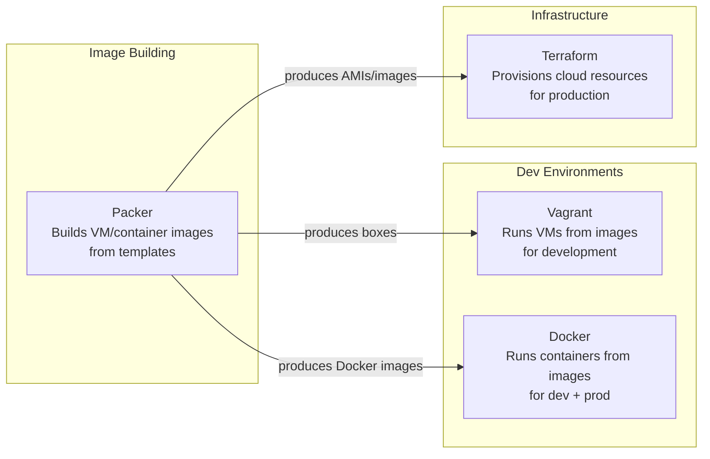

| Tool | Abstraction | Target | Kernel | Use Case |
|------|------------|--------|--------|----------|
| **Vagrant** | Virtual machines | Development environments | Separate guest kernel | Cross-platform dev, GUI apps, OS-level testing |
| **Docker** | Containers | Application packaging | Shared host kernel | Microservices, stateless apps, Linux-only workloads |
| **Terraform** | Cloud infrastructure | Production environments | Cloud-managed | AWS/GCP/Azure resource provisioning |
| **Packer** | Image building | Artifact creation | Build-time only | Creating base images for Vagrant, Docker, or cloud |

#### When to Use Vagrant vs Docker vs Bare Metal

- **Use Vagrant** when you need to test across different operating systems (Windows, macOS, Linux), when your application uses OS-specific APIs (native windowing, system services), or when you need full OS isolation (kernel-level testing, driver development). This is the utm-dev-v2 use case: Tauri apps require platform-specific build toolchains (MSVC on Windows, GCC + webkit2gtk on Linux, Xcode on macOS).

- **Use Docker** when your workload runs on Linux, does not need a GUI, and benefits from fast startup times. Docker containers boot in seconds; VMs take minutes. If you are building a REST API or a CLI tool that only targets Linux, Docker is the better choice.

- **Use bare metal** when you have dedicated hardware per platform, when VM overhead is unacceptable (real-time systems, GPU workloads), or when you are already on the target platform and do not need isolation.

utm-dev-v2 uses Vagrant because Tauri cross-compilation requires full OS environments — you cannot build a Windows `.msi` installer inside a Linux container.

---

### The Vagrant Object Model

The Vagrant object model consists of six core concepts: Boxes, Providers, Provisioners, Synced Folders, Networking, and Snapshots. Each concept maps to a distinct layer of the VM lifecycle.

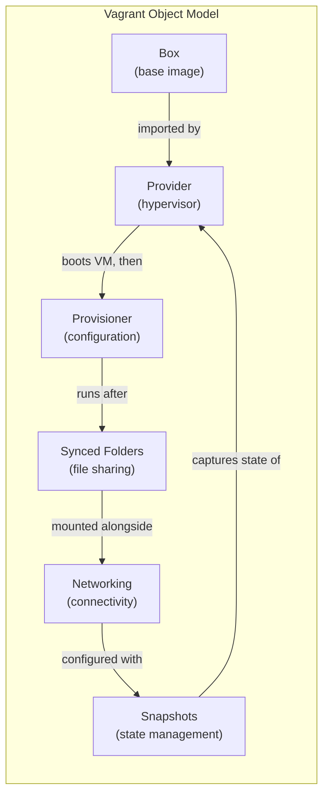

---

#### Boxes — The Base Image System

A **box** is a packaged virtual machine image. It is the starting point for every Vagrant VM. Think of it as a frozen snapshot of an installed operating system, ready to be cloned and booted.

##### What a Box IS

Physically, a `.box` file is a TAR archive containing three things:

1. **`metadata.json`** — declares which provider(s) the box supports
2. **`Vagrantfile`** — default configuration baked into the box (can be overridden)
3. **Provider-specific disk image** — the actual VM disk (`.vmdk`, `.qcow2`, `.vhdx`, etc.)

```
my-box.box (TAR archive)
├── metadata.json          # {"provider": "virtualbox"}
├── Vagrantfile            # Default box config (optional)
├── box.ovf                # VirtualBox: VM definition
└── box-disk001.vmdk       # VirtualBox: disk image
```

##### Box Lifecycle

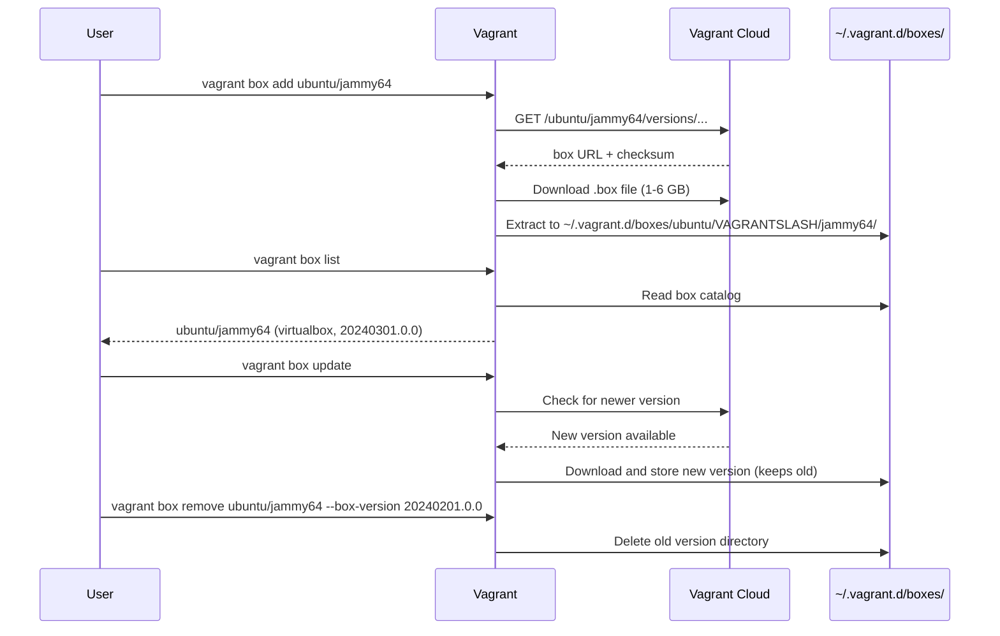

**Key commands:**

```bash
# Add a box from Vagrant Cloud
vagrant box add ubuntu/jammy64

# Add a box from a direct URL
vagrant box add my-windows https://example.com/windows11.box

# Add a box from a local file
vagrant box add my-custom ./path/to/custom.box

# List installed boxes
vagrant box list

# Check for updates
vagrant box outdated

# Update a specific box
vagrant box update --box ubuntu/jammy64

# Remove a box (specify version if multiple exist)
vagrant box remove ubuntu/jammy64 --box-version 20240201.0.0

# Prune old versions, keeping only the latest
vagrant box prune
```

##### Box Versioning

Vagrant Cloud supports semantic versioning for boxes. When a Vagrantfile specifies a box, it can include version constraints:

```ruby
Vagrant.configure("2") do |config|
  config.vm.box = "ubuntu/jammy64"
  config.vm.box_version = ">= 20240101.0.0, < 20250101.0.0"
  config.vm.box_check_update = true
end
```

Version constraints use the same syntax as RubyGems: `>=`, `<=`, `~>` (pessimistic), `!=`. When `vagrant up` runs, Vagrant resolves the constraint against installed versions and, if `box_check_update` is true, against Vagrant Cloud.

##### Box Discovery

Boxes can come from three sources:

| Source | Example | Use Case |
|--------|---------|----------|
| **Vagrant Cloud** | `ubuntu/jammy64` | Public, community-maintained boxes |
| **Direct URL** | `https://builds.example.com/win11.box` | Private/corporate boxes |
| **Local file** | `./builds/my-custom.box` | Development, testing custom boxes |

##### How Boxes Relate to utm-dev-v2

utm-dev-v2 uses specific boxes for each target platform:

- **Linux**: `ubuntu/jammy64` or `generic/ubuntu2404` — Ubuntu with standard dev tools
- **Windows**: `gusztavvargadr/windows-11` — Windows 11 with WinRM pre-configured
- **macOS**: Custom box or `nic-bench/macos-ventura` — limited by Apple licensing

Each box is the raw OS. The utm-dev-v2 provisioners then install mise, Rust, Node, and Tauri dependencies on top. The box provides the kernel and base system; provisioning provides the toolchain.

---

#### Providers — The Hypervisor Abstraction

A **provider** is a plugin that translates Vagrant's abstract VM operations into hypervisor-specific API calls. Vagrant core knows nothing about VirtualBox, libvirt, or Hyper-V directly — it delegates everything to the provider plugin.

##### Provider Architecture

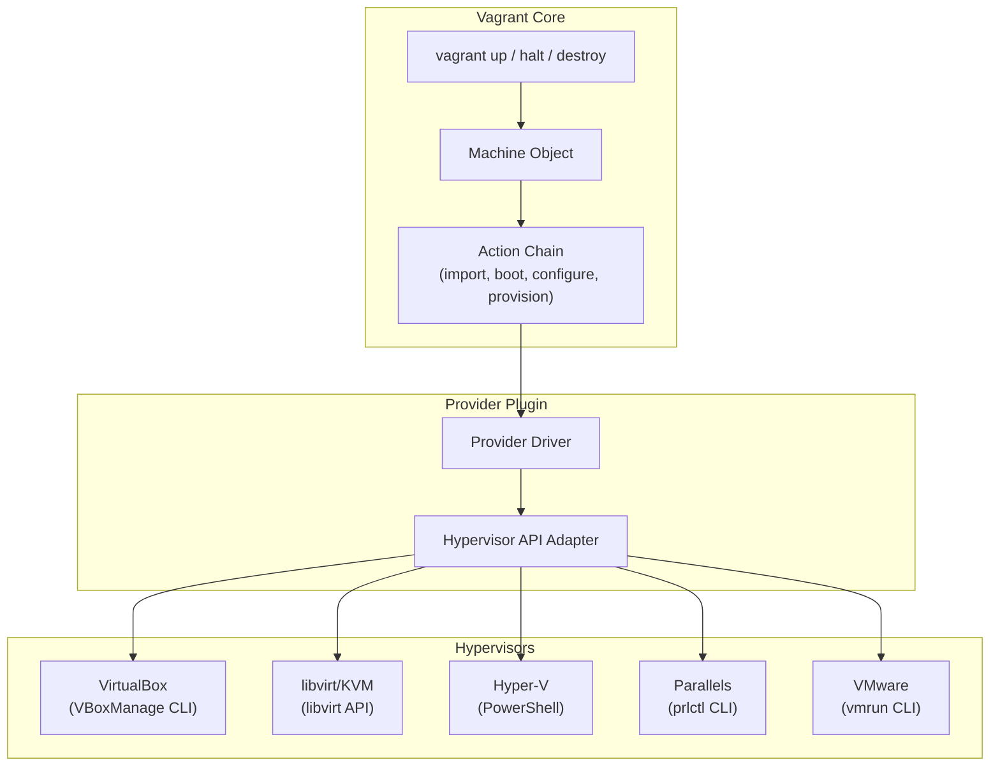

##### Provider Installation

VirtualBox is the default provider and ships with Vagrant support built-in. All other providers require plugin installation:

```bash
# VirtualBox — built-in, no plugin needed
# Just install VirtualBox: https://www.virtualbox.org/

# libvirt (Linux KVM)
vagrant plugin install vagrant-libvirt

# Parallels (macOS)
vagrant plugin install vagrant-parallels

# VMware (requires a license)
vagrant plugin install vagrant-vmware-desktop
```

##### Provider Selection

Vagrant selects the provider using this priority order:

1. `--provider` flag on the command line: `vagrant up --provider libvirt`
2. `VAGRANT_DEFAULT_PROVIDER` environment variable
3. Provider specified in the Vagrantfile: `config.vm.provider "libvirt"`
4. First available installed provider (VirtualBox wins by default)

```bash
# Explicit flag
vagrant up --provider libvirt

# Environment variable (set in mise.toml for utm-dev-v2)
export VAGRANT_DEFAULT_PROVIDER=libvirt
vagrant up

# In Vagrantfile (provider-specific config)
config.vm.provider "libvirt" do |lv|
  lv.memory = 8192
  lv.cpus = 4
end
```

##### Provider Capabilities Matrix

Not all providers support all features. This matrix shows what works where:

| Capability | VirtualBox | libvirt | Hyper-V | Parallels | VMware |
|-----------|-----------|---------|---------|-----------|--------|
| Linked clones | Yes | Yes | No | Yes | Yes |
| Snapshots | Yes | Yes | Yes (checkpoints) | Yes | Yes |
| Port forwarding | Yes | Yes (via iptables) | Limited | Yes | Yes |
| NFS synced folders | Yes | Yes | No | Yes | Yes |
| SMB synced folders | Yes | No | Yes | No | Yes |
| VirtIO drivers | No | Yes (native) | No | No | No |
| Nested virtualization | Yes (slow) | Yes (fast) | Yes | No | Yes |
| GUI mode | Yes | Yes (virt-manager) | Hyper-V Manager | Yes | Yes |
| Hot CPU/RAM resize | No | Yes | No | No | No |
| macOS host | Yes | No | No | Yes | Yes |
| Linux host | Yes | Yes | No | No | Yes |
| Windows host | Yes | No | Yes | No | Yes |

##### How Providers Relate to utm-dev-v2

utm-dev-v2's Vagrantfile auto-selects the provider based on the host operating system:

- **macOS host**: VirtualBox (free) or Parallels (paid, better performance)
- **Linux host**: libvirt/KVM (near-native performance, free)
- **Windows host**: Hyper-V (built-in, no extra software)

The Vagrantfile contains provider-specific configuration blocks for each, so the same file works on any host. See [utm-dev-v2-vagrant.md](./utm-dev-v2-vagrant.md) for the production Vagrantfile.

---

#### Provisioners — The Configuration Management Layer

A **provisioner** is code that runs inside the VM after boot to configure it. Provisioning transforms a bare OS image (the box) into a fully configured development environment.

##### What a Provisioner IS

Provisioners execute in the guest VM's context. They have full root/admin access inside the VM. Vagrant handles the transport (SSH for Linux/macOS, WinRM for Windows) and the execution. The developer writes the provisioning logic; Vagrant handles getting it into the VM and running it.

##### Types of Provisioners

| Type | Language | Use Case | utm-dev-v2 Usage |
|------|----------|----------|-----------------|
| **Shell (inline)** | Bash/PowerShell | Simple commands | Quick environment setup |
| **Shell (path)** | Bash/PowerShell | Script files | Main provisioning scripts |
| **File** | N/A | Copy files to VM | Config files, certificates |
| **Ansible** | YAML | Complex, idempotent config | Not used (mise replaces this) |
| **Puppet** | Puppet DSL | Enterprise config management | Not used |
| **Chef** | Ruby DSL | Enterprise config management | Not used |
| **Docker** | Dockerfile | Container inside VM | Not used |

utm-dev-v2 uses **shell provisioners** exclusively. The philosophy is: mise handles tool installation, so provisioners only need to install mise and its prerequisites. No configuration management tool is necessary.

##### Provisioner Ordering

Provisioners run in the order they are declared in the Vagrantfile:

```ruby
Vagrant.configure("2") do |config|
  # Runs first
  config.vm.provision "shell", name: "base-packages",
    inline: "apt-get update && apt-get install -y curl git build-essential"

  # Runs second
  config.vm.provision "shell", name: "install-mise",
    path: "scripts/install-mise.sh"

  # Runs third
  config.vm.provision "shell", name: "install-tools",
    path: "scripts/install-tools.sh",
    privileged: false  # Run as vagrant user, not root
end
```

##### When Provisioners Run

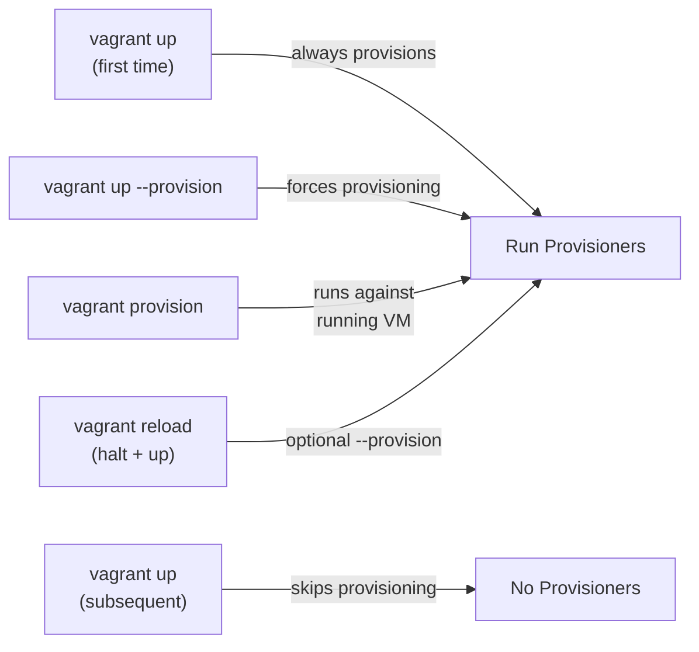

The critical distinction: `vagrant up` only provisions on the **first boot** of a new VM. Subsequent `vagrant up` calls (after `vagrant halt`) do NOT re-provision. To re-provision, you must explicitly use `vagrant provision` or `vagrant up --provision`.

##### Provisioner Execution Sequence

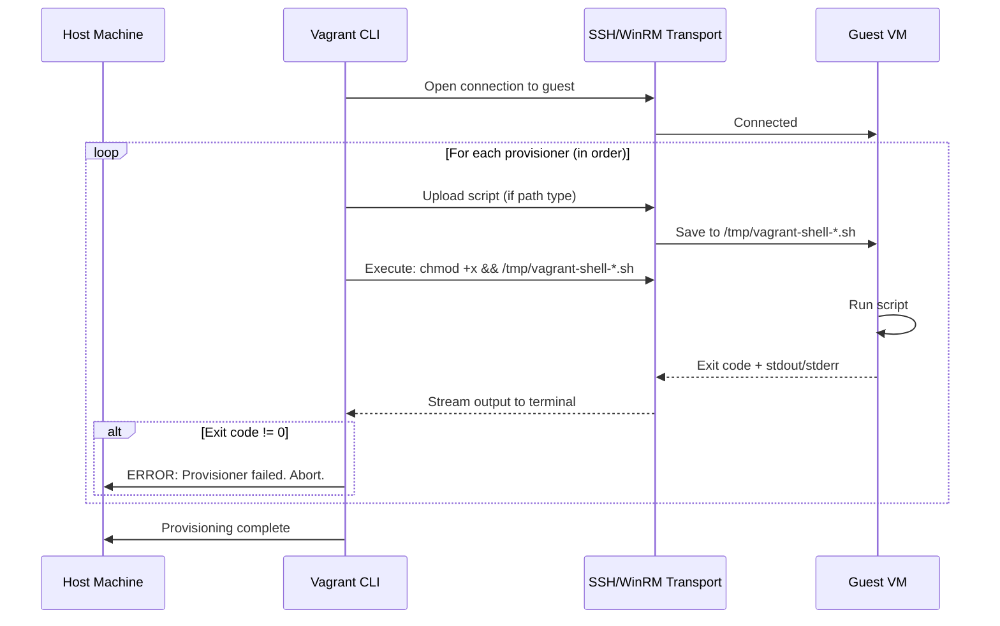

##### Idempotency

Provisioners must be safe to run multiple times. If a developer runs `vagrant provision` twice, the second run should not break anything. Strategies for idempotency:

```bash
# BAD: appends to .bashrc every time
echo 'export PATH=$HOME/.local/bin:$PATH' >> ~/.bashrc

# GOOD: check before appending
grep -qxF 'export PATH=$HOME/.local/bin:$PATH' ~/.bashrc || \
  echo 'export PATH=$HOME/.local/bin:$PATH' >> ~/.bashrc

# GOOD: use mise to manage tool versions (inherently idempotent)
mise install  # Only installs what's missing
```

##### How Provisioners Relate to utm-dev-v2

utm-dev-v2's provisioning strategy is minimal by design. Provisioners install exactly three things:

1. **Base system packages** (curl, git, build-essential / MSVC Build Tools)
2. **mise** (the single tool manager)
3. **mise trust + mise install** (which installs Rust, Node, pnpm, cargo-tauri, and all other tools from the project's `mise.toml`)

This means the Vagrantfile's provisioners are thin wrappers. The real "configuration management" is the `mise.toml` file, which is synced into the VM via shared folders and drives all tool installation.

---

#### Synced Folders — The File Sharing Layer

**Synced folders** map a directory on the host machine to a directory inside the guest VM. This allows you to edit code on the host with your preferred editor/IDE and immediately see the changes inside the VM.

##### Types of Synced Folders — Deep Comparison

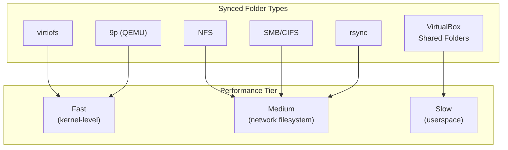

| Type | Read Perf | Write Perf | Watch/Notify | Host Requirements | Guest Requirements | Direction |
|------|-----------|------------|--------------|-------------------|--------------------|-----------|
| **VirtualBox SF** | Slow | Slow | Polling only | VirtualBox | Guest Additions | Bidirectional |
| **NFS** | Good | Good | Requires plugin | `nfsd` running | NFS client | Bidirectional |
| **SMB** | Good | Good | Yes (native) | SMB server | SMB client | Bidirectional |
| **rsync** | N/A (snapshot) | N/A | `rsync-auto` | rsync | rsync | Host → Guest only |
| **virtiofs** | Excellent | Excellent | Yes (native) | libvirt + virtiofsd | Linux kernel 5.4+ | Bidirectional |
| **9p** | Good | Good | Limited | QEMU | 9p kernel module | Bidirectional |

##### Detailed Type Breakdown

**VirtualBox Shared Folders** are the default when using VirtualBox. They work by intercepting filesystem calls in the guest through Guest Additions kernel modules and forwarding them to the host via a virtual PCI device. The overhead is significant — `npm install` or `cargo build` in a VirtualBox shared folder can be 5-10x slower than on native disk because every `stat()`, `read()`, and `write()` crosses the hypervisor boundary.

**NFS (Network File System)** exports a directory from the host and mounts it in the guest over the VM's network interface. Performance is much better than VirtualBox Shared Folders because NFS is a mature, optimized protocol. The downside: it requires `nfsd` running on the host and will prompt for the host's `sudo` password to modify `/etc/exports`. On macOS and Linux, NFS is the recommended type.

**SMB (Server Message Block)** is the Windows native network filesystem. When the guest is Windows, SMB is the natural choice. Vagrant can automatically start an SMB share of the host directory. SMB requires credentials (username/password) and may prompt for them on first use.

**rsync** takes a fundamentally different approach: it performs a one-time copy of the host directory into the guest. Changes on the host are NOT automatically reflected in the guest unless you run `vagrant rsync` or `vagrant rsync-auto` (which watches for changes and re-syncs). The advantage: rsync works with every provider and every guest OS, and the files in the guest are on native disk (maximum performance for builds). The disadvantage: it is one-directional (host → guest), and there is sync latency.

**virtiofs** is the newest and fastest option. It uses the VIRTIO framework to share filesystems at near-native speed through a shared memory region. It requires the libvirt provider and a Linux guest with kernel 5.4+. For Linux-on-Linux development, this is the optimal choice.

**9p** is QEMU's native filesystem sharing protocol. It is built into the QEMU hypervisor and requires no additional host services. Performance is good but not as optimized as virtiofs.

##### Configuration Examples

```ruby
Vagrant.configure("2") do |config|
  # Default: current directory → /vagrant
  # (Uses provider default type — VirtualBox SF for VirtualBox)

  # NFS (Linux/macOS hosts)
  config.vm.synced_folder ".", "/vagrant",
    type: "nfs",
    nfs_udp: false,       # TCP is more reliable
    nfs_version: 4        # NFSv4 is faster

  # SMB (Windows guests)
  config.vm.synced_folder ".", "/vagrant",
    type: "smb",
    smb_username: ENV["SMB_USER"],
    smb_password: ENV["SMB_PASS"]

  # rsync (universal fallback)
  config.vm.synced_folder ".", "/vagrant",
    type: "rsync",
    rsync__auto: true,     # Watch for changes
    rsync__exclude: [".git/", "node_modules/", "target/"]

  # virtiofs (libvirt only, fastest)
  config.vm.synced_folder ".", "/vagrant",
    type: "virtiofs"

  # Disable default /vagrant mount entirely
  config.vm.synced_folder ".", "/vagrant", disabled: true
end
```

##### Gotchas

> **Note:** File permission mismatches between host and guest are the most common synced folder issue. NFS maps UIDs/GIDs, so if your host user is UID 1000 but the guest's `vagrant` user is UID 900, files will appear owned by the wrong user. Use `mount_options: ["uid=1000", "gid=1000"]` or `map_uid`/`map_gid` to fix.

> **Note:** Symlinks may not work across synced folders depending on the type. VirtualBox Shared Folders do not support symlinks by default. NFS supports them but the target must also be within the shared directory. This matters for `node_modules/.bin` which uses symlinks heavily.

> **Note:** File-watching tools (webpack, vite, `cargo watch`) rely on inotify (Linux) or FSEvents (macOS) to detect changes. These kernel-level notification systems do not work across synced folders in most cases. VirtualBox Shared Folders use polling (slow). NFS has no notification mechanism. Only virtiofs and native shared folders support inotify passthrough. For other types, configure your watcher to use polling mode (e.g., `CHOKIDAR_USEPOLLING=1` for webpack).

##### How Synced Folders Relate to utm-dev-v2

utm-dev-v2 mounts the project root at `/vagrant` inside each VM. The synced folder type is auto-selected based on the provider:

- **libvirt on Linux**: virtiofs (fastest)
- **VirtualBox on macOS**: NFS (good performance, avoids VirtualBox SF overhead)
- **Hyper-V on Windows**: SMB (native Windows sharing)

Build outputs (compiled binaries, `.msi`/`.deb`/`.dmg` installers) are written to `/vagrant/dist/<platform>/`, which appears on the host at `./dist/<platform>/` thanks to the synced folder.

---

#### Networking — The Connectivity Model

Vagrant provides three types of network interfaces for VMs. Each serves a different purpose and has different security implications.

##### Network Types

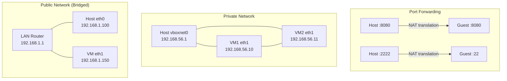

**Port Forwarding** maps a port on the host to a port inside the guest. The VM is behind NAT and cannot be reached directly. Only the explicitly forwarded ports are accessible. This is the default and most secure option.

```ruby
config.vm.network "forwarded_port", guest: 1420, host: 1420  # Tauri dev server
config.vm.network "forwarded_port", guest: 3000, host: 3000  # Vite HMR
config.vm.network "forwarded_port",
  guest: 8080,
  host: 8080,
  auto_correct: true  # If 8080 is taken, pick another port
```

**Private Network** creates a host-only network. The host and all VMs on the network can communicate with each other, but the VMs are not accessible from the external LAN. This is ideal for multi-VM setups where VMs need to talk to each other.

```ruby
config.vm.network "private_network", ip: "192.168.56.10"
# Or use DHCP:
config.vm.network "private_network", type: "dhcp"
```

**Public Network (Bridged)** bridges the VM's network interface to the host's physical network adapter. The VM gets its own IP address on the LAN, as if it were a separate physical machine. This has security implications — the VM is exposed to the entire network.

```ruby
config.vm.network "public_network", bridge: "en0: Wi-Fi"
```

> **Note:** Public networks expose the VM to the entire LAN. Only use this when you need to test network services that must be reachable from other machines on the network. For development, private networks are preferred.

##### How Networking Relates to utm-dev-v2

utm-dev-v2 uses a combination of private networking and port forwarding:

- **Private network** (`192.168.56.0/24`) for inter-VM communication. The Linux VM can reach the Windows VM and vice versa, which enables cross-platform integration testing.
- **Port forwarding** for development server access. The Tauri dev server running inside a VM on port 1420 is forwarded to the same port on the host, so you can open `http://localhost:1420` in your host browser.
- Port collisions are handled with `auto_correct: true` so multiple VMs can forward the same guest port to different host ports.

---

#### Snapshots — The State Management System

A **snapshot** captures the complete state of a VM at a specific point in time: disk contents, memory state, CPU registers — everything. Restoring a snapshot returns the VM to that exact state.

##### Snapshot Commands

```bash
# Save a named snapshot
vagrant snapshot save my-snapshot

# List all snapshots
vagrant snapshot list

# Restore to a named snapshot
vagrant snapshot restore my-snapshot

# Delete a snapshot
vagrant snapshot delete my-snapshot

# Push/pop stack (unnamed, LIFO)
vagrant snapshot push    # Save current state to stack
vagrant snapshot pop     # Restore most recent push (and delete it)
```

##### Snapshot Models

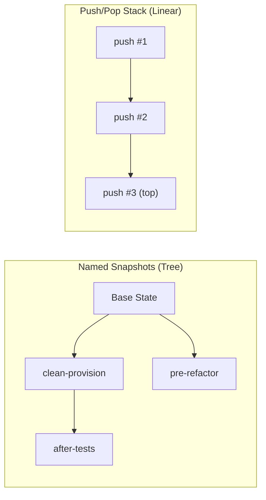

**Named snapshots** form a tree. You can save multiple snapshots from the same state and restore to any of them at any time. The snapshot is not deleted when restored.

**Push/pop** is a convenience stack. `vagrant snapshot push` saves the current state, and `vagrant snapshot pop` restores the most recent push AND deletes it. This is useful for quick "let me try something" workflows.

##### Performance Implications

Snapshot performance varies by provider:

- **VirtualBox**: Copy-on-Write (CoW). Snapshots are fast to create (only metadata), but disk writes after the snapshot are slower because VirtualBox must preserve the original blocks.
- **libvirt**: qcow2 internal snapshots. Very fast creation, minimal overhead.
- **Hyper-V**: Checkpoints. Can be slow for VMs with large memory allocations.

##### How Snapshots Relate to utm-dev-v2

utm-dev-v2 uses snapshots for three key workflows:

1. **Clean-provision baseline**: After initial provisioning completes, a `clean-provision` snapshot is saved. If tools get corrupted or you want to start fresh, restore to this snapshot instead of destroying and recreating the VM (saves 20+ minutes).

2. **Pre-test checkpoints**: Before running destructive tests (e.g., testing uninstallation), save a snapshot. Restore after the test to avoid re-provisioning.

3. **Rollback during development**: Before a risky refactor, `vagrant snapshot push`. If the refactor breaks the build environment, `vagrant snapshot pop` to undo everything.

---

### The Vagrant Lifecycle — Detailed Walkthrough

Every Vagrant workflow follows the same lifecycle. Understanding each command's behavior is essential for productive use.

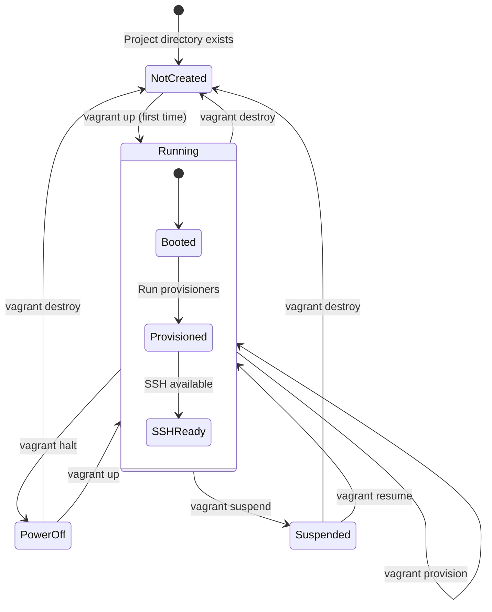

#### Command Reference

| Command | From State | To State | What Happens |
|---------|-----------|----------|-------------|
| `vagrant init` | N/A | N/A | Creates a `Vagrantfile` template in the current directory |
| `vagrant up` | NotCreated | Running | Import box, create VM, boot, provision |
| `vagrant up` | PowerOff | Running | Boot existing VM (no provisioning) |
| `vagrant up` | Suspended | Running | Resume from saved state |
| `vagrant halt` | Running | PowerOff | Graceful shutdown (ACPI) |
| `vagrant halt -f` | Running | PowerOff | Force power off |
| `vagrant suspend` | Running | Suspended | Save VM state to disk (hibernation) |
| `vagrant resume` | Suspended | Running | Restore VM from saved state |
| `vagrant destroy` | Any | NotCreated | Delete VM and all disks |
| `vagrant destroy -f` | Any | NotCreated | Delete without confirmation |
| `vagrant reload` | Running | Running | `halt` + `up` (re-reads Vagrantfile) |
| `vagrant provision` | Running | Running | Re-run provisioners |
| `vagrant ssh` | Running | Running | Open SSH session to VM |
| `vagrant status` | Any | Any | Show current VM state |
| `vagrant global-status` | N/A | N/A | Show ALL Vagrant VMs on this host |

#### The Full `vagrant up` Sequence (First Time)

This is the most important command to understand. Here is exactly what happens when you run `vagrant up` on a newly created Vagrantfile:

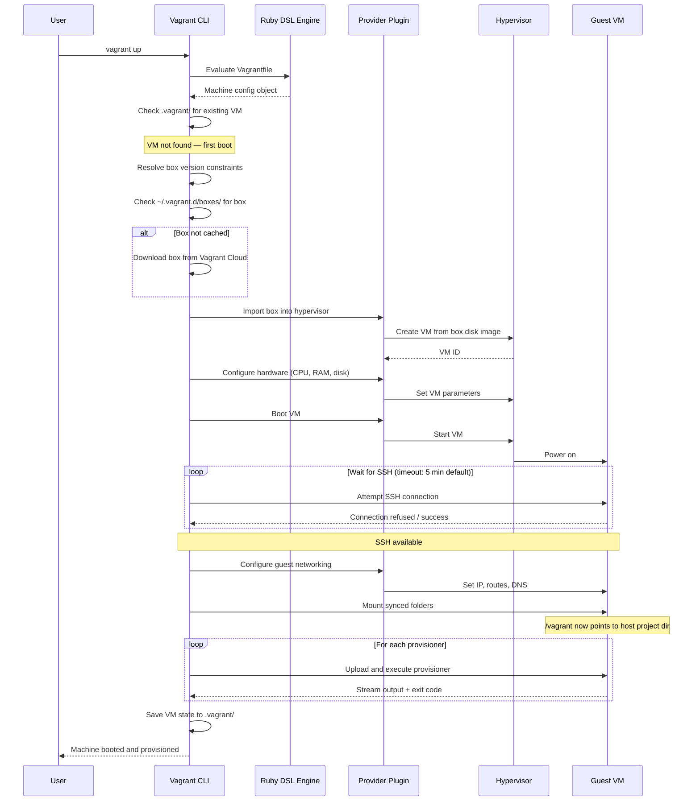

**Step-by-step:**

1. **Read Vagrantfile**: Vagrant evaluates the Vagrantfile as Ruby code. This is a full Ruby execution — variables, loops, method calls, and `require` statements all execute. The result is a machine configuration object.

2. **Check for existing VM**: Vagrant looks in `.vagrant/machines/<name>/<provider>/id` for a hypervisor VM ID. If found, the VM already exists and Vagrant just boots it. If not found, this is a new VM.

3. **Resolve box**: Vagrant matches the `config.vm.box` and `config.vm.box_version` against installed boxes in `~/.vagrant.d/boxes/`. If the box is not installed, Vagrant downloads it from Vagrant Cloud or the specified URL.

4. **Import box**: The provider creates a new VM from the box image. For VirtualBox, this means importing the `.ovf` and `.vmdk` files. For libvirt, it copies the `qcow2` image. The box itself is not modified — each VM gets its own copy (or linked clone, if supported).

5. **Configure hardware**: Provider-specific settings (CPU count, memory size, disk size, video memory, etc.) are applied to the VM.

6. **Boot**: The hypervisor starts the VM. The guest OS begins its boot sequence.

7. **Wait for SSH**: Vagrant repeatedly attempts to open an SSH connection to the guest. The default timeout is 5 minutes. For Windows guests using WinRM, the timeout is often longer because Windows Update can run during first boot.

8. **Configure networking**: Vagrant configures network interfaces, IP addresses, and port forwarding rules.

9. **Mount synced folders**: Vagrant mounts the host project directory inside the guest VM. The type (NFS, SMB, VirtualBox SF, etc.) determines how this mount is created.

10. **Run provisioners**: Each provisioner declared in the Vagrantfile runs in order. Shell scripts are uploaded via SCP and executed. If any provisioner exits with a non-zero code, provisioning stops and Vagrant reports the error.

11. **Save state**: Vagrant writes the VM's provider ID and metadata to `.vagrant/machines/<name>/<provider>/`.

---

### The Vagrantfile — Ruby DSL Deep Dive

The Vagrantfile is just Ruby. Understanding this is crucial because it means you can use the full power of the Ruby language to generate dynamic VM configurations.

#### Basic Structure

```ruby
# Vagrant API version — always "2" for modern Vagrant
Vagrant.configure("2") do |config|
  # Global settings apply to all machines
  config.vm.box = "ubuntu/jammy64"

  # Machine-specific settings
  config.vm.define "linux" do |linux|
    linux.vm.hostname = "utm-linux"
    linux.vm.network "private_network", ip: "192.168.56.10"
  end

  config.vm.define "windows" do |windows|
    windows.vm.box = "gusztavvargadr/windows-11"
    windows.vm.hostname = "utm-windows"
    windows.vm.network "private_network", ip: "192.168.56.11"
    windows.vm.communicator = "winrm"
  end
end
```

#### Ruby Power Features

Since it is Ruby, you can use variables, conditionals, loops, external data files, and even HTTP requests:

```ruby
# Load configuration from YAML
require "yaml"
local_config = YAML.load_file("vagrant.local.yml") rescue {}

# Constants for default values
DEFAULTS = {
  "cpus"    => 4,
  "memory"  => 8192,
  "disk"    => "100GB"
}.freeze

# Merge defaults with local overrides
cpus   = local_config.fetch("cpus", DEFAULTS["cpus"])
memory = local_config.fetch("memory", DEFAULTS["memory"])

# Define machines from an array
MACHINES = [
  { name: "linux",   box: "ubuntu/jammy64",              ip: "192.168.56.10" },
  { name: "windows", box: "gusztavvargadr/windows-11",   ip: "192.168.56.11" }
]

Vagrant.configure("2") do |config|
  MACHINES.each do |machine|
    config.vm.define machine[:name] do |m|
      m.vm.box = machine[:box]
      m.vm.network "private_network", ip: machine[:ip]

      # Provider-specific config
      m.vm.provider "virtualbox" do |vb|
        vb.memory = memory
        vb.cpus = cpus
      end

      m.vm.provider "libvirt" do |lv|
        lv.memory = memory
        lv.cpus = cpus
      end
    end
  end
end
```

#### Multi-Machine Definitions

When a Vagrantfile contains multiple `config.vm.define` blocks, each block creates a separate VM. Commands can target individual machines by name:

```bash
# Boot only the Linux VM
vagrant up linux

# SSH into the Windows VM
vagrant ssh windows

# Provision all VMs
vagrant provision

# Destroy a specific VM
vagrant destroy linux -f

# Status of all VMs
vagrant status
```

If no machine name is specified, the command applies to ALL defined machines.

#### Provider Overrides

Provider blocks contain hypervisor-specific settings. They are only evaluated when that provider is active:

```ruby
config.vm.provider "virtualbox" do |vb|
  vb.gui = false                    # Headless mode
  vb.memory = 8192
  vb.cpus = 4
  vb.linked_clone = true            # Faster cloning
  vb.customize ["modifyvm", :id,
    "--vram", "64",                 # Video memory
    "--clipboard", "bidirectional", # Clipboard sharing
    "--audio", "none"               # Disable audio (saves resources)
  ]
end

config.vm.provider "libvirt" do |lv|
  lv.memory = 8192
  lv.cpus = 4
  lv.driver = "kvm"                # Use KVM acceleration
  lv.nested = true                 # Allow nested virtualization
  lv.disk_driver :cache => "writeback"  # Better disk performance
  lv.channel :type  => "unix",
             :target_name => "org.qemu.guest_agent.0",
             :target_type => "virtio"  # QEMU guest agent
end
```

#### How the utm-dev-v2 Vagrantfile Uses Ruby

The production Vagrantfile in utm-dev-v2 (documented in [utm-dev-v2-vagrant.md](./utm-dev-v2-vagrant.md)) uses several Ruby patterns:

- **Helper methods** for provider detection: a method that checks the host OS and returns the appropriate provider name
- **YAML local overrides**: loads `vagrant.local.yml` (gitignored) for per-developer resource tuning
- **Constant hashes**: machine definitions stored as frozen hash constants for easy modification
- **Conditional provisioners**: different provisioning scripts for Linux vs Windows guests
- **Environment variable passthrough**: `ENV["VAGRANT_DEFAULT_PROVIDER"]` integration with mise

---

## Part 2: Vagrant Internal Architecture

### State Management (`.vagrant/` Directory)

Every Vagrant project has a `.vagrant/` directory at the same level as the `Vagrantfile`. This directory contains the runtime state of all VMs managed by that project.

#### Directory Structure

```
.vagrant/
├── machines/
│   ├── linux/
│   │   └── virtualbox/
│   │       ├── id                    # VirtualBox VM UUID
│   │       ├── index_uuid            # Global index reference
│   │       ├── action_provision      # Timestamp of last provision
│   │       ├── action_set            # Current action state
│   │       ├── synced_folders        # Synced folder metadata
│   │       ├── creator_uid           # UID that created the VM
│   │       └── private_key           # Per-machine SSH key
│   └── windows/
│       └── virtualbox/
│           ├── id
│           ├── index_uuid
│           └── ...
├── bundler/
│   └── global.gem            # Plugin isolation data
└── rgloader/
    └── loader.rb             # Plugin loader
```

#### Key Files

**`id`**: Contains the hypervisor-specific VM identifier. For VirtualBox, this is a UUID like `a1b2c3d4-e5f6-7890-abcd-ef1234567890`. Vagrant uses this to find the VM when you run commands. If this file is deleted or the hypervisor VM is deleted outside of Vagrant, the state becomes orphaned.

**`private_key`**: During the first `vagrant up`, Vagrant replaces the insecure default key (shared by all Vagrant boxes) with a randomly generated per-machine SSH key. This key is stored here and used for all subsequent SSH connections.

**`action_provision`**: A timestamp file that records when provisioning last ran. Vagrant uses this to determine whether to skip provisioning on subsequent `vagrant up` calls.

**`synced_folders`**: JSON file recording synced folder configuration and state.

#### Why `.vagrant/` Is Gitignored

The `.vagrant/` directory contains machine-specific state: VM UUIDs, SSH keys, and provider metadata. These are tied to a specific developer's hypervisor instance. Committing them to git would break Vagrant for every other developer. Always add `.vagrant/` to `.gitignore`:

```gitignore
# Vagrant
.vagrant/
*.box
vagrant.local.yml
```

#### Global State

Vagrant also maintains a global machine index at:

```
~/.vagrant.d/data/machine-index/index
```

This JSON file maps every Vagrant VM on the machine to its project directory. It powers `vagrant global-status`:

```bash
$ vagrant global-status
id       name    provider   state    directory
-------------------------------------------------------------------
a1b2c3d  linux   virtualbox running  /home/user/projects/utm-dev
d4e5f6g  windows virtualbox poweroff /home/user/projects/utm-dev
```

> **Note:** The global index can become stale if VMs are deleted outside of Vagrant. Use `vagrant global-status --prune` to clean up orphaned entries.

---

### Plugin System

Vagrant's functionality is almost entirely implemented through plugins. Even the built-in VirtualBox provider is architecturally a plugin — it just ships with Vagrant core.

#### Plugin Types

| Plugin Type | Purpose | Example |
|------------|---------|---------|
| **Provider** | Hypervisor adapter | vagrant-libvirt, vagrant-parallels |
| **Provisioner** | Configuration management | vagrant-ansible-local |
| **Command** | New CLI commands | vagrant-hostmanager |
| **Host** | Host OS detection/capabilities | (built-in: linux, darwin, windows) |
| **Guest** | Guest OS detection/capabilities | (built-in: linux, windows, bsd) |
| **Capability** | OS-specific operations | (NFS export, hostname change, etc.) |
| **Synced Folder** | Folder sharing mechanism | (built-in: NFS, rsync, etc.) |

#### Plugin Installation and Management

```bash
# Install a plugin
vagrant plugin install vagrant-libvirt

# Install a specific version
vagrant plugin install vagrant-libvirt --plugin-version 0.12.2

# List installed plugins
vagrant plugin list

# Update a plugin
vagrant plugin update vagrant-libvirt

# Remove a plugin
vagrant plugin uninstall vagrant-libvirt

# Repair plugin environment (after Vagrant upgrade)
vagrant plugin repair

# Expunge all plugins and reinstall
vagrant plugin expunge --reinstall
```

#### Plugin Isolation

Vagrant uses its own embedded Ruby installation, separate from any system Ruby. Plugins are installed into `~/.vagrant.d/gems/` using Vagrant's bundled Bundler. This isolation prevents conflicts between Vagrant plugins and system Ruby gems.

```
~/.vagrant.d/
├── boxes/                  # Downloaded boxes
├── data/                   # Global state
├── gems/                   # Plugin gems (isolated Ruby environment)
│   └── 3.1.4/             # Ruby version
│       └── gems/
│           ├── vagrant-libvirt-0.12.2/
│           └── vagrant-hostmanager-1.8.9/
├── insecure_private_key    # Default SSH key (replaced per-machine)
├── tmp/                    # Temporary files
└── Vagrantfile             # Global Vagrantfile (applies to ALL projects)
```

#### Key Plugins for utm-dev-v2

| Plugin | Purpose in utm-dev-v2 |
|--------|----------------------|
| **vagrant-libvirt** | KVM provider for Linux hosts |
| **vagrant-hostmanager** | Auto-manages `/etc/hosts` entries for VM hostnames |
| **vagrant-vbguest** | Auto-installs VirtualBox Guest Additions |
| **vagrant-disksize** | Allows resizing VM disks beyond box default |

Installation for utm-dev-v2:

```bash
vagrant plugin install vagrant-libvirt vagrant-hostmanager vagrant-vbguest vagrant-disksize
```

---

### Box Format Internals

Understanding the box format is useful for debugging and for building custom boxes for the team.

#### TAR Archive Structure

A `.box` file is a TAR archive (optionally gzip-compressed) containing:

```bash
# Examine a box file
tar tf ubuntu-jammy64.box
# Output:
# metadata.json
# Vagrantfile
# box.ovf
# box-disk001.vmdk
```

#### metadata.json

The metadata file declares which provider the box supports:

```json
{
  "provider": "virtualbox"
}
```

For multi-provider boxes (rare), the metadata can declare multiple providers, each with its own directory structure inside the TAR.

#### Provider-Specific Artifacts

**VirtualBox boxes contain:**
- `box.ovf` — Open Virtualization Format descriptor (XML defining hardware: CPU, RAM, disk controllers, network adapters)
- `box-disk001.vmdk` — Virtual Machine Disk in VMDK format (the actual OS disk)

**libvirt boxes contain:**
- `box.img` — QCOW2 disk image (copy-on-write, supports snapshots)
- `metadata.json` — must specify `{"provider": "libvirt"}`

**Hyper-V boxes contain:**
- `Virtual Machines/` — VM configuration files
- `Virtual Hard Disks/` — `.vhdx` disk files

#### How `vagrant box repackage` Works

If you have modified a running VM and want to export it as a new box:

```bash
# From a running VM
vagrant package --output my-custom-box.box

# For a specific machine in multi-machine setup
vagrant package linux --output my-linux-box.box

# Repackage an existing installed box
vagrant box repackage ubuntu/jammy64 virtualbox 20240301.0.0
```

The `package` command stops the VM, exports its current disk state, wraps it in a TAR with appropriate metadata, and produces a `.box` file.

#### Building Custom Boxes with Packer

For utm-dev-v2, custom boxes with pre-installed mise and Rust can be built with HashiCorp Packer. The workflow:

1. Packer starts from an ISO or cloud image
2. Packer boots a temporary VM, runs provisioning scripts (same scripts as Vagrant provisioners)
3. Packer exports the VM as a `.box` file
4. The box is uploaded to Vagrant Cloud or a private repository
5. The Vagrantfile references this custom box

This is an optimization: instead of spending 20 minutes provisioning from a bare Ubuntu box, you spend 2 minutes booting a pre-provisioned box. The trade-off is maintaining the Packer build pipeline.

---

### SSH and WinRM Communication

Vagrant communicates with guest VMs through SSH (Linux, macOS) or WinRM (Windows). Understanding the transport layer is important for debugging connectivity issues.

#### SSH Discovery

When you run `vagrant ssh`, Vagrant does not use your system's SSH configuration. It constructs its own connection parameters:

```bash
# View the exact SSH config Vagrant uses
vagrant ssh-config

# Output:
# Host linux
#   HostName 127.0.0.1
#   User vagrant
#   Port 2222
#   UserKnownHostsFile /dev/null
#   StrictHostKeyChecking no
#   PasswordAuthentication no
#   IdentityFile /path/to/project/.vagrant/machines/linux/virtualbox/private_key
#   IdentitiesOnly yes
```

You can use this output to SSH into the VM with your regular `ssh` command:

```bash
# Use vagrant ssh-config with regular ssh
vagrant ssh-config > /tmp/vagrant-ssh-config
ssh -F /tmp/vagrant-ssh-config linux

# Or pipe directly
ssh -F <(vagrant ssh-config) linux
```

#### Key Exchange

Every Vagrant box ships with a publicly known "insecure" private key. On the first `vagrant up`, Vagrant:

1. Connects to the VM using the insecure key
2. Generates a new random RSA key pair
3. Installs the public key in the guest's `~/.ssh/authorized_keys`
4. Removes the insecure key from the guest
5. Saves the new private key to `.vagrant/machines/<name>/<provider>/private_key`

All subsequent connections use this per-machine key. This means each developer's VM has a unique SSH key, and the insecure default key cannot be used after first boot.

#### WinRM for Windows

Windows VMs use WinRM (Windows Remote Management) instead of SSH by default. WinRM is Microsoft's implementation of the WS-Management protocol for remote administration.

```ruby
config.vm.define "windows" do |w|
  w.vm.communicator = "winrm"
  w.winrm.username = "vagrant"
  w.winrm.password = "vagrant"
  w.winrm.transport = :negotiate  # NTLM/Kerberos
  w.winrm.timeout = 1800          # 30 minutes (Windows is slow to boot)
  w.winrm.retry_limit = 30
end
```

**Why not SSH on Windows?** While modern Windows includes OpenSSH, WinRM is more reliable for Vagrant's use case because:
- WinRM is available from early in the Windows boot process (before user login)
- WinRM supports elevated (admin) command execution natively
- WinRM handles PowerShell commands with proper encoding
- Many Vagrant boxes for Windows are pre-configured with WinRM, not SSH

**WinRM transport modes:**

| Transport | Security | Requirements |
|-----------|----------|-------------|
| `plaintext` | None (HTTP) | Only for local/testing |
| `negotiate` | NTLM/Kerberos | Default, works out of the box |
| `ssl` | TLS encrypted | Requires certificate setup |

**Elevated commands**: Some provisioning steps on Windows require administrator privileges. WinRM supports this through `privileged: true`:

```ruby
config.vm.provision "shell",
  inline: "choco install -y rust",
  privileged: true  # Runs as Administrator via elevated WinRM session
```

---

## Part 3: Full Integration Guide — Zero to utm-dev-v2

This section is a narrative walkthrough. Follow it from a blank machine to a fully operational cross-platform development setup.

### Step 0: Prerequisites Assessment

Before you begin, you need to verify your machine can run utm-dev-v2's multi-VM setup.

#### Check Your Host OS and Available Hypervisor

```bash
# macOS: Check if VirtualBox is installed
VBoxManage --version
# Or check for Parallels
prlctl --version

# Linux: Check for KVM support
lscpu | grep Virtualization   # Should show VT-x or AMD-V
ls /dev/kvm                    # Should exist
virsh version                  # Should return libvirt version

# Windows (PowerShell): Check for Hyper-V
Get-WindowsOptionalFeature -Online -FeatureName Microsoft-Hyper-V
```

#### Verify Hardware Requirements

| Resource | Minimum | Recommended | Why |
|----------|---------|-------------|-----|
| RAM | 16 GB | 32 GB | Two VMs at 8 GB each + host overhead |
| CPU | 4 cores | 8+ cores | Two VMs at 2-4 vCPUs each |
| Disk | 100 GB free | 200 GB free | Boxes (~6 GB each) + VM disks + build artifacts |
| CPU features | VT-x / AMD-V | + nested virt | Required for hardware virtualization |

```bash
# Check RAM (Linux/macOS)
free -h                  # Linux
sysctl -n hw.memsize     # macOS (returns bytes)

# Check disk space
df -h .

# Check CPU cores
nproc                    # Linux
sysctl -n hw.ncpu        # macOS
```

#### Provider Decision Tree

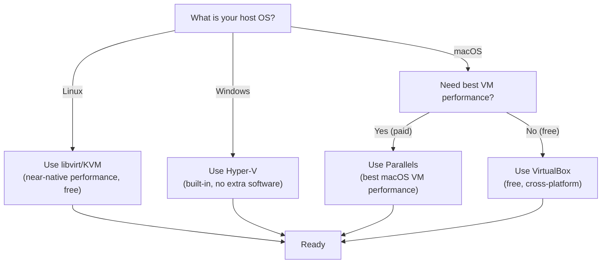

---

### Step 1: Install Foundation

Everything in utm-dev-v2 flows through mise. Install it first, then use it to install everything else.

#### Install mise

```bash
# Linux/macOS (recommended method)
curl https://mise.run | sh

# Or via Homebrew
brew install mise

# Activate in your shell (add to ~/.bashrc, ~/.zshrc, etc.)
echo 'eval "$(mise activate bash)"' >> ~/.bashrc
source ~/.bashrc

# Verify
mise --version
```

#### Configure mise Global Tools

```bash
# Install Vagrant via mise
mise use -g vagrant@2.4

# Verify Vagrant
vagrant --version
```

> **Note:** Installing Vagrant via mise ensures every team member uses the same Vagrant version. This prevents "works with Vagrant 2.3 but not 2.4" issues.

#### Install the Hypervisor Provider

**macOS (VirtualBox):**

```bash
# Download from virtualbox.org or use Homebrew
brew install --cask virtualbox
```

**Linux (libvirt):**

```bash
# Ubuntu/Debian
sudo apt-get install -y qemu-kvm libvirt-daemon-system libvirt-clients \
  bridge-utils virt-manager vagrant-libvirt

# Fedora
sudo dnf install -y @virtualization vagrant-libvirt

# Add your user to the libvirt group
sudo usermod -aG libvirt $(whoami)
newgrp libvirt
```

**Windows (Hyper-V):**

```powershell
# Enable Hyper-V (requires reboot)
Enable-WindowsOptionalFeature -Online -FeatureName Microsoft-Hyper-V -All
```

#### Install Vagrant Plugins

```bash
# Essential plugins for utm-dev-v2
vagrant plugin install vagrant-hostmanager
vagrant plugin install vagrant-vbguest       # VirtualBox only
vagrant plugin install vagrant-disksize

# Linux only
vagrant plugin install vagrant-libvirt

# Verify
vagrant plugin list
```

---

### Step 2: Scaffold Project

#### Run the Init Task

```bash
# Clone or create your Tauri project, then:
mise run init
```

This command creates the project scaffold. The key files it generates:

#### `mise.toml` — Line by Line

```toml
[tools]
# Core development tools — pinned versions for reproducibility
rust = "1.78"
node = "20"
pnpm = "9"

# utm-dev-v2 remote tasks — fetched from git
[tasks.include]
# This pulls Vagrant task definitions from the utm-dev repo
source = "git::https://github.com/joeblew999/utm-dev.git//tasks"

[env]
# Vagrant provider auto-detection (set in mise env based on OS)
VAGRANT_DEFAULT_PROVIDER = "{{ if eq .OS \"linux\" }}libvirt{{ else if eq .OS \"darwin\" }}virtualbox{{ else }}hyperv{{ end }}"

# Project-level configuration
UTM_DEV_PROJECT = "my-tauri-app"
```

#### `.utm-dev.toml` — Line by Line

```toml
[project]
name = "my-tauri-app"
platforms = ["linux", "windows"]   # Which VMs to manage

[vagrant]
box_linux = "ubuntu/jammy64"
box_windows = "gusztavvargadr/windows-11"

[resources]
cpus = 4
memory = 8192        # MB
disk = "100GB"

[network]
subnet = "192.168.56"
linux_ip = "192.168.56.10"
windows_ip = "192.168.56.11"

[sync]
type_linux = "nfs"        # NFS for Linux guests (macOS/Linux hosts)
type_windows = "smb"      # SMB for Windows guests
exclude = [".git", "node_modules", "target"]
```

#### How `git::` Remote Includes Fetch Vagrant Tasks

When `mise.toml` references `git::https://github.com/joeblew999/utm-dev.git//tasks`, mise:

1. Clones the repository to a local cache (`~/.local/share/mise/`)
2. Copies the task definitions from the `/tasks` directory
3. Makes them available as `mise run vagrant:up`, `mise run vagrant:halt`, etc.

This means you get the latest utm-dev-v2 task definitions without vendoring them in your project. Updates happen when mise refreshes its cache.

---

### Step 3: Understand the Task Graph

#### View Available Tasks

```bash
# List all tasks
mise tasks

# Output:
# vagrant:up        Start VMs
# vagrant:halt      Stop VMs
# vagrant:destroy   Delete VMs
# vagrant:ssh       SSH into a VM
# vagrant:provision Re-run provisioners
# vagrant:snapshot  Manage snapshots
# vagrant:status    Show VM status
# vagrant:check     Verify prerequisites
# test:linux        Run tests in Linux VM
# test:windows      Run tests in Windows VM
# test:all          Run all platform tests
# build:cross       Cross-platform build
# build:sign        Sign release artifacts
```

#### Visualize Dependencies

```bash
# See what vagrant:up depends on
mise tasks deps vagrant:up
```

#### Task Dependency Graph

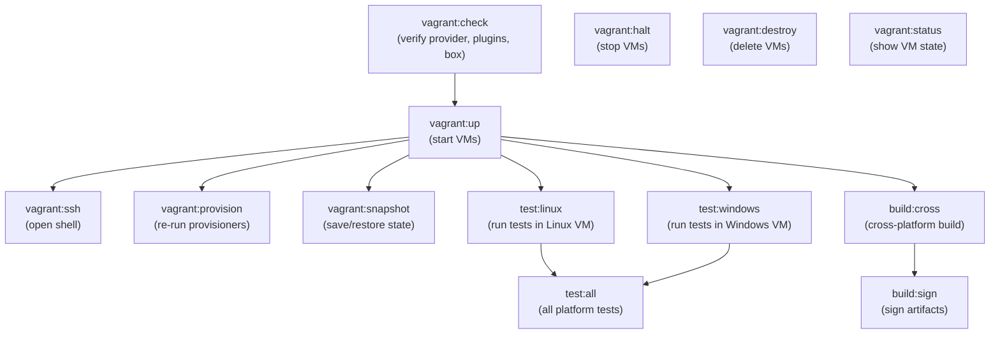

The `depends=["vagrant:check"]` directive in the `vagrant:up` task definition means that every time you run `mise run vagrant:up`, mise first runs `vagrant:check` to verify that the hypervisor, plugins, and boxes are all available. If the check fails, it stops before attempting to boot VMs.

---

### Step 4: First VM Boot — The Learning Run

This is where theory meets practice. You will boot your first VM with full logging to see everything Vagrant does.

#### Boot with Verbose Logging

```bash
# Set Vagrant to info-level logging and start the Linux VM
VAGRANT_LOG=info mise run vagrant:up -- --machine linux
```

#### Annotated Output

What you will see (with explanations):

```
==> vagrant:check: Checking prerequisites...
    ✓ Vagrant 2.4.x installed
    ✓ Provider: virtualbox (or libvirt, etc.)
    ✓ Plugins: vagrant-hostmanager, vagrant-vbguest
    ✓ Box: ubuntu/jammy64 (cached)

==> linux: Importing base box 'ubuntu/jammy64'...
    # Vagrant copies the box disk image to create a new VM

==> linux: Matching MAC address for NAT networking...
    # Provider assigns a MAC address to the VM's network interface

==> linux: Setting the name of the VM: utm-dev-v2_linux_1711234567
    # Provider names the VM in its registry

==> linux: Preparing network interfaces based on configuration...
    # Creates both the NAT adapter (for internet) and host-only adapter (for private network)

==> linux: Forwarding ports...
    linux: 22 (guest) => 2222 (host) (adapter 1)
    linux: 1420 (guest) => 1420 (host) (adapter 1)
    # SSH and Tauri dev server port forwards

==> linux: Booting VM...
    # Hypervisor starts the VM

==> linux: Waiting for machine to boot. This may take a few minutes...
    linux: SSH address: 127.0.0.1:2222
    linux: SSH username: vagrant
    linux: SSH auth method: private key
    # Vagrant polls SSH until it connects

==> linux: Machine booted and ready!
    # SSH is available

==> linux: Mounting shared folders...
    linux: /vagrant => /home/user/projects/my-tauri-app
    # Project directory is now visible inside the VM

==> linux: Running provisioner: base-packages (shell)...
    linux: + apt-get update
    linux: + apt-get install -y curl git build-essential pkg-config
    linux:   libwebkit2gtk-4.1-dev libssl-dev libayatana-appindicator3-dev
    linux:   librsvg2-dev
    # Installing system packages required by Tauri

==> linux: Running provisioner: install-mise (shell)...
    linux: + curl https://mise.run | sh
    linux: + echo 'eval "$(mise activate bash)"' >> /home/vagrant/.bashrc
    # Installing mise inside the VM

==> linux: Running provisioner: install-tools (shell)...
    linux: + cd /vagrant
    linux: + mise trust
    linux: + mise install
    linux: Installing rust 1.78.0...
    linux: Installing node 20.x.x...
    linux: Installing pnpm 9.x.x...
    # mise reads /vagrant/mise.toml and installs all declared tools
```

#### Verify the Environment

```bash
# SSH into the VM
mise run vagrant:ssh -- --machine linux

# Inside the VM:
mise doctor        # Check mise health
cargo --version    # Rust toolchain
node --version     # Node.js
pnpm --version     # Package manager
cargo tauri --version  # Tauri CLI

# Check synced folder
ls /vagrant/       # Should show your project files

# Exit the VM
exit
```

---

### Step 5: Development Workflow

The daily development loop with utm-dev-v2 follows a "edit on host, build/test in VM" pattern.

#### Edit on Host, Build in VM

Your project files live on the host machine. You use your preferred editor (VS Code, Neovim, etc.) to write code. Changes are instantly visible inside the VM through the synced folder.

```
Host machine                     Linux VM
─────────────────────           ─────────────────────
~/projects/my-app/              /vagrant/
├── src/                        ├── src/           (synced)
│   ├── main.rs                 │   ├── main.rs
│   └── lib.rs                  │   └── lib.rs
├── src-tauri/                  ├── src-tauri/     (synced)
├── package.json                ├── package.json   (synced)
└── mise.toml                   └── mise.toml      (synced)
```

#### Port Forwarding for Dev Server

When running `cargo tauri dev` inside the VM, the Tauri dev server listens on port 1420. Thanks to port forwarding, you can access it from your host browser at `http://localhost:1420`.

```bash
# In the VM:
cd /vagrant
cargo tauri dev

# On the host:
# Open http://localhost:1420 in your browser
```

#### Terminal Multiplexing

The recommended workflow uses two terminal panes:

| Terminal 1 (Host) | Terminal 2 (VM via SSH) |
|-------------------|------------------------|
| Git operations | `cargo tauri dev` |
| File editing | `cargo test` |
| `mise run` commands | Build commands |
| Code review | Log watching |

```bash
# Terminal 1: Stay on host
git status
vim src/main.rs

# Terminal 2: SSH into VM
mise run vagrant:ssh -- --machine linux
cd /vagrant
cargo tauri dev
```

---

### Step 6: Cross-Platform Testing

This is where utm-dev-v2's Vagrant integration truly pays off. You can test your Tauri app on multiple operating systems from a single machine.

#### Start Additional VMs

```bash
# Start the Windows VM alongside the already-running Linux VM
mise run vagrant:up -- --machine windows
```

The Windows VM will take longer to boot (Windows Update, WinRM initialization). Be patient — the first boot can take 10-15 minutes.

#### Run Tests Per Platform

```bash
# Run tests in the Linux VM
mise run test:linux
# Internally: vagrant ssh linux -- "cd /vagrant && cargo test"

# Run tests in the Windows VM
mise run test:windows
# Internally: vagrant winrm windows -- "cd C:\\vagrant && cargo test"
```

#### Run All Tests in Parallel

```bash
# Run tests on all platforms simultaneously
mise run test:all --parallel
```

This starts test execution in both VMs concurrently. Results are collected and displayed together, with per-platform pass/fail status.

#### Reading Test Results

Test results are written to the synced folder at `dist/test-results/`:

```
dist/test-results/
├── linux/
│   ├── unit-tests.xml       # JUnit XML format
│   └── integration-tests.xml
└── windows/
    ├── unit-tests.xml
    └── integration-tests.xml
```

You can diff results across platforms to identify OS-specific failures.

---

### Step 7: Building Release Artifacts

#### Cross-Platform Build

```bash
# Build release artifacts for all platforms
mise run build:cross -- --release
```

This command:
1. Builds the Linux binary inside the Linux VM (`cargo tauri build` produces `.deb` and `.AppImage`)
2. Builds the Windows binary inside the Windows VM (`cargo tauri build` produces `.msi` and `.exe`)
3. Copies all artifacts to the host's `dist/` directory via the synced folder

#### Where Artifacts Land

```
dist/
├── linux/
│   ├── my-app_1.0.0_amd64.deb
│   ├── my-app_1.0.0_amd64.AppImage
│   └── my-app_1.0.0_amd64.rpm
└── windows/
    ├── my-app_1.0.0_x64_en-US.msi
    └── my-app_1.0.0_x64-setup.exe
```

#### Signing Workflow

```bash
# Sign all release artifacts
mise run build:sign
```

Signing uses platform-specific tools: `codesign` on macOS, `signtool` on Windows. Signing certificates are configured via `mise.local.toml` (gitignored) or environment variables.

---

### Step 8: Day-to-Day Operations

#### Morning Startup

```bash
# Start VMs (instant if they're suspended, fast if snapshots exist)
mise run vagrant:up
```

If you used `vagrant suspend` the previous day, VMs resume from saved state in seconds. If you used `vagrant halt`, they boot from disk but skip provisioning (already done).

#### Save State Before Risky Changes

```bash
# Named snapshot before a refactor
mise run vagrant:snapshot -- --name before-refactor

# Or use the quick push/pop stack
mise run vagrant:snapshot -- --push
```

#### Experiment and Rollback

```bash
# Something broke the build environment
mise run vagrant:restore -- --name before-refactor

# Or pop the stack
mise run vagrant:snapshot -- --pop
```

#### End of Day

```bash
# Suspend (saves RAM state, instant resume tomorrow)
vagrant suspend

# Or halt (clean shutdown, slower resume)
mise run vagrant:halt
```

#### Weekly Maintenance

```bash
# Update boxes for OS security patches
vagrant box update

# Prune old box versions to reclaim disk space
vagrant box prune

# Check plugin updates
vagrant plugin update
```

---

### Step 9: Customization

#### Resource Tuning with `vagrant.local.yml`

Create a `vagrant.local.yml` file (gitignored) to override default resource allocation:

```yaml
# vagrant.local.yml — per-developer overrides
cpus: 6           # Override default 4
memory: 16384     # 16 GB instead of default 8 GB
disk: "200GB"     # Larger disk for heavy builds

# Provider-specific overrides
virtualbox:
  gui: true       # Show VM window (useful for debugging)

libvirt:
  driver: kvm
  nested: true    # Enable nested virtualization
```

The Vagrantfile loads this YAML and merges it with defaults:

```ruby
local_config = YAML.load_file("vagrant.local.yml") rescue {}
cpus = local_config.fetch("cpus", DEFAULTS["cpus"])
```

#### Secret Management with `mise.local.toml`

```toml
# mise.local.toml — per-developer secrets (NEVER commit this)
[env]
SIGNING_CERT_PATH = "/path/to/my/certificate.pfx"
SIGNING_CERT_PASSWORD = "my-secret-password"
SMB_USERNAME = "myuser"
SMB_PASSWORD = "mypassword"
VAGRANT_CLOUD_TOKEN = "my-vagrant-cloud-token"
```

#### Adding a Custom Provisioner

To install your team's internal tools, add a provisioner to the Vagrantfile:

```ruby
config.vm.provision "shell", name: "team-tools",
  path: "scripts/install-team-tools.sh",
  privileged: false
```

`scripts/install-team-tools.sh`:

```bash
#!/usr/bin/env bash
set -euo pipefail

# Install internal CLI tool
curl -sSL https://internal.example.com/cli/install.sh | bash

# Configure internal registry
npm config set registry https://npm.internal.example.com/
cargo login --registry internal "$(cat /vagrant/.cargo-token)"
```

#### Project-Specific mise Tasks

Add custom tasks to your project's `mise.toml` that leverage Vagrant:

```toml
[tasks.db-reset]
description = "Reset the development database in the Linux VM"
depends = ["vagrant:up"]
run = "vagrant ssh linux -- 'cd /vagrant && ./scripts/db-reset.sh'"

[tasks.lint-all]
description = "Run linters on all platforms"
depends = ["vagrant:up"]
run = """
vagrant ssh linux -- 'cd /vagrant && cargo clippy && pnpm lint'
"""
```

---

### Step 10: CI/CD Integration

#### How Vagrant + mise Works in GitHub Actions

The same `Vagrantfile` and `mise.toml` that developers use locally work identically in CI. The GitHub Actions runner becomes the "host machine," and VMs boot inside it.

```yaml
# .github/workflows/cross-platform-test.yml
name: Cross-Platform Tests
on: [push, pull_request]

jobs:
  test-linux:
    runs-on: ubuntu-latest
    steps:
      - uses: actions/checkout@v4
      - uses: jdx/mise-action@v2
      - name: Install libvirt
        run: |
          sudo apt-get update
          sudo apt-get install -y qemu-kvm libvirt-daemon-system
          sudo usermod -aG libvirt $USER
      - name: Cache Vagrant boxes
        uses: actions/cache@v4
        with:
          path: ~/.vagrant.d/boxes
          key: vagrant-boxes-${{ hashFiles('Vagrantfile') }}
      - name: Boot and test
        run: mise run test:linux

  test-windows:
    runs-on: windows-latest
    steps:
      - uses: actions/checkout@v4
      - uses: jdx/mise-action@v2
      - name: Enable Hyper-V
        run: Enable-WindowsOptionalFeature -Online -FeatureName Microsoft-Hyper-V -All
      - name: Cache Vagrant boxes
        uses: actions/cache@v4
        with:
          path: ~/.vagrant.d/boxes
          key: vagrant-boxes-windows-${{ hashFiles('Vagrantfile') }}
      - name: Boot and test
        run: mise run test:windows
```

#### Runner Requirements Per Platform

| Runner | Provider | VM Performance | Notes |
|--------|----------|---------------|-------|
| `ubuntu-latest` | libvirt/KVM | Excellent | Nested virt support varies by runner |
| `windows-latest` | Hyper-V | Good | Must enable Hyper-V feature |
| `macos-latest` | VirtualBox | Moderate | No nested virt on GitHub-hosted runners |

#### Caching Strategies

Box downloads are the biggest CI bottleneck (6+ GB per box). Cache aggressively:

```yaml
- uses: actions/cache@v4
  with:
    path: |
      ~/.vagrant.d/boxes
      ~/.local/share/mise
    key: vagrant-${{ runner.os }}-${{ hashFiles('Vagrantfile', 'mise.toml') }}
    restore-keys: |
      vagrant-${{ runner.os }}-
```

Build artifact caching (Rust's `target/` directory) is also critical. Use rsync-based synced folders in CI so that `target/` lives on the VM's native disk (for build performance) and results are synced back to the host only at the end.

#### CI/Local Parity

The key insight is that `mise run test:all` runs the same task graph locally and in CI. There is no separate CI configuration for test execution. The only difference is the hypervisor provider (which the Vagrantfile auto-detects).

---

## Part 4: Mental Models and Concept Mapping

### How Vagrant Concepts Map to mise Concepts

| Vagrant Concept | mise Equivalent | How They Connect |
|---|---|---|
| `Vagrantfile` | `mise.toml` | Both are declarative config for reproducible environments. The `Vagrantfile` declares VM shape; `mise.toml` declares tool versions. Together, they define the full environment. |
| Box | mise tool | Both are versioned, cached, downloadable artifacts. A box is a cached VM image at `~/.vagrant.d/boxes/`; a mise tool is a cached binary at `~/.local/share/mise/installs/`. |
| Provider | mise backend | Both abstract implementation details. A provider abstracts which hypervisor runs the VM; a mise backend abstracts which package manager installs a tool (asdf, vfox, ubi, etc.). |
| Provisioner | mise task | Both execute scripts to configure environments. A provisioner runs shell scripts inside the VM; a mise task runs shell scripts on the host (or via `vagrant ssh` inside the VM). |
| Synced folders | *(N/A — Vagrant-specific)* | No mise equivalent. Synced folders are the bridge that lets mise tasks interact with VM filesystems. |
| Snapshot | *(N/A — Vagrant-specific)* | No mise equivalent. Snapshots are used by mise tasks (e.g., `mise run vagrant:snapshot`) for state management. |
| `vagrant.local.yml` | `mise.local.toml` | Both are gitignored, per-developer override files. `vagrant.local.yml` customizes VM resources; `mise.local.toml` customizes tool versions and secrets. |
| Vagrant Cloud | mise registry | Both are remote repositories for versioned artifacts. Vagrant Cloud hosts boxes; the mise registry (and its backends like GitHub releases) host tool binaries. |
| Plugin | mise plugin/backend | Both extend core functionality with third-party integrations. Vagrant plugins add providers and commands; mise plugins add tool support. |

### The Three Layers of utm-dev-v2

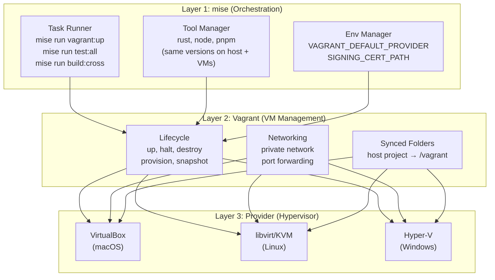

#### How `mise run test:all` Flows Through All Three Layers

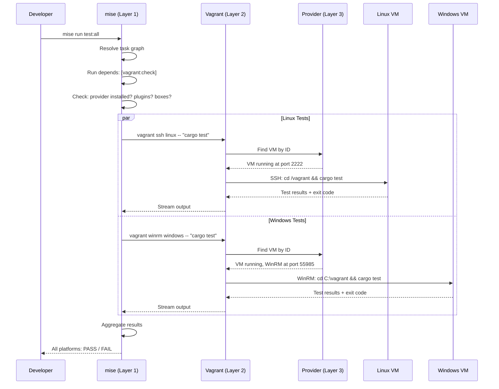

### The Reproducibility Chain

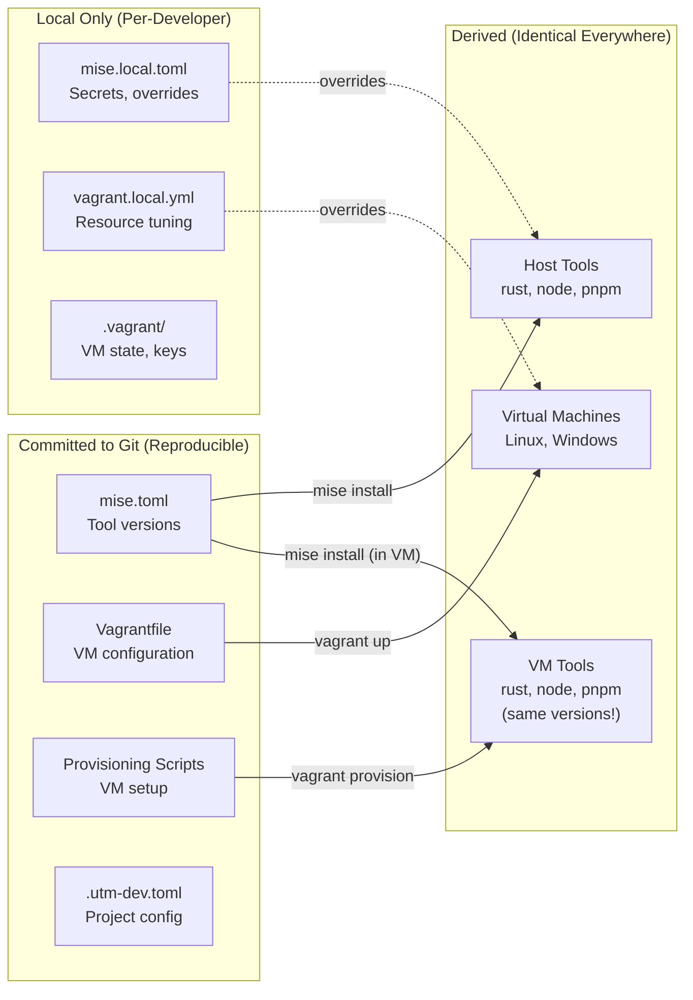

The critical property: everything in the "Committed" column produces identical results on every machine. A developer in Tokyo and a CI runner in Virginia will produce the same tool versions, the same VM configurations, and the same build outputs. The "Local Only" column is for per-developer customization (more RAM, signing certificates) that does not affect reproducibility.

---

## Part 5: Troubleshooting Primer

These are the issues you will hit on your first day. Every entry includes the symptom, root cause, fix, and prevention strategy.

---

### "vagrant up hangs after 'Booting VM'"

**Symptom:** `vagrant up` prints "Booting VM..." and then nothing happens for 5+ minutes. Eventually it times out with "Timed out while waiting for the machine to boot."

**Cause:** The hypervisor provider is not installed or not working. Vagrant successfully created the VM definition but the hypervisor cannot start it. Common reasons:
- VirtualBox not installed
- libvirt service not running (`sudo systemctl start libvirtd`)
- Hyper-V not enabled (requires Windows reboot)
- CPU virtualization (VT-x / AMD-V) disabled in BIOS

**Fix:**
```bash
# Check if the provider works
VBoxManage list vms        # VirtualBox
virsh list --all           # libvirt
Get-VM                     # Hyper-V (PowerShell)

# If libvirt isn't running:
sudo systemctl enable --now libvirtd

# If VT-x is disabled: reboot into BIOS and enable Intel VT-x or AMD-V
```

**Prevention:** Run `mise run vagrant:check` before `vagrant up`. The check task verifies the provider is operational.

---

### "vagrant up is slow (downloading box)"

**Symptom:** `vagrant up` shows a download progress bar that estimates 30+ minutes.

**Cause:** Vagrant boxes are large (2-6 GB for Linux, 6-12 GB for Windows). First download takes time.

**Fix:** Wait for the download to complete. It only happens once — the box is cached at `~/.vagrant.d/boxes/`.

**Prevention:** Pre-download boxes during setup:
```bash
vagrant box add ubuntu/jammy64
vagrant box add gusztavvargadr/windows-11
```

---

### "Synced folders are empty inside the VM"

**Symptom:** You SSH into the VM and `/vagrant` is empty or does not exist.

**Cause:** The synced folder mount failed. Common reasons:
- **NFS**: `nfsd` not running on the host
- **SMB**: Credentials not provided or incorrect
- **VirtualBox SF**: Guest Additions not installed or version mismatch

**Fix:**
```bash
# NFS (macOS/Linux)
# Check if nfsd is running
sudo systemctl status nfs-server   # Linux
sudo nfsd status                    # macOS

# Start NFS if not running
sudo systemctl start nfs-server    # Linux
sudo nfsd start                     # macOS

# SMB (Windows guests)
# Re-provision to re-prompt for credentials
vagrant provision

# VirtualBox Shared Folders
# Install/update Guest Additions
vagrant plugin install vagrant-vbguest
vagrant reload
```

**Prevention:** Use `vagrant reload` after any networking or synced folder changes. The `vagrant-vbguest` plugin automatically keeps Guest Additions in sync.

---

### "mise not found" inside the VM

**Symptom:** You SSH into the VM and running `mise` returns "command not found."

**Cause:** The mise installation provisioner failed, or mise's shell activation is not in the shell profile.

**Fix:**
```bash
# Re-run provisioners
vagrant provision

# If that doesn't work, install manually inside the VM:
vagrant ssh linux
curl https://mise.run | sh
echo 'eval "$(mise activate bash)"' >> ~/.bashrc
source ~/.bashrc
mise --version
```

**Prevention:** Check provisioner output during `vagrant up` for errors. The `install-mise` provisioner should complete without errors.

---

### "cargo not found" inside the VM

**Symptom:** `mise` works inside the VM, but `cargo` returns "command not found."

**Cause:** mise is installed but not activated in the current shell, or `mise install` has not been run.

**Fix:**
```bash
vagrant ssh linux

# Activate mise in current shell
eval "$(mise activate bash)"

# Trust the project config and install tools
cd /vagrant
mise trust
mise install

# Verify
cargo --version
```

**Prevention:** Ensure the provisioning scripts include both `mise trust` and `mise install` with the working directory set to `/vagrant` where `mise.toml` lives.

---

### "Port already in use" on the host

**Symptom:** `vagrant up` reports "The forwarded port to 1420 is already in use on the host machine."

**Cause:** Another process (another VM, a local dev server, etc.) is already listening on port 1420.

**Fix:**
```bash
# Find what's using the port
lsof -i :1420         # macOS/Linux
netstat -ano | findstr :1420  # Windows

# Kill the process, or use auto_correct in Vagrantfile:
config.vm.network "forwarded_port", guest: 1420, host: 1420, auto_correct: true
```

With `auto_correct: true`, Vagrant automatically picks the next available port and prints the actual mapping.

**Prevention:** Always use `auto_correct: true` in the Vagrantfile for port forwarding. Check `vagrant port` to see the actual port mappings.

---

### "WinRM timeout" on Windows VM

**Symptom:** `vagrant up` for the Windows VM hangs at "Waiting for WinRM to become available..." and eventually times out.

**Cause:** Windows is still configuring itself after first boot. This includes:
- Windows Update downloading and installing patches
- Sysprep / OOBE completion
- WinRM service startup delay

**Fix:**
```bash
# Increase timeout in Vagrantfile
config.winrm.timeout = 3600  # 1 hour for first boot

# Or just wait longer — first boot can take 15-30 minutes

# If it's truly stuck, check the VM's console through the hypervisor GUI
# VirtualBox: VBoxManage startvm <vm-name> --type gui
# libvirt: virt-manager
```

**Prevention:** Set generous WinRM timeouts in the Vagrantfile. The production config in [utm-dev-v2-vagrant.md](./utm-dev-v2-vagrant.md) uses 30-minute timeouts for Windows VMs.

---

### "Permission denied" on NFS mount

**Symptom:** `vagrant up` prompts for a password and then fails with "Permission denied" or "NFS export failed."

**Cause:** NFS requires root/sudo access on the host to modify `/etc/exports` and restart `nfsd`. If you enter the wrong password or your user does not have sudo access, the export fails.

**Fix:**
```bash
# Verify sudo access
sudo -v

# Check /etc/exports for stale entries
cat /etc/exports

# Remove stale Vagrant NFS entries (lines containing "# VAGRANT-BEGIN" and "# VAGRANT-END")
sudo vim /etc/exports

# Restart NFS
sudo systemctl restart nfs-server   # Linux
sudo nfsd restart                    # macOS

# Retry
vagrant reload
```

**Prevention:** If NFS is problematic, switch to rsync or virtiofs in the Vagrantfile:
```ruby
config.vm.synced_folder ".", "/vagrant", type: "rsync"
```

---

### "Box checksum mismatch" during download

**Symptom:** Box download completes but Vagrant reports a checksum error and refuses to add the box.

**Cause:** Corrupted download (network interruption) or a man-in-the-middle attack.

**Fix:**
```bash
# Remove the partially downloaded box
vagrant box remove <box-name> 2>/dev/null

# Clear Vagrant's temp directory
rm -rf ~/.vagrant.d/tmp/*

# Re-download
vagrant box add <box-name>
```

**Prevention:** Use a stable network connection. Vagrant verifies checksums automatically — this error means the download was genuinely corrupted.

---

### "VBoxManage: error: VT-x is not available"

**Symptom:** VirtualBox refuses to start the VM with a VT-x error.

**Cause:** Hardware virtualization is either disabled in BIOS or another hypervisor is using it exclusively (e.g., Hyper-V on Windows locks VT-x).

**Fix:**
```bash
# Check BIOS settings: reboot → enter BIOS → enable Intel VT-x or AMD-V

# On Windows: if Hyper-V is enabled, VirtualBox cannot use VT-x
# You must choose one or the other
# Disable Hyper-V:
bcdedit /set hypervisorlaunchtype off
# Then reboot

# Or switch to Hyper-V provider instead of VirtualBox
export VAGRANT_DEFAULT_PROVIDER=hyperv
```

**Prevention:** Choose one hypervisor per machine. On Windows, prefer Hyper-V (built-in). On Linux, prefer libvirt. On macOS, VirtualBox works without VT-x conflicts.

---

### "Vagrant version mismatch between team members"

**Symptom:** The Vagrantfile works for some team members but not others, with Ruby syntax errors or unknown configuration options.

**Cause:** Different Vagrant versions. A Vagrantfile that uses features from Vagrant 2.4 will fail on Vagrant 2.3.

**Fix:**
```bash
# Check version
vagrant --version

# Update via mise (the utm-dev-v2 way)
mise use -g vagrant@2.4
```

**Prevention:** Pin the Vagrant version in `mise.toml`:
```toml
[tools]
vagrant = "2.4"
```

This ensures every developer installs the same Vagrant version through mise.

---

### Quick Reference: Troubleshooting Decision Tree

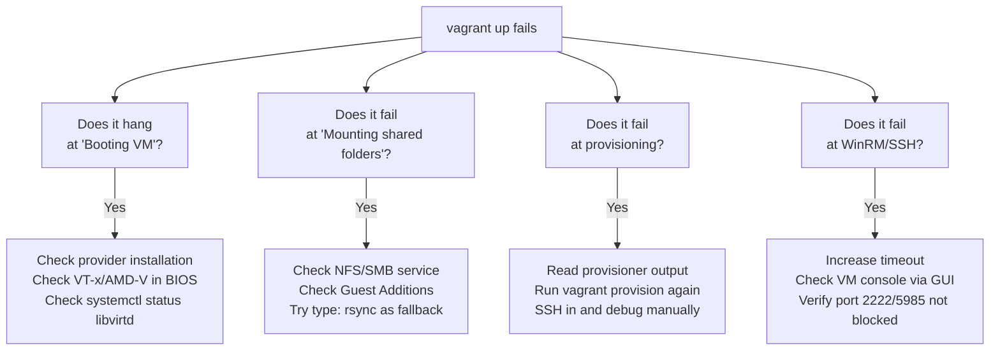

---

## Appendix: Command Quick Reference

```bash
# ─── Box Management ───
vagrant box add <name>               # Download a box
vagrant box list                     # List installed boxes
vagrant box update                   # Update boxes
vagrant box prune                    # Remove old versions
vagrant box remove <name>            # Remove a box

# ─── VM Lifecycle ───
vagrant up                           # Start all VMs
vagrant up <name>                    # Start a specific VM
vagrant halt                         # Stop all VMs
vagrant destroy -f                   # Delete all VMs
vagrant reload                       # Restart VMs (re-reads Vagrantfile)
vagrant suspend                      # Hibernate VMs
vagrant resume                       # Resume hibernated VMs
vagrant status                       # Show VM states
vagrant global-status                # Show ALL Vagrant VMs on this machine

# ─── Provisioning ───
vagrant provision                    # Re-run all provisioners
vagrant provision --provision-with shell  # Run only shell provisioners
vagrant up --provision               # Force provisioning on boot

# ─── SSH / Communication ───
vagrant ssh <name>                   # Open SSH shell
vagrant ssh <name> -- "command"      # Run a command via SSH
vagrant ssh-config                   # Show SSH connection details
vagrant winrm <name> -- "command"    # Run a command via WinRM (Windows)

# ─── Snapshots ───
vagrant snapshot save <name>         # Save named snapshot
vagrant snapshot restore <name>      # Restore named snapshot
vagrant snapshot list                # List snapshots
vagrant snapshot delete <name>       # Delete snapshot
vagrant snapshot push                # Push to stack
vagrant snapshot pop                 # Pop from stack

# ─── Port Mapping ───
vagrant port <name>                  # Show forwarded ports

# ─── Plugins ───
vagrant plugin install <name>        # Install a plugin
vagrant plugin list                  # List plugins
vagrant plugin update                # Update all plugins
vagrant plugin uninstall <name>      # Remove a plugin

# ─── Debugging ───
VAGRANT_LOG=info vagrant up          # Verbose logging
VAGRANT_LOG=debug vagrant up         # Maximum verbosity
```

---

## Next Steps

After completing this primer, you are ready to read [utm-dev-v2-vagrant.md](./utm-dev-v2-vagrant.md), which contains:

- The full production Vagrantfile with multi-provider support
- Complete provisioning scripts for Linux and Windows VMs
- CI/CD pipeline configurations for GitHub Actions
- Performance optimization strategies
- The complete mise task integration for Vagrant lifecycle management

This primer gave you the concepts. The production doc gives you the implementation.
