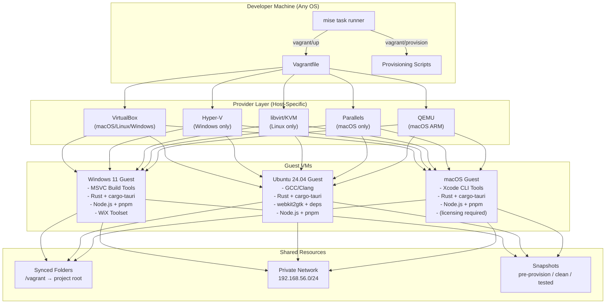
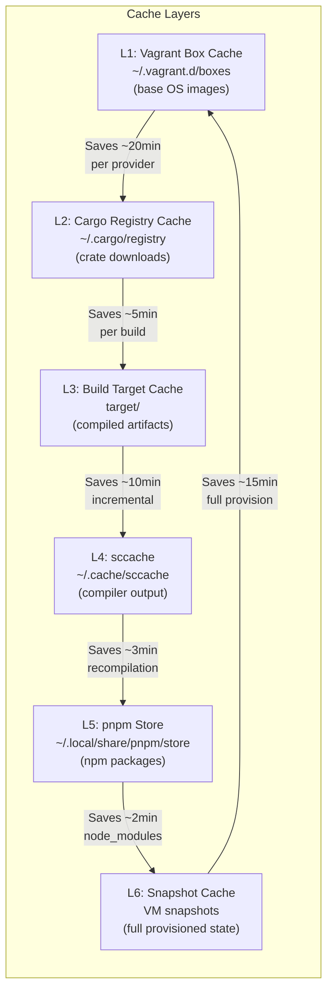
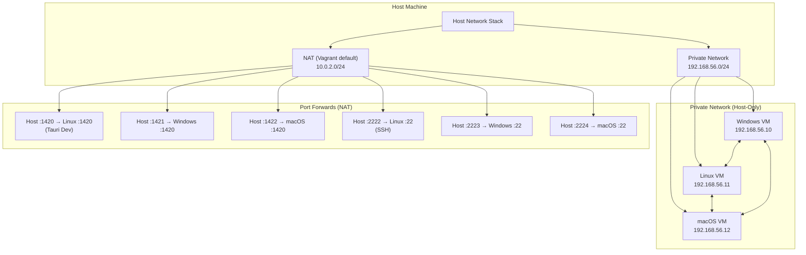
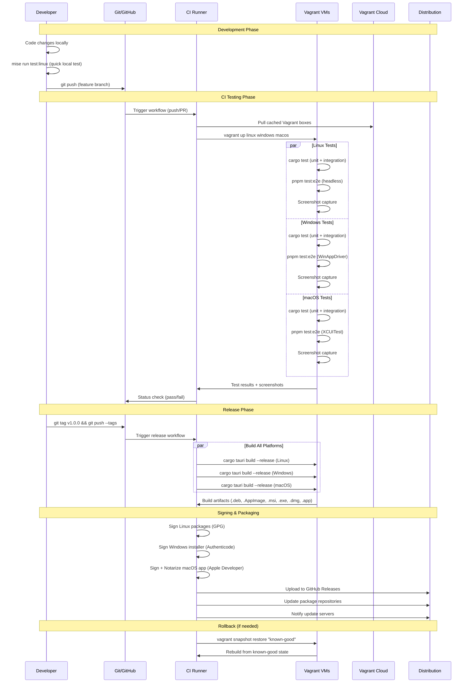

# utm-dev-v2: Vagrant-Based Production Cross-Platform Emulation & Testing

## Table of Contents

1. [Overview](#1-overview)
2. [Architecture](#2-architecture)
3. [Vagrantfile Configuration](#3-vagrantfile-configuration)
4. [Provisioning Scripts](#4-provisioning-scripts)
5. [Mise Task Integration](#5-mise-task-integration)
6. [CI/CD Pipeline Integration](#6-cicd-pipeline-integration)
7. [Testing Matrix](#7-testing-matrix)
8. [Networking & Security](#8-networking--security)
9. [Performance Optimization](#9-performance-optimization)
10. [Production Deployment Workflow](#10-production-deployment-workflow)
11. [Troubleshooting & Common Issues](#11-troubleshooting--common-issues)
12. [Configuration Reference](#12-configuration-reference)

---

## 1. Overview

### Why Vagrant Over UTM for Cross-Platform Testing

utm-dev v1 uses UTM (Universal Terminal for Macs) to run Windows and Linux VMs on macOS. While UTM is excellent for its purpose, it has a fundamental limitation: **it only runs on macOS**. This creates several problems in production workflows:

| Limitation | Impact |
|---|---|
| macOS-only | Team members on Linux/Windows cannot use the VM workflow at all |
| AppleScript automation | Fragile, version-specific, no equivalent on other platforms |
| No CI/CD integration | UTM has no headless mode suitable for CI runners |
| Manual VM setup | Each developer must manually configure VMs |
| No snapshot API | Programmatic snapshot/restore requires osascript hacks |
| No multi-provider support | Locked to QEMU/Apple HV, no choice of hypervisor |

Vagrant solves every one of these problems by providing a **provider-agnostic VM abstraction layer** that works identically on macOS, Windows, and Linux.

### Vagrant as a Provider-Agnostic VM Abstraction

Vagrant sits between your workflow and the hypervisor. A single `Vagrantfile` produces identical VMs regardless of whether the underlying provider is VirtualBox, Hyper-V, libvirt/KVM, Parallels, or VMware. This means:

- A developer on macOS uses Parallels or VirtualBox
- A developer on Linux uses libvirt/KVM (near-native performance)
- A developer on Windows uses Hyper-V (built-in, no extra software)
- CI runners use whichever provider is available on the runner OS
- The `Vagrantfile` and provisioning scripts are **identical** across all hosts

### How This Fits Into utm-dev-v2's Mise Task Architecture

utm-dev-v2 has moved from a monolithic Go CLI to a **distributed mise task system** using bash scripts and remote task includes. Vagrant integration follows this same pattern:

- Vagrant lifecycle commands become mise tasks under `vagrant/*`
- Provisioning scripts live alongside the tasks in `.mise/tasks/vagrant/`
- The `Vagrantfile` is a project-level configuration, similar to `mise.toml`
- Users include Vagrant tasks via the same `git::` remote include mechanism
- Existing `vm/*` tasks (up, down, delete, exec) get Vagrant-backed equivalents

The key insight is that Vagrant replaces the entire `pkg/utm` Go package and its AppleScript automation with a single declarative `Vagrantfile` and shell provisioners. What took 2000+ lines of Go code and platform-specific AppleScript becomes ~200 lines of Ruby DSL that works everywhere.

---

## 2. Architecture

### System Architecture Diagram



### Provider Matrix

| Provider | macOS (Intel) | macOS (ARM/Apple Silicon) | Linux (x86_64) | Linux (ARM64) | Windows (x86_64) |
|---|---|---|---|---|---|
| **VirtualBox** | Full support | Limited (no nested virt) | Full support | Not available | Full support |
| **Parallels** | Full support | Full support (native ARM) | N/A | N/A | N/A |
| **VMware Fusion** | Full support | Full support (native ARM) | N/A | N/A | N/A |
| **libvirt/KVM** | N/A | N/A | Full support (best perf) | Full support | N/A |
| **Hyper-V** | N/A | N/A | N/A | N/A | Full support (built-in) |
| **QEMU** | Via UTM | Via UTM (cross-arch) | Full support | Full support | Via WSL2 |

### How Vagrant Replaces/Augments Existing vm/* Tasks

```
utm-dev v1 (Go CLI + UTM)          utm-dev v2 (mise + Vagrant)
─────────────────────────          ──────────────────────────
cmd/utm.go (2000+ lines)     →    Vagrantfile (~200 lines)
pkg/utm/osascript.go         →    vagrant up/halt/destroy
pkg/utm/utmctl.go            →    vagrant ssh/provision
pkg/utm/advanced.go          →    Vagrant port forwarding + synced folders
pkg/utm/create.go            →    Vagrant box + provisioners
pkg/utm/gallery.go           →    Vagrant Cloud boxes
.mise/tasks/vm/up             →    .mise/tasks/vagrant/up
.mise/tasks/vm/down           →    .mise/tasks/vagrant/halt
.mise/tasks/vm/delete         →    .mise/tasks/vagrant/destroy
.mise/tasks/vm/exec           →    .mise/tasks/vagrant/ssh
(no equivalent)               →    .mise/tasks/vagrant/snapshot
(no equivalent)               →    .mise/tasks/vagrant/restore
(no equivalent)               →    .mise/tasks/test/all
(no equivalent)               →    .mise/tasks/build/cross
```

---

## 3. Vagrantfile Configuration

### Production-Ready Multi-Machine Vagrantfile

```ruby
# -*- mode: ruby -*-
# vi: set ft=ruby :

# =============================================================================
# utm-dev-v2 Production Vagrantfile
# Cross-platform Tauri development and testing environment
# =============================================================================

require 'yaml'
require 'fileutils'

# Load optional local overrides (not committed to git)
LOCAL_CONFIG = File.exist?("vagrant.local.yml") ?
  YAML.load_file("vagrant.local.yml") : {}

# =============================================================================
# Configuration Constants
# =============================================================================

# Versioning - pin boxes to specific versions for reproducibility
BOXES = {
  windows: {
    name:    LOCAL_CONFIG.dig("boxes", "windows", "name")    || "gusztavvargadr/windows-11-24h2-enterprise",
    version: LOCAL_CONFIG.dig("boxes", "windows", "version") || "2601.0.2503",
  },
  linux: {
    name:    LOCAL_CONFIG.dig("boxes", "linux", "name")    || "bento/ubuntu-24.04",
    version: LOCAL_CONFIG.dig("boxes", "linux", "version") || "202502.21.0",
  },
  macos: {
    name:    LOCAL_CONFIG.dig("boxes", "macos", "name")    || "ramsey/macos-sequoia",
    version: LOCAL_CONFIG.dig("boxes", "macos", "version") || "15.3",
  },
}

# Resource allocation defaults (override via vagrant.local.yml)
RESOURCES = {
  windows: {
    cpus:   LOCAL_CONFIG.dig("resources", "windows", "cpus")   || 4,
    memory: LOCAL_CONFIG.dig("resources", "windows", "memory") || 8192,
    disk:   LOCAL_CONFIG.dig("resources", "windows", "disk")   || "80GB",
  },
  linux: {
    cpus:   LOCAL_CONFIG.dig("resources", "linux", "cpus")   || 2,
    memory: LOCAL_CONFIG.dig("resources", "linux", "memory") || 4096,
    disk:   LOCAL_CONFIG.dig("resources", "linux", "disk")   || "40GB",
  },
  macos: {
    cpus:   LOCAL_CONFIG.dig("resources", "macos", "cpus")   || 4,
    memory: LOCAL_CONFIG.dig("resources", "macos", "memory") || 8192,
    disk:   LOCAL_CONFIG.dig("resources", "macos", "disk")   || "60GB",
  },
}

# Network configuration
NETWORK = {
  windows: { ip: "192.168.56.10", hostname: "win11-tauri" },
  linux:   { ip: "192.168.56.11", hostname: "ubuntu-tauri" },
  macos:   { ip: "192.168.56.12", hostname: "macos-tauri" },
}

# Port forwarding for dev servers
PORT_FORWARDS = {
  windows: [
    { guest: 1420, host: 1420, id: "tauri-dev-win" },
    { guest: 3000, host: 3010, id: "frontend-win" },
    { guest: 5173, host: 5183, id: "vite-win" },
  ],
  linux: [
    { guest: 1420, host: 1421, id: "tauri-dev-linux" },
    { guest: 3000, host: 3011, id: "frontend-linux" },
    { guest: 5173, host: 5184, id: "vite-linux" },
  ],
  macos: [
    { guest: 1420, host: 1422, id: "tauri-dev-macos" },
    { guest: 3000, host: 3012, id: "frontend-macos" },
    { guest: 5173, host: 5185, id: "vite-macos" },
  ],
}

# Provisioning scripts directory
SCRIPTS_DIR = File.join(File.dirname(__FILE__), ".mise", "tasks", "vagrant", "provision")

# =============================================================================
# Helper Methods
# =============================================================================

def configure_provider_virtualbox(vm, name, resources)
  vm.provider "virtualbox" do |vb|
    vb.name = "utm-dev-#{name}"
    vb.cpus = resources[:cpus]
    vb.memory = resources[:memory]
    vb.gui = false

    # Performance tuning
    vb.customize ["modifyvm", :id, "--ioapic", "on"]
    vb.customize ["modifyvm", :id, "--natdnshostresolver1", "on"]
    vb.customize ["modifyvm", :id, "--natdnsproxy1", "on"]
    vb.customize ["modifyvm", :id, "--cpuexecutioncap", "90"]

    # Clipboard and drag-drop for interactive debugging
    vb.customize ["modifyvm", :id, "--clipboard-mode", "bidirectional"]
    vb.customize ["modifyvm", :id, "--draganddrop", "bidirectional"]

    # Nested virtualization (needed for some test scenarios)
    vb.customize ["modifyvm", :id, "--nested-hw-virt", "on"]

    # Disk controller optimization
    vb.customize ["storagectl", :id, "--name", "SATA Controller", "--hostiocache", "on"]
  end
end

def configure_provider_libvirt(vm, name, resources)
  vm.provider "libvirt" do |lv|
    lv.title = "utm-dev-#{name}"
    lv.cpus = resources[:cpus]
    lv.memory = resources[:memory]
    lv.driver = "kvm"
    lv.machine_virtual_size = resources[:disk].to_i

    # Performance tuning
    lv.cpu_mode = "host-passthrough"
    lv.nested = true
    lv.disk_bus = "virtio"
    lv.nic_model_type = "virtio"
    lv.video_type = "virtio"
    lv.channel :type => "unix", :target_name => "org.qemu.guest_agent.0",
               :target_type => "virtio"

    # Memory ballooning
    lv.memorybacking :access, :mode => "shared"

    # Storage pool
    lv.storage_pool_name = "utm-dev"
  end
end

def configure_provider_hyperv(vm, name, resources)
  vm.provider "hyperv" do |hv|
    hv.vmname = "utm-dev-#{name}"
    hv.cpus = resources[:cpus]
    hv.memory = resources[:memory]
    hv.maxmemory = resources[:memory] * 2
    hv.enable_virtualization_extensions = true
    hv.linked_clone = true
    hv.auto_start_action = "Nothing"
    hv.auto_stop_action = "ShutDown"
  end
end

def configure_provider_parallels(vm, name, resources)
  vm.provider "parallels" do |prl|
    prl.name = "utm-dev-#{name}"
    prl.cpus = resources[:cpus]
    prl.memory = resources[:memory]
    prl.update_guest_tools = true
    prl.optimize_power_consumption = false

    # Rosetta for x86 on ARM (macOS host)
    prl.customize ["set", :id, "--rosetta-linux", "on"] rescue nil
  end
end

def configure_synced_folders(vm, os_type)
  case os_type
  when :linux
    # NFS is fastest for Linux guests on Linux/macOS hosts
    vm.synced_folder ".", "/vagrant", type: "nfs",
      nfs_udp: false,
      nfs_version: 4,
      mount_options: ["rw", "async", "noatime"]

    # Rsync fallback for CI environments
    # vm.synced_folder ".", "/vagrant", type: "rsync",
    #   rsync__exclude: [".git/", "node_modules/", "target/"],
    #   rsync__auto: true
  when :windows
    # SMB for Windows guests (requires admin on host for macOS/Linux)
    vm.synced_folder ".", "/vagrant", type: "smb",
      smb_username: ENV["VAGRANT_SMB_USER"],
      smb_password: ENV["VAGRANT_SMB_PASS"],
      mount_options: ["vers=3.0", "mfsymlinks"]
  when :macos
    # NFS for macOS guests
    vm.synced_folder ".", "/vagrant", type: "nfs",
      nfs_udp: false,
      nfs_version: 4
  end
end

# =============================================================================
# Main Vagrant Configuration
# =============================================================================

Vagrant.configure("2") do |config|

  # ── Global Configuration ──────────────────────────────────────────────────

  # Plugin checks
  required_plugins = %w[vagrant-hostmanager]
  required_plugins << "vagrant-vbguest" if ENV["VAGRANT_DEFAULT_PROVIDER"] == "virtualbox"
  required_plugins << "vagrant-disksize" if Vagrant.has_plugin?("vagrant-disksize")

  missing_plugins = required_plugins.reject { |p| Vagrant.has_plugin?(p) }
  unless missing_plugins.empty?
    puts "Missing plugins: #{missing_plugins.join(', ')}"
    puts "Install with: vagrant plugin install #{missing_plugins.join(' ')}"
    exit 1
  end

  # Host manager plugin configuration
  config.hostmanager.enabled = true
  config.hostmanager.manage_host = true
  config.hostmanager.manage_guest = true
  config.hostmanager.ignore_private_ip = false

  # SSH defaults
  config.ssh.forward_agent = true
  config.ssh.insert_key = true

  # ── Windows 11 Guest ──────────────────────────────────────────────────────

  config.vm.define "windows", autostart: false do |win|
    win.vm.box = BOXES[:windows][:name]
    win.vm.box_version = BOXES[:windows][:version]
    win.vm.hostname = NETWORK[:windows][:hostname]

    # Windows communicates via WinRM by default, SSH as secondary
    win.vm.communicator = "winrm"
    win.winrm.username = "vagrant"
    win.winrm.password = "vagrant"
    win.winrm.transport = :plaintext
    win.winrm.basic_auth_only = true
    win.winrm.timeout = 1800
    win.winrm.retry_limit = 30
    win.winrm.retry_delay = 10

    # Also configure SSH for interoperability
    win.vm.guest = :windows

    # Network
    win.vm.network "private_network", ip: NETWORK[:windows][:ip]
    PORT_FORWARDS[:windows].each do |pf|
      win.vm.network "forwarded_port",
        guest: pf[:guest], host: pf[:host], id: pf[:id],
        auto_correct: true
    end

    # Synced folders (SMB for Windows)
    win.vm.synced_folder ".", "/vagrant",
      type: "smb",
      smb_username: ENV["VAGRANT_SMB_USER"] || "",
      smb_password: ENV["VAGRANT_SMB_PASS"] || "",
      mount_options: ["vers=3.0", "mfsymlinks"]

    # Provider-specific configuration
    configure_provider_virtualbox(win.vm, "windows-11", RESOURCES[:windows])
    configure_provider_hyperv(win.vm, "windows-11", RESOURCES[:windows])
    configure_provider_libvirt(win.vm, "windows-11", RESOURCES[:windows])

    # Disk size (requires vagrant-disksize plugin)
    win.disksize.size = RESOURCES[:windows][:disk] if Vagrant.has_plugin?("vagrant-disksize")

    # Provisioning
    win.vm.provision "base", type: "shell",
      path: File.join(SCRIPTS_DIR, "windows-base.ps1"),
      privileged: true

    win.vm.provision "rust", type: "shell",
      path: File.join(SCRIPTS_DIR, "windows-rust.ps1"),
      privileged: false

    win.vm.provision "tauri", type: "shell",
      path: File.join(SCRIPTS_DIR, "windows-tauri.ps1"),
      privileged: false

    win.vm.provision "mise", type: "shell",
      path: File.join(SCRIPTS_DIR, "install-mise.ps1"),
      privileged: false
  end

  # ── Ubuntu 24.04 Guest ────────────────────────────────────────────────────

  config.vm.define "linux", primary: true do |lnx|
    lnx.vm.box = BOXES[:linux][:name]
    lnx.vm.box_version = BOXES[:linux][:version]
    lnx.vm.hostname = NETWORK[:linux][:hostname]

    # Network
    lnx.vm.network "private_network", ip: NETWORK[:linux][:ip]
    PORT_FORWARDS[:linux].each do |pf|
      lnx.vm.network "forwarded_port",
        guest: pf[:guest], host: pf[:host], id: pf[:id],
        auto_correct: true
    end

    # Synced folders (NFS for Linux)
    lnx.vm.synced_folder ".", "/vagrant",
      type: "nfs",
      nfs_udp: false,
      nfs_version: 4,
      mount_options: ["rw", "async", "noatime"]

    # Provider-specific configuration
    configure_provider_virtualbox(lnx.vm, "ubuntu-24.04", RESOURCES[:linux])
    configure_provider_libvirt(lnx.vm, "ubuntu-24.04", RESOURCES[:linux])
    configure_provider_hyperv(lnx.vm, "ubuntu-24.04", RESOURCES[:linux])
    configure_provider_parallels(lnx.vm, "ubuntu-24.04", RESOURCES[:linux])

    # Disk size
    lnx.disksize.size = RESOURCES[:linux][:disk] if Vagrant.has_plugin?("vagrant-disksize")

    # Provisioning
    lnx.vm.provision "base", type: "shell",
      path: File.join(SCRIPTS_DIR, "linux-base.sh"),
      privileged: true

    lnx.vm.provision "rust", type: "shell",
      path: File.join(SCRIPTS_DIR, "linux-rust.sh"),
      privileged: false

    lnx.vm.provision "tauri", type: "shell",
      path: File.join(SCRIPTS_DIR, "linux-tauri.sh"),
      privileged: false

    lnx.vm.provision "mise", type: "shell",
      path: File.join(SCRIPTS_DIR, "install-mise.sh"),
      privileged: false
  end

  # ── macOS Guest ────────────────────────────────────────────────────────────

  config.vm.define "macos", autostart: false do |mac|
    mac.vm.box = BOXES[:macos][:name]
    mac.vm.box_version = BOXES[:macos][:version]
    mac.vm.hostname = NETWORK[:macos][:hostname]

    # macOS-specific SSH settings
    mac.ssh.username = "vagrant"
    mac.ssh.password = "vagrant"

    # Network
    mac.vm.network "private_network", ip: NETWORK[:macos][:ip]
    PORT_FORWARDS[:macos].each do |pf|
      mac.vm.network "forwarded_port",
        guest: pf[:guest], host: pf[:host], id: pf[:id],
        auto_correct: true
    end

    # Synced folders
    mac.vm.synced_folder ".", "/vagrant",
      type: "nfs",
      nfs_udp: false,
      nfs_version: 4

    # Provider-specific configuration
    # macOS guests are restricted to specific providers
    configure_provider_virtualbox(mac.vm, "macos-sequoia", RESOURCES[:macos])
    configure_provider_parallels(mac.vm, "macos-sequoia", RESOURCES[:macos])

    # Disk size
    mac.disksize.size = RESOURCES[:macos][:disk] if Vagrant.has_plugin?("vagrant-disksize")

    # Provisioning
    mac.vm.provision "base", type: "shell",
      path: File.join(SCRIPTS_DIR, "macos-base.sh"),
      privileged: false

    mac.vm.provision "rust", type: "shell",
      path: File.join(SCRIPTS_DIR, "macos-rust.sh"),
      privileged: false

    mac.vm.provision "tauri", type: "shell",
      path: File.join(SCRIPTS_DIR, "macos-tauri.sh"),
      privileged: false

    mac.vm.provision "mise", type: "shell",
      path: File.join(SCRIPTS_DIR, "install-mise.sh"),
      privileged: false
  end

end
```

### vagrant.local.yml (Developer Overrides)

This file is `.gitignore`d and allows per-developer resource tuning:

```yaml
# vagrant.local.yml - local overrides (do NOT commit)
---
boxes:
  windows:
    name: "gusztavvargadr/windows-11-24h2-enterprise"
    version: "2601.0.2503"
  linux:
    name: "bento/ubuntu-24.04"
    version: "202502.21.0"

resources:
  windows:
    cpus: 6
    memory: 12288
    disk: "120GB"
  linux:
    cpus: 4
    memory: 8192
    disk: "60GB"
  macos:
    cpus: 4
    memory: 8192
    disk: "80GB"
```

### Resource Allocation Guidelines

| VM | Minimum | Recommended | Heavy Build |
|---|---|---|---|
| **Windows 11** | 2 CPU / 4GB RAM / 40GB | 4 CPU / 8GB RAM / 80GB | 8 CPU / 16GB RAM / 120GB |
| **Ubuntu 24.04** | 1 CPU / 2GB RAM / 20GB | 2 CPU / 4GB RAM / 40GB | 4 CPU / 8GB RAM / 60GB |
| **macOS** | 2 CPU / 4GB RAM / 40GB | 4 CPU / 8GB RAM / 60GB | 6 CPU / 12GB RAM / 100GB |

The heavy build profile is for CI runners or machines dedicated to cross-compilation. Developers running all three VMs simultaneously need at least 16GB host RAM with the recommended profile, or 32GB+ with heavy build.

---

## 4. Provisioning Scripts

### 4.1 Linux Base Provisioning (linux-base.sh)

```bash
#!/usr/bin/env bash
# =============================================================================
# linux-base.sh - Ubuntu 24.04 base provisioning for Tauri development
# Run as: root (privileged: true)
# =============================================================================
set -euo pipefail

export DEBIAN_FRONTEND=noninteractive

echo ">>> [1/5] System update"
apt-get update -qq
apt-get upgrade -y -qq

echo ">>> [2/5] Core build tools"
apt-get install -y -qq \
  build-essential \
  curl \
  wget \
  git \
  pkg-config \
  file \
  unzip \
  xz-utils \
  cmake \
  ninja-build \
  python3 \
  python3-pip \
  jq

echo ">>> [3/5] Tauri system dependencies (webkit2gtk, libappindicator, etc.)"
apt-get install -y -qq \
  libwebkit2gtk-4.1-dev \
  libappindicator3-dev \
  librsvg2-dev \
  patchelf \
  libssl-dev \
  libgtk-3-dev \
  libayatana-appindicator3-dev \
  libglib2.0-dev \
  libsoup-3.0-dev \
  libjavascriptcoregtk-4.1-dev \
  glib-networking

echo ">>> [4/5] Additional libraries for Tauri v2 plugins"
apt-get install -y -qq \
  libasound2-dev \
  libxdo-dev \
  libdbus-1-dev \
  libxcb-shape0-dev \
  libxcb-xfixes0-dev \
  libxcb-render0-dev \
  libxkbcommon-dev

echo ">>> [5/5] Virtual display for headless testing"
apt-get install -y -qq \
  xvfb \
  x11-xkb-utils \
  xfonts-100dpi \
  xfonts-75dpi \
  xfonts-cyrillic \
  dbus-x11 \
  at-spi2-core \
  scrot \
  imagemagick

# Configure Xvfb as a systemd service for headless testing
cat > /etc/systemd/system/xvfb.service << 'XVFB'
[Unit]
Description=X Virtual Frame Buffer Service
After=network.target

[Service]
ExecStart=/usr/bin/Xvfb :99 -screen 0 1920x1080x24 -ac +extension GLX +render -noreset
Restart=always
User=vagrant

[Install]
WantedBy=multi-user.target
XVFB

systemctl daemon-reload
systemctl enable xvfb.service
systemctl start xvfb.service

# Set DISPLAY globally
echo 'export DISPLAY=:99' >> /etc/profile.d/xvfb.sh

echo ">>> Linux base provisioning complete"
```

### 4.2 Linux Rust Provisioning (linux-rust.sh)

```bash
#!/usr/bin/env bash
# =============================================================================
# linux-rust.sh - Rust toolchain for Tauri on Ubuntu
# Run as: vagrant user (privileged: false)
# =============================================================================
set -euo pipefail

echo ">>> [1/3] Installing Rust via rustup"
if ! command -v rustup &>/dev/null; then
  curl --proto '=https' --tlsv1.2 -sSf https://sh.rustup.rs | sh -s -- \
    -y \
    --default-toolchain stable \
    --profile default \
    --component rustfmt,clippy
fi

source "$HOME/.cargo/env"

echo ">>> [2/3] Rust version info"
rustc --version
cargo --version

echo ">>> [3/3] Installing cross-compilation targets"
rustup target add \
  x86_64-unknown-linux-gnu \
  aarch64-unknown-linux-gnu

# Pre-install sccache for build caching
cargo install sccache --locked

# Configure sccache as the Rust wrapper
mkdir -p "$HOME/.cargo"
cat >> "$HOME/.cargo/config.toml" << 'CARGOCONF'
[build]
rustc-wrapper = "sccache"

[net]
git-fetch-with-cli = true

[registries.crates-io]
protocol = "sparse"
CARGOCONF

echo ">>> Rust provisioning complete"
```

### 4.3 Linux Tauri Provisioning (linux-tauri.sh)

```bash
#!/usr/bin/env bash
# =============================================================================
# linux-tauri.sh - Tauri CLI and Node.js setup on Ubuntu
# Run as: vagrant user (privileged: false)
# =============================================================================
set -euo pipefail

source "$HOME/.cargo/env"

echo ">>> [1/4] Installing Node.js via fnm"
if ! command -v fnm &>/dev/null; then
  curl -fsSL https://fnm.vercel.app/install | bash -s -- --skip-shell
fi

export PATH="$HOME/.local/share/fnm:$PATH"
eval "$(fnm env)"

fnm install 22
fnm default 22
fnm use 22

echo ">>> [2/4] Node.js version info"
node --version
npm --version

echo ">>> [3/4] Installing pnpm"
npm install -g pnpm@latest
pnpm --version

echo ">>> [4/4] Installing Tauri CLI"
cargo install tauri-cli --locked
cargo install create-tauri-app --locked

echo ">>> Tauri provisioning complete"
echo ">>> Installed: cargo-tauri $(cargo tauri --version), create-tauri-app"
```

### 4.4 Windows Base Provisioning (windows-base.ps1)

```powershell
# =============================================================================
# windows-base.ps1 - Windows 11 base provisioning for Tauri development
# Run as: Administrator (privileged: true)
# =============================================================================

$ErrorActionPreference = "Stop"

Write-Host ">>> [1/4] Installing Chocolatey" -ForegroundColor Green
if (-not (Get-Command choco -ErrorAction SilentlyContinue)) {
    Set-ExecutionPolicy Bypass -Scope Process -Force
    [System.Net.ServicePointManager]::SecurityProtocol = [System.Net.ServicePointManager]::SecurityProtocol -bor 3072
    Invoke-Expression ((New-Object System.Net.WebClient).DownloadString('https://community.chocolatey.org/install.ps1'))
}

# Reload PATH
$env:Path = [System.Environment]::GetEnvironmentVariable("Path", "Machine") + ";" + [System.Environment]::GetEnvironmentVariable("Path", "User")

Write-Host ">>> [2/4] Installing Visual Studio Build Tools" -ForegroundColor Green
# VS Build Tools with C++ workload (required for Rust MSVC target)
choco install visualstudio2022buildtools -y --package-parameters `
    "--add Microsoft.VisualStudio.Workload.VCTools `
     --add Microsoft.VisualStudio.Component.VC.Tools.x86.x64 `
     --add Microsoft.VisualStudio.Component.Windows11SDK.22621 `
     --includeRecommended `
     --passive --norestart"

Write-Host ">>> [3/4] Installing development tools" -ForegroundColor Green
choco install -y `
    git `
    cmake `
    ninja `
    python3 `
    7zip `
    jq `
    wget `
    curl

Write-Host ">>> [4/4] Installing WebView2 Runtime" -ForegroundColor Green
# WebView2 is typically pre-installed on Win11, but ensure it's there
choco install -y webview2-runtime

# Install WiX Toolset v4 for MSI packaging
choco install -y wixtoolset

# Enable SSH server for Vagrant SSH access as fallback
Write-Host ">>> Enabling OpenSSH Server" -ForegroundColor Green
Add-WindowsCapability -Online -Name OpenSSH.Server~~~~0.0.1.0 -ErrorAction SilentlyContinue
Start-Service sshd -ErrorAction SilentlyContinue
Set-Service -Name sshd -StartupType Automatic -ErrorAction SilentlyContinue

Write-Host ">>> Windows base provisioning complete" -ForegroundColor Green
```

### 4.5 Windows Rust Provisioning (windows-rust.ps1)

```powershell
# =============================================================================
# windows-rust.ps1 - Rust toolchain for Tauri on Windows
# Run as: vagrant user (privileged: false)
# =============================================================================

$ErrorActionPreference = "Stop"

Write-Host ">>> [1/3] Installing Rust via rustup" -ForegroundColor Green
if (-not (Get-Command rustup -ErrorAction SilentlyContinue)) {
    $rustupInit = "$env:TEMP\rustup-init.exe"
    Invoke-WebRequest -Uri "https://win.rustup.rs/x86_64" -OutFile $rustupInit
    & $rustupInit -y --default-toolchain stable --profile default --component rustfmt,clippy
    Remove-Item $rustupInit
}

# Reload PATH to include cargo
$env:Path = "$env:USERPROFILE\.cargo\bin;" + $env:Path

Write-Host ">>> [2/3] Rust version info" -ForegroundColor Green
rustc --version
cargo --version

Write-Host ">>> [3/3] Installing sccache for build caching" -ForegroundColor Green
cargo install sccache --locked

# Configure cargo to use sccache
$cargoConfigDir = "$env:USERPROFILE\.cargo"
$cargoConfig = "$cargoConfigDir\config.toml"
if (-not (Test-Path $cargoConfig) -or -not (Select-String -Path $cargoConfig -Pattern "sccache" -Quiet)) {
    Add-Content -Path $cargoConfig -Value @"

[build]
rustc-wrapper = "sccache"

[net]
git-fetch-with-cli = true

[registries.crates-io]
protocol = "sparse"
"@
}

Write-Host ">>> Windows Rust provisioning complete" -ForegroundColor Green
```

### 4.6 Windows Tauri Provisioning (windows-tauri.ps1)

```powershell
# =============================================================================
# windows-tauri.ps1 - Tauri CLI and Node.js setup on Windows
# Run as: vagrant user (privileged: false)
# =============================================================================

$ErrorActionPreference = "Stop"
$env:Path = "$env:USERPROFILE\.cargo\bin;" + $env:Path

Write-Host ">>> [1/4] Installing fnm (Fast Node Manager)" -ForegroundColor Green
if (-not (Get-Command fnm -ErrorAction SilentlyContinue)) {
    choco install fnm -y
    $env:Path = [System.Environment]::GetEnvironmentVariable("Path", "Machine") + ";" + $env:Path
}

Write-Host ">>> [2/4] Installing Node.js 22 LTS" -ForegroundColor Green
fnm install 22
fnm default 22
fnm use 22

Write-Host ">>> [3/4] Installing pnpm" -ForegroundColor Green
npm install -g pnpm@latest

Write-Host ">>> [4/4] Installing Tauri CLI" -ForegroundColor Green
cargo install tauri-cli --locked
cargo install create-tauri-app --locked

Write-Host ">>> Tauri version:" -ForegroundColor Green
cargo tauri --version

Write-Host ">>> Windows Tauri provisioning complete" -ForegroundColor Green
```

### 4.7 macOS Base Provisioning (macos-base.sh)

```bash
#!/usr/bin/env bash
# =============================================================================
# macos-base.sh - macOS base provisioning for Tauri development
# Run as: vagrant user (privileged: false)
# NOTE: macOS virtualization requires Apple hardware and appropriate licensing
# =============================================================================
set -euo pipefail

echo ">>> [1/4] Installing Xcode Command Line Tools"
if ! xcode-select -p &>/dev/null; then
  # Touch file to trigger softwareupdate to find CLT
  touch /tmp/.com.apple.dt.CommandLineTools.installondemand.in-progress
  PROD=$(softwareupdate -l 2>/dev/null | grep "\*.*Command Line" | tail -n 1 | sed 's/^[^C]*//')
  softwareupdate -i "$PROD" --verbose
  rm -f /tmp/.com.apple.dt.CommandLineTools.installondemand.in-progress
fi

echo ">>> [2/4] Accepting Xcode license"
sudo xcodebuild -license accept 2>/dev/null || true

echo ">>> [3/4] Installing Homebrew"
if ! command -v brew &>/dev/null; then
  NONINTERACTIVE=1 /bin/bash -c "$(curl -fsSL https://raw.githubusercontent.com/Homebrew/install/HEAD/install.sh)"
fi

# Ensure brew is in PATH
if [[ -f /opt/homebrew/bin/brew ]]; then
  eval "$(/opt/homebrew/bin/brew shellenv)"
  echo 'eval "$(/opt/homebrew/bin/brew shellenv)"' >> "$HOME/.zprofile"
elif [[ -f /usr/local/bin/brew ]]; then
  eval "$(/usr/local/bin/brew shellenv)"
fi

echo ">>> [4/4] Installing base development tools"
brew install \
  git \
  cmake \
  ninja \
  python3 \
  jq \
  wget \
  coreutils

echo ">>> macOS base provisioning complete"
```

### 4.8 macOS Rust Provisioning (macos-rust.sh)

```bash
#!/usr/bin/env bash
# =============================================================================
# macos-rust.sh - Rust toolchain for Tauri on macOS
# Run as: vagrant user (privileged: false)
# =============================================================================
set -euo pipefail

echo ">>> [1/3] Installing Rust via rustup"
if ! command -v rustup &>/dev/null; then
  curl --proto '=https' --tlsv1.2 -sSf https://sh.rustup.rs | sh -s -- \
    -y \
    --default-toolchain stable \
    --profile default \
    --component rustfmt,clippy
fi

source "$HOME/.cargo/env"

echo ">>> [2/3] Rust version info"
rustc --version
cargo --version

echo ">>> [3/3] Installing targets and sccache"
# Both Intel and ARM targets for universal binaries
rustup target add \
  x86_64-apple-darwin \
  aarch64-apple-darwin

cargo install sccache --locked

mkdir -p "$HOME/.cargo"
cat >> "$HOME/.cargo/config.toml" << 'CARGOCONF'
[build]
rustc-wrapper = "sccache"

[net]
git-fetch-with-cli = true

[registries.crates-io]
protocol = "sparse"
CARGOCONF

echo ">>> macOS Rust provisioning complete"
```

### 4.9 macOS Tauri Provisioning (macos-tauri.sh)

```bash
#!/usr/bin/env bash
# =============================================================================
# macos-tauri.sh - Tauri CLI and Node.js setup on macOS
# Run as: vagrant user (privileged: false)
# =============================================================================
set -euo pipefail

source "$HOME/.cargo/env"

echo ">>> [1/4] Installing fnm"
if ! command -v fnm &>/dev/null; then
  curl -fsSL https://fnm.vercel.app/install | bash -s -- --skip-shell
fi

export PATH="$HOME/.local/share/fnm:$PATH"
eval "$(fnm env)"

echo ">>> [2/4] Installing Node.js 22 LTS"
fnm install 22
fnm default 22
fnm use 22

echo ">>> [3/4] Installing pnpm"
npm install -g pnpm@latest

echo ">>> [4/4] Installing Tauri CLI"
cargo install tauri-cli --locked
cargo install create-tauri-app --locked

echo ">>> macOS Tauri provisioning complete"
echo ">>> Installed: cargo-tauri $(cargo tauri --version)"
```

### 4.10 Cross-Platform Mise Installation (install-mise.sh / install-mise.ps1)

**Linux/macOS (install-mise.sh):**

```bash
#!/usr/bin/env bash
# =============================================================================
# install-mise.sh - Install and configure mise in the VM
# Run as: vagrant user (privileged: false)
# =============================================================================
set -euo pipefail

echo ">>> [1/3] Installing mise"
if ! command -v mise &>/dev/null; then
  curl https://mise.run | sh
fi

# Add mise to shell initialization
SHELL_RC="$HOME/.bashrc"
if [[ -f "$HOME/.zshrc" ]]; then
  SHELL_RC="$HOME/.zshrc"
fi

if ! grep -q "mise activate" "$SHELL_RC" 2>/dev/null; then
  echo 'eval "$(~/.local/bin/mise activate bash)"' >> "$HOME/.bashrc"
  if [[ -f "$HOME/.zshrc" ]]; then
    echo 'eval "$(~/.local/bin/mise activate zsh)"' >> "$HOME/.zshrc"
  fi
fi

export PATH="$HOME/.local/bin:$PATH"

echo ">>> [2/3] mise version: $(mise --version)"

echo ">>> [3/3] Trust and install project tools"
if [[ -f /vagrant/mise.toml ]]; then
  cd /vagrant
  mise trust
  mise install --yes
  echo ">>> Installed mise tools from /vagrant/mise.toml"
else
  echo ">>> No mise.toml found in /vagrant, skipping tool install"
fi

echo ">>> mise installation complete"
```

**Windows (install-mise.ps1):**

```powershell
# =============================================================================
# install-mise.ps1 - Install and configure mise in the Windows VM
# Run as: vagrant user (privileged: false)
# =============================================================================

$ErrorActionPreference = "Stop"

Write-Host ">>> [1/3] Installing mise" -ForegroundColor Green
if (-not (Get-Command mise -ErrorAction SilentlyContinue)) {
    # Install via PowerShell installer
    & ([scriptblock]::Create((irm https://mise.run))) -Yes -Force
}

$env:Path = "$env:USERPROFILE\.local\bin;" + $env:Path

Write-Host ">>> [2/3] mise version:" -ForegroundColor Green
mise --version

Write-Host ">>> [3/3] Trust and install project tools" -ForegroundColor Green
if (Test-Path "C:\vagrant\mise.toml") {
    Push-Location "C:\vagrant"
    mise trust
    mise install --yes
    Pop-Location
    Write-Host ">>> Installed mise tools from C:\vagrant\mise.toml"
} else {
    Write-Host ">>> No mise.toml found in C:\vagrant, skipping tool install"
}

Write-Host ">>> mise installation complete" -ForegroundColor Green
```

### 4.11 SSH Key Management

SSH key provisioning is handled as part of the Vagrant workflow. Vagrant auto-generates and inserts SSH keys, but for inter-VM communication and git operations, additional key management is needed:

```bash
#!/usr/bin/env bash
# =============================================================================
# setup-ssh-keys.sh - SSH key setup for git and inter-VM communication
# Run as: vagrant user (privileged: false)
# =============================================================================
set -euo pipefail

SSH_DIR="$HOME/.ssh"
mkdir -p "$SSH_DIR"
chmod 700 "$SSH_DIR"

# If the host has forwarded the SSH agent, we can use that for git
if [[ -n "${SSH_AUTH_SOCK:-}" ]]; then
  echo ">>> SSH agent forwarding detected, using host keys for git"
else
  echo ">>> No SSH agent, generating VM-local key pair"
  if [[ ! -f "$SSH_DIR/id_ed25519" ]]; then
    ssh-keygen -t ed25519 -C "vagrant@$(hostname)" -f "$SSH_DIR/id_ed25519" -N ""
  fi
fi

# Configure SSH for github.com
cat > "$SSH_DIR/config" << 'SSHCONF'
Host github.com
    HostName github.com
    User git
    IdentityFile ~/.ssh/id_ed25519
    StrictHostKeyChecking accept-new

# Inter-VM communication
Host win11-tauri
    HostName 192.168.56.10
    User vagrant
    StrictHostKeyChecking no
    UserKnownHostsFile /dev/null

Host ubuntu-tauri
    HostName 192.168.56.11
    User vagrant
    StrictHostKeyChecking no
    UserKnownHostsFile /dev/null

Host macos-tauri
    HostName 192.168.56.12
    User vagrant
    StrictHostKeyChecking no
    UserKnownHostsFile /dev/null
SSHCONF

chmod 600 "$SSH_DIR/config"

echo ">>> SSH key setup complete"
```

---

## 5. Mise Task Integration

### 5.1 Task Directory Structure

```
.mise/
  tasks/
    vagrant/
      up                    # Start VMs
      halt                  # Stop VMs gracefully
      destroy               # Destroy VMs completely
      ssh                   # SSH into a VM
      provision             # Re-run provisioners
      snapshot              # Create named snapshot
      restore               # Restore from snapshot
      status                # Show VM status
      provision/
        linux-base.sh       # (provisioning scripts above)
        linux-rust.sh
        linux-tauri.sh
        windows-base.ps1
        windows-rust.ps1
        windows-tauri.ps1
        macos-base.sh
        macos-rust.sh
        macos-tauri.sh
        install-mise.sh
        install-mise.ps1
        setup-ssh-keys.sh
    test/
      all                   # Run tests on all platforms
      windows               # Run tests on Windows only
      linux                 # Run tests on Linux only
      macos                 # Run tests on macOS only
      matrix                # Show test matrix status
    build/
      cross                 # Build on all platforms
      windows               # Build for Windows
      linux                 # Build for Linux
      macos                 # Build for macOS
      sign                  # Sign builds for distribution
```

### 5.2 Vagrant Lifecycle Tasks

**vagrant/up:**

```bash
#!/usr/bin/env bash
#MISE description="Start Vagrant VMs"
#MISE alias="vup"
#MISE depends=["vagrant:check"]
#MISE [env]
#MISE VAGRANT_DEFAULT_PROVIDER = "virtualbox"
#MISE
#MISE [args]
#MISE machine = { description = "VM name: windows, linux, macos, or 'all'", default = "linux" }
#MISE parallel = { description = "Start VMs in parallel", type = "flag", alias = "p" }
set -euo pipefail

MACHINE="${MISE_ARG_MACHINE:-linux}"
PROJECT_ROOT="$(cd "$(dirname "${MISE_TASK_FILE:-$0}")/../../../.." && pwd)"

cd "$PROJECT_ROOT"

if [[ "$MACHINE" == "all" ]]; then
  echo ">>> Starting all VMs..."
  if [[ "${MISE_ARG_PARALLEL:-}" == "true" ]]; then
    vagrant up windows &
    vagrant up linux &
    vagrant up macos &
    wait
  else
    vagrant up linux
    vagrant up windows
    vagrant up macos
  fi
else
  echo ">>> Starting $MACHINE VM..."
  vagrant up "$MACHINE"
fi

echo ">>> Creating clean snapshot..."
if [[ "$MACHINE" == "all" ]]; then
  for vm in linux windows macos; do
    vagrant snapshot save "$vm" "clean-provision" 2>/dev/null || true
  done
else
  vagrant snapshot save "$MACHINE" "clean-provision" 2>/dev/null || true
fi

echo ">>> VM(s) started. Status:"
vagrant status
```

**vagrant/halt:**

```bash
#!/usr/bin/env bash
#MISE description="Stop Vagrant VMs gracefully"
#MISE alias="vhalt"
#MISE
#MISE [args]
#MISE machine = { description = "VM name or 'all'", default = "all" }
set -euo pipefail

PROJECT_ROOT="$(cd "$(dirname "${MISE_TASK_FILE:-$0}")/../../../.." && pwd)"
cd "$PROJECT_ROOT"

MACHINE="${MISE_ARG_MACHINE:-all}"

if [[ "$MACHINE" == "all" ]]; then
  echo ">>> Halting all VMs..."
  vagrant halt
else
  echo ">>> Halting $MACHINE..."
  vagrant halt "$MACHINE"
fi

vagrant status
```

**vagrant/destroy:**

```bash
#!/usr/bin/env bash
#MISE description="Destroy Vagrant VMs (with confirmation)"
#MISE alias="vdestroy"
#MISE
#MISE [args]
#MISE machine = { description = "VM name or 'all'", default = "all" }
#MISE force = { description = "Skip confirmation", type = "flag", alias = "f" }
set -euo pipefail

PROJECT_ROOT="$(cd "$(dirname "${MISE_TASK_FILE:-$0}")/../../../.." && pwd)"
cd "$PROJECT_ROOT"

MACHINE="${MISE_ARG_MACHINE:-all}"

if [[ "${MISE_ARG_FORCE:-}" != "true" ]]; then
  echo "WARNING: This will destroy VM(s): $MACHINE"
  echo "All snapshots and VM data will be lost."
  read -rp "Continue? (y/N): " confirm
  if [[ "$confirm" != "y" && "$confirm" != "Y" ]]; then
    echo "Aborted."
    exit 0
  fi
fi

if [[ "$MACHINE" == "all" ]]; then
  vagrant destroy --force
else
  vagrant destroy "$MACHINE" --force
fi

echo ">>> Destroyed: $MACHINE"
```

**vagrant/ssh:**

```bash
#!/usr/bin/env bash
#MISE description="SSH into a Vagrant VM"
#MISE alias="vssh"
#MISE
#MISE [args]
#MISE machine = { description = "VM name", default = "linux" }
#MISE command = { description = "Command to run (omit for interactive shell)", default = "" }
set -euo pipefail

PROJECT_ROOT="$(cd "$(dirname "${MISE_TASK_FILE:-$0}")/../../../.." && pwd)"
cd "$PROJECT_ROOT"

MACHINE="${MISE_ARG_MACHINE:-linux}"
CMD="${MISE_ARG_COMMAND:-}"

if [[ -n "$CMD" ]]; then
  echo ">>> Running on $MACHINE: $CMD"
  vagrant ssh "$MACHINE" -- -t "$CMD"
else
  vagrant ssh "$MACHINE"
fi
```

**vagrant/provision:**

```bash
#!/usr/bin/env bash
#MISE description="Re-run provisioners on Vagrant VMs"
#MISE alias="vprov"
#MISE
#MISE [args]
#MISE machine = { description = "VM name or 'all'", default = "linux" }
#MISE only = { description = "Only run specific provisioner (base, rust, tauri, mise)" }
set -euo pipefail

PROJECT_ROOT="$(cd "$(dirname "${MISE_TASK_FILE:-$0}")/../../../.." && pwd)"
cd "$PROJECT_ROOT"

MACHINE="${MISE_ARG_MACHINE:-linux}"
ONLY="${MISE_ARG_ONLY:-}"

PROVISION_ARGS=""
if [[ -n "$ONLY" ]]; then
  PROVISION_ARGS="--provision-with $ONLY"
fi

if [[ "$MACHINE" == "all" ]]; then
  for vm in linux windows macos; do
    echo ">>> Provisioning $vm..."
    vagrant provision "$vm" $PROVISION_ARGS || echo "WARNING: $vm provisioning failed"
  done
else
  echo ">>> Provisioning $MACHINE..."
  vagrant provision "$MACHINE" $PROVISION_ARGS
fi
```

**vagrant/snapshot:**

```bash
#!/usr/bin/env bash
#MISE description="Create a named snapshot of a Vagrant VM"
#MISE alias="vsnap"
#MISE
#MISE [args]
#MISE machine = { description = "VM name or 'all'", default = "linux" }
#MISE name = { description = "Snapshot name", required = true }
set -euo pipefail

PROJECT_ROOT="$(cd "$(dirname "${MISE_TASK_FILE:-$0}")/../../../.." && pwd)"
cd "$PROJECT_ROOT"

MACHINE="${MISE_ARG_MACHINE:-linux}"
NAME="${MISE_ARG_NAME}"

if [[ "$MACHINE" == "all" ]]; then
  for vm in linux windows macos; do
    echo ">>> Snapshot $vm → $NAME"
    vagrant snapshot save "$vm" "$NAME"
  done
else
  echo ">>> Snapshot $MACHINE → $NAME"
  vagrant snapshot save "$MACHINE" "$NAME"
fi

echo ">>> Snapshot(s) created"
vagrant snapshot list "$MACHINE" 2>/dev/null || true
```

**vagrant/restore:**

```bash
#!/usr/bin/env bash
#MISE description="Restore a Vagrant VM from a named snapshot"
#MISE alias="vrestore"
#MISE
#MISE [args]
#MISE machine = { description = "VM name or 'all'", default = "linux" }
#MISE name = { description = "Snapshot name", required = true }
set -euo pipefail

PROJECT_ROOT="$(cd "$(dirname "${MISE_TASK_FILE:-$0}")/../../../.." && pwd)"
cd "$PROJECT_ROOT"

MACHINE="${MISE_ARG_MACHINE:-linux}"
NAME="${MISE_ARG_NAME}"

if [[ "$MACHINE" == "all" ]]; then
  for vm in linux windows macos; do
    echo ">>> Restoring $vm → $NAME"
    vagrant snapshot restore "$vm" "$NAME"
  done
else
  echo ">>> Restoring $MACHINE → $NAME"
  vagrant snapshot restore "$MACHINE" "$NAME"
fi

echo ">>> Restore complete"
```

**vagrant/status:**

```bash
#!/usr/bin/env bash
#MISE description="Show Vagrant VM status"
#MISE alias="vstatus"
set -euo pipefail

PROJECT_ROOT="$(cd "$(dirname "${MISE_TASK_FILE:-$0}")/../../../.." && pwd)"
cd "$PROJECT_ROOT"

echo "=== VM Status ==="
vagrant status

echo ""
echo "=== Snapshots ==="
for vm in linux windows macos; do
  echo "--- $vm ---"
  vagrant snapshot list "$vm" 2>/dev/null || echo "  (no snapshots or VM not created)"
done

echo ""
echo "=== Resource Usage ==="
if command -v VBoxManage &>/dev/null; then
  VBoxManage list runningvms 2>/dev/null | while read -r line; do
    VM_NAME=$(echo "$line" | sed 's/"\(.*\)".*/\1/')
    echo "  $VM_NAME"
  done
fi
```

**vagrant/check (dependency task):**

```bash
#!/usr/bin/env bash
#MISE description="Check Vagrant installation and prerequisites"
#MISE hide=true
set -euo pipefail

ERRORS=0

# Check vagrant
if ! command -v vagrant &>/dev/null; then
  echo "ERROR: vagrant not found. Install from https://www.vagrantup.com/"
  ERRORS=$((ERRORS + 1))
fi

# Check at least one provider
PROVIDER_FOUND=0
for provider in VBoxManage virsh prlctl; do
  if command -v "$provider" &>/dev/null; then
    PROVIDER_FOUND=1
    break
  fi
done

# Hyper-V check (Windows)
if [[ "$(uname -s)" == *MINGW* ]] || [[ "$(uname -s)" == *MSYS* ]]; then
  if powershell.exe -Command "Get-WindowsOptionalFeature -FeatureName Microsoft-Hyper-V -Online" 2>/dev/null | grep -q "Enabled"; then
    PROVIDER_FOUND=1
  fi
fi

if [[ $PROVIDER_FOUND -eq 0 ]]; then
  echo "ERROR: No Vagrant provider found."
  echo "Install one of: VirtualBox, libvirt/KVM, Hyper-V, or Parallels"
  ERRORS=$((ERRORS + 1))
fi

# Check required plugins
for plugin in vagrant-hostmanager; do
  if ! vagrant plugin list 2>/dev/null | grep -q "$plugin"; then
    echo "WARNING: Missing plugin: $plugin (install with: vagrant plugin install $plugin)"
  fi
done

if [[ $ERRORS -gt 0 ]]; then
  exit 1
fi

echo ">>> Vagrant prerequisites OK"
```

### 5.3 Test Tasks

**test/all:**

```bash
#!/usr/bin/env bash
#MISE description="Run tests on all platform VMs"
#MISE alias="ta"
#MISE depends=["vagrant:up --machine all"]
#MISE
#MISE [args]
#MISE suite = { description = "Test suite: unit, integration, e2e, all", default = "all" }
#MISE parallel = { description = "Run platform tests in parallel", type = "flag", alias = "p" }
set -euo pipefail

PROJECT_ROOT="$(cd "$(dirname "${MISE_TASK_FILE:-$0}")/../../../.." && pwd)"
cd "$PROJECT_ROOT"

SUITE="${MISE_ARG_SUITE:-all}"
RESULTS_DIR="$PROJECT_ROOT/.test-results"
mkdir -p "$RESULTS_DIR"

run_platform_tests() {
  local platform=$1
  local suite=$2
  local result_file="$RESULTS_DIR/${platform}-${suite}.json"

  echo ">>> [$platform] Running $suite tests..."

  local test_cmd="cd /vagrant && mise run test:${suite} 2>&1"

  if [[ "$platform" == "windows" ]]; then
    # Windows uses a slightly different invocation
    vagrant ssh windows -- "cd C:\\vagrant && mise run test:${suite}" > "$RESULTS_DIR/${platform}.log" 2>&1
  else
    vagrant ssh "$platform" -- "$test_cmd" > "$RESULTS_DIR/${platform}.log" 2>&1
  fi

  local exit_code=$?

  # Create result JSON
  cat > "$result_file" << RESULT
{
  "platform": "$platform",
  "suite": "$suite",
  "exit_code": $exit_code,
  "timestamp": "$(date -Iseconds)",
  "log_file": "${platform}.log"
}
RESULT

  if [[ $exit_code -eq 0 ]]; then
    echo ">>> [$platform] PASSED"
  else
    echo ">>> [$platform] FAILED (exit code: $exit_code)"
  fi

  return $exit_code
}

OVERALL_EXIT=0

if [[ "${MISE_ARG_PARALLEL:-}" == "true" ]]; then
  run_platform_tests "linux" "$SUITE" &
  PID_LINUX=$!
  run_platform_tests "windows" "$SUITE" &
  PID_WIN=$!
  run_platform_tests "macos" "$SUITE" &
  PID_MAC=$!

  wait $PID_LINUX || OVERALL_EXIT=1
  wait $PID_WIN || OVERALL_EXIT=1
  wait $PID_MAC || OVERALL_EXIT=1
else
  run_platform_tests "linux" "$SUITE" || OVERALL_EXIT=1
  run_platform_tests "windows" "$SUITE" || OVERALL_EXIT=1
  run_platform_tests "macos" "$SUITE" || OVERALL_EXIT=1
fi

echo ""
echo "=== Test Results Summary ==="
for f in "$RESULTS_DIR"/*.json; do
  if [[ -f "$f" ]]; then
    platform=$(jq -r .platform "$f")
    suite=$(jq -r .suite "$f")
    exit_code=$(jq -r .exit_code "$f")
    status="PASS"
    [[ "$exit_code" != "0" ]] && status="FAIL"
    printf "  %-10s %-15s %s\n" "$platform" "$suite" "$status"
  fi
done

exit $OVERALL_EXIT
```

**test/linux:**

```bash
#!/usr/bin/env bash
#MISE description="Run tests on Linux VM"
#MISE alias="tl"
#MISE
#MISE [args]
#MISE suite = { description = "Test suite: unit, integration, e2e, all", default = "all" }
set -euo pipefail

PROJECT_ROOT="$(cd "$(dirname "${MISE_TASK_FILE:-$0}")/../../../.." && pwd)"
cd "$PROJECT_ROOT"

SUITE="${MISE_ARG_SUITE:-all}"

# Ensure VM is running
vagrant status linux 2>/dev/null | grep -q "running" || vagrant up linux

echo ">>> Running $SUITE tests on Linux..."

vagrant ssh linux -- << REMOTE
  set -euo pipefail
  export DISPLAY=:99
  cd /vagrant

  case "$SUITE" in
    unit)
      echo ">>> Running unit tests..."
      cargo test --workspace 2>&1
      ;;
    integration)
      echo ">>> Running integration tests..."
      cargo test --workspace --test '*' -- --test-threads=1 2>&1
      ;;
    e2e)
      echo ">>> Running E2E tests..."
      # Start Xvfb if not running
      pgrep Xvfb || Xvfb :99 -screen 0 1920x1080x24 &
      sleep 2
      pnpm test:e2e 2>&1
      ;;
    all)
      echo ">>> Running all tests..."
      cargo test --workspace 2>&1
      pgrep Xvfb || Xvfb :99 -screen 0 1920x1080x24 &
      sleep 2
      pnpm test:e2e 2>&1
      ;;
  esac
REMOTE

echo ">>> Linux $SUITE tests complete"
```

**test/windows:**

```bash
#!/usr/bin/env bash
#MISE description="Run tests on Windows VM"
#MISE alias="tw"
#MISE
#MISE [args]
#MISE suite = { description = "Test suite: unit, integration, e2e, all", default = "all" }
set -euo pipefail

PROJECT_ROOT="$(cd "$(dirname "${MISE_TASK_FILE:-$0}")/../../../.." && pwd)"
cd "$PROJECT_ROOT"

SUITE="${MISE_ARG_SUITE:-all}"

vagrant status windows 2>/dev/null | grep -q "running" || vagrant up windows

echo ">>> Running $SUITE tests on Windows..."

# Windows tests run via WinRM
vagrant winrm windows --shell powershell --command "
  \$ErrorActionPreference = 'Stop'
  Set-Location C:\\vagrant

  switch ('$SUITE') {
    'unit' {
      Write-Host '>>> Running unit tests...'
      cargo test --workspace
    }
    'integration' {
      Write-Host '>>> Running integration tests...'
      cargo test --workspace --test '*' -- --test-threads=1
    }
    'e2e' {
      Write-Host '>>> Running E2E tests...'
      pnpm test:e2e
    }
    'all' {
      Write-Host '>>> Running all tests...'
      cargo test --workspace
      pnpm test:e2e
    }
  }
"

echo ">>> Windows $SUITE tests complete"
```

**build/cross:**

```bash
#!/usr/bin/env bash
#MISE description="Build Tauri app on all platforms"
#MISE alias="bx"
#MISE
#MISE [args]
#MISE release = { description = "Build in release mode", type = "flag", alias = "r" }
#MISE parallel = { description = "Build platforms in parallel", type = "flag", alias = "p" }
set -euo pipefail

PROJECT_ROOT="$(cd "$(dirname "${MISE_TASK_FILE:-$0}")/../../../.." && pwd)"
cd "$PROJECT_ROOT"

BUILD_MODE="--debug"
[[ "${MISE_ARG_RELEASE:-}" == "true" ]] && BUILD_MODE="--release"

ARTIFACTS_DIR="$PROJECT_ROOT/.artifacts"
mkdir -p "$ARTIFACTS_DIR"/{linux,windows,macos}

build_platform() {
  local platform=$1
  local mode=$2
  local output_dir="$ARTIFACTS_DIR/$platform"

  echo ">>> Building on $platform ($mode)..."

  case $platform in
    linux)
      vagrant ssh linux -- << REMOTE
        set -euo pipefail
        export DISPLAY=:99
        cd /vagrant
        cargo tauri build $mode 2>&1
        # Copy artifacts to shared location
        cp -r src-tauri/target/release/bundle/* /vagrant/.artifacts/linux/ 2>/dev/null || true
        cp -r src-tauri/target/debug/bundle/* /vagrant/.artifacts/linux/ 2>/dev/null || true
REMOTE
      ;;
    windows)
      vagrant winrm windows --shell powershell --command "
        Set-Location C:\\vagrant
        cargo tauri build $mode
        # Copy artifacts
        Copy-Item -Recurse -Force src-tauri\\target\\release\\bundle\\* C:\\vagrant\\.artifacts\\windows\\ -ErrorAction SilentlyContinue
        Copy-Item -Recurse -Force src-tauri\\target\\debug\\bundle\\* C:\\vagrant\\.artifacts\\windows\\ -ErrorAction SilentlyContinue
      "
      ;;
    macos)
      vagrant ssh macos -- << REMOTE
        set -euo pipefail
        cd /vagrant
        cargo tauri build $mode 2>&1
        cp -r src-tauri/target/release/bundle/* /vagrant/.artifacts/macos/ 2>/dev/null || true
        cp -r src-tauri/target/debug/bundle/* /vagrant/.artifacts/macos/ 2>/dev/null || true
REMOTE
      ;;
  esac

  echo ">>> $platform build complete"
}

if [[ "${MISE_ARG_PARALLEL:-}" == "true" ]]; then
  build_platform "linux" "$BUILD_MODE" &
  build_platform "windows" "$BUILD_MODE" &
  build_platform "macos" "$BUILD_MODE" &
  wait
else
  build_platform "linux" "$BUILD_MODE"
  build_platform "windows" "$BUILD_MODE"
  build_platform "macos" "$BUILD_MODE"
fi

echo ""
echo "=== Build Artifacts ==="
find "$ARTIFACTS_DIR" -type f | sort
```

### 5.4 Integration with Existing utm-dev-v2 Tasks

The Vagrant tasks complement (and can replace) the existing `vm/*` tasks. The `mise.toml` wires them together:

```toml
# mise.toml - utm-dev-v2 root configuration
[task_config]
includes = [
  # Existing utm-dev tasks (UTM-based, macOS only)
  ".mise/tasks/**/*",
  # Vagrant tasks overlay - these take priority on non-macOS hosts
  # or when VAGRANT_ENABLED=1 is set
]

[env]
# Toggle between UTM and Vagrant backends
# UTM is default on macOS, Vagrant everywhere else
_.default.UTM_DEV_BACKEND = "{{ if eq .OS \"darwin\" }}utm{{ else }}vagrant{{ end }}"

# Override with: export UTM_DEV_BACKEND=vagrant
VAGRANT_DEFAULT_PROVIDER = "{{ if eq .OS \"darwin\" }}virtualbox{{ else if eq .OS \"linux\" }}libvirt{{ else }}hyperv{{ end }}"

[tools]
# Vagrant is managed by mise itself
vagrant = "2.4"
```

---

## 6. CI/CD Pipeline Integration

### 6.1 GitHub Actions Multi-Platform Testing Workflow

```yaml
# .github/workflows/cross-platform-test.yml
name: Cross-Platform Test Matrix

on:
  push:
    branches: [main, develop]
  pull_request:
    branches: [main]

concurrency:
  group: ${{ github.workflow }}-${{ github.ref }}
  cancel-in-progress: true

env:
  VAGRANT_NO_COLOR: "1"
  VAGRANT_LOG: "warn"

jobs:
  # ── Linux Tests (self-hosted with KVM) ────────────────────────────
  test-linux:
    runs-on: [self-hosted, linux, kvm]
    timeout-minutes: 60

    steps:
      - name: Checkout
        uses: actions/checkout@v4

      - name: Install mise
        uses: jdx/mise-action@v2
        with:
          install: true

      - name: Cache Vagrant boxes
        uses: actions/cache@v4
        with:
          path: ~/.vagrant.d/boxes
          key: vagrant-linux-${{ hashFiles('Vagrantfile') }}
          restore-keys: vagrant-linux-

      - name: Cache Rust build artifacts
        uses: actions/cache@v4
        with:
          path: |
            ~/.cargo/registry
            ~/.cargo/git
            target
          key: rust-linux-${{ hashFiles('**/Cargo.lock') }}
          restore-keys: rust-linux-

      - name: Start Linux VM
        run: |
          mise run vagrant:up -- --machine linux
          mise run vagrant:snapshot -- --machine linux --name ci-clean

      - name: Run Unit Tests
        run: mise run test:linux -- --suite unit

      - name: Run Integration Tests
        run: mise run test:linux -- --suite integration

      - name: Run E2E Tests
        run: mise run test:linux -- --suite e2e

      - name: Build Release
        if: github.ref == 'refs/heads/main'
        run: mise run build:linux -- --release

      - name: Upload Linux Artifacts
        if: github.ref == 'refs/heads/main'
        uses: actions/upload-artifact@v4
        with:
          name: linux-build
          path: .artifacts/linux/
          retention-days: 30

      - name: Cleanup
        if: always()
        run: |
          mise run vagrant:restore -- --machine linux --name ci-clean
          mise run vagrant:halt -- --machine linux

  # ── Windows Tests (self-hosted with Hyper-V) ─────────────────────
  test-windows:
    runs-on: [self-hosted, windows, hyperv]
    timeout-minutes: 90

    steps:
      - name: Checkout
        uses: actions/checkout@v4

      - name: Install mise
        shell: pwsh
        run: |
          & ([scriptblock]::Create((irm https://mise.run))) -Yes -Force
          $env:Path = "$env:USERPROFILE\.local\bin;" + $env:Path
          mise install

      - name: Cache Vagrant boxes
        uses: actions/cache@v4
        with:
          path: ~/.vagrant.d/boxes
          key: vagrant-windows-${{ hashFiles('Vagrantfile') }}

      - name: Start Windows VM
        shell: bash
        run: |
          mise run vagrant:up -- --machine windows

      - name: Run Unit Tests
        shell: bash
        run: mise run test:windows -- --suite unit

      - name: Run Integration Tests
        shell: bash
        run: mise run test:windows -- --suite integration

      - name: Run E2E Tests
        shell: bash
        run: mise run test:windows -- --suite e2e

      - name: Build Release
        if: github.ref == 'refs/heads/main'
        shell: bash
        run: mise run build:windows -- --release

      - name: Upload Windows Artifacts
        if: github.ref == 'refs/heads/main'
        uses: actions/upload-artifact@v4
        with:
          name: windows-build
          path: .artifacts/windows/
          retention-days: 30

      - name: Cleanup
        if: always()
        shell: bash
        run: mise run vagrant:halt -- --machine windows

  # ── macOS Tests (self-hosted Mac) ────────────────────────────────
  test-macos:
    runs-on: [self-hosted, macos]
    timeout-minutes: 90

    steps:
      - name: Checkout
        uses: actions/checkout@v4

      - name: Install mise
        uses: jdx/mise-action@v2

      - name: Cache Vagrant boxes
        uses: actions/cache@v4
        with:
          path: ~/.vagrant.d/boxes
          key: vagrant-macos-${{ hashFiles('Vagrantfile') }}

      - name: Start macOS VM
        run: mise run vagrant:up -- --machine macos

      - name: Run Tests
        run: mise run test:macos -- --suite all

      - name: Build Release
        if: github.ref == 'refs/heads/main'
        run: mise run build:macos -- --release

      - name: Upload macOS Artifacts
        if: github.ref == 'refs/heads/main'
        uses: actions/upload-artifact@v4
        with:
          name: macos-build
          path: .artifacts/macos/
          retention-days: 30

      - name: Cleanup
        if: always()
        run: mise run vagrant:halt -- --machine macos

  # ── Release Job (runs after all tests pass) ──────────────────────
  release:
    needs: [test-linux, test-windows, test-macos]
    if: startsWith(github.ref, 'refs/tags/v')
    runs-on: ubuntu-latest

    steps:
      - name: Download All Artifacts
        uses: actions/download-artifact@v4
        with:
          path: release-artifacts/

      - name: Create GitHub Release
        uses: softprops/action-gh-release@v2
        with:
          files: |
            release-artifacts/linux-build/**
            release-artifacts/windows-build/**
            release-artifacts/macos-build/**
          draft: false
          prerelease: ${{ contains(github.ref, '-rc') || contains(github.ref, '-beta') }}
          generate_release_notes: true
```

### 6.2 Self-Hosted Runner Setup

Each platform requires a self-hosted runner with specific capabilities:

**Linux Runner Requirements:**

```bash
#!/usr/bin/env bash
# setup-linux-runner.sh - Configure Linux CI runner for Vagrant
set -euo pipefail

# Install KVM
sudo apt-get install -y qemu-kvm libvirt-daemon-system libvirt-clients bridge-utils

# Install Vagrant
VAGRANT_VERSION="2.4.3"
wget "https://releases.hashicorp.com/vagrant/${VAGRANT_VERSION}/vagrant_${VAGRANT_VERSION}-1_amd64.deb"
sudo dpkg -i "vagrant_${VAGRANT_VERSION}-1_amd64.deb"

# Install vagrant-libvirt plugin
sudo apt-get install -y libvirt-dev
vagrant plugin install vagrant-libvirt
vagrant plugin install vagrant-hostmanager

# Add runner user to required groups
sudo usermod -aG libvirt,kvm "$(whoami)"

# Create storage pool for Vagrant
sudo virsh pool-define-as utm-dev dir --target /var/lib/libvirt/utm-dev
sudo virsh pool-build utm-dev
sudo virsh pool-start utm-dev
sudo virsh pool-autostart utm-dev

# Pre-download boxes to avoid timeout on first CI run
vagrant box add bento/ubuntu-24.04 --provider libvirt
```

**Windows Runner Requirements:**

```powershell
# setup-windows-runner.ps1 - Configure Windows CI runner for Vagrant

# Enable Hyper-V
Enable-WindowsOptionalFeature -Online -FeatureName Microsoft-Hyper-V -All -NoRestart

# Install Vagrant via Chocolatey
choco install vagrant -y

# Install plugins
vagrant plugin install vagrant-hostmanager

# Create external network switch for Vagrant
New-VMSwitch -Name "VagrantSwitch" -SwitchType Internal
New-NetIPAddress -IPAddress 192.168.56.1 -PrefixLength 24 -InterfaceAlias "vEthernet (VagrantSwitch)"

# Pre-download boxes
vagrant box add gusztavvargadr/windows-11-24h2-enterprise --provider hyperv
```

### 6.3 Vagrant Cloud Box Versioning Strategy

For production stability, pin box versions and manage custom boxes on Vagrant Cloud:

| Box | Strategy | Update Cadence |
|---|---|---|
| **Ubuntu** | Pin to `bento/ubuntu-24.04` with version lock | Quarterly (after LTS point release) |
| **Windows** | Pin to `gusztavvargadr/windows-11-*` with version lock | Monthly (after Patch Tuesday) |
| **macOS** | Custom box or `ramsey/macos-*` | After each macOS point release |
| **Custom boxes** | `yourorg/utm-dev-*` pre-provisioned | After provisioning script changes |

Pre-provisioned custom boxes eliminate provisioning time in CI:

```bash
# Build and publish a pre-provisioned box
vagrant up linux
vagrant provision linux
vagrant package linux --output utm-dev-linux.box
vagrant cloud publish yourorg/utm-dev-linux 1.0.0 libvirt utm-dev-linux.box \
  --description "Pre-provisioned Ubuntu 24.04 for Tauri development" \
  --short-description "utm-dev Linux build environment" \
  --version-description "Initial release with Rust 1.85, Node 22, Tauri 2.x"
```

### 6.4 Caching Strategies



---

## 7. Testing Matrix

### Test Matrix Flow

```mermaid
graph TD
    subgraph "Test Suites"
        UNIT["Unit Tests<br/>cargo test --workspace"]
        INTEG["Integration Tests<br/>Tauri IPC, window creation,<br/>system tray, file system"]
        E2E["E2E Tests<br/>WebDriver/Playwright<br/>full user flows"]
        SCREENSHOT["Screenshot Tests<br/>Visual comparison<br/>per platform"]
        PERF["Performance Benchmarks<br/>Startup time, memory,<br/>IPC latency"]
    end

    subgraph "Platform: Linux (Ubuntu 24.04)"
        L_UNIT["Unit ✓"]
        L_INTEG["Integration ✓<br/>(Xvfb display)"]
        L_E2E["E2E ✓<br/>(headless WebDriver)"]
        L_SCREEN["Screenshots ✓<br/>(GTK3 theme)"]
        L_PERF["Perf ✓<br/>(baseline)"]
    end

    subgraph "Platform: Windows 11"
        W_UNIT["Unit ✓"]
        W_INTEG["Integration ✓<br/>(WebView2 runtime)"]
        W_E2E["E2E ✓<br/>(WinAppDriver)"]
        W_SCREEN["Screenshots ✓<br/>(Win11 theme)"]
        W_PERF["Perf ✓"]
    end

    subgraph "Platform: macOS"
        M_UNIT["Unit ✓"]
        M_INTEG["Integration ✓<br/>(WKWebView)"]
        M_E2E["E2E ✓<br/>(XCUITest)"]
        M_SCREEN["Screenshots ✓<br/>(macOS theme)"]
        M_PERF["Perf ✓"]
    end

    UNIT --> L_UNIT & W_UNIT & M_UNIT
    INTEG --> L_INTEG & W_INTEG & M_INTEG
    E2E --> L_E2E & W_E2E & M_E2E
    SCREENSHOT --> L_SCREEN & W_SCREEN & M_SCREEN
    PERF --> L_PERF & W_PERF & M_PERF

    subgraph "Reporting"
        REPORT["Test Report<br/>JSON + HTML"]
        COMPARE["Screenshot Diff<br/>Baseline vs Current"]
        BENCH["Benchmark Comparison<br/>vs Previous Run"]
    end

    L_UNIT & W_UNIT & M_UNIT --> REPORT
    L_SCREEN & W_SCREEN & M_SCREEN --> COMPARE
    L_PERF & W_PERF & M_PERF --> BENCH
```



### 7.1 Unit Test Configuration

Unit tests run inside each VM using the standard Cargo test harness:

```bash
# Run from within the VM
cd /vagrant
cargo test --workspace -- --format json 2>&1 | tee /vagrant/.test-results/unit-$(hostname).json
```

### 7.2 Integration Tests

Integration tests verify Tauri-specific functionality that varies by platform:

```rust
// tests/integration/window_test.rs
#[cfg(test)]
mod tests {
    use tauri::test::{mock_builder, MockRuntime};

    #[test]
    fn test_window_creation() {
        let app = mock_builder().build().expect("failed to build app");
        let window = tauri::WebviewWindowBuilder::new(&app, "main", Default::default())
            .title("Test Window")
            .inner_size(800.0, 600.0)
            .build()
            .expect("failed to create window");

        assert_eq!(window.title().unwrap(), "Test Window");
    }

    #[test]
    fn test_ipc_invoke() {
        let app = mock_builder()
            .invoke_handler(tauri::generate_handler![greet])
            .build()
            .expect("failed to build app");

        // Test IPC call
        let response = tauri::test::invoke(&app, "greet", serde_json::json!({"name": "World"}));
        assert_eq!(response, "Hello, World!");
    }
}
```

### 7.3 E2E Tests

End-to-end tests use platform-appropriate drivers:

```typescript
// tests/e2e/app.spec.ts (Playwright/WebDriver)
import { test, expect } from '@playwright/test';

test.describe('Cross-Platform App Tests', () => {
  test('app launches and shows main window', async ({ page }) => {
    // Tauri dev server provides the page
    await page.goto('http://localhost:1420');
    await expect(page).toHaveTitle(/My Tauri App/);
  });

  test('sidebar navigation works', async ({ page }) => {
    await page.goto('http://localhost:1420');
    await page.click('[data-testid="nav-settings"]');
    await expect(page.locator('[data-testid="settings-page"]')).toBeVisible();
  });

  test('IPC communication roundtrip', async ({ page }) => {
    await page.goto('http://localhost:1420');
    await page.fill('[data-testid="name-input"]', 'Vagrant');
    await page.click('[data-testid="greet-button"]');
    await expect(page.locator('[data-testid="greet-message"]')).toHaveText('Hello, Vagrant!');
  });
});
```

### 7.4 Screenshot Comparison

```bash
#!/usr/bin/env bash
# screenshot-compare.sh - Take and compare screenshots across platforms
set -euo pipefail

BASELINE_DIR=".screenshots/baseline"
CURRENT_DIR=".screenshots/current"
DIFF_DIR=".screenshots/diff"

mkdir -p "$BASELINE_DIR" "$CURRENT_DIR" "$DIFF_DIR"

# Take screenshot on each platform
for platform in linux windows macos; do
  echo ">>> Capturing screenshot on $platform..."

  case $platform in
    linux)
      vagrant ssh linux -- "DISPLAY=:99 scrot /vagrant/.screenshots/current/linux-main.png"
      ;;
    windows)
      vagrant winrm windows --shell powershell --command "
        Add-Type -AssemblyName System.Windows.Forms
        [System.Windows.Forms.Screen]::PrimaryScreen | Out-Null
        \$bitmap = New-Object System.Drawing.Bitmap(1920, 1080)
        \$graphics = [System.Drawing.Graphics]::FromImage(\$bitmap)
        \$graphics.CopyFromScreen(0, 0, 0, 0, \$bitmap.Size)
        \$bitmap.Save('C:\\vagrant\\.screenshots\\current\\windows-main.png')
      "
      ;;
    macos)
      vagrant ssh macos -- "screencapture /vagrant/.screenshots/current/macos-main.png"
      ;;
  esac
done

# Compare against baselines using ImageMagick
for img in "$CURRENT_DIR"/*.png; do
  filename=$(basename "$img")
  baseline="$BASELINE_DIR/$filename"
  diff_img="$DIFF_DIR/$filename"

  if [[ -f "$baseline" ]]; then
    # Generate diff image and calculate PSNR
    result=$(compare -metric PSNR "$baseline" "$img" "$diff_img" 2>&1 || true)
    echo "  $filename: PSNR=$result (higher is more similar, inf = identical)"
  else
    echo "  $filename: No baseline found, saving as new baseline"
    cp "$img" "$baseline"
  fi
done
```

### 7.5 Performance Benchmarks

```bash
#!/usr/bin/env bash
# benchmark.sh - Platform performance benchmarks
set -euo pipefail

BENCH_CMD='
cd /vagrant
echo "=== Build Performance ==="
time cargo build --release 2>&1 | tail -1

echo "=== App Startup Time ==="
# Measure time from launch to first window paint
timeout 30 cargo tauri dev &
DEV_PID=$!
sleep 10
curl -s -o /dev/null -w "First response: %{time_total}s\n" http://localhost:1420 || echo "Timeout"
kill $DEV_PID 2>/dev/null || true

echo "=== Binary Size ==="
ls -lh src-tauri/target/release/bundle/ 2>/dev/null || echo "No bundle found"

echo "=== Memory Usage (RSS) ==="
# Start app and measure peak RSS
'

for platform in linux windows macos; do
  echo "=============================="
  echo "Benchmarks: $platform"
  echo "=============================="
  vagrant ssh "$platform" -- "$BENCH_CMD" 2>/dev/null || echo "($platform skipped)"
done
```

---

## 8. Networking & Security

### 8.1 Network Topology



### 8.2 Private Network Configuration

The private network (`192.168.56.0/24`) allows VMs to communicate with each other and the host without exposing services to the broader network. This is critical for:

- Inter-VM test coordination (e.g., a Linux test server accessed by Windows/macOS clients)
- Host-to-guest dev server access during development
- SSH between VMs for cross-platform file operations

The `vagrant-hostmanager` plugin automatically updates `/etc/hosts` (or `C:\Windows\System32\drivers\etc\hosts`) so VMs can reach each other by hostname:

```
192.168.56.10  win11-tauri
192.168.56.11  ubuntu-tauri
192.168.56.12  macos-tauri
```

### 8.3 SSH Hardening

Default Vagrant SSH is insecure (well-known `vagrant` insecure key). For production:

```bash
#!/usr/bin/env bash
# harden-ssh.sh - Run inside each VM after initial provisioning
set -euo pipefail

# Vagrant replaces the insecure key on first `vagrant up` when insert_key=true
# Additional hardening:

SSHD_CONFIG="/etc/ssh/sshd_config"

sudo sed -i 's/#\?PasswordAuthentication .*/PasswordAuthentication no/' "$SSHD_CONFIG"
sudo sed -i 's/#\?PermitRootLogin .*/PermitRootLogin no/' "$SSHD_CONFIG"
sudo sed -i 's/#\?X11Forwarding .*/X11Forwarding no/' "$SSHD_CONFIG"
sudo sed -i 's/#\?MaxAuthTries .*/MaxAuthTries 3/' "$SSHD_CONFIG"
sudo sed -i 's/#\?ClientAliveInterval .*/ClientAliveInterval 300/' "$SSHD_CONFIG"
sudo sed -i 's/#\?ClientAliveCountMax .*/ClientAliveCountMax 2/' "$SSHD_CONFIG"

# Only allow vagrant user
echo "AllowUsers vagrant" | sudo tee -a "$SSHD_CONFIG"

sudo systemctl restart sshd
```

### 8.4 Firewall Rules

**Linux Guest (UFW):**

```bash
#!/usr/bin/env bash
# configure-firewall.sh - Firewall rules for Linux guest
set -euo pipefail

sudo ufw default deny incoming
sudo ufw default allow outgoing

# SSH from host and private network only
sudo ufw allow from 192.168.56.0/24 to any port 22

# Tauri dev server
sudo ufw allow from 192.168.56.0/24 to any port 1420
sudo ufw allow from 192.168.56.0/24 to any port 3000
sudo ufw allow from 192.168.56.0/24 to any port 5173

# Vite HMR WebSocket
sudo ufw allow from 192.168.56.0/24 to any port 24678

sudo ufw --force enable
```

**Windows Guest (PowerShell):**

```powershell
# configure-firewall.ps1 - Firewall rules for Windows guest
New-NetFirewallRule -DisplayName "Tauri Dev Server" -Direction Inbound `
    -LocalPort 1420 -Protocol TCP -Action Allow -RemoteAddress 192.168.56.0/24

New-NetFirewallRule -DisplayName "Frontend Dev Server" -Direction Inbound `
    -LocalPort 3000 -Protocol TCP -Action Allow -RemoteAddress 192.168.56.0/24

New-NetFirewallRule -DisplayName "Vite Dev Server" -Direction Inbound `
    -LocalPort 5173 -Protocol TCP -Action Allow -RemoteAddress 192.168.56.0/24
```

### 8.5 Secrets Management

For CI/CD pipelines that need signing keys, API tokens, and other secrets:

```bash
#!/usr/bin/env bash
# inject-secrets.sh - Securely pass secrets into VMs
# Secrets come from environment variables (set by CI or .env.local)
set -euo pipefail

# Method 1: Environment variable pass-through via Vagrantfile
# (see Vagrantfile ENV references for VAGRANT_SMB_USER, etc.)

# Method 2: Vagrant triggers to inject secrets at boot
# In Vagrantfile:
#   config.trigger.after :up do |trigger|
#     trigger.run = {inline: "vagrant ssh linux -- 'mkdir -p ~/.secrets'"}
#     trigger.run = {inline: "vagrant ssh linux -- 'echo $SIGNING_KEY > ~/.secrets/signing.key'"}
#   end

# Method 3: HashiCorp Vault integration (recommended for production)
if command -v vault &>/dev/null; then
  export VAULT_ADDR="${VAULT_ADDR:-https://vault.internal:8200}"

  # Read secrets from Vault
  SIGNING_KEY=$(vault kv get -field=key secret/utm-dev/signing)
  APPLE_ID=$(vault kv get -field=apple_id secret/utm-dev/notarization)
  APPLE_PASSWORD=$(vault kv get -field=password secret/utm-dev/notarization)

  # Inject into running VMs
  vagrant ssh linux -- "echo '$SIGNING_KEY' > ~/.secrets/signing.key && chmod 600 ~/.secrets/signing.key"
  vagrant ssh macos -- "security add-generic-password -a '$APPLE_ID' -s 'notarization' -w '$APPLE_PASSWORD'"
fi
```

---

## 9. Performance Optimization

### 9.1 Vagrant Box Optimization

Custom minimal boxes reduce download size and startup time:

```bash
#!/usr/bin/env bash
# create-minimal-box.sh - Create a minimal base box for utm-dev
set -euo pipefail

# Start from a standard box
vagrant up linux

# Inside the VM, minimize
vagrant ssh linux -- << 'MINIMIZE'
  # Remove unnecessary packages
  sudo apt-get autoremove -y
  sudo apt-get clean

  # Clear logs
  sudo find /var/log -type f -delete

  # Zero out free space for better compression
  sudo dd if=/dev/zero of=/EMPTY bs=1M 2>/dev/null || true
  sudo rm -f /EMPTY

  # Clear bash history
  cat /dev/null > ~/.bash_history
  history -c
MINIMIZE

# Package the minimized box
vagrant package linux \
  --output "utm-dev-linux-minimal.box" \
  --vagrantfile Vagrantfile.pkg

echo "Box size: $(du -h utm-dev-linux-minimal.box)"
```

### 9.2 Synced Folder Performance Tuning

Synced folder performance is often the biggest bottleneck. Each type has trade-offs:

| Type | Read Speed | Write Speed | Best For | Caveats |
|---|---|---|---|---|
| **VirtualBox Shared** | Slow | Slow | Simplicity | Very slow with node_modules |
| **NFS v4** | Fast | Fast | Linux/macOS guests | Requires nfsd on host |
| **SMB 3.0** | Medium | Medium | Windows guests | Requires credentials |
| **rsync** | N/A (sync) | N/A (sync) | CI/CD | One-directional, needs manual trigger |
| **virtiofs** | Fastest | Fastest | libvirt + Linux guest | Requires libvirt provider |

**Recommended production setup:**

```ruby
# In Vagrantfile - per-provider synced folder optimization

config.vm.define "linux" do |lnx|
  # Use virtiofs when available (libvirt), NFS as fallback
  lnx.vm.provider "libvirt" do |lv, override|
    override.vm.synced_folder ".", "/vagrant",
      type: "virtiofs"
    lv.memorybacking :access, :mode => "shared"
  end

  lnx.vm.provider "virtualbox" do |vb, override|
    override.vm.synced_folder ".", "/vagrant",
      type: "nfs",
      nfs_udp: false,
      nfs_version: 4,
      mount_options: ["rw", "async", "noatime", "actimeo=2"]
  end
end
```

**Exclude heavy directories from sync:**

```ruby
# Rsync with exclusions (for CI)
config.vm.synced_folder ".", "/vagrant",
  type: "rsync",
  rsync__exclude: [
    ".git/",
    "node_modules/",
    "target/",
    ".artifacts/",
    ".test-results/",
    ".vagrant/",
    "*.box"
  ],
  rsync__auto: false  # Manual sync only in CI
```

### 9.3 Build Cache Sharing

Share Rust compilation caches between VMs via the synced folder:

```bash
# In each VM's shell profile
export CARGO_TARGET_DIR="/vagrant/.cache/cargo-target-$(uname -s | tr '[:upper:]' '[:lower:]')"
export SCCACHE_DIR="/vagrant/.cache/sccache-$(uname -s | tr '[:upper:]' '[:lower:]')"
export SCCACHE_CACHE_SIZE="10G"
mkdir -p "$CARGO_TARGET_DIR" "$SCCACHE_DIR"
```

This keeps each platform's build artifacts separate while living on the shared filesystem, enabling cache persistence across `vagrant destroy` + `vagrant up` cycles.

### 9.4 Snapshot-Based Fast Reset

Snapshots are the fastest way to reset a VM to a known state:

```bash
# Workflow: provision once, snapshot, restore for each test run
# Initial setup (slow, ~15-30 min)
vagrant up linux
vagrant snapshot save linux "fresh-provision"

# Before each test run (fast, ~10-30 sec)
vagrant snapshot restore linux "fresh-provision"

# Run tests
vagrant ssh linux -- "cd /vagrant && cargo test"

# No cleanup needed - just restore again next time
```

**Snapshot management strategy:**

| Snapshot Name | When Created | Purpose |
|---|---|---|
| `fresh-provision` | After initial `vagrant up` + provision | Clean slate for testing |
| `pre-test` | Before test suite runs | Quick restore on test failure |
| `post-build` | After successful release build | Avoid rebuilding for signing/packaging |
| `known-good` | After all tests pass | Rollback target for CI |

### 9.5 Resource Allocation Strategies

**Running all three VMs simultaneously:**

For a host with 32GB RAM and 8 cores:

```yaml
# vagrant.local.yml - balanced allocation for 3 VMs
resources:
  windows:
    cpus: 2
    memory: 6144    # 6GB
  linux:
    cpus: 2
    memory: 4096    # 4GB
  macos:
    cpus: 2
    memory: 6144    # 6GB
# Remaining: 2 cores, ~16GB for host OS and overhead
```

**Sequential builds (one VM at a time):**

```yaml
# vagrant.local.yml - maximum resources per VM
resources:
  windows:
    cpus: 6
    memory: 16384
  linux:
    cpus: 6
    memory: 12288
  macos:
    cpus: 6
    memory: 16384
```

---

## 10. Production Deployment Workflow

### 10.1 Full Workflow Sequence



### 10.2 Developer Workflow

The day-to-day developer workflow using Vagrant:

```bash
# Morning: start your dev environment
mise run vagrant:up              # Starts Linux VM (primary)

# Development: code on host, test in VM
# Source code is synced via NFS/virtiofs to /vagrant in the VM
mise run vagrant:ssh             # Interactive shell in Linux VM
  cd /vagrant
  cargo tauri dev                # Tauri dev server (accessible on host via port forward)

# Test on specific platform
mise run test:linux              # Quick test on Linux
mise run test:windows            # Spin up Windows VM, run tests, report

# Full cross-platform test before pushing
mise run test:all --parallel     # All three platforms in parallel

# End of day: save resources
mise run vagrant:halt            # Stop all VMs
```

### 10.3 Release Workflow

```bash
# 1. Ensure all tests pass on all platforms
mise run test:all --parallel

# 2. Create release tag
git tag -a v1.2.0 -m "Release v1.2.0"
git push origin v1.2.0

# 3. CI automatically:
#    - Builds on all platforms
#    - Signs artifacts
#    - Creates GitHub Release
#    - Publishes to package managers

# 4. Manual verification (optional)
mise run vagrant:up -- --machine windows
mise run vagrant:ssh -- --machine windows --command "cd /vagrant && cargo tauri build --release"
# Inspect the .msi/.exe manually
```

### 10.4 Rollback Strategy

If a release has issues:

```bash
# Restore VMs to the last known-good state
mise run vagrant:restore -- --machine all --name known-good

# Rebuild from that state
mise run build:cross -- --release

# Or revert the code and rebuild
git revert v1.2.0
git tag v1.2.1
git push origin v1.2.1
```

---

## 11. Troubleshooting & Common Issues

### 11.1 Provider-Specific Gotchas

#### VirtualBox

| Issue | Symptom | Solution |
|---|---|---|
| Nested virtualization | "VT-x is not available" inside VM | Enable `--nested-hw-virt on` (already in Vagrantfile) |
| NFS mount failure | "mount.nfs: Connection timed out" | Check host firewall allows NFS ports (2049, 111) |
| Slow shared folders | Build takes 10x longer than on host | Switch to NFS or rsync instead of vboxsf |
| VBoxGuestAdditions mismatch | "Unknown filesystem type 'vboxsf'" | `vagrant plugin install vagrant-vbguest` |
| USB passthrough fails | Device not visible in VM | Install VirtualBox Extension Pack on host |
| Windows BSOD on boot | Blue screen after `vagrant up` | Reduce memory, disable Hyper-V on host (`bcdedit /set hypervisorlaunchtype off`) |

#### Hyper-V

| Issue | Symptom | Solution |
|---|---|---|
| Conflicts with VirtualBox | VirtualBox VMs fail to start | Cannot run both simultaneously; disable one |
| SMB sync needs credentials | Prompt for username/password every time | Set `VAGRANT_SMB_USER` and `VAGRANT_SMB_PASS` env vars |
| No static IP | IP changes on reboot | Use Hyper-V internal switch with DHCP reservation |
| Enhanced session mode | GUI not available | `Set-VM -VMName "utm-dev-*" -EnhancedSessionTransportType HvSocket` |

#### libvirt/KVM

| Issue | Symptom | Solution |
|---|---|---|
| Permission denied | "Could not access KVM kernel module" | `sudo usermod -aG libvirt,kvm $USER` then re-login |
| Storage pool missing | "Storage pool 'utm-dev' not found" | Create pool: `virsh pool-define-as utm-dev dir --target /var/lib/libvirt/utm-dev` |
| vagrant-libvirt install fails | Native extension build error | `sudo apt install libvirt-dev libguestfs-tools ebtables` |
| Network conflict | "Network 192.168.56.0/24 already in use" | `virsh net-destroy vagrant-private-dhcp && virsh net-undefine vagrant-private-dhcp` |

### 11.2 Windows Guest Provisioning Issues

**WinRM vs SSH:**

Windows Vagrant boxes traditionally use WinRM for communication. This can be flaky:

```ruby
# Recommended: use WinRM for provisioning, SSH for interactive use
win.vm.communicator = "winrm"
win.winrm.timeout = 1800          # 30 minutes (VS Build Tools install is slow)
win.winrm.retry_limit = 30
win.winrm.retry_delay = 10

# Enable SSH as secondary access method
win.vm.provision "shell", inline: <<-SHELL
  Add-WindowsCapability -Online -Name OpenSSH.Server~~~~0.0.1.0
  Start-Service sshd
  Set-Service -Name sshd -StartupType Automatic
SHELL
```

**Common Windows provisioning failures:**

| Error | Cause | Fix |
|---|---|---|
| "WinRM timeout" | VM still booting / Windows Update running | Increase `winrm.timeout` to 3600 |
| "Chocolatey install failed" | Network issue during install | Add retry logic in script; check VM DNS |
| "VS Build Tools failed" | Insufficient disk space | Increase disk to 80GB+; clean temp files |
| "cargo: MSVC not found" | VS Build Tools PATH not refreshed | Reboot VM or re-open shell |
| "WebView2 not found" | Pre-installed version removed by updates | `choco install webview2-runtime --force` |

### 11.3 macOS Guest Licensing and Restrictions

Running macOS as a guest VM has significant legal and technical restrictions:

**Legal requirements:**
- macOS may only be virtualized on **Apple hardware** (Mac host)
- The host must run macOS as its primary OS
- Each macOS guest requires its own macOS license
- Only applicable to macOS Server for non-server macOS prior to Big Sur
- Review Apple's EULA (Section 2.B) before proceeding

**Technical restrictions:**
- VirtualBox: macOS guests work but require significant configuration hacking
- Parallels: Best macOS guest support, runs natively on Apple Silicon
- VMware Fusion: Good support, requires VMware Tools for macOS
- libvirt/KVM: Not supported (no Apple hardware passthrough)
- Hyper-V: Not supported

**Practical recommendation:**
For CI, use **actual Mac hardware** (Mac Mini, Mac Studio) as self-hosted runners rather than macOS VMs. This avoids licensing ambiguity and provides the best performance.

### 11.4 Network Issues

**Host-to-guest connectivity:**

```bash
# Diagnosis
vagrant ssh-config linux  # Show SSH connection details
ping 192.168.56.11        # Test private network connectivity

# If private network fails:
# 1. Check VirtualBox host-only network exists
VBoxManage list hostonlyifs

# 2. If missing, create it
VBoxManage hostonlyif create
VBoxManage hostonlyif ipconfig vboxnet0 --ip 192.168.56.1 --netmask 255.255.255.0

# 3. Restart networking in the VM
vagrant ssh linux -- "sudo systemctl restart NetworkManager"
```

**DNS resolution between VMs:**

```bash
# Verify hostmanager is working
vagrant hostmanager

# Manual fix if hosts file not updated
echo "192.168.56.10 win11-tauri" | sudo tee -a /etc/hosts
echo "192.168.56.11 ubuntu-tauri" | sudo tee -a /etc/hosts
echo "192.168.56.12 macos-tauri" | sudo tee -a /etc/hosts
```

### 11.5 Disk Space Management

Multiple VMs consume significant disk space:

```bash
# Check disk usage
du -sh ~/.vagrant.d/boxes/*           # Downloaded boxes
du -sh ~/VirtualBox\ VMs/utm-dev-*    # VM disk images (VirtualBox)
du -sh /var/lib/libvirt/utm-dev/*     # VM disk images (libvirt)

# Cleanup strategies:
# 1. Remove old box versions
vagrant box prune --force

# 2. Compact VirtualBox disks
VBoxManage modifyhd "disk.vdi" --compact

# 3. Remove all VMs and start fresh
vagrant destroy --force
vagrant box remove --all --force

# 4. Remove orphaned boxes
vagrant box list | while read -r box version provider; do
  vagrant box remove "$box" --provider "$provider" --box-version "$version" 2>/dev/null
done

# Expected disk usage per VM:
# Ubuntu 24.04 (provisioned):  ~15GB
# Windows 11 (provisioned):    ~45GB
# macOS (provisioned):         ~35GB
# Total for all three:         ~95GB + snapshots
```

---

## 12. Configuration Reference

### 12.1 Environment Variables

| Variable | Default | Description |
|---|---|---|
| `VAGRANT_DEFAULT_PROVIDER` | Auto-detected | Force a specific provider (`virtualbox`, `libvirt`, `hyperv`, `parallels`) |
| `VAGRANT_NO_COLOR` | (unset) | Set to `1` to disable colored output (useful for CI logs) |
| `VAGRANT_LOG` | (unset) | Set to `debug`, `info`, or `warn` for verbose logging |
| `VAGRANT_HOME` | `~/.vagrant.d` | Vagrant home directory (boxes, plugins, etc.) |
| `VAGRANT_DOTFILE_PATH` | `.vagrant` | Per-project Vagrant state directory |
| `VAGRANT_SMB_USER` | (unset) | SMB username for Windows guest synced folders |
| `VAGRANT_SMB_PASS` | (unset) | SMB password for Windows guest synced folders |
| `UTM_DEV_BACKEND` | `utm` on macOS, `vagrant` elsewhere | Choose between UTM and Vagrant backends |
| `VAGRANT_BOX_UPDATE_CHECK_DISABLE` | (unset) | Set to `1` to skip box update checks (faster startup) |
| `VAGRANT_CHECKPOINT_DISABLE` | (unset) | Set to `1` to disable Vagrant version check |
| `SCCACHE_DIR` | `~/.cache/sccache` | sccache storage directory |
| `CARGO_TARGET_DIR` | `target` | Cargo build output directory (override for shared cache) |

### 12.2 Vagrant Plugin Requirements

| Plugin | Required | Purpose | Install Command |
|---|---|---|---|
| `vagrant-hostmanager` | Yes | Auto-updates `/etc/hosts` for VM hostnames | `vagrant plugin install vagrant-hostmanager` |
| `vagrant-vbguest` | VirtualBox only | Auto-installs VirtualBox Guest Additions | `vagrant plugin install vagrant-vbguest` |
| `vagrant-disksize` | Recommended | Resize VM disks beyond box defaults | `vagrant plugin install vagrant-disksize` |
| `vagrant-libvirt` | Linux (KVM) | libvirt/KVM provider support | `vagrant plugin install vagrant-libvirt` |
| `vagrant-parallels` | macOS (Parallels) | Parallels provider support | `vagrant plugin install vagrant-parallels` |
| `vagrant-reload` | Optional | Reboot VM during provisioning | `vagrant plugin install vagrant-reload` |
| `vagrant-env` | Optional | Load `.env` files automatically | `vagrant plugin install vagrant-env` |

**Install all recommended plugins at once:**

```bash
vagrant plugin install \
  vagrant-hostmanager \
  vagrant-vbguest \
  vagrant-disksize

# Platform-specific:
# Linux:  vagrant plugin install vagrant-libvirt
# macOS:  vagrant plugin install vagrant-parallels
```

### 12.3 Provider Version Compatibility Matrix

| Component | Minimum Version | Recommended Version | Notes |
|---|---|---|---|
| **Vagrant** | 2.3.7 | 2.4.3+ | 2.4.x has improved Windows guest support |
| **VirtualBox** | 7.0.0 | 7.1.x | 7.0 dropped some legacy APIs; stay on latest 7.x |
| **libvirt** | 8.0.0 | 10.x | Older versions lack virtiofs support |
| **QEMU** | 7.0 | 9.x | Required for libvirt provider |
| **Hyper-V** | Windows 10 2004 | Windows 11 23H2+ | Enhanced session mode requires recent Windows |
| **Parallels Desktop** | 18 | 20+ | Native ARM support requires 18+ |
| **Ruby** | 3.1 | 3.3+ | For Vagrantfile plugins; bundled with Vagrant |

### 12.4 Box Version Pinning

Pin box versions in `Vagrantfile` for reproducibility. Update deliberately:

```ruby
# Vagrantfile
BOXES = {
  windows: {
    name: "gusztavvargadr/windows-11-24h2-enterprise",
    version: "2601.0.2503",  # Pin to specific version
  },
  linux: {
    name: "bento/ubuntu-24.04",
    version: "202502.21.0",  # Pin to specific version
  },
}

# Override in vagrant.local.yml for testing newer versions:
# boxes:
#   linux:
#     version: "202503.01.0"
```

**Update workflow:**

```bash
# 1. Check for updates
vagrant box outdated

# 2. Test new version locally
# Edit vagrant.local.yml to bump version
vagrant destroy linux --force
vagrant up linux
mise run test:linux

# 3. If tests pass, update Vagrantfile and commit
# Edit Vagrantfile BOXES hash with new version
git add Vagrantfile
git commit -m "UPDATE: bump Ubuntu box to 202503.01.0"

# 4. Clean old versions
vagrant box prune
```

### 12.5 Complete .gitignore for Vagrant

```gitignore
# Vagrant
.vagrant/
vagrant.local.yml
*.box

# Build artifacts
.artifacts/
.test-results/
.screenshots/current/
.screenshots/diff/

# Caches
.cache/

# Secrets (never commit)
.secrets/
*.key
*.pem
```

### 12.6 Quick Start Checklist

For someone setting up from scratch:

```bash
# 1. Install Vagrant
#    macOS:   brew install vagrant
#    Linux:   Download .deb/.rpm from vagrantup.com
#    Windows: Download .msi from vagrantup.com

# 2. Install a provider
#    macOS:   brew install --cask virtualbox  (or parallels)
#    Linux:   sudo apt install qemu-kvm libvirt-daemon-system
#    Windows: Enable Hyper-V (Settings > Apps > Optional Features)

# 3. Install plugins
vagrant plugin install vagrant-hostmanager vagrant-vbguest vagrant-disksize
# Linux: vagrant plugin install vagrant-libvirt

# 4. Clone utm-dev
git clone git@github.com:joeblew999/utm-dev.git
cd utm-dev

# 5. Install mise (if not already installed)
curl https://mise.run | sh
eval "$(~/.local/bin/mise activate bash)"

# 6. Start your first VM
mise run vagrant:up              # Starts Linux VM by default

# 7. Verify it works
mise run vagrant:ssh             # SSH into the VM
cd /vagrant && cargo tauri dev   # Start Tauri dev server

# 8. Run tests
mise run test:linux              # Unit + integration + E2E

# 9. (Optional) Start all VMs for cross-platform testing
mise run vagrant:up -- --machine all --parallel
mise run test:all --parallel
```
