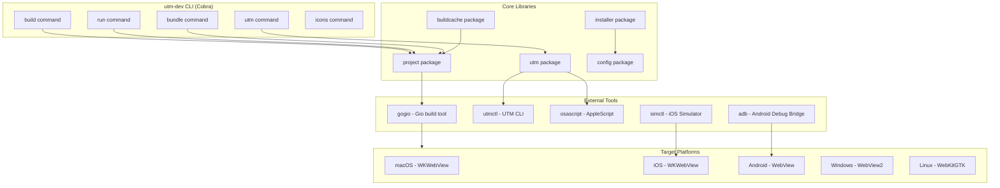
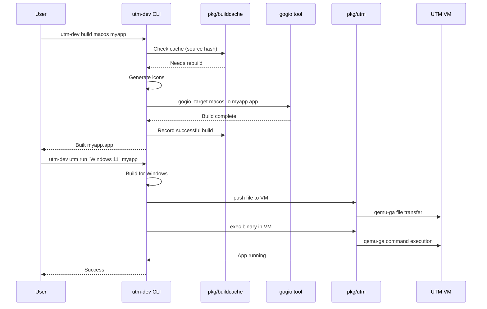

# Project Exploration: utm-dev

## Overview

**utm-dev** is a comprehensive Go-based toolchain for building cross-platform applications using Gio UI and web technologies (HTML/CSS/HTMX/Datastar). The tool enables developers to write code once and deploy to macOS, iOS, Android, Windows, and Linux.

The project's primary innovation is integrating **UTM virtualization** (a macOS VM manager) to enable Windows and Linux development workflows directly from Apple Silicon Macs. This allows developers to test Windows builds natively without leaving their macOS environment.

Key capabilities include:
- Cross-platform Gio app builds with gogio integration
- UTM VM automation via AppleScript and utmctl
- SDK management for Android/iOS toolchains
- Build caching with SHA256 source hashing
- Icon generation for all platforms
- Deep linking support for mobile apps
- Port forwarding and file transfer for VMs

## Repository

- **Location:** `/home/darkvoid/Boxxed/@formulas/src.rust/src.llamacpp/src.GedWeb/utm-dev`
- **Remote:** git@github.com:joeblew999/utm-dev.git
- **Primary Language:** Go
- **License:** MIT (per project conventions)

## Directory Structure

```
utm-dev/
├── cmd/                           # CLI commands (Cobra framework)
│   ├── root.go                    # Main entry point, defines root command
│   ├── build.go                   # Cross-platform build commands
│   ├── run.go                     # Build and run applications
│   ├── utm.go                     # UTM VM management (2000+ lines)
│   ├── bundle.go                  # Create signed app bundles
│   ├── package.go                 # Create distribution archives
│   ├── icons.go                   # Icon generation
│   ├── install.go                 # SDK installation
│   ├── android.go                 # Android-specific commands
│   ├── ios.go                     # iOS-specific commands
│   ├── workspace.go               # Go workspace management
│   └── ...
├── pkg/                           # Core libraries
│   ├── project/                   # Project structure management
│   │   └── project.go             # GioProject type, path resolution
│   ├── utm/                       # UTM integration layer
│   │   ├── utmctl.go              # utmctl command wrapper
│   │   ├── driver.go              # Version-specific driver pattern
│   │   ├── advanced.go            # Port forwarding, export/import
│   │   ├── create.go              # VM creation automation
│   │   ├── osascript.go           # AppleScript execution
│   │   ├── config.go              # UTM configuration
│   │   ├── gallery.go             # VM gallery/templates
│   │   └── install.go             # UTM app installation
│   ├── installer/                 # SDK download and installation
│   │   ├── installer.go           # Main SDK installer
│   │   ├── cache.go               # Download cache
│   │   ├── archive.go             # Archive extraction
│   │   └── garble.go              # Go obfuscation support
│   ├── buildcache/                # Build caching mechanism
│   │   └── cache.go               # SHA256 source hashing
│   ├── config/                    # Configuration and SDK paths
│   │   ├── config.go              # Path resolution, OS-specific dirs
│   │   ├── sdk-android-list.json  # Android SDK definitions
│   │   ├── sdk-ios-list.json      # iOS SDK definitions
│   │   └── sdk-build-tools.json   # Build-tools definitions
│   ├── icons/                     # Icon generation
│   │   ├── generator.go           # Main icon generator
│   │   └── platforms.go           # Platform-specific icon sizes
│   ├── adb/                       # Android Debug Bridge wrapper
│   │   └── adb.go                 # ADB commands for Android
│   ├── simctl/                    # iOS Simulator control
│   │   └── simctl.go              # simctl commands
│   ├── screenshot/                # Screenshot capabilities
│   │   ├── screenshot.go          # robotgo-based capture
│   │   └── cgwindow_darwin.go     # macOS CoreGraphics capture
│   ├── gitignore/                 # .gitignore management
│   ├── logging/                   # Platform-specific logging
│   ├── appconfig/                 # App configuration (app.json)
│   ├── constants/                 # Project constants
│   ├── schema/                    # JSON schema definitions
│   └── utils/                     # Utility functions
├── examples/                      # Example applications
│   ├── gio-basic/                 # Simple Gio app
│   ├── gio-plugin-hyperlink/      # Hyperlink plugin demo
│   ├── gio-plugin-webviewer/      # Multi-tab webviewer
│   └── hybrid-dashboard/          # Full hybrid app with embedded server
├── docs/                          # Documentation
│   ├── adr/                       # Architecture Decision Records
│   ├── agents/                    # Agent dependency guides
│   ├── cli/                       # CLI documentation (generated)
│   ├── IMPROVEMENTS.md            # Roadmap
│   ├── PACKAGING.md               # Packaging system guide
│   ├── WEBVIEW-ANALYSIS.md        # WebView technical analysis
│   └── cicd.md                    # CI/CD configuration
├── .claude/                       # Claude Code configuration
│   └── agents/                    # Agent definitions
│       └── mobile-sdk-golang-expert.md
├── .github/                       # GitHub Actions
│   └── workflows/
│       ├── build.yml
│       ├── release.yml
│       └── demo-release.yml
├── scripts/                       # Utility scripts
├── go.mod                         # Go module definition
├── go.sum                         # Go dependencies
├── main.go                        # Entry point
└── README.md                      # Project documentation
```

## Architecture

### High-Level Diagram



### Component Breakdown

#### CLI Layer (cmd/)
- **Location:** `cmd/`
- **Purpose:** User-facing commands using Cobra framework
- **Dependencies:** pkg/*, spf13/cobra
- **Dependents:** None (top layer)

#### Project Management (pkg/project/)
- **Location:** `pkg/project/project.go`
- **Purpose:** Manages app structure, path resolution, validation
- **Dependencies:** pkg/constants
- **Dependents:** cmd/build.go, cmd/run.go, cmd/bundle.go

#### UTM Integration (pkg/utm/)
- **Location:** `pkg/utm/`
- **Purpose:** Controls UTM virtual machines for Windows/Linux dev
- **Dependencies:** os/exec, filepath, strings
- **Dependents:** cmd/utm.go, cmd/run.go

#### SDK Installer (pkg/installer/)
- **Location:** `pkg/installer/`
- **Purpose:** Downloads and installs Android/iOS SDKs
- **Dependencies:** pkg/config, net/http, archive/tar
- **Dependents:** cmd/install.go, cmd/build.go

#### Build Cache (pkg/buildcache/)
- **Location:** `pkg/buildcache/cache.go`
- **Purpose:** SHA256-based build caching for idempotent builds
- **Dependencies:** crypto/sha256, encoding/json
- **Dependents:** cmd/build.go

## Entry Points

### main.go - Primary Entry Point
- **File:** `main.go`
- **Description:** Initializes and executes the root Cobra command
- **Flow:**
  1. Parse command-line arguments
  2. Execute root command
  3. Cobra routes to subcommand (build, utm, run, etc.)
  4. Subcommand executes pkg/* logic
  5. Return exit code

### cmd/build.go - Build Command
- **File:** `cmd/build.go`
- **Description:** Cross-platform build orchestration
- **Flow:**
  1. Validate platform (macos/android/ios/windows/linux)
  2. Create GioProject from app directory
  3. Check build cache for rebuild necessity
  4. Generate platform-specific icons
  5. Invoke gogio with platform-specific flags
  6. Record successful build in cache

### cmd/utm.go - UTM Management
- **File:** `cmd/utm.go` (2000+ lines)
- **Description:** Complete UTM VM lifecycle management
- **Commands:**
  - `list` - List all VMs
  - `create` - Create VM from gallery template
  - `start/stop` - VM power control
  - `exec` - Execute command in VM
  - `push/pull` - File transfer
  - `port-forward` - Network port forwarding
  - `run` - Build and run app in Windows VM

## Data Flow



## External Dependencies

| Dependency | Version | Purpose |
|------------|---------|---------|
| gioui.org | v0.8.0+ | Core UI framework |
| gioui.org/cmd/gogio | latest | Mobile/desktop build tool |
| github.com/gioui-plugins/gio-plugins | v0.9.1 | Native feature plugins |
| github.com/spf13/cobra | latest | CLI framework |
| github.com/go-vgo/robotgo | latest | Cross-platform automation |
| github.com/schollz/progressbar | v3 | Download progress |

## Configuration

### Environment Variables
- `ANDROID_HOME` / `ANDROID_SDK_ROOT` - Android SDK location
- `ANDROID_NDK_ROOT` - Android NDK location
- `JAVA_HOME` - Java installation for Android builds
- `GOWORK=off` - Disable Go workspaces during builds

### SDK Locations (OS-specific)
| OS | SDK Directory | Cache Directory |
|----|---------------|-----------------|
| macOS | `~/utm-dev-sdks/` | `~/utm-dev-cache/` |
| Linux | `~/.local/share/utm-dev/sdks/` | `~/.cache/utm-dev/` |
| Windows | `%APPDATA%/utm-dev/sdks/` | `%LOCALAPPDATA%/utm-dev/` |

### UTM Requirements
- UTM 4.6+ recommended (export/import support)
- QEMU guest agent required in VMs
- AppleScript automation permission

## Testing

### Test Strategy
- Unit tests in `pkg/*/*_test.go`
- Integration test in `integration_test.go`
- Self-test via `utm-dev self test`

### Running Tests
```bash
go test ./...           # All tests
go test ./pkg/...       # Package tests only
utm-dev self test       # Self-validation
```

## Key Insights

1. **Two-System Design**: utm-dev separates self-building (pkg/self/) from user app building to avoid conflicts.

2. **Idempotent Operations**: Build cache uses SHA256 hashing to skip unnecessary rebuilds.

3. **UTM Driver Pattern**: Version-specific drivers (driver45, driver46) handle UTM feature differences gracefully.

4. **Pure Go Implementation**: No bash scripts or external tools except platform SDKs.

5. **AppleScript Automation**: UTM lacks a public API, so AppleScript is used for VM creation and configuration.

6. **Centralized Path Management**: All paths resolved through pkg/config/ with OS-specific defaults.

7. **gogio Wrapper**: utm-dev enhances gogio with caching, icons, and deep linking support.

## Open Questions

1. **Web/WASM Support**: No clear deployment path for web targets mentioned.

2. **Windows Cross-Compilation**: Limited testing on Windows cross-compile reliability.

3. **Linux WebView**: WebKitGTK dependency management not fully automated.

4. **Code Signing**: Windows and iOS code signing workflows need refinement.

5. **Concurrency**: Current implementation is synchronous; async could improve parallel builds.
