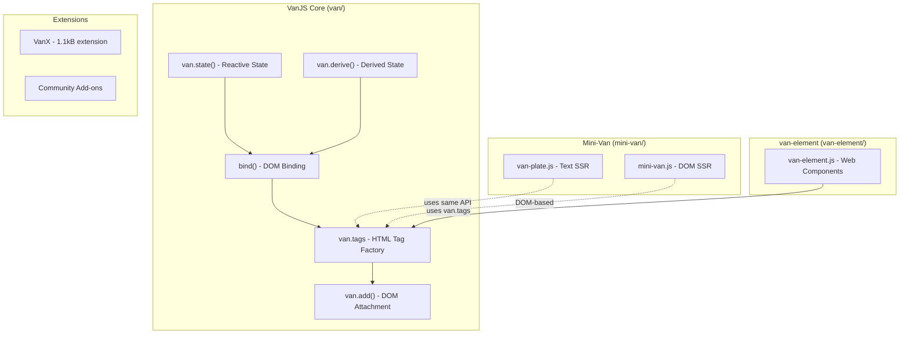
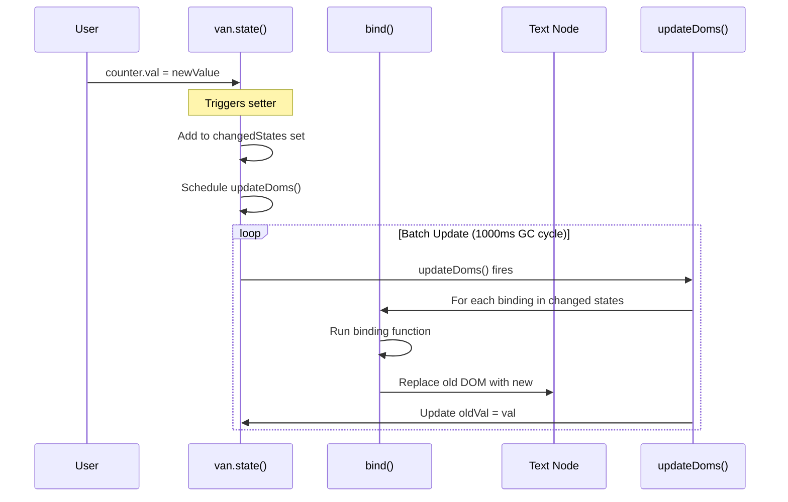
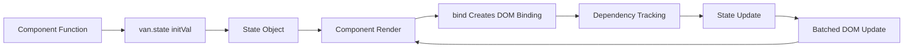
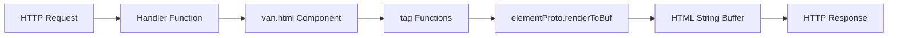

# VanJS Framework Exploration

## Project Overview

**VanJS** is the world's smallest reactive UI framework (1.0kB gzipped). It provides an ultra-lightweight, zero-dependency, and unopinionated approach to building reactive user interfaces using pure vanilla JavaScript and DOM APIs.

### Key Characteristics

- **Ultra-lightweight**: Only 1.0kB gzipped (50-100x smaller than alternatives)
- **Zero dependencies**: No external libraries required
- **No JSX/transpiling**: Write plain JavaScript
- **Reactive**: Built-in state management with `van.state()` and `van.derive()`
- **SSR support**: Via Mini-Van (0.5kB gzipped)
- **Web Components**: Via van-element (300 bytes min+gzip)

### Ecosystem Components

| Component | Description | Size |
|-----------|-------------|------|
| `van` | Core VanJS framework | 1.0kB gzipped |
| `mini-van` | Server-side rendering template engine | 0.5kB gzipped |
| `van-element` | Web Components with VanJS | 300 bytes min+gzip |
| `vanjsHelper` | VS Code extension for IntelliSense | - |
| `converter` | HTML/MD to VanJS code converter | - |
| `vanjs-org.github.io` | Official website/documentation | - |

## Directory Structure

```
src.vanjs/
├── van/                          # Main VanJS framework
│   ├── src/                      # Source files (symlinks to public/)
│   ├── public/                   # All published versions (van-X.Y.Z.*)
│   │   ├── van-1.0.0.js          # Latest version source
│   │   ├── van-1.0.0.min.js      # Minified version
│   │   ├── van-1.0.0.debug.js    # Debug version with error handling
│   │   └── *.nomodule.js         # Non-ES6 module versions
│   ├── addons/                   # Community add-ons
│   │   ├── van_cone/             # SPA framework add-on
│   │   ├── van_dml/              # Alternative composition flavor
│   │   ├── van_element/          # Web Components (see van-element/)
│   │   └── van_jsx/              # JSX wrapper
│   ├── components/               # VanUI - reusable components
│   ├── x/                        # VanX - official extension (1.1kB)
│   ├── converter/                # HTML/MD to VanJS converter
│   ├── test/                     # Test files
│   ├── demo/                     # Demo applications
│   ├── doc/                      # Documentation assets
│   └── README.md                 # Main documentation
│
├── mini-van/                     # Server-side rendering
│   ├── src/
│   │   ├── mini-van.js           # Main mini-van source (48 lines)
│   │   ├── van-plate.js          # Text-based SSR (no DOM needed)
│   │   └── shared.js             # Shared utilities
│   ├── bench/                    # Performance benchmarks
│   └── README.md
│
├── van-element/                  # Web Components
│   ├── src/
│   │   └── van-element.js        # Core implementation
│   ├── docs/
│   │   ├── intro/                # Getting started docs
│   │   └── learn/                # Tutorial documentation
│   └── README.md
│
├── vanjsHelper/                  # VS Code extension
│   ├── src/                      # Extension source
│   └── README.md
│
├── converter/                    # HTML/MD converter library
│   ├── src/                      # Converter source
│   └── README.md
│
└── vanjs-org.github.io/          # Official website
    ├── codegen/                  # Site generation code
    └── converter-ui/             # Web UI for converter
```

## Architecture

### Core Architecture Diagram



### Reactive System Architecture



## Component Breakdown

### 1. VanJS Core (`van/`)

The main framework providing reactive UI capabilities.

#### Key Exports (from van-1.0.0.js)

```javascript
export default {
  add,           // Attach children to DOM element
  _,             // Mark function as binding (for derived props)
  tags,          // HTML tag factory (Proxy-based)
  tagsNS,        // Namespace-aware tag factory
  state,         // Create reactive state
  val,           // Get state value (with dependency tracking)
  oldVal,        // Get old state value
  derive,        // Create derived/computed state
}
```

#### How `van.state()` Works

The reactive state system uses:

1. **State Object**: Plain object with special prototype (`stateProto`)
   ```javascript
   let state = initVal => ({
     __proto__: stateProto,
     _val: initVal,
     _oldVal: initVal,
     _bindings: [],
     _listeners: [],
   })
   ```

2. **Getter with Dependency Tracking**: When reading `state.val`, the getter adds the state to `curDeps` set
   ```javascript
   get val() {
     curDeps?.add(this)
     return this._val
   }
   ```

3. **Setter with Change Detection**: When writing `state.val = newValue`, it:
   - Notifies all listeners (derived states)
   - Schedules DOM updates via `updateDoms()`
   - Tracks changed states for batch updates

4. **Binding System**: `bind()` creates reactive DOM bindings
   - Tracks dependencies during function execution
   - Re-runs when dependencies change
   - Updates DOM efficiently

#### How `van.derive()` Works

Creates computed/derived state that automatically updates when dependencies change:

```javascript
let derive = (f, s = state()) => {
  let deps = new Set, listener = {f, _deps: deps, s}
  s.val = runAndCaptureDeps(f, deps)  // Run function, track deps
  for (let d of deps) d._listeners.push(listener)
  return s
}
```

### 2. Mini-Van (`mini-van/`)

Server-side rendering template engine with two modes:

#### `van-plate` Mode (Text-based SSR)

- **No DOM dependency** - Pure text templating
- Works with Node.js, Bun, Deno out of the box
- Elements have `render()` method returning HTML string

```javascript
// van-plate.js core structure
const elementProto = {
  renderToBuf(buf) {
    buf.push(`<${this.name}${this.propsStr}>`)
    // Render children...
    buf.push(`</${this.name}>`)
  },
  render() {
    const buf = []
    this.renderToBuf(buf)
    return buf.join("")
  }
}
```

Key exports:
```javascript
export default {
  add, tags, state, derive,
  html: (...args) => {
    const buf = ["<!DOCTYPE html>"]
    tags.html(...args).renderToBuf(buf)
    return buf.join("")
  }
}
```

#### `mini-van` Mode (DOM-based SSR)

- Requires external DOM implementation (jsdom, deno-dom)
- Uses real DOM objects, can call `.outerHTML`
- More compatible with browser behavior

```javascript
// Usage with jsdom
import jsdom from "jsdom"
import van from "mini-van-plate"

const dom = new jsdom.JSDOM("")
const {html, tags} = van.vanWithDoc(dom.window.document)
```

### 3. van-element (`van-element/`)

Web Components integration with VanJS.

#### Core Implementation (40 lines, 300 bytes min+gzip)

```javascript
// Simplified van-element structure
import van from "vanjs-core";

export const define = (name, componentFn, options = {}) => {
  class VanElement extends HTMLElement {
    constructor() {
      super();
      if (options.shadow) this.attachShadow(options.shadow);
    }
    connectedCallback() {
      // Render VanJS component into element
      const result = componentFn(this);
      van.add(this.shadowRoot || this, result);
    }
  }
  customElements.define(name, VanElement);
};
```

#### Usage Example

```javascript
import van from "vanjs-core";
import { define } from "vanjs-element";

const { button, div, slot } = van.tags;

define("custom-counter", () => {
  const counter = van.state(0);
  return div(
    slot(),
    counter,
    button({ onclick: () => ++counter.val }, "+"),
    button({ onclick: () => --counter.val }, "-")
  );
});
```

```html
<custom-counter>❤️</custom-counter>
```

## Entry Points

### Client-Side (Browser)

```javascript
// ES6 Module
import van from "https://cdn.jsdelivr.net/gh/vanjs-org/van/public/van-1.0.2.min.js"

// Or non-module script tag
<script src="van-1.0.2.nomodule.min.js"></script>
```

### Server-Side (Node.js/Bun)

```javascript
// Mini-Van van-plate mode (no DOM needed)
import van from "mini-van-plate/van-plate"

// Mini-Van DOM mode (needs jsdom)
import van from "mini-van-plate"
```

### NPM Packages

| Package | Command |
|---------|---------|
| VanJS core | `npm install vanjs-core` |
| Mini-Van | `npm install mini-van-plate` |
| Van Element | `npm install vanjs-element` |
| VanJS Converter | `npm install vanjs-converter` |

## Data Flow

### Reactive State Flow



### SSR Flow (van-plate)



## External Dependencies

### VanJS Core
- **Zero dependencies** - Pure vanilla JavaScript

### Mini-Van
- **van-plate mode**: Zero dependencies
- **mini-van mode**: Requires DOM implementation
  - Node.js: `jsdom`
  - Deno: `deno-dom`
  - Bun: Native DOM or `jsdom`

### van-element
- `vanjs-core` (peer dependency)

### Converter
- `html-dom-parser`
- `marked` (for MD conversion)

## Configuration

### Tag Functions

VanJS uses Proxy-based tag functions for creating HTML elements:

```javascript
const { div, p, button, a } = van.tags

// Usage:
div({ class: "container" }, p("Hello"))
```

### Namespace Support

```javascript
const svgTags = van.tagsNS("http://www.w3.org/2000/svg")
const { circle, rect } = svgTags
```

### Property Binding

```javascript
// Regular attribute
div({ id: "myDiv" })

// Property binding (for DOM properties)
input({ value: van.state("") })

// Event handlers
button({ onclick: () => counter.val++ })

// Derived property binding
div({ class: _(() => counter.val > 0 ? "active" : "") })
```

## Testing

### Test Structure

```
van/test/
├── *.test.js    # Test files
```

The project uses basic JavaScript tests. VanJS's simplicity means minimal test infrastructure is needed.

### Testing Approach

1. Direct DOM manipulation verification
2. State update tests
3. Binding tests for reactive updates
4. SSR output verification (mini-van)

## Key Insights

### 1. Bundle Size Optimization

The codebase uses several techniques to minimize bundle size:

- Uses `let` instead of `const` (saves bytes in minified output)
- Aliases frequently used symbols (`protoOf = Object.getPrototypeOf`)
- Single-letter variable names in production builds
- Flat object prototypes for minimal overhead

### 2. Reactive System Design

VanJS uses a **pull-based** reactive system:

- Dependencies are tracked during function execution (`curDeps`)
- Changes trigger batched updates (not immediate)
- GC cycle runs every 1000ms to clean up disconnected bindings

### 3. No Virtual DOM

Unlike React, VanJS:

- Directly manipulates real DOM
- Uses fine-grained reactivity (only updates changed text nodes)
- No reconciliation overhead

### 4. SSR Strategy

Mini-Van provides two SSR approaches:

- **van-plate**: Text-based, no DOM, faster, lighter
- **mini-van**: DOM-based, more compatible, needs jsdom

### 5. Web Components Integration

van-element demonstrates how VanJS can work with native web standards:

- Uses Custom Elements API
- Optional Shadow DOM support
- Automatic hydration of VanJS state

## Open Questions

1. **State Persistence**: How does VanJS handle state persistence across page navigations (SPA routing)?
   - Answer: VanX extension provides serialization support

2. **Large List Performance**: How does VanJS handle rendering large lists efficiently?
   - VanX provides reactive list with optimized rendering

3. **TypeScript Integration**: What are the type definitions like?
   - `.d.ts` files are provided in public/ directory

4. **Hydration Process**: How does client-side hydration work after SSR?
   - `van.hydrate()` function for syncing server-rendered HTML with client state

5. **Memory Management**: How are detached bindings cleaned up?
   - GC cycle runs every 1000ms, filters bindings where `dom?.isConnected` is false

## API Reference Summary

### Core Functions

| Function | Description |
|----------|-------------|
| `van.state(initVal)` | Create reactive state |
| `van.derive(fn)` | Create computed state |
| `van.tags` | HTML tag factory Proxy |
| `van.add(parent, ...children)` | Append children to DOM |
| `van.bind(fn)` | Create reactive DOM binding |
| `van.val(state)` | Get state value with tracking |
| `van.oldVal(state)` | Get previous state value |

### Mini-Van

| Function | Description |
|----------|-------------|
| `van.html(...children)` | Generate full HTML document |
| `element.render()` | Render element to HTML string |
| `van.vanWithDoc(doc)` | Initialize with custom Document |

### van-element

| Function | Description |
|----------|-------------|
| `define(name, fn, options)` | Define custom element |

## See Also

- [VanJS Official Tutorial](https://vanjs.org/tutorial)
- [VanX Extension](https://vanjs.org/x) - Advanced features
- [Mini-Van Benchmarks](./mini-van/bench/README.md) - Performance comparisons
- [Community Add-ons](./van/addons/README.md)
