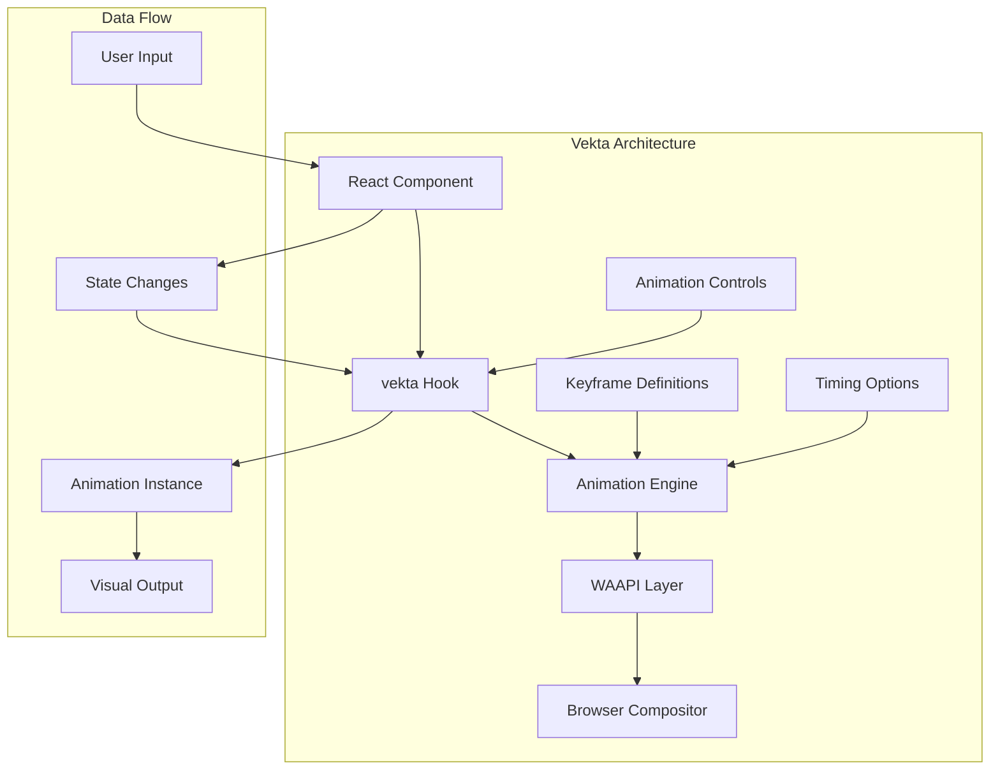
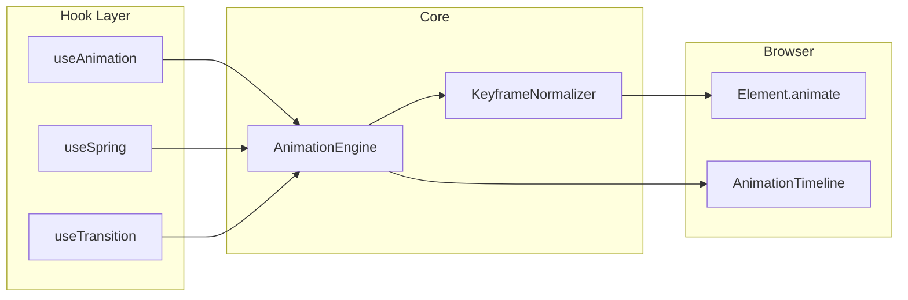
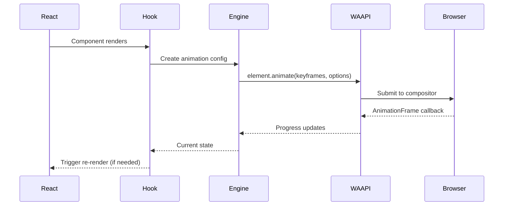
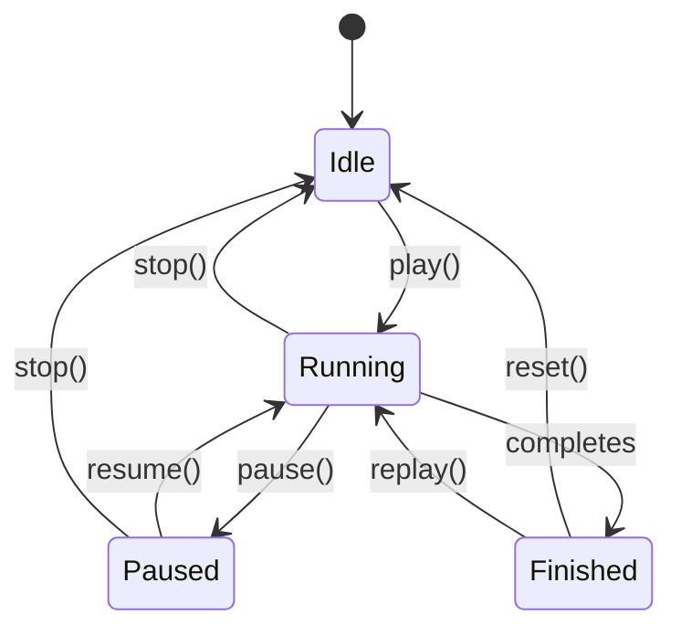
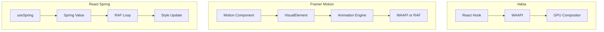

# Vekta Animation Library - Technical Exploration

**Category:** React Animation Utilities
**Package Size:** ~2KB (minified + gzip)

---

## Table of Contents

1. [Project Overview](#project-overview)
2. [Architecture](#architecture)
3. [Core Animation System](#core-animation-system)
4. [API Design](#api-design)
5. [Performance](#performance)
6. [Unique Features](#unique-features)
7. [Code Examples](#code-examples)
8. [Comparison with Other Libraries](#comparison-with-other-libraries)

---

## Project Overview

### What is Vekta?

Vekta is a lightweight, React-focused animation library built on top of the Web Animations API (WAAPI). It provides a declarative way to create animations in React applications while maintaining the performance benefits of native browser animations.

### Philosophy

Vekta follows a minimalistic philosophy:
- **Zero runtime overhead** - Leverages native WAAPI
- **React-first design** - Built specifically for React's component model
- **TypeScript-first** - Full type safety out of the box
- **Composable** - Small, focused primitives that compose well

### Installation

```bash
npm install vekta
# or
yarn add vekta
```

---

## Architecture

### High-Level Architecture



### Module Structure

```
vekta/
├── src/
│   ├── index.ts              # Main exports
│   ├── use-animation.ts      # Core hook
│   ├── use-spring.ts         # Spring physics hook
│   ├── use-transition.ts     # Transition hook
│   ├── utils/
│   │   ├── normalize.ts      # Keyframe normalization
│   │   ├── easing.ts         # Easing utilities
│   │   └── timing.ts         # Timing helpers
│   └── types/
│       └── index.ts          # TypeScript definitions
└── package.json
```

### Component Hierarchy



---

## Core Animation System

### Animation Engine Architecture

Vekta's animation engine is built around a simple but powerful concept: **animations as reactive values**.

#### The Animation Lifecycle



### Keyframe Processing Pipeline

```typescript
// Simplified keyframe processing flow
interface KeyframeInput {
  from: Record<string, any>;
  to: Record<string, any>;
  duration?: number;
  easing?: string;
}

function processKeyframes(input: KeyframeInput): Keyframe[] {
  // 1. Extract all animated properties
  const properties = new Set([
    ...Object.keys(input.from),
    ...Object.keys(input.to)
  ]);

  // 2. Normalize values (handle different units, etc.)
  const normalized = normalizeValues(input.from, input.to);

  // 3. Generate keyframe array
  const keyframes = [
    normalized.from,  // 0% keyframe
    normalized.to     // 100% keyframe
  ];

  return keyframes;
}
```

### Timing and Easing

Vekta supports all standard CSS easing functions plus custom cubic-bezier curves:

```typescript
type Easing =
  | 'linear'
  | 'ease'
  | 'ease-in'
  | 'ease-out'
  | 'ease-in-out'
  | `cubic-bezier(${number}, ${number}, ${number}, ${number})`
  | `steps(${number})`
  | string[];  // Custom easing steps

interface TimingOptions {
  duration?: number;        // milliseconds
  delay?: number;           // milliseconds
  easing?: Easing;
  iterations?: number;      // Number of repetitions
  direction?: 'normal' | 'reverse' | 'alternate' | 'alternate-reverse';
  fill?: 'none' | 'forwards' | 'backwards' | 'both';
}
```

#### Easing Visualization

```
Easing Progress Over Time:

linear          ┌───────────────┐
               /
              /
             /
            /
           └───────────────────┘

ease-in         ┌───────────────┐
                │
                │           ┌───┘
                │       ┌───┘
                │   ┌───┘
                └───┘           ┘

ease-out        ┌───────────────┐
                └───┐
                    └───┐
                        └───┐
                            └───┘

ease-in-out   ┌───────────────┐
                ┌───┐
              ──┘   └───
                      └───┐
                          └───┘
```

### Value Interpolation

Vekta handles interpolation of various value types:

```typescript
type AnimatableValue =
  | number
  | string
  | Array<number | string>
  | { [key: string]: AnimatableValue };

// Interpolation strategies per type
const interpolators = {
  // Numeric interpolation
  number: (from: number, to: number, progress: number) =>
    from + (to - from) * progress,

  // Color interpolation (RGB/RGBA/HSL)
  color: (from: Color, to: Color, progress: number) =>
    interpolateColor(from, to, progress),

  // Transform interpolation (matrix decomposition)
  transform: (from: Transform, to: Transform, progress: number) =>
    interpolateTransform(from, to, progress),

  // String with embedded numbers (e.g., "10px")
  string: (from: string, to: string, progress: number) =>
    interpolateString(from, to, progress),

  // Array interpolation
  array: (from: any[], to: any[], progress: number) =>
    from.map((v, i) => interpolate(v, to[i], progress)),
};
```

### RAF/WAAPI Usage

Vekta strategically uses both requestAnimationFrame and Web Animations API:

```typescript
// WAAPI for CSS property animations (GPU accelerated)
function createWAAPIAnimation(
  element: HTMLElement,
  keyframes: Keyframe[],
  options: TimingOptions
): Animation {
  return element.animate(keyframes, {
    duration: options.duration,
    delay: options.delay,
    easing: options.easing,
    iterations: options.iterations,
    direction: options.direction,
    fill: options.fill,
  });
}

// RAF for complex value calculations (spring physics, etc.)
function createRAFBasedAnimation(
  tick: (progress: number) => void,
  duration: number
): () => void {
  let startTime: number | null = null;
  let animationFrame: number;

  function loop(timestamp: number) {
    if (!startTime) startTime = timestamp;
    const elapsed = timestamp - startTime;
    const progress = Math.min(elapsed / duration, 1);

    tick(progress);

    if (progress < 1) {
      animationFrame = requestAnimationFrame(loop);
    }
  }

  animationFrame = requestAnimationFrame(loop);

  return () => cancelAnimationFrame(animationFrame);
}
```

#### WAAPI Feature Detection

```typescript
function supportsWAAPI(): boolean {
  return typeof Element !== 'undefined' &&
         typeof Element.prototype.animate === 'function';
}

function supportsCSSProperties(): boolean {
  return typeof CSS !== 'undefined' &&
         typeof CSS.supports === 'function' &&
         CSS.supports('animation-timeline: scroll()');
}
```

---

## API Design

### How Animations Are Created

Vekta provides a hook-based API for creating animations:

#### Basic Usage

```tsx
import { useAnimation } from 'vekta';

function AnimatedComponent() {
  const [ref, animate] = useAnimation({
    from: { opacity: 0, transform: 'translateY(20px)' },
    to: { opacity: 1, transform: 'translateY(0)' },
    duration: 500,
    easing: 'ease-out',
  });

  return (
    <div ref={ref}>
      Animated Content
    </div>
  );
}
```

#### Manual Control

```tsx
function ControlledAnimation() {
  const [ref, controls] = useAnimation({
    from: { scale: 1 },
    to: { scale: 1.2 },
    duration: 300,
  });

  return (
    <>
      <button onClick={() => controls.play()}>Play</button>
      <button onClick={() => controls.pause()}>Pause</button>
      <button onClick={() => controls.reverse()}>Reverse</button>
      <button onClick={() => controls.stop()}>Stop</button>
      <div ref={ref}>Content</div>
    </>
  );
}
```

### Chaining and Composition

#### Sequence Builder

```tsx
import { sequence } from 'vekta';

function SequentialAnimations() {
  const [ref, animate] = useAnimation();

  useEffect(() => {
    const animations = sequence([
      [animate, { opacity: 1 }, { duration: 300 }],
      [animate, { scale: 1.1 }, { duration: 200 }],
      [animate, { scale: 1 }, { duration: 200 }],
    ]);

    animations.play();
  }, []);

  return <div ref={ref}>Sequence</div>;
}
```

#### Parallel Animations

```tsx
import { parallel } from 'vekta';

function ParallelAnimations() {
  const [ref1, animate1] = useAnimation();
  const [ref2, animate2] = useAnimation();

  useEffect(() => {
    const animations = parallel([
      [animate1, { x: 100 }, { duration: 500 }],
      [animate2, { y: 100 }, { duration: 500 }],
    ]);

    animations.play();
  }, []);

  return (
    <>
      <div ref={ref1}>Element 1</div>
      <div ref={ref2}>Element 2</div>
    </>
  );
}
```

#### Stagger Helper

```tsx
function StaggeredList({ items }) {
  return (
    <ul>
      {items.map((item, index) => (
        <StaggeredItem
          key={item.id}
          item={item}
          index={index}
          total={items.length}
        />
      ))}
    </ul>
  );
}

function StaggeredItem({ item, index, total }) {
  const [ref, animate] = useAnimation({
    from: { opacity: 0, y: 20 },
    to: { opacity: 1, y: 0 },
    duration: 300,
    delay: index * 50, // Stagger delay
    easing: 'ease-out',
  });

  return (
    <li ref={ref}>{item.name}</li>
  );
}
```

### State Management

#### Internal State Machine



#### Animation State Hook

```typescript
interface AnimationState {
  isIdle: boolean;
  isRunning: boolean;
  isPaused: boolean;
  isFinished: boolean;
  progress: number;          // 0-1
  currentTime: number;       // ms
  remainingTime: number;     // ms
  playState: AnimationPlayState;
}

function useAnimationState(animation: Animation | null): AnimationState {
  const [state, setState] = useState<AnimationState>({
    isIdle: true,
    isRunning: false,
    isPaused: false,
    isFinished: false,
    progress: 0,
    currentTime: 0,
    remainingTime: 0,
    playState: 'idle',
  });

  useEffect(() => {
    if (!animation) return;

    function updateState() {
      setState({
        isIdle: animation.playState === 'idle',
        isRunning: animation.playState === 'running',
        isPaused: animation.playState === 'paused',
        isFinished: animation.finished,
        progress: animation.currentTime / animation.effect?.getTiming().duration || 0,
        currentTime: animation.currentTime,
        remainingTime: (animation.effect?.getTiming().duration || 0) - animation.currentTime,
        playState: animation.playState,
      });
    }

    updateState();

    animation.addEventListener('finish', updateState);
    animation.addEventListener('cancel', updateState);

    return () => {
      animation.removeEventListener('finish', updateState);
      animation.removeEventListener('cancel', updateState);
    };
  }, [animation]);

  return state;
}
```

---

## Performance

### Optimizations

#### 1. GPU-Accelerated Properties

Vekta automatically promotes elements to their own compositing layer for animating transform and opacity:

```typescript
function willChangeTransform(element: HTMLElement): void {
  // Tell browser we'll be animating transform
  element.style.willChange = 'transform';

  // Cleanup after animation
  return () => {
    element.style.willChange = 'auto';
  };
}

// Automatically applied to animated elements
const GPU_OPTIMIZED_PROPERTIES = ['transform', 'opacity'];
```

#### 2. Batched DOM Reads/Writes

```typescript
class AnimationBatcher {
  private readQueue: Array<() => void> = [];
  private writeQueue: Array<() => void> = [];
  private isFlushing = false;

  scheduleRead(read: () => void): void {
    this.readQueue.push(read);
    this.scheduleFlush();
  }

  scheduleWrite(write: () => void): void {
    this.writeQueue.push(write);
    this.scheduleFlush();
  }

  private scheduleFlush(): void {
    if (this.isFlushing) return;
    this.isFlushing = true;

    requestAnimationFrame(() => {
      // Execute all reads first
      while (this.readQueue.length) {
        this.readQueue.shift()!();
      }

      // Then execute all writes
      while (this.writeQueue.length) {
        this.writeQueue.shift()!();
      }

      this.isFlushing = false;
    });
  }
}
```

#### 3. Animation Cancellation

```typescript
function useAnimationCleanup(animationRef: React.MutableRefObject<Animation | null>) {
  useEffect(() => {
    return () => {
      const animation = animationRef.current;
      if (animation && animation.playState !== 'finished') {
        animation.cancel();
      }
    };
  }, []);
}
```

### Batched Updates

Vekta batches multiple animation updates:

```typescript
interface BatchedAnimationUpdate {
  element: HTMLElement;
  keyframes: Keyframe[];
  options: TimingOptions;
}

function batchAnimations(updates: BatchedAnimationUpdate[]): void {
  requestAnimationFrame(() => {
    updates.forEach(({ element, keyframes, options }) => {
      element.animate(keyframes, options);
    });
  });
}

// Usage
const batch = [
  { element: el1, keyframes: [{ opacity: 0 }, { opacity: 1 }], options: { duration: 300 } },
  { element: el2, keyframes: [{ opacity: 0 }, { opacity: 1 }], options: { duration: 300 } },
  { element: el3, keyframes: [{ opacity: 0 }, { opacity: 1 }], options: { duration: 300 } },
];

batchAnimations(batch);
```

### Memory Management

#### WeakRef for Element References

```typescript
class AnimationRegistry {
  // Use WeakRef to avoid memory leaks
  private elementAnimations = new WeakMap<HTMLElement, Set<Animation>>();

  register(element: HTMLElement, animation: Animation): void {
    let animations = this.elementAnimations.get(element);
    if (!animations) {
      animations = new Set();
      this.elementAnimations.set(element, animations);
    }
    animations.add(animation);
  }

  cleanup(element: HTMLElement): void {
    const animations = this.elementAnimations.get(element);
    if (animations) {
      animations.forEach(anim => anim.cancel());
      this.elementAnimations.delete(element);
    }
  }
}
```

#### Animation Pool

```typescript
class AnimationPool {
  private pool: Animation[] = [];
  private maxSize = 10;

  acquire(): Animation | null {
    return this.pool.pop() || null;
  }

  release(animation: Animation): void {
    if (this.pool.length < this.maxSize) {
      animation.cancel();
      this.pool.push(animation);
    }
  }

  clear(): void {
    while (this.pool.length) {
      this.pool.pop();
    }
  }
}
```

---

## Unique Features

### 1. React Ref Integration

Vekta's signature feature is seamless React ref integration:

```tsx
// Single line animation setup
const [ref, animate] = useAnimation(config);

// Use ref on any element
return <div ref={ref}>Animated</div>;
```

### 2. Type-Safe Keyframes

```typescript
// Full TypeScript support for CSS properties
interface CSSProperties {
  transform?: string;
  opacity?: number;
  width?: string | number;
  height?: string | number;
  // ... all CSS properties
}

type AnimatableProps = {
  [K in keyof CSSProperties]?: CSSProperties[K];
};
```

### 3. Scroll-Linked Animations

```tsx
import { useScrollAnimation } from 'vekta';

function ScrollAnimated() {
  const [ref, state] = useScrollAnimation({
    from: { opacity: 0, y: 50 },
    to: { opacity: 1, y: 0 },
    threshold: 0.2, // Trigger at 20% visibility
  });

  return (
    <div ref={ref}>
      Animates when scrolled into view
    </div>
  );
}
```

### 4. Spring Physics

```tsx
import { useSpring } from 'vekta';

function SpringAnimation() {
  const [ref, spring] = useSpring({
    from: { x: 0 },
    to: { x: 100 },
    stiffness: 100,
    damping: 15,
    mass: 1,
  });

  return <div ref={ref}>Spring</div>;
}
```

### 5. Orchestration Primitives

```typescript
// Timeline-like API
const timeline = [
  [0, animate, { x: 100 }],     // Start at 0ms
  [200, animate, { y: 100 }],   // Start at 200ms
  [400, animate, { rotate: 45 }], // Start at 400ms
];

useTimeline(timeline);
```

---

## Code Examples

### Complete Example: Card Flip

```tsx
import React, { useState } from 'react';
import { useAnimation, parallel } from 'vekta';

interface CardProps {
  front: React.ReactNode;
  back: React.ReactNode;
}

export function Card({ front, back }: CardProps) {
  const [isFlipped, setIsFlipped] = useState(false);
  const [frontRef, frontAnimate] = useAnimation();
  const [backRef, backAnimate] = useAnimation();

  const handleFlip = async () => {
    const newFlippedState = !isFlipped;

    // Animate out
    await parallel([
      [frontAnimate, {
        transform: 'rotateY(90deg)',
        opacity: 0
      }, { duration: 200 }],
      [backAnimate, {
        transform: 'rotateY(-90deg)',
        opacity: 0
      }, { duration: 200 }]
    ]).play();

    setIsFlipped(newFlippedState);

    // Animate in
    parallel([
      [frontAnimate, {
        transform: `rotateY(${newFlippedState ? 90 : -90}deg)`,
        opacity: 0
      }, { duration: 0 }],
      [backAnimate, {
        transform: `rotateY(${newFlippedState ? -90 : 90}deg)`,
        opacity: 0
      }, { duration: 0 }]
    ]).play();

    await parallel([
      [frontAnimate, {
        transform: 'rotateY(0deg)',
        opacity: 1
      }, { duration: 200 }],
      [backAnimate, {
        transform: 'rotateY(0deg)',
        opacity: 1
      }, { duration: 200 }]
    ]).play();
  };

  return (
    <div className="card" onClick={handleFlip}>
      <div ref={frontRef} className="card-face front">
        {front}
      </div>
      <div ref={backRef} className="card-face back">
        {back}
      </div>
    </div>
  );
}
```

### Modal Animation

```tsx
import React, { useEffect } from 'react';
import { useAnimation, sequence } from 'vekta';

interface ModalProps {
  isOpen: boolean;
  onClose: () => void;
  children: React.ReactNode;
}

export function Modal({ isOpen, onClose, children }: ModalProps) {
  const [overlayRef, overlayAnimate] = useAnimation({
    from: { opacity: 0 },
    to: { opacity: 1 },
    duration: 200,
  });

  const [contentRef, contentAnimate] = useAnimation({
    from: { opacity: 0, scale: 0.9, y: 20 },
    to: { opacity: 1, scale: 1, y: 0 },
    duration: 300,
    easing: 'cubic-bezier(0.4, 0, 0.2, 1)',
  });

  useEffect(() => {
    if (isOpen) {
      sequence([
        [overlayAnimate, { opacity: 1 }, { duration: 200 }],
        [contentAnimate, { opacity: 1, scale: 1, y: 0 }, { duration: 300 }]
      ]).play();
    } else {
      sequence([
        [contentAnimate, { opacity: 0, scale: 0.9, y: 20 }, { duration: 200 }],
        [overlayAnimate, { opacity: 0 }, { duration: 150 }]
      ]).play().then(onClose);
    }
  }, [isOpen]);

  if (!isOpen) return null;

  return (
    <div
      ref={overlayRef}
      className="modal-overlay"
      onClick={onClose}
    >
      <div
        ref={contentRef}
        className="modal-content"
        onClick={e => e.stopPropagation()}
      >
        {children}
      </div>
    </div>
  );
}
```

### Staggered List

```tsx
import React from 'react';
import { useAnimation } from 'vekta';

interface StaggeredListProps {
  items: string[];
}

export function StaggeredList({ items }: StaggeredListProps) {
  return (
    <ul className="staggered-list">
      {items.map((item, index) => (
        <StaggeredItem
          key={item}
          text={item}
          index={index}
          total={items.length}
        />
      ))}
    </ul>
  );
}

interface StaggeredItemProps {
  text: string;
  index: number;
  total: number;
}

function StaggeredItem({ text, index, total }: StaggeredItemProps) {
  const [ref, animate] = useAnimation({
    from: {
      opacity: 0,
      x: -20,
      scale: 0.8
    },
    to: {
      opacity: 1,
      x: 0,
      scale: 1
    },
    duration: 400,
    delay: index * 50,
    easing: 'cubic-bezier(0.4, 0, 0.2, 1)',
  });

  return (
    <li
      ref={ref}
      style={{
        transformOrigin: 'left center'
      }}
    >
      {text}
    </li>
  );
}
```

---

## Comparison with Other Libraries

### Feature Comparison Matrix

| Feature | Vekta | Framer Motion | React Spring | GSAP |
|---------|-------|---------------|--------------|------|
| **Bundle Size** | ~2KB | ~15KB | ~13KB | ~17KB (core) |
| **Rendering** | WAAPI | Mixed | RAF | RAF |
| **React Integration** | Hooks | Components/Hooks | Hooks | Imperative |
| **TypeScript** | First-class | Excellent | Good | Good |
| **Spring Physics** | Basic | Yes | Advanced | Yes |
| **Timeline** | Basic | Advanced | Basic | Advanced |
| **SVG Animation** | Limited | Full | Full | Full |
| **Scroll Linking** | Basic | Advanced | Plugin | Plugin |
| **Layout Animation** | No | Yes | Yes | Yes |
| **Browser Support** | Modern only | Modern | Universal | Universal |

### Architectural Differences



### When to Use Vekta

**Choose Vekta when:**
- You need minimal bundle size
- You only target modern browsers
- You want simple, declarative animations
- You prefer hook-based API
- Performance is critical (WAAPI runs on compositor)

**Choose alternatives when:**
- You need complex timeline orchestration (GSAP)
- You need layout animations (Framer Motion)
- You need spring physics with complex interactions (React Spring)
- You need broad browser support (GSAP)

---

## Appendix: API Reference

### useAnimation Hook

```typescript
function useAnimation(
  config?: AnimationConfig
): [RefCallback, AnimationControls]

interface AnimationConfig {
  from: Record<string, any>;
  to: Record<string, any>;
  duration?: number;
  delay?: number;
  easing?: Easing;
  iterations?: number;
}

interface AnimationControls {
  play: () => Promise<void>;
  pause: () => void;
  resume: () => void;
  reverse: () => void;
  stop: () => void;
  finish: () => void;
  cancel: () => void;
}
```

### useSpring Hook

```typescript
function useSpring(
  config: SpringConfig
): [RefCallback, SpringControls]

interface SpringConfig {
  from: Record<string, number>;
  to: Record<string, number>;
  stiffness?: number;
  damping?: number;
  mass?: number;
  velocity?: number;
}
```

### Utility Functions

```typescript
// Sequence animations
function sequence(
  animations: [AnimationControls, Record<string, any>, TimingOptions][]
): AnimationControls;

// Parallel animations
function parallel(
  animations: [AnimationControls, Record<string, any>, TimingOptions][]
): AnimationControls;

// Create reusable animation
function createAnimation(
  config: AnimationConfig
): (element: HTMLElement) => Animation;
```

---

## References

- [WAAPI Specification](https://www.w3.org/TR/web-animations-1/)
- [Vekta GitHub Repository](https://github.com/Andarist/vekta)
- [MDN: Web Animations API](https://developer.mozilla.org/en-US/docs/Web/API/Web_Animations_API)
- [CSS Properties and Values API](https://drafts.css-houdini.org/docs/)

---

*Document generated as part of animation library exploration series - 2026-03-20*
