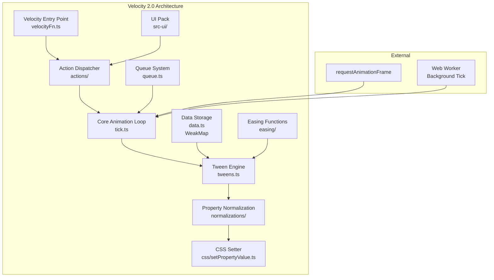
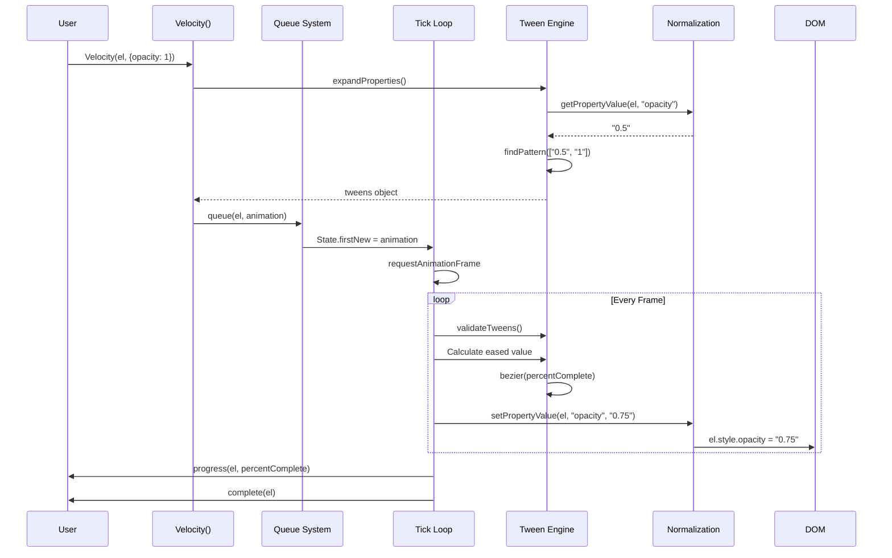

# Project Exploration: Velocity 2.0

## Overview

Velocity is a high-performance JavaScript animation library designed as a faster, feature-rich alternative to jQuery's `$.animate()`. It accelerates UI animations through optimized tweening, bezier curve easing, and intelligent queue management. Velocity is used by major companies including WhatsApp, Tumblr, Windows, Samsung, and Uber.

Version 2.0 represents a complete TypeScript refactor from version 1.x, providing type safety and improved code organization while maintaining backward compatibility with the Velocity 1.x API.

## Repository

- **Location:** `/home/darkvoid/Boxxed/@formulas/src.UIFrameworks/src.animations/velocity`
- **Remote:** `julianshapiro/velocity` (GitHub)
- **Primary Language:** TypeScript
- **License:** MIT License
- **Version:** 2.0.6

## Directory Structure

```
velocity/
├── src/                          # Main source code
│   ├── Velocity/                 # Core engine (TypeScript)
│   │   ├── actions/              # Velocity commands (animate, stop, pause, etc.)
│   │   │   ├── _all.ts
│   │   │   ├── actions.ts        # Action registration system
│   │   │   ├── finish.ts         # Finish animation command
│   │   │   ├── option.ts         # Option getter/setter
│   │   │   ├── pauseResume.ts    # Pause/resume functionality
│   │   │   ├── property.ts       # Property manipulation
│   │   │   ├── reverse.ts        # Reverse animation
│   │   │   ├── stop.ts           # Stop animation
│   │   │   ├── style.ts          # Style operations
│   │   │   └── tween.ts          # Manual tween control
│   │   ├── css/                  # CSS property handling
│   │   │   ├── _all.ts
│   │   │   ├── augmentDimension.ts
│   │   │   ├── colors.ts         # Color name registry (147 colors)
│   │   │   ├── fixColors.ts      # Color format normalization
│   │   │   ├── getPropertyValue.ts
│   │   │   ├── removeNestedCalc.ts
│   │   │   └── setPropertyValue.ts
│   │   ├── easing/               # Easing functions
│   │   │   ├── _all.ts
│   │   │   ├── bezier.ts         # Cubic bezier curve generator
│   │   │   ├── easings.ts        # Easing registry + linear/swing/spring
│   │   │   ├── step.ts           # Step easing
│   │   │   └── string.ts         # String-based easings
│   │   ├── normalizations/       # Property normalization layer
│   │   │   ├── svg/              # SVG-specific normalizations
│   │   │   │   ├── attributes.ts
│   │   │   │   └── dimensions.ts
│   │   │   ├── dimensions.ts     # Width/height/margin/padding
│   │   │   ├── display.ts        # Display property handling
│   │   │   ├── scroll.ts         # Scroll position
│   │   │   ├── style.ts          # Style normalization
│   │   │   └── tween.ts          # Fake tween normalization
│   │   ├── tweens.ts             # Core tween expansion logic
│   │   ├── sequences.ts          # Named sequence registration
│   │   ├── tick.ts               # Animation frame loop
│   │   ├── queue.ts              # Queue management (dequeue/free)
│   │   ├── data.ts               # Element data storage (WeakMap)
│   │   ├── defaults.ts           # Default options class
│   │   ├── options.ts            # Option validation
│   │   ├── complete.ts           # Animation completion handler
│   │   ├── state.ts              # Global state object
│   │   ├── camelCase.ts          # CSS property naming
│   │   ├── patch.ts              # jQuery patching utility
│   │   └── index.ts
│   ├── velocityFn.ts             # Main Velocity function entry
│   ├── types.ts                  # Type utilities
│   └── utility.ts                # Utility functions
├── src-ui/                       # Velocity UI Pack (pre-built animations)
│   ├── attention_seekers/
│   ├── bouncing_entrances/
│   ├── bouncing_exits/
│   ├── fading_entrances/
│   ├── fading_exits/
│   ├── flippers/
│   ├── lightspeed/
│   ├── rotating_entrances/
│   ├── rotating_exits/
│   ├── sliding_entrances/
│   ├── sliding_exits/
│   ├── specials/
│   ├── zooming_entrances/
│   ├── zooming_exits/
│   └── velocity.ui.ts            # UI pack registration
├── test/                         # QUnit test suites
│   └── src/
│       ├── 1_Core/
│       ├── 2_Option/
│       ├── 3_Command/
│       ├── 4_Feature/
│       ├── 5_UIPack/
│       └── 6_Properties/
├── spec/                         # Additional specifications
├── dev/                          # Development files
├── gsap/                         # GSAP comparison benchmarks
├── legacy/                       # Legacy v1 code reference
└── [build outputs]
    ├── velocity.js               # Full build
    ├── velocity.es5.js           # ES5 transpiled
    ├── velocity.min.js           # Minified
    ├── velocity.ui.js            # UI pack
    └── velocity.d.ts             # TypeScript definitions
```

## Architecture

### High-Level Diagram



### Component Breakdown

#### 1. Core Animation Loop (`tick.ts`)

**Location:** `src/Velocity/tick.ts`
**Purpose:** The heartbeat of Velocity - runs at 60fps via requestAnimationFrame

**Key Logic:**
- Uses `performance.now()` for sub-millisecond timing accuracy
- Implements frame rate limiting via `fpsLimit` option (default 60)
- Maintains a doubly-linked list of active animations (`State.first` → `State.last`)
- Handles paused animations by adjusting `timeStart`
- Batches callback execution (begin/progress/complete) to avoid frame drops
- Background tab support via WebWorker (30fps when hidden)

**Critical Variables:**
```typescript
lastTick: number          // Timestamp of last frame
ticking: boolean          // Prevents double RAF calls
worker: Worker            // Background ticker for hidden tabs
```

**Frame Processing Flow:**
1. Skip if `ticking` flag is set (safety)
2. Calculate `deltaTime` since last frame
3. Process new animations (`State.firstNew`) through `validateTweens()`
4. Iterate active calls, checking:
   - Element existence (parent node, data)
   - Pause state (`AnimationFlags.PAUSED`)
   - Ready state for sync animations
   - Delay completion
5. Calculate `percentComplete` per animation
6. For each tween, compute eased value and apply via `setPropertyValue()`
7. Queue callbacks (progress/complete) for async execution
8. Schedule next RAF or worker message

#### 2. Tween Engine (`tweens.ts`)

**Location:** `src/Velocity/tweens.ts`
**Purpose:** Converts CSS-like property strings into animatable sequences

**Pattern Matching Algorithm:**
The `findPattern()` function tokenizes start/end values to create sparse arrays:

```typescript
// Example: "10px" → "20px"
// pattern: [false, "px"]
// sequence[0]: [10]  // start
// sequence[1]: [20]  // end

// Example: "rgba(0,0,0,0)" → "rgba(255,128,64,0.5)"
// pattern: ["rgba(", false, ",", false, ",", false, ",", false, ")"]
// Rounding applied to first 3 values (RGB)
```

**Unit Conversion:**
When units differ, Velocity wraps in `calc()`:
```typescript
"50%" → "200px"
// pattern: ["calc(", false, " + ", false, ")"]
// sequence handles: [50, "%", 200, "px"]
```

**Key Regex:**
```typescript
rxToken = /((?:[+\-*/]=)?(?:[+-]?\d*\.\d+|[+-]?\d+)[a-z%]*|...)/g
rxNumber = /^([+\-*/]=)?([+-]?\d*\.\d+|[+-]?\d+)(.*)$/
```

#### 3. Easing System (`easing/bezier.ts`, `easing/easings.ts`)

**Location:** `src/Velocity/easing/`

**Bezier Curve Generator:**
Implements the Cubic Bezier algorithm (Gaetan Renaudeau's MIT-licensed code):

```typescript
function generateBezier(mX1, mY1, mX2, mY2): VelocityEasingFn {
    // Sample table for binary search optimization
    const mSampleValues = new Float32Array(11);

    // Newton-Raphson iteration for inverse lookup
    function newtonRaphsonIterate(aX, aGuessT) {
        const currentSlope = getSlope(aGuessT, mX1, mX2);
        const currentX = calcBezier(aGuessT, mX1, mX2) - aX;
        return aGuessT - currentX / currentSlope;
    }

    return (percentComplete, startValue, endValue) => {
        const t = getTForX(percentComplete);  // Inverse bezier lookup
        const easedY = calcBezier(t, mY1, mY2);
        return startValue + easedY * (endValue - startValue);
    };
}
```

**Pre-registered Easings:**
| Category | Names |
|----------|-------|
| Standard | `linear`, `swing`, `spring` |
| CSS-like | `ease`, `ease-in`, `ease-out`, `ease-in-out` |
| Sine | `easeInSine`, `easeOutSine`, `easeInOutSine` |
| Quadratic | `easeInQuad`, `easeOutQuad`, `easeInOutQuad` |
| Cubic | `easeInCubic`, `easeOutCubic`, `easeInOutCubic` |
| Quart | `easeInQuart`, `easeOutQuart`, `easeInOutQuart` |
| Quint | `easeInQuint`, `easeOutQuint`, `easeInOutQuint` |
| Expo | `easeInExpo`, `easeOutExpo`, `easeInOutExpo` |
| Circ | `easeInCirc`, `easeOutCirc`, `easeInOutCirc` |
| Special | `at-start`, `during`, `at-end` (for visibility toggles) |

**Special Easings:**
- `at-start`: Jump to end immediately, hold
- `at-end`: Hold start, jump at end
- `during`: Hold start value throughout

#### 4. Queue System (`queue.ts`)

**Location:** `src/Velocity/queue.ts`

**Data Structure:**
Doubly-linked list per queue name:
```typescript
interface AnimationCall {
    _next?: AnimationCall;
    _prev?: AnimationCall;
    queue?: string | false;
}
```

**Queue Names:**
- Default: `""` (empty string)
- Custom: Any string (`"fade"`, `"slide"`, etc.)
- Bypass: `false` (immediate execution)

**Operations:**
```typescript
queue(element, animation, queueName)   // Add to queue
dequeue(element, queueName)            // Get next animation
freeAnimationCall(animation)           // Remove from active list
```

**State Tracking:**
```typescript
data.queueList[queueName]      // Current queue head
data.lastAnimationList[queueName]  // For "reverse" command
data.lastFinishList[queueName]     // Timing sync for consecutive calls
```

#### 5. Data Storage (`data.ts`)

**Location:** `src/Velocity/data.ts`

Uses `WeakMap` for garbage-collected element data:

```typescript
interface ElementData {
    types: number;              // Element type flags for normalizations
    cache: Properties<string>;  // 80x faster than element.style access
    computedStyle?: CSSStyleDeclaration;
    count: number;              // Active animation counter
    queueList: {[name: string]: AnimationCall};
    lastAnimationList: {[name: string]: AnimationCall};
    lastFinishList: {[name: string]: number};
    window: Window;
}
```

#### 6. Normalization Layer (`normalizations/`)

**Location:** `src/Velocity/normalizations/`

**Purpose:** Abstract browser inconsistencies and provide unified property access.

**Normalization Types:**
```typescript
type NormalizationFn = (element, propertyValue?) => string | void;

// Registration
registerNormalization(["Element", "propertyName", getSetFn]);
```

**Key Normalizations:**
| Property | Function |
|----------|----------|
| `width`/`height` | Handles `content-box` vs `border-box` |
| `scrollLeft`/`scrollTop` | Window vs element scroll |
| `display` | Special handling for `"none"` ↔ cached value |
| `opacity` | IE8 alpha filter fallback |
| SVG attributes | `getAttribute()`/`setAttribute()` |

#### 7. Color System (`css/colors.ts`, `css/fixColors.ts`)

**Location:** `src/Velocity/css/`

**Named Colors:** 147 CSS color names stored as hex, converted to RGB strings:

```typescript
const colorValues = {
    aliceblue: 0xF0F8FF,  // 240, 248, 255
    blue: 0x0000FF,       // 0, 0, 255
    // ... 145 more
};

// Stored as "r,g,b" for direct interpolation
ColorNames[name] = `${R},${G},${B}`;
```

**Supported Formats:**
- Named: `"red"`, `"blue"`
- Hex: `"#FF0000"`, `"#F00"`
- RGB: `"rgb(255, 0, 0)"`
- RGBA: `"rgba(255, 0, 0, 0.5)"`

**Color Animation:**
Colors are split into 4 components (R, G, B, A) with rounding applied to RGB:
```typescript
// Pattern for rgba: ["rgba(", false, ",", false, ",", false, ",", false, ")"]
// First 3 values rounded: pattern[i] === true → Math.round(value)
```

#### 8. UI Pack (`src-ui/`)

**Location:** `src-ui/velocity.ui.ts` + category directories

Pre-built animation sequences registered as named sequences:

**Categories:**
- `attention_seekers`: bounce, flash, pulse, shake, swing, etc.
- `bouncing_entrances`: bounceIn, bounceInDown, bounceInLeft, etc.
- `bouncing_exits`: bounceOut, bounceOutDown, etc.
- `fading_entrances`: fadeIn, fadeInDown, fadeInLeft, etc.
- `fading_exits`: fadeOut, fadeOutUp, etc.
- `flippers`: flip, flipInX, flipInY, flipOutX, flipOutY
- `lightspeed`: lightSpeedIn, lightSpeedOut
- `rotating_entrances`: rotateIn, rotateInDownLeft, etc.
- `rotating_exits`: rotateOut, rotateOutUpLeft, etc.
- `sliding_entrances`: slideInUp, slideInDown, etc.
- `sliding_exits`: slideOutUp, slideOutDown, etc.
- `zooming_entrances`: zoomIn, zoomInDown, etc.
- `zooming_exits`: zoomOut, zoomOutUp, etc.
- `specials`: hinge, rollIn, rollOut

**Sequence Format:**
```typescript
{
    "0": { opacity: 0, transform: "translateX(0)" },
    "50": { opacity: 1, transform: "translateX(-20px)" },
    "100": { opacity: 1, transform: "translateX(0)" }
}
```

## Entry Points

### Main Velocity Function (`velocityFn.ts`)

**Location:** `src/velocityFn.ts`

**Signature:**
```typescript
Velocity(
    elements: Element|Element[]|NodeList,
    properties: PropertiesMap | "scroll" | "reverse" | "stop" | ...,
    options?: Options,
    promiseQueue?: Promise[]
): VelocityPromise
```

**Flow:**
1. Parse arguments (handle jQuery wrapper, option shorthands)
2. Validate element set
3. Resolve named sequences from `SequencesObject`
4. Create `AnimationCall` objects per element
5. Register with queue system
6. Start tick loop if not running

**Option Shorthands:**
```typescript
// Standard
Velocity(el, {opacity: 1}, {duration: 500})

// Shorthand (duration only)
Velocity(el, {opacity: 1}, 500)

// Shorthand (duration + easing)
Velocity(el, {opacity: 1}, 500, "easeOut")

// Per-property easing
Velocity(el, {
    opacity: [1, "easeOut"],
    transform: ["scale(1.2)", "spring"]
})
```

### Action Commands

Registered via `registerAction()`:

| Action | Purpose |
|--------|---------|
| `"animate"` | Standard animation (default) |
| `"stop"` | Halt animation immediately |
| `"pause"` | Pause running animations |
| `"resume"` | Resume paused animations |
| `"reverse"` | Reverse last animation |
| `"finish"` | Jump to end state |
| `"option"` | Get/set global options |
| `"tween"` | Manual percentage-based tween |
| `"registerSequence"` | Register named sequence |
| `"registerEasing"` | Register custom easing |

## Data Flow



## External Dependencies

| Dependency | Version | Purpose |
|------------|---------|---------|
| qunit | ^2.6.1 | Testing framework |
| rollup | ^0.63.5 | Module bundler |
| typescript | ^3.0.1 | Type checking |
| babel-preset-env | ^1.7.0 | ES5 transpilation |
| tslint | ^5.11.0 | Linting |

**Runtime Dependencies:** None (standalone library)

## Configuration

### Global Options (via `Velocity.defaults`)

```typescript
interface VelocityOptions {
    duration: number;        // ms or "fast"|"normal"|"slow"
    easing: VelocityEasingFn | string;
    begin: (elements) => void;
    complete: (elements) => void;
    progress: (elements, percentComplete) => void;
    display?: string;        // CSS display value after animation
    visibility?: string;     // CSS visibility value after animation
    delay: number;           // ms before starting
    loop: number | true;     // Repeat count
    repeat: number | true;   // Alias for loop
    queue: string | false;   // Queue name or false for immediate
    sync: boolean;           // Sync multiple elements
    speed: number;           // Time multiplier (0.5 = 2x speed)
    fpsLimit: number | false; // Frame cap (default 60)
    promise: boolean;        // Return Promise
    cache: boolean;          // Cache computed styles
    mobileHA: boolean;       // Mobile hardware acceleration
}
```

### Build Configuration

**Webpack:**
- `webpack.common.js` - Base config
- `webpack.dev.js` - Development with source maps
- `webpack.umd.js` - UMD bundle for CDN

**Rollup:**
- TypeScript compilation
- Babel ES5 transpilation
- Source map generation
- Minification via terser

## Testing

**Framework:** QUnit 2.x

**Test Structure:**
```
test/src/
├── 1_Core/       # Basic animation functionality
├── 2_Option/     # Option parsing and validation
├── 3_Command/    # Action commands (stop, pause, etc.)
├── 4_Feature/    # Feature detection and fallbacks
├── 5_UIPack/     # Pre-built sequence tests
└── 6_Properties/ # CSS property normalization tests
```

**Run Tests:**
```bash
npm test          # Build and run
npm start         # Watch mode
```

## Key Insights

1. **WeakMap for GC:** Element data automatically garbage collected when DOM nodes removed

2. **Doubly-Linked Animation List:** O(1) insertion/removal from active animations

3. **Background Tab Support:** WebWorker maintains 30fps when document.hidden, preventing animation desync

4. **Sparse Tween Arrays:** Pattern-matching reduces per-frame computation to array indexing + easing

5. **Pre-computed Bezier:** 11-sample lookup table + Newton-Raphson for fast inverse bezier

6. **Style Cache:** 80x faster than repeated `element.style` access

7. **Frame Skipping:** `fpsLimit` prevents unnecessary work on high-refresh displays

8. **Calc() Nesting:** Automatic unit conversion via nested calc() expressions

9. **Sync Animations:** Multiple elements can start simultaneously despite queue position

10. **Color Rounding:** RGB values rounded, alpha kept decimal for proper rgba() output

## Open Questions

1. How does the legacy folder integrate with the TypeScript codebase?
2. What is the exact mechanism for SVG path morphing (if supported)?
3. Are there performance benchmarks comparing v2 to v1?
4. How does the `forcefeeding` pattern work for string animations?

## TypeScript Definitions

The `velocity.d.ts` file (48KB) exports comprehensive type definitions:

```typescript
interface AnimationCall {          // Per-animation state
    tweens: {[property: string]: VelocityTween};
    percentComplete: number;
    _flags: AnimationFlags;
    // ...
}

interface ElementData {            // Per-element persistent data
    cache: Properties<string>;
    queueList: {[name: string]: AnimationCall};
    // ...
}

interface VelocityTween {          // Individual property tween
    sequence: Sequence;            // [start, end] with pattern
    pattern: (string|boolean)[];
    easing: VelocityEasingFn;
}

type Sequence = Array<TweenStep> & {
    pattern: (string|boolean)[];
};
```

## Build Outputs

| File | Size | Purpose |
|------|------|---------|
| `velocity.js` | 193KB | Full development build |
| `velocity.min.js` | 49KB | Production minified |
| `velocity.es5.js` | 162KB | ES5 transpiled |
| `velocity.ui.js` | 29KB | UI Pack additions |
| `velocity.ui.min.js` | 19KB | UI Pack minified |
| `velocity.d.ts` | 48KB | TypeScript definitions |
