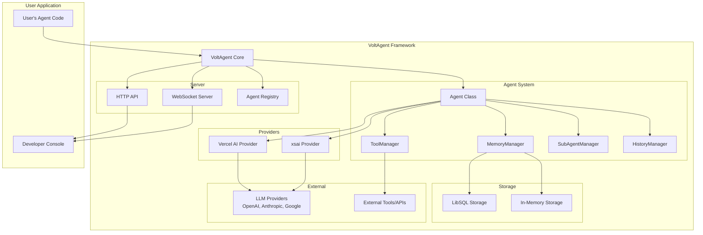
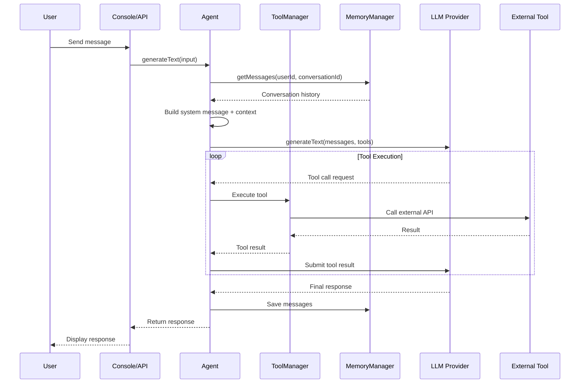
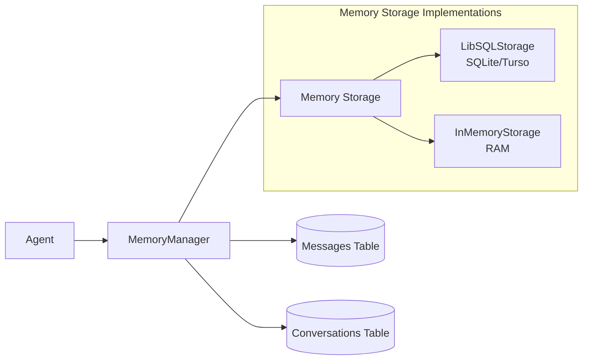

# Project Exploration: VoltAgent - AI Agent Framework

## Overview

VoltAgent is an open-source TypeScript framework for building and orchestrating AI agents. It bridges the gap between no-code builders (which are restrictive) and building from scratch (which is complex). The framework provides modular building blocks for creating AI agent applications with support for tools, memory, multi-agent systems, voice interaction, and RAG (Retrieval-Augmented Generation).

**Key Value Proposition:**
- Escape the limitations of no-code builders
- Avoid the complexity of starting from scratch
- Full control over agent behavior, LLM choice, and integrations
- Built-in observability via the VoltAgent Developer Console

## Directory Structure

```
voltagent/
├── packages/                      # Core monorepo packages
│   ├── core/                      # Main framework engine (@voltagent/core)
│   │   ├── src/
│   │   │   ├── agent/             # Agent class and sub-components
│   │   │   │   ├── index.ts       # Main Agent class implementation
│   │   │   │   ├── types.ts       # Agent types and interfaces
│   │   │   │   ├── hooks/         # Lifecycle hooks (onStart, onEnd, etc.)
│   │   │   │   ├── history/       # History management
│   │   │   │   ├── subagent/      # Sub-agent delegation
│   │   │   │   └── providers/     # LLM provider interfaces
│   │   │   ├── tool/              # Tool system
│   │   │   │   ├── index.ts       # Tool creation (createTool)
│   │   │   │   └── manager/       # Tool management
│   │   │   ├── memory/            # Memory systems
│   │   │   │   ├── manager/       # MemoryManager class
│   │   │   │   ├── libsql/        # SQLite/Turso storage
│   │   │   │   └── in-memory/     # In-memory storage
│   │   │   ├── events/            # Event system (AgentEventEmitter)
│   │   │   ├── server/            # HTTP/WebSocket server
│   │   │   │   ├── api.ts         # API routes
│   │   │   │   ├── registry.ts    # Agent registry
│   │   │   │   └── index.ts       # Server initialization
│   │   │   ├── mcp/               # Model Context Protocol support
│   │   │   ├── retriever/         # RAG and retrieval
│   │   │   ├── voice/             # Voice interaction types
│   │   │   └── utils/             # Utilities (createPrompt, etc.)
│   │   └── index.ts               # Main entry point
│   ├── vercel-ai/                 # Vercel AI SDK provider
│   ├── xsai/                      # Lightweight xsai provider
│   ├── voice/                     # Voice capabilities (ElevenLabs, OpenAI)
│   ├── supabase/                  # Supabase integration
│   ├── cli/                       # CLI tooling
│   └── create-voltagent-app/      # Project scaffolding CLI
├── examples/                      # Example implementations
│   ├── with-nextjs/               # Next.js integration example
│   ├── with-tools/                # Tools usage example
│   ├── with-subagents/            # Multi-agent example
│   ├── with-rag-chatbot/          # RAG implementation
│   ├── with-retrieval/            # Retrieval example
│   ├── with-supabase/             # Supabase example
│   ├── with-vercel-ai/            # Vercel AI example
│   ├── with-xsai/                 # xsai example
│   └── with-voice-*/              # Voice interaction examples
├── website/                       # Documentation site (Docusaurus)
│   ├── docs/                      # Documentation markdown files
│   ├── blog/                      # Blog posts
│   ├── src/                       # Website source code
│   └── static/                    # Static assets
├── llms.txt                       # Comprehensive LLM documentation
├── README.md                      # Main project README
├── package.json                   # Root package configuration
├── pnpm-lock.yaml                 # pnpm lockfile
├── pnpm-workspace.yaml            # pnpm workspace definition
├── lerna.json                     # Lerna monorepo config
├── tsconfig.json                  # TypeScript configuration
└── biome.json                     # Biome linting config
```

## Architecture

### High-Level Diagram (Mermaid)



### Execution Flow



## Core Packages

### @voltagent/core

The heart of VoltAgent, containing:

| Component | Description |
|-----------|-------------|
| `Agent` | Main class for defining AI agents with capabilities |
| `VoltAgent` | Orchestrator class for registering and managing agents |
| `createTool` | Helper for creating type-safe tools with Zod schemas |
| `ToolManager` | Manages tool registration and execution |
| `MemoryManager` | Handles conversation memory persistence |
| `SubAgentManager` | Manages sub-agent delegation |
| `HistoryManager` | Tracks agent interaction history |
| `AgentEventEmitter` | Singleton event system for observability |
| `LibSQLStorage` | SQLite/Turso memory implementation |
| `BaseRetriever` | Base class for RAG retrievers |
| `AgentHooks` | Lifecycle hooks interface |

### @voltagent/vercel-ai

Provider for the Vercel AI SDK, enabling:
- Access to OpenAI, Anthropic, Google, and other models
- Unified interface for generateText, streamText, generateObject, streamObject
- Tool conversion utilities for Vercel AI SDK compatibility

**Dependencies:**
- `ai` (Vercel AI SDK)
- `@ai-sdk/openai` (or other model providers)
- `zod` (schema validation)

### @voltagent/xsai

Lightweight provider for OpenAI-compatible APIs:
- Minimal bundle size
- Suitable for edge environments
- Supports local models via Ollama

### @voltagent/voice

Voice interaction capabilities:
- ElevenLabs integration for speech synthesis
- OpenAI Whisper for speech recognition
- Voice-enabled agent conversations

## Agent System

### Agent Definition

Agents are defined using the `Agent` class:

```typescript
import { Agent } from "@voltagent/core";
import { VercelAIProvider } from "@voltagent/vercel-ai";
import { openai } from "@ai-sdk/openai";

const agent = new Agent({
  name: "my-assistant",
  description: "A helpful AI assistant",
  llm: new VercelAIProvider(),
  model: openai("gpt-4o-mini"),
  tools: [/* optional tools */],
  memory: /* optional memory instance */,
  subAgents: [/* optional sub-agents */],
  hooks: { /* optional lifecycle hooks */},
});
```

### Agent Class Structure

The `Agent` class contains:

| Property | Type | Description |
|----------|------|-------------|
| `id` | `string` | Unique identifier (auto-generated or provided) |
| `name` | `string` | Human-readable name |
| `description` | `string` | Agent capabilities description |
| `llm` | `LLMProvider` | Configured LLM provider instance |
| `model` | `LanguageModelV1` | Specific model to use |
| `memoryManager` | `MemoryManager` | Handles conversation memory |
| `toolManager` | `ToolManager` | Manages available tools |
| `subAgentManager` | `SubAgentManager` | Manages sub-agent delegation |
| `historyManager` | `HistoryManager` | Tracks interaction history |
| `hooks` | `AgentHooks` | Lifecycle event handlers |
| `retriever` | `BaseRetriever` | Optional RAG retriever |
| `voice` | `Voice` | Optional voice capabilities |

### Key Methods

| Method | Description |
|--------|-------------|
| `generateText(input, options)` | Generate text response from LLM |
| `streamText(input, options)` | Stream text response |
| `generateObject(input, options)` | Generate structured object |
| `streamObject(input, options)` | Stream structured object |
| `getHistory()` | Retrieve history entries |
| `getSubAgents()` | Get list of sub-agents |
| `getHistoryManager()` | Access history manager |

### Agent Lifecycle Hooks

```typescript
const hooks = {
  onStart: async (agent) => { /* before invocation */ },
  onEnd: async (agent, output) => { /* after completion */ },
  onHandoff: async (targetAgent, sourceAgent) => { /* on delegation */ },
  onToolStart: async (agent, tool) => { /* before tool execution */ },
  onToolEnd: async (agent, tool, result) => { /* after tool execution */ },
};
```

## Tools and Providers

### Tool System

Tools are defined using `createTool` with Zod schema validation:

```typescript
import { createTool } from "@voltagent/core";
import { z } from "zod";

const weatherTool = createTool({
  name: "get_weather",
  description: "Get current weather for a location",
  parameters: z.object({
    city: z.string().describe("City name"),
    unit: z.enum(["celsius", "fahrenheit"]).default("celsius"),
  }),
  execute: async (args, options) => {
    // Tool implementation
    return { temperature: 72, conditions: "sunny" };
  },
});
```

**Tool Anatomy:**
- `name`: Unique identifier (used by LLM)
- `description`: Explains what the tool does (critical for LLM)
- `parameters`: Zod schema defining input types and descriptions
- `execute`: Async function with validated arguments
- `options`: Optional AbortSignal for cancellation

### ToolManager

The `ToolManager` class handles:
- Tool registration and removal
- Tool preparation for LLM generation
- Tool execution lifecycle
- API exposure of tool definitions

```typescript
// ToolManager methods
toolManager.addTool(tool);
toolManager.removeTool("toolName");
toolManager.getTools();
toolManager.hasTool("toolName");
toolManager.prepareToolsForGeneration(dynamicTools);
toolManager.executeTool(toolName, args, signal);
```

### LLM Providers

VoltAgent supports multiple LLM providers through a unified interface:

**Provider Interface:**
```typescript
interface LLMProvider<TModel> {
  generateText(options): Promise<ProviderTextResponse>;
  streamText(options): Promise<ProviderTextStreamResponse>;
  generateObject(options): Promise<ProviderObjectResponse>;
  streamObject(options): Promise<ProviderObjectStreamResponse>;
  toMessage(message): CoreMessage;
  getModelIdentifier(model): string;
}
```

**Available Providers:**

| Provider | Package | Models |
|----------|---------|--------|
| Vercel AI | `@voltagent/vercel-ai` | OpenAI, Anthropic, Google, etc. |
| xsai | `@voltagent/xsai` | OpenAI-compatible (Ollama, local) |

## Memory and State Management

### Memory Architecture

VoltAgent uses a `MemoryManager` to handle conversation state:



### MemoryManager

Handles all memory operations:
- `saveMessage(context, message, userId, conversationId)` - Persist messages
- `getMessages(context, userId, conversationId, limit)` - Retrieve history
- Conversation creation and management
- Event tracking for observability

### LibSQLStorage

Default persistent storage using LibSQL:
- Local SQLite file (default: `.voltagent/memory.db`)
- Remote Turso for production
- Configurable storage limits
- Automatic table initialization

```typescript
import { LibSQLStorage } from "@voltagent/core";

// Local development
const localMemory = new LibSQLStorage({
  url: "file:memory.db",
});

// Production with Turso
const prodMemory = new LibSQLStorage({
  url: "libsql://your-db.turso.io",
  authToken: process.env.TURSO_AUTH_TOKEN,
  tablePrefix: "prod_chats",
  storageLimit: 500,
});
```

### InMemoryStorage

Volatile storage for testing:
- Stores data in JavaScript objects/arrays
- No persistence across restarts
- Useful for unit tests

### History Management

The `HistoryManager` tracks detailed interaction records:

```typescript
interface AgentHistoryEntry {
  id: string;
  timestamp: Date;
  input: string | BaseMessage[];
  output: string;
  status: AgentStatus;  // idle, working, tool_calling, error, completed
  steps?: HistoryStep[];
  usage?: UsageInfo;
  events?: TimelineEvent[];  // Detailed event timeline
}
```

**Timeline Events:**
- `memory:getMessages`, `memory:saveMessage`
- `tool:executing`, `tool:completed`, `tool:error`
- `agent:delegating`, `agent:completed`
- `retriever:working`, `retriever:completed`

## Multi-Agent Systems (Sub-Agents)

### Supervisor Pattern

VoltAgent supports hierarchical agent architectures:

```typescript
const researcher = new Agent({
  name: "WebResearcher",
  description: "Searches the web for information",
  llm: new VercelAIProvider(),
  model: openai("gpt-4o-mini"),
});

const writer = new Agent({
  name: "Writer",
  description: "Writes comprehensive reports",
  llm: new VercelAIProvider(),
  model: openai("gpt-4o-mini"),
});

const supervisor = new Agent({
  name: "Coordinator",
  description: "Coordinates research and writing tasks",
  llm: new VercelAIProvider(),
  model: openai("gpt-4o"),
  subAgents: [researcher, writer],  // Delegates tasks
});
```

### SubAgentManager

Manages sub-agent functionality:
- `addSubAgent(agent)` / `removeSubAgent(agentId)`
- `getSubAgents()` - Get all sub-agents
- `createDelegateTool()` - Creates the `delegate_task` tool
- `handoffTask(options)` - Delegates task to sub-agent
- `generateSupervisorSystemMessage()` - Creates supervisor prompt

### Delegate Task Tool

Automatically added to supervisors:
```typescript
delegate_task(
  task: string,
  targetAgents: string[],
  context?: object
)
```

**Handoff Flow:**
1. Supervisor LLM decides to delegate
2. Calls `delegate_task` tool
3. `SubAgentManager.handoffTask()` creates new conversation context
4. Passes `parentAgentId` and `parentHistoryEntryId` for tracing
5. Sub-agent processes task in isolation
6. Result returned to supervisor
7. Supervisor continues with result

## Observability

### AgentEventEmitter

Singleton event system for observability:

```typescript
const emitter = AgentEventEmitter.getInstance();

// Events emitted:
// - agentRegistered
// - agentUnregistered
// - historyUpdate
// - historyEntryCreated
// - memory:getMessages, memory:saveMessage
// - tool:executing, tool:completed
// - agent:delegating, agent:completed
```

### VoltAgent Developer Console

Web-based UI for monitoring agents:
- Real-time agent status visualization
- Conversation history inspection
- Tool execution timeline
- Token usage tracking
- WebSocket-based live updates

**Server Endpoints:**
- `GET /api/agents` - List all agents
- `GET /api/agents/:id` - Get agent details
- `GET /api/agents/:id/history` - Get history entries
- `POST /api/agents/:id/generate` - Generate response
- `WebSocket /ws` - Real-time updates

## Additional Capabilities

### Model Context Protocol (MCP)

Support for the MCP standard:
- Connect to external tool servers
- HTTP and stdio transports
- Standardized tool interactions

### RAG (Retrieval-Augmented Generation)

BaseRetriever class for custom retrievers:
```typescript
abstract class BaseRetriever {
  abstract retrieve(input: string | BaseMessage[]): Promise<string>;
  readonly tool: AgentTool;  // Auto-generated tool
}
```

### Voice Interaction

Voice capabilities via `@voltagent/voice`:
- ElevenLabs for TTS (text-to-speech)
- OpenAI Whisper for STT (speech-to-text)
- Integrated with agent lifecycle

### Utilities

| Utility | Description |
|---------|-------------|
| `createPrompt` | Template-based prompt generation |
| `zodSchemaToJsonUI` | Convert Zod schemas for UI display |
| `createNodeId` | Generate node IDs for visualization |
| `checkForUpdates` | Check package updates |

## Package Dependencies

### Root Dependencies
- `lerna` - Monorepo management
- `pnpm` - Package manager
- `biome` - Linting and formatting
- `changesets` - Version management
- `husky` - Git hooks

### Core Dependencies
- `zod` - Schema validation
- `uuid` - ID generation
- `@libsql/client` - SQLite/Turso client
- `@modelcontextprotocol/sdk` - MCP support
- `hono` + `@hono/node-server` - HTTP server
- `ws` + `@hono/node-ws` - WebSocket server
- `npm-check-updates` - Update checking

## Key Insights

1. **Composition Over Inheritance**: The Agent class uses manager classes (ToolManager, MemoryManager, SubAgentManager, HistoryManager) for modularity rather than deep inheritance.

2. **Event-Driven Observability**: All significant actions emit events via `AgentEventEmitter`, enabling real-time console updates without tight coupling.

3. **Parent Context Propagation**: Sub-agent handoffs pass `parentAgentId` and `parentHistoryEntryId` to maintain traceability across the delegation chain.

4. **Type-Safe Tools**: Zod schemas provide runtime validation and generate JSON schemas for LLM consumption.

5. **Provider Abstraction**: The `LLMProvider` interface allows swapping between Vercel AI, xsai, or custom providers without changing agent code.

6. **Conversation Isolation**: Each agent interaction uses `userId` and `conversationId` keys, enabling multi-tenant state management.

7. **Default Persistence**: LibSQLStorage defaults to local SQLite (`.voltagent/memory.db`) with easy Turso migration for production.

8. **Supervisor Prompt Engineering**: SubAgentManager automatically enhances supervisor system prompts with sub-agent lists and coordination guidelines.

## Files Reference

| File | Description |
|------|-------------|
| `/packages/core/src/agent/index.ts` | Main Agent class implementation |
| `/packages/core/src/agent/types.ts` | Agent types and interfaces |
| `/packages/core/src/tool/index.ts` | Tool creation (createTool) |
| `/packages/core/src/tool/manager/index.ts` | ToolManager implementation |
| `/packages/core/src/memory/manager/index.ts` | MemoryManager implementation |
| `/packages/core/src/memory/libsql/index.ts` | LibSQLStorage implementation |
| `/packages/core/src/agent/subagent/index.ts` | SubAgentManager implementation |
| `/packages/core/src/agent/history/index.ts` | HistoryManager implementation |
| `/packages/core/src/events/index.ts` | AgentEventEmitter implementation |
| `/packages/core/src/server/api.ts` | HTTP/WebSocket server |
| `/packages/core/src/index.ts` | Main entry point and VoltAgent class |
| `/packages/vercel-ai/src/index.ts` | Vercel AI provider implementation |
| `/llms.txt` | Comprehensive LLM documentation |
