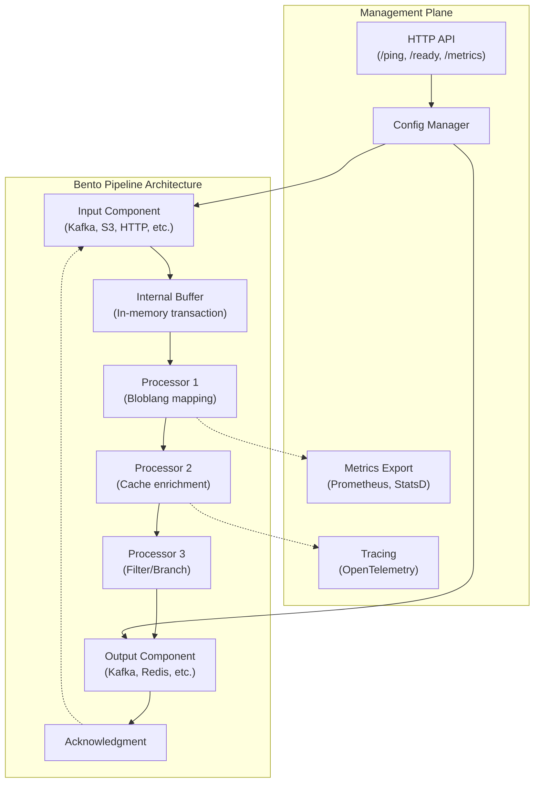
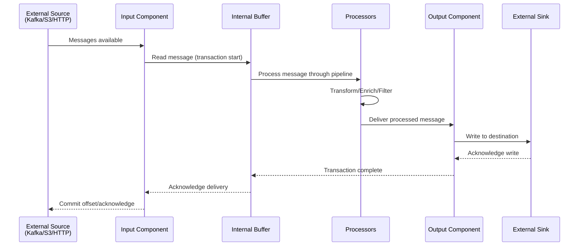
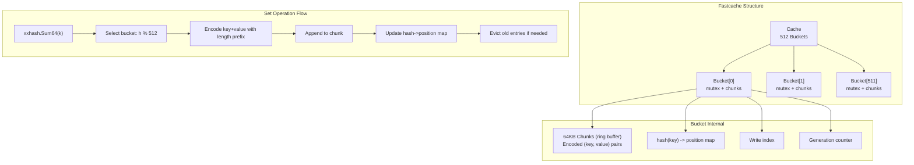
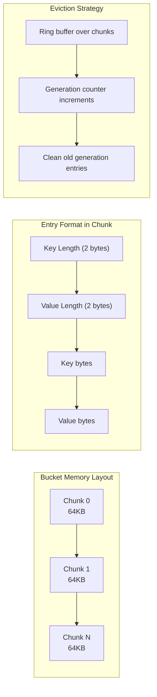
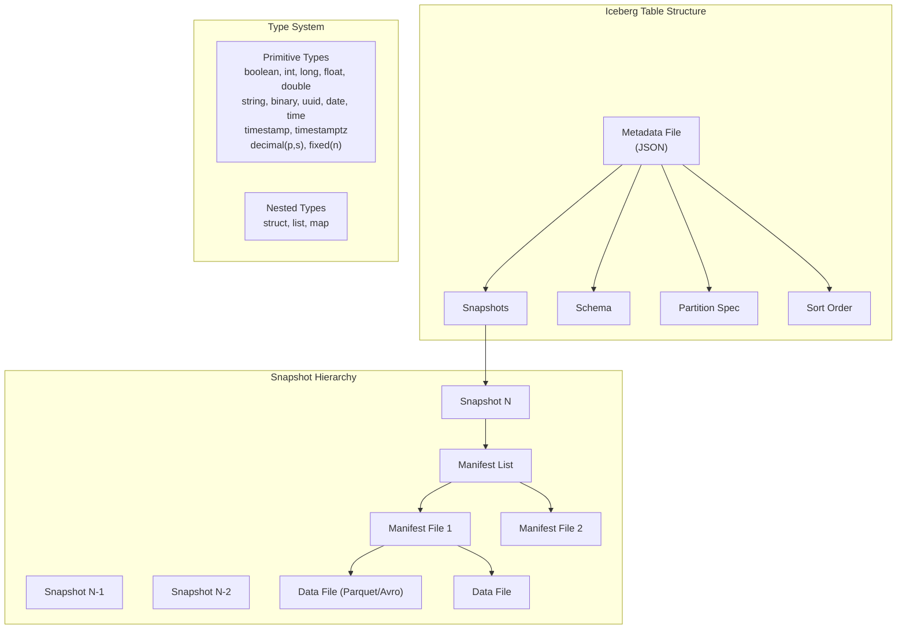
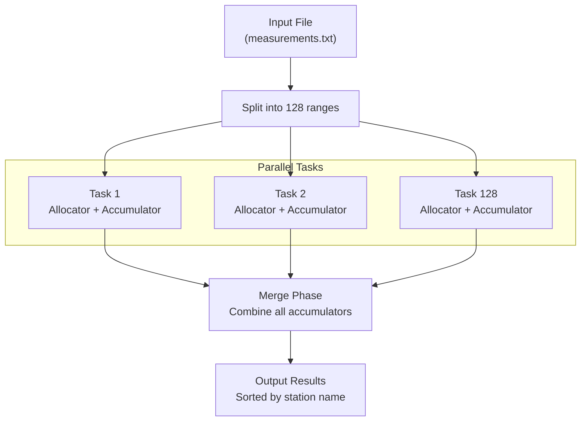
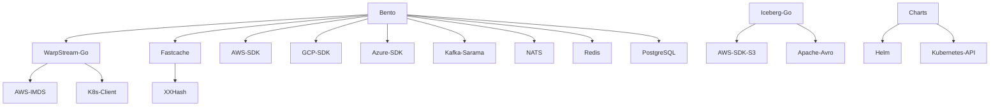

# WarpStream Labs Projects Exploration

## Overview

This directory contains 8 Go projects from WarpStream Labs, a company building data streaming and storage systems. The projects span data streaming processing, caching, table format implementations, and deployment tooling.

**WarpStream** is an Apache Kafka protocol-compatible data streaming and storage system that stores data directly in object storage (like Amazon S3) to eliminate inter-zone networking costs and leverage cheap, durable cloud storage.

### Projects Summary

| Project | Purpose | Category |
|---------|---------|----------|
| **bento/** | High-performance stream processor with 50+ connectors | Data Streaming |
| **warpstream-go/** | Kafka-compatible client library for WarpStream | Data Streaming |
| **warpstream-docker-compose-example/** | Docker deployment examples | Infrastructure |
| **warpstream-fly-io-template/** | Fly.io deployment template | Infrastructure |
| **fastcache/** | High-performance in-memory cache with file persistence | Infrastructure |
| **iceberg-go/** | Apache Iceberg table format implementation | Data Lake |
| **onebrc/** | One Billion Row Challenge implementation | Benchmark/Demo |
| **charts/** | Helm charts for Kubernetes deployments | Infrastructure |

---

## 1. Bento - Stream Processing Engine

### Overview

**Bento** is a high-performance and resilient stream processor that connects various sources (inputs) and sinks (outputs) in brokering patterns, performing hydration, enrichments, transformations, and filters on payloads.

It is comparable to **Kafka Streams**, **Apache Flink**, or **Logstash**, but with a simpler deployment model (single binary or Docker image) and declarative YAML configuration.

**Key Differentiators:**
- **Declarative pipelines** in YAML (no code required for most use cases)
- **At-least-once delivery guarantees** using in-process transaction model
- **50+ built-in connectors** (AWS, GCP, Azure, Kafka, NATS, Redis, SQL, etc.)
- **Bloblang** - powerful mapping language for transformations
- **No disk persistence required** for state management
- **Cloud-native** - easy deployment as binary, Docker, or serverless function

**Repository:** `github.com/warpstreamlabs/bento`

### Directory Structure

```
bento/
├── cmd/
│   ├── bento/                          # Main CLI binary entry point
│   │   └── main.go                     # Runs service.RunCLI()
│   ├── serverless/bento-lambda/        # AWS Lambda serverless deployment
│   └── tools/bento_docs_gen/           # Documentation generation tools
├── config/
│   ├── examples/                       # Example pipeline configurations
│   │   ├── discord_bot.yaml            # Discord bot integration example
│   │   ├── joining_streams.yaml        # Stream join with caching example
│   │   ├── site_analytics.yaml         # Web analytics pipeline
│   │   └── track_benthos_downloads.yaml
│   ├── test/                           # Test configurations and fixtures
│   │   ├── bloblang/                   # Bloblang mapping tests
│   │   ├── protobuf/                   # Protobuf schema test files
│   │   └── cookbooks/                  # Recipe examples (filtering, etc.)
│   └── template_examples/              # Template plugin examples
├── internal/
│   ├── api/                            # HTTP API for dynamic CRUD operations
│   ├── batch/                          # Batch processing policies and acks
│   ├── bloblang/                       # Bloblang language parser and executor
│   │   ├── field/                      # Field expression parsing
│   │   ├── mapping/                    # Mapping statement execution
│   │   ├── parser/                     # Bloblang grammar parsers
│   │   └── query/                      # Query functions and methods
│   ├── bundle/                         # Component registration bundles
│   │   ├── inputs.go                   # Input component registry
│   │   ├── outputs.go                  # Output component registry
│   │   ├── processors.go               # Processor component registry
│   │   ├── caches.go                   # Cache component registry
│   │   └── tracers.go                  # OpenTelemetry tracer registry
│   ├── cli/                            # CLI subcommands
│   │   ├── blobl/                      # Bloblang REPL and server
│   │   ├── common/                     # Shared CLI utilities
│   │   ├── studio/                     # Bento Studio integration
│   │   └── test/                       # Pipeline test runner
│   ├── codec/                          # Message encoding/decoding
│   ├── component/                      # Component interfaces and configs
│   │   ├── buffer/                     # Buffer component interface
│   │   ├── cache/                      # Cache component interface
│   │   ├── input/                      # Input component interface
│   │   ├── output/                     # Output component interface
│   │   └── processor/                  # Processor component interface
│   ├── config/                         # Configuration parsing
│   ├── docs/                           # Documentation generation
│   ├── httpclient/                     # HTTP client wrapper
│   ├── httpserver/                     # HTTP server wrapper
│   ├── impl/                           # Component implementations
│   │   ├── amqp09/                     # RabbitMQ AMQP 0.91
│   │   ├── amqp1/                      # AMQP 1.0
│   │   ├── avro/                       # Apache Avro serialization
│   │   ├── awk/                        # AWK scripting processor
│   │   ├── aws/                        # AWS services (S3, SQS, Kinesis)
│   │   ├── azure/                      # Azure services
│   │   ├── cassandra/                  # Apache Cassandra
│   │   ├── confluent/                  # Confluent Schema Registry
│   │   ├── couchbase/                  # Couchbase database
│   │   ├── crypto/                     # Cryptographic processors
│   │   ├── dgraph/                     # Dgraph graph database
│   │   ├── discord/                    # Discord bot integration
│   │   ├── elasticsearch/              # Elasticsearch
│   │   ├── gcp/                        # Google Cloud Platform
│   │   ├── hdfs/                       # Hadoop HDFS
│   │   ├── influxdb/                   # InfluxDB time series
│   │   ├── io/                         # Basic I/O (stdin, stdout, file)
│   │   ├── jaeger/                     # Jaeger tracing
│   │   ├── javascript/                 # JavaScript processor
│   │   ├── kafka/                      # Apache Kafka
│   │   ├── lang/                       # Language processors
│   │   ├── maxmind/                    # MaxMind GeoIP
│   │   ├── memcached/                  # Memcached
│   │   ├── mongodb/                    # MongoDB
│   │   ├── msgpack/                    # MessagePack serialization
│   │   ├── nats/                       # NATS, JetStream, Streaming
│   │   ├── nsq/                        # NSQ message queue
│   │   ├── otlp/                       # OpenTelemetry OTLP
│   │   ├── parquet/                    # Apache Parquet
│   │   ├── prometheus/                 # Prometheus metrics
│   │   ├── protobuf/                   # Protocol Buffers
│   │   ├── pulsar/                     # Apache Pulsar
│   │   ├── python/                     # Python processor
│   │   ├── questdb/                    # QuestDB time series
│   │   ├── redis/                      # Redis (streams, pubsub, lists)
│   │   ├── sentry/                     # Sentry error tracking
│   │   ├── snowflake/                  # Snowflake data warehouse
│   │   ├── splunk/                     # Splunk logging
│   │   ├── sql/                        # SQL databases (PostgreSQL, MySQL)
│   │   ├── text/                       # Text processors (CSV, JSON, XML)
│   │   ├── wasm/                       # WebAssembly processors
│   │   └── zmq4/                       # ZeroMQ
│   ├── log/                            # Logging utilities
│   ├── manager/                        # Pipeline manager
│   ├── message/                        # Message data structures
│   ├── metadata/                       # Message metadata handling
│   ├── pipeline/                       # Pipeline execution engine
│   ├── retries/                        # Retry policies
│   ├── stream/                         # Stream configuration
│   ├── template/                       # Configuration templates
│   ├── tls/                            # TLS configuration
│   ├── tracing/                        # Distributed tracing
│   └── transaction/                    # Transaction model for delivery guarantees
├── public/
│   ├── bloblang/                       # Public Bloblang API for plugins
│   │   ├── context.go                  # Bloblang execution context
│   │   ├── environment.go              # Bloblang environment
│   │   ├── executor.go                 # Mapping executor
│   │   ├── function.go                 # Custom function registration
│   │   └── method.go                   # Custom method registration
│   ├── components/                     # Component bundles (plugin imports)
│   │   └── all/                        # Import all components
│   └── service/                        # Public service API for plugins
│       ├── stream_builder.go           # Programmatic pipeline builder
│       └── plugin helpers...
├── resources/                          # Static resources (icons, etc.)
├── website/                            # Documentation website source
├── CHANGELOG.md
├── CONTRIBUTING.md
├── LICENSE
├── Makefile
├── README.md
├── go.mod                              # 18KB, ~370 dependencies
└── go.sum
```

### Architecture



### Streaming Pipeline Flow



### Component Model

Bento uses a **component-based architecture** where each pipeline stage is a pluggable component:

| Component Type | Purpose | Examples |
|----------------|---------|----------|
| **Input** | Reads messages from sources | `kafka`, `s3`, `http_server`, `redis_streams`, `gcp_pubsub`, `nats` |
| **Processor** | Transforms/enriches/filters messages | `bloblang`, `cache`, `branch`, `for_each`, `try`, `catch`, `sleep` |
| **Output** | Writes messages to destinations | `kafka`, `redis_streams`, `elasticsearch`, `http_client`, `s3` |
| **Cache** | Stateful storage for enrichment | `memory`, `redis`, `memcached`, `dynamodb` |
| **Buffer** | Intermediate storage between stages | `memory`, `file` |
| **Rate Limit** | Throttle throughput | `local_value`, `redis` |

### Entry Points

**Main CLI (`cmd/bento/main.go`):**
```go
func main() {
    service.RunCLI(
        context.Background(),
        service.CLIOptSetVersion(Version, DateBuilt),
        service.CLIOptSetBinaryName("bento"),
        service.CLIOptSetProductName("Bento"),
        service.CLIOptSetDocumentationURL("https://warpstreamlabs.github.io/bento/docs"),
    )
}
```

**Usage:**
```bash
# Run with config file
bento -c ./config.yaml

# Run with inline configuration
bento -s "input.type=http_server" -s "output.type=kafka"

# Docker
docker run ghcr.io/warpstreamlabs/bento -c /config.yaml
```

### Example Configurations

**Site Analytics Pipeline:**
```yaml
input:
  http_server:
    address: 0.0.0.0:4196
    path: /poke
    allowed_verbs: [POST, HEAD]
  processors:
    - metric:
        type: counter
        name: site_visit
        labels:
          host: ${! meta("h") }
          path: ${! meta("p") }
          referrer: ${! meta("r") }
    - bloblang: 'root = deleted()'

metrics:
  mapping: |
    root = if !["site_visit"].contains($path) { deleted() } else { $path }
  prometheus: {}
```

**Stream Join with Caching:**
```yaml
input:
  broker:
    inputs:
      - kafka:
          topics: [comments]
          consumer_group: bento_comments_group
      - kafka:
          topics: [comments_retry]
          consumer_group: bento_comments_group
        processors:
          - sleep:
              duration: '${! 3600 - (timestamp_unix() - meta("last_attempted").number()) }s'

pipeline:
  processors:
    - try:
      - for_each:
        - branch:
            request_map: root = this.comment.parent_id | deleted()
            processors:
              - cache:
                  operator: get
                  resource: hydration_cache
                  key: '${! content() }'
            result_map: 'root.article = this.article'
        - branch:
            request_map: |
              root.comment.id = this.comment.id
              root.article = this.article
            processors:
              - cache:
                  operator: set
                  resource: hydration_cache
                  key: '${! json("comment.id")}'
      - bloblang: 'meta output_topic = "comments_hydrated"'
    - catch:
        - bloblang: |
            meta output_topic = "comments_retry"
            meta last_attempted = timestamp_unix()

output:
  kafka:
    topic: '${! meta("output_topic")}'

cache_resources:
  - label: hydration_cache
    memory:
      init_values:
        123foo: '{"article": {"id": "123foo", "title": "Dope article"}}'
```

### Bloblang - Mapping Language

Bloblang is Bento's powerful mapping language for transformations:

```bloblang
# Mapping example
root.message = this
root.meta.link_count = this.links.length()
root.user.age = this.user.age.number()
root.id = uuid_v4()
root.ts = now()
```

**Key Features:**
- Root document assignment with `root =`
- Field access with `this.field`
- Method chaining: `.string()`, `.number()`, `.catch_default()`
- Built-in functions: `uuid_v4()`, `now()`, `random_int()`
- Conditionals: `this.value.or_else("default")`
- String/number/array methods

### External Dependencies (Go Modules)

Major dependencies from `go.mod`:

| Category | Dependencies |
|----------|--------------|
| **Cloud SDKs** | `aws-sdk-go-v2`, `azure-sdk-for-go`, `google.golang.org/api` |
| **Message Queues** | `sarama` (Kafka), `nats.go`, `paho.mqtt.golang`, `amqp091-go` |
| **Databases** | `pgx` (PostgreSQL), `clickhouse-go`, `mongo-driver`, `gocql` |
| **Serialization** | `protobuf`, `avro`, `parquet-go`, `msgpack` |
| **HTTP** | `gorilla/mux`, `gorilla/websocket` |
| **Metrics** | `prometheus/client_golang`, `go-statsd` |
| **Tracing** | `opentelemetry.io/otel`, `jaeger` |
| **Config** | `gopkg.in/yaml.v3`, `cuelang.org/go` |

### Testing Strategy

- **Unit tests** in each component directory (`*_test.go`)
- **Integration tests** using `dockertest` for real service connections
- **Pipeline tests** in YAML config using `tests:` block:

```yaml
tests:
  - name: Basic hydration
    target_processors: /pipeline/processors
    input_batch:
      - content: |
          {"type": "comment", "comment": {"parent_id": "123foo"}}
    output_batches:
      - - json_equals: {"article": {"id": "123foo"}}
```

**Run tests:**
```bash
make test
go test ./...
bento test ./config.yaml  # Validate config and run test blocks
```

---

## 2. Fastcache - High-Performance In-Memory Cache

### Overview

**Fastcache** is a high-performance thread-safe in-memory cache optimized for storing a large number of entries without GC overhead. It was extracted from [VictoriaMetrics](https://github.com/VictoriaMetrics/VictoriaMetrics).

**Key Features:**
- **Faster than BigCache** and standard Go maps (see benchmarks below)
- **Low GC overhead** - uses 64KB chunks instead of individual allocations
- **Thread-safe** - concurrent goroutine access with bucket-level locking
- **File persistence** - can save/load cache state to/from disk
- **Automatic eviction** - evicts old entries on capacity overflow

**Repository:** `github.com/VictoriaMetrics/fastcache`

### Directory Structure

```
fastcache/
├── bigcache.go              # BigCache adapter/comparison
├── bigcache_test.go
├── bigcache_timing_test.go
├── fastcache.go             # Main cache implementation
├── fastcache_test.go
├── fastcache_timing_test.go
├── file.go                  # File persistence (SaveToFile, LoadFromFile)
├── file_test.go
├── file_timing_test.go
├── malloc_heap.go           # Heap allocation (non-mmap)
├── malloc_mmap.go           # Mmap allocation (off-heap)
├── vendor/                  # Vendored dependencies
├── LICENSE
├── README.md
└── go.mod
```

### Architecture



### Cache Structure and Eviction



### API Usage

```go
// Create cache with 1GB capacity
cache := fastcache.New(1024 * 1024 * 1024)

// Set key-value
cache.Set([]byte("user:123"), []byte(`{"name": "Alice"}`))

// Get value
result := cache.Get(nil, []byte("user:123"))

// Check existence
if cache.Has([]byte("user:123")) {
    // exists
}

// Delete
cache.Del([]byte("user:123"))

// Save to file
cache.SaveToFile("cache.bin")

// Load from file
loadedCache := fastcache.LoadFromFile("cache.bin", 1024*1024*1024)
```

### Performance Benchmarks

From `fastcache_timing_test.go` (GOMAXPROCS=4):

| Benchmark | Operations/s | MB/s | Allocations |
|-----------|-------------|------|-------------|
| BigCache Set | 2,000 | 6.20 | 4.6M B/op |
| BigCache Get | 2,000 | 9.49 | 684K B/op |
| **Fastcache Set** | **5,000** | **17.21** | **1.1K B/op** |
| **Fastcache Get** | **5,000** | **19.90** | **1.1K B/op** |
| Std Map Set | 2,000 | 6.21 | 268K B/op |
| Std Map Get | 5,000 | 24.39 | 2.5K B/op |
| Sync Map Set | 500 | 2.65 | 3.4M B/op |

**Fastcache is ~3x faster than BigCache** for set operations and uses significantly less memory.

### External Dependencies

| Dependency | Purpose |
|------------|---------|
| `github.com/cespare/xxhash/v2` | Fast 64-bit hashing |

### Key Design Decisions

1. **512 buckets** - Each with its own lock for concurrent access
2. **64KB chunks** - Reduces memory fragmentation and GC pressure
3. **Ring buffer** - Automatic eviction by overwriting old entries
4. **Generation counter** - Tracks chunk generations for cleanup
5. **Off-heap allocation** (via mmap when available) - Reduces GC pressure

---

## 3. Iceberg-Go - Apache Iceberg Table Format

### Overview

**iceberg-go** is a Go implementation of the [Apache Iceberg](https://iceberg.apache.org/) table format specification. Iceberg is an open table format for huge analytic datasets, providing ACID guarantees, schema evolution, and time travel capabilities.

**Repository:** `github.com/apache/iceberg-go` (Apache Software Foundation project)

### Directory Structure

```
iceberg-go/
├── table/
│   ├── table.go               # Table implementation
│   ├── refs.go                # Snapshot references
│   ├── requirements.go        # Table requirements for commits
│   ├── updates.go             # Table updates
│   ├── metadata.go            # Table metadata handling
│   ├── sort.go                # Sort order implementation
│   ├── partitioning.go        # Partition spec implementation
│   └── snapshot.go            # Snapshot implementation
├── io/
│   ├── io.go                  # File I/O interfaces
│   ├── s3.go                  # S3 file I/O implementation
│   └── local.go               # Local filesystem I/O
├── internal/
│   └── utils/                 # Internal utilities
├── dev/
│   └── (development tools)
├── manifest.go                # Manifest file reading/writing
├── manifest_test.go
├── schema.go                  # Schema definition and parsing
├── schema_test.go
├── types.go                   # Iceberg type system
├── types_test.go
├── partitions.go              # Partition specification
├── transforms.go              # Partition transforms
├── errors.go                  # Error definitions
├── utils.go
├── README.md
├── LICENSE
├── go.mod
└── go.sum
```

### Iceberg Table Format Architecture



### Iceberg Type System

From `types.go`:

**Primitive Types:**
- `boolean`, `int` (int32), `long` (int64)
- `float` (float32), `double` (float64)
- `date` (days since epoch), `time` (microseconds since midnight)
- `timestamp` (microseconds since epoch, no timezone)
- `timestamptz` (microseconds since epoch, UTC)
- `string`, `uuid`, `binary`
- `decimal(precision, scale)`, `fixed(length)`

**Nested Types:**
- `struct<fields>` - Ordered tuple of named fields
- `list<element>` - Array of elements
- `map<key, value>` - Key-value pairs

### Schema Example

```go
schema := &iceberg.Schema{
    Fields: []iceberg.NestedField{
        {ID: 1, Name: "id", Type: iceberg.Int32Type{}, Required: true},
        {ID: 2, Name: "name", Type: iceberg.StringType{}, Required: false},
        {ID: 3, Name: "tags", Type: &iceberg.ListType{
            ElementID: 4,
            Element: iceberg.StringType{},
        }},
        {ID: 5, Name: "metadata", Type: &iceberg.MapType{
            KeyID: 6, KeyType: iceberg.StringType{},
            ValueID: 7, ValueType: iceberg.StringType{},
        }},
    },
}
```

### Feature Support Matrix

| Feature | Status |
|---------|--------|
| **Filesystem Support** | |
| S3 | Supported |
| Local Filesystem | Supported |
| Google Cloud Storage | Not implemented |
| Azure Blob Storage | Not implemented |
| **Metadata Operations** | |
| Get Schema | Supported |
| Get Snapshots | Supported |
| Get Sort Orders | Supported |
| Get Partition Specs | Supported |
| Get Manifests | Supported |
| Create New Manifests | Supported |
| Plan Scan | Not implemented |
| **Catalog Support** | |
| REST Catalog | Not implemented |
| Hive Catalog | Not implemented |
| Glue Catalog | Not implemented |
| **Read/Write Data** | |
| Data file reading | Manual only (no Arrow yet) |

### Key Components

**Manifest Files:** Track data files in a snapshot using Apache Avro format.

**Snapshots:** Represent table state at a point in time, enabling time travel.

**Partition Specs:** Define how data is partitioned (e.g., by date, bucket).

**Schema Evolution:** Iceberg supports full schema evolution (add, drop, rename, reorder columns).

---

## 4. OneBRC - One Billion Row Challenge

### Overview

**onebrc** is WarpStream's implementation for the [One Billion Row Challenge](https://github.com/gunnarmorling/1brc) - a challenge to process one billion rows of temperature measurements as fast as possible.

**Performance:** ~10.5 seconds on M1 MacBook Pro

**Repository:** `github.com/warpstreamlabs/onebrc`

### Directory Structure

```
onebrc/
├── main.go                  # Main implementation
├── main_test.go
├── README.md
├── LICENSE
├── go.mod
└── go.sum
```

### Algorithm

```go
// Key optimizations:
// 1. Parallel processing with 128-256 tasks (file split by byte ranges)
// 2. Allocator maps string keys to uint32 slots (avoids string copies)
// 3. Accumulator stores aggregates in pre-allocated slices
// 4. Zero-copy string conversion using unsafe
// 5. Merge phase combines partial results from all tasks
```

**Architecture:**



### Key Code Snippet

```go
type accumulator struct {
    max      []float32
    min      []float32
    sum      []float64
    count    []uint32
    occupied []bool
}

type allocator struct {
    next    uint32
    storage map[string]uint32  // Maps station name -> slot index
}
```

---

## 5. WarpStream-Go - Kafka-Compatible Client

### Overview

**warpstream-go** provides a Go client library for interacting with WarpStream using the Apache Kafka protocol.

**Repository:** `github.com/warpstreamlabs/warpstream-go`

### Directory Structure

```
warpstream-go/
├── pkg/
│   └── cloudmetadata/
│       ├── cloud_metadata.go      # Auto-detect cloud availability zone
│       └── cloud_metadata_test.go
├── go.mod
├── go.sum
├── LICENSE
└── README.md
```

### Cloud Metadata Detection

The `cloudmetadata` package auto-detects the availability zone across multiple cloud providers:

**Supported Clouds:**
- AWS EC2 (IMDSv2)
- AWS ECS (task metadata API)
- GCP (metadata server)
- Azure (instance metadata)
- Kubernetes (node labels via API)

**Usage:**
```go
az, err := cloudmetadata.AvailabilityZone(ctx, logger)
// Returns: "us-east-1a", "us-central1-a", etc.
```

---

## 6. Charts - Helm Charts

### Overview

Helm charts for deploying WarpStream Agent on Kubernetes.

**Repository:** `github.com/warpstreamlabs/charts`

### Directory Structure

```
charts/
├── charts/
│   └── warpstream-agent/
│       ├── Chart.yaml             # Chart metadata
│       ├── values.yaml            # Default configuration
│       ├── README.md              # Chart documentation
│       ├── templates/
│       │   ├── deployment.yaml    # Agent Deployment
│       │   ├── service.yaml       # Kubernetes Service
│       │   ├── configmap.yaml     # Configuration
│       │   ├── secret.yaml        # Secrets
│       │   ├── serviceaccount.yaml
│       │   ├── clusterrole.yaml
│       │   ├── clusterrolebinding.yaml
│       │   ├── hpa.yaml           # Horizontal Pod Autoscaler
│       │   ├── pdb.yaml           # Pod Disruption Budget
│       │   ├── servicemonitor.yaml # Prometheus monitoring
│       │   └── _helpers.tpl       # Template helpers
│       └── ci/
│           ├── playground-values.yaml
│           └── playground-sts-values.yaml
├── LICENSE
└── README.md
```

### Deployment Values

Key configuration options from `values.yaml`:

| Parameter | Description | Default |
|-----------|-------------|---------|
| `replicaCount` | Number of agent replicas | 3 |
| `image.repository` | Container image | `ghcr.io/warpstreamlabs/bento` |
| `resources.limits` | CPU/memory limits | - |
| `autoscaling.enabled` | Enable HPA | false |
| `config` | WarpStream agent configuration | - |

---

## 7. Deployment Examples

### Docker Compose Examples

**Location:** `warpstream-docker-compose-example/`

| Example | Description |
|---------|-------------|
| `demo-example/` | Ephemeral cluster with synthetic data generation |
| `playground-example/` | Ephemeral cluster without synthetic data |

### Fly.io Template

**Location:** `warpstream-fly-io-template/`

Contains:
- `Dockerfile` - Multi-stage build for minimal image
- `fly.toml` - Fly.io deployment configuration

---

## Comparison: Bento vs Kafka Streams vs Flink

| Feature | Bento | Kafka Streams | Apache Flink |
|---------|-------|---------------|--------------|
| **Deployment** | Single binary/Docker | JVM library | Distributed cluster |
| **Configuration** | Declarative YAML | Java/Scala code | Java/Scala/SQL |
| **State Management** | External caches | RocksDB (embedded) | RocksDB (distributed) |
| **Delivery Guarantees** | At-least-once | Exactly-once | Exactly-once |
| **Learning Curve** | Low | Medium | High |
| **Connectors** | 50+ built-in | Kafka only | Many (via Flink CDC) |
| **Scaling** | Horizontal (stateless) | Via Kafka partitions | Via task slots |
| **Best For** | Data movement, ETL, simple transformations | Kafka-native stream processing | Complex event processing, SQL analytics |

---

## Key Insights for Engineers

1. **Bento is ideal for:**
   - Moving data between different systems (Kafka → S3, Redis → Elasticsearch)
   - Simple transformations and enrichments
   - Rapid prototyping of streaming pipelines
   - Scenarios where operational simplicity is valued over advanced features

2. **Fastcache design lessons:**
   - Bucket-level locking enables true parallel access
   - Chunk-based allocation dramatically reduces GC pressure
   - Generation counters enable efficient eviction without explicit timestamps

3. **Iceberg Go implementation status:**
   - Core metadata types and schema parsing complete
   - File I/O abstraction ready for additional backends
   - Catalog integrations and query planning are future work

4. **OneBRC optimization techniques:**
   - Pre-allocate accumulator slots to avoid runtime allocation
   - Split file by byte ranges, not lines, for parallel reading
   - Use `unsafe` for zero-copy string conversion when safe

---

## Open Questions

1. **Bento:**
   - How does the transaction model handle partial batch failures?
   - What is the memory footprint of large in-flight batches?
   - How does WAL (Write-Ahead Log) work for stateful processors?

2. **Fastcache:**
   - What happens during concurrent SaveToFile and heavy write operations?
   - How does mmap vs heap allocation affect performance on different OS?

3. **Iceberg-Go:**
   - What is the timeline for Arrow integration?
   - Which catalog implementation will be prioritized (REST, Glue, Hive)?

4. **WarpStream Agent:**
   - How does the agent coordinate partition assignment across instances?
   - What consistency guarantees does the demo/playground mode provide?

---

## Appendix: Full Dependency Graph


