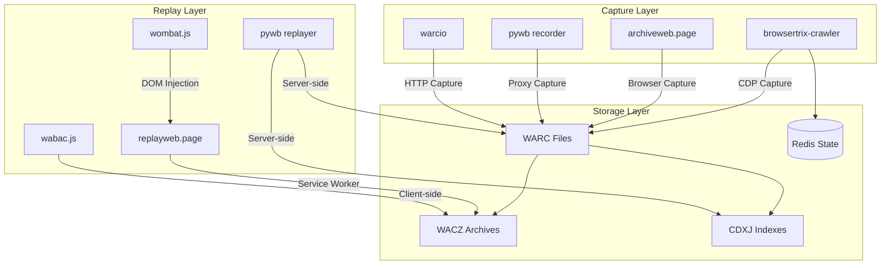
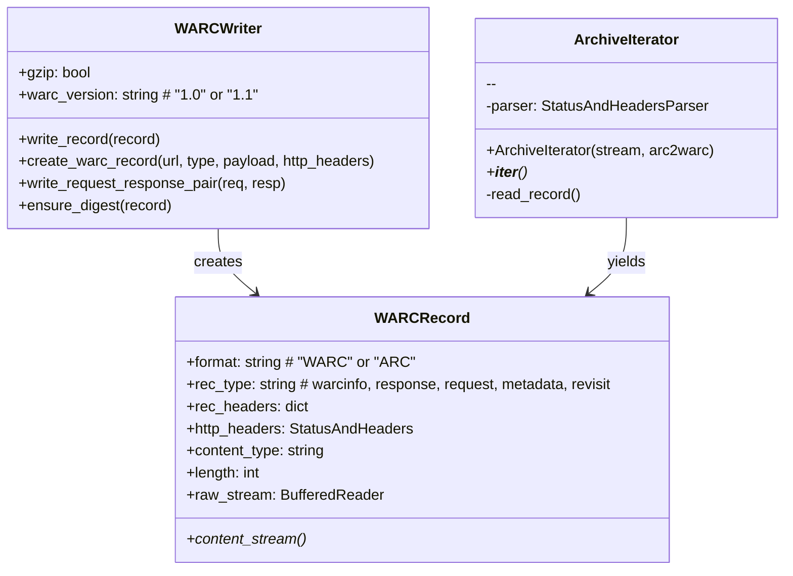
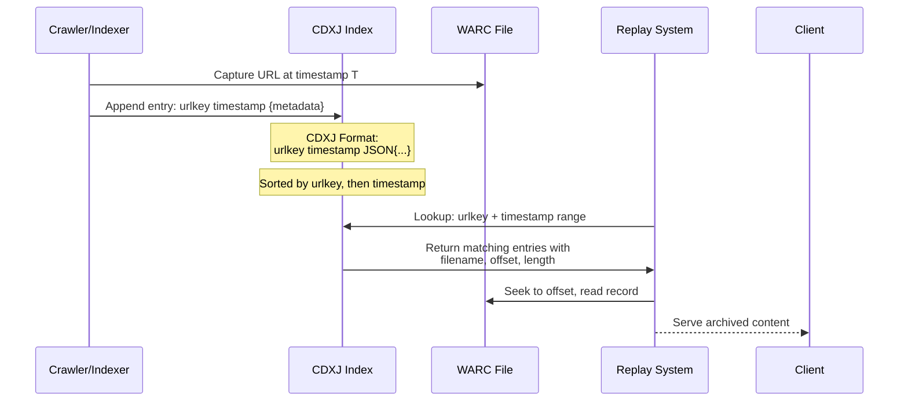
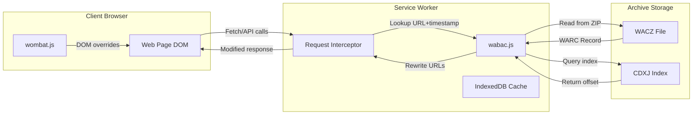
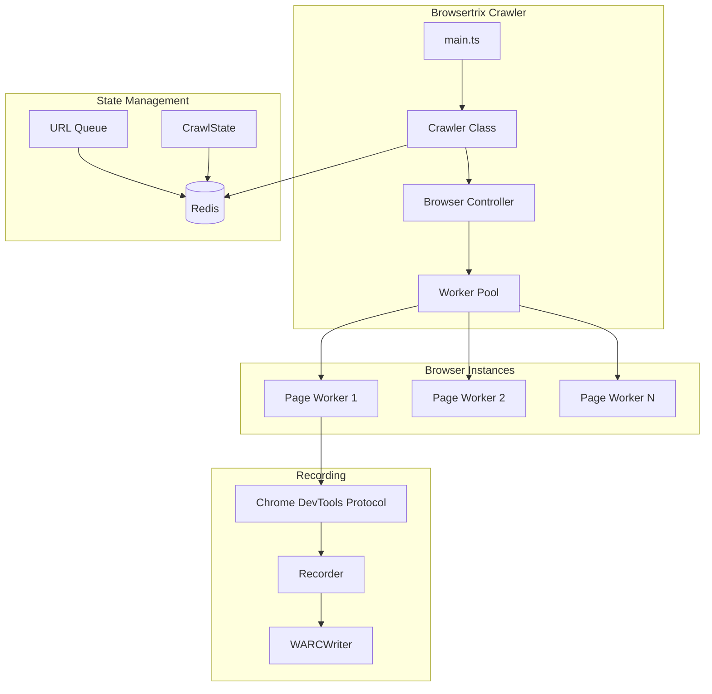
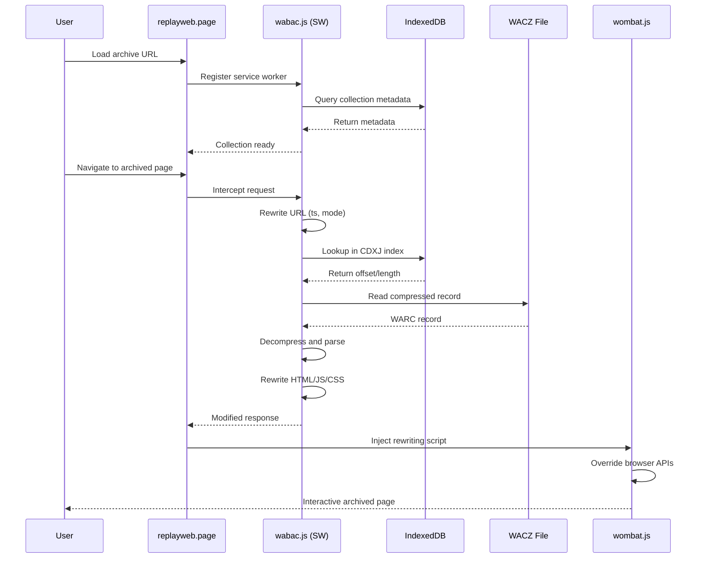

# Webrecorder Ecosystem Exploration

## Overview

The Webrecorder project is a comprehensive web archiving ecosystem comprised of 35+ interconnected repositories that provide tools for capturing, storing, indexing, and replaying web content. Originally developed as a successor to the Internet Archive's Wayback Machine, Webrecorder has evolved into a modular, modern web archiving framework that emphasizes high-fidelity capture of dynamic web content.

The ecosystem spans from low-level WARC file handling (warcio) to browser-based crawling (browsertrix-crawler), server-side replay (pywb), and client-side replay (replayweb.page with wabac.js and wombat). The projects collectively address the full web archiving lifecycle: capture, indexing, storage, and replay.

Key innovations include:
- **WACZ format** - A ZIP-based packaging standard for web archives that bundles WARC files with indexes and metadata
- **CDXJ indexing** - An extensible JSON-based index format for efficient URL+timestamp lookups
- **Dual rewriting systems** - Server-side (pywb) and client-side (wombat.js) URL rewriting for accurate replay
- **Browser-based capture** - Using Chrome DevTools Protocol (CDP) for high-fidelity dynamic content capture

## Repository Information

- **Location:** /home/darkvoid/Boxxed/@formulas/Others/src.webrecorder
- **Remote:** N/A - Local copies (not git repositories)
- **Primary Languages:** Python (backend/core), JavaScript/TypeScript (frontend/browser tools)
- **License:** AGPLv3 (most projects), Apache 2.0 (warcio)

## Directory Structure

```
src.webrecorder/
├── pywb/                          # Core Python web archiving framework (Wayback Machine successor)
│   ├── pywb/                      # Main package
│   │   ├── apps/                  # Web applications (wayback, warcserver, recorder)
│   │   │   ├── wayback.py         # Traditional Wayback Machine interface
│   │   │   ├── warcserverapp.py   # WARC server application
│   │   │   ├── rewriterapp.py     # Content rewriting application
│   │   │   └── frontendapp.py     # Main frontend application
│   │   ├── warcserver/            # WARC server component
│   │   │   ├── warcserver.py      # Main WarcServer class
│   │   │   ├── index/             # Index sources (CDX, CDXJ, Redis)
│   │   │   └── handlers.py        # Request handlers
│   │   ├── rewrite/               # Server-side content rewriting
│   │   │   ├── html_rewriter.py   # HTML parsing and URL rewriting
│   │   │   ├── content_rewriter.py # Content rewriting orchestration
│   │   │   ├── js_rewriter.py     # JavaScript rewriting
│   │   │   └── css_rewriter.py    # CSS rewriting
│   │   ├── indexer/               # CDX/CDXJ index generation
│   │   │   └── cdxindexer.py      # CDXJ indexer
│   │   ├── recorder/              # Recording/capture functionality
│   │   │   └── recorderapp.py     # Recording application
│   │   └── manager/               # Collection management
│   ├── wombat/                    # Embedded wombat (client-side rewriting)
│   ├── docs/                      # Documentation (Sphinx)
│   └── tests/                     # Test suite
│
├── browsertrix-crawler/           # Browser-based high-fidelity web crawler
│   ├── src/
│   │   ├── main.ts                # Entry point
│   │   ├── crawler.ts             # Main Crawler class
│   │   ├── replaycrawler.ts       # QA/replay crawler
│   │   └── util/                  # Utilities
│   │       ├── browser.ts         # Browser control (Puppeteer)
│   │       ├── recorder.ts        # CDP-based recording
│   │       ├── warcwriter.ts      # WARC writing
│   │       ├── wacz.ts            # WACZ generation
│   │       ├── state.ts           # Crawl state management
│   │       ├── sitemapper.ts      # Sitemap handling
│   │       └── redis.ts           # Redis state storage
│   ├── tests/                     # Test suite (Jest)
│   └── docs/                      # MkDocs documentation
│
├── replayweb.page/                # Browser-based web archive replay application
│   ├── src/
│   │   ├── appmain.ts             # Main LitElement application
│   │   ├── item.ts                # Replay item component
│   │   ├── chooser.ts             # Archive source selector
│   │   └── swmanager.ts           # Service worker manager
│   ├── sw.js                      # Service worker (wabac.js)
│   ├── ui.js                      # UI bundle
│   └── mkdocs/                    # Documentation site
│
├── wabac.js/                      # Service worker-based replay engine (TypeScript)
│   ├── src/
│   │   ├── index.ts               # Main exports
│   │   ├── swlib.ts               # Service worker library
│   │   ├── rewrite/               # URL rewriting
│   │   │   ├── html.ts            # HTML rewriting
│   │   │   ├── jsrewriter.ts      # JavaScript rewriting
│   │   │   └── decoder.ts         # Content decoding
│   │   ├── wacz/                  # WACZ file handling
│   │   │   ├── waczloader.ts      # WACZ loading
│   │   │   └── ziprangereader.ts  # ZIP range reading
│   │   ├── archivedb.ts           # Archive database (IndexedDB)
│   │   ├── collection.ts          # Collection management
│   │   └── loaders.ts             # Content loaders
│   └── test/                      # Test suite (AVA)
│
├── wombat/                        # Client-side JavaScript rewriting for replay
│   ├── src/
│   │   ├── wbWombat.js            # Main bundle entry point
│   │   ├── wombat.js              # Core rewriting logic
│   │   ├── wombatProxyMode.js     # Proxy mode (minimal overrides)
│   │   ├── wombatWorkers.js       # Web worker support
│   │   ├── wombatLocation.js      # Location object rewriting
│   │   ├── customStorage.js       # Storage API overrides
│   │   └── listeners.js           # Event listener handling
│   └── test/                      # Comprehensive test suite
│
├── warcio/                        # Python WARC/ARC streaming library
│   ├── warcio/
│   │   ├── warcwriter.py          # WARC writing
│   │   ├── archiveiterator.py     # WARC/ARC iteration
│   │   ├── capture_http.py        # HTTP capture (monkey-patching)
│   │   ├── bufferedreaders.py     # Buffered reading
│   │   └── indexer.py             # Basic indexing
│   └── test/                      # Test suite (pytest)
│
├── warcit/                        # WARC creation and manipulation tool
│
├── cdxj-indexer/                  # CDXJ index format generator
│
├── behaviors/                     # Browser behaviors for dynamic content (deprecated)
│
├── browsertrix-behaviors/         # Predefined capture behaviors
│
├── archiveweb.page/               # Web-based archiving interface
│
├── express.archiveweb.page/       # Express.js backend for ArchiveWeb
│
├── webrecorder-desktop/           # Desktop application
│
├── authsign/                      # Authentication signing service
│
├── wacz-uploader/                 # WACZ uploader
│
├── autoscalar/                    # Auto-scaling for crawler fleets
│
├── specs/                         # Technical specifications (WACZ, CDXJ)
│
└── [additional tools and utilities...]
```

## Architecture

### High-Level System Architecture



### WARC File Format Structure



### CDXJ Indexing and Lookup



### Replay Pipeline Architecture



### Browsertrix Crawling Architecture



## Component Breakdown

### pywb (Python Web Archiving Framework)

**Location:** `/home/darkvoid/Boxxed/@formulas/Others/src.webrecorder/pywb`

**Purpose:** Core Python web archiving framework providing server-side WARC replay, recording, and indexing capabilities. Successor to the OpenWayback project.

**Dependencies:**
- Python 3.7-3.11
- gevent (async networking)
- warcio (WARC handling)
- Redis (optional, for state/dedup)
- PyYAML (configuration)

**Key Components:**

| Component | File | Purpose |
|-----------|------|---------|
| WarcServer | `warcserver/warcserver.py` | Core HTTP server for WARC replay |
| FrontEndApp | `apps/frontendapp.py` | Main web application |
| HTMLRewriter | `rewrite/html_rewriter.py` | HTML parsing and URL rewriting |
| ContentRewriter | `rewrite/content_rewriter.py` | Content type detection and rewriting |
| CDXIndexer | `indexer/cdxindexer.py` | CDXJ index generation |
| RecorderApp | `recorder/recorderapp.py` | Proxy-mode recording |

**Entry Points:**
- `pywb` / `wayback` - Main wayback machine CLI
- `cdx-server` - CDX server for index queries
- `warcserver` - Standalone WARC server
- `cdx-indexer` - Command-line CDXJ indexer
- `wb-manager` - Collection management

### browsertrix-crawler

**Location:** `/home/darkvoid/Boxxed/@formulas/Others/src.webrecorder/browsertrix-crawler`

**Purpose:** High-fidelity browser-based web crawler using Puppeteer and Chrome DevTools Protocol for capturing dynamic web content into WARC/WACZ formats.

**Dependencies:**
- Node.js with experimental Web Crypto
- Puppeteer Core (browser control)
- browsertrix-behaviors (auto-extraction)
- Redis (crawl state)
- warcio (WARC writing)
- sharp (image processing)

**Key Components:**

| Component | File | Purpose |
|-----------|------|---------|
| Crawler | `src/crawler.ts` | Main crawler orchestration |
| ReplayCrawler | `src/replaycrawler.ts` | QA/replay validation |
| Browser | `src/util/browser.ts` | Browser instance management |
| Recorder | `src/util/recorder.ts` | CDP-based request recording |
| WARCWriter | `src/util/warcwriter.ts` | WARC file writing |
| WACZ | `src/util/wacz.ts` | WACZ generation |
| RedisCrawlState | `src/util/state.ts` | Distributed state management |

**Entry Points:**
- `browsertrix-crawler` - Main crawler CLI
- `browsertrix-crawler-qa` - QA/replay crawler

**Execution Flow:**
1. Parse CLI arguments and YAML config
2. Initialize Redis connection for state
3. Launch browser instances (configurable count)
4. Seed URL queue from provided seeds
5. Workers fetch URLs, execute behaviors, record via CDP
6. Write WARC records, update state
7. Generate WACZ and indexes on completion

### replayweb.page

**Location:** `/home/darkvoid/Boxxed/@formulas/Others/src.webrecorder/replayweb.page`

**Purpose:** Browser-based web archive viewer that runs entirely client-side using service workers for replay.

**Dependencies:**
- Lit (UI components)
- wabac.js (service worker replay)
- wombat (client-side rewriting)
- webpack (bundling)
- Electron (desktop app)

**Key Components:**

| Component | File | Purpose |
|-----------|------|---------|
| ReplayWebApp | `src/appmain.ts` | Main LitElement application |
| SWManager | `src/swmanager.ts` | Service worker registration |
| Chooser | `src/chooser.ts` | Archive source selection |
| wr-item | `src/item.ts` | Replay component |

**Entry Points:**
- `ui.js` - Main UI bundle
- `sw.js` - Service worker (wabac.js)

### wombat

**Location:** `/home/darkvoid/Boxxed/@formulas/Others/src.webrecorder/wombat`

**Purpose:** Client-side JavaScript URL rewriting system that applies targeted overrides to browser APIs for accurate web archive replay.

**Bundle Structure:**
- `wombat.js` - Primary bundle for non-proxy recording/replay
- `wombatProxyMode.js` - Minimal overrides for proxy recording
- `wombatWorkers.js` - Web worker support

**Key Components:**

| Component | File | Purpose |
|-----------|------|---------|
| wbWombat.js | `src/wbWombat.js` | Main entry point |
| wombat.js | `src/wombat.js` | Core rewriting logic |
| wombatLocation.js | `src/wombatLocation.js` | Location object rewriting |
| customStorage.js | `src/customStorage.js` | localStorage/sessionStorage overrides |
| listeners.js | `src/listeners.js` | Event listener handling |
| funcMap.js | `src/funcMap.js` | Function mappings |

**Rewriting Approach:**
Wombat overrides native browser APIs including:
- `XMLHttpRequest`, `fetch()` - Network requests
- `document.cookie` - Cookie access
- `localStorage`, `sessionStorage` - Storage APIs
- `history.pushState`, `history.replaceState` - History manipulation
- `Location` object - URL access
- `Worker`, `ServiceWorker` - Worker creation
- `document.createElement` - Element creation for src/href rewriting

### warcio

**Location:** `/home/darkvoid/Boxxed/@formulas/Others/src.webrecorder/warcio`

**Purpose:** Fast, standalone Python library for reading and writing WARC (and ARC) format files. Used throughout the Webrecorder ecosystem.

**Dependencies:**
- Python 3.7+
- six (compatibility)

**Key Components:**

| Component | File | Purpose |
|-----------|------|---------|
| WARCWriter | `warcio/warcwriter.py` | WARC file writing |
| ArchiveIterator | `warcio/archiveiterator.py` | WARC/ARC streaming |
| capture_http | `warcio/capture_http.py` | HTTP monkey-patching |
| StatusAndHeaders | `warcio/statusandheaders.py` | HTTP header parsing |
| LimitReader | `warcio/limitreader.py` | Stream limiting |
| DigestVerifyingReader | `warcio/digestverifyingreader.py` | Digest verification |

**Entry Points:**
- `warcio index` - Generate JSON lines index
- `warcio check` - Verify digests
- `warcio recompress` - Normalize compression
- `warcio extract` - Extract records by offset

### wabac.js

**Location:** `/home/darkvoid/Boxxed/@formulas/Others/src.webrecorder/wabac.js`

**Purpose:** Service worker-based replay engine that provides server-side-like rewriting in the browser, enabling fully client-side web archive replay.

**Dependencies:**
- TypeScript
- warcio (JavaScript port)
- @webrecorder/wombat
- idb (IndexedDB wrapper)
- pako (decompression)

**Key Components:**

| Component | File | Purpose |
|-----------|------|---------|
| Rewriter | `src/rewrite/index.ts` | URL rewriting core |
| ArchiveRequest | `src/request.ts` | Request handling |
| ArchiveResponse | `src/response.ts` | Response generation |
| ZipRangeReader | `src/wacz/ziprangereader.ts` | ZIP random access |
| createLoader | `src/blockloaders.ts` | Content loading |
| FuzzyMatcher | `src/fuzzymatcher.ts` | URL matching |

**Entry Points:**
- `@webrecorder/wabac` - General module (rewriting, WACZ reading)
- `@webrecorder/wabac/swlib` - Service worker extension library

## Data Flow



## External Dependencies

### Core Python Dependencies (pywb)

| Dependency | Purpose |
|------------|---------|
| gevent | Async networking |
| warcio | WARC/ARC handling |
| PyYAML | Configuration parsing |
| six | Python 2/3 compatibility |
| webencodings | Character encoding detection |
| redis | State management (optional) |

### Core JavaScript Dependencies (browsertrix-crawler, replayweb.page, wabac.js)

| Dependency | Project | Purpose |
|------------|---------|---------|
| puppeteer-core | browsertrix-crawler | Browser automation |
| browsertrix-behaviors | browsertrix-crawler | Auto-extraction behaviors |
| ioredis | browsertrix-crawler | Redis client |
| sharp | browsertrix-crawler | Image processing |
| Lit | replayweb.page | UI components |
| idb | wabac.js | IndexedDB wrapper |
| pako | wabac.js | GZIP/deflate |
| parse5 | wabac.js | HTML parsing |
| acorn | wabac.js | JavaScript parsing |

## Configuration

### pywb Configuration

pywb uses YAML configuration files (`config.yaml`):

```yaml
collections_root: ./collections
collections:
  mycoll:
    index_paths: ./collections/mycoll/indexes
    archive_paths: ./collections/mycoll/archive
    access: open
recorder:
  source_coll: live
proxy:
  enable: true
```

### browsertrix-crawler Configuration

Supports CLI arguments and YAML config:

```yaml
seeds:
  - https://example.com
  - https://example.org
scopeType: prefix
depth: 2
workers: 4
behaviors: autoplay, autoscroll, siteSpecific
generateWACZ: true
```

### replayweb.page Configuration

Configured via URL parameters:
- `?source=<url>` - Archive source (WACZ, WARC, URL)
- `?embed=<mode>` - Embed mode (full, compact)
- `?config=<json>` - Extra configuration

## Testing

### pywb Testing
- **Framework:** pytest with gevent
- **Command:** `tox --current-env` or `python run-tests.py`
- **Coverage:** Unit tests for rewriting, indexing, recording
- **Test data:** Sample WARC files in `sample_archive/`

### browsertrix-crawler Testing
- **Framework:** Jest
- **Command:** `yarn test`
- **Test types:** Integration tests with live crawling
- **Timeout:** 90 seconds per test

### replayweb.page Testing
- **Framework:** Playwright
- **Command:** `yarn test` (via playwright.config.js)
- **Test types:** UI interaction, service worker behavior

### wombat Testing
- **Framework:** Custom (Karma-based)
- **Test structure:** Direct and iframe-based tests
- **Coverage:** Browser API overrides validation

### wabac.js Testing
- **Framework:** AVA
- **Command:** `c8 ava`
- **Coverage:** c8 for coverage reporting

## Key Insights for Engineers

1. **Dual Rewriting Strategy:** Webrecorder uses both server-side (pywb) and client-side (wombat.js) URL rewriting. Server-side rewriting modifies content before delivery, while client-side rewriting intercepts DOM/network operations at runtime. This dual approach ensures compatibility with both traditional server-based replay and modern serverless replay.

2. **WARC as the Universal Format:** All capture tools output WARC files, which are then optionally packaged into WACZ (ZIP-based) archives. This decoupling allows different capture methods to feed into the same replay systems.

3. **CDXJ Index Design:** The CDXJ format (`urlkey timestamp JSON{...}`) enables efficient binary search lookups and is extensible with arbitrary metadata. The URL key is typically SURT-transformed for prefix-based matching.

4. **Browsertrix's CDP Approach:** Unlike traditional crawlers that parse HTML, browsertrix-crawler uses Chrome DevTools Protocol to intercept all network requests at the browser level, capturing resources that would be missed by static analysis (dynamically loaded content, WebSocket messages, etc.).

5. **WACZ Format Innovation:** WACZ packages WARC files with CDXJ indexes, metadata (datapackage.json), and optionally TLS signatures into a single ZIP file, enabling portable, verifiable web archives that can be loaded directly in the browser.

6. **Service Worker Replay:** replayweb.page's architecture demonstrates that full web archive replay is possible without any server component - the service worker intercepts all requests, looks up content in IndexedDB, and returns rewritten responses.

7. **Behavioral Capture:** browsertrix-behaviors provides predefined scripts that are injected into pages during crawling to trigger dynamic content loading (infinite scroll, lazy-loaded images, etc.) ensuring more complete captures.

## Open Questions

1. **Deduplication Strategy:** How is cross-archive deduplication handled? The `dedup_index_url` configuration suggests Redis-based dedup, but the exact algorithm and scaling characteristics are unclear.

2. **WACZ Authentication:** The `authsign` project suggests signed WACZ archives, but the full authentication flow and trust model needs investigation.

3. **Multi-Collection Aggregation:** How does pywb's Memento API aggregator handle multiple remote sources? What are the performance characteristics of federated queries?

4. **Replay Fidelity Metrics:** What mechanisms exist for validating that replayed content matches the original? The QA crawler suggests some comparison capability.

5. **Scaling Characteristics:** How do the different components scale horizontally? The `autoscalar` project suggests auto-scaling support for crawler fleets, but deployment patterns are unclear.

6. **Access Control Implementation:** pywb mentions access control (embargoes, blocking), but the full implementation details and integration with external auth systems needs exploration.

7. **Localization Support:** pywb 2.6+ supports localization, but the mechanism for translating UI strings and the available language packs needs investigation.
