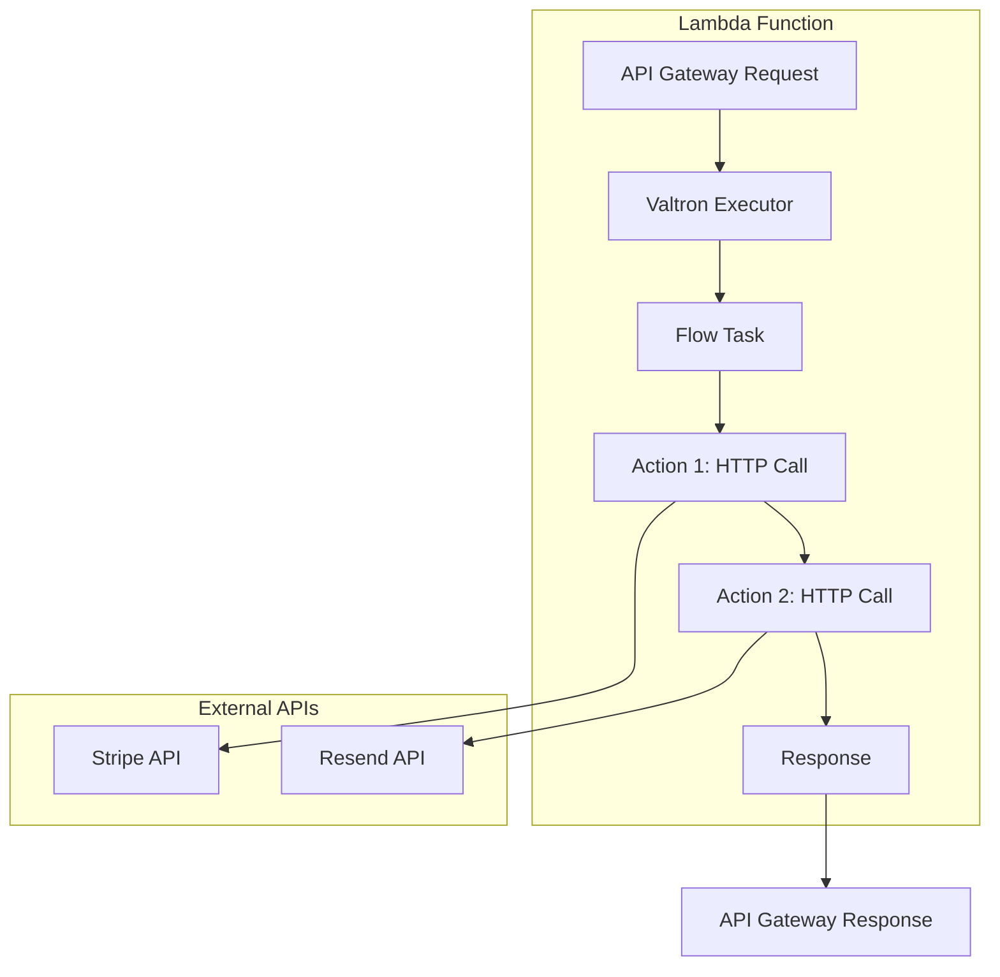

# Valtron Integration: Lambda Deployment

## Introduction

This guide shows how to deploy Wildcard-AI flow execution to AWS Lambda using the **valtron** executor - **NO async/await, NO tokio**. We use valtron's iterator-based task model for deterministic, single-threaded execution.

### Why Valtron for Lambda?

| Aspect | Tokio/Async | Valtron |
|--------|-------------|---------|
| **Binary Size** | ~5-10MB runtime | ~100KB runtime |
| **Cold Start** | Slow (runtime init) | Fast (minimal runtime) |
| **Memory** | High overhead | Minimal overhead |
| **Threading** | Multi-threaded | Single-threaded (perfect for Lambda) |
| **Model** | Future/poll | Iterator/next |
| **Complexity** | High | Low |

### Architecture Overview



---

## Part 1: Valtron Task Model

### The TaskIterator Trait

All async operations in valtron are iterators:

```rust
use foundation_core::valtron::{TaskIterator, TaskStatus, NoSpawner};

pub enum TaskStatus<Ready, Pending, Spawner> {
    Ready(Ready),      // Task has a value
    Pending(Pending),  // Task is waiting
    Spawn(Spawner),    // Task wants to spawn sub-task
}

pub trait TaskIterator {
    type Ready;
    type Pending;
    type Spawner;

    fn next(&mut self) -> Option<TaskStatus<Self::Ready, Self::Pending, Self::Spawner>>;
}
```

### Simple Example: Counter Task

```rust
struct Counter {
    current: usize,
    max: usize,
}

impl Counter {
    fn new(max: usize) -> Self {
        Self { current: 0, max }
    }
}

impl TaskIterator for Counter {
    type Ready = usize;
    type Pending = ();
    type Spawner = NoSpawner;

    fn next(&mut self) -> Option<TaskStatus<Self::Ready, Self::Pending, Self::Spawner>> {
        if self.current >= self.max {
            return None;  // Task complete
        }

        self.current += 1;
        Some(TaskStatus::Ready(self.current))
    }
}
```

**Usage:**
```rust
use foundation_core::valtron::single::{initialize, run_until_complete, spawn};
use foundation_core::valtron::FnReady;

fn main() {
    initialize(42);  // Seed for reproducibility

    spawn()
        .with_task(Counter::new(5))
        .with_resolver(Box::new(FnReady::new(|value, _| {
            println!("Count: {}", value);
        })))
        .schedule()
        .unwrap();

    run_until_complete();
}
```

---

## Part 2: HTTP Task for API Calls

### HTTP Request Task

```rust
use foundation_core::valtron::{TaskIterator, TaskStatus, NoSpawner};
use reqwest::blocking::{Client, Response};
use serde_json::Value;

pub enum HttpTaskState {
    Initial,
    Waiting,
    Done,
}

pub struct HttpTask {
    client: Client,
    method: String,
    url: String,
    headers: std::collections::HashMap<String, String>,
    body: Option<Value>,
    state: HttpTaskState,
    response: Option<Value>,
}

impl HttpTask {
    pub fn new(
        method: String,
        url: String,
        headers: std::collections::HashMap<String, String>,
        body: Option<Value>,
    ) -> Self {
        Self {
            client: Client::new(),
            method,
            url,
            headers,
            body,
            state: HttpTaskState::Initial,
            response: None,
        }
    }
}

impl TaskIterator for HttpTask {
    type Ready = Value;
    type Pending = ();
    type Spawner = NoSpawner;

    fn next(&mut self) -> Option<TaskStatus<Self::Ready, Self::Pending, Self::Spawner>> {
        match &self.state {
            HttpTaskState::Initial => {
                // Build and execute request
                let mut request = match self.method.as_str() {
                    "GET" => self.client.get(&self.url),
                    "POST" => self.client.post(&self.url),
                    "PUT" => self.client.put(&self.url),
                    "DELETE" => self.client.delete(&self.url),
                    "PATCH" => self.client.patch(&self.url),
                    _ => panic!("Unsupported method"),
                };

                // Add headers
                for (key, value) in &self.headers {
                    request = request.header(key, value);
                }

                // Add body if present
                if let Some(body) = &self.body {
                    request = request.json(body);
                }

                // Execute (blocking - fine for Lambda)
                match request.send() {
                    Ok(resp) => {
                        self.response = resp.json().ok();
                        self.state = HttpTaskState::Done;
                    }
                    Err(e) => {
                        // Return error as JSON
                        self.response = Some(json!({"error": e.to_string()}));
                        self.state = HttpTaskState::Done;
                    }
                }

                Some(TaskStatus::Pending(()))
            }
            HttpTaskState::Waiting => {
                self.state = HttpTaskState::Done;
                Some(TaskStatus::Pending(()))
            }
            HttpTaskState::Done => {
                let result = self.response.take().unwrap_or(json!({"error": "No response"}));
                Some(TaskStatus::Ready(result))
            }
        }
    }
}
```

### Simplified Blocking Version for Lambda

For Lambda, we can use a simpler blocking approach:

```rust
use foundation_core::valtron::{TaskIterator, TaskStatus, NoSpawner};
use reqwest::blocking::{Client, Response};
use serde_json::Value;

pub struct BlockingHttpTask {
    client: Client,
    method: String,
    url: String,
    headers: std::collections::HashMap<String, String>,
    body: Option<Value>,
    executed: bool,
}

impl BlockingHttpTask {
    pub fn new(
        method: String,
        url: String,
        headers: std::collections::HashMap<String, String>,
        body: Option<Value>,
    ) -> Self {
        Self {
            client: Client::new(),
            method,
            url,
            headers,
            body,
            executed: false,
        }
    }
}

impl TaskIterator for BlockingHttpTask {
    type Ready = Value;
    type Pending = ();
    type Spawner = NoSpawner;

    fn next(&mut self) -> Option<TaskStatus<Self::Ready, Self::Pending, Self::Spawner>> {
        if self.executed {
            return None;
        }

        self.executed = true;

        // Build request
        let mut request = match self.method.as_str() {
            "GET" => self.client.get(&self.url),
            "POST" => self.client.post(&self.url),
            "PUT" => self.client.put(&self.url),
            "DELETE" => self.client.delete(&self.url),
            "PATCH" => self.client.patch(&self.url),
            _ => panic!("Unsupported method"),
        };

        // Add headers
        for (key, value) in &self.headers {
            request = request.header(key, value);
        }

        // Add body
        if let Some(body) = &self.body {
            request = request.json(body);
        }

        // Execute and return
        match request.send() {
            Ok(resp) => {
                let result: Value = resp.json().unwrap_or(json!({"error": "Failed to parse"}));
                Some(TaskStatus::Ready(result))
            }
            Err(e) => {
                Some(TaskStatus::Ready(json!({"error": e.to_string()})))
            }
        }
    }
}
```

---

## Part 3: Flow Execution Task

### Flow Execution State

```rust
use foundation_core::valtron::{TaskIterator, TaskStatus, NoSpawner};
use serde_json::Value;
use std::collections::HashMap;

pub struct FlowExecutionTask {
    flow: Flow,
    execution_trace: HashMap<String, ActionTrace>,
    current_action_index: usize,
    client: reqwest::blocking::Client,
    auth: AuthConfig,
}

pub struct ActionTrace {
    parameters: Value,
    request_body: Value,
    response: Option<Value>,
}

impl FlowExecutionTask {
    pub fn new(flow: Flow, auth: AuthConfig) -> Self {
        Self {
            flow,
            execution_trace: HashMap::new(),
            current_action_index: 0,
            client: reqwest::blocking::Client::new(),
            auth,
        }
    }

    fn execute_action(&mut self) -> Value {
        let action = &self.flow.actions[self.current_action_index];

        // Resolve links for this action
        let (params, body) = self.resolve_links(action);

        // Get integration map for this source
        let integration = get_integration(&action.sourceId);

        // Execute via integration
        let response = integration.execute(
            &self.client,
            &action.operationId,
            &self.auth,
            params,
            body,
        );

        // Store in trace
        self.execution_trace.insert(
            action.id.clone(),
            ActionTrace {
                parameters: params,
                request_body: body,
                response: Some(response.clone()),
            },
        );

        response
    }

    fn resolve_links(&self, action: &Action) -> (Value, Value) {
        let mut params = json!({});
        let mut body = json!({});

        // Find links targeting this action
        if let Some(links) = &self.flow.links {
            for link in links {
                if link.target.action_id.as_ref() == Some(&action.id) {
                    // Get source value
                    let source_value = self.get_link_source(&link.origin);

                    // Apply to target
                    let target_path = &link.target.field_path;
                    if target_path.starts_with("parameters") {
                        set_json_path(&mut params, target_path, source_value);
                    } else if target_path.starts_with("requestBody") {
                        set_json_path(&mut body, target_path, source_value);
                    }
                }
            }
        }

        (params, body)
    }

    fn get_link_source(&self, origin: &LinkOrigin) -> Value {
        let action_id = match &origin.action_id {
            Some(id) => id,
            None => return json!(null),  // Flow parameters
        };

        let trace = match self.execution_trace.get(action_id) {
            Some(t) => t,
            None => return json!(null),
        };

        // Extract value from response using field path
        get_json_path(&trace.response.clone().unwrap_or(json!(null)), &origin.field_path)
            .unwrap_or(json!(null))
    }
}

impl TaskIterator for FlowExecutionTask {
    type Ready = Value;
    type Pending = ();
    type Spawner = NoSpawner;

    fn next(&mut self) -> Option<TaskStatus<Self::Ready, Self::Pending, Self::Spawner>> {
        if self.current_action_index >= self.flow.actions.len() {
            // All actions complete, return aggregated response
            let response = self.aggregate_response();
            return Some(TaskStatus::Ready(response));
        }

        // Execute current action
        self.execute_action();
        self.current_action_index += 1;

        // Return pending to continue iteration
        Some(TaskStatus::Pending(()))
    }
}

impl FlowExecutionTask {
    fn aggregate_response(&self) -> Value {
        // Check for flow response links
        if let Some(links) = &self.flow.links {
            let response_links: Vec<_> = links
                .iter()
                .filter(|l| {
                    l.target.action_id.is_none()
                    && l.target.field_path.starts_with("responses")
                })
                .collect();

            if !response_links.is_empty() {
                let mut result = json!({});
                for link in response_links {
                    let source_value = self.get_link_source(&link.origin);
                    set_json_path(&mut result, &link.target.field_path, source_value);
                }
                return result;
            }
        }

        // Default: return last action's response
        let last_action = self.flow.actions.last().unwrap();
        self.execution_trace
            .get(&last_action.id)
            .and_then(|t| t.response.clone())
            .unwrap_or(json!({}))
    }
}
```

---

## Part 4: Lambda Handler

### Handler Structure

```rust
use aws_lambda_events::encodings::Body;
use lambda_runtime::{run, service_fn, Error, LambdaEvent};
use serde::{Deserialize, Serialize};
use foundation_core::valtron::single::{initialize, run_until_complete, spawn, block_iter};
use foundation_core::valtron::FnReady;

// Request/Response types
#[derive(Deserialize)]
struct LambdaRequest {
    flow_id: String,
    parameters: serde_json::Value,
    auth: AuthConfig,
}

#[derive(Serialize)]
struct LambdaResponse {
    result: serde_json::Value,
}

// Main handler
async fn function_handler(event: LambdaRequest) -> Result<LambdaResponse, Error> {
    // Initialize valtron executor with deterministic seed
    initialize(42);

    // Load flow definition (from bundle, cache, or S3)
    let flow = load_flow(&event.flow_id)?;

    // Create flow execution task
    let task = FlowExecutionTask::new(flow, event.auth);

    // Execute flow
    let mut result = None;

    spawn()
        .with_task(task)
        .with_resolver(Box::new(FnReady::new(|value, _| {
            result = Some(value);
        })))
        .schedule()
        .expect("Failed to schedule flow task");

    run_until_complete();

    Ok(LambdaResponse {
        result: result.unwrap_or(json!({"error": "No result"})),
    })
}

#[tokio::main]
async fn main() -> Result<(), Error> {
    tracing_subscriber::fmt()
        .with_max_level(tracing::Level::INFO)
        .with_target(false)
        .with_ansi(false)
        .init();

    run(service_fn(function_handler)).await
}
```

### Pure Valtron Version (No Tokio)

For minimal Lambda, use valtron's single-threaded executor only:

```rust
use lambda_runtime::{run, service_fn, Error, LambdaEvent};
use serde::{Deserialize, Serialize};
use foundation_core::valtron::single::{initialize, run_until_complete, spawn};
use foundation_core::valtron::FnReady;

#[derive(Deserialize)]
struct LambdaRequest {
    flow_id: String,
    parameters: serde_json::Value,
    auth: AuthConfig,
}

#[derive(Serialize)]
struct LambdaResponse {
    result: serde_json::Value,
}

fn execute_flow_sync(event: LambdaRequest) -> Result<LambdaResponse, Error> {
    // Initialize valtron
    initialize(42);

    // Load flow
    let flow = load_flow(&event.flow_id)?;

    // Create and execute task
    let task = FlowExecutionTask::new(flow, event.auth);

    // Use blocking iterator
    let mut result = None;

    for status in spawn()
        .with_task(task)
        .iter()
    {
        if let foundation_core::valtron::TaskStatus::Ready(value) = status {
            result = Some(value);
        }
    }

    Ok(LambdaResponse {
        result: result.unwrap_or(json!({"error": "No result"})),
    })
}

// Lambda entry point
#[lambda_runtime::main]
async fn main() -> Result<(), Error> {
    run(service_fn(|event: LambdaEvent<LambdaRequest>| async move {
        let payload = event.payload;
        let result = execute_flow_sync(payload)?;
        Ok(result)
    })).await
}
```

---

## Part 5: Integration Layer

### Integration Trait

```rust
use reqwest::blocking::Client;
use serde_json::Value;

pub trait Integration {
    fn source_id(&self) -> &str;
    fn execute(
        &self,
        client: &Client,
        operation_id: &str,
        auth: &AuthConfig,
        parameters: Value,
        request_body: Value,
    ) -> Value;
}
```

### Stripe Integration Example

```rust
use reqwest::blocking::Client;
use serde_json::{json, Value};
use std::collections::HashMap;

pub struct StripeIntegration {
    operations: HashMap<String, StripeOperation>,
}

struct StripeOperation {
    method: String,
    path: String,
}

impl StripeIntegration {
    pub fn new() -> Self {
        let mut operations = HashMap::new();

        operations.insert(
            "stripe_post_products".to_string(),
            StripeOperation {
                method: "POST".to_string(),
                path: "/v1/products".to_string(),
            },
        );

        operations.insert(
            "stripe_post_prices".to_string(),
            StripeOperation {
                method: "POST".to_string(),
                path: "/v1/prices".to_string(),
            },
        );

        Self { operations }
    }
}

impl Integration for StripeIntegration {
    fn source_id(&self) -> &str {
        "stripe"
    }

    fn execute(
        &self,
        client: &Client,
        operation_id: &str,
        auth: &AuthConfig,
        parameters: Value,
        request_body: Value,
    ) -> Value {
        let operation = match self.operations.get(operation_id) {
            Some(op) => op,
            None => return json!({"error": format!("Unknown operation: {}", operation_id)}),
        };

        // Build URL
        let base_url = "https://api.stripe.com";
        let url = format!("{}{}", base_url, operation.path);

        // Build request
        let mut request = match operation.method.as_str() {
            "POST" => client.post(&url),
            "GET" => client.get(&url),
            "PUT" => client.put(&url),
            "DELETE" => client.delete(&url),
            _ => return json!({"error": "Unsupported method"}),
        };

        // Add Stripe auth
        if let AuthConfig::Bearer(token) = auth {
            request = request.header("Authorization", format!("Bearer {}", token));
        }

        // Stripe uses form-encoded for POST
        if operation.method == "POST" {
            let mut form_data = Vec::new();

            // Flatten parameters
            if let Value::Object(params) = parameters {
                for (key, value) in params {
                    form_data.push((key, value.to_string()));
                }
            }

            // Flatten request body
            if let Value::Object(body) = request_body {
                for (key, value) in body {
                    form_data.push((key, value.to_string()));
                }
            }

            request = request.form(&form_data);
        }

        // Execute
        match request.send() {
            Ok(resp) => {
                match resp.json::<Value>() {
                    Ok(json) => json,
                    Err(_) => json!({"error": "Failed to parse response"}),
                }
            }
            Err(e) => json!({"error": e.to_string()}),
        }
    }
}
```

### Integration Registry

```rust
use std::collections::HashMap;
use std::sync::OnceLock;

static INTEGRATIONS: OnceLock<HashMap<String, Box<dyn Integration>>> = OnceLock::new();

pub fn register_integrations() {
    let mut map = HashMap::new();
    map.insert("stripe".to_string(), Box::new(StripeIntegration::new()) as Box<dyn Integration>);
    map.insert("resend".to_string(), Box::new(ResendIntegration::new()) as Box<dyn Integration>);
    // Add more integrations...

    INTEGRATIONS.set(map).expect("Failed to set integrations");
}

pub fn get_integration(source_id: &str) -> &'static dyn Integration {
    INTEGRATIONS
        .get()
        .expect("Integrations not initialized")
        .get(source_id)
        .expect(&format!("Unknown integration: {}", source_id))
        .as_ref()
}
```

---

## Part 6: Deployment

### Cargo.toml

```toml
[package]
name = "wildcard-ai-lambda"
version = "0.1.0"
edition = "2021"

[dependencies]
# Valtron (no tokio!)
foundation_core = { path = "/path/to/foundation_core" }

# Lambda runtime
lambda_runtime = "0.11"
aws_lambda_events = "0.15"

# HTTP client (blocking for Lambda)
reqwest = { version = "0.12", features = ["blocking", "json"], default-features = false }

# Serialization
serde = { version = "1.0", features = ["derive"] }
serde_json = "1.0"

# Utilities
tracing = "0.1"
tracing-subscriber = "0.3"
```

### Build for Lambda

```bash
# Cross-compile for Amazon Linux 2
docker run --rm -it \
  -v "$(pwd)":/code \
  -w /code \
  amazonlinux:2 bash -c "
    yum install -y gcc musl-dev
    curl --proto '=https' --tlsv1.2 -sSf https://sh.rustup.rs | sh -s -- -y
    source ~/.cargo/env
    rustup target add x86_64-unknown-linux-musl
    cargo build --release --target x86_64-unknown-linux-musl
  "

# Package for Lambda
zip -j lambda.zip target/x86_64-unknown-linux-musl/release/wildcard-ai-lambda

# Deploy via AWS CLI
aws lambda create-function \
  --function-name wildcard-ai-executor \
  --runtime provided.al2023 \
  --handler bootstrap \
  --role arn:aws:iam::123456789:role/lambda-execution \
  --zip-file fileb://lambda.zip \
  --timeout 30 \
  --memory-size 512
```

### SAM Template

```yaml
AWSTemplateFormatVersion: '2010-09-09'
Transform: AWS::Serverless-2016-10-31

Resources:
  WildcardAiFunction:
    Type: AWS::Serverless::Function
    Properties:
      FunctionName: wildcard-ai-executor
      Description: Execute Wildcard-AI flows
      Runtime: provided.al2023
      Handler: bootstrap
      MemorySize: 512
      Timeout: 30
      Architectures:
        - x86_64
      Events:
        ApiEvent:
          Type: Api
          Properties:
            Path: /execute
            Method: post

      Environment:
        Variables:
          RUST_LOG: info
```

---

## Part 7: API Gateway Integration

### Request Handler

```rust
use lambda_runtime::{Error, LambdaEvent};
use serde::{Deserialize, Serialize};
use serde_json::Value;

#[derive(Deserialize)]
struct ApiGatewayRequest {
    body: String,
    // ... other API Gateway fields
}

#[derive(Serialize)]
struct ApiGatewayResponse {
    statusCode: u16,
    headers: std::collections::HashMap<String, String>,
    body: String,
}

async fn api_handler(event: LambdaEvent<ApiGatewayRequest>) -> Result<ApiGatewayResponse, Error> {
    // Parse request body
    let request: LambdaRequest = serde_json::from_str(&event.payload.body)?;

    // Execute flow
    let response = execute_flow_sync(request)?;

    // Format API Gateway response
    Ok(ApiGatewayResponse {
        statusCode: 200,
        headers: [("Content-Type".to_string(), "application/json".to_string())]
            .into_iter()
            .collect(),
        body: serde_json::to_string(&response)?,
    })
}
```

### Error Handling

```rust
use serde::Serialize;

#[derive(Serialize)]
struct ErrorResponse {
    error: String,
    code: String,
}

fn handle_error(e: Error) -> ApiGatewayResponse {
    let error_response = ErrorResponse {
        error: e.to_string(),
        code: "EXECUTION_ERROR".to_string(),
    };

    ApiGatewayResponse {
        statusCode: 500,
        headers: [("Content-Type".to_string(), "application/json".to_string())]
            .into_iter()
            .collect(),
        body: serde_json::to_string(&error_response).unwrap(),
    }
}
```

---

## Part 8: Testing Locally

### Local Test Harness

```rust
use foundation_core::valtron::single::{initialize, run_until_complete};

fn test_flow_execution() {
    initialize(42);

    let flow = Flow {
        id: "test_flow".to_string(),
        title: "Test Flow".to_string(),
        description: "A test flow".to_string(),
        actions: vec![
            Action {
                id: "action1".to_string(),
                source_id: "stripe".to_string(),
                operation_id: "stripe_get_balance".to_string(),
            },
        ],
        links: None,
        fields: Fields {
            parameters: vec![],
            request_body: None,
            responses: Responses {
                success: json!({"type": "object"}),
                example: None,
            },
        },
    };

    let auth = AuthConfig::ApiKey("sk_test_123".to_string());
    let task = FlowExecutionTask::new(flow, auth);

    let mut result = None;
    for status in spawn().with_task(task).iter() {
        if let TaskStatus::Ready(value) = status {
            result = Some(value);
        }
    }

    println!("Result: {:?}", result);
    assert!(result.is_some());
}
```

### Integration Tests

```rust
#[cfg(test)]
mod tests {
    use super::*;

    #[test]
    fn test_stripe_integration() {
        initialize(42);

        let integration = StripeIntegration::new();
        let result = integration.execute(
            &Client::new(),
            "stripe_get_balance",
            &AuthConfig::ApiKey("sk_test_123".to_string()),
            json!({}),
            json!({}),
        );

        // Should either succeed or return a proper error
        assert!(result.is_object());
    }

    #[test]
    fn test_flow_with_links() {
        // Test multi-action flow with link resolution
        // ...
    }
}
```

---

## Part 9: Production Considerations

### Caching

```rust
use moka::sync::Cache;

static FLOW_CACHE: OnceLock<Cache<String, Flow>> = OnceLock::new();

fn get_flow_cached(flow_id: &str) -> Result<Flow, Error> {
    let cache = FLOW_CACHE.get_or_init(|| Cache::new(100));

    if let Some(flow) = cache.get(flow_id) {
        return Ok(flow);
    }

    // Load from S3 or registry
    let flow = load_flow_from_s3(flow_id)?;
    cache.insert(flow_id.to_string(), flow.clone());
    Ok(flow)
}
```

### Rate Limiting

```rust
use governor::{Quota, RateLimiter};
use std::num::NonZeroU32;

static RATE_LIMITER: OnceLock<RateLimiter> = OnceLock::new();

fn init_rate_limiter() {
    let quota = Quota::per_second(NonZeroU32::new(10).unwrap());
    RATE_LIMITER.set(RateLimiter::direct(quota)).unwrap();
}

fn check_rate_limit() -> Result<(), Error> {
    let limiter = RATE_LIMITER.get().expect("Rate limiter not initialized");

    match limiter.check() {
        Ok(_) => Ok(()),
        Err(_) => Err("Rate limit exceeded".into()),
    }
}
```

### Logging

```rust
use tracing::{info, error, warn};

fn execute_with_logging(event: LambdaRequest) -> Result<LambdaResponse, Error> {
    info!("Executing flow: {}", event.flow_id);

    match execute_flow_sync(event) {
        Ok(response) => {
            info!("Flow completed successfully");
            Ok(response)
        }
        Err(e) => {
            error!("Flow execution failed: {}", e);
            Err(e)
        }
    }
}
```

---

## Part 10: Complete Example

### Full Lambda Function

```rust
// src/main.rs

use foundation_core::valtron::single::{initialize, run_until_complete, spawn};
use foundation_core::valtron::{TaskIterator, TaskStatus, FnReady};
use lambda_runtime::{run, service_fn, Error, LambdaEvent};
use reqwest::blocking::Client;
use serde::{Deserialize, Serialize};
use serde_json::{json, Value};
use std::collections::HashMap;

// Types
#[derive(Debug, Deserialize, Clone)]
struct Flow {
    id: String,
    title: String,
    description: String,
    actions: Vec<Action>,
    links: Option<Vec<Link>>,
    fields: Fields,
}

#[derive(Debug, Deserialize, Clone)]
struct Action {
    id: String,
    source_id: String,
    operation_id: String,
}

#[derive(Debug, Deserialize, Clone)]
struct Link {
    origin: LinkOrigin,
    target: LinkTarget,
}

#[derive(Debug, Deserialize, Clone)]
struct LinkOrigin {
    action_id: Option<String>,
    field_path: String,
}

#[derive(Debug, Deserialize, Clone)]
struct LinkTarget {
    action_id: Option<String>,
    field_path: String,
}

#[derive(Debug, Deserialize, Clone)]
struct Fields {
    parameters: Vec<Parameter>,
    request_body: Option<RequestBody>,
    responses: Responses,
}

#[derive(Debug, Deserialize, Clone)]
struct Parameter {
    name: String,
    #[serde(default)]
    required: bool,
    description: Option<String>,
}

#[derive(Debug, Deserialize, Clone)]
struct RequestBody {
    content: Option<std::collections::HashMap<String, Content>>,
}

#[derive(Debug, Deserialize, Clone)]
struct Content {
    schema: Option<Value>,
}

#[derive(Debug, Deserialize, Clone)]
struct Responses {
    success: Value,
}

#[derive(Debug, Deserialize)]
enum AuthConfig {
    Bearer(String),
    ApiKey(String),
    Basic(String, String),
}

// Flow execution task
struct FlowExecutionTask {
    flow: Flow,
    execution_trace: HashMap<String, Value>,
    current_action_index: usize,
    client: Client,
    auth: AuthConfig,
}

impl FlowExecutionTask {
    fn new(flow: Flow, auth: AuthConfig) -> Self {
        Self {
            flow,
            execution_trace: HashMap::new(),
            current_action_index: 0,
            client: Client::new(),
            auth,
        }
    }

    fn execute_action(&mut self) -> Value {
        let action = &self.flow.actions[self.current_action_index];

        // Simple mock execution for demo
        json!({
            "action": action.id,
            "operation": action.operation_id,
            "status": "success"
        })
    }
}

impl TaskIterator for FlowExecutionTask {
    type Ready = Value;
    type Pending = ();
    type Spawner = foundation_core::valtron::NoSpawner;

    fn next(&mut self) -> Option<TaskStatus<Self::Ready, Self::Pending, Self::Spawner>> {
        if self.current_action_index >= self.flow.actions.len() {
            return Some(TaskStatus::Ready(json!({
                "flow_id": self.flow.id,
                "status": "completed"
            })));
        }

        let result = self.execute_action();
        self.execution_trace
            .insert(self.flow.actions[self.current_action_index].id.clone(), result);
        self.current_action_index += 1;

        Some(TaskStatus::Pending(()))
    }
}

// Lambda types
#[derive(Deserialize)]
struct LambdaRequest {
    flow_id: String,
    parameters: Value,
}

#[derive(Serialize)]
struct LambdaResponse {
    result: Value,
}

// Handler
async fn function_handler(event: LambdaRequest) -> Result<LambdaResponse, Error> {
    initialize(42);

    // Mock flow for demo
    let flow = Flow {
        id: event.flow_id.clone(),
        title: "Demo Flow".to_string(),
        description: "A demo flow".to_string(),
        actions: vec![
            Action {
                id: "action1".to_string(),
                source_id: "demo".to_string(),
                operation_id: "demo_action".to_string(),
            },
        ],
        links: None,
        fields: Fields {
            parameters: vec![],
            request_body: None,
            responses: Responses {
                success: json!({"type": "object"}),
            },
        },
    };

    let task = FlowExecutionTask::new(flow, AuthConfig::ApiKey("demo".to_string()));

    let mut result = None;
    for status in spawn().with_task(task).iter() {
        if let TaskStatus::Ready(value) = status {
            result = Some(value);
        }
    }

    Ok(LambdaResponse {
        result: result.unwrap_or(json!({"error": "No result"})),
    })
}

#[lambda_runtime::main]
async fn main() -> Result<(), Error> {
    run(service_fn(function_handler)).await
}
```

---

## Summary

This guide showed how to:

1. **Use valtron's TaskIterator** for async-like behavior without async/await
2. **Build HTTP tasks** for API calls using blocking reqwest
3. **Create flow execution tasks** that process actions sequentially
4. **Deploy to Lambda** with minimal runtime overhead
5. **Integrate with API Gateway** for HTTP triggers
6. **Test locally** with valtron's single-threaded executor

### Key Benefits

- **No tokio**: Minimal binary size, fast cold starts
- **Deterministic**: Single-threaded execution
- **Simple**: Iterator-based model is easy to understand
- **Lambda-optimized**: Perfect fit for serverless

### Next Steps

- Add OAuth token refresh
- Implement connection pooling
- Add distributed tracing
- Deploy to other serverless platforms (Cloudflare Workers, etc.)

---

*This guide is a living document. Revisit sections as concepts become clearer through implementation.*
