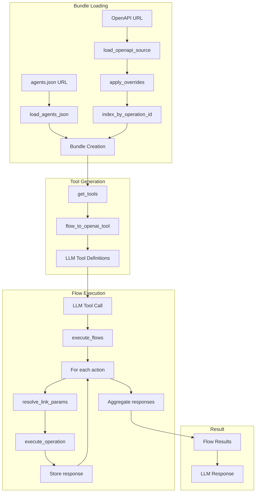

# Wildcard-AI: Complete Exploration

## Overview

**Wildcard-AI (agents.json)** is a Python/TypeScript framework for converting OpenAPI specifications into LLM-callable tools. The core innovation is the `agents.json` specification - an extension of OpenAPI that adds **flows** (multi-step workflows) and **links** (data mapping between steps), enabling LLMs to execute complex API workflows with a single tool call.

### Why This Exploration Exists

This is a **complete textbook** that takes you from zero AI API integration knowledge to understanding how to build and deploy production AI API integration systems with Rust/valtron replication.

### Key Characteristics

| Aspect | Wildcard-AI (agents.json) |
|--------|--------------------------|
| **Core Innovation** | OpenAPI extension with flows and links for multi-step workflows |
| **Dependencies** | Pydantic, requests, benedict (Python); OpenAI SDK |
| **Lines of Code** | ~2,000 (core framework) + ~5,000 (generated SDKs) |
| **Purpose** | API-to-LLM tool conversion with workflow orchestration |
| **Architecture** | Bundle-based loading, flow execution with link resolution |
| **Runtime** | Python 3.x, Node.js |
| **Rust Equivalent** | valtron executor (no async/await, no tokio) |

---

## Complete Table of Contents

This exploration consists of multiple deep-dive documents. Read them in order for complete understanding:

### Part 1: Foundations
1. **[Zero to AI Engineer](00-zero-to-ai-engineer.md)** - Start here if new to AI/API integrations
   - What are APIs and OpenAPI?
   - LLM tool calling fundamentals
   - Multi-step workflow orchestration
   - Data linking and parameter mapping
   - Authentication patterns (API Key, Bearer, OAuth)

### Part 2: Core Implementation
2. **[agents.json Specification](01-agents-json-specification-deep-dive.md)**
   - Schema structure (sources, flows, actions, links)
   - Flow definition and execution
   - Link-based data mapping
   - Overrides for API customization
   - Field definitions (parameters, requestBody, responses)

3. **[Bundle Loading System](02-bundle-loader-deep-dive.md)**
   - OpenAPI source loading
   - Reference resolution
   - Override application
   - Operation indexing by operationId
   - Bundle creation

4. **[Flow Execution Engine](03-flow-execution-deep-dive.md)**
   - Action execution order
   - Link resolution and parameter mapping
   - benedict dot notation for nested access
   - Response aggregation
   - Error handling

5. **[Tool Format Conversion](04-tool-format-conversion-deep-dive.md)**
   - OpenAI function calling format
   - JSON tool format
   - Schema conversion utilities
   - Prompt generation

6. **[Authentication System](05-authentication-system-deep-dive.md)**
   - AuthConfig types (Bearer, API Key, Basic, OAuth1, OAuth2)
   - Auth resolution
   - SDK vs REST API handler modes
   - Token refresh patterns

7. **[Integration Packages](06-integration-packages-deep-dive.md)**
   - Integration structure (map.py, tools.py)
   - SDK executor pattern
   - REST API handler pattern
   - Available integrations (Stripe, Resend, Twitter, etc.)

### Part 3: Rust Replication
8. **[Valtron Executor Guide](07-valtron-executor-guide.md)**
   - TaskIterator pattern for API calls
   - Single-threaded executor
   - Multi-threaded executor
   - DrivenRecvIterator and DrivenStreamIterator
   - execute() and execute_stream()

9. **[Rust Revision](rust-revision.md)**
   - Complete Rust translation
   - Type system design (serde, reqwest)
   - Ownership and borrowing strategy
   - OpenAPI parsing in Rust
   - Code examples

### Part 4: Production
10. **[Production-Grade Implementation](production-grade.md)**
    - Performance optimizations
    - Connection pooling
    - Rate limiting
    - Caching strategies
    - Monitoring and observability

11. **[Valtron Integration](05-valtron-integration.md)**
    - Lambda deployment for AI inference
    - HTTP API compatibility
    - Serverless execution patterns
    - Production deployment

---

## Quick Reference: Wildcard-AI Architecture

### High-Level Flow



### Component Summary

| Component | Lines | Purpose | Deep Dive |
|-----------|-------|---------|-----------|
| Schema Models | 250 | Pydantic models for agents.json | [Specification](01-agents-json-specification-deep-dive.md) |
| Bundle Loader | 100 | OpenAPI loading and indexing | [Bundle Loader](02-bundle-loader-deep-dive.md) |
| Flow Executor | 200 | Action execution with link resolution | [Flow Execution](03-flow-execution-deep-dive.md) |
| Tool Converter | 150 | OpenAI/JSON tool format conversion | [Tool Conversion](04-tool-format-conversion-deep-dive.md) |
| Auth System | 100 | Authentication configuration | [Authentication](05-authentication-system-deep-dive.md) |
| Integrations | ~50/integration | API-specific executors | [Integrations](06-integration-packages-deep-dive.md) |
| Valtron Integration | 200 | Rust executor patterns | [Valtron Guide](07-valtron-executor-guide.md) |

---

## File Structure

```
wildcard-ai/
├── agents-json/
│   ├── agents_json/
│   │   ├── alpaca/
│   │   │   ├── agents.json
│   │   │   ├── marketdata_openapi.yaml
│   │   │   └── trading_openapi.yaml
│   │   ├── giphy/
│   │   │   ├── agents.json
│   │   │   └── openapi.yaml
│   │   ├── resend/
│   │   │   └── agents.json
│   │   ├── stripe/
│   │   │   ├── agents.json
│   │   │   └── openapi.yaml
│   │   ├── twitter/
│   │   │   └── agents.json
│   │   ├── slack/
│   │   │   └── agents.json
│   │   ├── linkup/
│   │   │   └── agents.json
│   │   ├── rootly/
│   │   │   └── agents.json
│   │   ├── hubspotcontacts/
│   │   │   └── agents.json
│   │   ├── googlesheets/
│   │   │   └── agents.json
│   │   ├── theodds/
│   │   │   └── agents.json
│   │   └── agentsJson.schema.json
│   │
│   ├── python/
│   │   └── agentsjson/
│   │       ├── core/
│   │       │   ├── __init__.py
│   │       │   ├── executor.py          # Flow execution engine
│   │       │   ├── loader.py            # Bundle loading
│   │       │   ├── parsetools.py        # Tool format conversion
│   │       │   ├── utils.py             # Utility functions
│   │       │   └── models/
│   │       │       ├── __init__.py
│   │       │       ├── auth.py          # Auth configuration
│   │       │       ├── bundle.py        # Bundle type
│   │       │       ├── schema.py        # agents.json schema
│   │       │       └── tools.py         # Tool format enum
│   │       │
│   │       └── integrations/
│   │           ├── __init__.py
│   │           ├── types.py             # ExecutorType enum
│   │           ├── stripe/
│   │           │   ├── __init__.py
│   │           │   ├── map.py           # Operation ID -> function map
│   │           │   └── tools.py         # Stripe SDK executor
│   │           ├── resend/
│   │           │   ├── __init__.py
│   │           │   ├── map.py
│   │           │   └── tools.py
│   │           ├── twitter/
│   │           │   └── ...
│   │           └── ... (14 integrations)
│   │
│   └── examples/
│       ├── resend.ipynb
│       ├── single.ipynb
│       ├── multiple.ipynb
│       ├── multiple-dynamic.ipynb
│       ├── sheets.ipynb
│       ├── rootly.ipynb
│       └── linkup.ipynb
│
├── groundx-sdks/                      # Document understanding SDK
│   ├── sdks/typescript/
│   │   ├── api/
│   │   ├── models/
│   │   └── client.ts
│   └── docs/
│
├── wildcard-landing/                  # React landing page
│   └── src/
│
└── wildcard-lovable/                  # Lovable project config
    └── go-server/
```

---

## How to Use This Exploration

### For Complete Beginners (Zero AI/API Experience)

1. Start with **[00-zero-to-ai-engineer.md](00-zero-to-ai-engineer.md)**
2. Read each section carefully, work through examples
3. Continue through all deep dives in order
4. Implement along with the explanations
5. Finish with production-grade and valtron integration

**Time estimate:** 25-50 hours for complete understanding

### For Experienced Python/TypeScript Developers

1. Skim [00-zero-to-ai-engineer.md](00-zero-to-ai-engineer.md) for context
2. Deep dive into areas of interest (flows, links, authentication)
3. Review [rust-revision.md](rust-revision.md) for Rust translation patterns
4. Check [production-grade.md](production-grade.md) for deployment considerations

### For AI Practitioners

1. Review [agents.json specification](agents-json/agents_json/agentsJson.schema.json) directly
2. Use deep dives as reference for specific components
3. Compare with other tool frameworks (MCP, LangChain tools)
4. Extract insights for educational content

---

## Running Wildcard-AI

```bash
# Navigate to agents-json python directory
cd /path/to/agents-json/python

# Install dependencies
pip install agentsjson openai benedict pydantic requests

# Use in your code
from agentsjson import load_agents_json, get_tools, execute, ToolFormat
from agentsjson.core.models.auth import ApiKeyAuthConfig, AuthType

# Load a bundle
bundle = load_agents_json("https://raw.githubusercontent.com/wild-card-ai/agents-json/master/agents_json/resend/agents.json")

# Get OpenAI tool definitions
tools = get_tools(bundle.agentsJson, ToolFormat.OPENAI)

# Execute a flow
auth = ApiKeyAuthConfig(type=AuthType.API_KEY, key_value="your-api-key")
result = execute(bundle.agentsJson, llm_response, ToolFormat.OPENAI, auth)
```

### Example Usage

```python
from openai import OpenAI
from agentsjson import load_agents_json, get_tools, execute, ToolFormat
from agentsjson.core.models.auth import ApiKeyAuthConfig, AuthType

# Load Resend agents.json
bundle = load_agents_json("https://raw.githubusercontent.com/wild-card-ai/agents-json/master/agents_json/resend/agents.json")

# Get tool definitions for OpenAI
tools = get_tools(bundle.agentsJson, ToolFormat.OPENAI)

# Call LLM with tools
client = OpenAI(api_key="sk-...")
response = client.chat.completions.create(
    model="gpt-4o",
    messages=[
        {"role": "user", "content": "Send an email to test@example.com from noreply@example.com with subject 'Hello'"}
    ],
    tools=tools
)

# Execute the flow
auth = ApiKeyAuthConfig(type=AuthType.API_KEY, key_value="re_...")
result = execute(bundle.agentsJson, response, ToolFormat.OPENAI, auth)
print(result)  # {"resend_post_emails_flow": {"id": "email_123"}}
```

---

## Key Insights

### 1. OpenAPI Extension Pattern

The core innovation is extending OpenAPI with flows and links:

```json
{
  "flows": [
    {
      "id": "manage_products_prices",
      "actions": [
        {"id": "create_product", "sourceId": "stripe", "operationId": "stripe_post_products"},
        {"id": "create_price", "sourceId": "stripe", "operationId": "stripe_post_prices"}
      ],
      "links": [
        {
          "origin": {"actionId": "create_product", "fieldPath": "responses.success.id"},
          "target": {"actionId": "create_price", "fieldPath": "parameters.product"}
        }
      ]
    }
  ]
}
```

When a link is resolved:
- The origin fieldPath extracts data from the source action's response
- The target fieldPath maps data to the destination action's parameters
- benedict handles dot notation with array indexing (e.g., `items[0].id`)

### 2. Bundle-Based Loading

All API specifications are loaded into a Bundle:

```python
bundle = Bundle(
    agentsJson=agents_json,      # Parsed agents.json
    openapi=openapi_source,      # Full OpenAPI spec
    operations=indexed_ops       # operationId -> operation info
)
```

### 3. Link Resolution with benedict

Data mapping uses benedict for robust dot notation:

```python
from benedict import benedict

source_trace = benedict(execution_trace[link.origin.actionId])
field_path = convert_dot_digits_to_brackets(link.origin.fieldPath)
source_value = source_trace.get(field_path, None)

target_path = convert_dot_digits_to_brackets(link.target.fieldPath)
apply[target_path] = source_value
```

### 4. Executor Type Abstraction

Integrations use either SDK or REST API handler:

```python
class ExecutorType(Enum):
    SDK = "SDK"              # Use official SDK (e.g., stripe)
    RESTAPIHANDLER = "RESTAPIHANDLER"  # Use raw HTTP requests
```

### 5. Valtron for Rust Replication

The Rust equivalent uses TaskIterator instead of async/await:

```rust
// TypeScript async
async fn execute_flow(flow: Flow) -> Result<Value> { ... }

// Rust valtron
struct FlowExecutionTask { flow: Flow, trace: ExecutionTrace }
impl TaskIterator for FlowExecutionTask {
    type Ready = Value;
    type Pending = ();
    type Spawner = NoSpawner;

    fn next(&mut self) -> Option<TaskStatus<...>> {
        // Return Pending or Ready
    }
}
```

---

## From Wildcard-AI to Real API Integration Systems

| Aspect | Wildcard-AI | Production API Integration |
|--------|-------------|---------------------------|
| Loading | URL-based | Registry + caching |
| Execution | Synchronous | Async with retry |
| Auth | Static config | OAuth token refresh |
| Tools | OpenAI format | MCP, A2A, custom |
| Scale | Single tenant | Multi-tenant |

**Key takeaway:** The core patterns (flows, links, bundle loading) scale to production with infrastructure changes, not algorithm changes.

---

## Your Path Forward

### To Build AI API Integration Skills

1. **Create a custom agents.json** (extend an existing integration)
2. **Build a custom integration** (add a new API to the system)
3. **Translate to Rust with valtron** (TaskIterator pattern)
4. **Study the papers** (OpenAPI spec, LLM tool calling)

### Recommended Resources

- [OpenAPI Specification](https://spec.openapis.org/)
- [OpenAI Function Calling](https://platform.openai.com/docs/guides/function-calling)
- [Valtron README](/home/darkvoid/Boxxed/@dev/ewe_platform/backends/foundation_core/src/valtron/README.md)
- [TaskIterator Specification](/home/darkvoid/Boxxed/@dev/ewe_platform/specifications/08-valtron-async-iterators/)

---

## Document History

| Date | Change |
|------|--------|
| 2026-03-27 | Initial exploration created |
| 2026-03-27 | Deep dives 00-07 outlined |
| 2026-03-27 | Rust revision and production-grade planned |

---

*This exploration is a living document. Revisit sections as concepts become clearer through implementation.*
