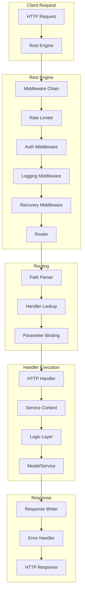

# Deep Dive: go-zero REST Engine Architecture

## Overview

This deep dive examines the go-zero REST engine - a high-performance HTTP server designed for 100k+ QPS workloads. We explore the request lifecycle, middleware system, routing optimizations, and resilience patterns built into the engine.

## Architecture



## Server Initialization

### Server Creation

```go
// rest/server.go

type Server struct {
    ngin   *engine      // Core engine
    router httpx.Router // HTTP router
}

// MustNewServer creates a new REST server
func MustNewServer(c RestConf, opts ...RunOption) *Server {
    // Validate configuration
    if err := c.SetUp(); err != nil {
        panic(err)
    }
    
    // Create engine with middlewares
    engine := newEngine(c, opts...)
    
    server := &Server{
        ngin:   engine,
        router: router.NewRouter(), // Default path router
    }
    
    // Register shutdown callback
    proc.AddShutdownListener(func() {
        server.log("Graceful shutdown complete")
    })
    
    return server
}

// Start starts the HTTP server
func (s *Server) Start() {
    // Bind routes
    s.bindRoutes()
    
    // Start listening
    s.ngin.start(s.router)
}
```

### Engine Configuration

```go
// rest/engine.go

type engine struct {
    conf               RestConf        // Server config
    routes             []Route         // Registered routes
    middlewares        []Middleware    // Global middlewares
    unauthorizedCallback UnauthorizedCallback
    timeout            time.Duration   // Request timeout
    notFoundHandler    http.HandlerFunc
}

func newEngine(c RestConf, opts ...RunOption) *engine {
    e := &engine{
        conf:    c,
        timeout: c.Timeout,
        routes:  make([]Route, 0),
    }
    
    // Apply options (middlewares, etc.)
    for _, opt := range opts {
        opt(e)
    }
    
    return e
}

// RunOption functional option pattern
type RunOption func(*engine)

// WithMiddleware adds a middleware
func WithMiddleware(mw Middleware) RunOption {
    return func(e *engine) {
        e.middlewares = append(e.middlewares, mw)
    }
}

// WithTimeout sets request timeout
func WithTimeout(timeout time.Duration) RunOption {
    return func(e *engine) {
        e.timeout = timeout
    }
}
```

## Middleware System

### Middleware Chain

```go
// rest/handler/chain.go

type Middleware func(http.HandlerFunc) http.HandlerFunc

// buildChain builds middleware chain
func buildChain(middlewares []Middleware, final http.HandlerFunc) http.HandlerFunc {
    // Reverse iteration for correct execution order
    for i := len(middlewares) - 1; i >= 0; i-- {
        final = middlewares[i](final)
    }
    return final
}

// Example middleware chain execution:
// Request → Logging → Auth → RateLimit → Recovery → Handler
// Response ← Logging ← Auth ← RateLimit ← Recovery ← Handler
```

### Logging Middleware

```go
// rest/handler/logichandler.go

func LoggingMiddleware(next http.HandlerFunc) http.HandlerFunc {
    return func(w http.ResponseWriter, r *http.Request) {
        start := time.Now()
        
        // Wrap response writer to capture status
        ww := middleware.WrapResponseWriter(w)
        
        // Execute next handler
        next(ww, r)
        
        // Log after request completes
        duration := time.Since(start)
        
        logx.WithContext(r.Context()).
            WithFields(map[string]interface{}{
                "uri":      r.RequestURI,
                "method":   r.Method,
                "status":   ww.Status(),
                "duration": duration.String(),
                "remote":   r.RemoteAddr,
            }).
            Info("HTTP request")
        
        // Slow request detection
        if duration > time.Second {
            logx.WithContext(r.Context()).
                WithDuration(duration).
                Slowf("[HTTP] slow call - %s %s", r.Method, r.RequestURI)
        }
    }
}
```

### Authentication Middleware

```go
// rest/handler/authhandler.go

func AuthHandler(secret string, unauthorizedCallback UnauthorizedCallback) Middleware {
    return func(next http.HandlerFunc) http.HandlerFunc {
        return func(w http.ResponseWriter, r *http.Request) {
            // Extract token from header
            token := extractToken(r)
            if token == "" {
                if unauthorizedCallback != nil {
                    unauthorizedCallback(w, r, ErrNoToken)
                } else {
                    http.Error(w, "no token", http.StatusUnauthorized)
                }
                return
            }
            
            // Validate JWT token
            claims, err := parseToken(token, secret)
            if err != nil {
                if unauthorizedCallback != nil {
                    unauthorizedCallback(w, r, err)
                } else {
                    http.Error(w, "invalid token", http.StatusUnauthorized)
                }
                return
            }
            
            // Add claims to context
            ctx := context.WithValue(r.Context(), authClaimsKey, claims)
            next(w, r.WithContext(ctx))
        }
    }
}

func parseToken(tokenString string, secret string) (*Claims, error) {
    token, err := jwt.ParseWithClaims(tokenString, &Claims{}, func(token *jwt.Token) (interface{}, error) {
        return []byte(secret), nil
    })
    
    if err != nil {
        return nil, err
    }
    
    claims, ok := token.Claims.(*Claims)
    if !ok || !token.Valid {
        return nil, ErrInvalidToken
    }
    
    return claims, nil
}
```

### Recovery Middleware

```go
// rest/handler/recoverhandler.go

func RecoveryMiddleware(next http.HandlerFunc) http.HandlerFunc {
    return func(w http.ResponseWriter, r *http.Request) {
        defer func() {
            if err := recover(); err != nil {
                // Log panic with stack trace
                logx.WithContext(r.Context()).
                    WithFields(map[string]interface{}{
                        "error": err,
                        "stack": string(debug.Stack()),
                    }).
                    Error("panic recovered")
                
                // Return 500 to client
                http.Error(w, "Internal Server Error", http.StatusInternalServerError)
                
                // Update metrics
                metricPanicCounter.Inc()
            }
        }()
        
        next(w, r)
    }
}
```

## Rate Limiting

### Period Limiter

```go
// core/limit/periodlimit.go

type PeriodLimiter struct {
    redis    *redis.Redis
    key      string
    quota    int           // Max requests per period
    period   time.Duration // Time window
    timeout  time.Duration // Redis timeout
}

func NewPeriodLimiter(redisConf redis.RedisConf, key string, conf PeriodLimiterConf) *PeriodLimiter {
    return &PeriodLimiter{
        redis:   redis.NewRedis(redisConf),
        key:     key,
        quota:   conf.Quota,
        period:  conf.Period,
        timeout: conf.Timeout,
    }
}

// Allow checks if request is allowed
func (l *PeriodLimiter) Allow() (bool, error) {
    now := time.Now()
    windowStart := now.Add(-l.period)
    
    // Use Redis sorted set for sliding window
    script := `
        local key = KEYS[1]
        local window = tonumber(ARGV[1])
        local quota = tonumber(ARGV[2])
        local now = tonumber(ARGV[3])
        
        -- Remove old entries
        redis.call('ZREMRANGEBYSCORE', key, 0, now - window)
        
        -- Count current requests
        local count = redis.call('ZCARD', key)
        
        if count < quota then
            -- Add new request
            redis.call('ZADD', key, now, now)
            redis.call('EXPIRE', key, window)
            return 1
        else
            return 0
        end
    `
    
    result, err := l.redis.Eval(script, []string{l.key}, 
        l.period.Milliseconds(), l.quota, now.UnixMilli())
    
    if err != nil {
        return false, err
    }
    
    return result.(int64) == 1, nil
}
```

### Token Bucket Limiter

```go
// core/limit/tokenlimit.go

type TokenLimiter struct {
    redis *redis.Redis
    key   string
    rate  int   // Tokens per second
    burst int   // Max burst capacity
}

func NewTokenLimiter(redisConf redis.RedisConf, key string, conf TokenLimiterConf) *TokenLimiter {
    return &TokenLimiter{
        redis: redis.NewRedis(redisConf),
        key:   key,
        rate:  conf.Rate,
        burst: conf.Burst,
    }
}

// Allow checks if request is allowed using token bucket
func (l *TokenLimiter) Allow() (bool, error) {
    script := `
        local key = KEYS[1]
        local rate = tonumber(ARGV[1])
        local burst = tonumber(ARGV[2])
        local now = tonumber(ARGV[3])
        
        -- Get current bucket state
        local bucket = redis.call('HMGET', key, 'tokens', 'last_time')
        local tokens = tonumber(bucket[1]) or burst
        local last_time = tonumber(bucket[2]) or now
        
        -- Calculate tokens to add
        local elapsed = now - last_time
        local new_tokens = math.min(burst, tokens + (elapsed * rate / 1000))
        
        if new_tokens >= 1 then
            -- Consume token
            redis.call('HMSET', key, 'tokens', new_tokens - 1, 'last_time', now)
            redis.call('EXPIRE', key, 3600)
            return 1
        else
            return 0
        end
    `
    
    result, err := l.redis.Eval(script, []string{l.key}, 
        l.rate, l.burst, time.Now().UnixMilli())
    
    if err != nil {
        return false, err
    }
    
    return result.(int64) == 1, nil
}
```

### Connection Limiter

```go
// rest/handler/maxconnshandler.go

type MaxConnsMiddleware struct {
    maxConns int
    semaphore chan struct{}
    gauge     metric.Gauge
}

func NewMaxConnsMiddleware(maxConns int) *MaxConnsMiddleware {
    return &MaxConnsMiddleware{
        maxConns:  maxConns,
        semaphore: make(chan struct{}, maxConns),
        gauge:     metric.NewGauge("http_active_connections"),
    }
}

func (m *MaxConnsMiddleware) Handle(next http.HandlerFunc) http.HandlerFunc {
    return func(w http.ResponseWriter, r *http.Request) {
        // Try to acquire connection slot
        select {
        case m.semaphore <- struct{}{}:
            m.gauge.Inc()
            defer func() {
                <-m.semaphore
                m.gauge.Dec()
            }()
            next(w, r)
        default:
            // Too many concurrent connections
            http.Error(w, "service unavailable", http.StatusServiceUnavailable)
            metricRejectedConns.Inc()
        }
    }
}
```

## Request Processing

### Handler Registration

```go
// rest/router/patrouter.go

type PatRouter struct {
    methods map[string]*pat.PatternServeMux
    handles map[string]http.Handler
}

func NewRouter() httpx.Router {
    return &PatRouter{
        methods: make(map[string]*pat.PatternServeMux),
        handles: make(map[string]http.Handler),
    }
}

// Handle registers a route
func (pr *PatRouter) Handle(method, path string, handler http.Handler) {
    mux, ok := pr.methods[method]
    if !ok {
        mux = pat.New()
        pr.methods[method] = mux
    }
    
    mux.Add(method, path, handler)
}

// ServeHTTP routes and executes request
func (pr *PatRouter) ServeHTTP(w http.ResponseWriter, r *http.Request) {
    mux, ok := pr.methods[r.Method]
    if !ok {
        http.Error(w, "method not allowed", http.StatusMethodNotAllowed)
        return
    }
    
    // Find matching route
    action, params := mux.Match(r.Method, r.URL.Path)
    if action == nil {
        http.Error(w, "not found", http.StatusNotFound)
        return
    }
    
    // Add path parameters to context
    if len(params) > 0 {
        ctx := r.Context()
        for key, val := range params {
            ctx = context.WithValue(ctx, key, val)
        }
        r = r.WithContext(ctx)
    }
    
    // Execute handler
    action.ServeHTTP(w, r)
}
```

### Parameter Binding

```go
// rest/httpx/requests.go

// Parse parses request into struct
func Parse(r *http.Request, v interface{}) error {
    // Get path parameters
    if err := parsePath(r, v); err != nil {
        return err
    }
    
    // Get query parameters
    if err := parseQuery(r, v); err != nil {
        return err
    }
    
    // Get JSON body (if POST/PUT)
    if r.Method == http.MethodPost || r.Method == http.MethodPut {
        if err := parseJsonBody(r, v); err != nil {
            return err
        }
    }
    
    // Validate struct tags
    return validate(v)
}

// parsePath extracts path parameters
func parsePath(r *http.Request, v interface{}) error {
    rv := reflect.ValueOf(v).Elem()
    rt := rv.Type()
    
    for i := 0; i < rt.NumField(); i++ {
        field := rt.Field(i)
        pathTag := field.Tag.Get("path")
        
        if pathTag != "" {
            key := pathTag
            if val := r.Context().Value(key); val != nil {
                rv.Field(i).SetString(val.(string))
            }
        }
    }
    
    return nil
}

// parseQuery extracts query parameters
func parseQuery(r *http.Request, v interface{}) error {
    query := r.URL.Query()
    rv := reflect.ValueOf(v).Elem()
    rt := rv.Type()
    
    for i := 0; i < rt.NumField(); i++ {
        field := rt.Field(i)
        formTag := field.Tag.Get("form")
        
        if formTag != "" {
            key := formTag
            if vals := query.Get(key); vals != "" {
                setFieldValue(rv.Field(i), vals)
            }
        }
    }
    
    return nil
}
```

### Response Handling

```go
// rest/httpx/responses.go

// WriteJson writes JSON response
func WriteJson(w http.ResponseWriter, code int, data interface{}) {
    w.Header().Set("Content-Type", "application/json")
    w.WriteHeader(code)
    
    if err := json.NewEncoder(w).Encode(data); err != nil {
        logx.Errorf("WriteJson failed: %v", err)
    }
}

// WriteJsonCtx writes JSON response with context
func WriteJsonCtx(ctx context.Context, w http.ResponseWriter, code int, data interface{}) {
    span := trace.SpanFromContext(ctx)
    
    // Add tracing attributes
    span.SetAttributes(
        attribute.Int("http.status_code", code),
    )
    
    WriteJson(w, code, data)
}

// Error writes error response
func Error(w http.ResponseWriter, code int, err string) {
    WriteJson(w, code, map[string]string{
        "error": err,
        "code":  fmt.Sprintf("%d", code),
    })
}
```

## Circuit Breaking Integration

```go
// rest/handler/breakerhandler.go

func BreakerMiddleware(path string) Middleware {
    return func(next http.HandlerFunc) http.HandlerFunc {
        return func(w http.ResponseWriter, r *http.Request) {
            breakerName := fmt.Sprintf("%s:%s", r.Method, path)
            
            err := breaker.Do(breakerName, func() {
                next(w, r)
            })
            
            if err != nil {
                // Circuit is open
                logx.WithContext(r.Context()).
                    WithFields(map[string]interface{}{
                        "breaker": breakerName,
                        "error":   err,
                    }).
                    Warn("circuit breaker opened")
                
                http.Error(w, "service unavailable", http.StatusServiceUnavailable)
                metricBreakerReject.Inc()
            }
        }
    }
}
```

## Timeout Handling

```go
// rest/handler/timeouthandler.go

func TimeoutMiddleware(timeout time.Duration) Middleware {
    return func(next http.HandlerFunc) http.HandlerFunc {
        return func(w http.ResponseWriter, r *http.Request) {
            // Create context with timeout
            ctx, cancel := context.WithTimeout(r.Context(), timeout)
            defer cancel()
            
            // Create response interceptor
            interceptor := &responseInterceptor{
                ResponseWriter: w,
                done:           make(chan struct{}),
            }
            
            // Run handler in goroutine
            go func() {
                defer close(interceptor.done)
                next(interceptor, r.WithContext(ctx))
            }()
            
            // Wait for completion or timeout
            select {
            case <-interceptor.done:
                // Handler completed
                return
            case <-ctx.Done():
                // Timeout occurred
                if ctx.Err() == context.DeadlineExceeded {
                    logx.WithContext(r.Context()).
                        WithDuration(timeout).
                        Errorf("request timeout - %s %s", r.Method, r.URL.Path)
                    
                    http.Error(w, "request timeout", http.StatusGatewayTimeout)
                    metricTimeout.Inc()
                }
            }
        }
    }
}
```

## Metrics Collection

```go
// rest/metrics.go

var (
    // Request metrics
    metricRequestsTotal = prometheus.NewCounterVec(
        prometheus.CounterOpts{
            Namespace: "go_zero",
            Subsystem: "http",
            Name:      "requests_total",
            Help:      "Total HTTP requests",
        },
        []string{"method", "path", "status"},
    )
    
    // Duration histogram
    metricRequestDuration = prometheus.NewHistogramVec(
        prometheus.HistogramOpts{
            Namespace: "go_zero",
            Subsystem: "http",
            Name:      "request_duration_seconds",
            Help:      "Request duration in seconds",
            Buckets:   []float64{0.001, 0.005, 0.01, 0.05, 0.1, 0.5, 1.0, 5.0},
        },
        []string{"method", "path"},
    )
    
    // Active connections gauge
    metricActiveConns = prometheus.NewGauge(
        prometheus.GaugeOpts{
            Namespace: "go_zero",
            Subsystem: "http",
            Name:      "active_connections",
            Help:      "Current active connections",
        },
    )
)

func init() {
    prometheus.MustRegister(metricRequestsTotal)
    prometheus.MustRegister(metricRequestDuration)
    prometheus.MustRegister(metricActiveConns)
}
```

## Graceful Shutdown

```go
// rest/server.go

func (s *Server) Start() {
    s.bindRoutes()
    
    // Create server with timeouts
    server := &http.Server{
        Addr:         fmt.Sprintf("%s:%d", s.ngin.conf.Host, s.ngin.conf.Port),
        Handler:      s.router,
        ReadTimeout:  s.ngin.conf.ReadTimeout,
        WriteTimeout: s.ngin.conf.WriteTimeout,
        IdleTimeout:  s.ngin.conf.IdleTimeout,
    }
    
    // Start listener
    listener, err := net.Listen("tcp", server.Addr)
    if err != nil {
        logx.Error("Start server failed:", err)
        return
    }
    
    // Start server in goroutine
    go func() {
        logx.Infof("Starting server at %s", server.Addr)
        
        if err := server.Serve(listener); err != nil && err != http.ErrServerClosed {
            logx.Error("Server error:", err)
        }
    }()
    
    // Wait for shutdown signal
    proc.WaitForShutdown()
    
    // Graceful shutdown with timeout
    ctx, cancel := context.WithTimeout(context.Background(), 30*time.Second)
    defer cancel()
    
    if err := server.Shutdown(ctx); err != nil {
        logx.Error("Shutdown error:", err)
    }
}
```

## Conclusion

The go-zero REST engine provides:

1. **High Performance**: Optimized for 100k+ QPS with minimal allocations
2. **Built-in Resilience**: Rate limiting, circuit breaking, timeouts
3. **Comprehensive Middleware**: Auth, logging, recovery, metrics
4. **Type-safe Routing**: Path parameter extraction and validation
5. **Observability**: Prometheus metrics, structured logging, tracing
6. **Graceful Shutdown**: Clean connection draining
