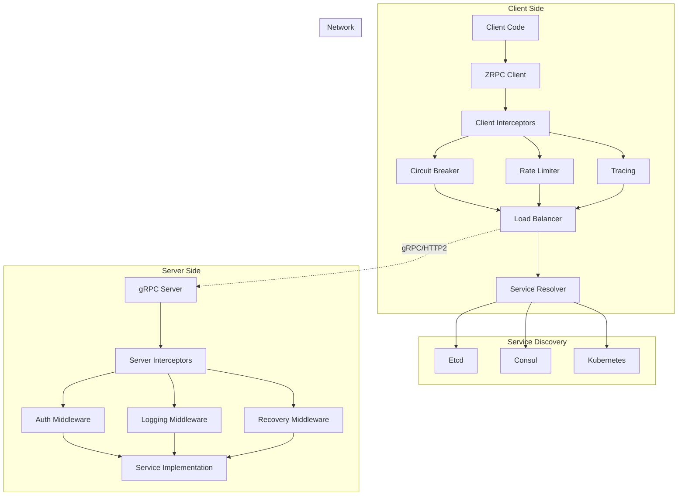

# Deep Dive: ZRPC - go-zero gRPC Framework

## Overview

ZRPC is go-zero's gRPC wrapper that simplifies RPC service development while adding resilience patterns, service discovery, and observability. This deep dive explores the architecture, client/server implementation, and advanced features.

## Architecture



## Server Implementation

### Server Creation

```go
// zrpc/server.go

type RpcServer struct {
    conf        RpcServerConf
    server      *grpc.Server
    middlewares []grpc.UnaryServerInterceptor
    registerers []Registerer
}

// MustNewServer creates a new RPC server
func MustNewServer(c RpcServerConf, registerers ...Registerer) *RpcServer {
    // Validate configuration
    if err := c.Validate(); err != nil {
        panic(err)
    }
    
    // Build server options
    options := buildServerOptions(c)
    
    // Create gRPC server with interceptors
    server := grpc.NewServer(options...)
    
    return &RpcServer{
        conf:        c,
        server:      server,
        registerers: registerers,
    }
}

func buildServerOptions(c RpcServerConf) []grpc.ServerOption {
    var options []grpc.ServerOption
    
    // Add unary interceptors
    unaryInterceptors := []grpc.UnaryServerInterceptor{
        // Recovery - must be first
        recoveryInterceptor,
        
        // Logging
        loggingInterceptor,
        
        // Prometheus metrics
        metricInterceptor,
        
        // Tracing
        tracingInterceptor,
        
        // Circuit breaker
        breakerInterceptor,
        
        // Rate limiting
        rateLimitInterceptor,
        
        // Authentication (if configured)
        authInterceptor(c.Auth),
        
        // Slow call detection
        slowCallInterceptor(c.SlowThreshold),
    }
    
    // Filter out disabled interceptors
    unaryInterceptors = filterInterceptors(unaryInterceptors, c)
    
    // Add stream interceptors (similar)
    streamInterceptors := buildStreamInterceptors(c)
    
    options = append(options, 
        grpc.UnaryInterceptor(unaryInterceptors...),
        grpc.StreamInterceptor(streamInterceptors...),
    )
    
    // Add TLS if configured
    if c.TLS != nil {
        creds, err := credentials.NewServerTLSFromFile(
            c.TLS.CertFile, 
            c.TLS.KeyFile,
        )
        if err != nil {
            panic(err)
        }
        options = append(options, grpc.Creds(creds))
    }
    
    // Add connection limits
    if c.MaxConnections > 0 {
        options = append(options, 
            grpc.ConnectionLimit(c.MaxConnections),
        )
    }
    
    // Add keepalive
    if c.Keepalive != nil {
        options = append(options,
            grpc.KeepaliveParams(keepalive.ServerParameters{
                Time:    c.Keepalive.Time,
                Timeout: c.Keepalive.Timeout,
            }),
        )
    }
    
    return options
}
```

### Service Registration

```go
// zrpc/server.go

type Registerer func(server *grpc.Server)

// Start starts the RPC server
func (s *RpcServer) Start() {
    // Register services
    for _, registerer := range s.registerers {
        registerer(s.server)
    }
    
    // Create listener
    listener, err := net.Listen("tcp", s.conf.ListenOn)
    if err != nil {
        logx.Error("Failed to listen:", err)
        return
    }
    
    // Register with service discovery
    if s.conf.Etcd.Hosts != nil {
        registerWithEtcd(s.conf.Etcd, s.conf.Name, listener.Addr().String())
    } else if s.conf.Consul.Host != "" {
        registerWithConsul(s.conf.Consul, s.conf.Name, listener.Addr().String())
    }
    
    // Start serving
    logx.Infof("Starting RPC server at %s", listener.Addr().String())
    if err := s.server.Serve(listener); err != nil {
        logx.Error("Server error:", err)
    }
}

// Example service registration
func NewGreeterServer(svcCtx *svc.ServiceContext) pb.GreeterServer {
    return &GreeterServer{
        svcCtx: svcCtx,
    }
}

// In main.go
server := zrpc.MustNewServer(c.RpcServerConf, func(grpcServer *grpc.Server) {
    pb.RegisterGreeterServer(grpcServer, NewGreeterServer(svcCtx))
})
defer server.Stop()
server.Start()
```

### Server Interceptors

```go
// zrpc/server/interceptors.go

// Recovery interceptor
func recoveryInterceptor(
    ctx context.Context,
    req interface{},
    info *grpc.UnaryServerInfo,
    handler grpc.UnaryHandler,
) (resp interface{}, err error) {
    defer func() {
        if r := recover(); r != nil {
            logx.WithContext(ctx).
                WithFields(map[string]interface{}{
                    "method":  info.FullMethod,
                    "error":   r,
                    "stack":   string(debug.Stack()),
                }).
                Error("panic recovered")
            
            metricPanicCounter.WithLabelValues(info.FullMethod).Inc()
            err = status.Errorf(codes.Internal, "panic: %v", r)
        }
    }()
    
    return handler(ctx, req)
}

// Logging interceptor
func loggingInterceptor(
    ctx context.Context,
    req interface{},
    info *grpc.UnaryServerInfo,
    handler grpc.UnaryHandler,
) (resp interface{}, err error) {
    start := time.Now()
    
    resp, err = handler(ctx, req)
    
    duration := time.Since(start)
    
    logx.WithContext(ctx).
        WithFields(map[string]interface{}{
            "method":   info.FullMethod,
            "duration": duration.String(),
            "input":    formatRequest(req),
        }).
        Info("gRPC request")
    
    if err != nil {
        logx.WithContext(ctx).
            WithFields(map[string]interface{}{
                "method": info.FullMethod,
                "error":  err.Error(),
            }).
            Error("gRPC error")
    }
    
    // Slow call detection
    if duration > time.Second {
        logx.WithContext(ctx).
            WithDuration(duration).
            Slowf("[gRPC] slow call - %s", info.FullMethod)
    }
    
    return resp, err
}

// Tracing interceptor
func tracingInterceptor(
    ctx context.Context,
    req interface{},
    info *grpc.UnaryServerInfo,
    handler grpc.UnaryHandler,
) (interface{}, error) {
    // Extract span context from incoming metadata
    md, ok := metadata.FromIncomingContext(ctx)
    if !ok {
        md = metadata.New(nil)
    }
    
    // Extract trace context
    spanCtx := otel.Extract(ctx, &metadataSupplier{md})
    
    // Start new span
    tracer := otel.Tracer("go-zero")
    ctx, span := tracer.Start(
        spanCtx,
        info.FullMethod,
        trace.WithSpanKind(trace.SpanKindServer),
    )
    defer span.End()
    
    // Set span attributes
    span.SetAttributes(
        attribute.String("rpc.method", info.FullMethod),
        attribute.String("rpc.system", "grpc"),
    )
    
    resp, err := handler(ctx, req)
    
    // Record error if any
    if err != nil {
        span.RecordError(err)
        span.SetStatus(codes.Error, err.Error())
    }
    
    return resp, err
}

// Circuit breaker interceptor
func breakerInterceptor(
    ctx context.Context,
    req interface{},
    info *grpc.UnaryServerInfo,
    handler grpc.UnaryHandler,
) (interface{}, error) {
    breakerName := fmt.Sprintf("grpc:%s", info.FullMethod)
    
    var resp interface{}
    err := breaker.Do(breakerName, func() {
        var err error
        resp, err = handler(ctx, req)
        if err != nil {
            breaker.MarkFailed()
        } else {
            breaker.MarkSuccess()
        }
    })
    
    if err != nil {
        metricBreakerReject.WithLabelValues(info.FullMethod).Inc()
        return nil, status.Error(codes.Unavailable, "service unavailable")
    }
    
    return resp, nil
}
```

## Client Implementation

### Client Creation

```go
// zrpc/client.go

type RpcClient struct {
    conn        *grpc.ClientConn
    client      interface{}
    interceptors []grpc.UnaryClientInterceptor
}

// MustNewClient creates a new RPC client
func MustNewClient(c RpcClientConf, opts ...ClientOption) *RpcClient {
    // Validate configuration
    if err := c.Validate(); err != nil {
        panic(err)
    }
    
    // Build dial options
    dialOptions := buildDialOptions(c)
    
    // Resolve target (service discovery)
    target, err := resolveTarget(c)
    if err != nil {
        panic(err)
    }
    
    // Connect
    conn, err := grpc.Dial(target, dialOptions...)
    if err != nil {
        panic(err)
    }
    
    return &RpcClient{
        conn: conn,
    }
}

func buildDialOptions(c RpcClientConf) []grpc.DialOption {
    var options []grpc.DialOption
    
    // Add unary interceptors
    unaryInterceptors := []grpc.UnaryClientInterceptor{
        // Tracing
        tracingClientInterceptor,
        
        // Metrics
        metricClientInterceptor,
        
        // Circuit breaker
        breakerClientInterceptor,
        
        // Rate limiting
        rateLimitClientInterceptor,
        
        // Timeout
        timeoutInterceptor(c.Timeout),
        
        // Retry
        retryInterceptor(c.Retry),
    }
    
    options = append(options, grpc.WithUnaryInterceptor(unaryInterceptors...))
    
    // Transport credentials
    if c.TLS != nil {
        creds, err := credentials.NewClientTLSFromFile(
            c.TLS.CAFile,
            c.TLS.ServerNameOverride,
        )
        if err != nil {
            panic(err)
        }
        options = append(options, grpc.WithTransportCredentials(creds))
    } else {
        options = append(options, grpc.WithInsecure())
    }
    
    // Connection pool
    if c.MaxConnections > 0 {
        options = append(options, 
            grpc.WithInitialConnWindowSize(int32(c.MaxConnections * 1024)),
        )
    }
    
    // Keepalive
    if c.Keepalive != nil {
        options = append(options,
            grpc.WithKeepaliveParams(keepalive.ClientParameters{
                Time:                c.Keepalive.Time,
                Timeout:             c.Keepalive.Timeout,
                PermitWithoutStream: c.Keepalive.PermitWithoutStream,
            }),
        )
    }
    
    return options
}
```

### Client Interceptors

```go
// zrpc/client/interceptors.go

// Tracing client interceptor
func tracingClientInterceptor(
    ctx context.Context,
    method string,
    req, reply interface{},
    cc *grpc.ClientConn,
    invoker grpc.UnaryInvoker,
    opts ...grpc.CallOption,
) error {
    // Start new span
    tracer := otel.Tracer("go-zero")
    ctx, span := tracer.Start(
        ctx,
        method,
        trace.WithSpanKind(trace.SpanKindClient),
    )
    defer span.End()
    
    // Create metadata for trace context
    md, ok := metadata.FromOutgoingContext(ctx)
    if !ok {
        md = metadata.New(nil)
    }
    
    // Inject trace context into metadata
    otel.Inject(ctx, &metadataSupplier{md})
    
    ctx = metadata.NewOutgoingContext(ctx, md)
    
    err := invoker(ctx, method, req, reply, cc, opts...)
    
    if err != nil {
        span.RecordError(err)
        span.SetStatus(codes.Error, err.Error())
    }
    
    return err
}

// Circuit breaker client interceptor
func breakerClientInterceptor(
    ctx context.Context,
    method string,
    req, reply interface{},
    cc *grpc.ClientConn,
    invoker grpc.UnaryInvoker,
    opts ...grpc.CallOption,
) error {
    breakerName := fmt.Sprintf("grpc:client:%s", method)
    
    err := breaker.Do(breakerName, func() {
        err := invoker(ctx, method, req, reply, cc, opts...)
        if isRetryableError(err) {
            breaker.MarkFailed()
        } else {
            breaker.MarkSuccess()
        }
        return err
    })
    
    if err != nil {
        metricClientBreakerReject.WithLabelValues(method).Inc()
        return status.Error(codes.Unavailable, "circuit breaker open")
    }
    
    return nil
}

// Timeout interceptor
func timeoutInterceptor(timeout time.Duration) grpc.UnaryClientInterceptor {
    return func(
        ctx context.Context,
        method string,
        req, reply interface{},
        cc *grpc.ClientConn,
        invoker grpc.UnaryInvoker,
        opts ...grpc.CallOption,
    ) error {
        // Create context with timeout
        ctx, cancel := context.WithTimeout(ctx, timeout)
        defer cancel()
        
        return invoker(ctx, method, req, reply, cc, opts...)
    }
}

// Retry interceptor
func retryInterceptor(conf RetryConf) grpc.UnaryClientInterceptor {
    return func(
        ctx context.Context,
        method string,
        req, reply interface{},
        cc *grpc.ClientConn,
        invoker grpc.UnaryInvoker,
        opts ...grpc.CallOption,
    ) error {
        var lastErr error
        
        for attempt := 0; attempt < conf.MaxRetries; attempt++ {
            err := invoker(ctx, method, req, reply, cc, opts...)
            if err == nil {
                return nil
            }
            
            lastErr = err
            
            // Check if retryable
            if !isRetryableError(err) {
                return err
            }
            
            // Backoff
            backoff := time.Duration(float64(conf.BaseBackoff) * math.Pow(2, float64(attempt)))
            if backoff > conf.MaxBackoff {
                backoff = conf.MaxBackoff
            }
            
            select {
            case <-time.After(backoff):
                continue
            case <-ctx.Done():
                return ctx.Err()
            }
        }
        
        return lastErr
    }
}
```

## Service Discovery

### Etcd Resolver

```go
// zrpc/resolver/etcd/etcdresolver.go

type EtcdResolver struct {
    client    *clientv3.Client
    key       string
    watchers  map[string]ServiceUpdate
    listeners []ServiceListener
    mu        sync.RWMutex
}

func NewEtcdResolver(conf EtcdConf) (*EtcdResolver, error) {
    client, err := clientv3.New(clientv3.Config{
        Endpoints:   conf.Hosts,
        DialTimeout: time.Duration(conf.DialTimeout) * time.Second,
        Username:    conf.Username,
        Password:    conf.Password,
    })
    
    if err != nil {
        return nil, err
    }
    
    return &EtcdResolver{
        client:   client,
        key:      conf.Key,
        watchers: make(map[string]ServiceUpdate),
    }, nil
}

// Resolve resolves service endpoints
func (r *EtcdResolver) Resolve() ([]string, error) {
    ctx, cancel := context.WithTimeout(context.Background(), 5*time.Second)
    defer cancel()
    
    resp, err := r.client.Get(ctx, r.key, clientv3.WithPrefix())
    if err != nil {
        return nil, err
    }
    
    var endpoints []string
    for _, kv := range resp.Kvs {
        var service ServiceInfo
        if err := json.Unmarshal(kv.Value, &service); err != nil {
            continue
        }
        endpoints = append(endpoints, service.Address)
    }
    
    return endpoints, nil
}

// Watch watches for service changes
func (r *EtcdResolver) Watch() (<-chan ServiceUpdate, error) {
    updates := make(chan ServiceUpdate, 10)
    
    rwatch := r.client.Watch(
        context.Background(),
        r.key,
        clientv3.WithPrefix(),
    )
    
    go func() {
        for wresp := range rwatch {
            for _, ev := range wresp.Events {
                switch ev.Type {
                case mvccpb.PUT:
                    // New service instance
                    var service ServiceInfo
                    json.Unmarshal(ev.Kv.Value, &service)
                    updates <- ServiceUpdate{
                        Type:    ServiceAdd,
                        Address: service.Address,
                    }
                    
                case mvccpb.DELETE:
                    // Service instance removed
                    updates <- ServiceUpdate{
                        Type:    ServiceRemove,
                        Address: string(ev.Kv.Key),
                    }
                }
            }
        }
    }()
    
    return updates, nil
}

// Register registers a service instance
func RegisterWithEtcd(
    client *clientv3.Client,
    key string,
    address string,
    ttl int64,
) error {
    service := ServiceInfo{
        Address:   address,
        Timestamp: time.Now().Unix(),
    }
    
    value, err := json.Marshal(service)
    if err != nil {
        return err
    }
    
    // Create lease
    leaseResp, err := client.Grant(context.Background(), ttl)
    if err != nil {
        return err
    }
    
    // Register with lease
    _, err = client.Put(
        context.Background(),
        fmt.Sprintf("%s/%s", key, address),
        string(value),
        clientv3.WithLease(leaseResp.ID),
    )
    
    // Keep alive
    _, err = client.KeepAlive(context.Background(), leaseResp.ID)
    
    return err
}
```

### Load Balancing

```go
// zrpc/balancer/p2c.go

// P2C (Power of Two Choices) load balancer
type P2CBalancer struct {
    subConns []*subConn
    mu       sync.RWMutex
}

type subConn struct {
    addr    resolver.Address
    conn    *grpc.ClientConn
    metrics *connMetrics
}

type connMetrics struct {
    successRate float64
    latency     time.Duration
    load        int64
}

// Pick picks a subconn for request
func (b *P2CBalancer) Pick(info balancer.PickInfo) (balancer.PickResult, error) {
    b.mu.RLock()
    defer b.mu.RUnlock()
    
    if len(b.subConns) == 0 {
        return balancer.PickResult{}, balancer.ErrNoSubConnAvailable
    }
    
    if len(b.subConns) == 1 {
        return balancer.PickResult{SubConn: b.subConns[0]}, nil
    }
    
    // Power of Two Choices: pick 2 random, choose less loaded
    idx1 := rand.Intn(len(b.subConns))
    idx2 := rand.Intn(len(b.subConns))
    
    for idx1 == idx2 {
        idx2 = rand.Intn(len(b.subConns))
    }
    
    sc1 := b.subConns[idx1]
    sc2 := b.subConns[idx2]
    
    // Compare load metrics
    if sc1.metrics.load < sc2.metrics.load {
        return balancer.PickResult{SubConn: sc1}, nil
    }
    
    return balancer.PickResult{SubConn: sc2}, nil
}

// UpdateMetrics updates connection metrics
func (b *P2CBalancer) UpdateMetrics(addr resolver.Address, success bool, latency time.Duration) {
    b.mu.Lock()
    defer b.mu.Unlock()
    
    for _, sc := range b.subConns {
        if sc.addr == addr {
            // Exponential moving average
            sc.metrics.successRate = 0.9*sc.metrics.successRate + 0.1*boolToFloat(success)
            sc.metrics.latency = time.Duration(0.9*float64(sc.metrics.latency) + 0.1*float64(latency))
            
            // Calculate load based on success rate and latency
            sc.metrics.load = int64(float64(latency.Nanoseconds()) / (sc.metrics.successRate + 0.001))
            break
        }
    }
}
```

## Client Pool

```go
// zrpc/client/pool.go

type ClientPool struct {
    clients map[string]*RpcClient
    mu      sync.RWMutex
    factory func(string) (*RpcClient, error)
}

func NewClientPool(factory func(string) (*RpcClient, error)) *ClientPool {
    return &ClientPool{
        clients: make(map[string]*RpcClient),
        factory: factory,
    }
}

// GetClient gets or creates a client for target
func (p *ClientPool) GetClient(target string) (*RpcClient, error) {
    // Check cache first
    p.mu.RLock()
    client, ok := p.clients[target]
    p.mu.RUnlock()
    
    if ok {
        return client, nil
    }
    
    // Create new client
    p.mu.Lock()
    defer p.mu.Unlock()
    
    // Double-check after acquiring write lock
    if client, ok := p.clients[target]; ok {
        return client, nil
    }
    
    client, err := p.factory(target)
    if err != nil {
        return nil, err
    }
    
    p.clients[target] = client
    return client, nil
}
```

## Conclusion

ZRPC provides:

1. **Simplified gRPC**: Clean API for server/client creation
2. **Built-in Resilience**: Circuit breaking, retry, rate limiting
3. **Service Discovery**: Etcd, Consul, Kubernetes support
4. **Load Balancing**: P2C algorithm for optimal distribution
5. **Observability**: Tracing, metrics, structured logging
6. **Security**: TLS, authentication interceptors
