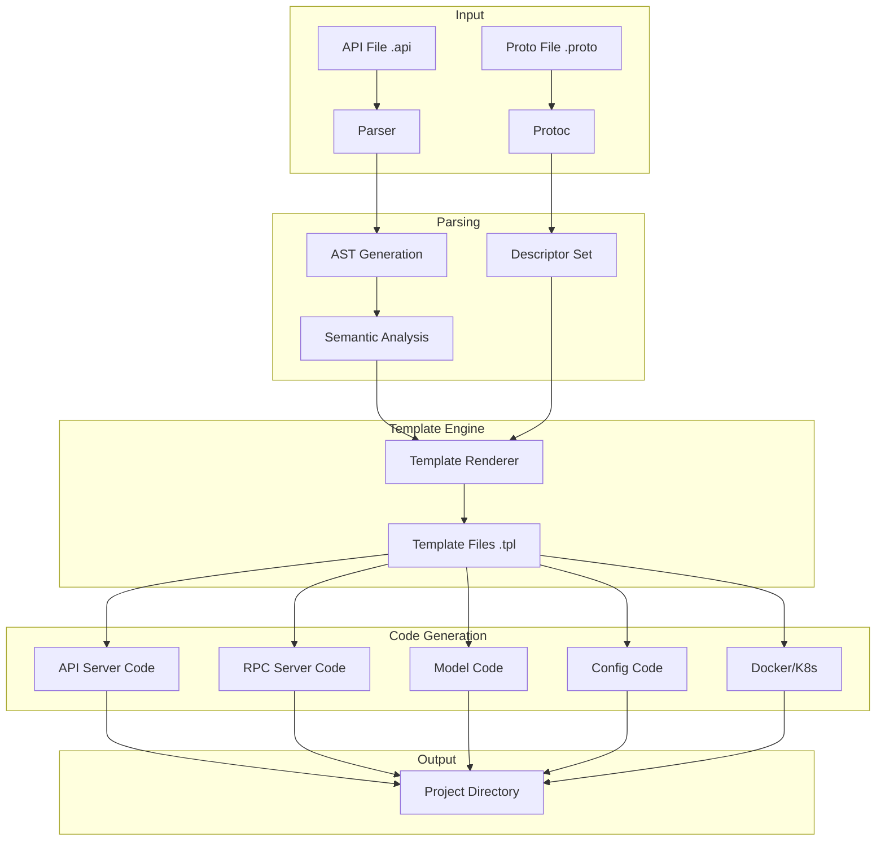

# Deep Dive: goctl - Code Generation Tool

## Overview

goctl is the code generation tool for go-zero that transforms API definitions (.api files) and Protocol Buffers (.proto files) into production-ready Go code. This deep dive explores how goctl parses definitions, generates code, and accelerates development.

## Architecture



## API Definition Language

### API File Structure

```api
// greet.api

// Import other API files
import "user.api"

// Syntax version
syntax = "v1"

// Info section - metadata
info(
    title: "Greet Service API"
    desc: "Provides greeting functionality"
    author: "Your Name"
    email: "you@example.com"
    version: "1.0.0"
)

// Type definitions
type Request {
    Name string `path:"name,options=you|world"`  // Path parameter with options
    Age int `form:"age,optional"`                 // Optional form parameter
}

type Response {
    Message string `json:"message"`
    Code    int    `json:"code"`
}

// Multi-line doc comment
@doc "Greet a person by name"
@doc "Returns a personalized greeting message"

// Server configuration
@server(
    group: "greeting"           // Route group
    jwt: "Auth"                 // JWT authentication
    signature: false            // Disable signature verification
    timeout: 5000               // 5 second timeout
    maxBytes: 1048576           // 1MB max request size
    host: "0.0.0.0"             // Listen host
    port: 8888                  // Listen port
)

// Service definition
service greet-srv {
    // GET request with path parameter
    @handler GreetHandler
    get /greet/from/:name(Request) returns (Response)
    
    // POST request with JSON body
    @handler CreateHandler
    post /greet(CreateRequest) returns (CreateResponse)
    
    // DELETE request
    @handler DeleteHandler
    delete /greet/:id(DeleteRequest) returns (DeleteResponse)
}
```

### Parser Implementation

```go
// tools/goctl/api/parser/parser.go

type Parser struct {
    filename string
    body     []byte
    ast      *ast.Api
}

// Parse parses an API file
func Parse(filename string, content []byte) (*ast.Api, error) {
    p := &Parser{
        filename: filename,
        body:     content,
    }
    
    // Lexical analysis
    tokens := p.lex()
    
    // Syntax analysis (parsing)
    ast := p.parse(tokens)
    
    // Semantic analysis
    if err := p.validate(ast); err != nil {
        return nil, err
    }
    
    return ast, nil
}

// Lexer tokenizes API file
func (p *Parser) lex() []Token {
    var tokens []Token
    
    scanner := bufio.NewScanner(bytes.NewReader(p.body))
    line := 1
    
    for scanner.Scan() {
        text := scanner.Text()
        
        // Skip comments
        if strings.HasPrefix(strings.TrimSpace(text), "//") {
            line++
            continue
        }
        
        // Tokenize line
        lineTokens := p.tokenizeLine(text, line)
        tokens = append(tokens, lineTokens...)
        line++
    }
    
    return tokens
}

// tokenizeLine breaks a line into tokens
func (p *Parser) tokenizeLine(text string, line int) []Token {
    var tokens []Token
    
    // Remove leading whitespace
    text = strings.TrimSpace(text)
    
    // Check for type definition
    if strings.HasPrefix(text, "type ") {
        tokens = append(tokens, Token{
            Type:  TokenType,
            Value: "type",
            Line:  line,
        })
        
        // Parse type name and fields
        rest := strings.TrimPrefix(text, "type ")
        name, fields := p.parseTypeDef(rest)
        
        tokens = append(tokens, Token{
            Type:  TokenIdentifier,
            Value: name,
            Line:  line,
        })
        
        tokens = append(tokens, p.parseFields(fields, line)...)
    }
    
    // Check for service definition
    if strings.HasPrefix(text, "service ") {
        tokens = append(tokens, Token{
            Type:  TokenService,
            Value: "service",
            Line:  line,
        })
        
        // Parse service name
        rest := strings.TrimPrefix(text, "service ")
        name := strings.TrimSpace(rest)
        
        tokens = append(tokens, Token{
            Type:  TokenIdentifier,
            Value: name,
            Line:  line,
        })
    }
    
    // Check for annotations
    if strings.HasPrefix(text, "@") {
        tokens = append(tokens, p.parseAnnotation(text, line)...)
    }
    
    return tokens
}
```

### AST (Abstract Syntax Tree)

```go
// tools/goctl/api/parser/ast.go

// Api represents the root AST node
type Api struct {
    Syntax   Syntax
    Info     Info
    Imports  []Import
    Types    []Type
    Services []Service
}

// Syntax represents the syntax version
type Syntax struct {
    Line  int
    Value string
}

// Info represents API metadata
type Info struct {
    Title   string
    Desc    string
    Author  string
    Email   string
    Version string
}

// Import represents an import statement
type Import struct {
    Value string
    Doc   string
}

// Type represents a type definition
type Type struct {
    Name   string
    Fields []Field
    Doc    string
}

// Field represents a type field
type Field struct {
    Name     string
    Type     string
    Tag      string  // e.g., `path:"name,options=you|world"`
    Doc      string
    Optional bool
}

// Service represents a service definition
type Service struct {
    Name    string
    Routes  []Route
    Doc     string
    Groups  []Group
}

// Route represents an API route
type Route struct {
    Method      string  // GET, POST, PUT, DELETE
    Path        string  // /greet/:name
    RequestType string  // Request
    Returns     string  // Response
    Handler     string  // GreetHandler
    Doc         string
    Annotations []Annotation
}

// Annotation represents @server, @doc, etc.
type Annotation struct {
    Name  string
    Pairs []KeyValue
}
```

## Code Generation

### Generator Architecture

```go
// tools/goctl/api/generator/generator.go

type Generator struct {
    templateDir string
    debug       bool
}

// Generate generates code from API AST
func (g *Generator) Generate(ast *ast.Api, dir string) error {
    // Create directory structure
    if err := g.createDirectories(dir); err != nil {
        return err
    }
    
    // Generate config
    if err := g.generateConfig(ast, dir); err != nil {
        return err
    }
    
    // Generate types
    if err := g.generateTypes(ast, dir); err != nil {
        return err
    }
    
    // Generate service context
    if err := g.generateServiceContext(ast, dir); err != nil {
        return err
    }
    
    // Generate handlers
    if err := g.generateHandlers(ast, dir); err != nil {
        return err
    }
    
    // Generate logic
    if err := g.generateLogic(ast, dir); err != nil {
        return err
    }
    
    // Generate routes
    if err := g.generateRoutes(ast, dir); err != nil {
        return err
    }
    
    // Generate main file
    if err := g.generateMain(ast, dir); err != nil {
        return err
    }
    
    return nil
}
```

### Config Generation

```go
// tools/goctl/api/generator/gen_config.go

const configTemplate = `
package config

import "github.com/zeromicro/go-zero/rest"

type Config struct {
    rest.RestConf
    
    // JWT configuration
    Auth struct {
        AccessSecret string
        AccessExpire int64
    }
    
    // Add your custom config here
    Database struct {
        DataSource string
    }
}
`

func (g *Generator) generateConfig(ast *ast.Api, dir string) error {
    // Parse server annotations for config
    configStruct := g.extractConfig(ast)
    
    // Render template
    content, err := g.render("config.tpl", configStruct)
    if err != nil {
        return err
    }
    
    // Write file
    filePath := filepath.Join(dir, "internal", "config", "config.go")
    return g.writeFile(filePath, content)
}
```

### Handler Generation

```go
// tools/goctl/api/generator/gen_handler.go

const handlerTemplate = `
package handler

import (
    "net/http"
    
    "github.com/zeromicro/go-zero/rest/httpx"
    "github.com/zeromicro/go-zero/core/logx"
    "{{.projectPath}}/internal/svc"
    "{{.projectPath}}/internal/types"
)

{{range .Routes}}
func {{.HandlerName}}(svcCtx *svc.ServiceContext) http.HandlerFunc {
    return func(w http.ResponseWriter, r *http.Request) {
        var req types.{{.RequestType}}
        if err := httpx.Parse(r, &req); err != nil {
            logx.Errorf("Failed to parse request: %v", err)
            httpx.ErrorCtx(r.Context(), w, err)
            return
        }
        
        l := logic.New{{.LogicName}}(r.Context(), svcCtx)
        resp, err := l.{{.LogicMethod}}(&req)
        if err != nil {
            logx.Errorf("Failed to call logic: %v", err)
            httpx.ErrorCtx(r.Context(), w, err)
        } else {
            httpx.OkJsonCtx(r.Context(), w, resp)
        }
    }
}
{{end}}
`

type HandlerContext struct {
    Routes      []RouteContext
    PackageName string
}

type RouteContext struct {
    HandlerName  string
    RequestType  string
    ReturnType   string
    LogicName    string
    LogicMethod  string
    Method       string
    Path         string
}

func (g *Generator) generateHandlers(ast *ast.Api, dir string) error {
    ctx := &HandlerContext{
        PackageName: "handler",
    }
    
    // Process each service
    for _, service := range ast.Services {
        for _, route := range service.Routes {
            // Extract handler name
            handlerName := route.Handler
            if handlerName == "" {
                handlerName = g.generateHandlerName(route)
            }
            
            // Build route context
            routeCtx := RouteContext{
                HandlerName:  handlerName,
                RequestType:  route.RequestType,
                ReturnType:   route.Returns,
                LogicName:    g.extractLogicName(route),
                LogicMethod:  g.extractLogicMethod(route),
                Method:       route.Method,
                Path:         route.Path,
            }
            
            ctx.Routes = append(ctx.Routes, routeCtx)
        }
    }
    
    // Render template
    content, err := g.render("handler.tpl", ctx)
    if err != nil {
        return err
    }
    
    // Write file
    filePath := filepath.Join(dir, "internal", "handler", "handlers.go")
    return g.writeFile(filePath, content)
}

func (g *Generator) generateHandlerName(route Route) string {
    // Convert path to handler name
    // /greet/from/:name -> GreetFromNameHandler
    parts := strings.Split(route.Path, "/")
    var name string
    for _, part := range parts {
        if strings.HasPrefix(part, ":") {
            continue
        }
        name += strings.Title(part)
    }
    return name + "Handler"
}
```

### Logic Generation

```go
// tools/goctl/api/generator/gen_logic.go

const logicTemplate = `
package logic

import (
    "context"
    
    "github.com/zeromicro/go-zero/core/logx"
    "{{.projectPath}}/internal/svc"
    "{{.projectPath}}/internal/types"
)

{{range .Routes}}
type {{.LogicName}} struct {
    logx.Logger
    ctx    context.Context
    svcCtx *svc.ServiceContext
}

func New{{.LogicName}}(ctx context.Context, svcCtx *svc.ServiceContext) *{{.LogicName}} {
    return &{{.LogicName}}{
        Logger: logx.WithContext(ctx),
        ctx:    ctx,
        svcCtx: svcCtx,
    }
}

func (l *{{.LogicName}}) {{.LogicMethod}}(req *types.{{.RequestType}}) (*types.{{.ReturnType}}, error) {
    // TODO: Add your business logic here
    // Example:
    // result, err := l.svcCtx.UserModel.FindOne(l.ctx, req.Id)
    // if err != nil {
    //     return nil, err
    // }
    
    return &types.{{.ReturnType}}{}, nil
}
{{end}}
`

func (g *Generator) generateLogic(ast *ast.Api, dir string) error {
    // Similar structure to handler generation
    // Creates logic struct and method stubs
}
```

### Service Context Generation

```go
// tools/goctl/api/generator/gen_svc.go

const svcTemplate = `
package svc

import (
    "{{.projectPath}}/internal/config"
    // Import models
    // "{{.projectPath}}/internal/model"
)

type ServiceContext struct {
    Config config.Config
    
    // Add your dependencies here
    // Example:
    // UserModel model.UserModel
}

func NewServiceContext(c config.Config) *ServiceContext {
    return &ServiceContext{
        Config: c,
        // Initialize models:
        // UserModel: model.NewUserModel(c.Database.DataSource),
    }
}
`

func (g *Generator) generateServiceContext(ast *ast.Api, dir string) error {
    ctx := map[string]interface{}{
        "projectPath": g.projectPath,
    }
    
    content, err := g.render("svc.tpl", ctx)
    if err != nil {
        return err
    }
    
    filePath := filepath.Join(dir, "internal", "svc", "servicecontext.go")
    return g.writeFile(filePath, content)
}
```

### Route Registration

```go
// tools/goctl/api/generator/gen_routes.go

const routesTemplate = `
package handler

import (
    "net/http"
    
    "github.com/zeromicro/go-zero/rest"
    "github.com/zeromicro/go-zero/rest/httpx"
    
    "{{.projectPath}}/internal/svc"
    "{{.projectPath}}/internal/types"
)

func RegisterHandlers(server rest.Server, svcCtx *svc.ServiceContext) {
    {{range .Routes}}
    server.AddRoute(
        rest.Route{
            Method:  http.Method{{.Method}},
            Path:    "{{.Path}}",
            Handler: {{.HandlerName}}(svcCtx),
        },
    )
    {{end}}
}
`

func (g *Generator) generateRoutes(ast *ast.Api, dir string) error {
    // Generate route registration code
    // Groups routes by @server group annotation
}
```

### Main File Generation

```go
// tools/goctl/api/generator/gen_main.go

const mainTemplate = `
package main

import (
    "flag"
    "fmt"
    "os"
    
    "github.com/zeromicro/go-zero/core/conf"
    "github.com/zeromicro/go-zero/core/logx"
    "github.com/zeromicro/go-zero/rest"
    
    "{{.projectPath}}/internal/config"
    "{{.projectPath}}/internal/handler"
    "{{.projectPath}}/internal/svc"
)

var configFile = flag.String("f", "etc/{{.serviceName}}.yaml", "config file")

func main() {
    flag.Parse()
    
    var c config.Config
    if err := conf.Load(*configFile, &c); err != nil {
        fmt.Fprintf(os.Stderr, "Failed to load config: %v\n", err)
        os.Exit(1)
    }
    
    ctx := svc.NewServiceContext(c)
    server := rest.MustNewServer(c.RestConf)
    defer server.Stop()
    
    // Register all routes
    handler.RegisterHandlers(server, ctx)
    
    server.Start()
}
`

func (g *Generator) generateMain(ast *ast.Api, dir string) error {
    serviceName := ast.Services[0].Name
    // Remove "-srv" suffix if present
    serviceName = strings.TrimSuffix(serviceName, "-srv")
    
    ctx := map[string]interface{}{
        "projectPath": g.projectPath,
        "serviceName": serviceName,
    }
    
    content, err := g.render("main.tpl", ctx)
    if err != nil {
        return err
    }
    
    filePath := filepath.Join(dir, serviceName+".go")
    return g.writeFile(filePath, content)
}
```

## Template System

### Template Loading

```go
// tools/goctl/api/template/template.go

type Template struct {
    name    string
    content string
}

type TemplateManager struct {
    templates    map[string]*Template
    templateDir  string
    useDefault   bool
}

func NewTemplateManager() *TemplateManager {
    return &TemplateManager{
        templates:  make(map[string]*Template),
        useDefault: true,
    }
}

// Load loads a template
func (m *TemplateManager) Load(name string) error {
    var content string
    var err error
    
    // Try custom template directory first
    if m.templateDir != "" {
        content, err = m.loadFromFile(filepath.Join(m.templateDir, name+".tpl"))
    }
    
    // Fall back to embedded templates
    if err != nil || content == "" {
        content, err = m.loadEmbedded(name)
    }
    
    if err != nil {
        return err
    }
    
    m.templates[name] = &Template{
        name:    name,
        content: content,
    }
    
    return nil
}

// Render renders a template with data
func (m *TemplateManager) Render(name string, data interface{}) (string, error) {
    tmpl, ok := m.templates[name]
    if !ok {
        if err := m.Load(name); err != nil {
            return "", err
        }
        tmpl = m.templates[name]
    }
    
    t, err := template.New(name).Funcs(sprig.FuncMap()).Parse(tmpl.content)
    if err != nil {
        return "", err
    }
    
    var buf bytes.Buffer
    if err := t.Execute(&buf, data); err != nil {
        return "", err
    }
    
    return buf.String(), nil
}
```

### Custom Templates

```bash
# Export default templates for customization
goctl api template init

# Templates are saved to:
# ~/.goctl/api/

# Use custom templates
goctl api go -api greet.api -dir ./greet -home ~/.goctl

# Update templates
goctl api template update
```

## Model Generation

### SQL to Go Model

```go
// tools/goctl/model/sql/gen/gen.go

type ModelGenerator struct {
    template *template.Template
}

// GenerateFromDDL generates models from DDL
func (g *ModelGenerator) GenerateFromDDL(
    ddl string,
    table string,
    dir string,
) error {
    // Parse DDL
    parser := sqlparser.New()
    schema, err := parser.Parse(ddl)
    if err != nil {
        return err
    }
    
    // Find table
    tableDef, ok := schema.Tables[table]
    if !ok {
        return fmt.Errorf("table %s not found", table)
    }
    
    // Generate model code
    modelCtx := g.buildModelContext(tableDef)
    
    // Generate files
    files := []string{
        "model.go",      // Interface and struct
        "vars.go",       // Error variables
        "find.go",       // Find methods
        "insert.go",     // Insert method
        "update.go",     // Update method
        "delete.go",     // Delete method
    }
    
    for _, file := range files {
        content, err := g.render(file, modelCtx)
        if err != nil {
            return err
        }
        
        filePath := filepath.Join(dir, strings.TrimSuffix(file, ".go")+"model.go")
        if err := g.writeFile(filePath, content); err != nil {
            return err
        }
    }
    
    return nil
}

func (g *ModelGenerator) buildModelContext(table *sqlparser.Table) *ModelContext {
    ctx := &ModelContext{
        TableName:  table.Name,
        PrimaryKey: g.findPrimaryKey(table),
        Fields:     g.extractFields(table),
        Imports:    []string{"database/sql", "context"},
    }
    
    // Add cache imports if caching enabled
    if table.Cache.Enabled {
        ctx.Imports = append(ctx.Imports, "github.com/zeromicro/go-zero/core/stores/cache")
        ctx.CacheEnabled = true
    }
    
    return ctx
}
```

### Generated Model Example

```go
// Generated model/usermodel.go

package model

import (
    "context"
    "database/sql"
    "fmt"
    "strings"
    "time"
    
    "github.com/zeromicro/go-zero/core/stores/builder"
    "github.com/zeromicro/go-zero/core/stores/cache"
    "github.com/zeromicro/go-zero/core/stores/sqlx"
)

var (
    _ UserModel = (*customUserModel)(nil)
    
    // Field names
    userFieldId          = "id"
    userFieldName        = "name"
    userFieldEmail       = "email"
    userFieldCreatedAt   = "created_at"
    
    // All fields
    userRows = []string{
        userFieldId,
        userFieldName,
        userFieldEmail,
        userFieldCreatedAt,
    }
    
    // Table name
    userTable = "user"
)

// User represents a user record
type User struct {
    Id        int64     `db:"id"`
    Name      string    `db:"name"`
    Email     string    `db:"email"`
    CreatedAt time.Time `db:"created_at"`
}

// UserModel interface defines all database operations
type UserModel interface {
    Insert(ctx context.Context, data *User) (sql.Result, error)
    FindOne(ctx context.Context, id int64) (*User, error)
    FindOneByEmail(ctx context.Context, email string) (*User, error)
    FindAll(ctx context.Context, offset, limit int) ([]*User, error)
    Update(ctx context.Context, data *User) error
    Delete(ctx context.Context, id int64) error
}

type customUserModel struct {
    *sqlx.SqlConn
    cache cache.Cache
    table string
}

// NewUserModel creates a new UserModel
func NewUserModel(conn sqlx.SqlConn, c cache.CacheConf) *customUserModel {
    return &customUserModel{
        SqlConn: conn,
        cache:   cache.NewCache(c),
        table:   userTable,
    }
}

// Insert inserts a user
func (m *customUserModel) Insert(ctx context.Context, data *User) (sql.Result, error) {
    query := fmt.Sprintf(
        "INSERT INTO %s (%s) VALUES (?, ?, ?)",
        m.table,
        strings.Join(userRows[1:], ", "), // Exclude auto-increment id
    )
    
    return m.SqlConn.ExecCtx(ctx, query, data.Name, data.Email, data.CreatedAt)
}

// FindOne finds a user by ID
func (m *customUserModel) FindOne(ctx context.Context, id int64) (*User, error) {
    cacheKey := fmt.Sprintf("%s:%d", userTable, id)
    
    var resp User
    err := m.cache.Query(ctx, cacheKey, &resp, func(ctx context.Context, v interface{}) error {
        query := fmt.Sprintf(
            "SELECT %s FROM %s WHERE id = ? LIMIT 1",
            strings.Join(userRows, ", "),
            m.table,
        )
        return m.SqlConn.QueryRowCtx(ctx, v, query, id)
    })
    
    switch err {
    case nil:
        return &resp, nil
    case sqlc.ErrNotFound:
        return nil, ErrNotFound
    default:
        return nil, err
    }
}

// FindOneByEmail finds a user by email
func (m *customUserModel) FindOneByEmail(ctx context.Context, email string) (*User, error) {
    var resp User
    query := fmt.Sprintf(
        "SELECT %s FROM %s WHERE email = ? LIMIT 1",
        strings.Join(userRows, ", "),
        m.table,
    )
    
    err := m.SqlConn.QueryRowCtx(ctx, &resp, query, email)
    switch err {
    case nil:
        return &resp, nil
    case sqlx.ErrNotFound:
        return nil, ErrNotFound
    default:
        return nil, err
    }
}

// FindAll finds all users
func (m *customUserModel) FindAll(ctx context.Context, offset, limit int) ([]*User, error) {
    query := fmt.Sprintf(
        "SELECT %s FROM %s ORDER BY id DESC LIMIT ? OFFSET ?",
        strings.Join(userRows, ", "),
        m.table,
    )
    
    var resp []*User
    err := m.SqlConn.QueryRowsCtx(ctx, &resp, query, limit, offset)
    if err != nil {
        return nil, err
    }
    
    return resp, nil
}

// Update updates a user
func (m *customUserModel) Update(ctx context.Context, data *User) error {
    cacheKey := fmt.Sprintf("%s:%d", userTable, data.Id)
    
    _, err := m.SqlConn.ExecCtx(ctx,
        fmt.Sprintf(
            "UPDATE %s SET %s WHERE id = ?",
            m.table,
            strings.Join(userRows[1:], " = ?, ")+" = ?",
        ),
        data.Name, data.Email, data.CreatedAt, data.Id,
    )
    
    if err == nil {
        m.cache.Del(ctx, cacheKey) // Invalidate cache
    }
    
    return err
}

// Delete deletes a user
func (m *customUserModel) Delete(ctx context.Context, id int64) error {
    cacheKey := fmt.Sprintf("%s:%d", userTable, id)
    
    _, err := m.SqlConn.ExecCtx(ctx,
        fmt.Sprintf("DELETE FROM %s WHERE id = ?", m.table),
        id,
    )
    
    if err == nil {
        m.cache.Del(ctx, cacheKey) // Invalidate cache
    }
    
    return err
}
```

## CLI Commands

```bash
# API code generation
goctl api go -api greet.api -dir ./greet

# API format (fix formatting)
goctl api format -api greet.api

# API validate
goctl api validate -api greet.api

# RPC code generation from proto
goctl rpc protoc greet.proto \
  --go_out=./greet \
  --go-grpc_out=./greet \
  --zrpc_out=./greet

# Model generation from datasource
goctl model mysql datasource \
  -url="root:pass@tcp(localhost:3306)/db" \
  -table="user" \
  -dir="./model"

# Model generation from DDL
goctl model mysql ddl -src="user.sql" -dir="./model"

# Docker generation
goctl docker -go greet.go

# Kubernetes generation
goctl kube deploy \
  -image myapp:latest \
  -o deploy.yaml \
  -requestCpu 100m \
  -limitCpu 500m \
  -requestMem 128Mi \
  -limitMem 512Mi

# Gateway generation (REST to gRPC)
goctl api plugin -plugin goctl-swagger="swagger -f greet.api" -api greet.api

# Template management
goctl api template init       # Initialize templates
goctl api template clean      # Remove custom templates
```

## Conclusion

goctl provides:

1. **Rapid Development**: Generate 80%+ boilerplate code
2. **Type Safety**: Compile-time type checking
3. **Consistent Structure**: Standardized project layout
4. **Customizable**: Template system for customization
5. **Multi-format**: API, Proto, DDL support
6. **Production Ready**: Built-in resilience patterns
