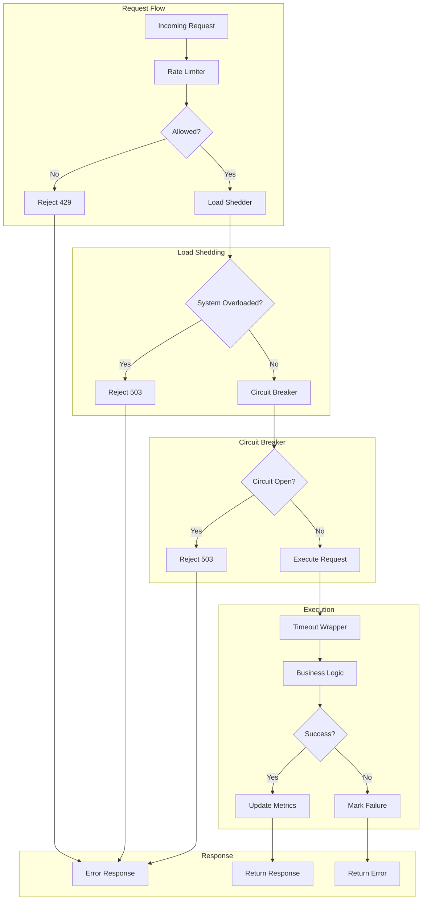

# Deep Dive: Resilience Patterns in go-zero

## Overview

go-zero implements comprehensive resilience patterns to ensure high availability under load. This deep dive examines circuit breaking, rate limiting, load shedding, timeouts, and retry strategies with implementation details.

## Architecture



## Circuit Breaker

### Adaptive Circuit Breaker

```go
// core/breaker/breaker.go

type Breaker interface {
    Allow() error
    MarkSuccess()
    MarkFailed()
}

// googleBreaker implements Google's adaptive circuit breaker
type googleBreaker struct {
    name    string
    requests *rollingWindow
    errors   *rollingWindow
    state    State  // Closed, Open, Half-Open
    threshold float64
    window   time.Duration
}

type State int

const (
    Closed State = iota  // Normal operation
    Open                // Rejecting requests
    HalfOpen            // Testing recovery
)

// Allow checks if request should proceed
func (b *googleBreaker) Allow() error {
    b.mu.Lock()
    defer b.mu.Unlock()
    
    switch b.state {
    case Closed:
        // Normal operation - check error ratio
        if b.shouldTrip() {
            b.state = Open
            b.nextCheck = time.Now().Add(b.window)
            return ErrBreakerOpen
        }
        return nil
        
    case Open:
        // Check if recovery window has passed
        if time.Now().After(b.nextCheck) {
            b.state = HalfOpen
            return nil
        }
        return ErrBreakerOpen
        
    case HalfOpen:
        // Allow limited requests to test
        return nil
    }
    
    return nil
}

// shouldTrip determines if circuit should open
func (b *googleBreaker) shouldTrip() bool {
    total := b.requests.Total()
    if total < 10 {
        // Not enough data
        return false
    }
    
    errorRatio := float64(b.errors.Total()) / float64(total)
    
    // Adaptive threshold based on success rate
    // Opens when error ratio exceeds threshold
    return errorRatio > b.threshold
}

// MarkSuccess records successful request
func (b *googleBreaker) MarkSuccess() {
    b.mu.Lock()
    defer b.mu.Unlock()
    
    b.requests.Add(1)
    
    if b.state == HalfOpen {
        // Successful request in half-open state
        // Close the circuit
        b.state = Closed
        b.errors.Reset()
    }
}

// MarkFailed records failed request
func (b *googleBreaker) MarkFailed() {
    b.mu.Lock()
    defer b.mu.Unlock()
    
    b.requests.Add(1)
    b.errors.Add(1)
    
    if b.state == HalfOpen {
        // Failed request in half-open state
        // Re-open the circuit
        b.state = Open
        b.nextCheck = time.Now().Add(b.window)
    }
}
```

### Rolling Window Statistics

```go
// core/stat/rollingwindow.go

type RollingWindow struct {
    size     int           // Number of buckets
    bucketSize time.Duration // Duration per bucket
    buckets  []Bucket
    offset   int           // Current bucket offset
    lastTime time.Time
}

type Bucket struct {
    Count  int64
    Errors int64
}

// NewRollingWindow creates a rolling window
func NewRollingWindow(size int, bucketSize time.Duration) *RollingWindow {
    return &RollingWindow{
        size:       size,
        bucketSize: bucketSize,
        buckets:    make([]Bucket, size),
        lastTime:   time.Now(),
    }
}

// Add adds a request to current bucket
func (w *RollingWindow) Add(success bool) {
    w.rotate()
    
    bucket := &w.buckets[w.offset]
    bucket.Count++
    
    if !success {
        bucket.Errors++
    }
}

// rotate advances window if needed
func (w *RollingWindow) rotate() {
    now := time.Now()
    elapsed := now.Sub(w.lastTime)
    
    // Calculate buckets to advance
    steps := int(elapsed / w.bucketSize)
    if steps == 0 {
        return
    }
    
    // Clear advanced buckets
    for i := 0; i < steps && i < w.size; i++ {
        w.offset = (w.offset + 1) % w.size
        w.buckets[w.offset] = Bucket{} // Reset bucket
    }
    
    w.lastTime = now
}

// Total returns total requests in window
func (w *RollingWindow) Total() int64 {
    w.rotate()
    
    var total int64
    for _, bucket := range w.buckets {
        total += bucket.Count
    }
    return total
}

// ErrorRatio returns error ratio in window
func (w *RollingWindow) ErrorRatio() float64 {
    w.rotate()
    
    total := w.Total()
    if total == 0 {
        return 0
    }
    
    var errors int64
    for _, bucket := range w.buckets {
        errors += bucket.Errors
    }
    
    return float64(errors) / float64(total)
}
```

### Circuit Breaker Usage

```go
// core/breaker/breaker.go

var breakers = make(map[string]Breaker)

// Do executes function with circuit breaker
func Do(name string, fn func() error) error {
    breaker := getBreaker(name)
    
    // Check if circuit is open
    if err := breaker.Allow(); err != nil {
        metricBreakerReject.Inc()
        return err
    }
    
    // Execute function
    err := fn()
    
    // Update breaker state
    if err != nil {
        breaker.MarkFailed()
        metricBreakerFail.Inc()
    } else {
        breaker.MarkSuccess()
        metricBreakerSuccess.Inc()
    }
    
    return err
}

// getBreaker gets or creates breaker
func getBreaker(name string) Breaker {
    mu.RLock()
    breaker, ok := breakers[name]
    mu.RUnlock()
    
    if ok {
        return breaker
    }
    
    mu.Lock()
    defer mu.Unlock()
    
    // Double-check
    if breaker, ok = breakers[name]; ok {
        return breaker
    }
    
    // Create new breaker
    breaker = &googleBreaker{
        name:      name,
        threshold: 0.5,  // 50% error rate trips
        window:    10 * time.Second,
        requests:  NewRollingWindow(100, 100*time.Millisecond),
        errors:    NewRollingWindow(100, 100*time.Millisecond),
    }
    
    breakers[name] = breaker
    return breaker
}
```

## Rate Limiting

### Period Limiter (Sliding Window)

```go
// core/limit/periodlimit.go

type PeriodLimiter struct {
    redis  *redis.Redis
    key    string
    quota  int
    period time.Duration
}

// Allow checks if request is within quota
func (l *PeriodLimiter) Allow() (bool, error) {
    now := time.Now()
    windowStart := now.Add(-l.period)
    
    // Lua script for atomic sliding window
    script := `
    local key = KEYS[1]
    local window = tonumber(ARGV[1])
    local quota = tonumber(ARGV[2])
    local now = tonumber(ARGV[3])
    local windowStart = now - window
    
    -- Remove expired entries
    redis.call('ZREMRANGEBYSCORE', key, 0, windowStart)
    
    -- Count current requests in window
    local count = redis.call('ZCARD', key)
    
    if count < quota then
        -- Add new request timestamp
        redis.call('ZADD', key, now, now)
        redis.call('EXPIRE', key, window)
        return 1
    else
        return 0
    end
    `
    
    result, err := l.redis.Eval(
        script,
        []string{l.key},
        l.period.Milliseconds(),
        l.quota,
        now.UnixMilli(),
    ).Int()
    
    if err != nil {
        return false, err
    }
    
    return result == 1, nil
}
```

### Token Bucket Limiter

```go
// core/limit/tokenlimit.go

type TokenLimiter struct {
    redis *redis.Redis
    key   string
    rate  int   // Tokens per second
    burst int   // Max capacity
}

// Allow attempts to consume one token
func (l *TokenLimiter) Allow() (bool, error) {
    now := time.Now().UnixMilli()
    
    // Lua script for atomic token bucket
    script := `
    local key = KEYS[1]
    local rate = tonumber(ARGV[1])
    local burst = tonumber(ARGV[2])
    local now = tonumber(ARGV[3])
    
    -- Get current bucket state
    local bucket = redis.call('HMGET', key, 'tokens', 'last_refill')
    local tokens = tonumber(bucket[1])
    local lastRefill = tonumber(bucket[2])
    
    -- Initialize if not exists
    if tokens == nil then
        tokens = burst
        lastRefill = now
    end
    
    -- Calculate tokens to add based on elapsed time
    local elapsed = now - lastRefill
    local newTokens = math.min(burst, tokens + (elapsed * rate / 1000))
    
    if newTokens >= 1 then
        -- Consume one token
        redis.call('HMSET', key, 'tokens', newTokens - 1, 'last_refill', now)
        redis.call('EXPIRE', key, 3600)
        return 1
    else
        return 0
    end
    `
    
    result, err := l.redis.Eval(
        script,
        []string{l.key},
        l.rate,
        l.burst,
        now,
    ).Int()
    
    if err != nil {
        return false, err
    }
    
    return result == 1, nil
}
```

### Connection Limiter

```go
// rest/handler/maxconnshandler.go

type MaxConnsMiddleware struct {
    limiter  load.Shedder
    gauge    metric.Gauge
    semaphore chan struct{}
}

func NewMaxConnsMiddleware(maxConns int) *MaxConnsMiddleware {
    return &MaxConnsMiddleware{
        semaphore: make(chan struct{}, maxConns),
        gauge:     metric.NewGauge("http_active_connections"),
    }
}

func (m *MaxConnsMiddleware) Handle(next http.HandlerFunc) http.HandlerFunc {
    return func(w http.ResponseWriter, r *http.Request) {
        // Try to acquire connection slot (non-blocking)
        select {
        case m.semaphore <- struct{}{}:
            m.gauge.Inc()
            defer func() {
                <-m.semaphore
                m.gauge.Dec()
            }()
            next(w, r)
        default:
            // Too many concurrent connections
            http.Error(w, "service unavailable", http.StatusServiceUnavailable)
            metricRejectedConns.Inc()
        }
    }
}
```

## Load Shedding

### Adaptive Shedder

```go
// core/load/adaptiveshedder.go

type AdaptiveShedder struct {
    window       time.Duration
    buckets      int
    rollingWindow *rollingWindow
    threshold    int64
    mu           sync.RWMutex
}

// NewAdaptiveShedder creates adaptive shedder
func NewAdaptiveShedder(opts ...ShedOption) *AdaptiveShedder {
    s := &AdaptiveShedder{
        window:  time.Second,
        buckets: 100,
    }
    
    for _, opt := range opts {
        opt(s)
    }
    
    s.rollingWindow = newRollingWindow(s.window, s.buckets)
    
    // Calculate threshold based on system capacity
    s.threshold = calculateThreshold()
    
    return s
}

// Allow checks if request should be shed
func (s *AdaptiveShedder) Allow() (Promise, error) {
    s.mu.RLock()
    defer s.mu.RUnlock()
    
    // Get current load metric (RT + QPS combination)
    currentLoad := s.calculateLoad()
    
    if currentLoad > s.threshold {
        // System overloaded - shed load
        metricLoadShed.Inc()
        return nil, ErrSystemOverloaded
    }
    
    // Create promise for tracking
    promise := &promise{
        shedder: s,
        start:   time.Now(),
    }
    
    return promise, nil
}

// calculateLoad computes current system load
func (s *AdaptiveShedder) calculateLoad() int64 {
    // Load = QPS * avg(RT)^2
    // This formula penalizes high latency more
    qps := s.rollingWindow.QPS()
    avgRT := s.rollingWindow.AverageRT()
    
    return int64(float64(qps) * math.Pow(float64(avgRT), 2))
}

// Promise tracks request completion
type Promise struct {
    shedder *AdaptiveShedder
    start   time.Time
    done    bool
}

// Done marks request completion
func (p *Promise) Done(err error) {
    if p.done {
        return
    }
    p.done = true
    
    duration := time.Since(p.start)
    p.shedder.rollingWindow.Add(duration, err != nil)
}

// Fail marks request as failed
func (p *Promise) Fail() {
    p.Done(errors.New("request failed"))
}
```

### Calculate Threshold

```go
// core/load/shedder.go

// calculateThreshold determines shedding threshold
func calculateThreshold() int64 {
    // Based on Little's Law:
    // L = λ * W
    // where L = concurrent requests, λ = arrival rate, W = avg wait time
    
    // Get system capacity estimates
    cpuCount := runtime.NumCPU()
    maxQPS := estimateMaxQPS()
    targetLatency := getTargetLatency()
    
    // Threshold = maxQPS * targetLatency^2
    // Squared latency penalizes slow responses
    threshold := int64(float64(maxQPS) * math.Pow(float64(targetLatency), 2))
    
    // Adjust for CPU count
    threshold = threshold * int64(cpuCount)
    
    return threshold
}

// estimateMaxQPS estimates maximum QPS based on historical data
func estimateMaxQPS() int {
    // Use 99th percentile of historical QPS
    return metricQPS.Percentile(99)
}

// getTargetLatency returns target latency in milliseconds
func getTargetLatency() int {
    // Use SLA target or p50 latency
    return 100 // 100ms default
}
```

## Timeout Handling

### Context Timeout

```go
// core/contextx/unmarshaler.go

// WithTimeout creates context with timeout
func WithTimeout(parent context.Context, timeout time.Duration) (context.Context, context.CancelFunc) {
    return context.WithTimeout(parent, timeout)
}

// TimeoutMiddleware wraps handler with timeout
func TimeoutMiddleware(timeout time.Duration) func(http.HandlerFunc) http.HandlerFunc {
    return func(next http.HandlerFunc) http.HandlerFunc {
        return func(w http.ResponseWriter, r *http.Request) {
            ctx, cancel := context.WithTimeout(r.Context(), timeout)
            defer cancel()
            
            // Create response interceptor
            done := make(chan struct{})
            panicChan := make(chan interface{}, 1)
            
            go func() {
                defer func() {
                    if p := recover(); p != nil {
                        panicChan <- p
                    }
                    close(done)
                }()
                next(w, r.WithContext(ctx))
            }()
            
            select {
            case <-done:
                // Completed normally
                return
            case p := <-panicChan:
                // Panic occurred
                panic(p)
            case <-ctx.Done():
                // Timeout
                if ctx.Err() == context.DeadlineExceeded {
                    http.Error(w, "request timeout", http.StatusGatewayTimeout)
                    metricTimeout.Inc()
                }
            }
        }
    }
}
```

### RPC Timeout

```go
// zrpc/client/interceptors.go

func timeoutInterceptor(timeout time.Duration) grpc.UnaryClientInterceptor {
    return func(
        ctx context.Context,
        method string,
        req, reply interface{},
        cc *grpc.ClientConn,
        invoker grpc.UnaryInvoker,
        opts ...grpc.CallOption,
    ) error {
        // Create context with timeout
        ctx, cancel := context.WithTimeout(ctx, timeout)
        defer cancel()
        
        return invoker(ctx, method, req, reply, cc, opts...)
    }
}
```

## Retry Strategy

### Retry with Backoff

```go
// core/retry/retry.go

type RetryConfig struct {
    MaxRetries   int
    BaseBackoff  time.Duration
    MaxBackoff   time.Duration
    Multiplier   float64
    Jitter       float64
    RetryableErrs []error
}

// Do executes function with retry
func Do(ctx context.Context, config RetryConfig, fn func() error) error {
    var lastErr error
    
    for attempt := 0; attempt <= config.MaxRetries; attempt++ {
        err := fn()
        if err == nil {
            return nil
        }
        
        lastErr = err
        
        // Check if retryable
        if !isRetryable(err, config.RetryableErrs) {
            return err
        }
        
        // Check context
        if ctx.Err() != nil {
            return ctx.Err()
        }
        
        // Calculate backoff with exponential increase
        backoff := config.BaseBackoff * time.Duration(math.Pow(config.Multiplier, float64(attempt)))
        
        // Cap at max backoff
        if backoff > config.MaxBackoff {
            backoff = config.MaxBackoff
        }
        
        // Add jitter to prevent thundering herd
        jitter := time.Duration(rand.Float64() * config.Jitter * float64(backoff))
        backoff = backoff + jitter
        
        // Wait before retry
        select {
        case <-time.After(backoff):
            continue
        case <-ctx.Done():
            return ctx.Err()
        }
    }
    
    return lastErr
}

// isRetryable checks if error is retryable
func isRetryable(err error, retryableErrs []error) bool {
    // Connection errors are typically retryable
    if strings.Contains(err.Error(), "connection") {
        return true
    }
    
    if strings.Contains(err.Error(), "timeout") {
        return true
    }
    
    // Check explicit retryable errors
    for _, retryable := range retryableErrs {
        if errors.Is(err, retryable) {
            return true
        }
    }
    
    return false
}
```

## Metrics and Monitoring

```go
// core/metric/resilience.go

var (
    // Circuit breaker metrics
    metricBreakerSuccess = prometheus.NewCounterVec(
        prometheus.CounterOpts{
            Namespace: "go_zero",
            Subsystem: "breaker",
            Name:      "success_total",
            Help:      "Circuit breaker success count",
        },
        []string{"name"},
    )
    
    metricBreakerFail = prometheus.NewCounterVec(
        prometheus.CounterOpts{
            Namespace: "go_zero",
            Subsystem: "breaker",
            Name:      "fail_total",
            Help:      "Circuit breaker failure count",
        },
        []string{"name"},
    )
    
    metricBreakerReject = prometheus.NewCounterVec(
        prometheus.CounterOpts{
            Namespace: "go_zero",
            Subsystem: "breaker",
            Name:      "reject_total",
            Help:      "Circuit breaker reject count",
        },
        []string{"name"},
    )
    
    // Rate limit metrics
    metricRateLimitAllow = prometheus.NewCounterVec(
        prometheus.CounterOpts{
            Namespace: "go_zero",
            Subsystem: "ratelimit",
            Name:      "allow_total",
            Help:      "Rate limit allow count",
        },
        []string{"name"},
    )
    
    metricRateLimitReject = prometheus.NewCounterVec(
        prometheus.CounterOpts{
            Namespace: "go_zero",
            Subsystem: "ratelimit",
            Name:      "reject_total",
            Help:      "Rate limit reject count",
        },
        []string{"name"},
    )
    
    // Load shedding metrics
    metricLoadShed = prometheus.NewCounter(
        prometheus.CounterOpts{
            Namespace: "go_zero",
            Subsystem: "load",
            Name:      "shed_total",
            Help:      "Load shedding count",
        },
    )
)

func init() {
    prometheus.MustRegister(
        metricBreakerSuccess,
        metricBreakerFail,
        metricBreakerReject,
        metricRateLimitAllow,
        metricRateLimitReject,
        metricLoadShed,
    )
}
```

## Conclusion

go-zero resilience patterns provide:

1. **Circuit Breaking**: Adaptive breaker with rolling windows
2. **Rate Limiting**: Sliding window and token bucket algorithms
3. **Load Shedding**: QPS * RT^2 based adaptive shedding
4. **Timeouts**: Context-based timeout propagation
5. **Retry**: Exponential backoff with jitter
6. **Metrics**: Comprehensive Prometheus metrics
