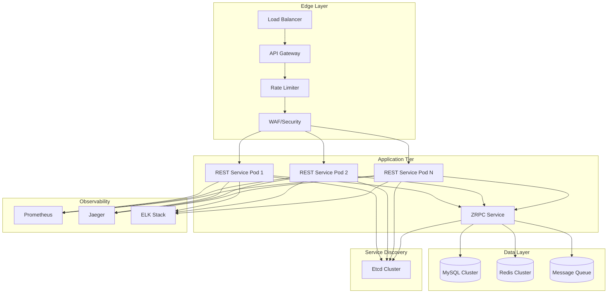

# Production-Grade Microservices with go-zero

## Overview

This guide covers production deployment patterns for go-zero microservices including security, scaling, observability, CI/CD, and operational best practices.

## Architecture Overview



## Security Considerations

### 1. Authentication & Authorization

```go
// middleware/auth.go

type AuthMiddleware struct {
    secret      string
    whitelist   map[string]bool
    tokenCache  *cache.Cache
}

func NewAuthMiddleware(secret string) *AuthMiddleware {
    return &AuthMiddleware{
        secret: secret,
        whitelist: map[string]bool{
            "/health": true,
            "/metrics": true,
        },
        tokenCache: cache.NewCache(cache.TTL(5 * time.Minute)),
    }
}

func (m *AuthMiddleware) Handle(next http.HandlerFunc) http.HandlerFunc {
    return func(w http.ResponseWriter, r *http.Request) {
        // Skip whitelist
        if m.whitelist[r.URL.Path] {
            next(w, r)
            return
        }
        
        // Extract token
        token := extractToken(r)
        if token == "" {
            http.Error(w, "missing token", http.StatusUnauthorized)
            return
        }
        
        // Check cache
        if claims, ok := m.tokenCache.Get(token); ok {
            // Add claims to context
            ctx := context.WithValue(r.Context(), authClaimsKey, claims)
            next(w, r.WithContext(ctx))
            return
        }
        
        // Validate JWT
        claims, err := parseToken(token, m.secret)
        if err != nil {
            http.Error(w, "invalid token", http.StatusUnauthorized)
            return
        }
        
        // Check expiration
        if claims.ExpiresAt < time.Now().Unix() {
            http.Error(w, "token expired", http.StatusUnauthorized)
            return
        }
        
        // Cache and continue
        m.tokenCache.Set(token, claims)
        ctx := context.WithValue(r.Context(), authClaimsKey, claims)
        next(w, r.WithContext(ctx))
    }
}

// Role-based authorization
func RequireRole(role string) Middleware {
    return func(next http.HandlerFunc) http.HandlerFunc {
        return func(w http.ResponseWriter, r *http.Request) {
            claims := r.Context().Value(authClaimsKey).(*Claims)
            
            if !claims.HasRole(role) {
                http.Error(w, "forbidden", http.StatusForbidden)
                return
            }
            
            next(w, r)
        }
    }
}
```

### 2. Input Validation & Sanitization

```go
// middleware/validation.go

type Validator struct {
    maxBodySize int64
    allowedContentTypes []string
}

func NewValidator() *Validator {
    return &Validator{
        maxBodySize: 1 << 20, // 1MB
        allowedContentTypes: []string{
            "application/json",
            "application/x-www-form-urlencoded",
        },
    }
}

func (v *Validator) Validate(next http.HandlerFunc) http.HandlerFunc {
    return func(w http.ResponseWriter, r *http.Request) {
        // Check content type
        contentType := r.Header.Get("Content-Type")
        if !v.isAllowedContentType(contentType) {
            http.Error(w, "unsupported content type", http.StatusUnsupportedMediaType)
            return
        }
        
        // Check body size
        if r.ContentLength > v.maxBodySize {
            http.Error(w, "request too large", http.StatusRequestEntityTooLarge)
            return
        }
        
        // Limit reader
        r.Body = http.MaxBytesReader(w, r.Body, v.maxBodySize)
        
        next(w, r)
    }
}

// Input sanitization
func sanitize(input string) string {
    // Remove XSS vectors
    sanitized := bluemonday.UGCPolicy().Sanitize(input)
    
    // Normalize whitespace
    sanitized = strings.Join(strings.Fields(sanitized), " ")
    
    // Trim length
    if len(sanitized) > 1000 {
        sanitized = sanitized[:1000]
    }
    
    return sanitized
}

// SQL injection prevention (use prepared statements)
func getUserByID(db *sql.DB, id int64) (*User, error) {
    // GOOD: Parameterized query
    row := db.QueryRow("SELECT * FROM users WHERE id = ?", id)
    
    // BAD: String concatenation (vulnerable)
    // row := db.QueryRow(fmt.Sprintf("SELECT * FROM users WHERE id = %d", id))
    
    var user User
    err := row.Scan(&user.ID, &user.Name, &user.Email)
    return &user, err
}
```

### 3. Rate Limiting Configuration

```yaml
# config.yaml

# Global rate limits
Limit:
  # Connection limit
  maxConns: 10000
  
  # Request size limit
  maxBytes: 1048576  # 1MB
  
  # Per-IP rate limit
  perIP:
    quota: 100       # 100 requests
    period: 60       # per minute
    
  # Per-user rate limit (requires auth)
  perUser:
    quota: 1000
    period: 60
```

```go
// middleware/ratelimit.go

type RateLimitMiddleware struct {
    ipLimiter  *limit.PeriodLimiter
    userLimiter *limit.PeriodLimiter
}

func NewRateLimitMiddleware(redisConf redis.RedisConf) *RateLimitMiddleware {
    return &RateLimitMiddleware{
        ipLimiter: limit.NewPeriodLimiter(
            redisConf,
            "rate-limit:ip",
            limit.PeriodLimiterConf{
                Period: time.Minute,
                Quota:  100,
            },
        ),
        userLimiter: limit.NewPeriodLimiter(
            redisConf,
            "rate-limit:user",
            limit.PeriodLimiterConf{
                Period: time.Minute,
                Quota:  1000,
            },
        ),
    }
}

func (m *RateLimitMiddleware) Handle(next http.HandlerFunc) http.HandlerFunc {
    return func(w http.ResponseWriter, r *http.Request) {
        // Get client IP
        clientIP := getClientIP(r)
        
        // Check IP limit
        key := fmt.Sprintf("ip:%s", clientIP)
        if !m.ipLimiter.Allow(key) {
            http.Error(w, "rate limit exceeded", http.StatusTooManyRequests)
            metricRateLimitIPReject.Inc()
            return
        }
        
        // Check user limit (if authenticated)
        if userID := r.Context().Value(userIDKey); userID != nil {
            key := fmt.Sprintf("user:%v", userID)
            if !m.userLimiter.Allow(key) {
                http.Error(w, "rate limit exceeded", http.StatusTooManyRequests)
                metricRateLimitUserReject.Inc()
                return
            }
        }
        
        next(w, r)
    }
}
```

## Observability

### 1. Structured Logging

```yaml
# config.yaml

Log:
  Level: info          # debug, info, warn, error
  Mode: file           # console, file
  Path: /var/log/app   # Log file path
  KeepDays: 7          # Retention days
  Compress: true       # Gzip compression
  MaxSize: 100         # MB before rotation
  MaxBackups: 5        # Number of rotated files
```

```go
// Logging best practices

// Context-aware logging
func (l *UserLogic) GetUser(ctx context.Context, id int64) (*User, error) {
    // Include request context
    logx.WithContext(ctx).
        WithFields(map[string]interface{}{
            "user_id": id,
            "action":  "get_user",
        }).
        Info("Fetching user")
    
    user, err := l.UserModel.FindOne(ctx, id)
    if err != nil {
        logx.WithContext(ctx).
            WithFields(map[string]interface{}{
                "user_id": id,
                "error":   err,
            }).
            Error("Failed to fetch user")
        return nil, err
    }
    
    // Log with duration
    logx.WithContext(ctx).
        WithDuration(time.Since(start)).
        Infof("User fetched: %d", id)
    
    return user, nil
}

// Slow query logging
defer logx.Slow("database-query", time.Second)()
// ... database operation
```

### 2. Prometheus Metrics

```yaml
# config.yaml

Prometheus:
  Host: 0.0.0.0
  Port: 9091
  Path: /metrics
```

```go
// Custom metrics

var (
    // Business metrics
    metricOrdersTotal = prometheus.NewCounterVec(
        prometheus.CounterOpts{
            Namespace: "myapp",
            Subsystem: "orders",
            Name:      "total",
            Help:      "Total orders processed",
        },
        []string{"status", "payment_method"},
    )
    
    metricOrderValue = prometheus.NewHistogramVec(
        prometheus.HistogramOpts{
            Namespace: "myapp",
            Subsystem: "orders",
            Name:      "value",
            Help:      "Order value distribution",
            Buckets:   []float64{10, 50, 100, 500, 1000, 5000},
        },
        []string{"currency"},
    )
)

func init() {
    prometheus.MustRegister(metricOrdersTotal, metricOrderValue)
}

// Usage in handler
func (l *OrderLogic) CreateOrder(ctx context.Context, req *CreateOrderRequest) (*Order, error) {
    start := time.Now()
    
    order, err := l.createOrderInternal(ctx, req)
    
    // Record metrics
    status := "success"
    if err != nil {
        status = "failed"
    }
    metricOrdersTotal.WithLabelValues(status, req.PaymentMethod).Inc()
    
    if err == nil {
        metricOrderValue.WithLabelValues(req.Currency).Observe(float64(req.Amount))
    }
    
    // Record latency
    metricOrderLatency.Observe(time.Since(start).Seconds())
    
    return order, err
}
```

### 3. Distributed Tracing

```yaml
# config.yaml

Telemetry:
  Name: myapp-api        # Service name
  Endpoint: http://jaeger:14268/api/traces
  Sampler: 1.0           # Sample 100% (reduce in production)
  Batcher: jaeger
```

```go
// Custom spans

func (l *OrderLogic) ProcessOrder(ctx context.Context, order *Order) error {
    // Start span
    ctx, span := trace.StartSpan(ctx, "ProcessOrder")
    defer span.End()
    
    // Set attributes
    span.SetAttributes(
        attribute.String("order.id", order.ID),
        attribute.Int64("order.amount", order.Amount),
        attribute.String("order.customer", order.CustomerID),
    )
    
    // Process payment
    if err := l.processPayment(ctx, order); err != nil {
        span.RecordError(err)
        span.SetStatus(codes.Error, "payment failed")
        return err
    }
    
    // Update inventory
    if err := l.updateInventory(ctx, order); err != nil {
        span.RecordError(err)
        return err
    }
    
    return nil
}

// Propagate trace context to downstream services
func callDownstreamService(ctx context.Context, url string) error {
    req, _ := http.NewRequest("GET", url, nil)
    
    // Inject trace context into headers
    otel.GetTextMapPropagator().Inject(
        ctx,
        propagation.HeaderCarrier(req.Header),
    )
    
    resp, err := http.DefaultClient.Do(req)
    // ...
}
```

## Deployment

### Docker Configuration

```dockerfile
# Dockerfile

# Build stage
FROM golang:1.21-alpine AS builder

# Install dependencies
RUN apk add --no-cache git ca-certificates tzdata

# Enable Go modules
ENV GO111MODULE=on
ENV GOPROXY=https://goproxy.cn,direct

WORKDIR /build

# Download dependencies (cached layer)
COPY go.mod go.sum ./
RUN go mod download

# Copy source and build
COPY . .
RUN CGO_ENABLED=0 GOOS=linux go build \
    -ldflags="-w -s" \
    -o /app/server \
    ./app.go

# Runtime stage
FROM alpine:latest

# Install CA certificates and timezone
RUN apk --no-cache add ca-certificates tzdata

# Create non-root user
RUN addgroup -g 1000 appgroup && \
    adduser -D -u 1000 -G appgroup appuser

WORKDIR /app

# Copy binary and config
COPY --from=builder /app/server .
COPY --from=builder /app/etc/app.yaml .

# Set ownership
RUN chown -R appuser:appgroup /app

# Switch to non-root user
USER appuser

# Expose ports
EXPOSE 8888 9091

# Health check
HEALTHCHECK --interval=30s --timeout=3s --start-period=5s --retries=3 \
    CMD wget -q --spider http://localhost:8888/health || exit 1

# Run
CMD ["./server", "-f", "app.yaml"]
```

### Kubernetes Deployment

```yaml
# deploy.yaml

apiVersion: apps/v1
kind: Deployment
metadata:
  name: myapp-api
  labels:
    app: myapp-api
spec:
  replicas: 3
  revisionHistoryLimit: 5
  strategy:
    type: RollingUpdate
    rollingUpdate:
      maxSurge: 1
      maxUnavailable: 0
  selector:
    matchLabels:
      app: myapp-api
  template:
    metadata:
      labels:
        app: myapp-api
      annotations:
        prometheus.io/scrape: "true"
        prometheus.io/port: "9091"
        prometheus.io/path: "/metrics"
    spec:
      serviceAccountName: myapp
      affinity:
        podAntiAffinity:
          preferredDuringSchedulingIgnoredDuringExecution:
          - weight: 100
            podAffinityTerm:
              labelSelector:
                matchLabels:
                  app: myapp-api
              topologyKey: kubernetes.io/hostname
      containers:
      - name: api
        image: myregistry/myapp-api:latest
        imagePullPolicy: Always
        ports:
        - containerPort: 8888
          name: http
        - containerPort: 9091
          name: metrics
        resources:
          requests:
            cpu: 100m
            memory: 128Mi
          limits:
            cpu: 1000m
            memory: 512Mi
        env:
        - name: JWT_SECRET
          valueFrom:
            secretKeyRef:
              name: myapp-secrets
              key: jwt-secret
        - name: DB_URL
          valueFrom:
            secretKeyRef:
              name: myapp-secrets
              key: db-url
        - name: GOMAXPROCS
          valueFrom:
            resourceFieldRef:
              resource: limits.cpu
        volumeMounts:
        - name: config
          mountPath: /app/app.yaml
          subPath: app.yaml
          readOnly: true
        livenessProbe:
          httpGet:
            path: /health
            port: 8888
          initialDelaySeconds: 10
          periodSeconds: 10
          timeoutSeconds: 5
          failureThreshold: 3
        readinessProbe:
          httpGet:
            path: /ready
            port: 8888
          initialDelaySeconds: 5
          periodSeconds: 5
          timeoutSeconds: 3
          failureThreshold: 3
      volumes:
      - name: config
        configMap:
          name: myapp-config
---
apiVersion: v1
kind: Service
metadata:
  name: myapp-api
spec:
  selector:
    app: myapp-api
  ports:
  - port: 80
    targetPort: 8888
    name: http
  type: ClusterIP
---
apiVersion: autoscaling/v2
kind: HorizontalPodAutoscaler
metadata:
  name: myapp-api-hpa
spec:
  scaleTargetRef:
    apiVersion: apps/v1
    kind: Deployment
    name: myapp-api
  minReplicas: 3
  maxReplicas: 20
  metrics:
  - type: Resource
    resource:
      name: cpu
      target:
        type: Utilization
        averageUtilization: 70
  - type: Resource
    resource:
      name: memory
      target:
        type: Utilization
        averageUtilization: 80
  behavior:
    scaleUp:
      stabilizationWindowSeconds: 60
      policies:
      - type: Percent
        value: 100
        periodSeconds: 60
    scaleDown:
      stabilizationWindowSeconds: 300
      policies:
      - type: Percent
        value: 10
        periodSeconds: 60
```

## CI/CD Pipeline

```yaml
# .github/workflows/ci.yaml

name: CI/CD

on:
  push:
    branches: [main]
  pull_request:
    branches: [main]

jobs:
  test:
    runs-on: ubuntu-latest
    services:
      mysql:
        image: mysql:8.0
        env:
          MYSQL_ROOT_PASSWORD: test
          MYSQL_DATABASE: testdb
        ports:
        - 3306:3306
      redis:
        image: redis:7
        ports:
        - 6379:6379
    
    steps:
    - uses: actions/checkout@v4
    
    - name: Set up Go
      uses: actions/setup-go@v5
      with:
        go-version: '1.21'
    
    - name: Cache dependencies
      uses: actions/cache@v4
      with:
        path: ~/go/pkg/mod
        key: ${{ runner.os }}-go-${{ hashFiles('**/go.sum') }}
    
    - name: Install goctl
      run: go install github.com/zeromicro/go-zero/tools/goctl@latest
    
    - name: Generate code
      run: |
        goctl api go -api api/greet.api -dir ./generated
    
    - name: Run tests
      run: go test -race -coverprofile=coverage.out ./...
    
    - name: Upload coverage
      uses: codecov/codecov-action@v3
      with:
        file: ./coverage.out

  build:
    needs: test
    runs-on: ubuntu-latest
    if: github.event_name == 'push' && github.ref == 'refs/heads/main'
    
    steps:
    - uses: actions/checkout@v4
    
    - name: Build and push Docker image
      uses: docker/build-push-action@v5
      with:
        context: .
        push: true
        tags: |
          myregistry/myapp-api:${{ github.sha }}
          myregistry/myapp-api:latest
        cache-from: type=registry,ref=myregistry/myapp-api:buildcache
        cache-to: type=registry,ref=myregistry/myapp-api:buildcache,mode=max

  deploy:
    needs: build
    runs-on: ubuntu-latest
    environment: production
    
    steps:
    - uses: actions/checkout@v4
    
    - name: Deploy to Kubernetes
      uses: azure/k8s-deploy@v4
      with:
        manifests: |
          deploy/deployment.yaml
          deploy/service.yaml
        images: |
          myregistry/myapp-api:${{ github.sha }}
        kubectl-version: '1.28'
```

## Testing Strategy

### Unit Tests

```go
// internal/logic/userlogic_test.go

package logic

import (
    "context"
    "testing"
    "github.com/stretchr/testify/assert"
    "github.com/stretchr/testify/mock"
    "yourproject/internal/model"
    "yourproject/internal/svc"
)

// Mock UserModel
type MockUserModel struct {
    mock.Mock
}

func (m *MockUserModel) FindOne(ctx context.Context, id int64) (*model.User, error) {
    args := m.Called(ctx, id)
    if args.Get(0) == nil {
        return nil, args.Error(1)
    }
    return args.Get(0).(*model.User), args.Error(1)
}

func TestUserLogic_GetUser(t *testing.T) {
    ctx := context.Background()
    
    // Setup mock
    mockUserModel := new(MockUserModel)
    svcCtx := &svc.ServiceContext{
        UserModel: mockUserModel,
    }
    
    // Setup expected data
    expectedUser := &model.User{
        ID:    1,
        Name:  "Test User",
        Email: "test@example.com",
    }
    
    mockUserModel.
        On("FindOne", ctx, int64(1)).
        Return(expectedUser, nil)
    
    // Call logic
    logic := NewUserLogic(ctx, svcCtx)
    user, err := logic.GetUser(&GetUserRequest{Id: 1})
    
    // Assertions
    assert.NoError(t, err)
    assert.Equal(t, expectedUser.Name, user.Name)
    mockUserModel.AssertExpectations(t)
}
```

### Integration Tests

```go
// tests/integration/api_test.go

package integration

import (
    "context"
    "net/http"
    "net/http/httptest"
    "testing"
    "github.com/zeromicro/go-zero/rest"
    "yourproject/internal/config"
    "yourproject/internal/handler"
    "yourproject/internal/svc"
)

func TestGreetAPI(t *testing.T) {
    // Setup test configuration
    cfg := config.Config{
        RestConf: rest.RestConf{
            ServiceConf: rest.ServiceConf{
                Name: "test-greet",
            },
            Host: "localhost",
            Port: 8888,
        },
    }
    
    // Create service context
    svcCtx := svc.NewServiceContext(cfg)
    
    // Create server
    server := rest.MustNewServer(cfg.RestConf)
    defer server.Stop()
    
    // Register handlers
    handler.RegisterHandlers(server, svcCtx)
    
    // Start server in background
    go server.Start()
    
    // Make test request
    req := httptest.NewRequest("GET", "/greet/from/world", nil)
    w := httptest.NewRecorder()
    
    server.ServeHTTP(w, req)
    
    // Assertions
    assert.Equal(t, http.StatusOK, w.Code)
    assert.Contains(t, w.Body.String(), "Hello")
}
```

### Load Testing

```yaml
# k6 load test

import http from 'k6/http';
import { check, sleep } from 'k6';

export const options = {
  stages: [
    { duration: '2m', target: 100 },   // Ramp up to 100 users
    { duration: '5m', target: 100 },   // Stay at 100 users
    { duration: '2m', target: 500 },   // Ramp up to 500 users
    { duration: '5m', target: 500 },   // Stay at 500 users
    { duration: '2m', target: 0 },     // Ramp down
  ],
  thresholds: {
    http_req_duration: ['p(95)<500'],  // 95% of requests < 500ms
    http_req_failed: ['rate<0.01'],    // Error rate < 1%
  },
};

export default function() {
  const res = http.get('http://localhost:8888/greet/from/world');
  
  check(res, {
    'status is 200': (r) => r.status === 200,
    'response time < 500ms': (r) => r.timings.duration < 500,
  });
  
  sleep(1);
}
```

## Production Checklist

```
Security:
□ JWT authentication enabled
□ Input validation on all endpoints
□ SQL injection prevention (prepared statements)
□ XSS prevention (output encoding)
□ Rate limiting configured
□ HTTPS/TLS enabled
□ Secrets in environment variables or vault
□ Non-root container user

Observability:
□ Structured logging configured
□ Prometheus metrics exposed
□ Distributed tracing enabled
□ Health endpoints implemented
□ Alert rules configured

Resilience:
□ Circuit breakers configured
□ Rate limits set
□ Timeouts configured
□ Retry policies with backoff
□ Graceful shutdown implemented

Deployment:
□ Resource limits defined
□ Liveness/readiness probes
□ HPA configured
□ Pod anti-affinity
□ Rolling update strategy

Testing:
□ Unit tests (>80% coverage)
□ Integration tests
□ Load testing completed
□ Chaos engineering tests
```

## Conclusion

Production-grade go-zero deployments require:

1. **Security**: Authentication, validation, rate limiting
2. **Observability**: Logging, metrics, tracing
3. **Resilience**: Circuit breakers, timeouts, retries
4. **Deployment**: Docker, Kubernetes, CI/CD
5. **Testing**: Unit, integration, load tests
