# Project Exploration: Zod - TypeScript Schema Validation

## Overview

Zod is a TypeScript-first schema declaration and validation library with zero dependencies. It allows developers to define schemas once and automatically infer static TypeScript types from them, eliminating duplicative type declarations.

**Key Characteristics:**
- **Zero dependencies** - No external runtime dependencies
- **TypeScript-first** - Mirrors TypeScript's type system as closely as possible
- **Immutable** - Methods return new instances (e.g., `.optional()`)
- **Concise, chainable interface** - Fluent API for schema composition
- **Functional approach** - Follows "parse, don't validate" philosophy
- **Tiny footprint** - ~8kb minified + zipped
- **Works in Node.js and all modern browsers**

## Directory Structure

```
zod/
├── src/
│   ├── types.ts           # Core schema type definitions (ZodType and all subclasses)
│   ├── ZodError.ts        # Error handling classes and types
│   ├── errors.ts          # Default error map and error configuration
│   ├── index.ts           # Main entry point
│   ├── external.ts        # Re-exports all public modules
│   ├── standard-schema.ts # Standard Schema V1 compatibility layer
│   ├── helpers/
│   │   ├── parseUtil.ts   # Parse context, status, and utility functions
│   │   ├── errorUtil.ts   # Error message utilities
│   │   ├── util.ts        # General utilities and ZodParsedType enum
│   │   ├── enumUtil.ts    # Enum-specific utilities
│   │   ├── partialUtil.ts # Deep partial type utilities
│   │   └── typeAliases.ts # Type alias definitions
│   ├── locales/
│   │   └── en.ts          # Default English error messages
│   ├── __tests__/         # Comprehensive test suite (50+ test files)
│   └── benchmarks/        # Performance benchmarks
├── deno/                   # Deno-specific build
├── README.md              # Comprehensive documentation (101KB)
├── ERROR_HANDLING.md      # Detailed error handling guide
├── MIGRATION.md           # Migration guide between major versions
└── package.json
```

## Architecture

### High-Level Diagram

```mermaid
graph TB
    subgraph "Core Foundation"
        ZodType[ZodType - Abstract Base Class]
        ZodTypeDef[ZodTypeDef - Schema Definition Interface]
    end

    subgraph "Primitive Schemas"
        ZodString[ZodString]
        ZodNumber[ZodNumber]
        ZodBoolean[ZodBoolean]
        ZodDate[ZodDate]
        ZodBigInt[ZodBigInt]
        ZodNull[ZodNull]
        ZodUndefined[ZodUndefined]
        ZodVoid[ZodVoid]
        ZodNaN[ZodNaN]
    end

    subgraph "Complex Schemas"
        ZodObject[ZodObject]
        ZodArray[ZodArray]
        ZodUnion[ZodUnion]
        ZodIntersection[ZodIntersection]
        ZodTuple[ZodTuple]
        ZodRecord[ZodRecord]
        ZodMap[ZodMap]
        ZodSet[ZodSet]
        ZodFunction[ZodFunction]
    end

    subgraph "Modifier Schemas"
        ZodOptional[ZodOptional]
        ZodNullable[ZodNullable]
        ZodDefault[ZodDefault]
        ZodCatch[ZodCatch]
        ZodBranded[ZodBranded]
        ZodReadonly[ZodReadonly]
    end

    subgraph "Transform Schemas"
        ZodEffects[ZodEffects - refinement/transform]
        ZodPipeline[ZodPipeline]
    end

    subgraph "Utility"
        ZodLazy[ZodLazy - recursive types]
        ZodLiteral[ZodLiteral]
        ZodEnum[ZodEnum]
        ZodNativeEnum[ZodNativeEnum]
        ZodPromise[ZodPromise]
        ZodAny[ZodAny]
        ZodUnknown[ZodUnknown]
        ZodNever[ZodNever]
    end

    ZodType --> ZodString
    ZodType --> ZodNumber
    ZodType --> ZodObject
    ZodType --> ZodArray
    ZodType --> ZodOptional
    ZodType --> ZodEffects
    ZodType --> ZodLazy

    ZodEffects --> ZodRefinement
    ZodEffects --> ZodTransform
    ZodEffects --> ZodPreprocess
```



### The ZodType Base Class

All Zod schemas inherit from the abstract `ZodType<Output, Def, Input>` class which provides:

**Core Parsing Methods:**
- `parse(data: unknown): Output` - Synchronous parsing (throws on error)
- `parseAsync(data: unknown): Promise<Output>` - Async parsing
- `safeParse(data: unknown): SafeParseReturnType` - Returns result object instead of throwing
- `safeParseAsync(data: unknown): Promise<SafeParseReturnType>` - Async safe parsing

**Type Modifiers:**
- `optional()` - Makes schema optional (T | undefined)
- `nullable()` - Makes schema nullable (T | null)
- `nullish()` - Makes schema nullish (T | null | undefined)
- `array()` - Wraps in array schema
- `promise()` - Wraps in promise schema

**Combinators:**
- `or(T): ZodUnion` - Creates union types
- `and(T): ZodIntersection` - Creates intersection types
- `pipe(T): ZodPipeline` - Chains schemas for sequential processing

**Transformations:**
- `refine()` - Custom validation logic
- `superRefine()` - Advanced validation with multiple issues
- `transform()` - Post-parsing transformations
- `default()` - Sets default value
- `catch()` - Sets catch value for error recovery

**Metadata:**
- `describe(string)` - Adds description
- `brand<T>()` - Adds nominal type branding

## Schema System

### Schema Definition Pattern

Every Zod schema consists of:
1. **Def** - A definition object containing configuration
2. **_parse()** - Abstract method implementing validation logic
3. **Type parameters** - `<Output, Def, Input>` for type inference

Example (ZodString):
```typescript
interface ZodStringDef extends ZodTypeDef {
  checks: ZodStringCheck[];  // Array of validation checks
  typeName: ZodFirstPartyTypeKind.ZodString;
  coerce: boolean;
}

export class ZodString extends ZodType<string, ZodStringDef, string> {
  _parse(input: ParseInput): ParseReturnType<string> {
    // 1. Handle coercion if enabled
    if (this._def.coerce) {
      input.data = String(input.data);
    }

    // 2. Check type
    const parsedType = this._getType(input);
    if (parsedType !== ZodParsedType.string) {
      addIssueToContext(ctx, { ... });
      return INVALID;
    }

    // 3. Run all checks
    for (const check of this._def.checks) {
      // validation logic
    }

    return { status: status.value, value: input.data };
  }
}
```

### Built-in Schema Types

**Primitives:**
| Schema | TypeScript Type | Description |
|--------|----------------|-------------|
| `z.string()` | `string` | String values with optional validations |
| `z.number()` | `number` | Number values with optional constraints |
| `z.bigint()` | `bigint` | BigInt values |
| `z.boolean()` | `boolean` | Boolean values |
| `z.date()` | `Date` | Date objects |
| `z.symbol()` | `symbol` | Symbol values |
| `z.nan()` | `number` | NaN values |

**Empty Types:**
| Schema | TypeScript Type | Description |
|--------|----------------|-------------|
| `z.undefined()` | `undefined` | Undefined only |
| `z.null()` | `null` | Null only |
| `z.void()` | `void` | Accepts undefined |

**Catch-all Types:**
| Schema | TypeScript Type | Description |
|--------|----------------|-------------|
| `z.any()` | `any` | Allows any value |
| `z.unknown()` | `unknown` | Type-safe unknown |
| `z.never()` | `never` | Allows no values |

**Collections:**
| Schema | TypeScript Type | Description |
|--------|----------------|-------------|
| `z.array(T)` | `T[]` | Homogeneous arrays |
| `z.tuple([A, B])` | `[A, B]` | Fixed-length, heterogeneous |
| `z.record(K, V)` | `Record<K, V>` | Key-value mappings |
| `z.map(K, V)` | `Map<K, V>` | Map objects |
| `z.set(T)` | `Set<T>` | Set objects |

**Combinators:**
| Schema | TypeScript Type | Description |
|--------|----------------|-------------|
| `z.union([A, B])` | `A | B` | Union types |
| `z.intersection(A, B)` | `A & B` | Intersection types |
| `z.discriminatedUnion()` | - | Efficient discriminated unions |

**Other:**
| Schema | TypeScript Type | Description |
|--------|----------------|-------------|
| `z.literal(value)` | `typeof value` | Exact value match |
| `z.enum(["a", "b"])` | `"a" | "b"` | String enum |
| `z.nativeEnum(Enum)` | `Enum` | TypeScript enum |
| `z.lazy(() => T)` | `T` | Recursive types |
| `z.promise(T)` | `Promise<T>` | Promise validation |
| `z.function()` | `Function` | Function schemas |

## Type Inference

Zod's type inference is powered by TypeScript's conditional types and the `infer` keyword.

### The `z.infer` Utility

```typescript
// Core type inference utility
export type TypeOf<T extends ZodType<any, any, any>> = T["_output"];
export type { TypeOf as infer };

// Usage:
const User = z.object({
  name: z.string(),
  age: z.number(),
});
type User = z.infer<typeof User>;
// { name: string; age: number }
```

### Input vs Output Types

Zod distinguishes between input and output types, which is crucial for transforms:

```typescript
// Input type: what the schema accepts
// Output type: what the schema returns after parsing/transforming

type input<T extends ZodType<any, any, any>> = T["_input"];
type output<T extends ZodType<any, any, any>> = T["_output"];

// Example with transform:
const schema = z.string().transform((s) => s.length);
// input: string
// output: number
```

### Object Type Inference

Object schemas use sophisticated type helpers:

```typescript
// Core object output type mapping
export type baseObjectOutputType<Shape extends ZodRawShape> = {
  [k in keyof Shape]: Shape[k]["_output"];
};

// Adds optional (?) markers for optional fields
export type objectOutputType<Shape, Catchall, UnknownKeys> = objectUtil.flatten<
  objectUtil.addQuestionMarks<baseObjectOutputType<Shape>>
> & CatchallOutput<Catchall> & PassthroughType<UnknownKeys>;
```

### Type Inference for Complex Types

```typescript
// Arrays with cardinality tracking
export type ArrayCardinality = "many" | "atleastone";
export type arrayOutputType<
  T extends ZodTypeAny,
  Cardinality extends ArrayCardinality = "many"
> = Cardinality extends "atleastone"
  ? [T["_output"], ...T["_output"][]]  // Non-empty array
  : T["_output"][];

// Deep partial types
export type deepPartial<T> = T extends ZodObject<infer Shape>
  ? ZodObject<{ [k in keyof Shape]: ZodOptional<deepPartial<Shape[k]>> }>
  : T;
```

## Validation Pipeline

### The Parse Context

Validation flows through a `ParseContext` that tracks:
- `common.issues` - Accumulated validation errors
- `path` - Current location in nested structure
- `parsedType` - The detected type of input data
- `schemaErrorMap` - Schema-bound error map
- `parent` - Parent context for nested parsing

```typescript
interface ParseContext {
  readonly common: {
    readonly issues: ZodIssue[];
    readonly contextualErrorMap?: ZodErrorMap;
    readonly async: boolean;
  };
  readonly path: ParsePath;
  readonly schemaErrorMap?: ZodErrorMap;
  readonly parent: ParseContext | null;
  readonly data: any;
  readonly parsedType: ZodParsedType;
}
```

### Parse Status States

The `ParseStatus` class tracks validation state:

```typescript
class ParseStatus {
  value: "aborted" | "dirty" | "valid" = "valid";

  dirty() {
    if (this.value === "valid") this.value = "dirty";
  }

  abort() {
    if (this.value !== "aborted") this.value = "aborted";
  }
}
```

- **valid** - All validations passed
- **dirty** - Validation passed but with warnings/coercions
- **aborted** - Validation failed, stop processing

### Three-Valued Parse Results

```typescript
export type SyncParseReturnType<T = any> =
  | OK<T>      // { status: "valid"; value: T }
  | DIRTY<T>   // { status: "dirty"; value: T }
  | INVALID;   // { status: "aborted" }

export const OK = <T>(value: T): OK<T> => ({ status: "valid", value });
export const DIRTY = <T>(value: T): DIRTY<T> => ({ status: "dirty", value });
export const INVALID: INVALID = { status: "aborted" };
```

### Adding Issues to Context

```typescript
function addIssueToContext(ctx: ParseContext, issueData: IssueData): void {
  const overrideMap = getErrorMap();
  const issue = makeIssue({
    issueData,
    data: ctx.data,
    path: ctx.path,
    errorMaps: [
      ctx.common.contextualErrorMap,  // Highest priority
      ctx.schemaErrorMap,
      overrideMap,                    // Global error map
      defaultErrorMap,                // Lowest priority
    ].filter((x) => !!x) as ZodErrorMap[],
  });
  ctx.common.issues.push(issue);
}
```

## Validation Error System

### ZodError Structure

```typescript
class ZodError extends Error {
  issues: ZodIssue[];

  format(): ZodFormattedError<T>;
  flatten(): { formErrors: string[]; fieldErrors: Record<string, string[]> };
}
```

### ZodIssue - Discriminated Union

All issues share these fields:
- `code: ZodIssueCode` - Error type discriminator
- `path: (string | number)[]` - Location in data structure
- `message: string` - Human-readable error

**Issue Codes:**
| Code | Description | Additional Fields |
|------|-------------|-------------------|
| `invalid_type` | Wrong type | `expected`, `received` |
| `unrecognized_keys` | Unknown object keys | `keys: string[]` |
| `invalid_union` | No union member matched | `unionErrors: ZodError[]` |
| `invalid_enum_value` | Not in enum | `options: (string|number)[]` |
| `invalid_string` | String validation failed | `validation: "email" | "url" | ...` |
| `too_small` | Below minimum | `minimum`, `type`, `inclusive` |
| `too_big` | Above maximum | `maximum`, `type`, `inclusive` |
| `not_multiple_of` | Not divisible | `multipleOf` |
| `custom` | From refinements | `params` |

### Error Formatting

```typescript
// .format() - Nested error structure
error.format();
/*
{
  name: { _errors: ["Required"] },
  contact: {
    email: { _errors: ["Invalid email"] }
  }
}
*/

// .flatten() - Flattened field errors
error.flatten();
/*
{
  formErrors: [],
  fieldErrors: {
    name: ["Required"],
    contact: ["Invalid email"]
  }
}
*/
```

## String Validations

ZodString supports extensive built-in validations:

```typescript
z.string()
  // Length constraints
  .min(5)
  .max(100)
  .length(10)

  // Format validations
  .email()
  .url()
  .uuid()
  .nanoid()
  .cuid()
  .cuid2()
  .ulid()
  .ip()           // IPv4 or IPv6
  .cidr()         // CIDR notation
  .jwt()          // JSON Web Token
  .base64()
  .base64url()
  .emoji()

  // Date/Time formats
  .datetime()     // ISO 8601
  .date()         // YYYY-MM-DD
  .time()         // HH:MM:SS
  .duration()     // ISO 8601 duration

  // Pattern matching
  .regex(/pattern/)
  .includes("text")
  .startsWith("prefix")
  .endsWith("suffix")

  // Transformations
  .trim()
  .toLowerCase()
  .toUpperCase()
```

## Advanced Features

### Refinements

Custom validation logic:

```typescript
// Basic refinement
const schema = z.string().refine(
  (val) => val.length > 10,
  { message: "String must be longer than 10 characters" }
);

// Async refinement
const userId = z.string().refine(async (id) => {
  const exists = await checkDatabase(id);
  return exists;
});

// superRefine - multiple issues
const schema = z.array(z.string()).superRefine((val, ctx) => {
  if (val.length > 3) {
    ctx.addIssue({
      code: z.ZodIssueCode.too_big,
      maximum: 3,
      type: "array",
      inclusive: true,
      message: "Too many items",
    });
  }
  if (val.length !== new Set(val).size) {
    ctx.addIssue({
      code: z.ZodIssueCode.custom,
      message: "No duplicates allowed",
    });
  }
});
```

### Transforms

Post-processing transformations:

```typescript
// Basic transform
const stringToNumber = z.string().transform((val) => val.length);
stringToNumber.parse("hello"); // 5

// Transform with validation
const numberInString = z.string().transform((val, ctx) => {
  const parsed = parseInt(val);
  if (isNaN(parsed)) {
    ctx.addIssue({
      code: z.ZodIssueCode.custom,
      message: "Not a number",
    });
    return z.NEVER;
  }
  return parsed;
});

// Chaining transforms and refinements
const schema = z.string()
  .transform((s) => s.trim())
  .refine((s) => s.length > 0, "Cannot be empty")
  .transform((s) => s.toUpperCase());
```

### Coercion

Primitive coercion for form handling:

```typescript
// Coercion schemas automatically convert input
z.coerce.string();   // String(input)
z.coerce.number();   // Number(input)
z.coerce.boolean();  // Boolean(input)
z.coerce.bigint();   // BigInt(input)
z.coerce.date();     // new Date(input)

// Note: z.coerce.boolean() converts truthy/falsy values
z.coerce.boolean().parse("false"); // true (non-empty string is truthy!)
```

### Pipe

Chain schemas with `.pipe()` for sequential processing:

```typescript
// Fix boolean coercion issues
const BooleanAsInt = z.coerce
  .number()
  .pipe(z.boolean());

// Process in stages
const schema = z.string()
  .pipe(z.string().email())
  .pipe(z.string().transform((s) => s.toLowerCase()));
```

### Default Values

```typescript
const schema = z.object({
  name: z.string().default("Anonymous"),
  count: z.number().default(() => Math.random()),
});

schema.parse({});
// { name: "Anonymous", count: 0.123... }
```

### Catch (Error Recovery)

```typescript
const schema = z.number().catch(42);
schema.parse("not a number"); // 42

// Dynamic catch
const dynamicCatch = z.number().catch((ctx) => {
  console.log(ctx.error);
  return 0;
});
```

### Branded Types

Add nominal typing:

```typescript
type UserId = string & { __brand: "UserId" };

const UserIdSchema = z.string().brand<"UserId">();

// TypeScript will treat this as a distinct type
const userId: UserId = UserIdSchema.parse("abc123");
```

### Lazy/Recursive Types

```typescript
// Recursive schema requires explicit type annotation
type Category = { name: string; subcategories: Category[] };

const categorySchema: z.ZodType<Category> = z.object({
  name: z.string(),
  subcategories: z.lazy(() => categorySchema.array()),
});

// JSON type
const literalSchema = z.union([z.string(), z.number(), z.boolean(), z.null()]);
type Json = Literal | { [key: string]: Json } | Json[];
const jsonSchema: z.ZodType<Json> = z.lazy(() =>
  z.union([literalSchema, z.array(jsonSchema), z.record(jsonSchema)])
);
```

### Discriminated Unions

Efficient union parsing with discriminator key:

```typescript
const ShapeUnion = z.discriminatedUnion("type", [
  z.object({ type: z.literal("circle"), radius: z.number() }),
  z.object({ type: z.literal("square"), side: z.number() }),
  z.object({ type: z.literal("triangle"), base: z.number(), height: z.number() }),
]);

// Zod checks "type" field first for efficient parsing
ShapeUnion.parse({ type: "circle", radius: 5 });
```

### Functions

Validate function inputs and outputs:

```typescript
const mathFunction = z
  .function()
  .args(z.number(), z.number())
  .returns(z.number())
  .implement((a, b) => a + b);

// Or validate without implementing
const validator = z.function()
  .args(z.string())
  .returns(z.boolean());

// Wrapped function validates automatically
const wrapped = validator.implement((input) => {
  return input.length > 0;
});
```

## Key Insights

### 1. Everything is a ZodType

All schemas inherit from `ZodType<Output, Def, Input>`, providing a uniform interface for parsing, transformation, and composition.

### 2. Immutable by Design

Every method returns a new instance:
```typescript
const base = z.string();
const email = base.email();  // Creates new ZodString
base !== email;  // true
```

### 3. Checks Are Accumulated

String/number validations are stored as arrays in the definition:
```typescript
interface ZodStringDef {
  checks: ZodStringCheck[];  // Each .email(), .min(), etc. adds a check
}
```

### 4. Error Maps Chain with Priority

Error messages are resolved through a chain of error maps:
1. Contextual error map (parse-time) - highest priority
2. Schema-bound error map
3. Global error map (`setErrorMap`)
4. Default error map - lowest priority

### 5. Three-Valued Logic

Parse results use three states: `valid`, `dirty`, `aborted`. The `dirty` state allows "soft failures" where data is accepted but flagged.

### 6. Type Inference is Structural

Zod uses TypeScript's structural typing to infer types from schemas:
- `z.infer<T>` extracts `T["_output"]`
- Complex types use recursive conditional types
- Input/output distinction supports transforms

### 7. Parse, Don't Validate

Zod follows the "parse, don't validate" philosophy - it doesn't just check data, it transforms it into a canonical form:
- Strips unknown keys by default
- Coerces types when configured
- Applies defaults
- Runs transforms

## Comparison to Other Libraries

| Feature | Zod | Joi | Yup | io-ts |
|---------|-----|-----|-----|-------|
| Zero dependencies | Yes | No | No | No |
| TypeScript-first | Yes | No | Yes | Yes |
| Static inference | Yes | No | Yes | Yes |
| Bundle size | ~8kb | ~100kb | ~50kb | ~30kb |
| Runtime | Node/Browser | Node/Browser | Browser | Node/Browser |

## Summary

Zod's architecture is elegant in its simplicity:
- A single abstract base class (`ZodType`) with concrete implementations
- Validation through composable checks accumulated in definitions
- Type inference through TypeScript's conditional types
- Error handling through discriminated unions and error map chaining
- Transformation through the ZodEffects wrapper class

The library demonstrates how TypeScript's type system can be leveraged to create runtime validators that automatically produce accurate static types.
